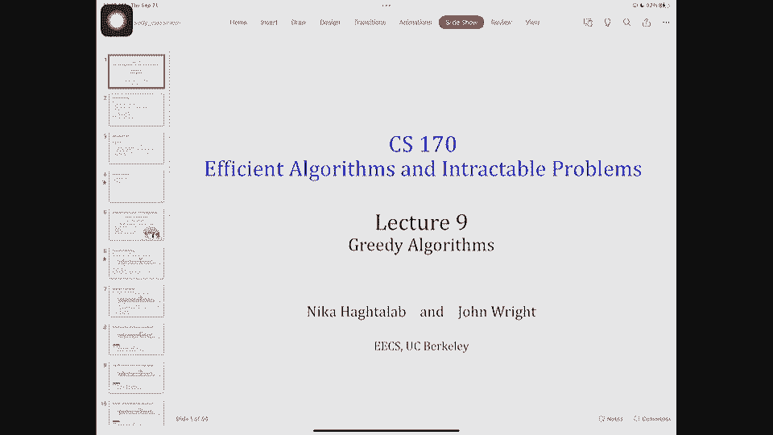
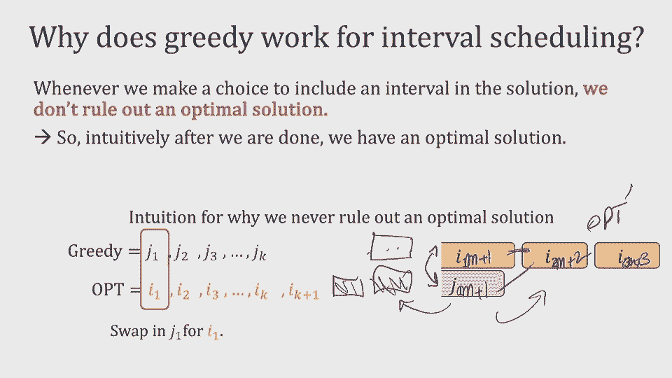
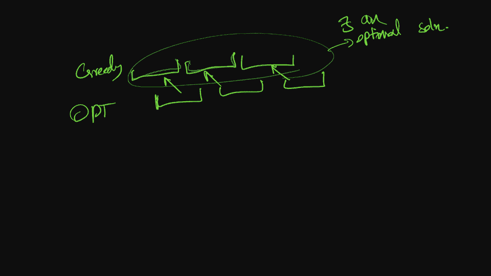
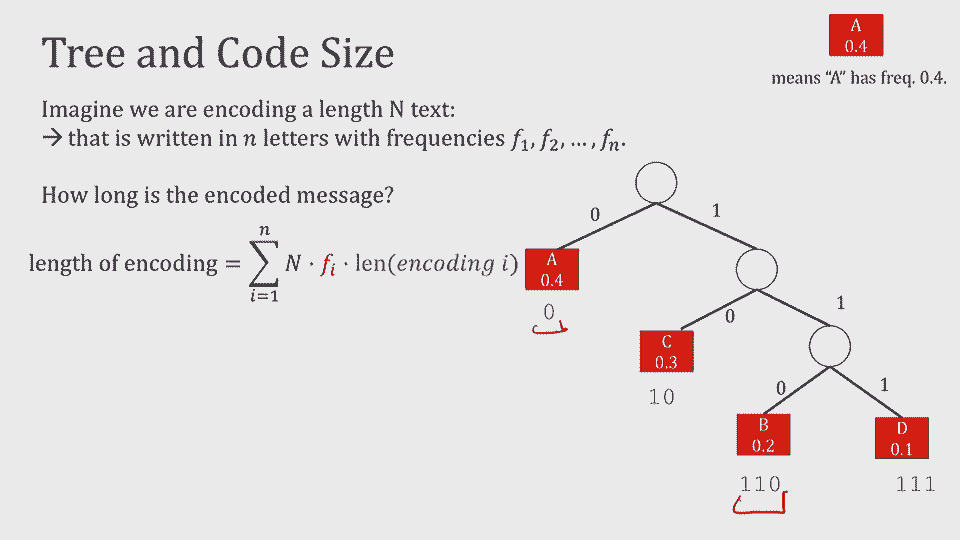

# 课程P9：贪心算法 🧠




在本节课中，我们将学习**贪心算法**的核心思想及其应用。贪心算法通过每一步选择当前看来最优的局部解，来逐步构建全局解。我们将通过几个经典问题来理解其工作原理和证明方法。

---

## 期中考试与课程安排 📅

期中考试即将到来，范围涵盖至第9讲，包括我们今天要讲的最小生成树等内容。相关作业也会发布，请大家做好准备。

作业发布时间因技术原因有所推迟，截止日期也相应调整。请大家合理安排时间，尽早完成作业，避免在截止日期前集中寻求帮助。

关于习题讨论课，我们将同时发布习题和密码保护的答案。密码将在周四公布，以鼓励大家积极参与讨论课。

---

## 回顾与引入 🔄

在之前的课程中，我们学习了图算法，如图的遍历（广度优先搜索、深度优先搜索）以及最短路径算法等。

今天，我们将学习一种不同的算法范式——**贪心算法**。这类算法在图上也有广泛应用。贪心算法的特点是：逐步构建解决方案，每一步都选择当前能带来最直接好处的选项，而无需考虑长远的未来影响。

贪心算法通常编码简单，但分析其正确性更具挑战性，因为我们需要证明每一步的局部最优选择最终能导向全局最优解。

---

## 应用一：区间调度 📊

区间调度（或称活动选择）问题描述如下：给定一组任务，每个任务有开始时间 `si` 和结束时间 `fi`。目标是选择一个最大的任务子集，使得其中任意两个任务的时间区间互不重叠。

### 贪心策略选择

面对这个问题，我们可能会考虑几种贪心策略：
1.  优先选择**持续时间最短**的任务。
2.  优先选择**开始时间最早**的任务。
3.  优先选择**结束时间最早**的任务。

让我们通过分析来找出正确的策略。

以下是几种策略的简要分析：
*   **最短任务优先**：可能选择一个很短的、但却与多个其他任务冲突的任务，从而限制了后续选择。
*   **最早开始时间优先**：可能选择一个开始早但持续时间很长的任务，从而占用了大量时间。
*   **最早结束时间优先**：选择最早结束的任务，可以为后续任务腾出更多空闲时间，这通常是更优的策略。

因此，正确的贪心策略是：**总是选择当前可用的、结束时间最早的任务**。

### 算法描述

基于上述策略，算法步骤如下：
1.  将所有任务按照结束时间从早到晚排序。
2.  初始化一个空集合用于存放选中的任务。
3.  遍历排序后的任务列表：
    *   如果当前任务与已选中集合中的任务都不冲突（即其开始时间不早于最后一个选中任务的结束时间），则将其加入集合。
4.  返回最终的任务集合。

算法核心代码逻辑如下：
```python
def interval_scheduling(intervals):
    # intervals 是 (start, end) 的列表
    intervals.sort(key=lambda x: x[1])  # 按结束时间排序
    selected = []
    last_end = -float('inf')
    
    for start, end in intervals:
        if start >= last_end:  # 不冲突
            selected.append((start, end))
            last_end = end
    return selected
```

### 正确性证明

我们使用归纳法来证明该贪心算法的最优性。

**归纳假设**：存在一个最优解，其前 `k` 个任务与贪心算法选择的前 `k` 个任务相同。

**归纳步骤**：
*   **基础情况**：当 `k=0` 时，显然成立。
*   **假设**：对于前 `m` 个任务，归纳假设成立。
*   **证明**：考虑第 `m+1` 个任务。设贪心算法选择的任务为 `J`，而某个最优解在此位置选择的任务为 `I`。
    *   如果 `J` 与 `I` 相同，则假设对 `m+1` 成立。
    *   如果 `J` 与 `I` 不同，由于贪心算法总是选结束时间最早的，所以 `J` 的结束时间不晚于 `I`。我们可以构造一个新的最优解：用 `J` 替换掉原最优解中的 `I`。因为 `J` 结束得更早，所以不会与后续任务产生新的冲突，且任务数量不变。因此，这个新解也是最优的，并且其前 `m+1` 个任务与贪心解一致。



通过归纳法，我们证明了贪心算法得到的解是最优的。

---



## 应用二：Horn公式可满足性 🧩

Horn公式是命题逻辑公式的一种特殊形式，由两种子句构成：
1.  **蕴含式子句**：形式为 `(P1 ∧ P2 ∧ ... ∧ Pk) → Q`，其中所有 `Pi` 和 `Q` 都是正文字（变量本身，而非其否定）。
2.  **纯否定子句**：形式为 `(¬P1 ∨ ¬P2 ∨ ... ∨ ¬Pk)`，即一系列负文字的析取。

Horn可满足性问题（Horn-SAT）是指：给定一个Horn公式，判断是否存在一组对变量的真值赋值，使得整个公式为真。

### 贪心算法

算法从一个保守的赋值开始（所有变量初始设为 `False`），然后逐步将某些变量设为 `True`。

算法步骤如下：
1.  循环检查所有蕴含式子句：
    *   如果找到一个子句，其前提（`P1...Pk`）都为 `True`，但结论（`Q`）为 `False`，那么为了满足该子句，**将 `Q` 设为 `True`**。
    *   重复此过程，直到没有这样的子句存在。
2.  检查所有纯否定子句：
    *   如果所有纯否定子句都被满足（即每个子句中至少有一个负文字对应的变量为 `False`），则当前赋值就是一个解。
    *   如果存在一个纯否定子句，其中所有变量都被赋值为 `True`，则该公式不可满足。

### 算法示例

考虑公式：
1.  `(W ∧ Y) → Z`
2.  `(X ∧ Z) → W`
3.  `X → Y`
4.  `X` (等价于 `True → X`)
5.  `¬W ∨ ¬X ∨ ¬Y`

算法运行过程：
*   初始：所有变量为 `False`。
*   检查子句4：前提为真，结论 `X` 为假。因此，将 `X` 设为 `True`。
*   检查子句3：前提 `X` 为真，结论 `Y` 为假。因此，将 `Y` 设为 `True`。
*   检查子句2：前提 `X` 和 `Z` (`Z`仍为假) 不都为真，跳过。但注意，子句1的前提 `W` 和 `Y` 不都为真，也跳过。然而，我们需要检查所有子句。实际上，在将 `X` 和 `Y` 设为真后，子句2的前提 `X` 为真，`Z` 为假，不触发动作。但让我们重新审视循环：我们需要持续扫描，直到没有子句触发。假设我们按顺序扫描，子句4和3已处理。现在看子句2：`X` 真，`Z` 假，不触发。子句1：`W` 假，`Y` 真，不触发。循环似乎结束？但此时赋值 `{X=True, Y=True}` 不满足子句2，因为 `X=True, Z=False` 使得前提为假，子句为真（`False → W` 为真），所以是满足的。但我们的算法描述是“找到前提真、结论假的子句”，目前没有。然而，我们忽略了算法应持续进行，直到稳定。实际上，在这个例子中，赋值 `{X=True, Y=True}` 下，所有蕴含子句都被满足（因为前提不都为真或结论为真）。现在进入步骤2，检查纯否定子句5：`¬W ∨ ¬X ∨ ¬Y`，此时 `W=False, X=True, Y=True`，该子句为真（因为 `¬W` 为真）。所以算法输出当前赋值 `{X=True, Y=True, W=False, Z=False}` 作为一个解。

### 正确性证明思路

证明的核心在于：**贪心算法设置为 `True` 的变量，在任何可满足的解中也必须为 `True`**。

我们通过循环次数进行归纳：
*   **基础情况**：循环0次，没有变量被设为 `True`，结论成立。
*   **归纳假设**：前 `m` 次循环中被设为 `True` 的变量，在任何可满足解中也为真。
*   **归纳步骤**：考虑第 `m+1` 次循环，由于某个蕴含式子句 `(P1∧...∧Pk)→Q` 的前提为真、结论为假，算法将 `Q` 设为真。根据归纳假设，前提中的变量 `Pi` 在任何可满足解中也为真。为了使该蕴含式子句为真，`Q` 在任何可满足解中也必须为真。因此，归纳步骤成立。

由此，如果贪心算法最终得到一个赋值并满足所有纯否定子句，那么它就是一个可满足解。反之，如果算法因某个纯否定子句无法满足而失败，那么根据上述性质，任何可满足解也必须将其中所有变量设为真，从而导致该子句为假，产生矛盾，故原公式不可满足。

---

## 应用三：霍夫曼编码（简介） 💻

在数据压缩中，我们希望用尽可能短的比特串来表示字符。固定长度编码（如ASCII）简单但效率不高。如果字符出现频率不同，我们可以为高频字符分配短码，为低频字符分配长码，从而减少整体编码长度。

但编码必须是**唯一可解码**的。**前缀码**是一种确保唯一可解码的编码方式：任何字符的编码都不是另一个字符编码的前缀。前缀码可以完美地用一棵二叉树来表示：
*   每个叶子节点代表一个字符。
*   字符的编码是从根节点到该叶子路径上的“0”（左分支）和“1”（右分支）序列。

### 问题形式化

给定字符集及其频率，目标是构建一棵二叉树（即一个前缀码），使得编码后的总比特数最少。总比特数可表示为：
`总成本 = Σ (字符频率 × 该字符在树中的深度)`

我们的目标是找到成本最小的二叉树。

### 贪心策略：霍夫曼算法

霍夫曼算法是一种构建最优前缀码的贪心算法，其核心思想是**反复合并频率最低的两棵子树**。

算法步骤：
1.  将每个字符看作一棵单节点的树，其权重即为频率。
2.  当森林中不止一棵树时：
    a. 选择当前权重最小的两棵树 `T1` 和 `T2`。
    b. 创建一棵新树 `T`，以 `T1` 和 `T2` 作为左右子树。`T` 的权重为 `T1` 和 `T2` 权重之和。
    c. 将 `T1` 和 `T2` 从森林中移除，加入新树 `T`。
3.  最后剩下的那棵树就是最优的编码树。

我们将在下节课详细讲解霍夫曼算法的具体执行过程和正确性证明。

---

## 总结 ✨

本节课我们一起学习了贪心算法的基本思想及其在三个经典问题中的应用：
1.  **区间调度**：通过选择结束时间最早的任务，并利用归纳法证明其最优性。
2.  **Horn公式可满足性**：通过保守赋值和逐步推导，证明了贪心算法能找到解或判断不可满足。
3.  **霍夫曼编码**：引入了最优前缀码问题，并简要介绍了通过合并最小频率子树构建最优树的霍夫曼算法。



贪心算法的证明模式往往遵循一个共同结构：证明在每一步，贪心选择都不会破坏达成某个最优解的可能性。我们通常使用归纳法并利用问题的特定结构来完成证明。