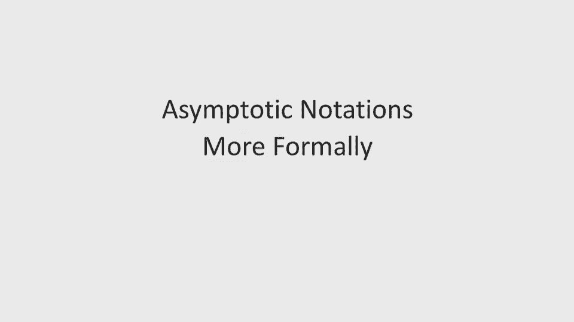
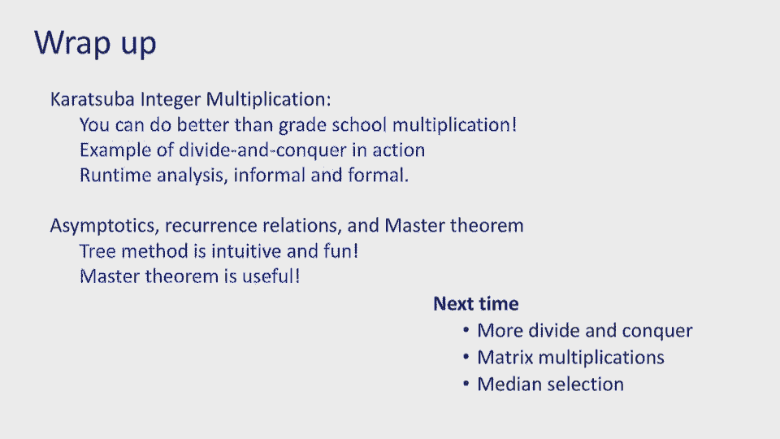

# 2：Lec2 分而治之（第一部分）🚀

在本节课中，我们将要学习分而治之算法的核心思想，并通过改进整数乘法算法来深入理解其应用。我们将从回顾上次课的内容开始，然后介绍一种更高效的算法——Karatsuba算法，并学习如何用大O符号和递归关系来正式分析算法性能。

---

## 课程公告与回顾 📢

上一节我们介绍了分而治之的基本概念，并将其应用于整数乘法。我们发现，简单地将问题一分为四并不能带来性能提升，其复杂度依然是 **O(n²)**。

本节中，我们将看看如何通过一个巧妙的技巧来减少子问题的数量，从而击败 **O(n²)**。

以下是几项课程安排通知：
*   讨论部分从今晚开始，请查看课程网站时间表。
*   作业一已发布，下周二（劳动节后）截止。
*   课程邮箱 CS 170 将有更多助教参与管理。
*   本节课将尝试在中间进行一次短暂休息。

---

## 击败 O(n²)：Karatsuba 算法 🧠

我们上次的尝试失败了，因为它产生了4个子问题。Karatsuba 算法的核心思想是：能否用**三次**乘法来完成同样的工作？

### 算法思路
假设我们要计算两个 n 位数 X 和 Y 的乘积。我们将每个数分成两半：
*   `X = A * 10^(n/2) + B`
*   `Y = C * 10^(n/2) + D`

我们需要的乘积是：
`X * Y = A*C * 10^n + (A*D + B*C) * 10^(n/2) + B*D`

关键在于，中间项 `(A*D + B*C)` 可以通过一次额外的乘法和一些加减法得到，而无需直接计算两次乘法。我们计算以下三次乘法：
1.  `Q1 = A * C`
2.  `Q2 = B * D`
3.  `Q3 = (A + B) * (C + D)`

可以验证：
`(A*D + B*C) = Q3 - Q1 - Q2`

这样，我们就把问题规模为 n 的乘法，转化为了 **3个** 规模约为 **n/2** 的乘法，以及一些 **O(n)** 级别的加减法和移位操作。

### 复杂度分析
现在，我们使用递归树方法来分析这个算法的复杂度。

以下是递归树的关键参数：
*   **层数 (深度)**：每次将规模除以2，直到为1。所以深度为 **log₂n**。
*   **第 t 层的问题规模**：`n / 2^t`
*   **第 t 层的问题数量**：`3^t`
*   **底层（一位数乘法）的数量**：`3^(log₂n) = n^(log₂3) ≈ n^1.585`

因此，Karatsuba 算法的时间复杂度约为 **O(n^1.585)**，成功击败了 **O(n²)**。

> **注意**：我们目前只计算了底层乘法操作的数量。在接下来的正式分析中，我们将把每一层的其他操作（加、减、移位）也考虑进去。

---

## 算法分析基础：大O与大Ω符号 📈

在深入分析递归之前，我们需要巩固算法分析的基本工具——渐近符号。

### 大O符号 (Upper Bound)
我们说一个算法的运行时间 **T(n)** 是 **O(g(n))**，如果存在正常数 **c** 和 **n₀**，使得对于所有 **n > n₀**，都有：
`T(n) ≤ c * g(n)`

**这意味着**：`g(n)` 是 `T(n)` 的一个**渐近上界**。我们关心的是当 n 很大时的增长趋势，因此常数因子和低阶项可以被忽略。

**示例**：证明 `T(n) = 0.1n² + 2n + 2` 是 `O(n²)`。
*   **思路**：找到常数 c 和 n₀，使得 `0.1n² + 2n + 2 ≤ c*n²` 对所有足够大的 n 成立。
*   **证明**：取 `c=1`, `n₀=10`。当 `n>10`时，`0.1n² + 2n + 2 ≤ 0.1n² + 0.2n² + 0.02n² = 0.32n² ≤ n²`。因此得证。

### 大Ω符号 (Lower Bound)
我们说 **T(n)** 是 **Ω(g(n))**，如果存在正常数 **c** 和 **n₀**，使得对于所有 **n > n₀**，都有：
`T(n) ≥ c * g(n)`

**这意味着**：`g(n)` 是 `T(n)` 的一个**渐近下界**。

**示例**：证明 `T(n) = 0.1n² + 2n + 2` 是 `Ω(log n)`。
*   **思路**：找到常数 c 和 n₀，使得 `0.1n² + 2n + 2 ≥ c*log n` 对所有足够大的 n 成立。由于 n² 的增长速度远快于 log n，这显然是成立的（可作为练习）。

### 大Θ符号 (Tight Bound)
如果 `T(n)` 同时是 `O(g(n))` 和 `Ω(g(n))`，那么我们说 `T(n)` 是 **Θ(g(n))**。这表示 `g(n)` 是一个**紧确的渐近界**。

---

## 正式分析：递归与主定理 🌳

现在，我们回到 Karatsuba 算法，并进行更正式的分析。我们需要考虑每一层递归中的全部工作。

### 建立递归关系
设 `T(n)` 为计算两个 n 位数乘积所需的时间。根据算法描述：
1.  我们将问题分解为 **3个** 规模为 **n/2** 的子问题。
2.  分解与合并步骤（包括加法、减法、移位）需要 **O(n)** 的时间。我们假设这个工作量上界为 `c * n`（c 为某个常数）。

因此，我们得到递归式：
`T(n) = 3 * T(n/2) + c * n`
并且 `T(1) = d`（某个常数，表示一位数乘法的耗时）。

### 递归树解法
我们可以用递归树来求解这个递归式：

以下是递归树各层的工作量计算：
*   **第 0 层 (根)**: 1 个问题，工作量 = `c * n`
*   **第 1 层**: 3 个子问题，每个规模 n/2，工作量 = `3 * c * (n/2) = (3/2) * c * n`
*   **第 2 层**: 9 个子问题，每个规模 n/4，工作量 = `9 * c * (n/4) = (9/4) * c * n`
*   **第 t 层**: `3^t` 个子问题，每个规模 `n/(2^t)`，工作量 = `3^t * c * [n/(2^t)] = c * n * (3/2)^t`

树的总深度为 `log₂n`。总工作量 `T(n)` 是各层工作量之和：
`T(n) = c * n * Σ（从 t=0 到 log₂n） (3/2)^t`

求和项是一个几何级数。根据几何级数的性质：
*   当公比 `r > 1`（此处 `r = 3/2`）时，级数和主要由**最后一项**主导。
*   最后一项为 `(3/2)^(log₂n) = n^(log₂(3/2)) = n^(log₂3 - 1)`。

因此，总工作量为：
`T(n) = Θ( n * n^(log₂3 - 1) ) = Θ( n^(log₂3) ) ≈ Θ( n^1.585 )`

这正式验证了我们之前的结论。

### 主定理：递归分析的利器
对于形式为 `T(n) = a * T(n/b) + O(n^d)` 的递归式（其中 a ≥ 1, b > 1, d ≥ 0），其解可以由**主定理**直接给出：

主定理的三种情况：
1.  如果 `a > b^d`，则 `T(n) = Θ(n^(log_b a))`。（工作量由叶节点主导）
2.  如果 `a = b^d`，则 `T(n) = Θ(n^d * log n)`。（各层工作量平衡）
3.  如果 `a < b^d`，则 `T(n) = Θ(n^d)`。（工作量由根节点主导）

在 Karatsuba 算法的递归式 `T(n) = 3T(n/2) + Θ(n)` 中：
*   `a = 3`, `b = 2`, `d = 1`
*   因为 `3 > 2^1`，属于情况1。
*   所以 `T(n) = Θ(n^(log₂3))`，与我们的详细分析结果一致。

主定理提供了快速分析分治算法复杂度的强大工具。

---

## 总结与预告 🎯

本节课中我们一起学习了：
1.  **Karatsuba 算法**：通过将4次乘法减少为3次，我们设计出了复杂度为 **O(n^1.585)** 的整数乘法算法，击败了朴素算法的 **O(n²)**。
2.  **渐近符号**：我们回顾了大O、大Ω和大Θ符号的正式定义及其在算法分析中的作用。
3.  **递归分析**：我们使用**递归树方法**详细分析了 Karatsuba 算法的复杂度，并介绍了能快速求解一类递归式的**主定理**。

下一节课，我们将继续探索分而治之的更多应用实例，并深化对递归分析的理解。