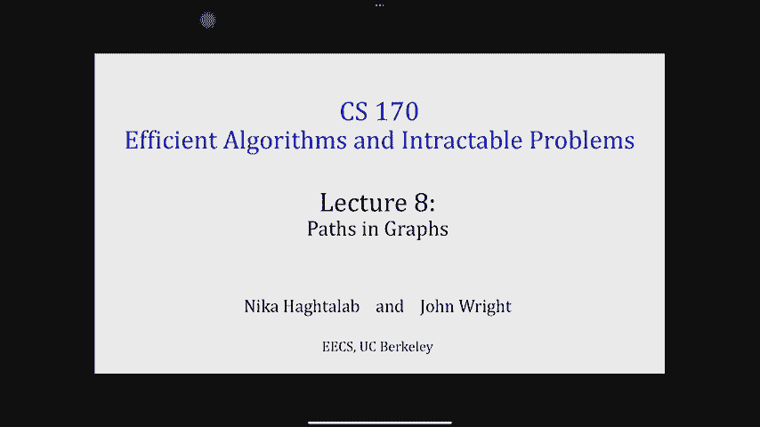
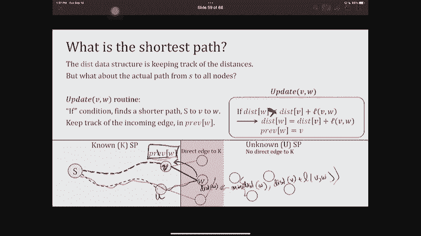
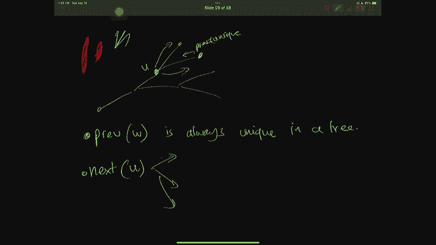
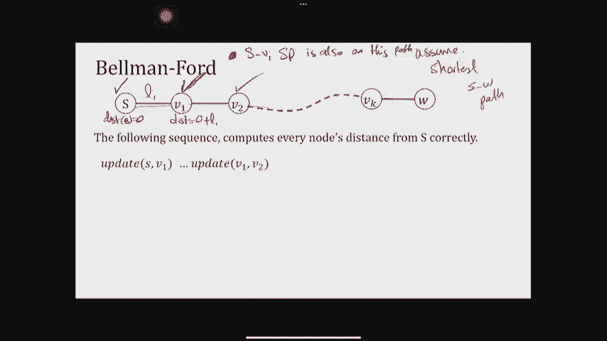

# 8：图论中的路径算法 🧭




在本节课中，我们将学习图论中的路径问题，特别是如何从一个源点出发，找到到达图中其他所有节点的最短路径。我们将从最简单的未加权图开始，逐步深入到处理带权重的图，并最终探讨如何处理包含负权边的图。我们将学习三种核心算法：广度优先搜索（BFS）、Dijkstra算法和Bellman-Ford算法。

## 回顾与引入

上一节我们介绍了深度优先搜索（DFS）算法及其应用，如拓扑排序和寻找强连通分量。本节中，我们来看看另一种完全不同的图探索方法，其目标是寻找最短路径，而不是深度优先的遍历。

最短路径问题在现实生活中无处不在，例如校园导航、网络数据包路由等。其核心是：给定一个图和一个源点 `s`，我们需要计算出从 `s` 到图中**每一个其他顶点** `u` 的最短路径长度 `d(s, u)`。这就是**单源最短路径**问题。

根据图中边的权重特性，我们需要使用不同的算法：
*   **未加权图**（所有边长度视为1）：使用**广度优先搜索（BFS）**。
*   **带正权重的图**：使用**Dijkstra算法**。
*   **带任意权重（可负）但无负权环的图**：使用**Bellman-Ford算法**。

这三种算法一个比一个更通用，但效率也相应降低。选择合适的算法至关重要。

---

## 广度优先搜索（BFS）🚀

对于所有边长度相同（或视为1）的图，BFS是寻找单源最短路径的高效算法。其核心思想是“涟漪式”探索：先探索距离源点为1步的所有邻居，然后是2步的邻居，依此类推。

以下是BFS算法的伪代码描述：

```python
def BFS(graph G, vertex s):
    # 初始化距离数组，所有节点距离设为无穷大
    for each vertex v in G:
        dist[v] = infinity
    dist[s] = 0

    # 使用队列管理待探索节点
    initialize queue Q
    Q.enqueue(s)

    while Q is not empty:
        u = Q.dequeue()          # 取出队首节点
        for each neighbor v of u:
            if dist[v] == infinity: # 如果v尚未被发现
                dist[v] = dist[u] + 1 # 更新v的距离
                Q.enqueue(v)        # 将v加入队列，以待后续探索其邻居
    return dist
```

### BFS算法运行示例

假设我们从源点 `S` 开始运行BFS。
1.  初始状态：`dist[S]=0`，其他节点距离为无穷大。队列 `Q = [S]`。
2.  处理 `S`：将其邻居 `A, C, D, E` 的距离更新为1，并加入队列。`Q = [A, C, D, E]`。
3.  处理 `A`：其邻居 `B` 距离为无穷大，更新 `dist[B]=2`，并入队。`Q = [C, D, E, B]`。
4.  依次处理 `C, D, E`：它们的邻居都已被访问过，无更新。
5.  处理 `B`：其邻居 `F` 距离为无穷大，更新 `dist[F]=3`，并入队。
6.  处理 `F`：无未访问邻居。队列空，算法结束。

最终，`dist` 数组存储了从 `S` 到所有节点的最短距离。

### BFS的正确性与时间复杂度

BFS的正确性基于一个简单事实：当它第一次访问一个节点时，所使用的路径必然是到达该节点的最短路径（在边权为1的前提下）。其时间复杂度为 **O(n + m)**，其中 `n` 是顶点数，`m` 是边数。这是因为每个节点入队、出队一次，每条边被检查一次。

**注意**：BFS**不能**正确处理边权不同的图，更无法处理负权边。

---

## Dijkstra算法 ⚖️

当图中的边具有**正的、不同的权重**时，我们需要Dijkstra算法。它扩展了BFS的思想，但每次选择“当前已知最短距离估计值最小”的节点进行最终确认。

### 核心思想与正确性基础

Dijkstra算法依赖于一个关键性质：**最短路径的子路径也是最短路径**。形式化地说，如果 `P` 是从 `s` 到 `v` 的最短路径，且 `w` 是 `P` 上的一个点，那么 `P` 中从 `s` 到 `w` 的部分也是 `s` 到 `w` 的最短路径。

算法维护两个集合：
*   **已知节点集 (K)**：已确定最短路径的节点。
*   **未知节点集 (U)**：尚未确定的节点。

算法不断从 `U` 中取出距离估计值最小的节点加入 `K`，并利用它来更新其邻居在 `U` 中的距离估计值。

### 算法描述

以下是Dijkstra算法的伪代码：

```python
def Dijkstra(graph G, vertex s):
    # 初始化
    for each vertex v in G:
        dist[v] = infinity
        prev[v] = None          # 用于回溯重建路径
    dist[s] = 0

    # 将所有节点加入优先队列（按dist值排序）
    initialize priority queue Q with all vertices
    while Q is not empty:
        u = Q.extract_min()     # 取出dist最小的节点u
        for each neighbor v of u:
            # 尝试松弛操作：找到更短的路径就更新
            if dist[u] + length(u, v) < dist[v]:
                dist[v] = dist[u] + length(u, v)
                prev[v] = u
                Q.decrease_key(v, dist[v]) # 更新v在优先队列中的优先级
    return dist, prev
```

### 算法运行示例与路径重建

假设我们有一个带权图，从 `A` 运行Dijkstra算法。
1.  初始：`dist[A]=0`，其他为无穷大。`Q` 包含所有节点。
2.  取出 `A`（最小dist=0）。更新邻居 `B(4)`, `C(2)`。
3.  取出 `C`（最小dist=2）。通过 `C` 更新 `B(3)`, `D(7)`, `E(6)`。
4.  取出 `B`（最小dist=3）。通过 `B` 更新 `D(5)`, `E(6)`。
5.  取出 `D`（最小dist=5）。无更新。
6.  取出 `E`（最小dist=6）。无更新。算法结束。

通过 `prev` 数组可以重建最短路径。例如，到 `E` 的最短路径：`prev[E]=B`, `prev[B]=C`, `prev[C]=A`，因此路径为 `A -> C -> B -> E`。

### 时间复杂度

Dijkstra算法的时间复杂度取决于优先队列的实现：
*   使用简单数组：**O(n² + m)**。
*   使用二叉堆：**O((n + m) log n)**。
*   使用更高级的斐波那契堆：**O(n log n + m)**。

**注意**：Dijkstra算法**不能**处理负权边，因为它基于“一旦节点被加入已知集，其距离不再被更新”的假设，而负权边可能破坏这一假设。

---



## 处理负权边与Bellman-Ford算法 🌀



当图中存在**负权边**，但**不存在负权环**（环上总权重为负）时，我们需要Bellman-Ford算法。负权环会导致可以无限绕行以减小路径长度，使得最短路径问题无解。

### 算法直觉：反复松弛

Bellman-Ford算法的核心操作是“松弛”（Relax）：对于一条边 `(u, v)`，检查是否可以通过 `u` 对 `v` 的距离估计进行改进。
`relax(u, v): if dist[u] + l(u,v) < dist[v]: dist[v] = dist[u] + l(u,v)`

算法反复对所有边进行松弛操作。为什么有效？考虑一条从 `s` 到 `v` 的最短路径，它最多包含 `n-1` 条边。在第 `i` 轮对所有边进行松弛后，算法保证了所有最多使用 `i` 条边的最短路径已被找到。

### 算法描述

以下是Bellman-Ford算法的伪代码：

```python
def BellmanFord(graph G, vertex s):
    # 初始化
    for each vertex v in G:
        dist[v] = infinity
        prev[v] = None
    dist[s] = 0

    # 进行 n-1 轮松弛
    for i = 1 to n-1:
        for each edge (u, v) in G:
            if dist[u] + length(u, v) < dist[v]:
                dist[v] = dist[u] + length(u, v)
                prev[v] = u

    # 检查是否存在负权环：如果还能松弛，则说明有负权环
    for each edge (u, v) in G:
        if dist[u] + length(u, v) < dist[v]:
            return “图中存在负权环”
    return dist, prev
```

### 时间复杂度与说明

Bellman-Ford算法的时间复杂度为 **O(n * m)**，因为它需要进行 `n-1` 轮，每轮遍历所有 `m` 条边。这比Dijkstra算法慢，但它是处理带负权边图的最通用算法之一。

算法最后一部分用于检测负权环。如果在完成 `n-1` 轮松弛后，还能继续松弛任何一条边，则证明图中存在从源点可达的负权环。

---

## 总结 🎯

本节课我们一起学习了图论中寻找单源最短路径的三种核心算法：

1.  **广度优先搜索 (BFS)**：适用于所有边权相同（或未加权）的图。采用队列实现，按距离源点的“层数”逐层探索，时间复杂度为 **O(n + m)**。
2.  **Dijkstra算法**：适用于边权均为**正数**的图。采用优先队列，每次处理当前距离估计最小的节点，时间复杂度取决于优先队列的实现，最优可达 **O(n log n + m)**。它**不能处理负权边**。
3.  **Bellman-Ford算法**：适用于包含**负权边但无负权环**的图。通过对所有边进行 `n-1` 轮松弛操作来逐步逼近最短路径，并能检测负权环，时间复杂度为 **O(n * m)**。



这三种算法构成了解决单源最短路径问题的基础工具链。理解它们各自的前提条件、核心思想和适用范围，对于在正确场景下选用正确算法至关重要。