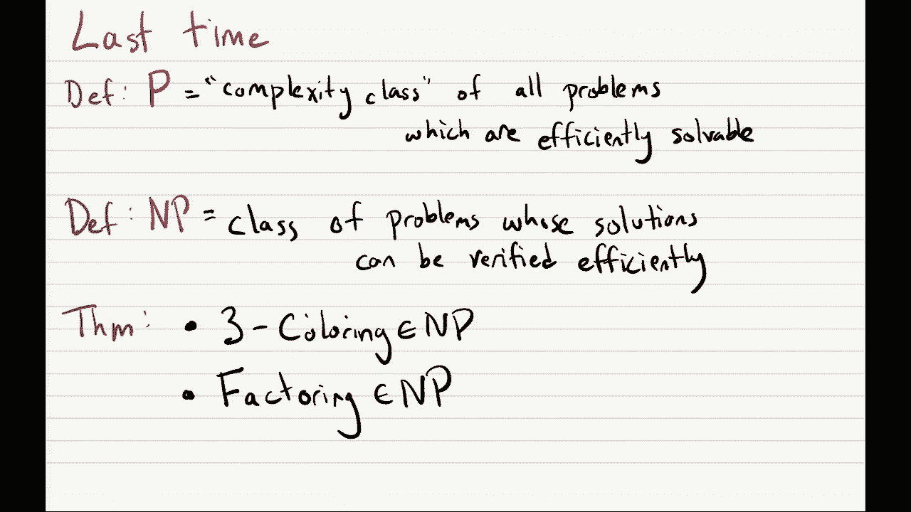
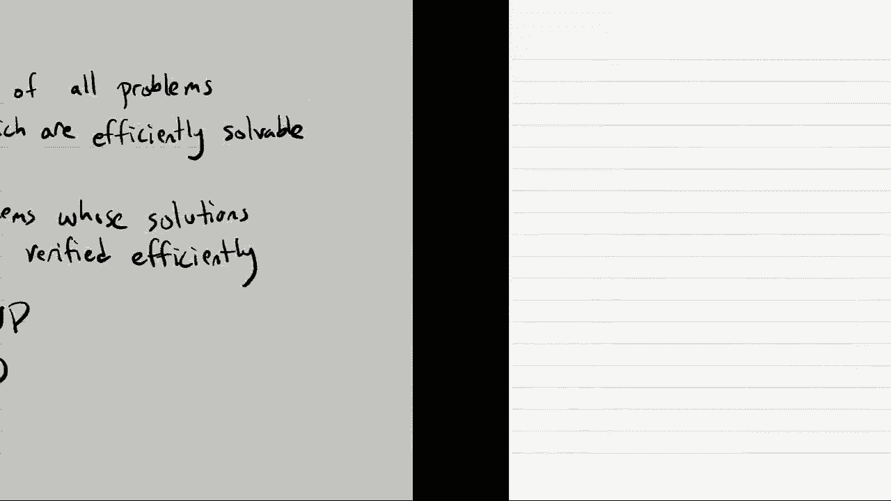
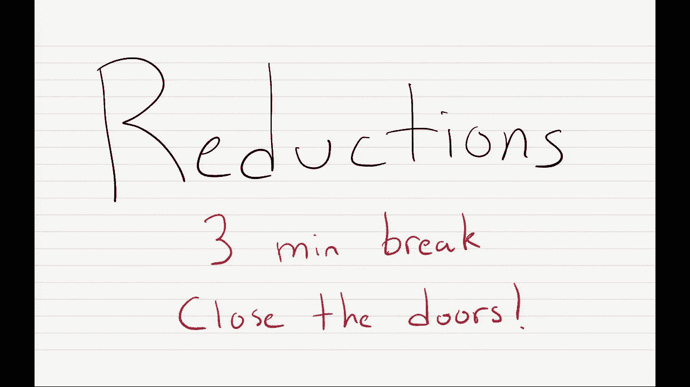
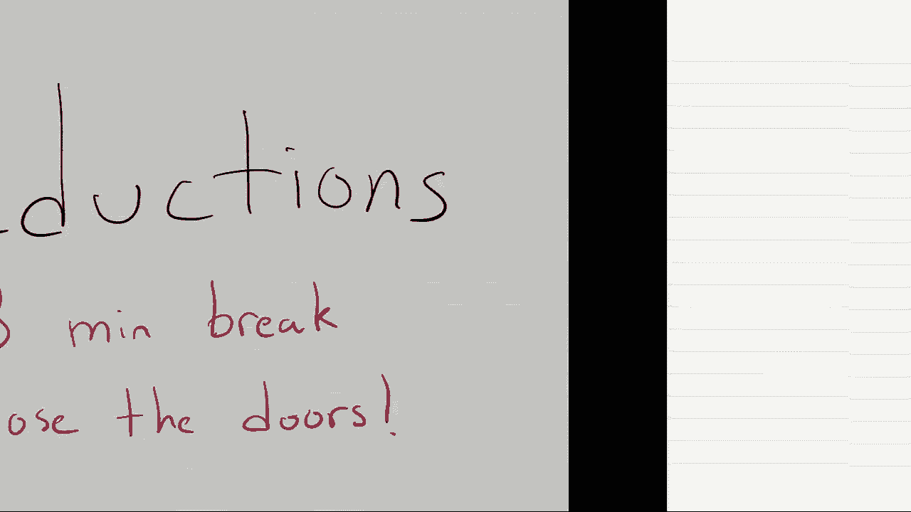
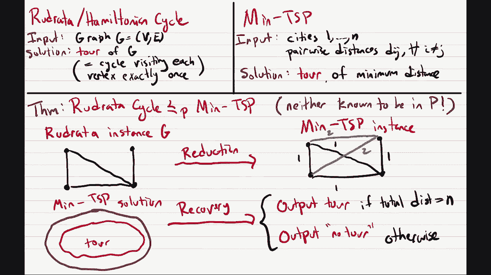

# 19：Lec19 归约与二分图匹配 🧩

在本节课中，我们将学习两个核心概念：**归约** 和 **二分图匹配**。我们将首先回顾P与NP类，然后深入探讨如何通过“归约”来比较不同计算问题的难度，最后介绍二分图匹配问题。

---

## 1. 回顾：P类与NP类

上一节我们介绍了P类和NP类这两个理论计算机科学中最重要的概念。本节中，我们来看看几个具体的NP问题。

*   **P类**：指所有可以在**多项式时间**内有效解决的问题集合。形式化地说，一个问题属于P，如果存在一个算法在 **O(n^k)** 时间内解决它，其中k是某个常数。
*   **NP类**：指所有其**解可以在多项式时间内被验证**的问题集合。即使我们可能无法高效地找到解，但如果有人给我们一个候选解，我们可以在多项式时间内检查它是否正确。

以下是几个已被证明属于NP的问题示例：

1.  **三染色问题**：给定一个图，判断是否能用三种颜色为其顶点着色，使得任意相邻顶点颜色不同。
    *   **验证**：给定一个着色方案，只需检查每条边的两个端点颜色是否不同即可，这可以在多项式时间内完成。
2.  **因数分解问题**：给定一个整数，找出它的一个非平凡因子。
    *   **验证**：给定一个候选因子，只需进行除法运算即可验证，这可以在多项式时间内完成。

---

## 2. 更多NP问题示例

现在，我们来看另外两个重要的NP问题。

### 2.1 鲁德拉循环问题（又称哈密顿循环问题）🔁

**问题描述**：给定一个无向图 G，判断图中是否存在一个**循环**，该循环恰好访问每个顶点一次并回到起点。

*   **平凡算法**：尝试所有顶点的排列，共 **n!** 种，检查每种排列是否构成图中的一条路径。这是一个指数时间算法。
*   **验证算法**：给定一个候选解（即一个顶点序列），验证者可以轻松地在多项式时间内检查：
    1.  该序列是否包含每个顶点恰好一次。
    2.  序列中每一对相邻的顶点（包括首尾顶点）在图G中是否都有边相连。
    这个过程可以在 **O(n)** 或 **O(n²)** 时间内完成（取决于图的表示方式），因此该问题属于NP。

一个有趣的现象是，如果将问题改为寻找一个访问**每条边**恰好一次的循环（欧拉循环），则该问题存在多项式时间算法（检查所有顶点的度是否为偶数且图是否连通）。这说明了问题定义的微小改动可能极大改变其计算复杂度。

### 2.2 旅行商问题（TSP）的三个版本 🧳

旅行商问题有多个版本，其复杂度和所属类别不同：

1.  **优化版本（Min TSP）**：给定城市间的距离，找到总距离最短的环游（访问每个城市一次并返回起点）。
    *   据信**不属于NP**，因为验证一个环游是否为“最短”的，需要与所有可能的环游比较，没有已知的多项式时间验证方法。
2.  **搜索版本（Search TSP）**：给定城市间的距离和一个预算B，找到总距离**不超过B**的一个环游。
    *   属于**NP**。给定一个候选环游，只需将其各段距离相加，检查总和是否 ≤ B 即可，这是多项式时间可验证的。
3.  **判定版本（Decision TSP）**：给定城市间的距离和一个预算B，判断**是否存在**总距离不超过B的环游。
    *   也属于**NP**。验证方式与搜索版本类似。

尽管Min TSP可能不属于NP，但如果我们能解决Search TSP，就可以通过二分搜索预算B来找到最短环游，从而解决Min TSP。这说明Search TSP至少和Min TSP一样“难”。

---

## 3. P ⊆ NP 与问题世界地图

一个重要的结论是：**P类问题是NP类问题的子集**（P ⊆ NP）。也就是说，任何可以有效解决的问题，其解也必然可以有效地被验证。

**论证示例（最小生成树MST）**：
MST问题已知存在多项式时间算法（如Kruskal或Prim算法），因此属于P。为了证明它也属于NP，我们可以构造一个验证算法：
1.  输入：图G和一棵声称是最小生成树的树T。
2.  验证步骤：
    *   首先检查T是否是G的一棵生成树（连通所有顶点且无环）。
    *   然后，运行一个已知的MST算法（如Kruskal）得到一棵最小生成树 T*。
    *   最后，比较T和T*的总权重。如果相等，则T确实是一棵最小生成树。
由于MST算法是多项式时间的，整个验证过程也是多项式时间的，因此MST ∈ NP。

基于以上讨论，我们可以描绘出计算问题的世界地图：
*   一个大圆圈代表**NP类**，包含许多我们关心但可能很难解决的问题（如三染色、Search TSP、哈密顿循环）。
*   内部一个小圆圈代表**P类**，包含我们已经知道如何高效解决的问题（如MST、最短路径）。
*   还有一些问题被认为在**NP之外**，如停机问题（不可判定），以及像Min TSP这样的优化问题（据信不属于NP）。

理论计算机科学的核心开放问题就是：**P 是否等于 NP？** 如果相等，意味着所有NP问题都能高效解决；如果不相等，则某些NP问题本质上是困难的。

---

## 4. 归约：比较问题的难度 🧠

为了更精细地比较NP内部问题的难度，我们引入“归约”这一强大工具。

**定义（多项式时间归约）**：我们说问题A可以**多项式时间归约**到问题B（记作 A ≤ₚ B），如果存在一个多项式时间的算法，能够将A的任意实例转化为B的一个实例，并且能将B实例的解转化回A实例的解。

**直观理解**：如果 A ≤ₚ B，那么“解决B的难度”至少和“解决A的难度”一样大。因为一旦我们有了解决B的高效算法，就可以通过上述转化过程，高效地解决A。

**归约的结构**：
1.  **归约算法**：将问题A的输入，高效地转化为问题B的输入。
2.  **B的求解器**：对转化后的输入运行问题B的算法（我们假设它存在，但不一定是多项式时间）。
3.  **恢复算法**：将问题B的输出，高效地转化回问题A的解。

整个链条中，只有第2步依赖于问题B的算法。归约的意义在于：**如果我们未来发现了问题B的多项式时间算法，那么问题A也自动拥有了多项式时间算法。**

---

## 5. 归约实例：从哈密顿循环到TSP 🛠️

让我们看一个具体的归约例子：将**哈密顿循环问题（Rudrata Cycle）** 归约到**Min TSP问题**。

*   **目标**：证明 Rudrata Cycle ≤ₚ Min TSP。
*   **归约算法**：
    *   给定一个哈密顿循环的实例：一个无向图 G = (V, E)，有 n 个顶点。
    *   构造一个Min TSP实例：创建一个包含所有|V|个城市的完全图。对于任意两个城市u和v：
        *   如果 (u, v) 是原图G中的边，则设置距离为 **1**。
        *   如果 (u, v) 不是原图G中的边，则设置距离为 **2**（或任何一个大于n的数，如n+1）。
*   **恢复算法**：
    *   得到Min TSP的解（一个环游及其总距离L）。
    *   如果总距离 **L = n**，那么这个环游在原图G中只使用了距离为1的边，即它构成了G的一个哈密顿循环。输出这个循环。
    *   如果总距离 **L > n**，则说明该环游至少使用了一条距离为2的边，这意味着原图G中不存在哈密顿循环。输出“无解”。

**为什么正确？**
*   如果G有哈密顿循环，那么在TSP实例中就存在一个总距离恰好为n的环游（只走原图的边）。
*   如果G没有哈密顿循环，那么TSP实例中的任何环游都至少要走一条“新加的边”（距离为2），因此总距离至少为 n+1。
因此，通过求解这个特定的TSP实例，我们就能知道原图G是否有哈密顿循环。这个转化过程（构造新图、解释结果）显然是多项式时间的，从而完成了归约。

这个归约表明，Min TSP至少和哈密顿循环问题一样难。因为如果某天有人找到了Min TSP的多项式时间算法，我们就可以立即用它来解决哈密顿循环问题。

---

## 6. 总结

本节课中我们一起学习了：
1.  **回顾了P与NP**：P是高效可解的问题类，NP是高效可验证的问题类，并且 P ⊆ NP。
2.  **分析了更多NP问题**：如哈密顿循环和旅行商问题的不同版本。
3.  **引入了归约的概念**：归约是衡量和比较问题计算难度的关键工具。如果 A ≤ₚ B，则B至少和A一样难。
4.  **完成了一个归约实例**：将哈密顿循环问题归约到旅行商问题，展示了如何使用归约来建立问题间的难度关系。

归约是理解NP完全性理论的基础，在接下来的课程中，我们将利用这一工具探索NP中最难的一类问题——NP完全问题。