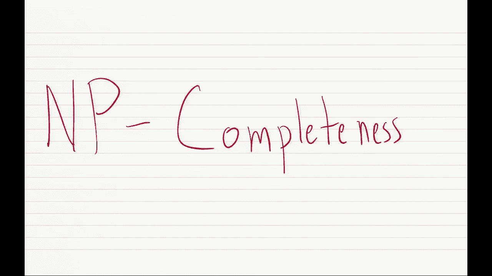
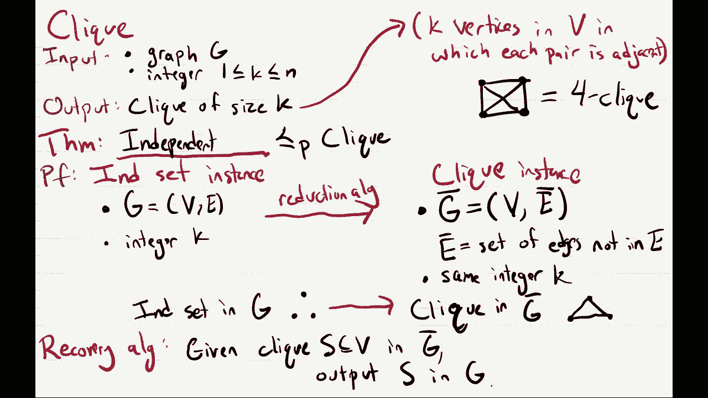
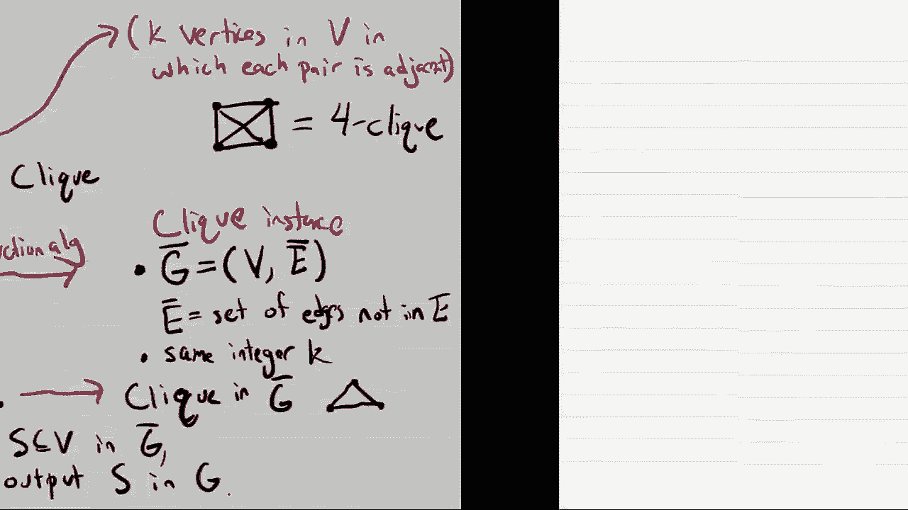
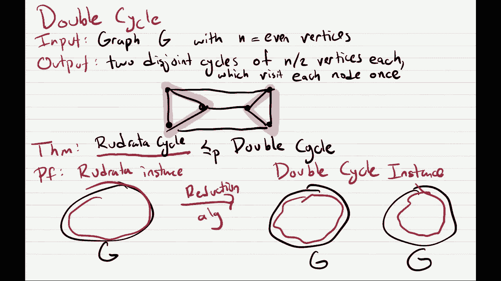

# 21：NP完全性理论 🧩

在本节课中，我们将学习计算复杂性理论中的一个核心概念——NP完全性。我们将通过一个具体问题（独立集问题）来理解如何证明一个问题是NP难的，并最终是NP完全的。课程将涵盖从已知的NP完全问题（如3-SAT）到目标问题的归约过程，并详细讲解归约算法与恢复算法的设计与证明。

---

## 概述

NP完全性理论帮助我们理解哪些计算问题本质上是“困难”的，即可能不存在高效的多项式时间算法。本节课我们将聚焦于独立集问题，并展示如何通过从3-SAT问题归约来证明它是NP完全的。理解这一证明过程是掌握NP完全性概念的关键。

---

## 独立集问题

首先，我们明确独立集问题的定义。给定一个图 `G`（包含 `n` 个顶点和 `m` 条边）和一个整数 `k`（`1 ≤ k ≤ n`），我们需要判断图中是否存在一个大小为 `k` 的独立集。独立集是指图中一个顶点的子集，其中任意两个顶点之间都没有边直接相连。

一个解决此问题的自然算法是尝试所有大小为 `k` 的顶点子集，并检查每个子集是否构成独立集。该算法的运行时间至少为 `Ω(n^k)`。当 `k` 是常数时，这是多项式时间；但当 `k` 与 `n` 相关（例如 `k = n/2`）时，运行时间是指数级的，效率低下。

目前，我们尚未发现独立集问题的多项式时间算法，并且普遍相信它不存在这样的高效算法。接下来，我们将通过证明它是NP难的来支持这一观点。

---

## 证明独立集是NP完全的

上一节我们介绍了独立集问题及其直观解法。本节中我们来看看如何形式化地证明它是NP完全的。证明一个问题是NP完全需要两个步骤：
1.  证明该问题属于NP类（即给定一个解，可以在多项式时间内验证其正确性）。
2.  证明该问题是NP难的（即某个已知的NP完全问题可以在多项式时间内归约到该问题）。

对于独立集问题，验证一个给定顶点集是否是大小为 `k` 的独立集是简单的，只需检查集合大小和其中是否存在边即可，这可以在多项式时间内完成。因此，独立集属于NP。

接下来，我们需要证明独立集是NP难的。我们将通过展示一个著名的NP完全问题——3-SAT问题——可以在多项式时间内归约到独立集问题来完成证明。

---

### 从3-SAT到独立集的归约

归约的目标是：给定任意一个3-SAT问题的实例，我们能够构造一个独立集问题的实例，使得3-SAT实例可满足当且仅当对应的图有一个大小为特定值 `k` 的独立集。

**归约算法描述如下：**
假设3-SAT实例有 `m` 个子句，变量为 `x1, x2, ..., xn`。
1.  对于每个子句（例如 `(xi ∨ ¬xj ∨ xl)`），我们创建一个包含三个顶点的小三角形（或称“子句组件”），这三个顶点分别标记为该子句中的三个文字（即 `xi`, `¬xj`, `xl`）。在这个三角形内，所有顶点两两相连。
2.  对于每个变量 `xi`，我们将其所有出现（即标记为 `xi` 的顶点）与其所有否定出现（即标记为 `¬xi` 的顶点）用边连接起来。这确保了在独立集中不能同时选择代表一个变量及其否定的顶点。
3.  设要求的独立集大小 `k = m`（即子句的数量）。

**恢复算法描述如下：**
给定图 `G` 的一个大小为 `k` 的独立集 `I`：
1.  对于每个变量 `xi`：
    *   如果 `I` 中包含标记为 `xi` 的顶点，则将 `xi` 赋值为 `1`（真）。
    *   如果 `I` 中包含标记为 `¬xi` 的顶点，则将 `xi` 赋值为 `0`（假）。
    *   如果两者都不在 `I` 中，则 `xi` 可任意赋值。
2.  输出对变量的这个赋值。

---

### 归约正确性证明

现在，我们分两部分来证明这个归约是有效的。

**第一部分：如果3-SAT实例可满足，则图 `G` 存在大小为 `k` 的独立集。**
假设存在一个满足所有子句的赋值。对于每个子句，至少有一个文字被赋值为真。我们从每个子句对应的三角形中，选取一个对应真值文字的顶点加入集合 `I`。因为每个三角形中我们只选一个顶点，所以三角形内部的边不会破坏独立性。又因为赋值是一致的，我们永远不会同时选择一个变量及其否定，所以连接变量与其否定的边也不会破坏独立性。这样，我们得到了一个恰好包含 `m = k` 个顶点的独立集。

**第二部分：如果图 `G` 存在大小为 `k` 的独立集，则3-SAT实例可满足。**
假设图 `G` 有一个大小为 `k = m` 的独立集 `I`。由于每个三角形内部的顶点两两相连，`I` 最多只能从每个三角形中选取一个顶点。又因为 `|I| = m`，所以 `I` 必须恰好从每个三角形中选取一个顶点。根据恢复算法，我们基于 `I` 中顶点的标签对变量进行赋值。因为 `I` 是独立集，它不会同时包含一个变量及其否定，所以赋值是定义良好的。对于每个子句，`I` 从其对应的三角形中选取了一个顶点，这意味着该顶点对应的文字在赋值下为真，从而该子句被满足。因此，所有子句都被满足，3-SAT实例可满足。

通过以上证明，我们得出结论：3-SAT ≤p 独立集。由于3-SAT是NP完全的，因此独立集是NP难的。结合独立集属于NP，我们最终证明独立集是NP完全的。

---

## 其他NP完全问题及简单归约

上一节我们详细介绍了从3-SAT到独立集的归约。本节中我们来看看其他一些NP完全问题，以及它们之间更简洁的归约关系，这有助于我们理解NP完全问题网络的紧密联系。

### 团问题

团问题与独立集问题密切相关。给定图 `G` 和整数 `k`，团问题要求判断图中是否存在一个大小为 `k` 的团（即一个顶点子集，其中任意两点之间都有边）。

以下是团问题与独立集问题之间的归约：
*   **归约算法：** 给定一个独立集实例 `(G, k)`，构造团实例 `(G', k)`，其中 `G'` 是 `G` 的补图（即 `G'` 有与 `G` 相同的顶点集，但边集恰好是 `G` 中不存在的边）。
*   **恢复算法：** 如果 `S` 是 `G'` 中的一个团，那么 `S` 同样是 `G` 中的一个独立集，反之亦然。
*   **直观理解：** 在原图中没有边的顶点集合，在补图中这些顶点之间就充满了边，因此独立集对应补图中的团。

这个归约非常直接，说明了团问题和独立集问题在计算难度上是等价的。

---

### 哈密顿路径问题

哈密顿路径问题要求判断给定无向图 `G` 和两个特定顶点 `s`, `t`，是否存在一条从 `s` 到 `t` 的路径，恰好经过图中每个顶点一次。

我们可以将其归约到另一个问题——哈密顿环问题（判断图中是否存在一个经过每个顶点恰好一次的环）。
*   **归约算法：** 给定哈密顿路径实例 `(G, s, t)`，构造一个新图 `G'`。`G'` 在 `G` 的基础上添加一个新的顶点 `x`，并且仅添加两条边：`(x, s)` 和 `(x, t)`。
*   **恢复算法：** 如果 `G'` 中存在一个哈密顿环，由于顶点 `x` 只与 `s` 和 `t` 相连，该环必然形如 `s -> ... -> t -> x -> s`。去掉边 `(t, x)` 和 `(x, s)`，我们就得到了 `G` 中一条从 `s` 到 `t` 的哈密顿路径。
*   **直观理解：** 新增的顶点 `x` 将路径的起点和终点连接起来，从而将路径问题转化为环问题。

---

### 双环问题

双环问题要求将给定的顶点数为偶数的图划分为两个顶点数相等的集合，使得每个集合的顶点都能形成一个环（即每个集合内部存在一个哈密顿环）。

我们可以从哈密顿环问题归约到双环问题。
*   **归约算法：** 给定一个哈密顿环实例（图 `G`），构造一个双环实例：创建两个图 `G` 的副本 `G1` 和 `G2`，它们之间不添加任何边。这个新图的顶点数是原图的两倍（偶数）。
*   **恢复算法：** 如果在新图中找到两个不相交的环，每个环覆盖一半的顶点，那么由于两个副本之间没有边，每个环必须完全位于其中一个副本内。因此，其中一个副本中的环就是原图 `G` 的一个哈密顿环。
*   **直观理解：** 通过复制原图并隔离副本，我们将寻找单个环的问题转化为在隔离环境中寻找两个环的问题。

---

## 总结

本节课中我们一起学习了NP完全性理论的核心证明方法。我们以独立集问题为例，详细演示了如何从一个已知的NP完全问题（3-SAT）出发，通过设计多项式时间的归约算法和恢复算法，来证明目标问题是NP完全的。我们还看到了其他NP完全问题（如团、哈密顿路径、双环）之间简洁的归约，这说明了NP完全问题网络的普遍性和内在联系。掌握这些归约技术对于理解计算问题的内在难度和指导算法设计至关重要。