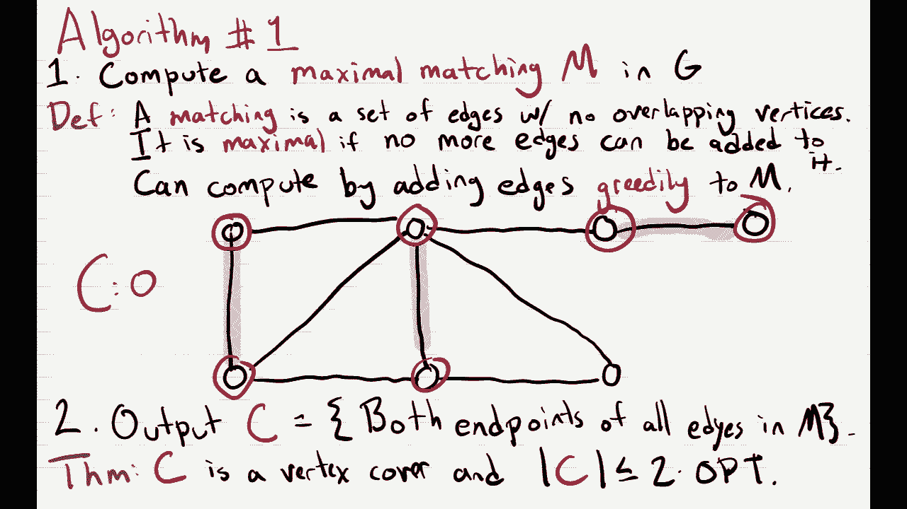
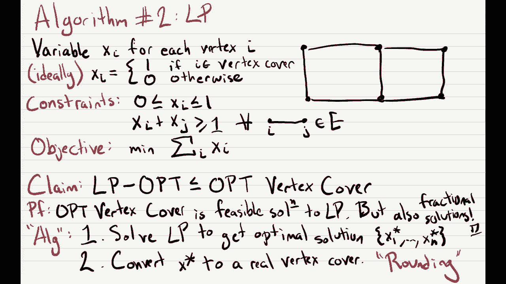
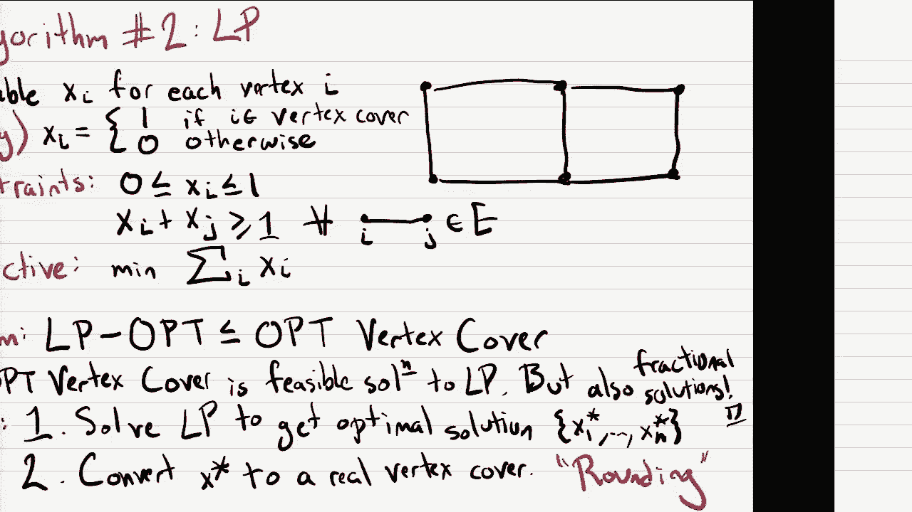
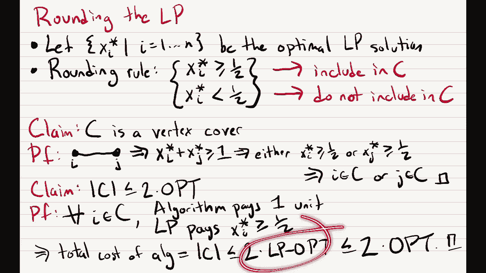
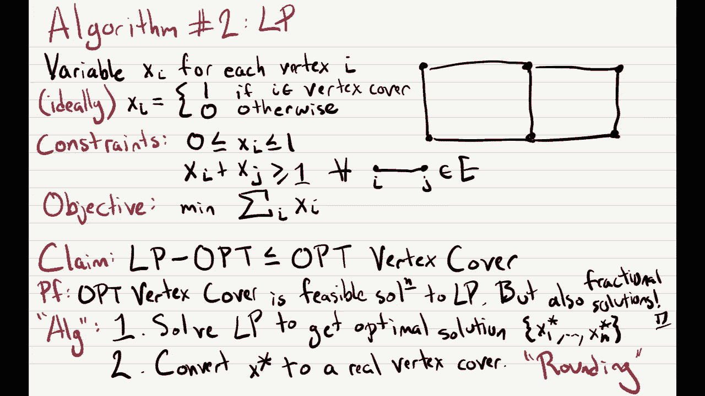
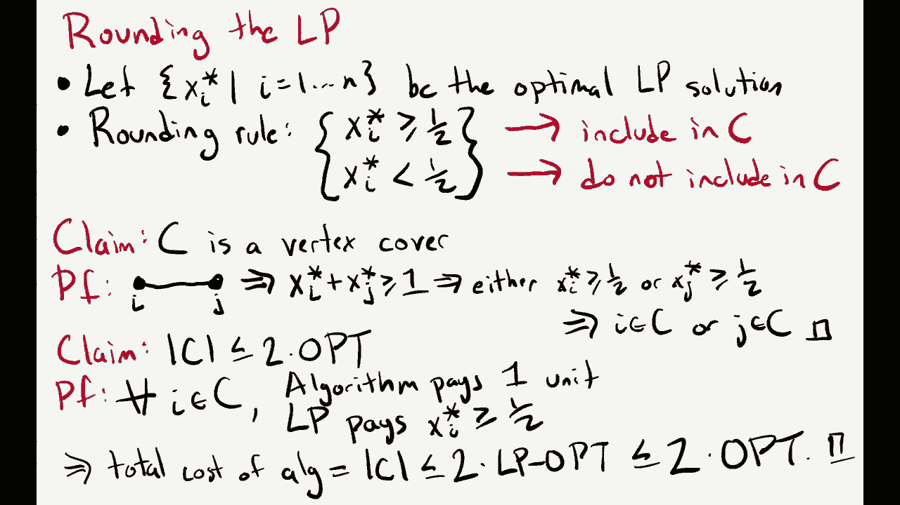
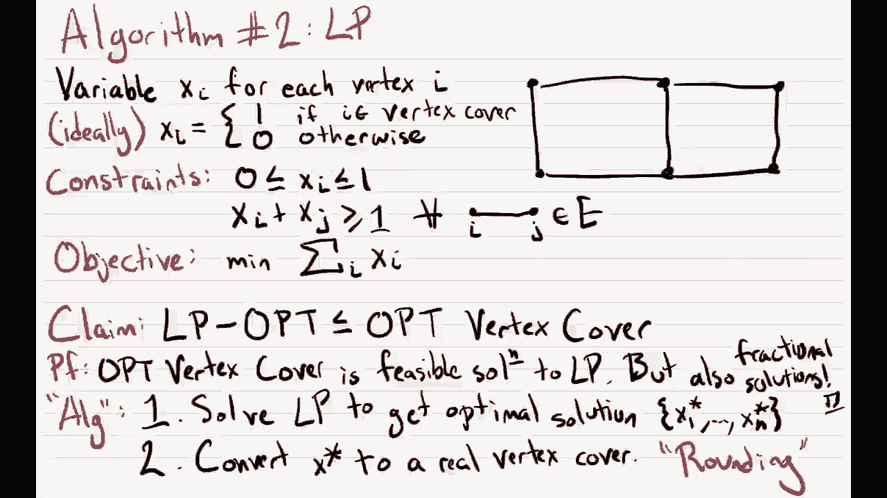
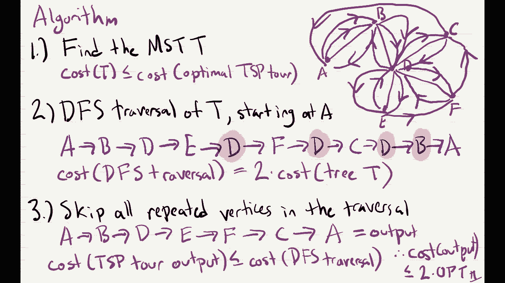
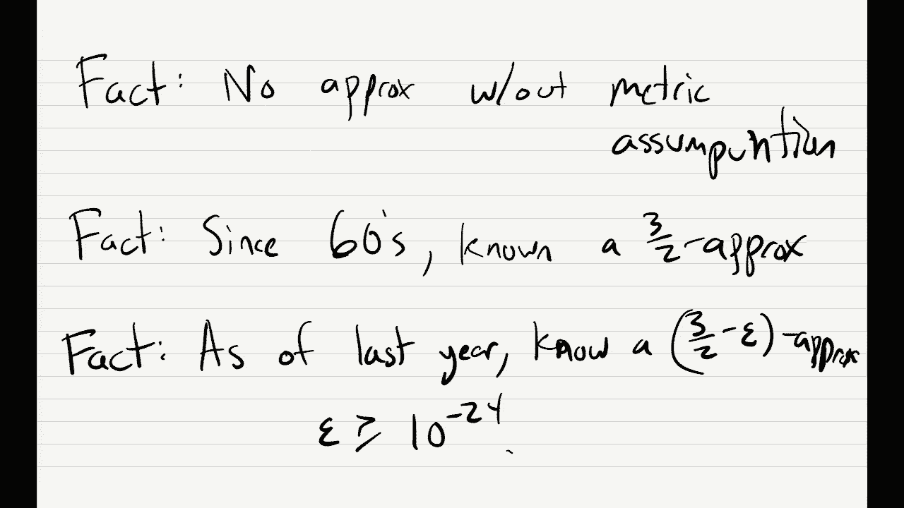

# 22：近似算法 🧩

在本节课中，我们将学习近似算法的基本概念。当我们面对一个NP难问题时，虽然可能无法找到精确的最优解，但我们可以设计算法来寻找一个“足够好”的解决方案。我们将通过顶点覆盖和旅行商问题（TSP）这两个具体例子，来理解如何设计并分析近似算法。

---

## 从NP难问题到近似算法

上一节我们介绍了NP完备性、NP硬度和归约。本节中我们来看看，当我们面对一个被证明是NP难的问题时，有哪些实用的应对策略。

有多种方法可以处理NP难问题。前两种方法在课本中有详细讨论，我们简要提及，但本节课的重点是第三种方法——近似算法。

以下是几种应对策略：
1.  **分析输入结构**：在现实世界中，问题的输入实例可能具有特殊结构，使得问题变得容易。例如，编译器中的寄存器分配问题可以建模为图着色问题。虽然一般图着色是NP难的，但寄存器分配产生的图具有特殊结构，可以在多项式时间内解决。
2.  **使用启发式算法**：启发式算法没有可证明的性能保证，但在实践中往往表现良好。例如，单纯形法（Simplex）没有多项式时间运行的理论保证，但在实际应用中通常比椭球法或内点法更快。
3.  **设计近似算法**：近似算法旨在为问题找到一个虽然不是最优但“足够好”的解，并且其解的质量有可证明的理论保证。这是本节课的核心内容。

近似算法是目前理论研究的前沿领域，人们设计了许多精妙的算法。

---

## 近似算法的定义 📏

我们如何定义什么是近似算法？首先，我们需要区分最小化问题和最大化问题。

对于一个最小化问题 \(Q\)，算法 \(A\) 被称为一个 **\(\alpha\) 近似算法**，如果对于问题的所有实例 \(I\)，算法输出的解的成本满足：
\[
\text{Cost}_A(I) \leq \alpha \cdot \text{OPT}(I)
\]
其中 \(\text{OPT}(I)\) 是实例 \(I\) 的最优解成本，且 \(\alpha \geq 1\)。\(\alpha\) 越小，近似效果越好。\(\alpha = 1\) 意味着算法总能找到最优解。

对于一个最大化问题 \(Q\)，算法 \(A\) 被称为一个 **\(\alpha\) 近似算法**，如果对于所有实例 \(I\)，算法输出的解的值满足：
\[
\text{Value}_A(I) \geq \alpha \cdot \text{OPT}(I)
\]
其中 \(\text{OPT}(I)\) 是实例 \(I\) 的最优解值，且 \(0 \leq \alpha \leq 1\)。\(\alpha\) 越大，近似效果越好。

---

## 顶点覆盖问题 🎯

上一节我们定义了近似算法的概念。本节中我们来看一个具体问题——顶点覆盖（Vertex Cover），并为其设计近似算法。

**问题定义**：给定一个无向图 \(G = (V, E)\)，一个顶点覆盖 \(C\) 是顶点集 \(V\) 的一个子集，满足图中的每条边都至少与 \(C\) 中的一个顶点相邻。目标是找到规模最小的顶点覆盖。

顶点覆盖问题是NP难的。我们不会在此证明，但可以思考如何从独立集（Independent Set）问题归约而来。

### 算法一：基于匹配的2-近似算法

设计近似算法的一般思路是：先解决一个我们能高效计算的相关问题，然后将其解转化为原问题的解，并分析转化过程中的损失。

对于顶点覆盖，一个我们能高效计算的相关问题是 **最大匹配**。

**算法步骤**：
1.  **计算最大匹配**：在图 \(G\) 中计算一个极大匹配 \(M\)。匹配是一组没有公共顶点的边。极大匹配是指无法再添加任何边而不破坏匹配性质的匹配。这可以通过一个简单的贪心算法完成：不断选择一条边加入匹配，然后移除所有与其相邻的边，直到无法继续。
2.  **构造顶点覆盖**：输出一个顶点覆盖 \(C\)，其中包含匹配 \(M\) 中每条边的 **两个端点**。

**定理**：上述算法输出的集合 \(C\) 是一个顶点覆盖，且其大小 \(|C|\) 最多是最优顶点覆盖大小的两倍，即这是一个2-近似算法。

**证明概要**：
*   **C是顶点覆盖**：假设存在一条边 \((u, v)\) 未被 \(C\) 覆盖，即 \(u\) 和 \(v\) 都不在 \(C\) 中。这意味着边 \((u, v)\) 不在匹配 \(M\) 中，且其端点也不属于 \(M\) 中任何边的端点。那么我们可以将 \((u, v)\) 加入 \(M\)，这与 \(M\) 是极大匹配矛盾。因此，\(C\) 覆盖了所有边。
*   **近似比分析**：设最优顶点覆盖为 \(C^*\)。由于 \(C^*\) 必须覆盖匹配 \(M\) 中的每条边，而 \(M\) 中的边互不相交，因此 \(C^*\) 至少包含 \(M\) 中每条边的一个端点，故 \(|C^*| \geq |M|\)。我们的算法输出 \(|C| = 2|M|\)。因此，\(|C| = 2|M| \leq 2|C^*|\)。

这个2的近似比在某种意义上是最优的，因为存在一个猜想（唯一游戏猜想）如果成立，则意味着无法为顶点覆盖设计优于2的近似算法。

---

### 算法二：基于线性规划的2-近似算法

上一节我们介绍了一种基于贪心匹配的近似算法。本节中我们来看看如何使用另一种范式——线性规划（LP）来设计近似算法。

我们为顶点覆盖问题建立一个自然的整数线性规划（ILP）模型：
*   对每个顶点 \(i \in V\)，引入变量 \(x_i \in \{0, 1\}\)，\(x_i = 1\) 表示顶点 \(i\) 在覆盖中。
*   对于每条边 \((i, j) \in E\)，需要至少一个端点在覆盖中：\(x_i + x_j \geq 1\)。
*   目标是最小化覆盖的规模：\(\min \sum_{i \in V} x_i\)。

直接求解这个ILP是NP难的。我们将其**松弛**为线性规划：将约束 \(x_i \in \{0, 1\}\) 放宽为 \(0 \leq x_i \leq 1\)。这个LP可以在多项式时间内求解。

设LP的最优解为 \(x_1^*, x_2^*, ..., x_n^*\)。显然，LP的最优值 \(OPT_{LP} \leq OPT\)，因为任何整数解（顶点覆盖）都是LP的可行解。

**关键步骤：舍入**。我们需要将分数解 \(x_i^*\) 舍入为整数解（即顶点覆盖）。
*   **舍入规则**：如果 \(x_i^* \geq 0.5\)，则将顶点 \(i\) 加入覆盖 \(C\)；否则不加入。

**定理**：上述方法得到的集合 \(C\) 是一个顶点覆盖，且 \(|C| \leq 2 \cdot OPT\)。

**证明概要**：
*   **C是顶点覆盖**：对于任意边 \((i, j)\)，由于LP约束 \(x_i^* + x_j^* \geq 1\)，因此 \(x_i^*\) 和 \(x_j^*\) 中至少有一个 \(\geq 0.5\)。根据舍入规则，该顶点会被加入 \(C\)，因此边被覆盖。
*   **近似比分析**：对于 \(C\) 中的每个顶点 \(i\)，有 \(x_i^* \geq 0.5\)。因此，算法的成本 \(|C| = \sum_{i \in C} 1 \leq \sum_{i \in C} 2x_i^* \leq 2 \sum_{i \in V} x_i^* = 2 \cdot OPT_{LP} \leq 2 \cdot OPT\)。

这个算法同样给出了一个2-近似解。虽然理论保证相同，但基于LP的方法为设计更复杂的近似算法提供了强大的框架。

---

## 旅行商问题（TSP）与度量假设 ✈️

上一节我们为顶点覆盖问题设计了两种近似算法。本节中我们来看看一个更著名的问题——旅行商问题（TSP），并了解一个关键的假设如何使我们能够设计近似算法。

**问题定义**：给定 \(n\) 个城市和每对城市 \(i, j\) 之间的距离 \(d(i, j)\)，寻找一条访问每个城市恰好一次并回到起点的最短回路。

一般的TSP是NP难的，并且**没有常数近似比**。也就是说，你无法设计一个算法，保证其解在最优解的常数倍以内（除非P=NP）。

然而，如果我们对问题施加一个合理的限制——**度量假设**（或称三角不等式），情况就不同了。

**度量假设**：对于所有城市 \(i, j, k\)，距离满足三角不等式：
\[
d(i, j) + d(j, k) \geq d(i, k)
\]
这意味着直接前往目的地总不会比经过其他城市更远。这是一个在现实世界中通常成立的假设（例如，实际道路距离或直线距离）。

在度量假设下，我们可以为TSP设计一个2-近似算法。

### 算法：基于最小生成树（MST）的2-近似算法

**算法步骤**：
1.  **计算最小生成树**：在完全图（以城市为顶点，距离为边权）上计算一棵最小生成树 \(T\)。这可以在多项式时间内完成（如使用Prim或Kruskal算法）。
    *   **性质**：\(cost(T) \leq OPT\)。因为任意TSP回路去掉一条边后就是一棵生成树，所以最优TSP回路的成本至少等于MST的成本。
2.  **深度优先搜索遍历**：对树 \(T\) 进行深度优先搜索（DFS），记录访问顶点的顺序。这会生成一条“游走”路径，它访问了所有顶点，但某些顶点被访问了多次。
    *   **性质**：这条DFS遍历路径的成本正好是 \(2 \cdot cost(T)\)，因为树中的每条边都会被来回走两次。
3.  **跳过重复顶点**：利用度量假设中的三角不等式，将上述遍历路径中第二次（及以后）出现的顶点“跳过”，直接从前一个首次访问的顶点走到下一个首次访问的顶点。这样就得到了一条访问每个顶点恰好一次的哈密顿回路，即一个TSP解。
    *   **性质**：由于三角不等式，这种“短路”操作不会增加总成本。因此，最终TSP回路的成本 \(\leq\) DFS遍历路径的成本。

**近似比分析**：
最终输出的TSP回路成本满足：
\[
\text{Cost}_{output} \leq \text{Cost}_{DFS} = 2 \cdot cost(T) \leq 2 \cdot OPT
\]
因此，这是一个2-近似算法。

**如果没有度量假设**，第三步的“短路”操作可能会大幅增加成本，导致算法无法获得任何常数倍的近似保证。

---

## 总结与展望 📚

本节课中我们一起学习了近似算法的核心思想，这是处理NP难问题的重要实用工具。

我们首先明确了近似算法的定义，它根据问题是最小化或最大化，以不同的方式衡量算法解与最优解的比例关系。

接着，我们以**顶点覆盖**问题为例，探讨了两种不同的设计范式：
1.  基于**组合结构**（极大匹配）的简单贪心算法，获得了2-近似比。
2.  基于**线性规划松弛与舍入**的算法，同样获得了2-近似比，并展示了LP在近似算法设计中的强大能力。

最后，我们研究了著名的**旅行商问题**。在一般的设定下，TSP不存在常数近似比的算法。然而，通过引入合理的**度量假设**，我们能够利用**最小生成树**和**三角不等式**，设计出一个简洁的2-近似算法。

近似算法的研究远不止于此。对于度量TSP，存在更复杂的算法可以达到1.5的近似比（Christofides算法），而最新的研究甚至将这个比值改进到了略小于1.5。这些内容展示了近似算法领域的深度与活力。

通过本课的学习，希望你能够理解在面对计算困难问题时，如何通过放松对“最优”的要求，来设计具有可证明性能保证的有效算法。