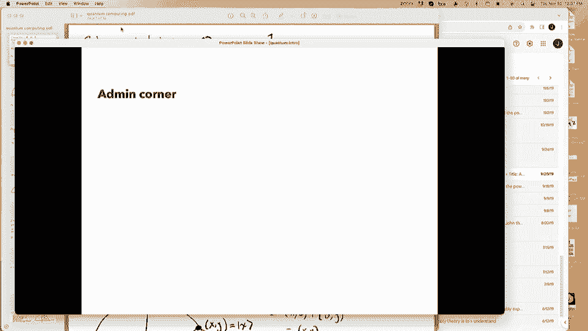
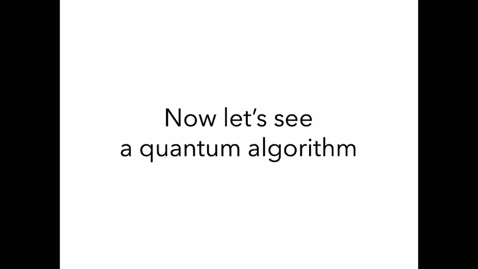
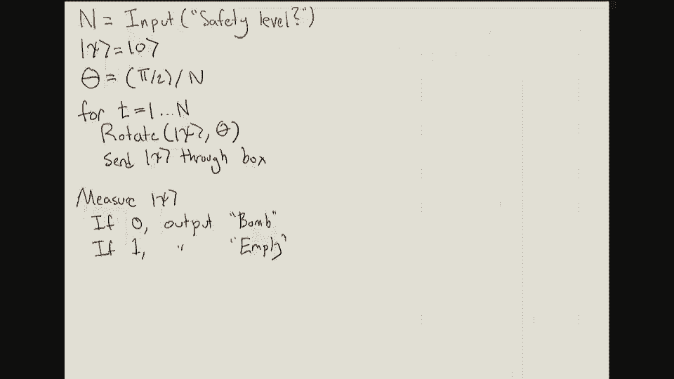

# 26：量子算法专题 🧠




在本节课中，我们将学习量子计算的基本概念，了解其与经典计算的根本区别，并探索几个关键的量子算法。我们将从量子力学的简单模型开始，逐步构建对量子比特、量子操作和量子算法的理解。

## 量子计算概述 🌌

上一节我们介绍了量子计算的历史背景。本节中，我们来看看量子计算的基本原理。

经典计算机使用比特（0或1）作为信息的基本单位。量子计算机则使用量子比特。一个量子比特不仅可以处于0或1的确定状态，还可以处于这两种状态的“叠加态”。

数学上，一个量子比特的状态 |ψ⟩ 可以表示为：
|ψ⟩ = x|0⟩ + y|1⟩
其中，x 和 y 是满足 **x² + y² = 1** 的实数。|0⟩ 和 |1⟩ 是基态向量。

## 量子操作与测量 📐

我们已经了解了量子态。本节中，我们来看看如何与量子比特进行交互。

量子系统允许两种基本操作：测量和幺正变换（如旋转）。

### 量子测量
给定一个量子态 |ψ⟩ = x|0⟩ + y|1⟩，对其进行测量时：
*   以 **x²** 的概率得到结果 0，并且测量后状态坍缩为 |0⟩。
*   以 **y²** 的概率得到结果 1，并且测量后状态坍缩为 |1⟩。

### 量子旋转
旋转操作不获取信息，但可以改变量子态。一个角度为 θ 的旋转操作将状态 |ψ⟩ = cos(α)|0⟩ + sin(α)|1⟩ 变换为：
cos(α + θ)|0⟩ + sin(α + θ)|1⟩

## 埃尔温·薛定谔的炸弹测试算法 💣

现在，我们利用上述概念来看一个具体的量子算法思想实验。

假设我们有一个神秘的盒子，它要么是空的，要么里面有一颗炸弹。炸弹有一个探测器：如果你将一个量子态 |ψ⟩ 送入盒子，炸弹会对其进行测量。如果测量结果为0，无事发生；如果结果为1，炸弹就会爆炸。我们的目标是判断盒子里是否有炸弹，同时尽可能避免爆炸。

以下是经典策略的局限性：
*   发送 |0⟩：无论有无炸弹，输出都是 |0⟩，无法获得信息。
*   发送 |1⟩：如果盒子里有炸弹，一定会爆炸。

接下来，我们介绍一个量子策略。

### 基础量子策略
1.  初始化状态 |ψ⟩ = |0⟩。
2.  执行一个 π/4 弧度的旋转。
3.  将状态送入盒子。
4.  再次执行一个 π/4 弧度的旋转。
5.  测量最终状态。

以下是该策略在不同情况下的分析：

*   **盒子为空**：状态最终变为 |1⟩，测量总是得到1。算法输出“不确定”。
*   **盒子有炸弹**：状态在送入盒子时被测量。
    *   有1/2概率炸弹爆炸。
    *   有1/2概率炸弹测得0，状态坍缩为 |0⟩。经过第二次旋转后变为 (|0⟩+|1⟩)/√2。测量时，有1/2概率得到0，此时算法输出“有炸弹”；有1/2概率得到1，输出“不确定”。

这个策略虽然有时能成功探测到炸弹且不爆炸（1/4概率），但爆炸风险（1/2概率）仍然很高。




### 改进的安全量子算法
我们可以通过重复操作来降低爆炸概率。算法接受一个安全参数 n：

1.  初始化 |ψ⟩ = |0⟩。
2.  设 θ = π/(2n)。
3.  循环 i 从 1 到 n：
    *   对 |ψ⟩ 执行 θ 弧度的旋转。
    *   将 |ψ⟩ 送入盒子。
4.  循环结束后，测量 |ψ⟩。
    *   若结果为0，输出“有炸弹”。
    *   若结果为1，输出“盒子为空”。

以下是算法分析：

*   **盒子为空**：状态被连续旋转 n 次，总旋转角度为 n * θ = π/2，最终状态变为 |1⟩。测量总是得到1，算法总是正确输出“盒子为空”。
*   **盒子有炸弹**：每次循环，状态都被旋转一个小角度 θ 后送入盒子。由于初始状态接近 |0⟩，炸弹每次测量得到1（导致爆炸）的概率非常小（正比于 sin²θ ≈ θ²）。通过数学计算可以证明，当 n 很大时，炸弹在整个算法运行中爆炸的总概率趋近于0。同时，只要炸弹没有爆炸，意味着它每次测量都得到了0，状态在每次测量后都坍缩回 |0⟩。最终测量时，状态仍为 |0⟩，算法正确输出“有炸弹”。

这个算法展示了量子叠加和干涉的威力，实现了经典方法不可能完成的任务：以极高的概率探测到炸弹的存在，同时几乎不会触发它。

## 著名的量子算法 ⚡

上一节我们通过一个思想实验感受了量子算法的独特之处。本节中，我们来看看历史上几个真正重要的量子算法及其影响。

以下是量子计算发展史上的几个里程碑：

*   **Deutsch-Jozsa 算法**：最早展示量子计算潜力的算法之一。它解决一个特定问题比经典确定性算法快得多，但经典随机算法也能高效解决该问题。
*   **Bernstein-Vazirani 算法**：首次展示了量子计算相对于经典计算（包括随机算法）的指数级加速，解决了特定隐藏线性函数问题。
*   **Shor 算法**：量子计算的“杀手级应用”。它能在多项式时间内分解大整数，对广泛使用的RSA加密系统构成了潜在威胁。这使量子计算从理论兴趣转变为具有全球战略意义的领域。
    ```python
    # 经典分解算法（数域筛法）时间复杂度约为：
    time ≈ exp(O(n^(1/3)))
    # Shor量子算法时间复杂度约为：
    time ≈ O(n^2)
    ```
*   **Grover 算法**：为许多搜索类问题提供了平方根加速。例如，对于在N个元素中搜索一个满足条件的元素：
    ```python
    # 经典算法最坏情况需要检查所有N个元素
    time ≈ O(N)
    # Grover量子算法仅需检查约√N个元素
    time ≈ O(√N)
    ```

## 量子计算的现状与挑战 🏗️

我们已经看到量子算法的强大能力。本节中，我们来看看实现这些算法所面临的现实挑战。

建造实用的量子计算机主要面临“噪声”挑战。环境干扰可能导致量子比特状态意外改变，从而破坏计算。解决方案是“量子纠错”，即使用大量有噪声的物理量子比特来编码和保护一个逻辑上的“完美”量子比特。目前估计可能需要成千上万个物理量子比特才能形成一个可靠的逻辑量子比特。

近年来，科技公司（如Google、IBM）已能建造包含几十到上百个物理量子比特的处理器，并演示了“量子优越性”实验，即在特定任务上超越经典计算机。然而，距离建造出能运行Shor算法破解实用加密的、具备充分纠错能力的大型通用量子计算机，仍有很长的路要走。



在复杂性理论中，量子计算对应复杂度类 **BQP**。我们相信 **P ⊆ BQP**，且 **BQP** 包含如整数分解等不属于 **P** 的问题。但重要的是，目前没有证据表明 **BQP** 包含 **NP完全问题**（如旅行商问题），因此量子计算机并不被认为能高效解决所有困难问题。

## 总结 📚

本节课中我们一起学习了量子计算的基础。我们从量子比特和叠加态的概念出发，理解了测量和旋转操作。通过“炸弹测试”的思想实验，我们直观感受到了量子策略如何利用干涉效应完成经典不可能的任务。随后，我们回顾了Deutsch-Jozsa、Bernstein-Vazirani、Shor和Grover等关键量子算法，认识了指数级和多项式级量子加速。最后，我们探讨了量子纠错的必要性、当前量子硬件的进展以及量子计算在计算复杂性理论中的位置。量子计算是一个融合了物理学、计算机科学和工程学的激动人心的领域，它正在从理论走向现实。