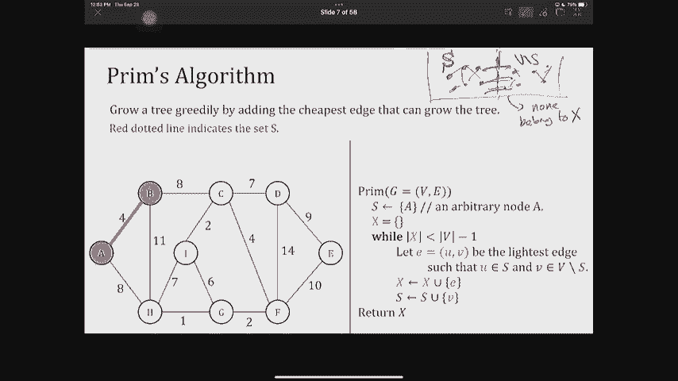
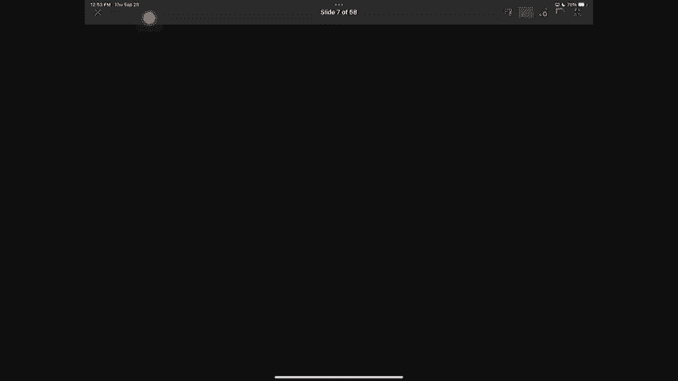
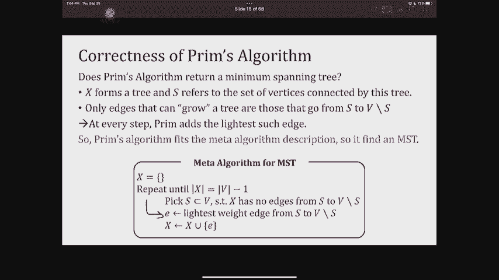
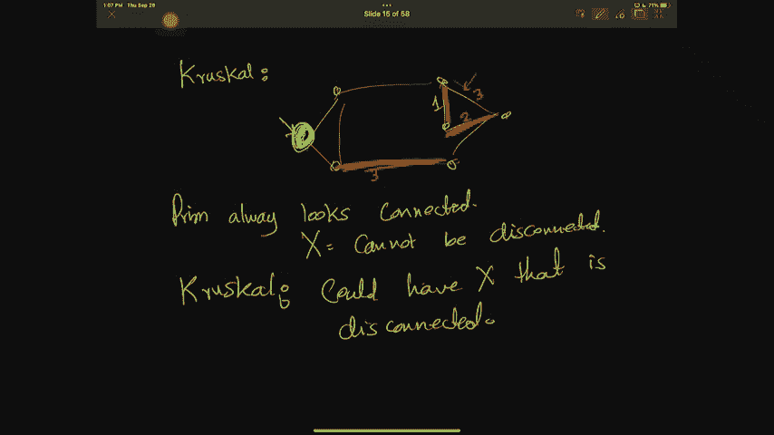
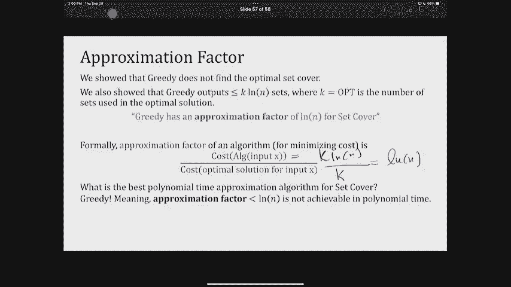

# 加州大学伯克利分校算法课程CS170 - P11：Lec11 More on MSTs and Set Cover - 东风渐起UCAS - BV1o64y177K8

最近怎么样？伙计们好，我看到我们今天的人肯定少了，我猜，我们宣布今天的材料不在考试中，班上一半的人决定不露面，所以笑话是在他们身上，4。我会把录音关掉，然后把考试的全部情况告诉你，只有你知道。

这是个玩笑，我不会那么做的，不要关掉录音，我想我们要开始了，我们将在一两分钟后开始，好啦，三十秒后开始，所以如果你走进教室，找到你的座位，找到坐在他们旁边的人，我们再商量一下，希望，好啦，我们开始吧。

关于最小生成树和设置覆盖的第十一讲，但在我们像往常一样开始技术内容之前，一些通知，它们基本上和我们以前的一样，但它们很重要，所以我要，除非你在过去的几节课里一直在睡觉，下星期二我们有考试，嗯。

那是什么意思，下星期二我们不上课，好啦，对那些只想着考试的人说教是没有意义的，利用讲课时间多学习，如果你想，可能会把我的办公时间从讲座后转移到讲座期间，我会在Ed上宣布，所以如果你想去听讲座，相反。

你可以来问我问题，或者我们的助教，其他事情我们有复习会议，把它们写在你的日历上，他们都在周末，十一点到两点，他们在波什尼亚克酒廊，一人份苏打水，我们还将有一个巨大的后勤站，我的助教告诉我它随时会出来。

不过，预计今天某个时候，所有的后勤都很重要，呃，利用办公时间，家庭作业派对，你想准备什么就准备什么，还有范围，就像我说的，今天的材料不是其中的一部分，嗯，所以你们可以把注意力集中到最后一节课结束。

所以你需要知道一切，有关于克鲁布的了解，因为我们已经报道过了，但不是今天的材料，是呀，嗯，我不知道，因为，我认为事情的发展方向是，会有不同的助教回答不同的问题，他们可能会专注于，部分问题。

取决于谁在问问题，好啦，那真是，我不能保证，我相信我的助教告诉我他们会试着录下其中一个，但肯定不会再直播了，我不能保证，但是后勤站会有这些信息，所以相信巨大的后勤岗位即将到来，不仅仅是我的回答，现在。

对于这些问题，关于期中考试的其他问题，嗯，我很高兴你还在这里，即使今天的材料不是讲座的一部分，考试的一部分，我们将讨论最小生成树，所以我认为这实际上是一种非常自然的深化方式，你周二还学到了什么。

所以这将是一种练习，其他事情因为我们有考试来的家庭作业，五是可选的，不是伟大的，解决方案已经发布，所以研究一下，我想就公告而言就是这样，好啦，让我们进入今天讲座的实际技术内容，我们将继续我们停止的地方。

最小生成树，如果你还记得最小生成树的问题，有这个输入，是一张图表，我们假设它是非负权的加权图，你想计算的输出，是这个图的边的子集，这是连接所有顶点的最便宜的方法，我们上次证明了这样的子集必须是树，否则。

你可以扔掉一些边缘，因为没必要，这就是最小生成树问题，我们看到了一些算法，事实上，我们看到了一个非常普通的，证明任何符合模型的算法的通用方法，特别是，这个模型元算法模型将正确地识别最小生成树。

这个金属算法的特别之处在于它使用了一种叫做切割特性的特性，这是一个重要的财产，所以一定要好好理解，然后你可以把它，cut属性是说，如果我可以把我的图除以顶点的集合S，以及其他一切，在某种程度上。

我前任的边缘都没有通过，从s到v减去s，我保证x本身是某个最小生成树的一部分，然后我总是可以附加这个额外的边，哪一个是最便宜的边缘，穿过这个切口的最轻的边缘，从s到v减去s再到我的边集。

并且确保这也是最小生成树的一部分，所以这是切割的属性，我们说过任何符合这里模型的算法都是可行的，这个算法在做什么呢它从无到有地建立一组边，直到它有一棵完整的树，嗯，不是完整的二叉树。

就像一棵触碰每一个顶点的树，它是怎么做到的，它需要一些顶点，S，使得x从s到b减去s没有边，所以它选择了一个切口，然后它挑边缘，那是最轻的边缘，穿过那个，然后把这个边，所以这是元算法和cut属性。

您可以用元算法编写的任何内容都确实返回了一个最小生成树，为什么我们称之为元算法，因为当时还不清楚你该选哪个，比如你在选什么，我们看到了一个算法，它是Krul和Krul选择的，而不是明确地挑选。

S明确地开始选择最轻的边缘，但没有产生循环，如果你还记得，我们隐含地说集合s是连通分量，在今天被捡起来的边缘的一端，我们将看到一个不同的算法，这种算法被称为prim算法或prim算法，它背后的想法是。

如果我要建立一堆边缘，我将通过挑选边缘来建立我的最小生成树，我还不如试着从树根上长出一棵树，所以让我的前任一直联系在一起，好啦，所以如果x总是连通的，然后我的布景。

s是到目前为止由边连接的所有顶点的集合，我选了树穿过的一组顶点，这里的想法是，这相当于说我从某个任意顶点开始，我试着扩展这棵树，我如何通过贪婪地挑选最便宜的边缘来扩展它，实际上会扩大树。

意思是它必须便宜，它不能创造一个循环，所以它必须离开我目前的顶点，就是这个想法，让我看看，这实际上是如何形式化的，所以我们的想法是贪婪地种植一棵树，通过添加最便宜的边缘，我要把这叫做一本正经。

就像在克鲁格尔，我给了你一些很慢的伪代码，然后我向你展示了如何以一种快速的方式实现它，我也要做同样的事，我会给你一个看起来很慢的伪代码，但有一点很清楚，它想做什么，然后我们会在二十分钟内把它弄快，好啦。

那么Prim在做什么，普里姆拿着图表，然后它从一些任意的顶点开始，就像Dijkstra或BFS是如何从某个任意的顶点开始的，让我们称那个顶点为A，然后它还跟踪到目前为止的一些边缘，是空的。

它反复给这些边缘，通过选择最轻的边缘e，它的一端在布景中，另一端在v减去s的集合中，然后它重复这样做，如果它找到这样的边缘，它将该边添加到x的集合中，它还将边的末端添加到集合的集合中。

重复这个直到它找到足够的，这看起来像什么，还有任何关于我在右边写的东西的问题，因为我要做的是在左边给你们看，在图表上，但是任何关于算法描述的问题，所以在这个描述中，我们也将从一个。

这在某种程度上是一个非常有方向性的，呃，远程，好啦，所以我们将从A开始，我所做的是，然后我要用红色虚线来表示集合，以及它是如何从v-s中分离出来的，所以这是分离a和b减去s，好啦，所以说。

我要做的第一件事就是找到最轻的边缘，从我点缀的布景到外面，哪边是，一名志愿者，H a b，我只想确保我们明白我在问什么，清楚了吗，关于我们如何选择边缘，没关系的，如果你想安静，我只想让你明白，什么是S。

好啦，所以你记得，我们在讨论，我们说过切口总是有定义的，集合s和集合v减去s，所以这些是一堆顶点，切割的想法是，所有这些边缘，穿过这些，属于X，这是一个切口我们要记录切口的一端。

上次给了我一个很好的提醒，还有其他问题吗？

切割属性说你应该做的。

你应该做的是选择最轻的边并将其添加到集合x中，好啦，所以现在我已经看到了A和B，我现在的布景是他们两个，这就是为什么我要绕过A和B，下一次，我必须寻找一个正在交叉的边缘，从一个红色节点到一个白色节点。

最轻的边缘是什么，一名志愿者，是呀，有两个，有一个h和b c，两者都有重量，我要选一个从，因为按字母顺序排列更好，所以我把这条边添加到我的最小生成树中，我的集x h现在连接了，我的那份。

我的集合S是所有的红色顶点，好吧，我们再来一次，下一个边缘是什么，这个简单的算法将增加我目前的边缘集，一名志愿者，也许从房间的两边，很好，因为我看着所有的边缘都在虚线上交叉，汞是交叉的，也是最便宜的。

所以我加了它，然后我重新画我的切口，好啦，所以我们掌握了诀窍，下一次，我有边缘8，7，6和2，我加了最便宜的，那就是GF，每次我加一条边，记住我把它的新一端添加到我的集合中，我重新画了所有的东西。

下一次我有8，7，6，4，14和10，四个最便宜，我加的，我重新画了切口，现在呢，这个切口看起来有点不一样，我说的这个伤口是什么意思，我选择在视觉上把它作为甜甜圈展示给你，因为我只想让我的虚线。

介于s和v-s之间，在现实中，没有人真正切割你的图表，只是你决定你的布景是什么，是一组红色的音符，但我把它切成了甜甜圈的形状，这样我们就可以看到所有交叉的边缘，所以下次在交叉的边缘。

这和这只是最轻的边缘交叉吗，哦对不起，还有这个还有这个，所以最轻的边缘交叉是两个，我把它加进去，然后重画我的布景，下一次，我看着所有的边缘，过七，十四岁和十岁，七是最轻的，我加的，我重新画。

最后我只有两条边，穿过九点和十点，我选九，我完成了，因为我的E组现在也是，我想我应该把这个红色加到布景里，S，对此有什么问题吗，这是Prem算法，是呀，嗯哼，这是个好问题，所以在这里，尤其是早些时候。

在两种不同的辅助设备之间我们有两种选择，我随便选了一个，问题是你是如何有这种洞察力或远见的，事实上，这是正确的选择，其实我没有远见，我只有切割的财产来帮助我，你可以选另一个，一切都不会改变。

从某种意义上说，你得到的生成树会看起来不同，它会使用不同的边缘，但它的成本现在会完全一样，我为什么要这么说，这是因为让我们回到被切割的属性，因为切割特性很强，这是一个美丽的定理，切割属性说。

任何边缘是最小重量，穿越，切口可以加到我现有的，不是说他们中的一个会这样，事实上，如果我有一堆边缘，它们都有最小的重量，但它们从不同的顶点看起来不一样，没关系，挑你最喜欢的，我按字母顺序选的。

还有其他问题吗？我们明白普里姆的算法吗，好的很好，你有一个问题，哪个是线人，好啦，我们继续吧，你在问，为什么这个看起来像甜甜圈，是因为我在幻灯片上写的东西，在现实中，没有数据结构真正为您切割东西。

我只是想在视觉上把这个，在某种程度上，任何真正被切割的边缘，其中一条虚线是s和d减去s之间的交叉，在现实中，你甚至不知道削减在哪里，你只跟踪布景，S，哪一组红色顶点是那么清楚，我本可以这么做的。

我本可以把这东西，把它搬到这里，但图表并不重要，就像你可以伸展身体，您可以在两个D上嵌入许多不同版本的图，所以这只是一个视觉技巧来帮助你，确切地说，s只包含节点，其实呢，看这里。

我们只是一个接一个地添加顶点集，x只包括边，X是我的树，所以它应该只包括边缘，就像，S帮助我跟踪到目前为止属于这棵树的顶点，正确的是，我如何确定它返回的是一个最小生成树，这是因为切割的性质和元算法。

但让我们再看一遍，再来一次，所以prim的算法返回一个最小生成树，如果符合这个模具，它必须，我们上次证明了这一点，任何符合这个模型的东西都确实返回了一个最小生成树，那么我怎么知道它很适合这个模具呢。

让我们来看看集合X，这些是我的边缘，我保证这会形成一棵树，我保证X形成树的原因，是因为我从来不加边，它的两端都在树上，其中一个结尾是S，另一个是V减S，所以它一直在种树，从不创造循环。

所以我保证这个X正在形成一棵树，唯一能让这棵树生长的边缘，从s到b减去s的边，我选择了Prim告诉我选择最便宜或最轻的边缘，从s到v减去s，因为它完全符合这个元算法，因为我挑了最轻的边。

对此有什么问题吗，这是个好问题，Prim对负边缘有效吗，刚好延伸到负边，有多种方法可以看出这一点，那就是时钟属性不会说谎，也不关心积极，还有其他的方式来看待这一点，但是，这么说吧。

这超出了我现在所做的范围，我们可能会把它作为家庭作业或讨论在某个时候为你，对此的一种看法是，这很有趣，像戴克斯特拉和BFS这样的人真的很关心消极，但是最小生成树并不太关心，你可能会想到的一种方式是。

我们在其中一个内容中给了你，我不记得是讨论还是家庭作业，那个，如果你只是在边缘加上一些固定的东西，下面的技巧会有效吗，希望你能证明这不是，尝试在这里对最小生成树使用相同的技巧，你可能会发现在这里更有效。

为了今天，我们假设权重是正的，但很高兴知道我们正在讨论的两种算法，一般情况下，最小生成树可以处理负，好啦，所以这是关于普里姆的正确性，关于Prim的正确性还有其他问题吗。

Rasa和Krusco有什么区别，所以有很大的区别。

让我们记住，你能提醒我克鲁尔，它是怎么挑边的，有谁能，呃，呵呵，挑最轻的，没有创造循环什么的，所以让我们假设这是最轻的，所以克鲁柯尔一开始会选这个，也许就像这样，然后也许你会想加上这个，如果这是三个。

然后就不会了，需要一个顶点从，所以从这里开始，让我再做一件事，也许吧，下一次，所以克鲁斯科选了一个，然后挑两个，它不能挑这三个，但它可以选择这三个，因为它是最轻的边缘，不会引起任何循环，对呀。

所以你永远不能一本正经地看着X，所以他们添加的东西的顺序肯定是不同的，好啦，它们都导致最小生成树，它们可能导致不同的最小生成树，因为顺序不一样，如果我中途阻止了他们中的一个，我敢肯定。

至少普里姆给我的是一棵树，而克里斯托给我的是一片森林，森林是什么是树木的集合，我想在英语中也是如此，是啊，是啊，所以它不一定要连接，好吧酷。

这就是珊瑚和古朴的区别，事实上，它们的运行时间也有差异，我们将看到下一个比另一个更有效率，所以首先让我们看看我是如何写Prim的，我写Prem的方式看起来真的很慢，好啦，为什么慢。

因为它在while循环中运行，而while循环是n-1次，因为它一次增加一条边，但即使是我搜索每个while循环添加哪个边的方式也很慢，从某种意义上说，我在看所有的边缘，我问这个交叉是MV减去S。

然后我选择其中最轻的一个，所以这真的很慢，如果我想天真地实现这一点，我将使用n乘以m的运行时实现它，如果你还记得krusk的运行时是n加m乘以n的对数，这是我们上次做的，你要记住，好的，好的。

为什么普雷姆，因为，就像我给克鲁斯科看的那样，单纯的算法非常无效，我们称之为快速巡航呼叫的真正算法是有效的，有一种方法可以有效地实现这个算法，对于krul，我们使用数据结构。

有人能提醒我那个数据结构是什么吗，克鲁斯科工会发现，我们使用一个花哨的数据结构，我们不需要在这里使用花哨的数据结构，我们只需要使用优先级队列，但这背后的直觉是什么，你应该开始看起来很熟悉，因为你在种树。

到目前为止，你在这个班上已经看到了很多树，所以我真正要做的是对每个顶点，跟踪更好的对我来说很重要，那个顶点就在一跳之外，离顶点集有一条边，在片场，S，在树上，到目前为止，我发现，嗯，希望这是唯一一个。

好啦，嗯，那么边缘是什么，这里的顶点是什么，只有一线之隔，绿色的都是对的，我的天啊，都是绿色的，这些是直接边缘到红色顶点集的，已经是图表的一部分，树的一部分，黑色虚线显示了所有没有任何顶点的顶点。

到目前为止我所拥有的，到目前为止我发现的树，好啦，所以我需要一种方法来跟踪这一点，事实上，我需要一个稍微好一点的方法来跟踪这一点，因为这不仅仅是你是否有优势，但我也想知道你最轻的边缘是什么。

现在正在参观的布景，这对你来说应该很熟悉，因为以前我们也有过同样的困境，我们有一个进退两难的讲座，八个左右，我们种了一棵树，我们想知道什么是最便宜的方式来延长它，你还记得哪个算法，看起来很像。

Dykstra，完全正确，这就是困境，事实上，我们也在Dijkstra剪了它，我们刚刚给它起了个名字，割伤，我们说过我们知道顶点，未知顶点，我们想要有直接边缘的区域，所以吸管实际上已经包含了一个技巧。

对每个顶点保持对其上一个顶点的跟踪，你还记得我们之前有一个数组，这告诉我从喜欢，你的父母是谁，你怎么到这儿来的？它有一个数组，这是它对它离已知顶点集有多远的估计，所以我们将使用和额外的相同的技巧。

事实上，实现prim的算法看起来很像k，又该如何做好，我们将再次跟踪每个顶点，这和前，我们做这件事的方式，我们把这两个数组看作是无穷大来初始化，顺便说一句，我也这么做了。

如果你记得和prev是一个空指针，然后我们更新，我们什么时候更新好，而不是每轮都更新一切，我们更新这些距离和这些前，只有当V的一个邻居进入集合S时，我们把这个叫做Dijkstra，访问集。

所以让我们在这里再次调用访问集，布景S是Dijkstra所说的访问，所以我想说的是，每次将节点添加到访问集时，看看它的邻居，如果需要，更新邻居的距离和指针证明，我们什么时候做这个。

每当我们找到比现在更好的距离，我们发现，这意味着如果将邻居U添加到访问集中，到目前为止，我对V有一个距离估计，它实际上比u和v之间的加权边还要大，然后我找到了一个更便宜的V边，将其连接到访问的集。

所以我应该更新它，我更新了它，将距离更新到加权边缘，同时更新之前指向您的指针，因为你给了我最便宜的优势，好的，好的，所以这就是你要做的任何关于这个的问题，好的是。

这个数组与我们在Dijkstra或不同的地方所做的相同，实际上只是尽可能便宜地连接你的边缘的长度，设置，参观它，这就是为什么我们只更新重量，但这也是在说，所以说，dijkstraw和和prim有区别吗。

有根本的区别，正是混乱给我看的Dijkstra，磁盘阵列实际上是从源找到的整个路径的长度，一直到你的新顶点，我不在乎整条路，我只在乎最后的边缘，好啦，连接我回来的最便宜的边缘。

这就是普雷姆和迪克斯特拉的唯一区别，那么Prem和保证有什么区别呢，戴克斯特劳向你保证从你开始的地方，你有一条通往一切的最短的路，一本正经并不能保证，所以这被称为单一来源。

最短路径Prem并不能保证无论你从哪里开始，你有最短的路径去其他一切，不是这样的，为什么我们把它设置为无穷大，无限是一种跟踪所访问内容的方式，如果你是无限，你从来没有被拜访过，你没有任何优势去过布景。

所以你在角落里，你知道的，我在这里给你画的黑色顶点，你在这个片场，如果你从来没有跳过，这就是为什么它帮助我们知道你是，你甚至没有资格被人看，如果你有不是无限的东西，我们就知道你至少有个邻居。

但也许我还没有找到最便宜的边缘，让我们看看这实际上看起来像Prim的算法，用我定义的方式，它会看起来很像Dijkstra，请记住，在戴克·斯特劳中，我们从这两个数组开始，我们现在要跟踪边缘。

我将有一个空的优先级队列，那是我的提示，有一些记账技巧，我必须做，一个是我将从一个任意的节点开始，假设这是节点a，如果你还记得额外的，也把那个节点的距离设置为零，所以我要做完全一样的事情。

然后我要把所有这些节点，他们的距离是进入我优先队列的关键，因为每次我想找最便宜的东西，我的优先队列将跟踪这一点，最便宜的将是我插入的最佳价值，一次，我已经做过了，我将迭代地向我的最小生成树添加边。

如何添加边，嗯，我通过首先从优先级队列中删除最便宜的顶点来添加边，我怎么知道这是最便宜的，我查看插入优先级队列的密钥，这就是我得到的本质，几乎总是，我加上这个顶点，我在画一条边，把它加到我的树上。

除非它是根，因为如果必须在不添加任何边的情况下添加根，你知道总有根，所以我只是检查一下，这只是个把戏，以确保我没有添加垃圾到我的设置，它只击中一次，所以说，如果不是，所以说，如果这不是我找到的第一个根。

然后我把这条边加到我的集合x上，我怎么加好，我发现了一个新的优势，把v加起来然后v指的是谁，那是边缘，我把它加到我的集合x中，然后呢，我所做的就是我现在就像你注意到的那样，向我参观的布景介绍一些东西。

我刚访问了节点V，所以我必须尊重它所有的邻居并更新他们，如何更新它们，我看着V的所有邻居，大于v到那条边的长度，那个顶点还在队列中，我把它更新了，我如何更新它，我减少优先级队列中的键。

我也更新了谁是Prev，我重复这样做，一旦我完成了，我只是把边缘吐出来，这是在优先级队列中编写prim的快速方法，但就像我们穿过戴克斯特拉，为了更清楚，它是如何运行的，我将给你们举一个例子。

通过完全相同的图，我们以前有过，用Prim快速找到，求最小生成树，对我这里的东西有什么问题吗，我如何确保它仍然连接，这是个好问题，我确保它连接的方式，是通过我们讨论的磁盘。

如果你离我参观过的片场不到一跳，你的距离是无限的，对，因为你只更新一次，你的一个邻居进入了优先级队列，所以根据定义，你总是联系在一起，因为那个，我如何确保没有循环，我确保没有循环的方式。

实际上是通过这个v和v的前一个，你的顶点V只有一个指针，对某人，所以我只有一次，我把你和那个指针加起来，那你喜欢，没有，你们两个不可能已经是树的一部分了，从某种意义上说，我们确保这一点的另一种方式。

我们把你踢出优先级队列每次我添加一个顶点，我把它踢出去，所以它永远不会更新，它再也不会被添加了，这就是为什么没有循环，好啦，让我们看看这是什么样子，我要跟踪磁盘和前，我会用红色。

红色节点来跟踪所有被赶出，被踢出优先级队列，意思是这些是访问的集合，告诉你Prev指向哪里，Prev也写在这个表中，但我也想有一个视觉，所以让我们看看这是什么样子，我做的第一件事就是这家伙告诉我。

我得加上距离a，然后注意到每个人都有一个无限的距离，除了a，所以第一个人，第一个被踢出的顶点只是一个，但A并不能增加优势，这是一个特殊的情况，如果您驱逐的顶点是，你不加边，下一次，我要做的就是穿过边缘。

在这里由b和h突出显示的a的邻居并更新它们的信息，他们两个都在无限远的地方，但我刚发现b的距离是4，h的距离是8，因此我更新了他们的距离，因为我用减小键更新了这里的距离，我还得更新他们的前指针。

他们什么也没指向，现在他们指向一个，因为那正是我发现到目前为止最小距离的地方，对此有什么问题吗，是呀，减少键是一个说，我在更新距离，从优先级队列中较大的东西到较小的东西，好的。

这些指针表明H s Prev是一个，B的前一个是二，下一次，我看这里，顶点最便宜的非成本是4是B，距离四，另一个是八个，所以我选四个，我把它踢出我的优先队列，这意味着现在它是一个访问的边缘。

每次我去都很抱歉，访问顶点，我得看看它的邻居，但首先要注意的是，我刚发现我刚刚从队列中踢出了一些东西，所以我需要把那个东西加到我的树上，如何通过添加边缘来添加它，从b到它的前，这正是准备工作的地方。

所以我把这个边，现在我看着它的邻居，我有邻居看到c曾经在无穷远处，每根指针都没有，所以我更新了它，把它的键减少到八，并向b添加一个指针，但是h很有趣，h已经有了指向a的指针，那是一个前。

加上八英镑的费用，如果我想看看并更新它的成本，它实际上会更大，所以我不，因为这个如果条件是说只有更新，如果当前的估计比你发现的大，而我发现的实际上更糟，所以h没有更新，好啦，下一次，我会在一切之间寻找。

我有c和h，上次我选H，这次我要选C，也许这次我是按字母顺序看我的部分，Q不重要，我选c，我得把c和它的前一个加起来，哪个家伙在我的树上，现在我得看看C的所有邻居，我查看c的所有邻居。

我找到了一个新的Prev和更好的距离，因为它们之前都在无穷大，现在他们每个人都更新了两个，四和七，好啦，下一次，我应该从这个优先级队列中驱逐谁，我应该看起来是的，我因为我有最低的钥匙，也就是两个。

所以我加了，我把它从我的优先队列中划掉，因为我被开除了，我得把它加到我的树上，使用它的前，这就是我加的边，我现在要看看我的所有邻居，以前这里发生过一些有趣的事，让我们看看h，H指向节点A，它估计有八个。

它不是无限的，但那是八点，它刚刚发现估计有7个，所以它会切换它指向的人，它更新了成本是多少，好啦，下一次我找到f，因为它是最便宜的，指向c，所以我加的边是fc，现在我得看看F的所有邻居。

对于其中的两个g和e，我发现距离更好，所以我更新了更好的距离，但我没有找到更好的距离，如果你看d d用距离7指向c，如果我想更新它，它会有14个更大的距离，所以我不更新它，好的，我找到的下一个是G。

优先级为2，我把它加到我的布景里，我得把它和前一个加到布景里，我得去看看邻居，事实上，我找到了一个更好的估计H，指向g以此类推，依此类推，我现在加上它，听着，她没有一个邻居没被拜访过。

所以我不需要更新任何东西，我只更新未访问的东西，因为他们必须属于队列，好啦，所以我回头看，唯一剩下的就是抱歉，我还得更新一下，对不起，唯一剩下的就是我们到这里来，剩下d和e d的东西有最小的键。

那就是七个了，我把它，把它踢出我的优先队列，我将指针添加到prev，现在我要更新，E之前更新过，他指着F，那是他的准备，花了十块钱，我刚找到一个更好的九英镑，所以我更新了九和每B指针。

最后我加上我的最后一个顶点，好啦，这很快，它发现了一个与我们之前发现的另一个不同的最小生成树，另一个，如果你还记得，我无缘无故地优先考虑一个H，这一次，我再次优先考虑BC，没有明显的原因。

但它们都是最小生成树，关于我们如何运行这个的问题，为什么我们选择C而不是H，那么让我们来看看我们选择c的地方，就在这里，好啦，看看H，H在八点，C两岁，我说这是我武断的选择，我就随便选了一个。

这里我选择c的原因是因为c在字母顺序上更好，你可以选H，那也是正确的，好啦，所以这是古板的，你可以在家里再跑一遍，但让我们看看需要多长时间，我把这个叫做快速普雷姆，所以希望这是一个快速的算法。

那么什么是快从做，它使用优先级队列，为了让你记住优先级队列给优先级队列的操作是什么，取决于您如何实现，它要么使用二进制堆，要么使用斐波那契堆，使用二进制堆，所有这些行动，插入删去。

平均最小和减少键取n的对数，对呀，斐波那契堆要好一点，删除min取了n的日志，但其他事情需要持续的时间，好啦，所以让我们看看会发生什么，其实呢，如果我看着古板，让我们过一遍，我什么时候插入东西。

我把我所有的顶点，所以我在做n个插入物，我也在删除n个顶点，因为我一个接一个地删除它们，我从来不把它们加回来，所以n插入和删除，好啦，减少键呢，嗯，每次我减少键，这是因为我发现了一个新的优势。

所以我减少的次数，关键是图中的边数，这就是为什么我现在叫它M时代，这告诉我，如果我使用二进制堆，我得到m+n次，log n，但如果我用斐波那契堆，我要m加log n，对不起n log n。

所以如果斐波纳契堆稍微好一点，顺便说一句，这正是我们在戴克斯特拉身上看到的，如果你还记得我们为戴克斯特拉准备了一张桌子，相似并非偶然，因为我们用戴克斯特拉的直觉来实现这个，好啦，这两个算法真的迭代了吗。

不，因为Kruskal实际上不在乎你从哪里开始，Krusal从最小的边缘开始，啊，如果你运行Prim从它迭代到，另一个算法是什么，你想说他们看起来一样，啊，Dijkstra，正如我所说。

没有Dijkstra和Prim是不同的，因为更新条件不一样，他们没有发现普里姆发现的和迪克斯特拉发现的不是一回事，Dijkstra正在解决单源最短路径，从S开始，它在寻找所有最短的路径。

但是最小生成树并不能保证这些路径是短的，从那个来源，它只是保证总成本尽可能小，嗯，好啦，Z存在于Q中很容易，因为每当你可以把它看作另一个，订单n检查，是啊，是啊，因为这并不重要，我不想更新的原因。

是因为我不想一直更新，你永远不会最重要的是，就像我要证明的引理一样，也许这很重要，但这对算法的运行时间并不重要，对于算法的运行，因为算法的运行只会把你踢出队列，只是在精神上我想让你意识到。

如果我把你踢出队列，我已经处理过了，我不应该花时间在你身上，好的，好的，否，这并不重要，因为它总是最优的，但是您可能会发现一个不同的最小生成树，我们没有涵盖斐波那契堆是你可以读到的东西。

这是我们不指望你知道如何实现的事情，只是，Fibonacci heap有这些快速指针，允许您插入，做一些其他的快速操作，但是删除仍然是n的日志，如何在log n时间内减少键，这就是斐波那契堆允许我做的。

斐波那契堆，嗯，它看起来很像一个二进制堆，但略有不同，所以在二进制堆中，每个操作都是n的日志，对呀，在二进制堆中，总的来说，这是你在61年应该学会的东西，二进制堆非常类似于。

允许您做一些看起来像二分搜索的事情，无论从找到什么，然后当你找到它并更新它的时候，它看起来像一棵树，然后它重新平衡，这超出了这门课的范围，这门课你需要知道的，我在第八讲，回到第八讲，有一张桌子上写着。

如果我有优先级队列，如果我把它实现为数组，挺慢的，如果我将其实现为二进制堆，这些是运行时，如果我把它实现为斐波那契堆，这些是运行时，我只希望你知道这些，但是你要知道，所以你可以把它，好的。

让我们比较一下他们两个，正如我上次所展示的，是m+和log n，使用fibonacci heap的Prim运行时稍好一些，他们什么时候重要，如果图很稀疏，如果边数偏离了顶点数的顺序。

两者实际上都是合理的，他们基本上运行相同的，嗯，在运行时方面，好啦，但是如果边数大得多，我们称这些图为，密度图，普瑞姆就会跑得更快，因为假设它是n个平方的边数，Prim将运行n的平方加n log n。

而一个koucall将运行n次平方，对于稠密图，log n so，你真的想用Prem，否则，它们在运行时方面实际上非常相似，其他一些你不需要知道或记住的有趣的事实，但我想对于那些好奇的人来说。

知道这是很好的，这是一个很自然的问题，人们一直在努力改善，问题是，我们能做得比这个登录更好吗，确实有算法，这是一个随机算法，它的预期运行时都是n加n，所以它没有登录，在所有随机化算法中。

有时需要比n加n更长的时间，但平均需要m加n，然后你可能会坚定地问，我有什么最著名的算法，确定是由查泽尔在2000年，我想是2004年，但也许两千，也就是m乘以α，什么是阿尔法。

它是一个叫做逆阿拉曼的函数，如果你见过像独角兽类型的函数，就像生长最慢的功能，我们能想到的本质上是一个常数，好像不到五分钟，只要m和n类似于宇宙中粒子的数量，所以为了所有有效的目的，这是一个常数。

我们还有另一个确定性算法，在，我想有一个固定时间的运行时，最优算法，最优确定性运行时，现在您可能会问什么是最佳确定性运行时，我们还不知道，但很高兴知道，有一种算法的运行时间接近最优。

即使我们不知道那是什么，最优算法是什么，接下来是有趣的事实，你知道的，让我们休息两分钟，但我们不要让它成为三分钟的休息时间，因为我想谈一个新的话题，我们会回来的，好啦，所以让我们重新开始。

我将向你们展示最后一个贪婪算法，我保证这门课，至少我不会教你更多贪婪的东西，这是为了掩盖问题，想象一下，我有一堆房子，我想为他们提供手机服务，那么我如何提供手机服务，手机信号塔的可能位置。

也许这个信号塔可以覆盖这些房子，另一个信号塔可能会覆盖其他一些房子，有很多地方，我可以把我的手机信号塔，我想知道的是，我必须建造的手机信号塔的最低数量是多少，那些手机信号塔应该在哪里。

这样我就能覆盖所有可能的房子，所以在这个例子中，我真正想说的是，我可以把这个信号塔，然后这个手机信号塔，这个手机信号塔和我覆盖了每所房子，这被称为集合覆盖问题，如果我忘了这些手机信号塔。

但我看图形结构或集合结构，问题由输入定义，也就是由n个元素组成的宇宙，这里的N个元素是这些红点，红色节点和这里的一个元素表示，例如，我想盖的房子，但它可能是任何东西，我还得到了一堆子集。

这些虚线告诉我哪个元素是什么集合的一部分，这些布景确实有这个，Um财产，所有这些的结合提供了这个宇宙的全部覆盖，我感兴趣的输出是这些子集的子集合，这样我选择的套数就越少越好。

但是每个元素都出现在这些集合中，另一种说法是，如果我把，我选择的布景，假设我从他们的一堆索引中选择了它，如果我把他们的结合，我找回了我的整个宇宙，这是布景覆盖问题，好的我想让j越小越好。

做这件事的好方法是什么，而不是给你们讨论的时间，我们可以一起想办法，在这里的例子中，如果你必须找到最好的掩护方式，就贪婪而言，你首先要解决的是什么，你会选哪一套，我选择了最大的一个，它覆盖了最多的点。

所以每盘都要挑三个点，但这一套实际上涵盖了其中的四个，所以如果你贪心，也许你会和，到目前为止覆盖最多的未覆盖点的集合，那是一个非常合理的贪婪的选择，让我们看看它做得好不好，所以这是建议的贪婪算法。

重复直到U的所有元素都被覆盖，选择迄今为止未发现元素数量最多的集合，让我们看看这里发生了什么，那么贪婪的人选择最大的一套是什么呢，谁是最大的，在这里设置为五个，如此贪婪的挑了五个，然后它挑了五个。

它挑了什么，四因为这一套覆盖了其他所有的东西覆盖得更少，然后在那之后，S三，现在挑选这些集合的最佳方法是什么，我可以选一个和两个，一个和两个，尺寸应该是两个，所以我们才看到那个贪婪的。

即使有意义并不是最佳的，其实呢，让贪婪变坏并不难，通过许多不同的例子，这是另一个例子，让我们看看选择和贪婪会做什么，所以我们选一个，两个，S三，S四，全都是，所以opt的大小只有8，贪心做什么它先挑九。

但它也必须从一到八，所以贪婪不是最佳选择，如果我想想什么是贪婪超过OPPI意味着什么，没那么糟，你知道它找到了9号的东西，它应该找到其他八号的东西，这不是世界末日，所以这就是我们要正式确定的。

虽然贪婪不是最佳的，几乎是最优的，一些被称为近似最优的东西，那么我所说的近似最优是什么意思，我的意思是如果最优解的大小为k，我不知道K码是多少，但假设它是K码的，贪婪保证找到最多k次的解，n的对数。

我是什么意思，让我们来看看，这些就像解决方案中的集合数，我们返回，零K，n和m的k倍草坪，不可能找到比最优解更好的解，所以这是不可能的，贪婪做了什么，是保证解在k和k log n之间，我越喜欢这个。

如果我能找到我，然后事情就变得微不足道了，因为你可以，一个对一个如此贪婪的人正达到一个甜蜜的点，这不是最佳的，但这也不是微不足道的，好啦，这就是我们要正式确定的，我如何证明这一点，我将递归地证明这一点。

这不是归纳，到目前为止，我们已经看到了所有贪婪分析的证据，但这与本质上的归纳推理非常相似，因为我们将递归地思考，设T为贪婪未覆盖的元素数，在T选择之后，所以N是当贪婪没有做出任何选择时。

所以整个场景还没有揭开，这就是为什么n零是n，我的目标是向你们展示，在t之后的时间步数加上t之后的时间步数，贪婪将拥有，未覆盖的元素数少于一个，我想向你证明这一点的原因，如果未被发现的元素数量少于一个。

必须是零，所以在这一点上，我已经证明了元素的数量对不起，贪婪选择的集合数最多为k倍，到目前为止N的草坪，大家跟我一起，有什么问题吗？相似近似最优性的概念，有资格的东西，就像我们。

我将在另一张幻灯片中讨论这个问题，让我们现在，只要试着证明这个说法，然后我会告诉你什么是近似最优，那么我如何证明这一点，这正是我想证明的，所以我们定义了到目前为止没有涵盖的元素的数量，我想证明这一点。

n和t的草坪小于一，我首先想声明一件更容易的事情，那一个，就像在第一选择之后，未覆盖点数为n零减n零除以k，本质上，我想说的是贪婪第一次做出选择，它覆盖了n-0/k个元素，好啦，我如何证明这一点。

凭直觉这么说吧，这一定是我的宇宙，你我有一堆点，我所知道的是，假设这是最优解，所以最优解以某种方式覆盖了，这个，我对最优解了解多少，我知道最优解只选择了k个集合，意思是有一套。

让我们尽快确保我们在这一点上达成一致，意思是我有n个元素和k个集合，任何集合所覆盖的元素的平均数是n/k，所以，最大的集合应该至少覆盖n/k个元素，好的，这是个数数的把戏，到目前为止。

我们都同意这个说法吗，好啦，所以这是关于选择，但我们对贪婪了解多少，嗯，我们知道贪婪，最大的一组，因为它是最开始的，所以要么它选择了相同的S要么它选择了更好的S，n/k个元素，因为n是n。

这里说的是剩余的，在第一选择小于n零减n零后由贪婪，哪里K，到目前为止，一切都好，大家对我的第一个索赔都很满意，好吧，我要提出的下一个主张实际上只是这个主张，但不是n 1对n 0，我随时都要这么做。

我要说那不重要，你下一步要做的是什么，你留下的很多东西，那么我如何证明这一点呢？这本质上是一个相同的证明，让我用稍微不同的方式来写这个，所以你可以看到这只是NNT，减去n。

t除以k所以用i代替i证明了t等于零，现在我想证明这一点，画面一模一样，有一个警告，这是我的布景，这是到目前为止所涵盖的集合，因为贪婪，所以我要做的就是专注于，在未覆盖的部分，但完全一样。

我的选择解决方案，所以这些是N T点的家伙，对呀，这些是仍未揭开的东西，所以最优解涵盖了所有，按设定，我只想叫它S，大于n t/k，我知道贪婪挑了最大的，数字选择覆盖最多未覆盖点的集合。

所以它要么选择了相同的s，要么选择了更好的东西，所以t的n加1等于，比t的n减去t的n/k，等于n t乘以1减去1/k，这张幻灯片的证明正是过去幻灯片的证明，只是没有把它应用到整个场景中。

U i将其应用于到目前为止未覆盖的元素集，在最优解中有K个集合，所以最优解是最多使用k个集合，所以它实际上可能需要少于k个集合来覆盖n t个点，但这仍然意味着其中一个集合覆盖了超过1/k，反点的分数。

这对我们有什么帮助，我们现在可以迭代地应用子声明，我第一次应用它，它告诉我n t小于n t，负1乘以1-1/k，第二次我把它应用到这个上，用n，t，减去2乘以1，负1/k，我得到了这个等等，等等。

直到我知道T在大多数时候必须是1-1/K，到T的力量，这只是数学，从现在起没有计算机科学可做了，因为本质上抱歉的是，这是让我抹去这个，本质上，我的最后一个观点是，这个数字将很小，如果T足够大。

所以如果t是n的k草坪，这个数字会很小，我用一个数学事实说，如果你绘制图表，E到负X，一减x总是小于e的减x，所以现在让我拿着这个，我从这里开始，我把这个代入e到k的负1，放在这里，凯和凯划掉。

我只剩下n乘以e到n的负草坪，这是天然原木，所以这是1/n，我有一个，我证明了我想要的，我已经得到了一个点，少于一个元素，严格地说，剩下的元素少于一个，所以这就是证明这一点的意思，刚下课。

我想我们还有一分钟，我想谈谈这里的近似因子是什么意思，意思是虽然贪婪不是最佳的，我们称贪婪逼近因子为n定律，以及你试图最小化的东西的形式近似因子，定义为您的算法发现的成本。

所以这是k草坪的n除以最优解的成本，这就是为什么我们把这个草坪叫做N，现在你在家能做的，是为了证明。

