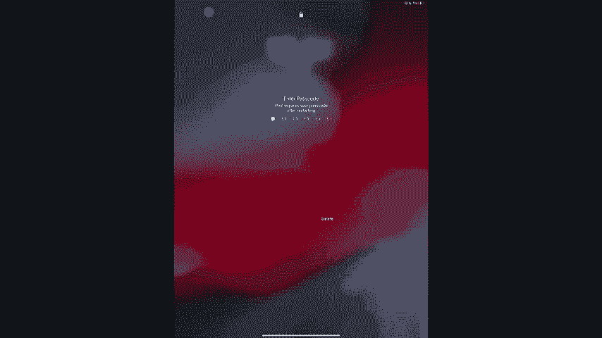
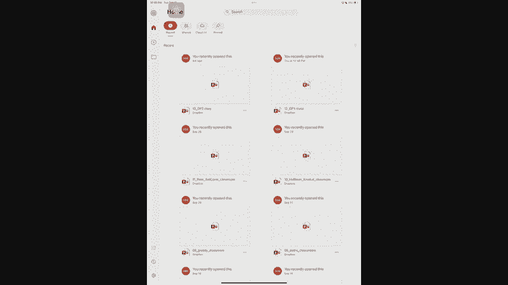
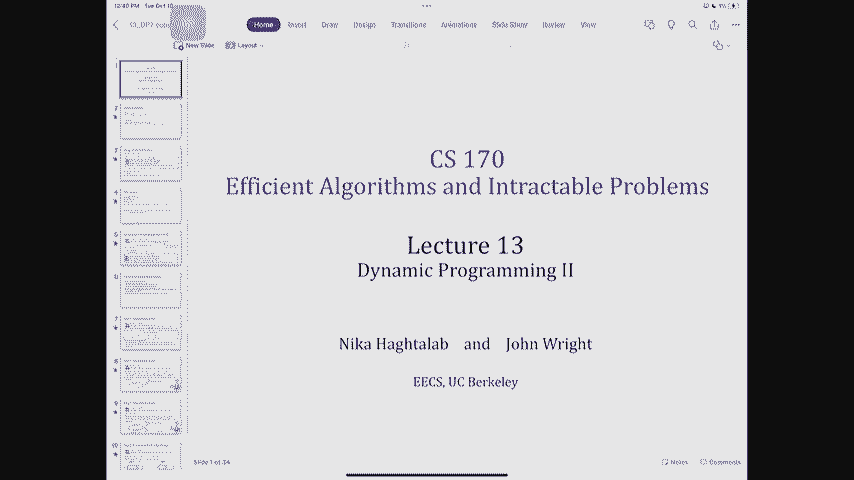
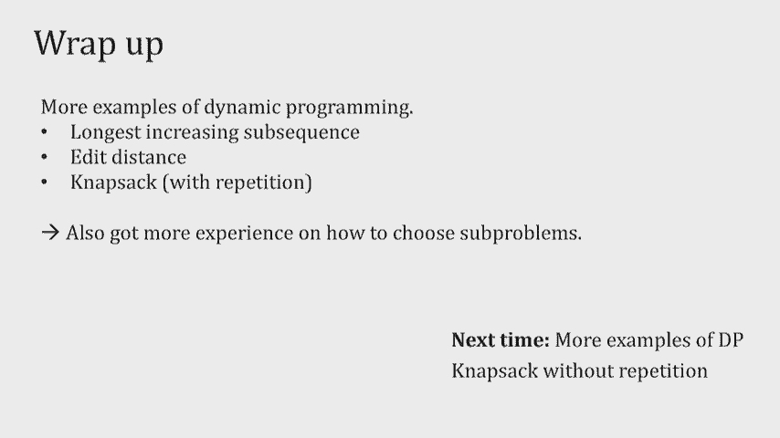

# 加州大学伯克利分校算法课程CS170 - P13：Lec13 Dynamic Programming (Part II) - 东风渐起UCAS - BV1o64y177K8

你们能听到我说话吗，虽然，好啦，大家都好吗？很高兴你的成绩还没回来，还是你现在就喜欢，好啦，如果你在等成绩，为了家庭作业，为了期中考试，期待他们在周末，所以今天我们将继续讨论动态编程，在那之前。

让我们看一下公告，就像我刚才说的，我们还在给期中考试评分，差不多了，但你知道这些事情需要时间，所以我会在周末之前给你，所以你可以在周末庆祝，家庭作业，希望你知道第六作业明天要交，这是一个较短的家庭作业。

但我希望你在今天之前就已经开始了，尤其是家庭作业7今天晚些时候会发布，一旦发生这种情况，我们将回到预产期的正常时间表，所以它将在星期一晚上到期，这里有一个免责声明，从我听到学生们说。

动态编程作业可能是他们最讨厌的，所以你要知道，会更有挑战性，或者再长一点，这意味着我们试图让你真正练习动态编程，因为学习动态编程的唯一方法是通过实践，所以不要等到作业七开始，立即开始，家庭作业也是这样。

我们真的希望您尽可能多地练习动态编程，直到最后一刻，今天的公告就到这里，问题，上次我们做了什么，嗯，我们谈到了动态编程，我们看到了很多它的例子，但最重要的是，我们试图通过这些例子来理解的一点是。

如果有办法解决动态规划的疯狂，我们应该遵循一个食谱，这个食谱有非常具体的三个步骤，第一步是我们必须确定一些子问题，我们说这看起来很像分而治之，除了这些解决动态规划中的问题实际上有很多重叠之外。

所以如果我画这棵树，感觉就像我在许多不同的分支中解决同一个子问题，所以第一步是识别这些子问题，第二步是暂时忘掉动态编程，尝试用分而治之的方法来解决这个问题，在写作方面，一个反复的关系。

一旦你弄清楚了复发关系，然后你开始考虑动态编程，以及如何记住存储在子问题中的这些信息，它本质上要么是一个数组，要么是一个表，然后你就会开始解决从最小到最大的问题，并将子问题的值存储在该表中，这就是食谱。

我们看到了几个例子，我们看到了斐波那契，我们看到了很多最短路径的例子，如果你还记得我们在达吉岛看到的最短路径，我们看到了一个叫做可靠的东西，最短路径，那本质上是贝尔曼福特的一个版本。

然后我们看到了所有对最短路径，所以今天我们不讲最短路径，我们要去拜访一对不同的夫妇并和他们一起练习，其他形式的算法和问题，那么这些会是什么呢，他们会是最长的，递增子序列问题，我们看看是什么。

编辑距离问题和背包问题，我不想在全班同学面前绊倒，所以我要花一点时间来做这个，会很有趣的，我敢肯定，不过，好吧，就像我已经说过的，做动态编程的最好方法是通过大量的例子，所以我们今天要练习动态编程。

下一节，让我们开始，我想确保我们今天注意的一件事是，当我们考虑设计第一步的时候，找出那些子问题，我们应该注意这些子问题的走向，第二步，我们想递归并编写一个递归关系，所以我今天要你们做的是。

在一些讨论中确实注意到了，子问题需要存储多少信息，它们的结构是什么，所以我们直观地获得了更多关于，如何设计这些问题，所以要留意那些，尤其是我们要讨论，确保你坐在某人旁边，如果你现在想站起来挪几个座位。

这样你就可以和其他几个人谈谈，你可以花点时间做这件事，我们要讨论一下，有人想搬家吗？好啦，我们从最长递增子序列开始，这是一个由输入给出的问题，你可以把它看作是一个由n个整数组成的数组，一个，一个二。

两个，阿恩，你要做的输出是找到最长的，增加输入的子序列，如果某物是一个子序列，这意味着它是指数的选择，那不一定是毗连的，所以你可以，你可以喜欢，跳过一堆其他的事情。

增加意味着后面的每一个数字都应该比前一个大，只是为了确保我们意见一致，我知道我们习惯于认为数组是零索引，这个，我们不会对它进行零索引，这本书也没有零索引，没关系，但你要记得，我们的工作是一对一的。

而不是从0到A再减去1，假设这是我的数字数组，所以这是一个递增的子序列，这不是一个不断增加的后续，很好很好，这不是一个不断增加的后续，这是，但是，越来越多的后续行动，好啦，六七，他们不是毗连的。

他们不是挨着的，但是六个然后是七个，七比六大，现在红色的不是一个递增的子序列，因为我从六点开始，我数到三，然后我回到六，关于增加子序列有什么问题吗，我们将讨论严格提高标准的实际问题，通常谈论不减少。

所以两个版本都可以，好啦，所以让我们想想如何用，让我们回顾一下食谱，第一步，识别子问题，第二步，做递归，第三步，记住，哦对不起，在我们开始第一步之前，我们为什么要关心快速解决这个问题。

我想在这里给你们举几个例子，它们都很抽象，但这个问题实际上作为一个算法子问题非常重要，如果你还记得，我们也说过像这样的事情，我为什么关心拓扑排序，因为它帮助我，你知道的，解决其他问题，这里很相似。

最长递增子序列是一个让我们真正很好地理解随机性的工具，假设我洗了一堆牌，然后我问你，我把这些卡片一张一张给你，我要求你们尽量把它们按顺序堆起来，好的，好的，这很像你可能在电脑上玩的纸牌游戏。

它的英文名字叫耐心排序游戏，这与，一般最长递增子序列，最长递增子序列是理解我们有多少随机性的一种方法，就像，如果我看一个社交网络，在连接中有多少随机性，如果我看分布或某种排列，我有多大的随机性。

所以这是一个非常重要的数学结构，这就是为什么我们实际上在研究它，我们需要一个好的算法，好啦，所以考虑到这一点，让我们思考如何为它设计动态编程算法，好啦，所以我们将讨论什么是解决这个问题的好方法。

有两个解决问题的例子，我要向你求婚，我希望你们讨论并找出哪一个更好，所以第一个思想问题，假设我要分配这个数组，j的l和j的l，数组中最长递增子序列的长度，在第一个玉坐标中，第二个子问题是。

同一数组中最长递增子序列的长度，at aj，所以这就是子序列，它的最后一个位置必须有一个j，其中哪一个更适合这个问题，当你思考什么更适合一个问题时，我们应该考虑这一点，因为总的来说有两个因素。

我们不希望有大量的子问题，时间越长，我们要处理的子问题的数量就越多，我们要做的计算越多，但我们也希望我们的子问题存储足够的信息，所以我们可以对它们进行递归，那意味着什么呢？

它意味着对于较大的j求解较大的子问题，我应该能递归地解决它，只看较小的L j的值，而不回头看实例，一次又一次，好啦，所以考虑到这一点，让我们花两分钟和坐在你旁边的人讨论一下。

并找出其中哪一个解决问题的时间最长，增加子序列，所以去吧，我们开始吧，好啦，让我们再花10-15秒，好吧有人自愿告诉我，你能告诉我你会如何直观地进入第二步吗，你真的想告诉我，没关系，我们可以好的。

所以我们说他更喜欢，因为他们的团队更喜欢第二个，它仍然有n个子问题，有趣的是，似乎没有那么多，可能解决方案之间有重叠，因为如果它以j结尾，其他的事我就不多说了，但最重要的是他声称。

我可以更容易地考虑第二步，我再找一个志愿者，首先，有人不同意这一点，有谁更愿意选一号，如果有人想为第一选择辩护，好的很好，你不应该，有人想用第二步来证明第二种选择是正确的吗，让我看看旁边的人，对不起。

我忘了你的名字，好啦，我其实记得，我只是不确定，所以阿曼说，是呀，它帮助我完成第二步，因为储存aj做的一件事，事实上，我知道我的结局是帮助我，下一个最大的子问题，我能做的就是确保，这个aj会比ai小。

因为i大于j，如果我要插入它并将其添加到这个子序列中，所以跟踪aj实际上是跟踪非常有价值的信息，如果我不跟踪AJ，我知道长度，但我不知道，如果我能在最后附上一些东西，并保持它的增长，好啦。

这正是你在设计这个子问题时应该考虑的，所以让我们来看看我们是如何做到这一点的，所以你是对的，我们将使用第二种选择，所以你要记得，这是1到j中最长递增子序列的长度，重要的是以AJ结束。

我们从一到N跟踪这个，我们这么做的原因是因为，如果我不跟踪什么是喜欢，迫使AJ成为解决方案的一部分，我不知道这个序列中最大或最后的元素是什么，子序，所以我不知道我是否能再加上一件事。

让我们在更实际的环境中看看，本质上你想思考问题的方式，不管子问题是什么，没有存储或没有说明，会像，从你身边带走，你没有这些信息，你对这些信息有点盲目，您只能观察子问题存储或声明的内容，例如。

如果这是我的后代，我甚至看了后续的长度，我知道有一个长度来增加子序列，如果我不知道接下来的最后一件事是什么，我不知道能不能加七，但如果我确定，这个蓝色盒子里的子序列以9结束，我保证。

虽然我知道长度是四个，我也知道我不能再在子序列上加七了，这有助于我编写递归公式，安曼实际上给了我们一个递归公式，那么我们是如何很好地完成这个递归的呢，它在思考同样的想法，每次我想解决LJ的时候。

我看了所有比它小的问题数组，所以i小于j，然后出现了两种情况，第一种情况是我想添加的东西实际上更小，最长递增子序列的最后一个元素，所以这是这样的，我有一个最长的递增子序列，我知道九点就结束了，我在问。

我可以再加七个吗？答案是我不能加7，所以我不能增加这个子序列的长度，所以这个东西不会增加，万一2呢万一2，事实上，我可以通过思考这样一个事实来增加它，即我的AJ大于AI，我可以把这个长度增加一个。

现在想想我如何编写这样一个递归，我写的方式是一开始就说得很好，如果有的话，如果有这一套，我应该说如果这个集合不是空的，然后在它的长度上加一个，所以本质上，我在回顾所有较小的，我在问。

我可以添加我的新元素吗，如果这碰巧是空的，没关系，是不是1，LJ也可以设置为1，嗯A我不到A，j对于i小于j而存在，所以这是递归公式，有人提出了关于这个的问题，好啦，所以我们完成了第一步。

通过深入思考如何做第一步，我们做第二步更容易，现在让我们想想第三步，所以这是我必须记住事情的时候，那么我怎么记，让我们看看如何编写一个算法，我会写一个算法，我说我有N个子问题，1的L，二的L，三的L。

我什么都爱，让它自己吧，长度数组，然后我从下往上遍历这个数组，从最小子问题到最大子问题，我问，到目前为止有索引吗，因为艾比阿杰小，如果是这样，我将对满足这个条件的所有指数取最大值，这些是我可以，实际上。

在随后的末尾添加我的元素，因为我的弧度会比那些序列结束的地方大，如果没有，那我算是基本情况了，本质上是因为如果没有像，如果我是到目前为止的最小数字，那么我所能做的就是成为名单的开始。

然后我会归还最后一个，最大的子问题，关于伪码的N个问题中的L个，我们刚刚写了，为什么耶，问得好，为什么，最大值是多少，所以我说我在看J，记住子序列不需要是连续的，所以有可能到目前为止其他一些后续的。

用这些蓝色的台阶，以一个人工智能结束，所以我所知道的是，如果一个j大于i，我绝对可以把这个东西添加到我的小子问题中，但我选择Max的原因是因为我也对另一个后续感兴趣，这可能会在AI Prime结束。

这就是为什么我一直在看扫描从一切，因为我不需要我的子序列是连续的，我要求所有出现在我面前的子问题，这就是为什么我要带Max去解决所有较小的子问题，好啦，啊，这是个很好的问题，您应该返回max。

这是个好问题，对不起，那是，那其实是一张桌子，好呀，那么每个元素和l代表什么呢？呃，我会再写一遍，在上一张幻灯片里，但是j的l是子序列的长度，Aj好的，它必须是最大值的原因是因为。

也许我的后续不会在最后一个位置结束，这就是为什么我要最大限度地利用一切，否，好啦，很好嗯，你可以这样理解，那么这意味着什么呢，意思是我走这一步，我只想确认一下，好啦，所以我要做的是一个接一个地扫描。

我问，我是不是比AJ少，当我发现有一个AI比AJ少的时候，我进入我的循环，现在我得拿最大值，所以一个方法是我会再次扫描，我会说我比J J少吗，L是多少，我留着最大的大象，然后我做加一。

所以这是一个很好的问题，为了让我们了解这个算法的运行时，因为我们说的是循环，那么对于动态编程来说，运行时通常是什么样子的呢，从子问题的数量来考虑运行时是有帮助的，然后每个子问题所做的功。

这实际上与动态编程非常相似，唯一的区别是既然你在背，您不需要重做计算，那么在这个例子中，我有多少子问题，有人能告诉我，这两个为什么，子问题是这样的，很好是的，你说的是运行时，你在我们前面。

一些问题的数量往往是，但是什么是运行时，所以这里的答案是N对两个，那么为什么运行时，对这两个，这是因为如果我看每个子问题，我什么时候才能看到，如果循环如此，这是我开始看我的子问题的时候。

我喜欢每个j都有一个子问题，本质上，我正在扫描整个阵列，一直到那里，这需要N个时间，因为在你面前还有很多很多的事情，所以这将是另一个n步，这意味着我们在每个子问题上花费了n个时间。

这就给了我们整个算法的n平方运行时，这就是我如何用n的平方解最长递增子序列，是呀，是呀，直到j的长度包括aj，这个序列必须以J结尾，这很重要，因为什么。

我们这么做是因为有时候我不可能把你加到另一个名单上，假设这是我的清单，这是j，这个j是负一万，好的，好的，我写不了一万，但这就像我拥有的最小元素，这意味着我不能把它附加到任何东西上，但从技术上讲。

这可能是一个新的后续行动的开始，然后被其他人使用，这就是为什么，每当我不能把它附加到某件事上时，我还是想承认，它可以作为后续行动的开始，任何元素本身都可能是子序列的开始，只是有时候。

它最好附着在另一个子序列上，通常是立方体，因为你得，如果你用蛮力，蛮力会是什么，所以有不同的蛮力，其中一些是指数级的，那么什么是蛮力你，好啦，这是因为子序列不一定是连续的，如果我只是想看看连续的子序列。

然后有n的平方，然后我得检查它们是否分类好了，就像n的立方，但考虑到我可以在中间放下很多东西，其实呢，如果我要用蛮力，我得看看我结束的东西的所有子集，这就像2的n次方，所以蛮力真的很糟糕，甚至比这更糟。

即使你必须是毗连的，但重要的是，递增子序列不连续，您可以在中间删除元素，好啦，其他好问题，好极了，这是我们今天看到的第一个例子，我们看到思考我们的问题是很好的，在某种程度上，我们将在第二步中使用它们。

现在让我们看另一个例子，这就是所谓的编辑距离问题，编辑距离问题作为输入，两个字符串s和t，它们的大小不一样，所以S可能是一个数组，就像大小为m和t的字符串是大小为n的字符串，然后计算是什么。

将s转换为t所需对s进行的最小编辑次数，现在什么构成了编辑，嗯，编辑是，例如，如果我把这个字符串s插入一个字母，那是一个编辑，如果我删除s的一个元素，那是另一个编辑，如果我把一个元素从a改成c。

那是另一个编辑，好啦，所以你一次对一个字母所做的任何动作，添加、删除或更改是一次编辑，那么为什么我们真的想知道，嗯，如何将一个字符串更改为另一个字符串。

或者我们甚至可以看到一个将一个字符串更改为另一个字符串的例子，假设我有两根弦，一个是下雪了，茶是晴天，我想知道有多少故意编辑，我需要从晴天到下雪，或者下雪，太阳光了，所以考虑这个问题的一个方法是。

我可以从Snowy这个词开始，我首先要做的是在s和n之间加一个u，所以这是一个编辑，我得到了所以我，然后我要做的第二个编辑是把字母O改为N，我去找苏妮，我要做的第三个编辑是删除W并获得Sunny。

所以三次编辑就足以从下雪变成晴天，你可以检查一下，不应该有更少的编辑数量，你可以把雪变成雪来学习，好啦，所以从下雪到晴天的编辑距离，关于编辑距离的问题，好啦，我们为什么关心计算编辑距离，嗯。

这就是你的手机自动纠正你的方式，它基本上发现了你写的最接近字典里没有的东西之一，它找到了最适合写下来的东西之一，所以我的名字经常被更正为迈克，那是在它出现的另外两个地方的距离上，是DNA分析。

当你真的想知道相似性和相似性之间的相似性时，有时是为了法医的目的，你想知道两个DNA序列，然后你可以用它们的编辑距离来谈论它们，还有其他一些问题在dna分析中被大量使用，它们也通过动态规划来解决。

您可能听说过最长公共子序列，如果你还没有去读它，那也是件很酷的事，两者都在基因组学中被大量使用，所以这就是为什么我们想知道两个单词之间的编辑距离是多少，现在呢，我们想这么做，嗯。

但在我们真正深入挖掘编辑距离之前，我认为与其把它看作是删除，所有这些就像一种更容易思考编辑距离的方法，如何对齐两个字符串，这就是校准的成本，让我来谈谈对齐是什么样子的，因此。

编辑距离是两个字符串对齐的最小代价，如果你想考虑对齐，对齐定义为将两个字符串一个写在另一个上面，然后把它们排成一行，然后看每一列，两个字符串不一致的任何列，然后你将惩罚这个对齐1，因此。

对齐的代价是它们不一致的列数，所以这是一种书写和对齐雪和阳光的方式，所以这里的破折号，他们的意思是我只是在增加空间，所以这意味着我在添加空间，所以如果我想把这看作是一个对齐。

这实际上指的是一种非常特定的编辑类型，这是我添加你的编辑，这就是为什么你提到这个，就像破折号到空格，我把O改成N，我删除了W，所以这正是我在上一张幻灯片中所做的编辑，作为对齐的一种形式写成，我看着这个。

我说这是与成本三的一致，因为有三列两个字符串不一致，现在呢，我可以有一个更糟糕的对齐，成本更高的对齐，嗯，例如，我可以这样对齐，这将意味着这是一个变化，给你，这是一则广告，这是另一个从o到n的更改。

这是对w的删除，而这样的对齐，哎呀，要花四个钱，好啦，所以当我要求找出两个东西之间的编辑距离时，您可以将此视为一个优化问题，你试图以最低的成本进行优化，两种力量的结合，你能假设成本是什么吗，是呀，好呀。

所以不管我们现在讨论的是什么，我们的工作方式是，我们在说这无关紧要，如果你换两个字母，那些信是什么并不重要，它的成本是一样的，编辑距离问题的推广，重要的地方，你要改变的东西，因此，如果它是自动更正的。

例如，彼此更近的Q键通常成本更低，嗯，或用于基因组应用，某些类型正在更改，我们较低的成本，但是为了今天的编辑距离，这是固定成本，不管你删不删，添加或更改，那是一个人的成本，那么我们该如何解决这个问题呢？

嗯，让我们记住，第一步是出现一些问题，记住我们需要的是子问题的数量应该很少，所以没有蛮力，因为蛮力会给我们带来太多的子问题，但它也必须有足够的信息，所以有人想给我们一个建议吗，至于。

也许有一种方法可以解决编辑距离的问题，好啦，所以建议是子问题，我要考虑一下，至于s的任何子字符串，和t的任何子字符串和子字符串，现在它必须是连续的，就像让我们，我们称它为s的前缀和t的前缀。

我会跟踪他们是如何对齐的，他们结盟的代价是什么，然后我试着把最后一个字母对齐，所以这是一个很好的，任何其他建议，我喜欢这个的一个原因是你能告诉我，这样一个子问题的数量是多少，它实际上是n和m的乘法。

因为你要跟踪两者，因此，所建议的子问题目前被写在屏幕上，所以我们要说的是，这次我有一个二，D数组，我实际上用来跟踪我的子问题，E的子问题，我是，J，E，i和j是s前缀从1到i的编辑距离。

和t的前缀从1到j，所以你你，你在想编辑的距离，或者你可以把它看作是最小的成本，这两个字符串之间对齐的最小代价，1到i的s和1到j的t，我们将展示为什么这是一个很好的子问题，但在那之前。

关于子问题的实际定义有什么问题吗，让我们看看这些子问题的数量，所以我对每只眼睛都有一个子问题，每个j和j都可以是1到n之间的任何值，我可以是1到m或0之间的任何东西，所以技术上来说。

我猜想子问题的数量是n加1乘以n加1，n乘以n，嗯，为什么这是一套很好的解决问题的方法，这是我们接下来要看到的，所以如果我处理这些子问题，嗯，我基本上是怎么做递归的，我必须回答这个问题。

让我把解决的问题写回来给你，这样你就可以在屏幕上看到了，我必须解决的是，我可以用什么不同的方式来调整，使用较小的子问题S 1到I和T 1到J，我建议只有三种方法来解决这个案子，一个是si。

本质上说si正在被删除，所以我，s的最后一个位置正在与空白空间对齐，剩下的部分是这两根弦之间的对齐，案例二是添加tj的地方，所以这更像是说我在添加一些东西，例3是说我把si改成了t j。

所以考虑到这三个案例，和坐在你旁边的人讨论，然后告诉我你要写什么，E ij等于这三种情况中的每一种，所以你现在要写的是用e表示的ij，较小的i和较小的j，让我们回答一个问题，澄清，否，不应该是我减去一。

因为我总是要确保所有的字符串都是匹配的，所以我匹配的方式，这是说我把整个字符串的1对i，用1到j减去t中的一个，然后我加了TJ，在你讨论这个之前，还有什么澄清问题吗，好啦，我们休息一下，也许两个。

你应该告诉我每一个案子，递推关系是什么，所以慢慢来，我没听到很多人讨论，很清楚问题是什么吗，我们再休息十秒钟，好啦，我有一个自愿的案例一告诉我，如果这是第一个案子，递归关系是什么，好呀，好啦。

所以我们说这是，我马上就会解释，E i减去一，J在那里，别的加一个，好啦，你能解释一下你是怎么做到的吗，所以本质上，当我在这里看的时候，这是一封被分配的信，与破折号对齐，所以这是一个成本，无论如何。

因为本质上我有一个SI，现在我没有了，这两个字符串是最佳对齐的，这正好是s到n减去1之间的编辑距离，1到j的t写成i减去1和j的e，所以这个加1是为了这个，这个是给那个的，关于案例一的问题，好吧。

你有一个问题，对呀，所以当我看着这里的时候，这并不意味着，这并不意味着i-1处的字母与字母对齐，J at J，它的意思是这两个字符串是最佳对齐的，好啦，当我把它们对齐时，我为他们支付编辑距离。

所以这里的编辑距离代表了对齐子串的最佳方式，然后我承诺以这种方式基本上对齐最后一个字母，因此加1正好，好啦，现在呢，考虑到这一点，我能有另一个志愿者告诉我吗，万一二，i到j的优e减去一加一。

原因也是一样的，加一个是最后一个对齐，我把TJ和破折号对齐，所以我得付一个，剩下的对齐是对齐s和s的最佳方式，s的前缀和t的前缀，直到i和j减一，这就是为什么我这样写，现在考虑到这一点。

3号病例有人自愿吗？很相似，是呀，好极了，我要介绍一个函数，指标功能，我就这样写，让我定义一下这意味着什么，这是一个函数，这种设置的结果是，最后一列将只支付罚款，如果这两个字母真的不一样。

这个叫做指示器函数的东西，也只有在两个字母实际上不同的情况下才会支付罚款，如果他们是一样的，它不付钱，然后第一部分又是，在两个字符串中对齐i减去1和j减去1的代价，所以考虑到这一点。

因为只有三个这样的案子，本质上是最小的，递归是处理这三种情况的最佳方法，你应该三个都试试，看看哪一个更好，所以这会告诉你，如果我，如果你应该改变，删除或添加有关此的第三个位置问题，很好。

所以你在这里计算了递归，考虑到我给你的问题，所以说，让我们想想怎么进去，为了喜欢，准备好好想想，我写的是递归关系，我还想谈谈基本情况，所以你在上一张幻灯片中已经计算出了这个，我们一起想出来的。

这与我之前描述的指示器功能相同，但也有一些基本情况我们没有描述，所以这两种基本情况或两类基本情况本质上是，每当我有一个单身，空字符串在前缀处显示为零，就像一根没有任何东西的弦。

我试着匹配第一个i或第一个j，S I和S J的位置，然后发生的事情是，因为其中一个字符串是空的，就好像我把所有的字母都加在了另一个里，这就是为什么，零会是i，而零会是j，对于所有i和j。

所以这些是现在的基本情况，如果我想记住这样一张桌子到目前为止，我们一直在处理一张桌子，它们是一维数组，这实际上是一个例子，我们的记忆是一个二维的，我们有的子问题的数量是二维求解问题。

这更接近于我们上次看到的问题，当时我们正在处理一张桌子，而不是一维数组，所以让我们这样想吧，所以这基本上是我的表，它记住了e好吧，我想说的是如果我看着这张桌子，递推关系是说在你计算ij的e之前。

你应该计算i的e减去抱歉的j，这应该是i的e减去1，i的e减去1，好的，好的，所以这些是表中应该已经存在的三个位置，在计算ij的e之前，因为这三个案子，现在呢，我该怎么做。

这也将是未来幻灯片中的一个错别字，那么我该怎么做呢一种方法是，我从所有的基本情况开始，所以我知道这将是零一，我减了一个，我一路走来，然后我将按照这个顺序继续，我会填满下一栏，然后是下一列，然后是下一列。

请注意，如果这是我每次击中某个细胞时都在做的事情，我已经确定这三个位置都已经填好了，所以我实际上是在以正确的顺序解决子问题，好啦，我不必按这个顺序去，我的另一个任务是填写这些问题。

然后我会像这样一行一行地解，每次我到这种地方，我知道这件事已经解决了，这件事已经解决了，这个问题又被解决了，每当我接触到一个细胞，它所依赖的所有子问题都已经解决了，或者如果你想变得花哨。

你能做些什么来一次解决这样的问题，像这样，然后这是一种更好、更花哨的做事方式--没关系，每次我到了一个地步，我知道右边的一切，它的左边和上面已经解决了，所以这是三种不同的记忆方式，就像记忆的顺序。

你可以挑你最喜欢的，真的没关系，在我们为这个写伪代码之前，有什么问题吗，好啦，那么让我们看看如何很好地编写伪代码，这是编辑距离，提醒自己我们拿着两根弦，然后我要做一个数组，这是n加1，n加m加1。

n加一个数组或表，I将首先处理所有的基本情况，所以我会填写第一列，第一行的第一列，就像我们说的，基本情况将是，如果其中一个元素为零，另一个是i或j，然后我要做的是，我可以选择我最喜欢的方式，这是呃。

我要看一个，那么这看起来像什么，我迭代了i，我遍历了j，i，set，e，of，ij，to，the，least，of，3，value，这正是我们谈到的三个值，i的e减去一，i j的j e减去1。

两个加一个，然后另一个更关心，Si和TJ是一样的还是不一样的，然后递归到i-1，J减1，最后我要做的是一旦整张桌子都填满了，我会看看桌子的最后一个位置，这将告诉我整个两个字符串之间的编辑距离。

关于伪代码的问题，那么运行时像往常一样是什么，我想先考虑子问题的数量，所以子问题的个数是m的o乘以n，因为每个问题的子问题数，这个E中的每个单元格都是一个子问题，现在每个子问题我做了多少功。

实际上它并没有那么多，所以对于每个子问题，这是我必须实际执行子问题的任何工作的地方，我至少取三个值，既然只有三个，只是一个不变的权利，所以我每做一个问题的工作量，这意味着整个运行时将关闭m乘以n。

因为这是我有的子问题的数量，每个子问题都需要恒定的时间，这就是你编辑距离问题的方法，好啦，所以让我们休息三分钟，当我们回来的时候，我们将讨论背包作为我们最后的应用，如果你要出去，请随手关门。

这样我们就听不见了，一期三八，我1点41分见你，好啦，我们最多十秒钟就开始了，下面我们将讨论背包，我知道你在过去的课上见过背包，你可能听过不同版本的背包，所以这是今天的背包，有重复。

如果你知道那意味着什么，但除此之外，我会向你描述，那么什么是背包问题呢，背包问题是由一定重量容量的输入定义的，所以我有一个背包，我能装下它的重量，然后我有一堆项目和项目，每一个都有一定的分量和价值。

所以wi v i是每个项目的权重值对，我们假设所有东西都是整数w，还有重量和一切，我想输出的是最有价值的物品集合，我可以把这个背包，所以它们的总重量符合w，这样我的背包就不会破了。

但我试图优化最大的价值，我将得到它们的价值之和，所以让我们看看这是什么样子，假设我有两种不同的背包，一个是它被重复地称为，有时它被称为无限制供应或无限制背包，或有替换，这个想法是。

呈现给我的项目是项目的类别，我可以选择我想要的副本，我可以尽可能多地把它加到我的背包里，另一个没有重复的版本，或者零一背包，这些物品是真实的物品，我最多只能选一份，所以要么我选择一个项目，我接受它。

否则我不会选择它，把它放在桌子上，所以我们看的是重复的第一个版本，这方面的一个例子是好吧，所以我确实有这本书就像背包一样，可以负重10公斤，我有一堆东西，也许让我们说，我试着喜欢，去野营。

所以我有十分之一的重量是六，但价值是30，我有一个三磅重的睡袋，价值是十四，我有，他的体重是四，价值十六，我的三明治重量是2，价值是9，我想打包的东西，这个背包，所以我不能带超过十磅的东西。

但我想拥有最有价值的收藏，所以随着重复，我能做的一件事就是收拾帐篷打包两个三明治，四加六等于十，结果是三十加二乘以九四八，好啦，所以这是我背包的一个解决方案，如果我允许自己重复。

这是我露营旅行的最佳打包方式，如果我不被允许重复，那我充其量也装不了两个三明治，我可以打包一个，但这也许不是最好的办法，你知道我去的时间够长了，我需要更多的食物，所以我要做的就是找个帐篷。

那我就用炉子代替，所以一个帐篷和一个炉子仍然是十磅，但价值不同，是四六，好啦，所以有重复和没有重复是不同的，重复是一个更容易的问题，因为你可以把你最喜欢的或有价值的东西打包，比没有重复更重要。

今天我们将重点讨论位重复，在那里我们允许自己多份副本，那么我们如何再次解决这个问题呢，我们想解决的问题不是太多，我们希望他们有足够的信息，在这种情况下，实际上不难想象，我会如何收拾我的行李。

如果我有一个小一点的包，然后我会怎么装一个稍微大一点的包，然后我会如何包装最大的，所以我的子问题实际上是这些对于任何重量容量，那还不到我的实际体重，对于任意整数w so，将KOS C定义为最佳值。

背包容量可实现，C，如果我要用这些东西，如果我把这些东西打包，好啦，这就是子问题，关于子问题的定义有什么问题吗，效率有点低，就像，让我们说，所以我们要去，就像，很好，那么这里有多少子问题，呃。

你叫什么名字？我的要求是，你让我们用几个子问题，我在这里用了多少子问题，有人能告诉我子问题的数量吗，这是正确的，所以如果我的背包有一吨，那么这将是非常低效的，因为我从一公斤开始，两公斤。

三公斤到一千公斤，所以它不是效率的模型，你是对的，我们将在今天的一张幻灯片中正式说明这一点，但这仍然是我们所能做的最好的，好啦，所以让我们来看看这个，嗯，但是给我的这些问题，我如何写递归，有人能告诉我。

我现在应该写一篇复述，如果我想打包一个很大的包，我可以用什么方法包装它，几乎我认为你说的是对的，但让我再说一遍，我会打包的方式，我是不是每次都会给它点个赞，我会把这个项目的一份副本。

然后我看到还有多少重量，然后我加上这个重量，我去把鱼饵装好，然后如果我要做这个自下而上，就好像我在解决一公斤，一天下来两公斤到一吨，所以这是做这件事的正确方法，既然这些是子问题，我们的递归步骤是说。

假设我承诺把一个项目的副本，我把WI小于C的我放进背包里，所以我拿了一件还能放在背包里的东西，我把它放进去了，然后我只剩下一个c的重量容量，也就是之前的重量，减去我刚打包的东西，然后这就是我的复发关系。

本质上你的意思是你打包一大包的方式，背包，基本上是你能想到的所有项目中的最大值，一次放一份，所以它们的重量必须能放进你的背包里，所以它们的体重必须小于c，然后你从承诺中获得的价值把它放在背包里。

然后你如何最好地打包你背包的其余部分，好啦，这就是递归关系，我为什么要让马克斯接管这些事情，因为您不想承诺添加一些项目，那可能不是什么值钱的东西，您希望确保您正在考虑所有可能的项目，你应该先打包。

然后把剩下的背包收拾好，关于这种复发关系有什么问题吗，这到底是不是从上到下，所以每一个递推关系或每一个动态编程都可以写成从上到下，每当我写递归，看起来我在写更大的子问题，就较小的子问题而言。

所以它看起来从上到下，当我填表时，我总是从下往上，所以这还是，我将为你写的算法将是一个自下而上的算法，你可以选择如果你，如果你喜欢自上而下，你可以像我们上次讨论的那样自上而下写。

你所需要的只是全球备忘录，记忆数组或表，所以每当你点击一个新的递归调用，你填一下，所以你不，将递归步骤称为递归步骤，只有在表格没有填写的情况下，现在剩下的就是把它写成一个合理的算法。

那么我如何把它写成一个合理的算法呢，这是我的递推关系，但我想把它写成一个自下而上的动态编程算法，所以这又是一个重复的背包，输入是权重w，然后我可以从它们的重量和价值中选择所有可能的项目，我要做的是。

我将从制作这个大小为w的k数组开始，加一个，因为每个重量都是零，两个重量W，我想知道怎么收拾我的背包，然后我说零的k是零，因为如果我的背包没有容量，我不能在里面放任何有价值的东西，所以这将是零。

然后我会从最小的子问题，等一下，等两个称重W，对于每一个我回首往事，我说很好，WI小于C的项目是什么，然后我考虑他们的v+解，已经写在我的数组中了，c减去wi的k，我把他们中的最大值，然后一旦我完成。

我返回K个W问题，会看到负WI永远是负的，否，因为我在这些项目上采取了最大限度，我可以保证，这件东西应该可以放在我现在的背包里，因为我保证wi不大于c，因此，我永远不会在空间的一个未定义的部分结束。

所以这就是算法，我们将像往常一样考虑这个运行时，我们设置子问题的数量并为一个问题工作，Tenish是对的吗，Tanisha，已经告诉我们，在这个动态规划中，子问题的数量是，因为从零点到零点，我计算出了。

我对这么重的背包有一个子问题，现在每个子问题我做了多少功，有人能告诉我，会不会是什么，每个子问题的w，嗯你很接近，但你说的并不完全正确，所以也许N中的另一个是对的，它实际上是每个问题n，但你知道吗。

我也会犯一个错误，为什么n都是，因为，我在看背包里能装下多少东西，它们中最多有n个将通过这个过滤器，我的意思是有N反正项目，所以我把马克斯比N件事，有些人喜欢的原因，如果你不小心。

你可能会认为这是错误的，因为我是说要确定w在c下是合适的，你可能会认为，啊，但我有很多这样的W，所以我们真正要看的是物品本身，嗯，所以这是正确的，所以每个子问题的运行时数为n，所以总运行时关闭n乘以w。

现在我们回到托尼的问题上来，请问这是，一个合理的算法是这个多项式时间还是不多项式时间，这是一个微妙的问题，每当我们谈论运行时，我们从，作为输入中参数数的函数，好吧，通常像这样。

这可能是Karatsuba的任何东西，输入参数的数量是数字，或者数字的位，我把它放在我的空间里，这本身并不是最大的数字，不是数值，是比特数，嗯对于图形问题，当我有节点的时候，一到n和边，一比一。

输入的顺序是n和m，这有点像什么，因此，我想考虑像我的运行时一样，作为n和m的函数，这里的微妙之处在于，当我们考虑这个问题中的输入大小时，问题是一个输入是w和w，它的数值是w。

但表示它所需的比特数就像卡鲁巴一样，位数，表示它所需的位数在w中是对数的，所以w的输入大小是，实际上是W的日志，我有一堆其他的东西，我有N个项目，他们每个人最多也是重量W，因为如果不是。

我本可以马上把它扔掉的，所以我有结局，话说回来，它们中的每一个都需要W位的日志，那么真正的，我的输入大小是，W的时间日志，所以n乘以w的对数，这不再是多项式时间算法，对n的依赖是好的，对呀。

问题是对W的依赖，我的运行时是W的事实，但是表示数，这将是w的对数，所以它实际上是指数大小的输入参数数，好啦，这是一个微妙的点，它是指数的吗，对w是指数的，因为w与w的对数相比是指数爆炸，但它并不可怕。

因为它不会爆炸，n右是n中的多项式，如果我的背包是一百个诱饵，这完全没问题，只不过是几袋重物，一吨又一吨的人就像在展示这个问题，所以这些算法实际上不被称为指数时间算法，它们被称为伪多项式时间算法。

它们不是多项式时间，但是我们为什么叫它们伪多项式算法叫做伪多项式，它在输入的数值中是多项式，而不是表示它所需的比特数，好的，好的，所以说，因为这绝对是w中的多项式，它是伪多项式，所以这是有效的。

但不是这样的，这不是效率的模式，它不像多项式时间算法，我们能做得更好吗，可能没有，如果我们这么做了，等级制度将崩溃，好吧，在我让你走之前，我想快速预览一下，你应该期待下次看到，因为我们反复说过背包。

但也有一个没有重复的背包，我只能拿一份，我不能打包两个三明治，我得打包一个三明治什么的，我想让你想想的是，我们还能用刚才定义的子问题，您可能会注意到这组问题，他们面临的挑战是他们没有足够的信息。

我知道我背包的大小，但我不知道我怎么已经把三明治放进去了，因为如果里面有三明治，我不能再加三明治了，所以我们将不得不考虑一种不同的方法来制造一些问题，当我们下次开始的时候。

我们将讨论如何设计一组不同的子问题，背包用的，我们今天做了什么，谈了这三个问题，下次我们会讨论更多的DP，因为学习DP的唯一方法是通过练习，家庭作业，七号来了，做好准备，早点开始。

这样你就可以和副总裁一起练习了，我们星期四见，是啊，是啊。

