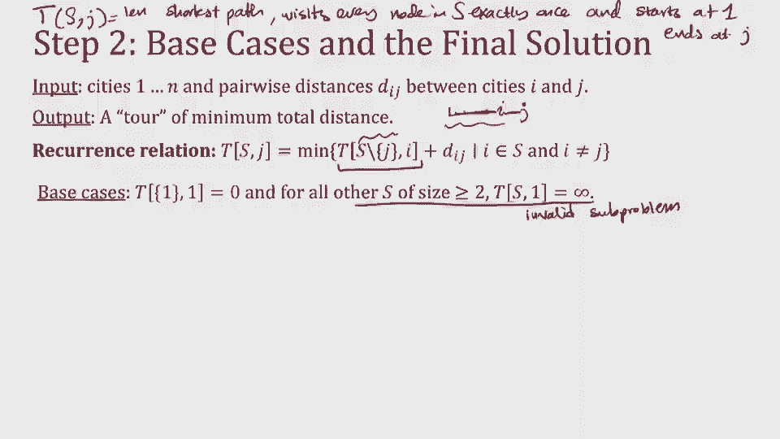
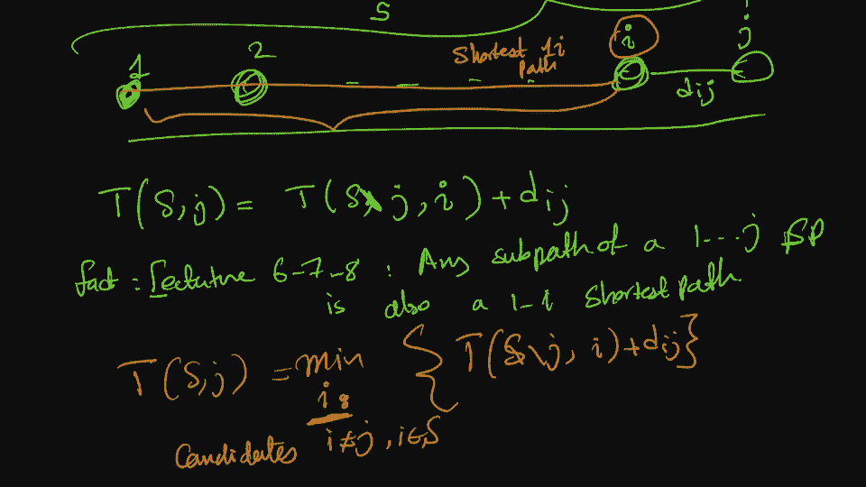
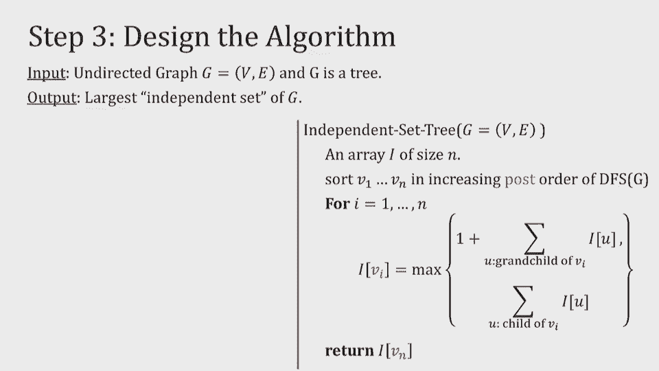

# 加州大学伯克利分校算法课程CS170 - P14：Lec14 Dynamic Programming (Part III) - 东风渐起UCAS - BV1o64y177K8

你们过得怎么样，那么你在其他课上的期中考试成绩如何呢？你是摩萨丹吗，好啦，所以现在还是期中考试，呵呵，然后呢，我想在下一个期中考试开始前你可能有两周的休息时间，作为一个本科生是很难的，好啦。

我们等几分钟，然后就开始，再过三十秒我们就开始了，只是在等你们中的一些人慢慢进来坐下来，今天我们要再上一堂关于动态编程的课，然后我们会把它包起来，开始一个新的算法范式，下一次，我知道你会错过动态编程。

所以说，我们已经确保，你们的作业会有很多动态编程的例子，所以你就不会那么想念它了，几个通知，作业七发布，但它发布得有点晚，为了公平起见，我们像往常一样把最后期限推迟一天到星期二，助教们求你了。

记住周二没有家庭作业派对，或星期二额外办公时间，所以早点开始，如果你想参加家庭作业聚会，星期一、星期五及办公时间，当年支持也最多，所以不要等到星期二，在那里我们几乎没有支持来帮助你完成家庭作业。

格雷的期中考试成绩快到了，它实际上已经被分级了，我们只是在打点I和交叉T，所以期待ED上的帖子很快，呃会把艾德的一切都正式化的，所以你知道，什么时候检查你的成绩和一切，告诉你任何关于降级的事情。

解决方案，你想知道的一切，所以说，帮我盯着点，让我们简单回顾一下前两节课，上两堂课的主题都是一样的，动态规划，希望你们还记得因为我们看到了很多例子，看例子的重点是我们有一个动态编程的秘诀，分三步走。

我们想练习这三个步骤，第一步是识别和识别子问题，使我们能够，然后考虑第二步，它是一个递归公式，就像我们说的，动态编程非常类似于分而治之，从某种意义上说，我们有所有这些类似子问题。

但主要的区别是它们是重叠的，所以第三步是一旦你完成了递归部分，你如何在数组中记住所有这些解决的问题，在属于你自己的事情上，这样你就可以高效地设计算法，我们把底部向上，自顶向下的方法来填充这个表，记忆它。

并设计算法，所以这是第三步，你看到了很多不同的应用，我们看到了斐波那契，很多最短的路径，呃，最长递增子序列，编辑距离，上次我们在背包上重复了一遍，但实际上我们要在那里，本质上，我们要回到背包。

我们上次看到了一个更简单的背包版本，就在最后，我给了你一些挑战的预览，你今天应该期待的，当你不允许你的Napsolution重复相同的项目超过一次，然后在一个背包之后，我们将看到更多的图形问题。

旅行销售人员问题，而被遗忘的独立集，然后我们将结束动态编程，让你们多练习一下家庭作业和讨论，好啦，所以像往常一样，学习动态编程的最好方法是通过大量的例子，我们要再深入一点，在第一步和第二步。

因为那些是最难的，你知道那是你需要直觉的部分，如何想出一些问题，承认一个好的递归解，好吧那背包长什么样，希望你还记得上次背包问题的定义，在那里我们有负重能力，那是总重量，我们的背包能装。

然后我们有一堆东西，他们每个人对我们都有分量和价值，我们想要这些物品中最有价值的组合，其总重量不超过W，我们举了一个例子，考虑有一个背包，或者一个10磅重的背包，有一堆我们想放进去的东西。

注意到有两种不同类型的溶液类型，这让我可以不止一次地重复一个项目，那样的话，我可以带一个帐篷和两个三明治，总价值四八，总重量十，但也有不允许重复的时候，所以我不能拿两个三明治，我只能吃一个三明治。

在这种情况下，我不得不带一个帐篷，然后我决定拿一个炉子，做更多的饭菜，价值四十六，重量十，所以上次我们把重点放在重复上，我们想出了解决的办法，使用动态规划，我们设计了子问题，我很快就会重述一遍。

但今天我们要从一个没有重复的开始，这个有一堆不同的名字，有时它被称为零一个背包，没有重复，没有更换，而您上次看到的版本是用替换的重复调用的，有时它也被称为无限制背包或无限制供应，好啦，所以就像我们说的。

动态编程的第一步总是想出一些，这就是我想让你记住的地方，我们如何用重复解决背包，有这些子问题，本质上我们说得很好，如果我想解决我沉重的背包的容量，十公斤，我也想办法解决，算下来是九公斤，八公斤。

七六五四二零，所以本质上我们有所有这些子问题，它们捕捉到了打包行李的最佳方式，如果你有一个较小的容量，我问你这仍然是一个好的解决方案吗，如果我不允许你重复一个项目，你给我的回答是看起来不像。

因为我们有一个额外的挑战现在我们只允许一个项目的副本，所以说，除了知道我的背包里还有多少重量要打包，最佳，我需要知道我已经选了什么项目，那里已经有三明治了吗？如果是的话，我不能再吃三明治了。

所以它超出了我背包的剩余容量，那么我们现在如何解决这个问题呢，从某种意义上说，我们需要做的是跟踪两件事，没错，我还需要知道我背包里剩下的容量，但我还需要知道，所以这里的想法是让我们跟踪两者。

我仍然会跟踪容量，但我也会有另一种方法来跟踪解决方案，它基本上说明了我使用了哪一组项目，在这里，记住我们有的几个解决方案实际上是有用的，比如，两次讲座前，当我们讨论每一条最短路径，那也是关于布景的。

你知道的，我想跟踪我的路径已经通过的节点集，所以这里会发生非常相似的事情，我要记录下，我的背包已经用了，好啦，那么我们该怎么做呢，让我强调一下，我稍微改变了这里的输出，为了明确您不能使用一堆副本。

所以现在解决方案必须只是项目的子集，我们的想法是我们必须有一个二维数组，或者二维子问题，本质上是解决问题，既适合更小的背包，也适合更少的物品，所以让我们假设我只是被允许收拾一个帐篷，我的容量很小。

然后向两个方向展开，第一个方向是我们上次已经做的，更高权重的递归求解，重量容量，新的部分递归得很好，或者为了解决更大的项目而积累，所以不仅仅是帐篷，但是帐篷和睡袋，帐篷睡袋什么的，那么我如何将其形式化。

我将通过讨论记录所有重量来正式说明这一点，这些是整数权重，整数重量容量c小于w，和所有j小于n的项，我定义这个数组，J和C的K作为背包不重复的最优解，餐巾纸有C容量的地方，它使用1到j项。

它不能使用j加一，它不必使用所有的一个到j，只是如果它使用的是一个项目，它必须属于集合1到j，关于这里子问题的定义有什么问题吗，但它是允许使用的，是啊，是啊，所以当我说最优解是只使用1到j项。

这意味着它没有使用j加一j加二到n，但它使用1到j的子集，所以我想让你现在做的是，尝试思考如何在递归中使用这些问题，因为这是第二步，每次我们设计第一步，它不能独立于第二步，我们必须确保我们可以递归。

所以我想让你做的是弄清楚我应该如何计算k，使用较小的子问题的Jc，有两个案子我想让你和那个，坐在你旁边或靠近你的地方，第一种情况是你看最优解，我所说的最优解是什么意思，我是说这个KJC的最优解，好的。

好的，所以更大的子问题的最优解，想象一下最优解，即使它被允许使用项目1到j，反正也不想选J项，这是第一种情况，第二种情况是最优解确实使用了j项，我想让你和你的朋友讨论一下。

告诉我这两种情况下c的kj是多少，这里的一个提示是，你需要跟踪一堆事情，那么你需要跟踪的事情是什么呢，嗯，你需要记录你打包的价值，而你却装进了你的背包，对呀，这就是全部，这就是要进入KJC的东西。

你想要最佳值，所以这是你需要跟踪的一件事，你需要跟踪剩余容量，你需要跟踪，允许在较小的，好啦，所以让我们花一分半钟来讨论这个问题，与坐在你旁边或靠近你的人，回来后我们一起想办法，二十一，好啦。

所以也许再多十秒钟，你们中的一些人还在讨论，1。有人愿意帮我吗？我能在这里找个志愿者做第一个病例吗，是呀，好啦，所以建议是，在这种情况下，它只是，减去1和c，你能解释一下你的理由吗？好啦，你叫什么名字？

好啦，杰西卡说的是，如果我的最优解，呃没有用J项，然后就好像它将被限制在只使用项目，1到j减去1，这就是为什么这里只有j-1，因为我实际上没有带任何东西和我的JS项目，我的能力没有变，所以还是c。

我的价值也不会改变，这只是较小的解决方案，因为再一次，我什么都没带，所以我没有从J中获得任何价值，那太好了，那是第一种情况，好啦，2。有人愿意帮我吗？太好了，你能让我先写下来吗？好啦，你叫什么名字？

安迪，好啦，安迪说的是，这是j的k减去1，安迪的V，你能再告诉我一点吗，为什么，优秀，好啦，因为我决定选一件J放在我的背包里，我得到了它的价值，那是我的VJ，然后我看着说，啊，现在我的容量少了一点。

我放进去的玉器的重量少了多少，所以一个c减去wj，剩下的就是1到j减去1，所以这太棒了，所以这是两个案例，和往常一样，因为你可以选这个案子也可以选另一个，最优的一个将是这两个选项中最好的一个。

所以这将是我们的递归关系，所以现在我们有了递归关系，有什么问题吗，好啦，现在我们有了复发关系，我们进入第三步，第三步实际上是思考动态编程，在记忆所需信息的意义上，所以其中一个重要的方面是决定以什么顺序。

我们要解决这些问题，就像最小到最大的顺序，所以让我在这里写一个从上一张幻灯片中的递归关系，让我加上两个基本情况，这里的基本情况，第一个本质上是说，如果包装任何大小的背包的最佳方式是什么。

如果你不能很好地使用任何物品，你能得到的最佳值是零，因为你不允许带任何东西，这就是第一种情况，第二种情况是说，如果我没有能力了，如果我的容量为零，但我还有其他数量的物品可以使用。

再问一次最佳的包装方法是什么，因为你已经没有能力了，你将从中得到零价值，所以这是两个基本情况，现在让我们看看什么是记忆顺序，就像我告诉过你的，我们应该好好想想，作为行上的二维数组，这里，我有物品或。

所以这就像不用，哎呀哎呀，不使用任何项目而使用一个项目，一，二，一，三，最后被允许使用行和列上的一切，我和往常一样有能力，所以没有能力，一直到W的全部容量，现在当我看我的解决方案时，JC的K。

它只需要或依赖于另外两个解决方案，它依赖于正上方的一个案例，相同容量的j减去1的k，它依赖于j的k减去1，这仍然是一样的，前面的绳子，但容量略低，我们展示了这个，如果你还记得这些，这是DAG的隐含表示。

它告诉我们在动态规划中子问题的顺序，这样做的一个方法是，我首先把所有的零放在这里，然后一个接一个，要么一排一排，要么按照我真正想要的任何顺序，我可以一排排去，逐栏并不重要，只要我一击中这个。

上面的问题我都解决了，它左边的任何东西，那点菜就可以了，那么当我很好地编写伪代码时，这是什么样子的呢，我们先把它写下来，记住作为输入是取w，那是容量的数值，以及每件物品的重量和价值，我们做一个数组。

那正是我在上一张幻灯片中的桌子，是n加1乘w加一个数组，我将把所有的基本情况设置为零，现在我必须去一个订单，实际上填满这张桌子，我碰巧选了一个非常具体的顺序，我会证明这一点，一秒钟后。

我要选的具体顺序是一排排的，填写此数组，而不是逐列或对角线，所以它一行一行地，对于每一行，它穿过整个容量，它说得很好，JC的K是什么，这正是我用递归的方式定义的，但现在它只是利用了之前出现的一些问题。

已经解决了，一旦它这样做了，在表格填好后的最后，我基本上想要右下角，哪一个是最大的容量和全套物品，现在呢，关于这个算法的伪码有什么问题吗，在我们分析这个运行时之前，这是个很好的问题，我应该在这里只采取。

J，WJ小于C的地方，让我想想，也许有一种更干净的说法，否，这样很好，这也是我所做的，不像上一节课，所以我们没意见，好啦，像往常一样，对于动态编程来说，运行时最容易描述，通常，但这是一个很好的地方。

可以通过思考，子问题的数量是多少，然后我们在每个子问题上做了多少功，所以这里的子问题的数量是，我保存的二维数组的大小，所以现在是n乘以w，我做了多少工作她很好地解决了问题，当我只是在解决问题的时候。

我在做这种最大化，这只是我最大化的两个值，而不是任意数量的值，所以每个子问题的作业量是恒定的，因此运行时的总量是w的n倍，如果你还记得上次，我们说过这不是多项式时间，这是伪多项式时间。

因为它在数值w中运行多项式，所以仍然是一样的，所以这是一个伪，我想说的另一件事是这个算法的空间复杂度，所以空间复杂度是你要储存多少，能够计算出一个算法，我刚才给出的算法本质上是存储整个二维数组。

正因为如此，空间复杂度是n乘以w，但我告诉过你，我选择了按排挑选的顺序，填写是有原因的，这个原因正是因为我对这种空间复杂性不太满意，事实上，如果我真的回头看我的桌子，如你所见，每当我为一个子问题工作时。

K jc，我只是在看它前面的一排，我不需要它前面的两排或五排，我只需要它前面的那个，所以你可以做的一件事是我可以喜欢的音符，因为我一次计算一个，我可以留着最后一排，所以我会计算这个，我来计算一下。

然后我会删除第一个，我会忘了它，或者我会重写它，等等，等等，如果我那样做，而不是把整个东西保存N次，我只是利用了w的空间复杂度，这是我们在其他算法中已经做过的一个技巧，在提高动态规划的空间复杂度时。

动态规划是非常常见的，当你注意到你有很多结构，就你正在计算的东西而言，就像，也许只是前面的数组，或者像前面的两个数组，或者类似的东西，关于运行时或空间复杂性的任何问题，是啊，是啊，所以我想说的是。

当我计算这个东西的时候，如果我看这里，我只看之前的角色，我从来不看更高的东西，所以我能做的一件事是我可以一次保持两排，我一直在写，一旦你知道，我想写第三行，我知道第一排无关紧要，刚刚删除，你知道的。

或者写在上面，正因为如此，我从来不需要写超过两三次，我不确定我是否完全没听错，所以你是说走这条路，你还在问太空，复杂性，啊耶，好啦，所以这是命令，我要进去了，所以让我把一切都写下来。

所以我会写上所有的零，然后我从第一排开始，好啦，所以第一排我只看顶部，所以那是零，然后第二排我会看，有时我会添加一个项目，在这种情况下，我将把v的值相加，如果我添加该项目，有时我不这样做，当我看着这里。

我回头看这个，我回头看别的东西，可能没问题，这就是我要做的，你说的对，每当我在这一行添加东西时，它是同样的价值被添加，就像VJ，你也可以在这里的算法中看到，处理第j行时，不是喜欢就是喜欢。

你拿着它上面的东西，或者你在这里取一些东西，然后加上VJ，另外就是，随着你的进步，行开始看起来很不一样，第一行都是零，但后来他们开始看起来很不一样，因为他们使用了不同的子集，好啦，所以这是背包和，嗯。

我们看到从重复到不重复，我们实际上必须使子问题稍微复杂一点，这是背包既是以前的版本，也是今天的版本，我们使用动态规划来真正改进蛮力算法的例子，我们没有得到一个多项式时间算法。

但我们得到了一个非常有用的算法，接下来我们要看到的是一个更复杂的问题，被称为旅行推销员问题，在计算机科学和数学中是出了名的难，但是动态编程实际上可以给我们更好的结果，比蛮力溶液好得多。

即使这不是多项式时间，那么让我们来看看这个旅行销售人员的问题是什么，你有N个城市，叫他们一对一，它们中的每一个你都可以把它看作是一个完全连通的图，你可以从任何一个城市到另一个城市。

只是你得付出一段距离才能做到这一点，城市i和cj之间的距离是d i j，然后你想要的是找到一个所有这些城市的最小距离之旅，旅游意味着什么，律法是一个循环，但我们将称之为路径。

这是一条穿过所有城市的封闭道路，从第一城开始，然后它访问每个城市一次，所以它不能回到一个城市不止一次，最后又回到了城市一号，好啦，所以这叫巡回演出，以及旅游的费用或距离，你必须在它的边缘付出的距离之和。

那么这看起来像什么，如果这是我的图表，城市A B C D E，你可以看到所有这些成对距离，这是一个，因为我可以从a开始，到b，e，d和c，让我们看看，所以我付二加三加四，那是9加211加213。

所以扭转距离，这又是一次巡演，我付多少钱，这个，两个，那是三个，八，三个，六个，另外两个，八，另外两个，这就是这次旅行的距离，那稍微便宜一点，我们在找最便宜的商店。

我真的不知道在这张图中什么是最便宜的工具，可能是这个，但我不知道的原因是，朴素的蛮力算法运行起来真的很贵，什么是蛮力算法有人能建议一个蛮力算法吗，会是，我会做一个BFS吗，总共多少次，只是为了和好好。

好啦，所以做面部护理是对的，约拿，你想添加一些东西，所以蛮力算法是一种查看所有排列的算法，基本上，从一个，然后所有排列顶点的方法，V代表种子种子，然后D，然后对他们每个人，你得把所有的距离加起来。

所以这是另一个n，所以您最终得到一个n阶乘的运行时，它是巨大的，这就像，如果你想考虑这个n的阶乘是关于n到n的，我要展示什么解决方案，你还是会看起来很糟糕，这是一个指数时间，但是稍微好一点，这将是。

我将用动态规划得到n的平方，乘以2到n，你可能会想，这样够好吗，让我告诉你，殴打，我想n乘以2的n，如果你能做到，那基本上是不可能做到的，这是一个很难改进的NP问题。

所以动态规划实际上给出了一个非常合理的解决方案，超越动态规划的改进是一个非常困难的解决方案，你现在可能只有很少的东西，我说的是一个出了名的难题，这是那些被反复使用的问题之一，我觉得是六二六四。

我不知道是哪个，当这是来自，我觉得就像，是啊，是啊，一九六二年，宝洁，这里是PNG公司，像几十亿美元，卖你的人，潮汐黎明和婴儿用品，所有这些事情，在62年发布了这个比赛。

他们就像帮我们弄清楚如何用我们的卡车去所有的城市，找到最小的tor，有一台电脑就像，然后他们提供奖品，当然有一位来自卡内基梅隆大学的计算机科学家，我的母校，谁赢了，因为他在研究旅行推销员的问题。

但是旅行推销员问题版本是从1800年开始写的，就像他们一年一度的比赛，比如你能解决多少城市的问题，因为有书是这样写的，只是想告诉你天真的解决方案，假设你只想去25个城市，最简单的解决方案是10比25。

动态规划是十之八九，所以仍然有14个数量级，这里是您用动态编程保存的，这就是为什么我说比暴力要好得多，即使它看起来仍然是指数级的，让我们看看这个算法是什么样子的，像往常一样，我们从定义一些问题开始。

这里我会给出子问题，思考的主要思想是，我如何制造一些旅行推销员的问题，一个挑战是旅行销售人员的问题，我要继续叫它茶匙，因为那是一口，否则，我不想谈论任何更小的周期，因为对我来说。

让问题是最优的真的很重要，它必须经过每个城市，所以谈论较小的周期是没有意义的，而不是考虑更小的周期，你应该考虑一个循环的部分解，所以循环本质上是一条路径，然后另一条路回来。

所以我们的子问题将跟踪从一个开始的路径，在某个集合中再次使用一堆顶点，他们做得最好，好啦，那么我们如何定义，把子问题看作是一个部分的游览，从城市一号开始，它在j城结束，它穿过片场的所有城市以保持一致。

集合s也包括1和j，那是这条道路的起点和终点，所以我会定义，让我们在这里看看，所以我将定义1到j的最佳长度，只使用集合中的东西，布景在哪里，所有这些节点，我写了一，一，一，二，我把它叫做s和j的t。

那么子问题是什么呢，对于1到n中的每一个j和我的音符的每一个子集，包括这套，1号城市和J号城市，好啦，我把s和j的t定义为，在S中访问每个城市的最短路径的长度正好是一次，回忆s包括1和j。

从1开始到j结束，这些是我的子问题列表，有点长，我们休息一下，可能不到一分钟，确保我们明白这一点，关于子问题表示或表示什么，有什么问题吗，好啦，那很好，所以我们知道子问题本质上是给我们最短的路径。

从一号城市出发，以cj结尾，对于既包括1又包括j的子集，那么我们实际上如何利用这些问题，第二步我想让你们多想想，所以只是为了有复发关系，抱歉，子问题又上来了，每j，对于每个子集s，包括1和j。

我希望s和j中的t是最短路径，从1到J，现在只使用我们，我想让你做的是计算sn j的t，使用较小的子问题，我想问的是，这是s j的t的长度，你怎么形容它的长度，使用较小的子集，没关系，让我举一个例子。

嗯，假设我知道这里的最后一个顶点是，我如此，如果我知道最后一个顶点是，I，1到i的长度被描述为s减去j的t，我可以找个志愿者告诉我为什么，这是s减去j和i的t，很好，马上开始，如此完美。

我从集合S中删除的唯一东西实际上是J，其他所有东西都留在里面，这是负j和i的s的t，但实际上要谈论这个长度，我现在要做的是把ij的d，还有一个步骤我必须做，好啦，所以这就是我们要展示的。

这将是递归的基础，这里唯一的主要问题是如果我回到这里，当我看着我的T N J，这个子问题不是告诉我谁来之前，J，我不知道哪个节点是节点，所以我基本上必须遍历所有可能的，我本质上是做什么的。

因为我不知道第二速度是多少，我会把所有可能的城市，那可能是倒数第二个城市，然后我添加额外的边缘，那么这看起来像什么，这和我以前的照片一模一样，我必须考虑的是，SJ的T是最好的路径，最小距离路径。

所以我对所有这些较小的子问题取最小值，我去掉了j，我只想从1到i，但我不知道我是谁，所以我把所有的眼睛都取下来，除了我不想把最小的超过，我那是j，所以我把j踢出去，这是递归公式。

让我们花几秒钟来看看这个，关于这个递归为什么有意义有什么问题吗，或者有什么问题，好啦，那很好，哦不，是啊，是啊，你有一个问题，就像你说的，为什么不是这个，对呀，我明白了，好好把话说完。

我们实际上我们在做一个，路径和图形讲座，我们说过任何时候我有最短的路径，从某物到某物像1到j，那么对于所有出现在最短路径上的事物，他们最短的路径也是那条，因为否则我会找到一条更短的路。

我会跳这正是为什么你是正确的，如果我添加一些任意的东西，我不能说它是最佳的，但如果我有一个更大问题的最优解，您现在正在考虑递归，所以我们从大到小，我有一个从1到J的最佳路径，你打赌每一个都是最佳路径。

从1到I，一比一减去一，一二一减去二，因为如果不是，我会找到一条更好的路去雅井，所以这和我们可以递归，当我们在图中寻找最佳路径时，我们可以在这里做同样的事情，还有其他问题吗？好啦。

现在我们有了这个递归步骤，我还想花更多的时间在最终的解决方案上，因为有时候我们的子问题就像我们只是大问题的小版本，但在这里我有道路，最终的解决方案应该是一个循环，所以我得做一些额外的事情，而不仅仅是。

就像这些子问题中最大的，基本情况也有点不平凡，所以这是一个重复的关系，我们写了，我们刚刚描述了，但基本情况是什么，基本情况是有两个版本，第一个是说我想要一条从1开始的道路，以1结束，只使用集合1。

所以这只是零，因为从节点1到1的距离为零，所以这对所有其他的人来说都很容易，这些只是本质上说这些是无效的，解决问题，我把无限放在他们身上，所以我从来没有，所以他们从来没有进入最小化问题。

我说他们无效是什么意思，意思是这是从一个开始的，它必须在一点结束，但它还得去别的城市，所以就像一比二，二比一，这不是一条路，在我定义的子问题的意义上，这其实是一个循环。

所以这些对我来说都不是有效的子问题，这就是为什么我把无限放在这里给他们，以便我仍然可以将它们存储在数组中，更多的是为了方便，我仍然可以将它们存储在我的数组中，但他们从来没有真正出现并影响我的复发关系。

这就是基本情况，是呀，我们怎么知道这不会导致一个循环，我们之所以知道这不是一个循环，是因为这个集合里没有j，它只有一个对，然后我把i加到j上，J和我都不喜欢，好啦，我知道我的子问题是一个简单的路径。

因为每个节点都要经过一次，所以这是一条简单的路径，我又加了一条边，而j不是i的任何一个，因为最小化，我接管了眼睛，不等于J的眼睛，所以这不是指循环，因为，关于复发或基本情况的任何其他问题。

第二个基本情况，这些算是，你应该认为他们是无效的，就像在，它们实际上不符合子问题的定义，我之前给你的，我说过s和j的子问题，这里我传递了一个，我强迫它通过另一个节点，就像你不是从一个开始，你哪儿也不去。

你在一个，就像它必须像其他节点一样通过，反正，因为它要访问每个节点，那是一个s，所以这是一个无效的东西，子问题，因为它不适合这个模具，好啦，这就是为什么我把它设置为无穷大，只是我已经分配了数组中的空间。

我将采取最低限度，所以这纯粹是为了方便，还记得我们如何将事物设置为无穷大吗，当我们做女同和女同的时候，这样他们就不会进入我们的解决方案，过早，这是说他们永远不会进入我的解决方案，他们不会乱来的，好呀。

你不是这样做的，如果我说把T带出这个分钟，然后找到最短的最后一个，你说得太对了，他们的最后一步可能很短，但他们的大，他们的第一部分很长，对吧，这是最好的递归，就像在。

你要从更小，从大问题到小问题，所以我想说的是，我从一个开始，我经历了很多事情，我结束在，J好吧，哦哦哦，对不起，我得重写这个，我经历了很多事情，到了j，我定义了这个集合，这就是整套，S，作为最短路径。

我假设这是我最短的路，我只想用其他最短路径来写，我可以肯定的是，我加上ij，如果这是ij，我知道我的身份，为什么我知道这个事实，我觉得这就像是，六、七、八个，或者类似的东西说任何，最短路径。

所以最重要的是我确信这，我唯一不知道的是我的身份，这就是为什么我要取最小值超过所有可以取这个身份的我，我把这个写下来，我接受最低限度，所有可能的候选人，这些候选人是谁，候选人，这些眼睛不是J。

它们属于S，因为我已经过了，所以这就是，不幸的是，我不能拍这张照片，一旦我离开这里，这个要消失了，它不会出现在注释上，所以如果你想给它拍张照片，拍一张，这就是为什么我写的递归公式是有意义的，好啦。

也许我会试着加一张幻灯片，在发布注释之前。

所以让我们回到这里，我也想谈谈最终的解决方案，所以最终的解决方案，就像我说的，必须看起来像一个循环，所以我要做的第一件事就是确保，我的最终解决方案看起来确实像一个循环。

所以当我看到使用所有节点的解决方案时，我还得加上那个后边，所以很抱歉，这是使用所有的n，我还得把这个加回来，n的d到1，所以实际上，是呀，n的d到1，做得很对，我把所有这些n j和a的最小值。

然后再一次添加我最后的边缘，我想我可能在这张幻灯片上有一个错别字，让我确认一下这张幻灯片上没有错别字，否，这样很好，这样很好，好啦，所以这是在经历这个，哎呀哎呀，这是经过布景，一到n正好一次。

它以j结尾，所以我把DJ加到一个后面，所以这确实是，这确实是，添加DJ一回来，这就是我把所有这些解决方案最小化的原因，因为我想确保无论我走到哪里，不管我最后是哪个J，然后我加上最后一条后边。

这将是我最小的自行车或最便宜的自行车，好啦，所以这就是你如何找到最终的解决方案，现在让我们看看我们如何记住这个问题，我编写算法的方式，让我们称之为TSV算法，把所有的dij都拿走。

我将首先分配我所有的子问题，记得我有T的S，J so s是所有子集或所有子集，j是1到n的任何值，所以我把2乘以n，然后实际上这应该是m加一个数组，因为我在加0，它是不不，实际上我没有加零，对不起。

我把自己搞糊涂了，然后我将从基本情况开始，我们讨论过，那么我如何做基本情况，我们说过有一个简单的基本情况，如果你从一个开始，不要在一个上经历其他任何事情，你什么都不是，和所有其他无穷大的。

我也可以设置方式，我会安排他们是，也许我可以把它们加在这里，我想我忘了把它们加在这里，这是S，我会添加，在这里说T的，然后我实际上写了最重要的事情，那是我的复发关系，最小化所有可能的候选人。

我在S但RJ，我会采取最小的超过他们，然后我完成了递归部分，但最终的解决方案，我写了我在上一张幻灯片中解释的最终解决方案，我想通过每一个节点，一个只结束一次，以J结束，然后取j加1，我把最好的J。

这可能是一个可能的解决方案，那是我的茶匙，关于伪代码有什么问题吗，问得好，所以嗯，对于我们给你的每一个动态编程问题，有两种方法来表述它，我们有时会问最优事物的长度，有时对于最优事物的实际结构。

几乎总是在这里，而不是给你一条路，我只是告诉你，什么是，那是什么，还记得我们和戴克一起工作的时候吗，吸管和VFS，我们其实有一个非常相似的事情，我们首先没有跟踪这些指针，如果你还记得的话。

我们只是在跟踪到达某事的最佳路径，然后我们说，实际上你可以做更多的额外簿记，簿记员说你从哪里得到最优解，动态编程完全一样，其实原因是一样的，是因为动态编程，我们真的只是走在这只DAG上。

所以你可以做这个额外的簿记，SJ的T，我们把它定义为长度，而不是实际的旅行，你的方法是你可以在这里做一些额外的簿记，它通常以指针的形式出现，这个最小化告诉我哪个子问题是正确的。

我在解决方案中依赖或使用的子问题，所以你做这件事的方式，你实际上只是添加了一个指针来解决那个子问题，这个指针现在告诉你，如果你想去构造你的解决方案，只需按照这些指针创建您的子，生育你的实际。

嗯解决方案实例，所以我想，其实在作业里面，我们要问你，如果我，如果我没记错的话，我们将要求您对其中一些进行编码，在某种程度上，你学会了你应该做什么样的簿记，但很相似，本质上是最短的路径。

你怎么会有这些像以前的指针，你开始聚合它们，因为我们是这样定义旅游的，旅游的定义是你从一个，你通过了，所以从一个开始，然后回到一个，所以这是一个循环，其实旅游是一个循环，我们就是这么定义的，好啦。

让我们看看这个算法的运行时，因为我觉得它看起来比平时要复杂一点，这里最好的方法是考虑子问题的数量，然后每个子问题你做了多少功，子问题的数量正好是这个数组的大小，我有2到N乘以N，现在对于每个子问题。

让我们来看看这个最小化，所有这些都让这里发生了事情，他们所做的就是确保这是一个有效的子问题，你看到的是集合大小从2到N，然后它需要一个集合，这样这个集合就是那个大小，那个集合包括我的原点，好啦。

然后它确保j也包括在我的集合中，所以这就像三个嵌套的循环，它的全部意义在于它创建了一个子集，它以一种包括j和1的方式创建了一个j，看起来很复杂，它的作用很简单，只是拿一个有效的新泽西州。

一旦我有了有效的NJ，所以这本质上是，一旦我有了我的子问题，让我们看看我为那个子问题所做的工作量，我对s的所有元素取最小值，因为s最多有n个元素，这一步本身的成本最多是n，所以每个问题的功最多是n。

这告诉我总数，运行时或总工作将是n的平方乘以2，关于运行时的问题，因为这是我跟踪子问题的方式，记住这个子问题，所以我有s的t和j的s是一个子集，所以n个元素的n个子集有两个，j在1到n之间。

所以是n乘以2的n次方，我们还有一个话题要讨论，我给你，其实呢，让我看看，我们可以跳过休息时间吗，因为我们只剩下20分钟了，我们可以跳过休息时间吗，好啦，让我们跳过休息。

这样我们就不用匆匆忙忙地做最后一件事了，我想教你们的最后一个话题是独立集和树，好的独立的场景和树，呃，让我们记住什么是独立集，独立集的问题是给你一个图，这是一个无向图，然后你想找到它最大的独立集。

只是想提醒你什么是独立集，我将其顶点的子集定义为独立集，如果这两个顶点之间没有边，所以如果我只看一个独立集合的顶点，我看不到边缘，那叫独立集，我在找最大的，这是图表，我在看ADF形成一个独立的集合。

而独立集的原因是这三个节点之间没有边，但让我们看看男朋友不是一个独立的集合，它不是一个独立的集合的原因，是因为a和b之间有一条边，所以这不是一个有效的独立集，所以我有兴趣找到最大的独立集，总的来说。

这也是一个众所周知的难题，因为，对于一般图，如果我只是给你一个图表，让你做这件事，你找不到一个多项式时间算法会给你最大的独立集，但我们要做的是设法解决这个问题，不适用于一般图，但只是为了树。

我们将看到树木，动态规划实际上允许我们找到最大的独立集，或线性时间内最大独立集的大小，所以这是一个超快的算法，好啦，那么我该如何在这里制造一些问题呢，我首先想到的是树木的特别之处，它们没有周期。

因为它们没有周期，有一种方法可以根植它们，并在它们的节点之间创建自然的秩序，一旦我有了根，然后我有儿孙的父母，所以我们就这么做吧，假设我有任何图表，那是一棵树，没有循环，它的任何一个节点，比如选择B。

然后把它拉起来，这正是我们在DFS中所做的，我还有一棵树，它所做的是为节点创建一个顺序，这基本上给了我一个非常自然的秩序，这告诉我的是，也许思考，最大的子问题是这个，然后我应该考虑更小的子问题。

就较大子问题的分支而言，就较大子问题的子问题而言，所以这正是你要做的，现在定义子问题，因为对他们来说有一个非常自然的秩序，那么我们步骤的子问题是什么，动态规划和识别子问题之一，我只想简单地说。

对于每个节点v，我已经做了一些任意的树的顺序，好啦，就像我把它拉起来，我有一些武断的东西，我把v的i定义为最大独立集的大小，根植于b的子树，这里的图片是一旦我把它拉起来，你知道的。

那么我正在研究的子问题是，我能在这个点状区域找到的最大独立性，现在我们需要弄清楚的主要事情是，为什么这是一个很好的解决方案，如果这是一个很好的解决问题，如果我能为它写一个递归顺序。

所以我需要能够计算这个，使用较小子问题的V的I和较小子问题是它的后代，所以有两种情况，现在思考这个问题的方法是，第一个案例是如此记住，这是最优的，这棵树，我说有两种情况，第一例，树根本身。

V确实在最优解中，所以它是独立集的一部分，现在请注意，如果您是一个独立集合的一部分，你的孩子都被剥夺了继承权，他们中的任何一个都不允许成为独立集的一部分，好啦，也许不公平，但这是独立集的工作方式。

如果你对某件事有直接的优势，你不能在独立的设置中，所以如果我取V，我不能带走它的任何一个孩子，这意味着我实际上有更小的子问题，他们只是，有资格成为独立集合一部分的v中的um，事实上，因为孩子们都不在。

这些家伙可能完全不受限制，就他们如何选择自己的独立集而言，他们不需要回头看他们的父母，他们可以为所欲为，这说明我可以直接递归到孙子级别，子问题的值是1，因为，然后我对孙子层中的独立集合求和。

对此有什么问题吗，绝对绝对我们实际上是从根源开始的，这只是我对任何v的定义，我本可以从根部开始的，就像我可以把vad根，你最终会把根，这是最大的子问题，对吧，我只是在为一个任意子问题写一个递归，现在。

其他问题，根必须在独立中吗，说不，它没有，这将是第二个案例，我们是不是应该把案子转移到，那么好吧，第二种情况是当最优解根本不使用根，所以说，即使我在看身份证，我不打算用根，所以这里发生了一些相反的情况。

如果我不用根，这让我能做什么，它没有限制任何一个孩子，好啦，所以如果你的父母没有为你做出承诺，你可以自由选择自己的独立集，你想怎么做就怎么做，所以说，我现在基本上可以直接递归到孩子们的水平。

因为我没有摘树根，我不能再这么做了，但我有更大的子问题，其实就像儿童的子问题，而不是孙子来解决我正在加的问题，有什么问题吗，我想我短暂地看到了一只手，还有一个问题吗，像往常一样，我们看到了两个案例。

当你开始问题的时候，根植于Z要么你选我，要么你不选我，所以最好的方法是这两个中的任何一个，两者中较大的一个，在哪里计算任何V的V中的I，我用较小的子问题，本质上是子问题作为它的后代，我最多吃两样东西。

任何一个加上孙子的水平，或者什么都没有，只是所有孩子的水平，这就是我现在的关系，关于复发关系有什么问题吗，我选什么有关系吗，作为我最初的路线，绝对不行，唯一重要的是这将是我最大的思想问题。

所以当我想输出，我应该输出那个眼睛，唯一改变的是，所以这就是我选择的，让我们把这个叫做W，我的最终解决方案应该是W的I，那是唯一重要的事，因为我们想要一个包含它下面所有节点的解决方案，没关系的。

所以这是第二步，第三步是如何记忆，所以我所需要做的就是看看这个递推关系，我确实有，并尽量减少它，在这里事情变得，我可以告诉你去做，让你建树，然后从下往上做得很漂亮你可以做到。

我甚至可以让你在家庭作业中做，你完全有能力做到这一点，但我想在这里解释一下，因为我们以前确实见过一些关于树的东西，那真的对我们有帮助，那么为什么树能帮助我们，我们如何利用它们，首先要注意的是。

从技术上来说，我需要一个树数据结构，没有办法绕过这一点，我需要能够知道谁是谁的孩子，好啦，这并不难做到，我可以从任何节点启动dfs，dfs遍历，您可以添加这些指针，它记录着每一位父母的每一个孩子。

基本上每次dfs调用或递归调用时，它开始生孩子了，所以你绝对可以造一棵树，我们看到了你是如何通过识别所有的树边来做到这一点的，所以做一轮dfs很容易，把所有东西都储存在树上，因为它是一棵树。

无论你在谁身上开始你的DFS，都将是根源，你现在停车了，我还想谈谈一些问题的顺序，你可以做的一件事就是保存你的dfs，不知何故一直指着树叶，然后再上一层，再上一层，但你可以做一些更优雅的事情。

那就是重用相同的dfs思想，因为如果你还记得当我运行FS，我不仅做了一棵树，但我也有这些邮编，对我的树进行拓扑排序，孩子的职位号码总是少于父母的职位号码，因为你会把它们处理完，然后回到父母那里。

所以使用FS的美妙之处在于，这里不仅创建了三个数据结构，但现在你有了一个自然的秩序，那是按递增顺序排列的职位号码，如果你一个接一个地跟着邮局的号码走，你要确保在处理每个孩子的父母之前先处理他们。

这就是你应该记住的事情的顺序，这是第六讲的材料，如果您想回忆您正在使用DFS做什么，这使得它成为一个更容易谈论的记忆问题，那么算法是什么样子的我们有一个独立的集合，拿着图表，我启动一个大小为n的数组。

因为我有n个顶点，我运行我的dfs，我把它放在树上，我现在也会对我的顶点排序，在增加的职位号中V 1到V n，dfs现在计算，我把这些顶点一个一个地，从最小岗号到最大岗号。

意思是我确保我在孩子的父母之前处理他们，我做递归公式，但这次我做的是回忆录，在我看到一个节点之前，我到底在做什么，我使用dfs树来告诉我谁是子子孙孙，我只是把它们加起来，我加一个，取最大值。

这正是我们的复发，在一天结束时，我必须归还我的根，根保证是发帖号最高的家伙，那是最后一个完成的，这是我的独立尺寸，现在如何分析这些运行时条目，节点和顶点的顺序是一样的，所以当我运行dfs时。

它只是去掉了v而不是v加e，然后是子问题的数量，我现在让我想想有多少工作要做，我做总，这个稍微有点不一样，而不是说我把每一个子问题，我看到我做了多少工作，把那个子问题。

我说我所做的工作量实际上与边缘有关，比如我是带孩子还是带孙子，这些都是边，所以思考这个问题的一个方法是，每条边都要看两遍，一次是因为它的父母，我看着所有的孩子，还有一次是因为爷爷奶奶，我看着所有的孙子。

所以本质上，我所做的总工作量实际上只是一些恒定的时间，我的边数，这就是你如何证明总功是，是V的和，这就是运行时，对此有什么问题吗，是呀，我说的最后一句话是每个边缘只看两次，这就是工作的总量。

这就是我在这个最大化步骤中看到的，所以因为边数，树中的许多顶点本质上是相同的，我所做的工作量是关闭V或关闭V，本质上是一样的，好啦，这就是我想做的，所以要结束，我们已经完成了动态编程。

除了家庭作业和讨论，练习练习练习，因为它将在你的期中考试中发挥重要作用，也是，你不想等到前一天晚上，所以练习动态规划，下次我们将开始一个新的算法设计范例，线性规划。

