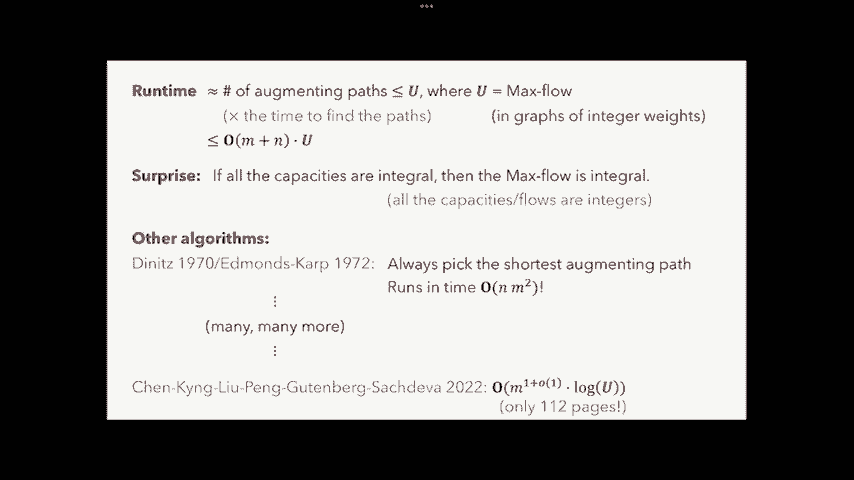

# 加州大学伯克利分校算法课程CS170 - P16：Lec16 Network Flow (Part I) - 东风渐起UCAS - BV1o64y177K8

对呀，现在是12点40分，所以让我们开始吧，今天的讲座十六，我们将讨论最大流量问题，所以让我从行政方面开始，所以首先你注意到了，我不是哈格德洛布教授，我是另外一个人，所以非常可悲。

我想星期二是你和霍格劳布教授的最后一堂课了，这学期剩下的时间我都会接手，她还在附近，我是说不是真的走了，但就像不在这里，嗯，我的办公时间，我想现在，嗯，他们大概下午三四点钟，星期二在我办公室。

所以我们很快就会在Ed Stem上发布关于这一点的帖子，我确实鼓励你在办公时间来，好像这让我很开心，当人们在办公时间出现时，让我不开心，当没有人出现的时候，所以我作为教授教这门课的第一个学期，呃。

整个学期只有两个人来我办公室，他们出现的唯一原因，是因为他们误以为我是另一个，所以请过来，我很好，我不咬人，是啊，是啊，我要做一个实验，也是我教的头几堂课，我只想说你们是否喜欢幻灯片，讲座或没有幻灯片。

我个人的喜好，我喜欢没有幻灯片的讲座，当我在观众席上，但我不知道是什么，你们今天很喜欢，我会做幻灯片，也许下节课也有幻灯片，然后之后的讲座没有幻灯片，我会做个民意调查，看看你们更喜欢什么，好啦。

两个课程相关的管理事项，所以中期他们的降级请求，中期一次降级请求将关闭，星期一十点二三，我想是下周一，所以在那之前把你所有的降级都报上来，还有家庭作业，有家庭作业，已经发布了，下次到期。

星期三10点25分，好啦，所以呃，让我们开始上课吧，我们将从一个有趣的历史文献开始，所以这份文件实际上是美国政府的机密，所以被列为机密，比最高机密低一级，直到1999年才被解密，就像以前一样。

差不多二十年前，对你来说，你看一眼都是非法的，我正要给你看这份文件，是兰德公司出版的，如果你不熟悉兰德公司，就像一个研究和开发，它代表，它是一个为联邦政府做了很多工作的智囊团。

它的标题是评估铁路网容量的方法基础，是两个人写的，其中一个是特·哈里斯，哈里斯，他是兰德公司的数学家，弗斯·罗斯是兰德公司的退休将军，在那里，他们写了一份小文件，你可以在网上找到，它涉及到。

前苏联的铁路网，这是在1955年，他们当时正处于冷战时期，然后嗯，他们真的很关心苏联铁路网有多少容量，他们能从一个地区运到另一个地区多少钱，所以看着这张地图，大家可以看到，你知道的，在顶端。

右上角是列宁格勒莫斯科，柏林在左边波兰，中间的某个地方是柏林，就像当时的东德，你应该阅读这张地图的方法是上面盒子的所有线条，铁路和铁路在盒子里有一个号码，这告诉你这条铁路能运送多少数千吨的货物。

所以如果你看到一盒30，那是三万吨的生产能力，他们想知道苏联想在哪里做这件事，他们能从右边的这些地方运多少钱，所以在嗯，在苏联内部，在罗马尼亚有个地方，他们能从东方转移多少，至，哦耶，所以这些点。

这些将是源点，他们想知道他们能运送多少，从这些源头到西部的目的地，所以这些目的地，其中一个在柏林，其中三个在当时的西德，其中一个是右边的9号，在波兰，这些是这堂课的目的，我们称之为同步点。

他们为什么要做好这件事，原因是如果战争真的爆发，重要的是能够为他们估计这些铁路网的容量，以防他们需要轰炸某些铁路，所以要知道该拿哪些，好啦，所以他们建立了这个大地图，他们有所有这些能力，他们想。

还是对不起，这些铁路，他们想知道，从东面运到西面的吨位是多少？所以稍后你可以找到一张地图，他们实际上在那里解决了这一切，是啊，是啊，每条铁路，他们发现了，如果我们想从右边装运一些数量。

这是你应该在那条铁路上投入的钱，例如，如果你看这个，假设城市是四六，嗯，可能很难看到，但我要告诉你的是，所以即将到来的铁路，这条容量为8人的铁路，所以你可以用它装运八千吨，在他们的最佳装运中。

他们发现了，实际上最好的办法是在这条铁路上总共只运送6000吨货物，最好的办法是一万两千吨，这实际上是铁路的容量，所以他们满负荷地使用铁路，这个是两千吨，所以46是6加12加2，总共是两万吨材料。

因为四六是一个中间节点，它既不是来源也不是目的地，四六应该把这些都拿走，再运出去，事实上，它只有一条通往这里的铁路，这条铁路的载重量是两万吨，事实上，他们正在利用这条铁路的全部容量。

所以他们做了这个计算，他们想出了最好的运输方式，他们发现整个东部，这条铁路网向西的运力是16万3千吨，所以你可以从红色开始，有十六万三千吨，可以路由到蓝色目标节点，而且。

他们能够计算出这个数量的货物实际上是最佳的，因为他们称之为瓶颈的东西，所以事实上，不可能运送比这更多的东西，这是当时苏联所能做的最好的事情，瓶颈是什么，嗯，瓶颈就在这条线上，这是他们的一条线。

他们发现它把苏联分成了西部和东部，他们注意到的是，如果你把所有的铁路，穿过这个瓶颈，你把它们的总容量加起来，你得到了16万3千吨，如果我想从源头到目的地，我要穿过瓶颈上的一条铁路。

所以我可以运送的总金额只是给出了，通过瓶颈上的铁路能力，这正是，有十六万三千吨，好啦，原来文件里是这么写的，他们是怎样解决这个问题的？他们是怎么得到这些数字的，他们用他们想出的贪婪算法解决了这个问题。

他们称之为洪水洪水方法，他们把它概念化为一个管道网络，而吨位实际上是，他们想象它有点像水，你能得到多少水通过这个网络，但他们提出的贪婪算法有时会输出不正确的解决方案，他们指出，有时他们运行算法。

他们得到了一个解决方案，然后他们就得把它修修补补，事后做得更好，所以在这之后，他们找到了他们的同事福特和富尔克森，他们是兰德公司的另外两个数学研究员，问他们，我们解决不了这个问题。

但是你和福特和富尔克森能设计出一种算法，这就是众所周知的福特富尔克森算法，他们在一篇名为网络最大流的论文中发表了这种算法，我想它是1956年出版的，大家可以看到，他们，他们把这个问题归咎于哈里斯。

所以两个作者中的第二个或第一个实际上，这就是我们今天要在课堂上看到的算法，嗯现在，让我知道，是啊，是啊，其中一些历史，这是一个非常有趣的历史笔记，一位数学家关于运输和最大流量问题的历史，计算机科学家。

亚历山大·施莱弗，事实上，当他在这篇论文中写作时，他是那个得到U的人，S，政府将此报告解密，所以现在我们要看看，什么是前进和聚焦并解决的最大流量问题，你如何用数学来表达它，所以在最大流量问题中。

你会得到四种不同的输入，第一个是有向图，G，一个叫s的顶点，它被称为源顶点，一个叫做T的顶点，它被称为同步顶点，然后对于图E中的每一条边，你还会有一个特殊的数字，叫做边缘的容量，现在c是z+。

这意味着正整数，所以它被允许是一个，两个，三个，以此类推，尽管您也可以考虑容量为实值的最大流问题，但我们不会考虑，作为这些输入图的一个例子，这里的图，所以这是一个有向图，它的边缘要么是垂直的。

所以他们都要上去，或者水平边缘向右，我们在左下角有一个源顶点，同步顶点在右上角，然后我们在每个边缘都有一个容量，所以这被称为单位容量情况，因为我们有一个，我会注意到我们所考虑的。

我们在一开始看到的这个例子，在这节课中，我们将只考虑一个源和一个同步，他们考虑了多个源和多个同步，所以这是你的输入，你想解决的问题是什么？你要做的是，基本上从S到T的最大水量，所以你应该把这些想象成。

S就像水源，然后在所有的边缘，你可以认为是管道，每根管子都允许携带一定数量的水，所以在这种情况下所有的管道一次只能输送一个单位的水，你想知道，从s开始到结束，我能得到的最大水量是多少，所以嗯。

我们如何在这个图中做到这一点，嗯，我们应该做的是在图中找到一条路径，把一股水流送到那里，所以开始，也许我们可以走这条路，从…开始一直往上走，然后一直往右，我们要做的是沿着这条路输送一单位的水。

但现在我们也是这样，是啊，是啊，我们有一个单位的流量从s到t，但是我们仍然可以用T右边的一些边，所以我们应该做的就是沿着这条路再送一单位水，然后嗯，现在你可能会问，我们还能做些什么吗。

但是S只有两根管子，我们已经用了一个单元，我们已经把两根管子都用完了，所以我们别无他法，这实际上是图的最大流量，两个单位的水和剩下的讲座，当我刚说到这个的时候，我想谈谈水，我只谈流量。

所以这是两个流量单位，现在有一件事我想提一下，最大流量问题的解决方案不是唯一的，所以给定一个图，可能有多个最优最大流，我再给你们举一个最大流的例子，假设我们从s开始，然后我们向上发送一个单位的流量。

现在我们可以用水做的一件事，你知道你可以水就像可分的，你可以把它分成几部分，所以我们可以把这一单位的流量，把它分成两个半流的单元，把其中一个送上去，然后右边的一个，现在我们送上去的那个可以继续通过管道。

向右走，我们送到右边的那个，我们可以再把它送上去，现在这两个半流的单位在这个顶点重新组合，现在当它们结合时，它有一个流量单位，其中一个单位的流量，同样地，我们得到了一个单位的从s到t的流。

我们也可以从s开始，向右做另一个单位的流，然后再做一次，我们可以把它分成两个半流的单元，一个上升的，然后一个又向右，向上的那个我们可以把它送到右边，右边的那个，我们可以把它送上去，现在呢，这两个。

一个半单位的流可以重组并创建一个单位的流进入T，如果你数，这也是一种创建从s到t的两个流单元的方法，现在有了这个，就有可能把它想象成，你知道的，一个分裂然后重组的流，但我们也可以把它想象成四个独立的流。

每只含有半单位的水，所以第一个流是这个，第二个流是这个，第三个流是这个，然后第四个流是这个，大家可以点赞，如果在每一个流中你发送正好一半的单位，这就是我在图表上画的红色数字，是啊，是啊，问题，你看。

好嗯，提醒我，你的名字，阿蒙，酷，嗯所以是的，我在问，每个顶点都有一个极限吗，我们能投入多少或从中得到多少，从源头流出的数量也有限制吗，嗯，所以没有，所以对于任何顶点，它能够吸收尽可能多的流量。

唯一的限制是进入边缘的总容量，你永远不能向一个顶点发送更多，比它进入边缘的所有容量，允许源顶点有尽可能多的流出来，只要它不超过任何输出容量，更多问题，告诉我你的名字，对不起，你说呢，你知道的，谢谢。

所以康奈尔只是问，这和在图中找到最长的路径有什么不同，嗯嗯，其实你能告诉我，你认为这类似于最长路径问题，哎呦，是啊，是啊，我是说，你肯定在试图找到一条从s到t的路径，但是请注意，对于这条路径。

左边的蓝色小路，我们不在乎路的长度，我们所关心的是我们从S到T发送一个单元，所以如果我在一个很短的路径上从s直接发送一个单位的流到t，这相当于沿着一条很长的路径发送一个单位的流量。

只要每个边缘的容量至少是一个，我总是能做到的，这有意义吗？还有其他问题吗？但是在任何情况下，当然，呃，做事是，是啊，是啊，所以如果我发送，是啊，是啊，他问我，是啊，是啊。

我们怎么知道什么时候可以发送流量，它总是会像，我永远不能沿着一条路径发送，就像最小容量一样，好啦，所以这是照片，但可能会有帮助，哦特里斯坦，对呀，是呀，酷，是呀，所以这两个，我们关心的是总流量。

这样就得到了两个单元，给我们两个单位，他们的等价物实际上是后来，我们会更喜欢这个的，因为它不会把东西分成分数，这对我们来说是件好事，好啦，所以现在我们已经看到了最大流量的图片。

让我们看看如何用数学把它形式化，所以我要定义的第一件事是流，那么把流量放在图表上意味着什么，嗯，流是每个边的f子，图中的每条有向边，它满足了一些特性，所以第一个性质是非负性，S子总是必须至少为零。

你不能在边缘发送负流量，容量f子的上限是边缘上的容量，所以我永远不能把更多的流量放在边缘，超过边缘的容量，最后一个约束叫做流入流出约束，对于每个顶点，五，让我在这里画一个顶点，嗯，它会有一些进入的边缘。

还有一些向外的边缘，我们可以考虑进入顶点的流量，这只是所有进入边缘的流的总和，我们也可以考虑流出，它是所有流出边缘上的流量之和，你知道这个顶点就是把水，水应该流过它，所以这就像节约用水。

你不能随便破坏水，所以对于任何顶点，进入它的流量必须等于离开它的流量，数学上，我们写这篇文章的方式如下，所以对于给定的顶点，我们把所有边u求和成，所以这些都是紫外线边缘的流动的进入边缘。

这应该等于流出的，它是所有出去的边v的和，从v到w所以v到w，或者在大众的边缘流动，然后流入流出，流量守恒定律说这两者应该是一样的，除了两个特殊的顶点s和t，所以源顶点和同步顶点不应该满足流，流出来。

允许源顶点具有，源顶点正是流来自它的地方，应该没什么，同步顶点应该只有流进入它，结果什么都没有，好啦，给定这个流，然后呢，嗯，我们关心的是流量的大小，我们能从水槽的源头得到多少水，流的大小正好是。

从s发送到t的流的总量，所以嗯，我们如何谈论这种流动，嗯，如果我们看顶点s，我是说，流的大小只是我们从s发出的量，这就是我们得到的总流量，但这也是总数，是啊，是啊，所以换句话说，你看所有向外的边缘。

是总流量，这些流量的总和，但也，如果我们看t和所有进入t的流之和，嗯，这也应该等于，所以从s中流出的水量应该和，这样大小的水量等于这两个，是啊，是啊，问题，好啦，数学上，那么我们如何编写流的大小。

从s到不同顶点的所有边的和是多少，在那个边缘的流动的V，这就是s的输出流，正如我们所看到的，等于t的传入流，也就是所有v的和，它们进入边缘的流动，好啦，这就是流的大小，我们现在知道什么是流了。

那么计算最大流量井意味着什么，最大流量就是你想要最大化的数量，你的流f的大小取决于f实际上是一个正确的流，所以它满足这三个约束条件，有人能告诉我什么样的计算问题，这是，嗯很好，你叫什么名字？

Sahito ish，所以对每个人来说，它看起来像一个线性程序，事实上，它是更一般的线性规划问题的一个例子，为什么这口井，我们在最大化一个数量，你可以看到f的大小是线性的，它只是一些变量的和。

我受到一些限制，制约因素是这些变量，形式流和所有约束要么是线性不等式，所以不，负性和容量都是线性性质，对不起，线性不等式，流n等于定律约束只是一个线性等式，所以这只是一个线性程序，因为它是一个线性程序。

我们可以用单纯形来解决这个问题，例如，所以在现实生活中，如果有人给你一个线性流的例子，或者对不起，最大流，你可以把它变成单纯形，你可能会得到答案，确实有一篇但泽的论文，线性规划的创始人之一。

在这之前几年，我们看到的兰德公司的文件，它实际上通过线性规划解决了一个等价问题，然后如果你想要一些非常有效的东西，你可以考虑，像椭球算法或内点法，但今天我们将看到的是线性的算法，针对问题定制的最大流量。

并倾向于做得更好，嗯，比线性规划，它们在概念上也很简单，更简单，我觉得，所以实际上，在我继续之前，对这个定义有什么问题吗，我们应该知道如何应用线性内点，连我都不知道内点是怎么工作的。

所以我绝对不指望你知道内部点，后面有个问题，好啦，也许不是，是啊，是啊，大小只是源的流出，或者水槽的流入，水的总量，那么我们如何解决这个问题呢，我将从给你们一个算法开始，这将是一种算法的首次尝试。

这实际上是行不通的，但在我们看到它之后，它会给我们直觉，然后我们以后可以修复它来做一个更好的算法，我来告诉你这个算法，这将是一个贪婪的算法，所以你要在你的图表中做的是，你要一直寻找一条从s到t的路径。

在这条路径上发送尽可能多的流，然后你会找到一条不同的路，你要继续这样做，直到你不能再发送更多的流量，所以这个算法的第一步，你会找到一条从s到t的路径p，尚未饱和，路径饱和意味着什么，嗯。

这意味着至少有一个边缘已经有了最大的流量，所以这个边缘，边缘的流量等于容量，这意味着在这条路径上，我不能再发送任何流量，所以你要做的是找到一条不饱和的路径，这意味着每一个边缘，那个边缘的流量小于容量。

所以你可以发送更多的流量，然后第二步好，你只是沿着这条路发送更多的流量，你只要给它尽可能多的流量，第三步，你再说一遍，您只需继续这样做，直到您用完从s到t的路径，让我们在这个图上做一个例子。

我们有四个顶点，来源在左边，水槽在右边，我们有单位容量和步骤，其中一个算法，你只要找到一些不饱和的路径，但它没有指定路径，所以我们随便挑一个，也许有点，我们将沿着这条路径发送一个单位的流量，好了。

现在我们重复一遍，我们试图找到另一条从s到t的不饱和路径，所以这个算法只是沿着那里发送一条路径，然后再发送一次，它将使通过那条路径的最大流量，它可以使一个单位的流量，你也知道。

现在我们发送的所有边缘都饱和了，我们再也无能为力了，算法将在这里终止，我把这个流作为一个解决方案，而这确实，如果加上这两个，你总共得到两个单位的流量，这是你能发送的最大值，但现在。

让我们考虑一下如果我们把这个图，我们加一条边，使单位容量从A到B，所以同样的图形，只不过我们加了一条边，应该会让问题变得更容易，你知道的，我们可以通过更多的管道送水，所以第一步再来一次。

算法会找到从s到t的路径p，但我们从来没有指定哪条路，所以嗯，算法可能会选择任何路径，所以说，例如，在这个图中，一个很好的路径是从s到a到b到t，所以这条路，所以也许算法开始了第一步，它选择这条路径。

并沿着这条路径发送一个单元的流，好啦，现在我们要重复，我们将看到，这个算法还有其他可以很好地选择的路径吗，算法不能从s到边，它不能做s到t因为s到a已经饱和了，它也不能做s b to t。

因为边b到t是完全饱和的，它绝对做不到，因为沿着这条路的每条边都是完全饱和的，所以算法实际上被卡住了，嗯，没有更多的路径，它可以发送流动沿着，所以它将以这个流结束。

但我们知道一个单位的流量不是正确的答案，因为我们在左边看到，你可以用两个单位的流量来做，所以在这种情况下，实际上算法会失败，好啦，那么为什么这个算法失败得很好呢，算法失败了，因为它使用了从a到b的边。

即使它真的不应该，如果它没有使用边缘，如果它，你知道的，想出了一些不使用边缘的方法，它只会让左边的水流，但是因为它利用了那个边缘，卡住了，所以我们要做的是找到一种方法来修改这个算法。

这样它就知道什么时候有边缘它犯了错误，它将允许算法消除这些错误，是啊，是啊，问题，是啊，是啊，你叫什么名字，所以你是说，为什么算法不做s a to t，是啊，是啊，所以我的意思是它可能。

但是我们指定算法的方式就像它可以同时走任何路径一样，所以它可能只是错误地采取了一个b t，你知道，在这张图中很明显，你真的不应该，但是现在想象你有一个有数百万个节点的图。

你怎么确定你每次都走在正确的道路上，所以很难想出一个规则来告诉你，正确的道路是，很好你叫什么名字，灵族酷，你想找的Dijkstra的作品也会，就像最短的路径，例如嗯，让我们看看我没有一个例子从我的头顶。

但我想这也行不通，所以我认为这种情况，在最大流量下很容易，好吧，让我给你举个例子，如果S到A而不是一条边是一条很长的路呢，不过，你还是应该把它沿着那条路送去，然后去哦等待，也许是对不起。

从S到B是一条很长的路，从A到T是一条很长的路，嗯，那么你会选择一个b t的短路径，但这仍然不是正确的做法，这有道理吗，你有问题吗，也是，是啊，是啊，为什么会导致一口失败的井，一旦它完成了是一个b t。

没有更多的S到T路径，你有没有，你同意吗，或者还好，是啊，是啊，所以没有更多的路径可以让水流沿着，所以它就卡住了，它应该会派两个，但它只有一个，我的猜测可能是没有，我是说，我想我们会看到有效的算法。

而且是的，看起来不太像，好啦，那么让我们看看如何修改这个算法，让它意识到什么时候可以纠正自己的错误，啊，我应该说，这实际上是哈里斯和罗斯在他们的兰德公司使用的洪水方法，这是一个贪婪的算法，最初不起作用。

这促使他们接近福特和富尔克森，好啦，所以让我们再次从我们陷入的特定图表开始，所以它最初发送一个单位流的算法，那是它的一个流量单位，现在呢，我们要做的是，构造一个新的图，这将记录我们所犯的错误的数据。

那个图叫做残差图，嗯，残差图，我们要做的是，因为我们沿着这条路径发送了一个单位的流量，我们要去这条路上的每一个边缘，从它的容量中减去一个，所以我们把一个单元从s发送到a，所以这意味着我们要去那个边缘。

目前容量为1，我们要减去一个单位的流量，它将变成零，然后我们要做的就是加一条反向的边，从后面到，我们要在上面放什么，数字，新边缘的容量将等于我们，S到A，所以我们把一个单位的流量沿着s到。

所以这条边的容量是1，你应该把这看作是，或许我们犯了个错误，所以现在，我们要做的是取一条相反的边，从A到S，也许我们不需要它，但也许我们想要，如果我们将来走上这条路，会在这条边缘向相反的方向流动。

它将抵消我们发送的原始流，所以我们最初向这个方向发送了一个，如果我们最终取得了优势，它会向相反的方向发送一个单位的流量，两人将取消，总的流量单位为零，但是对于边缘来说，零单位的流量是一个完美的精细流。

好啦，所以我们继续从A到B，一个单位的流量被送到那里，所以我们减去一个，然后我们加一个容量为1的包，然后从b到t减去1，然后我们加一个容量为1的后边，这是残差图，现在我们要做的不是寻找圣路，原图。

我们总是在残差图中看它们，所以让我们试着找到一条从s到t的路径，在残差图中，你不能做s a t因为s对a是饱和的，它的容量为零，你不能做s b t，因为b到t的容量为零，但你能做的是，对不起，从b到a。

您现在使用的是其中一个，其中一个后边，所以算法现在要做的是沿着某人发送一个单元的流，阿特，好啦，所以现在，假设我们把这两个流结合起来，我们的最终流程是什么，嗯，嗯，从我们原来的流程。

我们发送了一个单位的流到s到a到b到t，然后在剩下的边缘上有零单位，现在我们要在这上面加上，我们在残差图上做的新流程，在残差图上，我们有一个从S到B的单元，我们还将以a到t上的一个流单位结束。

现在我们还要增加一个单位的流量，从b到a，好啦，所以目前我们有一个从A到B的单元，现在我们也将有一个从B到A的单元，这两个将被取消，给你的总数为零，这将是你输出的最后一个流，所以说，嗯是的。

刚才发生的事，好吧，首先，我提醒你，这正是我们期望得到的两个单位的总流量，是啊，是啊，刚刚发生的事，嗯，算法被允许纠正它的错误从A到B，因为我们加了这个后边，如果它想撤销流，它可以撤销流，好啦。

所以现在，让我正式定义一下，什么是残差图，我是说，希望从这个定义中可以清楚地看到，但是，嗯，给定一个图g和一个g上的流f，我们可以定义这个残差图g subf如下，所以我们要看看原始图U中的每一条边。

逗号v，边缘是这样的，这是有向的边，从u到v，然后呢，你知道的，在原图中，也许它有一些容量，然后因为我们的图中有一个流，它也可能有一个从u到v的流，我们可以称之为f u v流，现在在残差图中。

这个边是什么样子，嗯，我们又得到了从u到v的边，但现在它的容量将是原始容量减去流量，这是我们可以使用的剩余容量，所以这条边的容量是，然后我们要把这个后边，后缘会有容量UV。

所以它是我们可以撤消的流量总量，如果我们愿意，好啦，所以这是残差图，嗯，在我完全通过算法，对此有疑问吗，一定要无定向吗，是啊，是啊，嗯，我猜，让我看看，我是说，在残差图中。

你将永远在一个方向上的每一个边缘，你在另一个方向上总是有优势的，但他们会有不同的能力，所以往一个方向走，我也许能在一个方向上比另一个方向上发送更多的流量，所以你还是应该把它看作是一个有向图。

但每一条边都有它的反面，你叫什么名字？顺便说一下，丹尼尔，就像在最初的图表中把你的轮子包起来，嗯，是啊，是啊，我可以一直有一个B和B A基本上，或者是的，你在那里可以看到风景，是啊，是啊，是啊，是啊。

你被允许，是啊，是啊，它不一定是一个达格，所以在这种情况下，残差图，我想你用这两个，所以这就像，如果我向一个方向发送一个流，然后我会把它添加到另一个方向的容量中，但至少在这个讲座上，我们只考虑这个案子。

为了简单，我们只有一个优势，在每个顶点之间，你叫什么名字？迪伦，哦问得好，首先你叫什么名字，如涵嗯所以是的，问题是，如果我们在原始图中有多个流，我们是否有多个残差图，然后嗯，你应该这样想。

流就像所有嗯的总和，所有的水都像，假设在我的算法的第一步，我送你知道水沿着一条路，然后算法的第二步，我把水送到另一条路上，整件事都是一个流程，这种流动会把一些水送到这里，一些水送到那里，然后呢，数学上。

这将满足我们前面看到的流的定义，所以总会有一个总流量，这可能是许多单独流的组合，就会得到一个残差图，我们会看到的，我想当我们在下一个执行算法时，既然我们已经定义了残差图，让我们看看算法中的前进扑克。

好啦，所以福特福克斯和算法，嗯，就像你以前一样，你只是在你的图表中不断发现，找到一条从s到t的路径p，尚未饱和，你沿着这条路发送尽可能多的流量，然后你重复直到你找不到更多的路径，但是。

是什么让福特富尔克森不同于微不足道或遗憾，天真的贪婪算法是你总是找到一个路径p，原图中没有，但在残差图中，而这条路，当你找到一条未饱和的路径时，残差图是一种叫做增广路径的东西。

所以我可能会继续称之为增强路径，只是这些小路，聚焦，发现，让我们在这个图中做一个这个算法的例子，在这里它有四个顶点，这基本上是我们以前看到的相同的图表，但边缘重量不同，这将使执行更有趣一点，好啦。

所以嗯，我们要跑福特富尔克森，所以当你启动算法时，顺便说一下，第一个残差图只是你的起始图，嗯，你可以看到我没有流量，所以如果我有一个没有流量的图，那么残差图就和原图一样了。

福特福克斯之子要做的就是找到一条路，所以让我们选择一条从s到t的路径，也许这条小路，现在我们能在这条路上发送多少，嗯，嗯，其中一条边是三条，所以说，这意味着我们不能沿着这条路径发送超过三个单位的流量。

所以让我们沿着这条路径发送三个单位的流量，好了，现在我们要修改这个图，得到残差图，所以我们要去图中的每一条边，减去三，然后反方向加三个，所以A变成了两个，然后我们有一个后边，上面有一个3。

从A到B减去3得到6，然后我们加一个后边上面有三个，然后b到t减去3，我们得到零分，然后我们加一个后边有三个，现在我们要在这个图中找到另一条路径，我们要在上面发送流量，这是我们的残差图，嗯。

一条路我们可以做一个非常简单的，只是到一个到，所以让我们走那条路，我们有一个容量2的边缘和一个容量6的边缘，所以我们在这条路上最多能送两个，所以福特富尔克森会跟着，再送两个单位的流量，我们得走这条路。

我们要从所有的边缘减去两个，然后反方向加两个，所以我们减去2，从a变成零，然后反边变成5，从a到t减去2，我们有四个，然后我们加一条从t到a的反向边，上面有一个2，好啦，我们要做的最后一件事。

我们得在这张图中再找一条路，我们根本不能用s到a，因为它是饱和的，我们不能从s b到t，因为bt是饱和的，但我们可以做的，它有三条边，最小容量是三个，所以我们不妨沿着这条路径发送三个单元的流量。

如果我们这么做了，我们必须再次更新我们的残差图，所以我们减去三个，我们有一个后缘，上面有一个三，从b到a我们减去三，我们得到零分，现在我们在反面加三个，它实际上是图中的原始边，所以原来的边缘，你知道的。

是在六点钟，现在是九点，从a到t减去3，然后反方向加，而且可能不明显看到，但我实际上声称在这一点上，算法中的福特焦点将终止，从s到t没有更多的路径，实际上任何人都能看到一个简单的，好呀，你叫什么名字？

所以是的，嗯是的，你可以看到所有的路径，嗯，我们会找到一个简单的方法来检查这个，是啊，是啊，所以我只想说，它将以这个停止，作为它的最终流向，八股流量，你怎么看，就像，最容易看出这一点的方法是什么。

所有的路径都饱和了，嗯，我可以做的一个方法是，我可以通过展示所谓的切口来证明这一点，然后一刀是这样的，我要把我的图表切成两半，然后嗯，在切口的一边是S的源顶点，切割的另一边是同步顶点，然后嗯。

我要看看这个切口的所有边缘，我将忽略所有其他的边缘，所以我只有三个边缘从切口的左边，到伤口的右边，现在任何从s到t的流动最终都必须穿过这个切口，没有办法绕过它，你得沿着这三个边之一。

但是这三个边的容量都是零，嗯是的，所以从s到t的所有路径都是饱和的，好啦，不如我们现在就休息三分钟，是啊，是啊，三分钟做什么，如果有人能关上后面的门，那就太好了，如果一条边的容量为零，则路径为饱和。

所以这意味着我没有更多的流量可以发送，你叫什么名字？所以这部分是随机选择的，或者我们如何介绍这个好的所有部分，我们怎么找到这个伤口，我们稍后会看到它是如何定义的，嗯是的。

你可以做的一个方法就是看看每一个伤口，嗯，就像你看着边缘，呃，在其他边缘已经看到了，仔细想想应该更容易些，是啊，是啊，我想我会告诉你答案，我不为别人破坏它，但是切口边上的所有东西都是你可以从。

切口另一边的东西，你够不着的东西，I，就像我可以从S到B，所以它会在那边，但我不能从s到a或从s到，但是是的，我们会看得更近，安妮特，问得好，是啊，是啊，它意味着什么，哦很好，是啊，是啊。

我没有很好地解释这件事，所以饱和路径是至少有一条边的路径，容量为零的，如果沿路径的一条边的容量为零，我不能再用了，为什么嗯，那是，没有更多的容量，所以如果每条边的容量都大于零。

那么这意味着我仍然可以发送更多的流量，但如果这里只有一个边缘有容量，你就不能用别的边，啊，就像容量就像在每一个边缘，这就像，如果我有一根管子，就像其中一根管子坏了一样，或者沿着小路，它不再起作用了。

我只是不能把任何东西送到那里，所以当这里至少有一个边缘有容量时，当这就是饱和的意思，是啊，是啊，你叫什么名字？Samiha，好啦，再问一个问题，第一次去一个，围棋也估计第二条路是S A T，啊，八点了。

啊，所以不包括这个，啊，是啊，是啊，你只是抱歉，对不起，是呀，好啦，已经过了三分钟了，人们关门了吗，如果没有，有人能，背后的英雄，把门关上，完美，谢谢你，嗯，所以是的，我被问了两次的一个问题是。

路径饱和意味着什么，所以让我试着再解释一遍，路径饱和，如果它的至少一条边的容量为零，零容量意味着我不能再沿着那条路径发送任何流量了，因为你不能沿着这条路走下去，所以不饱和意味着每条边的容量都大于零。

好啦，所以这是算法中的福特焦点，我们将用两张幻灯片来说明它的正确性，但是下一张幻灯片，让我们更多地关注这些削减，看看它们为什么重要，所以我要定义一个叫做st cut的东西，它把顶点分成两组。

其中一个在左边，另一套是正确的，这样s在左边，我很抱歉，水槽在正确的设置，所以从图像上看，如果这是我的图表，把它分成l和r，右边的一组会在左边的一组里面，它将在正确的集合内，现在考虑到这些伤口中的一个。

我们关心的关键数量是切割的容量，所以我们已经看到了边缘的容量，关键是你能在边缘放多少水，切割的容量定义如下，所以说，我们要看看所有的边缘，从l中的一个顶点到r中的一个顶点。

切割的容量将是所有这些边缘的总容量，所以从数学上来说，我们把它写成l逗号r um的容量，它是所有边u到v的和，使得u是l，V是R，边缘的容量，所以它是从l到r的所有边的容量。

现在图表上的这些切口有一个好处，顺便说一句，我说的是原始图表中的容量，不是残差图，嗯，有一个很好的定理告诉我们，如果我们有一个流f和一个切lr，那么不管流量是多少，流量的大小总是受切口容量的上界。

为什么会这样，嗯啊，基本上就像，如果我有喜欢，假设你知道图中的一条路径，它会从s发出一些流，一路走来它可能啊，你知道的，花点时间在图的L部分，图的左边，但在某个时候，流动将不得不占据其中的一个边缘。

从l到r，如果它能达到，它必须穿过切口，当它这样做的时候，它会吃掉其中一个边缘的容量，所以从l到r的流量永远不会超过，比所有边缘的总容量，因为每一个类似的流动单元都必须穿过这些边缘中的一个。

所以任何一个，嗯，一个流总是由任何切口的容量上界，任何特别的，所以让我看看，让我举个例子，这是我们在上一张幻灯片上看到的图表，嗯，我们得到了最大流量，或者我们有一个流动福特焦点并计算它，是八个人的流动。

现在让我向你证明，在这张图中，8是你能做的最好的，嗯，好吧，实际上让我展示一个上限，所以如果我想上界，任何流的大小，尤其是最佳流量，我可以在图表上找到一个切口，让我们考虑这个将s与图分开的切口。

图的其余部分，然后我们只需要看看这个切口的边缘，S到A和S到B，这些边的总容量是12，这说明这个图中的任何um流都有很好的容量，对不起，我们的尺码最多12码，但是你知道，如果我想得到流大小的上限。

我可能想找到剪裁最好的，容量最小的那个，这将允许我证明最好的上限，我可以在我的流量，所以我们可以做的另一个切口是这个切口，有两条边穿过这个切口，S到A和B到T，我们现在不关心的其他边缘，因此。

这个切口的容量是5加3，也就是八个，这个定理告诉我们，任何流的大小，以8为界，但8正好是我们在前一张幻灯片上发现的流量大小，这告诉我们，在上一张幻灯片中，算法中的福特福克斯实际上找到了最大的打击。

所以这促使我们看这个，这个定义，最小切口，这将是最小容量的切口，如果我找到容量最小的最好的切口，这将允许我证明最好的上限，我可以在图中的任何流上，我们上面的定理，重述它的一种方法是图中的最大流量总是上。

以图中的最小切口为界，比如如果我想把左手边弄得尽可能大，我应该找到最大的流量，但它总是以最小切口的容量为上界，最小切口的容量，然后呢，那就像，证明最大流量大小上限的好方法，让我说，这是一回事。

当哈里斯和罗斯在开场中发现的瓶颈滑动时，如果你还记得，好啦，所以关于削减的问题，哎呦，嗯很好，提醒我，让我想起恩佐酷，我们只是在考虑，嗯，从左边到右边的边缘，但是A从右边到左边，原因是我的流量总是要从。

从左边到右边，所以这对我来说并不重要，它向相反的方向走了多少，是啊，是啊，更多问题，是啊，是啊，哦嗯，你叫什么名字？约书亚井，我给你看下一张幻灯片，即最大流量等于主要收入，这就是我们现在要证明的，是啊。

是啊，问得好，但是是的，在我继续之前，还有更多的问题，好啦，所以是的，就像约书亚建议的那样，只要试着证明最大流量等于最小切口，这就像是算法中一个非常非常著名的定理，人们称之为最大流量最小切割定理。

我现在就给你看证据，所以证据很充分，我们只需要显示大于或等于方向，我们只需要证明最大流量大于或等于最小切口，因为在最后一张幻灯片上，我们已经看到最大流量小于或等于最小切口。

那么我们如何证明最大流量大于或等于最小切口，嗯，一种方法是找到一些大于，或等于最小切口，所以我们得想办法给出一个图表，构建流程，并证明该流量大于或等于最小切口，那么我们如何在图中构造一个流呢。

我们所知道的是一种构造流的算法，这就是算法中的福特福克斯，所以这个证明要做的是，我们只是说跑福特，g上的Fulkerson算法，它会输出一些流量，设f为流，我们希望这是一个良好的流动，好啦。

对于福特富尔克森来说，输出一个流f意味着什么，嗯，它只输出一个流f，当残差图中没有更多的s到t路径时，所以让我来画一幅画，这意味着没有更多的，嗯好吧，对不起，让我先不要这么说，但是嗯，所以基于这个。

残差图中没有ST路径的事实，我将定义两组顶点，其中一个是左边的集合L，另一个是右集R，所以我要把我，从源可以到达的顶点，残差图中的顶点，G次f，意思就是，我可以拿任何优势，你知道那不是零容量的。

而我会嗯正确的R成为其他一切，所以任何，任何不能从s到达的顶点都将在集合r中，所以在我的残差图中，顶点在这里，我就站在一边，这部分切口，这就是你可以从S到达的所有顶点，这里的r就是。

从s无法到达的其余顶点，一种说法是T将在集合中，所以r是一个非空集，实际上它将包含同步顶点T，原因是正如我们所看到的，好吧，没有什么可走的路，啊，应该说对不起，节点到T路径，嗯，是啊，是啊。

所以我们已经看到了，因为福特福克斯和输出这个流，然后呢，在残差图中不会有s到t的路径，结果呢，从s无法访问t，好啦，所以我们可以做的另一件事是看看所有的边缘，从l到r，我想说的是，残差图中的这些边。

我们都将有完全等于零的容量，好啦，为什么这口井，嗯，比如说第一条边，如果它的容量大于零，嗯，左边的顶点可以从s到达，所以如果边缘的容量大于零，然后我就可以走到那个顶点的路径，然后把这条边变成r。

所以如果这些边的容量大于零，那么右手边的顶点应该是l而不是r，所以我们知道所有这些边的容量都是零，现在让我们看看这张图片在原始图表中是什么样子的，所以再一次，我将使用相同的分区，L和R是同一个切口。

S在一边，T在另一边，我想做的是，我想看看这个切口的所有边缘，要么是从左到右的边缘，或者从右到左的边缘，我想看看我能对这些边缘的流动说些什么，由f，好的，好的，所以这条从左到右的边缘会有一些容量，C分。

E，有人能告诉我这边缘的流量是多少吗，我马上给你打电话，我让大家想一想，就十秒钟，所以答案是c b um，所以是的，如果我们看这边缘的流动，为什么会是C子井，嗯在残差图中，嗯我们残差图，的。

边缘的容量将是原始图表中的容量减去流量，所以容量减去流量等于零，这意味着沿着这条边缘的流量必须等于，所以f等于c，嗯好了现在，底边，我们还想知道从r到l的，它的能力是什么。

也许我会给人们十秒钟来考虑一下，然后问有没有人能告诉我它的容量，对不起，它的流动，它会有一些容量，但它的流量是多少，请举手，我的名字是零，长老酷，所以埃尔德说这条边的流量为零，这是正确答案。

所以让我们看看为什么这条边缘的流量为零，嗯，嗯，当我们在残差图中，记住，如果我们有这个边缘，有一些容量，如果我们在上面发送一些流量，然后在残差图中，我们也会有一条反向的边，残差图中的容量是多少。

这条反向的边将等于，但正如我们在残差图中看到的，从l到r的每条边的容量都为零，所以这意味着这条边缘的流量为零，好啦，所以我们有这个切口，从左到右的每一条边都被这种流动完全饱和，从右到左的每条边。

这意味着我们有一个从s开始的流，然后基本上都穿过这个切口，然后就再也回不来了，所以在某个时候，任何从s出来的流都会从l到r取一条边，最终它会回到，你知道就像再也回不来了，所以有多少总流量通过这些边缘。

因为所有的边缘都是饱和的，只是这个切口的容量，所以说，这告诉我们，这个流的大小实际上正好等于切口的容量，因为切口的每个边都是饱和的，现在这个切割的容量肯定至少等于最小切割，因为最小的切割是容量最小的。

那么f的大小肯定小于或等于，因为最大流量是流量最大的，这不仅证明了最大流量等于最小切口，这甚至证明了Ford Fulkerson算法输出的最大流量，因为，我们刚才展示的是。

Ford Focus在输出中的流的大小是，至少最小切口的大小，等于最大流量，所以福特Fulkerson做了一些输出，至少和最大流量一样好的东西，这意味着它必须等于最大值，对此有疑问吗。

这是讲座中最难的部分，所以说，好呀，我想好吧，让我画一些东西，也许那会有帮助，我能画点什么吗，你知道的，哦耶，我很喜欢这张图表中的内容，现在我们有S，我们没有，它的意思是，就像沿着S的流动一样。

一切都在进行中，一会儿就会转一个s，最终会有一条从l到r的边，基本上所有s{\displaystyle s}中的流都会沿着这些边，然后最终回去或去T，所以说，我发送的总流量，这些边缘只是切割的容量。

因为所有的边缘都被水流完全饱和了，所以这意味着我的流的大小是容量，啊，是啊，是啊，嗯，你是说如果我想计算最大流量值，所以这不一定能告诉你最大流量是多少，但这将允许你计算最大流量的值。

但如果你按指数来考虑，就会有，迷你切割像两个到N，在那里切了些东西，所以它实际上会比福特慢，聚焦，后面的问题，为什么它的流量为零，是啊，是啊，很好提醒我你的名字杰森，就是因为这个边。

你知道它会有一些容量对吧，我们叫它C和，假设它有一些流量，F，E，然后在残差图中，我们会有一个后缘，它有容量，对不起，这种能力，每当我把原来的图表，边缘上的f e流，那么残差图在后边缘的容量等于f e。

但是这个后边是从l到r，我们知道到我们边的每一个l的容量都是零，所以这意味着f e必须等于零，这有道理吗，嗯是的，就像我们在残差图中看到的，从l到r的每条边的容量为零，更多问题，对不起，你能问一个情人。

哎呦，好呀，原因如下，你叫什么名字？根据L的定义，它可以从s到达，如果这条边的容量大于零，那么这里的顶点也可以从s到达，因为我们可以沿着这条路走然后沿着这条边走，但是r被定义为一组从，对不起。

你能问一下，所以最小切割被定义为所有ST切割中最小的容量，所以这是某个st切的容量，也是任何st切的最小切，最小的切口是最小的，这只是最小切割的定义是那么好吗，很好流量的大小就是你的流量有多大。

最大流定义为任意流f中f的最大大小，你叫什么名字？是啊，是啊，让我来，因为我们没时间了，做最后一张幻灯片，然后也许我可以把剩下的问题推迟到最后，好啦，那么让我们来谈谈这个算法的运行时，所以这个算法。

这里是富尔克森堡，它能跑多快，你知道福特福克斯有这个循环，循环的每个阶段，它将在图中添加一条增强路径，所以运行时将是，我在图中添加了多少条增强路径，我们能说什么增加路径的数量，肯定会少于。

或者等于我的图的最大流量，为什么至少在整数权重的图中，这就是我们在这节课中要考虑的，或者整数容量，这是因为每次我们添加一个流，我们总是像整数一样相加，此算法中的流量，从来没有任何理由添加少量的流量。

所以你在，福特公司在富尔克森的每一步，所以如果我的最大流量等于u，然后每走一步我就从你身上拿走至少一个，所以我最多有U步，我也要找到路径，所以我必须在这个算法的每一步找到一个st路径。

这就像是深度优先搜索，我们知道如何计算深度优先搜索，顺序为m加n次，所以这给了我们一个运行，m加n阶的运行时间，所以你可能会问，这是一个好的算法吗，一种快速算法，还是缓慢的算法，这取决于你是什么，例如。

在井里，让我不要这么说，我只想说，是呀，这是一个好的运行时吗，嗯嗯，让我们假设图CE中的每个容量都较高，以某个数字为界，我叫它大写c，试想每一个容量都大致等于大写C，也许吧。

则图的总容量为n乘以c的上界，所以肯定，图中的最大流量也是m乘以c的上界，所以现在让我们想想这口井，如果有人给你这个图作为输入，他们会把这些容量写成二进制，你知道的，所以每个容量都将表示为一个对数基。

C位整数中的两个，所以我的输入是c的对数基数2，但是我的运行时，也就是u，会更像c，所以实际上我的运行时，流的大小实际上可以是输入长度的指数，实际上那很慢，嗯，这是呃，你知道的，但它看起来是多项式的。

我是说，如果你只看运行时，就像u中的井多项式和m加n多项式，问题是u在我的输入长度中是指数的，这就是所谓的伪多项式算法，这意味着它在输入的数值中是多项式，即使，输入的数值是输入大小的指数。

这是你已经看到的背包算法，背包的动态程序，所以这是这种行为的另一个例子，所以我们真正想要的，你不是，我们想要运行时的u日志，所以这不是很好，但你知道这是第一次，至少它是正确的。

就像我们最初的贪婪算法是不正确的，这个算法的一个惊喜是一点也不明显，从一开始就是，如果所有的能力都是完整的，那么最大流量也是积分的，积分是什么意思，意思是所有的容量都是整数，或者所有的流值都是整数。

这就像如果你想想如果你想想福特福克斯是如何工作的，它只会在路径上发送整数流，如果原始图是积分的，这令人惊讶，我是说，不是每一个，嗯，像最大流，一个线性规划的例子，不是每个线性程序都有这个性质。

如果它是积分，那么最优解也是积分，但是最大流量有一些神奇的地方，而且它确实有这个属性，我们实际上会看到，为什么这个有用，我们将看到下节课，现在最大流量，这就像是有史以来最伟大的算法问题之一，真的很神奇。

在这方面做了很多工作，所以让我告诉你它的两种算法，其中一个叫做埃德蒙兹卡普算法，嗯，任何算法研究人员都知道，它很有名，实际上是丹尼茨两年前发现的，然后嗯，这是对福特公司富尔克森的轻微修改，哪里嗯。

你总是在你选择增强路径的时候，你总是找最短的，边数最少的那个，你可以用它来搜索，如果你那样做，得到一个n乘以n的平方的运行时，原因是你只有N次m循环，所以你只会发现n次m增加路径。

所以这个是真正的多项式时间，完全不依赖你，然后有很多，很多，很多很多更多关于最大流量的论文，就像真正的最高成就是去年这些作者的作品，基本上是线性时间，别管那个，基本上是m次的顺序，u的对数和u的对数。

你知道那很小，这就像，你知道的，最伟大的算法结果之一，当过去二十年来最大的突破，是真的真的识别了这个问题的复杂性，如果你有兴趣好好读这篇论文，只有112页，是啊，是啊，这就是我今天的全部内容。

那么我们下期再见。

