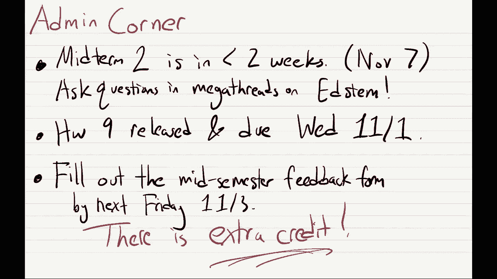
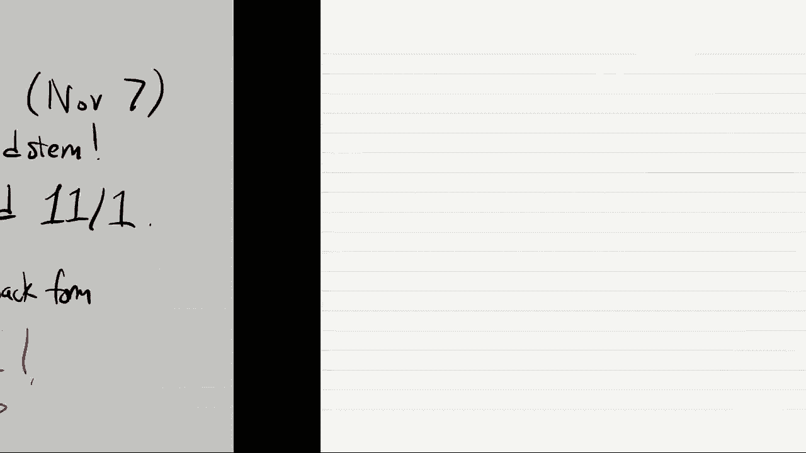
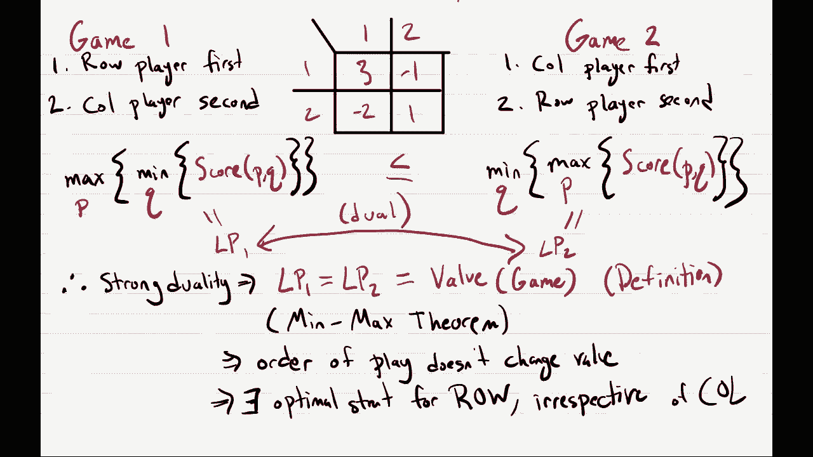
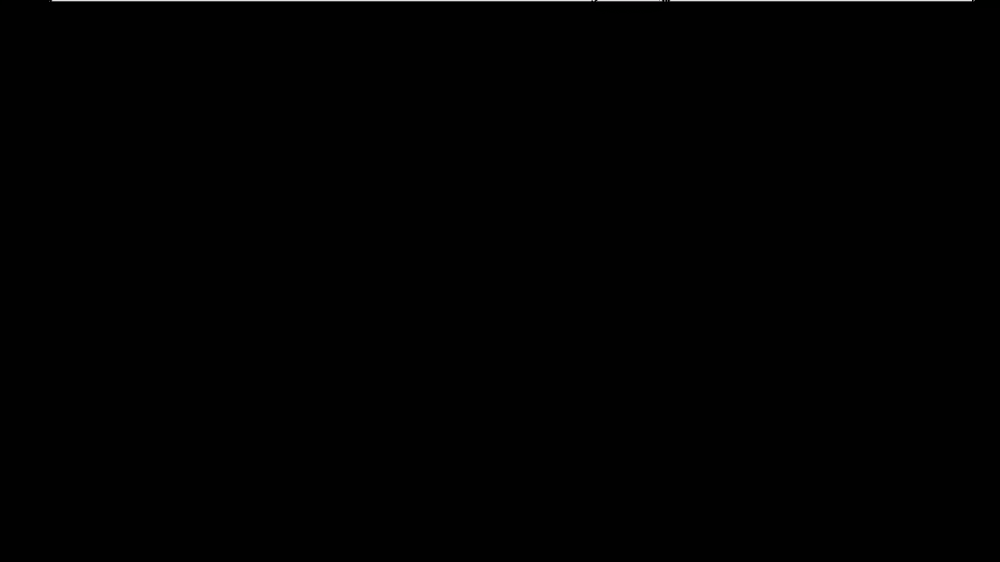
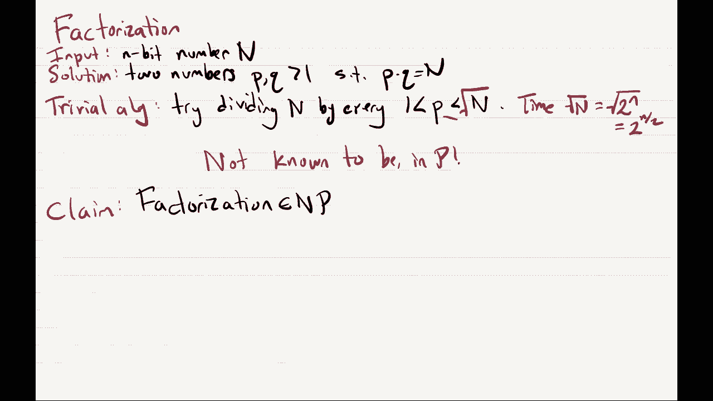

# 加州大学伯克利分校算法课程CS170 - P18：Lec18 Zero-Sum Games - 东风渐起UCAS - BV1o64y177K8

好啦，所以现在是12点40分，那我们今天就开始吧，我们将继续并完成上节课的内容，在我们讨论之前，这是两个玩家的零和游戏，让我们只做标准的管理工作，所以嗯，今天的行政工作是第一次期中考试。

两个是在不到两周的时间里，所以11月7号，嗯，在茎上有巨大的线，在那里你可以问各种各样的问题，所以把你所有的问题都发到那里，作业九已经发布，下星期三到期，第一件事，也是最后一件事。

就是我们把这个学期中期的反馈表发出去，这是我们要做的，你知道的，收集你的反馈并利用它来改进课程，例如，我们已经收到了一些反馈，有些人认为人们花在家庭作业上的时间似乎比我们希望的要长。

所以我们要利用这个反馈，嗯，以后可能会缩短作业，所以是的，我们会听你说什么，我们会试着用它来改进课程，所以是的，告诉我们关于那里的课程，还有，你知道我也一直在寻求进步，所以如果你对我的讲座有意见。

我也很乐意读这些，我走得太快了吗，我去得太慢了吗，完美吗，等等，等等，嗯，如果你能在下周五之前交上来的话，你的期末成绩会有额外的学分，我想是的是的。

请填一下好吗，所以我将从重述上一节课的最后一张幻灯片开始。

嗯，所以我们在研究这两个玩家，零和游戏，所以我们看到的例子，在游戏中，它是由一个矩阵指定的，矩阵中有条目，分录上写的是收益，在这个游戏里有两个玩家，有一个行播放器和一个列播放器，行玩家会选一排。

也许是这一排，专栏玩家会选择一个专栏，也许是这个，然后行和列交汇处的单元格，就像最后发生的事情，这个收益指定了行玩家得到多少，然后纵队球员会得到它的负数，所以行玩家试图找到单元格。

试图把他们带到人数最多的牢房，最正数，列播放器试图找到负数最多的单元格，因为单元格的否定是列球员的分数，上节课我们定义了两种策略，玩家可以使用，其中一个被称为同伴策略，同行策略只是行家。

或者播放固定行或固定列的列播放器，但我们看到，纯粹的策略总体上不是很好，因为如果我只玩固定的一排，然后像专栏一样，玩家总是知道该怎么做，如果你在玩这些游戏，你应该做的是在你的策略中引入不确定性。

一个有不确定性的策略，我们称之为混合策略，混合策略只是分配你的选择，所以要么是行上的分布，要么是列上的分布，我们可以简单地把它描述为纯粹策略上的分布，而且总的来说，当你玩这个游戏的时候。

你知道这两个球员刚到比赛现场，每个人都有他们的混合策略，然后你从他们的混合策略中取样一行或一列，这就是玩家最终玩的，但后来，嗯，在上一节课结束时，我们开始考虑会发生什么，如果这场比赛有回合顺序。

我们叫了第一个转弯顺序，我们在看第一场比赛，在第一场比赛中，行玩家首先选择他们的混合策略，并向每个人宣布，对行玩家来说，什么是混合策略，嗯，这只是他们两排的分布，所以在这种情况下，它是一个分布，普姆。

上面说第一行的概率，P1和第二行的概率，所以P 1，我们可以把它画在这里，p 2，我们可以把它画在这里，现在他们已经宣布了他们的策略，他们已经固定了，他们改变不了，专栏玩家可以看到他们的策略。

并根据它选择自己的策略，因此列玩家用他们自己的策略响应行玩家策略，我们再次允许他们玩混合策略，这种混合策略将是在列q 1上的分布q，Q2，所以q1是一个列玩家采样列1的概率。

Q2是列玩家对第2列进行采样的概率，理想情况下你知道，列播放机将使用行播放机的公告来选择最佳列，混合策略是可能的，然后我们争辩说实际上，如果你是专栏玩家，你可以计算出你平均得到的值，如果你去第一列。

如果你进入第二栏，平均值，玩混合策略实际上不符合你的利益，您还不如总是在两者之间选择最好的专栏，例如，在这个游戏中，列玩家可以看第一列，他们可以计算出回报是多少，如果我用，嗯，如果我总是用第一列。

所以我只是用了同伴策略，那总是第一列，嗯，如果列播放器总是播放第1列，然后用概率p1，游戏的价值将是三，在概率p2的情况下，游戏的价值将是负2，所以这个博弈的平均收益是3乘以1减去2乘以，你还记得。

列播放器正试图最小化此值，嗯然后嗯如果相反，列玩家决定选择第二列，嗯好吧，如果他们选择这个专栏，那就是这个专栏，在概率为p1的情况下，概率p2的分数是1，所以如果他们选择第二栏，平均分是-p1加p2。

对不起，写得不太好，所以考虑到行玩家的混合策略，已经宣布了，这意味着专栏玩家的最佳策略，只是看看这两列，总是选择平均收益较低的，如果他们这么做了，那么平均收益，值将是这两个数字之间的最小值。

所以无论选手决定做什么，如果纵队球员发挥最佳，他们能做到的，所以游戏将得到一个值，是这两个数字的最小值，好啦，然后我们看到那口井，行播放机将知道列播放机将执行此操作，嗯。

他们知道无论他们选择什么混合策略，如果列播放器播放最佳，这将是游戏的回报，划船的人想得到尽可能大的回报，所以行玩家知道列玩家应该处于最佳状态，然后，行玩家将选择p1和p2，以便最大化。

所以他们会在所有混合策略中最大化，P他们可以从这个数字中选择，上面的数字，这就是专栏玩家得到的，或者列玩家可以使游戏的值等于，所以他们会最大化总的p，然后值是这两个数字中最小值的最大值，好啦。

上一节课结束时我们就在那里，对此有疑问吗，对不起，你能晚点再说吗，好呀，是啊，是啊，好啦，酷嗯，我们不需要Q，第二题，因为嗯，专栏播放器，因为他们是第二名，他们实际上从来不需要玩混合策略。

他们只要学会你的策略，所以在这种情况下，这意味着要么他们总是把q 1等于1，或者他们把q 2设为1，如果他们设q 1等于1，然后他们得到第一列，如果他们设q 2等于1，然后他们得到第二栏，对他们来说。

做任何其他有意义的策略都没有好处，宣布下一个，他们真的把概率设为1到2吗，还是他们只这么做，是啊，是啊，所以呃，提醒我你的名字，我知道，我相信这很酷，嗯，是呀，所以当他们宣布他们的策略时。

就像他们真的会喜欢，在一张纸上写下，P one，P二，他们会给每个人看的，然后它们就永远固定了，所以他们实际上是致力于数字p1和p2，这决定了他们的整个策略，哦耶，所以嗯。

我想我们在想象你要宣布一项战略，但你应该选择你认为会做得最好的策略，如果我要事先宣布我的策略，我想弄清楚什么是最好的策略，让我宣布一次，我宣布我修好了，但这只是计算的策略，考虑到我先走，我得先宣布。

什么是最好的，第一页和第二页，你叫什么名字？Aj，有点，是啊，是啊，所以你很好，让我先制定一个策略，一个专栏玩家要做什么，现在就像现在，我知道固定策略的价值，让我试着最大化所有的策略，所以你把它倒过来。

是啊，是啊，哦很好，如果我使用对等策略，我要得到什么，如果我一般做一个纯策略，我得到这个数的概率是1，在概率为q2的情况下，我会得到这个数字，这意味着你是，你只要得到这两个数字的平均值，嗯。

如果这两个数字中的一个比另一个大，或者说比另一个小，嗯，这对你有好处，把你所有的体重放在那一栏的平均值上，否则如果有另一列更大，你在强调这一点，你只会增加价值，这有道理吗，是啊，是啊。

就像一列的平均值为零，另一个是平均值1，然后最好的办法就是把你所有的重量都放在柱子上，值为零的有意义的，你叫什么任务，钓鱼，好啦，最后一个问题，是啊，是啊，哦耶，这就像在讲座之前做了一点准备。

但最终会证明，就像一个固定的策略，你可以宣布，这是最好的策略，不管你宣布你的策略是什么顺序，所以即使你们同时去，这将是你使用的最佳策略，所以它实际上并不是我们将要看到的，一号选手先走，你叫什么名字？

RO，所以说，我想展示的第一件事，行玩家想要做的最大化，实际上可以写成线性程序，好啦，所以角色扮演者给了两个玩家，零和博弈实际上可以有效地计算出他们的最佳策略，所以让我们看看为什么会这样，我重写一下。

这个事实，或者甚至是一个我们可以计算的定理，哦其实，我来复印一下，让我的生活轻松一点，够好了，这所以这是，哎呀哎呀，这是一个数字，嗯，这就像是排玩家的最佳策略，结果是我们可以计算出这个数字，还有P。

那么我们怎样才能做好呢，证据，我来告诉你LP是什么，我要写一张唱片，然后我把它写下来，我解释给你听，在有限状态方程中，你知道我们要最大化一些目标函数，受一些制约，所以目标函数是一个变量z。

所以我们试图最大化，以后再告诉你，我们希望z小于等于3，一减二，Z小于或等于-p1加p2，P1加P2等于1，P1大于或等于零，p2大于或等于零，这是一个线性规划，我声称这个线性程序计算了这个最大化。

所以首先，让我们试着理解这个线性程序在做什么，我们有p1和p2，它们正好对应于混合策略，所以p1和p2是一个概率分布，因为每一个都大于或等于零，它们加起来是一，好啦，这个z做得好的是什么。

我声称关于Z的以下内容，也就是说，它正好等于最小值，三p减去三，一减二，P2减去P1，加P2，所以我说z正好等于这个东西，为什么那口井，Z将小于或等于第一个数，也小于或等于第二个数，我在最大化z。

如果我有什么，我在最大化它，它小于或等于两个数，那么它总是等于两个中较小的一个，两者中的最小值，所以我们要去的Z，那么这个线性规划要做的，它将最大化地选择这种混合策略的所有方式，第一页和第二页。

它将计算这两个数字中的最小值，这正是我们要计算的值，如果行玩家先走，他们得到的值是多少，这就完成了证明，啊，就像我的意思，我们正在设置这个线性程序，这就是我们要写的，这只是我现在设计的一个线性程序。

所以我只是添加了这些约束，但是如果我加上这些限制，当我写线性程序时，我被允许这样做，把z设为这两个值的最小值有意义吗，如果没有，我可以再解释一遍，就等于，哎呦，你说的是一般的线性程序。

让我们看看我们有一个目标函数，然后所有的约束都小于或等于，什么的，我想这可能已经在背诵中表现出来了，也可能在家庭作业上，嗯，有各种各样的方法，一般的线性规划总是由线性不等式和等式组成的系统。

所以这就像一个线性等式，这些是线性不等式，然后你最大化了一些线性的东西，所以这是任何线性规划，任何一般的线性程序都可以这样写，结果发现有一种标准形式，你可以把一般的线性规划。

你可以把它重写成等价的线性程序，在左手边有一些线性的东西，小于或等于这个数的，所以我们可以把它转换成我们在以前的讲座中看到的，如果我们，否，是啊，是啊，任何时候，任何时候。

所有的不等式都是变量的线性函数，我很高兴这是一个线性规划，其他问题，你叫什么名字？阿尔宾·阿比，嗯，就像他们在挑，他们可以选第一和第二，他们想选择P1和P2给他们最好的价值，啊，对不起，列，啊，是啊。

是啊，是啊，是啊，我们想到的是在游戏中，如果你还记得，就像角色扮演者先开始，然后宣布p1和p2，在这一点上，列播放器知道p1和p2是什么，嗯，列玩家知道P1和P2，是啊，是啊。

现在你知道行玩家现在想象的是假设的，如果我选P1和P2，专栏玩家会怎么做，你说像在这种情况下是什么意思，我们在z上最大化，所以这个线性规划，不管我们选p1和p2，考虑到这些约束条件。

它将选择z作为可能的最大数，如果我满足小于，或等于3p1减去2p2，也小于等于-p1加p2，满足这两个条件的最大数字，总是两个值的最小值，有道理，是啊，是啊，所以线性规划也会在p1和p2上最大化，好啦。

所以这给了我们一个线性程序，我把这个叫做LP 1，好啦，嗯，我们刚刚看了第一场比赛，我们看到角色扮演者先走，他们可以用线性规划来计算他们的最佳策略，现在让我们考虑第二场比赛，同样的游戏。

只是转弯顺序被翻转了，所以再一次，这个矩阵，上面写着收益矩阵，当我在这里写作的时候，一个，是啊，是啊，P one，P二，Q1，第二题，所以第二场比赛将是完全相同的比赛，只不过我们让纵队队员先走。

他们必须先宣布他们的混合战略，然后行玩家得到回应，所以这和第一场一样，所以现在让我们想象一下，让我们做和上一张幻灯片完全一样的事情，前两张幻灯片，所以让我们从，你知道的，考虑第二步，所以再一次。

让我们倒回去，嗯，想象一下，专栏玩家宣布了他们的混合策略，也就是q一，Q2，对行玩家来说，再次使用好的最佳策略是什么，行玩家，我是说，他们有选择，我可以用第一排还是第二排，如果他们愿意。

他们可以使用混合策略，但正如我们之前看到的，因为他们是第二，他们还不如直接拿起，所以让我们来计算他们有的两个选择的收益，第一行的收益，以及第二排的收益，嗯嗯，如果列对不起，如果纵队球员先走。

现在排球员玩第一排，就是这个，然后用概率q 1，游戏有价值三，在概率为2的情况下，这个游戏的值减去一，所以平均值，如果他们玩一排，第一排会是第一排的三倍，减去1乘以q 2，另一方面，如果他们玩第二排。

然后用概率q 1，他们得到的值是负2，概率是q 2，他们会得到加1的值，所以平均值是负2乘以q 1加1乘以q，所以这些是行玩家的选项，现在记住，行玩家试图最大化游戏的价值。

那么角色扮演者的最佳策略是什么呢，会是，嗯就是选择收益最大的那一行，如果他们这么做了，那么游戏的平均价值将是3 q 1的最大值，负q 2和负2 q 1加q，所以又是行玩家，他们排第二。

所以他们会选择最大化的行，嗯平均值，现在专栏玩家，嗯，他们先走，他们会试着挑选，他们想把比分缩小到最低限度，所以他们知道如果他们选q 1和q 2，那么他们将得到的值是这两个数字的最大值。

所以他们会选择Q1和Q2，使这个最大值最小化，所以纵队队员的最佳策略，最大限度地减少，所有可能的混合策略，他们可以选择，好啦，所以这是一个非常相似的设置，只是有点，你知道的，最大值和最小值被交换了。

现在我宣布，就像以前一样，嗯，行玩家，对不起，列玩家最佳策略队列，因为他们是第一个，他们正试图找出什么是玩的最佳队列，嗯，我还声称这可以写成线性程序，因为我们把之前的线性程序写成了lp1。

我就把这个写成第二部分，然后嗯，在这个线性规划中，我们要去，现在最小化一个目标函数而不是最大化，让我写下你想要最小化的线性程序，变量z受3 q 1减去q 2的影响，1加2等于，然后q1加q2等于1。

Q1至少为零，Q2至少为零，好吧，所以，哎呦，是啊，是啊，让我看看你是怎么说的，是啊，是啊，你翻转，然后你可能还想把矩阵转置，好啦，所以是的，在这个线性规划中，这里发生了什么，Q1和Q2是你的混合策略。

所以它们是概率分布，这两个数字之和为1，它们不是负数，那么z是什么呢，我们知道z至少是3 q 1减去q 2，也至少是负2，一加二，我们最小化z，所以如果z，如果我们最小化这个数，这个数大于两个数。

那么它总是被设置为等于两个数字中的最大值，这意味着我们在这个线性规划中选择的q1和q2，Z等于这里的最大值，三q一减去q二减去二，一加二，所以事实上，这只是计算了我们想要的数字，哦嗯不，是啊，是啊。

我们可以把它重命名为一个不同的变量，嗯，所以z只是一个变量，我们只在线性规划中引入，它有类似的目的，但这将是一个不同的变量，其他问题，对不起，你能说大声点吗，我们会在下一张幻灯片上看到的，其实呢，是啊。

是啊，你叫什么名字？莱恩其他问题，好吧嗯酷，所以我们有一个回合顺序的第一场比赛，反转顺序第二场，我们有两个LP，人们自然会问这些LP之间有什么关系，所以我们的游戏是负3，一减二一选一，一二一二。

我提醒你一下，好啦，所以我们有这两个游戏，第一场和第二场，在第一场比赛中，排手先上，排行第二，在第二场比赛中，纵队球员先走，排在第二位的选手，在第一场比赛中，游戏的价值，如果这两个球员发挥最佳。

将如下所示，所以这将是最大的整体混合策略，玩家，列的所有混合策略的最小值，游戏得分的玩家，上一节课我们写的是，所以得分PQ定义为，他们平均得了多少分，如果他们玩这两种混合策略，我们在第二场比赛中也有。

如果他们发挥出最佳水平，然后他们会得到最小值，q，um，max，over，p，现在呢，嗯好吧，这就是我们目前所看到的，嗯，我声称这两个值满足了这个不等式，所以第一个，最大值超过最小值。

总是小于或等于最大值的最小值，也许我给你们十秒钟考虑一下，然后我会问谁能给我解释一下为什么，等一下等一下，我有后退吗，是啊，是啊，有人能告诉我后面的路吗，那倒是真的，所以这是一个很好的解释。

你叫什么名字臭氧，也许即使你不知道线性规划对偶性，就像一个更简单的理由，比任何一种，我想那是真的，虽然你知道它们都有最大值和最小值，你知道的，你拿一个，哎呦，那是，是啊，是啊，我想那是真的，呃，嗯。

这是一个很好的说法，有人看到像一个，第三名，嗯，也许我会说出来，然后呢，就像你知道的，在游戏中，如果我是最大化玩家，它总是帮助我去第二，对呀，我先走从来没有好处，如果我先走。

我不能对专栏作者的所作所为做出反应，但如果我第二，我可以对专栏玩家的所作所为做出反应，如果我第二，我有可能选择一个更好的策略来回应专栏玩家策略，但如果我先走，我不能那么做，所以第二名总是对我有好处。

所以第二个值只是，你知道的，顺便说一句，游戏是玩的，第二个值必须更大，好啦，然后我们看到这是由一个叫做lp 1的lp计算的，这是由一个叫做lp2的lp计算的，两个，嗯，嗯，我想重点是。

如果我们只是从排球员的角度来看，谁在努力把比分弄得尽可能大，嗯，这就像分数一样，如果排在第二位的选手，这就是他们能做到的，他们的目标是把它做得很大，对他们来说肯定更好。

如果他们第二个去可能会比第一个去得到更好的分数，所以我们预计在这种情况下分数会更大，因为他们可以排第二，但在这种情况下，他们先走，所以这给了专栏玩家优势，使他们可以缩小比分。

就像得分是从排球员的角度定义的，这是排球员得到的分数，这有道理吗，好啦，所以说，啊，是啊，是啊，是啊，是啊，所以最大值在里面的原因是列玩家先走，然后排，所以他们选择他们的cu并给出q。

行玩家可以在队列中选择最好的p条件，这就是这个符号告诉我们的，你在最小化Q，然后里面的队列已经固定好了，所以现在p到了p，就被选为最好的p，回应Q，是啊，是啊，外面的最小就像专栏玩家可以先选。

里面的最大值是行玩家可以选择第二个，这张幻灯片很相似，你也知道这个游戏的价值，我们看到你最小化Q，然后最大化角色扮演者策略，这就是最小值和最大值，和这个最小值后面跟着最大值是一样的--这有意义吗，好啦。

所以嗯，我们看到每一个值都是由一个线性程序计算的，然后呢，正如臭氧指出的，嗯，这两个线性规划实际上是通过对偶联系在一起的，所以我不打算证明这一点，但这是你可以在家坐下来检查的东西，在家做的好运动。

把你写下的第一个线性程序，然后使用我们的公式来计算上一节课中的对偶，你会发现这个LP是一个最大化，LP是对不起的对偶，Lp2是一个最小化，lp是lp的对偶，它是一个最大化，因为他们是对偶。

LP 1是一个最大化，我们知道lp1总是小于等于l2，又是LP二值，正如臭氧所说，这只是弱对偶性，所以我们确实有一个解释，小于或等于仅仅使用弱对偶性，嗯，但我们也看到了这个叫做强二元性的事实。

对于任何值有界的线性程序，它都具有强对偶性，但那是什么意思呢？这意味着它有像，这是可行的，所以它有一些解决方案，最大解的值不是无穷大，但在这场比赛中，比如行玩家能实现的最佳值，或者一个专栏玩家可以实现。

它总是一个固定的数字，它不会是无限的，嗯，所以强烈的对偶性肯定适用于这种情况，这意味着线性程序实际上计算了相同的值，作为线性规划二，所以特别是，这告诉我们，在这个游戏中，对行玩家来说并不重要。

如果他们先走或者后走，对他们来说，第二个回应专栏玩家实际上是不有利的，这意味着他们可以在一开始就选择一个策略，嗯，那将是他们最好的策略啊，就在球棒上，所以因为我，这个游戏有同样的价值，不管谁先走，嗯。

您可以将其定义为，这就是人们所说的游戏的价值，所以这个博弈的价值就是这个最优点，这个最佳值，最佳策略的价值，不管是一个玩家先走还是另一个玩家先走，所以在博弈论的文献中，如果你上过博弈论的课。

你一定会看到这个定理，在我们的课本上有时叫做，我们称之为最小最大定理，因为它说我们这里有最小最大值，它是平等的，其实呢，如果你把它们换了，最小值和最大值，所以最小值和最大值出现的顺序实际上并不重要。

这是非常令人惊讶的，它有时也被称为极小极大定理，我想这是更常见的，但我用这个是因为，嗯，因为课本上是这么说的，再一次，这意味着游戏中的顺序并不重要，尤其是，这甚至意味着对行玩家来说存在一个最佳策略。

不管专栏玩家是什么，所以再一次，喜欢行玩家，这实际上对他们没有帮助，嗯，查看列播放器策略，他们还不如忽略专栏玩家的所作所为，玩这个最优策略，如果他们先走了，他们会做的。

它们在任何一种情况下都会得到相同的值，至少假设两个玩家都玩得很好，是啊，是啊，是啊，是啊，所以我们证明的这件事，我是说，我们只是为了这个玩具的例子，但这东西对每两个玩家都有效，零和博弈，哎呦，为什么。

为什么强二重性适用于这里，又是如此强烈的二元性，它只适用于最优值有界且均值有界的线性规划，就像最佳值在无穷大上，如果是线性规划，最佳状态不是无穷大，如果有像一个，如果可行的话，所以存在一些满足。

一些可行的观点，而且最优也不是无穷大，然后LP对偶性，强烈的二元性，再一次像这样，它保持在这里，因为最好的，角色扮演者，你知道的，他们在这场比赛中的最好成绩，它不可能是无限的，对呀。

就像他们能做的最好的，平均是三个，啊，你说圆的时候，你的意思是，就像划船运动员宣布他们的策略，然后纵队队员宣布我们的策略，然后行玩家改变策略，上面写的是，嗯是的，在这种情况下，我是说。

角色扮演者不妨从一开始就修复这个最佳策略，即使他们事后有机会更新策略，他们不必，我觉得你说的有一部分是对的，我们可以把它写成最大值，最小最大值，但我想我们可以把最小最大值定理应用到中间的最小最大值。

你知道，交换这些，我们得到两个最大值，这就变成了一个最大值，我想在这种情况下，它将适用于，非常，这里需要的是它就像一个双线性函数，所以我们在乐谱中的函数，它在p中是线性的，在q中是线性的。

但我不认为它适用于任何功能，是啊，是啊，所以是的，意思是你在说，我们知道最大最小值小于或等于最小最大值，这也意味着max in大于或等于max，因为他们两个是平等的，为什么你没事，这里有个问题，也许吧。

嗯，让我们看看，我的意思是，我很好，我只想说，如果你把右手边的原点，因为不是每一个LP都会计算一个最小最大值，LPS他们可以计算任何东西，刚好我们写在这里的LP，是否计算最小最大值，但是是的。

如果你用这个的对偶，你会回到最大值的，那是因为对偶，对偶是原始的，但是是的，我不能说这适用于每一个LP，它碰巧计算了一些形式为max的东西，所以嗯，是啊，是啊，你们中的一些人可能听说过博弈论中的一个。

有一种叫做纳什均衡的东西，你见过像一个美丽的心灵，这就像是让这个家伙约翰，纳什超级名人和纳什均衡，这是在一个更普遍的游戏中，所以不仅仅是两个人的零和游戏，这是一对策略，每个玩家都可以在哪里玩。

如果双方都在玩这些策略，那么任何一个玩家偏离他们的策略都没有好处，对于两个玩家零和游戏的特殊情况，这是你的纳什均衡，所以如果行播放器播放皮克斯最优p，专栏玩家选择他们的最佳Q，那就定义了我们的纳什均衡。

这个定理告诉我们，是啊，是啊，如果他们两个都玩这些策略，那就像这对任何一个玩家都没有帮助一样，如果他们偏离了他们的策略，改变你的策略是没有意义的，如果你已经在玩你的纳什均衡，这就像纳什均衡。

但只专注于两个玩家零和博弈，D在哪里，你可以做得更糟，是呀，但你做得再好不过了，哦，纳什均衡，这就像是一种策略，在一个更普遍的游戏中，不仅仅是两个玩家，零和，这是两个玩家的一对策略。

所以就像你玩你的策略，我玩我的策略，他们有，嗯，它的特性是，如果我们两个都在玩我们的策略，假设我想得很好，我应该改变策略吗，我能改善我的情况吗，答案总是否定的，我不能通过改变策略来改进我正在做的事情。

你也不能通过改变策略来改进你正在做的事情，是啊，是啊，我是说，在这种情况下，他们都发挥得很好，我们所知道的是，我们知道的是，是啊，是啊，对于这场比赛，就像对两个玩家一样，是啊，是啊。

这对我改变策略没有帮助，知道对方在做什么，嗯，是啊，是啊，这就是后果，所以这对我回应你的最佳策略没有帮助，好啦，让我们休息三分钟，然后我们会完全改变话题，是啊，是啊，休息三分钟，你知道的。

站起来伸展一下，我们可以让一个英雄回去把门关上。

啊，所以我的意思是游戏的价值，它的值也恰好等于，他们总是，是啊，是啊，就像所有这些工作的定义一样，只是耶，因为它有效，他们总是，是啊，是啊，道路总是会，如果我玩一个策略，就像另一个玩家玩的策略一样。

在给定的情况下，游戏的价值就像平均尺度一样，和q一，第二题，那里，在我们的，Q1，第二题，是专栏玩家可以选择的策略，好啦，好啦，他们彼此了解吗？他们知道对方的策略，如果一个人先走。

就像如果专栏玩家去做同样的分析，好吧，如果专栏玩家有喜欢，宣布策略的事情，是啊，是啊，那只是一个，如果有固定的数字，然后最大值也是一个固定的数字，对呀，把你的井缩小有什么意义，它是它是一个固定的。

只有当你考虑到，但这取决于你，因为q不是固定的，所以不同的q值会给你不同的值，所以这是专栏的坏策略，假设有些是未知的q 1 q 2好吧，假设他们知道Q1和Q2，然后他们会选择最好的策略，根据这些数据。

他们将在第一排和第二排之间选一个，但他们不知道，是啊，是啊，在这场比赛中，专栏玩家先走，宣布他们的策略，在这里，划船者可以对这种策略做出回应，当列选择最佳策略时，列的最佳策略，他们不知道在这场比赛中。

角色玩家知道列玩家的策略，因为列玩家先走，但是列玩家不知道行玩家的策略，因为划船的人，专栏快速策略就像假设角色会发挥最佳效果，就像你想选择，你的策略是什么意思，你的策略就像你要么玩一排，要么玩另一排。

混合策略是你在一朵玫瑰上玩分配，艾米·艾米斯，就像0和1之间的环中的p1和p2，但这个就像，对不起，三分钟了，对不起，好啦，已经三分钟了，是啊，是啊，我们能派人回去吗，有人能把后面的门关上吗，求求你了。

不用了，谢谢，好啦，现在我们完成了一个关于线性规划的单元，事实上，我们可能希望将来能再短暂地见到他们，但现在我们要转移到一个新的单位，嗯，所以是的，这一部分将是关于这些你可能听说过的事情，称为p和np。

这是我个人最喜欢的课程单元，就像我读本科的时候，这是一个让我非常兴奋的话题，以及计算机科学中的算法，这就是让我想成为这一领域的研究员的原因，那么好，希望你们也喜欢，嗯好吧，那么这些话题是什么呢，嗯，嗯。

是啊，是啊，所以我想就像以前在课程中一样，我们所做的就是，我们研究了解决许多个人问题的技术，但现在我们要退一步看看，有没有什么能把我们所有的问题统一起来，所以有没有什么方法可以不谈论具体的问题。

但总的来说，就像一大类计算问题，我们来看看如何用这些p和np，所以让我给你们举一些我们到目前为止所看到的例子，在这门课上，我们见过很多算法，例如，就像我第一次在这里讲课一样，我说的是这个多项式乘法。

我们给出了一个惊人的快速算法，基于按n阶工作的快速傅里叶变换，log n时间最优是n次方，也许不是最佳的，但你不能做得比命令N更好，所以这就像非常接近，绝对是最好的，之后让我们看看，嗯。

hoktallab教授向你们展示了一些算法让我们看看最小生成树，所以你看到了一个Cruals算法，你也看到了prims算法，对于这些，我们也看到了惊人的快速算法，所以对于跨学校来说，例如。

我们给出了一个以n加m的顺序运行的算法，除了时间，就像乘法的log n因子，好啦，所以这几乎是线性的，它几乎是线性的，那太好了，我们在动态编程中也看到了，我想是动态编程，是啊，是啊，所有对，最短路径。

在这里我们看到了一个算法，给定一个n个顶点图，它很好地计算了所有对的最短路径，好的，好的，我们真正想要的是线性的，你不能做线性，因为即使写下所有的最短路径对，就像你必须对每对顶点和它们的n个平方对。

所以即使只是写下你的答案，你需要n的平方，我们无法得到n的平方，但我们能够得到n的立方，所以它不是惊人的快，但还是挺快的，名单还在继续，你知道的，我们已经看到，在这一点上。

我们已经在这门课上看到了很多问题，在理论计算机科学中，我们会把所有这些都称为高效算法，我们会说，因为我们有解决这些问题的有效算法，它们是可以有效解决的，所以从技术上来说，问题高效解决意味着什么。

所以问题是可以有效解决的，如果能在多项式时间内解决，对于某个数k，多项式时间表示n到k的阶数，所以这只是理论界广泛认同的定义，是啊，是啊，哦耶，我想我们不会在这里讨论伪多项式，为什么你问一个好奇的人。

哦嗯，在耶的世界里，这被认为是不有效的，理论，就像这是高效的定义，但我的意思是，它肯定比指数时间算法更有效，所以你就快到了，好啦，所以这就是定义，所以n阶n阶平方n阶立方算法是有效的。

n的二阶算法是不有效的，让我说一句，这在理论上是，好啦，所以这就是，嗯，当你谈论理论计算机科学时，商定的定义，但在实践中，你真正关心的不一定是多项式。

但你真的关心我的算法在现实世界中在我的电脑上运行得有多快，有时这是两件非常不同的事情，嗯，但尤其是如果我想在实践中运行一个算法，你必须记住，在实践中，许多人，很多次，你的数据集非常，非常大，嗯就像。

举个例子，你应该想想，也许脸书的图表，那就像一张图表，上次你可能想在上面运行一个算法，我查了一下上面有28亿人，如果我有28亿人在一个图表中，然后我试着在上面运行所有对最短路径，例如。

二十八亿立方体对你来说太大了，能够在你的电脑上做任何事情，所以实际上多项式并不一定意味着高效，在实践中，有时候，如果你想让它高效，如果你想要一个高效的算法，你真正的意思是，是一种算法。

也许这只按时间顺序n运行，或者订购N个登录，嗯，在实践中，有时n的平方是好的，有时在实践中，n次方的顺序很好，但是像这样的算法是非常罕见的，实际一点，比这慢得多，尤其是我们在现实世界中拥有的大型数据集。

你有问题吗，哦登录，是啊，是啊，所以log n，问得好，所以说，如果我有一个顺序为log n的算法，好吧，log n是阶数n，所以算法是n阶多项式，例如，这里的运行时顺序为n log n，也是n阶平方。

因为n log n小于n的平方，所以这也是多项式，你叫什么名字？嗯好吧，那么我们为什么，为什么我们在理论上同意这个定义，嗯，我想有两个原因，嗯，其中之一就是，很少有算法能真正运行一个命令，一百结束。

你只是几乎看不到，即使你在做理论结果，通常，如果您有一个多项式运行时的问题，把那个多项式降到一个合理的数字是可能的，通常如果你真的很努力，你实际上可以把它归结为线性。

所以有一个多项式运行时通常是一个暗示，可以归结为一个合理的多项式，第二件事是，如果是多项式，这通常意味着你对问题有所了解，关于这个问题的一些重要的事情，例如，如果你对一个问题一无所知。

也许你唯一能做的就是蛮力搜索，可能需要指数级的时间，但是为了让你的运行时间从指数下降到多项式，这仍然意味着你已经发现了关于这个问题的一些关键见解，我认为作为一个理论家，那还是很有趣的。

所以让我们来看看我们的第一个主要定义，嗯，这是这一部分标题的第一个字母，是一类问题，所以这将是一组计算问题，嗯，是的，这个区域我们称之为复杂性类，它是一个复杂类，包含了所有可以有效解决的问题。

所以多项式乘法在p中，最小生成树在p中，所有对最短路径都在p中，关于这个的问题，好啦，那就是p，哦耶，哦耶，理论上，这种情况经常发生，当你有一个只有一个运行时的算法时，许多年后。

你想出了一个运行时更好的算法，例如，最大流量，嗯，我们在几节课前看到过这个，就像算法中的福特福克斯，一开始是很慢的，嗯，但现在我们有了一个近乎线性的时间算法，就像去年一样，所以算法总是在进步。

越来越快地解决这些问题，例如每隔几年的线性规划，有人想出了越来越好的算法，我认为仍然有很好的算法来解决这个问题，尚未被发现，好啦，这就是现在的p，什么是NP，Um是一个不同的复杂度类。

它包含了许多看起来很难的问题，NP是一组问题，不是在它们自己能有效解决的地方，但是你仍然可以有效地检查他们的解决方案，哦对不起，我要说一件事，P在这里是什么意思，P代表多项式，这是多项式，好啦，是啊。

是啊，所以NP是类，所有计算问题的复杂性类，其解可以有效地验证，那么这对某些问题意味着什么呢，甚至很难自己想出解决办法，但如果别人解决了它，然后给你解决方案，验证他们确实有正确的解决方案可能很容易。

所以这是，这种想法认为可能无法有效解决的事情，仍然可以有效地检查，这可能是你在学校经常遇到的事情，例如，你的作业，你可能会发现这些问题很难解决，但是一旦我们发布了我们的解决方案。

您可以查看解决方案并检查它们是否正确，检查解决方案比想出解决方案容易得多，这是一个复杂性类，它是这个概念的基础，所以让我也说，NP，你真的不应该担心，它所代表的，我告诉你吧，意思是。

它代表非确定多项式时间，我不指望你记得，它有一个如此奇怪的名字的原因只是一些历史，嗯原因，就像在70年代，当人们第一次引入这个复杂类，他们有错误的看法，所谓的非决定论，但现在在现代理论中。

我们理解更好的理解方法是理解这个复杂性类，只是通过有效地验证解决方案，所以让我给你们举一个问题的例子，那是在NP中，所以这是一个非常著名的问题，叫做三着色问题，你在三色问题上的投入，是一个n个顶点的图。

我们就叫它G吧，这个问题的解决办法，嗯，你在这个问题上的目标是什么？这是为了给图形上三种颜色，那是什么意思，你想分配红色，图中每个顶点的绿色或蓝色，保证任何两个顶点之间有一条边，被赋予了不同的颜色。

所以换句话说，这个问题的解决方案是着色，我们叫它C吧，把顶点映射到红色，绿色和蓝色，收到两种不同的颜色，让我用这个图举一个例子，让我看看，我想是三个五颜六色的，假设我从给这个顶点分配红色开始，让我看看。

也许我想把这个顶点变成蓝色，我想我会把这个顶点变成蓝色，也是，然后剩下的两个顶点，我不得不把它们都变成绿色，因为这两个顶点是相邻的红色和蓝色顶点，所以这是一个计算问题，所以我们应该问问自己。

对于这个问题，我们能想到的最好的算法是什么，嗯，也许我给你们15秒钟想想，你得到了一张图表，你怎么找到三种颜色，最好的算法是什么，你可以想出，好啦，有什么建议吗，你们三个怎么给图表上色，哎呦。

所以你是说，比如从一个顶点开始，给它分配一个颜色，一直出去直到你有冲突，嗯，然后像回去，然后以某种方式撤销你正在做的事情，是啊，是啊，我想这是一件很自然的事情，只是它有点难，因为它就像一个。

我想这不是一个完全指定的算法，就像你回去的时候，你怎么改变你的颜色，你也知道，但这绝对是第一件事，如果我是，如果我有一张图表，这是我在实践中会做的，还有其他想法吗，就像一个算法，是啊，是啊，是啊，是啊。

我觉得，如果你那样做，嗯，是啊，是啊，呃，有可能这些问题中的一些你可以做动态编程，我不清楚，但我想你可以在这里做一些动态编程，但我声称上面有一个更简单的算法，哦嗯，是啊，是啊，我是说。

肯定有度数高于3的图表，可以是三种颜色，所以想象一个顶点与许多顶点相连，你可以给它上色，嗯它，就是喜欢的情况，如果你的图形度数很低，那你就可以一直，我觉得用这个度数加一个颜色，嗯。

但它甚至可能是三种颜色，即使程度很高，还有其他猜测吗，是啊，是啊，所以你是说随机分配所有的颜色，如果不行的话，翻转其中一个颜色，是啊，是啊，所以我想这样的东西在后面也可以用，是啊，是啊。

所以你也可以做这样的事情，然后我想问题是好的，如果你到达一个顶点，你发现你不能给它着色，那你怎么办，你知道的，好啦，所以是的，这就像这太棒了，我是说，这些都是算法的想法，我必须，嗯。

很久以前我也试图解决这个问题，我不能，我想不出一个好的算法，但让我告诉你，对于几乎所有这些问题的基线算法，这应该始终是您尝试的第一种算法，嗯，这只是一个绝对平凡的算法，这个算法是什么。

只是尝试所有的颜色，那么这意味着什么呢，嗯，我有n个顶点，一种颜色，把他们每个人，要么是红色，绿色或蓝色，所以总共有3到n种颜色，算法的问题是把3个都尝试到n个，所以只要有一个循环。

你就像在所有这些颜色上循环一样，对每个人来说，只要检查，这张图的三种颜色是合法的吗，还是有一条边，两边的颜色都一样，如果你找到一种有效的颜色，那你就开心了，但是如果你把每一种颜色都看了一遍。

没有一种是有效的，那你就知道答案是否定的，没有解决办法，所以这几乎是NP中的许多问题，这就是你应该如何看待第一个算法，至少有一个简单的算法，在那里你只是蛮力所有的解决方案，那要多少钱呢？它现在跑多快。

事实证明有一个更好的算法，你可以稍微改进一下这个算法，但你不能改进太多，所以像算法研究人员一样，你知道的，在过去的50年里试图解决这个问题，嗯，使用我们所有的算法工具包，贪婪动态规划，等等。

当你真的把厨房的水槽扔向它的时候，你最多只能得一分，三个，两个，八九到结束时间，所以比三到n要好，但它仍然是指数级的，还是不太好，嗯顺便说一下，我不指望你还记得，就像你应该能在这里想出这种颜色。

三到n算法，但我不指望你能记住，三二八啦，对n算法说废话，那就像一个，但是这个问题所以这个问题不一定在p中，不知道是NP，事实上，我们相信这不是，虽然我们无法证明，但我声称这是一个NP，因此。

尽管我们不能产生解决方案，我们可以有效地验证解决方案，为什么那口井，我把算法写下来，我打算称之为验证，有效地检查这个问题的解决方案，所以它作为输入，图g等于ve，E，它还将解决方案作为输入。

把顶点染成红色，绿色，蓝色，它有什么好处呢？我要检查溶液是否是有效的三种颜色，我怎么知道一种颜色实际上是有效的三种颜色，好吧，我只是迭代了所有的边缘，我检查它们两边都有不同的颜色。

所以我检查了所有的边缘，U和v和e，我检查了u中的c不等于b中的c，这是你知道的，效率很高，它需要m的时间，m最多是n的平方，所以这是多项式时间来检查，但是据我们所知，实际产生解的多项式时间。

为了节省时间，让我再做一个快速的例子，所以你的输入和因式分解是一个n位的数字，事实上，有一段时间我引起了你的注意，你不喜欢把你所有的东西都收起来，也许现在是要求观众投票的好时机，未来，我是说。

我可以看到喜欢幻灯片的举手吗，把手举起来，喜欢手写的人要骄傲，喔喔，好啦，啊，那太好了，那让我的生活更轻松，好吧，那么，我想从现在开始我们要手写了，所以因式分解，你得到一个n位数字n和你的解。

会有两个数字，P和q，至少有一个p乘q等于n的，好啦，所以我想输出两个乘积等于n的数，为什么我希望他们两个都大于一个，嗯，如果我允许你输出一个等于一的数字，我可以给你一个平凡的解，n等于1乘以n。

但这不是一个有趣的解决方案，它不能帮助我计算数字，让我告诉你们这里的平凡算法是什么，嗯，平凡的算法只是，你知道的，找到一个因素，我必须在1和n之间找一个除n的数，所以让我们试着除n，由每一个小于p的数。

小于或等于，还是对不起，严格小于n，销毁你能销毁的每一个数字，看看其中是否有一个是，除以你的数字，呃，有谁觉得有更好的办法，是啊，是啊，好耶，你实际上不必去N，你还不如停在根N嗯，因为你知道。

如果我有两个数a和b，它们的乘积等于n，那么其中一个必须小于或等于根n，如果它们都大于根n，那么他们的乘积将大于n，所以你总是知道它是否有一个因素，其中一个小于或等于根n，这里的时间复杂度是根n。

现在记住大写n，它就像一个n位的数字，我指定作为你的输入，所以它可以大到n的2次方，所以如果我在时间里奔跑，资本n，那就是2的平方根乘以m，就像2的n次方除以2，因为我的输入长度是小写n。

这在我的输入长度中是指数级的，我只想说，好啦，我会大声告诉你最好的数字或最好的算法，也许我会在edstem上写点什么--一张纸条，最佳算法及时运行，那基本上就像2到1/3的末尾，所以它仍然是指数级的。

我们不知道还有比这个更好的算法，这个算法不知道在p或对不起，这个问题，但我们确实有以下主张，即因式分解在NP中，因为如果有人给你一个解决方案，两个数字p和q，他们声称这是最重要的因素。

或者是你的数字的因子，你可以通过检查它们都大于1来有效地检查它，它们乘以大写n，很有效率，所以这是NP中的一个问题，但不知道是NP好吧，我们下期再见，NP中的更多问题，对不起。

