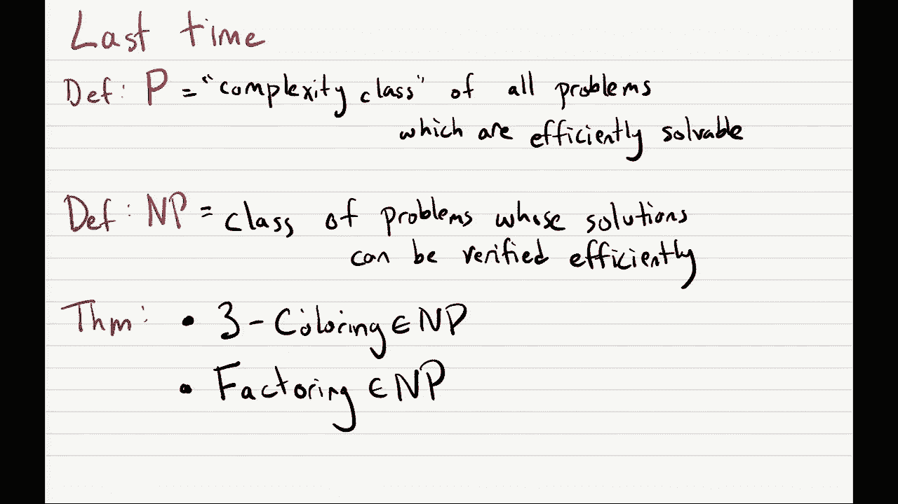
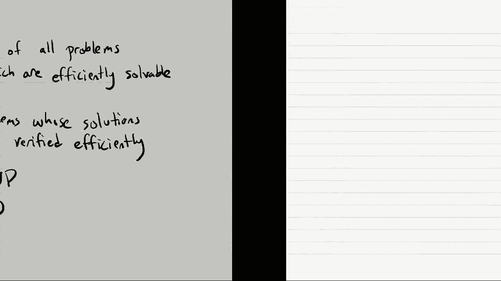
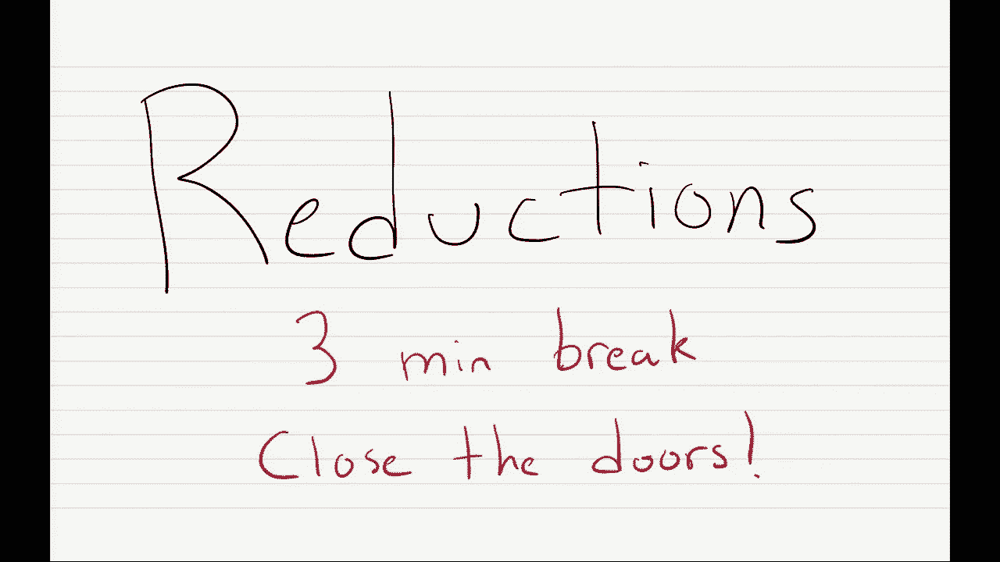
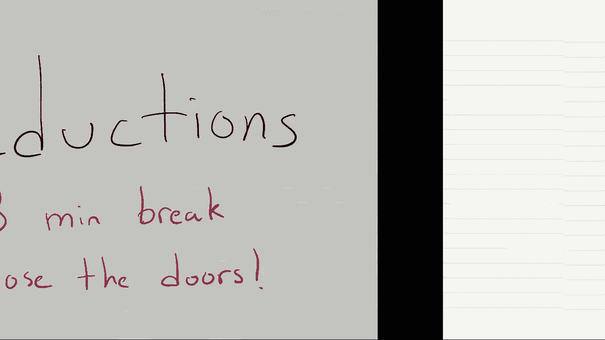
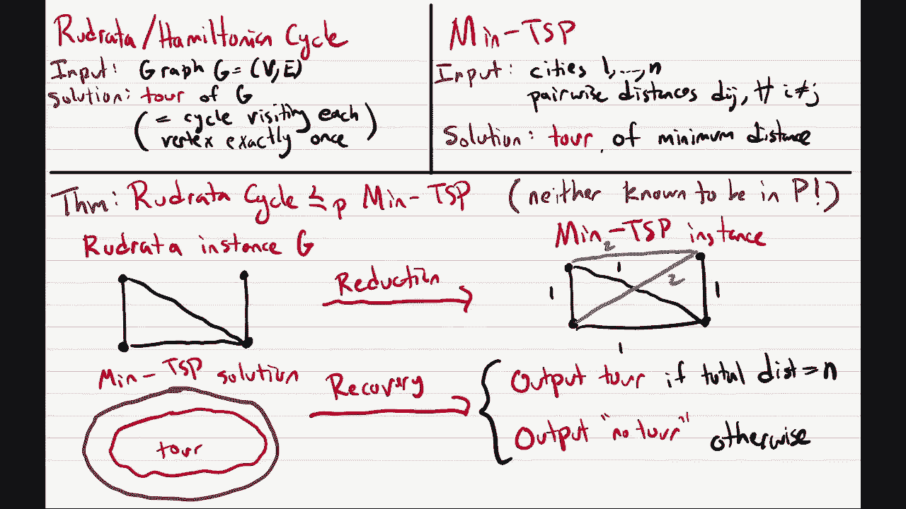

# 加州大学伯克利分校算法课程CS170 - P19：Lec19 Reductions, Bipartite Matching - 东风渐起UCAS - BV1o64y177K8

其实那个说法，好啦，现在是12点40分，所以让我们开始吧，我们将继续上次讨论的内容，我说这是我个人在这门课上最喜欢的话题，所以p和np的主题，然后我们也要扩展话题，也谈论削减，所以开始。

让我们只做我们的管理的事情，所以首先是期中考试，一星期后就要期中考试了，所以11月7号，刀柄上有螺纹，在那里你可以问问题，我想起了过去的期中考试，所以去那里问你的问题，他们将是一些检讨会议。

十一月四日和五日，从上午11点到下午1点，那是一个，不是2，嗯，然后是第九份家庭作业，九号作业明天交，然后我们将公布第十项家庭作业，比平时长了一点，但这完全是可选的。

所以你应该希望不要因为长度而感到压力，而是把它看作是练习的好方法，我们要放在期中考试上的东西，最后一件事是我们在学期中开了一个反馈论坛，对我们很有用，如果你填好表格告诉我们你喜欢什么，不喜欢这门课。

你喜欢什么，不喜欢我的指示，嗯，什么都行，我们将努力保持，考虑你的反馈，如果你在星期五之前填好，你会得到额外的学分，好啦，这就是管理方面的事情，让我们来看一下今天演讲的内容，所以让我先提醒你们。

上次我们看到了什么，上次我们定义了两个非常重要的概念，嗯，也许在所有理论计算机科学中最重要的概念是P类，p代表多项式时间，它是复杂性类，在所有的问题中，所有计算问题，是可以有效解决的。

我们定义了高效可解的最后一类，有效可解的定义是在多项式时间内可解的，表示某个整数k在时间n到k的可解，然后我们将它与另一个叫做NP的复杂性类进行了对比，NP是一类问题，其解是有效可验证的。

即使不能有效地产生解决方案，所以这门课的问题可能很难解决，但是一旦其他人经历了所有的艰苦工作来解决它们，然后他们给你解决方案，您可以自己查看解决方案并有效地验证它，再次有效地验证手段，多项式时间验证。

然后我们得出结论，证明了一些问题是np或在np中，所以我们看到的第一个问题是三种颜色的问题，我们证明了它是在NP井三种颜色中，你知道你想要三色的，图表，嗯，就我们所知，要真正做到这一点是很困难的。

但是如果有人给你他们声称的是另一个图中的三种颜色，检查起来很容易，你只需检查每对相邻顶点接收到不同的颜色，在多项式时间内，你可以很容易地做到这一点，然后我们结束了这堂课，看到了一个不同的问题。

叫做因式分解，我们做得更快一点的是一个np，所以因式分解给你一个整数，你想输出它的一个因子，不是一个也不是数字本身，据我们所知这是另一个难以解决的问题，但如果我给你一个数字的因子，很容易检查。

这确实是一个因素，你所要做的就是把这个数字除以，所以今天，我们首先要做的是看看其他几个重要的问题，并表明他们也在NP中。

所以我们今天要看的第一个问题。

是一个叫做鲁德拉达循环的问题，好的，好的，或者至少在课本上被称为rudra循环，但我应该告诉你，如果你走进现实世界和其他人谈论这个问题，现实世界中的其他人都知道这是汉密尔顿循环问题，所以在这个房间里。

这是一个重画，循环问题，在这个房间外面，这是汉密尔顿循环，名字是怎么回事，嗯，这个问题是由这个家伙研究的，汉密尔顿忘了它就像19世纪或18世纪，因为他研究过，我是以他的名字命名的，但事实证明这家伙。

鲁德拉达其实早在一千年前的九百多年前就开始研究了，所以我是说他比汉密尔顿赢了一千年，就像他应该得到这个问题的荣誉一样，但不幸的是，你知道的，世界不是这样运作的，总是，但在这门课上，就像我说的。

我们称之为重画循环，那么这个问题是什么呢，嗯，你的输入只是一个图表，G，您可以在这里为有向图和无向图定义此问题，我们只考虑无向图的情况，而这个问题的解决，只是对图表的浏览，好啦，那么什么是图表之旅，嗯。

这是图中的一个循环，所以你知道，它从一个顶点开始，它四处移动，然后以相同的顶点返回，在做循环的过程中，它只访问每个顶点一次，我要强调的是，你知道的，如果我允许你多次访问顶点，那基本上就是问你，如果有像。

图形连接正确，但如果我限制你只访问每个顶点一次，嗯，那么这给了我们一个不同的问题，所以我想做的第一件事总是有用的，只是想想这些问题，比如什么是自然算法，去想那么像什么，你会尝试用什么算法来解决这个问题。

所以是的，也许像上次一样，我给你们三十秒，你知道的，好好想想，咨询你的邻居，等，你会用什么算法来解决这个问题，好啦，那可能是三十秒，所以有人想知道你会尝试什么算法，啊，什么事？是啊，是啊。

你是怎么做到的，啊，你的意思是，就像我们之前在课堂上看到的那个，就像动态规划算法，哦很好，所以说，一个，一个建议是使用我们看到的动态程序，对于一个课堂上的琐碎人来说，这实际上是一个很好的答案。

不利的一面是，这将需要指数级的时间，但这是一个可以尝试的算法，很好地尝试每个节点上的DFS，下半场你说了什么，酷，我喜欢回答任何其他的猜测，堤坝没事，是啊，是啊，更多的图算法，所有伟大的答案。

对于这些问题，一个人应该经常想到，你想象的最愚蠢的事情是什么，尽可能愚蠢，最琐碎的事情是什么，完美，是啊，是啊，所以平凡的算法，一般来说，有了np问题，或者我们将要展示的问题都在np中。

从基线算法开始的最佳算法总是一个平凡的算法，就是努力做好，你知道的，旅游，它只是一种排列n个顶点的方法，嗯，有n种不同的阶乘方法来排序顶点，好啦，所以全部试试，对于每一个检查看看。

就像我顺序中的每个相邻顶点，嗯，他们之间有一个优势，所以我真的可以通过跟随图中的边来获得这个顶点序列吗，如果你尝试每一种排列顶点的方法，其中没有一个真正对应于旅行，你知道答案是否定的，没有旅游。

但如果有旅游，你最终会找到它的，所以这是最简单的算法，实际上你可以用DP做得更好，但又一次，这就像现在的基线算法，嗯好吧，所以这就像，你知道我们想到的第一个算法，但是几十年来人们一直在研究这个问题。

我正在努力改进这一点，所以嗯，如果你尽你最大的努力，使用你所有的算法技巧，你会发现最著名的算法，它实际上比这个快得多，我想比DP解决方案还要快，时间到了1点6分5秒7到N，嗯又来了，呃是的。

所以这比n阶乘要好，它在n中只是指数，但它仍然不是多项式，所以这个问题确实，不知道，在P中，其实呢，怀疑不是NP，所以人们怀疑这个问题确实需要指数时间，但事实证明这个问题在NP中，所以说，其实呢。

这将画一个循环，我只想提醒你，做一个NP意味着什么，嗯，嗯，为了证明这一点，你要做的是给出一个算法，也许我们可以称之为验证，它包含了这个问题的假设解决方案，并检查它确实是一个正确的解决方案。

所以它会把两个东西作为输入，原始输入是图G，然后也是解决方案，这就是你声称的图表之旅，然后它应该能够做的是有效地检查旅游，或者你得到的所谓的旅游实际上是合法的旅游，所以它应该检查的是，在这次旅行中。

它访问每个顶点一次，这次旅行只使用边缘，图中的边，这是你可以很简单地做的事情，所以如果有人给你这个n个顶点的列表，你只要扫一下，嗯，在多项式时间内检查每个顶点是否包括一次。

我是说你甚至可以做一个线性时间，然后很容易检查每一对相邻的顶点，你只想抬头看看它们是否总是通过边缘连接在一起，嗯好吧，所以这证明了这是一个NP，我是说，这个算法，希望是，你会同意的。

这是一个非常简单的算法来验证，它在多项式时间内运行，现在有一件事很有趣，嗯，汉密尔顿循环，这实际上是一个平局一个循环，这是一种反复出现的现象，在NP问题的世界里，通常情况下。

你可以对问题进行非常简单的修改，这似乎不应该有什么不同，然而，事实证明，它们极大地改变了问题的复杂性，所以有一个与汉密尔顿循环相关的问题，啊，验证算法，这个是在多项式时间内运行的，嗯，你大概可以查一下。

我想它的运行顺序大概是m加n次，但对我们来说，只要在某个多项式中运行就足够了，哦很好，所以喜欢解决方案对吧，它将是一系列顶点，应该是一个旅行，所以我应该做的是，我应该看看，你知道的，嗯，我来写吧。

所以你会得到顶点，一二三以此类推，然后是v1和v2，你只是要去你喜欢的边缘桌，嗯，你知道的，要么用邻接表，要么用邻接矩阵来表示，但你只要问，V 2和边缘，然后你问是V二，v3和边v3和v4等等。

这些都是恒定的时间，是啊，是啊，邻接列表，我想你可能得看看名单，邻接矩阵表示为一阶，但在这两种情况下都是多项式时间，哎呦，所以参观，它必须访问每个顶点一次，所以首先你要检查所有这些顶点是不同的。

然后是巡回演出，每对顶点都必须由一条边连接，因为它必须是一系列顶点，你可以在图中选择的路径，啊，循环，你必须检查最后的顶点是否也连接到v1，如果你没有单词循环，你叫它汉密尔顿之路。

然后你就不会把最后一件事联系起来，但这两个问题基本相同，哦嗯，我们以后再看，我们将在这节课后面看到，事实证明，许多人，很多，许多重要问题，嗯在NP，但就我们所知，在P中不是，所以NP，在我看来，除了。

有一个自然的定义，它只是封装了很多问题，我们不知道如何有效地解决，但我们真的希望我们能有效地解决，啊，所以我们以后再看这个，但是嗯，是啊，是啊，原来p，技术上的定义，P实际上是np的子集。

我稍后会概述一下论点，所以即使是可以有效解决的问题也在NP中，但事实证明，在NP中还有其他问题，我们不知道在P中，这有道理吗，但是是的，我将在后面的讲座中介绍所有这些内容，好啦，就像我说的。

对于MP中的许多问题，原来问题有简单的修改，嗯，问题似乎没有太大变化的地方，然而，它把问题变成了相当容易的事情，所以我想为这个问题举一个例子，它叫做欧拉循环，在这种情况下。

而不是找到一个访问每个顶点的循环，一旦你想找到一个循环，访问每个边缘一次，就一次，好的，好的，所以你知道这似乎是一个简单的修改，顶点，我们用顶点交换边和循环的定义，但事实证明，这个问题实际上是NP。

所以说，虽然我们不知道如何找到访问每个顶点的循环，一旦我们知道如何找到一个循环，访问每一个边缘，一旦有人碰巧知道这个算法，就像你在上一堂课上看到的那样，是啊，是啊，好呀，是啊，是啊，你所做的就是。

你看每一个顶点，你看看是不是所有的度都是均匀的，然后再看这个图是不是连通的，结果你的图有一个欧拉循环，像抓你一样，你就不能喜欢，设置成，让我看看你是说你利用了一切优势，你把它变成一个顶点。

然后每一个顶点，你把它变成一条边，然后嗯，我想就像一个，如果你把这些东西，你会有许多边代表同一个顶点，对呀，所以我猜在新图的每对顶点之间，它们是相连的，它们是由一个原始顶点连接的边。

然后它们就会被一条边连接在一起，是的，所以你实际上不想把每一个边缘都访问一次，您只想访问所有对应的边缘，对于旧图中的每个顶点，现在新的图形中有许多边，你只想访问其中的一个边缘，有道理吗，在你的图片中。

你可以交换顶点和边，但汉密尔顿循环不会变成分层循环，就变成了另一个奇怪的问题，好啦，这就是鲁德拉达循环，它在一个不知道是NP的NP中，让我们进入下一个问题，其中最著名的，旅行推销员问题。

简称A T S P，嗯，在这节课中我们会看到两种不同的定义，所以让我告诉你它的第一种定义，也就是给你一个图表，G，以及图形上的边缘权重，你的解决方案是参观，所以再一次，您希望准确地访问每个顶点一次。

然后开始回到原来的顶点，你想做的是找一个总重量最小的旅行团，实际上，我将定义这个问题的三个不同版本，所以让我给出高级版本，你只想找一辆总重量较低的旅行车，就像我说的，这个问题将有三个不同的版本。

每个版本在如何定义什么是好的解决方案方面都有所不同，所以让我告诉你第一个版本，它被称为优化版本，而优化版本通常被称为min tsp，在这里你确实想找到旅游或旅游，在所有的旅游中。

在我们在动态编程部分看到这个问题之前，我们实际上已经看到了这个问题，在那里我们看到了一个及时运行的算法，阶数n的平方2的n，它使用指数大小的动态程序，事实证明，这实际上是解决这个问题的最著名的算法。

据我们所知，这是最好的算法，人们普遍认为你不可能比这更快地解决这个问题，2。我对这个问题的看法和往常一样，当你想到np的时候，您应该总是从一个琐碎的解决方案开始，再一次。

微不足道的解决方案是尝试所有的旅行，只是为了找到总重量最小的一个，很抱歉，尝试顶点的所有顺序，检查有没有旅游，总重量最低的那个，输出，这是一个n阶乘算法，但同样，我们已经看到了一种性能优于它的算法。

所以不知道是NP，据信不是NP，下一个问题是它是NP吗，也许我会让你们思考15秒钟，然后我会问，这个问题在，在座的各位，为什么为什么不，好呀，是啊，是啊，所以嗯，答案很好，也许我在说不，这不是NP。

我们不太清楚，但我们相信这可能不是一个NP，答案是好吧，如何实际检查解决方案，所以如果有人带你参观，嗯，你怎么检查，也许这是一次很好的旅行，就像它的总重量真的真的很低，但实际上你如何检查这是最好的旅行。

嗯，我真的不知道有什么好方法来检查，这是最好的旅行，嗯，每次巡演都不用再看一遍，看到这些旅行中没有一个比我的旅行做得更好，所以这似乎是一个NP问题，但事实证明，我们不知道如何有效地检查解决方案，嗯。

我们不知道如何在多项式时间内有效地检查它，据我们所知，这个问题的优化版本不是NP，但是嗯，我们可以在p中定义这个问题的相关版本，所以嗯，我们最关心的版本，在该类中称为，嗯，这就是所谓的搜索TSP。

你想做的不是找到旅行，嗯，最小总重量，你只想找一个总重量的旅游，那最多是一些b数，这里的b好b叫做预算，所以有时这个问题被称为预算TSP，这个B将作为输入的一部分提供给你，所以在搜索TSP中。

你不只是把图作为输入，但也包括总预算b，有了这个问题，它是一个NP，所以事实是，确实是一个NP，这是因为你知道如果有人给我一个解决方案，这是图表中的一个旅行，嗯，我绝对不能确定这是最低限度的旅行。

但我可以检查它的总重量是否小于或等于B，那很容易，我只是在我的旅行中经历了所有的边缘，把它们的总重量加起来，是啊，是啊，在后面，有没有可能搜索gsp给出了什么，啊，是啊，是啊，是啊，是啊。

所以对于所有这些算法，是啊，是啊，为了作品，是啊，是啊，所以山，茶匙，它可以说不巡回演出，就像你的图表可能没有巡回演出，然后搜索tsp可以说要么没有旅行，要么没有旅行，或小于或等于，嗯，对不起。

您将其归类为NP合作伙伴，哦耶，所以为了这个，我们定义NP的方式，你只关心验证一个，您所关心的是是否能够验证解决方案，如果一个确实存在，所以如果有旅游，我应该可以带你参观一下，然后如果没有巡回演出。

然后就像嗯，不管我给你什么，您的验证算法将拒绝它，啊，就像嗯，我们一直在努力，你知道的，几十年了，我们只是不知道，我们不能，所以有一些问题我们确实知道我们可以证明，不是NP，例如。

我们可以证明的停机问题不是NP问题，但是有很多问题，比如min tsp，我们只是怀疑这不是一个NP，希望有一天能证明，但目前我们还没有足够好的数学家来做这件事，同样的，停机问题在np之外。

所以实际上p和np只是组成了一个非常，所有问题集的非常小的子集，现在呢，嗯好吧，所以这是搜索版本，而优化版本，嗯和NP，你主要会考虑搜索版本，实际上我们的教科书只是把np定义为所有搜索问题中的一类。

所以他们说这是一个问题是一个搜索问题，如果你能有效地验证，现在要注意的一件事是，尽管搜索TSP不是或抱歉，据我们所知，MTSP不是一个NP，但是搜索TSP是，如果我有一个搜索TSP算法。

我可以用它来运行一个最小TSP算法，所以如果我能解决搜索TSP，我也可以解敏茶匙，那是因为，我可以继续搜索TSP，像越来越小的预算，嗯，最终你知道你会得到预算，那是最佳预算，尽管与最小茶匙相对应的。

然后你的搜索TSP算法只会输出最小TSP，然后如果你尝试较小的预算，嗯，是啊，是啊，如果你尝试任何比你的，您的搜索TSP算法不会输出任何旅游，所以当你到达最小茶匙时，你就会知道了。

所以min tsp实际上简化为搜索tsp的问题，嗯，但它不是一个NP，所以这些问题在某种程度上是有关联的，但是是的，一个是NP，另一个不是现在，还有第三种定义这些的方法，它被称为问题的决策版本。

这就是所谓的决策TSP，而这个问题或这个问题，它只是问以下问题，有还是没有问题，一定是，然后你的算法的答案应该是是或否，嗯，现在对于这个问题，我们仍然会想象这个问题的解决方案，嗯将是巡回演出。

但是你的算法不一定要输出它，嗯，但事实上，这个问题仍然是一个NP问题，同样，如果我们想象旅游仍然是一个解决方案，如果你给我一个有分量的旅行，必须B我的验证算法可以很容易地检查它，在你的现实生活中。

就像你真的想解决优化版本一样，或者搜索版本对你来说最重要，但我会告诉你一些关于下一张幻灯片的事情，为什么我们关心决策版本，但事实上，所有这些问题都是相互关联的，所以如果我能解决一个。

我可以用它来解决其他问题，是啊，是啊，哦耶，所以这个喜欢在这个问题中，2。我们打算找个方法来解决这个问题，仍然是旅行，它只是算法不需要输出它，但是验证者仍然能够得到一个解决方案，如果它想检查什么。

所以这里的定义有点模糊，嗯，主要是，你知道的，在本课程中，我们将讨论源gsp，但是下一张幻灯片，我来谈谈为什么，我甚至提到了这个决定版本，哎呦，从核查员的角度来看，是的是的，但这就像一个不同的问题。

例如，在一种情况下，您希望输出是或否，哎呦，嗯是的，我们定义的方式，它的定义方式，如果你在多项式时间内可解，那你就是P，定义的权重是p总是碰巧是np，我们稍后会看到一个例子，要去，啊。

所以对于决策TSP，我想我们定义，TSP问题的原因是什么，解决办法是什么，它将是一个旅行或一系列顶点，然后你只想登记入住，MTp，你要检查一下它的总重量是不是，如果是最小总重量，我们不知道该怎么做。

但供TSB决定，很容易检查它的总重量是否最多，B，但我要说的是，对于大多数问题，我们将讨论本课程中大多数问题的搜索版本，反正，是啊，是啊，现在让我告诉你们一些关于NP的事情，所以嗯，正如我们所看到的。

NP有很多问题，那么什么是一切不是NP，当我真的说话的时候，不是np，其中一些事情将合法地不是NP，其中一些东西不会被认为是NP，我会具体说明是哪一种情况，对于这两类问题，所以我们看到，就像一些问题。

它们是优化版本，不被认为是像min tsp问题那样的NP问题，我们不相信这是一个NP，嗯，还有另一种类型的问题叫做计数问题，尽管我们无法证明，我们也认为他们不是，嗯，那么计数问题是什么意思呢。

假设你得到一张图表，正常的三色问题你只想找到一个三色，计数问题你想说有多少三种颜色，嗯，所以你知道，我可以告诉你，嗯，有十种和三种颜色，你怎么检查，还有其他问题，真的吗，真的很难。

其中最著名的非常非常难的问题，当然啦，你给计算机编程的停顿问题，你想知道它是停止还是永远运行，这可证明不是NP，你甚至不能在任何时间内解决它，所以这是一个不可判定的例子，所以我们知道足够困难的问题。

你可以很容易地证明他们不在NP，但是呃，很难的事情，但不是超级硬，像薄荷茶匙，我们只是不能把它们分类，但我们相信他们不是国会议员，现在呢，我们的教科书，嗯治疗NP，有点像，我想说一个不标准的定义。

这有点不正式，所以我想说的是，如果你真的做了这些事，超级骗子正式嗯，我们在本课程中不会这样做，但我超级骗子正式，如果你真的要百分之百正确地定义一切，那么np通常实际上只定义，对于决策问题，所以说，例如。

如果你选CS一，七十二，学习可计算性和复杂性理论，嗯，你在那里看到了NP的定义，它只为决策问题定义，选择决策TSP，它不会被定义为优化或搜索问题的版本，嗯，但在这门课上，我们只是在定义上稍微宽松一点。

因为教科书上就是这么写的，所以说，嗯，当我们谈到，NP也将允许搜索问题，是不是有人，不过，我们会讲到的，是啊，是啊，在下一张幻灯片中，好的，好的，现在让我证明另一件事，很多人问，所以说。

关于p和np最重要的一点是p包含在np中，如果你如果你拿一个喜欢的cs172，你会看到这一说法的全部严格证据，嗯在这个班上，我呃，是啊，是啊，我们不会看到这种说法的证据，但我给你举个例子。

这让你明白了这是如何工作的，所以这个是用来解决搜索问题的，如果你能证实对不起，如果你能有效地解决它，然后你也可以有效地验证它，我们要看的例子是最小生成树的问题。

这是我们之前在贪婪算法单元中看到的一个问题，我们看到了多种有效解决这个问题的算法，其中之一是克鲁斯卡尔的算法，另一个是普里姆的算法，所以这是一个在p中的算法，或者一个在np中的问题。

所以现在我想做的是向你们展示它也在NP中，所以提醒大家这个问题，你的输入是一个图G，和输出井，呃好吧，只是一个MST，那么什么是圣，它是一个最小生成树，所以它是一棵将所有顶点连接在一起的树。

在所有最小生成树中，它的权重可能最低，所以mst在p中，所以如果p是np的子集，我们想表明MST也在NP中，所以这就是我现在要给你看的，圣在NP中，我怎样才能证明这一点，这将是一个粗略的证明，但是嗯。

我想向你证明，我可以有效地验证最小生成树的解，所以让我们写下我们的验证算法，它会吸收，嗯，输入，原始输入，也就是图G，还有重量和边缘，它也将作为输入，这个问题的解决办法，解决方案声称是图的最小生成树。

这口井怎么查？我如何有效地验证这一点，嗯，第一步，我检查T，是一棵生成树，但现在我知道这是一棵跨越的树，现在我想知道，它到底是不是最小生成树，所以要做到这一点，我将运行跨学校算法，论g。

交叉l会输出一些最小生成树t星，所以让t星作为它的输出，现在我要检查一下，T的成本等于T星的成本，因为克鲁斯克的算法实际上产生了一个最小生成树，那么T星的代价将是任意最小生成树的代价，所以通过检查这个。

它将证实T确实也是最小生成树，所以这实际上是验证算法，它之所以有效，是因为st是np，所以因为我们可以解决它，我们可以用这个溶液来检查我们正在处理的另一个溶液，所以这就是为什么你可以添加的每一个问题。

问题可以解决和，是啊，是啊，有耶，有一些版本可以解决p中的几乎所有问题，嗯，而且是的，你可以用，就像你可以有效地解决它来验证，好啦，所以说，哎呦，是啊，是啊，哎呦，你是这么说的证书。

你是说验证者得到的额外东西，是啊，是啊，所以嗯，我想教科书上对它的定义，在这门课上，你的证书总是引用，解决问题的办法，通常会很清楚，是什么意思，在这种情况下，它只是一棵树，T，那应该是最小生成树。

但如果正式定义，那我可以给你任何证明，会让你相信解决办法，该证书将被允许为任何形式，只要它是多项式大小，我很推荐，就像1972是一门很酷的课，好啦，所以现在让我画一幅我们有的画。

所以如果你喜欢学习复杂性理论，你会经常看到这样的图表，这只是我在画这个大泡泡，这将是一组计算问题，小的大的对应NP，然后小一点的对应于p，我们看到p包含在np中，所以如果我能解决一个问题。

我可以有效地检查它，对于NP，我们有，你知道的，我们在这门课上看到的大问题，就像MST，所有对，最短路径线性规划，P中最大的问题，然后在NP中，我们有一些不知道是NP的问题，像搜索TP，我们画一条路。

这里有三种颜色，保理在这里的某个地方，甚至还有一些问题，据我们所知，似乎在NP之外，就像最小茶匙问题，所以说，嗯，正如我们所看到的，这里的许多问题，他们只是看起来真的很难，好啦。

就像我们画了一条路似乎很难，三种颜色看起来很难等等，但这些都是非常重要的问题，所以旅行销售人员问题是一个你在现实世界中很想解决的问题，在现实世界中，保理一直是一个非常重要的问题。

所以我们在理论计算机科学中真正想知道的是，就像真正的悬而未决的问题，这些是NP中的问题吗，能否高效解决，或者它们真的很难解决，而现在，使用这门语言，我们在过去的两门课或两节课中发展起来的。

我们可以陈述理论计算机科学中最大的公开问题，这就是问题所在，对不起，p等于np，如果p等于np，这意味着NP中的每个问题都有一个有效的多项式时间算法，所以这将为我们提供一个有效的TSP算法，用于保理。

三种颜色，以此类推，但如果p不等于np，那么其中一些问题实际上需要指数级的时间来解决，或者对不起需要更多的多项式时间来解决，这就是p与np的问题，如果你解决了它，你会赢一百万美元。

这真的就像我所在地区许多人所做的事情背后的驱动力，现在，嗯，有一件事，现在我们已经说明了这个问题，我们要继续，在这节课剩下的时间里，我们将讨论当前，我刚刚画了这两组，就像一些无结构的斑点，就像有一团。

它包含了所有的NP问题，还有一个blob包含了所有的p问题，但事实证明，就像一张更深的关系网，在许多问题之间，嗯在这两个班，所以有一种方法可以比较问题的难度，即使有np在np内，我们可以谈谈。

你知道NP中最难的问题和不是最难的问题，所以嗯，现在的问题是，我们到底要怎么做，如何比较这些问题的难度，答案将是一个我们以前见过的工具，也就是所谓的还原，而且是的，在接下来的演讲中。

我将用归约来引入归约，然后呢，我们最终会看到如何用这些来比较不同问题的难度，NP，所以你知道，让我们休息三分钟，如果后面的英雄们能把门关上，那太好了，一线高效，它只是多项式的同义词吗，是啊嗯。

如果运行登录，您永远不会让算法在登录时间内运行，但如果你这样做了，因为你必须阅读整个输入，通常，但如果你做了，然后登录是有序的，然后，所以这并不意味着你的确切运行时间是多项式的。

但至少你可以被一个多项式所限制，哦耶，我们知道有些东西是空的吗，嗯，我们要给出一个验证算法，是啊，是啊，就像有人带你参观，他们声称这就像一个解决方案，所以你得检查一下这是一次旅行。

然后你要检查它的总重量是，顶多，这两张支票都在检查这是一次旅行，所有必须的工资都可以在，它是一种高效的，已核实，完全一样，TSP在是在是，有没有办法说出来，每当我说在，听起来像是在看你是怎么跑过来的。

好啦，你知道我为什么这么叫吗？因为如果他们看起来像，他似乎不是，NP代表非确定多项式时间，那只是为了一些奇怪的，因为我一直以为那把钥匙就是一切，和p和，对不起，对不起，否，但是是的，绝对不是，嗯，是啊。

是啊，所以当你设计一个NP验证时，它必须运行，通常，就像你的验证器一样，会非常简单，所以它们甚至可能在线性时间内运行，但你所要做的就是检查它是否是，三分钟，我不得不道歉，好啦，三分钟过去了。

现在让我们开始剩下的课程，最后三十分钟的最后一半，现在我们要谈谈削减，这就是我们如何比较不同问题的难度。

不同的计算问题，所以关键定义。

这里最重要的定义是一个问题简化为另一个问题意味着什么，我们说问题a在多项式时间内减少，问题b，所以这就像你必须学会的短语，说了很多，“好”是什么意思呢？如果可以使用，我经常会在多项式时间内删除单词。

把问题A简化为问题B，如果我说在多项式时间是隐含的，所以我们几乎总是只关心多项式时间约简，意思是一旦我能解出b，然后我可以用我的算法解B，也要解决一个，现在我们将使用一些有趣的符号，这有点烦人。

但你得习惯它，不幸的是，所以我们写这个的方式，小于等于b，但他们不是完全的教训或等于，就像这种事情，所以它们有点卷曲，然后我们在卷发下面画一个小P，平均多项式时间，希望这个符号能清楚地表明，嗯。

A和B之间的关系，所以看待这一点的一种方式是，小于或等于b的难度，因为你知道如果b是个难题，但一旦我能解决它，然后我也可以解决一个，这意味着A可能是一个比B更容易的问题，另一种解读方式是a最多。

像B一样硬，一旦你能解出b，你可以庆祝，是啊，是啊，是被定义的部分，我的意思是，硬度在这个定义中只是意味着，你知道的，一个问题比另一个问题容易，如果解A比解B容易，如果解b可以解a，A不比B容易。

如果好的话，如果不比B容易，我猜，所以这就像，这就是比较问题的难度的意思，在整个过程中，我们已经看到了几个减少，事实上，你一直在不知不觉中做其中的一些，甚至在家庭作业中也是如此。

但现在让我举一个例子来说明我们如何形式化它的含义，嗯，把一个问题简化为另一个问题，用我们最近看到的一个例子，两个玩家零和游戏，在这个问题上，我们有一个输入，它是一个收益矩阵m，然后呢。

表达这个问题的一种方式是说出你想要解决的问题，因此，这个问题的解决方案，是行家，以及他们的最优混合策略，我们看到，实际上，有一种方法可以用线性规划来求解这种最优混合策略，所以用归约的语言。

我们实际上证明了零和博弈问题，减少线性规划的多项式时间，现在让我告诉你我们如何证明，这样你就可以正式地看到，你如何设计一个减少，所以说，嗯，减少将如下所示，你要在一开始就接受输入，零和博弈问题。

你的收益矩阵，让我写一个简单的收益矩阵，第一步是应用一种叫做约简算法的东西，简化算法将做的是，它将把输入带到零和博弈问题，它将把它转换成线性规划问题的输入，所以我们之前看了几堂课。

如何将零和博弈转化为线性规划，我就写在这里，你可以检查这是我们几节课前用过的公式，所以你想最大化一个z，条件是z在3，一加二，Z最多等于p1加4p2，P1加P2等于1，P1和P2都是粒度，或等于零。

所以再一次，您需要一个包含m的约简算法，然后产生线性规划问题的输入，你知道一个线性规划，然后你要做的就是把你的线性规划输入，你要在上面运行线性规划算法，一种多项式时间算法。

线性规划算法要做的是产生一个线性规划解，所以线性规划解，它是对变量z的赋值，第一页和第二页，满足所有约束并具有最大值的，对于这个线性规划，结果是你应该让z等于2。5，P1等于二分之一，P2等于二分之一。

所以这给了你一个线性规划问题的解决方案，但请记住，你想解决你的零和博弈问题，所以你最不需要的是所谓的恢复算法，把你的解转化为线性规划问题，回到零和博弈问题的解决方案，在这种情况下，就像你应该做的很简单。

你应该擦除z然后输出p1和p2，所以你的零和解是p1等于一半，p2等于一半，这就是恢复算法应该做的，现在请注意，约简算法是有效的，因为它就像一个简单的变换多项式时间，LP算法。

我们看到lps在多项式时间内，而且恢复算法也很高效，你只要，你知道输出p1和p2，所以这确实给了你一个高效的零和博弈算法，它使用你的线性规划算法作为子程序，好啦，所以这就是减少的原因，是啊，是啊，哎呦。

好像lps是，是啊，是啊，所以在这种情况下的想法是，我是说，我所做的工作是有效率的，从一个转换到另一个，所以事实上，我从零和到lps的工作量，极其高效，所以至少像，在这种情况下，我们很好。

在一个问题和另一个问题之间转换的少量工作，嗯，我们很好，就像问题是，我们可以说是两个问题，当量，如果喜欢你所要做的，是从一个转换到另一个的多项式功量，如果有道理的话，这并不是说如果我能解决零和博弈。

这并不意味着我可以解决LPS，所以你知道，以前我们没有有限合伙人算法，你本可以想出一个零和博弈的算法，这不一定会给你一个LP，所以从这个意义上说，就像也许零和是一个更容易的问题，更容易解决。

但这表明一旦你解了lp，你也立即给出零和的解，这就是我们对如何比较问题的定义，如果平移需要多项式时间，我们也很高兴，你什么意思，啊，你知道的，你拿着，或者像分而治之，你把一个更大的问题分成更小的部分。

我想说，不一定像你真的必须谈论一个计算问题，就像茶匙问题，是啊，是啊，对我来说感觉有点不一样，我猜，让我看看，有没有案子，可能会有，我的意思是，不一定要这样，在这种情况下，你不会称之为降价。

但大多数时候，我们会看到这些转换很容易，很难想出一个，很容易，但复苏是艰难的，好啦，所以让我们把这幅画抽象出来，只考虑一幅一般的画，在一般情况下，当我们想把a简化为b时，我们有一个输入。

然后我们想把它输入一个约简算法，它应该向b输出一个输入，然后我们想把这个输入输入到b的一个算法中，那个算法，你知道它会返回一个解决方案，成为，然后我们把这个解输入到恢复算法中。

并且恢复算法应该将解决方案返回给，并设计一个从A到B的适当减少，我们要求约简算法是多时间的，所以效率很高，我们还要求恢复算法是多时间的，现在这告诉我们如果我们有这样的照片。

也许我们没有一个好的B的多项式时间算法，也许我们不知道是否存在，但这张照片告诉我们如果它真的存在，那么整个变换就是多项式时间，因此，这将允许我们接受一个的输入，并产生一个解决方案，所以我想强调的是。

您可以在问题a和问题b之间设计约简，你可以把a减为b，即使b不知道是有效的，所以我们可能没有一个有效的算法来解决这个中间的盒子，但是这个约简告诉我们当你证明b是有效的，您还得到了一个高效的算法。

所以特别是，我们可以在NP中显示问题之间的归约，即使这两个问题都不知道是有效的，是啊，是啊，B对我来说不一定是多项式时间，说a归结为b，所有这些都表明B有一个有效的算法，我可以用它来有效地解决。

所以这意味着我的减少和恢复必须是有效的，但我不必假设B的算法是有效的，只是如果它是有效的，那么这整件事就是，那里有，有时你可以把一个非常简单的问题简化为一个非常复杂的问题。

也许解决一个简单问题的最好方法不是通过这种还原，所以说，例如，许多问题归结为停机问题，但是你知道解决停机问题基本上是不可能的，好啦，让我们看一个还原的例子，这将是NP中两个问题之间的减少。

所以第一个问题将是雷达，所以提醒您这个问题的输入和解决方案，所以重画周期的输入是一个图g=ve，解决办法是参观，刚好等于，你知道的，对每个顶点精确访问一次的循环，然后嗯要定义。

我们将把它简化为最小茶匙问题，我将定义min tsp与前面略有不同，它们就像人们在TSP中定义的两种标准方式，所以让我用第二种方式来定义它，他们基本上是一样的，但这就像你会有的版本。

在现实世界中可能更多，所以在MTSP中，你有N个城市，然后你有成对距离，为所有人，我不等于j所以我们以前定义它有什么不同，嗯，你有一张图表告诉你，如果两个顶点相连，只有到那时，我才会指定距离，但是嗯。

您还可以在以下位置定义mtsp，就像每对顶点都是相连的，嗯，它们都有距离，只有我，也许有些顶点对有非常大的距离，而这个问题的解决又一次，这是一次在最小距离内访问每个顶点的旅行。

我们将在这张幻灯片上展示的定理，重画是一个循环问题吗，将多项式时间减少到最小茶匙，好啦，那么设计一口还原井意味着什么呢，我们需要设计两个部分，第一个是约简算法，二是恢复算法。

所以让我们从设计约简算法和约简算法开始，你记得它将作为输入，第一个问题的实例，所以重画一个实例，G，让我画一个小图表，这是一张图表，我们想知道，它有鲁德拉循环吗，还是不清楚，希望嗯，在这张图中。

你不能像，假设我从这个顶点开始，那我得去这里，然后如果我像这样到处走，回到第一个顶点的唯一方法，再穿过这个顶点，所以我无法到达这个顶点，我不能在不经过这个顶点两次的情况下进出它，所以这个图中没有旅游。

但不管怎样，我们想设计一个简化算法，并输出min TSP的一个实例，给你们三十秒，只是想想，让我提醒你，就像我们有，我们必须有每一个优势，所以我们在这里定义它的方式，所有的顶点都是相连的。

所以你得弄清楚，你必须设计一个图和所有顶点之间的成对距离，所以是的，三十秒，好好想想，和你的邻居谈谈，等等，距离只是边缘的重量，好啦，就是这样，现在原始图没有加权，好啦，所以你的意思是你想画这幅画。

你要把这些边都涂成黑色，你要把它们都放在1的距离上，然后你说很好，你还要加上一些其他的边，我们用蓝色写，然后你要在它们中间加上一个无限的距离，现在你说得很好啊，如果图中没有旅游。

然后访问这个新图表中的一切，我要打一个蓝色的边缘，这将给我无限的距离，其实我们可以代替你可能会不舒服，就像在你的图表中无限的距离，所以谁能建议小一点的距离，我可以放进去，是啊，是啊，N加1。

你可以做得更小，让我们在所有这些边缘上做两个的距离，所以如果我只用黑色的边缘，如果我能在这个图中找到一个只使用黑色边缘的旅游，那么我的总距离是n，但如果原图中没有游览，然后在新的图形中的某个点。

我要选一条蓝色的边，所以我会得到两个中的一个，而不是两个中的一个，所以这将使我的总距离至少增加到n加1，那是我们的简化算法，你只要把同样的图，在所有的边缘都放一个，然后所有不存在的边缘。

原来用距离2做一个新的边，现在我们要设计恢复算法，我们如何在这个图中得到MTP的解，并将其转化为解决方案，希望现在我们已经设计了简化算法，对于恢复算法，您应该做什么是很清楚的。

通常简化算法就像更难的部分，所以嗯，为了这件事，我们的恢复算法，这将需要解决MTP问题，这将是一个在这个图中有蓝色边缘的旅行，我们的复苏是，好吧嗯再次，如果您的旅行和mtsp实例只访问黑色边缘。

那么它是一个对应的，它将有距离n，它将对应于原始图的游览，所以在这种情况下，你应该输出这个旅行，所以如果总距离是，但是如果你的旅行没有总距离n，那只能是因为在某个时候它走了一条蓝色的边缘。

这意味着在最初的图表中没有巡回演出，所以如果你的总重量大于n，你应该不输出旅行，是啊，是啊，顶点的个数，嗯在你是说在，就像我们给的折扣一样，是啊，是啊，所以我的意思是，我们可以选择如何设计这种还原。

我们选择的方法是把一个，在原图的每条边上都有一个，然后在原始图形中没有的每条边上都有两个，好啦，所以这给出了一个减少，它为我们提供了一种使用MTP解决方案的方法，解决汉密尔顿循环，注意。

这两个问题都在p中，但这告诉我们，如果MT TSP在P中，然后我们会自动有一个算法来重画周期，因此，在某种意义上重画一个周期，一个更容易的问题，或者至少不会更难，嗯比MT茶匙问题，祝你万圣节愉快。

我们下期再见，我们将更多地讨论减少。

这与今天的，那是一个。

