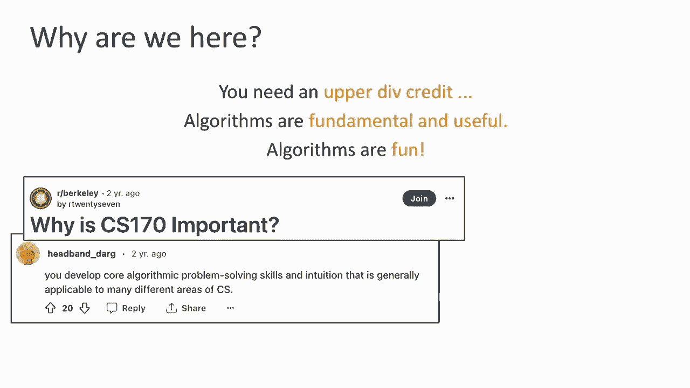
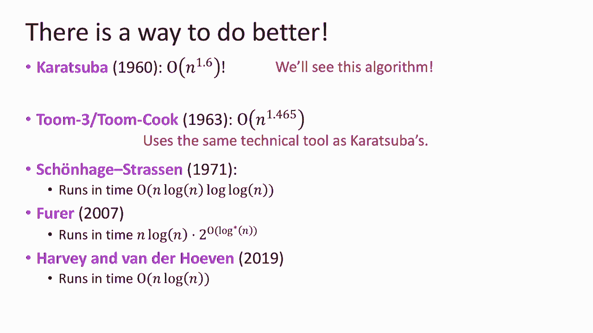
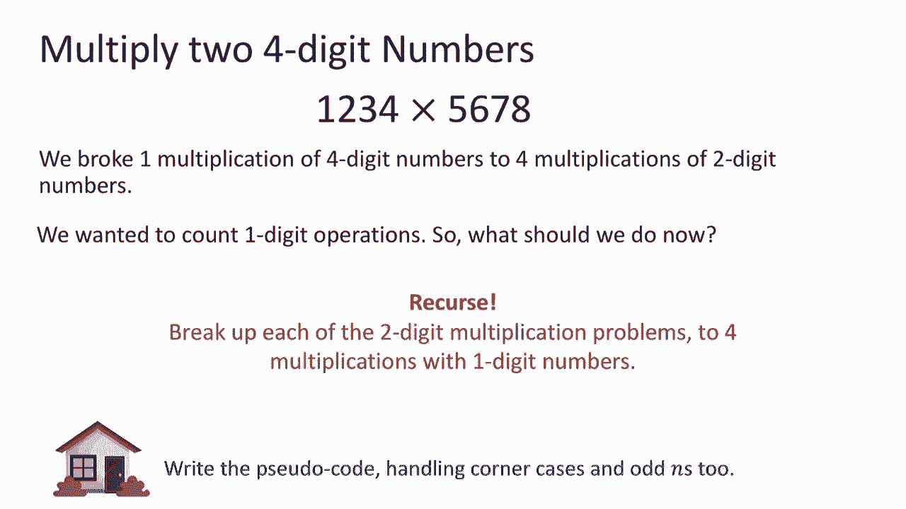

# 加州大学伯克利分校算法课程CS170 - P1：Lec1 Introduction, Big-O Notation, Arithmetic - 东风渐起UCAS - BV1o64y177K8

好啦，现在是十二点三十九分，所以我们将在一两分钟内开始，所以请坐，我敢肯定会有很多人迟到，我看到有很多空位，但洒了进去，我想知道你是否可以喜欢，坐近一点，并腾出一些角落的座位给那些要晚到的人，谢谢你们。

是啊，是啊，所以如果你能腾出一些角落的座位，只要移动到每个过道的中心，谢谢，我很感激，伙计们，有很多种子，请过来坐下，我们很快就要开始了，如果你在找座位，房间里有很多座位，好啦。

让我们开始欢迎来到CS 170呜，是呀，我喜欢那种活力，这是一间很大的教室，它是一个巨大的阶级，所以我真的很高兴在这里见到你们，你今天带来的能量真的很感激，这是第一堂课，当然啦，CS一七十。

我是妮卡·哈克塔拉布，我知道我的姓不好说，你可以忽略中间的h，所以你可以假装它不存在，你可以叫我妮卡或哈克塔拉布教授或妮卡教授，任何适合你的，我们还有约翰，赖特，坐在那里，过几分钟他就会来做自我介绍。

今天我们要温和地介绍一下这门课，物流给我们，对核心员工对你，然后我们将开始讨论算法，事实上，算术，所以我们实际上要后退几步，也许回到小学左右，所以让我们开始吧，今天的计划将从介绍开始，我们是谁你是谁。

希望你知道，为什么我们十二点半都在这个房间里，然后我们继续课程概述，我们将讨论一些课程目标，我们希望在学期末能达到的目标，为什么我们要从一个非常具体的角度来看待算法，当然还有物流。

我敢肯定你对物流有一些迫切的问题，我们会找到他们的，然后我们就开始吃肉了，谈论算术，我想学习加法和乘法，如果我们在过去的几年里没有做到这一点，所以让我们从你个人是谁开始，我相信你知道你是谁。

也是作为一个阶级，你们大多是大二学生，大三和大四，没有新生，房间里有个新生吗？没有新生，因为这门课有先决条件，当然，嗯，但是你在学习一系列的东西，我正在经历，加州中心，我真的被你们做的不同专业淹没了。

你们中的一些人在做三个专业，当然，你们中的许多人都在做计算机科学或电子商务，数据科学工程，总的来说，我们看到很多人在做经济学，事情的范围，而且实际上很合适，因为这门课是关于算法的。

与许多不同的科学领域都有联系和基础，所以我真的很高兴看到我们实际上有一个非常有代表性的班级，为科学带来不同的视角，以及算法将如何发挥作用。

那么我们是谁，就像我说的，我是妮可，哈卡拉·约翰，当我自我介绍时，你想上来吗，我是计算机系的助理教授，在政务司，嗯，在研究类型方面，我每天做的实际上是算法和理论的交集，但也有人工智能和机器学习。

所以我想这可能是第一次有人教这门课，谁是机器学习理论家，我认为算法最酷的一点是，就像我说的，它涉及到许多不同的科学和研究领域，我认为机器学习和人工智能正在彻底改变，我们考虑我们的环境，对我来说。

我们需要一个非常基础的关于它们和算法的观点，实际上提供了这种视角，所以这就是我每天喜欢做的研究类型，我考虑算法，不仅仅是为了算法和证明，但实际上为了我的研究，约翰，你好吗嗨，我是约翰。

这是我在伯克利的第四个学期，我也是个计算机科学家，教授，所以经济学系的教授，我还专门研究算法，但在另一种算法中，Nika这样做，代替机器学习，我研究量子算法，所以你可以在量子计算机上使用的算法。

就像是一种未来的计算，也许一百年后我们会有，我们可能会在课程结束时看到一点，所以你应该坚持到最后一堂课，嗯好玩，关于我自己的事实，Nick和我是研究生同学，所以我们已经做了大约十年的朋友了。

约翰是我在研究生院遇到的第一批人之一，其实呢，所以我们认识很久了，冷静好的，原来我们是这样的人。

但这个班的人比我们多得多，也是，事实上，这是我们的研究生导师，本科生和学生导师，导师，我们有很多读者，我不能在这张幻灯片上容纳他们，事实上，我们还在招聘，因为我们扩大了班级规模。

所以会有更多目前不在这张幻灯片上的面孔，但让我告诉你一些关于助教的事情，你们将在整个学期中看到并与之互动，所以约翰尼和斋月是我们的首席助教，所以本科助教，他们将负责很多事情，你肯定会看到他们分片。

但也有很多行政上的事情，我们有一个电子邮件设置，只有约翰、我和助教才能看到，所以每当你给课程发邮件的时候，这是完全保密的，只有我们四个人知道，你不需要担心这个小组的每个人都会看到它。

我们还有五位优秀的研究生导师，所以这些学生，学习算法，他们很酷的事实，但他们这样做是为了他们的研究，所以你会看到他们分段，你可以问他们的研究，你可以问他们你怎么能参与实验室，他们正在研究的。

正在解决哪些类型的问题，算法对此到底有多重要，去他们的研究区域，我们还有其他本科助教，他们将在办公时间管理部分，像你这样的人，但也许一两个学期，比你早三个学期，所以他们选了这门课，他们对此充满热情。

他们想教你更多，我们也有很多家教，我们的导师在办公时间，他们把论坛办得很好，每个人都在论坛上运行办公时间，但他们真的很擅长论坛和办公时间，所以如果你去办公时间，你将和他们谈谈，听听他们对这门课的看法。

所以就像我说的，我们可能会有更多的人，但这是撇开读者不谈的，他们会给你打分，这是您将与之互动的员工名单，整个学期，下一个大问题是，为什么我们都在这里，让我们从显而易见的开始，你可能需要一个高级学分。

这可能就是你来这里的原因，至少部分，你当然希望这是她的师级作品，因为他们人太多了，那你为什么在这里，在所有的喜欢之间，我不知道你学了多少门课程，我想你在这里，我希望你在这里，因为你认为算法是基础。

非常核心，它们很有用，也很有趣，你不需要相信我的话，坐在这些座位上的学生解冻了，他们认为你知道这是非常核心的，这很重要，你培养直觉，它适用于许多不同的工作领域，就个人而言，有人认为你应该接受。

因为它是一个非常核心的类，所以再一次，非常基本的，非常有用，嗯，非常有启发性的事情，也许你在过去不太明白，你实际上会更好地理解它们，等等，到目前为止，你们中的一些人可能认为这很有用，因为你想要一份工作。

也许你想帮你的采访，所以人们在网上给出了很多很多的理由，嗯，我猜这大概是你的原因，有什么原因，我不在这里掩护，所以这可能就是你来这里的原因，我完全同意，我不知道第一个，我还需要一个教学学分，我猜。

但这不是我来这里的原因，我真的在这里，因为算法很有趣，基本的和非常有用的，那么为什么有基本的有用的和好的，我认为乐趣是显而易见的，你就不会在这里，如果不好玩，但为什么它们是基本的和有用的。

当我们思考算法时，这是一种思考世界的方式，这不是一种方法，它不像一个，工具集不像一个聪明的把戏，你要应用于你看到的东西，更多的是关于我们对世界的看法，更多的是思考，我们如何分析我们所看到的世界。

我们如何分析问题，我们看看你是否在看，想想我今天开什么去上班，我该如何处理并决定哪条路，我应该去上班，你知道那本身，一种算法决策算法，允许你从这个非常好的分析角度来看待世界。

这个非常好的分析视角可以让你加深和理解事情，以非常有序的方式，它还允许你找出一些问题的困难部分是什么，有些问题的平易近人的部分是什么，改善平易近人的东西，想办法避开困难的部分。

这样你就可以真正地称呼他们，这也不仅仅是一种人生哲学，事实上，这对你做其他事情的方式有很大影响，就像在科学上一样，你可以考虑算法，我可以回到你们所代表的所有领域。

你可以回到算法，思考算法和经济学会是什么样子，事实上，科学有一个分支，算法与经济学的结合，称为算法经济学或算法博弈论，我的一些研究实际上是关于这个的，它是关于思考人们如何做出决定，你知道的。

他们怎么投资，他们是如何，也许吧，每天上班的路，这在算法上对交通有什么影响，论国税局的收入，像这样的事情你也可以把算法和许多其他的东西放在一起，你可以考虑算法和统计，事实上，算法和统计的结合很像。

人工智能和机器学习在今天非常重要，所以算法带来了这种计算透镜，你可能感兴趣的许多其他问题。

所以了解算法是很好的，这就是为什么它们是基本的，有用。

那么课程的目标是什么呢，既然我们知道这是一件基本的事情，我们真的应该在这里，你已经叫你来了，我们将学习如何设计和分析算法，这意味着当涉及到设计时，我们实际上要学习一个算法工具包，所以这将是一套工具。

当我们面临难题时，我们试着思考，哦，我能用这个解决吗，我能用这个来解决吗，差不多吧，当然，如果你想设计一个算法，您还需要弄清楚它是否是一个好的算法，如果它在做你想让它做的事，这就是分析部分。

所以我们也要学会分析思考，关于我们正在设计的算法，我们也想了解它们的局限性，你知道课程的题目是高效的算法和棘手的问题，有些事我们不能做，重要的是要知道，因为我们不能做某事的事实不仅在哲学上很重要。

但它实际上是我们计算中的许多安全性的背后，例如，事实上，很难闯入你的电脑，是计算机科学证明的科学事实，很难破解你电脑的加密，所以有一些棘手的问题，他们的坚硬和局限性本身实际上是我们生活中和平的源泉。

因此，弄清楚这些限制是什么是很重要的，当然还有，为了其他事情，我们怎么，我们如何设计有效的算法，在整个过程中，我们还有第四个目标，也就是再次学习如何清晰地交流算法。

如果你要以一种非常基本的方式设计和分析算法，我们需要学习如何非常清楚地交流，什么是有效的，不能有效的，以及我们如何证明这些事实，所以在整个过程中，我们实际上也在学习如何交流这些算法概念。

所以我们一般会问的基本问题是什么，你们将要问的大部分问题分为三类，它按顺序工作吗，我有一个算法，它真的有效吗，好吃吗，通常它的意思是它很快吗，我能做得更好吗，如果我能做得更好，也许我找到了另一个算法。

我重复同样的问题，你知道它像禁食一样有效吗，我还能做得更好吗，所以这些是反复出现的基本问题，我们将询问我们学到的新范式，回答这些问题有两种方法，事实上，每当我想到自己在生活中遇到了什么问题。

或者试图理解一些事情。

理解有两种版本，有一个更多的是关于图片的细节，我想确切地了解，了解的细节是什么，现实看起来像什么，也许建模的东西非常精确，理解角落诅咒，所有那些可能出错的小事，另一方面，我也在试图理解更大的图景。

可能会更模糊，细节可能不清楚，但这是让我欣赏更大图景的东西，问题不同方面之间的联系，也许我现在看到的问题，与我五个月前看到的问题有关，所以有细节，有一个大的图景，在这门课程中。

我们实际上需要真正获得所需的思维类型，既有面向大局的思维，也有面向细节的思维，那看起来像什么，当我们在思考细节的时候，我们要求非常精确的定义，我们要求非常严格的证据。

你是在要求确保所有拐角的案子都能解决，你知道所有的小细节都很好，你知道在所有的T上打点，在所有的I上打点，但如果我们坚持这种想法，我们真的会错过更大的图景，所以了解大局也很重要，所以当我们考虑大局时。

很多时候我们思考直觉的理解，可能是更多的手，宝贝，我甚至可能真的挥挥手，我可能会说，哦耶，这有点像那个东西，我们两周前说过，你自己想办法，我将更多地谈论更广泛的联系，我可能会问的事情你相信我，这一定行。

好啦，所以我们会做两种类型的思考，我有时会强调，你知道的，这些是细节，或者这是一个更大的图景，你为什么不去健身，更大的细节，家里的细节越细，所以请试着思考一个问题的两种方式，事实上。

在它们之间翻来翻去是很好的，你被困在其中一个。

这是关于接下来课程的概述，我要谈谈物流，到目前为止，有没有与物流无关的问题，有什么迫切的问题吗，好啦，所以说，当然啦，物流，所以首先我们有一个网站，我想差不多是完全更新了，我不确定它是否像完全在那里。

是啊，是啊，大概有百分之九十五的更新，如果有一些小事，我们会，我们会加上，嗯，那应该是你什么都去的地方，嗯，它将主办讲座幻灯片，我把幻灯片放上去了，其实在今天的讲座之前，我知道你们有些人喜欢看幻灯片。

我们并不总是有幻灯片，事实上，有时我们只在黑板上写字，但只要事先有材料，我们会试着把它贴在那里，如果你想打印的话，喜欢在上面写字，下课后我们会把笔记寄出去，课程表在上面，所有的办公时间，讨论部分。

基本上你需要的所有信息都在那里，讲座的录音，所以讲座不是直播的，这意味着我希望能在这个房间里继续见到你们，请亲自来上课，我们会在课堂上讨论，所以我想如果你能亲自来上课，你会从中受益的。

比考试前两天看视频多了很多，但我们会记录下来，因为我们知道不是每个人都能来上课，当然还有，其实呢，将要上课的学生人数略多，比这个房间的座位数，除非你很友好，共用很多座位，你真的不适合这个房间。

但一定要来上课，如果你想来上课，我相信你会适合现在看起来很好，嗯，所以演讲录音将被发布在B课程上，我们会弄清楚它是否也会出现在YouTube上，但我们还没弄清楚那部分，所以去B课程，如果你想看的话。

那么这个类的其他组件是什么呢，我们每周都要做家庭作业，我想他们星期二要出去，星期一晚上到期，然后我们要做的是我们要做这些家庭作业，然后我们会在周五和周一举行家庭作业聚会，家庭作业聚会，你知道的。

一定要去找他们，我认为他们是很好的资源，你们可以见面，互相交谈，也会有助教帮你做作业，我们有讨论部分，大多数是在星期三，有些是在周二晚上，嗯，我们实际上得再增加几个部分，所以如果你去你的第一部分。

你看这里有点拥挤，别担心，希望他们，我们已经加了一些，但这些讨论部分的重点是，网站上早些时候会有讨论表，拿去吧，你知道的，解决它们，然后进入讨论区，它将帮助你更好地加深和理解我们在讲座中所涵盖的材料。

事实上，因为你没有被分配到任何讨论部分，你可以，你可以选择去他们中的任何一个，事实上，你可以去不止一个，嗯，但我们在协调方面有点问题，如果你们都决定去同一口井，你不适合，因为我觉得教室最多只有50个。

所以为了帮助我们帮你决定去哪一个，我们将在学期开始时，以一种非正式的方式向对方发出信号，你要去一个特定的讨论区，所以每周都会有一个非正式的表格，可能只有在讲座学期开始的时候，我们会想出办法的，本质上。

我们要求你，求求你了，请继续吧，告诉我们你要去哪个讨论区，希望你最终能去，如果你改变主意，如果你忘了回复也没关系，那很好，只要去一个部分，但我们要做的是现场展示，3。请柬之后那个房间还有多少空位？

所以如果你要在两个或三个，对你同样有好处，也许你决定去不那么拥挤的地方，好啦，去找他们，即使你忘了回复，这个RCP真的是为了帮助我们弄清楚，如果我们想添加平行时间的部分，当我们看到对某样东西的大量需求。

有一种特殊类型的讨论部分叫做丢失，那是在星期五上午，这是一个节奏较慢的讨论部分，是两个小时而不是一个小时，它更侧重于概念上的基本理解，所以如果你觉得你真的错过了一些重要的东西，那是一个很好的部分。

你将有更多与助教一对一的互动，因为会有更多的助教和更长更放松的部分，如何联系我们和相互联系，我们有一个论坛，我们已经安排好了，你们都应该在上面，有不在上面的人吗，但他们就在这个房间里，你们中的一些人。

好啦，如果你处于失重状态，您应该已经被添加了，下课后过来告诉我，这种情况只是为了让我们知道谁少了，但你应该已经做了，所以利用它是一个非常好的资源，我们将用它来发布公告和其他一些额外的资源，如果你想分享。

就像助教一样，可能想和你分享更多的资源，但这对你来说也是很好的，你可以看到其他学生在问什么，然后呢，事实上，回答他们，我想这将是一个很好的参与课堂的方式，你也肯定想联系我们。

我相信我们要求您通过这个电子邮件地址与我们联系，这是一个电子邮件地址，我刚才说过，只有约翰和我还有赫塔斯一家，如果你真的通过名单联系我们，我们会更快地收到您的电子邮件。

我知道你想的另一种选择是分别给我和约翰发电子邮件，那就不太好用了，因为我们收到上百封这样的邮件，如果我们花时间在他们身上，他们需要多少就有多少，我们无法为你准备讲座，我们将无法真正运行一个有趣的课程。

所以与其单独联系我们关于课程后勤，请通过加州大学伯克利分校的CS 170与我们联系，我们有很多办公时间，约翰和我会有一些办公时间，他们将被宣布，但是大部分的办公时间是由导师和助教管理的，看时间表。

有一个顶级呼叫时间表和日历，你可以弄清楚他们在哪里，我们有两个期中考试和一个期末考试，我希望我把期中考试日期抄对了，别相信我的话，去看看你在网上发布的时间表，但第一次是在10月3日。

第二次是在11月7日，他们两个都在晚上，他们不在这间教室，所以只要记住，我们的期末考试是在十二月十五日，那是在早上，很重要的一点，期中考试将没有替代时间，所以如果你有冲突。

你得用你的其他课程来解决这个问题，从他们那里得到某种缓刑，到目前为止有关于物流的问题吗，是呀，你可以，你也可以在Ed上发帖，我们也会找到他们的，他们不是，这是个好问题，我相信我们的政策你可以。

但是你将得到的帮助的数量由助教决定，这仍然是保单吗？是啊，是啊，所以一件重要的事情是，当你去办公时间，如果你没试过家庭作业，助教可能不会帮你那么多，上班时间的最佳利用其实是先看作业。

尝试一些东西任何东西卡住某个地方，然后去办公时间，因为如果你能和助教清楚地交流，这就是我所做的，但我被困住了，我不知道该怎么办，他们都更愿意，他们可以解决，其实呢，他们发现，你不明白的是什么。

或者缺少什么诀窍，所以一定要去办公时间，你绝对可以把它们作为做作业的资源，但我只是告诉你，利用办公时间做家庭作业的最佳方式，你已经尝试了一点点，我想请你自我介绍一下，我要试着记住几个名字，通常在学期末。

我记得七百人中有五十人，所以请原谅我，我会反复问你们的名字，因为我就是这样学会的，请问尊姓大名？还有其他关于物流的问题吗，星期三，还是只是同一段，在伟大的，你叫什么名字？迪伦迪伦，所以迪伦想问的是。

是物质上的差异，星期二和星期三对吧，是同样的材料，只是我们有很多，我想我们大概有16个部分，我们要把它扩大到20个区域，完全一样的材料，但如果你周二晚上去，你没有得到什么，第二天你发现你还想再去一次。

再来一次，其他问题，是呀，你叫什么名字？亚当亚当在问，或扩展区段，新的你问对了，我们不知道他们必须由，他们是否也会在星期二和星期三，我们其实不知道这一点，因为A部门的调度人员必须为我们安排。

把所有的讨论时间都安排在周二和周三有一些好处，所以类保持同步，但我们知道你们中的一些人可能有一个糟糕的时间表，在周二和周三，并希望其他选择的日子，所以如果你有什么建议，来告诉我们，我们会考虑到这一点。

向部门询问其他房间的时间表时，其他问题，我上了，我上了，它们通常是回顾性的，但它们不仅限于我们已经教你的范围，好的，好的，事实上，有时在学期的早些时候，他们可能更多的是关于你学到的东西。

也像在过去的学期和其他课程中，有时他们会问这样的问题，你试着问，你就会有一些想法，但后来你看到他们的真实答案回来了，可能在一周左右的讲座上，我对如何学好这门课有什么建议吗？凯尔。

我相信我在这门课上做了一个很好的学习方法，顺便说一下，但我的意思是，这是我的看法，每个人都有自己的看法，当然，我对你在这门课上应该怎么做有很多意见，我是这么想的，不要落后真的很重要。

我认为这是我们大多数人生活中的挣扎，可能你们中的大多数人，因为你们的课程负担太重了，还有很多职责和责任，所以说，但我建议你在讲座上做什么，我真心建议你去上课，如果你不能，我理解。

如果你不能尽快看一个视频，在经历了最糟糕的事情之后，你知道的，忘记存在的类，直到是什么，九月三十八年，然后试着在周末的两个X上看视频，那是我做过的最糟糕的事，请不要这样做，其实呢，如果你以后要这么做。

也许对你来说已经太晚了，别再这样了，为此做好准备，不是第二次期中考试，所以在期中考试前你不会害怕，嗯，所以真的不要落后，出现在课堂上，在课堂上提问，保持接触，我们会在课堂上问你问题。

我们实际上会给你一些你可以喜欢的问题，与，你知道的，你的邻居，我们还将强调一些在家尝试的问题，嗯，讲座结束后回家试试，复习幻灯片，也许复习幻灯片上的问题，试着在家里做，看看你对材料的理解是否足够好。

然后是讨论部分，尝试讨论部分，如果可以的话，在去讨论之前，就像这门课的作业时间一样，价值在于尝试，甚至可能挣扎，因为我们发现算法的方法是通过尝试许多想法，第一个行不通，第二个可能不行。

但最终会有事情发生，有时当你读课本的时候，你只看到最后一件事，你看不到历史上人们尝试过什么，所以你得自己做，好啦，尝试，然后可能失败，也许不是，也许成功，然后一定要去分区，也做指定的阅读。

考试前不要离开他们，我们确实有一本教科书，基本上就像这堂课一样，你知道的，是加州大学伯克利分校的人写的，是为了这堂课读的，这与我们教你的非常同步，这就是我对如何学好这门课的建议。

我感觉我以前在那里看到过一只手，否，否，是呀，你叫什么名字？阿迪，我们是否计划在缩放中提供讨论部分，我不这么认为，我们是，我不这么认为，我们真的希望你去讨论区，我不认为讨论区有价值，作为要观看的视频。

说实话，好啦，其他问题，是啊，是啊，你叫什么名字？哎呦，好啦，阿墨在问，如果讨论的是前一周或下周，主要是关于我们已经报道过的内容，但有时也会想到接下来会发生什么，你叫什么名字？罗翰，罗翰在问。

如果您要发布讨论问题的解决方案，我相信我们做得对，约翰，我想我们有，我只是我忘了，我相信我们有，如果你不，下次我会改正的，好啦，好啦，让我们做最后一个后勤问题，所以我们至少也能学到点东西，可能不会。

所以讨论部分可能不会被记录下来，好啦，所以这是关于物流的，还有一些其他的资源需要注意，我们确实有课程政策，他们告诉你多少合作是可以接受的，参加论坛有什么礼仪，在班上，所有这些都请去读。

我们会确保礼仪的东西已经联系在一起了，我们将确保学术诚实守则也与，就这样，你知道的，现在我们有一个非常严格的行为准则，说到学术不诚实，这是非常官僚的，我们每学期都处理它，没有例外，你们中的一些人认为。

那里可能有一些灵活性，不幸的是没有，我们束手无策，所以了解政策，当涉及到学术不诚实时，不要越界，好吧，读，这些规则遵守吗，最后，我们想要你的反馈，你知道你已经问的问题让我们思考了更多。

也许这学期你的需求不一样，请在整个课程中提供这种反馈，你可以在网上或亲自提供，我们可能要做的是安排一个期中考试，一种反馈表，也是匿名的，所以你应该能告诉我们什么对你有效，什么对你不起作用。

所以我们可以改进它，你知道我们希望这门课在这学期里不断提高，当然啦，但也是长期的，在我们开始之前，所有关于物流政策的紧迫问题都在这里，是呀，你叫什么名字？艾莉，是呀，讲座被记录下来，稍后张贴。

他们只是没有直播，我们会尽量在同一天把他们弄出来，本质上，但也许不是下课后马上，我们会试着把它弄出来，我们知道你们中的一些人不能出席，你需要听讲座，所以我们会尽快把他们救出来，在同一天。

也许在几个小时内，好啦，让我们进入这节课有趣的部分，差不多是，这门课讲的是算法，让我们从一个小小的历史之旅开始，这个名字在哪里，算法来自，听起来很奇怪，算法实际上是一个人名字的拉丁语灵感。

科学家这个博学的人叫哈兹米或阿尔<unk>阿兹米，他是波斯学者，我是波斯人，所以我可以说出他的名字，嗯，而这两天，乌兹别克斯坦和土库曼的儿子是他出生和长大的地方，但后来他真的拿到了奖学金。

在巴格达和伊拉克，所以说，他有时被称为阿拉伯科学家，其实呢，他对科学的许多分支做出了许多贡献，如果你喜欢或讨厌代数，这家伙给它起的名字，他有第一本代数书，但在他所做的许多其他事情中。

他引入了印度-阿拉伯数字系统，你知道西方世界的十位数系统，在他这么做之前是罗马数字，你知道的，所有那些X，I's和V's，很难知道他们是什么，那是人们用的，正是通过他的努力，几个世纪后，在他去世后。

这些书被翻译出来，印度阿拉伯数字传入西方，其实呢，所以是的，所以实际上算法来自他的书，因为他，事实上写的，你如何使用这些十位数的数字系统，你怎么添加东西，你怎么乘东西，你看，简单多了，那些书被称为算法。

算法，算法算法，然后你知道，所有这些都变成了算法，他的名字叫阿尔<unk>子，不知何故，经过几个世纪成为算法，为什么印度教的阿拉伯数字系统，一点都不重要，嗯，这很重要，如果你回到过去。

这实际上是非常基本的，因为罗马数字，它们不是我们可能认为的任何自然基础，你知道他们不是，但它们不是二进制的，他们不在二垒，他们不在十垒，添加它们作为麻烦，实际上翻译它们很麻烦，事实上，对普通人来说。

倍增它们几乎是不可能的，如果你是个农民，你知道，很多世纪以前，你仍然需要把数字相乘，比如，也许你有一块农田，它是，我不知道，三七乘两九，你想知道，你知道的，我的农场占地面积有多大？你自己做不到。

你得去找个专家顾问，然后他们会为你计算这个，他们会告诉你土地的面积，因为这件事很难做到，不清楚如何做这个乘法，当印度阿拉伯数字系统被引入时，它是通过非常简单的算法方式引入的，实际上是为普通人做乘法。

到了现在我们甚至不考虑乘法的地步，作为生活中的一件困难的事情，你知道这是你从中学到的东西，我不知道二三取决于你在哪里长大，那你为什么知道，乘法现在容易多了，因为我们可以用一种非常系统的算法来完成它们。

我可以告诉你怎么做，事实上，我们都在小学的某个时候学会了如何做到这一点，让我们看看我是否记得我的小学，那么我该怎么做呢，我先用七乘以九，对呀，那是六十三，我把三个都放下了，我拿着六个，那我就把7乘以2。

那是十四加六，那是二十块，然后嗯，算法告诉我把一个零，因为我得把所有的东西都移一个，算法是这么告诉我的，现在用三个井重复这个，三九二十七，我拿了一个二，三乘以二等于六加二，现在我要把这两件事加在一起。

三个七和十个简单，我大部分时间都能乘法，我确实会打字，但这是非常系统的，是啊，是啊，谢谢你，谢谢你，我想这是我应得的，就看着吧，我将在这张幻灯片的后面做一个错别字，好吧所以所以，但这是非常系统的。

很容易做到，好啦，老实说，我不能看着罗马数字，甚至不能阅读它们，所以这就简单多了，所以这很有帮助，因为它带来了，你知道乘法和一般的算术，你知道的，对民众，好像每个人都知道怎么做了，所以让我们回去看看。

我们真的知道怎么做吗，或者我们是否知道最好的方法，好啦，所以让我们回到小学，我刚为你做了很多事，事实上，让我们回顾一下更简单的事情，我们如何添加整数，嗯，很简单，我不打算做这个，会很尴尬的。

如果我犯了一个错误，但我希望你们能简短地讨论一下，对坐在你旁边的人，就像思考，如果我想系统和算法地思考，你知道吗，我想过一次增加一件事，你知道的，那我要走多少步，我要做多少个一位数操作。

如果我想加上两个巨大的数字，就像想象我有两个数字，每个都有n位数字，要计算出这个数字，我需要做多少个涉及一位数操作的步骤，所以最多六十秒，和你的邻居谈谈，问题清楚了吗，好的，和你的邻居谈谈，再过六十秒。

你告诉我要走多少步，好啦，再过十秒，好啦，好啦，让我们，让我们，让我们在这里看看一些答案，我要请你告诉我有多少，也许你们可以一起喊，一二三，有多少，我听到两个和三个N类似的东西是你们都同意的，好啦。

你知道我会挥手，我现在说的是一个更大的人，但这可能是你们的谈话类型，比如告诉对方，嗯，你知道有N个携带，我得想想那些，你知道吗，一旦我把它们加起来，实际上有三件事，不是两件事，所以我得数数可能有两个。

也许三个N或类似的东西，那可能是你说的对，好啦，很好很完美，也许两个，也许三个，我的意思是我们不打算争论改变，那么为什么这很重要呢，为什么我的手是波浪，就像两个和三个，他们之间似乎有很大的不同。

希望你还记得你的大o符号，谁记得大o符号。

很好61 B你记得从很好，让我们回忆一下上节课的内容，61个b中的13个，在大多数情况下，我们只关心渐近行为，对于一个非常大的n会发生什么，很多很多例子说明了我们为什么关心这一点。

我们关心的是扩展良好的算法，它们看起来像线条，而不是缩放可能更糟糕的算法，它们看起来像抛物线。

这些线很大，呈n线性关系，后来在第61讲第13课，你学会了大o符号的正式定义，n的算法的运行时称为另一个函数的大o，就像那个函数是n，如果你能把这个函数乘以某个常数k，我想他们叫它K2。

对于足够大的数量，任何n大于某个n零，我将得到这个函数作为运行时的上限，所以如果它是n或孪生或五个n，你知道他们都是大人物，这就是为什么我不在这里争论两个和三个。

所以回去，你真正的意思是也许大O符号，如果你记得清楚，从61 B手宝贝的方式告诉你忽略常数，专注于，就像没有那些常数的对n的最大依赖，我们说两个n位数字的相加在时间上运行，n的O。

你们中的一些人可能仍然不记得经常吃大华夫饼，没关系，花点时间复习一下你的61 B，但实际上我们会更正式地回到这个问题上来，下次，这次你要用直觉的手，婴儿理解N大的方式，正式地说，我们下次会刷新你的记忆。

或者去分区，会有很多关于大进攻的东西，是呀，很好，所以在61 b，你不仅学到了大O，但你学会了大数据，也许也学会了大欧米茄，这堂课还有其他渐近符号，我要用大关n，因为我已经有点手舞足蹈了。

大孤儿是一个近似，就像你可以把它看作是一个上界，有时我问你近似的下界或近似的等式，让我们想想大的，当我让你告诉我一个大牛角，给我最好的，你可以，你知道的，不要告诉我，你知道有一个聪明的方法来做好这件事。

今天我要做的每一件事都可能是一百个，所以只要进入100就是一切的答案，不要那样做，你知道我们想真正了解，但下次我们会更正式一点，我们将澄清当我们要求大欧米茄或大数据，乘法呢，我们做了加法。

现在我们来做乘法，这次是关于乘法的问题，和你的邻居讨论一下有多少，小学整数乘法有多快，如果你要把两个n位数的数字相乘，再一次，多快想想，作为一位数运算的个数，这一次，你可能不需要考虑太多的常数。

因为我已经告诉过你，你可以在这里使用大O符号，但你能做的最好的大O，让我们讨论一下六十秒，再过十秒，好啦，你们中的一些人还在说话，我再给你十秒钟，好啦，所以是时候回答了，我要问你，我们好吗。

我要问你答案，在大O数到三二一，它在n的平方上一次又一次地运行，我在想象你有过这样的谈话，你知道的，当我把下一行的每个数字，我把它乘以上行的每一位数字，所以这是另一个，那是n的平方，一次一位数操作。

哎呦，有携带，但最多可能要加上很多n的平方，哦，我写了一堆很长的数字，但是没有那么长，我想如果我把这些数字相乘，最坏的情况是，它将是两个N号，他们中的每一个，所以我必须加上n个数字。

他们每个人都有两个N，那是另一个n的平方，好啦，是呀，它是n的平方，所以这可能是你们谈论的，也许比我做任何关于这个的问题都少挥手，我告诉过你我们总是会问第二个问题，或者大多数时候你会问第二个问题。

我能做得更好吗，我能做得比n的平方更好吗，老实说，这是一个很难问的问题，因为人们不知道答案，或者至少在50年前是一个很好的答案，记住，我是说，几个世纪前，就我向我们介绍的乘法算法而言。

所以也许让我们从一个稍微简单一点的问题开始，我能做得比off n更好吗，否，为什么不呢那就太可笑了，你叫什么名字？饶老觉得，如果他能做得比平时更好，是啊，是啊，你能不能正式说明为什么，是呀，有趣。

你叫它鸽子洞，你的想法是对的，也许鸽子洞不是最自然的，但你确实有这个想法，事实上，这个想法已经说过了，也许我会请另外一个人试试，让我们看看那边的人，你为什么不试试，所以你是在说你可以做得比N更好吗。

好吧，那我不明白这个论点，有些事情是违反直觉的，好啦，你叫什么名字？埃里克，好啦，你叫什么名字？为了我们，F A R A Z好，所以我们有一堆答案，我会试着解释费拉兹说的话，以一种略有不同的方式，好啦。

嗯，我想他想说的是，那就是，也像我忘了你的名字，已经，拉哈尔想说的是，我是说，太荒唐了，因为你得读数，好啦，也许你没有添加东西，但想象一下，如果我把一个乘以某物，我得看号码，所以如果我必须读这个数字。

只有N个数字，我得看书，所以不可能，我可以做得比冒犯更好，所以这是将一些东西正式化的一种方式，用明确的语言，当我们认为某件事很可笑时，酷，但这不是问题，我真的很想回答，我想要n的平方。

所以我告诉过你这是个难题，事实上，还有其他乘法算法，这不是我们教的或好的，我们在学校里被教导，我再给你看一个，这是一个有趣的，你可以在家分析，嗯，它其实有两个名字，它既被称为俄罗斯农民算法。

也被称为埃及算法，就像古埃及乘法，我知道这两部戏很远，但是哦对不起，不知何故，这里的字体发生了变化，嗯，所以这有点难读，很抱歉，好啦，那么这个算法做得好的是什么呢，上面写着把这个写2 7乘19。

我要反复做的是，拥有第一个号码，如果它不是圆的，把它围起来，好的然后把第二个数字翻倍，为他们中的每一个写一行，那就回去，删除第一列为偶数的任何行，然后对于所有剩下的行，包括第一排，二七十九包括在内。

包括添加所有剩余的行，好啦，我们开始吧，我现在可能会打错字，所以让我们看看两个，七除以二，四舍五入十三，十九乘以二三十八，我重复十三除以二，向下四舍五入，三八乘以二，七十六除以二，我可以做76次。

是这样吗？好三除以二，四舍五入就是一一五二乘以二，三四个，希望是这样，然后这将变成零，那将会变成，然后我会划掉，左边的这个数字是，现在我要加上，请记住，我将在第二列添加第一行，并添加其余行，第二列。

我该怎么做，好啦，所以我得加上一大堆数字，九加八加二，那是九和八，十七加二，十九加四，二三，我拿了一个2-1，一三加三，六加五，十一，是这样吗，我有剩下的，一加一二加三，五十三，希望，这是正确的。

你可以用你的计算器，这符合我写的，所以在某种程度上是正确的，好的，好的，所以这可能有点幻想，但我不会证明这一点，但实际上我认为这是一个很好的在家锻炼，这是我要留给你在家做的第一个练习。

你知道当你讲座结束后回去，计划是你要试试幻灯片上剩下的练习，那将是第一个，所以你在家要做什么，找出为什么这个算法并不疯狂，它实际上是正确的，它是两个数字的乘积，然后找出什么，它的运行时间会有点剧透。

运行时并不比n的平方好，但我想让你在家试试，事实上，这个算法不比n的平方好的原因，是你在家里要弄清楚的，它看起来很像你小学的乘法算法，除了二进制格式，如果我没有写二进制，就像。

因为它实际上是在计算第一个数的二进制表示，你知道的，每当这很奇怪的时候，这是一个一个，无论何时，是零，从某种意义上说，它说的是，你知道怎么，当我用印度阿拉伯数字以十为基数乘法时，我在零点移动。

我把这些零，这基本上是在二进制中通过移零，乘以2，这个还是手波，所以当你回家的时候，试着核实一下，确保我说的有道理，好啦，关于这个的问题，这更像是有趣的部分，在家做就行了，有什么问题吗。

冷静好的，所以让我们回去，嗯，我想比n的平方做得更好，有没有比n的平方更好的方法，事实上有，就像我说的，那是在二十世纪六十年代，我们第一次发现的时候，它比n的平方好。

历史注意到非常著名的数学家科莫格罗在他的课上猜想，可能没有比n的平方更好的乘法方法了，下周班上的一个学生证明了你可以做到，到1点6分，所以说你知道不要增加你的压力，但到下周你必须想出一些非常基本的东西。

一次次改进，事实上，正确的运行时已经关闭并登录，我们将看到这个算法，我不会给你看另一个算法，但基本原理实际上是完全一样的，所以你可以这么做。

我们要做的是分而治之，我再多说几句，你们还记得"分而治之"吗。

然后好像有问题，所以也许我会回答你的问题，你的问题是什么是可能的，或者不可能更好，那N个登录，我想我只是在看一份报纸，我想弄明白，但我不能告诉你在哪里，所以我得查一下，计算机使用这些吗？嗯。

这个是非常基本的，我们实际上会更多地了解它们，我不知道最近的是不是，是否已经使用过，我不知道的是，我们也喜欢，是啊，是啊，我不知道那很简单，好啦。

我能是关于，是不是更有探索性，让我们把探索性的问题留到以后再说吧，那么分而治之是什么呢，它是不是说我有个大问题，我不知道怎么解决，但也许我知道如何把它分解成更小的问题。

如果我能反复递归地把它分成更小的问题，然后我有一个工具，希望在某个时候问题变得足够小，我可以解决这个小问题，然后把它重新组合起来，解决更大的问题，这是分而治之，好吧，那么我们如何分而治之乘法呢？

我要告诉你做这件事的一种方法，从本质上打破了两个整数相乘的问题，它们中的每一个都以数字表示成一堆其他的乘法，对于只有n除以两位数的整数，好啦，所以我有问题大小，从某种意义上说，位数。

我怎样才能做好这件事，让我们看看，我总能写出一二三四，前两位数字，一百倍，再加上第二个两位数，然后试着把它乘以，从本质上也想到了这一点，这是十二乘以一百三十，四乘五，六乘一百加七十八。

现在我可以做分配律，上面写着，你知道把这个乘以，你可以把它想象成十二乘以五，六乘一百乘一百十，敬四人组，再加上我会走到最后，三四七十，八倍于零，没有十的十倍，然后在中间我叉积，所以是十二乘七十八。

加三四乘五，六的100次方，好的，这只是分配法则，如果我能写这个，从某种意义上说，我已经成功地分割了，因为看看这些问题，我有四个问题，每一个都只涉及两位数乘法，而不是四位数乘法，当然有十对四和十对二。

谈论十的任何次方是很容易的，我不需要计算，我只写了一个和一堆零，不需要计算，好的十的幂，我们认识他们，所以我分开了，好啦，其实呢，您可以更普遍地这样做，不是四位数的问题，它适用于任何n位数字。

我要做这件事，因为这样更容易，从字面上看，我在做什么，我是说一半的数字，前半部分乘以十的n/2的次方，下半场就是这么写的，然后假设x有a和b，然后我有一个y和一个c和d，那么y变成了什么时候。

真的是这四个问题吗，问题，一个问题，二题三题四，每一个都是n大于2的，我把一位数的乘法变成了四位数，甚至超过了两位数的乘法，关于这个的问题，好极了，所以你的要求是，下一步是什么，你从n到n超过2对了。

下一步是什么，你给了我答案，正确的答案是递归，一旦你有N超过两个井，转到n/4，到八分之一，继续分，直到你这样做。

事实上，如果我把一个四位数的乘法换成四个两位数的乘法，你已经回答了，你问了又回答了下一个问题，事实上，我要做的就是递归，把两位数的乘法分解成一位数的乘法，这是一种乘法算法，是递归的。

你为什么不试着在家里为它写伪代码呢？因为我没有处理任何棘手的案子。

我和好人一起工作，但是让我们看看这个算法在运行时的表现，我有一个四位数，把它分成了四个两位数，然后又分手了，我有多少个一位数操作。

如果我这样做是为了八个数字呢，数到一二三告诉我，8位数字要做多少次一位数运算？六十四，就像十六乘以四，因为那棵树，让我们看看你能不能猜出我有N个数字，我需要做多少个手术，我需要做多少个一位数操作。

在这棵树的底部m平方，这就是主张，即使很不幸，我们应该证明这是真的，不幸的是，它并不比简单的算法好，但我们至少应该明白，你从哪里得到了二的幂的结尾，所以这就是你要做的，声称这个算法的运行时是n的平方。

我要证明一些更简单的东西，然后用手挥一挥，我要证明一位数运算的次数，递归树的底部是n的平方，你还必须做一系列其他操作才能把这些东西重新组合在一起，暂时忘掉他们，看看一位数的，好吧，让我进入下一页。

我到底想做什么，所以我有一个递归树，那是我最大的，分为四件事，大小n大于2的每一个，我将跟踪树的每一层中的问题数量，问题的规模，第一层我在第二层有一个大小为n的问题，我有多少问题，在第三层加起来。

我有多少问题，多少个尺寸和四个以上，好啦，如果我继续这样，添加层，T，我们聚聚吧，我们一起说，一二三，我在T层有多少问题，两个到T，四到T，哪一个，一二，三个，四到T，好啦，现在呢。

让我们看看问题的规模，每次我把问题的大小除以T层的2，这些问题的规模有多大，一个，两个，三个，两个以上到T，最终我会到达一个只剩下一个数字的地方，我们要问的问题是它需要多少层，然后我们想说有多少叶子。

回答第一个问题，我想回答这棵树有多少层，本质上，我在问这个问号，我是说，在某一点上，n到二到t变成了一，发生这种事的原因是什么？让我们数一二三，n的答案是什么，基地二，每当我不把一个基地，想象是二。

所以如果我把某物除以2，每次在一根木头之后，步数，我得到的数字是1，对此有什么问题吗，如果我有一个问题，是啊，是啊，所以你是在问，我做的零索引正确与否，这就是你要问的吗？可能不会。

这里很可能有加一或减一，但也许不是我说的那些话之一，有一个更大的图景和更小的图景，较小的图片，我肯定有一些正负的被错过了，在这条线上的某个地方，会告诉你你所问的细节，如果你真的向你要大的。

通常加一减去一并不重要，常数无关紧要，但我们会澄清的，所以我们回答，这棵树有几层，3。现在我想知道的是这棵树上有多少片叶子，所以我真正要求的是4到T，T是n的对数，有一个小把戏告诉你我。

我可以用n代替4的对数，结果是什么呢，4的对数是2的n的次方，这是不幸的，我知道，想象一下，花90分钟或80分钟得到一个否定的答案，但不要灰心丧气，确实有一个分而治之的点，我们下次会去看的。

因为本质上我们已经得到了比n的平方更好的，我们只需要更注重细节的眼睛，一个聪明的技巧可以让它，好啦，那我们星期二见，我们将讨论做这件事的更好方法，很好的公开演讲技巧，哦谢谢，哎呦，多好的问题。

所以我今天的日程安排是背靠背上课。

