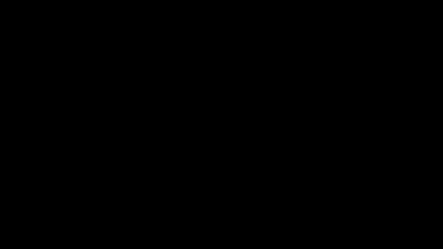

# 加州大学伯克利分校算法课程CS170 - P20：Lec20 Search Problems - 东风渐起UCAS - BV1o64y177K8

对呀，这是呃，十二四十，所以让我们开始吧，今天我们要继续讨论，这就是我们在上一节课开始讨论的，可能是，关于这节课最重要的一点信息是，不在期中考试的范围内，放心好了，就像享受讲座一样。

如果你想起床回家学习，你也可以这样做，所以是的，我来做行政工作，所以你知道，期中考试到嗯，是下周二，所以我们不上课，星期二下午我们将进行期中考试，所以今天结束前我们会在STEM上有一个物流帖子，星期四。

只是想提醒你，有一些审查会议，嗯这个周末，所以我想11月4号和5号是星期六，星期天上午11点到下午1点，所以检查了茎，查一下时间表，嗯，下周期中考试后有家庭作业，它将包括一个书面问题和一个编码问题。

所以希望不要太多，我还要说，这，是呀，我不知道好问题，是呀，我可以，我可以查一下，今天晚些时候我就知道了，我猜，最后一件事是，每次有人举手，就像我问你的名字，然后我很快就忘了你的名字，所以就像上周一样。

我一直在努力记住人们的名字，所以我记得一些名字，一些名字，我没有脸贴在他们身上，这有点烦人，但是呃，我先说几个名字，然后我也有几个名字，我想知道他们的脸，所以让我把它们说出来，大声。

阿里亚或达伦通常坐在尤里尼旁边，哎呦，你很酷，你今天变卦了，丹妮拉啊，让我看看我能做什么，呃，是啊，是啊，那边坐着一个男人，今天谁不在，但是还有一个男人，就在这附近，如果是这样，你可以，你举手。

只是为了让我知道你长什么样，好啦，我不在这里，有一只猿猴坐在这里，但也有一些玛雅坐在那里，好啦，但他们今天都不在，有一个恩佐，呃，好啦，呃，让我们看看，那是什么？我在找的所有名字，有一个亨利，好啦。

你离得太远了，我从左边看不到你，好极了，所以我会继续努力了解更多的人的名字，如果我今天没有说出你的名字，我道歉，但有很多名字，好啦，那么，让我们来看一下今天讲座的内容，我觉得我声音很大。

所以让我稍微降低音量，有可能，所以今天我们将继续削减，让我回顾一下我们在上一节课上看到的减少，所以我只做图片定义，我们定义了两个计算问题的概念，A和A归约为B意味着什么，我们把a简化为b。

但实际上我们是指a在多项式时间内简化为b，又名我们有一个很好的符号，教训，有点卷曲的教训，次级P，子p代表多项式，所以a小于b的次p，它的意思是如果你能解决一个遗憾的B。

如果你有一个在多项式时间内解b的算法，然后它给出了一个算法，在多项式时间内求解a，我们看到了一种通用的设计方法，证明你有减少，它是一对算法叫做缩减算法和恢复算法，所以它所采用的简化算法，作为输入。

的实例，我们就叫它我一个吧，你把它放进简化算法，它所做的是吐出b的一个实例，我也是，约简算法应为多项式时间，所以它应该是一个高效的算法，然后恢复算法将问题I的解作为输入，两个，它输出的是一个解决方案。

到我一个，就像约简算法一样，恢复算法也应该是多项式时间，正如我们所看到的，如果你有这两个算法，一种约简与恢复算法，嗯，这并不一定意味着a或b是有效可解的，但是如果嗯，你也有一个b的算法。

然后你可以把它插在中间，它会给你一个算法，一个多项式时间算法，因为你可以拿你的例子，使用约简算法将其转换为B的实例，然后用B的多项式时间算法求解B的实例，然后它将输出一个解决方案到您的实例i 2。

然后你可以运行恢复算法，将其转换回解决方案，如果你有一个B的多项式时间算法，然后这两个算法给出了一个多项式时间算法，然后我们看到两个减少，第一个是我们以前在课堂上见过的，哪个。

刚才说的零和博弈问题在多项式时间内简化为线性规划，上一节课我们看到了一个新的减少，即Redrada循环问题在多项式时间内减少到最小，茶匙，那是上一节课的概要，好啦，所以现在让我向你们描述一些一般的事实。

了解减少的有用事实，好啦，第一个我在最后一张幻灯片上已经说过了，但为了强调，让我再说一遍，减少和恢复算法，必须高效，我指的是多项式时间，所以不算降价，这两个算法中有一个不是多项式时间。

从一个问题归约到另一个问题的概念是传递的，所以这意味着，如果一个问题A在多项式时间内简化为另一个问题B，还有嗯，问题b在多项式时间内归结为另一个问题c，意味着a在多项式时间内，问题c。

这是因为如果我有一个c的算法，所以如果我有一个C的多项式时间算法，这就给出了b的多项式时间算法，然后因为我有一个b的多项式时间算法，这将给我一个多项式时间算法，这正是A在多项式时间内减少到。

接下来要注意的是，这是我之前提到的另一件事，我们可以证明，嗯，A在多项式时间内减少为B，即使A和B，不知道是有效的，这实际上是典型的案例，所以大多数时候我们会在这门课上讨论归约。

它将在两个不知道有效的问题之间，最后一件事，我想指出的是，这个概念的一个，在多项式时间内减少到b，尤其是这个符号，只是短语a简化为b，以我的经验，这很可能是最令人困惑的事情，所有的算法，好啦。

所以卡车被绊倒是一个非常容易的定义，这很容易嗯，当我们要求你证明一件事变成另一件事时，你就犯了一个错误，所以让我指出，就像单曲，人们在证明一个问题归结为另一个问题时犯的最常见的错误，好啦。

所以在这个错误中，你被要求证明，A在多项式时间内减少为B，你要做的就是给出一个简化算法，然后是约简算法，获取并将其转换为，所以这是最常见的错误，在设计约简算法时，在证明归约时，给出一个这样的约简算法。

有人能告诉我这个简化算法有什么问题吗，我给大家一点时间想想，所以你走错路了，你减少的方向不对，嗯是的，所以这是减少，还是我应该写这个，我想减少，在错误中，您的约简算法应该始终获取A的一个实例。

并将其转换为B的一个实例，我们在做相反的事情，我们取B的一个实例，并将其转换为A的一个实例，所以，如果有什么，这将有助于证明b还原为a，不是a减为b，好啦，你知道的，你可以坐在这里好好想想，你知道的。

也许其他人也会犯这个错误，但我绝对不会犯这个错误，但我向你保证你会犯这个错误，每个人都会犯这个错误，我犯了这个错误，就像定义一样，这类似于小于或等于短语a简化为b，就像，我说了，这很令人困惑。

所以我是个研究员，我在这一带工作，我花了大半辈子的时间来证明两个问题是相互转化的，每当我听到这句话，就像A减为B，我得坐下来思考一下，我应该向哪个方向证明，嗯，所以我想对你说的是，你将证明减少。

再三检查你做的方向是否正确，好啦，我要在这里加一些星星，只是为了让你记得，然后我做的最后一件事就是，你知道的，我想我上次提到过，但事实上，在整个过程中，我们一直在秘密地看到减少。

我们来做个小测验看看它们是朝哪个方向缩小的，所以要么a在多项式时间内减少到b，或者b在多项式时间内减少为a和um，当a等于线性规划时我们会看到什么，B等于最大流量，有多少人认为a可以简化为b。

我们证明了a还原为b，有多少人认为我们把b简化为a，所以我们证明了最大流简化为线性规划，因为如果你能解线性规划，你可以解决最大流量，我们还表明，如果A等于最大流量，则A等于最大流量，和b等于二分匹配。

我们是否证明a归结为b，或者B变成了一口井，有多少人认为A减为B，有多少人认为，哦太好了，好啦，所以是的，这是正确的，我们展示了可以使用最大流算法来解决二部匹配，好的，好的，所以现在有了所有这些术语。

让我们花点时间看看我们一直在考虑的问题的概况，在过去的几堂课上，所以我们看到了这些定义，让我们看看我们能对这些问题说些什么，他们是如何减少一个，让我做一个更好的圆，好啦，所以嗯，你知道的。

几节课前我们看到这两节课，或者p an np，P有最小生成树和所有对最短路径的问题，NP遇到了像搜索gsp这样的问题，我们显示的三种颜色是NP，呃重新画一条路，或者我们应该重画一个循环，其实呢。

我们考虑过保理，然后我们甚至研究了这个叫做min tsp的问题，就像和TSB有关，我是说这是茶匙的一个版本，但我们不知道怎么把它放在NP中，所以它似乎在，嗯，所以现在我们有了所有这些问题。

我们用这种方法来比较问题，你可以问这些不同的问题如何相互比较，所以让我们来谈谈保理问题，所以嗯，保理如何与这里的所有其他问题联系起来，嗯，我们实际上不会看到这种说法的证据，但事实证明，如果你工作，嗯。

不要太用力，您实际上可以证明因式分解减少到三种颜色，好啦，所以在多项式时间因式分解中减少了三种颜色，我先暂停一下，我想强调一下这是多么令人惊讶，我是说，呃，为什么你会认为三个人给图表上色。

它可以帮你计算出一个数字，就像完全不清楚为什么这会起作用，但事实证明是的，如果你有一个三次着色的多项式时间算法，然后你就会有一个多项式时间算法，好啦，呃，奇怪的是，保理也减少了，重新绘制了周期。

我不打算画了，但因式分解甚至减少到三种颜色，好啦，3。我们来画一个循环吧，嗯，原来三个着色还原成一个循环，然后我们也画了一个循环，减少到三种颜色对吧，有点乱了，所以，让我实际上不包括所有这些，嗯。

事实上，三种颜色不仅减少了一个周期，或者重画一个循环，和因式分解减少重画一个周期，但实际上NP中的每一个问题都归结为重画循环，嗯，其实呢，有这一层的问题在np啊，其中包括瑞塔，周期，搜索，Tsv。

还有三种颜色，所有这些问题都有一个性质，即NP中的每一个问题都归结为它们，这些是NP中最困难的问题，它们被称为NP完全问题，所以让我来定义一下，NP完全是什么意思，对我来说，定义这个。

让我先定义一个相关的概念，称为np硬度，所以我们说一个问题，A，如果NP中的每一个问题都归结为它，所以每一个问题，所以说，换句话说，你知道的，小于或等于，好的，好的，这是我们的第一个定义，这是np难。

np完全意味着a是np完全，如果a在NP中，还有一个是NP难吗，你又硬了，如果NP中的一切都归结为你，您的NP完成，另外，你是新来的，所以搜索TSP是NP完整的，因为NP中的每一个问题都归结为它。

它也是一个NP，但它是在TSP中，NP中的每一个问题都归结为mtsp，但就我们所知，薄荷茶匙不是NP，所以我们现在只能说薄荷茶匙是NP难的，所以NP硬意味着你至少和NP一样硬。

完成NP意味着你至少和NP一样硬，但在NP中也是如此，我想这些削减实际上是为了帮助我们解决，嗯，我是说，像这样，你知道的，一般来说，削减只能帮助我们解决问题，如果你简化的问题也是可以有效解决的，那么好。

我们马上就能看到，但所有这些都告诉我们，如果我们能找到一种算法，它将帮助我们解决所有这些问题，让我们说，三种颜色，所以你知道，一百年后，如果有人真的想出了三种颜色的算法。

它将帮助我们解决这个泡沫中的每一个问题，嗯，好啦，嗯，我在幻灯片的最后再问一次，如果我有答案，你叫什么名字？Ozone，哎呦，就像那些，哎呦，你的意思是，哎呦，好问题，你叫什么名字？迪伦，迪伦，好的。

好的，臭氧和迪伦，是啊，是啊，所以迪伦在红线以下问，我们怎么称呼这些事情，这些问题你不需要知道，这堂课，但这些被称为NP，中间问题，意思是，是啊，是啊，他们在北卡罗来纳州，我想当议员或中级议员。

您可能也必须不在P中，不过我不太确定，但是NP中间体就像如果你是NP，但不完全，其实呢，我们知道就像，存在NP中间问题，如果p不等于p，好啦，所以让我们说几个关于，嗯，NP完备性。

这是一个真正了不起的财产，依我看，你绝对想不到三种颜色都是空的，是啊，是啊，我认为这是该领域有史以来最伟大的发现之一，也许就像理论计算机科学中最伟大的发现，自然问题对这门课来说是完整的，嗯。

所以让我们想想这样做的两个后果，嗯，如果我们有两个问题，NP完全的A和B，“好”是什么意思，因为A是NP，A是NP完全的，这意味着它在NP中，因为b是空的，已完成，这意味着NP中的一切都归结为它。

所以这意味着a归结为b，然后反过来也是正确的，B减为A，所以如果我有一个算法，它会给我一个b的算法，如果我有一个B的算法，它会给我一个算法，所以在某种意义上，你实际上可以想到这两个问题。

如果a和b是np完全的等价问题，它们基本上是同一个计算问题的不同伪装，这告诉你的是，实际上每个NP完全问题都有点像同一个问题，最多多项式时间约简，嗯，所以实际上就像。

现在我们知道成千上万的自然问题是空洞的，他们出现在各个领域，在计算机科学中，化学，物理生物学，世界上许多你想解决的问题结果都是完整的，通过我们的归约概念你可以看到它们都是等价的。

所以他们不知何故都是同样的问题，嗯，所以呃，就像一种愚蠢的卡通插图，就像谁是，你真的在画一个循环，然后你摘下面具，结果发现其实是三种颜色，但是您可以对任何NP完全问题这样做，它们都在完全相同的基础上。

我本来想在万圣节上最后一堂课，很抱歉，很晚了，好啦，最后我想说的是，关于这件事最引人注目的事实是，我已经说过了，如果存在一个多项式时间算法，其中一个问题，对于任何NP完全问题，这意味着p等于，是啊。

是啊，所以如果你用三种颜色，如果你有三种颜色的算法，然后给你一个算法，这里所有东西的多项式时间算法，嗯，就像一个大的悬而未决的问题，p等于np吗，你可以考虑一下，就像对单个问题的多项式时间算法一样。

有什么问题吗，哎呦，嗯，我是说，在某种意义上，是呀，从某种意义上说，他们是，嗯，我们期望它们中的大多数是指数时间，现在不同的问题可能需要稍微不同的运行时。

只是因为就像我用来从一个问题转换到另一个问题的减少一样，可能会增加实例的大小，例如，在上一堂课中，我们看到了最著名的运行时，对于其中的一些问题，还有三种颜色，就像最后一点三，嗯。

而对于MTP或搜索GSP，就像n的平方2的n次方，嗯，是啊，是啊，所以它们都是非常困难的指数，但你可能会得到一些不同的指数，在，是啊，是啊，所以如果我有任何问题，只需选择三种颜色。

并显示它没有多项式时间算法，那就说明p不等于，是啊，是啊，你的意思是，你是在问怎么，一个人如何证明某物是NP完全的，例如，或NP硬，你真的要经历NP中的每一个问题吗，并逐一显示减量。

所以我会在下一张幻灯片上讨论这个问题，事实证明，有一个很好的方法，你可以同时证明，对于NP中的所有问题，你叫什么名字？河上，哎呦，是呀，那是另一个名字，我想要，你真是，你在想，这是什么意思。

你看不出它的哪一部分令人困惑之间有任何关系，如果存在一个多项式时间，假设存在一个多项式时间算法，嗯一些NP完全问题，例如，三种颜色，这意味着NP中的每一个问题都可以在多项式时间内解决。

因为每一个问题都归结为三种颜色，所以如果我能解决三种颜色，我能解决NP中的每一个问题，但这意味着NP中的每个问题都有一个多项式时间算法，所以这意味着p等于np，这有道理吗，啊，好呀，嗯。

首先我们不知道它在p中，所以说，嗯，我们最好的算法是指数算法，但也，我们不知道如何证明NP中的许多问题归结为它，所以在保理问题上有些东西是不同的，这意味着我们无法证明三种颜色可以简化为，人们真的很努力。

但他们不知道怎么做，事实上，人们怀疑保理业务不是NP完全的，有些人实际上怀疑保理是P，一些著名的数学家认为，但没有人知道如何显示你的名字，是啊，是啊，所以这个，这是，我想事实是，如果a和b为空则完全。

然后它们互相还原，是啊，是啊，提醒我你的名字，我向你要了一万，哦对不起，这只是NP难的一个问题，但这些问题也是NP难的，所以如果你很努力，这要么意味着你在NP中，因此NP是完整的。

或者你是一个不属于np um的问题，你比np还硬，这有道理吗，所以这里所有的人都很难，但它们也是NP完整的，这个家伙只有NP硬，据我们所知，这是有道理的，是啊，是啊，肯定有更难的问题你可以考虑。

就像所有的问题，就像p空间比np还要大，存在p空间完全问题，所以p空间中的每一个问题都归结为，而np在p空间中，所以NP中的每一个问题也都归结为那些，这有道理吗，你叫什么名字？更多问题，是啊，是啊。

如果我给你一个三次着色的多项式时间算法，那么这也会给我一个多项式时间算法来进行因式分解，因为因式分解减少到三种颜色，是啊，是啊，这个斑点里的一切，这里的每一个问题都简化为三种颜色，因为三色是NP难的。

有道理，你叫什么名字？Roja，是啊，是啊，而且它，哦耶，我们会看到很多这样的削减，但把我们从因式分解带到三种颜色的是，为了这次演讲，有百分之一的机会，我们下节课再讲，但如果你真的想看，CS一七十二。

我们会做万无一失的，实际上喜欢，当你做那个证明的时候，那时候的保理业务没什么特别的，你只要做一个能同时解决所有问题的证明，据我们所知，一分钟将在外面，NP，是啊，是啊，我想应该不是国会议员，啊。

你的要求就像一个好，所以我们在这里有一个很好的分类，但是我们出去的时候有分类吗，然后我们确实有更多的复杂性类，当你出去的时候，就像np包含在sigma 2中，西格玛2包含在西格玛3中，你继续走。

然后你得到了一个叫做多项式层次结构的东西，它包含在尖锐的p中，包含在x中的p空间，包含在NX中，它就这样永远持续下去，是啊，是啊，所以就像一个无限的复杂性类序列，你变得越大，有点，他们就越不有趣。

但它们是非常有趣的东西，即使你一路走到，是啊，是啊，你是说如果p等于np，一切都变得NP完整了吗，而且是的，答案是肯定的，那样的话，你叫什么名字托尼，也许还有一个问题，哎呦，就像一个，那样的话。

喜欢的方式，呃，也许现在看不出来，但是，嗯，是啊，是啊，就像一个定义归约的方法，我想也许不是，我觉得不太明显，我可能得把它离线，但就像我认为有可能只是表明，就像一切都简化为其他一切，哎呦，问得好。

每一个问题都不在NP中，NP硬，嗯，我想答案是否定的，所以有一些问题，嗯，那不是在NP，但如何减少到它们也不明显，多项式时间，你叫什么名字安妮特，好啦，好极了，所以现在让我继续，嗯，所以现在你可能会问。

你如何证明某件事是NP完全的，所以我们之前有个问题，一个人如何证明一件事，是空的，完全或NP硬，你真的要把NP中的每一个问题都过一遍吗，并显示它简化到那个问题，嗯嗯，至少对这门课来说，会比那容易得多。

原来在NP完全问题之间有一个归约网，这个减少的网络从很好开始，你知道的，你的出发点将是NP中的每一个问题，然后呢，嗯，很多很多年前，所以在七十年代，有一个被称为库克·莱文定理的定理，嗯，什么厨师。

列文展示了NP中的每一个问题，在多项式时间内还原到这个问题电路集，所以这就是我们在这节课里要跳过的证据，因为它太复杂了，但你会看到它在CS一七十二，他们的证明只是不知何故普遍有效。

所以你不必对这个问题有任何特别的了解，为了证明它减少了电路集，他们只是利用它在NP中的事实来显示减少，嗯那么嗯，哦耶，所以让我写下这个名字，这就像是的，这是有史以来最伟大的结果之一，然后你可以证明。

我们用几张幻灯片来做，那煮熟的酵，对不起，那个电路集在多项式时间内减少到三组，这是另一个我还没有定义的问题，但是，最棒的是，一旦我现在展示了，我知道电路SAT是NP完成的，三套就是它减少了三套。

这立即告诉我，三个集合是空的，也是完整的，因为我们看到还原是可传递的，所以NP中的每一个问题都减少了电路集，因此他们减少到三组，然后你可以证明三集归约为我们已经看到的另一个问题，已经称为独立集。

因为三组是NP完全的，那么这就告诉我们一个独立的集合也是np完全的，然后你可以继续这样做，在NP中发现独立集简化为可能单击的其他问题，因为归约是传递的。

这告诉我们NP中的每一个问题都归结为这些问题中的每一个，所以它们也是NP完全的，现在也许是的，所以你也可能会走向不同的方向，有可能证明三组还原重画一个循环，因此重画循环也可以完成，一旦你证明了。

就像你可以减少重画一个周期，就像成千上万的NP完全问题一样，嗯，你可以通过这种方式显示实际上是空的完整，所以一般来说，要证明一个问题a是NP完全的，嗯，你是怎么做到的，好吧，首先。

确保你永远不会忘记这一点，你总是要证明A是NP，简单的步骤应该总是显示它在NP中，你是怎么做到的，你只要展示一个高效的验证算法，好啦，所以这表明它现在在NP中，你如何证明这很难。

你所要做的就是找到一个NP完全问题，让我们选一个NP完全问题，通常这将是一个众所周知的NP完全问题，所以你不用找很久，直到你找到一个好的，但你四处寻找，发现一些好的NP完全问题，就叫它B吧。

并证明b在多项式时间内减少为a，所以如果你有一个NP完成一个问题，您想要显示的是NP完全，一个非常常见的起点是，你可能只是想证明三个SAT减少到一个，如果你这样做了，因为三组是NP完全的。

这告诉我们每个问题在多项式时间内都归结为a，NP中的每一个问题，现在呢，是啊，是啊，要注意的一点是，无论你试图显示什么问题，都是NP完全的，从一个NP完全问题到另一个NP完全问题的减少可能更容易。

所以也许很难从整数规划中显示出减少，仅仅因为整数编程可能看起来是一个非常不同的问题，但也许重画一个周期看起来更像是一个问题，因此，从重画周期开始显示减少可能更容易，所以采摘是一门艺术。

什么是正确的NP完全问题要从关于这个的其他问题中减少，是啊，是啊，是啊，是啊，嗯，它小于或等于，这很好地表明了，这说明每个问题因为三组都是NP完全的，那么这将表明每个问题都简化为三个集合。

因此也是NP中的每一个问题，这意味着a是NP难的，但是第一行也表明a在np中，因此它是np完全的，顺便说一句，因为它在NP中，这意味着它也减少到三套，所以A类似于小于或等于三集的难度，三集小于或等于。

因此基本上有等价的，是啊，是啊，这些都是NP完全的对吧，是啊，是啊，我是说，每一次削减都是双向的，我想我要解释的是，我们如何证明一个问题是NP完全的，嗯，嗯，你知道的，就像一系列的步骤。

就像你从证明这支箭开始，然后这个箭头，然后这个箭头，然后这个箭头，这就是你如何证明集团是NP完全的，有道理，是啊，是啊，你叫什么名字？好啦，所以不如，让我们休息三分钟，如果有人能把后门关上，那太好了。

然后我们继续，我们想证明它把每一个问题都简化为一个，那是空的，但是如果，每一个问题，所以我们想展示每一个，这个，这意味着如果我有任何问题，这将是，然后你表明你和还原是传递的，C减少，B和B，你可以。

问题多，是啊，是啊，所以我们用的是因为特里萨是每个公众，所以这是一个节目，布鲁斯杜，哎呦，对一些人来说很好，我们会看到它就像，以一种很好的方式让他们更容易，然后其他问题，他们只是没有那么好，他的搭档。

理论上，你知道的，两个问题，但通常最简单的方法，所以我们可能会画这个，一时之间，你可能意识到嘿，问题其实很相似，然后你要做的就是，好啦，三分钟到了，门关上了，太美了，让我们继续。

展示我们在这些中的第一个减少，我想实际上第二次降价，我是说，我们已经做了，我们画了一个循环，呃搜索tsp，但让我们嗯，我想在接下来的几节课里我真正想做的是，或者在接下来的两节课里展示这条线。

所以从独立集，然后我猜整数编程，通过这样做，你会看到几种不同的还原风格，所以我们要看的第一个是，1。我们怎样把成本从一个电路减少到三个电路？我们假设电路是np完全的，然后证明它简化为三套。

所以我必须向你们解释什么是电路集，什么是三集，所以呃首先，我甚至必须定义什么是电路井，布尔电路，嗯，你应该把它想象成你电脑上的电路，它吸收了一些，然后它把盖茨像AMS或不像AMS一样应用到他们身上。

但是嗯，把它形式化，一个布尔电路将由一个有向无环图来指定，还是达格，然后它的顶点将以三种不同的方式之一标记，所以一些顶点将被标记为输入节点，对应于变量x 1到x n，所以你会有n个输入节点。

您将有一个输出节点，然后这个DAG的内部顶点将是门，所以布尔门，这些门将被标记为，而且总的来说，我们将使用逻辑符号，所以逻辑和逻辑或逻辑，不是，我给你们举一个布尔电路的例子，那么我们来看看这个井怎么画。

让我尽力而为，我们将有一个和两个输入门，好啦，所以这是一个定向ACC，C，有向无环图，这是我们的电路，我们叫它c，然后这里的这个节点，我不是真的在画，但你知道它对应于这个输出箭头，它将是输出节点。

然后计算是无环的，所以我们要想象它从底部开始，然后向上，希望这正好对应于，就像一个自然的计算，我们可以与它联系在一起，所以说，例如，如果我设置我的输入变量等于所有一个，所以x 1是1，x2等于1。

三等于一，然后这个电路就会计算自然计算，就像x 1和x 2的或，对不起，它们的末端是一x三，如果我们否定它，我们得到0然后取1和0的和，我们得到零分，上面的门是1和0，这将是一个，这将是电路的输出。

所以我们把它写成c应用于输入x，在这种情况下，它输出一个，这就是现在的布尔电路，什么是电路集问题，嗯好吧，问题所在电路的输入将是一个布尔电路，C，我们将输入数写成n，输入数写成m，对于门的数量。

所以盖茨在这里是所有的，Ors，然后呢，以及解决这个问题的方法，将是一项任务，到输入变量，所以给x的赋值，从0到N，使得在x上计算的电路输出1，所以你想知道，是否存在使电路输出为1的输入，如果是这样。

输入是什么，这就是库克列文定理所说的，所以库克莱文定理，上面说电路组，NP完成了吗，哦像多少，有多少个x使x中的c等于一个好，所以这绝对是一个更难的问题，因为嗯，从某种意义上说，这是一个更难的问题。

这个基本上是要求你只找到一个，而那个人可能要求找到所有的人，对于一个叫做chart p的更难的类，这个问题实际上已经完成了，你的名字叫什么，哦好吧，就像一个小小的暗示，为什么不是暗示，但就像直觉。

为什么这个问题，NP完全井，嗯，从某种意义上说，就像电路只是一个计算，对呀，像任何一般的计算一样，可以转换成电路，就像你的电脑，隐藏着一切，一台电脑，就像一个电路在运行，所以啊库克莱文定理。

它只是展示了一种将任何，对于一个问题，这是你在NP语言中经常得到的，它把它转换成一个电路，基本上把它，计算验证器，所以这就是为什么这个问题如此不同的大致想法，如此完整，因为每一个问题，在某种意义上。

它的基础是一个计算，你可以把它编码为一个电路，啊，所以x在0，1的n次方，那是什么意思，嗯，是啊，是啊，把x想象成，n个输入变量x 1到x n，我们要做的是给他们每个人分配一个零或一个。

所以您想分配一个字符串，你知道的，零一，零点，点一点和这个形式的一个字符串，这种形式的任何字符串都是零到n的元素，好啦，那么是否有一些输入位字符串，我可以分配给我的输入，满足，啊，是啊，是啊，我是说。

那不明显，我会说，呃，课本上已经讲过了，但这有点超出了本课的范围，哦嗯，我想这就像我之前说的，可能所有的空补全问题都会相互归约，所以在某些集合中等价，但是嗯。

证明电路集的Cook Levin定理要容易得多，比用三种颜色来证明，例如，所以最简单的问题是，首先展示的最简单的问题是NP完全是电路集，一旦你知道，空的完整电路。

显示其他问题也是空的、完整的变得容易得多，我想是的，是啊，是啊，从某种意义上说，是啊，是啊，是呀，不幸的是，看看教科书，它可能被盖在那里，我觉得，嗯，这不是一个简单的定理，虽然，但这是一件事。

如果你这样做了，就需要一天的讲座，CS一七十二，好啦，所以现在定义了电路集，让我描述一下我们想简化的另一个问题，或者为此感到抱歉，也就是三套，三个摆好，它有一个输入，两个输入。

所以第一个输入是n个布尔变量，X1到Xn和零一，然后输入的另一部分是三组，就像喇叭一样，所以号角设置，如果你还记得我们有我们的变量和我们的条款，所以在这种情况下，我们也有一些条款。

我们称它们为m每个子句最多包含三个变量，但如果我们想，我们允许更少的变量，所以每个子句最多三个变量，条款有特定的格式，所以在下面的格式中，你可以把三个变量放在一起，或者你可以否定一些变量。

所以一个三集子句是一个或三个变量，或者他们的否定，整个公式将是所有这些，嗯一起，就像，也许我想和x5，然后就像我说的，你可以有一些不只有两个变量的子句，所以也许x 7或x 10，还有点点，点点。

你有M条款，它们中的每一个都有一个或三个变量，总的来说，三套公式是所有这些子句中的，好啦，所以这就是你现在的投入，你的解决办法是什么，你的解只是对变量的赋值，所以这是一个从x 1到x n的赋值。

将它们中的每一个映射为满足所有子句的0-1，对呀，所以这是个问题，我给你一个公式，给我找个满意的任务，我们现在要展示的定理是三集是空的，已完成，我会在下一张幻灯片上做大部分的证明。

但至少让我在这张幻灯片上做第一步，记住，如果我想展示一些东西NP完成我的第一步，总是这个会给你，你必须记住这一点，以表明它是NP完整的，我们得先证明它在NP中，嗯，这绝对是在NP中。

因为如果有人给我一个解决方案，它是对变量的赋值，很容易检查它是否满足所有条款，所以我只是一个接一个地检查每一个m子句，检查我的作业是否满足他们每个人，所以这是第一步，然后第二步就是。

我们必须证明NP中的每一个问题都归结为它，我们要做的是通过展示电路集，减少到它，因为每一个问题都减少了np处的电路，从而完成了证明，这将在下一张幻灯片上，所以我们只是这就是证据。

但我们会在下一张幻灯片上看到第二步，让我陈述一些关于三集的有趣的文化事实，所以前三套有点像NP完全问题，所以当大多数人想到NP完全问题时，这是他们首先想到的，主要是出于文化原因。

它只是碰巧是每个人首先想到的一个，但是有很多东西让它变得很好，嗯，您还可以定义不仅仅是三个集合，但是你可以问一下KSAT，所以我的变量，不是只有三个变量，而是允许有k个变量，然后呢。

你可以证明的定理是k sat是np完全的，K大于或等于3，这个，我想是在课本上，我不在这里展示，好的，好的，所以嗯，三套是NP完全的，四组为NP完全，五套是NP完整的，两套怎么样？嗯，事实证明。

两个集合实际上是NP，嗯，这不是很容易看出为什么，所以有一些算法，但我想说，这实际上是一种一般性质，你一次又一次地遇到NP问题，所以有很多NP完全问题都有一个与之相关的自然参数，当参数设置为3或更大时。

问题变成NP完全，当它设置为二，在P里，所以让我给你们举个例子，三着色问题是NP完全的，但是两个颜色的问题其实是在，为什么在两个着色问题中，这就像，你知道的，我得给每个顶点上色，红色或蓝色。

让我先从一个顶点开始，把它涂成红色，然后我被迫把它所有的邻居都涂成蓝色，然后我被迫把他们所有的邻居都染成红色，然后他们所有的邻居都是蓝色的等等，所以用两种颜色，其实很简单，我只是你知道，从一个顶点开始。

红色，然后在这一点上，我的手完全被迫为图表的其余部分，所以你可以看到这是否给出了两种颜色或三种颜色，现在困难多了，我喜欢红色，绿色或蓝色，所以如果我把一个顶点涂成红色，那么我有两个选择给所有的邻居。

绿色或蓝色，事实上，我有这些选择给所有的邻居，是什么让它变得困难，我真的不知道该把哪个邻居涂成绿色还是蓝色，另一件事是，尽管这类似于规范的NP完全问题，而且理论上很难，有启发式算法，例如。

一个名为dpll的，这是一个著名的，如果你上过人工智能课程，你可能会看到，在实践中做得很好，事实上，他们就像外面的大公司一样，他们公司的全部工作就是解决三个。

所以人们会做的是他们会接受他们关心的任何问题，把它变成一个大的三套，拿去那家公司，那家公司会向他们收费，你知道几千美元来解决三套实例，它对现实生活中的三个问题很有效，但你当然知道这些启发式算法。

他们不是对每三套问题都有效，因为我们不知道三套是不是NP，好啦，现在让我给你们展示一下还原，它证明了减少到三组的电路，好啦，所以再一次，我来写下电路组的输入，这将是一些电路，一些布尔电路。

假设这将是一个和两个门，也许是门，也许不是门，不是门或门，对不起，这个可能是一个和门的结，然后这个考虑了一些变量，我不知道为什么，但我打电话给他们为什么现在，嗯，所以这是你的输入，它只是一个布尔电路。

看起来像这样，例如，它将有n个变量，我是盖茨，现在我们要做的是将它转换为三个集合的实例，这就是我们的多项式时间缩减，好啦，那么我们怎样才能做好这件事呢？我们要做的第一件事是，我们将引入一些新的变量。

所以我们的三集实例，它将包括所有这些原始变量y1到y4，但它将为电路中的每个门引入一个新的变量，所以这扇门，我们将调用z 1，这个门Z 2，每一个都是布尔变量z5然后是z6。

我们想让我们的电路做我们的三个设置实例，嗯，对不起，当我们插入这些变量的值时，这些变量应该表示什么，Y's，这些变量应该设置为该节点在计算期间的值，嗯，所以说，如果我们想，如果所有这些变量都设置正确。

然后呢，在我们的三个集合实例中，我们真正想要检查的是输出变量，Z 1设置为1，好的，好的，所以让我试着写下一些，三个强制输出等于1的集合约束，每一个门都计算出正确的变量，所以前三套约束。

我只要它等于z 1，只有当z 1等于1时这才是1，所以只有当输出为1时，它才是1，这就是我们要找的，然后我想要的第二个约束应该强制z 1设置正确，什么是Z井，只是z 2和z 3的结尾。

所以这个约束条件就是z 1等于z 2，Z三，然后同样地，我们想正确地检查Z 2集，所以说，我们应该，添加另一个约束，说z 2等于z的否定，四，我们还要检查z 3是否设置正确，所以我们要检查z3等于z5。

C六个哎呀，让我写得更好，以此类推，所以这些门中的每一个都将在我们的三个集合公式中添加一个子句来检查，就像你知道的，Z4确实等于它的两个输入的末尾，一二三，你知道，如果我有一个令人满意的任务。

我的电路集，所以如果y 1和y到y 4，我有办法分配他们，满足电路的布尔值，然后这也会给我一个满意的任务，我的三个集合实例，所以如果我适当地设置所有的z，嗯，然后也满足三套赋值，你也知道。

如果这三组赋值是可满足的，所以如果它有一个解决方案，那么这个解决方案只能是一个解决方案，如果这些y i是电路的令人满意的输入，而且Z眼就像正确的位，给定输入分配，所以这是一个减少，嗯，是啊，是啊。

对此有疑问吗，是啊，是啊，哦耶，所以在点，点，点，我们也会有一个子句z 4等于，是啊，是啊，就像你说的，然后还有Z 5和Z 6，哦很好，所以这个，呃，这几乎是正确的，但它实际上不是一个三集实例，嗯。

因为你知道我们的条款只涉及三个变量或两个变量，哪个好，但就像你说的，它们必须是矿石，目前他们不是，O，但我声称有一种规范的方式，嗯，在三个变量上像这样的布尔子句，把它转换成三个固定条款。

计算出同样的东西，所以让我告诉你怎么做，我来教你怎么做这一条，然后从这个公式，希望你能看到如何做到我们需要的一切，我们需要把它转换成一组三个子句，我们要做的是首先，我们将采用左边的这个子句。

写下被禁止的任务，我所说的被禁止的任务是什么意思，嗯，这个子句涉及三个变量，Z一，Z 2和Z 3，然后嗯，有嗯，只有一些作业符合这个条款，所以这些是好的，但是还有一些其他的不符合这个条款。

我把那些被禁止的任务，一个禁忌赋值是如果z 2和z 3都是1，然后有一个，但如果z 1为零，那么这违反了一个条款，所以这是获得禁止任务的一种方式，其他被禁止的赋值是当z为1时。

但是z 2和z 3的末端是零，所以你可以得到它们中的任何一个都为零，或者你什么都没有，一个还是一个，零，现在我们可以做的是写下一组三个集合子句，每个被禁止的任务都有一个条款排除了被禁止的任务，例如。

第一次被禁止的任务，我们要写下分句z 1或z 2。

或者Z三巴，上面写的是，任一z为真，或者z 2是假的，或者Z 3是假的，对不起，任何z 1都是1，或者z 2是零，或者z 3是零，在这里展开这个作业，所以这个赋值违反了这个条款。

但是其他的赋值都满足这个条件，所以这个条款只是告诉我，我不能成为这个被禁止的任务，然后同样好，下一个我们可以写下z 1巴或z 2或z 3，这个条款说的是我不能等同于这个被禁止的任务。

但其他事情都是允许的，现在我们可以对剩下的两个作业做同样的事情，然后嗯，我声称，因此，嗯，这一套三套条款，只是说我们不能成为这些被禁止的任务中的任何一个，这相当于你满足了这个条款。

所以这些条款中的每一条，然后我们可以把它们转换成一组三个集合子句，因此左边的公式，我们可以用这个公式把它转换成一个由三个集合子句组成的大集合，一旦我们有了它就给了我们，你知道的。

与我们的原始电路相对应的三集实例，所以这是一个约简算法，现在我们只需要给出，这就像多项式时间，你得检查这是多项式时间，但这些条款中的每一条，计算相应的子句很容易，计算所有这些子句很容易，给出电路，好啦。

但这是我们需要做的一半，但我们还得给出一个多项式时间恢复算法，然后呢，多项式时间恢复算法将解决这三个问题，设置实例，它是对所有y和z的赋值，所以我们将把一个解作为输入，它是对所有这些变量的赋值。

这个赋值满足输入三集实例，它要做的是输出电路集问题的解决方案，但我们设置的方式只是，你知道的，如果这些变量满足三个集合实例，那么一定是这些y 1到y n变量满足电路集实例。

所以我们的恢复算法应该做的是输出y 1到y n，这就像一个非常简单的算法，你知道的，你只要把一些变量，输出其中的一个子集，忽略其余的，问题是的，它最终，哦耶。

所以至少我们在最后一张幻灯片上定义三个集合的方式，子句最多允许有三个变量，例如，你知道的，我们需要，我们需要能够有这个单一变量子句，它只输出一个，啊，是啊，是啊，所以嗯，你的意思是。

会不会是Y通过Y满足电路，但就像Z不一样，嗯，在这种情况下，如果你一到你四，如果你分配给他们的任务，然后会有一个Z的赋值，满足三套公式，所以这将是三个SAT公式的解决方案，会是你们的任务。

加上Z的正确赋值，这是你能满足三个SAT公式的唯一方法，如果有道理的话，更多问题，就像一个不那么难的问题，然后我们要把它，我应该说明这不一定是更难的问题，但这至少是一个同样困难的问题，呃，呵呵。

是这样吗，好啦，是啊，是啊，是啊，是啊，其实呢，我认为另一个方向的削减并不太难，所以那样可以是家庭作业，如果你想，把问题简化为更难的问题，更一般，就像，哎呦，我是说，在这种情况下，它们同样坚硬，是啊。

是啊，我们的意思是，是啊，是啊，可能是，我是说，就像什么，根据我们对硬度的定义，就像我们定义的那样，就像一个问题比，至少和另一个一样硬，如果解决这个问题可以让你解决另一个问题，基本上就是这样。

意思是我们会像不一样，你看到马克斯了，你就能解决，是呀，反过来，好啦，嗯，我们还剩一分钟，嗯，不如，是啊，是啊，下课后我们来回答问题。

