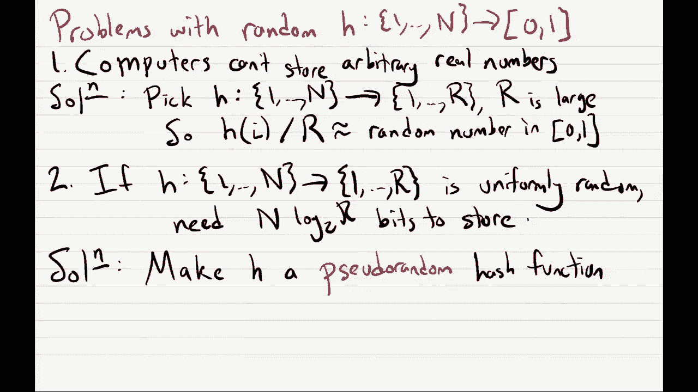

# 加州大学伯克利分校算法课程CS170 - P23：Lec23 Sampling and Streaming - 东风渐起UCAS - BV1o64y177K8

好啦，所以说，我们开始吧，嗯，所以今天我们要交换话题，嗯，我把音量调小一点，我们像上次一样，我想大概四堂课，也许甚至更多，我在做np完全性，比如什么是np完备性，最后一堂课就像，如果问题是NP完全的。

你如何通过设计一个近似算法来解决这个问题，但是这节课的最后几节课，我们要转移注意力，开始考虑人们喜欢研究的其他有趣的算法模型，所以今天和下周二，我们将研究一个叫做流模型的算法模型，呃。

之后的课我们会研究随机算法，然后在最后一堂课，我们将以我最喜欢的算法家族来结束，哪些是量子算法，嗯，但是是的，今天我们来做，我在这里做事，今天取消，我们将从采样和流媒体算法开始，在管理角的事情之前。

所以我很抱歉期中考试的两个成绩出来得有点晚了，但我已经得到保证，他们肯定会百分之百，今天晚些时候出来，感恩节周，所以一周有一部分时间休息，因此，我们下周根本不会有讨论会。

但仍然会有家庭作业派对和办公时间，应该有一个ED茎柱，我想可能是在讨论，问得好，我不确定我们以后能不能发关于这件事的帖子，虽然，好啦，所以让我从标题的第一部分开始，所以我们在做采样和流式算法。

让我们从采样算法开始，嗯，希望采样算法是你见过的很多东西，很多，一生中很多次，嗯，这些都是有用的算法，说，如果你有一个非常大的人口，你想知道，评估一下你的人民对一些问题的看法，所以说，例如。

也许你想知道以下内容，你想去找法官，嗯，因为你知道美国人，他们对下面的人说了什么，所以你赞成，U的，美国国会，你想知道的是，你知道的，是呀，他们应该说一个和不，如果他们不同意，他们应该说零，你的目标。

只是估计美国人中，所以你们总人口的比例，谁说是，好啦，所以呃，这就像一个问题，当然我们都见过，我是说这就像投票一样，对嗯，但你真的应该把它看作是一个算法问题，我是说你怎么解决这个问题你可以用一个算法。

让我们把这个算法称为一，我只是问大家，所以问问三亿三千万美国人，这很好，因为它会给你百分之百正确的答案，你会知道同意的确切比例，但它有一个明显的缺点，运行这个算法需要很长时间。

你真的要问每个人问三亿三千万人，你要花很长时间，所以人们通常做的不是问每个人，他们对人们进行取样，他们只问那些人，所以这个算法，嗯，你取样K个人，随机，你问他们每个人这个问题，他们每个人都会回应。

要么是一个是的，他们同意，或者零不，他们不批准，你收集他们的答案，叫他们x 1到x k，这些x i都是0或1，好的第三步，嗯，你想估计同意的人口比例，所以你只需要输出，你的样本中同意的比例。

所以你要输出，嗯，1/k和i等于x的1/k，I，我们把这个叫做P帽，这是你对p的估计，同意的人口比例，让我把这个叫做P，这是你的估计量，你想做的是你想知道你需要采取多大的措施，K，得到一个好答案。

一个好的答案，善意，嗯，我来写吧，然后我会解释的，你有两个参数告诉你你的数字k有多好，所以你想选，样本量k um的样本，使得有概率，概率为1减去δ，你的估计值减去p的真实值，最多不过是，好啦。

那么这些epsilon和delta是怎么回事呢？嗯，您有一个错误来源，只是你知道你不是在问每个人，所以你不可能准确地计算出p，但你会很高兴把它近似于，这说明了什么，就是，这个Epsilon有点。

你愿意接受的宽容，所以你很乐意摆脱的错误量，从真正的价值，但是嗯，你知道当你随机抽取一个样本，假设所有的美国人，你选择的每个人都有很小的机会，他们都答应了，或者他们都说不，即使真实的人口是五五开。

所以你知道当你随机抽取一个样本，只是一小部分时间，你会很倒霉的，你的样本将不具代表性，这就是1减去delta的概率告诉你的，你想要吗，所以你们的人口确实具有代表性，或者你的样本具有代表性。

至少一个减增量，就像你选择的K越大，就越难，它是无意中取样了一个糟糕的、不具代表性的样本，好啦，所以让我举一个例子，我上网查了一些民意调查，这就像一个民意调查，是什么，我想大概一周前，嗯由经济学家赞助。

然后民意调查实际上是由一个名为yougov的民意调查组织进行的，你知道他们去问人们，你赞成还是不赞成国会，然后嗯啊尤高夫，他们出去问大约一千五百人，然后我们发现，虽然赞成的比例约为16%。

百分之五十九不赞成，这些事情加起来并不完全是一个，因为让我们看看是什么，既不赞成也不反对，算是弥补了，但基本上你知道他们在问人们，你赞成还是不赞成，然后如果你翻到这个PDF的后面，所以这就像第八题。

就像他们问这1500人的一大堆问题，但如果你翻到PDF的背面，包括这个东西，误差幅度，然后嗯，这个误差幅度，你知道它说，基本上，就像你看到的appro分数一样，它是正确的，高达正负3%。

所以实际阅读这篇文章的方法是，嗯，这告诉我们我们的答案是正确的，嗯到，加减，假设百分之三点一，嗯，但当他们谈论错误时，误差幅度，他们通常意味着他们的答案是正确的，直到此错误，只有百分之九十五的可能性。

所以他们说，你知道95%的时候，我们的民意调查是准确的，在这种情况下，你知道你可以信任我们的答案，百分之一的时间，然后剩下的5%的时间，我们不能保证我们的数字是好是坏，而这95%，这只是一种标准的数字。

他们总是选择，所以他们甚至不经常说，所以用我们的语言，他们只是说他们计算的P帽，在这种情况下，批准的16号是我们的P帽，与p最多相差ε{\displaystyle\epsilon}。

概率至少为1-δ{\displaystyle 1-delta}，他们的epsilon错误将是点，让我们看看零三一，所以他们最多离开零点三，他们的错误概率是，等于零点五，所以有百分之五的概率。

你知道当德尔塔是零点五，这意味着你不能保证5%的时间，但剩下的95%的时间，是啊，是啊，你知道的，答案到底是什么，好啦，所以嗯，酷，所以问题是，我们要拿多大的K像，例如。

这个Yugov组织是如何决定一千五百个数字的，他们为什么不挑更大的呢？他们为什么不摘小一点的呢？所以让我把这个算法也复制一下，我们不要动那个，然后贴在这里，有一个定理叫做切诺夫界，这基本上告诉你。

在这种情况下，k要有多大，这个关断界有点像概率和统计学中一个非常著名的定理，所以如果你最后，你知道的，做统计或概率，你可能会经常看到这个，关闭界说了什么，是这样的，嗯，所以假设我们有，嗯。

假设k个样本或k个随机变量，x 1到x k，它们中的每一个都是一个数字，那不是零就是一，他们都是相互独立的，但分布相同，嗯，让你知道，他们中的每一个都有一定的可能性，嗯每个我，x i等于1的概率是p。

它等于零的概率，是1减去p，那么你该怎么想呢，嗯，嗯，如果我把我的人口，为了第1个人，我只是随机抽取一个美国人，你知道的，他们赞成国会还是不赞成，然后他们会答应的，到概率p和不，概率为1减去p。

因为他们就像一个完全随机的美国人，他们的答案基本上将独立于其他人，所以我们选的其他人，我们只知道每个样本的是概率，概率为1减去p，嗯，这说明了概率，如果我们看和的1/k，i等于x i的1到k。

与p至少相差ε的概率至多为2，减去2ε的平方，对不起，不是，好啦，所以让我嗯，让我们盯着这个看一会儿，所以这个数字，这只是我们的P帽，是样本的平均值，这里的p，这就像卑鄙的权利，是期望，随机变量。

上面写的是，就像我的p帽和p的差别至少在epsilon上，所以它问我多久会出现一次偏差，那是epsilon或更大的，这说明它是以某个数字为界的，所以我在这里犯了一个错误的问题是以这个数字为界的。

你可以注意到这个数字实际上是指数递减的，In k，所以当我把K越来越大，这个数字实际上以指数级的速度下降，所以它在我们采集的样本数量上呈指数级衰减，所以我们想回答的问题是使用关闭边界，嗯。

我们想要得到错误的概率，至少Epsilon我们想问什么时候这个概率小，所以什么时候我们的误差至少是ε，以其他数δ为界，所以我们这样做的方式很好，我们只是去这个拐弯处，我们把右手边放在这里，等于δ。

这是我们的三角洲，现在我们只需要解K的方程，它会告诉我们我们要拿多大的K，所以这个方程最多等于Δ，所以你知道你应该喜欢你在这里做什么，你把两边都除以二，你拿对数，再除以-2ε的平方，没关系的。

我们怎么做呢，哦对不起，让我用更好的方法来做，嗯，所以我们要做的是重写这个，作为嗯，2除以delta等于e等于2ε的平方k，这意味着现在我们取两边的自然对数，嗯，我这样写吧。

所以我们得到2除以delta的自然对数，等于2ε的平方k，所以我们想要的是，等于1/2ε的平方，三角洲上的两个草坪，然后你知道，你想拿K，可能不像你能承受的实际人数，可能不是整数。

所以你应该把它的天花板，然后嗯，我要说的一件事是音符，我想错误地说它是对数基数2，是啊，是啊，它应该只是一个，所以是的，这没有错，笔记，好啦，那么这有什么酷的呢，我们注意到这个k就像你想要的错误的函数。

就像epsilon，它是三角洲的函数，但它不是，n或n是美国的人口吗？所以它实际上，如果我想以很好的概率得到小错误，我从多少人身上取样并不重要，所以没关系，我的问题的输入大小，我能解决，有点用引号。

未引用，恒定数量的样本，我独立于我的输入大小，美国人的数量，所以这实际上是一个问题的例子，你不仅可以，在某种意义上解决它，嗯，比线性快，就像你在恒定的时间内解决它，如果时间就像你要取样的人数一样。

所以嗯，这就是我们在这节课中将要看到的，只是一些自然的情况，嗯，在那里你实际上可以比输入大小更快地解决问题，嗯，其中许多问题，他们有这种味道，你试图，也许估计一些数量不是百分之百准确，嗯。

因此你可以做一些采样，让你的任务变得更容易一点，有什么问题吗，是啊，是啊，我是说，在这种情况下，你的目标是输出一个数字，这样你就知道，您设置了错误容忍度，你设置你的epsilon和delta。

你的目标是输出正确的真实数量估计，概率为1减去δ直到误差ε，所以你可以，你知道的，套装，不管你想要什么，但一旦你有了这些，那这就是你要解决的问题，这有道理吗，好啦，关于此采样的更多问题，否。

所以德尔塔只出现在，是呀，Delta不出现在这里，但这有点含蓄地，嗯，如果你想，如果你想让你的绑定最多是三角洲，那么我们这里的公式是，你的k依赖于Δ，所以嗯，一定会越来越好的，较大的k是。

所以较大的k是，你的样品就越有代表性，所以这只是告诉你，如果我想让它最多是三角洲，因为我的错误概率，这告诉你如何适当地设置K，更多问题，啊，你就在这里说，你宁愿这样，如果是那样，谢谢耶。

会不会是三角洲2号，呃，让我们好好看看我会说什么，如果你设置，如果你试着用这个，你把你的epsilon设为零，那我只能告诉你，错误为零或更大的概率最多只有两个，这绝对是真的，我是说我输出的任何数字。

误差为零或更大，概率为1，所以1肯定小于等于2，就像如果我让ε等于零，右手边有点像一个微不足道的上界，它没有告诉我任何有趣的事情，所以这个界限真的只是有趣的，一旦k足够大，这个数字好像在1以下，哦耶。

所以如果你有多种选择，嗯，你必须用稍微不同的方式来分析事情，但也有一些方法可以利用切诺夫定界来分析这一点，嗯，让我看看，我能说什么呢，是啊，是啊，它确实需要更多的样本，如果你有很多选择。

你想正确估计所有这些的概率，它实际上会增加你必须采集的样本数量，嗯，我想通过喜欢，如果你有不同的选择，我认为它增加了样本数量的一个因素，我很喜欢，在这种情况下，你知道我们有八个选择，就像。

这一界限将大致增加，一点也不清楚，为什么你要做一些额外的证明步骤来证明，好的，好的，所以嗯，那是取样，但现在让我们用这个来解决一个我认为非常非常酷的问题，它是一种叫做流算法的算法，我会画一幅很蠢的画。

这就像是一个激励人心的例子，只是为了让你记住，但我向你保证，我以后再说，在幻灯片中，人们在现实世界中确实使用了流媒体算法，就像，即使这个算法，或者我要说的这个例子有点愚蠢，我以后会告诉你喜欢。

为什么人们会这么做，所以嗯，在这张照片里你就像坐在这里，好啦，就像一个流算法，对呀，所以你真的坐在一条小溪旁边，这里有水，从左到右，嗯，你就像在看，你知道你整天坐在那里，你看到像鱼经过。

所以这里有一条小鱼，一整天你都在观察这些鱼，也许有很多，你知道他们经常经过，你真的对，就像这些鱼的统计数据一样，嗯，你想知道，比如一个物种有多少种，有多少种不同的颜色，你就整天坐在那里，记录信息的种类。

但是是的，在一天结束的时候，你想问，你知道一些不同的问题，也许你想问，就像，就像，我说，鱼的哪一部分是红色的？或者你想知道总共有多少条鱼游过，嗯，或者像，有多少种鱼类游过，所以就像你知道的。

可能今天早些时候你看到一条鲶鱼，然后在一天的晚些时候，你会看到另一条鲶鱼，好吧，那只算一个，你知道它是同一种，然后嗯，我们要想像你知道那是你，你就像个单纯的人，也许你连笔记本或类似的东西都没有。

你只有很少的，嗯计算能力，他们就像成吨的鱼经过，不仅有很多像你这样的鱼，当你开始新的一天时，不知道会有多少人过去，你只是坐在那里，就像一整天都在过去一样，也可能是一百万次。

你只有在一天结束的时候才会知道，所以这有点像你正在看的数据，我们会想象它就像，对您来说太大了，无法存储所有这些数据，所以再一次，就像你今天出现在这条小溪里，你忘了带笔记本，所以你不能从字面上写下来。

就像，啊，我看到一条红鱼和一条蓝鱼，和喜欢，你知道的，几百页后，你把它都录下来了，所以你几乎不能访问任何记忆，然后就像我说的，鱼要从小溪里进来了，那是什么意思呢？嗯，嗯，就是说就是说，就像。

当你坐在那里，鱼会经过，你会看到的，你要登记，也许你可以把它记下来，但后来它就永远消失了，你再也看不到它了，所以特别是，它有一种不能倒带的特性，所以一旦你看到一条鱼，我是说就是这样，你想怎么录就怎么录。

但你永远不能倒带，就像检查你看到的早期鱼一样，好啦，所以这有点像将军，嗯嗯，这个问题的一个场景，你知道你对内存或计算的访问非常有限，但是你有一个巨大的数据集，您仍然希望能够计算这个数据集的有趣属性。

好啦，所以这就像是你可以在脑海中看到的有趣的画面，但在现实生活中，人们实际上使用流媒体算法，所以有一些有趣的计算场景，你实际上以这种方式受到限制，它的主要应用之一，在这些算法中，嗯，你在网上有喜欢的。

你有，让我们说，因特网节点网络，对不起，我怎么说才对，嗯是的，我想通过网络，网络中有各种各样的类似节点，您希望能够跟踪通过这些数据包的数据包，嗯，所以是的，让我这么说吧，这个跟踪包，通过互联网。

如果你喜欢，你知道的，坐在路由器前跟踪数据包，也许你的路由器上的内存很少，路由器上经过的数据包数量就像ginormous，好的，好的，所以说，但是路由器仍然希望记录一些关于数据包的信息，就像嗯。

我们有吗，我们有一些数据包不断来自同一个IP地址，网上有像流一样的吗，就像从一个IP地址通过异常大量的数据，如果是这样，我们该怎么办，这需要跟踪关于数据包的信息，无法记录下他们的一切，所以人们这样做。

他们有这样的，这些小路由器，他们的记忆力非常有限，但他们仍然保留了足够的关于他们看到的互联网的数据，这样你就可以检测到网络上的异常，好啦，所以我们要在这节课里看看，两个问题，嗯，在流媒体模型中出现的。

刚才是不是有个问题，嗯，所以我们要看的第一个问题是，非常，简单问题，这是一个从流中取样的问题，所以说，让我写下我们试图解决输入的确切问题，在流式模型中，这将是我们所说的溪流，这个流就像一个序列。

叫做第一，序列的i，我叫它si，它一直在继续，所以每一步，就像第1次，有人给你SI，你得看着它，记录你想记录的关于它的任何东西，然后SI离开，然后你看到si加1，就这样继续下去。

你真的不知道什么时候会提前结束，每一个都将是，嗯，我们建模的方式，它们都是1到n之间的整数，所以你可以想像在鱼的场景中，这些整数中的每一个都可能对应于鱼的不同颜色，所以整数1就像一条红鱼，整数二是蓝鱼。

以此类推，采样问题的目标是简单地输出，来自流的元素，那么这意味着什么呢，这意味着在某一点上，就像整个溪流会流向你，你会看到所有的元素，然后你就这样做了，有人会告诉你小溪在这里结束。

现在你的算法应该能够输出的就像一个均匀随机的元素，从S 1到字符串的末端，你必须能够在不事先知道的情况下再次这样做，流的实际长度，好啦，所以嗯，让我通过一些简单的算法来解决这个问题，所以对于这些。

我将写l大写l表示流的长度，再说一次，你事先不知道，但你可以做的一个算法是记录整个流，所以只要记录下每一件事，S 1到SL，也许在你的笔记本里，然后你录下来之后，你只是喜欢，随机选择一个并输出。

这需要很大的空间，所以这将是，嗯l乘以资本日志n，所以要记录每一个SI，它需要大写n位的对数，他们是他们中的一员，所以我把钱都存起来了，我们在这张照片中想到的是，嗯，我是巨大的。

所以这实际上是一个空间约束，我们不会允许你的算法使用，这是第一，它的工作原理，但是它占用了太多的空间，好啦，两个好吗？如果我是这样，这个就可以了，如果有人提前告诉你，嗯，那么你可以做的是，你可以选择。

而且是的，所以这个算法的工作方式，如果有人提前告诉你，在你看到你的溪流之前，你只需要在1和l之间生成一个随机的i，然后你要等到你看到，嗯，你看是，你要把它录下来，然后你要在最后输出它，所以这个算法很棒。

你知道的，它只需要您存储流的一个元素，这就像原木资本n位嗯，但这需要你事先知道我，我们假设在这个模型中，你实际上没有被告知，我做完所有的事，所以这是一个很好的算法，但不是真的，我是说。

它在我们的模型中并不完全有效，所以第三局，你将在下一张幻灯片上看到，不需要我的知识，n的对数基数2好的，所以我们会看到这个算法很简单，很干净，不需要知道绳子的长度，关于一般模型的问题，是啊，是啊，哦。

在这种情况下或在这里，嗯，在这种情况下，这个算法一，你只是在记录整个流程，所以在你的电脑上你只是写下，一、二、三，你把整件事都写下来，每个si都是一个数字，在1和大写n之间，以记录这个数字。

我需要对数大写n位，你说，它是，它是耶，问得好问得好，所以这整件事是一个流，1是流的第一个元素，所以1是一个介于1和n之间的数字，得等溪水来，是啊，是啊，原来你是，你在跑时间，你肯定需要看到整个溪流。

所以也许你需要更多的时间，但你的空间会非常有限让我这么说吧，如果我们能解决输出一致随机元素的问题，这对我们有帮助，至少你知道我们想要的第一个问题，比如鱼的哪一部分是红色的，嗯。

如果我能够对我的流的均匀随机元素进行采样，我可以用它来，你知道的，我可以像1一样输出，如果那东西是红色和零，如果不是，如果我可以，我可以用这个算法，其实呢，我们将看到它并行生成，就像流中的多个随机元素。

如果我能对我的流的多个元素进行采样，这将使我能够估计，假设红鱼的比例，所以一旦你能够获得采样的功能，你可以用它来解决其他问题，好啦，那么我们要用好的算法是什么呢，这是一种叫做水库抽样的算法。

它被命名为这个是因为你要存储一段数据，称为水库，是啊，是啊，登录，还有水库，我们就叫它小R吧，在溪流的起点，您只需要将它初始化为s one，所以第一个元素进来了，你设r等于s 1，然后你就完蛋了。

然后在第二步，你只要让水流继续流下去，对于流的每个元素，你所看到的，你要做的就是看着，你要决定，我应该用SI代替我的蓄水池吗，或者我应该忽略SI，去SI加一，所以问题是。

我们如何决定是用si取代我们的水库还是忽略它，答案是，我们掷硬币决定，所以我们要做的是抛一个有偏见的硬币，还有这枚硬币，你知道的，不是正面就是反面，它的概率是p，我有一些圆周率，我还没有定义。

这意味着它的概率是1-π，这个圆周率是一个数字，取决于我，所以当我看第i个元素时，我要拿一枚硬币，它的正面概率只取决于数字，我和我要翻转它，如果它出现了，头，我要把蓄水池调成si。

所以我要删除水库曾经有的，然后我要把它重置为SI，但如果硬币是反面，我只是什么都不做，所以我要让水库保持原样，我会忘记SI的价值，接下来是SI加一，然后我会继续这样做，当溪流最终停止，我将输出r。

这就是算法，它是完全指定的，只是我还没告诉你圆周率是什么，其实呢，也许我会让你们思考一分钟，呃，让我放一个计时器，是啊，是啊，我想和你的邻居讨论一下，自己想，我们应该把圆周率设为多少。

称赞只有一个价值会起作用，我要回答一个问题，我想是在，啊，好啦，是啊，是啊，让我们等一分钟然后，好啦，一分钟到了，嗯，我想是你先举手的，所以你想猜猜，好啦，1。你猜对了，别人猜对了？一比二对我感兴趣。

一个以上，I，出于好奇，你为什么说一个以上，I，啊，你现在只是在证明，是啊，是啊，很好很好，我马上就去校对，但你说的是对的，你可以用归纳法来证明，正确答案是1/i，所以说，是啊，是啊，伟大的嗯。

让我让我给直觉，为什么，你会期待一个超过我，哎呦，后面有问题吗，哦很好，是呀，你的意思是，我从来不知道，当溪流即将结束，所以也许是，也许就在这里结束了，就在这一步之后，如果一步后就结束了。

我必须确保我输出第i个元素的概率是1，我希望它是统一的，所以唯一能让我通过设置圆周率，即把圆周率设为i上的1，所以必须在每一步，因为也许就这样结束了，因为我必须在这一步输出一个均匀随机的元素，当然。

我必须把它设置为i上的1，但现在的问题是，这真的会让我得到一个均匀随机的元素吗，这就是我现在要证明的，所以说，嗯，声称如果流有长度，L，那么对于所有i，我们输出si的概率，只会是一个，L。

我想有两种方式来看待这个证据，我想在我们的笔记中，它实际上是人们提出的归纳证明，所以你可以用归纳法来证明这一点，还有一个，这基本上是等价的做法，至少对我来说，这更有意义，所以让我做另一个证明。

所以我们要计算，我们输出SI的概率是多少，我们什么时候能输出SI好，我输出SI的唯一方法是在第i步，我不得不用SI代替蓄水池，然后在每一步之后，我只是不更换蓄水池，我只是保持原样。

所以这意味着我们需要在I级看到头部，在第一步，然后在之后的每一步我们都必须看到一条尾巴，这是我们在步骤I上用SI代替它的唯一方法，而不是每隔一步就更换一次，好啦，所以问题是，我们这么做的可能性有多大。

我们看到一个头，然后是尾巴，之后只有尾巴，头在台阶上的地方，然后尾巴是i+1到l，这些都是独立的，对吧，所以我们可以把所有的概率相乘，我们领先一步的可能性有多大？在我上面一点。

那么我们在步骤I加1上得到一个反面的概率，等于1减1除以i加1，然后在步骤I加二，我们得到的反面概率是1-i或者1/i+2，一路降到一减一，超过l减1，最后，在第1步，我们必须得到一个尾巴。

几率是1/l，所以现在让我们重写所有这些，这是一个在I上，那么1减1除以i加1等于，嗯，我把它写成i加一除以i加一，然后我减去一个，这等于i除以i加1，什么是一比一，负1/i加2。

那就是i加2除以i加2，负1/i加2，这就是i加1除以i加2，然后我们就继续前进，得到l-2除以l-1，减去1/l，但是现在让我们来看看这个公式，我取消了，i加1取消，我加2一直到我减1。

最后我们得到1/l，这正是我们想要证明的，啊，我们想要，你的意思是，我们不应该证明概率是1以上吗，I，啊，它是，嗯好吧，我们想要它当我们，每当我们停下来，我们要输出一个均匀随机元素。

所以我们会在溪流的尽头停下来，我们称l为河流的长度，所以这意味着当我们停下来，我们希望从s到sl之间的每一个元素都以相等的概率输出，所以每个元素都应该以概率输出，1除以l，这有道理吗，是啊，是啊，比如。

s，one，is，one，over，l，s，two，is，one，over，l，所有的都应该是1/l，好吧，这个结束了，我就在这里，是啊，是啊，所以这是证明中的工作，我们只是在看SI。

我们要证明对于每一个i，我们得到的概率是1除以l，我们得到的方式是，我们每一步都有一个人头，每一步都有一个尾巴，我们在第i步找到s的概率是1/i，我们在步骤I上得到反面的概率加1，是1减1除以i加1。

那么这是一个概率，我们在第二步得到一个尾巴，以此类推，这有道理吗，嗯，部分，只是这个神奇的公式，但直觉是什么，所以是的，这种直觉是喜欢吗，让我们说，假设我看第i个元素，我运行这个算法。

也许溪流就停在那里，如果溪流停在那里，那么我的输出必须等于si，概率为1/i，因为那是，这就是我们要解决的问题，就像当我停下来，如果我停下脚步，我应该能够以1/i的概率输出所有的东西。

其中包括最后一个元素，我输出最后一个元素的概率是1/i的唯一方法，我必须用它来替换蓄水池，也许现在是休息三分钟的好时机，然后我们可以在休息后看看最后一个问题，好啦，这就是水库取样。

这解决了允许我们从我们的流中生成一个随机样本的问题，你也知道，如果你想从流中生成k个随机样本，你只需要保持k个独立的水库，然后对每个水库执行这个算法，所以这将允许我们使用，就像我们一开始看到的采样算法。

如果我们想估计我们流的一些数量，我们要看的下一个算法要聪明得多，而且非常喜欢，非常酷，老实说，有人能想出这个有点惊讶，所以这是一个叫做不同元素问题的问题，您的输入，在这种情况下，再次将是流。

1通过si以此类推，每一个都是1到n之间的数字，您的目标是估计流中不同元素的数量，所以也许你有一条长长的溪流，流中的每个数字都可以是1到n之间的任何数字，但也许溪流只会给你一个数字，那就像两个。

四到十个，那么你要计算的是三，在这种情况下，因为你实际上看到的只有三个不同的数字，就像在鱼的例子中，这就像，也许你想估计一下你看到的不同种类的鱼的数量，所以如果你只看到两种鱼经过，你想输出数字2，嗯。

在互联网示例中，你可以用这个来判断，就像我的大部分流量来自大量的IP地址，或者就像我的流量只来自少量的IP地址，同样，这是你可以解决的事情，如果你只是喜欢记录所有的，如果你记录了流中的每个元素。

所以如果你写下整个流程，然后你可以查看并计算你看到的不同元素的数量，但那需要很大的空间，所以我们要做的是一个更聪明的算法，比使用非常小的空间，实际上我只想告诉你们一个算法的理想化形式。

它实际上不会完美地工作，但在我解释之后，我们看看哪里出了问题，下节课，我们要把它修补好，看看如何使它正确地工作，所以这实际上不像一个真正的算法，但它就像这个算法的理想化形式。

这个算法的第一步是我们要选择一个随机哈希函数，我们称它为h，这个哈希函数，它只是一个函数，将每个数字映射在1和n之间，从0到1的真实区间，所以你输入的这个哈希函数，你输入一个数字，在1和n之间。

它会吐出来，你知道一个真实的数字，零到一之间的东西，我会为每一个，你应该把这看作是一个真正的随机函数，所以基本上这个哈希函数在一开始指定的方式，只是会有点，呃。

当你为1到n之间的每个i生成这个随机哈希函数时，它只是会喜欢，在这个区间内生成一个一致随机数，然后这就是你如何生成这个哈希函数，你要做的是，你要看着小溪流过，随着弦的流逝，而不是实际观察流的元素。

您只需要获取每个元素并对其应用哈希函数，所以当你看到元素，第一个要对其应用哈希函数的元素，你会得到其中的一个，只是0到1之间的实数，对第二个元素应用哈希函数，你会得到两个中的H，以此类推。

直到你看到的流的最后一个元素，你要记录的关于这些数据的内容，所以你不会保留所有这些哈希函数，或者所有这些哈希数，因为他们太多了，你只需要记录最小的数字，所以你知道，你会有一个单一的变量。

它将记录到目前为止你所看到的最小值，然后当一个新元素从流中进来时，小溪，您将对其应用哈希函数，如果它比你目前的最小值小，你要用一个较小的值替换你的最小值，所以当绳子经过，你可以用，只有存储一个数字。

我要叫这个阿尔法，这意味着在这个算法中，我们只储存一个号码，好啦，所以嗯酷，嗯，嗯，从n到n的每一个都会得到一个不同的随机抽样数，现在是真的，就像他们可以，它们中的两个完全有可能被映射到完全相同的数字。

但这实际上发生的概率为零，但也有可能，我是说没有什么能阻止这一切的发生，是啊，是啊，你是说在这条小溪里，你是说每次我看到一个价值，一个你在问，总是得到相同的数字还是不同的数字，这就是你要问的吗？是啊。

是啊，好呀，所以每次我看到一个，我总是得到相同的哈希值，因为我只是在用同样的函数，和这个函数，你知道的，每当它接纳一个，只是，这是一个函数，所以我们只输出一个固定值，固定值，从某种意义上说。

你知道它是在算法开始时随机选择的，但对于算法的其余部分，刚刚修好的，好啦，所以我们计算所有这些东西，最后我们要输出，嗯一些取决于阿尔法的东西，所以我觉得这是个很酷的谜题，就像你记得的那样。

我们想估计流中不同元素的数量，我给你们的唯一数字是α，这是所有这些哈希值中的最小值，所以一个问题就像，你要怎么处理阿尔法，计算流中不同元素的数量，你有答案或问题吗，好啦，是啊，是啊，有一天我喜欢，哎呦。

i中的每个s都是1到n之间的数字，所以整个溪流的长度，它将是每一个数字，在溪流中正好在1和N之间，就像，如果n像2，那就只是一串1和2，好啦，所以嗯是的，现在我要向你们提出的问题是。

我再给你一分钟考虑一下，嗯，你已经做了流，您已经计算了这些哈希值，你只知道他们中的一小部分，你如何用它来估计流中不同元素的数量，给你一分钟想想你知道的，和你的邻居谈谈，好好想想，我觉得这是个很酷的谜题。

好耶，哈希函数是什么，嗯，下节课我们会正式定义哈希函数，但是嗯，为了这次演讲，哈希函数实际上是一个函数，将1到n之间的整数映射为零一的h，当我们生成h，完全是随机的，把它想象成一个完全随机的函数。

就像这样，下节课，我们将看到如何正式定义它们，以及如何构造一个问题，或者，好的，好的，是啊，是啊，是啊，是啊，所以问题是，我们如何计算最小值，当你说0或1的时候，0和1是从哪里来的，哦不。

它是零到一之间实数的间隔，所以嗯，一个人可以像，你知道的，可以是第三个，它可以是圆周率的1，它可以是任何实数，是呀，这有道理吗，是呀，我再给你们三十秒，别人也是，我们知道，哦不，你不需要所有。

实际上你只需要阿尔法，不会十全十美，我会说这个算法不会完美，但这就像一个很好的猜测，好啦，嗯，我想这是你的一分钟，甚至超过一分钟，嗯，你猜猜看，你猜呢，好吧好吧，嗯，只是我猜号码是多少，是啊，是啊。

或者像什么，输出的函数是什么，你的猜测是1比1，你猜到了吗，阿尔法楼上一层，好啦，N次α，好啦，我们的一个阿尔法减去一个，好极了，是呀，我喜欢所有这些答案，我猜最正确的是负数，但真的很喜欢，是啊，是啊。

算法会想到，你只需要输出1/alpha，这个会稍微偏一点，因为我们会看到直觉上至少会有一个负数，但你知道，我们只是想得出这个数字的近似值，所以我们很高兴有一点错误，好啦，所以我们是的，我们要计算一下。

东西，我们要计算最小值，输出1除以最小值，其实你，所以你说的是你想要的一阶统计量，是呀，是呀，你对此的直觉是什么，呃，哼，好呀，是呀，美丽，是啊，是啊，所以让我基本上把你在这里说的写出来。

所以这就是为什么你可能期望它起作用的直觉，所以嗯，让我们假设，我们再次试图计算不同元素的数量，所以让我们假设k是流中不同元素的数目，好啦，所以你知道，我们把所有的东西都放在溪流中。

但实际上只有k个不同的数字一遍又一遍地重复，好吧，那么，当我们的算法运行时，我们只会看到这k个不同元素的哈希值，所以这意味着我们的算法实际上只会查看k个不同的哈希值，让我通过rk调用这些r one。

都在这里，我只是随便用一下，所以这些哈希值中的每一个，你知道的，它将是零和一之间的一致随机数，数字alpha被选择为k个哈希值中的最小值，所以嗯，让我们把这个画成什么样子，我们期望这会是什么样子。

哒哒哒哒，所以如果这是一条介于0和1之间的数字线，然后嗯，让我们来规划一下，我们期望在哪里，这是一个通过RK要好，它们都是零和一之间的均匀随机数，所以我们希望它们都均匀地散开，非常松散。

你希望它们均匀分布，所以你可能会认为他们中的一个就在这里，然后下一个就在这里，我把这个画大一点，他们中的一个在这里，假设下一个在这里，然后下一个就在这里，然后下一个非常松散地在这里。

你希望它们均匀地间隔开来，所以这些都是RI的，如果它们均匀分布并且有k个，这意味着他们把从0到k的区间分成k加上一个不同的段，因为k加1从0到1的区间的不同部分，这意味着我们期望每个段大约是k的一加一。

所以阿尔法，你还记得它被选为这些RI中最小的一个吗，所以这个间隔的长度，我们预计它大约是k的一加一，因此α本身，我们大概期望它是1/k+1，我的目标是计算k，因为我想计算流中不同元素的数量。

所以这表明只要取α并将其反转，这将得到k加1的大致结果，然后就像有人建议的那样，如果我们想的话，我们应该减去1，但你知道我们只是，我们只关心估计不同元素的数量，所以如果我们落后一个因素，我们就很高兴了。

其实呢，这是事实，所以这就像是，你知道的，松散朦胧的直觉，我什么都没证明，它只是画了一些画，但这是一个事实，你实际上可以证明，你可以用数学来证明这一点，预期的，alpha的期望值实际上等于k的一加一。

所以至少α的期望值是1/k+1，这个事实在我想会放在网站上的笔记中得到了证明，我会说，虽然，在你读笔记之前，这就像一个有趣的练习，只是试图证明自己，所以这个，实际上你可以用，像微积分。

你得想出一个聪明的步骤，哎呦，我们很好，嗯是的，我是说，1/alpha减去1也可以，我猜，嗯又来了，我们只是试图估计不同元素的数量，所以我们并不真的在乎得到它，完全正确，我们很高兴有一些小错误。

另一件事是我们下节课要讲的，这个α实际上并不是k的一加一，会有很大的变化，所以你不，你从来没有真正，你很少会看到像这样的阿尔法，从字面上看，就在那里，是啊，是啊，我们将看到下节课，是啊，是啊。

所以这个算法的一个变体会看到它实际上有，就像一个可证明的保证，输出离正确答案有多近，是啊，是啊，我是说，嗯，你的意思是，为什么这不只是给你正确的答案，如果有问题的话，是啊，是啊，我是说，那是一部分。

眼睛上的随机性意味着，我们并不总是完全正确的号码，所以我们输出的东西并不总是完美的，好啦，但是这个算法有问题，有人能告诉我，即使在喜欢的事实之外，我还没有证明这个算法的任何东西，有人能告诉我。

为什么你不能真正实现这个算法，是啊，是啊，你不能保证什么，啊，啊，好呀，是啊，是啊，我甚至没有说过如何生成哈希函数，但你的意思是，嗯，也许我只是喜欢这样定义哈希函数，可以吗。

就像人们看到这个哈希函数的问题一样，我已经指定了它，是啊，是啊，那很好，我是说，就像一个函数，我想我真正定义的是这种形式的随机函数，啊，那是，我想这对这个算法来说很好，是啊，是啊，是啊，是啊，那很好。

虽然我的意思是，你有点，你知道的，你只是在计算不同元素的数量，所以你有点期待很多事情不是，哦很好，是啊，是啊，所以第一期，我们不能在计算机上无限精确地存储实数，所以这是一个问题，是啊，是啊，另一个问题。

是啊，是啊，你是说甚至写下这个哈希函数，我们要把每个号码，这将是一个很大的空间，所以让我写下这两个问题，嗯所以是的，我们在这个随机哈希函数上有这些问题，从1到n到0，一个，第一个问题是计算机。

我是说他们不能，他们就是不能存储真实的数字，计算机只能存储像，你知道的，比特，不幸的是，这个实际上有一个不错的解决方案，也就是，让我们选择我们的哈希函数，而不是输出一个均匀随机数。

让哈希函数将所有内容映射到1到n，变成，假设数字1到大写r，其中r是某个非常大的数，然后哈希值将只考虑与i相对应的哈希值，作为i的h除以r，如果我们选择我们真正大的。

那么h{\displaystyle h}除以r{\displaystyle r}大致就是一个随机数，零一，所以我们把零一离散化了，但是如果r真的很大，我们随机选择h，然后像i的一个h除以r。

对于我们的目的来说，它看起来足够随机，嗯，但第二个对我们来说是更大的问题，所以你知道，如果我们有这个h，我们产生它是均匀随机的，所以如果h是一致随机的，然后我们需要n个对数基数的两个比特来存储。

为了每一个我，我们必须，我们必须存储i的h的值，如果大写n很大，那么这是我们的算法使用的大量空间，所以这里的解决方案是不再让h成为哈希函数，或一致随机哈希函数，但是要使它成为一个伪随机哈希函数。

这将允许我们使用更小的空间存储H，但它仍然会给我们随机函数所需的性质，我们看看下节课该怎么做。

