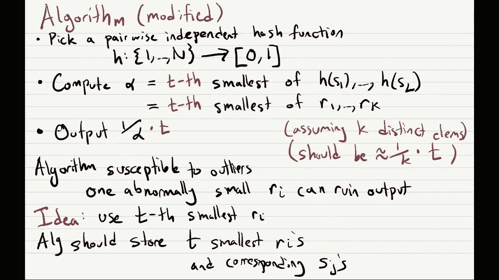
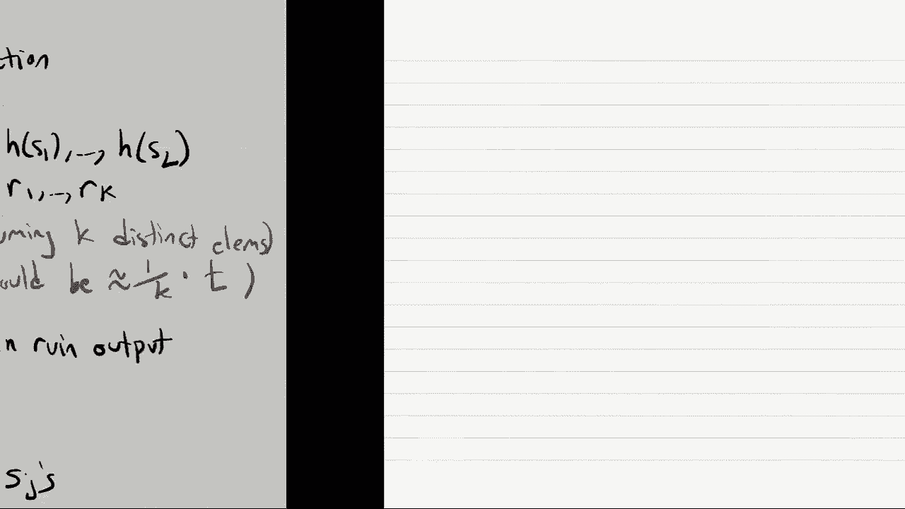
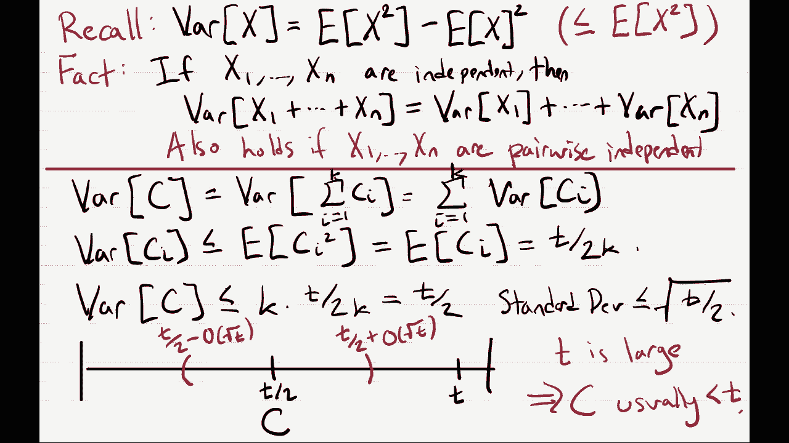

# 加州大学伯克利分校算法课程CS170 - P24：Lec24 Sketching and Streaming (Part II) - 东风渐起UCAS - BV1o64y177K8

好啦，我们开始吧，所以欢迎来到感恩节前的最后一堂课，我很感激人们出现，今天我们要继续，上一节课我们就开始了，流式算法，所以如果你还记得，这些是流算法，这些算法可以访问一个非常大的数据集，嗯。

但只能一点一点，我们希望算法有很少的内存，我们仍然希望他们，能够有效地计算这个大数据集的一些东西，所以在我们开始之前，我来告诉你管理方面的事，所以期中考试的成绩已经公布了，所以两周后，希望你有任何退步。

你应该参加我们的助教，我想应该是下星期五，但我不是百分百肯定，所以是的，一定要检查，嗯，到期日的帖子，我们有CS的连帽衫，一百七十嗯，你得付钱，所以他们不是免费的，但如果你想看艾德一眼。

有一个帖子告诉你如何得到它们，是啊，是啊，去哪里找他们，最后一件事是由于感恩节，本周没有讨论，好啦，所以说，嗯，我们将继续上次讨论的话题，这是一个特别的，流算法被称为不同元素问题，这个问题的输入，嗯。

你可以一次看到一个数字，我们叫他们一通吧，每一个都是一个介于1和大写n之间的数字，这个问题的目标是，只估计您在流中看到的不同元素的数量，总是有一个简单的算法来解决这种形式的问题，只是为了记录整个流，嗯。

但我们想要的是一种算法，它可以解决这个问题，而不需要这样做，上次我们看到一个基于哈希函数的启发式算法，我们看到了直觉上它应该起作用的一些原因，但是有几个你知道的，实际上阻止我们实施它的技术细节。

所以让我首先提醒你基于散列的算法是如何工作的，所以我们有这个算法，在算法的开始，甚至在我们看到流的任何元素之前，算法所做的就是选择一个随机哈希函数，就叫它h吧，把1映射到n，也就是，你知道的。

流中每个元素的标签进入间隔零，一个，嗯，所以这意味着对于1到n之间的每个数字，我们随机选择一个实数，就像零到一之间的小数值，然后这个算法的工作方式是你计算，每次你在流中看到一个新元素，计算哈希值。

你记录流的所有元素的最小值，所以你看到的是h的s 1到h的s l um，你的算法会记录这些值的最小值，所以只需要一个数据寄存器，如果你假设只有k个不同的元素，那么我们可以说这等于k个哈希值的最小值。

所以如果在溪流中你只看到，1和n之间的k个不同数字中的一个，那么您只会看到k个不同哈希值中的一个，所以让我们调用你看到的r到r的哈希值，嗯是的，这是假设我们只看到k个不同的元素。

我们将把这个最小值记录在一个数字alpha中，然后我们看到我们必须弄清楚，给定这个最小值，您实际上如何使用它来估计流中元素的数量，我们看到了一个令人惊讶的简单答案，原因很简单，好像不应该起作用。

但我们今天将看到它确实如此，你只要选α，你的输出是对等的，1除以α，为什么这会起作用的直觉，我们也经历过，所以直觉是这样的，嗯，如果我们想象画一条数字线，所以在0到1之间，然后呢，我们写下一个小箭头。

对于我们算法看到的每一个哈希值，所以让我写下一个箭头，这些是每个哈希值ri，他们中的每一个都是随机挑选的，从零到一的间隔，我们期望这k个不同的值是均匀的，如果它们间隔均匀。

然后他们把从零到一的区间分成k加一个不同的子区间，再一次，如果它们间隔均匀，我们期望每个子区间大致等于1，大于k加1，所以如果我们看这些值的最小值，哪个是阿尔法，然后嗯。

alpha的大小正好等于从0到alpha的间隔长度，你也知道，我们已经看到所有这些间隔的长度大约是1，大于k加1，所以直觉上，我们应该期望α是1/k+1，所以确实，如果我取α输出1/α，嗯，你大概知道。

我希望得到一个在k附近的数字，在这种情况下k加一，但由于我们的目标是只近似不同元素的数量，我们很高兴被一个人带走，那是，那不是什么大问题，好啦，我们上节课要做的就是，我们实际上如何构造这个哈希函数。

好啦，所以最后的配料就像，如何构造这个哈希函数，你如何在很小的空间里把它存储在你的电脑上，你还记得吗，我们希望我们的流算法有少量的空间，最后一节课结束时，我们看到了这个形式的哈希函数的两个问题。

所以让我提醒你们这两个问题，所以让我们看看这种形式的哈希函数的问题，把1到n映射成0，一个，我们看到的第一个问题是，首先存储这个哈希函数，你必须对1到n之间的每一个数字，你得储存一个真正的。

介于0和1之间的任意实数，但是电脑不能储存，任意实数，好啦，你的电脑，你知道的，它只能在电脑上存储像比特一样的东西，就像有限的比特序列，任意的实数需要无限多的比特来存储。

但我们看到有一种相当简单的方法来解决这个问题，它不是选择一个映射到零的哈希函数，零到一的间隔，只要选择一个哈希函数，H，把1到n映射成，让我们说，从1到r的整数集，你选r是非常大的。

然后如果你看你的哈希函数在输入上计算，I，我很好，这是一个介于1和r之间的数字，也许这是一个很大的数字，但是如果我们把它除以r，那将是一个介于0和1之间的数字，如果r足够大。

那么这个东西将近似为零中的随机数，好啦，所以这没什么大不了的，这是很容易解决的问题，但我们上次看到的更大的问题是，如果我们有这个，这个哈希函数，它确实是均匀随机的，意思是对于1到n之间的每一个i。

我们选择一个独立的均匀随机数将其映射到，然后实际存储这个哈希函数，我们需要n对数的比特，为什么对于1到n之间的每一个数，嗯，我们必须存储您将其映射到的值，它散列到什么值，所以对于1到n之间的每一个数字。

都需要log r位，因为有n个数字是n log r位，你还记得我们要拍摄的不是一个算法，嗯大小就像n个空间，但我们真的想要一些类似log n空间的东西，好啦，所以这就是上次的所有设置。

在我们继续解决这个问题之前，还有什么问题吗，哦，嗯，肯定像我要画的东西，然后我会抹去它，所以我道歉，但是嗯，你知道我们真正想要的只是一个均匀随机数，从0到1的这个区间，但是嗯，如果我们选择。

如果我们采取这种策略，那么你将得到的是，呃，这个号码，它总是像，嗯，1/r的倍数，对呀，所以要么，你会得到1/r或者2/r，3/r，你会得到所有这些数字，如果r足够大，所有这些数字都非常接近。

就像随便挑一个，就像随机选取一个点，在0到1之间，就像你几乎可以想象的那样，就像你从0到1选择一个均匀随机的点，然后你只要把它的数字截断到某个点，所以你只看前面一百个数字，这就是你能做的事情。

你可以这样做，所以让我把这个擦掉，嗯，好啦，所以其他关于，是呀，好呀，是呀，你很好，您只需要使用流中出现的那些，嗯，但这也产生了自己的问题，就像如果你有一个新号码弹出，你怎么知道。

是不是你以前在小溪里见过的，就像许多数字出现在流中，所以你知道你有L号在流中，你可以有不同的数字，所以这意味着你必须储存，你知道我记录了R位，这仍然是一个非常大的数额，好啦，所以我上次提到的解决方案是。

我们要牺牲这个事实，这将是一个随机哈希函数，所以我们实际上不会把它变成随机的，相反，我们要把它做成我们称之为伪的东西，伪随机在这里是一个松散的术语，所以我不打算正式定义它，嗯，但总的来说。

伪随机意味着它不再是随机的，所以对我们来说，我的意思是它更容易储存，但它仍然有一些随机的性质，这些随机的性质将足以让算法仍然工作，所以我们要设计一个伪随机哈希函数的方法，我们要定义一个哈希族。

和一个哈希家族，这只是一个布景，我把它叫做函数的大写h，所以从一个到一个，所以我们要有一套M号的，而不是采摘，你知道一个均匀随机哈希函数，我们只能从这个家族中随机选择一个哈希函数。

所以一个我会经常使用的符号，从这个哈希族中选择一个随机函数，我只是要写H弯弯曲曲的H，这就意味着你在1和m之间随机选择一个i，然后这个h等于，我们想要的是当我们从h中提取h时，哈希函数中的一点h。

它至少应该看起来足够随机，我们的应用程序是随机的，但是我们希望存储这个随机哈希函数会更容易，这个伪随机哈希函数，我们希望它比嗯更容易储存，一般随机哈希函数，所以你知道。

在这里我们看到就像一个均匀随机哈希函数，将需要n记录我们的比特来存储，但谁能告诉我我们需要存储多少位，如果我们从这个家族中选择一个哈希函数，就像，假设我们的流算法，第一步，它只是挑它。

从h中采样随机哈希函数，它需要存储多少位，登录，为什么呢？好耶，所以有M个不同的哈希函数，所以我所要做的就是记录，比如索引是什么，哈希函数的i，我有，嗯，所以我们真正想要的是我们的m很小。

如果我们的m很小，然后就像我们看到的，这只需要log m位来存储，如果你的M很小，然后您可以用少量的位存储哈希函数，所以在这节课中，我们将看到如何构造这些哈希函数，一个看起来随机的哈希族。

但只有少量的哈希函数，但在那之前，让我先定义一下看起来有点随机是什么意思，这节课我们需要什么，这是一个非常特殊的随机性概念，叫做成对独立性，所以我们说哈希族h，所以这个杂碎家族，它将包含M个不同的函数。

将1到n映射为1到r，我们说它是成对独立的，如果可以的话，我先把话说清楚，嗯，如果它是一个真正的随机函数，这意味着如果我看n个不同的输入，它们的输出都是1到R的独立一致随机元素。

所以这就是均匀随机的意思，两两独立只是说，如果我看任何一对输入，然后它们会被映射到一个随机的，一致随机输出对，所以让我用数学来写这个，我们想要的是，对于这个哈希族的所有输入，嗯x，与Y不同。

以及它们可以映射到的输出，所以它被称为ij，从1到r，我们想要的是，如果我们画一个随机哈希函数，那么它将x映射到i的概率，从y到j，我们希望这正是你所期望的，如果这确实是一个一致随机或哈希函数。

如果这是一个均匀随机哈希函数，然后它会映射出每一个，它将x的h映射到i，概率为1/r，从y到j的h的概率是1/r，这两个将是独立的，所以它映射出他们两个的概率，这样就等于r的平方。

所以让我在这里画一张图，希望能解释，让我们假设我们把m哈希函数，我会喜欢，在x轴上写一个表，将是m个不同的哈希函数，在对不起上，我们将要得到的y轴和x轴，我想这些列都将对应于不同的输入，在1到n之间。

这里是输入x和y，有不同的输入，想象一下在这张桌子上，嗯啊好吧，我把它画出来，我想是的嗯，让我们看看第I行的这一栏，我们将得到x的h i，同样，你可以在这里有这个专栏，你在第I排的哪里得到你的H I。

这种两两独立的说法是，如果我随机选择一行，我看了这两列中的两个条目，然后它们看起来就像两个均匀独立的随机条目，从一个到另一个，所以这看起来像两个独立的平局，从一个到，我只想说一件事，这意味着，嗯，好啦。

所以这意味着如果我看任何一对元素，一对输入，它们的输出看起来都是随机的，所以这肯定意味着如果我只看一个输入，假设x的h，然后它本身看起来也是均匀随机的，换句话说，如果考虑从哈希族中绘制一致随机元素。

你问，x的h映射到某个数的概率是多少，I，那么对于所有x，这将等于1/r，所以这不仅仅是两两独立的，它不只是像两个聪明的制服，但这也就像单个元素看起来也是一致的，好啦，这可能是一个非常令人困惑的定义。

所以如果你是，大家都明白了吗，哦耶，这里是这个h，只是意味着我随机选择其中一个，其他问题，是啊，是啊，对不起，我听不太清楚，你能大声点吗，哦嗯，每一个m函数都是一个固定函数，所以每一个都是确定性函数。

生成随机函数的方法是，通过随机选择这些m个完全确定函数中的一个，对呀，所以这可能只是一个函数，啊，它将所有东西映射到零，就像哈希函数本身不会是随机的，我们这里唯一的随机性是，当我们随机选择一个函数。

第二个，哦很好，嗯所以，嗯，我们可以从这个等式中导出它，如下所示，所以这个等式说如果我们看x的h和y的h，然后，我们只是喜欢看看他们的价值观，嗯，那么x的h看起来是均匀随机的，y的h看起来是均匀随机的。

他们会看起来彼此独立，这就是这种平等很好地说明了什么，如果x的h看起来是一致随机的，y的h看起来是一致随机的。

这也意味着x{\displaystyle x}的h{\displaystyle h}本身看起来是均匀随机的，所有这些都表明x的h，x映射到的值，在h的选择上是均匀随机的，这有意义吗，啊。

你可以做这个计算的一种方法是，你可以说好，我来是的，让我在这里的一个盒子里做这个计算，所以如果我想计算，你知道的，x的h等于，I，你同意这等于所有J的和吗，x的h等于i的概率，y的h等于j，你同意吗。

因为你知道y的h总是会映射到j，所以这只是计算右手边的和，就是x的h映射到i的概率，这就是和/j，现在我们只能说好，根据定义，这是r的平方，现在如果你和1/r，所有j的平方，r有多少个j。

所以这只是r的一阶，所以这就像，做这件事的公式方法，是啊，是啊，这有道理吗，更多问题，好啦，所以如果不是，然后呢，让我看看，比如我们如何构造成对独立哈希函数，让我说。

你也可以将这个定义扩展到不仅仅是两两独立，但也像三个英明独立的人，意味着每三个输入，然后它们的输出看起来是均匀随机的，然后你也可以把它推广到k个明智的独立哈希族，任何类似的k个输入看起来都是均匀随机的。

但我们会看到什么，我们可以从下面的例子中看到这一点，有时你可以构造，假设两个聪明独立的哈希家族，但不一定是三个明智的独立，三智独立不一定是四智独立，好啦，所以我们的例子是，基于模块化算法。

所以在模算术中，你知道的，你总是想做一些事情，比如mod一些数字，所以让我们做一些事情mod一个素数，现在呢，我的哈希家族将有一些函数，并指定我的半哈希函数族的每个函数，我将用两个数字来指定它们。

所以在整数mod p中的数a和数b，如果你记得整数mod p就是数字0-1，一直到P，减一，所以给定a和b，我们将定义哈希，哈希家族中的一个函数，称为h a b，把z p映射到z p。

所以它将以0到p减去1之间的一个数字作为输入，它将输出一个介于0和p-1之间的数字，它怎么能做得那么好呢？嗯，a b的h x的h，它只需要x，乘以，然后加b，然后它会做那个的mod p，那就是我们的。

我们的功能，嗯，我们的哈希家族将是所有这些哈希家族的集合，它声称这是两两独立的，我想知道什么，M，等于h中函数的个数，等于p的平方，您知道在这个家族中指定一个函数，我只需要使用log m位，对数m。

在这种情况下，会有两次，log p，现在呢，嗯，我要说的是，这不是我们看到的那种两两独立的函数，嗯，或者我们必须看到的哈希函数，因为你还记得我们的哈希函数，它将作为输入，1到n之间的值。

然后输出一个1到r之间的值，而这个东西它的输入和输出总是一样的，所以这不是我们想要的，如果你把它应用到我们的流媒体算法中，但是你能用流媒体算法做的，你知道，就像这个例子一样，嗯，我还想说。

在我们的流哈希函数中，你知道输入在1和大写n之间，所以如果我们设p等于大写n，这样它就可以接受正确的输入，那么存储它所需的空间是大写n的对数，所以确实，这是成对独立的，但就尺寸而言，这是非常有效的。

所以它只需要大写n位的日志就可以存储，好啦，所以现在，让我向你证明这是成对独立的，为了证明它是两两独立的，我们想展示好什么，让我提醒你们两两独立的定义，所以我们取两个不相等的输入x和y。

然后两个输出i和j，所有这些数字都是z，次级P，整数mods p，我们的目标是证明随机哈希函数的概率，那么什么是随机哈希函数，嗯，只是一个随机的a和b，一旦我随机抽取A和B，它指定了一个随机哈希函数。

它把x映射到i，y映射到j的概率是多少，嗯，哈希函数取x，乘以a再加上b，它需要你，乘以a再加上b，我们想知道第一个映射到i的概率是多少，第二个映射到j，我们希望它真的等于1/p的平方，好啦。

这就是成对独立性的定义，好啦，那么我们如何才能很好地展示它呢，好啦，实际上展示一般的情况是有点烦人的，所以嗯，就为了这堂课，我要看一个非常简单的案例，希望这能让你对它的工作原理有更多的直觉。

所以让我们假设我们在一个非常简单的情况下，我们看到的x输入等于零，我们看到的y输入等于，这只是为了简单起见，我是说，这个证明实际上适用于一般的x和y，嗯，所以我们的目标，当x为零，y为1时。

给出上面的语句，所以让我重写一下，那样的话，所以我们想展示当你随机选择一个B时，好啦，当x为零时，Ax加b正好等于b，所以我们想看看b等于i的概率，然后嗯，就是a加b正好等于a加b。

我们想知道它等于j的概率是多少，我们希望它等于1/p的平方，但我声称这只是p的平方之一，所以这里有一个非常简单的证明，嗯，这甚至不是一个证据，我是说我只是要重写它，所以让我们看看A B逗号对，A加B。

所以b是x映射到的，a加b是y映射到的，这只是一个整数的一致随机元素，mod p所以b绝对是均匀随机的，然后不管b是什么值，我们只是要加一个，A也是均匀随机的，所以无论b是多少只要我们加上a。

你只是把它随机化了，即使b是一个固定的数，那么a加b是一致随机的，因为a是一致随机元素，所以这两个挨着的，他们就像完全随机的一对，在z p，如果它们是完全随机的一对。

然后它们映射到的任何值发生的概率为1/p的平方，在我们张贴的便条里，但是嗯，也许我会说更好，回家然后，想办法自己解决，我是说，这是你可以，我觉得这里的每个人都应该能用他们的知识破解它，像模算术。

这有点像在家做的有趣的运动，好啦，对此有疑问吗，是呀，我想一般情况下，你需要p是质数，虽然不重要，我觉得这个案子，其他问题，但是是的，我觉得，如果你做了，在家锻炼，你会看到p是质数，啊，你是在问，嗯。

我可以问你的问题吗，也许这可能是两两独立的，但也许这不是三个明智的独立，这就是你想知道的吗，是啊，是啊，那绝对是真的，所以嗯啊，即使我看到两个值，我是说，如果我看x等于零y等于一，嗯。

所以我看到b和a加b，这将让我了解什么是B，什么是A，但我想对我们来说，藏起来并不重要，功能是什么才是最重要的，我们满足了这种两两独立，嗯所以，即使我告诉你其中的两个值，你可以准确地告诉我函数是什么。

那还是没问题的，但让我告诉你一件事，那就是，嗯，这确实不是三智独立，所以事实并非如此，即使当我把两个值放在一起看的时候，他们总是看起来完全随机，三个值看起来并不总是完全随机的，所以看到这个。

让我们假设我们看了三个值，X等于零，Y等于1，z等于2，现在让我们看看h将z映射到，好吧，Z的H，只是会，嗯两个a加b，因为z是2，你可以把这个写成，嗯到a加b减b，所以只要你加上一个b，然后减去b。

但这正好等于2乘以h的1减去h的0，你知道一个的h就是y的h，零的h等于，我知道1的h和0的h，它实际上告诉我2的h是多少，所以你不会有，如果这是三个明智的独立，因为这三个值看起来是相互独立的。

所以这只是成对独立的，但这对我们来说已经足够好了，除非有问题，否则我将继续前进，好吧好吧，如果没有，让我回到我们的算法，嗯，对于不同元素问题，我们现在将看到它的修改版本，我们试图解决所有这些问题。

所以说，嗯，第一步，我们在这个算法中要做的第一件事，你还记得，你选择一个随机哈希函数，但是现在我们要选择一个两两独立的哈希函数，你知道它的输入在1到n之间，它的输出在0和r之间，或者1和r之间，除了好。

我只是要捏造第二个细节，想象一下，我们实际上得到了一个介于零到一之间的数字，但在你的脑海里，你真的应该想，好啦，我们输出介于1和r之间的东西，然后除以r，然后我们要做的是计算这个数字alpha，也就是。

你知道的，最小的数，我们的哈希值是s 1到s l的h，和以前一样，这正好等于，如果我们只有k个元素，那么这是k个哈希值中最小的一个是1到r k，然后这个大概是，这个阿尔法，正如我们所看到的。

它应该大约是k的一比一，所以我们要做的是输出数字1除以alpha，好啦，这就是我们以前见过的一切，只不过我们刚刚用一个两两独立的散列代替了我们的随机函数，但事实证明，这个算法还有一个问题。

或者至少通过分析这个算法，也就是说，这个算法有点容易受到异常值的影响，我说那口井是什么意思，嗯，异常值就像，你不会得到，你知道的，一个随机的值，在射程之外，你希望它是，在这种情况下。

这个算法确实容易受到这样的情况的影响，即其中一个哈希值，R1到RK刚好很小，所以如果k个哈希值中的一个非常小，嗯，作为离群值，就会使我们的算法意外地输出一个太大的值，所以一个异常小的RI，只会破坏输出。

所以我们要做的是修改这个算法，使其健壮，到离群值，嗯，我们想让它，所以算法出错的唯一方法不是，如果只有一个异常值，但是很多异常值，所以我们要用来解决这个问题的想法是。

而不是把我们的算法建立在最小哈希值的基础上，我们将使用牙齿最小哈希值，所以说，嗯，那是什么意思，嗯，我们要计算的阿尔法，而不是等于我们到目前为止看到的最小哈希值，它将等于牙齿，最小哈希值，嗯，就是牙齿。

最小的R之一通过RK，有人能告诉我如果我们这样修改算法，我们必须输出什么而不是1/alpha，1除以α加d猜对了，但是是的，很好耶，所以让我们用α乘以t，为什么呢？嗯，嗯，你还记得。

最小的数大约是1/k，最小的哈希值，所以牙齿，最小哈希值应该大致为t/k，所以1/k乘以t，如果我反转得到k除以t，如果我想得到K，我得把它乘以T，好啦，这就是直觉和算法应该做的，嗯。

它应该总是存储到目前为止看到的T个最小哈希值，所以任何时候，它喜欢流值或流的新元素，它会计算它的附值，如果它更小，如果它比任何一个，然后所有的牙齿最小值都会忽略它，如果它更小，它会检查，你知道的。

我已经录下来了吗，你已经在我的名单上了，如果你是，那我就不管了，但如果你不是，那我就把你列入名单，我会撞上名单上最大的一个，好啦，所以让我们看看，该算法的分析。

将实际看到这个算法将以相当好的概率解决这个问题。

哦耶，让我再说一遍，我是说，什么是，这里的直觉是什么，对于算法输出一个小的值或一个非常大的值，它必须是，不仅仅像最小的RI是不合理的小，但是就像所有的t一样，最小的ri值都是不合理的小。

你只是希望这不会发生，但是是的，所以让我们，让我们做分析，所以嗯，假设k等于不同元素的个数，我们要做的是，我们要分析的是，我的算法输出一个太大的数字的概率是多少，为了简单起见，我们只是想问问。

算法输出一个数字的概率是多少，嗯，那至少是真实值的两倍，一般来说，实际上你可以你可以进行这个分析并证明，不仅仅是计算大于正确值两倍的概率，但你知道更重要的是，比一个点零大的概率是多少，正确值的一倍。

所以你可以证明它非常非常接近正确的值，或者它不会变得比它大太多，很有可能，但这次演讲，我们只是要证明，通常它不是正确值的两倍，“好吧，什么时候，算法什么时候输出至少是k的两倍的值，嗯。

这等于alpha小于或等于t除以2k的概率，因为当α小于或等于t除以2k时，算法将输出两个K或更大，然后嗯，什么时候会好呢，每当我们至少有t个哈希值时，就会发生这种情况，小于等于t除以2k。

这正好等于哈希值r i的个数，小于等于t除以2k至少，如果我们至少有，小于等于t除以2k，那么α将小于或等于t除以2k，所以我们要做的是证明这个概率很小，我们要证明这个概率很小的方法是。

我们要分析这个随机变量的随机分布，我们叫它c c代表计数，它是太小的哈希值的数量的计数，然后嗯，好啦，那么我们怎样才能做好这件事呢？我们只是要去，嗯，展示一下，是啊，是啊，我们要分析c。

并分析其均值和方差，所以要研究c，让我们定义一个变量ci，它将等于指示器，所以它输出一个，如果ri小于，或者等于t/2k，输出为零，否则，我说c等于c1加上点，点加k，好啦，所以说。

我想做的第一件事是计算计数的期望值，C，根据定义，计数c正好等于，你知道的，i上和等于ci的1到k，现在我们有一个总和中的期望，这有点像一般的生活规则，每当你对一个总数有期望时，你应该交换一下。

所以你可以把它重写为期望的总和，i的和等于ci的期望值的1到k，这使用了期望的线性，期望线性，嗯嗯，什么是好嗯，或者对CI井的这种期望是什么，词是其中之一，如果李是，你知道小于等于t除以2k和0，否则。

所以说，一个指标的预期只是，指标为一的概率，这就是里小于，或等于t/2，但现在记住我们的I，它就像零到一之间的一个均匀随机数，至少，那就是我们所想象的，嗯，所以如果你是均匀随机的。

那么你小于或等于t除以2k的概率是多少，它等于t大于2k，你知道的，一个均匀随机数，从0到1不到一半，是半个，少于四分之一的可能性有多大，这是第四次，所以这等于t/2k的和，好啦。

现在你知道我们总结了多少事情，我们把所有的i从1到k求和，所以这等于k乘以t除以2k，等于t/2，所以c变量，嗯，这告诉我们什么，这告诉我们，我们想知道的c变量，它至少等于t或更大的概率是多少。

那对我们来说是个糟糕的结果，这说明至少c的期望值比t小得多，其实还不到两点，所以嗯，现在我们想说的是，c实际上通常接近于它的期望值，所以我们想说c，它通常接近它的预期，两点多，这将告诉我们。

这是非常罕见的，它永远比T大，这就给了我们想要的分析，所以说，我们怎么能证明c很有可能接近它的期望值呢，嗯，我们要看看它的方差，让我知道你，提醒你随机变量的方差是多少，如果我们有一个随机变量x。

那么方差正好等于x的平方的期望值，减去x的平方，我以后要记录的一件事就是，方差总是最多，x的平方期望，因为你知道第二项总是消极或非积极的，所以如果你放弃第二个任期，你只会把它弄得更大。

关于方差的一个事实是正确的，如果你有独立的，嗯，随机变量，所以如果你有n个独立的随机变量，如果你看看它们的方差，和的方差，这只是方差的总和，这就是x 1+点的方差，加上x n的方差，所以这是事实。

希望你以前在离散数学课上见过，嗯，原来，尽管这实际上不需要方差，对不起，它不要求出局，变量是独立的，你所需要的就是变量是成对独立的，所以我不打算通过证据来证明这一点，但我会给你一个很高的直觉。

当我计算x1到xn的方差时，我必须喜欢，上来吧，我得看看x 1加上点，点的期望值，加xn平方，当我计算的时候，那就像总和一样，对x i的期望的所有i j，我想说的是这个期望，因为它们是成对独立的。

等于x i的期望值乘以x j的期望值，所以又喜欢了，你知道方差，当我看x的平方，我只是要当我扩大它，我只看一个x i，乘以下一个j，所以我不在乎一切都是独立的，我只关心那个，那对是独立的，好啦，嗯。

让我们在这里完成证明，嗯，我们现在来看看随机变量c的方差，哪个，如果你还记得，等于和的方差，k等于一，对不起，我等于一，因为嗯，如果你看看这个词，这取决于哈希，价值RI和Rais，我们已经看到有这些。

是啊，是啊，所有的ri值都是成对独立的，因为哈希函数应用于不同的输入，所以这等于方差之和，我等于1比k，好啦，但是现在我们如何约束每个个体的ci的方差，正如我们在上面看到的，这顶多是CI平方的期望。

不过，我想你还记得，是零一指示器，它是你知道自己眼睛大的标志，如果你是零或一，你的平方正好等于未平方值，所以说，CI平方的期望值实际上正好等于CI的期望值，然后我们在最后一张幻灯片中看到。

就在这里我们计算了CI的期望值，我们看到它正好等于t除以2k，所以这等于t除以2k，所以把它们放在一起，这告诉我们c um井的方差，你知道的，它是i等于至多t除以2k的1到k的和。

最多就是k乘以t除以2k，等于t/2，如果方差不超过2，这告诉我们标准差，最多等于t/2的平方根，所以让我画一张图，希望能解释这一切，我们有一个随机变量c，我们想知道它是T或更大的概率是多少。

因为那是我们的坏事件，在最后一张幻灯片上，我们证明了c的期望值是t大于2，然后在这张幻灯片上，我们证明了一个标准差基本上是最多的平方根t，如果你的方块，如果你的标准差最多平方根t，这就告诉我们很有可能。

随机变量在t/2的区间内，加阶平方根t和t除以2，减序平方根t，所以这将告诉我们，只要我们的t是相当大的，只要我们选择，选择我们的价值T是合理的大，然后嗯，那么我们很少会有这个上界大于t。

所以如果t很大，这告诉我们，我们的计数c通常严格小于t，这正是我们要找的，如果你要把这个直觉形式化，我是说，一旦你计算出方差，现在你想证明它很有可能在这个区间内，你会用胖乎乎的厨师的不等式，好啦。

所以那是，这就是论点，对此有疑问吗，或者活下来了，是呀，是呀，哎呦，是啊，是啊，有什么问题，我想是的，太大有什么问题，我想是的，怎么会这么大，是啊，是啊，我想我不完全明白，我是说，我要说的是。

你可能不小心做的一件事就是挑这么大，嗯，那就是，T实际上大于不同元素的数量，所以这是你可以做的一件事，所以你准备好了，你永远不会记录不同的哈希值，因为你只能看到，但在这种情况下，它就像一种罚款，我是说。

你有记录，你写下了不同元素的确切数量，所以你可以输出，但是一旦你的不同元素的数量大于t，然后这个算法就开始工作了，嗯，我们可以这样想，如果t等于k，那你要选什么，你要挑牙齿最大的元素对吧。

所以你有这些k哈希数，你要挑其中最大的一个，但是如果你有k个哈希数，最大的一个会非常接近一个，那么这个算法要做什么，它将输出1除以也非常接近于1的，然后乘以t等于k，它将输出非常接近k的值。

这实际上是正确的答案，好呀，是呀，嗯，我想把这一切都记录下来，你需要，嗯，是呀，你需要记录，让我们看看不同的数字，嗯，所以你的空间复杂性，带T的鳞片，但是，你可以让这一切都像，假设你只关心成功的可能性。

像当时的九十九，然后你如果你做这个分析，就像胖厨师的不平等，选择t作为常数就足够了，也许是一个很大的常数，但是一个与字符串大小无关的常数，所以假设我选择T像一百万，如果你能解决这个问题，我一定会成功的。

嗯，但你可以选择你一定会成功，至少有百分之九十九，这与溪流的大小无关，就像元素的数量和，任何其他人，好啦，嗯，嗯，让我们看看，我本打算再研究一个流媒体算法，挺酷的，我们时间不多了，它也像感恩节。

所以我想我还是让你们回家吧，而且是的，下周见，我们会做随机算法，然后我们用最酷的算法来完成，哪些是量子算法。

