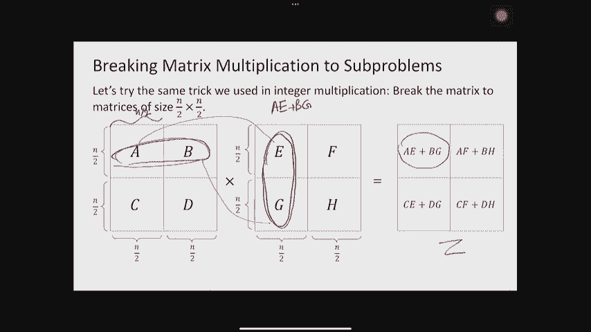
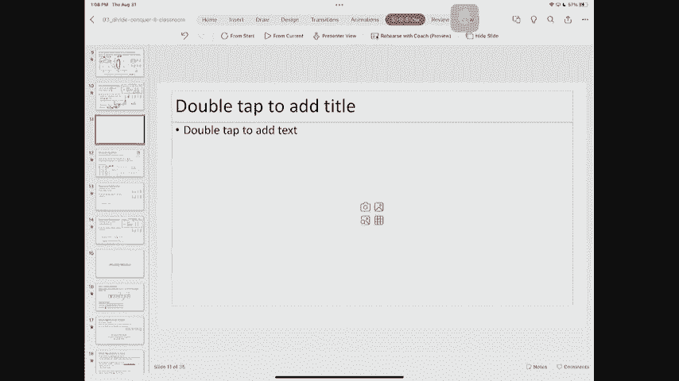
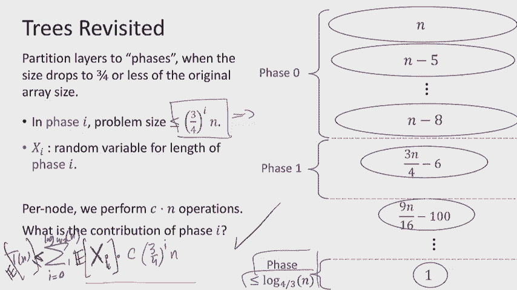

# 加州大学伯克利分校算法课程CS170 - P3：Lec3 Divide-and-Conquer (Part II) - 东风渐起UCAS - BV1o64y177K8

起作用了，是啊，是啊，好啦，三十秒后开始，所以如果你还站着，大家都好吗？参加的第一个讨论小组，啊，那是个好数字，怎么样很好很酷，告诉有GSI的人，你想，我开玩笑的，他们都很棒，其实明天还有更多，虽然。

所以说，如果你，你知道的，让上帝去那里，明天有个讨论会，好啦，所以让我们从一些公告开始，今天我得带着麦克风，所以希望我不会忘记和放弃它，好啦，现在是第三讲，我们将更多地讨论分而治之，但首先宣布。

所以看起来你们中的许多人已经去了讨论区，太棒了，但如果你觉得你还是，但要么你没去，或者你想，你知道的，再来一次，有一个节奏较慢的版本，我们明天有讨论会，他们称丢失的部分比两个小时长一点。

我们从你那里听说你真的想要一些其他的讨论部分，星期二晚上或星期三，相信我们，我们没有处理好，那是，你知道大学，但我们给你们安排了两个不同时间的讨论环节，所以希望如果你不能做任何一个，你可以让这些。

下周开始讨论第二部分，在我们要有一个部分之后，星期二3点到4点，星期四10点到11点，所以去那些，我们已经确保所有这些都在发生，基本上在周二到周四之间，以便类保持同步，好啦。

希望你们也知道我们有家庭作业，它已经出来了吗？希望你已经看过了，如果没有，一定要给它一个今天的样子，明天我们有个家庭作业聚会，通常也在星期一，但这次不行，因为今天是劳动节，而且通常是星期一到期。

但这次不行我们多给你一天时间，星期二是你，如果你明天想参加派对，星期一不行，劳工是为另一种政党保留的，短暂休息，上次我们测试了三分钟休息时间，我确实认为效果很好，对你们来说效果好吗，你喜欢吗，好啦。

好的，我们再来一次，上次我没时间了，所以我尽量不浪费时间，不过，我们走着瞧，我们还将在休息时间做一件事，我要请你，请帮忙关上大厅的门，这样我们就不用处理噪音了，在讲座结束时，来吧，来吧，请坐。

有很多座位，好啦，公告到此结束，那么我们完成了什么呢，上次我们说到分而治之，我们看到了她的subba整数乘法算法，我们看到它真的很酷很简单，把n打到2的次方，嗯，我们也看到了，你知道的。

我们对大O和大欧米茄做了一点修改，比你在61年看到的更正式，讨论也更正式地对待他们，然后我们继续讨论递归关系，我们看到了一个叫做主定理的东西，这并不是普遍适用的，但它很有用，所以我想提醒一下。

它看起来像什么，它说，看看任何复发关系，在那里我可以描述运行时，对不起，运行时是某个a乘以t的n/b加上，那么这意味着什么呢，A是我划分的子问题的数量，我对B的问题是我的问题正在缩小的因素。

所以n/b是子问题的大小，然后d或n到d，在我去解决子问题之前，我必须做的计算量，或者在我回来之后，你知道所有其他的东西，每一层都必须解释，所以主定理说，任何时候你看到像这样的复发关系，你只要把答案。

答案实际上取决于a和b和d的比较，如果A比A大，在最后一种情况下是B，然后运行时将被定义为日志的n，如果它更小，然后就是n到d，如果它完美地平衡了b等于d，是n的d乘以n的对数，我们证明了这一点。

它有点快，但重点是这一点在你的书中得到了证明，所以你应该读一下，但同时，如果你忘了怎么做，您应该能够使用树方法来帮助您，是呀，而不是好，所以有一个，本质上，这就是这个问题，提醒我你的名字阿里。

所以阿里想问的是，你为什么有一个大的，啊什么，如果我把像大塔塔，这里，我有口述吗，让我写得更仔细些，如果你想让泰特给泰特做记号，写这个的方式，而不是在这里有一个O，如果i有c乘以d。

c乘以n的d仍然相等，那么所有这些O都变成了中断，好啦，只是我想小心点，在那里放一个实际的常数，因为很多时候，当我使用这种递归关系时，这不是平等的问题，它是关于说n的t小于，或等于右手边，当然。

在这种情况下，你不能把纹身，因为我只是在描述一个上限，但如果你想知道它是紧的，正确的写法是这样，所以我们在最后几分钟给你看的另一件事，但它有点快，因为要记住大师定理，至少想想为什么这是有意义的。

有必要再想想，A和B对D是相互比较的，这对你的树的形状意味着什么，甚至是每一层的贡献量，当你把它写在右手边的一栏，所以当a比b大于d时，分支因子大，所以你的树很快就变胖了，本质上。

肥树或大比例的几何理论生长得非常快，所以所有的工作或大部分工作都是在最后一层完成的，所以我们只关心最后一层，它的大小和日志，另一方面，当a比d小得多或比b小得多时，这是一棵很细的树，很窄。

实际上是几何级数在缩小，所以基本上所有的工作都是在树的顶部完成的，这就是为什么我们支付第一层，n到d，当它们完全平衡时，我有一个圆柱形的东西，因为每一层的贡献都是一样的，每一层都为D贡献n，有一份日志。

所以说，这是一张要记住师父的照片，好啦，那么我们今天要做什么呢？根据主定理，在我们的脑海里，我们铭记于心，我们要证明，有两种很棒的新方法，嗯，使用分而治之和掌握定理的新方法实际上帮助我们。

在这两种情况下，简化事情并回答它们，这些是矩阵乘法和中位数选择，或者更普遍地说，选择问题，那么什么是矩阵运算或矩阵乘法，你知道的，在第一节课上，我们回到过去开始讨论整数乘法，回到小学。

我们问为什么停在那里，让我们来谈谈我们通常乘的更大的东西，和更大的结构，如矩阵，你学会了如何将它们相乘，我真的不知道你什么时候学会的，如何使它们相乘，可能在高中的时候，也许是中学，我猜最近的大学一年级。

但是高中，那种还好，是啊，是啊，是啊，是啊，好呀，好啦，你以前见过这个，但你知道，有时我们对矩阵如何相乘感到生疏，所以让我提醒你，如果我有两个矩阵，让我们简单一点，假设它们的大小一样，都像n乘以n。

当我把它们相乘时，我得到了，你知道x和y的乘法，得到另一个矩阵z，我如何很好地计算z，z的每个元素，假设这是第I行的元素，列j是点积，在x的行向量i和y的列向量j之间，我对z的每个元素一个接一个地。

我计算一个点积，这听起来耳熟吗，你还记得这个吗，所以我想知道的第一件事是，我在这个东西上实际要花多少计算，让我在这里做一点说明，每次我们谈论问题或计算的复杂性，我们有这个参数n，有一个问题。

最后一次喜欢是n总是位数或其他什么，所以实际上当我们讨论整数时，问题大小n确实是位数，我们认为这是有道理的，因为我们想把非常大的整数相乘，当我们谈论矩阵时，尤其是今天。

我们思考的方式不是每个坐标中的位数，但实际上是关于这些坐标的数量，维数所以n是矩阵的大小，它的行数和列数，所以这意味着，在你的头脑中，你应该考虑巨大的矩阵，但是每一个元素都很简单，好像是五十分。

可能是3个2到64位的整数，它们很容易繁殖，因为它们就像数字不是无穷大，它只需要一个常数的时间来乘任何两个矩阵的坐标，所以这是一个轻微的视角转变，为什么这实际上是一种合理的思考方式，我不打算写任何东西。

但我想知道矩阵有多大可能会有帮助，我们在现实生活中实际上成倍增长，通常，实际的元素也很小，三个二位什么的，但我问了我们的一个GI，他也是我的博士生，和语言模型一起工作，你知道的，乍得GPT。

我打赌你一定玩得很开心，你知道的，让它做一些事情，不是家庭作业问题，你当然知道，有这些东西叫变形金刚，它们实际上是矩阵乘法，我让他告诉我典型的尺寸，他说得很好，这种矩阵的典型大小，会有一些行数和列数。

从二到十二到二到十三的，所以当你想到这个，如果，我在考虑赚两到四十块钱，二对三，六次手术，所以如果我在CPU上运行这个，打这个电话需要几分钟，每次你在，乍得GPT大约有数百到数千个这样的正在运行。

所以如果我们用老式的CPU来做这个，天真地做，做任何机器学习的东西都是不可行的，查德GPT你们正在使用的任何东西，你今天要展示的实际上不是算法，那是在幕后运行，让他们更快，但我觉得很高兴能欣赏。

这些矩阵有多大，为什么我们真的关心矩阵的大小，而不是矩阵中的每一个元素，所以这是我的一点，你不需要知道这些东西，这只是为了好玩，如果你想在实践中知道大矩阵，在机器学习中使用它们。

但这就把我们带到了主要问题上，我们在这节课的前半部分，也就是说，如果我有一个具有巨大维度的大矩阵，那么计算矩阵乘法需要多长时间，花六十秒和你的邻居谈谈，帮我回答这两个问题。

第一个是我告诉过你矩阵的每个元素，我得做点积，在一个大小为n的向量和另一个大小为n的向量之间，那需要多少时间？一旦你明白了，把两个大小为n的矩阵乘以n需要多少时间，好啦，让我们花六十秒，好啦，再过十秒。

好了，谁准备好回答第一个问题了？有人能自愿，点积是多少，为什么因为我有两个向量，每次我把两个整数相乘，有很多这样的东西，所以他们中的每一个都需要一个操作，然后我有N个，我必须把它们加起来，那通常是好的。

这就是每个人都得到的好吗，好啦，这边的人，你能告诉我做矩阵乘法需要多少时间吗？完美，所以我们说每个位置ij都是点积，这些位置有n的平方，他们每个人都拿N，所以有一个n的立方，手术的总数是每个人得到的。

整数乘法，你知道的，中学的好方式，整数乘法，小学的方法是n的平方，矩阵乘法是n的立方，所以我们要问同样的问题，也就是说，我们能比n的立方做得更好吗，我们真的要离开卡雷苏巴，你知道并说，嗯。

矩阵看起来很像整数，就好像我把他们的数字，像一些，你知道的，坐标，我还能用同样的想法吗，我可以把问题分成小块吗？尤其是两个以上的小块，这看起来像什么，如果我考虑一个n乘n的矩阵。

我可以把每个矩阵分成两层，其实呢，每个维度都是n/2，如果我想知道矩阵z，也就是这两个的乘法将被表示为，就好像每一个都是一个元素，所以我做了第一行和第一列的乘法，所以a乘以e，B乘以G。

然后我把它们加在一起，就像点积，好啦，这就是如何将矩阵分解成更小的矩阵，然后分解两个巨大矩阵的乘法，到现在较小矩阵的乘法，我有多少子问题，如果我这么做，你能告诉我，仔细看看。

n除以2乘以n除以2有多少次乘法，这是正确的，我有八个，因为每一个乘法，就像每次我做一个乘以e b乘以g乘以f，那是乘法，加的还可以，你知道的，不是那样的，耗时的乘法是那些耗时的乘法。

每个我都有问题子问题，一个子问题，两个子问题，三个，四五六七八，我们去看看会发生什么事，如果我想在我的递归关系中使用这个，在每一层，现在我打破了一个问题，它的大小是n到8，n大于2的问题。

我需要做多少工作才能做到这一点，打破它们，然后把它们重新组合在一起，所以我要做的工作，我必须提取一个b c d对吗，这些提取通常很简单，我是说主要是重新分配指针，但即使你不想重新分配，你可以把你的整个。

分了吧，在最坏的情况下复制它仍然是n的平方，其实呢，好多了，我要做的其他事情是，一旦我得到n除以两次乘法，我得在这里把它们加起来，我就像把它们加起来，如果我加了一些，你知道的，n阶矩阵，有n个平方。

整数和位数，所以它又减去了n的平方，我需要把它们放在一起，再把它们挨着复制一次，最坏的情况是n的平方，很多这样的事情实际上我们可以做得更快，但关键是我们每层要做的计算总量，在我们分解问题之前每个节点。

把它装回去，n的平方，那么你能告诉我这样一个问题的递归关系是什么吗，如果我把n中的t写成一些较小的问题，谁能告诉我，等于八，因为子问题的数量，大小n大于2的每个子问题，加上每一层n的平方功。

所以我现在要求你们记住主定理是什么样子的，告诉我我落在主定理的哪个案例号上，1比b大d是a，等于b和d，或更小，所以什么是A就是A，什么是B，所以a在d中大于b，也就是四个，所以我在这里。

我得到的是n的t是n的log，到…的日志，在Kattuba之前我们尝试过的幼稚的事情就是错的，对Kattuba来说是正确的，我们把它分成四个问题，它现在对我们也没有帮助，我们把它分成八个问题。

这对我们没有帮助，它还在立方体里，所以现在不需要太多的独创性就能弄清楚，这里的关键应该是减少子问题的数量，Karatsuba从四个到三个右，我们有八个子问题，少于八点就好了，我记得是六十九，是这样吗。

我不知道，有时在六十年代，他本质上想做唐宁街所做的事，其实他其实，他是改进整数乘法的算法之一，也是在我上次的演讲幻灯片里，但他也做了矩阵乘法，他想做什么，他从8个子问题变成了不到8个子问题，唯一的挑战。

这和整数乘法的唯一区别，如果我把两个整数乘以b，那等于b乘以a，但是矩阵不交换，矩阵中的a乘以b与b乘以a不一样，所以这是这里唯一的微妙之处，但老实说，他想出了一些把戏，我无法解释他是怎么想出来的。

然后他想出了一种表示矩阵的方法，我唯一能向你证明有效的方法就是一个接一个地去，用蛮力，但这个故事的寓意是，他从八个子问题变成了七个子问题，在你开始抓狂之前，你不需要记住这个，我不知道，我不得不复制它。

事实上，我在复制它的时候犯了一个错误，但让我们确保我们知道怎么做，这是正确的，让我们试试这个，因为这样更容易，一加二，那么q1加q2等于，有一个h和另一个h相互抵消，如果我把它们加起来，我得到了AF。

另外，我得到了一个B H正确，这应该正是我们在这里的AF，加b，所以你能做的，如果你想回去，确保我为Strawson的分解写的东西实际上是正确的，但你不需要记住它，我找不到他是怎么想出这个的轶事。

但如果你今天想出这个，你可以用蛮力，没那么难，你知道只有八件事，嗯，事实上，如果你想做n/2乘n/2，n/2 n/2分解，你不能在七个子问题下面，这是你能做的最好的了，这都是说你已经学会了如何。

你可以从整数乘法中得到一些问题，如果你掌握了这一点，你实际上可以做同样的把戏，只是矩阵乘法有点难，对此有什么问题吗，所以如果我没听错的话，你想知道为什么我们有八个子问题，所以如果我已经把它除以n/2。

就像如果我承诺做这种类型的矩阵，像n/2这样的矩阵分解，子问题是什么，你可以假设你有一个二乘二的矩阵，于是一个又解决了问题，把一行乘以一列，你做这件事的方式是元素明智的，把a e和dng相乘。

因为这是一个二乘二的矩阵，每个坐标，答案的每个元素都是两个乘法的和，总共有四个，每个都需要两个，那是八，没关系的，如果它等于四，这不是一个单一的元素，好啦。

我去拿块白板写点东西，当我写A和B的时候，我想我写了一个B C D，这个本身有很多行，哎呦，你看得清楚吗，你也可以看到，好啦，你知道，我再补充一句。

我该怎么做，给我一秒钟，我想我可以加一张幻灯片。

当我想到AB CD，这并不意味着A是一个单一的元素，意思是它有很多行和很多列，实际上n/2和n/2，好啦，只是当我把这个相乘的时候，我可以考虑得到的矩阵，同时也有四块，他们每一个人，大于2乘n大于2。

所以这可能是四乘四，它只是表示一个二乘二的矩阵，更清楚的是我们把这些矩阵，现在这些仍然是矩阵，它们不再是数字了，好啦，酷，所以我们要做的是看看，既然您已经将子问题的数量从八个减少到七个，言下之意是什么。

我有七个子问题，每次n除以2最多n的平方运算数，因为它仍然是一样的，只是优点和缺点，嗯，这给我的递归关系是，你能告诉我什么，一人志愿，可能从这个区域，完美我有七个问题，它们的大小都是n的2+2。

所以现在这是我的递归关系，我有大师定理，我仍然处于同样的环境下，因为7还是比2大，到二的幂，所以a比b大，到D，所以我的运行时是n到7的log，基数是2，我相信这大概是n的2。8次方，大概七点九，七九。

差不多吧，这就是如何打败潜艇，立方上限，随着时间的推移变得稍微好一点，这改进了矩阵乘法，这是理论家们喜欢研究的一个领域，尽管现在的进步是第四或第五位，所以他们可能对你来说并不重要，但也许对理论家来说。

有关系，但我想最近就像过去有一个更新，像十年，我想我们大概是2 3 4左右所以我们可以做得更好，我不打算用问题的细节来烦你，大问题，所以我们不会瘫痪任何东西，你叫什么名字？我常说。

这看起来像是一种令人尴尬的瘫痪类型的手术，至少这是一个关键词，你的一些系统教授会告诉你，这是千真万确的，你知道的，当我说我们实际上并没有使用这些算法，对于一些巨大的矩阵，原因是他们在某些方面并不出色。

一是在实践中，我们关心像缓存丢失这样的事情，他们不太擅长这个，另一个是，嗯，当我们优化其他算法时，它们更容易并行化，其实呢，那些巨大的矩阵，我告诉过你机器学习，它们甚至不在CPU上操作。

它们是在GPU中操作的，在那里我们可以进行并行计算，你能在练习中做得比在立方中快得多吗，因为你完全麻痹了某些东西，但就手术次数而言，就像你说话的时候，我们不是在谈论现在花的时间，以毫秒为单位。

你说的是手术的数量，谢谢你在这里的问题，是啊，是啊，是啊，是啊，你叫什么名字？沙龙，好啦，那么为什么，额外操作的数量通常是平方，我有一件事，但让我们回到它，好啦，这些是我计算的一些额外的操作。

让我们确保我们在这里理解他们，那么额外的操作是什么呢，我们把问题分成更小的问题，那是额外的权利，因为就像想象一张B CD，它们都是n个平方矩阵对吧，所以如果我再把它们写下来。

大多数时候我要花的时间是n的平方乘以8，一旦我有了乘法，我得把它们加起来，现在呢，我有两个矩阵，每一个n的平方乘以n，我再把它们加起来，把它们加起来，有n个平方元素，每一个都是两个整数的加法。

所以只需要n的平方，当我试图现在，再把巨大的矩阵追加到一起，大约是n的平方，我要复制的位置数，所以这就是为什么所有这些加在一起得到n的平方，这些是额外操作的数量，这是一个矩阵乘法，甜蜜而简单。

如此开创性，就像卡塔斯，接下来我们要谈谈选择，看起来很不一样，在那之前，你只有三分钟的休息时间，所以让我们看看现在是什么时候，我们有一个14，我们1点17分回来，请帮我把门关上，因为我不会走到门口。

谢谢你，好啦，让我们让我们回来，嗯，我先说清楚一件事，因为现在有两个人问这个问题，我想这和谢丽尔的问题很相似，所以让我让我多一点，再强调一点，所以你们问，当我看着Q1到Q7，感觉有很多乘法，怎么才七个。

而且有点，我在想，A是一个矩阵，F减去h又是一个矩阵，正负，它们是平方的，我们不担心他们，如果我把它写成af减去a h，你说的对，应该是两次乘法，因为我是两倍，但我不会这么写，我先做f减去h。

那是n的平方，我扔掉的，它只是一个乘法，所以代表权很重要，就像你本可以慢得多，但我们当然是以聪明的方式做的，先做所有你能做的加减法，然后再做乘法，好吧，这就是为什么只有7，现在很酷。

让我们进入这节课有趣的部分，我是说很有趣，但是这节课的一个或更多有趣的部分，K选择，那么什么是K选择，不再是算术的问题了，它是关于数组的，我有一个大小为n的数组，它有一堆不一定排序的整数。

我想要的是找到这个数组中最小的数字，在1到n之间的某物，所以选择一本质上是找到这个数组的最小值，所以第一个是这个数组中选择一个的最小值，四是找第四个最小的，所以如果我按顺序，一个是第一个最小的。

然后三个，然后四个，然后五个，所以五个元素，五是这个数组的第四小元素，再选八个，我去一井一二三四五六七八，数组中有八个元素，选择十四是其中最大的，十四号元素是最大的，所以这是选择，这就是你想做的。

精选的特殊情况是，如果要查找最小值或最大值，你看看就知道了，选择一个，选择另一个SN，非常重要，一个是中位数，如果你想找到中间点，所以这是一个序曲，和以前一样，我们将忽略地板上的天花板。

因为事情会解决的，所以这是选择任何关于，选择为函数，那么什么是计算的简单算法，所有这些选择，想象一下我想计算，选择s任意k，你能考虑一个n，log，n的算法吗，好啦，那是一个没有说话的人，但你，完美。

你叫什么名字？迈克尔，迈克尔说，我们只是排序数组，我知道如何在N登录中排序，然后只要给出正确的元素，就像矩阵中的kat元素，有一点技术性，这并不重要，只是这样，你知道的，因为矩阵是零索引的。

k是一二三到n，你只需要从笼子里扣一个，所以你实际上指向了正确的，所以我们知道如何在n登录中做到这一点，有人可能会觉得这很棒并登录，但我们对此并不满意，在剩下的时间里，我们将问一个常见的问题。

我们能做得更好吗，特别是我们能做n，所以你为什么要问，让我们看看你能不能想出一些简单的，特殊的K选择算法，K，假设我想计算，合二为一，你能想出一个O的N算法吗，这个问题，如果你能举起你的手。

自愿成为班上的一员，完美，你叫什么名字？只需遍历数组并选择最小的一个，如果你想操作这个，如何遍历数组，你只有一个for循环，你保存在仓库里，到目前为止你见过的最小的，如果你看到比你储存的东西大的东西。

你现在储存的最小的，好极了，这通常是因为您现在只遍历数组一次，什么，如果要计算，请选择第二个，你也能想一个off n算法吗，对我们来说太完美了，嗯，不是储存一个商店而是储存两件东西，最小的和第二小的。

并不断更新，有没有其他人自愿，迈克尔，穿过右边两次，我喜欢，执行选择，或者你知道我只是喜欢重复使用算法，把选中的检查一遍，求最小值，把它踢出去，然后再求最小值，因为他们每个人都离开了N，然后我做两次。

因为我做了两次，它变得关闭n虽然如此，如果我做了这件事，Michael建议我在Opha中选择Sn而不是2，否，我不能的原因，你在摇头，我得做两次以上，或者即使我去了一个建议。

我需要n/两个变量来保持更新，这将使它成为一个n的平方算法，其实呢，即使这些数组的大小正在缩小，仍然足够大，好啦，所以我们看到了一个n平方的算法，我们看到了一个n log n算法。

但是因为当k很小的时候，有一个关闭n的希望，这就是你射击的目的，我们想要一个n，你可以证明你不能做得比这更好，我们想知道，尤其是中位数，似乎当k在中间的某个地方，似乎很难想出选择。

所以我们可以选择中间值和关闭，或任何其他K，所以这就是你的要求，这是一个分而治之的讲座，所以你已经在想，必须分而治之，那么我将如何划分和征服数组，它们看起来也有点像整数，从某种意义上说。

我想把他们分成一半，不幸的是，真的很难知道，分一半的正确方法是什么，当我关心像排序这样的元素的顺序时，如果我有一个排序的订单，我会把它分成数组大小的中间。

所以你如何划分和征服数组通常是用一种叫做枢轴的东西，有多少人看过快速排序，你还记得那个叫枢轴的东西吗，你会用它来把东西分开，完全一样，这是一个支点，这里的重点是它将把一个数组分成三个部分，剩下的那块。

右，中间是sv，那是什么，它本质上说，sl把所有比我的枢轴小的小元素，Sr把所有比我的枢轴大的元素，而SV只是支点本身，以及它的任何其他副本，所以如果我再过一遍。

我实际上可以通过遍历数组来完成这种类型的枢轴操作，一次，我该怎么做，我就像启动三个数组，好吧，我一个接一个地检查，所以我有两个是，哦对不起，我给你的支点是什么，假设枢轴是五，好啦，所以我走了。

一个接一个，二小于五，所以我把它放在左手边，接下来是3-6-3-6比较大，所以我把它放下，所以三六在这里，我继续到五个，五和我的支点完全一样，即使它在相同的，不在同一地点，它的价值是一样的。

所以我把它放在sv里，以此类推，21，它比较大，十一比较大，哇塞，然后再给我五块，这正是支点，然后我得到一个四，然后我得到一个，好啦，所以只要穿过数组，只需要全部n，对呀，我将这个数组拆分为SL。

Sr和Sv，关于SRSV的定义有什么问题吗，或者你成了孤儿，所以这是一个简单的操作，我总是可以采取一个支点和分裂阵列，这是我亲手做的，关键是如果我把这个大数组分成这些小的部分。

这些较小的部分将使我更容易进行计算，我如何让它更容易，因为，假设我想找到，K和K甚至比我的SL还小，这意味着我有很多整数小于我的枢轴，如果我在找K at元素，刚好k比sl小，然后我真的要求选择SL和K。

因为k元素必须在sl中，这有意义吗SR和排序，但它们仍然告诉我们K元素会落到哪里，所以如果k小于我的sl的长度，我只是去SL的子问题，刚好比sl的长度大，但小于sl和sv的总和。

那就意味着它掉在中间和中间，所有的值都是一样的，它们正是枢轴的价值，所以这甚至不是一个子问题，我只需返回枢轴值，如果恰好k比它们加起来都大，然后我的k元素落在这里的某个地方，所以我将通过查看SR来递归。

问题是现在我必须把k的值，因为我去掉了很多比k小的元素，所以要做正确的选择，我将不得不移除，不像SL的长度和SR的长度从我的K，那是递归，为什么这个算法是正确的，应该是有道理的，但如果你有问题。

现在是问的好时机，它是负sl和负sv，这是正确的，我是说减去SR吗，啊，有一个加号，是呀，是呀，对不起没有，这是一个负号，是呀，谢谢你接住了，好啦，谢谢你的任何其他问题或错误，迈克尔，我喜欢枢轴吗。

那是一百万美元，嗯，很好的问题，我没有一百万美元给你，我们将在这里讨论另一个问题，好吧，让我们来回答迈克尔的问题，如何选择好支点，其实呢，你为什么想知道枢轴，因为当我现在写递归关系时，我在递归l或sr。

SL和SR的大小在很大程度上取决于枢轴的选择，那么你如何选择支点才是我们真正应该问的问题，在很高的水平上，你希望这个支点是好的，做一个好人意味着什么呢？如果我看这里，我有点想，那么发生了什么。

有3例复发，我们之前写的三个案例，嗯，这里发生了什么事？我看这里有好处，必须是负的，嗯，现在的情况是，理想情况下，我希望SL的长度和SR的长度都很小，因为它越小，较小的是子问题，想象一下。

没有数字会重复，所以枢轴是独一无二的，从某种意义上说，当我选择它的时候，所以sl和sr几乎把问题分成两个相等的部分，那将是理想的，因为这样它们的最大值就会很小，这就是我们真正要找的。

当我们想到一个好的支点，好的支点是最大可能的子问题尽可能小，所以考虑到这一点，花六十秒和你的邻居谈谈，回答这个问题，我有一堆可能的支点，假设数组的最小元素，嗯，不是最大的，但是之前那个，最大的元素。

n除以4，N/2，是中位数，三四个，哪一个是最糟糕的，让我们从最差的到最好的来排序，好啦，六十秒，再过十秒，好啦，最糟糕的是什么，好啦，更协调一二三最差一，最小的就是最坏的，第二糟糕的是什么？二和四。

是呀，他们都一样坏或一样好，在那之后，我想只剩下一个了，好啦，所以你越接近中间点，变得越好，是呀，嗯哦嗯，因为其中一个，好像只有一点点差，如果我拿第一个，从字面上看，我有所有的n减去一个左边。

如果我取n减去1，我得到1，然后n减去2，所以就差那么一点点，嗯哼，你叫什么名字？嗨，我很好，这里说一个，为什么不三个解决问题，因为我有三个数组，这就是你所担心的吧，我有三个数组，但在其中一种情况下。

我不必递归，因为如果我知道我在两者之间，像这样的两个长度，在中间的情况下，我知道我必须等于枢轴，SV中的所有东西都是相同的值，这就是为什么我只返回值，即使我有三个数组，其中只有两个需要，就像递归。

打电话，中间那个不好，好啦，但这个故事的寓意是，我们想要支点，更接近中间的，理想情况下，我想要中位数，让我们假设我有中位数，让我们假装我有支点，那是中位数，我已经听到你们中的一些人在这里咯咯地笑了。

你说的对，我好像在循环，想以聪明的方式找到中间值，我刚告诉你，让我们想象一下你有它，我知道我明白了，这是一个思想练习，好啦，只是为了让我们知道，如果我被告知理想的事情，还想做复发，这会是什么样子。

所以这看起来是这样的，现在如果我有中位数，两个解题的长度小于n/2，我只在其中一个中递归，记住我有两个子问题，但我实际上只去了其中一个，视情况而定，我不必同时计算，所以有A，这里只有一个，好啦。

我走下一根树枝，走下那根树枝，我不得不把阵列分成三块，如果你还记得，我只是通过经历它来做到这一点，它在，这就是递推关系，如果给我一个理想的支点，对此有什么问题吗，为什么这是正确的，我们把它写下来。

好的很好，这很清楚，所以说，如果我有这种复发关系，然后我问，什么是运行时，我可以看看大师定理，这也是一种情况，这是非常直观的思考，我可以考虑一个B和D，但从另一个角度来看，我把问题一分为二。

只拿其中一个，这是一棵很细的树，实际上正在缩小和问题规模的那个，所以我只付树的顶部，但如果你想看一个B和D，我有一个，B是二，D是一，A比B小于D，我在第一种情况下下降，就是那个细树案。

我有一个N一次完美，如果我有理想的支点，我有一个O of N算法，大家都很高兴，现在很好，我没有理想的支点，我同意，但也许有些好的支点只是足够好，所以让我们放松一下，我不明白中间值。

但也许我在n/4和3/4之间的任何地方都很快乐，好啦，中间的一半，中间，百分之五十，我想声称这些是很好的支点，他们基本上给了你同样的孤儿，让我说，我们仍然不知道如何挑选他们，我们不知道。

但这似乎比选择确切的媒体要轻松得多，还有这么多这样的数字，希望我们能找到他们中的一个，原因是如果我在中间选了什么，接下来会发生的是，sl和sr的最大长度是多少，你能给我上限吗？三岁及四岁以上，完全正确。

原因是这两个中的每一个都必须大于n/4，因为每一个都足够大，另一个不可能很大，因此，它们的大小都必须小于3，大于4，所以不完全是n/2，但它还是很小，如果我真的找到了这样一个支点。

让我们看看我的递归算法的运行时是什么，所以这次我不递归向下一棵树，这是一个n/2的节点，但最多还是3 n/4，我又一次只从这棵树的一根树枝上下来，为了做到这一点，我还在付钱，假设我也能很快找到支点。

那么这个的运行时是什么呢，我可以去主定理，或者我可以用直觉，直觉是有用的再发展，我在缩小问题的大小，我的b是4比3，我的A是1，我只有一个子问题，我一直在缩小，它是一棵树，所有的工作都是在顶部完成的。

有多少工作要做，嗯，N是我所做的工作量，但是如果你想写一个B，一个B和D，你仍然会看到我们在第一个案例中，我们有关闭和运行时，关于这个的问题，我们还没有回答迈克尔的问题，我们如何找到这样的支点。

我们知道什么是好的支点，我们知道什么是理想的支点，但是我们如何在n/4和3之间找到一个支点，N超过第四位，好的，好的，我其实还多了一张幻灯片，我完全忘了，让我用两种不同的方法来证明这一点。

因为它对我以后有帮助，我利用主定理，但是另一种证明这一点的方法是用树法，我只想把它带回来，好让你们记住上次的树形方法，本质上你说的是用三三的方法很好的支点，如果我每次都有一个好的支点，我除以4或3。

所以下一个节点小于3，n除以4，每个节点我在c乘以n的时候做了一些运算，这是我的角，我想看看我每层所做的总计算，所以每一层，我在做一些节点，乘以该层的所有大小，因为层的大小将是，小于。

三四的i乘以n的次方，因为每次我都会变小四分之三，那么一个层的总贡献仍然是c乘以n，乘以3 4的y的次方作为层的节点，我们都同意这一点，这是我写的主定理证明，因此，所做的总工作量是多少。

只是这些事情的总和，所以C3的和，I，I，从零开始，这里的深度顶多是原木，三人以上的基数，我装不下四比三，我把CNN拿出来，我还有太阳，这是一个几何级数，随着R的缩小，所以它只是从一个。

这就是我下车的原因，所以如果你不想使用主定理，你可以在这里用一棵树，对此有什么问题吗，我会再回到这棵树，所以我发现现在考虑树比考虑主定理要好，这是在第二讲，我叫你回去看看，但让我提醒你们几何级数。

我在看这个的时候，如果r大于1，这正在扩大，我们说它会关闭，Rn，如果r小于1，这个在缩小，它收缩得如此之快，以至于它将是一个，如果r正好是1，它将是这个的大小，它通常是几何级数。

就像大师定理的婴儿版本，我可能失踪了，一个这样，完美，是啊，是啊，那真是个好直觉，所以你的意思是三四看起来并不特别，感觉好像，只要你把它缩小一些小于1的常数，或者你把它乘以一个小于1的常数。

事情会得到中位数，正好是这里的一半，我给三四，你说得太对了，你本可以用9比10，一切都不会改变，这是一个伟大的直觉，好啦，所以说，其实呢，大多数枢轴都很神奇，只是真正的角落的事情才是问题所在。

所以考虑到这一点，我们如何选择一个好的支点，有两个想法，一种方法就是随便挑，根据你刚才给我们的直觉，大多数支点都很好，十有八九是好的，或者百分之五十是好的，所以我们随便挑一个，希望我们能找到好的支点。

一切都会迎刃而解，另一个是花费大量的脑力分析，想办法，找到一个好的支点，这两个都行得通，我给你一个简单的版本，即你随机选择一些东西，所以这是一个随机算法，我们会给你第二个的笔记，这是一个很有趣的。

但更难分析的算法，在实践中，随机版本做得更好，那么有一个随机算法意味着什么，通常考虑最坏情况下的算法，从这个意义上说，有一个对手选择了最坏的例子，一旦我发布了我的算法，但是随机算法是特殊的。

从某种意义上说，我可以考虑公开我的算法描述，我把它写下来，然后对手查看算法并选择一个实例，比如选择一个看起来很难的数组，但对手看不到的，我其实有一堆，你知道的，我扔的骰子和随机的东西。

对手看不到他们的随机化，随机化发生在选择实例之后，所以因为存在随机性，我对算法运行时的看法，算法的运行时也是一个随机变量，因此我感兴趣的是期望随机变量是小的，这意味着我们想要很小的预期运行时。

运行时t为n，我希望对它的期望很小，从某种意义上说，我们所说的是，这个数量在所有可能的运行时都是平均的，作为问题大小的函数，而且这个期望应该很小，如果我们很有可能得到的问题只是较小的规模。

你知道更容易的问题更容易，子问题，所以这就是我们在数学上实际看到的，我们怎么做，让我们回到树的方法，因为这是一种很有帮助的思考方式，所以如果每次我们有一个好的支点，我们把东西缩小3比4，但在现实中。

有时我们会得到一个很好的支点，东西缩小了三比四，有时候事情不是很顺利，也许第一次当我选择一个支点，我挑了一些非常接近拐角处的东西，所以并不是每一轮都有结果，但是树方法仍然有用。

我们让它变得有用的方法是不要考虑这棵树的层次，我们考虑这棵树的阶段，有多种方式来思考这一点，但是一种方法是把阶段看作，当你得到一个好的支点，所以当你把它除以4或3，或者当你的问题规模确实缩小了三比四。

那么这看起来像什么，所以也许我有一个N，一开始我运气不好，我的我的嗯，问题不是很好，但后来我打了一个三N超过四，像N减8一样缩小了，如果我把它乘以3/4会是这样的，也许下次我超级幸运的时候。

我第一次选择支点，我真的会立刻收缩，乘以3除以4，以此类推，好的，现在我们考虑的是阶段而不是层，关键是每次你换脸，你肯定比4瘦了3倍，所以因为现在的阶段就像上一个树中的层一样，基本上在第一阶段，我会的。

我还在按零给东西编号，在第一阶段，节点，每个问题，该阶段中的每个子问题仍然有大小，最多3/4的i乘以n的次方，因为我在缩小，每次我切换相位，这有道理吗，关于我的说法有什么问题吗，就像尺寸增加一样。

你怎么知道一开始，其实我也不知道，所以说，丹妮尔问的是，就是这样，随着时间的推移，阶段变得越来越短，不这个，这只是一开始我运气不好的一个例子，然后我很幸运，你知道这里，也许我又倒霉了，这只是一个例子。

所以有些阶段在开始的时候很大，中间小，其实不重要，每个人都对第一阶段的说法感到高兴，问题的大小是3-4的i次方，你们已经成为职业选手了，好啦，所以说，但是这个阶段的长度是多少，让我们说长度。

我是说包括的节点数，那就是随机变量，因为我只切换相位，当我击中一个好的支点，所以实际上这个xi本身，另一种思考方式是审判的数量，它让我找到了一个很好的支点，所以现在，让我们看看我是否想知道贡献是什么。

总树，在我以前计算每个节点之前，我如何计算得很好，现在我得先计算一下，我该怎么做，我说一个相x i相i中最多有xi节点，每个节点都有这么大，所以这些节点的贡献是c乘以3-4，为了我的力量。

这就是第一阶段的贡献，我现在最多要做的是从零阶段到最大阶段，因为每一个阶段都在不断下降，最大相数仍然是四乘三的对数，所以这是我的n的t，这有意义吗，如果我真的回到五张幻灯片前，我有这棵树。

有一件事改变了，那是什么，有一件事改变了，我们加了你的名字，克里斯·克里斯说，唯一改变的实际上是这个x i，在数学上没有什么变化，是啊，是啊，这东西也没变，但让我强调一下，只是脸的长度，事实上。

如果我在找n的t的期望值，按期望线性，这意味着如果你有任何线性函数，你可以把期望移进去，这个和是一个线性函数，我真的在要求对x i的期望，如果x i的期望值恰好是一个常数，我做完了。

因为我知道剩下的会经常加起来，看看x i的期望值是多少，预期长度是多少，任何值的期望，是得到它的特定值的概率之和，乘以那个值，所以我可以写x i，因为概率是得到x i倍的概率的期望，实际上得到它。

这只是期望值的一个定义，所以我真正要做的就是计算这个概率，比如x i是s的概率是多少，在这里我想让你回忆一件事，那就是，习是我们击中一个好支点的次数，一个好的支点是在中间的支点。

n除以4到3之间的百分之五十，n/1/4，所以我想请你们讨论一下，但在那之前，让我们看看还有什么问题，这里好像有个问题，有两种方法来定义阶段，我把它定义为，每当你在那一轮中击中一个好的支点。

所以不是每次你低于3/4的时候，但只要你选择了一个好的支点，所以有了这个定义，你永远不会跳过一个阶段，但是会有不同的定义，它仍然是正确的，只是，从技术上来说，这更容易一点，另一个问题。

有什么不同的方法来解决这个问题吗？当然有一种不同的方法来解决这个问题，也许你想说你只是用很低的质量选择了糟糕的例子，但是因为我们只剩下四分钟了，让我们让你们真正讨论这一点，x i是s的概率是多少。

期望是多少，花三十秒回答第一个问题，我来回答第二个问题，和你的邻居谈谈，好啦，我们回来吧，你对第一个问题的答案是什么？x i是s的概率是多少，百分之五十取决于，I，百分之五十的眼睛是正确的。

因为这意味着你必须写s时间才能得到一个，这意味着减去一次你的支点不好，这种情况发生的概率是i-1的一半，上次你有一个很好的支点，所以它是i的一半次方，很好，那么这个值的期望值是多少。

你必须把它加2乘以s的次方，从一到无限，我叫你回家再做，你就会明白这是真的，我们在时间的尽头，但希望你所记得的，我会让约翰提醒你，因为x是2，一切都会好起来的，你下次经常见到你，你好吗，你好吗。

你能给我解释一下。

