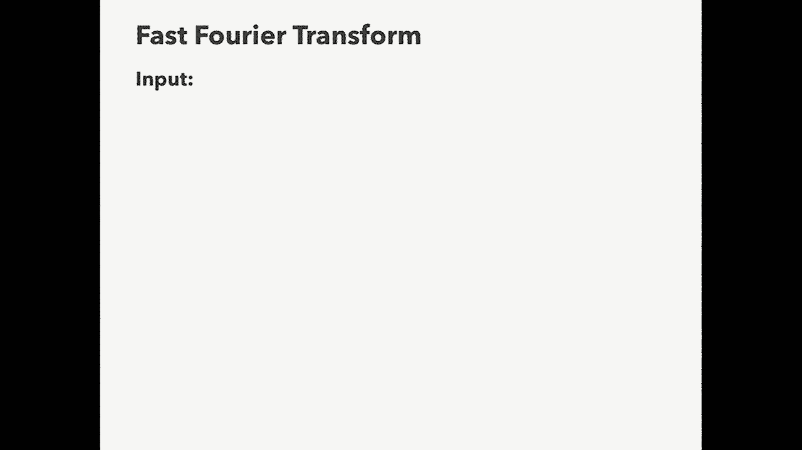

# 加州大学伯克利分校算法课程CS170 - P4：Lec4 Fast Fourier Transform (Part I) - 东风渐起UCAS - BV1o64y177K8

好啦，呃，我想现在是12点40分，所以让我们开始吧，呃，后面的人都能听到我说话吗，我就当你答应了，酷，今天的第四讲，今天讲座的主题是多项式乘法，我看看能不能把音量调小一点，我不知道该怎么做，我会说的。

我会轻声说话，我猜，它在这里，让我们试试，这个更好，是呀，多项式乘法讲座，所以嗯是的，你们平时的教官呢，尼卡拥抱俱乐部，拥抱教授俱乐部，她现在正在世界各地飞来飞去，在加拿大发表演讲，波士顿等。

所以在这周，基本上只有我会讲课，然后我就会消失，你大概半个学期都见不到我了，然后我会在十月的某个时候再开始讲课，所以在演讲之前，让我们先做一些管理工作，我希望每个人都有一个愉快的劳动节。

作业一今天晚上交，因为劳动节你得到了一天的延期，还有家庭作业，我想它明天就会熄灭，也许，下一次到期，星期一，我们增加了一些讨论会，所以你星期二在这里看到他们，星期四，星期四还有一个。

然后还有一些关于办公时间的更新，就像每周的帖子，我想在Ed Stem上涵盖了这些更新，所以你可以在那里看到他们，现在办公时间会排长队，你可以在办公时间进入，希望这能让办公时间更容易管理。

然后还有一个新的特殊系统，那是为家庭作业派对准备的，你可以在每周的STEM POST上看到，关于这些有什么问题吗，今天的讲座，嗯，前两节课我们看到了如何，我们花了一些时间研究如何将数字相乘。

我们很快就看到了，嗯，你知道的，乘数的基本算法，然后我们看到你可以用一种叫做cartsuit算法的东西来改进这个算法，上一节课我们看到了如何对矩阵乘法做同样的事情，所以我们看到了一个基本的算法。

然后我们看到有一个有点复杂的算法改进了它，称为斯特拉辛算法，今天我们又要做同样的事情，但这次对于单变量多项式，所以我想提醒你，一元多项式是什么样子的，嗯，它是一个函数p，它将接受一个单一的变量。

所以它是一种变体，称为x的变量，它会输出一些以x为单位的多项式，比如x的平方，例如，如果你把多项式画在数字线上，你可能会得到这样的东西，多项式q的另一个例子可能是半加半x，所以我们在这节课中的多项式。

它们既有实数系数又有整数系数，这个可能是你画的时候，看起来是这样的，今天我们要看到的是当你有，假设两个多项式，你想把它们组合起来，嗯，在各种算术运算中，所以我们要看的第一个是和，所以x的p加上x的q。

在这种情况下，你知道它是半加半x，那是Q，然后把p加进去，得到另一个x平方，它计算出的和是这样的，然后另一种，我们要做的更有趣的运算是多项式乘法，所以在这种情况下，你会得到半x平方乘以。

又是半x的立方体，如果你把它画出来，它会看起来像这样，我们想知道的是这两种操作最快的算法是什么，所以在继续真正看到这个之前，我想对这堂课提出一点警告，这将是一次富有挑战性的演讲。

所以实际上是星期二和星期四，这堂课我们分两天讲，我想这可能是这门课最难的课之一，所以我要慢慢来，我希望每个人都能按照我走的速度理解它，但这很有挑战性，它包含了很多有趣的想法，一些很酷的技术工具。

我们将看到复数弹出，嗯，所以我鼓励每个人在我们经历这一切的时候问很多很多问题，我很想让你明白的一个原因是，这就是我们今天要在课堂上看到的算法，这将是一个漂亮的算法，嗯，它也将是最常用的。

最具影响力的算法之一，像所有的时间，所以这个算法到处都在用，我觉得很美，我认为这值得理解，在我们开始多项式运算之前，让我告诉你们如何表示多项式，在这次讲座中，所以一个多项式的典型例子，又是这个吗。

称为x的p，它将有一个项的总和，零加一x加二x，平方圆点，从pn减去1 x到n减去1，在这节课中，我们将用标准的方式来表达它，是通过所谓的系数表示，系数表示就是你在这里看到的实数数组，嗯。

所以它是一个长度为10的数组，数组只包含多项式的n个系数，再次，它们是实数，不一定是实数的整数，这将作为我们任何问题的输入，处理多项式，所以如果你的问题以一个多项式作为输入，如果我是这么说的。

我的意思是它给出了这个表示，这个数组，这个数组表示一个多项式，以自然的方式，我想指出的一件事是，这里是多项式中的项数，这意味着我们将要看到的多项式的次数，在这节课中总是n-1，所以比术语数少一个，好啦。

所以说，让我告诉你几种建模假设，我们在这节课里要讲的，嗯，所以我们通常会考虑参数n，术语的数量非常大，所以也许在你的后脑勺，你总是可以想象n是10的10次方，十比百，一个非常非常大的数字，另一方面。

我们要考虑系数p，零到pn减一表示非常小，嗯，小到你可以把它们都放进三个两个位的浮子里，例如，这样做的一个后果是，至少我们对这个问题建模的方式，我们将想象所有这些算术运算。

任何涉及这些系数的算术运算都是一阶的，恒定的时间，显然这不是一般的情况，我是说，也许你的多项式实际上有非常大的系数，但为了这次演讲，我们只是假设它们都很小，所以我们的目标，然后是当我们设计一个算法。

我们想用这个数n来衡量算法的性能，哪个是越来越大的数字，我们可能希望将算法的运行时作为n的函数来度量，所以说，例如，n的运行时t，我们可能会得到n阶的平方，所以我们希望它依赖于n，但不是系数本身，好啦。

所以我们要看的第一个任务是，加多项式的任务，所以在这个任务中，你被给出两个多项式作为输入，多项式1只是x的p，它有n项，多项式2是x的q，它也有肌萎缩侧索硬化症，你的目标是输出x的多项式p加上x的q。

让我提醒你们输出这个多项式意味着什么，把多项式的系数，所以我想问你们的第一个问题，你能多快完成这项任务，我想这将是三次中的第一次，就像妮卡要求你转向你的邻居讨论一分钟一样，好啦，时间到了。

所以已经有一分钟了，所以谁能举手告诉我他们得到了什么答案，杏仁凉，答得好，其他人都克服了什么，是呀，好啦，很多人都有烤箱，所以是的，烤箱是正确答案，所以让我快速地介绍一下，你到底是怎么知道的。

这是我们的多项式p，这是我们的多项式队列，我想把它们加在一起，所以让我们在他们下面放一个加一个对齐，我怎么把这两个多项式加起来，嗯，我只是要去做，按系数分列的系数，首先我要看第一个系数，p为零和q为零。

我要把它们加起来，得到p0加q 0，然后我要进入第一学期，x中的p 1加上x中的q 1，当你添加它们时，得到p 1加q 1，所以系数加上，p 2 x的平方加q 2 x的平方，是p2加q 2的x平方。

所以再一次，系数加上，我想你只要通过所有的系数，直到你到了最后一个学期，得到p减去n减去1再加上q减去n减去1，x到n减去1，也就是等于x的p加上x的q，所以如果我想计算x的p加上x的q。

我所要做的就是把每对系数加起来，有n对系数，所以这需要n次顺序，有什么问题吗，嗯，在这种情况下，你得到了，系数，所以你有n个系数，所有这些都表明你必须加上，把系数配对，然后你把它们加起来，这有道理吗。

不抱歉，其他问题，好啦，所以多项式加法的阶数是n，我只想指出一件事，这就像把整数加起来，但其实更简单，有人能告诉我为什么它比整数相加更简单吗？无携带，你叫什么名字？酷，谢谢，所以这就像加整数一样。

所以马克斯说没有携带，嗯，所以这就像把整数和整数相加一样，你一个一个去，你加上，你知道所有的数字在一起，但在整数中，如果你的数字变成10或更大，然后你必须把这个数字的一部分带到下学期。

但是当你做多项式加法时，你根本没有携带，所以没关系，让我们说，当我加p零加q零时，不管它有多大，我从不把它延续到下学期，嗯，所以这实际上就像一个概念上比整数加法更简单的操作，好啦，下一个。

我认为稍微困难一点的任务是计算多项式，所以在这个任务中作为输入，你只是给出一个多项式，不是两个，就一个，然后你会得到一个实数，阿尔法嗯，所以只是一些实数，浮点阿尔法。

你要做的就是弄清楚当我取α时会发生什么，我把它插入我的多项式，所以换句话说，你只要把多项式在x上看到的任何地方，你知道看到阿尔法，所以你想输出数字p0+p1alpha+p2alpha，平方等等。

这是r中的一个数，所以这个问题的输出是一个浮点数，所以作为一个例子，如果你的多项式p是一加x减去点5 x的平方，也许这就是它的样子，假设你的α值是2，那你只是想来，你知道x在这张图上等于两个位置。

你想看看，我的多项式在哪里，是α的p，所以我只想插上电源，阿尔法等于二，所以我得到一加二减去一，半乘以二的平方，二的平方是四，所以一半是两个，所以我得到一加二减去二，这只是一个，好啦。

所以这就是我想进行的手术，再一次，我想请你们花点时间和你们的邻居讨论一下，你做这个手术能有多快，时间到了，有谁能告诉我，可能是这个房间里的人，是啊，是啊，n的平方大，你叫什么名字？卡兰贝恩，近战酷。

谢谢，好啦，有多少人出于好奇得到了n的平方，好呀，所以很多人还得到了什么，呃是的，奥恩，你叫什么名字比尔，有人上车吗？然后有人得到其他的东西，可能这个地方，任何人，是呀，哦，登录，你叫什么名字？

安东尼·伟大，所以我们得到了三个答案，n的平方，然后是n中的o，正确答案是well，你很好，所以你可以为此设计三种算法，其中一个是n的平方，其中一个是n log n的，第三个是N的O。

让我先给出n的平方算法，然后向你展示如何改进它，一直到O的N，我可能会说几句关于如何，在中间得到n log n的o，如果你愿意，好啦，所以这又是我们的任务，我们得到一个x的多项式p。

一个数alpha是一个实数，我们只需要输出α的p，所以算法一，这将是O n平方算法，我就这样写x的p，所以我要竖着写，零加1乘以α，一直到第N个学期，当你把所有这些加起来，得到α的p。

这就是我们要找的号码，现在我要做的是，我要重写所有这些α平方和α立方体，以及一切，写出计算它们所需的乘法数，所以你知道，α平方就是α乘以α，α立方是α乘以α乘以α，一直到我们有n-1。

阿尔法在底部一起繁殖，好啦，而现在，让我们看看我们要进行多少次乘法才能计算，这些数字中的每一个，嗯，P 0，我们不必计算，它只是已经给了我们，P乘以α等于乘法，2乘以α乘以α，嗯，那将是两次乘法。

p3就是三次乘法，一直到最底层，也就是n减去1的乘法，如果你数一下你要做多少次乘法，为了计算所有n阶的平方数，你还得把所有的数字加起来，我们这里有n个数字相加，所以这需要时间，因为在我们的模型中。

每个版本都只是订购一个，所以总的时间是n的平方，它由我们必须进行的乘法次数决定，但是一旦你看到这个算法，希望你能看到，实际上我们有很多多余的工作要做，所以我们花了很多时间计算。

你知道阿尔法乘以阿尔法乘以阿尔法，但是我们已经计算了α乘以α，所以当我们计算α立方，好像我们又重头来过，即使我们已经计算出α的平方，当我们从α到n减去1，在前面的步骤中，我们已经计算了α到n减去2。

所以实际上我们要做的工作更少，从一个步骤到下一个步骤，我们不必完全重新计算我们的阿尔法力量，这给了我们第二个算法，所以我们要做的是，我们只是要初始化一个列表，我要把它叫做，它的第一个坐标将被设置为1。

然后其他的一切现在都是空白的，你应该填写这个列表的方法是每个坐标，I，我们要设置AI，如下，你看前面的坐标，我减了一个，你只要把它乘以α，所以一个零被设置为一，一个，我们把它设为α乘以1，嗯一个二。

我们把它设为α乘以1，是α的平方，嗯一个三，你知道这是阿尔法乘以阿尔法，两次一次两次，对不起，也就是Q以此类推，所以这个列表中的每一个数字，你可以用一个乘法来计算，给定之前的数字。

所以每一步只需要一次乘法，我们正在填写一个大小为n的列表，所以我们要计算的乘法总数，所有这些数字都是n阶，好啦，现在我们可以用我们想要计算的α的p的表达式，现在对于这里的每个阿尔法，而不是新计算的。

每次阿尔法的幂而不是新计算的，我们可以进入这个数组中计算值的条目，所以这正好等于p0乘以，加p1乘以1一直到pn减去1，n减去一，现在这些乘法中的每一个，嗯，这些数字中的每一个都只取一个乘法。

你只要把p i乘以a i，所以总共有n次乘法，然后你可以对所有这些项求和，只有N个术语，所以这就是广告，所以这个算法所需的总时间是n次方次的，比以前的算法快，好的，好的。

关于这个算法或以前的算法有什么问题吗，哦很好，你叫什么名字？我是约书亚，所以在这种情况下，我只是假设访问数组是一次命令，嗯，实际上有一种方法可以做到这一点，即使没有数组，嗯好吧，也许让你们回家想想。

所以如果访问一个大数组让你不舒服，嗯，也许你知道它应该，有办法做到这一点，不需要数组，你所需要的只是一个额外的寄存器，它将存储一个数字，这是个好问题，所以史蒂文是对的，所以史蒂芬的意思是，阿尔法很小。

嗯，但即使是小阿尔法，就像α到n减去1将是巨大的，嗯，所以那绝对是真的，尤其是，我需要表示的位数，从α到n减去1将以n阶增长，所以我想我想说的是，这就像我们正在做的一个简化的建模假设。

当我们研究这些问题的时候，因为这有点难，当你谈论这些算法的真正运行时，你得谈谈，两者都像多项式中的项数，但也使用了数字的大小，这就像是一件不方便的事情，所以为了简化我们在建模这个问题时必须做的工作。

我们就当没发生过，但实际上，我们会看到这次东山再起，下节课多项式乘法的一个应用，这些数字变得非常大的事实，会给我们带来不便，所以这是你要记住的事情，其他问题，哎呦，你叫什么名字？对不起，带来带来。

对不起很好，所以问题是，你知道的，我们刚知道乘法需要，就像一些时间和log n时间，那么我们怎样才能做一些比点菜更好的事情呢，我想先说两件事，这里的n个参数是不同的，嗯，这里不像号码，整数的大小。

所以整数乘法，它需要n log n时间，如果整数表示为n位数字，但这里n是一个完全不同的数字，它是多项式中的项数，所以你知道，可能是多项式中的每个系数都很小，就像多项式中的每个系数要么为零要么为一。

在这种情况下，你知道0和1的相加和相乘并不难，你可以做得更快，嗯，另一件事又是，这是我对前一个问题所说的，嗯，事实上，我们假设我们对数字的加法和乘法，订购一次，那只是一个简化的建模假设。

实际上这是不可能的，但仍在实践中，我们希望我们遇到的人数足够少，它非常接近，还有其他问题吗？好啦，所以嗯，我们已经看到了添加多项式，我们见过计算多项式，我们如何乘多项式，这将是我们下一个重点，你知道的。

两个小时我们的输入是两个多项式，我们的输出是x的p乘以x的q，所以x的多项式p乘以x的q，输出x的p乘以x的q是什么意思，我们只想输出这个多项式的系数，所以让我给你们举个例子，也许我们有这个多项式七。

加5 x乘以1加3 x加2 x的平方，嗯，让我们乘这个，所以如果我要用手把这个相乘，我宁愿不这么做，但如果我必须，我所做的，看第一个多项式7中的第一个数，把第二个多项式乘以7。

你得到7加2 1 x加14x squ，然后我做的是，我看第一个多项式中的第二项，把它乘以第二个多项式，如果你那样做，你得到5 x+15 x平方+10 x立方，然后我会把这两个表达式求和，现在是7加20。

六x加二十九x平方加十x，好啦，这就像多项式乘法的一个简单例子，有两个大小为2和3的多项式，但我想知道的是，如果我的多项式有n个系数，你多快能再做一次，我想请你们花点时间和你们的邻居讨论一下，好极了。

时间到了，所以，也许我会尝试这可以只是每个人都喊它一次，人们得到了什么答案，好啦，不是每个人都在一起，好啦，嗯，然后我请大家举手，谁想坐后面，好呀，你叫什么名字？Max，呃酷，所以麦克斯说答案很好。

如果p与n相连，q与m相连，那么运行时间应该是n乘以m，这是正确的，所以很酷，我只是要去，总是假设两个多项式长度相同，所以嗯，答案会是什么，在这种情况下是n阶的平方，所以让我们来看看这个算法。

我们有一个多项式p乘以多项式q，我们用同样的方法来计算这个乘法，我们做了一个小例子，我们从p的第一项开始，乘以整个多项式q，所以它是p 0乘以整个q多项式，Q有n项，然后呢。

所以执行这个多项式需要将q中的每一项乘以p零，这需要N个时间，然后我们再取第二项，我们把它乘以q，我们现在得到一次p，我把x分配给所有q，所以我们得到q 0乘以x加q 1乘以x平方加点点。

这就把q的度数增加了1，同样，这需要你知道你把q的每一个系数，乘以p1，所以这将是N个时间的订单，因为q有n个系数，然后你可以继续计算p中的每一个项，你把它乘以Q的整个多项式，最后一项是n减去一项。

你用x乘q到n减去1，注意这个最后的度数是x除以2 n减去2，所以对于p中的每一项，我们这样做n乘以1，然后你要把它们加起来，嗯，所以这需要n的平方时间，因为我们必须做这些手术。

他们每个人都接受了N次订单，然后你和对不起，他们每个人都接受了N次订单，n次平方的运算有n次，有一件事我想指出的是，在这样做的过程中，我们还增加了多项式的次数，所以如果我们的两个输入多项式都是n次-1。

得到的多项式可能是一次二n减去二，好啦，那只是你要记住的事情，好啦，在我继续之前，还有什么问题吗，哦很好，你叫什么名字？安迪，好啦，所以安迪说，我是说，这就像我们刚刚做的一个很好的算法。

但是你知道我们在以前的课程中从乘法中学到了更好的算法，例如，Cart 2是整数乘法的算法，那么我们在这里也可以使用Cartu的算法吗，实际上答案是肯定的，所以如果你想，你可以采取分而治之的方法。

我想你也会得到1。06的结尾，下节课我们会看到，有一种密切的通信，在多项式乘法的快速算法之间，和整数乘法的快速算法，我们会看到如何用多项式乘法，我们要发展这门课，并利用它设计出最快的整数乘法算法之一。

还有其他问题吗？好啦，所以今天这堂课的目的，在星期四的讲座中，把多项式乘法的运行时间从这个顺序，n平方um，最基本的算法，这就像真的像炽热的快，所以命令n log n um，几乎是以最快的速度。

你不能打败秩序，这只是比那稍微慢一点，是啊，是啊，所以这需要很多部分，很多不同的活动片段，第一个，我猜，我们将要使用的移动部件，是关于多项式的一个很好的事实，这是一个事实。

如果我们有一个n次-1的多项式，那么它实际上是由多项式上的n个点决定的，好啦，那么我这么说是什么意思，例如，假设我告诉你有一个多项式p，它是一次多项式，所以它只是线性的，我还告诉你多项式上的两点，例如。

我告诉你p是一级，我知道这两点很好地相交，既然是一条线，我们知道它必须是穿过这两个点的线，所以一次多项式是由任意两点指定的，我告诉你，如果p是二级井呢，然后我需要告诉你三点，一旦我告诉你这三点。

它确切地告诉你p是什么，例如，如果我给你这三点，我告诉过你这些来自一个二阶多项式，告诉你多项式p，我们得到的就是这个多项式，好啦，所以总的来说，如果你是零下1度，我可以给你任何终点。

这就决定了你是什么多项式，所以，嗯，让我们固定一些点，我把它叫做α1到αm，它们只是实数，我们取p为多项式，所以它是n次减一个多项式，结果是有另一种表示p的方法，所以我们之前看到了p的系数表示。

我只是告诉你系数，P零到P n减一，但是p还有另一种表示，称为值表示，值的表示形式是i固定任何数字，从α1到αm，我只是告诉你这些m上的p是多少，所以从α1到α2，你也知道。

我们看到端点决定了n次减去一个多项式，所以对于这些点，要确定它的p是什么，做P的忠实代表，我只需要确保点数至少是n，只要m至少是p的度数，我告诉你们这些m值指定了p的值，因此它就像多项式的忠实表示。

所以嗯，让我在这节课中注意一件事，呃，你可以选我做你想做的大，但在整个演讲中，一个典型的选择，事实上，我们总是要强制执行，对于m来说，它不比p的度数n大多少，所以m总是大致为n阶，好啦，对此有疑问吗。

所以这就是，是啊，是啊，对呀，你叫什么名字？我能做到，是啊，是啊，印度教在问这些事情，对呀，你是说这些不是系数，这些只是沿着多项式的点，所以这意味着要指定多项式，我可以告诉你系数。

或者我可以沿着多项式指定n个点，其中任何一个都是多项式的表示，哦嗯，我只是太，你叫什么名字？所以就问，m是n阶意味着什么，我是，我在说明，我的多项式上有多少点，所以我得确保，我想确保。

我不会告诉你比你真正需要的更多的分数，你所需要的至少是N分，所以，我们要选的M一般是2乘以n，也可能是四次，还有其他问题吗？啊，我们将在下一张幻灯片中看到这一点，好吧，就说好吧。

我们将在下一张幻灯片中看到，是啊，是啊，你叫什么名字？好啦，所以有些人问为什么需要比N更多的，为什么不总是使用端点，再一次，是啊，是啊，我们从现在开始一张幻灯片就能看到，对呀，你叫什么名字？马丁酷。

所以马丁在问，你的意思是，如果我在做多项式乘法，插入x=10，那不是吗？给我整数乘法，答案是肯定的，这就是我们下节课要讲的算法，但要让它真正起作用，你必须做一些技巧。

但这就是为什么多项式乘法和整数乘法紧密相连，好啦，所以嗯，现在我们有了另一个代表，不是系数表示，但是价值表示，让我们来看看我们的加法和乘法算法，如果我们被赋予作为输入的值表示而不是系数表示，所以嗯。

假设我们被作为输入，我们不是要加法就是要乘法，我们得到了两个多项式，但在值表示中指定，而不是在系数表示中指定，从α1到αm，从α1的q到αm的q，再一次，我要说我的多项式，P和Q最多是n减1的度。

这就意味着我们需要取的m，至少n，所以如果我给你这两个输入，也许我想很好地进行多项式加法，我该怎么做，有人想做志愿者吗，我想可能是这个地区的人，那是给，我猜，乘法，但是你怎么做加法呢，好呀。

你叫什么名字？特里斯坦，好啦，所以特里斯坦告诉了我们如何完成这两种算法，特里斯坦是对的，所以如果我想在值表示中进行加法，只是很容易，我去，呃，你知道的，如果我看α1上的多项式之和。

就是α1的p加上α1的q，在α2上它们的总和，也就是α2的p加上α2的q，以此类推，所以如果我想输出它们和的值表示，我只去给我的两个向量，我把矢量加起来，这将再次给出p加q的值表示，这是命令M时间。

我只需要计算一下，你应该总是把m看作n阶，因为m是，我们不会让m比n大太多，所以这只是一个线性时间算法，对于典型的m选择，好啦，乘法怎么做，嗯，正如特里斯坦所说，而不是输出两个向量的和。

我们只要取条目的乘积，所以说，例如，如果我想知道，你知道的，在α1时p乘以q，等于α1的p，乘以α1的q，以此类推，终点，所以嗯是的，这里的M产品，这是p乘以q的值表示，再一次，这是命令m时间。

因为我必须执行命令，乘法和乘法都是一次又一次的，对于n的典型选择，这是n次的顺序，所以再一次，在值表示中，加法和乘法都是线性的，好啦，我想在这里注意的一件事是嗯，为了这个，是啊，是啊。

我想注意的一点是p乘以q，当i乘以2次n减1多项式时，我们看到你拿到了学位，两个n减去一个或两个n减去两个多项式，乘积为p乘以q的值表示，我们需要取里面的点数，至少和程度一样大。

所以n必须至少是2n减去1，这就是为什么我们有时想让m大于度，因为对于我们的输入p和q，这意味着我们必须知道它们在两个n减去一个点上的值，而不是只有n减一分，嗯所以是的，又像，虽然n减一分就足够了。

我想n个点就足以指定p和q了，嗯，我们至少需要两个n减一个点来指定它们的乘积，这就是为什么我们需要他们的表示都有这么多的点，好呀，你叫什么名字？哦耶，冷静点，所以我问很酷，这对喜欢的人来说很有效。

如果我计算p乘以q，但是像这样呢，P乘以q乘以r，嗯，当然，如果你是，如果您想在值表示中执行更多的乘法，然后你需要点数，你所评估的，对最终多项式的度数来说足够大，嗯是的，通常我们只考虑两个多项式的乘法。

虽然，其他问题，好啦，所以嗯，加法和乘法，在繁殖的同时，嗯，在系数表示中，我们有一个n阶平方的算法，但现在我们在值表示中看到，就像一个简单的算法得到n阶，所以问题是，有没有办法利用这个算法。

在系数表示中得到一种改进的乘法算法，这激发了快速多项式乘法算法，我们将要看到的，所以需要，作为输入，p和q的系数表示，我们想做的是转换这些，所以我们想把p和q相乘，但是系数表示中的乘法是困难的，所以说。

我们要做的是把它们转换成p和q的值表示，所以想办法取一个多项式，将其转换为其值表示形式，然后在值表示中执行乘法，所以给定p和q的m值，你只要把每一对相乘，这就给出了p乘以q的值表示，然后呢。

我们想做的是，然后能够采用一个算法，将p乘以q的值表示，回到p乘以q的系数表示，如果我们能完成这整个序列，然后给出了系数表示中的乘法算法，所以这一步，从系数p和q到取值叫做求值。

从数值回到系数的步骤叫做插值，嗯，现在呢，当我们从，p和q的值表示到它们的乘积的值表示，正如我们所看到的，只有m阶等于n阶时间，所以现在的问题是评估和插值需要多快，好吧，我想我只是破坏了它为你，嗯好吧。

所以在这里我们必须把所有这些值，从α1到αm插入p，嗯，我们已经看到了一个给定n度的求值算法，减去一个多项式，计算一个点需要n次，但是现在我们要在n个点上求p，所以它的运行时间应该是m次，顺序n。

也就是n阶的平方，既然我们选择了M，所以这不是很好，我是说嗯，这就告诉我们，我们的简单求值算法的阶数是n的平方，从第一个盒子到第二个盒子，所以我们怎么可能希望得到一个更好的算法，希望能选出我的号码。

阿尔法1到阿尔法M巧妙地，这样我们就可以计算这个评估步骤，不按n平方时间顺序排列，但是为了N登录，直觉是我们想选择我们的阿尔法，所以呃，可能计算p所需的计算，在一个点上可以重用计算来计算p。

在其他问题上，我们希望实际上，我们也可以得到相同的插值步骤的运行时间，如果这两个步骤都有n，log，n，这将给我们一个整体的运行时，可能是顺序和log n，这是我们的目标，好啦。

所以问题是我们如何巧妙地从α1到αm，答案是我们必须使用复数，好啦，所以我觉得这有点令人震惊，把两个多项式相乘，我得引入复数，这是一个令人惊讶的事实，但是好吧，事情就是这样。

让我来告诉你们下两节课的大纲，现在我们已经到了这个地步，我们将引入复数，然后我们将展示如何使用复数来完成快速评估步骤，然后我们将展示如何为快速插值步骤做复数，然后我们将看到对一切事物的另一种观点。

我们在矩阵方面所做的，然后我们将以一些非常酷的，我觉得，我们所看到的一切的应用，好啦，所以复数，但现在让我们做我们的三分钟休息时间，如果有人能到后面关上门，然后呢，我们就像不同的，说很抱歉和你在一起。

说每一次乘法都结束了，然后呢，啊，在这种情况下，这个乘法就是把p乘以这个多项式，啊，对不起，所以这一步是计算p 0乘以q，我如何计算得那么好，把q的每个系数乘以p，q有n个系数。

每一个乘法都需要时间来订购一个，这就是时间的顺序，因为我们不做任何颜色，是啊，是啊，所以是的，你叫什么名字？来吧，来吧，来吧，来吧，你很清楚我们是如何，那是，裙子，拥有并注销是很好的，当我们被要求。

通知步骤本身应如此，我们怎么知道，对不起，你在说什么，不是我们干的，简化多维度，说我只是，我猜，我们唯一一次将乘法简化为一阶是，当我们把两个整数相乘时，一位数不是一位数整数，我们假设所有的整数都很小。

足够我们可以免费繁殖它们，我们只是简化了乘法，整数乘法，当我们做多项式乘法时，是啊，是啊，我们考虑的是这里的困难，因为多项式有这么多，但是嗯，我们把模型简化了一点，想象一下所有的系数都很小。

它们很容易繁殖，现在呢，这并不总是正确的，但我们会假设，只是为了让我们的生活简单一点通过分析它，对于发射步骤，你也说过没有，如果你有，哎呦，当我计算系数本身时，您可能会在系数内得到查询，但又一次。

免费计算，我想重点是当你把多项式加起来，你在两个任期内没有一个任期的进位，更大，好啦，已经三分钟了，所以嗯，我想我们用完刹车了，所以让我们来讨论复数，复数就是形式上的任意数，a加b i i是什么，你问。

嗯，I是减一的平方根，所以希望人们在这之前见过复数，希望只是一个回顾，嗯好吧，所以这是一个复数，嗯这部分，我们称之为复数实部的a部分，而b部分要么是复数的虚部，要么是复数的复数部。

你知道我们可以把复数加起来，假设我们取一加二，我加三加四，我们得到的是1加3加2加4，也就是四加六倍，所以真正的部分加上，想象的部分加上，然后我们还可以将复数相乘，你在这里得到了什么，嗯，你应该破坏它。

所以你得到1乘以3，加1乘以4 i然后2 i乘以3，然后2 i乘以4，我给你三加四，我加六个，我加8我平方，现在我们用i的定义，我是什么，它是负一的平方根，所以当我把它平方时。

我得负1所以这就是3加10我减去8，是负5，Plus可以对复数进行相加和相乘，复数有什么酷的，是两个数字而不是一个，然后嗯，既然你知道我有一个A加一个B I，想在某种平面上描绘这一点是很自然的。

所以复数a加b，我只是对应于复平面上的一个逗号b，那么什么是复平面呢，嗯，只是一个二维平面，x轴是实轴，y轴是虚轴，数字a加b，我只是坐在复平面上的逗号B点，好啦，有另一种方法来表示这个数字。

在这节课中哪个对我们更方便，使用所谓的极坐标系，在极坐标系中，它依赖于我们的数，我们有这个小向量，这里有一个从原点到逗号b的长度，我们可以把它看作是一个半径，它和真实平面也有这个角度，我们称之为θ。

这些是我们复数的极坐标，它们是满足这幅图的半径r和角θ，如果你满足这张照片，然后呢，我们有一个很好的公式，把法坐标和极坐标联系起来，所以a等于r cosineθ，b等于θ的r正弦，至少在今天的讲座中。

我们只考虑半径r等于1的点，所以忘了R吧，我们只有数据，好啦，所以在那个世界里当r等于1时，你的第一个坐标是正余弦θ，你的第二个坐标b是一个正弦θ，这里的半径曾经是r现在是1，如果你的点的半径是1。

那不管是什么角度，你可以想象这个点位于原点周围半径为1的圆圈上，这叫做复平面上的单位圆，好啦，所以我们今天要处理很多关于单位圆的问题，在下节课中，两个复数相乘有个简单的规则，假设我们有两个复数。

和往常一样，他们会坐在单位圆圈上，其中一个是由角度θ1指定的，另一个是由另一个角度θ2指定的，问题是如果我们把这两个复数相乘会发生什么，规则是，呃，也许你在高中三角学中见过这个，把两个角相加。

你的新号码，所以它们的乘积是当你旋转第一个数字时发生的事情，然后再旋转第二个数字，那是我们的产品配方，所以是的，使你倍增，就把这两个角，好啦，好吗？我来告诉你大概是有史以来最复杂的数字。

它们是团结的根源，什么是团结第一，团结就像一个花哨的词，嗯好吧，所以团结一号，他们是一回事，那么什么是团结的根源呢，你可以有一个叫做统一的第n根的东西，这就意味着它是1的第n个根。

这意味着它是x对n等于1的解，所以当你把它们提升到n次方时，你拿回一个，因此，它们是一个的第n个根，所以让我给你们举几个例子，什么是统一的第n个根，看起来像，好啦，让我们做团结的第二个根，第一批。

这些是一个的第二个根，又名1的平方根，我们有两个，加减一，团结的第四根呢，嗯，这些点是1的第四根，其中两个很明显，加一减一，因为如果我把它加到4次方，我拿回一个，如果我把它升到4次方，我也拿回一个。

但结果是你也得到了加i和减i，他们两个，当你把它们提升到四次方时，你拿回一个，为什么那口井，我到第四个，我们可以重写，当我再次平方时，平方和i平方等于-1，所以等于-1，平方减去1平方等于1。

减i到4呢，嗯，如果我把这个数字减到第四，这和第四步的非负版本是一样的，但我们已经知道i到4等于1，好啦，你也可以取统一的第八根，这又是一个的第八个根，团结等于一，现在不是有四个数字，有八个数字，好啦。

加减一，那个总是很容易，我们得到了正负i，我们看到了正负i，四次方给你一个，所以肯定是8次方，也给你一个，然后我们还有一些其他的数字，甚至不记得这些是什么样子的，忘了他们吧，但他们有数字，他们确实存在。

他们就是这样，你会注意到他们有八个人，所以总的来说，你的第n个统一根，总会有n个不同的数字，好啦，为什么我们只看第二个，第四个，第八根等等，今天和下节课，我们只关心n等于2的单位根，四，八。

十六以此类推，所以统一的两个根的力量，嗯，忘了n等于三，忘了n等于五吧，我们不会去想它，只有当，好啦，所以这些数字很难想象，我想当你说他们满足这个等式时，但是嗯，当你把它们画在单位圈里时。

它们就更容易思考了，所以说，原来，统一的第n个根正好等于第n个根，单位圆上等间距的点，所以再一次，这是一个单位圆，复单位圆，单位圆上的每一点，只是由一个角度指定，以下是团结的第二个根源，是正负一。

所以你取正负一，你让他们平起平坐，你拿回一个，因此，它们是统一的第二根，以下是统一音符的第四个根，注意有四个等距的，所以这就像如果整个事情是两个圆周率，它们都是π/2的角，从前面的一个或四个等间距的点。

再一次，这是右边的加一个，减去左边的一个，另外，我，你想象中的坐标上的所有东西都在上升，或者减去i你想象的坐标中的所有东西，这是我们在最后一张幻灯片上看到的四个数字。

这表明它们确实是单位圆周围四个等间距的点，好啦，嗯，团结的第八根呢，嗯，他们就是这样，我们有正负一个，正负i，然后我们看到的另外四个奇怪的数字就是四个点，新的四点，一种习惯，我想说出这些点。

所以我们要给它们起名字，欧米茄零下是最右边的点，有八个点，所以我们有欧米茄零到欧米茄七，在一个计数器里，这个数字会增加，顺时针方向，好啦，所以当你从欧米茄零开始，你绕过数字，增加逆时针运动。

对我们来说最特别的是欧米茄一号，所以这个家伙，让我们记住，我是说，呃，好啦，这个角度指定欧米茄一，它只是从ω1到x轴的角度，嗯，嗯，我们刚刚把我们的圆圈分成八个等距的像比萨饼片一样，角度是2π，整体。

整体的半径，还是对不起，的，整个圆的角度除以八，所以ω1的角度是2π/8，并注意到，呃，如果我把欧米茄1和它自己相乘会发生什么，嗯，如果你还记得，如果我用一个复数乘以另一个复数，你只要加上角度。

所以如果我把欧米茄1平方，我把它的角度翻倍，这将给我欧米茄2，如果我再乘以欧米茄1，我再按角度移动一次，2π/8，我会得到欧米茄给我，如果我再乘以欧米茄1，我有欧米茄4，所以总的来说，欧米茄点，我嗯。

我们团结的根源总是可以写成欧米茄一，提升到第i次方，所以我把这叫做生成器事实，这是关于复数的两个事实之一，我们需要，所以说，在讲座结束时，我给你两个事实，如果你只记得这些，那我们就对傅立叶有好处了。

对不起多项式乘法算法，另一件需要注意的是什么是欧米茄1到零功率井，你知道的，我取一个号码，我把它加到零，我知道那等于一，1也等于欧米茄零，这也等于如果我把欧米茄1，我把它自己相乘，M倍。

如果你把欧米茄1的n次方，旋转2π除以8，然后你回到你开始的地方，也就是欧米茄零，所以这是一个生成器事实第一因素，记住，好啦，所以这给了我们一个很好的公式来计算单位的第n根，嗯。

因为它们是你取角度θ的点，也就是2π除以n，它们只是有角度的点，零乘以θ，1乘以θ，两倍θ，三倍θ，以此类推，就像它们是点一样，你知道你通过θ，Theta，θθ，在N次之后，你又回到了开始。

我们已经看到了一个公式，如果我的点是指定的半径1，并且有角度θ，然后它是一个真实的部分，就是角度的余弦，它的复杂部分是正弦的，所以这个圆的点l的角θ乘以l，所以它将被指定为余弦θ乘以l，正弦θ乘以l。

这就是我们在上一张幻灯片上得到单位的第八根的公式的方法，你也可以用这个公式得到统一的十六个根，或统一的三十二根，关于这一点的其他问题，啊，这是，呃，我想我不能证明给你看，我更想告诉你。

所以不应该百分之百地清楚为什么这是真的，但我认为，如果你回家，喜欢这样的工作，就像欧米茄1，根据这个定义，它是团结的根源，因为如果我有n个等间距的点，那么ω1总是有2π/n的角，如果我把它提升到n次方。

我回到圆周率，这将是重点之一，所以欧米茄1是团结的根源，一旦你有了，你可以试着说服自己，这也给了你所有其他的分数，其他问题，是啊，是啊，好呀，你叫什么名字？所以玛雅，让我说服你吃欧米茄2。

希望剩下的能说服你，嗯好吧，所以我需要说服你的是，如果我把欧米茄1和它自己相乘，我有欧米茄2，所以我们看到了两个复数的乘法规则，如果一个有角度θ1另一个是角度θ2，如果我把它们相乘，我把这个角。

所以如果我把欧米茄1乘以它自己，我得到的新数字将有角度，不是2π/8，但有两次，2π/8，也就是2π/4，那是欧米茄2，换句话说，我拿欧米茄一，我把它旋转一次，然后我旋转它，我又绕着它转了一圈。

我应该吃欧米茄2，这有道理吗，然后如果我继续这样做，我得到了圆圈周围的所有点，好啦，还有一个问题，是啊，是啊，欧米茄1到零，或者y等于ω0等于1，你叫什么名字来着？我可以做得很好。

首先你是否同意一个人永远是团结的根源，所以每当我像这样画这个的时候，其中一个点总是在一个，我命名这些点的方式，我总是把那个点命名为，欧米茄零，所以根据定义，我怎么给它命名，那是欧米茄零。

然后我命名所有其他的逆时针从这一点开始，所以这就像是对统一根源的十种不同的思考方式，让我告诉你们另一种思考统一根源的方式，这将引导我们找到关于统一根源的神奇事实，这是对他们的思考，用平方根来思考它们。

所以嗯，我们在这里要用到的关键事实是，每当我取一个数a的平方根时，我实际上得到了两个平方根，他们总是成对出现，所以我总是得到正根a或负根a，好啦，那么这是什么，这与统一的根源有什么关系，嗯a。

让我们拿第一个，团结的第二个根源，只需要取1的平方根，所以有一个的两个平方根，有正负平方根一，所以这是正一，这是负一，这些是我团结的第二个根源，现在如果我想回到我的第四个统一根源。

我所要做的就是取我的统一二根的平方根，所以如果我再取加一的平方根，我将得到正一或负一，但是现在如果我取负一的平方根，减一的平方根是多少，我记得你的平方根总是成对出现，所以我会得到加i和减i。

这是我们以前见过的团结的第四个根源，所以总的来说，如果我拿，你通过神性知道一个N，我把它的平方根，我最终得到的是两个统一的根，如果我取团结的第二个根，我取平方根，我总是以团结的第四根结束。

如果我取统一的第四根的平方根，我得到了我的第八根统一，所以正一的平方根是正一或负一，减一的平方根是正一或正i或负i，我们已经看过了，呃，加i井的平方根是多少，我不知道所以，我就叫它i的平方根。

它会给我两双对吧，得到i的平方根减去i的平方根，减i的平方根呢，嗯，那只是另一个数字，所以我会得到这个平方根的两个平方根减去i，减去i的平方根，这又是我团结的第八根，为什么那口井，你知道的。

如果我取了一个团结的根，我把它平方了，我要通过神性得到第四个，如果我平方，我得到了团结的第二个根，如果我平方，我去买一个，所以，嗯，我总是可以采取像第八根统一，我把它平方，我爬上这种二叉树。

如果我用一个16根的单位，我把它平方，我得到了一个团结的根，然后我总是可以沿着这个二叉树取平方根，所以平方和平方根，他们在这里以不同的方向运作，所以这就是神奇的事实，这确实是我们将使用的一个事实。

分析快速多项式乘法，它是当我把我的第n根统一，我把它们平方，在统一的两个根上得到n，好啦，为什么这个事实如此酷，我是说，这是不是很神奇，我不知道，但对我来说有点神奇，但让我告诉你真正神奇的是。

这意味着如果我把我的第n个整根集，我把它们平方，我总是取数字中的数字，我所有的七个数字，我要减少数字的数量，我赢了一半，所以统一有八分之一根，如果我把这些平方，我就得到了统一的第四个根。

我的号码从八个变成了四个，现在呢，我将在下一张幻灯片上举一个例子，大多数数字集都不满足这一点，大多数数字集，如果我把集合中的所有数字平方，之后我有同样数量的号码，就像我以前做的那样。

但团结的根源是神奇的，当我把它们平方时，我减少了，好啦，这些是我想让你们记住的外卖的复数，下节课我会再告诉你们，但这些是你必须记住的，第一个是生成器事实，只是说，如果我看统一的第i根。

就等于统一的第一根，提升到第i次方，那是发电机的事实，现在呢，这有点重要，对我们来说真正重要的事实是，神奇的事实是，每当我把我的第n根统一，我把它们都平方了，我把一组数字减少一半，让我举一个例子。

如果你不相信大多数数字不是这样，假设我们有一组数字，一三五七，然后我们把它们都平方，我们得到一个平方，三平方，五平方和七平方，一九二二五四九，我从一组4号的数字到另一组4号的数字，好啦，所以它没有下去。

它保持不变，但团结的根源又一次，神奇的属性他们总是收缩，这将是一个很好的财产，允许我们做，基本上是一个分而治之的算法，是啊，是啊，两个集合都有四个元素，我们没有从四个变成两个，好啦，这就是我们的复数。

最后，让我把我们带到我们需要去的地方，为了下节课开始的结束，所以让我提醒你，我们为什么要做这些，我们想计算我们的快速多项式乘法算法，所以让我提醒你，它需要两个多项式，P和Q和um在它们的系数表示中。

它的作用是，它计算某些点上的值表示，从α1到αm，这是评估步骤，然后它把这些值相乘在一起，它给出了p乘以q的值表示，然后我们做插值步骤，我们从p乘以q的值表示，到p乘以q的系数表示，好啦。

所以让我们看看这些步骤中的第一步，评价步骤，这对我们来说是最重要的，我们如何从系数表示到价值表示，好啦，让我想起一件事，因为p和q是n次方，乘积是2n-2，所以，我们需要评估他们的分数是。

至少两个n减一个，所以M将是，你知道的，大约是m的两倍，所以我要选一个数字m，这将是我的号码M，我选择的，这将是二的第一次幂，大于2n减1，我想要2的次方，大于2n减去1。

所以我会选择我所拥有的2的第一次幂，当我做评估步骤时，我要使用的值，从α1到αm，都是统一的第n个根，这些复数，我们刚才看到的这些神奇的复数，减一，我们将看到一个算法，叫做快速傅里叶变换。

以时间顺序m log m计算，因为m大约是n的两倍，真的最多四次n，这将是n乘以log n的顺序，这又是历史上最伟大的算法之一，快速傅里叶变换，让我看看，我想继续吗，可能不太好，好啦，对你来说太快了。

是啊，是啊，我想这就是我今天要说的，所以是的。

