# 加州大学伯克利分校算法课程CS170 - P5：Lec5 Fast Fourier Transform (Part II) - 东风渐起UCAS - BV1o64y177K8

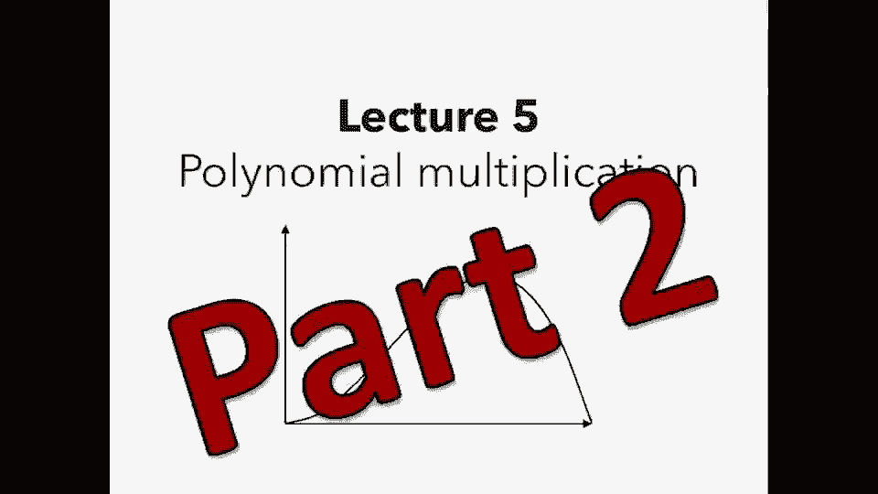

好啦，现在是12点41分，嗯，不如我们开始吧，这是第五讲，多项式乘法第二部分，所以我们继续上一节课开始的课程。

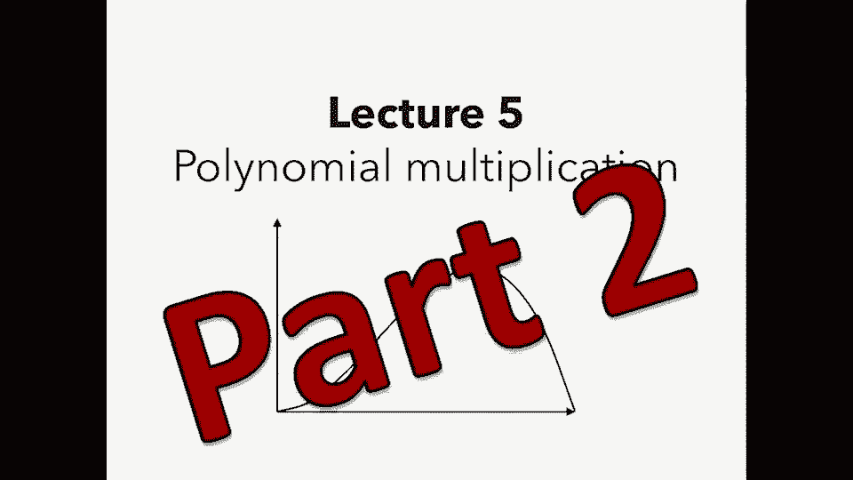

呃好吧，让我们简单地做一下管理角，对我自己说，我得去找NAS遥控器，我想我找到了，一号作业几天前就该交了，我希望人们能找到它，我不知道当时的气氛是什么，是吗，好啦，竖起大拇指很容易，让我看看。

我被要求在等候名单上说几句话，因为候补名单上还有人好奇，如果他们要去上课，嗯，所以我不能确切地说什么，如果你在等候名单上，但我可以描述我对它的理解，首先我最近被一个管理员告知。

在伯克利有一个普遍的10%的规则，一种经验法则，就像课程开始的时候，你预计大约10%的人在课程中会下降，在这门课和校园里的另一门课上也是如此，所以一个很好的经验法则是。

如果你在等候名单上的位置大约相当于班级人口的10%，然后你可能有一个很好的机会通过另一种方式进入课堂，如果你在等候名单上，如果课程扩展，所以课程已经扩大了两倍，第一次由两个五个学生。

下一次由一百六十二名学生，扩张的原理，其实不是我们做的，所以基本上我们教授，我和霍格塔拉布教授，我们就坐着等，最终警局可能会找我们，允许我们扩大课程，所以他们过去给了我们两次许可，在这一点上。

他们还没有真正接近我们，将来可能会发生，就像很快它可能不会，嗯，但是呃是的，直到他们这样做，真的没有什么确定的，我可以说，这基本上就是我所知道的关于等候名单是如何运作的一切，你的机会有多大。

如果你在这里的等候名单上，嗯。

除此之外，关于管理的事情没什么可说的，几乎一切都和星期二一样。

事不宜迟，让我开始这堂课，我将从三张幻灯片开始，回顾一下我们上一节课的内容，所以在上一节课中，我们集中讨论了一个问题，或者我们得到两个多项式，第一个多项式是，这个多项式有n项，它是单变量的。

所以它是n-1度，然后我们还有另一个多项式叫做q也是n项，n度减一，我们生活中的大目标是快速地将这两个多项式相乘，我们看到了如何快速添加它们，现在我们想快速地将它们相乘，我们还看到，你把它们相乘的速度。

似乎取决于多项式的表示，所以我们看到的第一个多项式表示，不知何故，我想，多项式的更自然的表示在这种表示中称为系数表示，多项式只是由它的系数指定的，一直到，所以在一个典型的多项式算法中，这是一种形式。

多项式将作为输入提供给您，所以它只是一个由n个实数组成的列表，我们看了上一堂课，可以将两个多项式按n次平方时间相乘的算法，如果给出它们的系数表示，另一种表示多项式的自然方法是。

告诉你多项式在一些单独的点上的值，阿尔法一号，阿尔法2到阿尔法M，我们看到只要这个点数，至少是，然后告诉你，换句话说，m至少是多项式加一的次，那么只要我告诉你这份要点清单。

它实际上完全指定了多项式是什么，因此这也是多项式的另一种合法表示，我们看到，实际上对于这个表示，你可以比系数表示中的乘法快得多，据我们所知，嗯，我们看到把两个多项式相乘是非常简单的，给出它们的值表示。

以n次的顺序，哪个是最佳的，上一节课我们要解决的问题是，在值表示中使用这种快速算法进行乘法是可能的，为了加快我们在系数表示中的乘法，好啦，所以我们能用算法2做一些比算法更好的事情吗。

我们看到了一种这样做的方法，这种方法通过引入复数，原因是我们想用多项式的值表示，在一些复数上求值，那么我们想好好研究哪些复数。

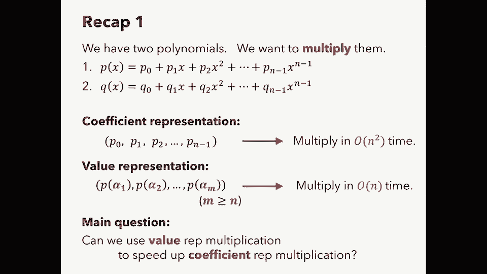

就是这些，你知道的，最神奇的复数，团结的根源，所以让我提醒你那些是什么，嗯团结，这里有一个花哨的词来形容第一名，团结的根也随你而来，用数字n指定它们，所以你要求统一的第n根和统一的第n根，他们有N个。

它们只是方程x的解x到n等于1，所以只要取1的n次平方根，我们看到了n的各种值的例子，我们看到了团结的第二个根源，团结的第四根，统一的第八根，和上一节课一样，我们只在乎均匀的力量，所以像两个，四，八。

十六，三十二个统一的根，我们不会关心像三、五、七个统一的根，为了团结的第八根，它们只是一个数的第八个根的点，很明显它们是正负一，如果你把它们提升到8次方，你拿回一个，正负i，我们上次看到派生的。

然后这四个点，嗯，不是很明显，但我向你保证，如果你把它们提升到8次方，你会神奇地拿回第一名，我们也看到了这样，如果我给你这些公式，好像不太明显。

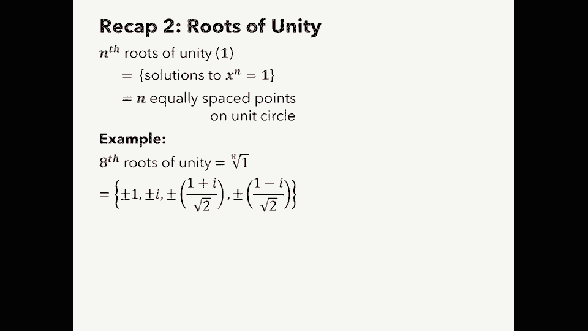

嗯，你是怎么得到这些数字的，但还有另一幅漂亮的几何图形。

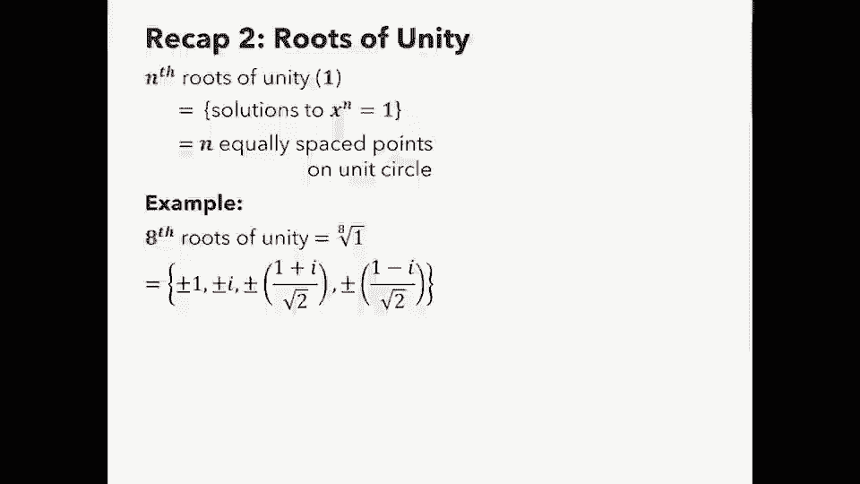

这告诉我们团结的根源是什么，我们看到你所做的是你去复杂的单位圈，统一的根对应于n个等间距的点，所以复单位圆，它只是在复杂的平面上，它只对应于长度为1的所有数字，所以如果我们看的是统一的A。

我们只需要看单位圆周围八个等间距的点，所以这是你团结的第八根，你总是从最右边开始，哪个是第一，然后你从那里开始划分你的圆圈，最后我们看到这些都有类似的名字，所以考虑到我们团结的第八根。

我们将把它们命名为欧米茄零到欧米茄七，命名的规则就是统一的根对应于，所以你总是称之为欧米茄零的最正确的点，然后你开始给它们编号，柜台，在这一切之后，我只想告诉你，关于这些复数，你只需要记住两个事实。

所以在滑梯之后，如果你忘记了关于这些复数的所有其他事实，我没意见，第一个也是不太重要的事实，哦哦哦，让我说，嗯是的，在这些数字中，对不起，最重要的是这个欧米茄，然后嗯，所以让我们在那里画一条线。

在ω1和x轴之间有一个夹角，这将是一个角度，2π/8，为什么好，因为我们只是把圆圈分开，把两个圆周率的弧度，所以这个是2π/8，好啦，那么现在你们要记住的关于复数的两个事实是什么，如果你只记得这些。

我没意见，第一个是生成器事实，它说对于所有的值，我总是可以计算欧米茄潜艇I，把欧米茄1提升到第i次方，就像欧米茄2一样当我把欧米茄1平方时，当我吃欧米茄1时，我得到的是欧米茄3，我把它切成立方体，好的。

好的，所以我可以生成从欧米茄1开始的一切，然后嗯，尤其是欧米茄1到0，嗯，那总是等于一，那只是欧米茄零，一个也是你得到的，当我把欧米茄1提升到n次方，嗯，因为你知道，我想我在这里用m表示根数。

所以如果我拿欧米茄1，我把它提升到n次方，我在这种情况下旋转了八次，我回到我开始的地方，是欧米茄零，所以那是发电机，另一个事实是，这是一个真正重要的事实，如果你只记得这两个事实中的一个。

你应该记住这个事实，也就是说，如果我把我的第n根统一，有N个，我把它们平方，我最终得到的是统一的N/2根，因为n有n个根，N个统一根，n除以2和2个同根根，当我平方我的第n根，我取我的统一之根。

我把它们除以一半，所以平方总是减少我的数字的大小。

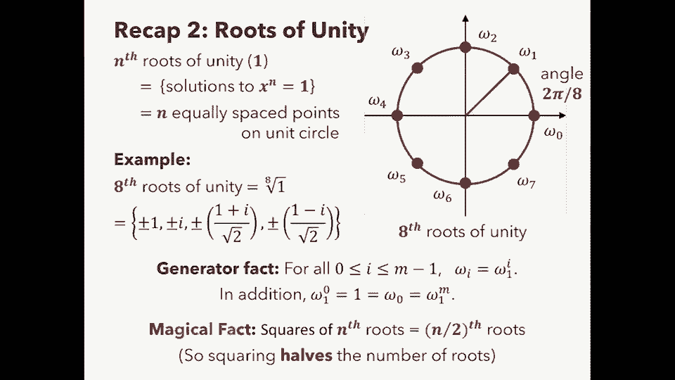

好啦，所以嗯，考虑到这一切，我们如何设计好我们的算法，我们想做的是取两个多项式，二次系数表示，N减1多项式，我们想把这些多项式相乘，所以我们算法的第一步叫做评估步骤，这将转换系数表示中的多项式。

在多项式的值表示中，在这一步中，你只要取p，你应该在alpha上计算它的值，1到alpha，q也是如此，然后下一步，现在我们在价值表示中，我们可以计算出这两个多项式的乘积。

我们可以在几乎线性的时间内做到这一点，最后一步是把这一切都带回来，所以我们计算了它们的乘积，值表示可以，我们现在把它转换成它们在系数中的乘积，这就是我们要找的，这一步就是插值步骤，好啦。

所以现在我们要把重点放在评估步骤上，我们将看看如何有效地做到这一点，所以对于评估步骤，我想让你回忆的是，嗯，因为p和q都是n-1次，这意味着它们的乘积是n-2次，所以如果我们想在值表示中计算它们的乘积。

我们需要点m的个数至少是2n减1，所以我们要选择m，是大于2n减去1的2的一次幂，所以一些2的幂来适应这个，然后我们要选择评估的值，会成为我们团结的根基，欧米茄零，欧米茄一号，一直到欧米茄m减1。

哦很好，你叫什么名字？安迪，如果我有一个n次减去一个多项式，然后我需要对它的值表示。

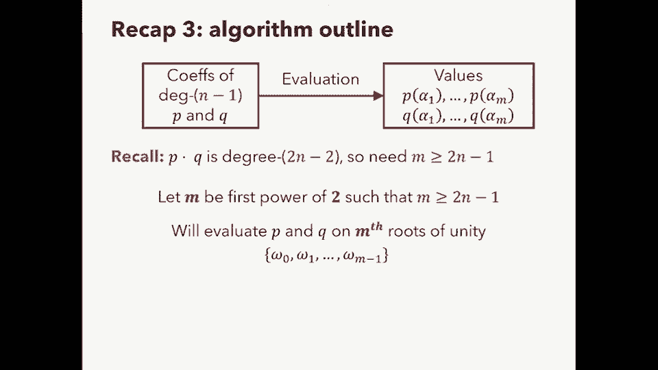

必须至少有N分，所以在这种情况下，它们的乘积是一个2n减去两个多项式。

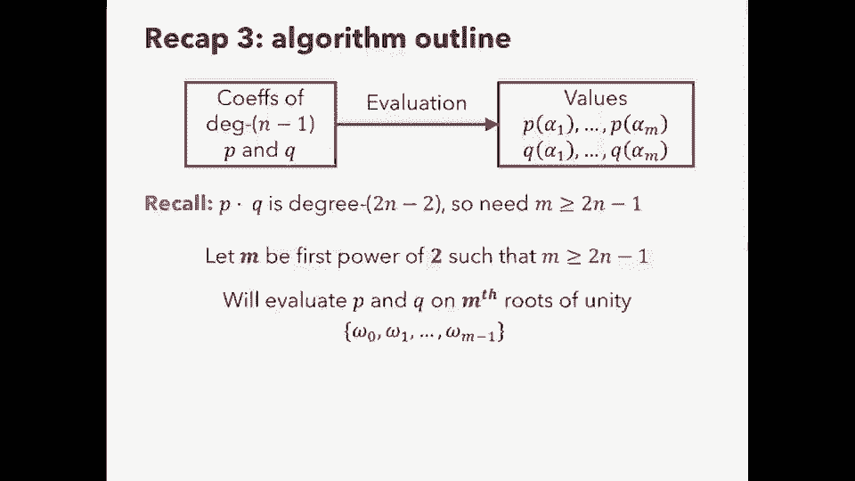

所以我需要这么多点加1所以2n减去1，那是一般规则，好啦，所以我们的目标是，我们要计算两个多项式的值，这将是这些统一的根源，所以，嗯，我们要做的是展示如何做到这一点，在时间上，这是n对数m。

如此接近线性，只是在对数上比线性差，这个算法把你的多项式放入系数表示中，并将其转换为，在统一的第n根上评价它，啊，我应该说，因为M是秩序，这是一个n，log，n的算法，但是是的，因此。

实现这一目标的算法被称为快速傅里叶变换，这是上一节课的回顾，在我继续之前，有什么问题吗？如果没有，然后让我们看看怎么做。

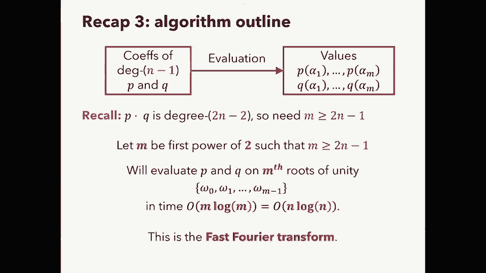

哦耶，然后让我也告诉你们这节课的大纲，如果我们能完成这一切，我们要开始了，上节课我们已经学过复数了，我首先要向你们展示如何进行快速评估，然后我们将展示如何做快速插值，然后我们会看到一些奇怪的矩阵视点。

为了我们刚才所做的，我们已经用矩阵做了，然后，如果我们有时间，一些有趣的应用程序，我认为是一种很酷的，好啦，让我来告诉你们这个快速傅里叶变换，所以这是一个算法，它的输入将是两件事，1只是一个数字M。

是2的次方，然后第二个多项式p，p零加p一x与系数表示，这个多项式是m-1次，目标是输出这个多项式在欧米茄零上的求值，欧米茄1到欧米茄m减1，这些欧米茄是统一的根源，好啦，现在你可能有一个问题。

就像等一下，呃，不是P，多项式，我们想评估一下，实际上应该是n-1度，在这里我把它写成m-1度，我们也应该有这个约束，m应该大于或等于2n减1，所以答案是，那倒是真的，对于我们想要的应用程序。

即快速多项式乘法，我们实际上会有，你知道多项式，n减去一，m总是至少是两个n减去一，但是对于快速傅里叶变换，事实证明，这个算法也会起作用，如果p一直到n次方，为了简单起见。

所以我只需要在m周围保持一个数字，而不是两个数字n和m，我将给出，当p等于m减去1时的版本，当p是n次方时也是如此，就像你可以想象一个n-1，n度减1，多项式也是m次减一。

但那只是所有大度系数都为零的地方，好啦，所以如果你的学位是负1，你也是零下一级，所以这个算法也会，所以现在，我们只是要适应，忘记n，只与。

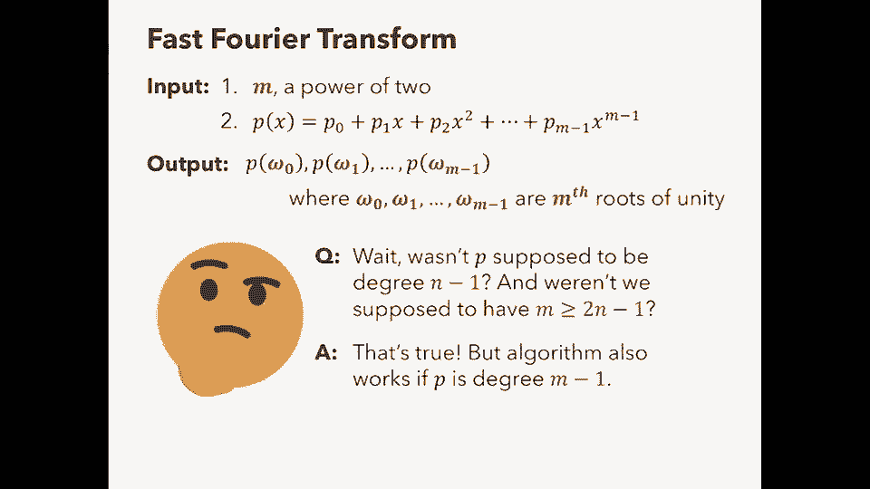

好啦，我们怎样才能解决这个问题呢？这是我们班的一个分而治之的单位，所以我们要设计一个分而治之的算法，所以这个分而治之的算法是针对这个问题的，左边，我们要计算快速傅里叶变换子m，所以这意味着。

关于m-1次多项式上单位元的第n个复根，那是我们的目标和分而治之的算法，总是把你的问题，它把它分成多个更小的子问题，这个算法将把我们的问题分成两个更小的子问题，这两个较小的子问题都涉及到快速傅里叶变换。

论统一的m次根，所以我们取m除以2，它所操作的多项式是，M除以2减去1，所以我们要递归地计算，快速傅里叶变换，嗯，论统一根数的一半，在次数缩小了两倍的多项式上，所以这将是我们的分步，然后在分步之后。

总有征服的步骤，你必须把你的结果结合起来解决你的整体问题，这个征服步骤将把这些计算的结果，并使用M阶额外时间将它们组合起来，所以嗯，这将给我们一个运行时的递归关系，嗯，我们的算法。

它说关于我们的m算法t的运行时，最多就是我的两倍多，因为我们要运行两个算法，嗯，做快速傅里叶变换大小m超过2，加上一个额外的时间订单M来解决，希望这是你们以前见过的递归关系，例如，这是合并中出现的一个。

空头，所以如果你的t满足这个递推关系，关于这个大纲的问题，啊，我将在下一张幻灯片中解释，是啊，是啊，这只是算法的总体轮廓，但我会花些时间解释这实际上是如何工作的，你叫什么名字？顺便说一下，其他问题。

所以是的，我还没说我们要怎么做呢，不过，我们走着瞧，这就给了我们要找的运行时，所以现在让我给大家展示一下。

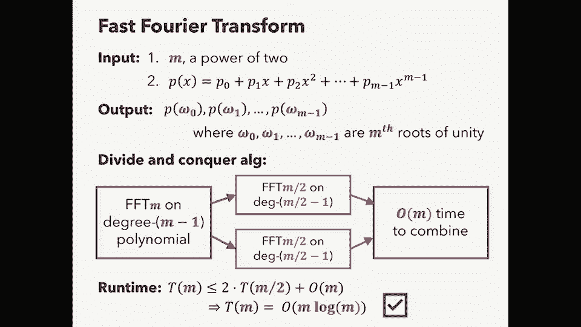

我们实际上是怎么做除法的，分歧，征服，好啦，所以对于除法步骤，我们要做的是，你知道我们的问题，我们要做的是在一些点上求出p，这就是我们的计算对吧，这是我们的多项式p，我们想在某些点上求出这个多项式。

所以我要做的是把p的计算，我要把它分成两部分，这将是我的分步，那么我要把p分成哪两部分呢，一个很自然的事情就是把P分成上半场和下半场，但事实证明，我们会有更好的事情做，这将是分裂p。

我在这里涂上红色和蓝色的两半，偶数的一半和奇数的一半，所以在这里我高亮显示并阅读了p多项式的偶数部分，所以这些都是具有均匀力量的术语，所以我们有一个p0次方p2x的平方，所以2 p4 x的4次方。

所以四次方，这些都是偶数幂的术语，然后是蓝色的，我已经突出显示了所有剩下的术语，奇数幂项，x的立方x到第五，以此类推，好啦，所以让我写这两部分，这里首先是均匀的部分，让我说一句，呃。

偶数部分的最后一项是x除以m减去2，所以它是m次减一个多项式，M是偶数所以它是奇次多项式，所以m减1是奇数，负2是偶数，所以负2是最大的偶数项，剩下的部分是从p1x开始的奇数部分，然后一路走到期末。

也就是奇数pm-1乘以x到m-1，好的，好的，现在我要做的是，我要花一些时间看看均匀的部分，看看如何，也许把这个计算简化一点，嗯，想出一个很好的方法来观察均匀的部分，我想指出的是，这里的每一个术语。

x的平方x的四次方，以此类推，它实际上是一种力量，不仅仅是X的偶数幂，嗯，x的偶数次方是什么意思，意思是它也是x的平方，所以我们可以重写这一行如下，嗯p零加p2x的平方，好啦，我在那里什么也没做。

加p 4 x平方，所以x的平方等于x加上p6 x的平方，你知道x的平方就是x的6，所以每一项都是形式的下降，x的平方升为次方，而现在，如果你注意到这个，因此，这条线只是一个多项式，不仅仅是一个X。

但也是X的平方，所以我们要这样写，所以我声称它等于x的平方的偶数，下面的多项式是偶数，它吸收了一个变量z，它输出p0+p2z+p4z的平方，加上p6z的立方，以此类推，所以你得到的是。

当你取p多项式的偶数部分，把所有的度数除以2，我声称你知道，如果我们取x的平方，即使那样我们也能拿回我们的那部分，你知道我们得到了z的p 2，但是如果z是x的平方，那只是p2x的平方，p 4的z平方。

如果z是x的平方，那只是p4x到，好啦，奇怪的部分呢，嗯，奇怪的部分我们要多做一步，在奇怪的部分，我们首先要注意的是，每样东西都至少有x的一次幂，所以我们可以计算出x的一次幂，我们只要把它拉到前面。

然后我们得到的是奇数部分的多项式，其中x的所有因子减1，所以p1加p3 x的平方，加上p5x到第4次，以此类推，现在我们可以，我们注意到这是x乘以一个只有偶数幂的多项式，就像我们在偶数部分。

所以我们可以做和偶数部分完全一样的把戏，偶数幂的多项式，现在是x平方的多项式，所以我们可以把它写成x的奇数平方，其中奇数是多项式，它的值是z，输出p1加p3z加p5z的平方以此类推。

所以奇数多项式中的每一项都是你从原始奇数部分得到的，你从学位中减去一个，再除以二，奇数部分等于x的平方的x乘以奇数，这是两个公式，一个是均匀的部分，一个是奇数部分，因此，这告诉我们。

整个多项式正好等于x的平方的偶数，加x乘以x的奇数平方，那么这些多项式的度数呢，你知道的，我们总是想缩小学位，这是我们的希望，嗯，偶数部分的度是，你还记得吗，每学期，在偶数部分的最大度项中。

x到n减去2，然后当我们定义偶数多项式时，我们把这些度数除以2，所以这意味着偶数的度数是m/m-2除以2，也就是m除以2减去1，那实际上是，我答应过你的学位，同样地，对于奇数的程度，你会得到同样的结果。

记住奇数是当我们把奇数部分，度数减一除以二，所以奇数部分的最大度数是m-1，减去1得到m减去2，如果我把它除以2，我得到m-2，除以二，等于m除以2减去1，好啦，这可能是这节课最令人困惑的部分。

所以我想暂停一下，看看有没有什么问题人们对此感到困惑吗，现在有了，你在问，为什么我们不能有相同的格式或，对不起，我想我还没有完全理解你是你是你，我是说，我们希望他们有类似的形式，让我们的生活更容易。

其他问题，是啊，是啊，啊，你的意思是，为什么偶数的程度，偶数部分的度数除以二，你记得即使是一个多项式，当你取偶数部分时，把所有的度数除以2。

即使z{\displaystyle z}是p 0{\displaystyle p_{0}}，这和偶数部分是一样的，但是p2乘以z，而在偶数部分乘以x，在原多项式中的平方，即使你有一个x的平方。

现在变成了Z，所以你所有的学位都被2除，这有道理吗，你叫什么名字？阿里更多问题，好啦，哦耶，我们在看，好耶，所以偶数和奇数的程度，用z而不是x的平方表示的度，你叫什么名字？好奇，谢谢，还有其他问题吗？

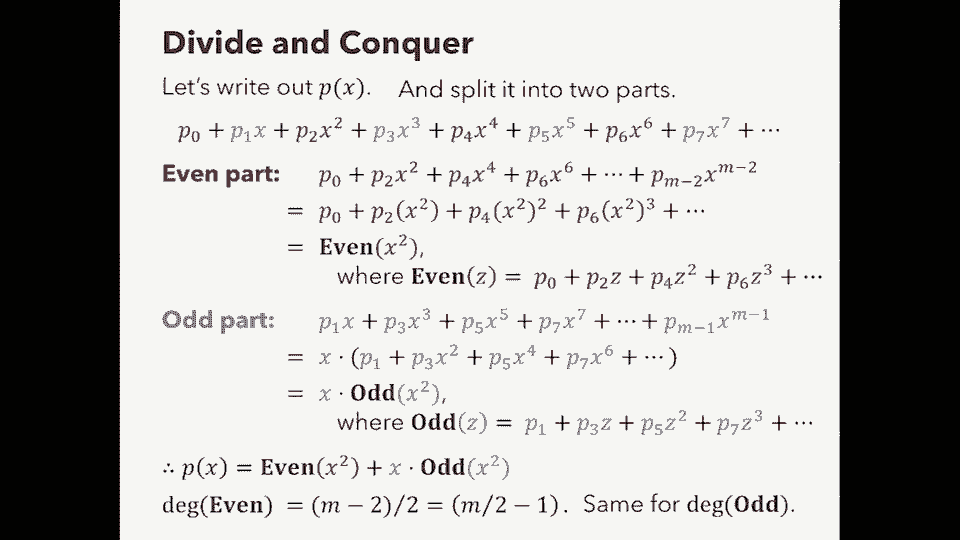

所以那是很多，但现在让我重申这个事实，我们刚刚证明了，如果x的p是m次减一个多项式，那么我们可以把它写成x的p等于x的平方的偶数，加x乘以x的奇数平方，偶数和奇数的程度。

它们都是m-m除以2-1的多项式，所以他们的学位是，好了现在，让我提醒你我们的目标是什么，嗯，我们想在统一的第n根求p，欧米茄零到欧米茄n-1，这就是我们做这些的全部原因，所以，让我们说。

我们想计算ωi的p，例如，用我们上面的公式，即使是在ωi平方处求值的偶数多项式，加ωi乘奇多项式在ωi平方处求值，现在有人能盯着这个吗，呃，告诉我，就像，我们是什么，我们现在该怎么办。

我们应该应用什么事实，等一下，对不起，你能说大声点吗，你有一双真正的眼睛，完美，是呀，你叫什么名字？是呀，所以你说的很好，你知道，即使是一个奇怪的，他们正在评估欧米茄i平方，欧米茄I是一个通过神性的N。

所以我们知道的一件事是什么，当我们取下统一的第n个根，我们平起平坐，我们得到一个m/2的统一根，即使我们要计算ωi的p，统一的M根，它简化为求取m/2时的偶数和奇数，通过它的统一。

所以这就是我们神奇的事实，所以我们想在m个不同的点上，但实际上我们只需要在m处求偶和奇数，在两个不同的点上，好啦，那么我们如何利用这个事实来给出我们的分而治之算法，现在我要讲一个分而治之的算法。

计算p在单位的第m个根求值，所以我要做的第一件事是。

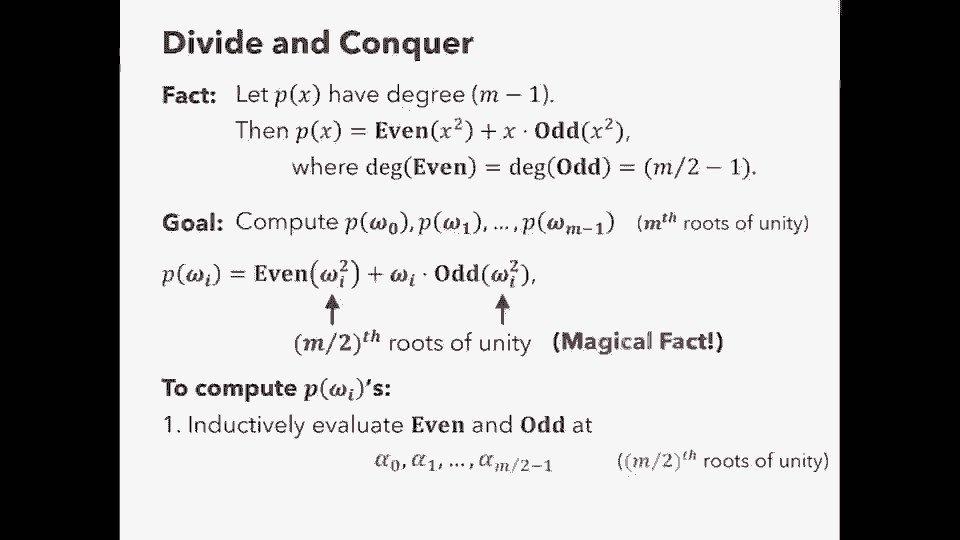

我将归纳求偶多项式，我的奇数多项式在这些值上，阿尔法零，阿尔法一号，一直到αm除以2减去1，这些值是什么，嗯，这正是我为统一的两个根源所写的，通常我会把它们写成欧米茄。

但我们已经有欧米茄被用于统一的m th根，所以现在我叫他们阿尔法，所以第一步，你只要在所有这些点上计算偶数和奇数，那要计算两点多了，即使在m上超过两点来计算，奇数，现在我们想用这个计算，这是分步。

现在我们要征服，所以我们想用它来计算，我们实际上关心欧米茄i的p，但我声称一旦我们做了这个计算，计算欧米茄i的p只需要再做一项工作，因为我们已经计算了ωi的平方，我们已经计算了欧米茄的奇数i的平方。

计算ωi的p只需要一次乘法和一次加法，这是订单一项工作，所以我们必须对每一个欧米茄i值这样做，但是欧米茄i只有m值，所以这是我订购一件作品的次数，也就是我的工作，共计，所以这就给了我们。

我们要做的是做团结的第n根，做m/1次根的时间是做m/1次根的时间的两倍，然后我们必须做欧米茄或抱歉点M更多的工作来组合它，这就给了我们m log m运行时，有关于，你怎么算，你在储存。

那么这里发生了什么，哦，我想，为了这个，这相当简单，直截了当，我想计算欧米茄潜艇I，所以每当我想计算欧米茄i，我要去欧米茄i的p，我只是要在飞行中计算欧米茄i，是啊，是啊，就是这样。

我们在后面假设的问题是，嗯很好，呃，是啊，是啊，你叫什么名字来着？安迪欧米茄M的作品是这样的，所以一旦我计算了所有这些点的偶数和奇数，现在我必须用它来计算ωi的p，对于所有m欧米茄i。

对于欧米茄i的每个值，只需要再订购一件作品，有m个不同的欧米茄i值，这就是我的全部工作，这有道理吗，后面的一个问题，哦很好很好，神奇的是，当我评估，当我要计算第n次单位根的平方时，嗯。

那只是通过神性的一个m/2，好啦，我想好吧，在这种情况下，这允许我们归纳地调用我们的算法，而不是在值m上，但是关于m除以2的值，当你继续这样做的时候，您最终在值1上调用它。

因为你在每一步都把你的点数减少了一半，这意味着1的t类似于递归底部的1阶，你只需要评估一点，你叫什么名字？罗翰，好啦，让我运行这个算法的一个示例，希望它能使它更清楚一点。

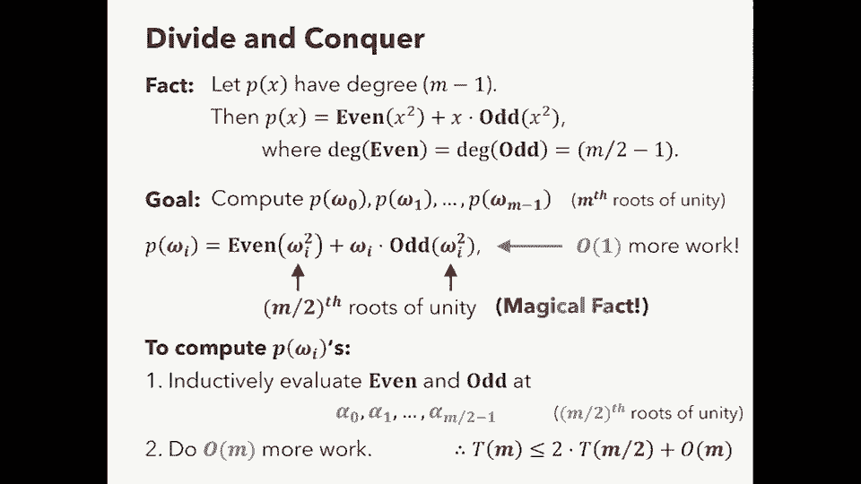

让我们用这个来计算这个多项式，就在这里，一加三x减去四x加七x的立方，对不起，三x减去四x的平方，我们要计算这个多项式，现在是4度零下1度，所以我们想从统一的第四个根来评价它，团结的第四根是什么？嗯。

它们只是其中一个的第四根，就是加一个，减一，加i和减i，好啦，所以这个算法的第一步是计算偶数多项式，所以我们必须弄清楚什么是好的，它将是偶数项1减去4 x的平方，但是我把x的平方换成z。

所以我们得到1-4 z，然后奇怪的部分，奇多项式，我们得弄清楚那是什么，我们取奇数部分3 x加7 x的立方，我们把所有的度都降低一个，然后我们把它们除以2，所以我们得到了3加7 z，让我检查一下我们有。

即x的p总是等于x的平方的偶数，x的平方加x乘以，x的平方，如果我们把x的平方代入到偶数，我们得到1-4 x的平方和奇数x的平方，如果我们把x的平方代入奇数，我们得到3加7 x的平方，现在呢。

让我们把奇数以外的x乘以，我们得到1-4 x的平方+3 x+7 x的立方，也就是1加3 x减4 x平方加7 x立方体，所以这确实是x的多项式p，好啦，所以现在，我们将用这个事实来计算p。

论团结的四个根源，所以让我们从最简单的加一开始，这个事实告诉我们这正好等于1+1的平方。

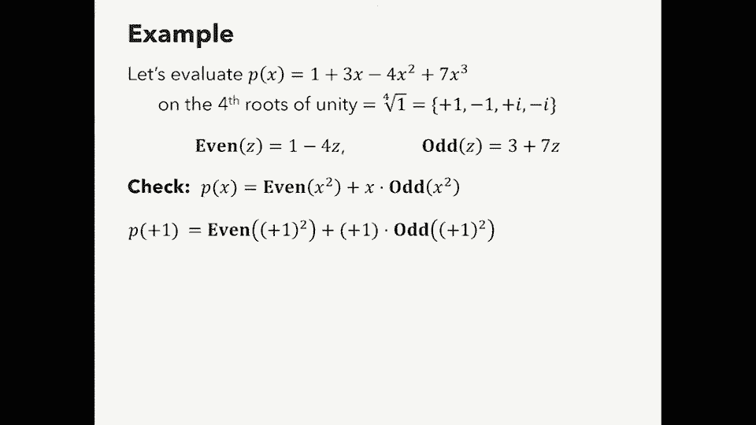

正加1的奇数正加1的平方，你也知道。

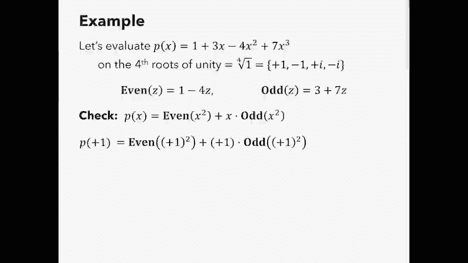

加1的平方就是1，所以这只是1的偶数加1的奇数，负1的P，也就是负1的平方，正负1的奇数，减去1的平方等于1，所以这只是一个，减一的奇数，所以让我把它们分组，加上我，嗯，好，这甚至是一个加我的平方。

正加i乘以r，你知道我的平方是负1，所以是负1的偶数，加i乘以减一的奇数，那么负1的p是多少呢，它是负1的平方，正负1的奇数，减去1平方等于多少，那只是对不起，减去我对不起，这都应该是负i平方啊。

减去i的平方是多少，这和我的平方是一样的，刚刚减一，所以我们得到了一个负的，负i乘以负1的奇数，所以让我们把它们组合在一起，现在你注意到了，首先我们想在单位元的第4根求p。

但现在我们只需要计算两点上的奇数，加一减一，它们是统一的第二个根源，也请注意我们在这些计算中做了多少重复的工作，所以对于正负一的p，它们实际上是相同的计算，除了中间的标志不同，所以如果你计算p的正一。

就像你几乎可以免费得到负1的p，加i的p和减i的p也是一样的，当你评估，它们基本上是相同的计算，除了中间的符号，这就是这个算法所利用的，事实是有很多重复的工作，分而治之让我们可以利用这一点。

使我们的算法运行得更快，所以是的，又是这个，它简化为在正负1处求取偶数和奇数，它们是统一的第二个根源，关于这个例子有问题吗，所以我想即使递归，现在我们就像不均匀一样运行算法，所以我们会暂时忘记奇怪。

我们只是把它均匀地运行，我们把它分成偶数和奇数，就像均匀的部分只是一个，奇数部分是负4，对不起，你刚才在这里，但让你想起我，德鲁，哦等等，你不在这里，啊，我不知道我的眼镜，所以我很抱歉，冷却其他问题。

是啊，是啊，哎呦，我是说，关键是偶数和奇数只是多项式，你可以写下来，它们只是多项式，如果你想，你可以把x的平方插入它们，但你不必把x的平方插入它们，关键是它们只是多项式。

现在我们的算法总是只插入x的平方，嗯，但我们想，我们要强调的是它们是多项式，另一个有意义的变量z，是啊，是啊，我是说，最后我们要计算这些多项式，你知道的，统一的两个根的m，在这一点上。

我们甚至不想去想正方形或类似的东西，那些是，只是多项式，我们想用m来评估它们，超过两点。

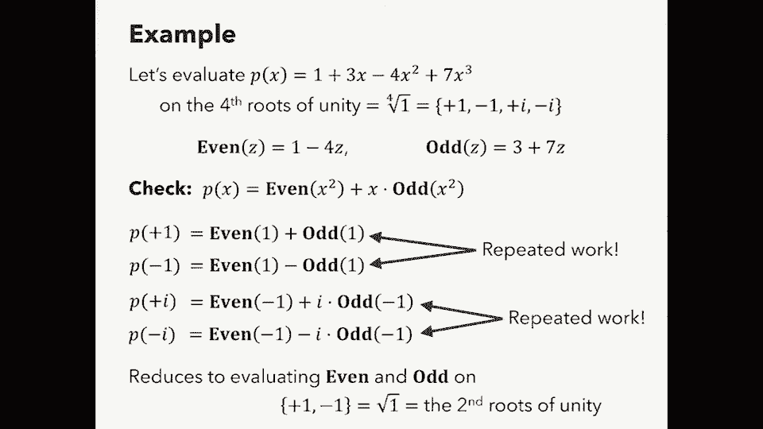

好啦，所以这是一个快速的评估步骤，我们刚刚完成了最困难的一步，接下来我们要做快速插值，我给你们三分钟休息时间，如果有人能去把后面的门关上，那太好了，去争取吧，现在只是不喜欢实际上，我们已经做了第一个。

我们刚做了第一部分，是呀，上节课我们做了第二部分，然后在下一步最后一部分，是呀，但是我们会看到插值是非常容易的，一旦你能做评估好的，你叫什么名字？哎呦，指针，是啊，是啊，哎呦，我从来没有。

我都不知道怎么用，但我想顺便说一句，这不是你的指针，对呀，我觉得这是我见过的，是啊，是啊，我看起来像应该用一个点，也许我应该，好啦，嗯，让我试试看，然后是的，我想，这个，好啦，我怎么用这个来激光点，酷。

谢谢你，我觉得是你先起来的，我可能会在讲座结束时解释这一点，就像一个傅里叶分析的深场，这就像用，但它有点隐藏，但是嗯，你知道的，你见过这个吗，你知不知道，傅里叶分析之类的，所以说，呃，傅里叶变换。

这种方式就像接收信号一样，再分解成，就像更好的信号，就像符号和余弦，好啦，嗯，有一种方式来看待我们刚刚所做的，但我会解释的，你知道的，如果我还有三十分钟，我绝对可以得到它，我不确定我会，但是是的。

如果张贴了，请查看最后的幻灯片，所以在这里，我们只关注这里的论点，我们不关注，什么事？所以我们不在乎，是啊，是啊，我想重点是，嗯，呃到，当我们想，我们想归纳地调用我们的算法，嗯，归纳地调用我们的算法。

我们关心的是，我们把什么投入到偶数和偶数中，一旦我们归纳起来，我们已经在统一的所有根源上评估了偶数和奇数，现在我们必须用这些结果来计算这四个值，但一旦我们知道即使是一个奇怪的。

就像计算这些线中的任何一条都只需要一项额外的工作，是啊，是啊，所以真正困难的部分是计算，偶数和奇数部分的计算，一旦你有了，剩下的就超级容易了，你叫什么名字？凯蒂凯蒂，酷嗨，我来看看时间，呃，钱。

为什么我们要走这条路，呃到现在，那么为什么，所以说，我们为什么要用，哎呦，我们做复杂根的原因是因为这种神奇的性质，不管我们要评估的数字是什么，我们总是最终评估他们的平方。

但复数根是唯一一个当你把它们平方时，数字减少一半，我们想成为，对不起，我不太明白这个问题，如果你能下课后问一下，我在复习我的三分钟，不过，顺便问一下，你叫什么名字？是呀，哦对不起，我必须，好啦。

三分钟到了，嗯，让我们继续前进。

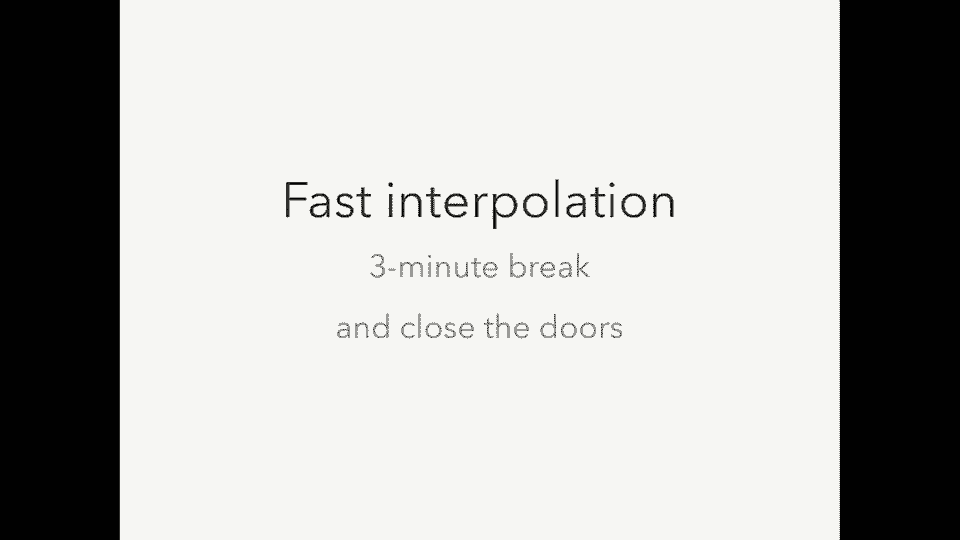

这是我们的算法，我们评估，我们乘法，我们插值，我们刚刚看到了一个评估步骤，它的顺序是n，log，n，利用快速傅里叶变换，嗯然后我们看了上一堂课，如何从第二个盒子到第三个盒子，按时间顺序。

但我们还是不知道如何插值，我们不知道如何倒退，嗯，这实际上似乎有点挑战性，因为至少第一步，我是说我们想出了一个非常复杂的算法，但实际上至少有一个简单的算法，我知道可以运行，如果我想计算很多点的多项式。

但我甚至不清楚我如何从正确的盒子里走出来，第三个盒子到第四个盒子，即使是一个简单的算法，一个非常即使我必须做得非常慢，我甚至不知道该怎么做，所以是的，真的不清楚插值怎么办，好啦。

但让我们回忆一下我们的p乘以q，这将是一个学位，二n减去二多项式，所以和往常一样，我们需要我们的m至少是n-1，然后嗯，我们的快速傅里叶逆变换，这就是要计算插值步长的东西，这将是一个算法。

如果我给你一个多项式r，以及该多项式在单位的第n根的求值，它将返回我们的系数表示，所以这是一个多项式，这将帮助我们从第三个盒子到第四个盒子，因为我们将计算这个快速傅里叶逆变换，p乘q上的多项式或算法。

所以给定值表示，它将您转换为，系数表示，它的时间顺序是m log n，它一如既往地等于顺序并在我们的设置中登录。

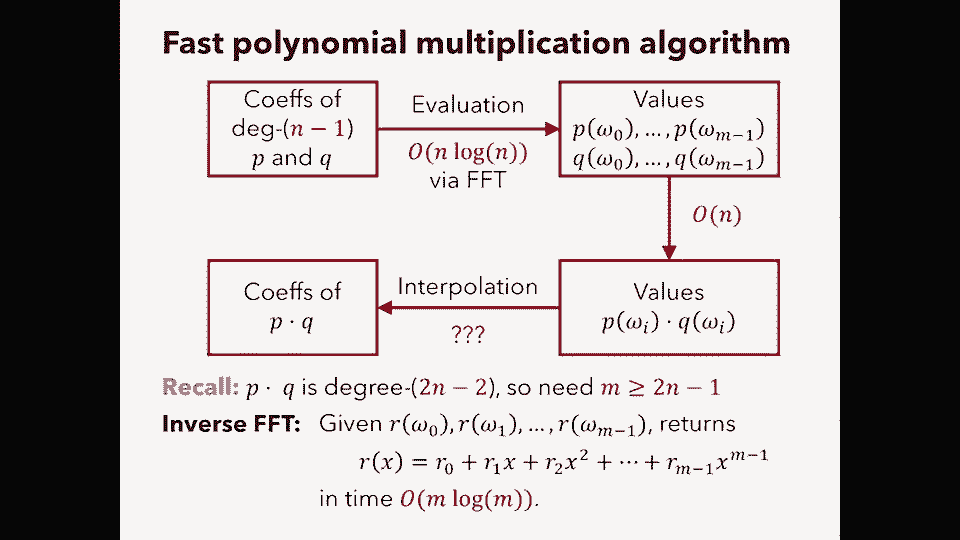

那么我们如何计算这个快速傅里叶逆变换呢，同样，我们的输入是p在单位的m根处求值，输出是p的系数表示，嗯，你怎么做到的真的真的不明显，好啦，但是一旦你做了傅里叶变换，你基本上可以免费得到傅里叶逆变换。

所以让我先解释一下为什么，我提醒你一下，禁食，傅里叶变换公式，让我试着用一个激光笔p，它的求值为，你知道的，一些统一的根欧米茄L，这就是多项式p，所以你把所有的项pj相加，乘以输入到j。

次幂是ω次l到j，所以当我们想做傅里叶变换时，我们只是想计算所有欧米茄l的公式，好啦，我们有一个算法可以非常有效地做到这一点，原来有一个类似的公式，看起来几乎相同，如果你想计算逆傅里叶变换公式。

所以我们要计算这些值p l，上面的系数是多少？这里有个公式，好啦，在M上面有一个，忘了那件事吧。

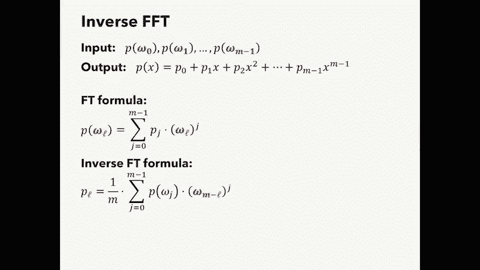

一秒钟，这就是j等于0和m减去1。

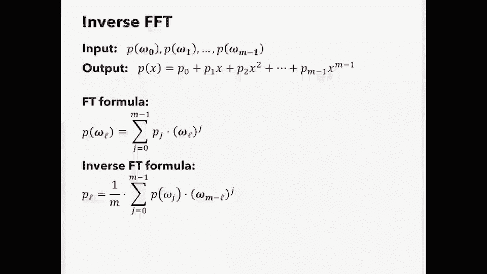

我们有一个系数，它碰巧是这些输入值，欧米茄次l或欧米茄m减去l到j，这是一个以omega-m减去l为单位的多项式，我们想把这个多项式求为ω-m-l，好啦，所以让我把它说得更正式一点。

这等于1/m乘以q在ω-m减去l，Q井是什么，就是这个多项式，常数项是p欧米茄零加p欧米茄乘以x，再加上，一直到，p，omega，m，减去，1乘以x，到，m，减去，1，如果我插入欧米茄m减去l代表x。

然后变成这个多项式，那我就明白了，L只是一个好问题，它是任何价值，所以我想计算p0到pm减去1，L就是0到m之间的任意一个数，所以这只是计算这里的一个系数，上面说的是，假设我想计算。

我的目标是计算p0到pm-1，这个公式说，计算每一个p零到pm减去1，它只是计算q的欧米茄零到欧米茄n-1，Q只是一个多项式，我是说，正是多项式，这些家伙对应的自然多项式，这是一个多项式，有了这个东西。

因为这个系数，这只是一个快速的傅里叶变换，我们所要做的，我们有一个多项式，它的系数表示，我们想在所有的点上评估它，统一的M复根，这正是快速傅里叶变换的作用，所以免费，我们得到这个算法。

我们只要快速傅里叶变换，它以n log n的顺序解决了这个问题，好啦，但现在你可能在问，这是为什么，为什么逆傅里叶变换公式为真，让我先说，完全不明显，我是说，你可能不应该在一个位置上，你只是盯着它。

并说，当然这是显而易见的，所以嗯，你怎么证明，嗯所有，我要说的是这门课通常不会教这个证明，所以这对人们来说就像在家锻炼一样，他们对学习复数很感兴趣，但这门课并不要求你理解这一点。

但如果你回家想证明这一点，你怎么会做得这么好，我来告诉你一些步骤，我想在那里的大部分时间里，好啦，让我们把这部分叫做p欧米茄j，我就叫它星星，所以我想证明右手边等于左手边。

所以我们要做的是在右手边做一些计算，在计算的最后我们得到了，好啦，所以首先，呃好吧，在右手边，我们有同样的p omega j井，我们这里有一个公式，告诉我们ωj的p是什么的傅里叶变换公式。

所以你应该做的是，你应该在右手边，把傅里叶变换公式插入到存储中，第二部分是您应该使用生成器事实的地方，事实上，我想这是我们唯一一次使用发电机的事实，这次讲座，这个生成器的事实说，每当我有欧米茄到我。

我可以用欧米茄1来代替它，所以当你把傅里叶变换公式代入星时，你会得到很多欧米茄，我只是把它们都转换成欧米茄1到I，然后你要做一些计算，然后还有一个事实，你应该使用，就是这个公式，我读给你听。

你选择一个单位欧米茄J的复数根，然后考虑从k=0到m求和，减去1欧米茄j的k次方，这个公式说什么，你不必证明它，但如果你想证明，你可以，嗯，这是欧米茄，对不起，这是M，如果j为零，它为零，否则没问题。

让我先证明给你看，如果j为零，那么ωj就是常数函数1，它总是等于一，一个上升到任何幂都是一，然后m1之和等于，好啦，所以我刚刚向你证明了这一点，我想你的工作就是证明，这是快速傅里叶逆变换。

有点像手的波浪，嗯，是啊，是啊，对此有什么问题吗，这就像一件神奇的事情，是啊，是啊，问题，很好我上面的那个是哪里来的，也完全不明显，所以我不指望有人看到，但是m上面的一个抵消了m所以，最终你想要。

你不会想，我坐在这里，你只想要一个，所以你得把一个放在上面，取消那个，那是最好的，我可以说，你叫什么名字？凯伦，还有其他问题吗？是啊，是啊，在背面。

我想我要说的是。

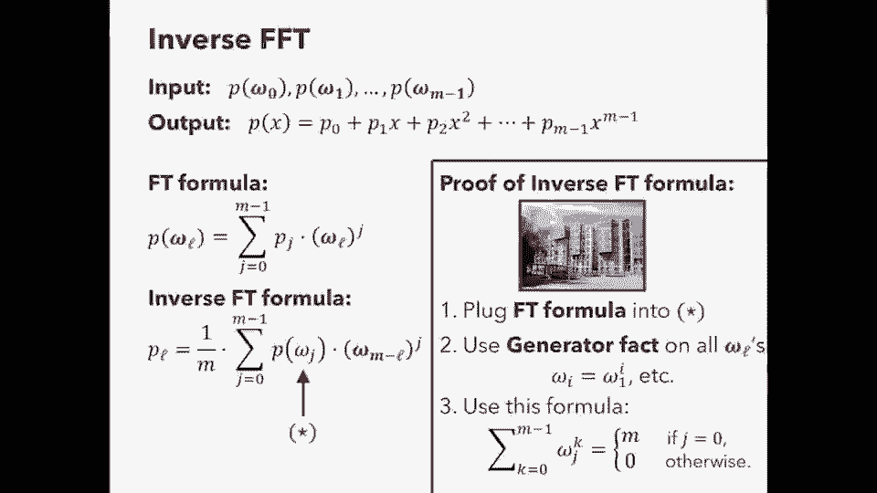

这个东西，我们想从这个开始，然后显示它等于这个，所以第一步你拿着这个，他们就像嗯，哎呀，欧米茄j井的p是多少，是总数，J等于0到m减去1，pjωj到，所以你就拿这一大笔钱，然后你把它放在那里，再说一次。

你不必在家里这么做，但如果你真的想，你知道值得一试，还有其他问题吗？

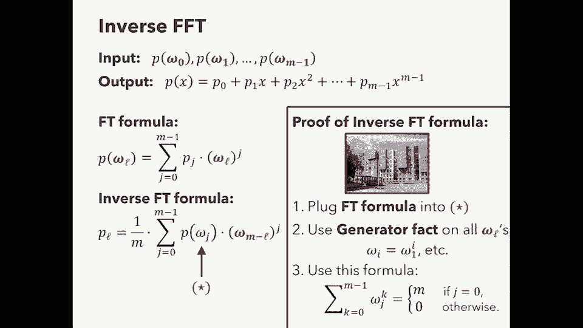

好啦，这就是快速傅里叶逆变换，嗯，现在我们可以把它放在一起得到我们的算法评估，我们首先看到的是n，log，n次，然后把它们相乘得到n次，然后插值，我们刚刚神奇地看到了，你知道在地毯下。

但这也可以按n log n的顺序完成，这只是另一种快速的傅里叶变换，完成了多项式乘法的证明，按顺序和log n时间，当然可以呃。

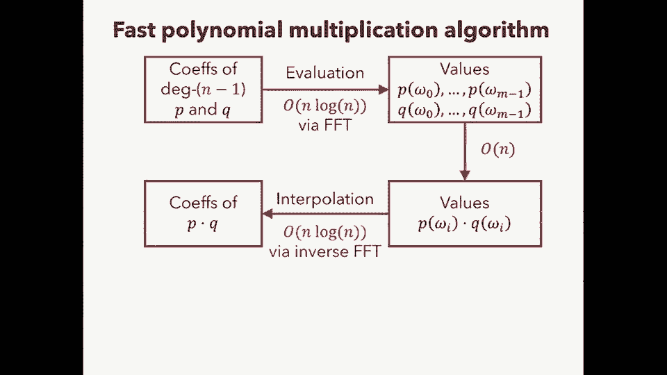

给我点时间，这个有点慢，抱歉，再说一遍，啊，如果j为零，那么这是欧米茄零，欧米茄零总是被定义为一，所以这只是一个，现在一个升到k，总是一个，现在我把k=0中的1求和，到m减1，所以那只是我，顺便说一下。

如果你真的想试试这个公式，另一个有趣的例子是j=1，其实让我告诉你，当j等于1时，这是欧米茄1和k，但是欧米茄1对K是什么，根据这个公式，只是欧米茄K，所以这是统一的所有根源的总和，你知道的。

所有团结的根为每一个团结的根，团结有一个相反的根源，所以所有统一的根源，他们给你零分，好吧好吧，这是对一般情况的提示。

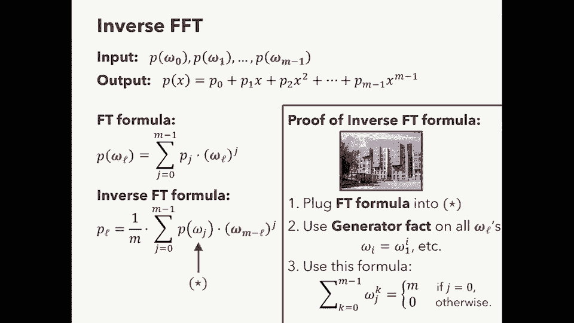

好啦，嗯。

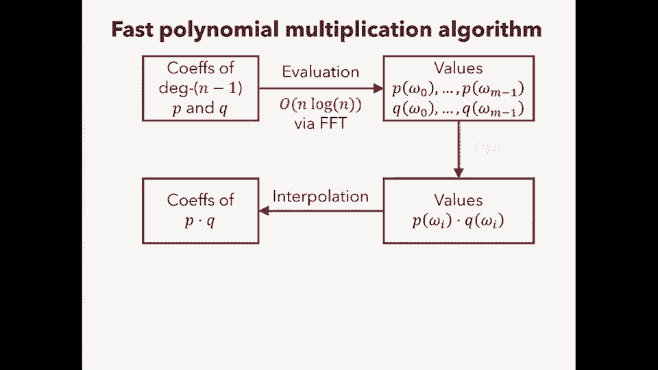

让我告诉你们一点关于矩阵的观点，如果你像个矩阵书呆子，你会喜欢这个的，嗯，我们想计算一下，或者我们有这个多项式，P，嗯，我们想计算这些m值，欧米茄零的P，欧米茄1的P，欧米茄2的P，降至欧米茄n的p。

减一，我把它们写成向量，好啦，所以就像一个，你知道的，高度m矢量，好啦，现在让我把这个公式，每一个欧米茄p的巨大公式，对不起，这看起来真的很难看，但我不得不这么做，所以第一行我们插入欧米茄零。

我们得到p0加p1，欧米茄零加p2，ω0的平方一直到pm-1，0到n减去1，所以我们只是插入欧米茄零得到我们的第一条线，第二行，你知道我们到处都在插欧米茄一号，所以我们在这里得到欧米茄1。

欧米茄1的平方一直到欧米茄1到n减去1，然后我们对欧米茄2这样做，我一直在这里翻身的方式，然后我觉得我不是在对着麦克风说话，我这么做的时候人们能听不到我说话吗？还是人们能听到我，后面的人是罚款。

没关系的，好啦，谢谢好的，然后最后一行，你知道我们在所有地方都加了欧米茄减一，好啦，所以这只是一个巨大的矢量，我已经写出来了，看着有点可怕，我把这个向量叫做b，只是为了方便。

我声称这个向量实际上等于一个矩阵向量，乘法，这个矩阵乘以这个向量，好啦，那又怎样，为了简单起见，这个矩阵是什么，我把这个矩阵叫做m，所以m是矩阵，第一行只有一个欧米茄零，欧米茄零平方。

所以这只是欧米茄零的所有力量，第二行是1ω1ω1的平方，所以这是欧米茄1的所有力量，然后我们得到欧米茄2的所有力量，一直到欧米茄n减去1的所有幂，所以这是一个m乘m矩阵，然后这个矢量，这是什么？

这只是系数向量，我把它写成括号p，这是我的多项式的系数向量，它声称这个矢量，这是我们问题的输入向量，然后这个矢量，输出问题，它们只是通过乘以m来联系，好啦，那么我们如何看待这一点呢，又有点难看了。

但让我一行行地给你看，为什么这个产品是真的，如果我把一个矩阵乘以一个向量，我要得到另一个矢量，这个向量的每一条都是点，矩阵的一行与此向量的乘积，让我们看看这一行和这个向量的点积是多少。

是p0加p1ω0加p2ω0，平方一直到PM减去1，欧米茄零到m减1，正是这句话，零加一欧米茄零，好啦，让我们再做一行，这个矢量的点积是多少，在这个向量中的这一行m。

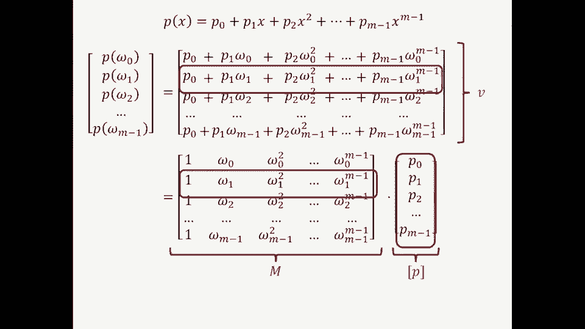

嗯，它是p 0得到了p 1欧米茄1。

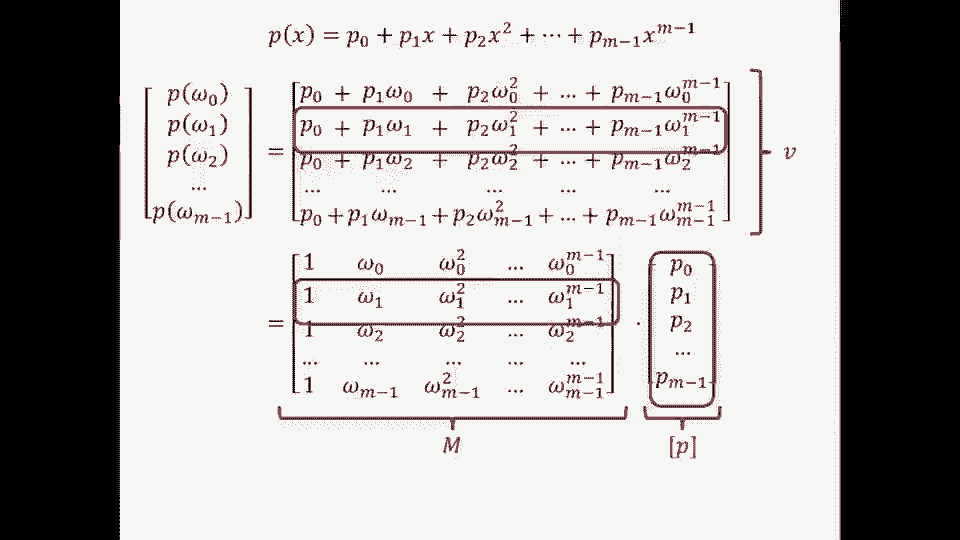

我们得到了p 2ω1的平方，一直到下午1点，1到m减去1，我们知道了，然后你可以对b的所有其他条目做同样的事情，好的，所以这确实是一个真实的事实。

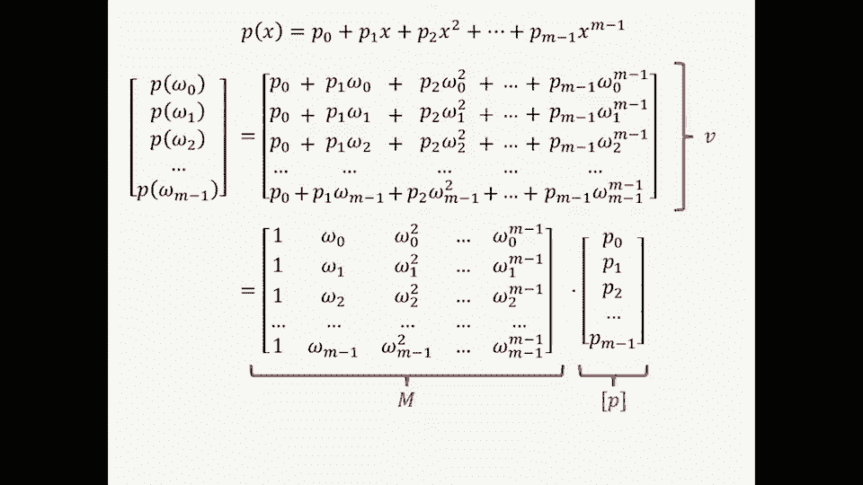

好啦，所以嗯，假设我不知道快速傅里叶变换或类似的东西，嗯，这只是一个矩阵向量计算，乘法，对不起，这是矩阵向量乘法，如果我们执行这个任务，那就是我们要做的，如果我做一个矩阵乘法，向量乘法，对不起。

我们看到了这个，我想在哈格洛布教授的第二讲，这实际上需要n阶平方时间，天真地，你知道的，我必须在这里计算m值，它们中的每一个都像一行和一列的点积，这些行的长度是m，所以每行需要n次，你必须对m行这样做。

所以这是n阶的平方，但这正是快速傅里叶变换解决的问题，这是一个考虑系数表示并将其转换为，价值表示，它以n log n的顺序，所以这有点像一个神奇的矩阵，我可以把一个矢量乘以那个时间矩阵。

比这个平凡的n平方算法快，现在我想指出的是，快速傅里叶变换，就像我说的，它隐含地执行矩阵向量乘法，所以让我做下一个，其实呢，我想说的是它执行这个计算。

但我们只是在不知道它是矩阵向量乘法的情况下推导出了整个算法，快速傅里叶变换，它解决了这个乘法，而没有实际写下矩阵，所以它不是坐下来的，写下M，乘以p得到左手的东西，它只是解决了输入输出问题。

就像给定一个向量p，计算此乘积，所以这有点神奇，我是说，不是每个矩阵都能简单，你能这么快就繁殖吗，但是这个快速傅里叶变换矩阵你可以。

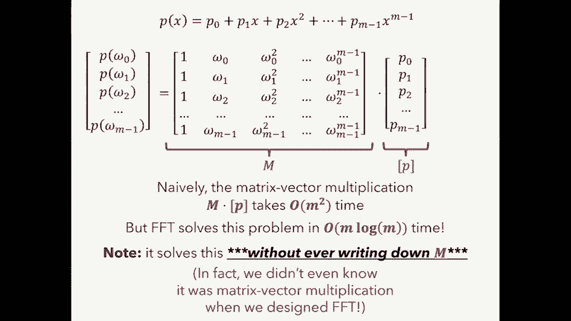

好啦，这是一个傅里叶变换矩阵，如果我们想从系数到值，但事实证明，你可以做另一个矩阵，如果你想做逆傅里叶变换，所以在那个里面，当我做逆傅里叶变换时，我想啊，从ω0的p到ωm的p减去1的向量开始。

所以值表示，我想把它转换成系数表示，我想做的是，我想把它乘以一些矩阵，它将把我的值转换为系数，你想告诉我我应该在这里放什么矩阵吗，也许是还没说过话的人，刚才有人大声说出来了，是啊，是啊，m的逆。

你知道你应该一直只是如果这是这样就像M乘以那个，如果我想在这边移动一个矩阵，我应该乘以m逆数，吊杆，是啊，是啊，所以这是正确的答案，好啦，所以逆傅里叶变换很快就完成了矩阵向量乘法，什么是m反井。

让我先告诉你一个很好的公式，然后你们就能看到m的一个很好的公式，m对m逆so m，我们可以看到m的公式，我的行，它总是像你有欧米茄潜艇I，第j栏告诉你把它提升到什么力量。

所以m ij就是欧米茄i升到j次方，现在我对到此为止感到满意，那是个公式，但是有些人真的喜欢把这个公式变得更加对称，利用我们的生成器事实，上面说欧米茄i只是欧米茄1升到第i次方。

但这是欧米茄1上升到第i次方，然后上升到j次方，这真的是欧米茄1提高到ij次方，我乘以j所以现在看起来很对称，关于i和j，这不仅仅是一个好的公式，欧米茄逆呢，嗯，嗯，事实证明我是说，这是事实。

你可以查一下，如果你想，这是第1个条目，哦对不起，应该是1/m不是1/n，很抱歉，但它和这个的公式是一样的，第1个条目，是欧米茄，好啦，不是欧米茄i到j，但它是ωm减去i到j，很相似，你可以。

如果你想从逆傅里叶变换公式推导出这个公式，我们看到了一些幻灯片，好啦，这就是我们所做的一切的矩阵观点，我们甚至没有意识到，当我们设计矩阵乘以向量的算法时，对此有疑问，顺便说一句，这和。

我想你看到了哈达玛矩阵，我觉得背诵一课，这实际上是一个非常类似于矩阵的矩阵，关于这个的问题，如果没有问题，我想继续申请。

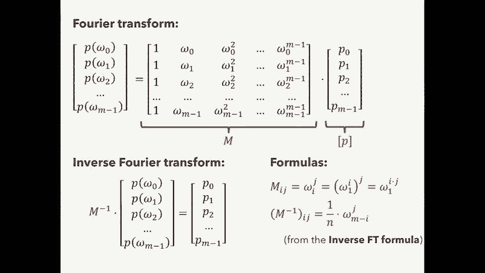

幸运的是，我想我没有时间同时做这三件事，但我会试着给你一个第一和第三个，我可能会做第一个有点快，所以我道歉，嗯好吧，所以多项式乘法的一个应用，让我们看看我们用多项式乘法做什么，再来一次。

假设我们有两个多项式，P和Q，他们的学位有四个学期，三个，你也知道，我们想把它们倍增，所以p乘以q，让我们看看当我们把它们相乘时，当我们看x平方项时会发生什么，所以在乘积多项式中，x平方项看起来像什么。

我如何得到X字术语，我只是考虑从这边和这边取东西的所有方法，乘以2，就像p 0的度数是0，x的平方有度2，所以当你把它们相乘的时候，你得到p 0，Q2 x平方，那是第二级，你还可以从p，1，x乘以q。

1，x，那是第一张，q 1 x平方，所以这是第二级，然后你也可以得到p2 x的平方和q 0，那是p 2 q q 0 x的平方，嗯，现在注意有一个很好的形式，所以这将是x的平方乘以一些数字。

那些数字是什么，嗯，我总是拿一个圆周率乘以一个q j，使得i加j等于2，所以下标总是加到两个，让我们对x立方这样做，所以x的立方是p 0 q 3 x的立方，加p 1 q 2 x立方。

再加上p2q 1x立方体加上p3q零q，我们有，它们都是X立方的，它们都是π乘以q j，其中i加j等于三，所以p2q一二加一等于三，所以这个的一般公式，一般的规则是当我们看x上的系数时，i和p乘以q。

我们得到的是p0，q，i，plus，p1，q，i，minus，1，plus，dot，点加p i减1 q 1加p，我问零，如果你看这些下标中的任何一对，他们总是加我，这就像你所做的事情的一般公式。

当你做多项式乘法时。

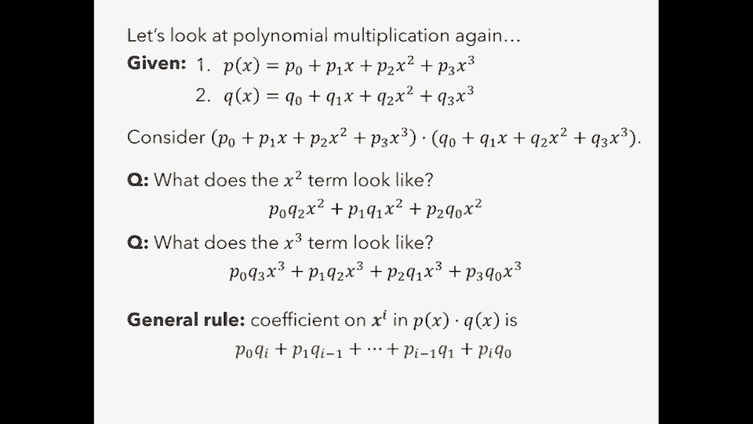

好啦，所以这是我们的一般规则，它只是所有对的总和，它们的下标添加到，I，让我告诉你另一种看待这个的方式，结果很有趣，有时让我们考虑两个数组，第一个是数组p0到p3，我以为我修好了，好啦，第二个。

这应该是q 0，很抱歉，从q 0到q 3，向后，我们要做的是把它们叠起来，然后取向量的点积，但只有重叠的部分，所以有时我们会把它们叠在一起，但有时我们会转移它们，然后把它们堆起来，例如，嗯。

如果我们把它们叠起来，它们在哪里重叠，嗯，他们喜欢完全重叠，所以让我们把所有东西的点积，p，0，q，3，一二三，P二Q一，三点零，那口井是什么？你知道根据我们的一般规则，那是执行时的系数。

现在让我们把p数组移过来一点，它们在哪里重叠得很好，只有在这里，只有中间的三件事，让我们把这个的点积，它是p 0乘以q 2加p 1乘以q 1，加p 2乘以q 0，但那是什么，嗯，不是别人。

正是多项式乘法中的系数，在x平方上，让我们再做一个好玩的，再把它们移过来，P零P一Q一Q零，那是他们重叠的地方，点积就是，你知道的，下标之和为一，所以这只是x上的一个系数，所以说，如果我们想尽一切办法。

把点乘积，等于乘积多项式的所有系数，因此，如果我们把这两个向量，考虑所有计算这些的方法，比如移动的点积，我们可以通过快速傅里叶变换在n，log，n的时间内做到这一点。

所以这正是快速傅里叶变换要解决的问题，好啦，所以这给了我们第一个应用程序，叫做互相关。

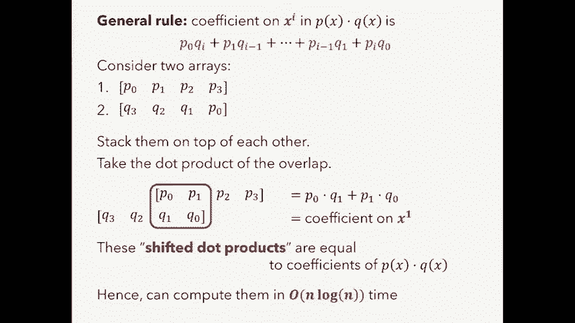

我们只是得到了这两个数字数组，P零到P n减一，n减去1到0，让我把第二个换一下，它的名字倒过来有点烦人，我把它写成q 0到q的负1，互相关就是计算所有移动的点积的问题，所以像这个，这个点积，这个点积。

所有移动它们和计算所有点积的方法，这就是所谓的互相关问题，如果我们用不同的方法移动p和q，它们的不同部分重叠得有多好，我们可以用多项式乘法按顺序和log n时间解这个问题，而且真的，我只想说。

这是一个经常出现的问题，在你意想不到的地方，所以你们在复习中应该注意的是，在家庭作业上，也许是考试的问题，你似乎想一次计算很多点积，你可以说这是互相关，我们可以按顺序做，并及时登录，好啦，我会说。

有时互相关会涉及两个不同长度的向量，但同样的算法也会起作用。

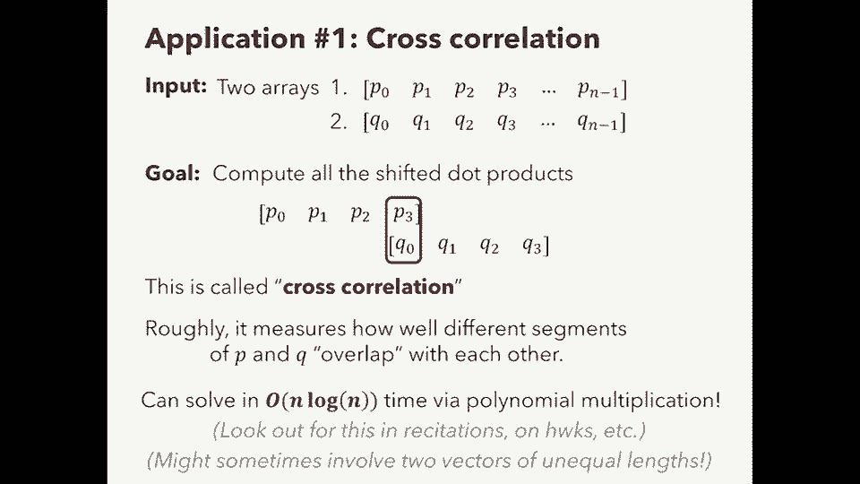

好啦，嗯第二次申请，不幸的是，我们得跳过，我只想去一个高级的地方，你可以用我们在这里看到的来乘整数，按顺序n log n log n时间。

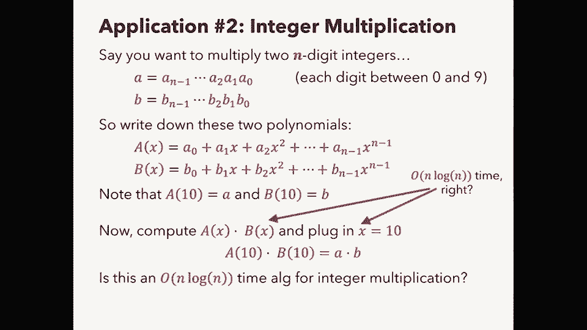

那是一张悲伤的脸，您可以随意浏览幻灯片，看看如何，因为，我真的很想走到最后，就像，为什么这甚至被称为傅里叶变换，你可能在现实生活中看到过傅立叶变换，如果你身体不好，你将看到一些看起来像它的东西，不过。

管他呢，我来告诉你，就像人们会呼吁在现实世界中进行变革一样，它看起来一点也不像我刚才告诉你们的上两节课，那么两者有什么联系呢，嗯，让我通过看，不是傅里叶变换，但是傅里叶逆变换，从ω0到ωn减去1。

我想计算系数，p零到p的n减去一，所以让我给你看这个图片，哦耶，所以你知道p总是这样写的，嗯，我想做的是给你看这个图片，通过绘制它，所以x的p，让我们想象一下，当我们从欧米茄零开始时，绘制x的p图。

欧米茄1欧米茄2一直到欧米茄，应该是m减1，对不起，对于你知道的每一个值，ωp都会有一些值，所以这可能是p的情节，我们要做的是表示p，X立方，以此类推，让我向你们展示这些函数的曲线图。

当我从团结的根源来评价他们时，好啦，什么是一个人的情节，当你从团结的根源来评价它时，好吧，一个总是一个，插上什么并不重要，所以它只是一个常数函数，但是当你在统一的基础上评估x时，它是什么样子的呢。

我只画真正的部分，所以如果你记得x，现在每一个欧米茄零，只是输出欧米茄零的真实部分，嗯，欧米茄零的真正部分是什么，记住它只是欧米茄零角的余弦，欧米茄一号，欧米茄2和这些角度它们只是绕着圆圈旋转。

所以这是x，当我为所有这些不同的欧米茄值绘制它时，它会给我一个余弦函数，X平方，它只是会给你很好的，是相同的余弦函数，除了我在这么做，所有的角度都以两倍的速度，所以它的速度将是原来的两倍，余弦函数。

好啦，那么反向傅里叶变换，只是在说，我有这个，这个奇怪的功能，我想做的是把它表示为常数函数的组合，所有这些余弦函数。

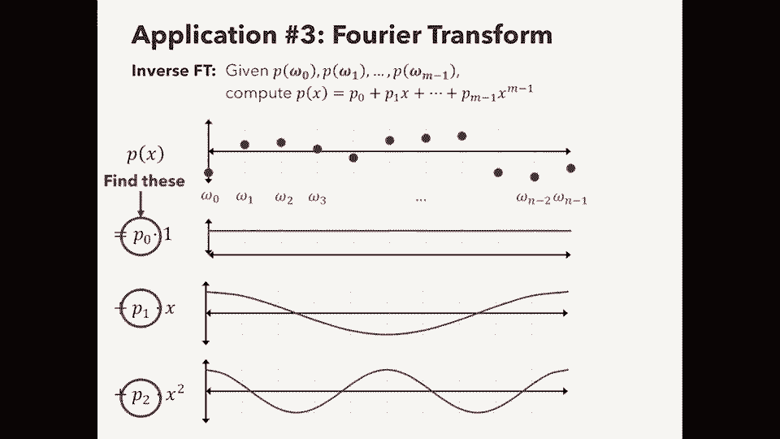

所以换句话说，傅里叶变换只是说，给定如下所示的数据，分解成正弦和余弦波，这就像是最重要的算法，有史以来最重要的算法之一，提到它喜欢什么音乐软件，像你的声音一样分解，它会听这首歌。

然后像这样发现你的声音在，使用它，你的心率监测器，如果你使用有氧运动设备，上面写着你的心率，利用傅里叶变换，它能听到你心跳的频率，它计算出哪个正弦波最接近，任何信令信号处理都使用，我就不说了。

它出现在量子算法中，我只想以一张历史幻灯片结束，傅里叶变换是约瑟夫傅里叶在1822年发现的，我你知道，你自然会期待，这意味着快速傅里叶变换，我们刚刚看到的这个算法是在1822年后发现的。

因为时间就是这样，但实际上，我们看到的快速傅里叶变换是高斯在十七年前发现的，在1805年，是啊，是啊，他说，它减少了乏味，从那以后，它被重新发现了大约十次，嗯，有一份很好的报纸。

我推荐阅读这篇高斯和快速傅里叶变换的历史。

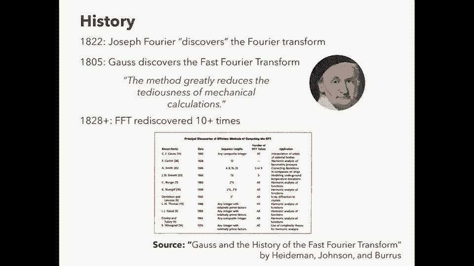

最后卡住的发现是在1965年，作者：库利和图基，他们最初的应用实际上是使用快速，傅立叶变换从苏联发现核武器，通过分析地震数据比如地震之类的。

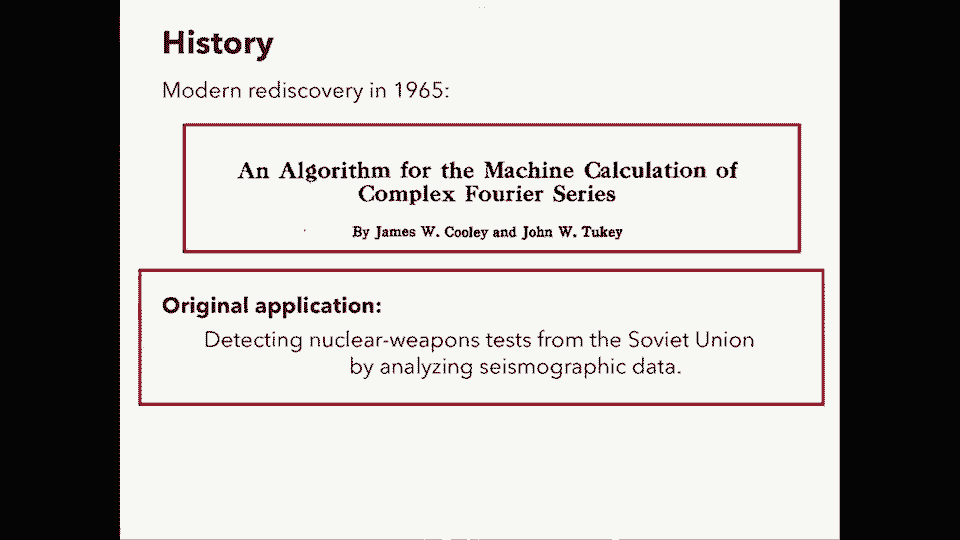

所以这就像是一个有趣的小领带，你知道的，一部正在上映的著名电影，好啦，就是这样。

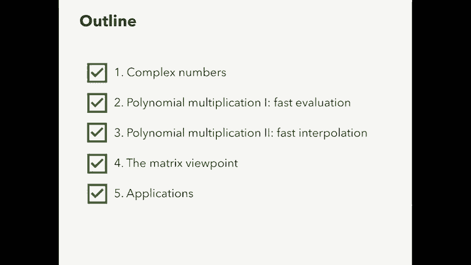