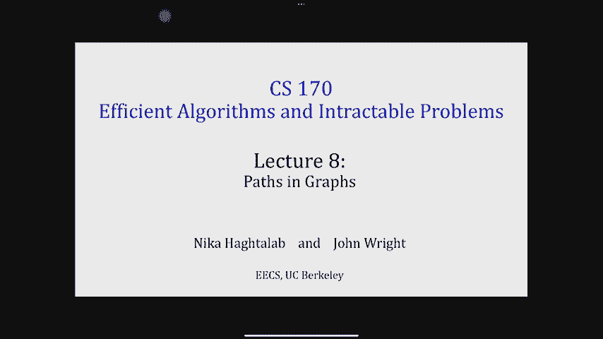
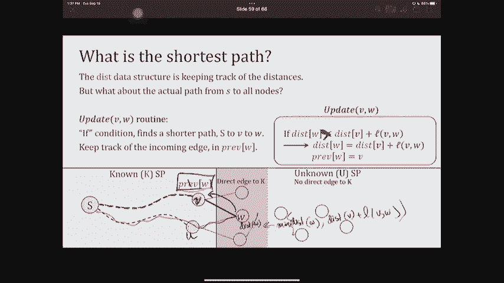
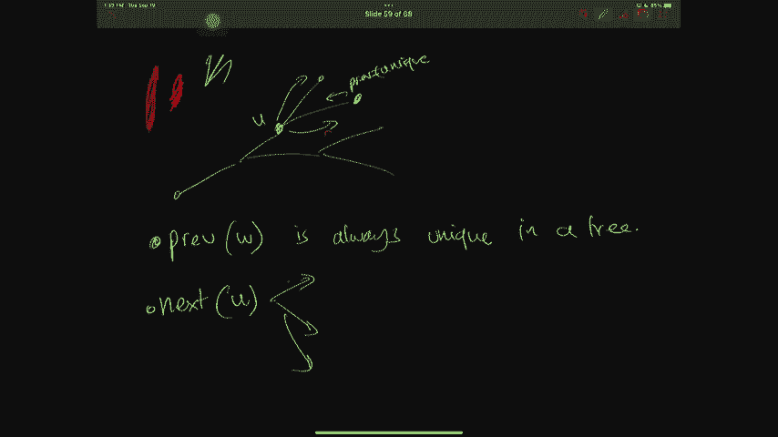
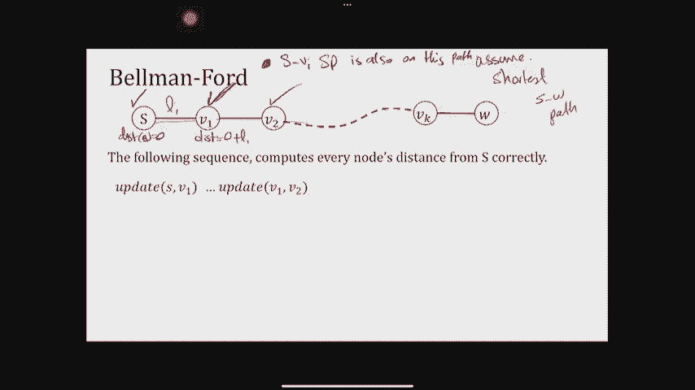

# 加州大学伯克利分校算法课程CS170 - P8：Lec8 Paths in Graphs - 东风渐起UCAS - BV1o64y177K8

你好，最近怎么样？好呀，好酷，我们马上就开始，现在是十二点三十分，已经到了学期的时间了吗，那件工作堆积如山，你再也跟不上了，是啊，是啊，很多手，点击率在颤抖，这就是我的感觉。

所以它总是压倒性的大约一个月和，有什么值得兴奋的吗，感到兴奋的是，是啊，是啊，是啊，是啊，我喜欢你的态度，你应该兴奋吗，家庭作业里会有一些图表，而不是，哎呦，是啊，是啊，真的很有趣，我敢打赌你是对的。

我很高兴我不用教那个讲座，其实呢，所以我决定去旅行，玩得开心点，你知道的，做一堆演讲，然后让约翰来教，所以是的，你应该很兴奋，会有图表，你对FFTS和分而治之做得更多，诸如此类的事情。

当然我们离期中考试不远了，FFT是期中考试的一个话题，所以好吧，我们要开始了，所以说，如果你现在进去，坐下来，求求你了，好啦，所以我们今天会更多地讨论图，在下节课中，所以这是一堂课，八路图。

上次是DFS今天太棒了，我们将看到其他很棒的算法，但让我们从一些公告开始，第一个是出来的作业和讨论，所以如果你对你的家庭作业做得很好感到放心的话，祝你有四个好运，我想这更容易，嗯。

另一件事是我们对办公时间做了一些改变，我们注意到你对去，星期二办公时间，因为你刚做完家庭作业，所以我们移除了一些，然后我们在其他日子里增加了更多的时间和办公时间，从我们看到的出席率来看。

希望一些已经更加拥挤的办公时间，在那些日子里，你会看到更多的TA支持，原来如此，然后你一直在问，过去两堂课的注释版本在哪里，我也有同样的问题，尽管我的iPad在下课后就保存了这些东西，为了我的生命。

我不能，找到这两节课的墨迹版本，所以我可以告诉你我很抱歉，我的iPad没有保存它，狗吃了我的家，我的作业，或者我可以告诉你，这是期中考试的一个很好的练习，去经历，你知道我们发布的视频和空白幻灯片。

为自己做注释，如果你想和我们分享注释版本，而且看起来很棒，我们也可能在网站上使用您的注释版本，所以无论如何，只是为了确保我的注释今天不会再被擦掉，我已经做了一个注释测试，你作证，起作用了。

它在上课前就起作用了，所以希望在下课前它能起作用，也是，好啦，酷，这些是公告，回顾上两节课，我们讨论了探索图，我们有深度优先搜索算法，这是一个很棒的算法，我们看到了两个应用程序，拓扑排序和强连接组件。

今天你们将看到更多的图表，尤其是一种完全不同的探索图的方法，这次有不同类型的结构，我们正在寻找，嗯，我们将要寻找的算法，BFS是样式还是广度优先搜索嗯，你在61年见过他们中的一些人。

但我们要挖得更深一点，今天很重要的应用是寻找最短路径，从一个节点到另一个节点，尤其是从一个节点到其他地方，那么你为什么要关心这样的问题呢，这是个问题，我每天或每周都要面对，嗯，我不能很好地在校园里导航。

即使你认为你应该可以从任何一点，A至B，我发现我对伯克利校园地图的记忆和理解相当有限，我在西伯克利有个办公室，这不是你们很多人熟悉的建筑，但我得去汽水店，约翰的办公室就在那里，所以我们在一起的时候。

我得找到去惠勒的路，这需要一些练习，嗯，有时我使用穿梭机，停止使用巴特，有时我在寂寞的公园里散步，或者拜访朋友和克拉克·克尔，也有地方，我喜欢去看日落，我是说我们住在伯克利，我想那是你知道的。

你也喜欢的活动类型，如果我真的想从伯克利西部，其中一个日落地点，我真的不知道怎么去找他们，除了走这些路线，所以我想知道的是，我每天应该如何从办公室导航到所有这些地点，但也让我不用花很多时间走路，嗯。

这还有其他应用，你知道你在网上，我们一直在路由包裹，我们想知道，将包裹从一个地方路由到另一个地方最快的方法是什么，所以我们想的是，让我们看看图表，忽略地图，我们特别想知道如何从一个地方。

在我的办公室里尽快到其他地方，或者将某些东西从单个源路由到您想要的每个可能的节点，所以这被称为单一来源，最短路径问题，这个问题的输入是一个有顶点和边的图，有时也有长度相关，有了这些边缘，我们以后再说。

输出是有一口井，输入有一个特殊的节点s，有时我用小S写，有时我用大写的S写，小S其实更常见，但我一直在用大写字母为你们命名节点，所以我们将看到两者的输出，你需要的是计算这些磁盘函数。

最短路径的长度是多少，从s到任意顶点，U表示顶点集中的所有顶点，所以这是一个单一的来源，最短路径问题，如果你能解决这个问题，对于DFS来说，这不是一个好的应用程序，因为dfs，我们说它总是像深度第一。

你知道它走得越远越好，直到它不能再往前走，所以如果我想在这里做dfs，假设我想在我的办公室运行一个DFS，伯克利西部，我有可能找到这条通往日落的路，我仍然应该继续FS运行还没有完成。

但让我们看看也许我会这么想，从伯克利西部到苏打镇最快的路，就是通过CS七十T，这就是DFS三人的建议，事实并非如此，因为有一条更直接更短的路径，DFS就是找不到这个，因为dfs会尽可能的。

实际上是在它回来之前从一个消息来源，所以我们需要一种完全不同的方法来探索图，这不再是深度的问题了，那么什么是探索最短路径图，对DFS来说会很好，我们说想象一个迷宫，你知道牛头怪和忒修斯。

就像他在穿越迷宫，他必须尽可能深入，用粉笔和绳子去找牛头怪，最短的路径，这不是你应该做的，我们真的应该考虑鸟瞰视角，就像我有一个邻居，我想看看离我最近的是什么，那么下一个离我最近的是什么呢？

然后下一个离我最近的，这就是我们想要做的探索类型，我们应该受到鸟瞰视角的启发，或者好像我可以直接飞到最近的，就像我可以在一分钟内飞到的范围，然后我可以在两分钟内飞行到的范围，那么这看起来像什么，本质上。

我们想探索最近的社区，所以先探索我的源的直接邻居，然后在我这样做之后，我想探索他们的邻居，所以现在我要说，那些我还没见过的邻居的邻居是什么，让我来探索一下，然后在下一轮我就像，邻居的邻居是什么。

我没见过的邻居，让我来探索一下那些等等，这样就会开始创造这些战线，他们很亲密，然后一步之遥，然后两个人走开，然后三步远，这是广度优先搜索算法的高级思想，好啦，那么这些事情的算法是什么样子的，嗯。

这真的取决于我们将使用什么样的图，我说目标是我有一个单一的来源，我希望能够从单一的来源导航，到我图中的每一个地方，有可能这个图上的所有边都只有长度1，你知道的，每次我取得优势它的长度都是一样的。

也许是一样的，你知道的，一条非常规则的街道的街区，就像在曼哈顿的某个地方，不是在伯克利或奥克兰，也有可能只是重量完全不同，到这些边缘的长度，所以发生的一件事是，在这个例子中，我向你展示了我的优势。

从伯克利西路大楼到苏打，花了13分钟，但是从伯克利路西到巴特车站只花了五分钟，也有可能你有不同的边缘，因为你可以坐穿梭机，从穿梭机停到劳伦斯大厅看日落，比你走在其他边缘要快得多。

所以有可能有这些函数的长度，这些长度函数告诉我们边和边的长度，有不同的长度或不同的重量，我们证明L通常是正的，比如我要走多少路，我得花多少时间做某事，我买东西得花多少钱？但也有长度可能为负数的情况。

我以后给你们举几个例子，但我想让你注意的是，从未加权到加权，正然后到任意权重，我只是把问题弄得越来越笼统，你知道的，我给你越来越多的回旋余地，在选择边代表什么时，那我为什么要这样做。

那是因为我有三种不同的算法可以处理这些情况，所以特别是对于未加权图，我们将看到广度，加权第一搜索算法，但是正图，我们将看到Dijkstra的算法，对于任意长度，我们将看到贝尔曼·福特。

每种算法都比另一种更通用，但它的效率也比另一个低，所以如果我确定我的边缘重量是正的，我不应该用行李员福特，贝尔曼福特是一个更慢更笨拙的算法，如果我确定，我需要处理负面影响，然后我会用贝尔和。

所以我们今天要看三种算法，上面的三个人，我们会看到他们实际上，一个建在另一个之上，这就是今天的计划，关于计划的问题，我还没有告诉你任何技术性的东西，好吧，让我们开始这个计划。

你们中有多少人在以前的课程中见过BFS，好啦，61 b，你已经看过了，你觉得你知道，但请原谅我，让我们看看什么样的直觉，我们还可以在上面建造，但为了提醒你BFS是做什么的。

尤其是如果你想把它看作是从单一来源开始的BFS，所以它需要一个图g和那个节点s，它将从分配开始，通过制作一个距离数组，这最终将是距离，作为输出，作为s到任何其他节点的距离，既然我们知道源头就在源头。

它只是说从那时起距离为零，它会有这样一个列表，其实是排队，从那时起，它把s加到q上，它要做的是一个while循环，它一直看着这个队列，如果有什么东西还在排队，它会让它出线，所以它会把它拿出来。

从队列中删除，把它拿出来，然后它看着它所有的邻居，更新邻居的距离，它是如何更新的，上面说得很好，我刚刚退出的事情，我会看这个距离，然后再加上距离，加上一个给它所有的邻居，这就是dfs所做的。

让我们看看当我们在图表上实际运行FS时它是什么样子的，所以我要思考这个问题的方式，就在我把东西放出来的那一刻，我把它涂成橘黄色，当我处理完这整个社区，对于所有v这样的uv和e，那我就把它标成蓝色。

让我们先来看看，你知道的，将距离设置为零并将s添加到队列中，所以从这里开始，我要采取的第一步是看看队列，队列为空吗，上面有一个节点S，所以我会把它划掉，智商，然后我看着所有的邻居。

尤其是那些距离仍在无穷远的，好吧，我看着它，所有这些距离都是无穷大的，所以我要做的是，哎呀哎呀，对不起，我开得太快了，我会把这些都加到队列中，所以我在队列中添加了一个C D E，然后我更新他们的距离。

到s与自身的距离，加一个，所以这些都变成了这个，到目前为止还有什么问题吗，好啦，下一轮呢，好吧，下一轮我看着排队的人，不是空的，所以我会把它的第一点，这是节点a，然后我看着A的邻居，2。

在这附近有什么东西，其距离仍是无穷大吗，嗯，我看起来，我看到b是一个距离无穷远的邻居，所以我在Q上加B，然后我把b的距离更新为，加1的距离，好啦，然后我会继续，我看着我的球杆，我还没说完，有C。

我要取消，我会看C，我看着它所有的邻居，现在告诉我，我在队列中添加了什么吗，否，为什么不呢，对所以，就像费拉兹说的，C的邻域中没有一个距离是静止在无穷远的，所以没有什么要排队或没有什么要更新的。

所以我会继续做同样的事情，因为d d恰好没有距离为无穷远的邻居，所以我会继续前进，同样的事情，E也没有任何人仍然在距离上，无限，所以我继续前进，现在我看着我的球杆，上面还有一个节点，那是我的亮点。

B我把它取出来，我看着说，嗯，它有邻居吗，原来它确实有一个邻居，那仍然是一个无穷远的距离，那是F，所以我看f，n，q，f，我把这个距离更新到，B的距离是多少，加一个，所以就变成了三个。

然后下一轮我就用完B了，唯一剩下的就是f f没有邻居，我划掉了，没什么要更新的，就这样了，所以现在我的队列上什么都没有了，所以我完蛋了，这是BFS，关于跑步有什么问题吗，比如我们如何运行这个算法。

好问题，所以你是在问，为什么这个算法是正确的，好啦，所以你是说当我完成这个，本质上，这看起来像是一堆基于，当事情排队的时候，所以我在第一轮排队，然后我更新了它所有的邻居，我唯一一次真正排队是在B。

所以这最终是一个距离，然后是三个，那么为什么这是一个好算法，让我看看，为什么这是一个好算法，就像，为什么我再也不回去了，所以这里的一件事是，对我们来说，就像问，当我看着B，我只看不在我队列里的东西。

我为什么不回头看一个，它实际上是通过归纳法，因为，如果我们假设，因为，如果我们假设我们找到了，到现在为止，所有的小路都在远处，让我们说，嗯，然后下一轮我在距离3的地方发现了一些东西。

我永远不应该试图从三个倒退到我以前发现的任何东西，因为任何经过距离3的东西，然后回来会更长，所以这是一个很高的水平，为什么这个算法是正确的，我们实际上不打算证明这一点，你已经在61年看到了它的证明。

但这本书也会涵盖它的证据，直觉上还有其他问题吗，那么我可以将BFS应用于负长度吗，有人想回答这个问题吗，对呀，我刚才说的对负重来说是完全不正确的，因为假设我在距离3的地方发现了一些东西。

然后也许那个距离3的家伙会有优势，尤其是像一条直线，零下10度，所以也许三减十就值得了，以负距离结束，就像我说的，我们将要看到的三种算法，广度优先搜索，戴克斯特拉和贝尔曼福特，每一个都比上一个复杂。

BFS是一个只能处理边缘重量正好是一个，事实上，它甚至不能处理边缘重量，如果他们是不同的长度，因为同样的原因，也许当我加上s，然后我看一个b，c a、c、d和e，也许C比S远得多，然后B是如果我想通过。

所以BFS是正确的，但前提是边缘不加权，好啦，所以这是BFS，我想你们都见过很多次了，但是让我们来看看BFS的运行时，BFS的运行时，让我们对dfs的运行时采取一种非常相似的方法。

如果你还记得上次我们基本上是说，我打了多少次电话，探索一些东西，那么探索的费用是多少呢？我没有什么叫探索的东西，但我可以谈谈排队的问题，排队和出线需要多少时间，当这种情况发生时，我该怎么办。

我很好地排队和出线一个节点，如果图正好连接一次，如果图不连通，我不是做一次就是做零次，好的，因为一旦我加了，然后我把它移除，没有其他邻居会突然变成，它的邻居，再加回来，所以每个节点都要排队和出队一次。

这么说吧，因为我有一个铜，添加一些东西和删除一些东西是非常容易的，我只是把队列的顶部，你知道这不是命令，所以它只是脱下一个，好啦，一旦我出列一个节点，我该怎么处理它，我看着它所有的边缘，它所有的邻居。

对于每一个邻居我都要看看他们是否通过了，如果条件，如果他们这么做了，我确实需要更新一下，所以这是我正在做的一些动作，节点u的每个邻居和节点u具有u度，邻居数和更新，所有这些都让一个人。

所以我在每个节点上花费的总金额，更新它的邻居只是它的全部程度，到目前为止我们还好吗，然后我们看到了一些非常相似的dfs，它说，我要在每个节点上总结一下，我付一个固定的，我付学位，一旦我总结起来。

这个常数变成n，这个度变成许多边，所以这向你证明了BFS的运行时也是n加m的，和节点数，边数，关于这个的问题，好的好的，啊，有一个问题，没关系，所以这是个好问题，如果节点不打开，如果已经出队了。

检查他们是没有意义的，但这也不能为你节省那么多时间，而且我写算法的方式确实要求你检查，从某种意义上说，如果它出队了，你还得跟踪它，所以你还在检查边缘，我再多说一句，如果它曾经被排队和退队。

距离不再是无限，所以如果可以的话，它不会通过这个，其他问题，酷，所以说，这是巧合吗，BFS的运行时与DFS的运行时完全相同，我不是对你完全诚实，因为实际上我写的算法只是写dfs的不同方式。

如果我改变数据结构，所以我在这里说有一个Q，然后我在一个，我只是不停地添加，然后当我想移除的时候，我从第一个中移除，如果我将数据结构从队列切换到堆栈，所以当我添加一些东西时，我想删除，我从末尾删除。

该算法成为深度优先搜索算法，为什么在高层，我添加的东西是最遥远的东西，我已经走了这么远，所以如果我带着它们去探索它们，然后添加更多的东西，就好像我在尽可能地走得更远，首先，在我回到以前的事情之前。

所以dfs和bfs算法的区别就在于数据结构，对于BFS来说，我们使用的是先出后出的队列，Dfs，我们现在用的是一个堆栈，我们没有将其实现为堆栈，当我把它写在幻灯片上的时候，我把它实现为递归调用。

但在家里，你可以用一堆东西练习和做FS，看看这到底会是什么，和我为你写的算法一样，你可以在家里证明，好啦，关于BFS有什么问题吗，接下来我们要看的是加权图，我只想谈谈为什么BFS不起作用。

然后我会让你休息一下，然后我们再回来讨论，就像这样，如果图有权重，问题是我不能忽视这些权重，假设我做了，如果我真的忽略了它，然后BFS将找到带有红色边缘的路径的最短s，但实际上最短的路径应该经过。

所以有一条路径有更多的边，但就重量而言，它实际上更短，所以我永远不应该忽视这些重量，这个结构仍然有一些非常好的东西，也就是说，你仍然可以在，到目前为止你找到的最短的路径。

所以我们将要看到的这个非常有用的事实，他说想象你有一条最短的路，从s到v把它画出来，所以我有s，我有v，这是帕特，想象一下，这是你找到的最短的S到V路径，然后对于此路径上的任何其他顶点w w最短路径。

从S到V对不起，S到W也是这条路径，这是我想提出的主张，好啦，我该怎么做，我该如何证明这一点，矛盾你同意矛盾吗，好的好的，我们将用矛盾来证明这一点，如此矛盾，所以我想，而不是q，让我说这是q。

然后我要做的是找到一条更短的路径，那么这说明了什么，如果是这样的话，它意味着在路径q上测量的距离，我只是把它作为距离的下标，S到W小于距离，如果我用p来测量它，甚至是更短的SV路径。

因为它的长度是q的d，我们知道它小于p，s，to，w的d，这是p s的d，事实上，在这里你甚至可以这样说，所以这是一个矛盾的证明，一个非常简单的，嗯，但它仍然跟随，你知道我告诉你的关于图表的标准事情吗。

每当你想证明一些关于图表的事实时，你可能会喜欢，拿去吧，就像关于小路，或者你可能想后退几步，从你试图证明的实际事情和证明中间的一些东西，所以这就是为什么我们本质上证明了W是这样的，所以这意味着什么。

我们应该考虑的最短路径，是建立在其他最短路径上的版本，但是只增加一条边，这就是我们休息之后要处理的直觉，所以是十二点，我们1点15分回来，如果可以的话，请关上礼堂的门，好啦，十秒后开始，所以如果你回来。

我在果岭上多写了一点，绿色的，对于那些想要任何子路径的更正式的声明的人来说，最短路径的最短路径，所以本质上如果p是最短的sv路径，我在p上取任何w，最短的SW路径也是p井，那个部分，酷。

那么我们如何利用这个事实，把它作为一种直觉来构建一个算法，我们将要看到的算法叫做dijkstraus，谁见过戴克斯特拉，好啦，我再次假设，六十一B右，好啦，但我们将在这个时候更仔细地观察它。

更深入地观察它，所以直觉是，让我建立我的最短路径，在其他最短路径之上，所以我要做的是把我的图除以，一组节点，在那里我已经确定了，我知道我已经计算出了最短的路径，我把它叫做K组，这些是已知的节点。

和所有不在里面的东西，我会打电话给你，那些是未知节点，本质上，如果这是我的图表，假设我确定蓝色的边缘，对不起，蓝色节点作为，我很清楚最短的是什么，不管其他蓝色节点路径是什么，此外。

这些最短路径实际上比任何通往未知顶点的路径都短，让我们假设我能做到，我也能做到，因为在一开始我就知道S to S是最短的路径，所以我确实把我的图除以s，所有不是s的，所以这是我从一开始就有的某种不变量。

所以让我们假设我脑子里有这个结构，现在呢，我想扩展已知节点的集合，我想给它添加另一个节点，这是一个节点，我必须能够计算出最短的路径，谁是被添加到这里的候选人，我声称它必须是一个节点。

它与集合k有直接的边，到某个节点和集合k，有人能告诉我为什么吗，你叫什么名字？所以你是对的，所以如果这不是最短的路径，假设我有一个节点声称，让我用红色，所以自称是最短路径，嗯，这个节点没有直接的边。

所以它必须穿过这里的其他边缘，因为没有直接的边，那样的话好吧，当然啦，如果这个W提出索赔，这个w素数会是一个更好的候选者，因为这个长度，如果我有负重，我就不正确了，但权重对我们现在的假设是正的。

我的下一个被添加到k的候选人必须在红色区域，是因为其他任何东西都会给我，红色区域的东西无论如何都会更好，好啦，所以我们有一个候选区域，这个红色区域有很多节点，我应该加哪一个好，那并不难。

我应该看看他们中的每一个和到S的距离，再加一个最小的，当然，这意味着对于每一个我都应该喜欢，如果我想考虑加V，我应该说什么是苏路径，然后我把紫外线加进去，我知道长度会是多少，我也会看看，也许另一条路。

看这里，把两个中的最小值相加，所以对于红色区域的每一个东西，我试图找到最小距离，或者回到我们身边的最短路径，这就是高层直觉，感觉效率有点低，因为每次我都要看我红色区域的所有东西。

一直试着找出现在最短的路径是什么，这里有一个小技巧可以让这更有效率，而不是重新计算这个红色区域，保留红色区域中出现的一切，比如试图重新计算，我实际上会在脑海中估计这些距离，每次我都会加上。

我会更新这个距离，好啦，这些估计从无穷大开始，这些是最初的估计，我有在我的距离，做了一个矢量，反正，只有当其中一个邻居真正进入蓝色集时，我才更新这个，我是什么意思，我的意思是，我的意思是，这么说吧。

你只是在，然后我要做的是看看它所有的邻居，并更新它们的距离，说v的距离，我要把它更新到任何它是，或者更好，什么更好，不管是什么意思，嗯，意思是我以前看过它，不管那是什么，也许这是个很好的猜测。

但也许我找到了一个更好的，会给我一个更好的估计，所以这不是看v，试图总是跟踪红色区域，我只是有点，我在识别这样一个事实：每当有东西在红色区域时，是因为它的一个邻居正在进入蓝色区域。

所以我会跟踪所有这些估计，只有当我向蓝色区域添加节点时，好啦，这就是高层直觉，任何关于直觉的问题，我将向你展示如何实际制作，比如用代码写这个，但我们想要捕捉的直觉是，比如取最小的两个值。

并不断更新这些距离度量，好啦，然后让我们看看这在代码中是什么样子的，嗯，Dik看起来很像BFS，从某种意义上说，它确实有这些距离，距离都被初始化为无穷大，除了初始化为零的源。

而不是同时跟踪已知和未知区域，我只是要跟踪未知的区域，你知道剩下的是已知的区域，现在我要做的是说，只要在未知的区域里还有，我还没有找到一条最短的路，我要拿那个，在这个距离测量中，它的距离尽可能小。

我把它添加到我的已知集合中，把它从未知集合中移除，现在我得看着它，看着它所有的邻居，我说当你在已知的集合中添加一些东西的时候，或者你把它从未知集合中移除，更新它的邻居，我如何很好地更新它。

我为你写下的两个值中的最小值正好写为，如果条件，我本可以把它写成最低限度，我喜欢把它写成一个，如果上面说什么，上面是这么说的，如果你之前的猜测对不起，它必须是相反的，如果你之前的猜测比现在的猜测多。

然后更新它，让它更低，因为你找到了一条更好的路，好啦，现在的问题是我所有的幻灯片都是错的，好啦，这些幻灯片都是复制的，好啦，所以是的，就像我一走到下一张幻灯片，这又要翻转了，所以对于接下来的n张幻灯片。

请记住，如果条件相反，好的，我将为您运行这个算法，是呀，我们可以，嗯，我可以有，我本可以写这个的，你看一分钟后，为什么我没有，因为我只是想在那里添加更多的代码，但这正是更新到最低限度的，你发现的新东西。

我不这么写的唯一原因是，因为我想添加更多的东西，如果条件，啊，上面写着设置减，从集合V中移除集合U，比如从您的，从你的总顶点集，这是剩下的一套，任何关于符号算法的东西，好啦，让我们看看这是什么样子。

我要跟踪我的U长什么样，我把所有东西都放进去了，因为它就是这样初始化的，我把你初始化为，整个顶点集，我还要记录节点下的距离，所以这是一个，这是b c d，我将基本上跟踪这些值是什么样子的。

当我们运行这个算法时，所以我们要做的第一件事是，在我的距离上，选择距离最小的节点，一切都是无限的，除了一个，除了在零点，这就是我要选的一个，我做那个，我会把它从我的布景中移除，你和你看到的这条虚线。

这是已知的集合，所以一切不是，你在虚线圈里，好啦，所以我把它取下来了，接下来我要查看它所有的邻居并更新它们，如果它们值得更新，所以在这种情况下，两个邻居是b和c，在它们都被更新之前，它们都在无穷大。

他们正在更新什么，它们被更新为，这里的长度，所以这是c的零加二，b的零加四，然后我做了一个已经从你身上移除，我只是把它划掉，好让你知道，接下来我应该选择哪个节点，我选择c的原因是因为我在看距离。

C的距离最小，所以我选C，我把它放在已知的集合里，现在我得更新它的邻居，我看着它所有的邻居，然后我问，它们都应该更新吗，在这种情况下，它们应该是B，以前对战争的估计，如果我看着它，是四点，发生什么事了？

好啦，B以前是四岁，现在要变成三个了，因为我能找到更好的路，c的长度是二加一变成三，D和E都在无穷远处，所以它们将被c的距离更新，也就是2加5，或者加4等于6加7，对c来说就是这样，那我就用完C了。

那么接下来是什么，现在呢，我选择哪个节点，我选B，因为它有最小的距离，我看着它的邻居，E和D实际上都会再次更新，在他们估计是六七之前，我找到了一条更好的路，三加二比较好，四d是五或三，e加3。

也就是六个，那么我就用完B了，我看D有没有邻居，不，这样，即使我试着更新它，根本没有什么要更新的，事实上，没有邻居可以考虑，所以我和D玩完了，同样，我看着E，没有什么可做的，没有更新，然后我就结束了。

所以刚刚发生的是我完成了我的布景，你这样，嗯，U现在是空的，里面什么都没有了，所有这些距离实际上是单一的来源，我想计算的与A的距离，现在关于这个算法的运行有什么问题吗，我们到底是怎么做到的，它没有跟踪。

这是个好问题，所以我实际上有这些距离，但人们可能会想，实际的最短路径是什么，比如这些距离的意义是什么，我想要，我是说，知道距离是很好的，但我也想知道路，那么你是怎么做到的呢，嗯好吧。

您使用的数据结构是跟踪距离，但它也是每当你更新，这是给你一些信息，所以让我们看看你如何找到所有这些最短的路径，在这里，我要再次，对不起，因为我从以前的幻灯片上复制了这个，这将是错误的。

就像这种关系到处都是错的，让我们看看这个，如果条件，这正是我告诉你的最低限度，所以我要把这个叫做，简而言之，更新更新，大众，意思是我在更新，所以每当这种情况发生时，就像在，我有一个不好的估计。

我找到了一个更好的估计，我提高了我的估计，本质上我找到了一条更好的路，所以让我跟踪那条路，我将在另一个名为Priv的数据结构中完成此操作，像以前一样，这意味着如果你想到达W，首先到达V，好啦。

所以正是你说的，你知道我有一个更大的道路，有一条较小的路径加上一条边，这是在告诉你什么，最后一条边就是证明，所以无论何时，如果条件被激活，您正在找到W的更好的前一个节点，所以让我们跟踪一下。

我们凭直觉在说什么，我是说，假设当前对w的估计是我通过这条路径得到的，你知道的，也许你和我是通过你得到的，当我在这里加v的时候，也许我找到了一条更好的路，我找到了一条从s到v，然后v到w的路径。

所以我不仅要把这个更新到最低限度，大众的V加L，但我也会跟踪它说得很好，这个v是w的前一个，现在如果我想找到从s到任意w的实际最短路径，我所做的是，我取w，反复取它的前一个，我找到了回去的路。

所以这就是你跟踪实际路径的方法，不仅仅是距离，好啦，对此有什么问题吗，这本质上也证明了为什么dijkstraw是正确的，我给你画的这张幻灯片上说它是正确的，因为我总是高估这些距离，在某个时候。

我得到了正确的距离，因为我实际上覆盖了正确的邻居，一旦我找到合适的邻居，最后我要设置正确的前一个和正确的距离，这就是为什么额外的又是正确的，这是你可以在家练习的东西，通过证明它或翻阅你的书，事实上。

这本书的证明本质上也是我刚才告诉你的，没有单独的证据，但我们已经看到的足以让你正式证明额外的工作，还有其他问题吗？这是个好问题，那么，为什么我们要跟踪上一个而不是下一个呢，嗯，原因是我一直在跟踪以前的。

我一直在更新，你知道我是怎么说效率的，不断地更新你的估计是如何更有效的，根据你的邻居，同样的效率原因，你一直看起来像，你一直依赖你的邻居来跟踪你，我们之所以要看Priv，本质上。

我们是说当我写下一些改进的东西，我不确定这是不是真的，但我一直在改进，直到下一个没有更好的改进，这是效率的对立面，就好像我必须一直向前看，每次更新我对红色区域的猜测，所以这是效率的问题。

为什么我们回头看，或者为什么现在我们在布景中添加一些东西，我们更新它所有的邻居，如果更新是合理的，你呀，你可以做下一个，但我的意思是，注意，这仍然是一棵树，让我也，这是另一个原因。

我想上次你们没看清楚，你能你能看到，你能看到这个吗，你能看清楚点吗，看起来像一棵树，所以这个人的下一个可能是很多不同的，就像这家伙可能走在通往许多其他事情的最短的道路上，但那是因为它是一棵树。

当我回首往事，Priv是独一无二的，我写在这里，W的证明总是，往上走，从每个节点返回只有一种方法，但如果我跟踪你们下一个，它可能会去很多不同的地方，所以即使你跟踪下一个。

你真的不知道下一个是不是把你推向，比如边a或者边b，好的，比查找从源节点开始的最小生成树更快，我们还没有讨论最小生成树，然而，我们将讨论最小生成树，一般来说，它们比寻找最小生成树更快吗。

这不是一定要更快，但这就是它所做的，它被称为单一来源，所以它找到了最短的，从s到其他事物的所有最短路径，所以最小生成树并不能保证，对于任何单一来源都是必要的，这就像，如果那是树根，那么是的。

但你就得不停地改变它，好啦，但那件事我们还没有讨论过，我们将有一个关于最小生成树的讲座。

你什么时候更新？哎呦，我想我会在这里，所以让我们看看前面的代码，那么以前在哪里，我把之前更新的放在这里，这就是为什么我不想写min，因为我想要假设条件，丝绸是不正确的，顺便说一下。

我通过更新来跟踪以前的，每当我找到更好的优势，更好的道路，我现在一直在更新，我想做的是向你们展示以前的，所以这里前面的符号是字面上的，这些喜欢的是以前的是B，要注意的是，在我们的幻灯片中。

你可以回到我们的幻灯片中，例如，我所做的是，一开始D的第一个估计，我发现D实际上更大，以前是六个，所以在某一点上，d的priv实际上是c，但当我发现B时，我更新了它，因为我找到了一条更好的路。

d的证明变成了b，就在D的距离从6增加到2 5的同时，好啦，所以这对两个D都发生了，事实上，这也发生在B身上，因为最初我找到了通往它的道路，我找到了4的距离，但我升级了。

如果你回顾一下我们的幻灯片和算法的运行，你看到的正是指距离最终副本的时间，也是指以前的最后一份，现在我如何使用prev，我看着e，我说我想知道最短的路径，我反复拿E的Priv，所以e的priv是b。

假设b的priv是c，c的曲线是a，现在这是我最短的A到E路径，关于这个的问题，会随时间变化吗，我还没有真正使用过这样的运行时，但让我们看看它是否应该，所以说，Priv是一种数据结构，嗯，我需要什么。

Priv是为了能够不断更新它，意思是我需要，访问W，所以无论我在哪里都必须解决W，我已经在这里解决了，所以这实际上是在距离上的一个o，我不是说距离现在是一个，Priv本身，Priv的簿记很简单。

因为一旦我找到W，然后我可以更新它，它以前的一个遗孀，这是个好问题，下一个，我们将讨论Dijkas的运行时，但在我这么做之前，关于Dijkstra的左有什么问题吗，我们是怎么运行的。

Priv的角色和其他任何东西，好啦，那么Dijkstra的运行时是多少，这真的取决于我如何实现我的数据结构，我为什么这么说，让我们看看这里，我需要对你做一些手术，所以这里有一件非常重要的事情是。

好像你的身体里发生了某种排序，因为每次我想移除估计距离最小的元素，还有一些快速更新，我应该可以问，改变这个距离，缩小它，有哪些数据结构允许我跟踪，优先队列是，你想给我一些其他的到主堆吗，对很好。

因此优先级队列本身可以用许多不同的方式实现，但优先队列是那些线索，他们不仅仅是武断的，你只是不喜欢，然后删除第一件事，你添加一些键，一些有键的元素，我们关心的优先级队列有三个操作，第一个是插入一个元素。

然后你把一把钥匙和它联系起来，这里的关键是什么，关键是你想要排序的东西，关键是距离元素是v好的，使用优先级队列要做的另一件事是始终查找元素，用最小键，好吧一旦你找到了，你通常想删除它，你想把它拿出来。

这就是删除，敏，它没有，它只占用您的优先级队列，查找具有最小键的元素并将其移除，您还希望能够更新键值，通常你想减少它们，所以减少键接受一个元素，它将更新它的关键是一个新的值。

这些正是我们在这里想做的事情，一开始，我们希望有一个优先级队列，它实例化了所有的东西，所以我们把所有东西都放进去，我们将删除最小值，这正是我们在这里要做的，所以我们想把你的最低限度，基于最小距离是多少。

所以这是删除最小值，这是减少键，因为如果我能减少键，我想这么做，所以我不会移除它，但我是，我正在降低键值，关于优先级队列的这三个操作如何转化为什么的任何问题，我们已经写在代码里了，关键是什么，是呀。

那么什么是元素呢，元素是我们这里的一个节点，就像一个b c，关键是一个数值，这是一个，b的距离，以此类推，等等，所以我做的事情就像我想跟踪他们一样，本质上，所以删除人员发现，关键是什么，所以对我们来说。

这意味着最低的距离，这就是钥匙的意思，意味着其他问题，是呀，所以减少键，它的作用是，假设你说减少a到5，它找到优先级q，可能在优先级队列中，A在这里，以前是十点，这是关键，这就是元素，上面是这么说的。

我什么也没做，我只是把它减少到五个，当我们找到更好的路径时，我们减少键，对呀，好啦，好的优先级队列，让我们来看看，还有，在插入和删除方面，我对其中的每一个调用了多少次，敏，每个最多调用N次。

插入在开头插入所有内容，然后你不停地删除，直到什么都没有留下，所以就降调而言，这是N倍，就像我们之前说的，BFS，你把这个叫做边数，因为每次你看到边缘，你决定是否要更新它。

所以调用它的次数最多就是边的数量，所以现在运行时将是，插入和删除时间的运行时是什么，N加，减少的关键时间m的运行时是多少，那是额外的运行时，这里的问题是，实际实现优先级队列的方式。

这三个操作的运行时间方面的问题，最幼稚的做法是，只是说我有一个未排序的数组，我像一开始一样跟踪它，这是插入真的很容易，你只要按任何顺序插入，所以就差一个了，但如果你发现你想找到最低限度的东西。

你得把整个数组，扫描它找到一个最小的东西，所以删除最小将永远，这就是N的降调又是非常快的，因为如果我告诉你你知道你有五个元素和位置，并更新它，您可以在一个中更新它，所以如果你用一个数组，运行时将是。

就像我们说的，对不起，是啊，是啊，关闭n次插入，然后这是您将得到的运行时，它是n的平方，加m m最多是n的平方，所以本质上你有一个n平方的运行时，插入自己脱下一个，但我打了N个电话。

这就是n平方来的地方，好啦，但是您不必使用数组，数组太天真了，已经有人建议使用堆，堆数据结构，你在61年就见过了，我们不打算谈太多这个，但它是最平衡和最低类型的插入，删除和更新，其实呢。

它们中的每一个都是n的对数，这就是您一直在跟踪的二进制堆，你已经看到了，这就像很容易喜欢，删除并添加到二进制堆，当你跟踪这棵树的时候，所以如果我使用这个数据结构来实现我的优先级队列。

那么我的运行时就会关闭n，加m倍，n的对数n的对数，顶点数，实际上甚至有一个更好的数据结构，斐波那契堆，你在61年见过他们吗？任何人，你知道吗，我在本科生的时候看过一次，我决定忘掉这件事，嗯。

它有一个优势，如果你喜欢数据结构，这是一个非常酷的数据结构，从某种意义上说，它在一定程度上降低了键，非常快，它只是一个删除人，与二进制堆相同，但它是一个复杂得多的数据结构，我不打算教它。

你可以在网上读到，如果你有兴趣，关键是它确实改善了一点，从某种意义上说，如果你的边缘数量大约并登录，那你就不要再乘了，通过另一个登录M在这里，因此，与使用二进制堆相比，这是一个改进，它比二进制堆更复杂。

当然，还有更好的数据结构可以使用，所以最著名的dexas运行时实际上是n乘以log n加m，这是二十四岁的东西，我想没有比这更好的了，那是最近的事，我相信无论喜欢与否，这里有一个开放的问题。

比如n加m是否可以实现，我不知道就像，我不知道我们的下限是多少，这不是重点，它比BFS慢一点，至少这个数目，好啦，所以就像我们说的，Dijkstra的优点是它可以与任何正权重一起工作。

BFS不能堤坝可以，但是稍微慢一点，对额外的有什么问题吗，我不知道名字，我不记得了，但我可以，我可以给你寄一篇论文，这是由，我可以在上面写一份参考文件，是呀，是啊，是啊，你可以用那个。

但我们不指望你知道关于这件事的有趣事实，如果您想使用二进制堆或斐波那契，你能做到的，你也可以说这就像Dijkstra，像这样的时候，它使用了五次Dykstra，然后说。

我假设我的dexuse优先级队列是由斐波那契实现的，问题是我为什么要做Dijkstra，为什么我不喜欢，假设这是一个优势5，为什么我不直接加一些假边，这里，我不知道你要道歉，这里的假节点你可以。

如果你这样做了算法，然后运行BFS，这是一个正确的算法，嗯，但其实真的很浪费，因为假设你的整数实际上就像权重实际上相当大，它所做的是在大部分时间里，计算所有这些最短路径是花费，到这些没人关心的假顶点。

所以你炸掉了你的N，喜欢了很多，就变成了一个慢得多的算法，这就是你不想那样做的原因，好啦，我们还有一个算法，其实挺短的，但这次我们想谈谈负重，所以有负重是可能的，有时候就像，你知道的。

当占优势实际上对你有利时，这方面的一些例子是什么？很多时候，当人们实际上表示一个图形及其长度时，而不是代表它们所代表的东西的绝对值，比如这对他们有多大好处，或者它有多妨碍他们，所以在成本网络中。

供应链网络，这很常见，或者如果你想获得折扣而不是为某样东西付费，这很常见，那只是我们在脑子里做的一种数学，很多时候，图表也代表了同样的东西，所以他们不仅仅是积极的，他们对你喜欢的有利的事情有负面影响。

如果我买了这个产品，就像给我打折一样，或者当我想玩棋盘游戏的时候，就像如果我得到这辆车，我不是在看我到目前为止收集的所有分数，我只是在想，啊，这就像给我这么多分数而不是这么多点球。

所以这就是负的边的类型，我们想，因此能够谈论负边缘，当然，当我们允许负边时，我们应该非常小心，因为有时我们可能会有负长度的循环，所以这是负三加一，这是一个负2循环，所以实际上如果我想从s到a。

我将无限期地花在这样的循环上，因为它总是给我负值，找到越来越短的路径，这么短，最短路径没有定义或定义良好，如果我有负循环，正因为如此，我们谈论单一来源，仅适用于不具有负权循环的图的最短路径。

任何循环现在都必须加起来是积极的，我如何处理这种类型的图形真的可以追溯到这个更新，这仍然是错误的，我说你更新这个，每当你找到更好的解决方案，这个更新函数实际上满足两个属性，第一个属性叫做安全。

它的意思是，每当我跟踪这个距离，这个距离高估了从S到B的实际距离，永远不要低估真正的距离，好啦，所以在任何时候，这个距离都更高，这绝对是真的，一开始，我所有的距离都是无限的，然后每次我放下它。

这是因为我发现真正的道路可能不是最好的道路，但这是真正的道路，这就是为什么它是一个安全的更新，好啦，它与一条真正的路径相关联，因此，它至少和我最短的路径一样长，第二件有趣的事是，这正是我之前证明的。

假设我实际上找到了到V的最短路径，下次我更新V到W，我也要找到到W的最短路径，为什么是真的是因为喜欢它所有的边缘，对不起，也许我应该说得更清楚，所以对于任何顶点，在那里，我找到了它所有的邻居。

通过这条路，下次更新的时候，这将是正确的估计，那又是因为，我们说过，最短路径是建立在其他最短路径之上的，所以这真正告诉我的是，有一种算法本质上只是更新东西，按正确的顺序更新东西很重要。

所以让我们假设这是最短的，西南路径，好吧，假设这是最短的西南路径，然后下面的更新序列将实际计算此路径，更新是什么，想象一下，在某个时候，我将S更新为V一，这是什么意思，我的所有点都有s为零的距离。

所以我对它有正确的估计，因为这是正确的估计，我们说这些都是，事实上，最短路径，下次我把S更新到V 1，我确实找到了正确的距离，到v1的最短距离也是，清楚了吗，好吧，让我再说一遍。

我找到了从S到W的最短路径，这意味着对VI，最短路径也在此路径上，这是第一次，这是第一件事，我证明了，如果你有最短的路径，最短的任何子路径，现在我说的是，当我调用更新s到v 1，我在更新v的距离。

或者更小的东西，是零，加上这个长度，这正好是最短路径的长度，所以当我打电话给这个的时候，V1估计是正确的，当我调用下一个边缘，我根据下一个边缘更新，再次，V 2估计以同样的方式变得正确。

等等，等等。