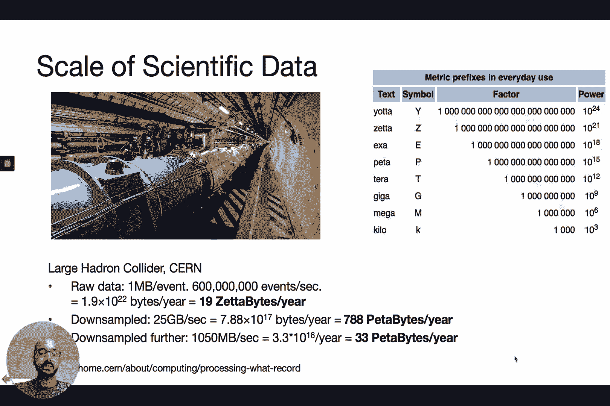
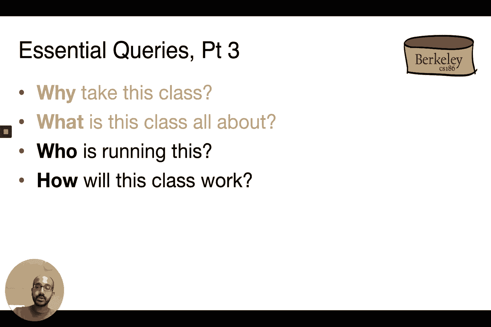

# P1：Lecture 1 Introduction + SQL I - ___main___ - BV1cL411t7Fz

 All right folks， this is the first lecture of Introduction to Database Systems， CS 186。

 Unfortunately， our Zoom recording crashed， so here's another attempt at recording the first lecture。

 I'm Aditya Parmeshran， and I'm co-teaching this class with Alvin。

 So in the spirit of what you might want to do with the database， let's talk about queries。

 that you might want to have answered for this class。 So we'll talk about why I take this class。

 what is this class all about， who's running， the show and how will this class work。

 So why should you be considering taking this class？ So at the highest level。

 this class is going to cover how to develop systems to basically， manage， maintain， process。

 interact with， transact with and make sense of data。

 So and doing all of this in an efficient manner on very large data sets。

 So it's all about system development and the principle behind system development in the。

 context of managing and maintaining and transacting with data。 So why is this useful？ Well。

 the first reason why it's useful is that they pop up everywhere。

 So you're likely using such systems under the hood when you're making a booking， a hotel。

 or a flight or an Airbnb， when you're liking a post on social media， when you're figuring。

 out where to eat， when you're posting for help on Piazza or on Slack， you're making。

 a financial transaction， you're making your purchase。 In fact。

 if you're considering building a startup or joining a large company， likely。

 you're building an app that is going to be backed by systems of this sort。

 These systems are also the backbone of modern science， right？ So if you think of genomics。

 astronomy， neuroscience， medicine， meteorology， all of these have a。

 massive collection of data that they generate or collect。 And there's a need to make sense of this。

 right？ And these systems， the systems that we're going to be starting are going to be the key。

 to some of the most pressing societal grand challenges that we might want to solve in， the future。

 So climate change and public health as examples， right？

 And beyond sort of generic apps as well as science， the principles that we're going to。

 be talking about in this class are going to play a role in any setting which has data， at scale。

 which is pretty much more settings in the future。 So the second reason beyond simple utility is centrality。

 So data is at the center of modern society and therein lies a huge promise to change humanity。

 but also many potential concerns， right？ So this is if data is badly used。

 And there is kind of timely debates about this centered around privacy issues and security。

 and ethics and bias and fairness and all of that is really， really important。 And in some sense。

 what we are going to be studying， which is the data infrastructure。

 is going to determine what is possible or what is feasible with respect to what you， do with data。

 So in some sense， we are the gatekeepers for data， right？ So as data becomes central。

 the infrastructure to manage data is going to be just as central。

 And acknowledging data centrality in modern society， of course， many of you folks know。

 about this new data science major and one emphasis within this major is human context， and ethics。

 right？ And in my opinion， this box is too small。 It should be much larger。

 But really how you think about data， how you use it is as important as what you gain from。

 So the third reason is that data is becoming the core of computation。

 Data growth is going to continue to outpace computation in the future and the key bottleneck。

 in the future in computation， the computing pipeline is going to be data processing。

 And therefore systems for data at scale is going to be the core of modern computing as， it stands。

 And I'm sure you've seen many different sort of incarnations of slides like this that talk。

 about the amount of data being generated。 But it's helpful to look at another example。

 So here every minute you can see that you have around 500，000 tweets being sent， around。

 20 million forecasting requests by the web on the weather channel and about 4 million。

 search requests on Google， right？ This is an astounding amount of data that is being generated。

 And this data is being generated at a very rapid rate and it's continuing to grow rapidly。

 Climate data is another big beast， right？ It's another sort of scale that we are not experienced in the commercial sector at all。

 So for example the large Hadron Collider generates 19 zerabytes a year and this is 1 million petabytes。

 So that is a crazy amount of data and this data is so humongous that they down sample it。

 to about a thousand petabytes a year and in many cases down sample even further to about。

 50 petabytes a year， right？ Ideally you want to be able to store and analyze set up by it rather than petabytes but that。

 is the amount of data that you can comfortably handle in current systems。

 And really you want to build systems that can stretch this limit more and more。

 So beyond the fact that data is going to be the core of computing the techniques that。

 you're going to be learning in class underlie many different topics in computing the notion。

 of abstraction， the notion of data modeling and representation。

 reuse and caching and materialization， rapid access of data。

 the principles of declarativity and so on。 The fourth reason for studying the topics in this class is that there's lots of opportunities。

 and academic research。 There have been four curing awards in data management。

 one going to Charles Buckman then， Ted Codd who came up with the relational model which is going to consume a considerable。

 amount of time at least in our class。 Jim Gray who came up with the concepts of transaction processing again a topic that。

 we are going to be spending a lot of time on and Michael Stonebreaker who came up with。

 ingress and postgres to the most successful database systems。

 And developing scalable systems for data is and continues to be one of the most exciting。

 areas of computer science research。 So that's why you should take this class。

 There's a lot of excitement around data systems。 So what is this class all about？

 So let's talk about what a database is。 So let's imagine that you are building a banking data management system from scratch without。

 a database。 And let's say your goal was to manage customers， accounts， joint accounts， transfers。

 transactions， and interest rates。 So all of this information that surrounds a bank。

 And let's say I implement this system using your favorite programming language C++ Java。

 Python or whatever without using a database system。

 So let's say you were a software developer or a designer。

 What aspects do you think we may need to worry about？

 So in class I had a discussion around what aspects you may need to worry about。

 So I'll give you like a couple of seconds to think about it。

 And then I will present the answers that the students gave as well as what I had in the， slide。

 All right。 So here are the kinds of things that you may need to worry about。

 So you'd certainly need to be able to deal with lots of data。 So there are lots of transactions。

 You need to be fast。 So you don't want access to your bank account information taking many minutes just because。

 there are millions of other customers。 You want the information to not be lost in the face of failures in terms of both system。

 power failures and so on。 You want to be able to support multiple users accessing their information at the same time。

 making updates at the same time。 You want the information to stay consistent， not degrade over time。

 You want the system to be easy to use。 So you want to be able to support sort of convenient means of accessing your data。

 All right。 So let's talk about the database system approach。

 The database system approach is to basically take all of this data management functionality。

 that we talked about in the previous slide and abstract it out into a separate layer so， that many。

 many applications can access this。 So this could be an ATM application， a web application。

 a cell phone application in this， banking scenario。 And DBMS stands for database management system。

 We'll talk about the acronym in a second。 And this sort of layer of abstraction。

 the separate layer keeps turning up in many， many， scenarios。

 So it makes sense to sort of pull it out abstracted， keep it separate。

 So here's one possible clunky definition for a database system。

 So database system is a system for providing efficient， convenient and safe multi-user。

 storage of an access to massive amounts of persistent data。

 And we'll decouple this or break this down with the next few slides。 Okay。 So let's talk bottom up。

 So data， right？ So you have lots of data。 You have information accounts， customers。

 balances and so on。 And data is massive。 You have many， many terabytes at a minimum for big banks。

 More if you keep all of the history of all transactions and even more if you keep the。

 images like the JPEGs for example of all of the checks， right？

 So the data could be petabytes for example， right？ So it's certainly massive。

 The second adjective is persistent， right？ So you want your data to live permanently beyond the programs that operate on it。

 So even if you have a system shut down， a server feels somewhere that doesn't mean that。

 the data disappears。 So you certainly can't store your data in memory because that is transient。

 You need to store it on stable storage like disk or flash。 The next adjective is multi-user。

 So you have multiple people who want to access the same database or in fact even the same， data。

 So like for example， the same bank account information simultaneously and you need to be。

 able to sort of coordinate their accesses in a correct manner。 So for example。

 let's say you have Alice and Bob who have $200 in their joint bank account。

 and Alice in her office orders a copy of the Selfish team。 Around the same time。

 Bob in at home decides to order a copy of guns， jumps and steel， right？ Now one of these copies。

 the Selfish team costs $80 and the guns jumps and steel cost， $100。

 So these two sort of separate transactions are certainly allowed because they have $200 in。

 their bank account。 But instead if the second order， the guns， jumps and steel order was $130。

 this transaction， should be prevented because they have only $200 in their bank account。

 So the database system needs to coordinate these accesses and make sure that it does。

 not violate certain properties。 For example， here there's only $200 and you can't overspend beyond that。

 So you need to obey these constraints。 You want the system to be safe and this is related to the previous point as well。

 You want it to be safe from system failure。 For example。

 money should not disappear or appear from the account due to a power failure。

 So let's say for example， Bob goes to an ATM now and is trying to withdraw money from， his account。

 So the ATM has internal software whose pseudo code looks like this。

 So get balance from database with balance greater than 50， then balance equal to balance， minus 50。

 dispense the cash to Bob and then update the balance in the database。 And if for example。

 there's a power failure that happens right after dispensing the cash。

 but before the update in the balance， then Bob received the money， but that money deduction。

 has not been reflected in the account。 If the power failure simply happened by Bob unplugging the ATM machine。

 then Bob could， strategically unplug the ATM machine right after the cash is dispensed and use this to。

 generate an arbitrary amount of money from the bank。 This is not ideal。

 So you want in some sense this entire program to be executed altogether or not at all。

 So if money has been dispensed to Bob， then certainly that needs to be reflected in the， account。

 You also want the system to be safe from malicious users。

 You want the system to protect your data to be manipulated by other people who shouldn't。

 have access to that data。 The system should be convenient。

 You should have simple commands to make changes to debit your account， get balance and so on。

 So all of these should happen fairly in a fairly straightforward manner。

 You shouldn't have to write lots and lots of code to get this。 And in fact。

 even un-predicted queries， the queries that you would not anticipate should， also be easy。

 The other objective here， this is the last objective is that it should be efficient。

 This is a no-brainer。 You shouldn't be searching through all of your files or all of your records。

 all of your， sort of information about all of your accounts to get your balance from one account。

 So the accesses should not scale based on the total number of accounts。

 So just because there are a million accounts instead of million accounts， it shouldn't。

 take a billion units of time to check up your bank balance。

 So you need to be able to efficiently retrieve that information quickly。 Likewise。

 if you're doing certain other types of requests， for example， you want to find。

 all the accounts with low balances or you want to do a summary spreadsheet and construct。

 a summary sheet of all of the large transactions， you should be able to do this in an efficient。

 manner。 You should be able to do this in a manner that is as far as possible interactively。

 So why does direct implementation of the sort that we mentioned earlier using vanilla programming。

 languages？ Why is that hard？ Why does that not work？

 So it turns out that early database systems evolved from file systems。

 And file systems certainly provide a storage of massive amounts of data and that's persistent。

 So it is stored， for example， on disk。 However， there are many other adjectives that this doesn't obey。

 So if the system crashes in the middle of an operation， for example， that EDM operation。

 wherein Bob was trying to withdraw money， there's no guarantee on how the program may， behave。

 In that instance， Bob got money even though he should not have。 In other cases。

 you may end up losing data。 That's not great。 It's also not efficient。

 It doesn't intrinsically support fast access to data that you care about whose location in。

 the file is not known。 So you wouldn't have to write custom code and maintain custom data structures to support。

 this fast access to the data。 And all of this happens natively with a database system。

 So this is why database systems were invented。 So database systems describe real world entities like the banking entities that we talked about。

 they store very large datasets in a persistent managed， outlives the duration of programs。

 It supports querying and updating efficiently。 It supports efficient change of the structure。

 So for example， if you want to add additional aspects or attributes， you can do that。

 It handles concurrent updates or updates that are happening at the same time。

 You can handle that in a seamless and correct fashion。 It handles crashes。

 So if the database system crashes， it can already recover from that。

 It also obeys security and integrity properties。 It prevents in unsecure access and maintains consistency of your data。

 So what we've been calling a database system is actually known by its complete name， which。

 is a data-based management system or DBMS。 That is a pure， full name for a database system。

 DBMS is a software that stores， manages and facilitates access to data。

 A database on the other hand is a large organized collection of data。

 And this is what a database system or a DBMS manages。

 But sometimes databases are also used to refer to the software， which is a database system。

 or DBMS itself， the use should be clear from the context。

 So the symbol for a database or DBMS is a cylinder。

 And these are three different versions of the cylinder。 Why the cylinder？ Well。

 one of the most important aspects of a database system is the fact that data is。

 stored persistently on disk。 The cylinders look like plackers on， for example， a disk trough。

 And so emphasizing that persistent storage of data is why databases are usually represented。

 using cylinders。 Let's talk about implementations of database systems。

 So here are some example database systems。 And traditionally database systems are referred to traditional database systems referred to。

 native relational database systems or RDBMSs or simply relational database。

 And here are some examples of relational databases。 Oracle Terra data， SQL Server are commercial。

 Postgres and SQLite are open source。 And there are also non-relational database systems。

 graph stores， document stores， key， value stores and so on and all of these are not。

 they don't obey relational behavior。 And we'll discuss what relational means as part of this class。

 So here is a chart of how database systems evolved。

 A large fraction of this genealogy has roots in Berkeley。 So systems like Ingress and Postgres。

 as I mentioned， Mike Stonebaker won the Turing， Award for Ingress and Postgres that happened right here at Berkeley when Mike Stonebaker。

 was a faculty member here。 Sidebase and Informat were other offshoots of projects that developed at Berkeley。

 Around the same time as Berkeley was a pioneer in relational database systems， Oracle， which。

 was started off as a small startup and ended up becoming a behemoth of a corporation， is。

 another line of database products， relational database products。

 IBM was a strong competitor of UC Berkeley， at least in the research sphere and eventually。

 ended up having their own database products as well。

 So we will focus mostly on relational database systems。

 One question that you may have is isn't this old stuff and certainly at least you may be。

 tempted into thinking so because our main textbook is rather out of date。

 But the focus in this class is going to be on foundational system principles that transcend。

 different types of database systems be it relational or not。

 And these system principles in some sense transcend and are timeless。

 So they are basically standard test of time。 They are still valuable today。

 They are the ones that you need to remember if you are building systems like this in the， future。

 So if you are thinking about building scalable database systems， we are going to be covering。

 the principles that you need to think about while doing so。

 And the principles that we are going to be talking about will involve reusable ideas and。

 components and a compositional approach in sort of connecting these ideas and components， together。

 And so the eventual goal is to not just be able to use existing database system technology。

 but also build new ones and hopefully will give you the tools and techniques to do so。

 And so what do you learn as part of this class？ Well。

 you learn programming that is more data oriented using SQL which is a data programming。

 language is a fundamentally different way of thinking about programming。

 You'll learn about data system design so storage and indexing so that's like the bread and butter。

 of the lower part of data system design。 And then query crossing and optimization which is a little more higher level talking about。

 how do you take data oriented queries and make it efficient to run on your data。

 Then we'll talk about transactions and the notions of concurrency， consistency and recovery。

 as well as how to model and reason about your data。 So again。

 if all of these terms are not super familiar to you， don't worry about it。

 That's the purpose of this class。 We'll talk about all of these terms in more detail。

 So the higher level principles that will emerge over our discussion include the following。

 So it includes data independence。 It includes a notion of thinking about things declaratively。

 It includes a notion of joints which are basically rendezvous in time and space。

 It'll include the notion of sort of isolation of sort of programs and consistency across， programs。

 And also the notion of data representation。 How do you think about your data？

 How do you model it and so on。 And all of these principles are timeless。

 They will mold your brain to think about scalable data systems in a different way。

 We will talk about various levels of a database system ranging from disk space management to。

 buffer management to indexes and file management to relational operations or operators as well。

 as query parsing and optimization。 We have concurrency control and recovery。

 These are just layers of a database system and we'll talk about how these layers interact。

 with each other。 And so in some sense， what are you going to be covering are the principles。

 So we are going to be covering the principles and the algorithms that underlie database。

 management systems， underlie scalable systems for managing data。

 And the system designs where sort of you take these components and then stitch them。

 together to have a scalable end-to-end data management solution。

 And sort of the coupled notions of the algorithms and the principles with the systems is really。

 what makes computer science a science。 So this is a great example of theory and meeting practice。

 So now let's move on to sort of the more mechanics of how this class is going to run。

 So who are we？ Well， Alvin， who hopefully you'll see in future lectures， is a professor。

 at Berkeley in computer science。 He did his PhD at MIT。

 He's an expert in databases and programming languages。

 I am an assistant professor in computer science and the School of Information。

 I work on databases and usability aspects。 I got my PhD at Stanford。

 So both of us started at Berkeley a year ago。 And so this is our first time teaching this class。

 So please be tolerant。 So this is your list of amazing head TAs。

 More information about them can be found on the website course website， which I'll link。

 to in a few minutes。 And so these are the four head TAs are of Itin， Jerry and Chris。

 And then you have a bunch of amazing TAs， Justin， Sami， Gabe and Amy， Kaylee， Suman， Shreya。

 Sam Noah， Caitlin， Montej， Aditya， Anadha Aditya and Alan and Dylan， Jennifer and Sabrina。

 So this is your team of awesome TAs and they are here to help you have this semester be。

 super successful。 The other component in this class beyond the TAs and the instructors is you。

 Everything is doable with steady works。 If as long as you are willing to put in the hours to learn the material in a steady clip。

 and the classes in your hands， this is an odd semester。

 So we hope you can use best use of Piazza as a resource to connect with other students。

 Our goal is to not stress you out at all。 Our goal is to really help you learn the material。

 And if there are ways in which we can make the stress disappear， let us know。

 So keep us in the loop in sort of informing us how we can make this easier for you。 From our end。

 we will try our best to help pace you。 So we will have weekly section worksheets and vitamins to keep you on schedule。

 We will have sections and officers as well as programming projects that will help you。

 actually use these principles and skills in real world settings。 So how is this class going to work？

 Firstly， this is not coming as a surprise to you， but everything is moved online。

 So lecture sections and officers are all online。 The goal for students for time zones is out。

 So please respond to that goal so that we can figure out where you are。

 And if there are ways we can sort of rejig for example sections of officers so that we。

 can be more tolerant with that， that would be we can try。 Of course we have limited resources。

 limited manpower， but we will try our level best to。

 make it as accessible to you despite where you may be on the planet。

 And we will also play it by year as we go along with our issues due to this pandemic。

 Just please feel free to raise them on Piazza。 We will try to help the best that we can。

 So what is different about CHAS 186 this semester。

 The other difference is that CHAS 186 in the past few semesters has been taught entirely。

 MOOC style with videos recorded in 2018 courtesy Joe Hellestine。

 And we are changing it by teaching it synchronously because this video is not synchronous because。

 the synchronous video crashed but we are trying to teach it synchronously。

 We are going to be covering a similar but not identical set of concepts。

 So please use our videos rather than Joe Hellestine's videos as the definitive material。

 But Joe Hellestine's videos are amazing and those are still available if you like a different。

 perspective。 And since it's our， so I've been in my first time teaching this class and a class of this。

 size， I mean 750 is a crazy size。 Please bear with us as we figure things out。

 There are bound to be hiccups。 So please be tolerant。

 Please tell us what you like and what you don't like and we will try our best to make。

 things better。 So another sort of like important point to remember is the course website。

 It is one of the most important things to remember is book market right now so that you can find。

 all the information about the class at this location。 So the syllabus calendar。

 the lecture slides and homework is linked from the course website。

 as well as the PRS discussion group。 So all of that is on the website。 In terms of course workload。

 we will have two lectures per week which is synchronous but， also recorded。 So if you can't make it。

 that's fine。 You can watch it offline。 But please try to attend if you can。

 This is sort of in some sense keeping you accountable and there's a lot of interaction。

 that happens during lectures。 If not live with us interacting with you also happening on chat。

 So there's a lot happening in lectures and please join if you can。 If you are attending lectures。

 we strongly suggest that you turn on your video to make。

 the experience less dull for everyone and also to keep you accountable。 And if you do so。

 please don't do anything that you wouldn't do in an ordinary class。 So don't take calls。

 don't cook meals， don't take a shower。 So don't do anything funky that you wouldn't do in an ordinary in person class。

 And also please keep your audio on if you're not speaking just so that we want to minimize。

 cross talk and distraction。 And if you need to ask questions。

 one great way to do so is to raise your hand and we。

 will monitor those raised hands and get to you because Alvin and I will both be coattending。

 every single class。 So one of us will be keeping track of the chat and raise hand feature。

 Please engage with us。 We love questions， we love answers。

 we hate just recording static videos like this。 We love teaching synchronously so please engage with us。

 ask us questions。 That's why we are doing it in our synchronous fashion。 So what's a workload like？

 Beyond the lectures， there's the office hours which start this week but we'll start before。

 first next week you have vitamins which are simple online quizzes that happen weekly。

 can drop two of them and you need to complete the exercise to be able to submit it。

 It's also the programming project which I'll get to in the next slide。

 Two mental exams in one final exam， we're still figuring out the format of the exam whether。

 we can sort of do zoom proctoring or not。 So that's still something that needs to be worked on and once we figure it out we'll。

 post on Piazza。 The other thing that I want to mention is that our exam slot has been moved to a different。

 group so hopefully that minimizes clashes。 The tentative schedule for the programming projects and the assignments and deadlines and。

 so on can be found on the course website。 So about the programming project。

 these are ways in which you're going to take the concepts。

 that you don't class and actually implement it in practice。

 So we'll have a relatively simple project on SQL querying and then the subsequent projects。

 are going to be more demanding。 So one on indexes， then on joins。

 query optimization and transactions。 And so the first project is going to go out next week。

 So watch out for that and get going soon。 And for the first time we are also considering doing some of the latter more involved projects。

 and groups of two。 More details on that forthcoming。

 To help you with this workload you have up to five days of slip time。

 So this is up from three last semester so just to make it a little easier for you。

 This can be used for projects and is also counted at the granularity of days。

 So this is because there's some weird idiosyncrasies with great scopes that doesn't allow us to。

 count at a final granularity。 So it's going to be counted at the level of days。

 This slip time is a safety net。 It's not a convenience。 You should ideally not plan on using them。

 You should try to be on track with your class。 And if you are ending up using all five days。

 ideally you're doing it wrong。 So ideally you should not have to use them。 If you want to use them。

 certainly feel free to。 But the way I would suggest using them is to use them towards the end of the semester。

 when you absolutely need them rather than using all of them up at the start of the semester。

 It's also important to talk about academic integrity。

 This is something that we have a zero tolerance policy on。

 So we trust that you will do your own work。 Don't cheat。 We will find out。

 So we have the technologies to do so。 We found that most cheating happens because of stress。

 And so one easy mechanism to deal with this is to plan ahead and stay on schedule to minimize。

 the stress。 And you have some built-in safety valves that can sort of relieve the stress。

 You can drop some vitamins。 You have five slip days。 So save it for when you actually need it。

 We're going to also most likely weight the midterms to the higher grade。

 We'll figure out the exact policy subsequently， but that's the plan。

 And please keep an eye on the course drop date。 So if you're taking too many courses。

 feel free to dot this class that's totally fine。 Make sure that you're not getting completely overworked in what is already a strain semester。

 And beyond all of that， if you're feeling stressed， reach out。 So the course staff is here for you。

 We are happy to help in whatever we can。 Of course， campus resource there as well。

 And if at any point you feel like you're completely overwhelmed and this is not working out， you。

 can totally take an incomplete and then sort of retake the class at a future semester。

 And so that's totally appropriate for health issues of any kind。

 And so the staff perspective on academic integrity is that we do want to help you learn and to。

 succeed。 We don't want you to cheat。 We want things to be fair， so we do need to stick to the rules。

 But if there are any ways that we can alleviate some of the stress， please let us know。

 The bottom line， please don't cheat。 So how do you communicate with us？

 So all of the class communication happens via pizza。 Pizza， pizza。 Piazza。 So Piazza。

 the link to Piazza is on the class website as well。 We are already live。

 There's already some questions being answered。 And there's a lot of active discussion。

 All announcements and discussions will happen via Piazza。

 So please read it carefully and then post questions。 But if you're posting questions。

 make sure that that specific question has not been asked， before。 And answer each other's questions。

 One of the best ways to learn is to answer someone else's questions so that you sort of。

 hone in on your question on sort of clarifying the concepts in your own head。

 Event emails to professors or TAs is usually not a good idea。

 We are all overwhelmed with email and it's going to likely lie buried。

 And so if you want your question to bubble up to the top， private posts on Piazza to instructors。

 is a much better bet that way you have guaranteed that someone will get to you。

 If you're sending an email， it's likely not going to get answered unless it's super super。

 sensitive。 All right。 So that's it。 From my portion and well， again， welcome to the class。

 I hope you have a great semester。 I hope you enjoy the course material and hopefully the next time we do synchronous videos。

 it， will actually save and then you'll be able to interact with us live。

 So I look forward to seeing you in person in the next class。 Hi， everyone。 Welcome to 186。

 At the TI9， I look forward to seeing you guys online in the Zoom lecture this semester。

 So today for the first technical content of this class， we'd like to first cover the relational。

 model that we'll be using throughout the semester along with the language that we'll use to manipulate。

 relations known as SQL SQL。 So just before that， we just want to echo a little bit about what DTS was saying earlier。

 in his portion of the introduction。 So we realized this is a really strange semester and we live in really strange times indeed。

 And that's why we are not able to actually see you physically in the classroom。

 So if you're actually joining us online， please feel free to turn on the video if you feel。

 comfortable。 Of course， this is up to you and we feel no pressure otherwise if you don't feel comfortable。

 that way。 And as Aditya was saying， try to unmute yourself or raise your hands if you have questions and。

 you can always type in the chat window and we'll monitor that throughout the lecture。

 and try to answer your questions。 And of course， we have， feel free to post on Piazza。

 And if you feel more comfortable talking about in private， feel free to send us emails or。

 send us private messages on Piazza to any of the staff that will be able to reach out。

 to you as soon as we can。 Okay。

 So let's just first try to talk a little bit about relations。 So as I was saying earlier。

 we want to use this as the first technical topic of the class。

 So what is it that is about relations and how is that related databases？ Well。

 so as Aditya was saying， I mean， a database is essentially a collection of these named， relations。

 So you see here a bunch of relations that we are trying in this kind of funky diagram， here。

 So each one of these circles here is basically a relation。

 And then this particular one here I'm highlighting that basically shows you the actual data。

 that is involved。 So what actually defines a relation？

 Well， so as Aditya was saying， and then just repeat that， a database is a set of named， relations。

 And each of these relations， also known as a table， has a number of different elements， to it。

 First of all， there's a schema or otherwise known as metadata。

 So this basically describes what the table or what the relations is about。

 We'll see what I mean by schema in just a second。 And then there's also something known as the instance。

 which is basically the set of， data or the pile of data that is being stored inside that relation。

 So for instance， here is the example that I was using on the previous slide。

 So this is our first relation here。 You can see that we have three different columns here。

 So this basically makes up the schema。 So you can see that the schema here consists of three columns。

 And each of these columns actually have names。 And also they are typed， right？ So for instance。

 in this case， last name here is of type text。 So this is one example of a relation。

 And then all this data that is being stored here， collectively speaking， is known as the。

 instance that is associated with this particular relation。 So more terminology。

 So each of the relations that we talked about in this class will have an attribute， also。

 known as a column or sometimes we will call that a few。

 So to take an excerpt from the previous example here， so this is one column consisting of first。

 names and is of type text。 So you can see that we have three of these first names here。

 So just taking this at the vertical level。 So this is one of the attributes or one of the columns in the table。

 And we also have this notion of a tool poll。 So it's known as a record or more colloquially known as the row。

 So for instance， here's one horizontal slice of the relation I was mentioning earlier。

 So each one of these rows is also known as a tool poll。 And finally。

 there is also this concept of cardinality， which is basically the number。

 of tool polls in a particular relation。 So to summarize for the example that I was talking to you earlier。

 So in this case， we have a schema consisting of three different columns or attributes。

 And we also have for the data instance， three rows or three two polls that you see here。

 And then in this case， since there are three rows in this table， the cardinality of this。

 relation is three。 So you might ask， why do we have these kind of esoteric names about attributes and two。

 polls and all that stuff， why don't we just call them rows and columns。

 So they actually come later on when we started using spreadsheets initially， when the relation。

 was defined， it was actually defined as a mathematical concept。

 So they use these kind of terms that now it's kind of becoming archaic。 But in essence。

 they're just talking about rows and columns that you and I are very familiar。

 with if you ever use a spreadsheet before。 Okay， so far so good， I hope。

 So these are the term technologies that you need to be familiar with for the relation。

 And there are also a bunch of properties of relations that we should know about。 For example。

 the first one is that the schema itself is fixed。 What does that mean？ Well。

 it basically means that like a schema， as I talked about earlier， consists of a bunch。

 of attribute names， right？ And then they also have types。 So in this case。

 we emphasize that like all the types here has to be primitive or atomic。

 So you might be familiar with that concept from like 61 A or B， when you are taking a。

 course that talks about languages like Python or Java。

 So they have something known as primitive types。 So you can think of these as basically things that are non objects。

 And they are also like non-structs， right？ If you are a C programmer。

 So one thing to notice is that every language defined what it means by primitive types somewhat。

 differently。 So a SQL also has its own definition as well。 And then in fact。

 every single database management system implementation also has their own。

 definition of what is primitive and what is non-primitive。

 So be sure to actually check that when you actually get to use a database。 So for instance。

 in Postgres and also MySQL， I mean， date is actually also a primitive type。

 So you might not be used to that， right？ If you're coming from like a Java world， right？

 Because for instance， to date in Java is actually an object in the class。

 But in SQL or at least in the implementation in MySQL and Postgres， that is actually considered。

 as a primitive type。 So just make sure you're aware of that。 What else？

 So one other thing is that relations or labels are actually not ordered。

 So basically that means that the order of the rows or the order of the two goals that。

 they show up actually doesn't matter。 I could have sorted them in any order。

 I could have not sorted them at all and that would all be perfectly fine in terms of constituting。

 a well-formed relation。 And also the rows themselves don't have to think they're also two different types of。

 relations that one of them is considering where every row can only show exactly once。

 So this is known as also a set， right？ As you know from the methodical concept。

 And there are also relations where you can have the same row shows up multiple times。

 So if that's the case then they are known as backs or mouthy sets。

 So that's another property of relations。 The tables or the relations themselves are actually flat。

 What do I mean by flat？ Basically means that we cannot have any attributes that nested one on top of another。

 We'll see an example of what I mean by that on the next slide。 And finally。

 the tables themselves actually don't prescribe how the rows or the instance。

 or the data should be actually stored on the disk。 This is actually a very interesting property。

 It's called physical data independence。 So what do I mean by that？ So here's an example of relation。

 So we can see that we have four attributes here and then we also have four rows or two， rows。

 So now imagine I would like to store the instance or the data associated with this table onto。

 the disk。 Let's say as a text file。 So how would I actually store that？

 So one possible way of storing this data is actually as a array of objects。

 So I can basically go row major。 I go and walk through each of these two posts that you see here on the screen。

 And then I basically try to write them out in the order of the different attributes。

 So for instance， you can see that I'm writing gizmo works here and then all the， basically。

 the entire two posts associated with gizmo on the， let's say， in the first line in the。

 text file before actually moving on to the next row in the table， so to speak。

 But that is not the only way to actually store a relation on the file， on a disk file， right？

 For instance， if we can go row major， we can also go column major as well。 So effectively。

 it's the same thing， right？ It's just that we just walk down each of the attributes on the columns first before going。

 on to the next one。 Why is it matter？ We'll actually talk about that when we talk about the disk later on in the class。

 But this is the property known as physical data independence， as I was alluding to earlier。

 It's basically this aspect where there's logical definition that we're exposing to the high。

 up in the stack， right？ So let's say some application that we use of the relation。

 They don't actually need to know how the data is actually stored on the disk。

 We could have reduced row major， column major， you know， stitch pattern， whatever you want。

 As long as we expose this relational interface to the application， then we are good。

 So this is actually a very interesting property that will come and revisit later on in the， class。

 Okay。 Now， just to round up the discussion of relations， I mean。

 now you know all the terminology that， you need to know for what constitutes a valid relation。

 But I also want to emphasize that relation is actually not the only way to store data。

 So for instance， let's say we want to store all your Facebook friends online。

 Here's one way of doing it。 You can pretty much store your friends as a graph， right？

 So for instance， here we have people's names and each one of these lines here。

 There's an edge between two nodes。 If they， if these two people actually friends， I mean。

 that's one valid good way of storing， things。 Here's another way。

 So you can also store that as a table。 So now you see that we have a table with three attributes and we have people's names on。

 the first two。 And then the last one basically is a binary variable that says whether these two people。

 are friends or not。 Which one is better？ Both depends on the application。 And indeed， like you know。

 later on in the semester， we actually learned about the trade-offs。

 for using these different models and then what is good or what is bad about them。 Okay。

 so let's just do a quick check to make sure that you guys understand the concepts。 So here's。

 I call， I claim this as a relation， right？ So， but turns out that it's not why。 Well。

 take a look here， right？ So now we have this extra thing hanging towards the right-hand side。

 What is this， right？ There's no corresponding attribute， right？ I mean， there's no。

 there's no attribute that actually described。 What is this number？ Is this a zip code？ I mean。

 is this what the phone number？ What is it， right？ And also notice that like， you know， in here。

 this is actually a piece of text， even though， the relation。

 the attribute type here is actually declared as an integer。 So that doesn't match， right？

 Because in a relation， all the rows has to conform to the same schema。 And in this case。

 the schemas， as it is a row， it should be a row of three different， attributes of type integer。

 text， and another integer。 So therefore， this is not a relation。 Another examples。

 why is this not a relation？ Well， take a look。 So we have two attributes of the exact same name。

 So that is also not allowed。 So each of the attributes in their relation has to be unique。

 Think about like， you know， if you want to define headers， right， and then scratch it。

 So you probably don't want to define multiple columns， but the same name as well， right？

 That is just confusing。 Okay。 So last one， why is this not a relation？ Well。

 take a look at the third attribute here， right？ So you notice that it actually says address。

 So address here is actually not a primitive type because it's actually， you can see that。

 this is a type on programmer or is basically represented as the structures and objects。

 So therefore， this is not a primitive type。 And since relational schemas has to only consist of primitive types。

 so therefore， this is， not a valid relation， unfortunately。 Cool。

 So now let's go and talk about this property called fact， right？ So as I was telling you earlier。

 all the relations that we talk about in this class have， to be fact。

 So another way of saying the same thing is to basically say that they have to conform。

 to what is known as the first normal form。 So first of all。

 it's basically a synonym for saying that all relations must be flat。 So let's see an example here。

 So in this case， we have two， two rows， two to both consisting of company names and their。

 properties。 And let's say we want to be able to add products that are manufactured by each of these companies。

 So here， so that's one way of doing it。 So notice that I have added an extra attribute here on the right-hand side called products。

 And then I'm basically just trying to stick， right？

 All the products that are made by each of these companies inside the last attribute。

 Is this a valid relation？ No， right？ Because we are basically trying to next multiple attributes within a table。

 So notice that this is actually a semi-table on its own， right？ It also has its own attributes。

 It also has its own rows， right？ So that is not allowed per our definition of a relation。

 So therefore， this is not a valid relation。 And that is exactly why I mean by relations must be flat。

 So not a way， as I said， myself saying it， it's to basically say that in this case， this。

 relation on the bottom of the screen here is not in first normal form。 So how do we fix it， right？

 So there must be a way to be able to store product associated with each of these companies， right？

 So one way you can solve the problem is by basically creating a separate table。

 So notice here now I have actually created a separate table called products。

 And also notice that in this case I am trying to link up with the companies that made these。

 products by adding a fourth attribute here in the products table。

 So now this is in first normal form， right？ Because nothing is necessary anymore。

 You can basically go back and check on all the requirements that are needed in order for。

 a relation to be available。 And you can actually see that they all check out。

 So this is a valid relation。 Great。 So that's all I wanted to say for relations。

 Now you guys are all should be all experts in what looking out for what are relations and。

 what are not。 So now let's talk about how can we actually work with relations。

 Now the thing that you want that we're covering in this class is something called SQL， which。

 is basically a programming language that was defined， that was designed earlier at the。

 IBM research back in the 1970s。 It was actually started as the systems are project。

 And at the same time， interestingly， UC Berkeley， as Aditya was saying。

 was also one of the pioneers， in relational databases。 And at that time。

 a micro stone breaker actually was also working on a prototype relational system， called ingress。

 And in ingress， the language that they used to query relations is something known as， quail or QUEL。

 And that is actually different from what SQL ended up being and the two languages basically。

 go in parallel for a while before the next version of ingress and later on postgres decides。

 to basically adopt SQL at the end。 So the SQL language and its implementation is actually commercialized in the 80s first。

 by IBM。 They basically started a product line known as DB2。 And unfortunately。

 IBM kind of didn't put its act together fast enough。

 And there is this tiny company at a time starting at Redwood Shores and later on known as Oracle。

 which also tried to commercialize relational technology via SQL as the language used to。

 query and manipulate relations。 And as they say， the rest is history at that point。

 So if you see the timeline that I was that a detail was showing in the interest lines。

 you notice that SQL and relational length within the relational database is actually。

 over 40 years old。 So obviously， SQL is actually not the only language that you can use to query relations。

 And in fact， over the past 40 years， I mean， this notion of using SQL to query relations。

 has been questioned repeatedly。 So for instance， in the 90s。

 we have this movement known as object-oriented databases， database system。

 so this is exactly the counter-argument of like， you know， why restricting relations。

 to not only store primitive types。 So in the object-oriented DBMS。

 they basically try to have DBMSs that are actually storing。

 structs or objects natively as opposed to needing to fatten everything。

 So that was actually part of the 90s where people define new query languages， for example， OFL。

 which stands for object-query language。 And then in the 2000s。

 we have people interested in XML and document exchange and data exchange， those kind of things。

 So then things like X-query， X-path also came along。 And then now， of course。

 there's also the no-SQL movement and then Hadoop and Matt reduce all， came into play。

 So these are basically all different languages that people have been working on in terms of。

 manipulate data。 And not all of them are actually manipulating relations that you can note as you can tell。

 it to。 However， SQL somehow keeps re-emerging as a standard over the years。 So hard to say why。

 maybe it's just because people are used to dealing with relations。

 and they really like to use SQL as a language to manipulate things。 And in fact， these days。

 even systems like Hadoop and Spark also have SQL interface as， you might have played around with。

 So that basically tells you how popular it is。 However， that's it， right？ So we're not trying to。

 you know， preaching religiously here。 I mean， we definitely noted that like， you know。

 SQL is not the perfect language， just， like any other programming language that you can find。

 It is useful and， you know， it also has a lot of language features that we can learn about。

 which hopefully will teach us a bunch of lessons such that when we actually go out in the world。

 and maybe you actually might want to define your next queer language， you can take the。

 lessons that， you know， the SQL people have learned over these past 40 years。 Okay。

 so let's talk about a little bit of the pros and cons of the language。

 And you actually notice that when you actually start playing with the homework。 First of all， SQL。

 SQL language is known as the "clarative language。"， What does that mean？

 It basically means that we only say what we want to retrieve or what we want to manipulate。

 but actually not how to get it done。 So if you remember from 61AMV， you remember that， like。

 you know， every time we talk about， defining a function。

 we have to provide us implementation and the implementation basically。

 talks about how you want to achieve something。 And in SQL。

 you actually not need to tell us how you want to do it。

 You just say what you want to be accomplished。 Sounds magical， right？ I mean。

 that would be nice because we won't be doing all the homework back in 61， right？ But， you know。

 of course， there's actually trade-offs to it。 And we'll see what that really means when we talk about the implementation。

 And， you know， as I said， it's widely popular for many different implementations across the。

 board from different commodity database management systems。 So that's definitely a plus。 And。

 you know， each of these implementations actually vary a little bit in terms of the。

 language support， what are the features that are provided by the language， so and so forth。

 And they all compete in terms of its efficiency。 So you definitely want to use， for example。

 a database system that， you know， takes like， a really small amount of time when you want to run a query or when you want to insert data。

 I can actually see that， right？ So some of the pros， right？ So first of all。

 it's actually constrained。 And you， if you look into the details of the language。

 you actually notice that it's actually， not doing complete。

 So the single language by itself is not doing completed。

 It actually needs something called user-defined functions or UDFs in order to make it a two-incomplete。

 language。 But that said， like， you know， it's also only general purpose for data manipulation。

 So with all the features that have been defined， people have been， however， trying to extend。

 it so that it can also use for other use cases beyond data manipulation。 But then by far。

 the language is really good for doing data computation。 And that's pretty much it。

 You'll notice that when we actually talk more about the actual features。 But as I said， right？

 It's actually extendable。 You know， you can add features to it and many of the vendors do。

 many of the commodity， databases do。 And you can also use SQL to actually create many different types of data sources。

 And in fact， people have done extensions beyond relations。 So you can even use SQL to query。

 let's say， graphs or other types of data models as well。

 So SQL language itself has two different fragments to it。

 So the first fragment that we will cover in this class is called the data definition language。

 So this is the language that we'll use to define relations and also define schemas。

 And then there's a second fragment of the language known as data manipulation language。

 And that is the one that we'll use to actually write queries to actually retrieve data that。

 we have stored。 And good old RDM assets should be， you know。

 have very efficient implementation of both， of these fragments of the language。 For example。

 as I was saying earlier， you probably don't want to use a database where， you need to wait for days。

 right？ And also insert one single row in it。 And as we'll talk about later on extensively in this semester。

 choosing the right algorithms， to implement each of these language features is actually one of the most interesting research。

 and also implementation questions in relational databases。 So to motivate the discussion。

 so let me use this example here with sailors， folks， and， research。

 So here we define three different relations and you can take a look at how many attributes。

 and how many tuples we have in these relations， right？ So here's your first SQL program。

 So here we are creating a new table called sailors and we are basically creating a table。

 with four different attributes here。 So notice that in SQL。

 the convention is to basically first define the name of the attribute。

 followed by the type of that attribute。 So that's why you see for instance， SID。

 proceed the words in the giraffe。 And by the way， for purposes of this lecture。

 you can basically consider that we're not， looking into cases。 So the upper case。

 a lower case basically means the same thing， although you need to。

 check with the specific implementation that you actually use。

 So you notice that there is something that is underlined here。 So in this case。

 SID is actually underlined。 So this is known as a key。 So that I've highlighted here in old here。

 right？ So what does that mean？ So a key is basically a unique identifier of each of the rows。

 So for instance， in this case， you can see that each of these rows here have a unique。

 identifier for the SID attribute or the sailor ID attribute。 So。

 and what does that mean to be a key， right？ That is something that is unique。

 And it basically provides a way to do a look up into that relation。 So in this case， given the SID。

 you can basically find the entire row， right？ So for instance。

 if we have provided with the SID of two， then we can basically use that。

 to look up the entire record because we basically know that there are no other sailors with。

 the identifier of two， right， in a table。 So that's a unique lookup key。 So for instance。

 if we were to store a table of students， you can also imagine that your， student ID， for example。

 will be the key in this case。 So since they have to be unique。

 obviously we cannot have duplicate values in the entire， table。 So for instance。

 we cannot have another row here that has the SID being equal to two， right？

 So that would not be allowed。 So right。 But also notice that key itself doesn't have to make up only one column。

 right？ So for instance， in this example here， it is actually only one column consisting of the。

 sailor ID here， but I can also define like another table with where multiple columns。

 combined form the unique identifier， maybe first name last name。 Okay。

 So here are more tables that we have defined using the data definition language here。

 So notice that like， you know， here's another primary key that I defined for the BOCs relation。

 In this case， it's the BOC ID。 So you notice that we are calling it primary， right？

 So the reason why we are calling it primary。 So basically every type of relation can only have one primary key。

 even though that key， is set， right？ And can consist of multiple columns or attributes。

 We actually talk about later on in terms of how to actually store these primary keys or。

 what the database actually do when you define something to be a primary key。 But for now。

 just remember that every relation that we talk about can only have one single， primary key。 Okay。

 And then here is another one。

 So now we have defined another table called research。

 So notice that this is our first example of a key that actually consists of multiple attributes。

 So in this case， we're saying that the sailor ID， the BOC ID and the date actually all combined。

 together to form the unique identifier。 And that makes sense， right？

 Because we are talking about in this case， the reservation table， right？

 The table of people we've served for folks。 So obviously just the sailor ID is not going to be a unique identifier just because a single。

 person can reserve multiple folks across the front days。 And likewise， right？

 If you consider the BOC ID or the date， they are also not a unique identifier on their， own。

 However， you can consider that like， you know， combined together。

 All three action now it forms a unique identifier。

 And that's what we'll be using as the primary key in this case。 So you also notice that like。

 it pictorically， the way that we depict a key is by this by， underlying it。

 So you can see that in this case we have underlined all three attributes because they combined。

 form key versus for the BOC table， we only underlined the BOC ID and for the sailor table。

 we only underlined the sailor ID as the key。 Great。

 So let me stop here and then we'll pick up more on Tuesday about how you actually write。

 queries to retrieve data from these three tables that we are taking back。 [ Silence ]。

