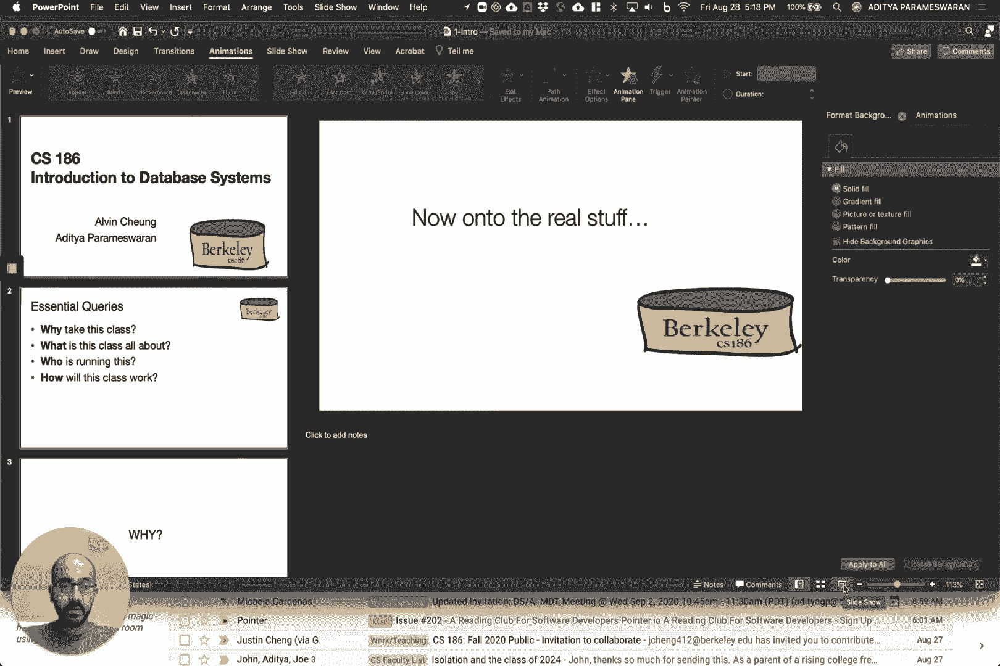
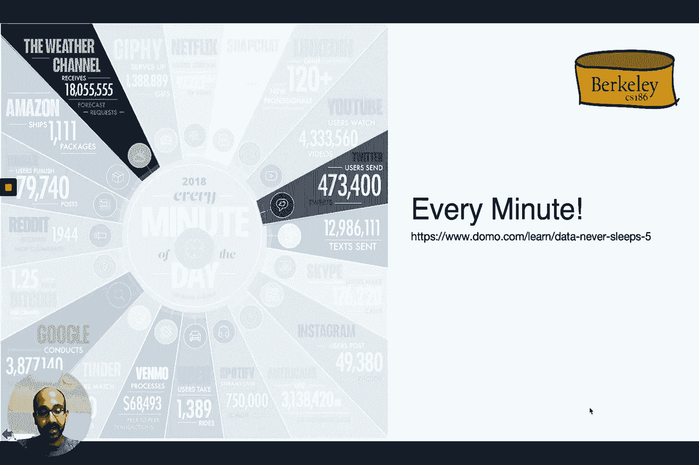
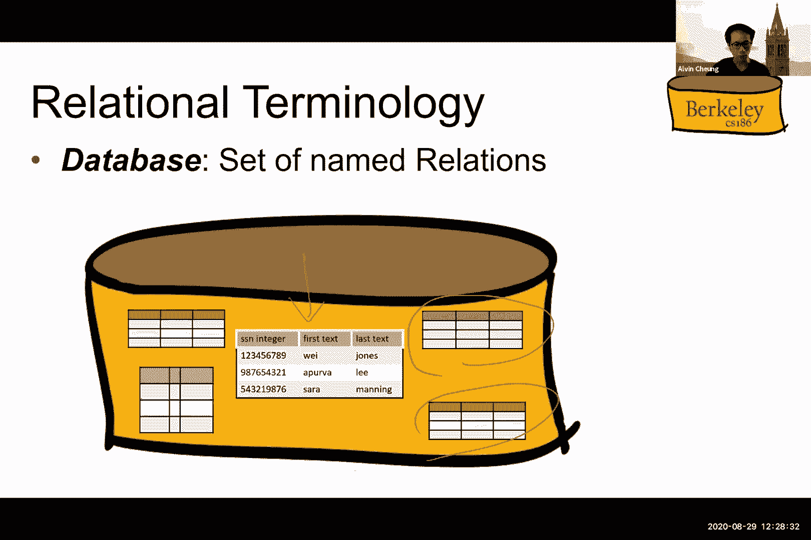

# P1：第一讲 介绍 + SQL I - ___main___ - BV1cL411t7Fz

好的，各位，这就是《数据库系统导论》第一讲，CS 186。

不幸的是，我们的 Zoom 录音崩溃了，所以这是另一种尝试录制第一讲。我是 Aditya Parmeshran，我和 Alvin 一起共同教授这门课。那么，考虑到你可能想在数据库中做的事情，让我们来谈谈你可能想要为这门课解答的查询。所以我们将讨论为什么我要上这门课。

这门课的内容是什么？谁在主讲？这门课将如何进行？为什么你应该考虑参加这门课？从最高层次来看，这门课将涵盖如何开发系统，基本上是管理、维护、处理、与数据交互、进行交易并理解数据。

所以，如何在非常大的数据集上以高效的方式完成所有这些任务。这一切都与系统开发以及在管理、维护和与数据进行交易的背景下的系统开发原理相关。那么，为什么这是有用的呢？嗯，第一个理由是它无处不在。

所以当你进行预定、预定酒店、机票或 Airbnb，或者在社交媒体上点赞，或者在寻找餐厅，或者在 Piazza 或 Slack 上发布求助信息，或者进行金融交易、购物时，实际上你可能正在使用这样的系统。事实上。

如果你考虑建立一个创业公司或加入一家大公司，很可能你正在构建一个将由这种系统支持的应用程序。这些系统也是现代科学的支柱，对吧？所以如果你想想基因组学、天文学、神经科学、医学、气象学，这些都有相关的。

他们生成或收集的大规模数据集合。需要对这些数据进行理解，对吧？这些系统，即我们将要学习的系统，将成为解决未来一些最紧迫社会性重大挑战的关键。例如，气候变化和公共卫生问题。

除了通用应用程序和科学之外，我们将在这门课中讨论的原则将在任何有大量数据的环境中发挥作用，这几乎是未来大多数环境的特点。所以，除了简单的实用性，第二个理由是数据的核心性。数据是现代社会的核心，而这一点蕴藏着改变人类的巨大潜力。

但也有很多潜在的关注点，对吧？所以这是关于数据被不当使用的情况。而且围绕隐私问题、安全性、伦理、公平性和偏见等问题，最近有许多有时效性的辩论。这些问题非常非常重要。在某种意义上，我们要学习的内容，即数据基础设施，正是与这些问题紧密相关的。

它将决定你能做什么或者在处理数据时什么是可行的。因此，从某种意义上说，我们是数据的守门人，对吧？随着数据变得至关重要，管理数据的基础设施也将变得同样重要。而且，意识到数据在现代社会中的核心地位，当然，很多人都知道。

关于这个新的数据科学专业，其中一个重点是人类背景和伦理，对吧？在我看来，这个框架太小了，应该更大一些。但实际上，你如何思考数据、如何使用数据和你从中获得的结果一样重要。所以第三个原因是数据正在成为计算的核心。

数据增长将在未来继续超越计算，而未来计算的关键瓶颈将在数据处理上。因此，面向大规模数据的系统将是现代计算的核心。相信你们已经见过很多类似的幻灯片，讨论了这个话题。

关于数据生成量的例子，虽然很有帮助，但我们来看另一个例子。所以在这里，每分钟你可以看到，大约有50万条推文被发送，大约2000万次天气频道的天气预报请求，以及大约400万次谷歌搜索请求，对吧？这是一种惊人的数据生成量。

这些数据的生成速度非常快，并且持续快速增长。

气候数据是另一个大难题，对吧？它是我们在商业领域完全没有经验的另一个尺度。例如，大型强子对撞机每年生成19泽字节的数据，相当于100万拍字节。所以这是一个疯狂的数据量，而这些数据庞大到需要进行降采样，降到大约每年1000拍字节，很多时候甚至进一步降采样。

每年50拍字节，对吧？理想情况下，你希望能够存储和分析的是由其设立的，而不是拍字节。但这就是当前系统能够舒适处理的数据量。事实上，你希望构建能够逐渐扩展这个限制的系统。

除了数据将成为计算核心的事实外，你将在课堂上学到的技术也构成了计算中许多不同主题的基础，诸如抽象的概念、数据建模和表示的概念、复用、缓存和物化、数据的快速访问。

我们在本课程中学习的第四个原因是这里有许多机会和学术研究。在数据管理领域，已经获得了四个图灵奖，其中包括查尔斯·巴克曼、泰德·科德（提出关系模型的概念，我们将在课程中深入探讨）、吉姆·格雷（提出事务处理概念，正是我们要讲的内容），以及迈克尔·斯通布雷克，他开发了Ingress和Postgres，最成功的数据库系统之一。开发可扩展的数据系统是并将继续是计算机科学研究中最激动人心的领域之一。所以这就是你应该选修这门课的原因。

我们将花费大量时间讨论的内容，迈克尔·斯通布雷克提出了Ingress和Postgres，它们是最成功的数据库系统之一。而且，开发可扩展的数据系统仍然是计算机科学研究中最激动人心的领域之一。所以这就是你应该选这门课的原因。

数据系统引起了极大的关注。那么这门课到底是讲什么的呢？

那么让我们来谈谈数据库是什么。假设你正在从零开始构建一个银行数据管理系统，没有使用数据库。假设你的目标是管理客户、账户、联名账户、转账、交易和利率。也就是所有与银行相关的信息。假设我使用你最喜欢的编程语言，如C++或Java来实现这个系统。

如果不使用数据库系统，而是使用Python或其他工具。假设你是一个软件开发人员或设计师。你认为我们可能需要担心哪些方面？

所以在课堂上我进行了一次讨论，讨论了你可能需要担心的方面。现在我给你几秒钟的时间思考一下。然后我将展示学生们给出的答案以及我在幻灯片上写的内容。好的，下面是你可能需要担心的事项。

所以你肯定需要能够处理大量数据。因为会有很多交易。你需要快速处理。所以你不希望因为有数百万个其他客户而使你查询银行账户信息时耗费数分钟。你希望信息在系统故障（如电力故障等）发生时不会丢失。你希望能够支持多个用户同时访问他们的信息。

同时进行更新。你希望信息保持一致，不会随着时间推移而退化。你希望系统易于使用。你希望能够支持方便的方式来访问数据。好了，让我们来谈谈数据库系统的方法。数据库系统的方法基本上是将所有这些数据管理功能集成到一个系统中。

我们在上一张幻灯片中谈到的内容并将其抽象为一个独立的层次，以便许多应用程序能够访问它。所以这可能是一个ATM应用程序，一个网页应用程序，或者在这个银行场景中的一个手机应用程序。DBMS代表数据库管理系统。我们稍后会讨论这个缩写。这个抽象层次就是指这样的一种方式。

这个独立的层次在许多场景中都会出现。因此，将其抽象出来并保持独立是有意义的。这里有一个可能较为笨拙的数据库系统定义：数据库系统是一个提供高效、便捷和安全的多用户系统。

存储对海量持久数据的访问。接下来我们将通过几张幻灯片来拆解和解释这个问题。好的，接下来我们从下往上谈起。首先是数据，对吧？你有大量的数据。你有信息账户、客户、余额等等。数据量非常庞大，对于大银行来说，最少有几千 TB。

如果你保存所有交易的历史记录，那就更多了。如果你还保存所有支票的图像（例如JPEG格式），那就更复杂了。

数据量可以达到PB级别，对吧？这肯定是巨大的。第二个形容词是持久性，对吧？你希望你的数据能够永久保存，而不仅仅是依赖于操作它的程序。因此，即使系统关闭，某个服务器宕机，也不意味着数据会消失。所以，你当然不能把数据存储在内存中，因为内存是临时的。

你需要将数据存储在稳定的存储介质中，比如硬盘或闪存。下一个形容词是多用户。你有多个用户想要访问同一个数据库，甚至是相同的数据。例如，多个用户需要同时访问同一个银行账户信息，你需要能够协调他们的访问，确保其正确性。比如……

假设你有Alice和Bob，他们的联合银行账户里有200美元。Alice在办公室里订购了一本《自私的团队》。而在差不多同一时间，Bob在家决定订购一本《枪跳与钢铁》。其中一本《自私的团队》定价80美元，而《枪跳与钢铁》定价100美元。

所以这两笔独立的交易是允许的，因为他们的银行账户里有200美元。但如果第二笔订单，《枪跳与钢铁》的订单金额是130美元，这笔交易就应该被阻止，因为他们的银行账户中只有200美元。因此，数据库系统需要协调这些访问并确保它能做到这一点。

需要遵守某些约束。例如，这里账户中只有200美元，你不能超支。因此你需要遵守这些约束。你希望系统是安全的，这与之前的观点也有关。你希望系统在发生故障时仍能保持安全。例如，由于停电，账户中的钱不应消失或突然增加。

比如说，假设Bob现在去自动取款机（ATM）并试图从他的账户中取款。那么ATM有内部软件，其伪代码大致如下：从数据库中获取余额，如果余额大于50，则将余额减去50，向Bob发放现金，然后更新数据库中的余额。如果例如……

假设在现金发放后但余额更新之前发生了断电，那么Bob已经收到了现金，但该笔款项的扣除未在账户中反映。如果断电只是因为Bob拔掉了ATM机的插头，那么Bob可以通过在现金发放后拔掉ATM机来实现这一目的，从而利用这一点。

生成任意数量的资金从银行账户中提取。这并不是理想的做法。因此，从某种意义上讲，你希望这个程序要么整体执行，要么完全不执行。所以如果钱已经发放给Bob，那么显然这需要在账户中得到反映。你还希望系统能防止恶意用户的侵害。

你希望系统能够保护你的数据不被不应有权限的人篡改。系统应该方便使用，你应该有简单的命令来进行账户扣款、查询余额等操作。因此，这一切都应该以相当直观的方式发生。

你不应该写大量的代码来实现这一点。实际上，即使是无法预见的查询，也应该很容易处理。另一个目标，最后一个目标是它应该高效。这是显而易见的，你不应该需要搜索所有的文件或记录。

你所有账户的信息，包括查询某一账户的余额，应该不会因为账户的总数而增加访问的复杂度。所以即使有一百万个账户而不是一百万个账户，查询你的银行余额也不应该花费十亿单位的时间。

所以你需要能够高效地快速检索这些信息。同样地，如果你要执行某些其他类型的请求，例如，你想查找所有余额较低的账户，或者你想制作一个汇总电子表格，列出所有的大额交易，你应该能够高效地完成这些操作。

你应该能够以尽可能交互的方式来完成这一切。那么为什么直接使用我们之前提到的那种原生编程语言来实现会有困难呢？为什么那种方式行不通？

结果发现，早期的数据库系统是从文件系统演变而来的。文件系统当然提供了存储大量数据的功能，并且数据是持久化的。所以它通常存储在磁盘上。然而，这种方式有许多不符合要求的地方。例如，如果系统在操作过程中崩溃，可能会导致数据操作中断。

在Bob尝试提取资金的情况下，程序的行为是无法保证的。在那个实例中，尽管Bob不应该获得资金，但他还是拿到了。在其他情况下，可能会导致数据丢失。这并不理想，也不是高效的。它本身并不支持快速访问你关心的数据，尤其是数据的位置。

文件是未知的。因此，你不需要编写自定义代码或维护自定义数据结构来支持这种快速的数据访问。所有这些都可以在数据库系统中原生实现。所以这就是为什么数据库系统被发明出来的原因。数据库系统描述了现实世界中的实体，比如我们讨论过的银行实体。它们存储非常大的数据集，这些数据是持久管理的，超越程序的生命周期。

它支持高效的查询和更新。它支持结构的高效更改。例如，如果你想添加额外的方面或属性，你可以这样做。它处理并发更新或同时发生的更新。你可以以无缝且正确的方式处理这些情况。它还处理崩溃。

所以，如果数据库系统崩溃，它可以从中恢复。它还遵循安全性和完整性属性。它防止不安全的访问，并保持数据的一致性。所以我们所称之为数据库系统的其实是它的完整名称，即数据库管理系统（DBMS）。这就是数据库系统的全名。

DBMS是一种存储、管理和促进数据访问的软件。而数据库则是一个大型的、组织良好的数据集合。这就是数据库系统或DBMS管理的内容。但有时数据库也用来指代软件，即数据库系统。

或者数据库管理系统（DBMS）本身，使用时应根据上下文明确。数据库或DBMS的符号是一个圆柱体。这里是三种不同版本的圆柱体。为什么是圆柱体？嗯，数据库系统最重要的一个方面就是数据是。

持久地存储在磁盘上的。圆柱体看起来像磁盘槽上的插片。因此，强调数据的持久存储是数据库通常用圆柱体表示的原因。让我们来谈谈数据库系统的实现。这里是一些示例数据库系统。传统上，数据库系统被称为传统的数据库系统。

本地关系数据库系统或RDBMS，简称关系数据库。这里是一些关系数据库的例子。Oracle、Teradata、SQL Server是商业产品。Postgres和SQLite是开源的。还有一些非关系数据库系统，如图数据库、文档存储、键值存储等等，所有这些都不是关系数据库。

它们不遵循关系行为。我们将在本课程中讨论“关系”是什么意思。这里是一个数据库系统演变的图表。这个家谱的大部分根源都在伯克利。所以像Ingress和Postgres这样的系统，正如我提到的，Mike Stonebaker因Ingress和Postgres获得了图灵奖，这一切发生在伯克利，正是Mike Stonebaker。

曾是这里的教职工。Sidebase和Informat是伯克利开发的项目的另一些衍生物。大约在同一时期，伯克利是关系数据库系统的先驱，Oracle最初是一个小型创业公司，最终发展成了一个庞大的企业，它是另一类关系数据库产品。

IBM曾是UC Berkeley的强大竞争者，至少在研究领域，并最终也推出了他们自己的数据库产品。所以我们将主要关注关系数据库系统。你可能会有一个问题，那就是这些东西是不是过时了，当然至少你可能会这样想。

可能会让人误以为这些内容过时了，因为我们的主要教材相对陈旧。但这门课的重点将放在超越不同类型数据库系统的基础系统原则上，不论是否是关系型数据库。而这些系统原则从某种意义上讲是超越时代的，具有永恒性。

所以这些基本上是经得起时间考验的内容。它们今天依然有价值。如果你在未来构建类似的系统，这些内容是你需要记住的。所以，如果你考虑构建可扩展的数据库系统，我们将讨论你在此过程中需要思考的原则。

我们将讨论的原则涉及可重用的思想和组件，以及通过组合这些思想和组件来连接它们的方法。所以最终的目标不仅仅是能够使用现有的数据库系统技术，而是能够构建新的数据库系统，希望能为你提供实现这些目标的工具和技术。

那么，你在这门课中会学到什么呢？你会学到更多数据导向的编程，使用SQL，这是一种数据编程语言，是一种根本不同的编程思维方式。你将了解数据系统设计，包括存储和索引，这些是基础内容。

数据系统设计的下层部分。接着我们会讨论查询交叉和优化，这属于稍微高一级的内容，主要是讲解如何使数据导向的查询在数据上高效运行。接着我们将谈论事务以及并发、一致性和恢复的概念，以及如何对数据进行建模和推理。所以，再次强调。

如果这些术语对你来说并不十分熟悉，不用担心。这正是这门课的目的。我们将更详细地讨论所有这些术语。所以，在我们的讨论中，会出现一些更高层次的原则，包括以下内容：数据独立性，声明性思维的概念。

它包括连接的概念，基本上是时间和空间中的会合。它还包括程序隔离和程序间一致性的概念。同时也包括数据表示的概念。你如何思考你的数据？

如何建模以及其他相关内容。这些原则是永恒的，它们将塑造你的大脑，使你以不同的方式思考可扩展的数据系统。我们将讨论数据库系统的各个层面，从磁盘空间管理到缓冲区管理、索引和文件管理，再到关系操作或算子。

作为查询解析和优化的一部分。我们有并发控制和恢复机制。这些仅仅是数据库系统的不同层次，我们将讨论这些层次如何相互作用。因此，从某种意义上说，我们将讨论的内容是原理。所以，我们将覆盖数据库的原理和算法。

管理系统，支持可扩展的数据管理系统。这些系统设计是将各个组件组合在一起，形成一个可扩展的端到端数据管理解决方案。算法和原理与系统的紧密结合实际上非常重要。

是什么让计算机科学成为一门科学？这是理论与实践结合的一个极好例子。那么现在让我们进入这门课的具体操作，看看它将如何进行。

那么，我们是谁呢？Alvin，大家希望能在未来的讲座中看到他，是伯克利大学计算机科学的教授。他在麻省理工学院获得了博士学位。他是数据库和编程语言方面的专家。我是计算机科学系和信息学院的助理教授。

我从事数据库和可用性方面的工作。我在斯坦福大学获得了博士学位。所以我们两个人都在一年前开始在伯克利工作。所以这是我们第一次教授这门课程。

所以请保持宽容。这是你们的优秀首席助教名单。更多关于他们的信息可以在课程网站上找到，我几分钟后会提供链接。所以这四位首席助教是Itin、Jerry 和 Chris。然后你们还有一群优秀的助教，分别是 Justin、Sami、Gabe 和 Amy，Kaylee、Suman 和 Shreya。

Sam Noah，Caitlin，Montej，Aditya，Anadha Aditya 和 Alan 和 Dylan，Jennifer 和 Sabrina。这是你们的优秀助教团队，他们会帮助你们确保这个学期非常成功。除了助教和讲师之外，这门课的另一个重要组成部分就是你们自己。一切都可以通过稳定的努力来完成，只要你们愿意投入时间，按稳定的节奏来学习材料。

这是你们手中的课程，这是一个特殊的学期。所以我们希望你能充分利用 Piazza 这个资源，与其他学生进行联系。我们的目标是尽量不给你们施加压力。我们的目标是帮助你们真正掌握课程内容。如果有任何方法可以让压力消失，请告诉我们。

所以请在方便的时候告知我们，如何才能让这对你来说更容易。我们这边会尽力帮助你调整进度。我们会提供每周的课后练习和补充资料，帮助你保持进度。我们还将设置小组和辅导员，以及编程项目，帮助你在实际环境中运用这些原则和技能。那么，这门课将如何进行呢？

首先，这对你来说应该不是什么惊讶的事情，一切都转到线上了。所有讲座和辅导都会在线进行。对于学生来说，不再受时区限制。所以请告知我们你的时区，以便我们确定你的位置。如果有需要调整辅导安排或讲座内容的地方，我们会尽量协调。

如果能对此更宽容一些，那我们就可以尝试。 当然我们资源有限，人员有限，但我们会尽最大努力，尽管你身处地球的任何角落，仍会尽力让你能够访问到。我们也会随着疫情的发展，实时调整我们的策略。

请随时在Piazza上提出问题。我们会尽力帮你解决。那今年的CHAS 186有什么不同呢？另一个变化是，过去几个学期，CHAS 186完全是MOOC风格的课程，视频录制于2018年，由Joe Hellestine提供。

我们之所以选择同步授课，是因为之前的视频并非同步授课，因为同步视频出现了问题，但我们正在尽力同步授课。我们会讲授一些相似但不完全相同的概念。所以请优先参考我们的视频，而不是Joe Hellestine的视频。

但Joe Hellestine的教学视频非常棒，依然可以观看，如果你想从不同的角度了解内容的话。由于这是我第一次教这门课，还是第一次带这么大的班，750人真的是个非常庞大的规模。请耐心等候，我们正在努力调整。肯定会遇到一些小问题，请多包涵。

请告诉我们你喜欢和不喜欢的部分，我们会尽力改进。还有一个需要记住的重要点是课程网站。现在就把它收藏起来，这是你获取课程所有信息的地方。你可以在这里找到教学大纲、日历等资料。

讲座幻灯片和作业可以通过课程网站链接访问，另外还有PRS讨论小组，所有内容都在网站上。至于课程负担，我们每周有两次同步讲座，讲座也会录制。如果你不能参加，那也没关系，你可以离线观看。但如果能参加，还是请尽量参加。

这在某种意义上是保持大家责任感的方式，课堂上会有很多互动。如果不能与我们实时互动，也可以通过聊天进行互动。所以课堂上有很多内容发生，请尽量参加。如果你参加课堂，我们强烈建议你开启视频，以便...

让大家的体验不那么枯燥，同时也能保持大家的责任感。如果你这么做，请不要做一些你在普通课堂上不会做的事。所以不要接电话，不要做饭，不要洗澡。请不要做任何奇怪的事，就像你在普通课堂上一样。还有，如果你不在说话时，请保持音频开启，这样我们就能减少...

防止交流干扰。如果你需要提问，一个很好的方法是举手，我们会关注那些举手的同学并回答你，因为Alvin和我会共同出席每一堂课。所以我们会有一位负责查看聊天和举手功能。

请和我们互动。我们喜欢问题，我们喜欢答案。我们讨厌像这样只录制静态视频。我们喜欢同步授课，所以请和我们互动，向我们提问。这就是我们以同步方式授课的原因。那么，工作量是什么样的？

除了讲座，还有办公时间，从这周开始，但下周第一天之前会先开始。每周会有一些简单的在线小测验，你可以放弃其中两个小测验，但你需要完成这些练习才能提交。此外，还有编程项目，我会在下一张幻灯片中详细介绍。

两个心理考试加上一场期末考试，我们仍在确定考试的格式。是否能通过Zoom进行监考等问题还在讨论中。一旦确定下来，我们会在Piazza上发布通知。还有一个要提到的是，我们的考试时间已经调整到了不同的小组，希望能够减少时间冲突。编程项目和作业的暂定时间表、截止日期等将会公布。

这些信息可以在课程网站上找到。关于编程项目，这些是你将课堂上学到的概念付诸实践的方式。我们将有一个相对简单的SQL查询项目，之后是更多的后续项目。

将会更具挑战性。所以首先是关于索引的内容，然后是连接操作、查询优化和事务处理。因此，第一个项目将在下周发布。请关注并尽快开始。同时，第一次我们也在考虑做一些稍微复杂的后期项目，可能会采取两人小组形式。更多细节会尽快发布。

为了帮助你处理这份工作量，你最多有五天的缓冲时间。所以比起上学期的三天有所增加，目的是让你更轻松一些。这可以用于项目，并且也是按天数计算的。这是因为一些特殊的情况和范围的问题，导致我们无法以其他方式进行计算。

计数将在最终粒度层级进行。所以它将按照天数来计算。这个缓冲时间是一个安全网，而不是一个便利。你理想情况下不应该计划使用它们。你应该尽量跟上课程进度。如果你最终用了所有五天，理想情况下，你是做错了。所以理想情况下，你不应该需要使用它们。如果你想使用它们。

当然可以随时提问。但我建议你在学期末的时候使用这些天数，当你真的需要它们时，而不是在学期开始时就把所有天数用完。关于学术诚信的问题也很重要。这是我们有零容忍政策的领域。

所以我们相信你会独立完成作业。不要作弊。我们会发现的。我们有相关技术手段来检测。我们发现大部分作弊现象都是由于压力引起的。所以，解决这个问题的一个简单方法就是提前规划，保持进度，以减少压力。而你也有一些内置的缓解压力的机制。

你可以选择退课。你有五天的缓冲时间，所以留到真正需要的时候使用。我们很可能会把期中考试的比重加大。我们会随后确定具体的政策，但这是计划。请留意课程退课的截止日期。如果你修的课程太多，

随时可以加入这门课，这完全没问题。确保自己不要在已经很紧张的学期中被过度工作压垮。除此之外，如果你感到有压力，请及时联系。课程工作人员会为你提供帮助。我们乐意提供我们能做的任何帮助。当然，校园也有相关资源。如果在任何时候你觉得自己完全不堪重负，课程也无法继续进行下去，你。

完全可以选择不及格，并在未来的学期重新修这门课。所以，任何健康问题都完全可以适用这种方式。关于学术诚信的看法是，我们确实希望帮助你学习并取得成功。我们不希望你作弊。我们希望一切公平，因此我们需要遵守规则。

但如果有任何方法可以缓解一些压力，请告诉我们。最重要的是，请不要作弊。那么你该如何与我们沟通呢？

所有课程沟通都通过Piazza进行。Piazza，Piazza。Piazza。所以，Piazza。Piazza的链接也在课程网站上。我们已经开通了，已经有一些问题在解答中。讨论也非常活跃。所有的公告和讨论都将在Piazza上进行。

所以请仔细阅读，然后再提出问题。但是，如果你要提问，确保之前没有人问过这个问题。并且互相回答问题。学习的最佳方式之一就是回答别人提出的问题，这样你就能在思考自己问题的同时，澄清自己脑海中的概念。

给教授或助教发送事件邮件通常不是一个好主意。我们都被邮件压得喘不过气，很可能会被埋没。所以，如果你希望你的问题能引起注意，在Piazza上私下给讲师发帖要比发邮件好得多，这样你就能保证有人会回应你。

如果你发送邮件，除非问题非常敏感，否则可能不会得到回答。好的，以上就是我的部分内容，再次欢迎加入这门课，希望你度过一个愉快的学期，享受课程内容，希望下次我们进行同步视频时，视频能够保存下来，并且你可以和我们进行实时互动。

我期待在下节课亲自见到你们。大家好，欢迎来到186。在TI9，期待在这个学期通过Zoom与大家在线见面。那么今天我们要讲解的这门课的第一个技术内容，就是我们将在整个学期中使用的关系模型，以及我们将用来操作它的语言。

被称为SQL的关系。所以在此之前，我们先回顾一下DTS在介绍部分提到的内容。我们意识到这是一个非常特殊的学期，的确是一个非常特殊的时期。也正因为如此，我们无法在课堂上亲自见到你们。如果你是在线加入我们的，请随时打开视频，如果你觉得舒服的话。

当然，这完全取决于你，我们并不要求你感到有压力。如果你不觉得舒服，也没关系。正如Aditya所说，如果你有问题，可以尝试解除静音或举手，或者你也可以随时在聊天窗口输入，我们会在整个讲座过程中监控这些问题并尽量回答。当然，我们也鼓励你在Piazza上发帖。

如果你觉得私下交流更为舒适，随时可以给我们发邮件，或者在Piazza上给任何一位工作人员发送私信，我们会尽快联系你。好的。

所以我们先来简单谈谈关系。正如我之前所说，我们希望将其作为这门课的第一个技术主题。那么，什么是关系，关系又是如何与数据库相关的呢？好吧，正如Aditya所说，数据库本质上是这些命名的关系的集合。

所以你在这里看到的是我们尝试的一些关系，用这种有趣的图表表示。这里的每个圆圈基本上表示一个关系。然后这里我特别标出的是显示实际数据的那个关系。那么到底是什么定义了一个关系呢？

好的，正如Aditya所说，然后再重复一下，数据库是一个由命名关系组成的集合。每一个这样的关系，也称为表，包含多个不同的元素。首先，有一个模式，也就是通常所说的元数据。这个基本上描述了表格或关系的内容。

我们很快会看到我所说的模式是什么样的。然后还有一个概念叫做实例，它基本上是存储在这个关系中的一组数据。比如这里就是我在前一张幻灯片中用到的例子。这是我们的第一个关系，你可以看到这里有三列。

这基本上构成了模式。所以你可以看到这里的模式包含了三个列。每一列都有名字，并且它们都有类型，对吧？比如在这个例子中，姓氏这一列的类型是文本类型。这是一个关系的例子。所有这些数据共同存储在这里，被称为该关系的实例。

与这个特定关系相关的实例。所以更多的术语。我们在这节课上讨论的每一个关系都会有一个属性，也称为列，或者有时我们会称之为字段。所以从之前的例子中摘取一部分，这就是由第一个字段组成的列。

名字列的类型是文本。所以你可以看到这里有三个名字。就从垂直层面来看，这是表中的一个属性或列。我们还有一个叫做元组的概念，它被称为记录，或者更通俗地叫做行。比如这是我之前提到的关系中的一行。

所以这些行中的每一行也被称为一个元组。最后，还有一个叫做基数的概念，基本上就是某个特定关系中元组的数量。所以为了总结我刚才跟你们提到的例子。在这个例子中，我们有一个由三个不同列或属性组成的模式。

对于数据实例来说，我们也有三行或三元组，你可以看到这些数据。然后在这种情况下，由于表中有三行，所以这个关系的基数是三。那么你可能会问，为什么我们要使用这些比较深奥的名字来描述属性和元组等等，为什么不直接称之为行和列呢？

所以它们实际上出现在我们最初开始使用电子表格时，关系被定义时，实际上是作为一个数学概念来定义的。所以它们使用这些术语，现在这些术语已经有些过时了。但本质上，它们只是在谈论你我都很熟悉的行和列。

如果你以前使用过电子表格，好的，到目前为止希望一切顺利。那么这些是你需要了解的与关系相关的术语技术。还有一些关系的属性我们也应该了解。例如，第一个是模式本身是固定的。这是什么意思呢？嗯。

它基本上意味着，像我之前谈到的，模式由一组属性名称组成，对吧？然后它们也有类型。所以在这种情况下，我们强调所有这些类型必须是原始的或原子的。所以你可能在像 61A 或 B 的课程中已经接触过这个概念。

这里指的是像 Python 或 Java 这样的语言。所以它们有一些被称为原始类型的东西。你可以把这些看作基本上是非对象的东西。它们也像非结构体，对吧？如果你是 C 语言程序员的话。所以需要注意的一点是，每种语言定义了它所说的原始类型的含义。

SQL 也有自己的定义。事实上，每个数据库管理系统的实现也有自己对原始类型和非原始类型的定义。所以当你开始使用数据库时，一定要检查这一点。例如。

在 Postgres 和 MySQL 中，日期实际上也是一种原始类型。所以你可能不太习惯这一点，对吧？如果你来自 Java 世界的话。

因为例如，在 Java 中，日期实际上是类中的一个对象。但在 SQL 中，或者至少在 MySQL 和 Postgres 的实现中，它实际上被认为是一种原始类型。所以确保你意识到这一点。还有什么？

还有一点是，关系或标签实际上是没有顺序的。所以基本上这意味着行的顺序或两个目标的顺序实际上并不重要。我可以按任何顺序对它们进行排序，或者根本不排序，这在构成一个良好形式的关系时都是完全可以的。

同时，行本身不必是唯一的，它们也可以是两种不同类型的关系，其中一种关系要求每一行只能出现一次。所以这也叫做集合，对吧？正如你从方法论概念中知道的那样。还有一种关系则允许同一行出现多次。

所以如果是这样的话，它们被称为反向集合（backs）或冗余集合（mouthy sets）。这就是关系的另一个特性。表格或关系本身实际上是平面的。我的意思是平面是什么意思？基本上意味着我们不能有任何属性是彼此嵌套的。我们将在下一张幻灯片中看到一个例子来说明我的意思。最后，

表格本身实际上并没有规定行或实例，或者数据应该如何在磁盘上存储。这实际上是一个非常有趣的特性，叫做物理数据独立性。那么我的意思是什么？这是关系的一个例子。所以我们可以看到这里有四个属性，然后我们也有四行，或者说两行。

现在假设我想将这个表格相关的实例或数据存储到磁盘上。假设作为一个文本文件。那么，我到底该如何存储呢？

存储这些数据的一种可能方式实际上是将其存储为对象数组。因此，我可以采用行主序列。我遍历屏幕上看到的每一个记录。然后我基本上按照不同属性的顺序将它们写出来。例如，你可以看到我在这里写的是gizmo works，然后基本上就是这样。

假设我们将与gizmo相关的整个两个记录存储在文本文件的第一行，然后再继续存储表格中的下一行，换句话说。但这并不是存储关系到磁盘文件的唯一方式，对吧？

例如，如果我们可以采用行主序列（row major），我们也可以采用列主序列（column major）。所以实际上，它们是一样的，对吧？只是我们先沿着列的每个属性走，然后再进入下一列。为什么这很重要？我们将在稍后的课程中讨论磁盘时讲到这个问题。但这是被称为物理数据独立性的特性，正如我之前提到的那样。

这基本上是这种逻辑定义的方面，我们向堆栈上层暴露对吧？比如说，某些应用程序使用关系，它们实际上不需要知道数据是如何在磁盘上存储的。我们可以使用行主序列、列主序列、拼接模式，或者你想要的任何方式。

只要我们向应用程序暴露这个关系接口，那么就没问题了。所以这实际上是一个非常有趣的特性，我们将在课程的后面再次讨论。好，现在，为了总结一下关于关系的讨论，意思是现在你知道了构成有效关系所需了解的所有术语。

但我还想强调的是，关系实际上并不是存储数据的唯一方式。例如，假设我们想存储你所有的Facebook朋友。这里有一种做法。你可以将你的朋友们存储为图（graph），对吧？

例如，这里我们有人的名字，每一行都有一条连接两个节点的边。如果这两个人是朋友的话，我的意思是，这是一种有效的存储方式。还有另一种方式。那么你也可以将它作为表格存储。所以现在你可以看到我们有一个包含三种属性的表格，并且我们列出了人们的名字。

前两个，然后最后一个基本上是一个二元变量，表示这两个人是否是朋友。哪个更好？两者取决于应用场景。事实上，像你们知道的，学期后期，我们实际上会学习使用这些不同模型的权衡，然后它们的优点和缺点是什么。好的。

所以让我们快速检查一下，确保你们理解这些概念。那么这里是。我称之为关系，对吧？但结果发现它不是，为什么呢？看这里，对吧？现在我们有这个额外的东西挂在右边。那是什么，对吧？没有对应的属性，对吧？我的意思是，根本没有。

没有任何属性真正描述了这个数字是什么？这是邮政编码吗？我的意思是，这是电话号码吗？它是什么，对吧？还有注意到像你知道的，在这里。这实际上是一段文本，即使关系的属性类型在这里被声明为整数。所以这不匹配，对吧？

因为在关系中，所有的行必须符合相同的模式。在这种情况下，模式作为一行，它应该是一行包含三种不同类型的属性：整数、文本和另一个整数。所以因此，这不是一个关系。另一个例子，为什么这不是一个关系？好吧，看看。我们有两个属性，它们的名称完全相同。

所以这也是不允许的。因此，它们关系中的每个属性必须是唯一的。想象一下，如果你想定义标题，对吧，然后再删除它。那么你可能不想定义多个列，但它们的名称是一样的，对吧？

那只是让人困惑。好的，那么最后一个，为什么这不是一个关系？好吧，看看这里的第三个属性，对吧？你注意到它实际上写着地址。所以地址在这里实际上不是一个原始类型，因为它实际上，你可以看到，这是一个程序员类型，基本上被表示为结构和对象。

所以因此，这不是一个原始类型。而且，由于关系模式必须只包含原始类型，因此，这就不是一个有效的关系，很遗憾。很酷。那么现在我们来谈谈这个叫做事实（fact）的属性，对吧？就像我之前告诉你们的那样，我们在这门课上讨论的所有关系都必须是事实。

另一种说法是，它们必须符合所谓的第一范式。首先，它基本上是说所有关系必须是扁平的同义词。让我们来看一个例子。在这个例子中，我们有两行，每一行都包含公司名称和它们的产品。

属性。假设我们想要能够添加由这些公司制造的产品。那么，这就是一种做法。请注意，我在右侧添加了一个额外的属性，叫做“products”。然后我基本上只是在尝试连接，对吧？

所有这些公司生产的产品都包含在最后一个属性中。这是一个有效的关系吗？不是，对吧？因为我们基本上是在一个表格中尝试存储多个属性。所以请注意，这实际上是一个半表格，拥有自己的属性和行，对吧？所以根据我们对关系的定义，这是不被允许的。

因此，这不是一个有效的关系。这正是我所说的关系必须是扁平的原因。所以，正如我所说的，这个屏幕底部的关系不符合第一范式。那么我们该如何修复它呢？

所以必须有一种方法，能够存储与这些公司相关的产品，对吧？

解决这个问题的一种方法是基本上创建一个单独的表格。所以请注意，我在这里实际上创建了一个名为“products”的独立表格。还要注意，在这种情况下，我通过在产品表中添加第四个属性，尝试将其与制造这些产品的公司连接起来。

所以现在这是第一范式，对吧？因为不再需要其他任何东西。你可以基本上回去检查所有关系必须满足的要求。你可以看到它们都符合。所以这是一个有效的关系。太好了。这就是我关于关系想要说的所有内容。

现在你们应该都是专家，能够识别什么是关系，什么不是。那么现在我们来谈谈如何实际处理关系。我们这门课涵盖的内容是SQL，它基本上是一种早期设计的编程语言。

IBM研究始于1970年代。它最初是作为系统研究项目启动的。同时，正如Aditya所说，有趣的是，UC Berkeley也是关系数据库的先驱之一。在那个时候，一位名叫微石（Micro Stone）的研究人员也在研发一个原型关系系统，名为Ingress。

在Ingress中，他们用来查询关系的语言叫做Quail或QUEL。事实上，这与SQL最终的形式不同，这两种语言基本上并行了一段时间，直到Ingress的下一个版本，后来是Postgres决定最终采纳SQL。因此，SQL语言及其实现实际上是在80年代首次商业化的。

由IBM推出。他们基本上启动了一个名为DB2的产品线。不幸的是，IBM未能迅速把事情做得更好。那时有一家小公司在Redwood Shores成立，后来被称为Oracle。它也试图通过SQL作为使用的语言来商业化关系型技术。

查询和操作关系。正如他们所说，到那时其余的就成了历史。如果你看到我展示的时间线，或者是兴趣线上的细节，你会注意到SQL和关系数据库中的关系实际上已经超过了40年。因此，显然，SQL并不是唯一可以用来查询关系的语言。

事实上，在过去40年里，使用SQL查询关系这一概念反复被质疑。例如，在90年代，出现了一个被称为面向对象数据库系统（Object-Oriented Databases）的运动。这正是与限制关系的反向论点。

不仅仅是存储原始类型。在面向对象的数据库管理系统（DBMS）中，它们基本上试图让数据库管理系统本地存储结构或对象，而不是需要将所有内容膨胀。因此，这实际上是90年代的一部分，当时人们定义了新的查询语言，例如OFL。

代表对象查询语言（Object-Query Language）。然后在2000年代，人们开始关注XML和文档交换以及数据交换等内容。于是，像X-query和X-path这样的东西也随之而来。如今，当然，还有No-SQL运动，以及Hadoop和MapReduce等技术也相继登场。

这些基本上都是人们在操作数据方面工作的不同语言。而不是所有的语言实际上都在操作关系，正如你可以看出的。然而，SQL不知怎么的，随着时间的推移，重新作为标准不断出现。很难说为什么，也许只是因为人们习惯了处理关系。

他们确实喜欢用SQL作为操作语言。事实上，现如今，像Hadoop和Spark这样的系统也有SQL接口，正如你可能已经试过的那样。这基本上告诉你它有多受欢迎。然而，就这样吧，对吗？所以我们并不是在这里传教。我是说，我们确实注意到，像是，你知道的。

SQL并不是完美的语言，就像你能找到的任何其他编程语言一样。它是有用的，你知道，它也有许多语言特性，我们可以学习。希望它能教给我们一些教训，以便当我们真的走出这个世界时，也许你可能会想定义下一个奇怪的语言，你就可以借鉴。

你知道的，SQL开发者这40年来所学到的经验教训。好了，那么我们来谈谈这个语言的一些优缺点。你会注意到，当你开始做作业时。首先，SQL语言被称为“声明性语言”。这是什么意思？

这基本上意味着我们只需要说我们想要检索什么，或者我们想要处理什么，但实际上并不关心如何完成。所以，如果你还记得61AMV，你会记得，每次我们谈到定义一个函数时，我们必须提供实现，而实现基本上就是。

它谈论的是你想要实现的目标。而在SQL中，你实际上并不需要告诉我们你想如何实现它。你只需要说你想达成什么目标。听起来像是魔法，对吧？我的意思是，这样就好了，因为我们就不需要做61课程的所有作业了，对吧？但是，你知道的。

当然，这也有权衡。我们将在讨论实现时看到这到底意味着什么。你知道的，正如我所说，它在许多不同的实现中非常流行，广泛应用于各大商品数据库管理系统中。所以这绝对是一个优点。而且，你知道，这些实现中的每个其实在某些方面会有一些不同。

语言支持，语言提供了哪些特性等等。他们都在效率上进行竞争。因此，你肯定希望使用一个，例如，当你想运行查询或插入数据时，能在很短时间内完成的数据库系统。我能看到这一点，对吧？所以一些优点，首先。

它实际上是有限制的。如果你深入了解这种语言，你会发现它其实并不是完全的。因此，单一的语言本身并没有实现完整性。它实际上需要一些称为用户定义函数（UDF）的东西，才能让它变得完整。

语言。尽管如此，像你知道的，它实际上只是用于数据处理的通用语言。因此，尽管已经定义了所有特性，然而人们一直在尝试扩展它，使其能够用于超出数据处理之外的其他用例。但到目前为止，这种语言确实非常适合进行数据计算。基本上就是这样。

你会注意到，当我们进一步讨论这些实际特性时。不过，就像我说的，对吧？

它实际上是可扩展的。你知道，你可以为其添加功能，许多供应商都这么做，很多通用数据库也如此。而且你还可以使用 SQL 创建许多不同类型的数据源。事实上，人们已经做出了超越关系的数据扩展。因此，你甚至可以使用 SQL 查询图形或其他类型的数据模型。

所以 SQL 语言本身有两个不同的部分。我们在这堂课上将要讲解的第一个部分叫做数据定义语言（DDL）。这就是我们用来定义关系和模式的语言。然后，语言的第二部分叫做数据操作语言（DML）。

这就是我们用来编写查询、实际检索存储数据的例子。传统的关系数据库管理系统应该有非常高效的实现来处理这些语言的两个部分。例如，正如我之前所说的，你大概不希望使用一个需要等待数天的数据库。

对吧？同时向其中插入一行数据。正如我们将在本学期稍后深入讨论的那样，选择正确的算法来实现这些语言特性，实际上是关系数据库中最有趣的研究和实现问题之一。为了激发讨论，让我用这个关于水手、工作人员和研究的例子来说明。

在这里我们定义了三个不同的关系，你可以查看这些关系中有多少个属性和元组，对吧？这就是你的第一个 SQL 程序。在这里，我们创建了一个名为 sailors（水手）的新表，并且我们基本上创建了一个包含四个不同属性的表。所以请注意，在 SQL 中。

约定是首先定义属性的名称，接着是该属性的类型。因此你会看到，例如，SID。在长颈鹿一词中，SID 是在前面。而顺便提一下，在本节课中，你可以基本上认为我们不区分大小写。所以大写和小写在本质上是相同的，尽管你需要检查你实际使用的特定实现。

你会注意到这里有一个下划线。此时，SID 实际上是下划线标记的。这就是所谓的键。所以我在这里用粗体标出了它。

对吧？那么这意味着什么呢？键基本上是每一行的唯一标识符。例如，在这个例子中，你可以看到这些行中的每一行都有一个唯一的 SID 属性或水手 ID 属性标识符。那么，作为键意味着什么呢？这就是唯一的标识符。

它基本上提供了一种查找该关系的方法。所以在这种情况下，给定SID，你基本上可以找到整行数据，对吧？举个例子，如果我们提供SID为2，那么我们基本上可以用它来查找整条记录，因为我们基本上知道没有其他海员有这个SID。

这是一个唯一的查找键，在表中标识“2”，对吧？举个例子，如果我们要存储一个学生表格，你也可以想象，学生ID在这种情况下将是键。所以因为它们必须是唯一的，显然我们不能在整个表中有重复的值。举个例子。

我们不能在这里有另一行，其中SID等于2，对吧？

所以这是不允许的，对吧？但是还要注意，键本身不一定只能由一列组成，对吧？例如，在这个例子中，它实际上只是由这一列组成，即海员ID，但我也可以定义另一个表，其中包含多列，组合起来形成唯一标识符，可能是名字和姓氏。好。

这里是我们使用数据定义语言定义的更多表格。请注意，像这样，我为BOCs关系定义了另一个主键。在这种情况下，它是BOC ID。所以你注意到我们称其为主键，对吧？

我们之所以称其为主键，是因为基本上每种类型的关系只能有一个主键，即使这个键已经设置，并且可以由多列或属性组成。我们稍后会讨论如何实际存储这些主键，或者数据库在定义某个内容为主键时会做些什么。但现在。

只要记住，我们讨论的每个关系只能有一个主键。好，然后这里是另一个。

所以现在我们定义了另一个表格，叫做研究表格。请注意，这是我们第一个由多个属性组成的键的例子。所以在这种情况下，我们说海员ID、BOC ID和日期组合在一起形成唯一标识符。这是有道理的，对吧？

因为我们在谈论的是这种情况下的预订表，对吧？

这是我们为人们服务的表格。所以显然，仅凭海员ID是不够的，它不能作为唯一标识符，因为一个人可以预定多个前台的座位。类似的，对吧？

如果你考虑BOC ID或日期，它们本身也不是唯一标识符。然而，你可以认为它们组合在一起，三者结合形成唯一标识符。那就是我们将在这种情况下用作主键的内容。所以你还会注意到，像是。

它通过图示方式，我们描绘一个关键字的方法是通过**下划线**。所以你可以看到，在这个例子中，我们下划线了所有三个属性，因为它们组合在一起构成了关键字；而对于BOC表，我们只下划线了BOC ID，对于sailor表，我们只下划线了sailor ID作为关键字。很好。

所以让我在这里暂停，我们将在周二继续讨论如何实际编写查询，以从这三个表中检索数据。[ Silence ]。

