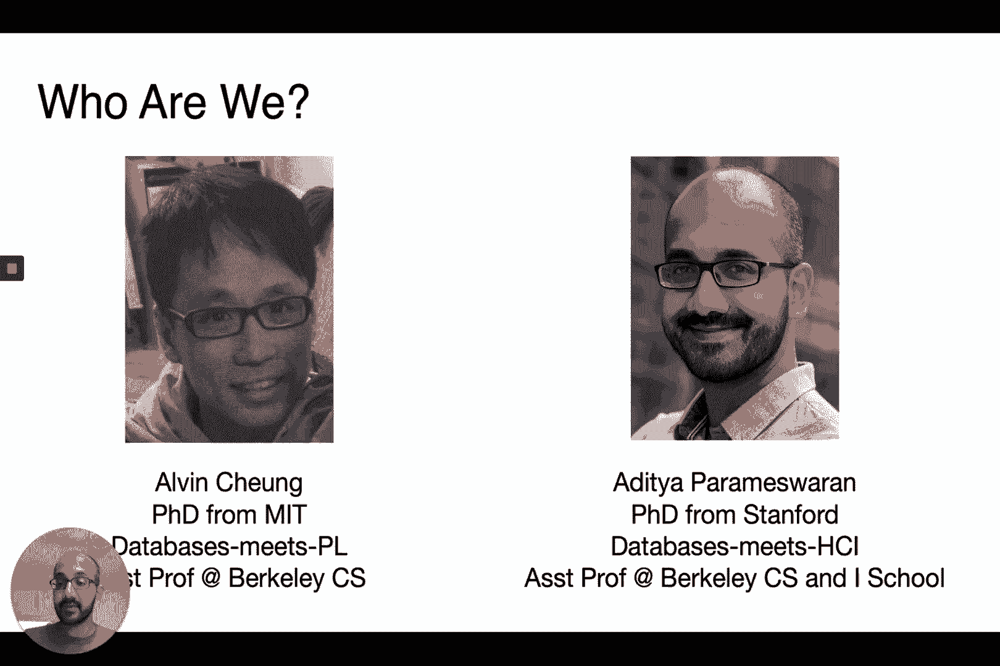
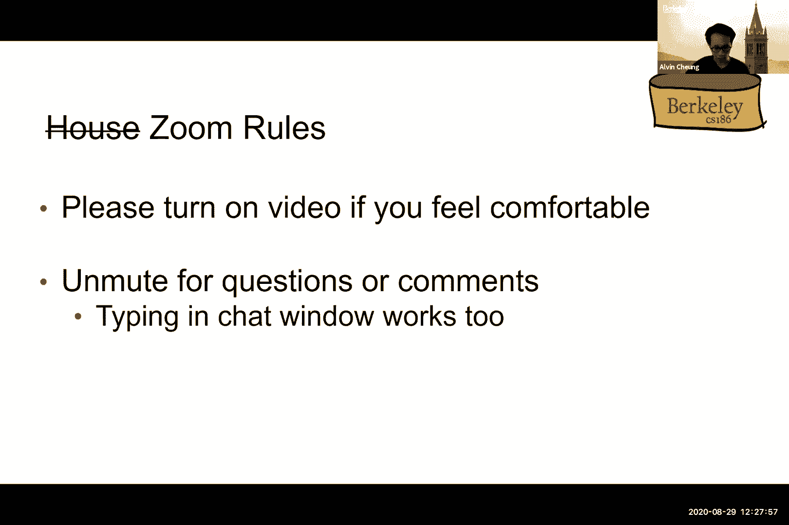
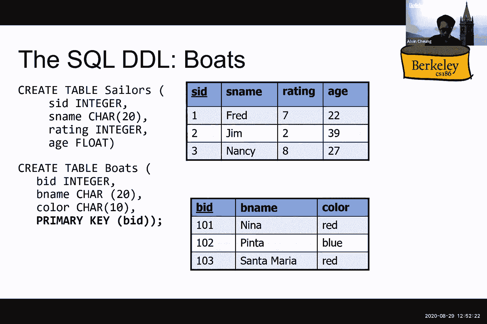
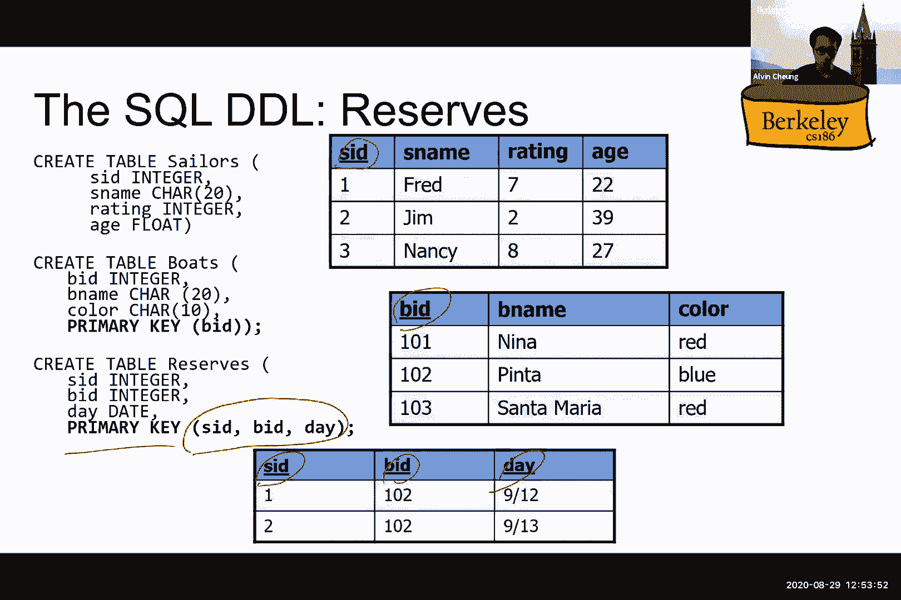

# 数据库系统导论 P1：课程介绍与 SQL I 🗄️

在本节课中，我们将学习数据库系统的基本概念，了解为什么数据库在现代计算中至关重要，并初步接触关系模型与 SQL 语言的核心思想。

## 课程概述


这门课程将涵盖如何开发用于管理、维护、处理大规模数据并与数据进行交互的系统。我们将学习与数据交易、系统开发原理以及在管理数据背景下进行系统开发相关的所有内容。

## 为什么学习数据库系统？

以下是学习数据库系统的几个核心原因。

### 无处不在的应用

当你预订酒店、机票或 Airbnb，在社交媒体上点赞，寻找餐厅，在 Piazza 或 Slack 上发布信息，或进行金融交易和购物时，你很可能正在使用数据库系统。如果你考虑创业或加入一家大公司，你构建的应用程序很可能将由这类系统支持。

### 现代科学的支柱

在基因组学、天文学、神经科学、医学和气象学等领域，会生成或收集大规模的数据集。理解这些数据需要强大的系统支持。我们将要学习的系统，是解决未来一些最紧迫社会挑战（如气候变化和公共卫生）的关键。

### 数据成为计算的核心

数据增长将在未来继续超越计算能力，未来计算的关键瓶颈将在于数据处理。因此，面向大规模数据的系统是现代计算的核心。每分钟，大约有50万条推文被发送，2000万次天气频道预报请求，以及400万次谷歌搜索请求，这展示了惊人的数据生成速度。

例如，大型强子对撞机每年生成的数据量相当于100万拍字节，这迫使系统必须进行降采样处理。理想情况下，我们希望构建能够逐渐扩展处理极限的系统。

### 基础技术与研究机会

数据库领域已获得四个图灵奖，涉及关系模型、事务处理等核心概念。开发可扩展的数据系统是计算机科学研究中最激动人心的领域之一。本课程将教授的原则是超越时代的、可重用的思想和组件。


## 什么是数据库系统？



假设你正在从零开始构建一个银行数据管理系统。你需要担心以下方面：
*   处理大量数据。
*   快速处理查询。
*   在系统故障时保证数据不丢失。
*   支持多用户同时访问和更新。
*   保持数据一致性。
*   系统易于使用和安全。

数据库系统的方法是将所有这些数据管理功能集成并抽象为一个独立的层次（DBMS），供许多应用程序（如ATM、网页、手机应用）访问。

### 数据库系统的定义

数据库系统是一个提供高效、便捷和安全的多用户访问，以存储海量持久数据的系统。我们来拆解这个定义：
*   **海量数据**：数据量非常庞大，可达PB级别。
*   **持久性**：数据需永久保存，存储在硬盘或闪存等稳定介质中，而非内存。
*   **多用户**：需要协调多个用户对同一数据的并发访问，确保正确性。例如，联合账户的余额检查。
*   **安全性**：系统需在故障时保持安全（如事务的原子性），并防止恶意访问。
*   **便捷性**：应有简单的命令进行操作，易于处理各种查询。
*   **高效性**：数据检索和操作应快速，不随数据总量线性增加复杂度。

### 为什么需要专门的数据库系统？

早期的系统基于文件系统，但它无法保证崩溃时的数据一致性，不支持高效的快速访问，需要自定义代码维护数据结构。数据库系统则原生实现了这些功能：
*   描述现实世界实体。
*   存储和管理超越程序生命周期的持久化大数据集。
*   支持高效的查询、更新和结构更改。
*   以正确的方式处理并发更新。
*   从崩溃中恢复。
*   遵循安全性和完整性属性。

**数据库管理系统（DBMS）** 是存储、管理和促进数据访问的软件。**数据库** 是DBMS管理的大型、组织良好的数据集合。在表示上，数据库常用圆柱体符号，象征数据持久存储在磁盘上。

## 关系模型基础

我们将主要关注关系数据库系统（RDBMS），如 Oracle, SQL Server, PostgreSQL。关系模型的核心是 **关系（Relation）**，也称为 **表（Table）**。



一个关系包含两部分：
*   **模式（Schema）**：描述表结构的元数据，包括列名和类型。
*   **实例（Instance）**：存储在表中的一组具体数据。


以下是相关术语：
*   **属性（Attribute）/ 列（Column）/ 字段（Field）**：表中的垂直列，有名称和类型（如 `TEXT`, `INTEGER`）。
*   **元组（Tuple）/ 记录（Record）/ 行（Row）**：表中的水平行。
*   **基数（Cardinality）**：关系中元组的数量。

关系具有以下属性：
1.  **模式固定**：列名和类型定义后是固定的。类型必须是 **原子（原始）类型**。
2.  **行无序**：行的顺序不重要。
3.  **行可重复与否**：可以是集合（行唯一）或多重集合（行可重复）。
4.  **平面化**：属性不能嵌套（必须符合 **第一范式**）。
5.  **物理数据独立性**：数据的物理存储方式（如行存储、列存储）对上层应用透明。

### 键（Key）

**键** 是能够唯一标识表中每一行的一个或一组属性。我们主要使用 **主键（Primary Key）**，每个表只能有一个主键。

在模式定义中，我们通过 **下划线** 来表示主键属性。例如：
*   `Sailors(sid: integer, sname: string, rating: integer, age: real)` 中，`sid` 是主键。
*   `Reserves(sid: integer, bid: integer, day: date)` 中，`(sid, bid, day)` 组合起来作为主键。

## SQL 语言简介

SQL（Structured Query Language）是用于管理和操作关系数据库的标准语言。它始于1970年代的IBM研究，并最终成为最广泛使用的数据库查询语言。

SQL 语言主要包含两部分：
1.  **数据定义语言（DDL）**：用于定义和修改数据库模式，如创建、删除表。
2.  **数据操作语言（DML）**：用于查询和修改数据库中的数据实例。

SQL 是一种 **声明式语言**：你只需指定想要什么结果，而无需描述如何一步步实现。具体的执行策略由数据库系统的优化器决定。

### 使用 DDL 创建表

以下是一个创建 `Sailors` 表的 SQL 语句示例：

```sql
CREATE TABLE Sailors (
    sid    INTEGER,
    sname  VARCHAR(50),
    rating INTEGER,
    age    REAL,
    PRIMARY KEY (sid)
);
```

## 课程进行方式与期望

本课程将在线进行，包含同步讲座、讨论、小测验、编程项目和考试。我们鼓励通过 Piazza 进行课程交流，并提倡同学间互相解答问题。

课程工作量包括每周的讲座、小测验和若干编程项目。项目将涵盖 SQL 查询、索引、连接操作、查询优化和事务处理等内容。我们提供了缓冲时间以应对特殊情况，但建议同学们合理安排进度，避免期末压力过大。

学术诚信至关重要，我们对此有严格的政策。请独立完成作业，如有压力请及时与课程工作人员沟通。

## 总结



本节课我们一起学习了数据库系统的重要性及其广泛的应用场景。我们明确了数据库系统的定义和目标，并初步认识了关系模型的核心概念：关系、属性、元组、键以及第一范式。最后，我们介绍了 SQL 语言及其声明式特性，并展示了如何使用 DDL 定义表结构。



在接下来的课程中，我们将深入学习如何使用 SQL 的 DML 部分进行丰富的数据查询与操作。