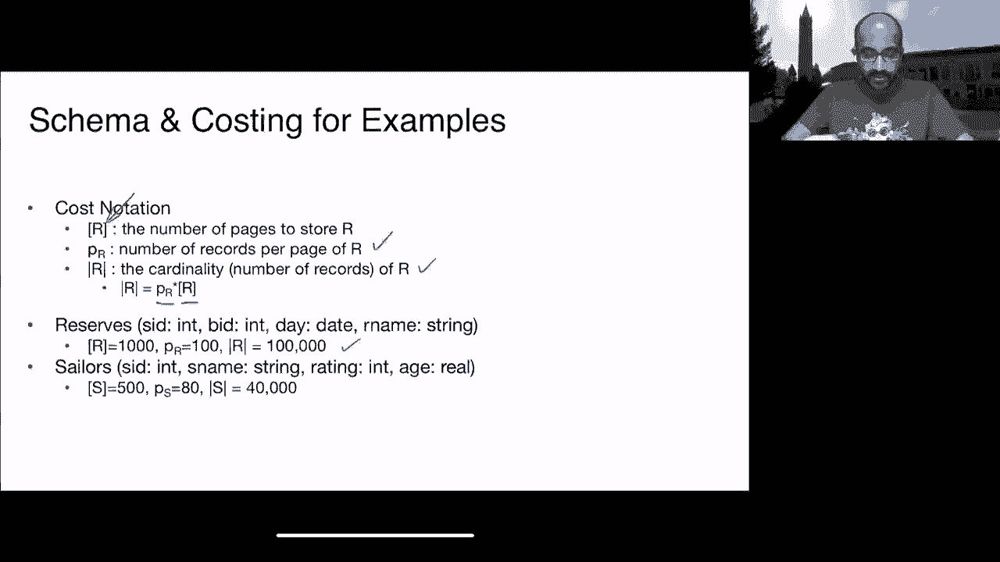
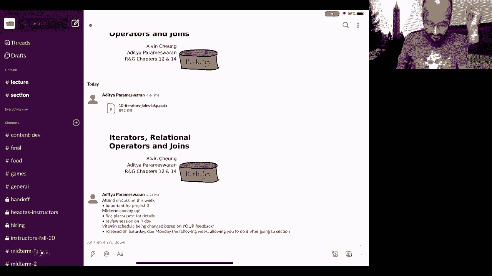
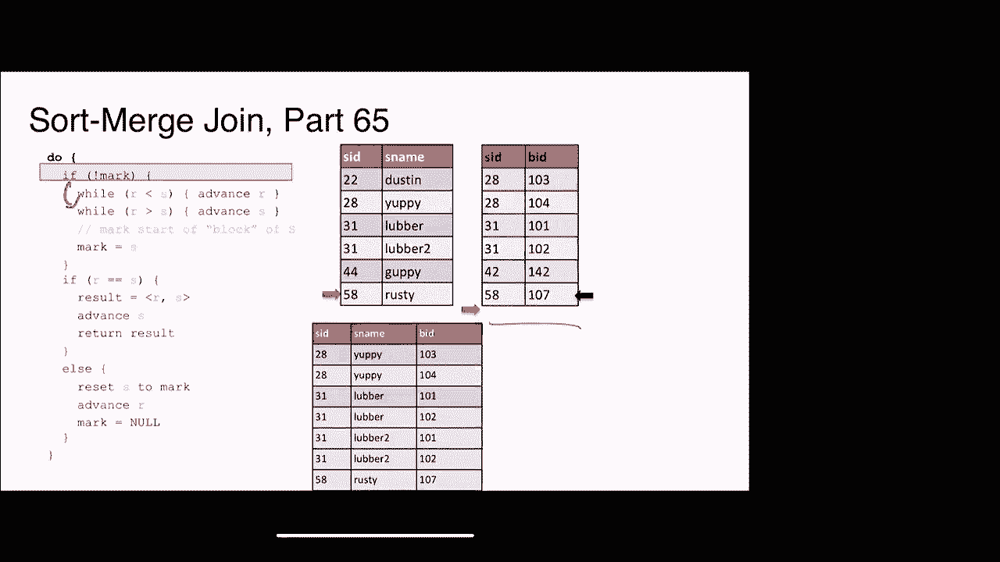
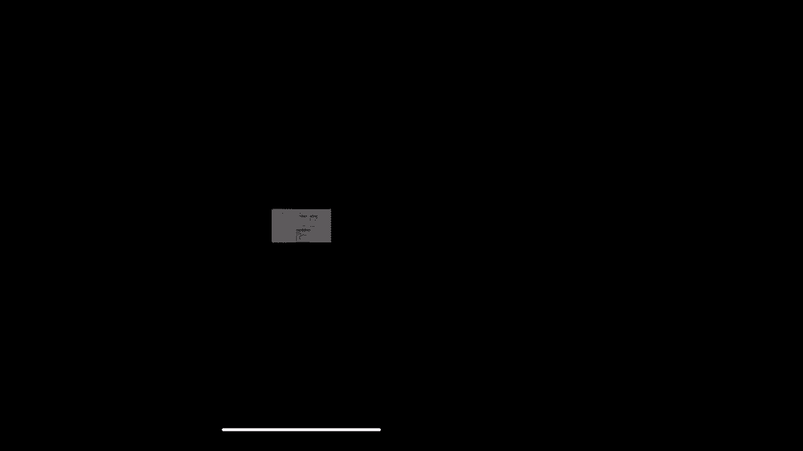
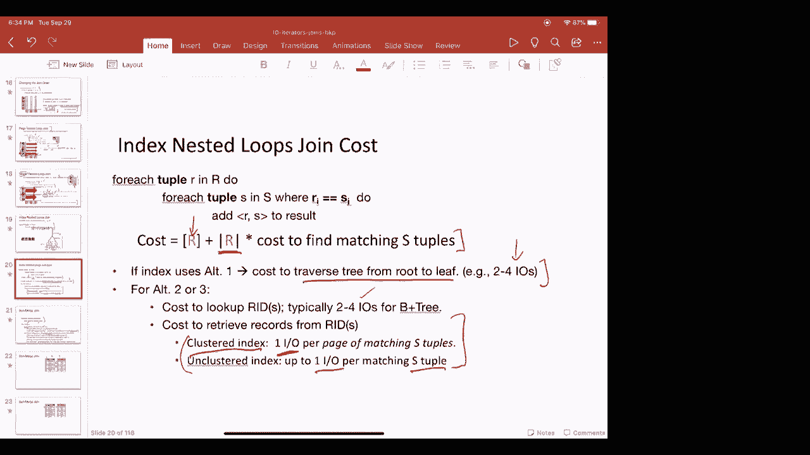

# P10：第10讲 迭代器与连接 I - ___main___ - BV1cL411t7Fz

好的，看到你们所有人都在这里真是太棒了。

好的，太好了。给我一秒钟确认一下我的聊天窗口是否可见。好了，太棒了。我们现在正在直播，讨论关于连接算法和 IT 行业的内容。我想 Alvin 和我基于核心团队的反馈决定，我们会尝试在课程中间或者课程结束时做一些公告。

可能有些人会因为之前有课而迟到。因此，我们尽量在课堂的中间做公告。通常当我把掌控权交给 Alvin 时，或者当他把掌控权交给我时，我们会在那个时候做公告。如果我们没有交接掌控权，我们会想办法安排。

我们仍会尽力确保公告在课程结束前完成。所以我们在谈论迭代器。我们之前谈到过关系运算符都是这个迭代器类的子类。在我们继续讨论之前，让我们复习一下上次讨论的内容，那就是查询计划。一个 SQL 查询会被编译成查询计划，查询计划是这样的。

就像这样的树。这个树编码了元组的流动。基本上，元组从底部流动。这些是关系，它们向上流动。因此，树中的这些边缘编码了元组的流动。树中的顶点包括运算符和底部的源顶点。

以及编写表访问运算符。这可能是扫描或索引查找等。因此，这就是你如何读取排序树。这被称为查询计划。在某些情况下，它也被称为数据流图，原因显而易见，因为你在图中编码了元组的流动，对吧？

所以它是一个图，编码了元组的流动以及对元组执行的操作。而这个数据流图不仅仅是数据库系统特有的，它在其他大数据、深度学习和机器学习系统中也可以找到。因此，数据库系统中的这个查询执行器组件负责实例化。

这些运算符负责创建这些运算符的实例。查询优化器则负责选择哪些运算符需要首先执行。因此，这个优化器负责选择查询计划。查询执行器将创建这些运算符的实例，运算符随后执行查询。

查询的执行，好吗？所以执行查询计划的是查询执行器。查询执行器通过创建这些运算符的实例来运行这些运算符。因此，对于每个运算符，每个内部节点，每个叶节点，查询执行器都会实例化一个运算符。所以你会有，每个这些都叫做迭代器。原因很快就会明白。

比如你有一个索引嵌套循环连接迭代器，或者一个投影交易器，或者一个选择交易器。这些是一些即时交易器，比如选择和投影。我们上次讨论过即时交易器，我们也会快速复习一下。底部我们通过索引扫描迭代器来访问这些关系。

所以这些基本上是通过索引查找该关系的元组。稍后我们会看到为什么这可能会很有用的例子。所以每个操作符实例基本上实现了这些迭代器接口。这是每个操作符都需要支持的一组标准方法，这样就有了一个统一的。

操作符之间具有统一的可组合性。所以一个操作符可以调用其他操作符，而这些操作符可以组合在一起，形成这个完整的计划。因此，迭代器接口如此重要且强大。每个操作符实例负责执行操作符逻辑，并将元组转发给下一个操作符。这个操作流从底部流向顶部。

所以元组将从底部到顶部流动，结果将在根节点生成。到目前为止有什么问题吗？好的，那么，什么是这个迭代器接口？

那么，这是什么，所有这些操作符都应该支持的这组公共方法是什么？迭代器接口基本上是一个类，支持一组固定的方法。它是一个抽象类，具有一组固定的方法。一个是设置方法，它基本上为每个操作符设置输入集合。

给那个操作符。所以这些是该操作符的子操作符。然后是，通常这是标准的，我们将避免讨论它。这对任何特定的操作符实例来说并不是非常独特，它基本上是整个操作符空间的一种标准。

所以我们不会过多关注这个，我们会关注剩下的三个。剩下的三个更有趣，而且对于不同的操作符它们是不同的。因此，`init`基本上是进行设置，对吧？它基本上是在开始处理元组之前进行一些处理。

所以这是在调用`next`之前的调用。`next`是负责单个元组处理的操作符。因此，这个`init`操作在调用`next`之前被调用。它设置一些状态，通常初始化一些变量，做一些背景设置，之后你就可以开始处理那个操作符了。下一个操作符是返回类型为元组的。

所以它基本上负责生成另一个元组。这个操作符是由父操作符用来生成另一个元组的，比如说来自子操作符的元组。而且它负责返回另一个元组。因此，通过反复调用`next`，你可以遍历产生的元组。

由一个给定的操作符来执行。因此，术语“迭代器”就来自这里。好的，这就是“迭代器”一词的来源。关闭函数是标准的。再说一遍，这通常在操作符没有更多元组可生成时调用。所以你基本上是在某种意义上“关门打烊”。所以你基本上清理状态，关闭文件句柄等等。所以这个迭代器接口是基于拉取的计算模型，而不是基于推送的。

计算模型。根节点开始，根节点从子节点请求更多的元组，然后子节点再从各自的子节点请求元组，以此类推，直到元组从叶节点被拉取，叶节点是所有的关系，一直到根节点。所以根节点在某些情况下可能是，例如，控制台，控制台可能。

调用查询计划的根操作符中的“初始化”。根操作符然后随之请求更多的元组。如果这个元组尚未准备好，下一个请求会传递到查询计划中的后续节点。

每个操作符都作为一个操作符，然后如果它们尚未实例化，您可以通过调用“初始化”来设置它们。然后如果元组已准备好，它会立即提供。如果没有准备好，它们将再次调用它们的子操作符，依此类推。大致就是这种基于拉取的计算模型的工作方式。

它从根节点开始，然后逐步向下传递到叶节点。这个“初始化下一个”可以是以流式处理、实时方式，或者是阻塞、批处理方式支持的。流式处理基本上涉及较少的工作量，而阻塞通常用于那些必须消耗大部分子节点输出的操作符。

在它生成任何输出之前，它不会产生输出，直到它消耗完所有输入。例如，排序操作是一个阻塞操作，因为你需要查看所有的元组，才能按排序方式生成结果。所以，这种迭代接口的一个好处是，所有的关系操作符。

被实现为该类的子类的操作符可以进行组合。因此，任何迭代器都可以作为输入传递给另一个迭代器，因为它们都实现了相同的接口。这个迭代接口的另一个有趣之处在于，给定操作符的所有逻辑都被封装在其中。因此，迭代器可能会维持大量的私有内部状态，这些状态仅对该操作符可见。

操作符对其他操作符不可见。因此，它们可以维护哈希表、运行计数、指针、游标，以及排序文件等。因此，这些都是各个操作符可以作为状态维持的内容。好的，我们现在来处理一个简单的实时操作符，即选择操作符。再说一遍。

这是关系代数上下文中的sigma运算符。这个是一个流式或即时运算符，意味着它为每一个生成的元组做一点工作。好的，那么InIt做了什么？好吧，选择操作符的InIt是以谓词作为参数调用的，它是。

参数是作为选择操作符的下标应用的条件。所以它做三件事。首先，它对其子节点调用InIt。因为选择操作符不能单独存在，它必须有一个子节点。通常这个子节点其实可能有所不同。所以它可以是一个关系。

它也可以是一些操作符的结果。所以这个选择操作符对其子节点调用InIt。它使用这个输入参数谓词设置一个名为pred的内部变量。所以这是一个存储状态的局部变量。然后它有一个名为current的局部游标，初始值为null。好的，我们接下来会看到为什么current很有价值。

所以下一个函数有一个while语句。下一个函数是说，只要current不在文件结束，并且谓词对当前元组的评估结果为假，继续从子节点获取另一个元组。好的，基本上这个while循环指示这个选择操作符的子节点生成。

越来越多的元组，直到你找到一个匹配谓词的元组，或者你达到了文件结束标志。好的，eof是文件结束。要么你找到一个匹配谓词的元组，要么你看到文件结束。无论哪种情况，你都会返回那个，对吧？一旦你找到一个匹配谓词的元组。

你返回那个。否则，你基本上已经处理完了，达到了文件的结尾。基本上，这意味着子节点没有更多内容可以提供。所以你返回文件结束标志给父节点。好的，这就是你如何生成另一个符合条件theta的元组。

或者谓词（pred），在这种情况下，它作为该操作符的一部分进行指定。关闭操作符不做什么惊人的事情。它基本上告诉这个操作符的子节点关闭。好的，我们来看看一个稍微复杂点的操作符。这是一个堆扫描操作符。所以这个通常作为查询计划的叶节点出现。

因为它基本上是在读取堆文件。所以这个heapscan的初始化函数接受一个关系作为参数，然后基本上为该关系设置一个堆扫描。所以它会为这个关系打开堆文件。然后它会尝试查找堆文件中与该关系相关的第一页。在那一页中，它识别出第一个槽位，引用该关系中的第一个元组。

页面，它可能会在后续需要读取。好的，这就是 init 做的事情。所以一旦你设置了这个状态，基本上你通过 init 做的就是告诉系统，嘿，这是我的当前页面。所以，这是我正在读取的页面。在这个页面中，这是我将要读取的插槽。然后，接下来会有一个运算符请求元组，随后再调用。

好的，那么接下来该怎么做呢？如果当前页面是 null，那么你就返回文件结束。基本上，这个是预留给你已经读取完所有元组，没什么东西可以再读的情形。好了，那么，如果当前页面不为 null，那么你最终会做的是初始化一个叫做 current 的变量，它指向当前页面和当前页面内的当前插槽。

那个页面。好吧，这基本上是一个记录 ID 指针。而这个记录 ID 将作为我们的返回值。也就是说，我们还没完全结束，因为我们不仅仅要返回记录 ID，我们还需要弄清楚如何准备好跳转到下一个记录 ID，以便进行下一步操作。

下一个调用。对。所以，单纯返回当前页面和插槽 ID 后继续执行是不够的。我们需要弄清楚如何推进指针到下一个我们将在后续请求中读取的记录。因此，这个逻辑基本上就是告诉你怎么做。当前插槽会被推进。所以你调用 advance，这个函数将从一个插槽推进到下一个适用的插槽。

在该页面上。如果当前插槽是 null，那么这个函数会返回 null，这意味着该页面内没有更多的插槽可以读取，在这种情况下，你就推进到下一个页面。好的，那么你就会转到堆文件中该关系的下一个相关页面。如果当前页面不为 null，说明你还没有读完所有页面。

如果它等于 null，意味着没有更多的内容可以读取。如果它不为 null，意味着你仍在处理一个你还没有读取完元组的页面。所以，当前插槽会被初始化为该页面内的第一个插槽。好了，所有这些处理就是为了为下一个调用（next）做准备。

所以，一旦你完成了这部分，你就返回当前记录 ID，它是当前页面在当前插槽对中的一个记录，返回给父节点。好吧，有什么问题吗？好，明白了。对，所以，关闭操作也不算令人惊讶。它基本上是关闭文件句柄。对，不是。好了，Sean，继续吧。是的，我在想，像是。

我们在嵌套的 if 语句中再次检查当前页面是否为 null。如果它是 null，我们是不是也应该返回文件结束？抱歉，不好。不好。你想在这里加上文件结束吗？所以如果当前插槽是 null，我们就会推进当前页面。对吗？没错。如果当前页面推进后是 null。

我们应该在那儿返回文件结尾吗，因为我们在这种情况下仍然返回当前记录？不，所以。你可以这样理解，对吧？当前引用的是将要生成的当前元组，或者是当前调用 `next` 时的记录 ID。然后当前槽位和当前页面基本上表示即将生成的下一个元组。所以如果当前页面最终是文件结尾。

这意味着你已经超出了适用记录的范围。你没有更多的记录可以生成，但你将在下一次调用 `next` 时检测到这一点。现在不用担心这个问题。你现在已经有了要生成的记录。所以你可以直接生成它。好了，大家，谢谢。好的，好的。是的，是的。

那么，为什么我们传递的是记录 ID 而不是记录元组本身呢？

所以你也可以这样做。这只是一个指针，这和前面提到的是等效的，对吧？我的意思是。你也可以直接减少记录，元组本身也可以，这样做是等效的。我猜这取决于实现方式。所以没有特别的原因需要使用记录 ID。你也可以提取元组并让它作为输出。那样也可以。谢谢。

所以这也取决于你使用的编程语言。如果你使用的是 C++，你可能需要复制一些东西，但如果你只是记录，返回记录 ID，那就只是在返回一个数字。还有其他问题吗？好的。好吧，那么让我们来谈谈排序。好的，我们将讨论的变种是两次传递排序。

所以这只是两次传递。如果我没记错的话，基本上是四倍的处理量。好的。让我们通过这个例子来讲解，然后如果需要的话我们可以再讨论复杂度。好的。所以排序的初始化函数基本上接受一个参数，就是你想要用来对输入数据进行排序的键。好的，这就是你将要排序的子项。

子项的结果。所以这是这个初始化函数接受的一个参数。你首先要做的就是完成零次传递。好的，零次传递。负责在磁盘上生成排序运行数据的过程已经在初始化步骤中完成。这个过程是一个阻塞调用，因为它没有生成任何输出，而且消耗了很多资源。

输入的部分。所以基本上你最终会像往常一样执行 `child dot init`，你初始化子项，然后。你会重复调用 `child dot next`，然后在磁盘上生成排序后的运行数据。好的。一直生成排序后的运行数据，直到子项提供文件结尾。此时你知道已经生成了这些排序后的运行数据，你可以继续进行下一步。

好的，接下来是为第一次合并设置准备，对吧？因为我们假设这是一个两遍的算法，我们将假设它有足够的缓冲区来正确地进行合并，这意味着需要有足够的空间来容纳每个排序运行中的一个页面。好的。

所以你正在打开每个排序运行文件，并将每个运行的一个页面加载到输入缓冲区。你基本上是在为第一次合并做准备，将磁盘上每个排序运行中的一个页面加载到输入缓冲区。这就是你的初始化。初始化已经做了很多工作，对吧？

所以初始化阶段已经做了很多工作，基本上是在为排序合并的下一阶段做准备。好的，按照排序运行的方式进行排序已经完成，我们已经为合并准备好了状态。好的，接下来这个函数基本上是执行第一次合并，并且假设有足够的缓冲区来进行合并。这样你就拥有了每个排序运行的一个代表性页面。

所以产生的输出元组基本上是所有缓冲区中的最小元组。它查看所有包含每个排序运行的一个页面的缓冲区，找出所有缓冲区中的最小元组，然后将其作为输出。如果这个最小元组是其缓冲区中的最后一个元组，那么你基本上就需要重新填充这个缓冲区。

对吧？所以你从那个运行中获取下一个页面到缓冲区。当你生成一个最小元组时，你识别出最小元组，并且已经重新填充了每个排序运行对应的页面。所以你现在又从每个排序运行中获取了一个代表性页面。你可以返回输出，然后等待下一个调用，以便你可以继续进行。

再次读取一个最小元组。Carson，你有问题吗？

既然我们要在多个不同的值中选取最小值，那么有什么好的方法来实现呢？

你只需基于所有这些值构建一个最小堆？

所以你可以做得更复杂一些。你可以存储一个最小堆。也许更直接的方式是循环遍历所有元组，找出最小值，对吧？另一种选择是，嗯，基本上这两种方法可以作为选择。

一种智能数据结构能够在添加新的元组或移除页面时，始终保持最小值。所以基本上，当你耗尽一个页面中的所有元组时，你就引入一个新页面，这对应于对该数据结构的一个新插入。另一种选择则是直接遍历。

通常你会选择一些轻量级的方式，所以优先队列可能并不是必需的。Carson，这样理解吗？是的，这样理解。还有其他问题吗？好的。那么排序操作的关闭函数，也就不算什么令人惊讶的部分，对吧？

基本上，你会释放运行文件，然后关闭子进程。也就是说，销毁你剩余的状态。我们继续讲解 `group by`，我们将特别讨论一种情况，特别是基于已排序输入的 `group by`。所以我们假设输入已经排序。好的。

所以这可以是一个明确的排序操作之后的例子，`group by` 正在消费排序操作的结果。结果证明，我们也可以在不显式排序的情况下进行分组排序。所以输入不一定需要排序。但在这个例子中，我们假设输入已经排序。

我们假设输入已经明确排序。因此，`group by` 与我们正在计算结果的聚合无关。对合并组中元组的操作适用于多种聚合函数。所以典型的处理方式是这样的：你为每个组初始化某些状态，针对每个你要使用的聚合函数。

你需要为其生成一个结果。你一次处理一个元组，与你当前的状态合并，然后返回结果，当你完成一个组时。让我们举一个具体的例子。如果你的聚合类型是 `count`，那么你维护的状态就是这个变量。

这里有一个叫做 `count` 的变量，它在每个组开始时初始化为零。当你看到更多的元组时，你会增加 `count` 的值。这就是当你合并一个新值时所做的操作。然后，在看到该组的所有元组后，你返回 `count`。好的。

所以这就是当你完成一个组时的操作。总和类似。好的，你有一个叫做 `sum` 的变量。你将它初始化为零。如果你看到一个新值 `X`，你就把它加到当前的总和中，然后当你完成时，你就以此作为这个分配的输出。基本上，对于这些函数中的每一个，操作都是如此。

你一次处理一个值，并且可以增加它。你可以将它与现有值合并。现在，让我们谈谈平均值和最小值。那么，对于平均值，状态应该是什么样的呢？我们想要维护什么样的状态？

那么我们如何将新元组的结果与现有状态合并呢？

总和与计数，正确吗？

所以基本上，你会同时维护总和和计数。你会将它们都初始化为零。当你获得新值时，你会增加计数，然后将新值加到总和中。然后，当你需要生成结果时，你就拿总和并进行除法运算。

它按 `count` 来进行处理。那么最小值呢？最小值也不太令人惊讶。你基本上会保持到目前为止看到的最小值。在初始化时，你会将其设置为一个非常非常大的值。好的，比如你可能会将其初始化为正无穷大。然后，当你得到新值时，你会检查当前最小值是否小于新值。

你正在检查的值是否存在。如果新值更小，你会用新值替换当前的最小值。然后，最终你会生成你一直跟踪的最小值。好的，这就是它的样子。所以平均值基本上保持一个注释对。

总和和计数。对于最小值，你将保持当前最小值，这个值是你迄今为止看到的。你将其初始化为一个非常大的值。如果当前的最小值大于你看到的值，你会用它来替换当前的值。好的，有问题吗？所以这是我们认为的，是的。是的，既然平均值使用了计数和总和，这是否意味着，比如说，如果...

那么我们是否真的需要做所有这些工作，比如创建和设置状态？如果只是计算平均值，或者如果只是简单地计算两个已经知道的值，是否有必要做所有这些设置？是的，如果你只需要平均值，那就想想，看是否能找到更好的方法，对吧？

我不知道有没有更好的方法去做，而不需要同时维护总和和计数。哦，好吧。是的，我在想，就像我之前说的，如果只是依赖于计数和总和，是否有必要维护平均值本身？我们是否需要维护？好的，我明白了。是的，所以如果是这样，你肯定可以，如果你知道你会返回计数、总和和平均值。

比如，你可以保持总和和计数，然后就完成了，对吧？

你可以对所有三个都使用这个方法，如果那是你的意思。好的，是的，那是我想问的。是的。还有其他问题吗？好的。那么，使用这个原语，让我们试着找出如何处理未排序的输入进行分组。这个分组操作符的初始化函数将接收一堆分组键。

这是你的分组键和你想要生成的一堆聚合。好的。下一个函数负责繁重的工作。下一个函数基本上会继续组合新的值。所以下一个函数就是下一个函数。

所以下一个函数就是下一个函数。基本上，下一个函数会持续地组合新的值。对于一个给定的组，当它确认不会再看到该组的任何元组时，它会产生一个结果。好的，这就是直觉。

所以你的输入已经排好序。记住，由于你的输入是有序的，你基本上是在按顺序消耗结果，对应于一个组。一旦你进入下一个组，就可以为该组生成一个结果，然后开始一个新组。好的。所以，你有这个do while循环。再次。

现在暂时不关心结果。结果被设置为 null，稍后我们会解释为什么结果设置为空是有道理的。当前组最初设置为 null，实际上指向你正在处理的当前组。所以这个元组是一个变量，指向来自子任务的下一个元组。好吧。所以你向子任务请求另一个元组，得到它，这就是你的新元组。

然后这个新的元组，你需要检查该元组所属的组是否是当前组。好吧。它属于当前组吗？如果不属于当前组，那就意味着你需要开始一个新的组。好吧。当我们开始处理时，每个组的值是空的。所以你最终读取的任何元组，所属的组都不会是空的。

所以在这种情况下，你最终也会开始一个新组。所以如果当前组不等于空，意味着你会处理一些组，然后你会继续为该组生成结果，因为我们知道，已经移动到下一个组了。好吧。所以结果基本上就是当前组。

也就是说，当前组，并且完成所有需要生成的聚合结果。然后我们将重新更新当前组，当前你正在操作的组，将变成元组所属的组，并且我们会对每个组调用所有必要的聚合操作。好吧。所以如果你确定没有更多的元组可以生成，基本上就会发生这种情况。

对于给定的组，你还会对所有的聚合操作调用 merge。所以基本上是合并与当前元组相关的所有聚合值。所以不管你是生成一个新组还是继续处理一个旧组，都会执行这个操作。一旦这个结果变量不为空，

所以记住，结果变量最初是被初始化为 null的，如果该结果变量变得不为空，那就意味着你已经准备好为一个组生成结果了。所以一旦发生这种情况，你就会退出这个两重 while 循环，并将其作为结果返回。好吧。所以一旦你有了一个新元组可以贡献，这基本上就是一个组。

它的所有聚合结果，你就会开始生成结果，并在下一次调用时返回。所以，子任务这一部分其实并不令人惊讶。你基本上是在对子任务调用 close。所以这个迭代器的有趣之处在于，它实际上在任何给定的时刻，只在内存中维护一个部分结果的元组。这一点非常有意思，对吧？

所以它基本上维持着某些状态，这个状态是恒定的，不受每个组处理中元组数量的影响。这个设计非常巧妙，对吧？

所以它是非常轻量级的。好的，接下来我们讨论的这些操作符有堆扫描、选择、排序和 `group by`，我们现在可以开始对整体查询计划有一些感知了。因此，查询计划，正如我们现在将讨论的，是单线程的。好的，我们稍后会看看是否需要将其改为多线程。目前，我们将考虑查询计划是单线程的。

所以你可以想象，查询计划基本上是从根部开始调用 `next`，在初始化之后，根部上下跳动，沿着查询计划上下调用 `next`。每次调用 `next` 会导致对其他操作符的 `next` 调用。

在查询计划中，这些调用将产生结果，并将这些结果传递回根部。所以作为一个练习，我鼓励你尝试一下这个特定的查询计划，它并不复杂，是一个单表查询计划。看看比如，如果你在 `group by` 上调用 `init`，它是如何递归地向下传递链条并返回一个值的？

然后，尝试理解如何调用根部的 `next`，看看 `next` 如何在查询计划中向下工作，然后返回两个结果。好的，正如我们所看到的，一些操作符是阻塞操作符。例如，排序操作符即使在初始化时，也会进行一个阻塞步骤，生成排序的结果。

由于 `group by` 操作符依赖于排序结果必须已经排序，因此它本质上像是一个流式操作符，就像 `select` 操作符一样。所以这两个操作符本质上都是流式的。因此，我鼓励你尝试一下。这是一个很好的练习，可以真正帮助你理解操作符的语义。

以及迭代器接口，以及这些调用如何从查询计划的根部一路传递到叶子节点。好的。所以，这里还有一个有趣的地方是，我们不一定需要将每个操作符的输出存储在磁盘上，对吧？元组实际上是流经查询计划的。

它们通过这个调用栈进行流式传输。当然，一些操作符可能需要使用这个。所以例如，排序操作符确实会将排序结果写入磁盘。但这不会暴露给操作符之外，至少从迭代器接口的角度来看，这些元组是被传递的，它们正在流经这些操作符。

所以迭代器框架本身是非常轻量级的，即使个别操作符可能更为重量级。好的，有关于这个的任何问题吗？好的，那我们继续讨论二进制迭代器。具体来说，我们将讨论连接（joins）。之前这是一个单表查询计划。现在我们将讨论连接。所以在谈论连接之前，我们需要设置一些符号。

所以，带有方括号的R将表示存储关系R的页面数。PR将表示每个页面存储的R记录数。带有竖线的R将表示R的基数，也就是R中记录的数量。所以，这就是PR乘以方括号。以我们的例子为例。

我们将使用这两个关系：我们的预订（reserves）和销售（sealers）关系。因此，预订关系分布在1000个页面上，每个页面有100条记录，总共有100,000条记录。同样，销售关系也如此。所以你有500个页面，每个页面有80条记录，总共40,000条记录。这就是该关系的基数。

是的，我做了。你认为现在是处理公告的好时机吗？

好主意。好的。

所以，我，Alwyn，没能找到你的公告幻灯片。所以我会直接根据我的Slack笔记做公告。好的。这里有几个公告。第一个，我会按随机顺序说，最重要的是期中考试快到了。

所以，我鼓励你测试一下你的设置，并在遇到问题时来找我们。对吧？所以Alwyn和我的办公时间相对宽松。如果你有任何问题，欢迎来找我们。如果有具体的技术问题，也可以在Piazza上发布帖子。如果有什么问题，我会。

也与期中考试有关，我鼓励大家参加这个周五的复习课。这个周的讨论也很有价值，非常有助于项目三的进行。项目三要求比较高，所以我鼓励大家参加本周的讨论。

如果你不能参加讨论，我鼓励你通过其他方式弥补，比如观看视频。例如，你提到维他命的发布时间和截止日期对你来说不太合适，部分原因是你想先参加讨论，再去做维他命作业。因此，我们实际上调整了时间表，将维他命作业的发布时间定在周六，截止日期是。

下一周的周一。这样你总共有九天时间，这样你就可以在参加完讨论之后再做维他命作业。这些就是公告。关于公告有任何问题吗？

正如我所说的，如果你有任何问题，可以随时来找我们。

让我们检查一下你的视频设置。我想Ethan已经在Piazza上发布了一个示例，告诉大家我们期望你在考试期间做什么。如果你有任何问题，或者只是想检查一下设置，可以在办公时间来找我们。所以，我们要求大家提交一些东西，如果你想获得额外的分数。基本上就是检查一下设置。不过正如Piazza上发布的内容所说。

我们实际上不会逐个点击你们提交的每个视频，对吧？由于隐私原因，而且我们也没有足够的工作人员去检查所有600个视频。所以如果你对自己提交的视频是否符合要求有疑虑，可以来办公时间找我们看看。说到这里。

录制的意图是在考试期间，我们可以检查是否符合要求。我们希望如此，并且它还试图最小化隐私问题。因此，鼓励良好行为始终是感觉安全的基本方式。我们确实希望考试公平，并尽可能与真实考试相似。

它应该是这样的。所以它会模拟真实的考试体验。很好。还有其他问题、想法或疑虑吗？好的，我将开始介绍我们联合算法的第一个变种。这被称为简单的嵌套循环算法，我们将为一般的θ连接进行描述。在我开始之前有两点需要说明。

所以我不会为这些算法展示迭代实现。而且，这只是为了简化，事实上，这些算法本身已经足够复杂了，展示代码并不会比我提供的直觉理解帮助更多。但我鼓励你们尝试自己推导出这些算法的迭代实现。

这些实现会是什么样子，对吧？在每个算法的`next`和`close`调用中。我们惯例是忽略写出输出的成本。好的，原因是它在所有方法中是常数。因此，它不是我们用来在不同方法间比较的依据。

连接的结果将具有相同的大小，无论你使用哪种算法。在许多情况下，连接的输出将通过`next`流式传输，对吧？

所以它可能不会写入到这个地方。它可能会被下一个操作符消费掉。因此，出于这两个原因，我们不会计算写出的成本。我们将专注于读取成本和处理成本，而不是写出的成本。好的，简单的嵌套循环连接非常直接。

基本上就是做两个嵌套循环。一个遍历R，一个遍历S。对于R中的每个记录R和S中的每个记录S，如果满足条件，θ谓词为真，那么你就将R和S添加到结果中，你基本上就是做连接，并将结果添加到结果缓冲区。好的，这就是你的简单算法。

那它看起来是什么样子呢？好吧，对于每个元组，你可以用X-Y平面来表示这个过程。R的元组沿Y轴，S的元组沿X轴。所以对于R中的每个元组r，你将遍历S中的所有元组。好的。然后你会对R中的第二个元组这样做，再对第三个元组，对第四个元组。

R 的元组等等。好的。所以你对每个大写的 R 的元组、小写的 r 的元组都做这个操作。好的。然后你遍历 S 的所有元组。好的。那么根据这些大小，这个算法的成本大概会是什么样子？有什么想法吗？

像是 N 平方吗？用这些数字我们该怎么表达呢？R 乘以 S。这是其中的一部分，但不是全部。好的。R 乘以 S 是其中的一部分，但还不是全部。让我来解释一下为什么。基本的成本是扫描 R 一次，而对于每个 R 的元组你要扫描 S 一次。

你将会遍历整个 S。好的。所以扫描 R 一次的成本基本上是 R 的页面数量，而你对每个 R 的元组扫描一次 S，所以你基本上是将 R 的基数乘以 S 的页面数量。好的。因此，总成本是 5000 万加 1000。好的。所以这是总成本。你就是扫描了一次 R，然后每个 R 的元组都扫描了 S 一次。

你扫描了所有的 S。好的。所以这是 R 的基数乘以 S 的页面数量。好的。这是第一个变体。对，所以一个自然的选择是反转这两个的顺序。对，你遍历所有的 S，然后对于每个 S 的元组遍历所有的 R 的元组。好的。所以你改变了这两个的顺序。那么在这种情况下，成本会是什么样子呢？

好的，你扫描一次 S，然后对于每个 S 的元组扫描一次 R。所以这是 S 的页面数量加上 S 的基数乘以 R 的页面数量。所以这个大概是 4000 万，而这个比之前的算法有显著差异，之前是 5000 万。好的。好的。所以我开始注意到聊天中有一些消息，问为什么要遍历所有的 R。

是基于 S 的元组而不是页面。这也是下一个算法背后的直觉。好的。好的。所以这是一个非常简单的算法，但它做了很多不必要的 I/O 操作。所以下一个算法会在思考时更加小心，考虑到从磁盘检索的基本单位是页面。

但在我讲到这一点之前，我确实想提到一下，做 R 作为外循环还是做 S 作为外循环之间有一个显著的差异。所以连接的顺序确实很重要，我们稍后会进一步探讨如何确定最佳的连接顺序。好的。那么我们该怎么改进这个呢？

聊天中有一些消息，这是这个思路。对，之前的算法在 I/O 方面效率比较低，那为什么不在页面的基数上操作呢？所以基本的思路是，现在有四个部分。第一个 for 循环是遍历 R 的所有页面。第二个是遍历 S 的所有页面。

然后，对于R页中的每个元组和S页中的每个元组，你就做连接并生成输出。好的。所以基本上你现在是在页级别而不是单个元组级别进行操作。你将引入这一页和那一页，然后你会对这两页中的所有元组对做连接。

所以整体执行大概是这样的：与逐个元组扫描S不同，你现在是在页级别扫描S。因此，在这个简单的例子中，你总共扫描了S四次，因为R有四页。那么，在这种情况下，成本是什么样的呢？对吧？那么成本在这里。

基本上是扫描R一次和每页扫描S的成本。对吧？所以扫描R一次，成本是方括号R加上方括号R乘以方括号S。而且这是50万，相对于前面的简单嵌套循环算法中的4000万来说要小得多。所以这就是我们所谓的页嵌套循环算法的基本思想，因为粒度。

你引入的内容是以页面为粒度的。好的。所以一个自然的问题是，我们能改进这个吗？对吧？是否可以进一步改进？有任何想法吗？使用更大的页面或缓冲区。Yin的想法是对的。对吧？基本的概念是，你想要最小化扫描S的次数。对吧？每次你。

在扫描S时，你增加了S的额外成本，包括S的页面数以及方括号页面的成本。整体成本因此上升。那么我们能否减少扫描S的次数呢？答案是肯定的，对吧？因此，与你逐页扫描S不同，你可以一次性扫描多页，对吧？如果你有B个块在。

如果你的缓冲区有B个槽位，你最好填充尽可能多的R页，然后扫描所有的S页。这正是下一个算法的思路。因此，传统上，这个算法被称为块嵌套循环连接。但因为我们之前在其他上下文中使用过块这个词，所以我们将它称为块。

好的。所以这将被称为块嵌套循环连接。这个块嵌套循环连接基本上是一次引入一定数量的R页。应该是R。然后循环遍历所有S的页面。所以，对于每个B减去2页的R块和每页S，你基本上是在找到所有的匹配元组。

这页S和R的区块中。你好？好的，我想是有人不小心打开了麦克风。好的。所以，你基本上是将R中B减去2页和这一页S做连接，并将所有输出生成，添加到结果缓冲区中。好的，这就是块嵌套循环连接的基本思想。在这个简单的例子中，可能。

你可以带入两个R的块，然后遍历所有S的块。所以你一次带入一个S的块。然后你会生成所有连接的结果。所以再次在图示的X，Y平面表示中，你基本上只是对S的所有页面进行两次扫描，因为你正在按粒度带入R的页面。

这些块的大小为Y B减去两页。那么，我们的约定是我们使用总体B块。我们为S有一块B B框架，总共有B块在你的缓冲区中。你有一页用于S，一页用于输出。然后，剩下的B减去2是你为R使用的。好的。那么，这样的成本是多少？

因此，成本基本上是扫描R一次的成本加上你需要扫描S的次数，取决于块数。那么我们如何计算有多少块呢？嗯，基本上是R除以B减2。所以B减2基本上是你每次可以带入的R的页面数，假设你有一页S是专门的，并且你有。

一个输出缓冲区。对。所以这就是“2”来自哪里。在这里你使用上取整，因为你想四舍五入。因此，总体成本是R的页面数加上R除以B减2的上取整值。这个是你带入B减2页时的块数，乘以S的页面数。

在这种特殊情况下，如果我们假设例如B为102，则总体会导致6000次IO操作。好的。所以这比页面循环提高了100倍。我会称之为稍微好一点。好的。所以总的来说，这是一个非常常用的连接算法，尤其适用于非等式谓词。如果你有一个θ连接，它是一个任意的。

如果条件不是等式，块嵌套循环连接通常作为一种默认的回退方式。好的。因此，其他算法如页面嵌套循环或简单嵌套循环并不是替代选择。好的。所以我想讨论的另一个替代连接算法是索引嵌套循环算法。好的。假设我们有一个。

在带有条件的等值连接中，ri。因此，R的第i个属性等于S的第j个属性。因此，索引嵌套循环连接的过程如下。就像你在排序时所做的那样，基本的简单嵌套循环连接，你会遍历R中的所有元组，并且对于R中的每个元组，你基本上会遍历S中的所有元组。

在条件匹配的地方，ri等于SJ，你将r和S添加到结果缓冲区，或者你生成一个连接的元组并将其添加到结果缓冲区。好的。那么我们如何找到ri等于SJ的元组呢？这就是索引的作用，对吗？因此，为了找到所有满足该谓词的S元组，我们用这个键进行查找，对吧？Ri。

然后，你在S上查找这个索引，这个索引可以是一个B+树，你找到所有匹配的S页，对吧？以及这些页面中的所有元组。对于每个你生成的元组，你将它与R连接并添加到输出中。那么，索引嵌套循环连接的成本是多少？嗯，成本是你要读取所有的。

所以，你仍然有方括号中的R的成本加上R的元组数量乘以找到匹配S元组的成本。而找到匹配S元组的成本变化较大，既取决于匹配S元组的数量，也取决于你用来编码B+树的替代方案。所以如果你记得，我们有替代方案一、二和三。

替代方案之一是将记录存储在B+树本身，而第二种和第三种方案则是B+树仅编码指向磁盘上记录的指针，对吧？例如，在堆文件中。好的，如果我们使用替代方案一，那么每次查找的成本是多少，对吧？

对于每个元组，基本上是从根到叶子遍历树的成本。这可能在两到四次IO之间。好的，通常我们讨论的树并不是非常深，因此你需要的IO次数并不多，才能到达叶子节点。如果一些页面已经在缓冲区中，这个成本也可能更小，对吧？例如。

你的B+树的根页面通常总是在缓冲区中，因为它访问频繁。对于替代方案二或三，再次，通过B+树的访问大约需要两到四次IO操作，然后就是检索记录的成本，对吧？使用记录ID。再次强调，记录ID基本上是页面ID和槽ID的组合。这取决于你使用的索引类型。

所以，如果你使用的是聚簇索引，你基本上为每个匹配的元组页面提供一个IO的成本，而对于非聚簇索引，如果你记得那些指针在非聚簇索引中是交叉的，在这种情况下，你不能避免为每个匹配的元组支付一次IO操作。所以这是有利有弊的。

对于这个索引嵌套循环连接，对吧？如果匹配的元组数量非常非常大，并且你使用的是非聚簇索引，那么有时索引嵌套循环连接的成本会非常高，以至于它不如其他连接方法可行，对吧？

有关于这些内容的问题吗？好的，那么我们来谈谈排序合并连接。顾名思义，排序合并连接使用排序作为进行连接的基本组件。所以它利用排序来进行连接。所以当你有一个相等谓词时，就使用排序合并连接。它适用于等值连接或自然连接。再次强调。

你可以从中得到一些提示，为什么是这样。你在做等值连接或自然连接时，使用的属性就是你排序的那些属性。因此，排序连接的两个阶段。第一阶段是按连接键对R和S进行排序。好吧？所以你在连接中使用的属性，实际上就是你开始排序的属性。

通过对R和S进行排序。这就能保证所有具有相同键的元组都是按连续顺序排列的。这让你能够按这个顺序处理这些元组。在某些情况下，你甚至不需要显式按连接键对R和S进行排序。输入中的这些元组实际上可能已经是排序过的。例如，如果你已经进行过了排序。

在此之前进行排序合并的过程，你的输入可能已经排序，对吧？因此，R和S可能因为这个原因已经排序了。或者，如果你使用索引扫描，可能元组会以排序的顺序产生。因此在某些情况下，你甚至不需要显式排序。它们可能已经以排序顺序给出。连接过程基本上会。

执行合并。它扫描排序后的分区，并在匹配时输出元组。现在，排序合并连接的挑战在于，R中的每个元组可能会与S中的多个元组匹配，反之亦然。因此，相比普通的归并排序算法，这就变得有些复杂了。你需要保持更多的状态，以确保。

所有可以连接的元组对实际上都会被连接。那么我们是如何做到这一点的呢？我们通过标记跟踪每个S元组块的开始位置。然后，我们利用这个标记来指定一旦处理完R中的一个给定元组后，应该回退多少位置。这样一来，我们就能更好地返回下一个R元组。因此，可以这么理解。

这个过程就像R是外循环一样。如果你想做一个嵌套循环算法的类比，R就是外循环。它只是向前推进。S是内循环，它会向前推进，然后回退。因此，标记用于指定元组块的开始位置。这个排序合并算法实际上非常。

这个过程可能涉及的内容，你第一次可能不太理解，我会一步步带你理清直觉。所以我鼓励你在事后花一些时间仔细琢磨这一点。它可能不会马上显现出来，但事后看来，我向你保证，只要给足够的时间，它就会变得有意义。因此，在我进入排序机制之前。

我想给出两个不同的直觉，然后带你走过代码。所以如果我有这两个元组，我想做一个排序标记连接，这些元组已经排序了。所以这些元组是按SID顺序排列的，而我在SID上进行连接。左边的元组，这个元组将与这两个元组连接。然后左边的这个元组。

这是R，而这是S，S将与这两个元组连接，然后是后续的元组。接下来，lover two将与这两个连接，最后rusty将与底部的107连接。因此，和归并排序不同，在归并排序中你可以简单地按照顺序遍历这两个分区，但在S的情况下，你需要先向下走，然后再回到上面。

所以这就是事情变得有点棘手的地方。这里是排序归并算法的第二个示例。抱歉，是排序归并连接。所以我从指向这两个关系的第一个记录的指针开始。再次强调，这些关系是按顺序排列的，我将像在归并排序中那样推动这些指针，从顶部向下流动。

到底部。我将从排序元组的第一个开始，向下走。好的，所以在这个特定情况下，我将从左侧的第一个元组向下走到第二个元组，因为右侧的元组比左侧的元组大。现在我找到了两个匹配的元组。这两个元组已经准备好连接了。所以我要做的是标记它们。我将标记这个。

这是与SID 28对应的元组的开始。然后我可以开始产生结果。所以我要产生一个与YupE 103对应的结果。接着我要将YupE与104连接。然后现在完成了。所以没有更多的元组会在左侧产生YupE。现在标记派上了用场。我可以现在回溯，带回这个。

右侧指针回到标记处，开始为下一个元组产生结果，位于左侧。好的，在R上。所以我将把左侧指针推进到31。我意识到，31和28无法连接。因此，我需要将右侧指针推进。我将其推进到31。好的。再次地，我添加了一个标记，以指示一个块的开始。

与给定值31对应的元组。现在我可以开始产生输出了。好的。LABAR将与101连接。我可以产生一个输出。LABAR将再次与102连接。我将添加另一个元组到输出中。现在我走得太远了，我已经到达42。42无法与31连接。所以我需要回到31。然后我将推进左侧指针。

指针指向LABAR 2。所以LABAR 2现在将与101连接。对的。我将产生一个输出。LABAR 2将与102连接。我将产生一个输出。现在，再次地，因为这里有一个标记，这个黑色箭头，我可以回溯。我知道该回到哪里，因为我已经完成了为LABAR 2产生的结果。现在我可以继续前进。

LABAR 2与GUPY。在这个特定情况下，没有将产生连接的元组。因此，我将右侧指针推进到58。将左侧指针推进到58。现在再次，我有机会产生一些输出。所以我产生一些输出，然后推进指针。这就是这里的直觉。好的，现在有了这个直觉。

我们来看看代码。好的。这是第二个例子，我想给你们讲解一下。我们来看看代码。好的。正如我所说，这需要几次尝试才能理解直觉。所以我鼓励你们在课后也设置这段代码。好的。好的。所以这。

标记变量基本上是在编码是否有蓝色箭头。现在没有蓝色箭头。R 编码的是左侧的指针，S 编码的是右侧的指针。好的。所以现在没有标记。所以我基本上在这个 if 语句中。如果 R 小于 S，我将前进 R。好的。所以现在 R 小于 S。

比 S 更大，因为它指向 22，而 S 是 28。所以我要前进 R。我不需要前进 S，因为 R 不大于 S。所以现在我找到了两个匹配的元组，基本上是这样的。对的。现在我要开始添加一个标记，表示这是需要做连接的元组块的开始。所以这基本上是开始。

一块元组。它还会记住我处理完之后需要返回的位置。左侧是一个元组。所以现在我进入了 R 等于 S 的阶段。好的。那么，28 等于 28。我现在可以开始生成输出了。所以我将 R 和 S 加入结果中。好的。所以结果是生成一个临时变量，它将指向结果。

将会生成。我将前进 S，因为我想移动到下一个潜在的元组，它将被用来生成结果以供后续调用，并且我将生成结果以供后续调用。对的，之前的结果调用是 28 和 103。所以这是。这个，现在我的指针指向下一个需要与其连接的元组。

upy，再次，这个标记记录了我在处理完 upy 后需要返回的位置。那么，是否有标记？是的，有标记。所以我不在第一个 if 语句中。R 是否等于 S？是的，R 等于 S。所以我要将另一个元组添加到输出中。那个元组将作为这个结果变量实例化。然后我将继续前进。

S，因为我知道我已经处理完那个元组，并且我将产生那个结果。所以那个结果将作为下一次调用此算法或运算符的一部分产生。好的。所以这个运算符的下一轮基本上我再次有了一个标记。所以标记还在。所以我还是不符合这个 if 语句。

我进入下一个 if 语句，即 R 是否等于 S。这里我已经把 S 推得太远了。所以 S 不再等于 R。对的。所以我们不在这个条件中。所以我要进入 else 语句。else 语句说，嘿，你已经把 S 推得太远了，你不会再找到任何匹配的东西了。所以你要将 S 重置为标记。好的。

你将S回滚到标记，并推进R。所以你将R移动到下一个位置，因为你已经完成了处理所有在左侧有yuppy的联合元组。因此你将转到lover。对吧。记住，你正在按顺序处理R中的所有元组，R在这个情况下是外部循环。好的。

所以你已经推进了R，并将标记设置为null。好的。所以你基本上是清除了这个指针，因为你还没有开始处理S的元组块。好的。你将在下一阶段完成这一操作。好的。所以现在我们处于没有标记的阶段。好的。所以我们会进入这个if语句。然后我们会推进R和S，直到我们。

有可能匹配。所以R是否小于S？不是。因此你不需要推进R，R是否大于S？那么推进S。所以你将推进S，直到找到31。好的。现在。你将进行一次标记，表示你现在开始处理右侧的元组块，R等于S。好的。所以这个31等于31。

这意味着你也将产生一个输出。所以结果将指向那个输出。然后你将推进S，同时记住标记总是在那里，当你处理完LABBA并转到LABBA2时可以返回，并且你将生成一个结果。因此，结果将是LABBA和101。现在你有标记了，对吧？

你跳过了这个if语句，再次进入这个if语句，R是否等于S？是的，R再次等于S，因此结果将会实例化为这个对：LABBA，102。你将推进S。所以你将S移动到42。再次记住，标记总是存在，当你需要它时可以返回，并且你将返回这个结果。好的。所以这个。

结果将是对应于102的LABBA。现在是这个循环的另一次迭代。是否有标记？是的，有标记，对吧？所以你还没有完全处理完这个块，或者至少你没有检测到已经处理完这个块。R是否等于S？

R不等于S，因为31不等于42。所以你会进入else语句。现在这是你意识到，你不再处理这个元组块，你需要将S回滚。所以你将S重置为标记，然后推进R，因为你已经完成了LABBA的处理。从这一点开始，LABBA不再是任何联合条件的左侧。

你也会设置标记为现在。好的。接下来是下一次迭代。现在LABBA 2将在此次及随后的迭代中与101和102合并。你还没有标记，因为你还没有开始处理一块元组。由于R和S相等，你不会进入这两者中的任何一个。

无线语句，然后你将标记设置为等于这个31-101记录。在这种情况下，R等于S。好的。所以你将生成一个对应于LABBA和101的结果。LABBA 2和101。然后你可以推进S，同时确保如果需要，标记始终在那里，LABBA 2将与101一起被添加到结果中。

回到顶部准备下一次迭代，是否有标记？有标记。所以你将跳过这个if语句，转到下一个if语句，R是否等于S？R等于S，所以你准备生成另一个输出，这次对应于LABBA 2和102。所以你将把它添加到这个临时结果中。完毕。

你将推进S。S现在将指向42，你现在准备生成结果。好的。所以结果将是LABBA 2和102。所以你将把它添加到结果中。然后你回到循环的开始。你有标记吗？有。你确实有标记。R是否等于S？R不再等于S。你在S上走得太远了。现在你需要基本上。

停止处理这个块。所以你基本上进入L语句。你将S重置为标记，这样你就回到块的起点。然后推进R，基本上你已经表明没有更多的两个极点会与左侧的LABBA 2一起生成。

你将标记设置为null，因为你不是开始一个新的，实际上你是在完成这个块，所以标记需要被设置为null。好的。好，接下来，你到了另一个迭代的循环开始位置。这里没有标记。所以你现在要确定从哪里开始下一个由两个极点组成的块。

在S的右侧。你进入这个if语句，R是否小于S？R不小于S。所以你不会推进R，R是否大于S？R大于S。所以你将推进S，跳过42，因为42不会与44连接。你一直推进到48。现在你将用标记标记58。好的。

这将表示一个新记录块的开始。现在你在检查R是否等于S。在这种情况下，R不等于S。所以你将进入这个else语句。现在你将S重置为标记。在这种情况下，没有任何操作，它不会改变。接下来你将推进R。基本上，你已经。

确定没有两个极点与复制相对应。然后你想将标记设置为null，接着回到开始。所以没有标记。于是你再次进入这个if语句。因为它们相等，所以不需要推进任何一个。标记将被设置为S中最后一个元组，R等于S吗？在这种情况下，R等于S。太好了，我们有。

无法继续产生结果。所以你将这个结果添加到对应的这个“生锈的”和107。你将S推进到S中的下一个元组，这基本上就是文件的末尾，你返回结果。好了，然后你回到开始。所以这里有一个标记。于是你进入了这个if语句，然后你意识到你在S中走得太远了，因此没有更多的元组可以。

从这个联合中产生的。所以这就是你处理的结束。所以基本上，这是一个相当复杂的算法。但希望经过几次的理解，它会变得更加清晰。所以实际上，所有的这部分记录工作是为了确保你按照顺序逐步进行，并且你在S上是断断续续的进行。所以你开始一块元组。

然后你向下走，然后记住你需要回到哪里。所以你回到上面。接着开始下一个，你移动S，你将R向下移动，然后你再向下走。然后你弄清楚该往哪里回去。所以标记就在那里，作为一种记住在哪里重置X的方式，在你执行时。这是一个很大的部分。好的。所以我很高兴Alvin正在进行投票，因为这是一个相当复杂的算法。

事实上，我在描述给Alvin时，想添加另一个动画，目的是让这个问题更容易理解。但它仍然是一个相当复杂的内容。所以当你。什么时候你发现无法继续推进S？当R或S都不能继续推进时，那就是你到达文件结尾的标志，你知道你。

你不需要再做了。你知道你不会再产生任何更多的联合表了。所以我们有大约70人中的13个理解了这个。那么如果大家有问题，能不能请某人提问一下？好的。很好的问题，Carson。那么我有一个关于索引嵌套循环连接的问题。

关于这部分的成本，有一部分是依赖于总的数量。

记录。对。那么这部分来自哪里呢？你指的是R吗？第二个R，对。对。基本上，我是这样想的。你在读取所有的R，所以R的每一页都算在成本内。所以这是方括号的地方。然后对于每一个R的元组，这就是R的基数起作用的地方，你基本上是在查看。

将所有的S的元组加起来。哦，没错。没错。所以想象一下，如果你有100,000个R的元组，对于每一个，你都需要遍历这个索引。所以你就有了100,000倍的索引遍历和检索匹配元组的成本。对了。所以成本来自这里。那么我们今天就到这里结束吗？如果大家没有问题，或者如果你们。

如果没有问题的话，请继续待着提问，还是我们继续？我认为我们应该停止，开始下一堂课。我不会再讲解算法，因为它大约有50页动画，但我可以回答学生们有的具体问题。所以，我很乐意回答关于算法任何不清楚的方面，然后从那里继续。

如果到下一堂课没有人有问题，那么我们就会再次播放相同的动画，一遍又一遍，直到你们理解为止。好吧，反正谢谢大家。周四见。如果有问题，欢迎留下来。哦，我有一个简单的问题。所以，似乎在这堂课中，当我们分析时间成本时。

我们主要关注的是IO操作，而不是算法的时间复杂度。那么是因为IO成本主导了算法的时间复杂度吗？

是的，这确实如此，传统上，这通常比计算要慢得多。好的，所以，IO曾经是数据库系统中成本的主导因素。这是一个我们仍然遵循的惯例。在现代，IO已经变得非常快速，因此你理论上可以进行一个更平衡的成本估算，涉及计算和IO的成本。

计算在内存中以及IO操作。因此，你可以有一个更复杂的成本模型。为了简化起见，我们这里只考虑磁盘部分，也就是磁盘的IO操作。这是一个相当大的成本，但我不会说它是唯一的成本。我明白了，感谢你。实际上，如果你还记得排序讲座的内容，是的。

实际上是在堆文件和不同类型的文件上，对吧？所以记住，我们讨论了所有这些不同的操作，对吧？比如插入、删除，然后是等式谓词，然后是范围谓词，对吧？

所以记住，如果我们实际上去看复杂度，就会发现它们都是很无聊的复杂度。它们都是多项式的，或者像是n的平方，或者n log n之类的。所以这其实非常无聊。即使对于联合操作也是一样，对吧？比如说，你知道的。如果你看我们今天讨论的不同算法。

它们都是二阶算法。它们都是n平方算法。细节实际上都在IO成本中，比如添加到其中的常数因子。就像我做的其他操作一样。所以，实际结果是，这成为了更主导或更显著的因素，如果你真正进行这些操作的话。是的，感谢你。如果你看像Postgres的成本。

比如说，这种模型会比简单的模型更复杂。如果你展示它。例如，我鼓励你去看看一些开源系统以及它们的成本。索引成本？不，通常来说，它们是如何进行成本计算的？如果你感兴趣，我很乐意提供资源。没问题。所以我有一个关于迭代器部分的问题。

讲座。当你接下来调用时，是在调用下一个你应该看的记录吗？还是你是在从项目操作符切换到选择操作符？你是如何区分从一个操作符到另一个操作符的？

顺便说一下，Alvin 应该停止录制。也许我们应该。[BLANK_AUDIO]。
