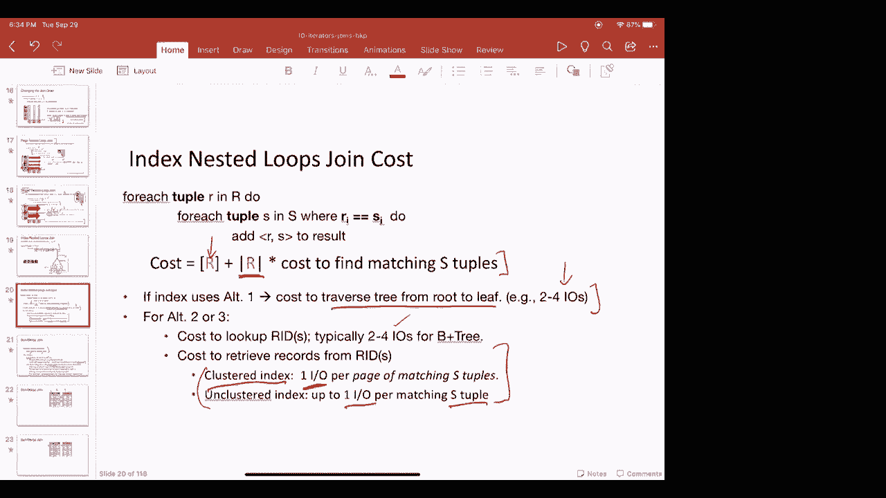

# 数据库系统原理 P10：第10讲 迭代器与连接 I 🧩

在本节课中，我们将要学习数据库查询执行的核心机制——迭代器模型，并探讨几种基础的连接算法。我们将从查询计划的执行方式开始，逐步深入到迭代器接口的设计，最后分析简单嵌套循环连接、块嵌套循环连接、索引嵌套循环连接以及排序合并连接的工作原理和成本。

---

## 查询计划与数据流图

上一节我们介绍了SQL查询的编译过程，本节中我们来看看查询计划的具体形态。一个SQL查询会被编译成一个查询计划，它通常表示为一棵树。

这棵树编码了元组的流动方向。元组从树的底部（叶节点）开始向上流动，最终在根节点生成结果。树中的每个顶点代表一个操作符，底部的叶节点通常是表访问操作符（如扫描或索引查找）。

这种结构也被称为数据流图，因为它清晰地展示了数据的流动路径以及对数据执行的操作。数据流图并非数据库系统独有，在大数据、深度学习等系统中也广泛应用。

数据库系统中的查询执行器组件负责实例化这些操作符并执行查询计划。查询优化器则负责选择最优的查询计划。执行器通过创建操作符的实例来运行查询。

每个操作符实例都称为一个“迭代器”。例如，你可能有一个索引嵌套循环连接迭代器、一个投影迭代器或一个选择迭代器。叶节点可能是索引扫描迭代器，用于访问关系中的元组。

每个操作符实例都需要实现一套标准的迭代器接口方法，这确保了不同操作符之间可以统一地组合在一起，形成一个完整的查询计划。数据流从底部向上流动，最终在根节点产生结果。

---

## 迭代器接口

上一节我们提到了迭代器接口的重要性，本节中我们来看看这个接口具体包含哪些方法。迭代器接口本质上是一个抽象类，它定义了一组所有操作符都必须支持的公共方法。

以下是迭代器接口的核心方法：

*   **`init`**: 此方法用于进行初始化设置。它在开始处理元组之前被调用，通常用于初始化变量、设置状态等准备工作。
*   **`next`**: 此方法负责生成下一个元组。父操作符通过调用子操作符的 `next` 方法来请求新的元组。通过反复调用 `next`，可以遍历操作符产生的所有元组。“迭代器”一词正来源于此。
*   **`close`**: 此方法在操作符没有更多元组可生成时被调用，用于清理状态、关闭文件句柄等收尾工作。

这个迭代器接口基于“拉取”模型。执行从查询计划的根节点开始，根节点调用子节点的 `next` 方法来请求元组，子节点再向它的子节点请求，如此递归，直到从叶节点（存储的关系）拉取到数据。

`next` 方法可以支持两种处理方式：
*   **流式处理**：操作符每接收到一个输入元组就立即处理并可能产生输出（如选择操作）。
*   **阻塞处理**：操作符需要消耗完所有输入元组后才能产生输出（如排序操作）。

迭代器接口的优势在于：
1.  **可组合性**：所有关系操作符都实现为同一接口的子类，因此任何迭代器都可以作为另一个迭代器的输入。
2.  **状态封装**：每个迭代器可以维护大量的私有内部状态（如哈希表、计数器、游标、排序文件），这些状态对其他操作符不可见。

---

## 简单迭代器示例

理解了接口定义后，我们通过几个具体操作符的实现来加深理解。以下是几个基础迭代器的伪代码描述。

### 选择迭代器 (Select / σ)

选择操作符是一个流式操作符，它根据谓词条件过滤输入元组。

**`init` 方法**:
```python
def init(self, predicate, child):
    child.init()          # 初始化子操作符
    self.pred = predicate # 存储过滤条件
    self.current = None   # 当前元组游标
```

**`next` 方法**:
```python
def next(self):
    while self.current != EOF and not self.pred(self.current):
        self.current = self.child.next() # 从子节点获取下一个元组，直到满足条件
    if self.current == EOF:
        return EOF
    result = self.current
    self.current = None # 为下一次调用准备
    return result
```
**说明**：`next` 方法循环从子节点拉取元组，直到找到一个满足谓词 `pred` 的元组或遇到文件结束标志。

**`close` 方法**:
```python
def close(self):
    self.child.close() # 关闭子操作符
```

### 堆文件扫描迭代器 (Heap Scan)

此迭代器作为查询计划的叶节点，负责从堆文件中读取元组。

**`init` 方法**:
```python
def init(self, relation):
    self.heap_file = open(relation.heap_file) # 打开堆文件
    self.current_page = get_first_page(self.heap_file) # 定位第一页
    self.current_slot = get_first_slot(self.current_page) # 定位第一页的第一个槽位
```

**`next` 方法**:
```python
def next(self):
    if self.current_page is None:
        return EOF # 所有页面已读完

    # 1. 准备本次返回的记录ID（当前页面和槽位）
    record_id = (self.current_page, self.current_slot)

    # 2. 为下一次next调用推进指针
    self.current_slot = advance_slot(self.current_page, self.current_slot)
    if self.current_slot is None: # 当前页已无更多槽位
        self.current_page = get_next_page(self.heap_file, self.current_page) # 获取下一页
        if self.current_page is not None:
            self.current_slot = get_first_slot(self.current_page) # 定位新页的第一个槽位

    return record_id # 返回当前记录ID（也可直接返回元组）
```
**说明**：该方法返回当前记录，并同时将内部指针推进到下一个待读取的位置。

**`close` 方法**:
```python
def close(self):
    self.heap_file.close() # 关闭文件句柄
```

---

## 复杂迭代器示例

接下来，我们看看两个更复杂的、可能涉及阻塞操作的操作符。

### 排序迭代器 (Sort)

我们以两趟排序算法为例。排序是一个阻塞操作符。

**`init` 方法**:
```python
def init(self, sort_key, child):
    child.init()
    # —————— 第0趟：生成初始有序归并段 ——————
    self.runs = []
    while (tuple = child.next()) != EOF:
        add_to_current_run(tuple)
        if current_run_is_full():
            sort_and_save_run(current_run) # 排序并写入磁盘
            self.runs.append(new_run_file)
    # —————— 为第1趟合并做准备 ——————
    self.input_buffers = []
    for run_file in self.runs:
        buffer = load_page(run_file) # 为每个归并段加载一个页面到缓冲区
        self.input_buffers.append(buffer)
```
**说明**：初始化阶段完成了所有输入数据的读取、排序并写入磁盘生成有序归并段，然后为合并阶段加载每个归并段的代表页面。

**`next` 方法**:
```python
def next(self):
    if all_buffers_empty(self.input_buffers):
        return EOF
    # 找出所有缓冲区中当前最小的元组
    min_tuple = find_min_tuple_across_buffers(self.input_buffers)
    # 从对应缓冲区移除该元组
    remove_tuple_from_buffer(min_tuple.buffer, min_tuple)
    # 如果该缓冲区变空，则从对应归并段文件加载下一页
    if buffer_is_empty(min_tuple.buffer):
        load_next_page_into_buffer(min_tuple.run_file, min_tuple.buffer)
    return min_tuple
```

**`close` 方法**:
```python
def close(self):
    for run_file in self.runs:
        delete(run_file) # 删除临时归并段文件
    self.child.close()
```


### 分组迭代器 (Group By)

此例假设输入数据已按分组键排序。分组操作符是流式的。


**`init` 方法**:
```python
def init(self, group_keys, aggregates, child):
    child.init()
    self.group_keys = group_keys
    self.aggregates = aggregates # 例如：['SUM', 'COUNT', 'AVG']
    self.current_group = None
    self.agg_states = {} # 为每个聚合函数维护状态，如 {'sum': 0, 'count': 0}
```

**`next` 方法** (核心逻辑):
```python
def next(self):
    result = None
    while result is None:
        next_tuple = self.child.next()
        if next_tuple == EOF:
            if self.current_group is not None:
                # 处理最后一组
                result = compute_aggregates(self.agg_states)
                self.current_group = None
            break

        tuple_group = extract_group_keys(next_tuple, self.group_keys)
        if self.current_group != tuple_group:
            # 遇到新组：输出上一组结果，并初始化新组状态
            if self.current_group is not None:
                result = compute_aggregates(self.agg_states)
            # 开始新组
            self.current_group = tuple_group
            init_aggregate_states(self.agg_states) # 重置聚合状态

        # 将当前元组的值合并到当前组的聚合状态中
        merge_tuple_into_aggregates(next_tuple, self.agg_states, self.aggregates)

    return result
```
**说明**：由于输入已排序，同一组的元组连续出现。迭代器只需在内存中维护当前组的聚合状态，当检测到组别变化时，输出上一组的结果并开始计算新组。这非常高效。

**聚合状态示例**:
*   `COUNT`: 状态为一个整数计数器。
*   `SUM`: 状态为一个累加和。
*   `AVG`: 状态需要同时维护 `SUM` 和 `COUNT`。
*   `MIN`: 状态为当前看到的最小值。

**`close` 方法**:
```python
def close(self):
    self.child.close()
```

---

## 查询计划的执行

综合以上操作符，我们现在可以理解整个查询计划的执行过程。目前我们考虑单线程执行模型。

查询计划从根节点开始执行。在调用 `init` 初始化整个计划后，根节点反复调用自己的 `next` 方法来获取结果。每次 `next` 调用会触发一系列向下传递的 `next` 调用，沿着查询计划树向下到达叶节点，然后将数据向上传递、处理，最终在根节点生成一个输出元组。

一些操作符（如排序）是阻塞的，会在 `init` 或 `next` 中消耗大量甚至所有输入后才产生输出。而另一些操作符（如选择、已排序输入的分组）是流式的。

迭代器框架的巧妙之处在于，元组通过调用栈在操作符之间“流动”，并非总是需要将中间结果物化到磁盘。这使框架本身非常轻量，尽管个别操作符（如排序）可能很重量级。

---

## 连接算法概述

从本节开始，我们将重点转向二元操作符，特别是连接操作。在深入算法之前，先定义一些符号：
*   `[R]`: 存储关系 R 的磁盘页数。
*   `PR`: 关系 R 中每页存储的记录数。
*   `|R|`: 关系 R 的基数（总记录数），`|R| = [R] * PR`。

**示例关系**:
*   Reserves (R): `[R] = 1000` 页, `PR = 100` 记录/页, `|R| = 100,000` 记录。
*   Sailors (S): `[S] = 500` 页, `PS = 80` 记录/页, `|S| = 40,000` 记录。

在分析算法成本时，我们通常忽略**写出结果**的I/O成本，因为它对所有算法是常数，且结果可能直接被父操作符消费而无需写盘。我们主要关注**读取数据**的I/O成本。

---

## 简单嵌套循环连接

这是最基础的连接算法，适用于任意连接条件（θ连接）。

**算法描述**:
```
for each tuple r in R:
    for each tuple s in S:
        if condition_θ(r, s) is true:
            add (r, s) to output buffer
```
**成本分析**:
*   扫描一次 R: 成本 = `[R]`。
*   对于 R 中的**每个元组**，扫描一次 S: 成本 = `|R| * [S]`。
*   总成本 = `[R] + |R| * [S]`。

代入示例：`1000 + 100,000 * 500 = 50,001,000` 次 I/O。

**连接顺序的重要性**：如果交换 R 和 S 的角色（以 S 为外循环），成本变为 `[S] + |S| * [R] = 500 + 40,000 * 1000 = 40,000,500` 次 I/O。可见，选择较小的关系作为外循环可以显著降低成本。

简单嵌套循环连接的 I/O 效率很低，因为它以元组为单位进行循环。

---

## 块嵌套循环连接

磁盘I/O的基本单位是页面，因此改进思路是以页面为单位进行循环。

**算法描述**:
假设有 B 个内存缓冲区页。分配 1 页给 S（内关系），1 页给输出，剩下的 B-2 页给 R（外关系）。
```
for each chunk of (B-2) pages of R:
    load the chunk into memory
    for each page of S:
        load the page into memory
        for each tuple r in the R chunk:
            for each tuple s in the current S page:
                if condition_θ(r, s) is true:
                    add (r, s) to output buffer
```
**成本分析**:
*   扫描一次 R: 成本 = `[R]`。
*   对于每 (B-2) 页的 R 块，扫描一次 S: 需要扫描 S 的次数 = `ceil( [R] / (B-2) )`。
*   总成本 = `[R] + ceil( [R] / (B-2) ) * [S]`。

代入示例，假设 B=102：`1000 + ceil(1000/100) * 500 = 1000 + 10 * 500 = 6,000` 次 I/O。相比简单嵌套循环，性能提升了数个数量级。

块嵌套循环连接是处理**非等值连接**时常用的可靠算法。

---

## 索引嵌套循环连接

当连接条件是等值连接（如 `R.id = S.id`）且内关系 S 在连接属性上有索引时，可以使用此算法。

**算法描述**:
```
for each tuple r in R:
    use index on S to find all tuples s where s.id = r.id
    for each matching tuple s:
        add (r, s) to output buffer
```
**成本分析**:
成本 = 扫描 R 的成本 + 对每个 R 元组进行索引查找的成本。
*   扫描 R: `[R]`。
*   索引查找成本: 对于每个 R 元组，成本包括：
    1.  遍历索引（B+树）到叶节点的成本（通常 2-4 次 I/O）。
    2.  根据索引指针（记录ID）获取实际数据页的成本。这取决于索引类型：
        *   **聚簇索引**：同一键值的元组物理上相邻，I/O 成本较低。
        *   **非聚簇索引**：可能需要为每个匹配的元组执行一次 I/O，如果匹配元组很多，成本会很高。

总成本约为：`[R] + |R| * (索引遍历成本 + 取数据成本)`。

索引嵌套循环连接在匹配元组较少时非常高效，但当内关系匹配元组很多且索引非聚簇时，性能可能下降。

---

## 排序合并连接

该算法适用于等值连接。它首先对两个输入关系按连接键进行排序，然后像合并两个有序列表一样进行连接。

**算法核心挑战**：一个 R 元组可能匹配多个 S 元组，反之亦然。因此，合并过程比简单的归并排序更复杂，需要能够“回溯”。

**算法直觉**：
1.  **排序阶段**：分别对 R 和 S 按连接键排序。如果输入已有序（例如来自上游排序操作或索引扫描），则可跳过此阶段。
2.  **合并阶段**：
    *   用两个指针分别指向 R 和 S 的当前元组。
    *   比较两个指针所指元组的连接键。
    *   如果 `R.key < S.key`，则推进 R 的指针。
    *   如果 `R.key > S.key`，则推进 S 的指针。
    *   如果 `R.key == S.key`，则找到了一个匹配的“块”。此时需要：
        a.  **标记** S 指针的当前位置（作为该匹配块的起点）。
        b.  输出 R 当前元组与 S 当前元组的连接结果。
        c.  推进 S 指针，继续输出 R 当前元组与 S 后续相同键值元组的连接结果。
        d.  当 S 指针越过该键值块后，将 S 指针**重置**回之前标记的起点。
        e.  推进 R 指针到下一个元组，重复比较过程。


**标记的作用**：当 R 中连续多个元组具有相同键值（如 `R1.key=5`, `R2.key=5`）时，对于 `R1`，我们遍历了 S 中所有键值为 5 的元组。当处理 `R2` 时，我们需要再次与 S 中所有键值为 5 的元组连接。标记让我们能快速将 S 指针重置到该键值块的起始位置，避免重新扫描 S。

排序合并连接在数据已排序或连接选择性较高时非常高效。其成本主要来自排序阶段（如果需要）和后续的线性扫描。



---

## 总结

本节课中我们一起学习了数据库查询执行的基石——迭代器模型，以及几种基础的连接算法。


1.  **迭代器模型**：我们了解了查询计划如何通过实现了 `init`, `next`, `close` 方法的迭代器来执行。这种基于拉取的模型提供了良好的操作符封装性和组合性。
2.  **简单嵌套循环连接**：