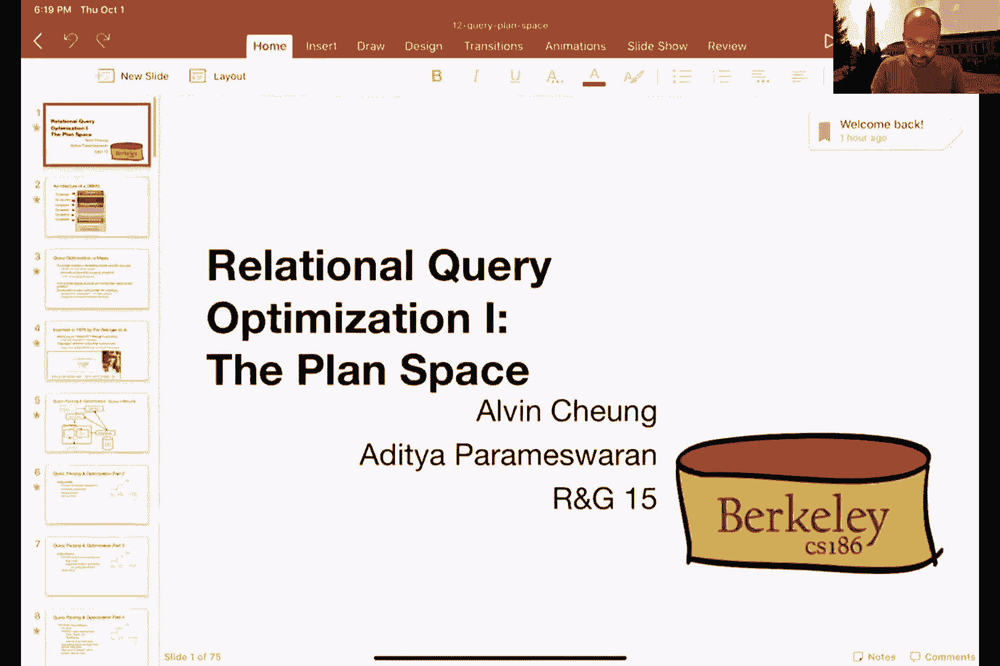

# 课程 P11：迭代器与连接 II 🧩

在本节课中，我们将深入学习排序合并连接的成本分析，并探讨另一种强大的连接实现方式——哈希连接。我们还将简要介绍查询优化的基本概念，了解数据库系统如何选择最高效的执行计划。

---

## 排序合并连接的成本分析 💰

上一节我们介绍了排序合并连接的基本算法。本节中，我们来看看如何计算其执行成本。

排序合并连接的成本主要对应于对两个关系 `R` 和 `S` 进行排序，然后按顺序读取它们以进行合并。我们通常不计算最终输出的写入成本。


以下是成本计算的核心部分：
*   对关系 `R` 排序的成本：`4 * |R|`（两次读 + 两次写）
*   对关系 `S` 排序的成本：`4 * |S|`
*   合并连接阶段的成本：`|R| + |S|`（读取已排序的 `R` 和 `S`）

因此，排序合并连接的总成本公式为：
```
总成本 = 5 * |R| + 5 * |S|
```
其中 `|R|` 和 `|S|` 分别代表关系 `R` 和 `S` 所占的页数。

最坏情况下，当连接键完全匹配（产生笛卡尔积）时，成本可能接近 `|R| * |S|`。但在实践中，这种情况很少见，通常成本是线性增长的。

关于缓冲区大小，为了能在两趟内完成排序，我们需要缓冲区页数 `B` 大于 `sqrt(|R|)` 和 `sqrt(|S|)`。

---

## 排序合并连接的优化 ✨

我们可以进一步优化排序合并连接，将排序的最后一次合并趟与连接趟结合起来。

这种优化需要满足一个条件：我们有足够的内存缓冲区来容纳 `R` 和 `S` 的所有排序归并段（run）的代表页。这样，在最后一次合并排序的过程中，我们就可以同时进行连接操作。

优化后的成本变为：
```
优化后总成本 = 3 * (|R| + |S|)
```
这比标准的 `5 * (|R| + |S|)` 更为廉价。

---

## 哈希连接介绍 🔑

除了排序，哈希是另一种实现等值连接（如自然连接）的高效方法。哈希连接的目标与排序合并连接类似：将所有应该匹配的元组同时汇集到内存中。

一个简单的哈希连接算法要求较小的关系（假设为 `R`）能完全放入内存。其步骤如下：
1.  将整个关系 `R` 读入内存，并基于连接属性构建内存哈希表。
2.  逐页扫描关系 `S`，对于 `S` 中的每个元组，用相同的哈希函数计算其哈希值，并到内存哈希表中查找匹配的 `R` 元组。
3.  如果找到匹配，则组合元组并输出。

该算法的内存要求是：关系 `R` 的大小必须小于 `B - 2` 页（`B` 为可用缓冲区页数），并考虑哈希表的填充因子。

---

## Grace 哈希连接算法 🚀

当关系 `R` 太大而无法放入内存时，我们可以使用 Grace 哈希连接算法。该算法分为两个阶段：

**第一阶段：分区**
*   使用一个哈希函数 `h_p`，分别将关系 `R` 和 `S` 的元组散列到 `B-1` 个不同的磁盘分区中。
*   具有相同哈希值的元组会被写入相同的分区。

**第二阶段：连接（构建与探测）**
*   对于每一对对应的分区（如 `R_i` 和 `S_i`）：
    *   将分区 `R_i` 读入内存，并使用另一个哈希函数 `h_r` 构建内存哈希表。
    *   然后逐页读取分区 `S_i`，对于 `S_i` 中的每个元组，在内存哈希表中探测匹配的 `R` 元组并输出结果。

该算法的成本主要来自分区阶段和连接阶段的磁盘 I/O：
```
总成本 ≈ 3 * (|R| + |S|)
```
其核心要求是：每个分区 `R_i` 的大小必须能放入内存，即 `|R| / (B-1) < B-2`，推导可得 `|R| < B^2`。对于关系 `S` 的大小则没有限制。

---

## 连接算法对比与总结 📊

至此，我们一起学习了多种连接算法：

*   **嵌套循环连接**：通用但效率低，适用于任意连接谓词。
*   **块嵌套循环连接**：通过分块利用内存，减少 I/O。
*   **索引嵌套循环连接**：在存在索引时能高效查找匹配元组。
*   **排序合并连接**：适用于数据已排序或需要有序输出的场景，对数据偏斜不敏感。
*   **（朴素）哈希连接**：当较小关系能完全放入内存时非常高效。
*   **Grace 哈希连接**：可处理更大的关系，但需要多趟处理。




没有一种算法在所有情况下都是最优的。选择哪种算法取决于数据大小、是否已排序/散列、内存大小、是否存在索引以及数据分布等多种因素。这正是数据库**查询优化器**需要解决的复杂问题。

---

## 查询优化初探 🧠

最后，我们简要了解了查询处理的高层流程，为下一部分内容做铺垫。

当用户提交一个 SQL 查询后，数据库系统会依次进行以下处理：
1.  **查询解析**：检查语法和权限，生成内部表示（如解析树）。
2.  **查询重写**：将查询转换为更规范、更高效的形式（如视图展开、子查询转换）。
3.  **查询优化**（核心）：这是“魔法”发生的地方。优化器考虑所有可能的等价执行计划（查询计划），利用目录管理器中的统计信息估算每个计划的成本，并选择成本最低的一个。
4.  **查询执行**：由查询执行器实例化优化器选定的计划，通过迭代器模型驱动数据流动，最终产生结果。


本节课中，我们深入分析了排序合并连接与哈希连接的原理与成本，并建立了对查询优化基本流程的认识。理解这些底层运算符的实现，是理解上层查询优化如何工作的基础。