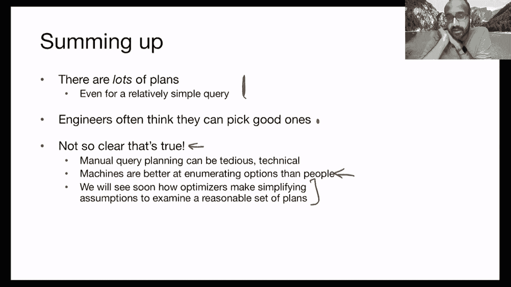
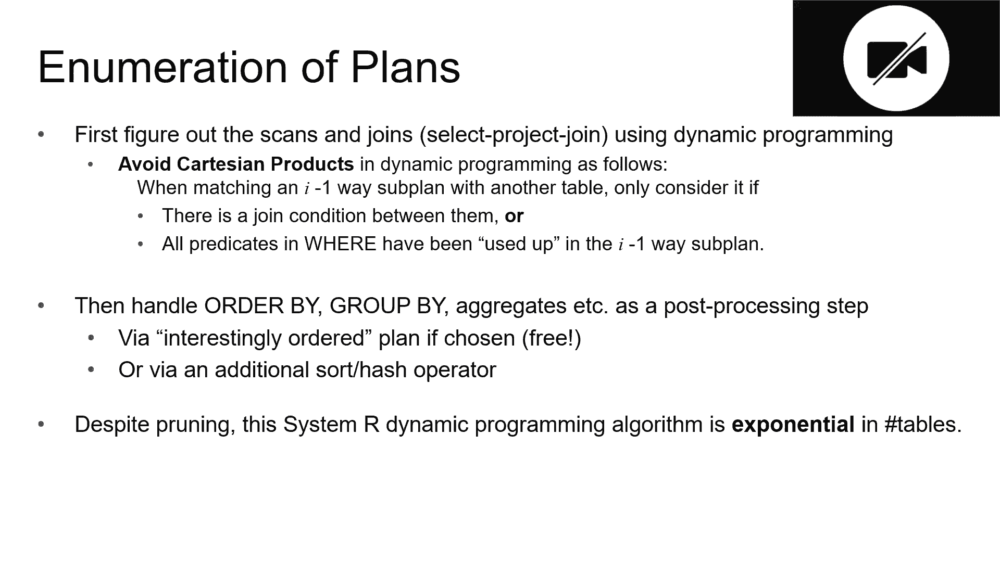

# 课程13：查询优化成本与搜索 🧠

在本节课中，我们将学习查询优化的核心部分：如何估算不同查询计划的成本，以及如何在庞大的计划搜索空间中找到最优（或接近最优）的计划。我们将从回顾一个具体的查询计划及其成本计算开始，然后探讨如何使用索引来进一步降低成本。最后，我们将深入探讨查询优化器的工作原理，包括成本估算的多种方法和用于高效搜索的动态规划算法。

---

## 回顾查询计划与成本

上一节我们介绍了多种查询计划及其实现技巧。本节中，我们来看看一个结合了块嵌套循环、物化和谓词下推的优化计划，并计算其成本。

我们使用的查询涉及 `Reserves` 和 `Sailors` 两个关系。我们目前的最佳计划是：按 `Reserves`、`Sailors` 的顺序，应用选择谓词和投影，然后进行块嵌套循环连接，最后投影到 `S.name`。

以下是该计划的成本计算过程：
*   我们假设有5个缓冲区。
*   `Reserves` 关系有1000页。应用选择谓词 `b=100` 后，我们得到10页数据（假设有100艘船，每页100个元组）。
*   投影操作后，每个元组仅剩ID属性（4字节），因此这10页数据被压缩为1页。
*   对于块嵌套循环，我们以这1页为一块，扫描整个 `Sailors` 关系（500页）。成本为 `1 * 500 = 500` I/O。
*   总成本为扫描 `Reserves` 的 `1000` I/O 加上块连接的 `500` I/O，即 **1500 I/O**。

如果不使用索引，这几乎是最优计划，因为它必须访问两个关系的每一页（1000 + 500 = 1500）。

---

## 使用索引降低成本 🚀

上一节我们看到，仅扫描两个关系就有1500的成本。本节中，我们来看看如何通过使用索引来显著降低这个成本。

我们假设在 `Reserves.bid` 上有一个聚集索引，在 `Sailors.sid` 上有一个非聚集索引。

以下是使用索引嵌套循环连接的成本计算：
*   使用 `Reserves.bid` 上的聚集索引直接找到 `b=100` 的元组。由于是聚集索引，这些元组连续存储在10页中。访问成本为 **10 I/O**。
*   对于找到的每一个 `Reserves` 元组（共1000个），使用 `Sailors.sid` 上的非聚集索引查找匹配的 `Sailors` 元组。每次查找的成本约为 **1 I/O**。
*   总成本为 `10 + 1000 * 1 = 1010 I/O`。

通过使用索引，我们将成本从1500降低到了1010。这展示了索引在查询优化中的强大作用。

---

## 查询优化器概述 🤖

手动枚举和比较所有可能的查询计划是非常繁琐且容易出错的，尤其是当数据变化时。因此，数据库系统使用查询优化器来自动完成这项工作。

一个查询优化器通常需要以下组件：
1.  **计划空间**：生成所有可能的查询计划（关系代数树及其物理实现）。
2.  **成本估算**：估算每个计划的执行成本。
3.  **搜索算法**：在庞大的计划空间中高效地找到成本最低的计划。

我们将重点介绍经典的 System R 优化器方法，它做出了许多简化但有效的假设。

---

## 成本估算基础 📊

为了比较不同计划的成本，我们需要估算每个操作符的输入、输出大小以及相应的I/O和CPU成本。我们已经了解I/O成本，现在重点是如何估算中间结果的大小。

估算依赖于数据库目录中维护的统计信息，例如每个表的页数、元组数、列的不同值数量等。

一个核心概念是**选择性**，它衡量一个谓词过滤掉多少数据。选择性定义为输出大小与输入大小的比值，范围在0到1之间。

> **注意**：在数据库术语中，“高选择性”意味着比值接近1（即大部分数据通过），这与日常用语中的“选择性高”（指筛选严格）含义相反。

对于包含多个谓词的查询，我们通常假设各谓词之间是独立的，从而使用选择性相乘来估算整体选择性。

---

### 选择性估算公式

以下是几种常见谓词的选择性估算公式：

1.  **等值谓词（`column = value`）**：
    *   假设数据均匀分布且无重复，选择性为 `1 / NUM_KEYS(column)`。
    *   **公式**：`sel = 1 / N_keys`

2.  **等值连接谓词（`column1 = column2`）**：
    *   选择性为 `1 / MAX(N_keys(column1), N_keys(column2))`。
    *   **公式**：`sel = 1 / MAX(N_keys1, N_keys2)`

3.  **范围谓词（`column > value`）**：
    *   假设数据在最小值（`low`）和最大值（`high`）之间均匀分布。
    *   选择性为 `(high - value) / (high - low + 1)`。
    *   **公式**：`sel = (high - value) / (high - low + 1)`

对于更复杂的谓词（如 `AND`, `OR`），在独立性假设下：
*   **AND**：`sel = sel(p1) * sel(p2)`
*   **OR**：`sel = sel(p1) + sel(p2) - sel(p1) * sel(p2)`

---

### 使用直方图估算

当拥有直方图统计信息时，我们可以获得更精确的估算。例如，对于谓词 `age < 26`：
1.  找到 `age` 直方图中包含26的桶（例如桶范围为25-30）。
2.  假设桶内值均匀分布，估算命中该桶的比例为 `(26 - 25) / (30 - 25) = 0.2`。
3.  该桶中的元组数占总数的比例乘以0.2，即为该桶的贡献。
4.  将所有相关桶的贡献相加，得到总选择性。

对于连接谓词 `column1 = column2`，可以通过遍历两个直方图的桶，对匹配的值域计算选择性并求和。

---

## 搜索算法：动态规划 🔍

枚举所有计划（可能多达数百万个）是不可行的。System R 优化器采用动态规划算法，并应用启发式规则来缩减搜索空间。

主要启发式规则包括：
*   **只考虑左深连接树**：连接树的右孩子总是基表。这有利于流水线执行。
*   **避免笛卡尔积**：除非必要，否则不考虑产生笛卡尔积的计划。
*   **分块优化**：将嵌套查询分解为独立的块进行优化。

---

### 动态规划算法步骤

该算法基于“最优子结构”假设：整体最优计划由子集的最优计划组成。

1.  **第一趟**：为每个基表（单个关系）找到最佳访问路径（全表扫描、索引扫描等），并记录其成本和可能的有趣属性（如结果已排序）。
2.  **第二趟**：考虑所有连接两个关系的方式。对于每一对关系，枚举所有连接方法（嵌套循环、哈希连接、排序合并连接等），并利用第一趟的结果计算成本。只保留每个关系子集的最佳计划（可能按不同有趣属性保留多个）。
3.  **后续趟**：类似地，基于已找到的较小子集的最佳计划，构建更大子集（连接更多关系）的最佳计划。
4.  **最终**：找到连接所有关系的最佳计划后，再考虑添加分组、聚合等操作。

通过只保留每个子集的最佳计划，动态规划极大地减少了需要存储和比较的计划数量。

---

### 算法的局限性

动态规划的“最优子结构”假设并非总是成立。例如，连接A和B的最佳方式，可能在连接A、B、C时并不是全局最优的，因为它可能没有产生对后续连接有利的排序属性。为此，算法需要为每个子集保留具有不同有趣属性（如已排序）的最佳计划，但这会增加存储开销。

---

## 总结 🎯

本节课中我们一起学习了查询优化的关键步骤：
1.  **成本估算**：我们学习了如何通过选择性（使用公式或直方图）来估算查询中间结果的大小，并结合I/O模型计算计划成本。
2.  **索引的作用**：我们看到合理使用索引可以大幅降低查询成本。
3.  **搜索策略**：面对庞大的计划空间，我们介绍了System R优化器如何通过启发式规则（如左深树）和动态规划算法，高效地寻找近似最优的查询计划。

理解这些原理有助于我们设计更高效的查询，并理解数据库优化器背后的工作机制。