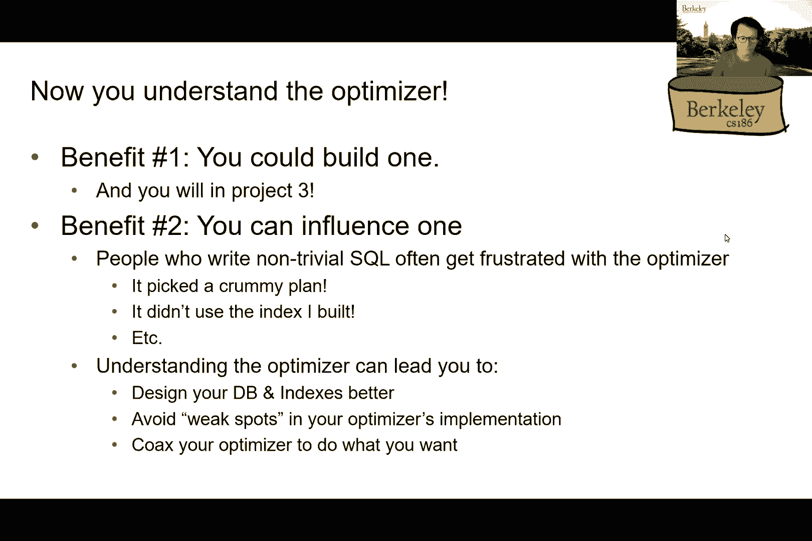
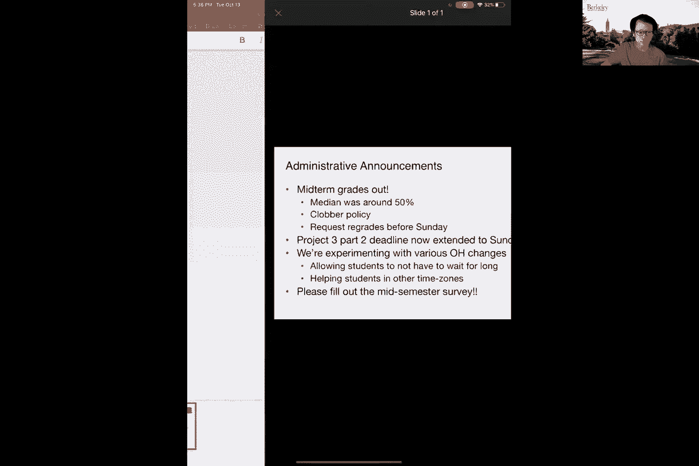
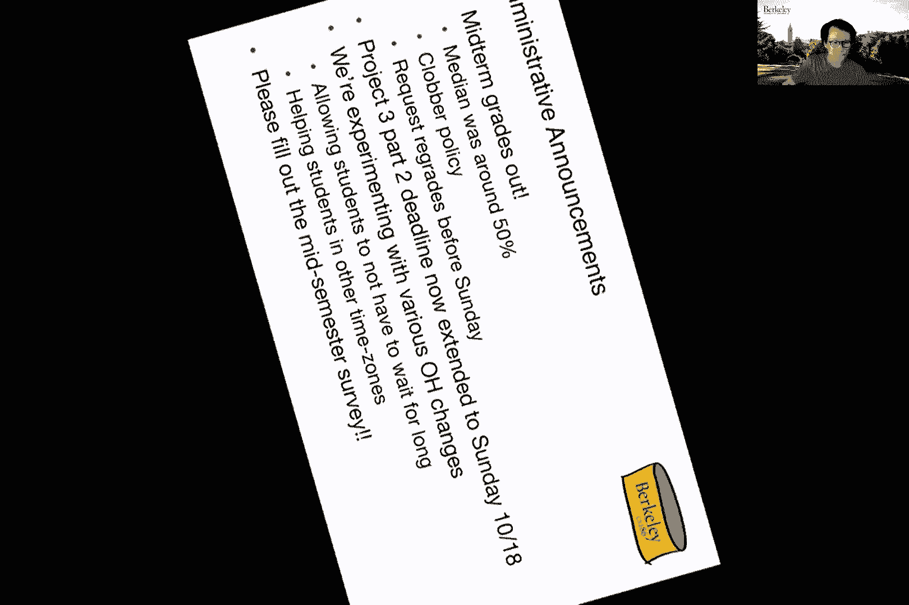
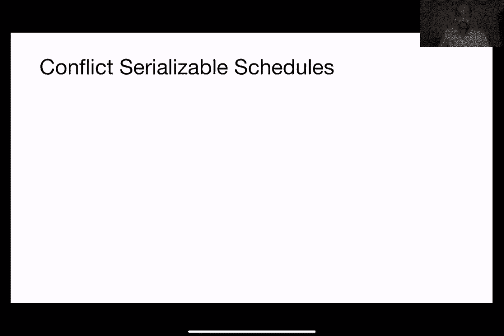

# P14：第14讲 事务与并发 I - ___main___ - BV1cL411t7Fz

好的，我正在录制到云端。

哦，我抱歉。好的，大家好，欢迎来到周二的讲座。希望你们的期中考试都已经结束，应该都在恢复中或者已经恢复了。稍后我们会在讲座中说几句关于期中的话题。那么今天呢……

计划是基本完成我们上周讨论的创建优化部分。然后我们会继续深入讨论事务这一激动人心的话题。所以我会先展示一些上周的幻灯片，如果有问题随时打断我。所以再说一次。

我们的目标基本上是给出一个查询，找出最佳的退出方式。最佳方式可以是从时间、IO、内存等多个角度来考虑。有很多不同的标准。但对于这门课，我们现在只考虑时间和IO作为最重要的因素。好的。

这里是一个清晰优化器的简单实现。我们将列举出所有的可能性，然后估算每个我们列举出来的方案的成本。然后选择那个成本最低的，无论“成本”指的是什么。正如你们看到的，我们已经面临了很多问题，对吧？当然。

最有趣或者最难的部分是我们有太多的职业计划。如果我们不想让Kat出现，对吧？那么我们如何处理这个问题呢？我们需要一种更好的方法，从所有可能的计划中选择不同的计划。还需要一种更智能的方式，来在这些计划空间中进行导航，而不需要列举出每一个具体的计划。

这就是为什么我们开始讨论选择活动，正如你可能记得上周所讲的。这里的目标是能够在中间表的大小范围内进行查询。为什么我们要根据中间表的大小来查询呢？嗯，我们之所以这样做，是因为我们需要计算每个职业操作符的成本。

正如我们所回忆的，它现在由两个不同的部分组成，对吧？

第一个部分是关于与将数据带入主内存相关的IO操作。到现在为止，你们应该已经是这方面的专家了，对吧？因为我们已经在期中考试前讲解过这部分内容。你们也有过相关问题，记得吗？所以那是第一部分。

第二个更有趣的部分是关于这个术语，对吧？

这基本上是我们之前忽略的部分，对吧？之前我们说过，对于这门课程，你们可以完全忽略处理任何元组时的实际CPU成本。在那个时候，我们只需要关心将这些元组加载到主内存的成本。至于其他的，可以暂时不管。好吧。

你们现在已经成长了，经历了第一次期中考试，对吧？

现在我们可以变得更复杂一些。我们将讨论的是，嗯，你不能完全忽视CPU。所以我们基本上会估算出在将所有数据加载到主内存之后，需要处理的元组数量，并乘以一个CPU因子。这个CPU因子基本上是一个修正因子，对吧？关于需要多少。

到目前为止，我们已经讨论了处理每个元组所需的时间，特别是它们被加载到内存后需要多长时间。到这里为止，理解吗？好的，希望这些内容都是复习，对吧？好的，太好了。但现在问题来了。我们只知道基本关系的大小，因为它们存储在磁盘上，我们可以依靠目录来告诉我们它们的大小。但我们不知道在执行每个查询时产生的中间结果的大小。

抱歉，每个查询树中的操作符。因此，现在我们需要估算中间结果的大小，以便将其代入这些公式之一。所以在这门课上，我们将假设中间表的输出大小是输入大小乘以某个选择性因子。这就是为什么我们开始讨论选择性的原因。如你所记得。

选择性基本上是一个介于零和一之间的数字。最坏的情况，输出和输入的大小完全一样。最好的情况，所有数据都被过滤或丢弃，所以我们最终什么都得不到。这是好的，对吧？当然，在执行时，可能不符合你想要的答案。哦。

这个公式适用于连接操作吗？是的，适用。那么，在连接的情况下，输入大小基本上是两个输入表的乘积。然后，选择性。在这种情况下，它只是连接谓词或多个谓词的选择性。如果涉及多个谓词。如你所记得。

我们讨论了多种估计选择性的方法。比如所谓的原始系统，或者我们自己的方法，如你所记得的那样，包含了许多不同的公式。对吧？例如在谓词的形式是某列等于某个数字或某个值时。

我们将通过每列的唯一值数量的倒数来估算活动量。如果我们在做集合操作，这基本上可以转化为概率，即从输入表中随机选择一个元组匹配特定谓词的概率。

所以，我想提醒一下，谓词在这种情况下可能是像“h等于21”的形式。那么，我们实际上命中“h等于21”的概率是多少呢？如果表中有100个不同的年龄，那么概率就是1除以100。

所以这就是系统艺术是如何做的。在某些情况下，比如你知道的，谓词必须是像某列等于另一列的形式，举个例子，可能是“水手ID等于评分”，那么他们使用的公式就是1除以最大数量。

这两列中的唯一值。我们上周在课堂上解释了这些是如何产生的。对吧，所以如果你感到困惑，我鼓励你重新回顾一下这个内容。最后，谓词的形式大致是像列大于或小于某个数值的形式，那么它将是我们所覆盖的范围除以整个范围，再加一作为分母。

对，因为我们希望包括两个“nappa”的情况。实际上，这里有个错别字，应该是将加一放在分母中，而不是后面。好的，我们还讨论了直方图方法，类似地，我们也讲解了类似的公式。所以在使用直方图的情况下。

估算像“列等于某个值”这种选择性的方式，就是查看包含我们感兴趣的值的柱状图的高度。比如说，年龄等于21岁，那么我们就看包含21岁年龄的柱子。然后将其除以实际包含在该柱子中的值的数量。

所以，如果桶里包含10个不同的年龄，那么我们就将该数字除以10，这里的数字是柱子的高度。然后如果每个桶里只有5个不同的年龄，我们就将其除以5。正如你回想的那样，这基本上是我们在这里做的所谓“均匀性假设”。

所以，正如你回想的那样，这基本上意味着我们假设同一个桶中的所有值是等概率的。所以，如果桶中有10个不同的值，那么我们就将其除以10。如果有21个值，我们就除以21。那么接下来，对吧，第一列等于第二列。我们基本上将其分解成若干个析取式，或者说“或”对吧。

一堆不同的“或”操作，然后我们会检查所有不同的可能性。我们会说，如果第一列等于某个特定值，且第二列等于相同的值，然后一直进行下去，直到我们测试完所有值。然后总体活动就会像你知道的那样，应用这里的这个公式。

我们将遍历两个列可能匹配的所有可能值。然后，最后对于大于某个特定值的情况，我们基本上会将符合此标准的所有条形的高度相加，并除以表中总行数。

所以如果你不记得我们是如何推导这些公式的，你可以直接看一个直方图，然后说服自己这确实是正确的。对吧？你可能会问，哪一种更准确？好吧，在很多情况下，直方图方法会更准确。

因为我们基本上是在保持每个范围的单独值的桶，而不是仅仅假设一切都是均匀分布的。要理解这一点，只需看一下这里的第一个公式，右侧的列等于一个特定的值。在系统的情况下，我们将广泛假设一切都是均匀分布的。

因此，它只是表中项数的倒数，而如果我们有一个直方图，我们实际上可以通过查看对应于目标值的条形图来稍微提高准确性。

这对大家有意义吗？但你显然也可以批评直方图方法，认为可能有更准确的方法。因为例如，均匀假设其实只是一个假设，没有什么表明在一个包含10个不同年龄的桶中，所有值都是均匀分布的。

一切必须是均匀分布的。你肯定可以找到这样的一些例子。正如我们上周讨论的，这确实是一个正在进行中的活跃研究领域。而且，为了设置平台部分，请参加相关部分，我们将基本展示如何处理那些列实际上包含浮动点的情况。到目前为止，我们在讲座中使用的所有示例都假设我们的列包含整数值。

如果你想了解我们在处理浮动点数时会发生什么，请去查看该部分。但这些并不是唯一的谓词形式，对吧？我的意思是，这些是基本的形式，因此在我们了解了基本形式之后，我们现在可以推导出更复杂的形式，通过找出它们的活动。

所以，你知道，联结形式或者内容需要谓词的形式，对吧？所以如果我们有像P1和P2这样的形式，那么我们就可以认为选择性将只是单个谓词的选择性。

在析取（or）或析取（or）情况下，我们则认为它是两个数值的加法，减去它们的乘积。正如你在概率课中学到的那样，最后一项如果两个事件完全不重叠时基本上为零。

比如说，如果我们查询年龄大于60岁，或者说年龄小于21岁，那么这两者发生的机会是零，因此第二项也是零。所以我们就将两者的选择性加在一起。最后，如果说我提到“非P1”这种情况，那么选择性就是1减去正向选择性。

所有这一切基本上源自所谓的独立假设。我们假设这些谓词是完全独立发生的。所以并不是说你可以通过看某人的住址来预测他们的优雅程度，显然这并不总是成立。虽然如此，为了本课程的目的，也为了让我们的生活更轻松理智，我们还是假设这些条件，简化问题。

目前为止有任何问题吗？是的，关于选择性的问题，我想说的就是这些。现在我们理解了选择性，你基本上可以回到前一页的公式，来推算中间表的大小。

然后，计算查询树中每个查询操作符的个别成本。到目前为止都还不错，但是现在我们仍然面临一个问题：如何选择计划，并快速找出最低成本的计划？因为我们无法枚举每一个可能的计划，计算它们的成本，再看看哪个最便宜。

所以，这就是我们提到的最优性原则，也就是动态规划。正如凯特上周在聊天中说的那样，这与编程并没有太大关系，我鼓励你查找这个概念的真实含义，或者它的名字是怎么来的。

如果你感兴趣的话。对于我们的目的来说，目标基本上是理解我们在这里做了一个重要假设，即最优职业规划（成本最低的规划）由子查询的最低成本构成。换句话说，最好将三张表（A、B、C）连接的方式，就是先选择连接A和B的最佳方案，再接着连接C。

或者，先选择连接A和C的最佳方案，再连接B，以此类推。如果你需要一个现实生活中的类比，可以想象交通情况。假设你想从伯克利开车去圣荷西。最好的或最快的方式不一定是从伯克利到弗里蒙特的最佳路线。

对吧，或者最快的方式是什么？它可能是的，也不一定是，或许你实际上需要走一条更长的路去弗里蒙特，然后再去像80号公路这样，或者说不需要走到南方。基本上这意味着，去圣何塞的最佳或最快路线并不等同于从某个中途地点出发的最佳路线。

但再次强调，这里做某些事情是正确的，意思是没有证据证明在查询增加的情况下这绝对不成立，就像在交通情况中一样。但是对于我们的目的来说，这将大大减少枚举和规划枚举的成本。

这基本上就是我们在这里尝试实现的目标。它在系统中如何工作呢？如我所说，我们基本上假设最佳计划由最佳子计划组成。因此，我们应用这个原则的方式是首先尝试找出最佳的高度计划。换句话说，基础表。访问它们的最佳方式是什么？我们是否使用了索引？

我们是使用全表扫描还是在做其他的操作？然后，在弄清楚这些之后，接下来我们要做的就是找出最佳的高度计划，它由基础表和其他内容组成。接着我们可能会有联接操作，或者像选择操作符等，等等，如果没有联接的话。然后我们基本上会以这种方式构建查询计划树。

假设我们迄今为止找到的最佳计划由最佳子操作符的计划组成。那么我们在周四讲座中展示的插图几乎是这样的。所以我们需要一种方式来跟踪所有找到的最佳计划的表格。我们基本上会通过使用一个临时表来跟踪它们。

所以这里基本上我展示了两种将两种不同关系结合的方法。在这种情况下是联接。所以在我们的最佳方法中，迄今为止我们发现的最佳方法是使用哈希联接，例如在一定成本下。然后连接这些表格，可能我们实际上想使用合并联接。例如，假设我们只是跟踪这个表格，如果涉及更多不同的关系，我们只需向这个临时表格中添加更多条目，记录下最好的一个。

我们周四也讨论了一个问题，就是做这些联接时可能作为副作用产生的属性会怎样。而我们现在已经知道的一件事是，关于联接的这些高级方法的实现就是排序问题。

所以你会记得，这些连接操作实际上会生成一些副作用，作为副产品。它们实际上会将两个表的结果进行排序，因此我们可能在后续过程中利用这一点。假设在查询中涉及到一个排序按钮。但是，我们会遇到一个困境，因为在之前的草稿查询中，使用的那个草稿表格存储了我们目前为止找到的所有查询计划。

我们实际上并没有记录所有这些有趣的属性。那么，这里的解决方案是什么？好吧，我的意思是直接增大表格。所以我们现在可以再添加一列，对吧？现在你会注意到这里有两列，第一列对应的是涉及的表。

然后第二列对应的是任何所谓的有趣属性或由于执行计划而生成的有趣排序。所以你会注意到，如果我们在`r`和`s`之间运行一个排序合并连接操作，那么作为副产品，`r.a`和`s.b`将会被排序。

也许是因为在这种情况下，连接操作涉及到这两个属性。那么，这里有一些权衡对吧？因为现在我们添加了第二列，所以我们现在在使用这个动态规划算法时会产生更高的成本。

你知道的，我们可以跟踪其他类型的有趣排序，不仅仅是排序。这样做基本上会引入另一个列，这意味着我们实际上在增大这个草稿表的大小。对吧？所以这是权衡。我们不一定非得像你知道的那样，去跟踪排序，但这样一来我们可能就会失去找到一个可以为我们做排序的计划的机会。

对，因为在这种情况下，例如，如果我忽略了排序，那么我就会去掉这里的第二行。对吧？因为第一行在进行连接时的成本比第二行低。所以如果我们后来在查询中遇到一个`order by`，我们就会陷入困境，因为我们唯一能做的就是显式地对输出关系进行排序。

与使用副产品相比，你知道的，正如你所知道的，我之前已经提到过了对吧？这是又一个例子，说明了什么原则？没有免费的午餐。是的，没错，确实没有免费的午餐，不幸的是。所以这绝对是一个权衡。这里的最坏情况是什么？

这里的最坏情况是我们没有丢弃任何计划，我们只是跟踪我们枚举的每一个计划。所以最终我们就得到了之前所说的穷举枚举算法，我们没有使用任何动态规划。所以这是最终的权衡。你会尝试安慰自己。我就拿出一张可爱的彩虹玉米图片给你享受，同时我回答她的问题。是的。

所以我只是想知道，只有在存在`group by`或`order by`时我们才考虑有趣的顺序，还是我们在其他情况下也会考虑有趣的顺序？是的，像你知道的，你当然也可以考虑其他类型的有趣顺序，对吧？所以它不仅限于排序。

所以这实际上就是使用它，因为它是非常明确的，并且与任何类型的排序都相关，如果你的查询中有`order by`，那么这绝对会非常有用。另一个你可能会考虑的有趣属性是，数据是否被哈希处理。

所以这也是哈希连接的副产品。我们为什么需要它呢？也许最终有某个唯一的东西。如果查询的结尾有一个唯一的条件，那么我们基本上就需要做去重操作。如果我们已经拥有了所有的数据，那么这就非常容易了。

是的，这也是你可能需要跟踪的另一件事。还有其他问题吗？好的，那么让我们通过一个明确的示例来阐明这个观点，这里是一个涉及我们现在著名的水手、预备队员和图书表的查询。所以我将展示几种实际访问基本表的方法。所以我们有B树索引。我们也可以通过读取所有内容来访问数据。

所以在动态规划算法的第一次遍历中，正如我所说，我们将尝试找出访问这些基本关系的最佳方式。好的，那么对于水手和预备队员，我们可以做文件扫描，也可以使用这些B树之一，对吧？所以在这一点上其实挺无聊的，我的意思是，基本上就是一直跟踪到目前为止访问基本表的最佳方式。

所以在动态规划算法的第一次遍历之后，我们能找到的最佳计划可能看起来是这样的。所以我们可能得出结论，对于水手来说，实际上有两种方式可以做：要么是文件扫描，要么是使用B树。

所以我们可以采用一种新的访问方式，然后你知道的，我在这里省略了实际的成本计算。所以这基本上会是一个数字。但请注意，我们已经开始跟踪有趣的顺序了，这是通过使用这些不同的访问方法后可以发现的。

那么对于第二次遍历，我们要做什么呢？我们现在将枚举不同的连接方式，因为在这种情况下，我认为你们可能已经看到实际上涉及到连接操作。所以我们会考虑涉及的不同表的对，然后尝试进行枚举，找出给定任意两张表时，执行连接的最佳方式。我刚刚列出了这里幻灯片上看到的这些不同的方法。

例如，您可以考虑通过使用预定表作为外部关系，书籍表作为内部关系来进行嵌套循环连接，依此类推。如果您愿意，您也可以应用您最喜欢的连接算法。所以像是这样，我不会在这里穷举所有的方式。

但是目标基本上是只保留所有方案中最便宜的一个，针对任何给定的表对。除非它们能够生成有趣的排序，举个例子。所以在这种情况下，例如你会注意到，书籍表和预定表之间连接的最佳方式是使用排序合并连接。显然，我在这里编造所有的内容，这里没有实际的IO数字，但假设就是这样。

所以我们，做这件事的副作用是，我们也可以获得连接列被排序作为输出的好处。假设有另外一条规则，比如书籍和预定表。如果我们不在乎排序顺序，那么可能有另外一个最佳计划可以使用，也许是使用“连接排序”之类的操作。所以基本上这个过程会一直继续下去，直到第三次遍历及以后，我们基本上会尝试使用前两次计划中的最优方案。

然后我们执行那些涉及连接两张表的计划。接下来，你会进行下一步，弄清楚如何将下一个连接添加进去，并且只保留最小成本的一个。然后，在我们枚举所有连接计划并找出最佳方案后，我们将继续添加任何后续需要执行的操作。

由于在这种情况下有一个分组操作，所以我们需要弄清楚事情是否已经被分组，如果已经分组，那么我们就完成了。如果没有，那么我们需要进行显式的分组操作，例如使用基于哈希的机制。聚合操作也是如此。最后，我们只需要选择最佳的计划，我喜欢所有的一切。就是这样。对此例子有任何问题吗？我们都是专家，对吧？

既然你们已经在做第三个项目，且希望已经完成了优化器的实现。那么，简而言之，为什么你要了解优化器的工作原理呢？首先，当然有一个实际的好处，就是你能完成第三个项目。

但是不仅仅是这门课，实际上你们也可以尝试影响下一个遇到的优化器。理解优化器的人，也会理解如何编写查询来避免生成糟糕的计划。所以下次当你听到有人抱怨，哦，我写了这个查询，然后结果表现很差。你可能首先要问的是，你知道它选择了什么计划吗？

为什么优化器会选择它用来执行的计划。我的意思是，现在你已经理解了优化器在做什么时的怪癖和不足，你可能可以尝试重写查询，通过智能地导航搜索空间来驱动优化器，使其最终生成更好的计划，甚至是最优的计划。所以这是我目前想说的关于奇异优化的内容。

然后我们实际上会重新探讨在并行数据库环境下的奇异优化问题。也就是如果我们尝试在多个数据库之间同时运行查询，会发生什么，如何在学期末的奇异优化过程中使得这种情况变得更加复杂。

在我准备下一组幻灯片之前，我会回答你们关于奇异优化的任何问题。

到目前为止有任何问题吗？

好的，一切都交给你了。

哈尔文，你想回答伊桑的问题还是你来回答？好的，所以我们必须考虑外部所有可能的传递选项，是的。所以在那时，我们就不会再拆解过去的两个计划，也不会拆解成个体关系。我们基本上会把两路连接的输出视作外部。例如，如果你理解的话。是的，过去的两个计划已经是动态构建的，所以我们已经有了。

所以这就是我们使用创建成本估算的原因。我们会估算来自过去两个计划的输出的成本和大小，然后用这个来选择与过去第三个计划结合的那个。好的，好的，那么我们从公告开始吧。

所以你们可能已经注意到的第一件事是期中成绩已经出来了。如果你没注意到，期中成绩的中位数大约是50%。所以，我可以说这是一个很难的考试，绝不是简单的考试，而是很难的考试，这也是为什么中位数大约在50%左右。但是放心，这只是你成绩的一个组成部分。

如果你考得不好，很可能班上其他同学也有类似的情况，所以这并不会不公平地影响你的成绩。我想要消除大家的这些担忧。而且还有一个俱乐部政策，允许我们选择你表现较好的期中考试成绩，这样我们能帮你获得更好的成绩。

好吧，所以，我认为我们从这次期中考试中学到了很多，我们会尽力把所有反馈考虑进去，用于下次期中考试。但我也想说，嘿，我的意思是，这次期中考试算是适中的难度，但我觉得你们很多人做得很好，所以要为此感到高兴。我要说的另一件事是，即使期中考试的中位数大约是50%，对于一些没有上过更高难度课程的同学来说，可能会觉得你只得了50%是很震惊的。

事实证明，这对于186课程来说并不算异常，甚至在上学期，两个期中考试中有一个的中位数就低于50%。我认为这对于期中考试的中位数来说是很典型的，可能在某些情况下会稍微高一些。

所以，确实是我们需要努力的方向，确保我们设定一个公平的考试，能够很好地测试材料内容。如果你有任何关于我们如何改进期中考试的反馈，请不要犹豫，通过调查问卷告诉我们，调查的目的就是让我们了解你的想法。我们的目标是不要让你感到压力，对吧，我是说，确实。

中位数大约在50%左右，但这并不意味着我们想要用棍子打你，然后强迫你感觉很好，对吧，这不是我们的意图。我们希望你学习材料，没错，我们问了很难的问题，但我们并不想因为你不知道某些内容就惩罚你。我们希望你能学到东西并且做得好。

所以，如果有任何方法能让我们更好地帮助你，请告诉我们。因此，出于灵活应对的精神，我们延长了项目三第二部分的截止日期，考虑到有很多人提出了这个请求，我们上周五还增加了一个延迟提交日。当我们意识到有很多学生仍在调试第一部分时。

同样地，我们正在尝试一些与办公室相关的变化，我们正在尽最大努力确保你的调试问题能够尽快得到解答，这样你就不必等上好几个小时了。我们也在帮助其他时区的学生，如果你位于亚洲时区的话，例如。

你登录后，排队已经很长，根本得不到帮助。所以我们意识到这是一个问题，我们正在积极尝试解决这类问题。当然，我们也欢迎反馈，我们会尝试各种方法，看看是否有效。比如我们正在尝试清理办公室排队的情况，以避免出现长时间的积压。所以我们会试试看。如果你们有其他建议，欢迎在期中调查中提出。

我知道期中调查很长，确实非常长，很多页面，但这正是因为我们想要从你们这里得到非常高分辨率的反馈，了解课堂的各个方面，哪些做得好，哪些做得不好，这样我们才能真正适应并加以改进。

我们尽力而为，支持你们。关于行政事务有什么问题吗？是的。我想要回应一下T.S.的评论，关于你们可能会被期中考试压垮，实际上已经快到了。我们在设计下一个期中考试、期末考试时，也会考虑到这一点，还会考虑到如何评价全班同学。所以，大家都知道这是一个疯狂的学期，这是一个疯狂的时刻，对吧？我现在也不明白为什么我盯着屏幕。

我现在看到的是一堆 Zoom 窗口，而不是像你们那样面对面。所以对于核心工作人员来说，这也同样疯狂，就像你们一样疯狂。所以，我们只好边走边摸索，因为这些问题其实是没人遇到过的，不幸的是。所以并不是我们有某种神奇的办法能够解决所有问题，我们也希望有这样的办法。所以，像时区问题，办公时间的问题，都是这样的。

我们实际上进行了广泛的讨论，工作人员内部探讨了很多，试图找出最佳方案，但最终仍然没能得出最好的解决方案。所以我们现在能做的最好办法就是尝试不同的方式，然后让你们告诉我们哪些有效，哪些无效。

所以，是的，基本上任何事情都可以尝试。如果你们愿意提出，我们也愿意尝试，如果有足够的支持的话。是的，这就是我想说的。谢谢大家。我想，唯一能做的就是尽量让讲座变得有趣一些，让大家更投入。

确保你们真正得到的是一场享受，而不是像其他那些只看回放或者根本没来的同学错失了机会。我能说的就这些了。是的，也许我们应该从一些 TikTok 视频开始。好的。

其实我觉得不妨想一个主意，如果你们有想法可以分享，也许我们可以有一个匿名链接供你们提交，然后选出最好的一个，之后我们休息一下。你知道，在每节课之间休息两分钟，看点有趣的东西，我是说是的。对。

所以我还想强调一下，我们的目标是不要让你们感到压力，如果有让你们感到压力的事情，告诉我们，对吧？我们会尽力帮助你们。好的，好吧。是的，我们肯定要为视频做点TikTok内容。

你们不知道，也许已经有了。也许已经有了。好吧，好的。那么我们稍微转换一下话题，我们要讨论事务了。所以从某种意义上来说，这个话题与我们之前讨论的内容相当不同，从某种程度上它不需要那么多的背景知识，这很好。

如果你们对查询优化感到有压力，查询优化是一个相当复杂的话题，对吧？意思是有选择性估计、操作符、以及要弄清楚连接计划树是什么样子的。所以，是的，确实有点令人不知所措，需要一段时间才能习惯。所以我认为，你们通过动手构建查询优化器，最后将成为这方面的真正专家。

好消息是，意味着你可以将其放在一旁，现在专注于一个新主题，事务的内容是新的。它与我们迄今为止讨论的其他内容非常不同。好吧，令人兴奋的消息是我们完成了数据库课程。虽然不完全是，我们已经完成了迄今为止我们谈到的所有数据库堆栈的内容，对吧？我们从SQL开始，讨论了空间管理、缓存管理、文件和索引。

我们讨论了操作符、查询处理和优化，对吧？所以我们确实完成了整个堆栈。这个堆栈的缺点是它的实用性有限，对吧？不能很好地支持多个用户访问，而且对于故障的可靠性也不高，我们讨论过我所说的故障类型。

所以这就是今天讲座的重点，如何以正确、无错误和无故障的方式支持多个用户与数据库进行交互。所有这些都是事务管理器的职责，事务管理器在某种意义上位于数据库系统堆栈的一侧，负责确保数据的各种正确性和安全性。

所以，事务管理器帮助处理并发访问，确保多个用户能够与数据库交互，并确保数据的可靠性。它确保数据能够长期保持不变，这里有两个组件，锁管理器和日志与恢复组件，锁管理器帮助处理并发访问，而日志与恢复帮助保证可靠性。

所以稍微回顾一下，几乎所有维护某种状态作为数据的服务，今天都是在某个数据库系统上运行的应用程序。比如，你的社交媒体应用、旅行预订应用，虽然现在可能很多人都不再使用这些了。还有购买产品的应用、银行应用，甚至是TikTok，特别是tin类内容或视频，以及记录相关的点击数据。

我甚至不知道这个缩写是什么。抱歉，稍等，我得想一下，是tin什么的？好的，记录点击和点赞，所有这些都需要通过某个数据库系统来完成，实际上它是一个运行在数据库系统上的应用程序。

好的，那么我们希望数据库系统在这些应用程序中的角色是什么呢？显然，我们希望它能够支持单一的查询和更新。这是你在构建这些内部查询优化器时试图优化的内容。

除此之外，这些实际的应用程序还会生成多个SQL语句，这些语句是由用户行为引发的。比如说，你可能想把钱从支票账户转到储蓄账户。这是两个独立的SQL语句，但在某种意义上，它们是一个单元，需要一起在数据库系统中执行。同时，很多用户会在同一时间使用应用程序，也就是说在任何给定的时刻，可能会有成千上万的用户，甚至数十万用户同时发起请求。

对。所以你需要处理这些访问，并以一种方式确保这些用户的查询不会相互干扰。所以我们今天要讨论的内容分为两部分，第一部分是并发控制，并发控制的核心就是确保在多个用户同时访问和修改数据的情况下，能够正确且快速地访问数据。

所以这通过交错处理来完成，并不是用户发起请求时，一切都按顺序进行，而是内部采用交错方式进行。但对于每个用户来说，感觉上是没有干扰的。所以如果我在查找我的银行账户信息，感觉就像我在独立进行，而没有其他人干扰我的交易。如果我把钱从支票账户转到储蓄账户，我也是在没有他人干扰的情况下进行的。

所以恢复组件是为了确保数据库的故障恢复。好的，实际上有许多不同类型的故障，可能是在应用程序层面，可能是在数据库系统层面，也可能是电源故障或介质故障，所有这些都是不同类型的故障。

我们希望我们的数据库系统对这些故障具有弹性，这也是恢复组件的重点。因此，从某种意义上讲，这是在确保关键数据的存储保证和持久性保证。对吧，对于许多以数据盈利的应用程序来说，它们的数据是绝对至关重要的。而且，根本上来说，我们确保的这两种属性或提供的保证，都是为了减轻程序员的负担。

对吧，系统提供了这些保证，而这些保证反过来使得应用开发人员和程序员可以更加轻松地进行开发。对吧，他们可以想，“我知道数据库系统会为我处理这个问题。”例如，它可以处理多个用户访问，能够处理容错和可靠性问题。所以，它为我处理所有这些问题，作为应用开发人员，我在开发应用时不需要担心这些问题。

所以从可用性角度来看，这非常强大。那么，为什么我们要启用并发执行呢？实际上有两个独立的原因。首先，从并发执行的角度来看，它是为了确保系统中同时运行的多个查询。正如我所说，有两种类型的优势，第一个优势与吞吐量有关。

这通常以每秒查询数来衡量。因此，整体来说，我们希望增加处理器和磁盘的利用率。例如，如果你使用的是单核机器，大多数人并非如此，但如果你使用的是单核机器，一个查询可以通过CPU进行一些计算，而另一个查询则可以进行读写磁盘操作。所以，你可以使用多核机器，这在现在已经非常常见了。

你希望通过增加处理器的数量来扩展吞吐量，而不是按顺序处理查询。对吧，所以下你希望能够并行处理任务。好的，这就是我们想要提高吞吐量的一个原因。另一个我们想要的目标是降低延迟。对吧，这基本上是指每个查询的响应时间。

通过确保多个查询可以同时运行，基本上可以确保你不会在执行查询之前等待任何一个查询完成。对吧，一个查询的延迟可能不依赖于其他无关查询完成才能开始处理。

对，举个例子，像查询可能不会受到时间较长的查询的瓶颈限制。对，举个例子。我刚刚在查看我的银行账户。这个操作可以与一个更耗费资源的查询并行进行，后者生成的是跨所有账户保存的总金额报告。对，或者至少这将是一个切入点。对，所以你希望通过并行处理来实现。

并发处理使你能够减少延迟并增加吞吐量。所以这两者都是非常强大的优势。所以这两者都很重要。那么我们从讨论为什么管理并发访问很重要开始吧。假设我正试图把我的预算从广告类别或市场类别转移到库存和销售。

好的，那么我可以通过这三个 SQL 查询来完成。我从广告类别中扣除了一些钱。我把它添加到库存类别中，然后再添加 300 到薪资类别。好的。那么假设我想在网站上运行这个查询，或者在另一个应用程序中运行。

另一个客户请求运行这个查询。现在，如果这个查询在查询序列之前或之后执行，那么我们没问题，对吧？因为资金是保存的。你得到了预算的正确视图。对。但是，如果你在这些操作之间或其中执行查询，那么你将得到一个不正确的视图，因为你处于处理中。

对，你从广告部分扣除了资金，但并没有把它添加到薪资部分的库存中。所以如果你。如果这个查询在一系列操作的中间执行，你将得到不正确的响应。所以在这些情况下，资金没有得到保存。

这并不理想。所以这里出现了两个问题。第一个问题是这些操作的执行顺序以及它们的交错顺序对正确性至关重要。好的。第二个问题是，用户需要提供一个从应用程序角度来看成功的可接受规格。对，例如，右边的查询是否可以在这些更新语句之间查看预算。

对，在预算中，资金并没有得到保存。所以这些是我们需要通过事务的概念来解决的两个问题。好的，哎呀。好吧。我丢失了。停止共享我的屏幕。给我一秒钟。好的，那么我们停一下。讨论一下可能发生的各种问题。那么。

之前的问题可能是语义上的问题。但现在我们可以讨论如果没有人或系统来调解这些并发访问，可能会出现的更严重的问题。所以让我们从讨论第一个问题开始。在这里，你有一个用户。

这个用户基本上是从这个产品关系中获取所有产品。那些价格小于或等于0.99的，它们将被插入到这个美元产品关系中，也就是说将所有价格低于1美元的产品放入一个单独的关系中。随后，它们会从原始产品关系中删除这些产品。

所以，他们从某种意义上将这些产品从原始的产品关系中移到这个名为“美元产品”的新关系中。现在，像我们之前的例子一样，假设有另一个用户正在执行两个查询，一个是从产品中计算星级。

然后从美元产品中计算星级。所以，如果这个问题。这个用户的查询被执行的顺序是其中一个在用户想要的查询开始之前执行，另一个则在用户想要的第二个查询结束之后执行。然后用户就会读取到内部数据不一致的内容。

这两个查询读取的数据彼此之间并不一致。所以在这个特定的例子中，产品被重复计算了。对，计算了两次，一次是原始产品的计算。所以，这是一个不一致读取的实例。也就是说，读取不一致，因为如果你读取了相同的信息两次，却得到两个不同的结果。所以从语义角度来看，这是不好的。那么，我们来谈谈另一种类型的问题。

好的，在这里我有一个用户1，正在通过降低“酷玩具”产品的价格10来进行更新。我不。好的，另一个用户2则在另一端通过将价格乘以0.6来提高或降低“酷玩具”的价格。

那么，如果这两个用户都读取了价格，然后独立地进行了更改，会发生什么呢？对，所以他们都读取了原始价格P1。然后，用户1进行了更改，用户2也独立地进行了更改。数据库系统中会记录其中一个更改，而另一个更改则丢失。

因为他们最终都读取了相同的价格值。对，这是一个丢失更新的情况。也就是说，这两个更新中的一个丢失了，而不是正确执行查询的结果，在这种情况下你可能希望用户1的更改完成后再应用用户2的更改。

或者是先应用用户2的更改，再应用用户1的更改。对，在这个特定的例子中，这两个更新中的一个丢失了。所以这是一个丢失更新的例子。对，所以这两个用户中的一个，他们的查询执行正确，但他们的更改并未反映到数据库中。

这是另一个问题。对吧？假设我在用户一的更新语句中打了个错字。用户一基本上说：“嘿，我要通过更改账户中的金额来设置我的账户信息。”他们将账户金额更改为1000万美元。对吧？用户二查看同一个账户时，看到的金额也是1000万美元。

然后他继续进行了一系列购买。对吧？他想，“等一下，这个账户里有1000万美元。我现在可以去买我那百万美元的房子，买游艇，甚至买一个小岛。所以我可以做这一切，因为我在用户一的更新中看到了这些信息。”然而。

用户一意识到这并不是他们实际想要的金额，于是他们中止了查询。对吧？这个查询要么被系统中止，要么被用户中止。于是，用户二最终使用了一个在数据库中并未反映的错误数据。这是所谓的“脏读”。对吧？那就是一个。

这里提到的问题被称为“脏读”。用户二最终执行了一个脏读，读取了一个实际上并未持久化到数据库中的数据。好吧？这些都是不同用户之间的访问和更改数据库时可能出现的潜在问题。如果你有不正确的用户交互，可能会发生这些问题。到目前为止有任何问题吗？好的。

让我们来谈谈事务的概念。对吧？事务是我们之前提到的那个问题的解决方案。事务有两个方面，一个是面向用户的概念，用户如何看待事务，另一个是系统实现技术的一组方法。

那我们的数据库系统是如何向用户提供事务这一概念的呢？事务是数据库系统中极为重要的组成部分，对于大多数应用程序来说至关重要。如果你的数据，如果你的应用程序计划使用多个用户，那么你最好具备事务支持的概念。所以，顺便说一下。

多年来，数据库系统曾多次获得图灵奖。我想指出，其中一项奖项颁给了吉姆·格雷。四位获奖者是查尔斯·巴克曼、埃德加·卡德、泰德·卡德、吉姆·格雷以及迈克·斯通布雷克。对吧？迈克·斯通布雷克以其在伯克利大学的众多贡献而闻名，他的大部分职业生涯也都在那里度过。

吉姆·格雷获得了图灵奖。如果我没记错的话，他是伯克利ECS的第一位博士生。因此，吉姆·格雷因事务处理获得了图灵奖。这个话题如此重要，以至于它是数据库系统中四个获得图灵奖的主题之一。那么，事务的概念是什么？对吧？事务是由用户指定的多个操作的序列，目的是作为一个原子单元执行。所以，它意味着在某种意义上，所有操作要么全部执行，要么完全不执行。而事务的所有效果，所有这些操作。

它们的效果必须反映在数据库中，或者没有效果的部分必须反映在数据库中。不能半途而废。所以，应用程序的视图，或者你如何在SQL中表达这一点，你会使用某种形式的“开始事务”语句。

你会发出一堆SQL查询，然后你会说“结束事务”，那时你就结束了一个事务，对吧？所以，这是一个单元。它作为原子操作单元在数据库上执行。这是数据库系统提供的保证。所以，这里有一个例子，如果你正在进行账户之间的资金转账，就像我们之前看到的例子。那两条查询，一条是从一个账户删除，一条是添加到另一个账户，这两条会作为一个单元一起执行。

在查询之前和之后添加“开始事务”和“事务结束”的语句。同样，我们希望一起预定航班、酒店和租车，像Expedia一样，这也会是“开始事务、预定航班、预定酒店、预定租车”和“事务结束”。对吧？所以，所有这些操作都会作为一个原子单元被组合在一起。所以。

我们将使用什么样的事务模型呢？事务，通常缩写为TXN或X Act。所以，如果你看到这些缩写中的任何一个，知道它指的是事务。事务的概念，我们将通过对程序试图做的事情或程序试图完成的活动的抽象视图来理解。这将被视为各种类型的数据库对象的读取和写入序列。

这可能意味着页面、元组、关系，但我们不需要太担心这些。我们会更多地考虑概念上的独立性。所以，这将是一堆区域写操作。然后是这批工作，对吧？所以，这个工作单元，本质上是更新的一个序列，无论是读取还是写入，这整个工作批次必须要么提交。

这意味着它必须完成，或者它必须被中止，对吧？或者在这种情况下，它的效果不会反映在数据库中。这一切都作为一个原子操作单元完成。事务管理器，之前在堆栈中看到的那个组件，控制着事务的执行。程序逻辑。

应用逻辑对数据库系统是不可见的。事实上，可能会执行任意的计算。数据库系统，尤其是事务管理器，只会看到这些读写操作的变化。好吧。所以，它只会看到这些读写操作，并使用这些读写操作来确定如何将各种类型的查询或事务交织在一起。

这里有一个示例，如果我有一个事务，尝试从R账户转移$100到S账户。我有一个应用程序中的操作序列。首先是开始事务语句，读取R账户，减去100，写入R账户，读取S账户，给S账户加100，写入S账户，然后提交事务。这些具体的变化对数据库事务管理器来说是不可见的。

事务管理器所看到的只是读写操作。这些变化很可能发生在应用逻辑中。对吧。所以，事务管理器看到的只是，你是在读取什么，还是在写入什么。对吧。它看到的仅仅是这些。变化的语义对事务管理器来说是不可见的。

因此，事务提供了几个保证。对吧。事务提供的保证就是所谓的资产（ACID）保证。这些是一些相当高层次的属性保证，事务的概念支持这些属性。所以，ACID是一个助记词，代表原子性（atomicity）、一致性（consistency）、隔离性（isolation）和持久性（durability）。

事务的原子性概念，我们将依次讨论这些概念，并通过示例深入探讨每个概念。原子性基本上表示，事务中的所有操作要么全部执行，要么都不执行。所以，事务是一个原子单位。一致性基本上表示，如果数据库以一致的方式启动，那么在事务结束时。

它也是一致的。所以，如果它遵循某些属性，事务的开始和结束会遵循相同的属性。对吧。我们稍后会讨论这些属性具体是什么。隔离性基本上表示，我可以假设每个事务都是独立执行的，不会受到其他事务的影响。

因此，每个事务的执行是与其他事务隔离的。一个事务的执行不会受到其他事务的干扰。持久性特性表示，如果事务提交，那么它的效果会持久存在。这意味着，如果一个事务提交了，那么它的数据会保留在数据库中。

其效果将反映在数据库中。所以，它们将按照顺序体现每个属性，虽然顺序可能不同。我们从隔离性开始。隔离性完全关乎并发性。它是事务管理器支持的两个方面中的第一个。

所以，隔离性属性基本上是说，数据库系统交错执行许多不同事务的操作，而这些操作可以是对各种类型数据库对象的读或写。数据库系统将确保两个事务不会相互干扰。对吧？

所以，每个事务的执行就像是它独立运行一样。它与其他事务是隔离的。所以并发访问不会影响事务的行为。因此，一个事务可以在不考虑与其他事务同步的情况下执行。所以，从应用的角度来看，这是一个很有力的保障，对吧？

这种隔离性保障。因此，所有这些的最终效果——这种隔离性保障——是，它就像按某种顺序串行执行这些事务。对吧？所以，这就是提供的保障。如果你确保每个事务的执行就像是它独立运行一样。

然后我们要做的事情是，我们会再次执行此操作：用户和程序员已经提供了这种保障，他们不需要担心干扰。对吧？他们不需要考虑来自其他事务的干扰。

你可以将事务看作是独立的。所以并发性，当然，引入了一些挑战。对吧？而这就是我们需要开发解决方案来处理的部分，作为我们事务机制的一部分。例如，如果你有一个事务 T 一，它从 R 中减去钱并写入到 S 中，而你有另一个事务 T 二，它读取 R 和 S 并计算它们的和。

如果 T 二在我们的事务 R 和 S 之间执行，那么它的结果会看到比 T 一之前或之后执行时更低的 R 和 S 的值。对吧？所以无论是在 T 一开始之前还是在 T 一结束之后执行，都是一样的。对吧？所以如果 T 二在我这里执行，它就会看到介于 T 一的变更之间的状态。 

我们希望它完全在 T 一之前或 T 一之后运行。所以隔离性可以通过一次只执行一个事务来轻松实现。对吧？但是我们不希望串行执行。对吧？串行执行是不可取的，因为它很慢。它，它没有充分利用资源。对吧？

所以我们希望事务能够交错执行，同时也提供隔离性保障。好的。那么我们将原子性和持久性这两个属性放在一起讨论。对吧？所以一个事务以两种方式结束。它要么提交，要么中止。提交基本上意味着事务已经完成处理。

所以，当你完成所有事务操作后，你就发出一个提交操作。提交实际上是应用与数据库之间的一种契约，表明事务所做的更改需要以持久化的方式反映在数据库中。

永久存在。所以，如果你说提交，这意味着我已经完成了我的事务。我希望你确保这些变更被反映到数据库中。回滚可以由应用程序请求，或者事务本身也可以通过数据库回滚。因此，数据库管理系统在执行了某些操作后。

所以，回滚可能发生在你执行事务的一半时，你可以说，“嘿，我想在某个地方回滚”，也就是说，你希望这些事务的效果不被反映到数据库中。系统崩溃也是等同的。如果数据库系统崩溃，或者丢失电源，这会被视作回滚。如果事务正在进行中。

被视为回滚，你希望撤销该事务的效果，几乎就像事务从未发生过一样。所以我们现在谈论的事务的两个关键属性是原子性和持久性。因此，原子性属性基本上就是说，要么执行事务的所有操作，这意味着事务已经提交，要么一个都不执行。

这意味着事务已经回滚。持久性保证基本上说的是，如果事务已经提交，那么它必须在发生故障时依然存在。对吧，它必须反映到数据库中。它必须是持久的。对吧，它必须永远存在。因此，数据库系统通过日志操作来确保这两个属性：原子性和持久性。

所以它会执行撤销和重做以确保正确性。撤销已经回滚或失败事务的操作，以去除它们的影响。而重做是已经提交的事务的操作，且这些操作在系统崩溃时尚未传播到磁盘。好的，撤销和重做。这是我们在日志上执行的两个操作，以确保提供持久性保证和原子性保证。

以这里为例，我有一个熟悉的事务，它读取了R，然后从中扣除了一些钱并加到了S上。如果事务失败，那么这里的事务就是失败的。这是一个钱丢失的案例，对吧，你会留下一个不一致的数据库。对吧。

所以你从A中扣除了钱，但没有加到S中。数据库系统需要确保这个部分执行的事务更新不会长期反映出来。持久性属性基本上是指，如果用户听到事务已经完成。

如果事务正在提交，那么他们知道，在这种情况下，100万或100美元确实已经从我们的事务中正确地转移。对吧，已经转移了。他们不需要担心这个变更会被撤销。如果事务已经提交，那就意味着它已经完成。资产的最后一个属性是一致性属性，这个属性有点间接。

我不会像其他属性那样关注它，但它仍然值得描述。我们正在处理ACID。**一致性**属性基本上意味着事务保持数据库系统的一致性。因此，如果数据库中有一个一致的状态。

那么，事务的效果将产生另一个一致的数据库状态。基本上，它将数据库从一个一致的状态移到另一个一致的状态。因此，一致性通常以约束的形式表达。各种形式的声明性约束。这些是提供某种完整性的高层次约束。

我们已经看到这些类型的约束的例子，主键约束或外键约束。这些都是参照完整性约束的例子。我们还可以有类型约束。所以这是另一种约束的例子。还有其他类型的约束，我们在这门课上没有涉及。

但约束涵盖了你希望数据库遵守的断言或不变性。如果事务违反了这些完整性约束，它们将被中止。因此，数据库管理系统确保只有那些不会将数据库带到不一致状态的事务才被允许继续进行。好了，我们已经概述了事务概念。

事务提供了资产保证的概念，通过更并发的交互，实质上提升了性能，并且让程序员不必过多担心正确性问题。所以你可以在一定程度上隐藏并发性，以及跨事务的交互和故障处理。

在这些讲座中，我们将涵盖两个问题。一个是通过两阶段锁控制并发，另一个是通过日志进行恢复。具体来说，就是前置日志。好吧，让我们先谈谈并发控制。但如果有问题，我很乐意回答。Shiro。对，从。

从应用程序开发者的角度来看，通常这个事务是由数据库提供的接口，开发者会使用它。直接使用，还是通过其他某种方式？那么，他们如何访问这些功能？对，正是这样，应用程序开发者使用数据库的方式就是启动一个事务，进行一些更新，然后结束事务。

这就是应用程序与数据库交互的方式，确保例如，如果它们的更改涉及多个不同的SQL查询，则将其视为一个例子。对吧？所以你不希望，例如，在进行转账时，钱消失。对吧？所以通常，比如说，如果有一个不实现事务的坏数据库。

然后就完全没有对事务的访问。对吧。大多数数据库系统都支持事务。那么，你是在谈论不同的应用程序，它们有不同的…所以我不确定我理解你的问题。我只是想，假设有一个糟糕的数据库，就是说，那个实现数据库的人…

或者就像太懒得实现事务一样。是的。所以我的意思是，你需要有事务的概念才能正确使用它，对吧？很多无SQL系统，新一代的大数据系统，很多都不支持事务的概念，对吧？它们只支持类似于单个键值插入的原子性操作，对吧。

他们没有提供任何其他的保证。那么这是什么意思呢？嗯，如果我有一个多步骤的插入操作，那么我必须插入这个，我想插入那个，我想插入那个，然后我想删除这里的内容。那么如果这是一个更复杂的程序，应用程序的开发者就必须处理所有这些额外的负担，对吧。

它们需要处理一个因素，那就是可能有许多不同的应用程序，许多不同的用户同时访问数据库。它们必须将控制逻辑添加到应用程序中，以确保数据中没有异常情况发生。对吧，数据没有损坏，也没有一致性违反。

所有这些都将成为应用程序开发者在这种情境下必须承担的负担。这样说有道理。谢谢。好的，还有其他问题吗？如果没有，我们可以进入并发控制部分。好吧，那么我们来谈谈并发控制。好的， 并发控制的目标是向事务提供一种假象，让它认为它是唯一在数据库上运行的事务。

它提供了隔离性的保证。提供并发控制的一种方式是简单地执行串行操作。对吧，这样就完全没有并发。每个事务一次只执行一个。这是安全的，但速度慢。所以你希望执行能交错进行，以获得更好的性能。而且要以一种合理的方式来解决这个问题。

我们需要定义一个正确性的概念并确保它的实现。对吧，如果我们想提供这个隔离保证，允许哪些类型的交错执行呢？所以让我们形式化并发控制的概念。我们将首先讨论调度。这个调度的操作包括开始事务、读取某些内容、写入某些内容、提交或回滚。

对吧。因此，调度的一种表示方式可以是表格形式。在这种表示方式中，每一列表示一个事务。所以这是T1，这是T2，你会看到每个事务的操作以行的形式列出。因此，在这个表格表示中，每一行只有一个操作。好的。

因为它是从上到下读取的。所以也有一种字符串表示方式，你基本上是把它按线性方式排列。所以在这里你会说R1A表示事务1在A上的读取操作，事务在A上的操作，依此类推。好的。所以在字符串表示法中，根据惯例。

我们只包括已提交的事务，并省略在表格表示中可能看到的开始和提交语句。因此，为了推理在交错执行下的正确性，我们需要提供一个起点。那么我们知道什么是正确的呢？串行调度是正确的，按定义就是这样。对的。所以基本上每个事务从开始到结束执行时，不会受到其他事务交错操作的干扰。

所以在这个例子中，你所有的T1的操作都在T2的操作之前。对的。所以这是完全的隔离。接下来，我们将讨论等价性的概念。所以两个调度被认为是等价的。如果它们涉及相同的事务，每个事务中的操作顺序相同。所以在一个事务内。

它们的顺序是相同的。而且这两种调度最终都将数据库保持在相同的最终状态。对的。所以这两种事务有相同的结果。抱歉，这两种调度对数据库的最终影响是一样的。好的。如果这三个特性成立，那么这些调度被认为是等价的。那么继续我们对正确性的定义，我们知道串行调度是正确的，因为它提供了完全的隔离。

如果一个调度等价于某个串行调度，那么我们认为这个调度是可串行化的。所以基本上，如果你有这个调度，其中T1和T2之间有交错，如果它等价于一个串行调度，其中T1在T2之前或T2在T1之前，那么我们就说这个调度是可串行化的。好的。关于这个概念有问题吗？

所以我们来看一个例子。对的。假设我有这个串行调度。T1将100美元从A转账到B，T2向A和B都添加10%的利息。所以如果我有一个串行调度，先是T1，然后是T2。基本上，最终结果是A等于1。1。也就是你为A加上10%的利息，再减去100。

对的。所以你先做减法和加法，再做乘法。而B是1。1乘以B加100。对的。所以这是串行调度中的最终结果。这是另一个串行调度，其中，哦，T2发生在T1之前。在这种情况下，最终结果是A等于1。1乘以原始A减100，B等于1。1乘以原始B加100。

这是一个不同的调度。对的，这是一个不同的调度，一个不同的串行调度。但从用户的角度来看，仍然是可以理解的，这两种情况都是合理的。现在我们来谈谈调度三。这个调度中，T1和T2的操作处于主导地位。这不是一个串行调度，但因为并不是所有T1的操作都在所有T2的操作之前。

T2的所有操作都放在T1的操作之后。但在这个特定的情况下，这是等同于调度一。它将数据库保持在相同的状态。因此，它是可串行化的。为了看这一点，请注意，T1在A上进行处理，然后T2在A上进行处理。

因此，操作的顺序是正确的，保证了相同的最终结果。所以这是一个可串行化的调度。好的，作为强制执行串行性或检查串行性的一种方式，检查数据库是否保持在相同状态的这个属性通常是棘手的。你到底怎么确保这一点呢？这实际上并不容易。

所以我们需要一个更简单的测试来检查一个调度是否将数据库保持在与串行调度相同的最终状态。最终我们将使用一个更保守的测试。所以它没有假阳性，但有一些假阴性。所以在某些情况下，它会保守地说，“嘿，这不行”，即使它实际上是可以的。所以它会为了更简单的正确性检查而牺牲一些并发性。

那么，这个等价性测试将依赖于什么呢？

它将依赖于冲突操作的概念。对，冲突操作是指其中一个操作是读取，另一个是写入，或者两个都是写入。对，所以基本上是那些相互冲突的操作。两个操作发生冲突，如果它们来自不同的事务，它们操作的是同一个对象，并且至少有一个是写操作。

那么，这些操作发生冲突的场景是什么？所以我鼓励大家思考这个问题并自我证明。非冲突操作的顺序实际上不应该对数据库的最终状态产生影响。所以如果你有两个读取操作，例如，它们的执行顺序是无关紧要的，对吧？

因为它只是两次读取。另一方面，如果是一次读取和一次写入，或者是两次写入，这就很重要，尤其是对于同一个对象。你执行这两次操作的顺序很重要。所以这就是为什么我们要把注意力集中在冲突操作的顺序上。好的。

所以我在这里停一下，因为我们已经讲到课结束了，我很乐意回答问题。我将在下一节课继续讲冲突的概念和串行性。嗯，好的。

