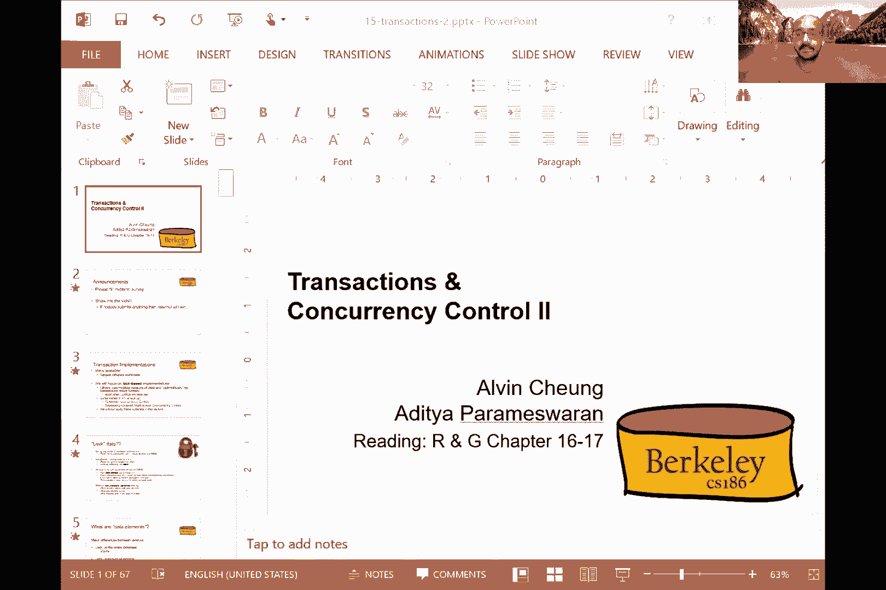

# P15：Lecture 15 Transactions & Concurrency II - ___main___ - BV1cL411t7Fz

 OK， all right。

 Yeah。 It is very warm today。 I don't know if learning about transactions， is going to help。

 But let's do it anyway。 So we've been talking about how to guarantee isolation。

 When you have multiple transactions that are both， that are issued to a database system。

 And we were talking about how do you， guarantee that these transactions don't interfere。

 with each other。 And we were talking about ensuring。

 some notion of correctness as these transactions are executed。

 So if you have multiple transactions that are being executed。

 how do you interleave that operations in such a way， that you can sell guarantee that it's。

 doing something reasonable？ So just a bit of recap。 We talked about the notion of a schedule。

 A schedule is basically a sequence of actions， on various bits of data from one or more transactions。

 So it's basically encompasses big in a transaction， read and write various objects。

 This could be pages， do-goes， what have you relations， and then commit or abort。

 Commit basically says that I want the effects of this transaction， to be persisted。

 Abort basically says， undo the effects of this transaction。 I no longer want this transaction。

 to be reflected on the data。 And so there were two representations that we looked at。

 One is a tabular representation where each column， corresponds to a separate transaction。

 And this string representation where you basically， list out the operations in sequence。

 So here transaction 1 of read A， transaction 1， then wrote A， transaction 1 wrote read B。

 and wrote B， and so on。 And convention for the string representations。

 that we only include the committed transactions。 And we omit the big in and the commit。

 in this string representation。 So like I said， we need a starting point。

 for defining what is correct in a schedule。 And so the natural starting point is serial schedules。

 A serial schedule basically says you， are sequencing the transactions in such a way。

 that each transaction runs from start， to finish without any intervening or interleaving。

 and actions from other transactions。 So this is basically complete isolation。

 So in this squiggles diagram here， all of the actions of transaction 1。

 happen before the actions of transaction 2。 So this is a serial schedule。

 And the second definition that we need， is a notion of equivalence。

 And so two schedules are deemed to be equivalent， if they involve the same set of transactions。

 And each transactions actions are ordered the same internally。

 So each transaction is doing the same thing。 And both of these schedules leave the database。

 in the same final state。 So basically think about it in the following way。

 It's the same set of transactions。 It's the same set of stuff that's happening to the database。

 Each of these transactions are obeys in the same way。 They have the same set of actions。

 And then the final effect of these transactions is the same。 So that's the notion of equivalence。

 A schedule is deemed to be serializable。 So this is our first notion of correctness。

 that we're talking about here。 A schedule is deemed to be serializable。

 if it's equivalent to some serial schedule。 Recall that serial schedule means basically complete isolation。

 D1 before T2 before T3 or some other permutation， of the transactions。

 But it's basically complete isolation。 So in this two transaction case， a schedule。

 S is deemed to be serializable even though it has interleavings。

 of operations across these transactions。 It's deemed to be serializable if it。

 is equivalent to some serial schedule like T1 before T2， or T2 before T1。

 So that is the notion of serializable， which， is one of the correctness notions that we want to define here。

 We will define other notions of correctness， which are a little easier to check afterwards。 OK。

 so let's get some intuition for this notion， of serializability。 So if you have this schedule， S1。

 which is a serial schedule--， so all of actions of transaction one， happen before transaction two。

 And in this particular case， T1 is transferring $100 from A， to B。

 T2 is adding 10% interest to both A and B。 Then if you have a serial schedule in which T1 is followed。

 by T2， the final outcome is A prime is 1。1 times A minus 100， and B is something similar。 All right。

 so that's one possible serial schedule。 Here's another serial schedule in which T2 is followed by T1。

 So in this particular case， T2's effects are first reflected， on your data。

 and then T1's effects are reflected。 So you have A multiplied by 1。1， B multiplied by 1。1。

 and then the transfer happens between A and B。 So basically。

 you subtract 100 from A and you add 100 to B。 So this is a different schedule。

 but it's still understandable。 It's still isolated。 It's still correct。

 Let's talk about another schedule， which is not a serial schedule。 This is not a serial schedule。

 Here in this schedule， you have T1 performing its actions on A， so reducing A by 100。

 And then T2 performs its multiplication， on the values of A times 1。1。 T1 then reads and writes B。

 So basically adds 100 to B， and T2 multiplies B by 1。1。 Now， here， this is not a serial schedule。

 but it's equivalent to the first schedule， where transaction T1's actions happen entirely。

 before transaction T2's actions。 And hopefully， you can convince yourself。

 that it is equivalent to that， because in this case， A， you start with subtracting A minus 100。

 and then multiply it by 1。1。 And B， you start by adding 100， and then you multiply it， by 1。1。

 So it's basically like T1's actions， happen before T2's actions。 So this is serializable。

 Even though it's not serializable。 OK， so the challenge with this serializable notion。

 is that it's tricky to check this property， that a schedule leaves the database in the same final state。

 as some other schedule。 And so we need a simpler， easier equivalence test。

 And so what we're going to end up using， is a more conservative test。 So it has no false positives。

 So it will not correct-- it will not incorrectly， deem something to be serializable even though it's not。

 But it does have false negatives， which， means that it can sometimes say， hey。

 this is not serializable， even though it is serializable。

 So you are basically sacrificing some concurrency， for this easier correctness check。

 You're still guaranteed correctness， but you are basically saying， hey。

 there are some schedules that I will not admit。 So it's basically being more conservative。

 So this test that we're going to use， is a different correctness notion。

 Use the notion of conflicting operations。 So these are pairs of either read， write， or write， write。

 or write， read operations。 And so two operations are set to conflict if they。

 are by different transactions。 They're on the same object， and at least one of them is a write。

 So basically， this conflict induces， a basic sequencing between these two transactions。

 So if transaction two read something， the transaction one wrote， that's a conflict。

 If transaction one and transaction two both wrote the same thing。

 transaction one's write happened before transaction two， that's a conflict， and so on。

 So these are all conflicts。 And so the order of non-conflicting operations。

 has no effect on the final state of the database。 And the reason for this is if I was writing B。

 and you were writing A， it doesn't matter。 But if both of us were writing to the same object A。

 that becomes a problem。 Or if I was writing something and you were reading it immediately。

 after that's a problem。 So our attention， as we focused on the order of conflicting， operations。

 is supposed to non-conflicting operations， with the definition of conflict being like this。

 So armed with this notion of a conflict， let's define the notion of conflict serializable。

 So this is a variation of the serializable notion， that we defined earlier。

 So two schedules are deemed to be conflict equivalent。

 if they involve the same actions of the same transactions， in the same order-- so basically。

 same set of transactions， in the same actions within each transaction--。

 and every pair of conflicting actions， is ordered in the same way。

 So every conflict is ordered in the same way。 So if there is a conflict where transaction one。

 is writing something and transaction two is reading something。

 and it's in one order in the first schedule， it has to be in the same order in the second schedule。

 And then using this notion of conflict equivalent。

 we can define the notion of conflict serializable。

 So this is an extension of the serializable notion， that we defined earlier。

 A schedule S is deemed to be conflict serializable。

 if it is conflict equivalent to some serial schedule。

 And since conflict serializable is a more conservative property。

 it means that S is also serializable。 So conflict serializable is more conservative than serializable。

 So that means that S is also serializable。 So but this is not a complete set。

 There are actually serializable schedules， that are not conflict serializable。

 And so conflict serializable gives us false negatives。

 when we're using it as a test for serializable。 Like I said， so it's more conservative。

 And this is the cost of using a conservative test， that misses some serializable schedules。

 even though they are serializable。 And this is a trade-off that we are willing to make。

 because it's cheaper to enforce conflict serializability。

 So there's an equivalent notion of conflict serializability， which is easier to work with。

 at least for the example that I'm gonna describe。 And so that is this notion， which is a schedule S。

 is deemed to be conflict serializable。 If you can transform S into a serial schedule。

 by simply swapping consecutive non-conflicting operations， of different transactions。

 So consider any such swaps between non-conflicting operations， of different transactions。

 If you can reach a serial schedule， then that also means that S is conflict serializable。

 So to make this definition a little more， sort of concrete in your head， let's look at an example。

 So this is my string sequence of operations， and this is transaction one， transaction two。

 So basically transaction one， red， a， road， a， and then transaction two， red， a， road， a。

 and then transaction one， red， b， road， b， and so on。 So this is the example。

 Now I'm gonna try doing swaps。 So I'm trying to swap consecutive non-conflicting operations。

 to try to get this to a serial schedule。 So the first operation that I'm gonna swap is RB and WA。

 So that was the operation that was a swap。 That's okay， I can swap these two。

 because these are on different objects， A and B。 So I can swap them。 So that's not a conflict。 Okay。

 I can continue swapping。 So now I'm gonna swap WB and WA from these two transactions。

 again on different objects， so I can swap them。 Then I can swap RB and RA again on different objects。

 and then I can swap WB and RA。 So now with all of these swaps。

 I have basically transformed this schedule to this schedule。

 So by basically swapping non-conflicting operations， I've managed to reach a serial schedule。

 That means that this schedule is conflict equivalent， to this serial schedule。 Okay。

 and therefore it's conflict serializable。 Okay。 Now let's take another example。

 and talk about whether this is conflict serializable or not。 Okay， so I have two transactions。

 T1 and T2。 Do we think this is conflict serializable or not？ (silence)， No， why not？

 Because A is the same。 Yeah， so all of the operations are happening， on the same object A。

 So even though I can actually swap these two， I can swap RA and RA from these two transactions。

 I can swap that， but then I have a block， right？ I can't move this RA any further。

 So even if I move this RA here， let's say RA， I can't move go any further。

 because I can't swap the order of these two。 These two are a conflict。

 I can't swap the order of these two， because these two are a conflict。

 So basically I'm left with this schedule， that cannot be transformed into a serial schedule。 Okay。

 So Alvin makes an important point。 So he says his swapping is just an exercise。

 to check if a schedule is conflict serializable， right？

 So here we are trying to test whether something is equivalent， to a serial schedule or not。 Okay。

 all right。 So this is not conflict serializable。 So you can only swap the order of the RA's。

 but nothing more。 So how do we check this more generally， right？

 So you sort of individually doing these swaps， is a little painful。 So why。

 how do we check whether something is conflict serializable， or not？

 So one way to do this is to use this conflict dependency graph， right？

 So you basically have one node per transaction。 So TI and TJ in this example。

 And there's an edge between from TI to TJ， if there's an operation OI within TI。

 that conflicts with an operation OJ in TJ， and OI appears earlier in the schedule than OJ。

 Not Simpson， but OI appears earlier in the schedule， than OJ。 Okay。

 so basically it says that this is a conflict， that I can't flip in the other direction， right？

 So basically saying that there is a dependency， in this direction。 Okay。

 so the theorem now that we have， this graph is that a schedule is conflict serializable。

 if and only if this dependency graph is acyclic， right？ So this， this is。

 I'll let you prove this at home， but the sketch here is that basically these edges indicate。

 sort of a temporal relationship， between certain operations or a temporal relationship。

 between certain transactions。 That if you can't， if you have a cycle in this graph。

 that means that you can't find an ordering， of the transactions。

 you can't determine a serial schedule， right？ If instead the graph is acyclic。

 basically that the edges， you by topologically sorting。

 that graph that gives you that serial schedule， and that serial schedule is what you will get。

 if you did these swaps individually， right？ There are many such schedules each。

 from one possible topological sort， but these edges determine what you can。

 and can't do in terms of the swap。 So overall， the theorem basically says。

 if this dependency graph is acyclic， then it's conflict serializable。 Okay。

 and the proof basically says， that if you have conflicting operations。

 they prevent us from swapping operations， into a serial schedule and a serial schedule。

 would be basically just a topological sort of this graph。 Okay。

 so let's take an example to make this a little more clear。

 So let's say I have these two operations in T1， R A and W A。

 So I have not added any operations T2 yet， but let's say T2 now has R A。

 And since this operation R A and W A conflict， there is basically a temporal relationship。

 that says that T2 has to happen after T1， and therefore you're encoding this via an edge。 Okay。

 then let's say T2 has a bunch of other writes and reads。 So it writes A reads B writes B。

 And then let's say T1 reads B。 Okay， so this is the schedule。 And since you have RB at the end。

 that means that there's a conflict between WB and RB， WB and T2 and RB and T1。

 That means that I need to add a back edge from T2 to T1 based on B。 Okay， so from this point， given。

 so this graph obviously has a cycle。 So that means that this is not conflict serializable。

 according to the definition that we gave earlier。 And intuitively。

 it's also very clear why you can't really perform， swaps in this particular example。

 so that either T1 happens before T2 or T2 happens before T1。

 Because these edges are these relationships。 Basically indicate a conflict that can't。

 you can't flip it。 The other things you can't flip。

 but these are blockages that prevent you from flipping the schedule。

 so that you can get to a serial schedule。 Okay， any confusion about this notion of conflict serializable。

 and why the graph is helpful in determining whether a schedule， is conflict serializable or not？

 Ian？ Oh， yes， just the clarify。 So essentially for each conflict in pair。

 we're going to have one arrow， right？ Exactly。 Yeah。

 so there will be multiple arrows between two transactions， in each direction。

 You don't need to keep all of these edges around as long as you。

 preserve one arrow in each direction that's efficient。 I see。 Thank you。 Yeah。

 Was there another question from Warren？ Oh， yeah。 Is there anything else that we might want to check for other than。

 cycles for this graph？ Not if you're trying to determine conflict serializability。

 There are other forms of other variants wherein you might want。

 to use more relaxed notions or more stricter notions。

 And I'll talk about one stricter notion of serializability， subsequently。 Any other questions？ Okay。

 So this is the stricter notion of stricter， but it sort of has a less it's a less conservative notion of。

 serializable。 So it has fewer false negatives。 So for this notion。

 this notion is called view serializability。 The previous one was called conflict serializability。

 So this is fewer false negatives。 So it's between in terms of conservativeness。

 It's between conflict serializable and full serializable。 Right。 So in this notion。

 two schedules as one and S two are deemed to， be view equivalent。

 If basically it has you sort of need to do a fine grain bookkeeping。

 of what's happening with each transaction and each object。 Okay。

 So the bookkeeping happens as follows。 It basically says two schedules as one and S two are equivalent。

 If you're doing the same set of initial reads。 So if T one read the initial value of a in S one。

 then T， sorry， T I read the initial value of a in S one， then T I read the。

 initial value of a in S two as well。 Okay。 So they did the same initial reads and then it did the same。

 dependent reads。 Okay。 So if T I read the value of a written by T J in S one， then T。

 I also reads a value of a written by T J in S two。

 So basically everything that was written and then read is also。

 happening in the same way in the two schedules。 Finally。

 what is left as a result of these operations is the same。

 If T I writes a final value of a in S S one， then T I also writes， a final value of a in S two。

 So this is kind of a fine grain bookkeeping of what is being read。 What is the start？

 So who reads the values the start？ Then if something something is written who reads that and then。

 finally who writes at the end。 Okay。 So how does this sort of fine grain notion of equivalence help？

 So this notion allows all conflict serializable schedules。

 So every conflict serializable schedule is also view serializable。

 It also admits what are known as blind rights。 So it's less conservative than conflict serializable。

 but because， it allows this notion of blind rights。

 So let's take an example to understand what blind rights would mean。

 So let's say I have these three trans three transactions T one， T two and T three。 Okay。

 So in T one you have R a and then W a and T two has just W a and T three has just， W a。 Okay。

 And again， this is a string representation。 So you're reading this from left to right。

 Now we view see。 So firstly， notice that in this case in conflict serializable， there is a conflict。

 between these two。 So I can't really swap these two operations。

 And we use the realizability these these two this schedule is equivalent view equivalent。

 to this other schedule， which basically has all of T one's operations first。

 then T two's operations and T three's operations。 And the reason why we were able to swap these two operations in the view。

 serializability notion is because these two options these two operations are。

 basically writing values of a that nobody is reading。 Right。

 They are writing values of a that nobody is reading and only the final value T three's。

 value that is written。 It basically overrides the values written by T one and T two。

 And so what T one and T two and what order they write a doesn't matter because both of them。

 get superseded by the right by T three。 Okay。 So this final right is the one that wins。

 So these blind rights is rights that are done by transactions that are not read by anyone is。

 basically they can be flipped。 Okay。 So in this in this notion。

 So that's a notion of you see the liability is basically less conservative compared to。

 conflict serializable， but the downside of you see the liability is that it's。

 difficult to enforce it's you need to do very fine grained bookkeeping about who read what first。

 and who is reading which version of each object that's very hard to do。

 So but that said neither notion either you see the liability not conflict serializability。

 allow all schedule that actually serialize because you don't understand the meanings of the operations。

 or the data。 Okay。 So serializability actually talks about the final state of the data and sort of encodes the。

 semantics of the operations need of you serializability nor conflict serializability actually require。

 that you understand the meaning of the operations。

 So conflict serializability is what gets used and Alvin is going to tell us how we get to use。

 conflict serializability and that's because it can be enforced efficiently。 Okay。

 Any questions on this？ Okay， look， Alvin。 Take it away。 Sure。

 So actually before we do that and go into the next fragment of the next segment。

 I think people were asking to。

 possibility of taking a break。 So why we just want to take one minute break maybe a stretching break。

 get something to drink and then we can come back to the next section。

 So we， Alvin is also soliciting center post to solicit tiktok videos so that we can play the break。

 Yeah， so that was actually my whole point originally when I was sending that out。 So， I mean。

 I don't actually have any announcements per se， so you guys can keep， you know。

 stretching if you like besides like feeling the， midterm survey。 And then like， you know。

 as a did you I was saying， right？ We're actually looking for videos。 So， like， you know。

 before I checked before I went to like your lecture today， I was like。

 we haven't actually received a lot of these submissions。 So if you have not done so， like。

 you feel free。 And you don't have to have make them yourself， right？ You know。

 just send us something interesting。 If you like， if you don't mind sharing with the rest of your classmates。

 you know， because if nobody submits anything， right？ That definitely will win。

 And they'll have nothing， right？ So， we'll be staring at a blank screen like you know， for like。

 you know， two to three minutes， which will be awkward。 So， yeah， please， I mean。

 if you guys have anything， I mean， otherwise， like， you know， otherwise I can also play， you know。

 my favorite， like， you know， cat videos， you know， unicorns or like， you know。

 goldfish swimming in the ball。 I mean， like， you know， none of which might be interesting， right？

 Or we'll just end up staring at each other on the zoom window， which is weird。 Right。 So， yeah。

 I'm not going to tell you。 So， yeah， as I said， you don't want to know what my account is。

 So don't worry about it。 If you want to share， I mean， go ahead， I mean， you know。

 I welcome all of you to add me on Facebook or TikTok or you can find it。 I mean， you know。

 it's not a secret。 If you can， only if you know。 Go ahead。 No， you don't have to submit videos。

 Come on， right？ I mean， like， you were just saying。 If you have anything that you want to share。

 like， you know， otherwise next time I'll start playing the golfers swimming around and then。

 you know， we'll， we'll have a very calm and peaceful break。 I can play someone doing yoga。

 I suppose。 Okay， Alan is going to put up something I don't want to click on it right now。

 I don't know what it is。 I don't want to do the little transverse。 No， I mean， I trust him。

 He is one of our best teachers。 Yeah， anyway， so before we go on， right。

 any like any questions about a DTS part of the lecture on transactions。

 So I'll go here in the next fragment， right， is to basically look at how to actually implement transactions and there will work。

 I mean， otherwise known as project four， right。 So， as you can guess， I mean。

 there are actually many different implementations available。

 They tend to have like different performance characteristics。

 and they also target different types of workloads。 So for the purpose of our lecture， however。

 we're going to focus on something called a lock based implementations。

 And before I go into this whole， like， you know， thing about what lock based implementations are about。

 I'm just going to throw out the buzz words that you guys may hear if you go on to study different types of concurrency control mechanisms。

 So for instance， you might hear people talking about something known as multiple versions concurrency control。

 So the intuition there is to basically say that， okay。

 we're just going to let everybody move forward as if they have a copy of their own database。

 And then eventually， when they need to commit or when they need to abort。

 then we'll check in terms of figuring out whether there's any conflict。

 And you can already guess what conflict in that case mean， right。 There's like things about like。

 you know， you write something that another person。

 another transaction is also overriding at the same time so and so forth。 Yeah。

 so you can imagine basically doing that checking only when you try to commit a transaction。 So。

 but otherwise you just let everybody move forward as if nothing。 There's no check。

 There's no locking for instance。 Some things that sometimes it can look up， for instance。

 is something called optimistic concurrency control or OCC or time bank。

 time stamp based concurrency control as well。 So these are things that you can encounter if you go on to study different types of concurrency control mechanisms。

 But as I said， to keep things simple， we only go to focus on something known as lock based implementations。

 So， yeah， so don't worry about it if you don't understand what I was just talking about。

 So those were just for your interest。 So first， let's talk about like， you know。

 what do I mean by lock， right。 So there are many notions of lock。 You know， so this is not 161。

 right。 So we're not going to be talking about like， you know。

 things like security and there's no adversaries here， right。 So， you know。

 don't don't worry about that。 If that's what you're thinking about， you're safe。

 What we are talking about， however， is this notion of locks or exclusive。 We're just in my mind。

 So like semaphores or like， you know， basically exclusive sections。 Yeah。

 exclusive segments of code that like your only one threat or one， like， you know， control one。 Yeah。

 one threat of control can run at a time。 So this is something that you might encounter in 61 C。

 Hopefully some， some， something that you might recall。 Basically， synchronization primitives， right。

 So we basically put a lock around a piece of code that we want exclusive access to。

 So those are the， those are the types of locks that we are talking about in this class。

 So people are really familiar with this notion of locking or what we are talking about as synchronization primitives primitives in this class。

 Hopefully that's going to recall like， you know， a pleasant memories right from 61 C。

 And then immediately someone said I'm dead。 Okay， sorry。 Okay， right。 So。

 but then for the purpose of this class， right。 So you need to remember that just like in 61 C。

 All these locking primitives actually is not free， right。 So we need to have like， you know。

 run CPU， like， you know， they all cost you cycle。 So these are not like， you know， free operations。

 So just keep that in mind。 And in this class for a database class。

 we're just going to follow a very simple convention。 So this is all you need to know about locking。

 for example。 So we assume that each data element has a lock， which is unique to that element。

 Each transaction must first acquire that lock before being able to read or write to that particular element。

 And then if a lock is already taken by another transaction， then like， you know， just have to wait。

 And then after we're done， we always released the lock at some point in time。

 So that's the basic principle that will go by in this class。

 And then you're here and we'll also discuss in this lecture different types of locking protocols or schemes。

 Sometimes you hear， you hear people talk about that。

 How they different is basically when to lock or unlock each of these data elements。

 What they're able to actually lock and what actually happened when someone is trying to wait for a lock。

 So I've been trying to wait my hand in terms of like saying what is a data element in this case。

 right。 So it turns out to be different across different vendors。 So for example。

 you can consider the data element here is the entire database。 I mean。

 you might think that is silly， right， because if you block the entire database， then sure， I mean。

 you basically guarantee that nobody else can run any other transaction concurrently。

 So that by definition guarantees serializability。 In fact， it's a serious schedule at that point。

 right。 There's only one transaction that can go up that can go on at any single time。

 And that transaction has to finish entirely before another transaction can go on。 So of course。

 we preserve as it。 You might think this is a silly example that nobody's actually implement that。

 Well， but believe it or not， SQL like has this notion of locking the entire database when you run transactions。

 What does that mean？ That means if you care about concurrent transactions running for your app or your first startup。

 for example， don't use SQL like because SQL like assumes that the entire database is locked every time when someone begins a transaction。

 So， you know， good luck。 And then there are also other database implementations where they only lock individual records。

 right。 So that's like way more reasonable， as you can imagine。

 So all the commercial implementations does that。 We'll actually see the different trade-offs that we're talking about later on in terms of why one way and not the other。

 And can we actually mix a match both of them， right， for example。 Okay。

 so for the purpose of this class， like， you know， as I said， right。

 for each of these locks that we can acquire and release。

 we're going to use this notation here for purposes。 So the underscore here， you know。

 the subscript I basically refers to the transaction I， and then either L or you would。

 So that's a face out in practice。 So first of all， here is a non-serializable schedule。

 Why is this a non-serializable schedule？ So just to remind ourselves， right， so you know。

 time goes downwards。 Okay， so here we have T one trying to read a you can think of a as either like a record。

 Yeah， for a single tuple， for example， right， tries to read a and tries to write and then followed by some operations from T two and then followed by going back to T one。

 Right， so in this case， right， so we are writing to a and then， you know。

 T two is basically going to read the value that was written by T one。

 And then T two is going to write to be which is subsequently being read by T one， right。

 And in this case， I challenge you a way to swap the operation such that it becomes a serial schedule。

 There isn't a way， right， because we're kind of in a in a in a in a cyclic in a cycle， right。

 because I knew T one， T two depends on T one's value of A and T one depends on T two for the value of B。

 So we're kind of stuck。 So this is a non serializable schedule。 Now。

 if I want to make this a serializable serializable schedule， one way of doing it， is I said， right。

 it's by introducing locks。 So in this case， I'm going to grab a lock。

 I'm going to grab the lock on a before reading it。

 And then I'm going to release it after I have read it。

 and then subsequently I'm going to grab the lock on B right。

 like your eye in this case meeting when you're T one by the first transaction。 So same thing。

 same thing for T two。 So teachers go into first grab the lock on A before reading it。

 so on and so forth。 And then when as it tries to grab the lock on B， it's going to be blocked。

 right， because of the fact that T one currently holds the lock on B。 So T two has to wait。

 So since T two cannot make any progress， we can actually switch back to T one。

 So T one in this case is going to finish is operation on B， and then unlock it。

 After which T two can then grant， can then like you'll grab the lock and then carry on with this operation with B。

 Kyle， do you have a question？ Yes， why does T one lock be。 Well。

 because T one knows that it's going to write to be out later on， right。

 So one way I can enforce this schedule to be serializable， I mean。

 knowing that like this is what T one and T two is going to do is to basically insert these lock statements。

 So in fact， the purpose of this life to basically show you that using locks， right。

 so we have now ensured a conflict serializable schedule。 I mean， you can do this afterwards， right。

 because with this particular schedule， you can now do the swapping that I did。

 was telling you guys earlier to make that to make this schedule to be a conflict serializable one。

 I see。 Does that make sense？ Yeah， thank you。 Okay， great。 Any other questions？ So， yeah。

 I have a question。 So T two tries to acquire a lock for B。

 but it's blocked and then T one releases the lock。

 Does it automatically receive the lock as soon as it's unlocked or does it have to recall the L to be。

 Where's this granted？ Do you have to read。 No， so， right， great， great。 So you can think about。

 Yeah， no， it doesn't。 So basically you can think about T two， like what is what is happening？

 Why is it locked？ Right。 So you can think of it as basically just spinning around。

 So you can think of it as a call， maybe from 61 C， right。

 So one way you can implement this mock is to basically have a while loop that keeps just doing nothing and checking。

 but it's not as available before you can actually break out of it。 Okay， thank you。 And that case。

 that in granted basically means like， you know， we're allowed to jump out of the loop because like。

 you know， we're finally received a lot。 Okay。 Yeah。 So， so far， so good， right？ Yeah。

 quick question about like when things were chosen to be locked and like how the schedules can split because like in this current setup。

 like it does work with where， you know， L B is locked by transaction one。

 But it almost seems like if there were， you know， like a T three that did stuff with the first。

 it could start using B in the middle of like when T one is using a， I guess， like。

 like it just seems kind of arbitrary where you're choosing to start the lock。 Yeah， exactly。

 So like in this case， I actually decided that like you'll be able to grab the lock on B first。

 right。 And in fact， that is an extremely good lead in to the next slide， right。 So there we are。

 there we have it。 So in this case， I mean， the， in terms of the lock and the unlocks， I mean。

 I haven't changed anything。 So we're still grabbing the lock， for example， right。 So in this case。

 notice that I'm grabbing the lock on B right after I'm locked A， right。 So in here。

 if you look at like， you know， the schedule for T one is exactly the same thing。 Okay， I'm。

 I'm grabbing the trying to grab the lock on B after I have unlocked A， right。

 The only difference in this case is I am now allowing T two to first grab the lock on B other than T one。

 Right。 So just like in 61 C right so we have no way of telling which transaction is going to grab the lock first。

 And then just both of them are trying to grab it at the same time， then it's somewhat average。

 which one is going to win。 So in the， on the previous slide， like， you know， okay。

 on the previous slide， I said that， okay， fine。 So let T one win first and then let's see what happens。

 And it turns out that like， you know， we now have a conference， theizable schedule。

 The question then is if I let you to win， you know， the lock first on B is the same thing。

 also going to happen。 That's actually a question。 Maybe a rhetorical。 No， right。

 because now we're back to step one， right， in this case， you know， we now。

 once again have the dependency。 So T two is going to read the value that like you know that T one just wrote for an A。

 And then it's going to write its own version of B that is going to be read by T one later on。

 So once again， we're stuck with the cycle that we had from the beginning。

 So basically it seems that like you're using locks that not enforce conflict serializability， right。

 And of course， at this point， I knew the test those out。 So what now。

 so basically that means using just locks themselves right it's not good enough。

 And exactly as what the wish I was talking about right so let's try to impose the first locking scheme or。

 or protocol。 In this case， it's called the toothpaste locking scheme or the protocol otherwise known as two P L。

 It's basically says that every transaction has to grab all the locking requests before actually trying to unlock anything。

 Again， we're still using locks that's just like before right the only thing that we are playing around with is when to actually try to apply the locks and when to actually release it so that's why in the first line in this lecture I was saying like you know all these different locking protocols。

 slash teams， they only think that one of the things that they differ is just what locks to grab and when。

 Right， and likewise with the releases of the lock。 So let's see this in action。

 So now I am enforcing both these transactions must have grabbed the locks first before they can release anything。

 So notice in this case now I am grabbing both the locks on a and B。

 Before I can actually release anything later on。 Right。

 So likewise with T two right so T two in this case I'm grabbing all these locks before I'm releasing them。

 Later on。 Okay， so I'm following the discipline or the I'm following the program here right。

 And now you can see that this schedule is now conflict serializable it's basically boils back down into the good case that we had earlier right。

 And in this case I would claim that it doesn't matter like you know how a great ties when both transactions try to grab the same lock。

 Right， look for example。 T one in this case is good。

 it's going to grab both locks as the first two statements。

 So it's only going to be able to proceed with the rest of the operations here with a if it actually received the lock for both a and B。

 Right。 So in this case I will claim that there's no way that you to get into leave here before。

 you know， within this right to actually make this schedule becomes non conflict serializable。

 So I'm going to prove to you that like you're using this two pm mechanism is going to ensure conflict serializability always。

 How to we prove this， we're going to prove this by contradiction。 So let's assume that is does not。

 Okay， and it's just as you remember from a this year's lecture。

 That basically means that we have a cycle in the dependence graph。

 So what we call right this dependence graph there's an edge between two two transactions if there's a dependency in terms of this。

 you know， read it right dependency or write right dependency between two transactions right。

 So here's the cycle。 So， you know， you see the cycle here on the on the screen。 And it。

 and it for sure does not ensure conflict serializability。 Right。

 So let's see how this is this cannot exist right because we're trying to prove this by contradiction。

 So I'm going to prove to you that is that is not going to happen by showing you that there's a cycle there's there's a cycle in time。

 If we follow this dependence graph。 So let's go through this step by step。 First one。

 I'm going to claim that。 Transaction one is going to unlock a before transaction to is going to be able to grab the lock on a。

 Why？ Because I have， you know， transaction one has to unlock it right before， you know。

 transactions to any other transactions able to grab the lock on the same data elements。 Right。

 So that means in terms of time。 The unlock event right on a has to happen before the locking event on a for transaction to。

 Agree。 Okay。 So that's fine。 And notice that why I'm picking a right because we have this dependence at here right so this dependence at basically means that there's a dependence between one and two。

 So in this case， I'm basically saying that there's a dependency on a。

 So that means like you're out transaction to is not able to grab the lock on a before transaction one able to release it。

 So let's follow that right。 So now I'm saying that for transaction to it has to grab the lock on a before is able to unlock is。

 Is lock on B or release the lock on B。 Why is that the case？ I'll give you a hint here。 Anyone。

 You got to ensure all locks come before your own locks。 Yeah。

 So by 2PL right we have to wait by 2PL we cannot release any locks。

 Before we have grabbed locks on everything right。 So a and be a different data elements that's fine。

 But then in this case since like you know the lockings。

 The locks have to proceed right applying of the locks have to proceed all the releases。

 So in this case that's the only thing that I can do from one transaction right or single transaction for a view。

 So therefore in time right so we have this relationship here。

 So I can now go on and look at this edge here right。 So what is this edge sets。

 What is this edge saying right you know same thing。

 It's basically going to say that transaction to cannot release the lock on B。

 It has to release the lock on B before transaction to be able to grab the lock on B。

 For the same reason right I think we have to explain that before。

 So you can go on with the rest of the reasoning and believe it or not you basically ended up in a cycle。

 So it ended up seeing that like you know transaction one has to unlock。

 A before actually we are before actually like you know before actually releases the lock on A。

 So which is a cycle in time。 So that basically means this is a contradiction because the same event cannot happen before itself。

 Pretty cool right。 So now we have proved this by contradiction so that that basically means that using 2PL can indeed ensures conflict serializability。

 Questions so far。 Where is L1 a so I'm not drawing out the schedules here right for the individual or I'm not drawing out the individual operations inside the transaction here。

 But you can imagine right since we have an edge between transaction one and transaction two on a in the dependence graph right。

 So if you recall a DTS lecture that basically means T1 must be grabbing the lock on a at some point during its execution。

 Oh。 Okay so we've done right obviously not right means we have to still have an hour to go。

 So now we have another problem to deal with and this is a no problem known as a non recoverable schedule。

 What do I mean by that。 Well， so everything before like you know this fragment here。 Sorry。

 Everything。 Before this line here is exactly the same as what we have from before。

 The only thing the only difference between this schedule and the one from before is whether one decides to commit or roll back otherwise known as a board。

 So this problem by the way is also known as cascading a boards。 Why is that a problem。

 Well turns out that transaction one decided to abort at the end。

 So meaning that we somehow need to restore everything that transaction one did right in terms of writing to different elements。

 So in this case notice that like you know transaction one tries basically wrote to both a and B。

 So we somehow needs to undo its effect right on both a and B。 However。

 like your transaction to actually decide to commit。

 And the worst case in this the worst thing in this in this case is actually that like you know it unfortunately read the value of B that transaction one wrote to it wrote earlier。

 So that sucks right because now like your transaction to actually read a dirty elements that is supposed to be wrote back。

 And now it also decides to commit right。 So that's not good。

 And now transaction two can no longer undo right we can no longer undo transaction one because you know the value that was written by transaction one has already been read by transaction two right so that's not good。

 And again right the cash shows up。 Any questions about this so far。

 So this is called cascading a board right because we're basically trying to figure out how to roll back both T one and T two right so in this case we need to roll back both of the transactions because that's the only logical way that we can that we can keep the database state to be consistent。

 Okay， because T one decides to roll back itself so therefore。

 and T two has red T one's value so the only way that we can do this is to forbid T two from committing。

 So one way to solve the problem is now we need to refine our two PL rule。

 So not only do we have to do the same thing as before right meaning that we can only we have to acquire all the locks before we can release anything。

 We now also have to make sure that all the unlocks happen after we have decided to either commit or abort。

 So we can't release anything before we decide to commit or board。

 otherwise everything else is just the same as before。

 And then I claim that was straight to be out we now get schedules that are both conflict serializable and also recoverable。

 You can see this in action right。 So now you can see I am not releasing any of the locks until I have decided to roll back or commit。

 So therefore now in this case， since we have already processed T one's abort right by the time we actually grant this lock to grant the lock on eight for to T two。

 So therefore we are safe。 So T two is now not going to read the dirty value that T one has earlier。

 I'll work into it。 Does that make sense。 So does this just ensure that all of one transaction occurs before the next。

 When you buy off transaction like like so， since transaction one holds the locks for a and be all of transaction one finishes before transaction to。

 Yeah。 Okay， that's a great question。 Yeah。 And also that's also what a concept on is asking。

 Exactly。 So now we're gradually reducing right the amount of concurrency that we can do because now it seems like this is actually just like a serial schedule at this point right。

 Well things does not have to look this bad right so let's say if you have another transaction that actually touches neither of a and be I mean that one can just proceed as as as all as concurrent as anybody else。

 So we're not entirely killing all the all concurrency but we are kind of taking a step back right because of the fact that we want things to be recoverable。

 Okay。 Okay， so actually most lock based database systems just use strict to be out because they want to ensure things are done recoverable recoverable and also conflict serializable。

 And actually it's pretty easy to implement in the sense that we just insert all the locks statements before trying to read a single elements。

 for example。 And then we just want to make we just basically want to make sure that we don't release any of the locks before a transaction decides to commit or board。

 And then doing that we're unsure both of these problems are solved。 And are we done yet right。

 Of course the answers no right I mean we still have 25 minutes to go so there must be something else。

 So yes， of course there's something else right。 I don't know if anyone told you I mean like transaction or concurrency control is always a story that is like you know written using blood and tears right or。

 I don't know you know blood and sweat or any one of these bad things。

 So it's a is a pretty pessimistic story unfortunately。 Oh， there we go。 What's the next problem。

 So take a look at the schedule here so we have one transaction trying to read a and then write be right and then we have a second transaction here trying to read be a right a。

 Okay， so we're playing straight to PL so T one is going to grab the lock on a and it's going to wait for the lock on be。

 for example， because it's trying to grab the lock on be。

 And then T to the first try to grab a lock on be， and then now it has to wait because T one is holding on to the lock today。

 Okay， this is known as a deadlock right。 So 61 see you guys probably already remember that yeah we need bread fun coloring and of course now the cat again shows up。

 You see a lot of cat in this lecture as you can see as I told you this is a very pessimistic picture。

 Okay。 Now you recall if you're taking like 162 for example this is not a really new problem I mean even in operating systems the same thing happens to write in general。

 or concurrency control mechanisms。 So the standard technique in operating system right for example you take 162 is to do an ordering。

 an imposed an ordering that says for example the screen always grab the lock first。

 followed by like you know some other devices， for example。

 the why is this a problem for transactions or databases in general。 Well。

 what kind of order do we want to impose。 I mean we have two pools that we have tables right so it's not like they are unique devices so like you know how do we impose an order。

 So I hope you guys remember right maybe from 61 see how like you're imposing an order with softness problem。

 because if we have an order， then that means we always have a way to break ties right in case like you know to try to to resources try to get on to the same luck。

 So we somehow can impose such an order for transactions that we're good。

 but it's hard to imagine what kind of order we want to impose right because people keep answering new tools and we cannot foresee what kind of tables people are trying to create。

 So there are a couple of things that we can do right in terms of dealing with that box。

 The first one is to just avoid them。 If we can avoid that locks to all together then you know we won't have this problem from the beginning。

 If we cannot avoid them then the next order of business that we want to talk about is how to detect them。

 And subsequently how to deal with them once they are detected right。

 So that's why I'm going to talk about next。 So avoidance。

 One way we can avoid like having that locks all together is to arbitrarily impose an order just like in the device case for for the operating system。

 So I can impose an order based on something called an age of a transaction。

 And I'm obviously finding what age in this case mean right basically means like you know how much time has the transaction spent in execution。

 So take the time now and I'm going to subtract the time that it like you know the transaction first try to execute。

 And then I'm just going to call that the age of the transaction。

 So one way one policy or one scheme known as the weight by policy is to basically say that if I has a higher priority priority here based on age right。

 Then like you know it's going to wait for the other transaction to finish。

 Then it's just going to abort in a case that like you know I is actually having a lower priority than T then J。

 Another policy known as one weight is to basically do it somewhat the other way around。

 So if I has to hire priority then like you know the other transaction J is going to abort itself。

 And then let I proceed。 Otherwise it's just going to wait。

 So you might this might be a little bit abstract for you so you know let's use an example to illustrate this right and then I'm going to do something that is perhaps a little bit stinky。

 We're used to the example of a parties。 So imagine we have two people here right so age right let's use human beings so so you have a senior person waiting for。

 Waiting to use the bathroom and we have like you know a younger person currently in the bathroom right。

 So now the first policy says right if the senior person is trying to use the bathroom while somebody else is actually in there right so we can either wait for it。

 Right that's what that's what the first policy there says right wait wait die right。

 So if the if I has a higher priority it's going to wait。

 So that basically means a senior person is going to wait for the younger person。

 And if not it's just going to kill itself right so that's the die part so that's what you see here like you're in the rest circle。

 And then the other policy right so the one weight is basically going to say if I'm the senior person。

 I'm going to basically kill off the younger one right and currently in the bathroom and then like you know so that I can take over。

 That's the one part。 And then if it is the other way around then I'm just going to wait。 Okay。

 So you might ask the question and you're why is this avoiding that box right why is this preventing that box from happening。

 So to understand why like you asked the question what is it what what do the previous images have in common。

 So I'll put back on the on this side right on this slide right。

 So notice that in the front on the first image here right。

 So notice that the senior or the older older transaction is going to wait for the younger one。

 but then not the other way around。 So that's how we avoid this like your situation right or otherwise known as you know the old person always wins okay。

 So the young transaction is going to kill off itself as opposed to like you're waiting on the old transaction。

 So we won't have a cycle waiting here because it's always only the case that the senior or the older transactions is going to wait。

 not the other way around。 So we break ties right so therefore like you know it's not going to be a cycle。

 So note that lock。 And then we follow to second discipline。

 It's the other way around right it's always the younger transaction that is going to wait。

 The senior transaction or the older transaction is not going to wait because it's going to immediately kill off the younger transaction by winning it。

 So therefore we also avoid that box as well。 Does this make sense。

 I mean in other words we are just going to be able to like you know impose an order on the transactions using this age mechanism and by doing so we avoid the cycle that we're trying to prevent。

 So but it's important that we know if a transaction actually gets killed right by either one of these mechanism。

 it has to get the original timestamp。 If not， then it's just it's not going to be fair right so if you look at like you're one of the previous schemes earlier right for example。

 Yeah， so we so let's say we use the first discipline first protocol and then if a transaction dies right and then it's just it's basically going to recue itself and trying to execute again。

 If it gets a new timestamp that is still going to be waiting outside the bathroom and then waiting for a senior one to finish right。

 And then it's because of the fact that it's younger than the old transaction is going to kill off itself again。

 So basically that means the new transaction is never going to be executed and that is bad。 Right。

 so not only do we want to avoid that box we also want to make sure that that there is progress。

 Right， which is something that you keep hearing these days and since we're in election phase right。

 So we want to make sure that this progress。 So we want to make sure that these transactions will eventually get executed。

 So but then if we keep getting new timestamps then following the first discipline the new transactions never going to execute so that's bad。

 So the only way of that is to basically make sure that we get the original timestamp。

 So therefore when the older transaction actually finishes eventually then like you know we will get to execute at that point。

 And also notice that I'm just using this age right a time thing as one of the ways that you can use to impose an order that is not the only way right you can also use other mechanisms as well。

 For example how much resources how much resources in terms of memory so and so forth it has already consumed how many locks it has already acquired so and so forth as another mechanism to do it。

 I mean all that we're trying to do here is just to impose an arbitrary order on all these different transactions and make sure that this ordering there's no cycle within it。

 such that we can use it to now break the debt block situation。 Any questions about this so far。

 I apologize for the kind of stinky example but I think that's something that might make intuitive sense some of us。

 Okay， if not I want to next talk about the detection。 Okay。

 so if we cannot avoid that box to begin with or if you don't want to apply any of the mechanisms that we talked about before。

 we can try to let everybody run and then like you know the attack that locks when it actually happens。

 So how to do that。 Well， it turns out that we can create a wake for graph。

 Similar to the pendent graph that did you I was talking about earlier。

 and then we basically check this graph for cycles。

 And if there's a cycle that basically means we have a deadlock。 How does this work。

 So here for transactions。 And， you know， as the deal was saying earlier you know time goes sideways。

 To the right。 So first transaction tries to read a。

 and then it tries to read the these are different data elements。 So so far so good。

 We don't have anything we don't have any any any any any any deadlocks。

 And then transaction to now tries to write to be followed by transaction one trying to read it。

 So just like in the dependence graph we're going to basically insert an ash between T one and T two。

 second find that T one is now waiting for a lock that T two currently because it is writing to be。

 Right。 And then let's go on right so now T three tries to read on D。 That's okay。

 because like you know no one has written to be yet。

 even though T one has read it earlier that that's not a problem。

 And like you know no problem with C either， but now T two tries to write to see after T three has read it。

 So at this point， we also insert with an insert an arrow right between T two and T three。

 because T two is now waiting for the lock to be released by T three。 And then， you know。

 going on T four now tries to write to be after T one has read it and T two has also written to it right。

 So now T four also has an ash to T two because it's also waiting for the same lock that T two is currently holding on B before it can proceed。

 And now finally if T three tries to write to A， we now have a cycle。

 because T three is waiting for a lock that T one is currently trying to is currently holding on。

 namely lock on A。 And then， transitively right you know T three T and then like you know T one is waiting for T two teachers wait for T three T three is also waiting on T one。

 So because there's a cycle。 Now there is a bad lock。 Make sense。

 Basically means that like none of them can make any progress right everybody holding on to any everybody else's lock。

 No one can make any progress even though T three is still。

 is still crushing it right in T four as a T four is still going on。

 T four can still proceed as before right you know nothing really happened。

 So now since we have a deadlock between T one to three。

 we basically need to figure out how to how to how to break the lock right how to break the deadlock。

 And the way to do that is to be is by basically run periodically this deadlock detection mechanism by detecting cycles。

 And then when a cycle shows up just like you know choose one of the transactions to kill。

 And you actually detect that。 Yeah。 So basically kill off one of the transactions in the cycle to break it。

 And then we let everybody like you know we kill and try to execute again。

 As a as an empirical fact most of these deadlocks tend to be small。

 So it doesn't involve like you know one million transactions usually tend to involve only few transactions。

 And even if we were to shoot everything right meaning that we kill all the transaction involved。

 it would have been that bad right because we're not going to add back tons of transactions back to the queue。

 Any questions about this so far。 Great so we we have now talked about like you know avoiding deadlocks。

 And if we cannot avoid it for whatever reason we have now have a way to detect it。

 And we also have a way to deal with it right if we actually detect that lock。

 So now you might ask the question I mean like you know there。

 Can we do something better in terms of maybe we don't actually need to get into that lock situation for example。

 If everybody is just trying to read things then like you know even though it's a cycle it's okay。

 Right even though everybody might be actually waiting for everybody's lock it's actually okay because when you're everyone is just trying to read not right right so you know supposedly it's not really a conflict in that case right。

 So how do we actually do how to actually implement that mechanism is there a way to actually implement that intuition。

 Turns out there is so we can use something known as different lock modes。

 So so far we've been talking about a single lock right like you know either you grab it and then nobody else can get access to it right that's the principle that we learned in 61 C。

 Well here's another way of implementing locks we still have this notion of like you know exclusive access to something you've been wanted。

 but we have different levels。 We have a level where we can actually share a lot of multiple transactions to share。

 For example if all they're doing is reading it if it's reading a data element。

 But then we also have another level known as exclusive meaning that there's only one transaction that can hold on to that particular lock at any time。

 Why do we want to do this。 Well we want to do this because we want to allow transactions only doing reading for example to proceed without needing to deal with all these you know that lock or like detection or like your wake diet and all these other business。

 If everyone is just reading， then like you can still play like your strict to be out。

 and we'll still get the concurrency right going through。

 We won't need to kill off transactions because like we won't have that locks。

 And that would be great because now we can still have concurrency control even with our we can still have things running concurrently and get the benefit。

 even though we're still playing the strict to be out game。

 But then now that we have different types of lock we need to make sure that we have a way to distinguish when can the transaction grab each type of lock。

 So to do with that， people use what is known as a lock compatibility matrix。

 So you can see one example here right so we have this matrix here。

 and then each of these entries here would basically either have a check mark or across。

 The way to read it is to basically read off the two entries on the side and on the top。

 So if both if transaction one is not having any lock on a particular data element。

 then another transaction comes along and can proceed as normal。 Nothing happens right。

 And now if a transaction has already gotten a shared lock on a particular data element。

 And if a new transaction shows up and it's also trying to grab a share lock。 That's okay。

 Because share market this case means just trying to read it right。

 So that builds up on our intuition that we want the wreath to just proceed as always。

 They can just proceed concurrently just like anything else just like everybody else right so no blocking。

 No need to check for that lots of other stuff。 However。

 if a new transaction shows up and trying to actually write to the same data element that a previous transaction is currently reading。

 then we won't allow that to happen。 In other words。

 if a transaction is already holding onto a shared lock。

 then if a new transaction shows up and tries to grab an exclusive lock on the same data elements。

 they will not going to allow that to happen。 Right。

 because otherwise then we broke our promise right off like you know off to the L and we ended up in one of these like you know terrible situations that we're trying to avoid earlier。

 And you can reason about the rest right off course that also means like you know if a transaction already has an exclusive lock。

 we cannot allow another transaction to have the same exclusive lock as well。 Okay。

 so it's a question。 I think there's a question in the chat and we can someone repeat what it is I wasn't following it。

 Yeah， essentially the question is why do we not have like reads always following before writes because like with b plus trees we had。

 we had to read on the page modifier and then write it back。 Yeah。

 so can you always have read before writes right if you can order your transactions operations to be exactly that then that's great。

 In fact， there are database systems that have that as a requirement that you cannot write anything。

 You can only write to things after you have read everything that you need from the database。

 but you can always guarantee that's the case right， for example。

 I might need to read something first before I can decide what's it right and then after writing to it I might actually need to read something else that is derived from it right。

 So that's a I need to read like you know， total number of students and I'm going to write a right that says like you know here's the total number。

 and then I might need to read that back right as something within the same transaction and also do something else with it。

 So you can always guarantee that is the case。 Would be nice if that's true but not always。

 So Alvin I think there's also some confusion over read and writes and sort of the logical space of transactions and what reads and writes mean for pages at the level of the buffer manager。

 Oh， okay great。 So， so remember what we're talking about this case as data elements right so I was purposely trying to be vague about that because later on you see we actually talk about different levels of logs。

 So for now I think for the purpose of this part of the lecture you just think of like each of these locks actually is on a single football。

 So if there's a page that we have read into main memory and then it consists of like that's a hundred different。

 suppose， then that basically means we have a hundred different locks。

 each one individually for each of the two posts that involved。

 Was that the question or the confusion。 I was more confused about。

 I think it was a few slides back when you had like four transactions listed on the slide and then where like transaction one was reading D and B but transaction two was writing B before like writing another one before without having。

 any reads on it。 I was just wondering if that's like if that's possible because I thought reading was how you access data and then writing was how to modify it。

 So， I wasn't sure if that's like that was something you just left out or if that's something that you can actually do what you can write without the data。

 Yeah， you can write before you can wait for example I want to。

 I want to change everybody's names to be out of it。 Right。

 we don't need to wait anything in that case， I mean just writing all the records right。

 So that's okay。 Yeah， okay that's what Dave explained and then yeah okay I got it thank you。 Okay。

 so now let's talk about like how does it actually work right inside database system so we're very tough。

 We already talked about this concept of locks right。

 So who actually manages all these locks right we need somebody to actually manage them。

 So it turns out that there's something called a lock manager inside database system that does this。

 And as you have guessed right is job is to basically handle all the locking。

 Acquisition and releases。 Okay。 And internally it may maintain a hash table and then it just keep on the things that are being locked。

 So if we are talking about Google level lock， then there's basically going to one entry for each lock for each level in this case right。

 And then it just keeps track of who currently has it。

 It has a grant set which basically means who are the transaction that currently holding on to these lots。

 It has the lock mode in case there's multi levels as I talked about earlier。

 And then it also has a line of different transactions that waiting on it。 So an example here。

 So we have two different locks a and B。 So they can be a single a and B can be individual for example。

 So we can see that T1 and T2 already has the lock on a because it's a shared lock。

 And then we have a line of other transactions waiting for it right three and before。

 And then they are trying to grab the exclusive lock on a。

 So this is definitely just one single designer like you know different designs that you can imagine but the way that it works。

 Is when a lock request arrives， then we're just basically going to look up this table and figure out whether we want to grant it or not。

 And that is basically based on the compatibility basic I was talking to you guys earlier。

 So if we can actually grant that lock then we just put that transaction into the grants grants a set。

 If not then we just basically put it up onto the into the queue。

 And if a if a transaction site upgrade is not for example。

 if it already has a shared lock and now decide to grab an exclusive lock because it's going to write to write to the same data elements。

 Then we just use the same mechanism as well right to look up in this table。

 figure out whether it can， it can actually grant that lock and then if so upgrade the mode to be exclusive。

 So I have two minutes left I just want to like you know talk very briefly about this notion of lock granularity and we'll continue about that next time。

 So early I was talking about this notion of like you know there are different locks for triple。

 but you can imagine that's somewhat wasteful right so for example if I'm actually doing a two for that sorry if I'm running a query that says next stop。

 And let's say I have a million people。 If I need to grab a lock on every single one million of those two posts。

 That's going to be quite costly right。 As I said， these lock these locking acquisition and releases is not going to come free。

 They are going to incur CPU costs。 So if I have to grab 1 million of these individual locks and then also subsequently release everything。

 It's going to be quite costly。 So is there actually a way to have locks as different levels。 Right。

 So for example， if I can grab a lock on the entire table that would be nice if I'm actually reading everything right that's what I'm trying to do anyway。

 So I already mentioned this earlier so one on the one hand we can have very fine brain locking at the triple level。

 That is good in the sense of allowing high concurrency right because now you know to two posts are actually reading。

 Sorry two transactions are actually reading different people from the same table can now actually proceed。

 And so they don't they're not doing the interview with each other they have different locks they can grab those different locks and then and then they just move on。

 So that's good for concurrency， but it's a problem in terms of having high over that。

 As I said imagine grabbing 1 million 1 million of these lock right just to read just to serve let's say like a select on query。

 On the other hand， you know we can do the SQL white approach right in terms of having one single lock for the entire database。

 That's good right because there's no overhead and it's one one lock。

 but then we have basically killed up concurrency at that point。 Right， nobody else can proceed。

 So what is the solution was a solution to basically have like different levels of locking。

 and then so called as to wait。 As when as we go up as we decide what we actually needed to do。

 It is going to be similar to the different locking levels I mentioned earlier in terms of share and exclusive。

 You can now imagine basically having lock at the table level at the table level。

 and even at the database level。 Right， the question is， of course。

 like you have to decide I mean which level to actually grab the lock。

 Like you can grab a lock at the table level at the page level so on so forth。

 and what is the trade off here。 Right， because like you know we have a lock single lock for two pole that is great right as I said you can allow we can allow a lot of concurrency to happen。

 And we also this is also great but because small number of locks also means like managing them is also very simple。

 So it makes the job of the lock manager easy。 The question then is of course like you know can we have both。

 Right， because we want to have both level of locks simultaneously happening。

 and people grab different transactions where they grab different types of locks right。

 And we somehow don't want them to interfere because it will be bad as like you know we ended up breaking concurrency control right by allowing two transactions to be let's say writing to the same tool for right。

 So， I'm going to actually stop here and not tell you guys the answer and do next week。

 So if you're dying， you know you can try to scheme through the rest of the slides I tried to make the tax book。

 but I'll leave you guys with this question I mean how can we actually and serve both of these types of locks actually exist within the same system。

 but still preserving， the kind of consistency that we want in the database。 Well。

 if you have any questions please stay and ask otherwise we'll see you on Tuesday and have a great weekend everyone。

 [ Silence ]。

