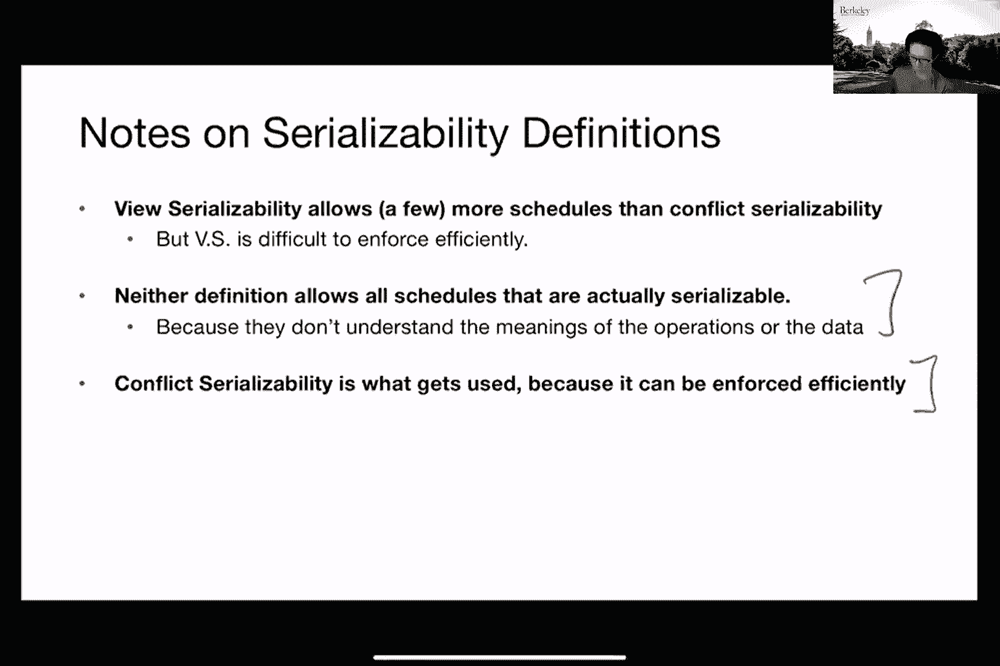
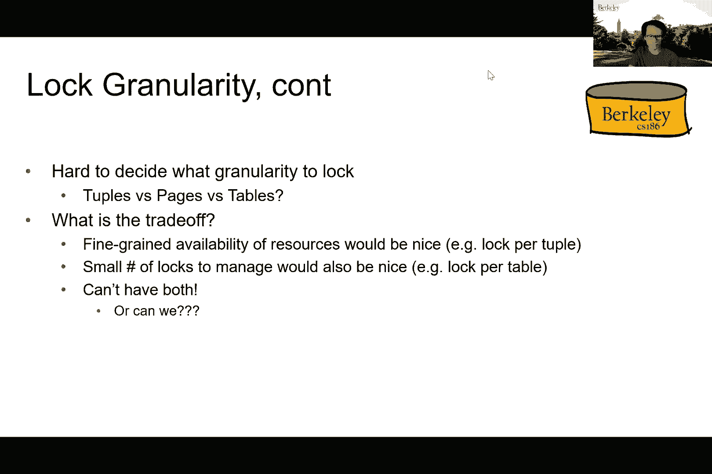

# P15：第15讲 事务与并发 II - ___main___ - BV1cL411t7Fz

好的，没问题。

是的，今天非常暖和。我不知道学习事务处理是否有帮助，但我们还是继续做吧。我们一直在讨论如何保证隔离性。当你有多个事务同时发往一个数据库系统时，我们在讨论如何保证这些事务不相互干扰。

我们在讨论如何确保这些事务执行时的一些正确性概念。如果你有多个事务同时执行，你如何交错这些操作，才能确保它们的正确性？

做一些合理的事情？稍微回顾一下，我们讨论了调度的概念。调度基本上是一个或多个事务对不同数据位的操作序列。所以它基本上包含了事务的开始（begin）、读取和写入不同对象的操作。这些对象可能是页面、日志、关系等，最后是提交或回滚。

提交（Commit）基本上是说我希望这个事务的效果被持久化。回滚（Abort）基本上是说，撤销这个事务的效果。我不再希望这个事务的变化反映到数据上。因此我们看了两种表示方式。一种是表格表示法，其中每一列对应一个独立的事务。

另一种是字符串表示法，其中你基本上按顺序列出所有操作。所以在这里，事务1读取A，事务1写入A，事务1再读取B，并写入B，依此类推。字符串表示法的约定是，我们只包括已提交的事务，省略开始（begin）和提交（commit）。

在这个字符串表示法中，正如我所说，我们需要一个起点来定义调度的正确性。因此，自然的起点是串行调度。串行调度基本上是说，你按顺序执行事务，每个事务从开始到结束，不会有任何干扰或交错。

而且来自其他事务的操作。这样基本上就实现了完全隔离。在这个波形图中，事务1的所有操作都在事务2的操作之前完成。所以这是一个串行调度。我们需要的第二个定义是等价性的概念。

因此，如果两个调度包含相同的事务集，并且每个事务内部的操作顺序相同，那么这两个调度被认为是等价的。也就是说，每个事务在做相同的事情，而且这两个调度将数据库的最终状态保持一致。所以，基本上你可以从以下的方式来理解。

这是相同的事务集。它是作用于数据库的相同操作集。每个事务都以相同的方式执行。它们有相同的操作集。然后这些事务的最终效果是相同的。这就是等效性的概念。一个调度被认为是可串行化的。所以这是我们定义的第一个正确性概念。

我们在这里讨论的一个调度被认为是可串行化的，如果它等价于某个串行调度。回想一下，串行调度意味着基本上是完全隔离的，D1在T2之前，T2在T3之前，或者这些事务的其他排列顺序。但基本上它是完全隔离的。所以在这个两个事务的例子中，一个调度。

即使S调度有事务间操作交错，它仍被认为是可串行化的。如果它等价于某个串行调度，例如T1在T2之前，或T2在T1之前。那么这就是可串行化的概念，这是我们想要在这里定义的正确性概念之一。

我们将定义其他正确性的概念，这些概念稍后会更容易检查。好了，接下来让我们对这个可串行化的概念有一些直观理解。所以，如果你有这个调度S1，它是一个串行调度——也就是说，事务1的所有操作都发生在事务2之前。在这个特殊情况下，T1正在将100美元从A转账到B。

T2正在对A和B都加上10%的利息。那么如果你有一个串行调度，其中T1在T2之后执行，最终的结果是A' = 1.1 × A - 100，B也是类似的。好的，这就是一个可能的串行调度。这里还有另一个串行调度，其中T2在T1之后执行。所以在这个特殊的情况下，T2的效果首先反映在你的数据上。

然后T1的效果被反映出来。所以你有A乘以1.1，B乘以1.1，然后发生A和B之间的转账。所以基本上，你从A中减去100并加到B中。所以这是一个不同的调度，但它依然可以理解，依然是隔离的，依然是正确的。

让我们讨论一下另一个不是串行调度的调度。这个不是串行调度。在这个调度中，T1在A上执行操作，将A减少100。然后T2对A值乘以1.1进行乘法操作。T1然后读取并写入B。所以基本上是把100加到B中，而T2把B乘以1.1。现在，在这里，这不是一个串行调度。

但它等同于第一个调度，其中事务T1的操作完全发生在事务T2的操作之前。希望你能说服自己，认为它与此等效，因为在这种情况下，A，你先从A中减去100，然后再乘以1.1。而B，你先加上100，然后再乘以1.1。

所以基本上就像是T1的操作发生在T2的操作之前。这样是可串行化的，尽管它本身并不可串行化。好吧，关于这个可串行化概念的挑战在于，它很难检查一个调度是否将数据库留下的最终状态与另一个调度的最终状态相同。所以我们需要一个更简单、更容易的等价性测试。

所以我们最终将使用一个更保守的测试。它没有假阳性。也就是说，它不会错误地判断某个调度是可串行化的，即使它实际上不可串行化。但是它有假阴性，意味着它有时会说，嘿，这个调度不可串行化，尽管它是可串行化的。

所以你基本上是在牺牲一些并发性，换取更容易的正确性检查。你仍然保证正确性，但你基本上是在说，嘿，有一些调度我将不接受。所以这基本上是更保守的做法。所以我们将要使用的这个测试，是一种不同的正确性概念。

使用冲突操作的概念。所以这些是成对的操作，可以是读写、写写，或写读操作。所以如果两个操作满足以下条件，它们会被认为是冲突的：它们来自不同的事务，操作的是同一个对象，并且至少有一个是写操作。所以基本上，这种冲突会在这两个事务之间引入基本的排序。

所以如果事务二读取了事务一写入的内容，那就是一个冲突。如果事务一和事务二都写入了相同的内容，并且事务一的写操作发生在事务二之前，那就是一个冲突，依此类推。这些都是冲突。所以非冲突操作的顺序。

对数据库的最终状态没有影响。原因是，如果我在写B，你在写A，那就没关系。但如果我们都在写同一个对象A，那就成问题了。或者如果我在写某个东西，而你在我写完后立即读取，那也是个问题。所以我们的关注点，主要集中在冲突操作的顺序上。

应该是非冲突操作，冲突的定义是这样的。所以我们有了冲突的概念之后，让我们定义冲突可串行化的概念。这是我们之前定义的可串行化概念的一种变体。所以如果两个调度是冲突等价的，那么它们就被认为是可串行化的。

如果它们涉及相同事务的相同行为，并且顺序相同——基本上，就是相同的一组事务，在每个事务内的相同行为——并且每一对冲突操作，都是按照相同的顺序排列的。所以每一个冲突都是按照相同的顺序排列的。所以如果事务一存在冲突的话。

如果事务一写了某个东西，而事务二读取了某个东西，并且在第一个调度中的顺序与第二个调度中的顺序相同，那么就必须保持一致。然后，利用这种冲突等价的概念，我们可以定义冲突可串行化的概念。

这实际上是我们之前定义的可串行化概念的扩展。如果一个调度 S 与某个串行调度是冲突等价的，那么它被认为是冲突可串行化的。而由于冲突可串行化是一个更为保守的属性，这意味着 S 也是可串行化的。所以冲突可串行化比可串行化更保守。这意味着 S 也是可串行化的。但这并不是一个完整的集合。实际上，有一些可串行化的调度是不可冲突串行化的。因此，冲突串行化会给我们带来假阴性。

当我们将它作为一个可串行化的测试时。正如我所说，它更为保守。这就是使用保守测试的代价，它错过了一些可串行化的调度，即使它们是可串行化的。这是我们愿意做出的权衡，因为强制执行冲突串行化性更便宜。

有一个与冲突串行化等价的概念，这个概念更容易处理，至少对我将要描述的例子是这样。所以这是这个概念：一个调度 S 被认为是冲突可串行化的，如果你可以通过简单地交换不同事务之间连续的非冲突操作，将 S 转换为一个串行调度。

所以考虑一下不同事务之间的非冲突操作的任何交换。如果你能得到一个串行调度，那么这也意味着 S 是冲突可串行化的。为了让这个定义在你脑海中更为具体一些，我们来看一个例子。这是我的操作顺序，这是事务一，事务二。

所以基本上，事务一，红色，a，路，a，然后事务二，红色，a，路，a。接着事务一，红色，b，路，b，依此类推。所以这就是这个例子。现在我将尝试进行交换。所以我尝试交换连续的非冲突操作，试图将其转换为串行调度。所以我要交换的第一个操作是 RB 和 WA。

所以这是一个交换操作。没问题，我可以交换这两个，因为它们位于不同的对象上，A 和 B。所以我可以交换它们，这不是一个冲突。好吧，我可以继续交换。现在我要交换这两个事务中的 WB 和 WA，它们仍然位于不同的对象上，所以我可以交换它们。然后我可以再次交换 RB 和 RA，它们也在不同的对象上。

然后我可以交换 WB 和 RA。所以现在通过所有这些交换，我基本上把这个调度转换成了这个调度。所以通过交换非冲突的操作，我成功地得到了一个串行调度。这意味着这个调度与这个串行调度是冲突等价的。好的。

因此它是冲突可串行化的。好的，现在让我们再看一个例子，讨论它是否是冲突可串行化的。好的，我有两个事务，T1 和 T2。我们认为它是冲突可串行化的吗？（沉默）不，为什么不呢？

因为A是相同的。是的，所以所有操作都发生在同一个对象A上。所以即使我实际上可以交换这两个操作，我可以交换这两个事务中的RA，但是我交换后就会遇到阻碍，对吧？我不能再移动这个RA了。所以即使我把这个RA移动到这里，比如RA，我也无法再继续交换。

因为我不能交换这两个操作的顺序。这两个操作是冲突的。我不能交换这两个操作的顺序，因为它们是冲突的。所以基本上我只能保留这个调度，不能将其转换为串行调度。好的。所以Alvin提出了一个重要观点。他说他的交换只是一个练习。

检查一个调度是否是冲突可串行化的，对吧？

所以这里我们在尝试测试某个调度是否等价于串行调度。好的。明白了。所以这个不是冲突可串行化的。所以你只能交换RA的顺序，不能做更多的交换。那么我们如何更一般地检查这个问题呢？

所以你是单独进行这些交换，这有点痛苦。那么，为什么呢？我们怎么检查某个事务是否是冲突可串行化的呢？

所以做这个的一个方法是使用这个冲突依赖图，对吧？

所以你基本上每个事务对应一个节点。比如这个例子中的TI和TJ。如果TI中的操作OI与TJ中的操作OJ冲突，并且OI在调度中出现在OJ之前，则TI和TJ之间就有一条边。不是辛普森的，但OI确实在调度中出现在OJ之前。好的。

基本上它说的是这是一个冲突，我不能将其交换到另一方向，对吧？

所以基本上说，这个方向上有一个依赖关系。好的。所以现在我们有了这个图的定理是：一个调度是冲突可串行化的，当且仅当这个依赖图是无环的，对吧？所以，这个，我让你们回家自己证明，但这里的框架是，这些边基本上表示。

就是某些操作之间的时间关系，或者某些事务之间的时间关系。如果你有一个循环出现在这个图中，这意味着你不能找到一个事务的排序，也无法确定一个串行调度，对吧？如果图是无环的。

基本上，你通过拓扑排序这些边。那张图会给你一个串行的调度，而那个串行调度就是你最终得到的结果。如果你单独进行这些交换，对吧？每一个从一个可能的拓扑排序得到许多这样的调度，但这些边决定了你能做什么。

和不能做什么的交换操作。因此，总的来说，定理基本上说：如果这个依赖图是无环的，那么它就是冲突可串行化的。好的，证明基本上是说，如果你有冲突的操作，它们会阻止我们将操作交换到一个串行调度中。

基本上只是对这个图进行拓扑排序。好的，下面我们通过一个例子来更清楚地说明。假设我在 T1 中有这两个操作，R A 和 W A。所以我还没有添加任何 T2 中的操作，但假设 T2 现在有 R A。

由于操作 R A 和 W A 之间存在冲突，本质上有一个时间顺序关系。也就是说 T2 必须在 T1 之后执行，因此你通过一条边来表示这个关系。好的，然后假设 T2 还有其他的写操作和读操作。比如它写 A 读 B 写 B，然后假设 T1 读 B。好的，这就是调度。由于你在最后有 RB，

这意味着 WB 和 RB 之间有冲突，WB 和 T2 之间也有冲突，以及 RB 和 T1 之间也有冲突。这意味着我需要基于 B 从 T2 到 T1 添加一条回边。好的，从这个点开始，给定……所以这个图显然有一个环。所以根据我们之前给出的定义，这不是冲突可串行化的。从直观上讲，

这也非常清楚为什么在这个特定的例子中你不能真正进行交换。也就是说，要么 T1 在 T2 之前执行，要么 T2 在 T1 之前执行。因为这些边，这些关系，基本上表示一个无法交换的冲突。其他的事情你也不能交换。

但是这些是阻塞，阻止你翻转调度，从而使你能够得到一个串行调度。好的，对于冲突可串行化的这个概念，有没有什么困惑？以及为什么图在确定一个调度是否是冲突可串行化时很有帮助？

Ian？哦，是的，只是为了澄清。所以本质上，对于每一对冲突，我们将有一条箭头，对吧？没错，没错。所以在两个事务之间会有多条箭头，指向不同的方向。只要你……

在每个方向上保留一条箭头是高效的。我明白了，谢谢。对了，Warren 还有其他问题吗？哦，是的，除了检查这个图是否有环，还有其他需要检查的吗？如果你试图确定冲突可串行化的话，那就没有了。还有其他形式的变体，你可能会想要……

可以使用更宽松的概念或更严格的概念。接下来我会讲解一个更严格的可串行化概念。还有其他问题吗？好的。这个是更严格的概念，但它的保守性较弱，属于一个较宽松的可串行化概念。所以它有更少的假阴性。对于这个概念，

这个概念叫做视图可串行化（view serializability）。之前的概念叫做冲突可串行化（conflict serializability）。所以这会有更少的假阴性（false negatives）。从保守性角度来看，它介于冲突可串行化和完全可串行化之间。对的。所以在这个概念中，两个调度 S1 和 S2 被认为是视图等价的。

如果基本上它要求你进行非常细致的记录，记录每个事务和每个对象的操作。好吧。于是，记录方式如下。它基本上说明了两个调度S1和S2是等效的。如果你进行的是相同的一组初始读取操作。所以如果T一在S1中读取了A的初始值。

然后T，我在S1中读取了A的初始值，然后T我在S2中也读取了A的初始值。好吧。所以他们做了相同的初始读取操作，然后做了相同的依赖性读取。好吧。所以如果T我在S1中读取了T J写的A的值，那么T我也在S2中读取了T J写的A的值。

所以基本上所有写入并随后被读取的操作，在两个调度中发生的方式是相同的。最后，作为这些操作结果的是什么是相同的。如果T我在S1中写入了A的最终值，那么T我也在S2中写入了A的最终值。

这是一种非常细致的记录方式，记录了哪些值被读取了，哪些是开始的？

那么谁读取了这些值，开始时？然后，如果某些东西被写入了，谁来读取这些？然后最后，谁在最后写入？好吧。这种细粒度的等效性概念如何发挥作用呢？

所以这个概念允许所有的冲突可序列化调度。因此，每一个冲突可序列化的调度也是视图可序列化的。它还允许所谓的盲写操作。因此，它比冲突可序列化的要求更宽松，因为它允许盲写操作的存在。

所以让我们举个例子来理解什么是盲写操作。假设我有这三个事务，T一，T二和T三。好吧。在T一中，你有读A（R a）然后写A（W a），T二只有写A（W a），T三也只有写A（W a）。好吧，再次强调，这只是一个字符串表示。你从左到右读取这个操作序列。

现在我们来看视图可序列化性。所以首先请注意，在冲突可序列化的情况下，这两者之间是有冲突的。因此，我不能交换这两个操作。我们使用可序列化性来说明，这两个调度是等效的，视图上等效的。与另一个调度等效，这个调度基本上把T一的所有操作都放在最前面。

然后是T二的操作和T三的操作。我们能够在视图可序列化的概念中交换这两个操作的原因是，这两个操作基本上是在写入一个A的值，而没有任何事务在读取它。对吧？它们是在写入一个A的值，而没有任何事务在读取它，最终只有T三的写入值才是有效的。

被写入的值。它基本上覆盖了T一和T二写入的值。所以T一和T二的写入顺序并不重要，因为它们都会被T三的写入操作覆盖。好吧，所以最终的写入操作才是决定性的。这样，盲写操作就是那些事务写入了值但没有被任何人读取的操作。

基本上它们可以被翻转。好吧。所以在这个概念中。这个可序列化性的概念基本上比冲突序列化要宽松，但你看，可序列化性的缺点是它。很难执行，你需要非常细致地记录是谁先读取了什么。

谁在阅读每个对象的哪个版本，这很难做到。所以，话虽如此，无论是哪个概念，你都会看到可序列化性不冲突。允许所有调度实际上是可序列化的，因为你不了解操作的意义。或者数据的意义。好吧。所以，可序列化性实际上谈论的是数据的最终状态，并在某种程度上对其进行编码。

操作的语义对于可序列化性和冲突序列化性并不要求你理解操作的意义。所以冲突序列化性是我们实际使用的，而 Alvin 会告诉我们如何使用冲突序列化性，那是因为它可以高效地强制执行。好吧。

有什么问题吗？好，看看，Alvin，接下来由你了。好的。所以在我们进入下一个片段之前，实际上在这之前，我觉得大家在问是不是。

是否可以休息一下。所以我们想要休息一分钟，可能是拉伸一下，喝点东西，然后我们可以回到下一部分。

所以，嗯，Alvin 也在征求 TikTok 视频的投稿，这样我们就可以播放在休息时间。是的，这其实是我最初发那条消息时的意思。所以，嗯，我其实没有什么正式的公告，你们可以继续，像，你知道的，做一些拉伸，除非像填写期中调查问卷。然后像，你知道的。

就像我说的，对吧？我们实际上是在寻找视频。所以，你知道的，在我去你们今天的讲座之前，我就想。我们实际上并没有收到很多这样的提交。所以如果你还没有做的话，像。你可以随意。你不一定非得自己做，知道吧？你知道的。

只要给我们发一些有趣的东西。如果你愿意的话，当然，如果你不介意与其他同学分享的话。你知道的，如果没人提交任何内容，是吧？那肯定会赢的。而他们什么也没有，是吧？所以，我们会盯着一块空白的屏幕看，像你知道的那样，大概两到三分钟，这会很尴尬。所以，嗯，拜托，意思是。

如果你们有任何东西，意思是，否则，像，你知道的，不然我也可以播放，像，我最喜欢的，像，猫咪视频，知道吧，独角兽，或者像，游泳的金鱼球。意思是，像，知道吧，这些可能都不有趣，是吧？

或者我们就会在Zoom窗口中互相盯着对方看，这很奇怪，对吧？所以，是的。我不会告诉你。所以，正如我所说，你不想知道我的账户是什么。别担心。如果你想分享，没关系，继续吧，我是说，你知道的。我欢迎你们都加我Facebook或TikTok，或者你可以找到它。我是说，你知道的。

这不是秘密。如果你知道的话，没关系。继续吧。你不需要提交视频。来吧，对吧？我的意思是，你刚才说过，如果你有什么想分享的，像是，你知道，否则下次我就开始播放高尔夫球员在游泳的画面，然后，你知道，我们会有一个非常安静和平和的休息时间。我可以播放一些做瑜伽的人。

我想。好吧，艾伦将要展示一些我现在不想点击的东西。我不知道那是什么。我不想做那个小小的横向切换。不是，我的意思是，我信任他。他是我们最优秀的老师之一。是的，反正，在我们继续之前，有没有关于讲座中DTS部分的问题？

所以接下来我要讲的内容，就是如何实现事务及其工作原理。也就是我们所说的项目四。正如你们所猜测的那样，实际上有许多不同的实现可用。它们往往具有不同的性能特征。

它们也面向不同类型的工作负载。然而，针对我们讲座的目的，我们将集中讨论一种叫做基于锁的实现。在我进入整个关于基于锁的实现的内容之前，我先抛出一些你们如果继续研究不同类型并发控制机制时可能会听到的流行术语。

比如说，你可能会听到有人谈论一种叫做多版本并发控制的方法。所以这里的直觉基本上是说，好的，我们就让每个人继续前进，好像他们都有自己的数据库副本一样。然后最终，当他们需要提交或需要中止时。

然后我们会检查是否存在冲突。你们大概已经猜到，在这种情况下冲突意味着什么了吧？就像是，你写了一些东西，另外一个人，另一个事务也在同时覆盖同样的内容，诸如此类。是的。

所以你可以想象基本上只有在你尝试提交事务时才进行检查。可是，除此之外，你就让每个人继续前进，好像什么都没发生。没有检查。没有锁定。例如，有时它会查找一些东西，比如叫做乐观并发控制（OCC）或时间银行的方法。

基于时间戳的并发控制也是如此。所以这些是你如果继续学习不同类型并发控制机制时可能会遇到的内容。但正如我所说，为了简化问题，我们只专注于基于锁的实现。

所以，嗯，如果你没明白我刚才说的内容，不用担心。那些只是为了引起你的兴趣。首先，我们来讨论一下，嗯，我所说的锁是什么意思。其实锁有很多种概念。你知道，这不是161课程。对吧。所以我们不会讨论像，嗯，类似的内容。

比如安全性方面，这里没有对手存在，对吧。所以，嗯，别担心。如果你在担心这个问题，你是安全的。然而，我们所谈论的是锁的概念，或者是独占锁。就是我心中的那种。所以像信号量，或者说基本的独占区域。是的。

代码的独占段，只有一个线程，或者说一个控制流能在某一时刻执行。所以你可能会在61 C中遇到这些。希望这是你可能会记得的内容。基本上，这些都是同步原语。对吧。所以我们基本上会在我们希望独占访问的代码片段周围加锁。

所以这些就是我们在本课程中讨论的锁的类型。大家都很熟悉锁这个概念，或者说我们在本课程中提到的同步原语。希望这能勾起你们一些愉快的记忆，回想起61 C课程的内容。然后马上就有人说，我死定了。好吧，对不起。好吧，继续。

但就本课程而言，你需要记住，就像在61 C课程中一样，这些锁原语实际上并不是免费的。对吧。所以我们需要有，嗯，运行CPU，像这样，它们都会消耗你的一些周期。所以这些并不是像你想象的那样是免费的操作。所以请记住这一点。而在本课程中，对于数据库课程来说。

我们将遵循一个非常简单的约定。所以这就是你需要知道的关于锁的一切。例如。我们假设每个数据元素都有一个唯一的锁。每个事务必须首先获取该锁，才能读或写该特定元素。如果一个锁已经被其他事务占用，那么，嗯，你只能等待。

然后在我们完成操作后，我们总是在某个时刻释放锁。所以这是我们在本课程中遵循的基本原则。接下来，你们会在本讲座中看到不同类型的锁定协议或方案。有时候你会听到人们谈论这些。

它们的不同之处基本上是在什么时候锁定或解锁这些数据元素。它们能够实际锁定的内容以及当某个人在等待锁时发生了什么。我一直在努力解释在这种情况下数据元素是什么。所以，事实证明，它在不同的供应商之间有所不同。例如。

你可以认为这里的数据元素是整个数据库。我的意思是，你可能会觉得这很傻，对吧？因为如果你锁定整个数据库，那么当然，你基本上就保证了没有其他事务能够并行运行。因此，从定义上讲，它保证了可串行化性。事实上，这时它变成了一个严肃的调度问题。

对的。在任何时刻，只能有一个事务正在进行。而这个事务必须完全结束，另一个事务才能开始。所以，当然，我们会像这样保持事务的完整性。你可能会觉得这个例子很傻，没人会真正实现这种方式。但信不信由你，像 SQL 这样的系统在运行事务时有锁定整个数据库的概念。

这是什么意思呢？这意味着，如果你关心并发事务在你的应用程序或首次启动时的执行，举个例子，不要使用类似 SQL 的数据库，因为 SQL 假设每次当某个事务开始时，整个数据库都会被锁定。

所以，祝你好运。还有一些数据库实现，它们只锁定单独的记录。对吧？这就更合理了，正如你所想的那样。所有的商业实现都这么做。稍后我们将看到关于为何选择这种方式而非另一种方式的不同权衡。我们还可以探讨是否能将这两种方式结合使用，例如，好的。

所以在本课程中，正如我之前所说的，对于我们能够获取和释放的每一个锁，我们将使用这个符号表示。下划线部分，指的是事务 I，然后是 L 或者 U。

所以，实际上就是这样。首先，这是一个非串行化的调度。为什么这是一个非串行化的调度呢？提醒一下自己，时间是向下流动的。好了，这里我们有 T1 尝试读取 A，你可以把 A 想象成一个记录。比如说，一个单一的元组，然后它尝试读取 A 并进行写入，接着是 T2 的一些操作，最后再回到 T1。

对的，在这种情况下，我们正在写入 A，然后 T2 基本上会读取由 T1 写入的值。接着，T2 会写入 B，而 B 随后会被 T1 读取。对此，我挑战你一种方法，可以交换操作顺序，使其变成串行调度。

这没有办法，对吧，因为我们陷入了一个循环中，对吧。因为 T1 和 T2 依赖于 T1 对 A 的值，T1 又依赖于 T2 对 B 的值。所以我们有点卡住了。所以这是一个不可串行化的调度。现在，如果我想把这个调度改为可串行化的调度，一种做法是，我之前说过的，对吧。

通过引入锁。所以在这种情况下，我会先获取锁。在读取 A 之前，我会先获取 A 的锁。然后在我读取之后释放它。接着，我会获取 B 的锁，对吧。就像你的案例一样，当你是 T1 时，先进行第一个事务。所以同样的道理。同样适用于 T2。所以 T2 会首先获取 A 的锁，然后再读取它，以此类推。然后，当它试图获取 B 的锁时，它会被阻塞。对吧，因为 T1 当前持有 B 的锁。所以 T2 必须等待。

由于 T2 无法继续执行，我们实际上可以切换回 T1。所以在这种情况下，T1 会完成它对 B 的操作，然后解锁。之后 T2 就可以获取锁并继续它对 B 的操作。Kyle，你有问题吗？是的，为什么 T1 会锁定 B？嗯。

因为 T1 知道它稍后会对 B 进行写操作，对吧。所以我可以强制这个调度变得可串行化，意思是知道 T1 和 T2 将要做的事，基本上就是插入这些锁语句。因此，实际上，这个过程的目的是向你展示，使用锁的方式，对吧。

所以我们现在已经确保了一个冲突可串行化的调度。我是说，你可以在之后做这件事，对吧。因为有了这个特定的调度，你现在可以进行我之前告诉你们的交换操作，使这个调度变成一个冲突可串行化的调度。我明白了。这样说有道理吗？是的，谢谢。好的，太好了。还有其他问题吗？所以，嗯。

我有一个问题。T2 试图获取 B 的锁，但被阻塞了，然后 T1 释放了锁。它会在解锁后自动获取锁吗？还是必须重新请求锁才能获得它？这会被授予吗？你需要读取吗？不，没错，没错。所以你可以这样理解。

是的，不，没错。所以基本上你可以把 T2 想象成，发生了什么呢？

为什么它被锁定了？对吧。所以你可以把它看作是基本上在不断旋转。所以你可以把它看作是一个来自 61C 的调用，对吧。你可以实现这个锁的一种方式是基本上有一个 while 循环，不断地什么都不做，仅仅检查。然而，在你能够实际跳出它之前，它并不那么可用。好的，谢谢。那么在这种情况下呢？

这基本上意味着，我们可以跳出循环，因为我们终于获得了锁。好吧。是的，到目前为止，一切还好，对吧？嗯，关于选择什么时候锁定资源以及如何拆分调度有个问题，因为在当前的设置中，确实有效，像是L B被事务1锁定。

但几乎看起来，如果有一个像T3那样的事务，它首先执行一些操作，可能在T1操作A的时候，它就开始使用B。我猜，像是。看起来你选择开始加锁的时机似乎有些随意。是的，完全正确。所以在这种情况下，我实际上决定让你首先抓取B的锁。

对，实际上，这为下一张幻灯片做了一个非常好的引入，对吧？所以我们到了这儿。我们已经有了它。所以在这种情况下，我的意思是，关于锁和解锁的部分，我并没有改变任何内容。所以我们依然在抓取锁，例如，对吧？所以在这种情况下，注意到我在锁定A之后，紧接着抓取了B的锁，对吧？所以在这里。

如果你看一下，像T1的调度是完全一样的。好吧，我在尝试在解锁A之后抓取B的锁，对吧？唯一的不同是，我现在允许T2先去抓取B的锁，而不是T1。对吧？就像在61C中一样，我们无法判断哪个事务会先抓到锁。

然后如果它们都在同时尝试抓取锁，那么就有些难以预测，哪个会先赢。所以下一张幻灯片中，我说，好的，让T1先赢，然后看看会发生什么。结果发现，我们现在有了一个可串行化的调度。

那么问题是，如果我让你先拿到锁，你知道，B上的锁会发生什么呢？也是同样的事情。其实这是一个问题。可能是修辞性的。不是的，对吧？因为现在我们回到了第一步，在这种情况下，你知道，我们现在。再次有了依赖关系。所以T2将读取T1刚刚为A写入的值。

然后它将写入自己版本的B，之后T1会读取它。所以我们再次陷入了最初的循环中。所以基本上看起来，你使用的锁并没有强制执行冲突可串行化的规则，对吧？当然，在这一点上，我知道该如何测试了。那么现在该怎么办呢？

基本上，这意味着仅仅使用锁本身并不够。正如我之前所说的那样，我们来试着强制实施第一种锁定方案或协议。在这种情况下，它被称为牙膏锁定方案，或者称为两阶段锁定（2PL）协议。它基本上要求每个事务在试图解锁任何东西之前，必须抓取所有的锁定请求。

再次强调，我们仍然使用锁，就像之前一样，唯一不同的是，我们在玩弄的是什么时候应用锁，什么时候释放锁。这就是为什么在本讲座的第一行我会说，所有这些不同的锁定协议。

团队们，他们唯一不同的地方就是抓取哪些锁，以及抓取的时机。对吧，同样，释放锁的时机也如此。让我们看看这个操作。现在我强制要求这两个事务必须先获取锁，才能释放任何东西。所以请注意，在这种情况下，我现在已经抓取了A和B的两个锁。

在我实际上释放任何东西之前。对。所以同样，对于T2来说，T2在这种情况下是在释放任何东西之前先获取所有的锁。好的，按部就班地进行，或者说按照程序执行。现在你可以看到，这个调度现在是冲突可串行化的，基本上回归到了我们之前提到的良好情况。

在这种情况下，我认为无论你知道两个事务尝试获取相同的锁时，如何进行调整并不重要。对吧，举个例子来看。T1在这种情况下是好的。它将首先获取两个锁，作为前两个语句。因此，只有在它确实获得了A和B两个锁后，它才能继续执行接下来的操作。

对。所以在这种情况下，我认为不可能在此之前让你进入并离开。你知道的，要使得这个调度成为无冲突可串行化的。因此，我将证明使用这种两阶段锁定机制将始终确保冲突可串行化。我们如何证明这一点呢？我们将通过反证法来证明。所以假设它没有实现。

好的，正如你从今年的讲座中记得的那样。这基本上意味着我们在依赖图中有一个循环。所以我们所说的依赖图是这样的：如果两个事务之间有依赖关系，依赖关系上会有一条边。你知道的，可能是读取-写入依赖或写入-写入依赖。

所以这是一个循环。你看，在屏幕上看到了这个循环。而且，它肯定不能确保冲突可串行化。对吧？我们来看看为什么这个情况不可能存在，我们试图通过矛盾证明这一点。所以我将通过向你展示时间中存在一个循环来证明这一点。

如果我们跟随这个依赖图。让我们一步一步地进行分析。首先，我要声明，事务1将在事务2能够抓取A上的锁之前释放A上的锁。为什么？因为事务1必须在事务2或其他事务能够抓取该数据元素上的锁之前释放它。对吧？

所以从时间上来说，A上的解锁事件必须发生在事务2锁定A之前。明白了吗？好的，没问题。请注意，我选择A是因为我们在这里有这个依赖关系，这个依赖关系基本上意味着事务1和事务2之间有依赖。

所以在这种情况下，我基本上是在说A上存在一个依赖关系。这意味着事务2不能在事务1释放A上的锁之前抓取A上的锁。所以让我们继续跟踪这个过程。所以现在我说事务2必须在能够释放B上的锁之前抓取A上的锁。为什么会是这种情况呢？我给你个提示，大家可以想想。

你必须确保所有的锁都在你自己锁之前释放。是的。所以根据2PL（两阶段锁协议），我们必须等待，按照2PL的规则，我们不能释放任何锁，直到我们已经抓取了所有锁。A和B是不同的数据元素，没问题。但在这种情况下，由于锁的操作...

锁必须按顺序进行操作，锁的释放也必须按顺序进行。所以在这种情况下，这是我能从一个事务或视图中做的唯一事情。因此，随着时间的推移，我们在这里建立了这种关系。所以我现在可以继续查看这里的边缘。那么，这些边缘集是什么呢？

这些边缘在说什么呢？你知道，跟之前一样。它基本上会说事务2不能释放B上的锁。事务2必须在能够抓取B上的锁之前，先释放B上的锁。出于同样的原因，我认为我们之前已经解释过这个问题。

所以你可以继续推理，不管你信不信，你最终会进入一个循环。结果发现，事务1必须在实际释放A上的锁之前解锁A。这就意味着时间上存在一个循环。所以这基本上是一个矛盾，因为同一个事件不能先于它自己发生。

很酷，对吧。那么现在我们已经通过反证法证明了这一点，这基本上意味着使用2PL确实可以确保冲突可串行化。到目前为止有什么问题吗？L1在哪里，我并没有在这里画出调度图，也没有画出事务内部的各个操作。

但是你可以想象，对吧，因为我们在依赖图中有一个从事务一到事务二的边。所以如果你回想一下DTS的讲座，这基本上意味着T1必须在执行过程中某个时刻获得对A的锁。哦，好吧，所以我们已经做完了，对吧，显然还没有完成，这意味着我们还得继续。现在我们有另一个问题需要解决，这个问题被称为不可恢复调度。

我什么意思呢？好吧，所有在这里这段代码之前的内容，抱歉，所有在这行之前的内容和之前的完全相同。唯一的区别是这个调度和之前的调度之间的差异是否有事务决定提交或者回滚，也就是所谓的“中止”。顺便说一下，这个问题也被称为级联中止。为什么这是个问题？

结果证明事务一最终决定中止。所以这意味着我们需要恢复事务一所做的一切，尤其是写入到不同元素的操作。所以在这种情况下，注意到事务一基本上写入了A和B两个元素。所以我们需要撤销它对A和B的影响。然而。

比如说你的事务二实际上决定提交。而在这种情况下，最糟糕的情况是，它不幸读取了事务一之前写入的B值。那很糟糕，对吧，因为现在事务二读取了一个脏数据，而这个数据本该被回滚。然后它也决定提交了，对吧。所以这不好。

现在事务二再也无法撤销了，因为事务一写入的值已经被事务二读取了，所以这不好。而且问题又出现了。到目前为止有问题吗？

这被称为级联中止，因为我们基本上试图弄清楚如何同时回滚事务一和事务二。在这种情况下，我们需要回滚这两个事务，因为这是保持数据库状态一致性的唯一合理方式。

好吧，因为T1决定回滚自己，所以T2已经读取了T1的值，因此我们唯一能做的事情就是禁止T2提交。所以解决这个问题的一种方法是，现在我们需要完善我们的2PL规则。所以不仅要像之前一样，只能在获得所有锁之后才能释放任何锁。

我们现在还必须确保所有的解锁操作发生在我们决定提交或中止之后。所以在我们决定提交或中止之前不能释放任何资源。否则，其他的一切都和之前一样。然后我声称，通过严格的调度，我们现在得到的调度既是冲突可串行化的，又是可恢复的。

你可以看到这个操作了，对吧？所以现在你可以看到，在我决定回滚或提交之前，我不会释放任何锁。因此，现在在这种情况下，由于我们已经处理了 T1 的中止，当我们实际授予 T2 对 a 的锁时，T1 的回滚已经完成。

所以这样我们就安全了。因此，T2 不会读取 T1 之前的脏数据。我会这么做。明白了吗？那么这是否确保了一个事务的所有操作在下一个事务之前完成？当你锁定一个事务时，就像这样，因为事务 1 持有 a 和 b 的锁，所以事务 1 的所有操作都会在事务 2 之前完成。是的。好的，这是个好问题。是的。也是“概念 1”想问的问题。

正是如此。所以现在我们正在逐渐减少我们可以并发执行的数量，因为现在看来，这实际上就像是一个串行调度了。好吧，事情不必看起来这么糟糕。假设如果你有另一个事务，它既不触及 a 也不触及 b，那它可以像其他任何并发事务一样继续执行。

所以我们并没有完全消除所有并发性，但由于我们希望事务是可恢复的，我们在某种程度上是退后了一步。好的。好的，实际上，大多数基于锁的数据库系统只使用严格的调度，因为它们希望确保事务是可恢复的，同时也是冲突可串行化的。

而且实际上它相当容易实现，方法是我们只需在尝试读取任何单一元素之前插入所有的锁定语句。例如，然后我们只需要确保在事务决定提交或中止之前，我们不会释放任何锁。

然后通过这样做，我们可以确认这两个问题已经解决了。我们还完成了吗？当然，答案是否定的。我是说，我们还有 25 分钟，所以肯定还有其他问题。那么，是的，当然还有其他问题。我不知道是否有人告诉过你，我是说，事务或者并发控制总是一个需要用血与泪书写的故事，或者我不知道，可能是血与汗，或者其他任何这些糟糕的事。

所以不幸的是，这个故事是相当悲观的。哦，好吧，接下来是什么问题？看一下这个调度表，我们有一个事务试图读取 a 然后写入 b，然后我们有第二个事务试图读取 b 然后写入 a。

好的，所以我们直接讲到死锁问题，T1 会先获取 a 的锁，然后它会等待获取 b 的锁。例如，它正在尝试获取 b 的锁。然后 T2 会首先尝试获取 b 的锁，然后它现在必须等待，因为 T1 持有着 a 的锁。好的，这就是所谓的死锁，对吧？所以你们可能都记得在 61C 课程中我们讨论过这个问题，嗯，我们需要避免死锁，当然，现在猫又出现了。

你们在这节课上会看到很多猫，正如我告诉你们的，这是一个非常悲观的画面。好的，现在回想一下，如果你们正在上 162 这门课的话，这其实并不是一个新问题，甚至在操作系统中也会遇到同样的问题，基本上就是一样的。

或者是并发控制机制。操作系统中的标准技术，例如在 162 课程中，是进行排序。强制执行一个排序，规定比如屏幕总是先获取锁，其次是其他设备。例如，为什么这对事务或数据库来说是一个问题呢？嗯，

我们要强制什么样的顺序呢？我的意思是，我们有两个池，两个表，这并不是像唯一的设备一样存在，那么我们该如何强制顺序呢？希望你们还记得，比如在 61C 中，你们是如何在软性问题中强制顺序的。

因为如果我们有顺序，那就意味着我们总是能在发生冲突时解决优先级问题，对吧？例如，如果两个事务都尝试同时获取同一个锁，我们就可以通过顺序来打破平局。所以，如果我们能够强制为事务设定顺序，那就没有问题了。但很难想象我们要强制执行什么样的顺序，因为人们不断提出新的工具，而我们无法预见人们会尝试创建什么样的表。所以，在处理死锁时，我们可以采取几种方法。

第一个方法就是避免死锁。如果我们能完全避免死锁，那我们就不会从一开始就遇到这个问题。如果我们不能避免，那么接下来我们要讨论的就是如何检测死锁。然后，如何在检测到死锁后进行处理，对吧？所以接下来我将讨论的就是避免死锁的问题。

我们可以避免锁的方式之一是完全避免锁的使用，就像在操作系统中的设备案例一样。所以我可以基于事务的“年龄”强制规定一个顺序。显然，我在这里说的“年龄”是什么意思，基本上就是说你知道事务执行了多长时间。所以现在拿时间，然后减去事务第一次尝试执行的时间。

然后，我就把那个称作事务的“年龄”。一种策略，或称为“等待策略”，基本上就是说，如果我有更高的优先级，这里是基于年龄的对吧。那么它就会等另一个事务完成。然后如果我实际上拥有的优先级比T或者J低，它就会中止。

另一种策略叫做“单一等待”，基本上是按另一种方式来做。如果我有更高的优先级，那么另一个事务J会自我中止，然后让I继续。否则，它就会等一下。所以你可能觉得这有点抽象，那么我们就用一个例子来说明一下，然后我会做一些可能有点臭的事情。

我们习惯了使用派对的例子。假设我们有两个人对吧，年龄，让我们用人类来举例。你有一个年长者在等着使用卫生间，而另外一个年轻人正好在卫生间里。

所以现在第一个策略说，如果年长者试图在其他人已经在卫生间时使用卫生间，对吧，那么我们可以等一下。对，这就是第一个策略的意思，等一下，死掉对吧。所以如果我有更高的优先级，它就会等一下。基本上这意味着年长者会等年轻者。

如果没有的话，它就会自杀，对吧，所以这就是“死”的部分，你看这里像是在等待环路中。然后是另外一种策略，对吧，所以一个权重基本上会说，如果我是年长者，我会基本上杀死年轻者，对吧，现在在卫生间里，然后你知道，我就可以接管。这就是其中一部分。如果是反过来的话，那我就等一下，好吗？

所以你可能会问，为什么这是避免那个死锁的？为什么这是防止死锁发生？要理解为什么，你可以问一个问题，之前的图像有什么共同点。我会把它放回到这个侧面，对，这一页。所以注意到，在第一张图片的前面，对吧。

所以注意到年长的事务会等年轻的事务，但反过来就不是。这样我们就避免了这种情况，或者说就是所谓的“年长者总是胜利”。所以年轻的事务会自杀，而不是像等待年长事务那样。所以我们这里不会发生死锁，因为永远只有年长的事务会等。

不是相反的情况。所以我们打破了平局。因此，你知道的，这样就不会形成循环。请注意锁定。然后我们遵循第二个规则。情况是相反的，永远是较新的交易会等待。较老的交易不会等待，因为它会立即通过胜利终止较新的交易。

所以因此我们也要避免那个情况。这样说有道理吗？换句话说，我们只是会使用这个年龄机制对交易进行排序，通过这样做来避免我们想要防止的循环。

所以，重要的是我们要知道，如果一个交易被其中一个机制终止了，它必须获得原始的时间戳。如果没有，那么就不公平了。举个例子，你可以回顾一下之前的某个方案。

是的，所以我们假设使用第一个规则的协议，然后如果一个交易失败，那么它基本上会重新排队并尝试再次执行。如果它获得了新的时间戳，那么它仍然会在外面等待，等待一个更老的交易完成，对吧。

然后这就是因为它比旧交易年轻，最终会自己终止。所以基本上这意味着新的交易永远不会被执行，而这是不好的，对吧。所以我们不仅要避免那个情况，我们还要确保有进展，对吧，这是你现在经常听到的，尤其是在我们处于选举阶段的时候，对吧。

所以我们想要确保有进展。我们要确保这些交易最终会被执行。但是，如果我们一直得到新的时间戳，那么按照第一个规则，新交易永远不会执行，这样就不好了。

所以唯一的解决办法就是确保我们得到原始的时间戳。所以，当旧交易最终完成时，就像你知道的那样，我们会在那时执行它。同时请注意，我只是使用这个“年龄”机制作为强制排序的一种方式，这并不是唯一的方法，你也可以使用其他机制。例如，已经消耗了多少资源，比如内存，已经获取了多少锁等等，这些都可以作为实现排序的机制。

我的意思是，我们所要做的就是对所有这些不同的交易强加一个任意的顺序，并确保这个顺序中没有循环。这样我们就可以用它来打破死锁的情况。目前对此有任何问题吗？

我为这个有点臭的例子道歉，但我认为这可能是一些人容易理解的例子。好的，如果没有的话，我接下来想谈谈死锁检测。好的。所以，如果我们不能一开始就避免死锁，或者如果你不想应用我们之前讨论的任何机制。我们可以尝试让每个事务都执行，然后像你知道的那样，当死锁真的发生时去检测它。

那么，怎么做呢？结果我们可以创建一个等待图。类似于我之前提到的依赖图，然后我们基本上检查这个图中是否有循环。如果有循环，这基本上意味着我们遇到了死锁。这个是怎么工作的呢？

所以这里涉及到事务。你知道的，正如之前提到的，时间是横向流动的。首先事务一尝试读取 A，然后它尝试读取这些不同的数据元素。到目前为止一切顺利。我们没有遇到任何死锁。

然后事务二尝试写入 B，接着事务一尝试读取它。就像在依赖图中一样，我们基本上会在 T 一和 T 二之间插入一条箭头。接下来发现 T 一现在正在等待 T 二的锁，因为 T 二正在写入 B。然后继续进行，现在 T 三尝试读取 D。这个是可以的。

因为像你知道的，没有人曾经写入 B。即使 T 一早些时候读取过它，这也不是问题。而且，像你知道的，C 也没有问题，但现在 T 二在 T 三读取 C 后尝试写入 C。所以在这一点上，我们也插入一条箭头，连接 T 二和 T 三。

因为 T 二现在正在等待 T 三释放它所持有的锁。然后，你知道的，接下来 T 四试图在 T 一读取后以及 T 二也已写入的情况下写入 B。现在 T 四也有一个依赖关系到 T 二，因为它也在等待 T 二当前持有的锁，只有等 T 二释放后才能继续。所以现在，如果 T 三尝试写入 A，我们就会遇到一个死锁循环。

因为 T 三正在等待 T 一持有的锁，即 A 上的锁。然后，递归地，T 三等待 T 一，T 一等待 T 二，T 二等待 T 三，T 三也在等待 T 一。

所以因为存在一个循环，现在就有了死锁。明白吗？基本上意味着它们都无法继续进展，每个人都在持有其他人的锁。没有人能够取得进展，即使 T 三依然在进行，T 四也仍然在执行。

T4仍然可以像之前一样继续执行，对吧？没有什么实际的变化。那么现在，由于T1到T3之间发生了死锁，我们基本上需要弄清楚如何打破这个锁，如何打破死锁。解决这个问题的方法就是周期性地运行死锁检测机制，通过检测循环来识别死锁。

然后，当检测到一个循环时，就像你知道的那样，选择其中一个事务来终止它。然后你实际上能检测到这一点。是的，所以基本上我们需要终止循环中的一个事务来打破它。然后我们让所有人继续执行，就像你知道的，我们终止并尝试重新执行。作为一个经验事实，大多数这些死锁通常是比较小的。

所以这并不像你知道的那样涉及到一百万个事务，通常只涉及到几个事务。而且即使我们所有的操作都做得很完美，意味着我们杀死所有相关的事务，情况也不会太糟，对吧？因为我们不会把大量事务重新添加回队列。到目前为止有关于这一点的任何问题吗？很好，所以我们现在已经讨论了如何避免死锁。

如果我们无法避免死锁，无论出于什么原因，我们现在有一种方法可以检测到它。而且我们也有方法来处理它，对吧？如果我们确实检测到死锁。现在你可能会问，是否能做得更好？比如说，我们是否可以避免进入死锁的情况呢？

如果每个人都只是试图读取数据，那么即使它形成了一个循环也是可以的。对吧？即使每个人可能实际上都在等待其他人的锁，实际上也是可以的，因为当每个人只是试图读取数据时，并没有真正的冲突，对吧？

那么我们如何实际实现这个机制呢？有没有一种方法可以实现这个直觉呢？结果证明是有的，我们可以使用不同的锁模式。到目前为止，我们一直在讨论一个单一的锁，对吧？比如你要么获取它，然后没有其他人可以访问它，这是我们在61C中学到的原则。那么这里有另一种实现锁的方法，我们仍然有这种排他性访问的概念，你想要获取某个资源。

但是我们有不同的级别。我们有一个级别可以让多个事务共享锁。例如，如果它们只是读取数据元素。那么我们还有另一个级别，叫做排他性锁，意味着在任何时候，只有一个事务可以持有该特定锁。为什么我们要这么做？嗯，我们这么做是因为我们希望允许那些只做读取操作的事务继续执行，而不需要处理所有这些死锁、检测或唤醒之类的问题。

如果每个人都在读取，那么你仍然可以继续进行严格的“出局”操作，我们仍然能够正确地实现并发。我们不需要终止事务，因为我们不会遇到锁的问题。这会非常好，因为我们仍然可以在并发控制下运行，并获得并发带来的好处。

即使我们仍然在玩严格的“出局”游戏。但是现在因为我们有不同类型的锁，所以我们需要确保有一种方式来区分什么时候事务能够获取每种类型的锁。所以为此，人们使用了一个被称为“锁兼容性矩阵”的工具。你可以看到这里有一个例子，所以我们有这个矩阵。

然后这里的每个条目基本上会有一个勾号或者叉号。阅读的方法是基本上查看左侧和顶部的两个条目。所以如果事务一没有在某个特定数据元素上持有任何锁，另一个事务出现并且可以照常继续进行。什么都不会发生。

如果一个事务已经在某个特定数据元素上获得了共享锁，且一个新的事务出现并且也试图获取共享锁，那是可以的。因为在这种情况下，共享锁意味着只是尝试读取对吧？因此，这符合我们的直觉，我们希望读取操作像以前一样继续进行。

它们可以像其他事务一样并行进行，就像其他事务一样，*没有阻塞*。不需要检查很多其他内容。然而，如果一个新的事务出现并试图写入一个正在被之前事务读取的数据元素，那么我们不会允许这种情况发生。换句话说。

如果一个事务已经持有一个共享锁，那么如果一个新的事务出现并尝试在同一个数据元素上获取一个独占锁，它们将不会被允许。对吧？因为否则我们就违反了我们之前的承诺，最终会进入我们之前尽力避免的那些糟糕情况。

你可以推理出其他情况，当然，这也意味着如果一个事务已经拥有独占锁，我们不能允许另一个事务也拥有相同的独占锁。好的，所以这是一个问题。我想在聊天中有一个问题，能不能有人重复一下我没听明白？是的，基本上问题是为什么我们不总是让读取操作先于写入操作？因为像在B+树中我们曾经有过这种设计。

我们必须先读取页面的修改内容，然后再写回去。对。所以，你总是可以保证先读取再写入吗？如果你能将事务操作的顺序安排得恰如其分，那当然很好。事实上，有些数据库系统要求必须在读取完所需的所有数据之后，才能写入任何内容。

但你总是可以保证这种情况对吧？例如，我可能需要先读取某些内容，然后才能决定写入什么内容。之后，在写入后，我可能需要再次读取从它派生出来的其他内容。所以这是一个，我需要先读取总学生人数，然后写入一个记录，表示总人数。然后，我可能还需要再读取它作为同一事务的一部分，并做其他事情。

所以你总是可以保证这种情况吗？如果这是事实，那当然很好，但并非总是如此。所以阿尔文，我觉得大家对于读取和写入的理解，以及事务在逻辑层面的作用，还有缓冲区管理器层面上读取和写入的含义，可能也存在一些混淆。

哦，明白了。所以，记住我们在讨论的这个例子是数据元素。所以我故意在这里保持模糊，因为稍后我们会谈到不同级别的日志。现在，作为本节讲座的目的，你可以将每个锁视为单个数据元素。

如果有一页我们已经读取到主存中，并且它包含了比如说100个不同的条目，那么这就意味着我们有100个不同的锁，每个锁分别用于两个相关的条目。这是问题还是困惑所在吗？我更困惑的是……

我想应该是在几张幻灯片之前，当时你在幻灯片上列出了四个事务，其中事务一是读取D和B，但事务二在没有读取任何数据的情况下就写入了B，再写另一个。我只是想知道这样做是否可能，因为我原本以为读取是访问数据的方式，而写入是修改数据的方式。

所以，我不确定这是不是你故意没有提到的，或者是否实际上可以做到没有数据的情况下就写入。嗯，你可以在写入之前就进行操作。例如，我想把每个人的名字都改掉。对吧？在这种情况下，我们不需要等待什么，只要直接写入所有记录就行了。

所以，没问题。对，好的，这是戴夫解释的内容，然后是的，明白了，谢谢。好，现在让我们讨论一下数据库系统内部是如何实际工作的。我们已经提到过锁的概念，对吧？那么，谁来管理这些锁呢？我们需要有人来管理它们。

结果证明，在数据库系统中有一个叫做锁管理器的东西来处理这些问题。正如你所猜到的，它的工作基本上就是处理所有的锁获取和释放。好的，在内部，它可能会维护一个哈希表，然后持续跟踪正在被锁定的对象。所以，如果我们谈论的是Google级别的锁，那基本上每个锁在每个级别上都会有一个条目。

然后，它会跟踪谁当前持有这些锁。它有一个授予集，基本上是指哪些事务当前持有这些锁。它还会记录锁模式，以防有多级锁的情况，就像我之前提到的那样。并且它还会维护一个等待队列，列出不同的事务正在等待该锁。这里是一个示例。

所以我们有两个不同的锁，A和B。它们可以是单一的，也可以是独立的。例如，我们可以看到T1和T2已经对A加了锁，因为它是共享锁。然后我们有一条其他事务的队列在等待它，分别是T3和T4。它们正在尝试获取A的独占锁。

这肯定只是其中的一种设计方式，像你可以想象的不同设计方式一样。但它的工作原理是，当锁请求到达时，我们基本上会查阅这个表格，然后决定是否授予它。

基本上，这取决于之前我跟你们讲的兼容性原则。所以如果我们可以授予这个锁，我们就会将这个事务加入到授予集。如果不能，我们就会把它放入队列中。如果一个事务尝试升级锁类型，例如：

如果它已经有了共享锁，现在决定获取独占锁，因为它将写入相同的数据元素。那么我们就会使用相同的机制，查阅这个表格，看看是否可以授予这个锁，如果可以，就把锁模式升级为独占锁。我的时间只剩两分钟了，我想简要谈一下锁粒度的概念，下次我们会继续讲这个内容。

早些时候我提到过关于不同类型的锁，比如三重锁的概念。但是你可以想象，这样做有点浪费，对吧？比如说，如果我实际上在执行一个查询，查询内容是“下一个停靠点”。假设我有一百万个人。如果我需要为这其中的每一个人获取锁，那将会非常昂贵，对吧？正如我之前所说，这些锁的获取和释放并不是免费的。

它们会产生 CPU 开销。所以如果我必须获取 100 万个独立的锁，然后再释放所有的锁，这将是非常昂贵的。那么，实际上有没有一种方法可以实现不同层级的锁呢？对吧？比如说，如果我能在整个表上加一个锁，那就很好，因为如果我实际上是在读取所有数据，正是我想要做的。所以我之前提到过这一点，一方面我们可以在三元组级别进行非常精细的锁定。

这样做的好处是允许高并发，因为现在你知道两个帖子实际上在读取，抱歉，是两个事务在读取，不同的人可以从同一张表中读取，现在实际上可以并行进行。所以它们之间不会互相干扰，它们有不同的锁，可以获取这些不同的锁，然后继续执行。所以这对并发性有好处，但在高开销方面会有问题。

正如我所说，想象一下获取 100 万个这样的锁，仅仅是为了读取，假设是执行一个选择查询。另一方面，你知道我们可以采用 SQL 写锁的方式，即为整个数据库加一个单一的锁。

这很好，因为没有开销，只有一个锁。但是，到那时我们基本上已经杀死了并发性。对吧？没有其他人能够继续进行。那么解决方案是什么呢？解决方案是基本上拥有不同级别的锁定，然后根据需要进行等待。随着我们向上走，我们决定实际需要做什么。

它将类似于我之前提到的不同锁定级别，比如共享锁和独占锁。你现在可以想象在表级别甚至数据库级别加锁。问题当然是，你必须决定在哪个级别获取锁。

比如说，你可以在表级、页级等不同层级获取锁。那么这里的权衡是什么呢？因为你知道我们可以为两个操作加一个单独的锁，这很好，正如我所说的，它可以允许我们有很高的并发。

我们也知道，这样做很好，因为较少的锁意味着管理起来也更简单。因此，它使得锁管理者的工作变得轻松。那么问题是，当然，我们能同时拥有两者吗？对吧？因为我们希望在不同的事务中同时发生两种级别的锁，且它们获取不同类型的锁。

然而，我们不希望它们相互干扰，因为那样会很糟糕，就像你知道的，我们最终可能会打破并发控制，让两个事务，比如说，写入同一张表的不同地方。所以，我实际上会停在这里，不告诉大家答案，下周再讲。

所以如果你快要死了，你知道你可以尝试快速浏览剩下的幻灯片，我尽力做了税务书。但是我会留给你们这个问题，我是说，我们如何才能让这两种锁都能在同一个系统中共存呢？

但仍然保持我们在数据库中所需要的一致性。好吧，如果你有任何问题，请留下来提问，否则我们周二见，祝大家周末愉快。[沉默]

