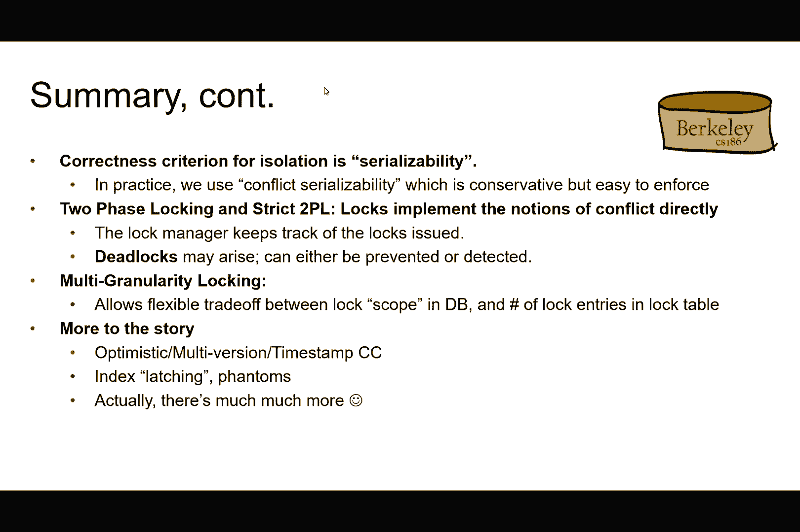
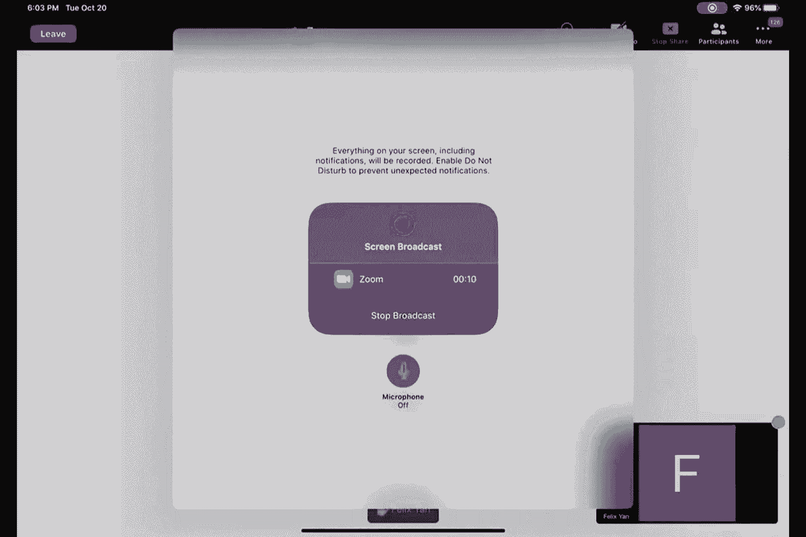

# P16：第16讲 恢复 I - ___main___ - BV1cL411t7Fz

好的，大家好，欢迎来到186的周二讲座。这个星期的计划是。

我们首先要完成上周剩下的部分，特别是上周四讲的关于事务的内容，整理好整个部分，然后我们将实际开始讨论恢复（recovery）。然后我们会在其中做一些公告。好的，首先我想回顾一下我们上周讨论的内容。我知道已经过去几天了，所以。

你们中的一些人可能已经忘记了我们之前讨论的内容。所以我们讨论的主题是事务，对吧？好的，它是关于并发控制的，也就是我们如何确保在同一个数据库系统中允许多个操作同时进行，以便能够取得进展。所以我已经做了TS部分的。

这堂课已经讨论了许多不同的概念，比如运行事务是什么意思，什么是可串行化的，冲突可串行化等所有其他相关内容。然后在周四，我们开始讨论如何实际实现这些概念，对吧？所以这些概念是非常有用的，它们有很多实际应用。

许多事情都可以以可串行化的方式来进行，对吧？如果一个调度可以做到冲突可串行化，那么它就有很多非常好的特性。但是我们如何在实际生活中实现这一点呢？我们如何进行实现？因此，在这堂课以及你们的项目中，我们基本上将使用。

基于锁的实现方式，正如你们可能记得的那样，在这里，锁意味着对一段代码的独占访问，对吧？这段代码不能被其他人运行。所以这些就是我们在周四讲过的一些幻灯片内容。我们基本上在这堂课上讨论的是基于锁的实现方式，尽管实际上有许多不同的实现方式。

你们有很多不同的实现方法可以探索，如果你们感兴趣的话。而且，特别地，我们在谈论这个叫做theta元素的概念，因为我们正在讨论什么是被锁住的，对吧？接下来你们会看到，这也有很多不同的方式可以实现，对吧？所以我们可以锁定整个数据库。

这当然能保证可串行化性，因为这基本上意味着在任何时候只有一条指令可以取得进展。如果那条指令还没有完成，那么其他人就不能在同一个数据库上做任何事。所以，当然，它会是串行化的。但是不幸的是，这样做并不高效，对吧？因为我们基本上。

现在，我们也可以锁定单独的记录，对吧？一直到只锁定我们需要处理的两个记录的字段。所有这些，你可以想象成一个范围，对吧？我们可以锁定一个页面，可以锁定一个单一表格，可以锁定一组两个记录，依此类推。然后我们将看到后面选择不同选项时的差异。

所以关于锁定，我们需要讨论我们能对锁做什么，对吧？你们可能听说过或者还记得61C课程中，你可以抓取一个锁，然后进入临界区，接着在这个临界区中运行代码。但是为了抽象化这一切，对吧？

所以为了186的目的，我们将所有锁操作抽象为仅有两种操作，即锁定和解锁。就是这样。在我们锁定某些内容之后，我们就拥有对这些特定数据元素的独占访问权。无论这些数据元素意味着什么，可能是整个数据库，可能是一个表格。

可能是一个记录，依此类推。然后，解锁的操作则是相反的。我们通过了许多不同的调度，如你从周四的课上可能记得的那样。所以这是最初的调度，我们希望它是冲突可串行化的。然后，通过插入你在这个调度中看到的所有不同的锁，并且相应地执行。

如果我们首先解锁语句，那么我们基本上可以保证这个调度是冲突可串行化的。所以我不再重复细节了，但你也可以看到，仍然可能会出现问题，因为根据事务解锁的方式以及哪个锁被分配给哪个事务，我们仍然可能会陷入问题情况。

就像你在屏幕上看到的情况一样。当然，测试也会出现。所以我们接下来讨论的是所谓的2PL或者两阶段锁定规则，它规定对于每个事务，所有的锁请求必须在所有解锁请求之前。因此你可以理解为什么前面的调度会存在问题。

违反了这个特定的约束，因为我们在最后一个锁语句之前就开始了解锁了。所以根据2PL规则，这是不允许的，对吧？所以这是相同调度的重写版本，唯一的不同是，现在你可以看到我们在实际上解锁任何内容之前，先画出了所有的锁。对吧？所以这样是可以的，2PL是可行的，除了现在我们遇到了一个新问题。

对吧？这个问题也被称为不可恢复调度。在这种情况下，问题在于，如果一个事务回滚或中止，而另一个事务决定提交，即使我们坚持使用2PL锁定机制，仍然会有问题。这里屏幕右侧的第二个事务可能会阻塞其他所有事务。

去读取一些已经被事务一方修改过的内容。现在事务一方决定中止，所以我们需要以某种方式回滚或撤销事务一方所做的更改。但不幸的是，这样做也许还需要我们回滚，或者中止事务二，因为事务。

事务二看到了它不该看到的内容，对吧？这说得通吗？

但不幸的是，事务二已经提交了，对吧？所以我们现在处于一个奇怪的局面，对吧？因为事务一想要中止，但我们也需要回滚或中止事务二，你知道的，因为什么原因。但是事务二已经提交，我们就不能再撤销了。所以这就是问题。我们该如何处理这个问题呢？好吧，我们制定了另一条规则。

这就是所谓的严格2PL规则。所以跟之前一样，除了在这种情况下我们要求所有的解锁操作必须与提交或中止一起进行，也就是事务的结束，对吧？你可以从我们上一页的例子中看到，对吧？现在执行严格2PL规则，在这种情况下。

我们保证不会遇到不可恢复的调度问题。因为现在我们只有在回滚或提交之后才会解锁。这样说得通吗？所以这实际上也变得相当容易实现，因为，像你知道的那样，我们基本上只需要在合适的位置插入锁定和解锁语句。

事务，然后就让锁定进行下去，对吧？在谁先获得锁的方面已经不再重要，然后我们就能做出正确的决定，可以这么说，对吧？通过确保冲突、可串行化性以及恢复性。但这是否意味着问题就解决了？不幸的是，情况并非如此。

对吧？你还记得我上周说的是什么吧？

我的意思是，事务或并发控制永远是一个写满血泪与眼泪的故事，对吧？

或者像你知道的那样，眼泪或者其他一些糟糕的事情。嗯，我想这取决于你站在哪一边，对吧？因为如果你是银行交易的一方，对吧，那么你最终会得到免费的钱。我是说，我认为你不会哭泣。也许只有在你对这件事感到过于高兴时，你才会哭泣，对吧？或者，什么的。

但其他人会遇到麻烦，好吗？所以我们把这个问题放在那儿，对吧？对吧？那么现在的问题是什么呢？对吧？现在的问题是我们可以坚持严格的2PL规则，但现在我们遇到了死锁问题。死锁的意思是没有任何一个事务能够继续进行，对吧？所以这里我们看到事务一持有着锁A，然后。

等待B，然后T2等待B，持有B上的锁再等待A。所以需要有一个事务能够进展。我们遇到问题了。所以就是这样，我们停在这里，对吧？所以，我们在讨论，好的，现在我们有了死锁。基本上，我们需要了解三件事。

首先是如何彻底防止它发生。如果能做到，那就太好了，对吧？

第二种方法是如果我们无法避免死锁，那我们该如何处理它？

我们如何检测它？如何消除它？所以基本上这就是我们讨论的三件事。第一种方法预防是简单的。我们可以通过设置一个任意的顺序来做，规定事务如何获取锁，对吧？所以我可以随便说。

比如在这个例子中，162，我可以随便说屏幕优先于网络卡和打印机。所以如果屏幕尝试获取与网络卡相同的锁时，屏幕总是会赢。完全是随便的，对吧？所以没有。

我没有理由认为打印机必须排在最后，优先级最低。但至少这样能解决问题，因为我们将不再进入死锁状态。然而，1986年的问题是，如何在一堆表格和帖子上施加一个任意的顺序？对吧？我们没有固定的设备来处理这些，对吧？我们处理的是各种各样的。

人们可以创建表格。所以在不知道会涉及哪些表格或哪些帖子会参与查询的情况下，我们很难随意施加顺序。好的，如果我们无法完全避免它，那我们就尽量通过能够检测并在情况发生时进行处理来避免它。我们该怎么做呢？

好的，一种方法是使用事务的年龄这个概念。基本上，就是在特定事务上花费的时间。然后每当我们检测到死锁时（我会在下一张幻灯片中讲解），我们有几个选项。第一个你可以看到的就在上面，右边，对吧？所以，再次。

这是上周使用的臭例子，关于人们去洗手间的例子，基本上是让较老的事务（在这里指处理时间较长的事务）等待。如果最后发现较新的事务需要等待，那就让它自杀。自杀时。

这种情况意味着你知道，返回队列的末尾，再次开始等待，对吧？为什么这样可以防止死锁？

这样就能避免死锁，因为我们不再有循环等待的情况了。所以不是那种情况。你知道，旧事务需要等待年轻事务。而且年轻事务也会遇到需要等待旧事务的情况。对吧。因为在这种情况下，由于这个严重情况，每当年轻事务。

当年轻事务需要等待旧事务时，它总是会自我终止，然后你知道，去到队列的最后。这样我们就防止了循环的发生。旧事务总是会获胜，对吧，在这种情况下。除非，像你知道的，有人已经在使用资源。那么在这种情况下，旧事务也需要等待。

然后另一个方式，对吧，基本上是相反的方式。所以，你知道，或者实际上不是完全相反的方式，而是处理死锁情况的另一种方法，对吧。我们可以让年轻事务等待。就像这个例子一样，然后如果旧事务实际上需要使用资源，就终止在使用中的任何事务。对吧。作为一个不太清楚的示例。

我知道，对吧，但是至少这样就打破了死锁循环。一样的思路。所以我们现在有了，年轻的事务总是等待。但旧事务永远不需要等待，对吧。因为一旦它需要使用资源或获取锁，它总是能抢先成功，对吧。

所以，理应这不再是问题。所以我们再次避免了问题。即不再需要旧事务等待新事务，而新事务也可能需要等待旧事务，以及其他情况。这样说有道理吗？

到目前为止，有没有什么问题？所以，尼古拉斯在问，是否会因为等待而死锁，可能会。事务中重复发生阻塞，导致自我消耗的循环。是的。所以在这种情况下，我的意思是。我们只保证阻塞避免，对吧，我们并没有保证进展。所以，确实可能会发生这种情况，可能会是这样。

年轻事务会不断地回到队列的最后，回到队伍中，调整自己，看到旧事务仍在处理当中。所以，我就再次自杀，然后回到队列的最后。对吧。这完全可能发生，但除非，像你知道的。

旧事务会一直占用资源，直到完成其任务，对吧。这样说。否则，最终年轻事务将能够不断获取锁，或者在这种情况下，能够使用资源。因此，像你知道的，它最终会这样取得进展。但你说得对，在这期间。

你知道的，可能，我们可能花很多时间在排队，来回等待，然后，又要终止自己，然后再回去排队，就像是。只为了再次做同样的事情。好吧，现实生活中不太有趣，对吧，但在事务处理中，我猜我们可以容忍一些这种反复的过程，好吧。

很好。那么现在我们也讨论了，比如，如何从一开始就检测死锁。一个方法是使用一种被称为“等待图”（wait-for graph）的方法。所以我不会在这里重复整个概念，但基本上它是一个图，表示哪个事务正在持有。

当我们进入另一个事务正在尝试获取的相同区块时。比如，在这种情况下，我们在T1和T2之间有一条箭头，因为T1正在尝试读取数据元素B，而T2当前持有该区块，对吧。所以T1和T2之间有一条箭头。这与依赖图的概念非常相似，你可能记得吧。

来自DTS讲座。但在这种情况下，我们基本上是用箭头标注图表，每次两个事务之间存在锁定情况时。然后如果图中有循环，我们就基本上检测到了死锁。然后我已经在前面的幻灯片中讲过，你应该怎么处理它了，对吧。

当这种情况发生时，好吧。然后，就作为一个经验事实，这些死锁往往是小规模的。因此，通常不会涉及大量不同的事务。所以，即使我们必须终止这些事务，它们是新的事务，可能我们不需要终止很多它们。

从经验来看，尽管当然你可以构造一个反常的例子，假设我们有一个由数十个甚至上千个事务组成的大循环。但我想说，这在实践中相对较为罕见。好吧，死锁是坏的，我们想避免它，但另一种尝试避免死锁的方式是实际观察事务之间的情况。

需要处理死锁。举个例子，如果所有事务实际上都在尝试读取相同的数据元素，比如一个元组。如果它们都在读取，那么即使它们在读取相同的东西，只要没有事务实际上写入相同的元组，我们实际上可以让所有这些事务继续进行，对吧。

它们仍然可以继续读取，没问题。我的意思是，只要没有人进行写操作就行。但在前面的幻灯片中，我们基本上是在尝试获取区块，然后保持等待。我们基本上必须一直等待它们，因为同一时间只有一个事务可以读取该元素。所以要实现这个想法，一种思路是基本上有不同类型的日志。

所以现在我们变得更复杂了，对吧？我们超越了像是严格事务顺序的范畴。我们也超越了像死锁检测这种东西。所以这些东西基本上已经被我们处理好了。现在我们在讨论如何提高效率。如果。

我们一开始就有不同类型的锁。那么，假设我们可以为仅仅读取数据元素的事务获取一个锁，而对于写入或修改相同数据元素的事务，则使用排他锁。我们将按照严格的事务顺序来进行操作，正如我之前所说的那样。所以，大家知道的，我们必须遵循锁定和解锁机制。

但我认为，在使用共享锁的情况下，多个事务现在可以继续进行，而不需要相互等待。在这种情况下，假设它们只是尝试等待，但并没有对数据元素进行操作。那么现在的问题是，我们有了不同类型的锁。那么，它们是如何兼容的呢？为了解决这个问题，我们发明了一个叫做锁兼容矩阵的东西。

这种情况的意思基本上是，假设一个事务已经在数据元素上获取了共享锁，然后一个新的事务出现并尝试在该元素上获取相同的共享锁。根据这个矩阵，有勾选符号基本上意味着我们会批准这个请求。如果你仔细想想，这在现实生活中是有道理的，对吧？

因为在这种情况下，我们有两个事务试图读取相同的数据元素。所以它们都应该能够继续进行，对吧？这样说有道理吗？当然，接下来的问题是，像你知道的，为什么这里会有一个交叉呢？嗯，想一想这个，实际上是什么情况呢？它对应的是一个这样的情况，其中一个事务。

如果一个事务试图写入另一个事务正在尝试读取的数据元素，那么我们不能允许这样做，因为如果允许，我们就会破坏可序列化性。因此，我们不会批准这种情况下的锁请求。同样的情况也适用于反过来的情况，对吧？所以不管谁已经拥有锁，情况都一样。

无论是，像你知道的，第一个事务拥有排他锁，还是第一个事务拥有共享锁，这并不重要。所以我们不会批准第二个锁请求。很酷吧？那么你可能会问，实际上这些锁是如何实现的呢？对吧？谁在跟踪这些不同类型的锁呢？

结果发现，在数据库系统中，我们有一个叫做锁管理器的东西，基本上就是做这些事情。在锁管理器内部，基本上是基于被锁对象名称的哈希表。如果这里的对象是表，那么我们就为每个表有一行。如果我们讨论的是两个帖子，那么我们就有一行…

拉取。然后锁管理器会跟踪当前谁拥有锁，以及当前有哪些事务在等待它。所以你看到一个例子，这里有两个数据元素，A和B。然后这里的授予集合基本上是在讨论哪些事务当前已经获得了对该数据元素的访问权限。所以你可以看到，在…

在第一行中，我们有两个事务获得了共享锁，而在第二行中，我们有一个事务获得了独占锁。等待队列基本上是在讨论哪些其他事务在等待它。所以你可以看到，事务三正在尝试获取A的独占锁。但由于，像你知道的，另外两个事务…

目前，由于共享锁的兼容性矩阵，我们无法允许这种情况发生。因此，我们必须等待，这里就有等待队列，基本上是让其他所有事务排队。所以当一个请求到达锁管理器时，它会检查这个哈希表来判断是否能够允许该请求通过。

如果没有人持有任何该数据元素的锁，那么我们可以直接将其插入到授予者集合中，然后让它继续处理这个业务。如果不是的话，我们就像，你知道的，将它放入队列中。然后你也可以想象一下升级锁，对吧？如果我已经拥有一个共享锁，那么现在，如果我…

如果我想写入相同的数据元素，那么我需要基本上将我的锁升级。我的锁，对吧，升级为独占锁。而这正是相同的机制。所以你可以，像你知道的，想象一下你如何解决这个问题。基本上看一下等待队列，看看是否有任何人正在尝试获取独占锁，或者已经持有该数据元素的独占锁。

基于此，我们可以判断是否要授予请求。到目前为止，有什么问题吗？是的，尼古拉斯。哦，对不起，我只是有个问题。那些像等待死锁（wait-die）和不等待（wound-wait）的策略，当你有多个锁模式时，它们是否仍然适用？好问题，嗯。

如果你有不同的锁模式，你仍然可以应用这些策略。当然，就像你知道的，在这种情况下，我们只有在其中一个事务尝试获取独占锁时才会应用这些策略，对吧？因为如果所有的事务都只是尝试获取共享锁，那么我们就让它们全部获取。

那也没问题。所以我们需要处理的唯一情况是，如果某人在试图对一个数据元素获取排他锁，而这个数据元素上已经有另一个交易持有排他锁或共享锁。谢谢。问题。很好。那么你可能会觉得我们所有的问题都解决了，对吧？但是事实证明，仍然有另一个问题。

所以现在我们讨论的不是正确性，对吧？我们讨论的是效率。所以这是一个典型的图表，当人们尝试绘制交易数量与吞吐量之间的关系时，吞吐量是每秒处理多少交易的一个衡量标准。所以显然，越高越好，对吧？但是你基本上会看到，在某一点，你知道。

性能开始下降。而之所以会这样，是因为我们有更多的交易时，它们彼此在这些锁上等待的概率就更高，对吧？

不管它是排他锁、共享锁还是其他什么的，问题是锁的数量，这些锁的数量或者说被引发的锁，等待的锁，会随着交易数量的增加而增加。所以你会陷入一个阈值问题，对吧？我的意思是，像这样。

你开始听到你的笔记本风扇开始转动，停止工作了，对吧？例如说。这是坏的。那么我们如何缓解这个问题呢？对吧？一种方法是，基本上做一些被称为细粒度锁的事情。所以这实际上回到我们之前讨论的，像是，知道在什么级别下这些数据元素应该是什么？对吧？我们可能会讨论锁定一个。

数据元素。它们应该是单个元组级别的锁吗？

或者它们应该是整个数据库级别的锁吗？所以如果整个数据库只有一个锁，那么你知道，我们就不会有阈值问题，因为只有一个锁。但这样的话，我们基本上就会杀掉效率。所以那样的话，我们一次只能处理一个交易，对吧？然后如果我们有很多不同的锁。

对吧？所以假设我每个元组都有一个锁，而且我有一百万个要在表格中对抗的锁。我们说的可能是有一百万个锁在使用。然后等待，再把它杀掉，死掉，还有其他所有事情，对吧？所以这一部分会导致我们在上一张幻灯片上讨论的阈值问题。

所以现在的问题是，我们是否可以尝试改变这种粒度呢？对吧？因为如果在不同类型的锁之间存在一个广泛的选择范围，那么这可能是解决这个问题的一个好方法。但其实很难决定锁定什么的优先级，对吧？因为我们可以在不同的级别锁定东西，但接着。

我们已经理解了，在是否我们想要产生资源争用，或者我们可能会经历资源争用之间存在一种权衡，另一方面，在任何时刻只有一个事务在进展，对吧？任何时刻。问题是，能不能实现两者兼得？

不知怎么地，我们希望能够在不同层次上获取锁，然后仍然能够避免通过动态选择我们要在哪个层次上获取所有这些不同锁的问题。问题就是这样设置的。解决这个问题的方法，正如我所说，是基本上在不同层次上拥有不同类型的锁。我们来定义一个。

不同粒度的层次结构。我们有两个帖子嵌套在一个表中，并且有表嵌套在数据库中，例如。如果我们有一个这些不同数据元素的层次结构，那么我们可以将其表示为一棵树，然后我们可以从最上层开始，按需一直向下获取锁直到单个元组，对吧？所以现在，当我们尝试在这个世界中。

对，关于锁的层次结构，我们需要有一个规范，明确当我们尝试在这个世界中获取一个锁时，它意味着什么。所以我将随便做个决定，如果我们锁定了我在这里展示的这个树中的一个节点，那么我们实际上就是隐式地锁定了它所有的后代。为了检查我们的直觉。如果我获取了这个锁。

整个数据库，基本上是根节点，这基本上意味着我正在锁定树中的所有内容，所有的表和所有的元组。然后，如果我在表中的某个页面上获取锁，那么我隐式地也锁定了每个在这里作为后代的单个元组。我实际上并没有显式地获取。

锁定这些元组的锁，对吧？因为如果我们最终这样做，那么我们不如直接为每个元组设置锁。但我们基本上是在构建这个层次结构，以便当我们在高层次上获取锁时，这就意味着我们也会隐式地获取低层次的锁，尽管在代码中我们没有显式地这么做。

这有意义吗？对，所以现在我们有了不同类型的二进制，对吧？当我们尝试锁定街道中的任何东西时。比如说，如果我们尝试在最低层次上获取锁，比如元组层次。那么我们可能会有很大的开销，甚至可能遇到一个阈值，对吧？

和之前相同的问题。如果我们在更高的层次上获取锁，那么我们就可能通过这样做避免其他事务的进展，对吧。所以我们基本上是在失去并发性。在现实世界中，你会发现，实际上有很多不同级别的锁。所以在上一张幻灯片中，我只展示了。

你知道，像是四个不同级别的层次结构。实际上，你可以获取许多不同级别的锁。然后，这一切都取决于不同的实现。但现在有了这个新概念，我们仍然需要讨论，如何在这种情况下获取锁，对吧？我们有许多不同的级别。然后。

理解是，如果我在更高层次获取一个锁，那么在下层的所有锁也会被获取，没错，这是理解方式。但是，我们如何告诉其他事务，我们要获取哪个锁呢？解决这个问题的方法是发明另一种锁类型。

通常称为意图锁，基本上理解是，在获取共享锁或独占锁之前，事务必须先在该锁层级结构中的所有祖先上获取意图锁。例如，如果我想在页面级别获取锁。那么请注意，在这种情况下，我正在页面级别获取一个共享锁。

我首先需要在表级别和数据库级别获取一个意图锁。再次强调，理解是，如果我有一个意图锁，它基本上是在告诉其他事务，我将在树形结构的某个更低层次获取锁，对吧？所以如果你看我这里获得的第一个锁，没错，是在数据库层级上的意图锁。

它基本上是在告诉一个事务，“嘿，看看这里有人在工作。”而且有某人在层级结构的较低层次上工作。所以只是为了确保你知道，像是有事情发生了。对，基本上，基本上，它们现在将有三种不同的锁。

这是对我们之前讨论过的共享锁和独占锁的补充。在树的更低层次，还有获取共享锁的意图，通常称为最终粒度（final granularity）。还有获取独占锁的意图。并且，还有同时获取共享锁和获取独占锁意图的情况。

所以我们应该理解，SIX基本上是获取一个共享锁并加上获取独占锁的意图。那么你认为这有什么用处呢？你能猜到为什么我既想获取一个共享锁，又想在层级结构的某一特定级别上获取独占锁的意图吗？

你可能在做读写操作。所以，你想在读取时使用共享锁，然后写入时，比如使用IX（意图排他锁）、X锁。完全正确。所以也有很多人提到过这个问题，对吧？是的。所以你可能正在读取某些内容，然后稍后决定实际进行写入。

获取排它锁，对吧。一个好的例子就是，比如说，我想读取所有名为Alvin的学生，然后给他们在这门课上打个A。对吧。所以你首先想要读取学生数据，对吧，但学生的名字。然后你可能最终会像你知道的那样，改变那个层级结构中的一个记录。

好的，是的，人们现在在更改名字。好的，酷，对吧？所以现在我们有点更复杂了，因为现在我们有不同的锁模式。我们不仅有共享锁和排它锁，还有这些不同的意图锁。那么问题就变成了，我们怎么推理什么锁与什么锁是兼容的？

所以我在这种情况下做的基本事情是，考虑它们在没有意图锁的情况下如何交互。然后你应该能够推理出，像你知道的那样，如何填充我在这张幻灯片上展示的兼容性矩阵。所以我将提出以下声明。

如果我想在某个特定节点上获取共享锁，或者是意图共享锁，或者是意图，嗯，去获取一个共享锁，那么我必须在父节点上持有IS或IX节点锁。然后如果我想要获取一个排它锁，那么我必须持有排它锁的意图锁，或者持有父节点上的SIX节点锁，作为SIX锁。然后我会按照从底向上的顺序释放锁。然后，再次这样做。

对吧，我们将像以前一样进行2PL或直接2PL。我宣称这个协议是正确的。如果我们基本上遵循这种特定机制，知道何时行动，抓取什么类型的锁，什么时候实际上释放它们。看我们。你有问题吗？是的，我仍然对意图锁的目的感到困惑，为什么我们要使用它们。

是的，基本上目的是让我们能够允许多个事务同时进行进展。我们希望多个互不干扰的事务能够同时取得进展。对吧？所以如果我们回到之前的层级示例，比如说，如果我们在数据库层级只有一个锁。

那么基本上，我在这种情况下就是杀死所有的并发性，对吧？我不允许任何其他事务。任何时候只有一个事务能进展。对吧？但是如果我只在最低级别进行锁定，在元组级别，那么，你知道的。我可能会最终陷入一种死锁或冲突状态，因为你知道。

所有的事务都在试图获取锁，然后没有人能够进展。这就是情况。所以如果你只在最低级别锁定，为什么会发生这种死锁？

因为如果我有很多两个帖子，那么已经有很多锁对象了，对吧？

记住，每个锁都是唯一的，对吧？它是一个独立的变量。所以我们会有很多事务，跟踪并检查所有这些不同的锁，对吧，这些锁可能已经被占用，也可能没有。而且，仅仅是检查，运行所有的检查，对吧，已经消耗了 CPU 资源，而不是实际在数据上执行工作。谢谢。是的。

所以，想法是，如果我们允许事务在不同级别上根据安全需要获取锁，那不是很好吗？对吧？这就是我做的相似性问题。是的。是的，我只是补充一下。所以，Lucas，如果你想象一下，假设你有一个事务，假设它没有在层级上获取意图锁，而是直接去锁定。

leaf 元素，对吧？现在你有另一个事务，想要对整个数据库做一些操作，对吧？假设你想改变数据库的模式。现在这个事务需要知道，有人在 leaf 处对一个特定的元组做了一些改变，这样他们才能协调各自的访问，对吧？

所以数据库系统可以协调它们的访问。拥有在层级的不同级别上的意图锁，可以让这种协调更加顺畅地进行。这样说得通吗？是的。谢谢。好的。太好了。正如我之前说的，对吧？

所以我们现在需要弄清楚，什么时候锁定，应该获取什么样的锁，以及何时获取。然后我将遵循这个协议。如果我想在层级中的任何一个级别上获取锁，我必须在更高层级上有意图锁。然后，关于共享锁和独占锁之间的差异，也是同样的道理。

锁。不过，问题是，这个锁的兼容性矩阵应该是什么样子的呢？

比如，如果某个事务有意图，持有 IS 锁，而另一个事务尝试获取 Ix 锁，假设你知道，在树中的某个特定节点，我们应该允许这个操作继续执行吗？关于这个问题，正如我之前说的，想一想，应该发生什么情况，比如我们有两个元组，像你知道的那样。

例如在单页上。好的。假设在这种情况下，我们想要推理 Ix 锁是否与页面级别的 Ix 锁兼容。例如，这是什么意思？对吧。所以如果你跟随前一张幻灯片，某人获取了一个 IS 锁，对吧，意味着我将在两个页面之一上获取共享锁。

在该页面内的项，对吧？根据我们的协议。因为如果你需要对任意一项，两个项中的一项加共享锁，那么你必须已经在更高层次上拥有IS锁，对吧？举个例子。包含元组的页面。然后类似地，如果我想对其中一个项加独占锁，那么，你知道，根据上一页的约定，我必须已经在该页面上，拥有Ix锁，对吧？那么在这种情况下。我们应该允许这种情况发生吗？还是不应该允许？应该允许一个事务对

元组，然后再对与第一个元组位于同一页面的另一个元组加上独占锁。这可以吗？这允许吗？你们怎么看？是的，对吧？这不是个陷阱问题，顺便说一下。对吧？我的意思是，基本上是说，两个事务正在尝试操作两个不同的项，并且它们正在尝试获取锁，对吧？一个有共享锁，因为它是。

读取它。另一个有独占锁，因为它正在写入。嗯，我是说，这两个项本来就是不同的，所以不管它们是读还是写，都没关系，对吧？

但这基本上意味着我们可以在页面级别允许IS锁和Ix锁是兼容的，对吧？所以记住，这个IS和这个Ix锁是在页面级别，而不是在元组级别，对吧？

所以这基本上意味着我们可以在同一页面上同时授予IS锁和Ix锁，对吧？同样，当然，在同一个表中也是如此，对吧？同样，当然，在同一个数据库中也是如此。这样说清楚了吗？如果你不明白我意思的话，对吧？那么，正如我所说，推理一下，按元组，单个元组级别来分析。

然后尝试想出一个场景，看看你知道吗？你能看到哪个请求被允许还是不被允许。然后推理的根本方法是，思考我们是否可以允许像这样的事情发生，对不起。我们是否可以允许这样的情况发生，一个元组上有共享锁，而另一个元组上有独占锁。

在另一个元组上加锁，对吧？现在假设我想推理两个Ix锁是否兼容。想一想，这种情况会是什么呢？这意味着一个事务对T1加上了独占锁，而另一个事务对T2加上了独占锁，对吧？而且由于这两个元组完全独立，这种情况。

应该被允许，对吧？所以这基本上意味着Ix锁应该与同一页面上的另一个Ix锁请求兼容。不是同一个元组，对吧，而是同一页面上的。你需要记住这一点。有关于这方面的问题吗？好吧。所以一个父锁可以有多个意图锁，对吧？是的。假设你。

如果你在一个页面中尝试读取两个不同的元组，你只需要一个Ix锁，还是需要为每个元组分别加两个Ix锁？一个，等等，抱歉，是页面还是元组？嗯，是的，你尝试读取同一页面中的两个元组。那么对于那个页面本身，你只需要一个Ix锁，因为你只在读取这两个元组？我说的是页面上的锁。

两个元组。是的，所以页面级别只有一个Ix锁，就像元组级别只有一个锁一样。所以每个锁都有它自己的锁，抱歉，每个元组有它自己的锁，每个页面有它自己的锁，每个表有它自己的锁，每个数据库有它自己的锁。好的，谢谢。那么我们现在讨论的是是否应该批准同一页面的Ix锁请求。

而其他事务已经持有相同页面的Ix锁。所以这是不是意味着一个父节点最多可以持有三种锁？比如IS锁、Ix锁和SIX锁？

好的，这基本上意味着它是一样的，对吧？所以每个页面目前都会有一个锁表，就像我在上一张幻灯片上展示的那样，然后它基本上会显示当前哪个事务对这个特定页面持有什么类型的锁。一些事务会对该页面持有IS锁，另一些事务会持有Ix锁。

例如，对于该页面的锁。但是你能否叠加不同的锁？就像你在屏幕右侧写的，页面同时有IS锁和Ix锁？

是否有可能同时拥有它们，再加上SIX锁？哦，你告诉我吧，对吗？

所以你现在基本上是在问，在这种情况下应该发生什么，对吧？

然后我尝试推理一下，对吧？假设我有一个事务已经对页面P持有IS锁，另一个事务则持有Ix锁，然后第三个事务过来，假设说：“嘿，我想要在这个页面上获得SIX锁。”我们应该批准吗，还是不应该批准？对吧？我声称应该批准，因为你可以看到，已经有一些事务持有该页面的Ix锁。

这个框里的值是“真”。然后这个框里的值是“假”，基本上意味着如果某个事务已经对该页面持有Ix锁，那么我们就不能允许通过SIX锁请求。好的。所以这个表格展示了，如果你在父节点中持有这些类型的锁，那么还可以存在其他哪些锁。嗯，好的，谢谢。是的，这就是为什么这里有一个。

锁的兼容性矩阵。哦，所以你可能会想，好吧，我们有五种不同的锁，这已经让我有点害怕了，对吧？你知道，我得推理出25种不同的组合。你说，认真吗？我的意思是，试着推理一下，这有点像现实世界中的情况，对吧？所以你知道。

你可以获得的锁的类型肯定多得多。而且当然，矩阵就像你知道的那样，不断扩展。因此，就像你知道的那样，我们也需要能够推理这些内容，对吧？但幸运的是，如果你做了功课，没错，那么基本上你只需要推理每个框一次。然后它就行了。

然后，这个矩阵在对角线两侧也是对称的。所以它基本上是彼此的镜像。所以你只需要推理这个巨大表格的一半，而不是整个表格，如果这样能让你更开心的话。好的，像你知道的那样，这个问题就到此为止，除了我们仍然有……

还有另一个问题，叫做幻读问题，对吧？我认为这是个好时机，因为在10天后我们将迎来万圣节。遗憾的是，这与那种幻读问题无关。它从某种意义上来说更无聊。问题如下：到目前为止，我们假设数据库基本上是两本静态书的集合。没有任何变化。

对吧？我们没有在主动插入或删除东西。所以如果我们开始在事务中插入和删除东西，那么这个问题就会出现。这是什么意思？这里有一个例子。所以我有两个事务。第一个事务试图选择所有的蓝色产品，第二个事务……

尝试插入一个新的蓝色产品。然后第一个事务出于某种原因决定再次发出相同的查询，对吧？所以我们先问一个问题，这个调度是可串行化的吗？

答案是否定的，因为T1实际上看到一个正在插入的新产品，称为A3，对吧？所以这与任何你能想到的T1完全执行在T2之前或反之的排序方式都不等价。因此，这不是一个可串行化的调度。现在，问题是，这实际上是一个冲突可串行化的调度吗？如果你还记得……

在DTS讲座中，进行这个测试的方式基本上是尝试重新排序这两个事务中的操作，然后看看我们能否重新排序到一个点，在这个点上T1的所有操作都在T2的所有操作之前，或反之亦然。所以在这里，我假设数据库中已经有两个蓝色产品。

也就是A1和A2，然后A3是T2插入的新产品。所以到目前为止，这不是一个冲突可串行化的调度，对吧？

因为我们有操作在T1和T2之间交织。但是，由于A3与A2或A1无关，根据DTS在讲座中讲解的规则，我们实际上是允许这样做的，对吧？

要将A3的操作，具体来说，是在对A1和A2的读取操作之前。因此，所有T2的操作都需要移动到T1之前。因此，正如我们之前讲座中提到的那样，这实际上是冲突可串行化的。但是我们仍然知道这里有一个问题，对吧？所以这不好。

所以这要么意味着冲突可串行化性有问题，要么意味着DTS有问题，对吧？所以我们不能使用这个方法，不能用这个测试，对吧？当然，像你知道的，他是对的。所以，像你知道的，这个测试实际上允许我们进行冲突可串行化性检查。基本上就是这样。

就是当我们现在谈论的是在一个事务中插入或删除时，就会发生幻影问题，且冲突可串行化性不再成立。这就是一个大问题，对吧？因为我们原本希望它能帮助我们，但结果却像是全盘皆输。

当我们处理这些动态事务时，这就成了一个问题。它们不仅仅是读取或写入单个元素或现有元素。我们讨论的是事务插入和删除数据的情况。所以这很糟糕。好的，那么我们如何解决这些幻影问题？快速解决方法：锁住整个表。

锁住整个表，对吧？这就太棒了。所以如果我们锁住整个表，没人可以继续操作，那也意味着，对吧？你可以随便插入和删除，幻影问题就没有了。但我们已经看到，这样做是有问题的，对吧？

所以我们尽量不这么做。另一种做法是，如果有索引，我们可以锁住索引，对吧？因为如果有索引，我们试图插入数据。那基本上意味着索引会变得过时。所以如果有人试图通过索引来读取数据，像你知道的，那时候过程就会有问题。

该操作将被阻塞，对吧？所以我们将能够防止之前提到的问题。或者你可以做一些称为“等待块”的操作，基本上就是先进行一次预演，确定我要读取的是哪两个帖子？

然后，一旦我确定了要读取的两个帖子，我会在实际读取之前先对这两个帖子加锁。所以我不会在这里详细讲解，但你可以想象，处理这些幻影问题非常昂贵，对吧？因为这些方法都不便宜。

解决方案可能并不像我们在课堂上之前讨论过的那样简单或干净。如果你正处理的情况涉及到可以插入或删除数据库中的事务，那么这就是你可能需要解决的问题。或者你可能会说，随便了，我不在乎。我不保证你能做到。

你可能看不到幻影。我是说，现在我正在实现的这个数据库中，你可能会看到幻影。所以如果是这种情况，那就挺难受的，对吧？你也可以选择忍受它。所以这由你来决定。好的，这就是我想说的全部内容。总结一下，我们基本上讨论了这些讲座中不同类型的可串行化性问题。

然后我们讨论了几种不同的方式，实际上如何处理或确保我们具有冲突串行化。确保你理解它们之间的差异。最后，我们讨论了“幻像问题”或动态数据库的概念，其中冲突串行化不再成立。

总的来说，我们讨论了什么是可串行化的正确性概念。这是许多系统提供的功能，确保事务的资产（ACID）特性得以保留。我们谈到了使用锁来确保可串行化，并且通过不同的方案或协议来确定何时获取锁以及应该获取什么类型的锁。

我们可以通过这种方式确保可串行化。然后我们还讨论了效率方面的问题，以及如何缓解出现冲突时可能发生的抖动（thrashing）。在这门课中，我们谈到了通过在多个粒度级别上使用锁来实现这一点。正如我之前所说的，对吧？

还有许多其他种类的并发控制机制，并不使用锁。所以，如果你感兴趣，你可能也想了解这些内容。如果你想了解更多这方面的信息，我们也可以私下讨论。这就是我们目前关于事务的所有内容。稍后在课程的最后部分。

在这门课程中，我们实际上想要重新审视我们一直在讨论的所有事务，特别是在并行数据库的背景下。也就是说，当我们有多个数据库同时运行时，事务该如何进行？不过现在，我先停一下，让你们提问，我将准备下一部分内容。Felix。是的，之前有一个陈述。

他们说一个事务必须在获取它所需的锁之前，先获得所有祖先上的所有意图锁。似乎就是这样。然后在我们讨论锁兼容性矩阵时，记得我们举了一个例子，两个事务分别在页面级别上拥有意图锁，并且它们在处理...

他们在不同的元组上拥有各自的 SNX 锁。在这种情况下，像是什么先发生呢？

当一个事务想要获取 S 锁或 X 锁时，事务是首先尝试获取所有的意图锁吗？还是它会先获取到自己想要的对象，然后再进行处理？

然后，事务获取 S 和 X 锁时，是否可能出现事务首先获取了意图锁，但最终无法获得它所需要的 S 或 X 锁的情况？是的，太好了。我现在没有屏幕，但我想有一张清晰的幻灯片可以讲解这些锁的获取顺序。如果你回顾一下那张幻灯片，或者基本上...

告诉你在可以继续向下层移动之前，你需要先从层级的最高层获取锁。这个顺序不是随意的，正是因为他们提到的问题。对吧？所以你可以抓取所有你想要的意图锁，直到你到达最终点，而你可能会意识到哦，有人已经在同一个元组上持有独占锁了。

尝试获取独占锁。到那时，我们基本上就停止了，对吧？

或者我们只是等待。所以获取锁的顺序确实很重要，你基本上需要在层级的最上层进行操作，然后按相反的顺序释放锁。明白了。所以即使在这个例子中，我们也在构建一个例子，像是证明或者展示你可以有一个Ix锁和一个Ix锁。

仍然有可能发生这样的情况：一个事务已经有了Ix锁，但它并没有实际拥有该表的S锁或X锁。对吧？好的，谢谢。是的，当然。还有其他问题吗？是的，我在聊天中问过这个问题，但由于哈希表和树也被不同的线程访问，当你知道它们发生并发时，数据结构也必须被锁定。

是的，通常这样做的方法是让锁管理器控制所有这些不同的请求。所以有一个组件接收所有这些请求，然后你可以把它想象成一个接收不同请求的队列，这些请求需要由锁管理器进行验证，锁管理器基本上对哈希表有独占访问权限。

不同的锁。所以锁管理器基本上必须是串行化的，或者像单线程一样。单线程。对。好的，谢谢。你可以有多个线程锁管理器，但你仍然需要为表中的每一行设置锁机制，对吧？所以没有两个线程会在同一时间尝试操作同一把锁。

很酷，谢谢。所以我想我们答应了一个小休息。我不知道我们是否还应该继续，或者你知道的，我们不如休息几分钟。我觉得我们还在找TikTok或者其他的猫咪、表情包。嗯。所以我想我们确实有一些答案，我想我们现在就播放它们，然后，好吧。

我们做吧。好的，那你应该……你应该像这样，好吧。结束我的任务。对吧？所以你们可以判断，像是你知道，这些有什么问题。

很有趣，而且它们相对较短，不幸的是。然后我不确定。所以这是其中之一。

我们收到的东西。就只是这些，对吧？好的，很好。然后让我们看看。我们这里还有一个条目是一个表情包。我猜是在讨论效率问题。太好了。

这个，我猜是比较有趣的。

我可以关闭笼子驾驶吗？哎呀。然后其实是有声音的。我不确定你们是否真的能听到。

好的，让我再放一次。

是的。好吧，我希望你们现在的感觉不是这样。我不知道。

然后最后一个问题是关于期中考试2的，它是如何与我们课程相关的？

不确定那是什么意思。好的，差不多就是这些了。就像我之前说的那样，对吧？我意思是，我们还在征集新的视频。如果你们想休息一下，我是说，你们最好提交一些好的内容，明白吗？否则我们就会继续推进，这对任何人来说都不有趣。

所以我查看了我们收到的提交，基本上，Alvin已经播放了所有的提交。所以我们真的是在寻找更多的提交。

是的，好吧，我们开始一些公告。我想我们仍然在努力修改一些部分，但我不记得那方面的更新是什么了。Alvin，你记得吗？

我记得我们决定可能合并其中一到两个部分。我忘记了。Jerry，你在吗？是的。Amy的部分取消了，和Jennifer的部分合并了，这也是他们开启法律部分的原因之一。是的。太棒了，谢谢，Teddy。是的。所以Amy和可能是Jennifer在主持法律部分。

所以他们基本上会更详细、慢慢地讲解事务的概念和并发控制。所以如果你们希望在这些概念上得到更多的帮助，或者更有指导性，我鼓励你们去参加这些部分。这些是非常难的概念。我鼓励你们去参加法律部分。我觉得这应该是一个……

我相信这个部分大约有R和一个半小时。所以Jerry发布了关于期中考试2的信息。基本上，它和期中考试1的设置相同。所以，是的，我希望你们有一些基于期中考试1的练习，至少对考试的设置有所预期。唯一的注意事项是期中考试2的题目范围。

和以往几年期中考试2的题目范围稍有不同。所以可能会有一些问题，你们可能会想，“嗯，我完全不知道怎么回答。”嗯，这可能只是因为你们还没有覆盖到这个话题，它不在我们的期中考试2大纲中。好的。所以我还想提到的是，本周没有办公时间。

哦，对了，我仍然在找，Alvin，我觉得今天Alvin进行了一个概念性的幻灯片讲解办公时间。这基本上是一个小型讲座，你专注于...我不记得Alvin讲了什么。是讲联接算法吗？

今天的联接算法和活动。好的，联接算法和选择性。我注意到Piazza上有几篇关于查询优化的帖子，讨论了查询计划和计算IO的内容。我考虑在办公时间讲解这些，如果有其他请求的话。所以基本上，我原计划要做的，我不知道Alvin做了什么，但这是我原本的计划。

目的是根据你提出的问题来浏览幻灯片，并集中关注可能的误解。就像是想，“嗯，这个值为什么是这样？”我可以坐下来，尽量详细解释。这就是我们的目标。所以我们要确保大家能够感受到一些同学遇到困惑，没能理解某些内容。

所以我们希望帮助你们解困，尽快赶上进度，恢复正常节奏。这也是我们在使用办公时间时的目标。接下来，我想提到的是期中考试一的一些问题。我们发现期中一有一些后勤问题。所以基本上，我们提供了。

这里有一堆指示说明，实际上有不少同学没有严格按照说明操作，虽然这些问题完全可以理解，因为这是你们第一次进行这样的操作。但问题的种类从小的，比如没有展示SID或面部信息，去上网，录制中途掉线，直到一些更大的问题。

有些更大的问题，比如完全没有录音，额外的屏幕，额外的设备。这些都是后勤问题，希望你们在期中二时能够避免。另一个让我们感到遗憾的发现是，可能存在学术诚信的问题。我们目前没有确凿证据，但还是有潜在的学术诚信问题。

我们仍在调查此事。我知道你们中的大多数同学是以学习内容为目标来上这门课的，所以这件事我们会调查，但我们也在寻找评估和验证这些情况的方式。我们不是想让大家感到压力，我们只是想确保公平。

对于那些有后勤问题的同学，为了避免出现这种验证问题，请尽量找出解决方法。如果你在找解决方法上有困难，我们随时可以提供帮助，对吧？如果在期中考试安排上有什么让大家困扰的地方，我们也会处理。

我们很高兴改变这个。但我们希望知道。如果有具体的事情导致了我们讨论的后勤问题，请随时告诉我们。如果你感到困惑，或者在理解内容时遇到困难，告诉我们，并告诉我们怎么帮你。有一件事。

我们还没有做的是查看你们的期中调查。所以可能很多人已经给了我们有用的反馈，我们可以利用这些反馈来改进我们内容的呈现以及项目和各个部分。我好像看到有举手。是举手吗？是我。但我觉得我的问题已经得到了回答。

我们原本会在这里收集反馈，以防我们不小心违反了某些规则而没有意识到。然后，我猜答案是否定的。所以我认为我们可能做的事情是，只是简单地列出常见问题。我认为我们会通过视频进行抽查，尝试识别可能的问题。但当然，我们无法做到面面俱到，对吧？

我们不能坐在那里，盯着你们每一个人完成考试，像是花两个小时或其他时间，整个考试。对吧？我们无法做到这一点。所以我们不可能对这些问题做到面面俱到。所以我不想承诺这一点。我们能做的，当然是列出我们在视频中发现的常见问题，并将其分享给你，以便。

这可以是一个便捷的提醒，比如“嘿，显示你的SID，展示你的脸，确保录制是这样的，确保你的手机已连接充电器，等等。”对吧？所以我们当然可以在之前发出这样的提醒。Jerry，这听起来怎么样？

有什么要补充的吗？Jerry负责考试相关的事宜。是的，我认为没问题。聊天室里有个问题，我们希望大家查看视频。可以，直接来我们的任何办公时间。我想，和之前一样，对吧？所以我认为我们之前也提供过，甚至是在第一次期中考试之前就有提供，基本上是检查你的，知道了，提供帮助。

你能检查你的设置，等等。所以同样的，你可以选择直接参加任何一场办公时间。我想还有一个问题是关于我们如何处理你的视频。你的这些视频，第二个承诺是我们使用它们的唯一方式，就是进行抽查，仅此而已，对吧？

一旦我们完成了抽查，一旦我们弄清楚了哪些人可能需要进一步审查，我们就会将他们移除。我们不再需要访问他们的信息。所以当我们不再需要访问时，我们会通知你，你可以直接撤销访问权限，如果你愿意的话。我认为系统也设置了，可能在30天后自动过期。

或者其他情况。是的，至少Zoom，Zoom帐户基本上会在30天后删除视频。好吧。好了，我们开始讨论恢复。我没有太多时间来讲解恢复，因此我们将尽力而为。好的，退后一步，Alvin已经讲过并发控制，基本上，回顾一下剩余的事务。

这些保证，即事务需要满足的所谓ACID属性。首先是原子性，如果你还记得的话，它基本上意味着事务中的所有操作要么全部发生，要么一个都不发生。一致性则意味着数据库状态是一致的，遵循某些约束条件，例如，事务结束后仍然保持一致性。

隔离性是这些锁定方案所保证的，它确保一个事务的执行与其他事务的执行相互隔离。持久性基本上是说，如果一个事务提交了，那么它的效果将会持久化，超越该事务的生命周期。所以今天，我们将开始讨论恢复管理器。恢复管理器负责确保。

原子性和持久性。另外，回滚那些违反一致性的事务。好的。所以原子性的动机是事务可能会中止。无论是请求中止，还是系统中止它们，我们都希望确保它们的效果不会被持久化到数据库中。因此，我们真的希望要么事务的效果完全没有存在。

所有的效果都会被保留。持久性基本上是确保如果数据库停止运行，已提交的事务效果仍然存在，永久保存。所以在这个例子中，你有几个事务已提交和中止，然后发生了系统崩溃。那么我们在这种情况下希望什么？崩溃后。

系统重启时，我们希望这些已提交的事务T1和T3的效果是持久化的。而T2、T4和T5应该被中止。因此，要么T2已经明确在崩溃前中止，要么T4和T5在崩溃时是未完成的事务。

我们希望它们的效果被回滚。所以我们也希望它们在崩溃后被中止。因此，当系统崩溃并恢复时，我们希望任何在崩溃时未提交的事务，其效果不应在恢复后显现。那么我们来谈谈两个问题，关于为什么。

数据库系统为什么会中止运行？接下来我们将讨论确保恢复的机制。那么为什么事务会中止呢？首先是用户应用程序明确表示，我不再继续执行这个事务。另一个事务可能中止的原因是在事务执行过程中，如果数据库确定有完整性约束。

如果违反了某些约束，它可以中止一个事务。就像是，嘿，你违反了这个主键约束，外键约束，等等，数据库系统可以说，看看，我要中止这个事务，那个事务的任何效果都不应该被保留。它也可能由于死锁而发生。阿尔文提到的那些方案，你当然可以查看。

你可以尝试将一个事务作为循环的一部分，然后导致它被中止。你也可以因为系统故障而中止一个事务，前提是该事务在成功提交之前未完成。因此，如果系统本身失败，那么这个事务还没有到达提交状态。我们将在系统恢复后中止该事务。

所以我相信我们之前也讨论过这个。关于 SQL 中的事务，你应该使用 `begin transaction` 命令来开始一个事务，然后你使用 `commit` 来提交该事务的效果，如果你想回滚该事务的效果，就使用 `rollback`。所以这就是你如何通过 SQL 与数据库进行事务交互的方式。

你还有这个方便的保存点概念，它允许你在事务中保存状态。所以你可以通过 `save point` 并给它一个名称来声明一个保存点。然后你可以释放一个保存点，基本上是说删除一个保存点，就像保存点从未存在过一样，使用这个 `release save point name` 命令。

然后你也可以使用这个 `rollback to a save point` 命令回滚到之前的保存点。这意味着你在这个事务中采取的所有操作，回滚到并包括该保存点，都将被撤销。所以这些保存点是一个方便的工具，可以将一个较大的事务拆分为多个组件。

这些是单独保存并且可以回滚的。所以在这个特定的例子中，你有一个大的事务和一个提交，并且在其中有一个插入操作，然后声明了一个保存点，基本上允许你回到这个点，再进行另一个插入操作，然后在这里我释放了这个保存点，这意味着几乎就像这个保存点从未存在过。好的，然后我有。

另一个保存点。我声明了另一个保存点，添加了某些内容到这个表中。然后我说，所以我向这个表添加了一个空值。现在我说回滚到保存点，这意味着所有这些都会被删除，对吗？这些效果会被删除。最后，我还有另一个插入语句。所以我基本上有了是的，一个，两个。

并且作为该表的一部分，三。好的。因此，释放和回滚只是一些方便的操作，允许我回到事务中的特定点，并撤销事务的部分效果，而不撤销整个事务。好的。那么让我们讨论一下其他可能导致事务中止的机制，比如违反完整性约束。

所以在这里，我展示了一个完整性约束导致事务回滚或事务被中止的例子。这里我声明了一个sailor表和一个reserve表，作为我的典型例子。我还从reserve表到sailor表有一个外键约束。我已经将pop I插入到sailor表，并且在reserves表中也插入了一个指向同一条目的元素。

sailor ID。好的，然后我决定开始我的事务。我执行`begin`，然后我决定。我想从sailors表中删除pop I。当我尝试这样做时，这将导致一个完整性约束违规。对吧？因为通过删除pop I，从reserves表中删除指向这个sid值（123）的指针。

所以我不能删除具有该sid的sailor。这样就会立即导致这个事务被中止。好的，所以这个事务基本上就是被中止了。数据库给我返回了一个错误。这是postgres，并且它说：更新或删除blah blah。外键约束违反，表格reserves。现在，在我的任何其他语句中，

之后的事务也不会被执行，基本上会被避免。因此，插入到sailors表的值。blah blah。橄榄油会被忽略。这是因为数据库系统再次告诉我，当前事务已被中止。所以事务块结束之前的所有命令都会被忽略。所以，如果我执行`select star from sailors`，我发现并没有成功删除pop I，也没有插入。

这个特定案例中的橄榄油问题。好的，这是一个事务回滚的例子。

好的，我们来谈谈持久性。为什么数据库会崩溃？对吧？在今天这个时代。我们可以想出很多原因为什么数据库会崩溃。可能是火灾，可能是疫情，也可能是其他形式的弹窗。但更严肃的来说，还有一些更加普通无聊的原因，为什么数据库可能会崩溃。比如，

也可能是操作员错误。比如你可能会不小心踩到电源线。这可能导致服务器断电，系统崩溃。对吧？你可能会输入错误的命令，这也可能导致系统崩溃。也有可能是配置错误。你可能会耗尽空间。也可能是，

内存问题。也可能是文件权限问题。你写入堆文件的文件可能会被损坏。权限可能会被其他进程更改。也有很多奇怪的事情可能会出错。也可能会有软件故障。这个不太可能，但也是有可能发生的。比如VBMS的bug。如果你听说过SQL注入，

攻击，这是一种与数据库的对抗性互动，可能导致数据库崩溃。你可能会遇到操作系统的错误。所有这些都可能导致数据库崩溃。你还可能遇到媒体或服务器故障。所以你可能会遇到磁盘崩溃等问题。好了，让我们开始讨论恢复。我们会尽量做我们能做的，虽然我们不会走得很远。

但是在讨论恢复时，我们将假设我们拥有 Alvin 描述的并发控制方式。所以我们将使用严格的 2pl（两阶段锁协议）。我们还将假设更新是在原地进行的。所以数据，这是标准做法。数据在缓冲池中被修改，并且数据库中的页面被覆盖。所以这些事务并不是在数据的私有副本上进行操作。

所以你从磁盘中读取这些页面，然后修改这些页面，再将它们写回磁盘。现在，恢复中的挑战当然是你有这个缓冲区管理器。所以更改首先是在内存中执行的，然后再写入磁盘。由于存在不连续性，你并不是直接写入磁盘。

正是这种不连续性使得恢复变得复杂。在这个上下文中，不连续性就是使恢复变得复杂的因素。所以简要回顾一下缓冲区管理器的角色，给定一个磁盘，你的缓冲区管理器有多个帧，或者说缓冲区管理器管理着缓冲池，每个缓冲池由多个帧组成。这些都在主内存中，每个帧可以存放一个磁盘页面。这些页面是按需请求的。

磁盘。所以你的缓冲池中可能有许多已经填充了磁盘页面的帧，也有一些尚未包含页面的空闲帧。随着页面请求从栈的更高层次发出，数据库系统栈就会发出读或写操作，这会导致页面从磁盘输入或输出。

所以这是我们在推理恢复时所操作的粒度级别。在我们的上下文中，通常一个页面对应一个磁盘块。所以这些是之前我提到的操作，我们将要处理的操作。你有一个读操作和一个写操作。

这些是在内存中的操作，输入和输出，这是从内存到磁盘，或者从磁盘到内存。由于我正好在时间限制内，也许我应该不再继续，而是应该开始回答问题。卢卡斯，这是关于数据库崩溃的原因幻灯片。其中一个原因是操作员错误，错误的命令。是不是这样？

这不是更像是软件故障吗？因为理想情况下，你应该写入数据库，使得错误输入被拒绝，而不是导致数据库崩溃，对吧？是的，所以这可能是一个配置参数的问题。这个问题与用户关系不大。所以这不太可能是因为比如我在 SQL 命令中打了个错别字，对吧？

这可能是因为系统管理员，数据库系统管理员，输入错误对吗？所以这更像是数据库系统配置层面的问题，而不是 SQL 查询层面的问题，这种情况更不容易出错。你是对的。你会捕捉到这些错误。所以例如，当你引用一个不存在的表时。

存在。我们会捕捉到这个错误，避免导致数据库系统崩溃。谢谢。还有人举手，Felix。是的，快速问一下，或许下节课会讲到这个，关于我们在图中看到的磁盘和缓冲区管理器。

是否存在一种区分，即在哪些部分，像是磁盘或缓冲区帧之间，关于恢复的线在哪里？因为我知道数据库管理系统是基于软件的。所以，如果发生磁盘故障，数据库管理系统是否仍然负责，像是，知道该怎么处理这种情况？是的。

所以磁盘故障在某种程度上超出了恢复管理器的范畴。磁盘故障通常通过其他机制来处理，例如冗余磁盘。所以你可能会使用某种读取设置来允许给定数据的多个副本，以便提供冗余。即使你有一个磁盘故障，其他磁盘也能提供数据。

磁盘可以依然保持其副本并且依然能够恢复。我们依然可以操作它。所以我们讨论的这种情况是更常见的。即软件故障，对吗？所以断开设备、软件崩溃，所有这些问题基本上都会导致你在内存中的操作瞬间消失。所以这是一种。

恢复是我们更常需要处理的情况。所以这也是我们接下来要重点讲解的内容。这样讲得通吗？是的，谢谢。我有一个问题，关于我想是第七张幻灯片，当你在做关于 Popeye 和 123 的 SQL 查询时。你在代码中展示了它。

错误会在你尝试删除键时出现。这也解释了为什么会出错，因为现在 reserves 表引用了一个不存在的水手。所以这是否意味着，整个交易会在这条命令执行后被中止？因为当你尝试插入一个新的水手时，它显示错误，当前交易非常重要。

所以它是否决定，在你执行错误查询后，立即回滚或中止？没错，是的？

所以一旦你犯了这种类型的错误，交易就会被中止，因为你所得到的保证是：交易要么完全执行，要么根本不执行。所以你不能仅仅说，嘿，这个是个错误，我跳过它，做点别的事情。

其他的情况。因为我的意思是，如果你做了操作，而第三步出错了，对吧？

比如说，你转账，删除了一个账户里的钱，然后在将钱转到另一个账户时出现了错误。你不想让第一个账户的钱保持不变，而第二个账户却出错，对吧？

所以你基本上是说，数据库系统会说，我要声明这一切都不行。我会说第二步出现了错误。你弄明白了。告诉我从头做什么，而不是做一些部分性的操作。所以我，嗯，我的问题更多是关于。

它们是否始终检查，抱歉，它们是检查整个事务的一致性，还是只在结束时检查一次？

因为我认为的是，你在事务开始和结束时检查，看看你的**一致性**是否仍然存在，然后基于此决定提交或中止。但既然它是在中间出错，那是不是意味着它会在整个事务中都检查？是的，所以，这是个好问题，对吧？也许是不同的实现代码，例如。

避免在事务结束之前检查一致性。然后，因为你可以。例如，通过在后续步骤中添加一个合适的元组来修复你在这里遇到的完整性约束，也许这就是你想表达的。所以你可以让每个单独的 SQL 语句可能违反一致性，但整个事务并不违反一致性。所以，我认为。

这是一个实现选择。我认为在这里，和大多数典型的数据库系统中，你会在每个 SQL 语句之后检查一致性，因为那是你执行操作的粒度。而且你会在执行时检查一致性，而不是等到事务结束时再检查。

然后再检查一致性。因为如果这是一个非常长的事务，包含很多语句，对吧？那样你最终可能会等到最后才发现错误，而不是在每个步骤都检查。所以这种后者方式只是更有效率。嗯。我明白了。我原以为每次检查会更低效，因为你必须每次都检查。

但我认为这有道理，因为如果你能早点捕捉到错误。好的，非常感谢。是的。但我还想补充一点，对吧，但也必须有一个机制来解决这种情况。就像你现在看到的那样，对吧？因为如果它检查每一个语句，那么，就像你说的，你仍然需要一种方法来删除元组。总是会抱怨说，像是。

有外键约束，所以你不能删除它。那么你怎么能删除它呢？对吧？

因为，比如说，当你尝试删除另一侧的数据时，还会说，有外键约束，意思是某个地方引用了那个元组，所以你不能删除数据，对吧？所以一定有一种方式，允许你同时删除两者。

你是不是应该先删除外键约束，再删除水手，或者呢？对，这是一种方法，对吧？另一种方法是基本上指定聊天中输入的内容，对吧？所以，比如说，你可以说，当你定义表时，当某个数据被删除时，你还希望所有持有该外键的行也一并删除。

我说的意思是同时删除。这个是什么？对，所以你可以同时删除不同表中的多行数据。我们只需要写一次。对，所以除了这些约束外，你还描述了如果元组被删除或更新时会发生什么。

并且它们会如何影响正在被引用或引用其他表的多个表，对吧？

所以，举个例子，像Alvin说的，我不知道我是否没有跟上聊天，我也不知道提到什么了，但基本上你会说，如果从水手表中删除数据，也会导致级联删除预定记录，依此类推，对吧？或者，如果你更新水手表中的某个数据，将123更改为341，它会导致预定表的级联更新。

或者你可以说，在更新时，将预定值设置为null，对吧？

空值作为外键的值是完全可以的。所以这些都是你可以在模式级别指定的内容。如果你不能更改模式，也不能更改模式中指定的完整性约束，并且在更新和删除时会执行什么操作，那么基本上你可能最终需要删除预定记录来先行。

然后说，如果你不能更改那个设置，那就删除预定记录。好的，我明白了。非常感谢。抱歉我之前没搞清楚这些。我有点跳过了Preg's部分。我是新生，所以没学过61C，有点困惑日志的部分，但我觉得我开始明白了。太好了。好的，如果有问题，就来所有这些时间段。非常感谢。

或许我们应该停止录制，Alvin。我这边没有停止。

当然。
