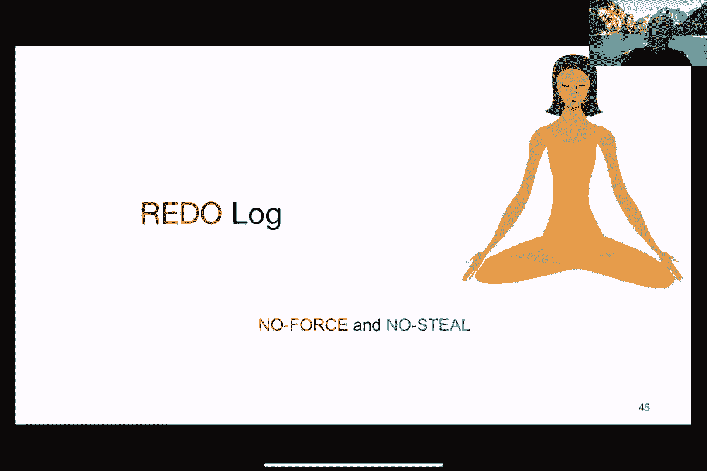
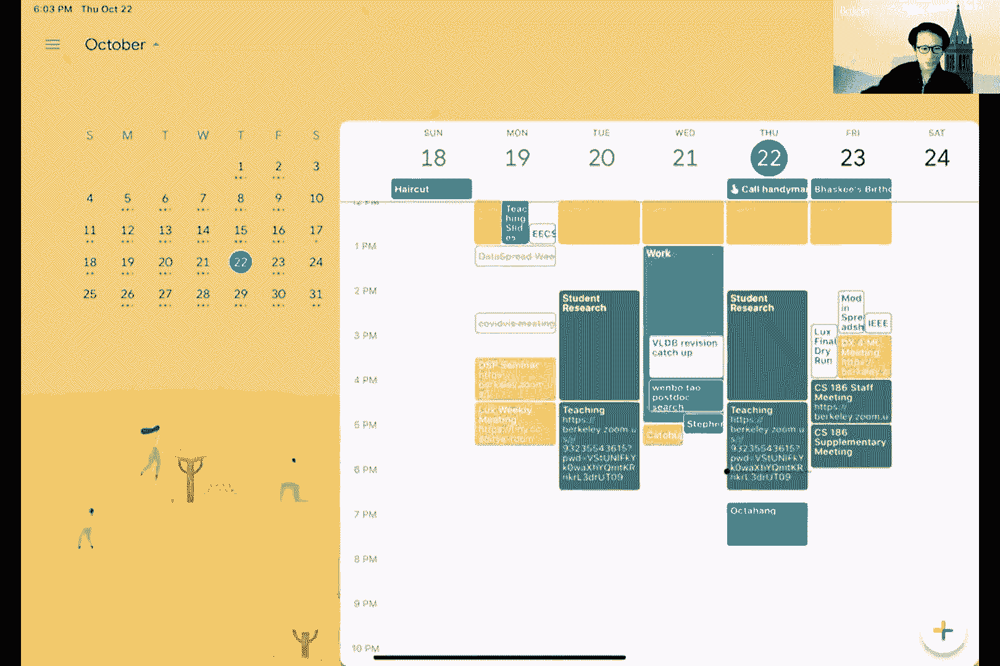
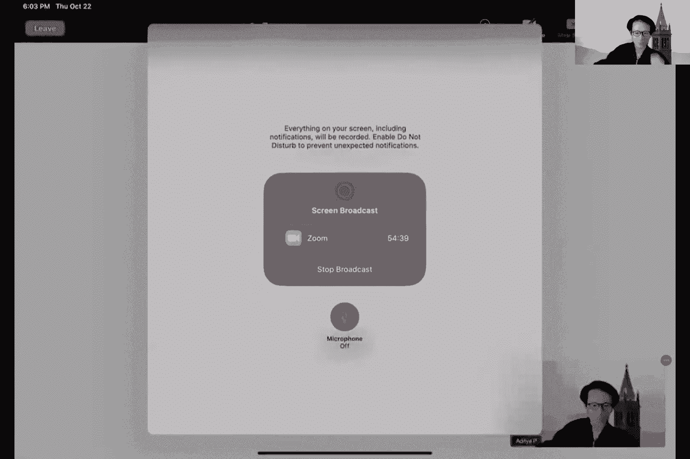
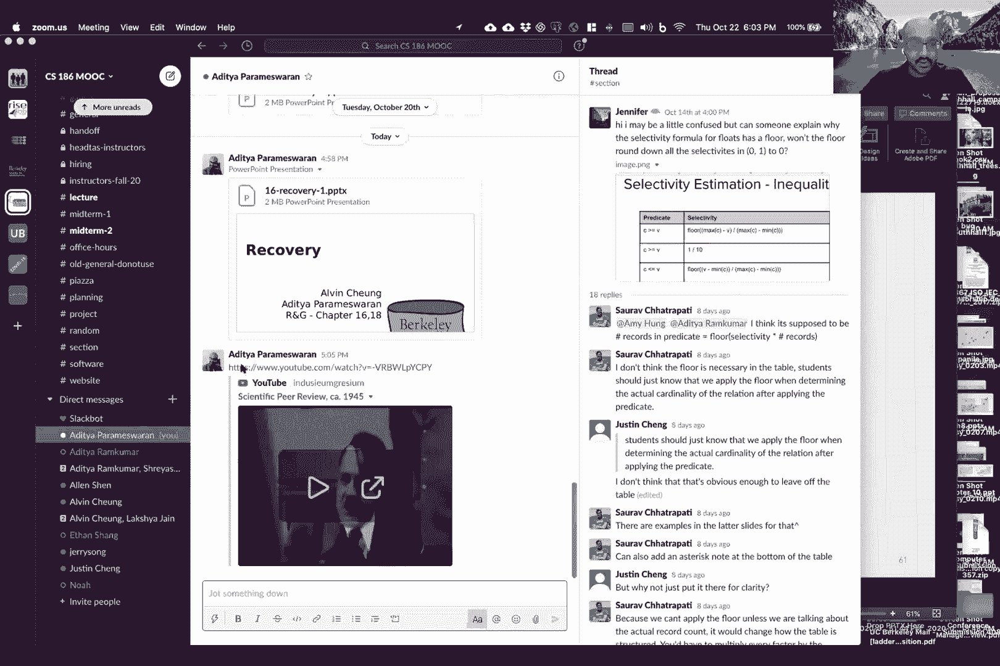
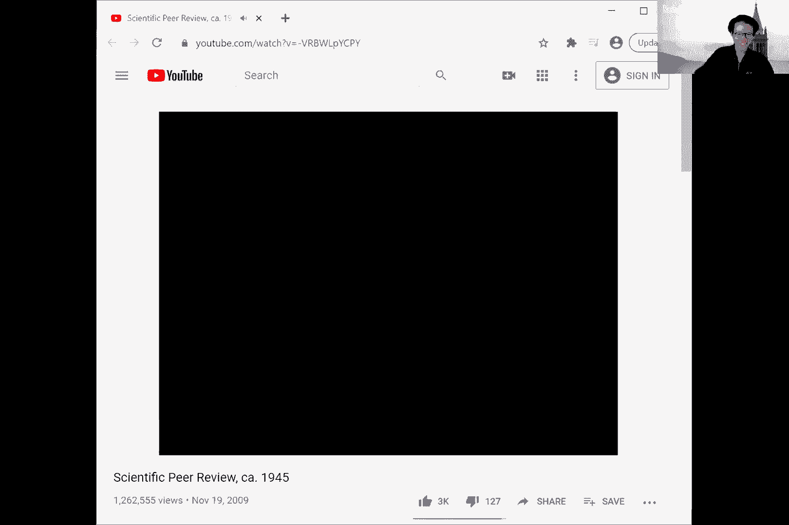
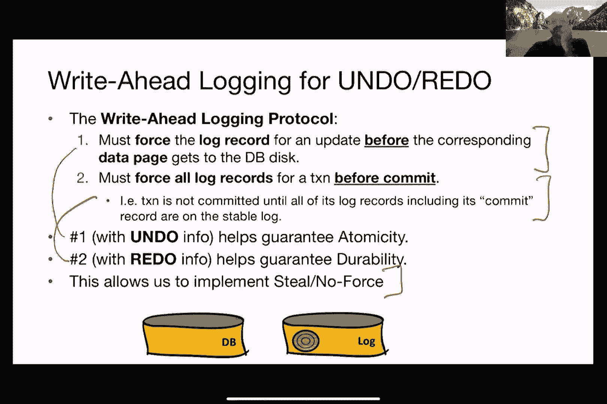
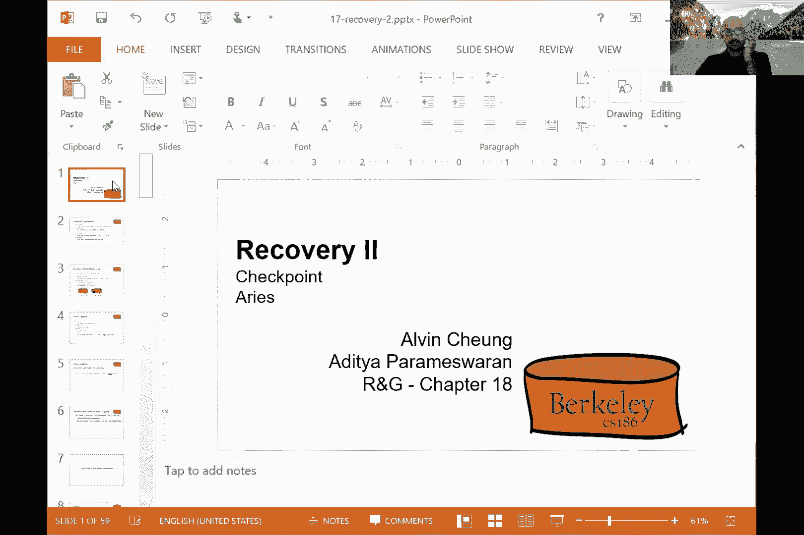
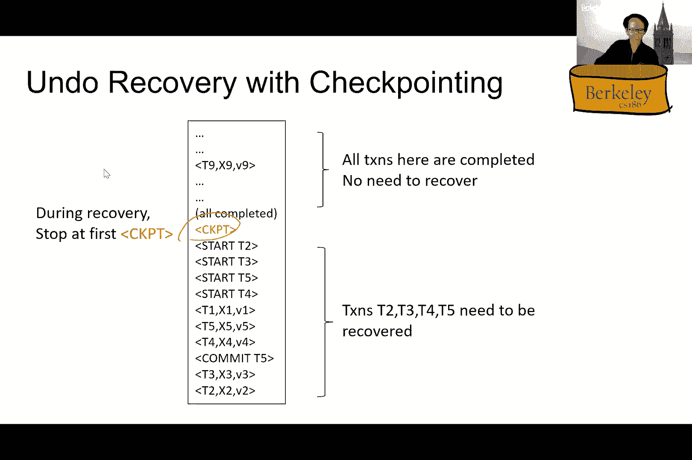

# P17：Lecture 17 Recovery II - ___main___ - BV1cL411t7Fz

 Okay。 I could try if you can。

 Oh， I didn't know you were here。 Alan， I think he， since I was already started。 I think it might be too late。 Okay， let's just get。 Yeah， just get started。 Okay。 All right。 So， um。 you were talking about recovery。 And， uh， yeah， good luck， Franklin。 Um。 talking about recovery and basically we were talking about how， um。

 what are the different flavors of ways in which things could go wrong。 And how can you recover from those failures？ Right。 So we talked about， um。 various types of mistakes。 Um， you could have operator error configuration error software failures or hardware failures。 We also have a natural case where you want to sort of， um， roll back the effects of a transaction。

 a border transaction。 For example， you have a sort of issues with the integrity constraints， right？

 And you want to enforce those integrity constraints。 So you roll back or a border transaction。 So these are all sort of like motivation for why the cover is an important topic and the two properties that we want to sort of satisfy our atomicity and durability。

 And that's going to be our focus。 So atomicity again is basically saying， Hey。 I want the effects of a transaction to be present either in its entirety or not at all。 Dutability is basically saying， um， after a transaction has committed its effects need to be， um。 on disk， right？ It needs to be there in perpetuity。 That's what we want as a guarantee。 Okay。

 so now we're going to talk about the mechanics of how recovery happens。 And so the assumption that we're going to make is that we have basically some flavor of concurrency control。 So in particular， we're going to assume strict to PL。 And then we're also going to make an assumption that updates are happening in place。 So basically。

 data is brought in to the buffer pool in the granularity of pages。 And then these pages are overwritten and then written back to the disk。 Okay。 so the transactions are not done on private copies of the data。 Everything is happening to these pages that are in the buffer pool。 So， um， the challenge。

 of course， is the fact that these are discontinuous， right？

 So you have the changes that are happening to memory and then these changes have been written to disk and these are not happening all instantaneously。 So things will be brought in from this to memory changes are made to memory and then written to disk。

 So that's one issue of discontinuity。 The other issue of discontinuity is that there is a minute。 There's often many changes that happen across objects。 And as Alvin mentioned in the previous lecture， you could have like locks being grabbed on various at various granities。 but a given transaction could have many different SQL statements and modify。

 either individual tuples or collections of tuples， what have you， right？

 So you could have many different sort of sequences of operations that are happening for a given transaction。 So we， it's useful to sort of recap about the buffer manager very quickly so you have this。 And then pages are brought in the buffer pool and these occupy frames within your buffer pool in main memory。 And so the blue squares here， the blue sort of rectangles in the grid refer to frames that are filled in with the disk pages。

 And so bringing these pages from disk or writing it out is known as fetching or flushing。 Okay。 so that's a terminology that we're going to be using。 And so you have some slots in the buffer manager for free frames that could sort of be used to to to house the next page that is brought in from this。 And as page requests happen from the higher level code for reading or writing various objects within these pages。

 these translate to fetches from disk of those pages into the buffer pool and then modifications happening to the buffer pool pages。 And then they are written out out， which is flushed。 And then one page here。 as the convention be followed in previous lectures， one page corresponds to one disk block。 Okay。 so now let's talk about the primitive operations here and the reason why we are being a little fussy about these primitive operations is because it'll help us understand this discontinuity that I was talking about。

 So when are things modified， where are they modified and how are things sort of written from memory to disk and so on。 We're going to use this sort of command read x， t basically saying that you copy the value of this data item x into a transaction local variable t。

 And this x could be， for example， a to go。 Right。 Right， x。 t is basically saying I'm going to take this transaction local variable and then write it into this data item。 Okay。 So the， these read and write are happening， basically from something that is in memory or to memory。 Okay。 So that's the way I would think about this。 So the fetches on the other hand are the relationship between memory and disk so fetch x basically brings a page containing data item x to the memory buffer。

 And flush rights the page containing data item x to the to disk from memory to disk。 Okay。 so these are the four operations that we're going to be working with。 So let's take this very simple example one single transaction。 Let's say a is equal to B is equal to eight at the start。 Okay。

 so we're not even talking at the granularity of two posts it's just a single values two single values a and B。 And so this transaction reads in a into this temporary variable t and then multiply it by two and then writes that temporary variable into back into a region B writes it into sort of reads the value of B into the temporary variable。

 t again multiplies it by two and then writes it back to be and then comments。 Okay。 so this is this simple transaction example。 And here。 a Thomas city that Thomas city guarantee that we want from our database means that either t commits and then。 is equal to 16 or T does not commit and is equal to be is equal to eight。 Okay， so these are。

 this is the basic guarantee that we want from our database the guarantee of a Thomas city。 Any question so far。 Okay， so here's let's talk about the sequence of operations spanning transactions local variables the buffer pool and the disk as various actions are taken。

 Okay， so， let's say that for a this object a it's current value is eight on disk。 And be the current value on disk is eight。 Now， by saying fetch a what I'm doing is I'm going to bring in the page containing a into a frame in the buffer pool。 I am going to read a the value of a to my temporary variable t。 So I'm taking the value of a from that page， and then placing it within T。

 I'm multiplying it by two to give 16 writing a back to T。 or writing T back to a so I'm writing it back to making， the page to the page in the buffer pool。 And then I'm proceeding to fetch be read be multiplied T by read be into T multiply T by two and then write P to write T to be。 Okay， so again， let's walk through this。 So fetch be basically brings in the page containing be into memory。

 And then I'm reading the value of B into this temporary variable T， I'm multiplying T by two。 and then I'm writing T to be。 So basically， I'm writing this value 16 into this location。 So I'm going to take this page in the buffer pool。 And then I'm flushing a and B。 So what that means is I'm going to take the page corresponding to a from the buffer pool。

 and write it to disk， and then take the page corresponding to be and then， write it to disk。 Okay。 and then I can commit。 So let's see。 So this is the sequence of operations。 Okay， so these are。 this is what is happening from this to to the pages in the buffer pool。 and then operations that are happening to the pages in the buffer pool。

 and then stuff that is written back out from the buffer， pool to disk。 Now let's see that was a crash， right， so between this flush a and flush B there was a crash。 Now。 is this bad。 Well， it's bad。 Right。 So firstly， you are left with a value of a on disk as 16。 and be on disk as eight。 And this is not the guarantee that we want right we want it to either be eight and eight。

 and the transaction does not commit。 Or to be 16 and 16 and the transaction has committed。 So crash here is going to be problematic for us。 Let's take another example。 Let's say it was a crash here。 Okay。 Is this a problem for us。 And some yeses。 So turns out this is also a problem。 It's also a problem because a is equal to B is equal to 16。

 But this is not committed。 And so because it's not committed。 potentially the user may try this transaction again。 thinking that their original transaction did not commit。 So they may try it again。 They may now go from 16 16 to 32 32。 Right。 So this is this is not ideal。 Okay， so。 All right。

 so let's take one more example。 So here I'm， I have a crash between the eight， eight and 16， eight。 So between these two steps。 Right。 So this is not a problem or not。 This is not a problem。 Okay。 And the reason why this is not a problem is that you have a crash。 but you've not changed your original data and you've not told the user that the thing committed。

 So the transaction did not commit so the user can certainly try again。 And then updated subsequently to 16 16 if they wanted。 Okay。 so in this case we are good because the transaction did not change the database state。 From eight to something either 16， eight or 16 16。 Right。 So they didn't change the database state。

 So we are actually in a good shape。 But we still had two cases of problematic crashes right between flush and flush B and after both the flushes are done。 So both of these cases were problematic for us。 Now。 given that we had issues with sort of synchronizing the flushing。 What if， for example。 we delayed the flush to after the commit。 Okay。 So what have we said， look。

 let's not mark with the data on disk。 Let's wait until that commit has been completed。 And then and only then to be flush things to disk。 Okay， so let's delay writing things out to disk。 So delay flushing things out to disk until we finished committing。 And let's see if this helps us。 So here， I have a commit and then I'm flushing a and B。 So， are there any problematic crashes here。

 So， you could commit， but then not actually right if you crash in between that's precisely it。 Right。 So you could commit， but you've not actually written anything out。 Right。 So you could commit。 And then there could be a crash here。 Or here， and you may end up， sorry。 here or here。 And you would end up with problems。 So what if it is a crash that happened here。 Well。

 here you've told the user that you， they， their transaction has committed。 but it's not actually committed。 So the user might actually be deceived into thinking that the values have been multiplied by two。 but it's actually not。 So here if things have crashed between the flush and flush be your left in this weird state where one of the values is 16 one of the values is eight。 you no longer have this， the consistency of the values of a and being the same。 Right。

 So you left in this funky state。 So you do have problematic crashes in this context as well。 So the solution for all of this is to write things down。 Right。 So before you go ahead and update at the highest level before you go ahead and update before you go ahead and update update data on disk。 You write things down。 Right。 And before you go ahead and commit your right things down。

 So you basically write things down before you go and take certain actions。 And so that notion of writing things down ahead of what you need to do ahead of what you're going to do is what is known as the right ahead log。 Okay， and so this is an important sort of solution concept that I hope you sort of pay some attention to and try to try to understand as much as you can。 So this notion of a right ahead log is basically it's just this file where you keep appending elements that are log elements or log records to this file to the end of the file。

 Okay。 And this log is kept usually on a different disk separate from the data pages so you keep the data pages as they are but you also have a separate right ahead log that just recording all the actions that you're taking。 So for every update， commit or abort operation， you end up writing a log record。 Okay。

 so you're just logging these operations as you get it as as you as you make changes。 So you do have multiple transactions running concurrently because we are in to PL mode。 And。 and you do have multiple transactions running concurrently。 So these log records would be interleaved across these transactions。

 And then after you have a system crash these this log is used to ensure both durability and atomicity。 So you basically use a log to redo transactions that did commit and redoing ensures that you the transactions that commit persist。 Okay， so they are durable。 And you use the log to undo transactions that didn't commit。 And then the transaction didn't commit during at the point of the crash。

 We basically undo all of their effects。 And you get back to a point where the transaction it。 it's almost as if the transaction never executed so undo ensures atomicity。 And then you can use some performance implications of a log as opposed to page rights。 The first thing is that log the log is sequentially written as opposed to page rights and page rights could have random i。

 So， if you remember， you're just sort of adding things at the bottom。 So it's writing things in sequence and if you remember our disk lectures sequential i is much faster than random i。 The second performance benefit that you get from a log is that a log can be compact。 And so you only need to store the delta as opposed to storing the writing out things at writing out an entire page independent of the change that you made。

 Okay， so， for example， if all that you did was you touched one tuple in a page you can just record the old version of that to pull in the new version of the two。 you don't need to record the rest of that page。 Right， so as part of your log。 And so what this gives you by storing these deltas you can pack many， many。 many log records into a log page， often spanning the changes that you have made to multiple pages。

 Okay。 Okay， so now that you know what a right ahead log means。 there are two important decisions that we need to make in terms of logging policies。 So the first decision is whether we are using what is known as steel or no steel。 Okay。 so this is the decision one， and the steel no steel decision allows us to it impacts the notion of atomicity。

 The second decision that we'll talk about will impact durability。 Okay。 so the steel policy basically says， I will allow the buffer pool or equivalently another transaction to steal a pinned page of an uncommitted transaction by flushing it to disk。 So basically what this means is， if you have an uncommitted transaction that has updated some data page。 this dirty data could be flushed or disk and override disk pages。

 The no steel approach on the other hand， this allows this from happening。 Okay。 So why is still potentially a problem。 Right。 If we allow steel。 then we need to deal with the fact that you have an uncommitted transaction。 That is。 that is updating pages on disk。 And therefore to ensure atomicity。

 we need to support the undo of these uncommitted transactions。 Right。 because this uncommitted transaction may end up not committing it may end up getting aborted or there could have been a system crash。 Right， so any changes that it makes to disk， it needs to be undone。 Okay， so for steel。 we need to be able to support the undo of these uncommitted transactions because they are mocking with clean data on this and making it dirty。

 On the other hand， the no steel approach has poor performance。 because if there's a transaction that is like hogging a bunch of pages。 then another transaction can't simply say， you know。 you need to write your pages out to disk so that I can get some pages。

 So basically it's limiting buffer replacement。 So no steel has poor performance because you get saddled with lots of pages that are pinned by uncommitted transactions。 But on the plus side， you don't need undo。 Right， you get a domesticity for free。 So the only time you're writing things out to disk is when a transaction has committed rather than for uncommitted transactions。 So this is the first decision and some an important one。 The second decision is force on no force。

 And this impacts the other property， which is durability and consequently redo。 So force basically ensures that all updates to a transaction are forced to disk prior to commit。 And on the other hand， the no force property doesn't have this restriction。 So what are the impacts of no force。 Okay。 So the impacts of no force is that you can have committed transactions。

 whose effects may not be visible on disk。 And therefore they may not be durable。 Right。 So if you basically say， you know what， you're not forced to make your changes to disk prior to commit。 then a transaction could have committed and left the system and its effects may not be reflected on。 Right。 And the user has been notified。 Hey， your transaction committed。

 they decided to go have a party。 They think the transaction is committed。 but it's actually not committed。 Right。 It's not reflecting on this。 So in order to enforce。 ensure durability， we therefore need to support redo of these committed transactions。 Right。 So we need to be able to redo them to ensure that they are reflected on disk。

 especially when there is a system crash。 On the other hand， the force option has poor performance。 And the reason why it has poor performance is that in order for a transaction to commit。 you need to sort of write out all of the pay， all of its updates to disk。 And these updates could be all over the place。 Right。 These updates could be all over the place。

 All of them have to be written out to disk before the transaction is allowed to commit。 And another reason why this is problematic is there could be some pages that are being updated by many。 many transactions at a time。 And this page， rather than allowing it to stay in the buffer pool。 you're forcing it to be written out to disk。 Right。 You're forcing it to be written out to disk。

 And so there are all of these issues because of being forced to write things out to disk before you commit a transaction。 On the plus side is that no redo is required。 You get durability for free because all of the updates made by transaction are forced to disk prior to the commit。

 you get durability for free。 Okay， so this is the high level sort of buffer management design decision summary。 right， from the perspective of recovery。 So you have to access force no force and steel no steel。 The steel and no force option is the best option from a performance standpoint。 But it's also the option that requires both undo and redo。

 The no steel and force is the worst option。 It requires neither undo not redo。 On the other hand。 no steel no force requires redo but no undo。 Steel and force requires undo but no redo。 Okay。 and so this is what is known as redo logging， because you don't need any undo for no steel no force。 This is what is known as undo logging because you need no redo。

 And this is known as undo redo logging and a variant of that which involves a lot more sort of mechanisms to make it more efficient is what we're going to be studying later。 which is， not redo logging。 So we will start by talking about undo logging。 which is forced steel and then talk about redo logging。 which is no steel no force and then we'll talk about undo redo， which is areas after that。 Oh yeah。

 I kind of have two questions。 First of all， is a lock something that we have to write to the disk or do we just keep that in the memory。 So look， I mean， the， we absolutely have to write the log to disk， right， because I mean， there is。 as soon as there's a system crash， whatever is in memory disappears。 And so if you want。 for example， so imagine that there's a， there is a transaction that is uncommitted that is deciding to update some data on disk。

 Okay， you have to， before it updates a data on this， you have to not just write it out to a log。 you also have to write that log page out to disk， because otherwise anything that's in memory disappears。 Right。 So anything in memory disappears。 So before you touch that data on disk。 you need to write stuff out and we'll talk about examples of that in a little bit。

 but that log is not just something that resides in memory。 It's also on disk。 Right。 That kind of brings to the sudden question that I have。 How do we ensure there is not a situation where kind of you do the thing， but you crashes。 So you fail to actually write the log for that。 Exactly。

 So that could be cases where portions of the log have been written out。 but not all of the log can be written out。 And these are all things that we need to worry about as part of the policy。 Yeah， so we do need to worry about that。 For sure。 Yeah。 Thank you so much。 How is there no undo in like the no steel force， because it seems like you're still writing like dirty data to disk before a commit。

 Okay， that's understood the definition。 No steel no force。 Okay， so let's walk through this again。 Okay， so no steel no force basically allows for no transactions to the buffer pool。 The buffer manager to not steal any pages that were written by uncommitted。 That that are owned by let's say pin by uncommitted transactions。

 And no force basically means that the pages that are。 Okay， so let's let me show the definition。 So no force basically says that。 All the updates of a transaction are not necessarily forced to disk prior to commit。 Okay。 So how do we ensure。 How do we ensure that a transactions effects are durable if you're in the no force paradigm。 Right。 Well， in order to ensure durability in the no force paradigm。

 you have if a transaction is allowed to commit。 Then this transaction must write out to the log。 which then needs to be written to disk。 So the， the， the data pages may not be written to disk。 but the log is suddenly written to disk。 So you can always use a log to recover and we'll talk about mechanisms for ensuring。 But that's that makes sense。 Yeah， I think the， the reason that。

 like from what it sounds like is when you have force， then you might have。 You have everything written to disk before your commit。 And so you need undo possibly。 But you don't need to redo because everything has already been written out of commit。 But with no force， you need the undo because you can have the redo because you can have dirty pages yet to write。

 And then a commit crash and so you need to redo it。 Is that accurate？ Yes。 Okay。 Yes。 I think it's。 it's useful to think of both in tandem。 So the， the， so the force decision basically。 if you opt for no force， then you have a committed transaction whose effects may not be visible on disk。 So therefore you need to be able to support redo。 And if you use steel。

 then you have uncommitted transactions that are mocking with data on this。 Therefore you need to undo their effects。 And so in our， that's a。 that's a way I like to think about this。 Okay， look。 All right， so let's talk about the undo log。 which is basically forced and steel。 Okay。 So in undo logging。

 you have various types of log records， you have a start transaction。 which basically indicates the transaction has begun。 You have commit。 which basically indicates the transaction is committed。 Likewise for abort。 And then the update statement， which basically says the transaction has updated element X and its old value was P。

 Y is the old value important。 Well， we are in the undo logging paradigm。 And so in order to undo。 we need to record the old value before an update has taken place。 Okay。 so let's take a snapshot of life under the undo logging paradigm and see how things could go wrong。 And how， what are the guarantees that are provided by the undo logging paradigm。 Okay。

 So this is a snapshot。 Okay， so here you started your log with the， and you had this transaction。 which is reflected in the log as start the， at the point where you wrote。 you made a change to this page in memory， you decided to write the old version of that change to the undo log。 Likewise， you did the same thing for the old version of B。 And then after you had flushed a and B。

 you wrote out a commit message。 Okay， so this is what is shown in the log。 This is a log on disk。 Okay， so this is what is shown on disk。 Now， let's talk about crashes before we talk about the guarantees that are provided by this undo logging paradigm。

 So let's say you have various kinds of crashes。 Let's say we have a crash here。 So what do we do in this context。 So what we have basically imagine that none of this is visible。 Right。 Everything disappears， because all of this is temporary state that's in memory。 You've crashed the all that you can see is what's on disk and what is in your undo log。

 Now looking at your undo log。 What can you tell， right。 So what， what would we do in this context。 So looking at the underlog， would you be able to is has transaction T committed or not。 It's not committed right so you've not seen a commit message。 You， you。 you know that it's not committed。 Since it's not committed。

 since the underlog says it's not committed。 What you end up。 what you're going to end up doing is to undo its effects。 Right。 So how do you undo its effects well。 You look at the previous value for B and then change it to eight or whatever value of B exists on this you change it to it。 And likewise， you update the value of a to eight。 And here by logging the old values of a and b on the log。

 I can go back or I can undo the effects of any changes I may have made。 In this particular case。 not that I only made a change to a on disk。 I didn't actually make the change to be but still I can undo that。 I can replace B with the old value， which is the same value and it doesn't hurt me。 Right。 Does that make sense。 So here I can undo by setting B is equal to eight and is equal to eight。

 What if I have a crash here。 After the commit。 Do nothing no big deal。 Yeah， you're right。 Right。 So the law contains a commit。 That means that I don't really need to do anything。 Right。 That means that if I see a commit。 That means that the effects of this transaction are on disk。 And I don't need to worry about this。 Right。 So let's why don't we take。

 Should we take a break Alvin since we are roughly around mid the mid way point。 Or should I keep going。 Sure。 So it's the next part of the reader part or no I still have more on the undo part。 Or should I continue with the undo and then take a break after that。 Yeah。 I was thinking about that。 Okay， let me do that。 Okay。

 so one decision here that I need to make is when should I force pages from my log and pages from my buffer pool the data pages to disk。 And so in the undo logging paradigm。 I need to have this entry。 The old version of a to be written out before I flush a。 Why is that。 Because if you flush it before you log it wouldn't your value not be saved or it'll be saved a new value instead。

 Exactly。 If I， if I don't have this entry in my log on disk。 Before I flush a。 then I have overwritten a and I have no way of going back to the old value of a。 So therefore I must have this on disk this entry on disk before I flush a。 Likewise。 I must have this entry on disk before I flush B。 And since we are in the force paradigm remember that undo is steel and force。

 Since we're in the force paradigm， we want both a and B to be flushed before I commit。 Okay。 so overall these are my rules。 I have the log entries to be that represent the updates the old versions of whatever I'm updating to be on disk first。 And then I want all the flushes to be on disk or basically all the flushes to happen。 And then I want my comment log record to be on disk。 Okay， so that's the sequence of updates。

 So let's go through these rules in a bit more formal sense。 So the first rule basically says。 if T modifies x， then T x V， the old value of x must be on disk before I flush x。 So the reason why I have this rule is that I want to record the old value before the new value replaces the old value permanently on disk。 Okay。 I need this so that I can record the old value and I can undo the effects of this uncommitted transaction if needed。

 The second rule basically says， if T commits then flush of x must happen before。 So all the changes written by T have been reflected before T is allowed to commit。 This is because we are in a force paradigm。 Right。 So we want to not worry about redoing。 We want durability for free。 So that's what we get from the second rule。 So that allows for steel。

 The second rule is basically forcing updates to happen with to be reflected on this before a comment happens。 And so here。 Flushes are done early before the transaction commits and we'll contrast this to redo logging。 What in？ Yeah， I'm a little confused because early on you define flush to be writing the page to this。 And here it seems that we are distinguishing that like writing to disk and flushing。 Yeah。

 so this is this is a typo。 So flush x must happen。 Let's say it must happen。 Before committee。 does this make more sense。 Flush x is basically the operation that flushes x to。 To be even more precise flush x for all updated pages。 X must must happen before committee。 Yeah。 just to clarify。 Then for the first rule when you say that we need to write it as before we flush。

 And that is， is the flush referring to just getting rid of the value from the buffer pool。 Yeah。 flushes refer referring to the data page containing x to be written out to disk。 So this entry TXV is a log entry。 We want the log entry to be written out of the log before you update the corresponding data element in some data page。 Basically， the page in your buffer pool is written back out to disk。 All right， thank you。 Okay。

 so let's talk about recovery with an undo log。 So there are several questions that we need to address。 First is which updates need to be undone。 Well， the updates that we need to undo are all updates made by all uncommitted transactions。 Right。 These are all of the updates that need to be undone when a crash happens。 So far back to we need to go in the log。 Well， we need to go far as back as the start of the earliest uncommitted transaction。

 Right。 So you， you need to retrace your steps up to the start of the earliest uncommitted transaction。 Unfortunately， if you don't have mechanisms to say where that earliest uncommitted transaction started。 then you're out of luck。 You have to basically read through all of your log。 So this is has some severe performance and implications。

 Some of these performance implications are fixed by the scheme that that admin will present later。 The third question is what happens if there's a second crash during recovery。 Right。 so let's say you're doing the recovery and there's a second crash that happens。 That again is kind of okay because here on do is the item portant。

 So if you undo and undo that's okay。 You basically had already correctly replaced and a new value that was made by an uncommitted transaction to an old value。 Now you're going to replace a whole value with the same value again and that's okay。 So on those item portant that's okay。 Again， this has some performance issues because if you keep crashing and you keep repeating the undoes that's not ideal。 So again， AD says mechanisms to improve on this。 So in recovery。 So these are the steps that happen。

 The first is after a system crash you run the recovery manager。 you decide for every transaction whether it's completed or not。 So there are two types of flavors of completed transactions。 Either you see a commit or an abort。 And if you don't see either a commit or an abort， then it's basically going to be uncommitted or incomplete。

 And for all of these incomplete transactions， you are going to undo its modifications。 And so to undo its modifications， you read the log from the end。 So go back in time。 If you see a commit or an abort record you basically can mark。 If you see an update and if T is not completed， then you replace whatever is the value of X on disk with B。

 Okay， so you replace X with its old value B。 If it is completed， then you can ignore it。 And then if you have， if you encounter start transaction， you can ignore that statement。 You don't need to do anything with it。 So how far back do you need to go？ I like I mentioned。 you need to go all the way back to the very start。 And this。

 you could have a very long running transaction that started at the very start of your log。 and it's still continuing to run。 In theory， in the worst case， in practice it may not happen。 but you still have no option but to go all the way the very start。 This is fixed by this notion called checkpointing， which basically allows you to put in。

 in some sense， checkpoints， which basically say that I allow。 You can think of this as as as as ways to temporarily save state。 so that you don't need to go back beyond those checkpoints in the log so it allows you to go back to only these checkpoints。 rather than going back all the way to the start。 So what happens in this example let's walk through what we might want to do。

 So you start at the bottom and you go up in recovery with undo。 So you see this log statement。 which is basically saying the old value of x two was V two。 So what you're going to do is you're going to just simply write V two to x two on disk。 Then you see the next statement， the next log statement， which is from transaction T three。

 which is saying the old value of three of x three was V three。 So it's simply going to say， okay。 I'm going to write V three to x three on this。 Then you see a commit statement。 So what you're now going to do is you're going to say， okay， any updates that I see from T five。 I don't need to worry about it because it's committed。 Okay， so you're going to keep committed。

 Transactions， and you're going to record five that T five there。 because you need to no longer worry about its updates everything else you need to undo。 Then you can mark T five as completed。 You undo the effect of this update from T four。 then this update， which is from T five you can skip over because you know that。 T five committed。

 You undo the effects of T one。 You undo the effects of T six and so on。 Okay。 so basically you go back from the bottom to the top。 You identify if a transaction is committed or not， if it is committed。 you don't need to undo its effects all other， all other updates you need to undo。 Any questions。

 Nicholas。 So I just had a general question on like how， like， what is it for snow steel would work。 Because you mentioned that like sort of no steel allows us to not have to undo。 but if we have like for snow steel， then we have to write the changes to disk before we commit。 But if like for example we write we're writing changes to disk。

 and then we crash before we commit them don't we still have to like， you know。 go back and undo the changes that we wrote to the disk。 Okay。 hang on a second go a little slow and let's talk about which which variant you're talking about which reading into where you're talking about again。 I'm talking about force no steel。 Okay， you're talking about no undo and no redo。 Okay。

 So in that case。 So what was your question again。 Yeah。 so I guess sort of since we have force we have to write changes to disk before we log that we committed right。 But if we like， you know， write changes to disk and then crash before we commit wouldn't we still have to undo those changes that we wrote out。 Correct。 Yeah， so that is a。 So in fact this particular。

 This particular combination does not provide atomicity without actually having this not provide either atomicity or durability。 This is an exact this in fact is a case that is described in the textbook。 As a case that does not provide either atomicity or durability。 But this is not a case that is that is desirable either not just because it has worse performance but also does not have guarantees without additional。

 In this case， let's see， would it be undo or redo mechanisms。 In this case。 since you are forcing updates to disk， you still have a log。 And so you can ensure that the log allows you to。 Let's see。 I'm confused。 I confused myself。 I think the problem there is you won't be able to tell whether something has committed or not。

 Right， because like what you said Nicholas， you could have not written the commit yet to the to the desk。 And then you have written everything else already。 Right。 So you need a mechanism to say if you are you need to redo or not。 Is that what you're saying。 Alvin？ Yeah。 So you still might need redo in that context。

 even though it claims that you're in neither undo nor redo。 You're basically unrecoverable because you basically can't tell whether something has fully committed or not。 So that's the problem。 Yep。 In this case， even without the fact that you might still need other mechanisms to recover for that particular case。 it also has really bad performance。 So it's a case that we should ideally not worry about。 Okay。

 thank you。 Okay， so let's keep going。 I don't I take a。 why don't we take a break since we come finish the undo logging and we are about to start redo logging。 So why don't we take a break and we'll， we can play a video while we take a break。

 Well， but before that I think I would actually encourage everyone to turn on their videos as much as possible because we need to use a laughter meter to figure out whether that's something is funny or not。

 Now we need to work harder on that。 I'm finding good stuff right so yeah you guys tell us。

 Okay。 I mean you guys can give us my thumbs up or down afterwards。 Okay， so I don't know if I can。

 Can I give you the link sorry I think it's not allowing me to share sound。 Okay。 how are you sending it to me or I okay let me let me send it to you via。 Okay。

 I mean do you see it。 Okay， I'm going to open it。 Okay。

 Okay。 Okay。 Okay。 So， I put on audio。 I don't think the audio is going to help much。 I think it's just sort of supposed to be the vague angry ranting that。 Okay。 Okay。 Okay。 Okay。 Sorry。 Okay。 Okay。 Okay。

 Okay。

 Okay。 Yeah。 Okay。 Let's share。 I'll try to find the link and share it with everyone as well。 So。 I'm going to quickly return to Nicholas's question for a second。 And so I think basically this is the policy that we're talking about is no steel and force。 And so what happens there like Alvin mentioned just to recap。

 You are forcing all of these dirty pages to disk at commit time until that commit time all dirty pages tape pin in the buffer pool。 So at least from a performance standpoint， it's not great。 But at commit time you're forcing all of those dirty pages to disk。 And so as you're forcing some of these dirty pages to disk。

 If you have a crash halfway through that， you basically not recoverable， like Alvin said。 so you basically in a state where you have， you don't have a Thomas city。 Right。 So unless you add in and logging and then undo from that you don't need redo you do need undo because you don't have a Tom city。 Make sense。 Nicholas。 Okay。 Okay， so returning to redo logging， which is no force and no steel。

 All right。 So in redo logging， we have a change to the log elements。 And so the change the log elements is that we update。 we change the value V that we're storing for each element to be the new value， not the old value。 Okay。 So here's the snapshot of the execution with the log shown here。 And so in this case。

 you have your start T and then T and 16 is written so this is a new value that is being written out because the value in the buffer pool was updated from eight to 16。 Likewise for B。 And then you have the commit log record。 And then the flushes happen。 Okay。

 in this paradigm the flushes happen after commit。 And we'll talk about that in a second。 So let's start by talking about crashes。 So if you have a crash here。 What do you do。 How do we recover。 So you have to go out 16 to a and B again。 Yes。 Right。 So you have committed。 Right。 You are in the no force paradigm。 You have committed。

 But you don't know if the effects of the transaction are durable。 In fact。 you could have been in between writing the changes made by the transaction to disk and then have had the system crash。 So you basically redo the effects of this transaction。 So you basically write out 16 to a and to be。 Even if you crashed here you would still make that same decision you would still write out 16 to a and B。

 Even if you crashed here you would make the same decision。 Okay。 So this is all cases where you redo by setting a is equal to 16 and these equal to 16。 If you crashed here between right before the commit statement。 How do we recover。 Do we need to do anything。 No， right。 And the reason for this is that because it's not committed you know that there's nothing that the transaction would have done to data on disk。

 Okay， so you know that it did not， it did not commit and therefore it's not yet touched data on disk。 So you're in okay shape。 So in this context， when should we force pages to disk so the log pages as well as the flushes。 Since we are in the no steel paradigm。 The commit has to happen first before any data on this is touched。 So the flushes happen after commit in this。 So in the redo logging paradigm you have a single rule which basically says if T modifies X。

 then both TXV as well as commit T must be written to X must be written to the disk before the flushes happen。 Okay， so simply you can just ignore this you can just say commit T must be written to this because commit T implies that all of the updates made by T are also written。

 So in this case， the flushes are done late， because again we're in a no steel regime so the commit has to happen and then the flushes will happen。 Okay， any questions about this。 So how do we do recovery with a redo log。 So after a system crash happens you run the recovery manager。 you check for every transaction whether it's completed or not。 So if you have。

 if you have either seen a commit or an abort statement。 then this transaction has completed so you don't need to worry about it。 So if you haven't seen a committer abort， then you need to read， then。 then you don't need to worry about it。 Sorry。 If you have seen a committer abort statement。

 then you， you know that you need to undo its effects。 Or redo its effects。 If you haven't seen a commit statement yet， then you don't need to worry about it。 So you read the log from the beginning and you redo all the updates of the committed transactions。 So you basically check。 Once again step one you check if each transaction has completed or not。

 So these two either commit or an abort means that the transaction has completed。 If you see it start transaction with no commit or abort that means the transaction has not completed so you don't need to worry about it。 It's not touched anything on this for all of the transactions that have completed and have committed。 Those are the ones that you want to do。 So you start the log from the read read the log from the beginning and you redo all of the updates made by the committed transactions。

 Okay， so again this is going to be slow potentially because you start from the log and then you go all the way down。 You fix this with checkpointing and this is going to be covered as part of the series logging undo redo logging system。 So how would redo logging work。 So you start by looking at the first statement。 which is start t one。 Actually before that you need to figure out which transactions have committed or not in this case。

 Right。 So here you， you notice that T two has committed。 If you recall the previous page。 we had to determine which transactions have committed or not。 And you want to redo the updates of the committed transactions。 So the first step is to identify which transactions are committed in this case。 It's just T two。

 Then you start at the top of the log and then you redo the effects of T two alone everything else you can skip over because you know that those transactions have not touched this。 So you skip over the update made by T one， you skip over the update made by T。

 Actually for T two you need to write。 You need to redo its effect。 You skip over the update made by T one， you skip over update made by T three and then skip over the update made by T one。 So in this particular case， you didn't actually have to do much you just had to write me to two x two on desk。 So replace redo the action that T two had taken to x two。 B two is a new value of x two。

 So we actually efficiently determine if a transaction has committed or not。 Right。 So。 this is going to be the focus of the Aries part but one simple way the naive way would be to go through the entire log and see all the transactions for which you've seen a commit entry。

 This is obviously not ideal。 So the mechanisms that we're going to be talking about in Aries will allow you to skip the large。 a large fraction of the log by taking checkpoints that allow you to use the checkpoints to sort of read only suffix of the log rather than reading all of the log。

 Theoretically， we could never know when we flushed to disk right since it's not trapped in the log。 Yeah， so all that you have is the log and you know you have the data pages。 So you basically have to do forensics here by trying to correlate what you see in the data pages and the log to reverse engineer。 How far you need to go and which actions you need to undo which actions you need to redo and so on。

 In this case just we do。 Okay， so quick comparison of undo redo logging so undo logging basically ends up flushing data pages early。 So since you are in the steel policy you flush stuff early。 And if a commit is seen。 then he has definitely written all of its data to disk。 Things are durable because again this is steel and force so we are forcing everything to disk before the commit。

 So you don't need to undo in this case。 Right， if you have seen。 if you don't haven't seen a commit you need to undo that transactions effects and redo logging the pages。 Page flushes must be done late。 Since we are in the no steel paradigm。 And if commit is not seen then he is definitely not written any of its data to disk so there's no data on disk only data the disk is only touched if commit has been seen。

 And so for all of the committed transaction you would need to redo。 So the pros and cons for undo logging and redo logging on to again a steel force。 The pro is that it's less memory intensive because you flush these updated data pages as soon as the log records are flushed。 So as soon as you are confident that the log has everything that you need to undo。

 You can flush the updated page up data pages and move on。 And then and only then you commit。 This has a higher latency because you are forcing all of the dirty buffer pages to be flushed prior to commit。 Right， so unlike the redo logging case where you don't force this it's no force here you're forcing everything to be flushed prior to a commit。 And this could have lots of random I like we described earlier。

 The redo logging case you're in no steel no force。 So the con is that this is more memory intensive you are holding on to these pages in the buffer pool。 all the pinned pinned pages stay in the buffer pool。 All the pages from an uncommitted transaction stay in the buffer pool until the commit message has been flushed if the commit message has been flushed then you can start flushing。

 The pro here is that this slightly lower latency you don't need to wait until all of the data pages are flushed in order to commit because you're not in the force paradigm in the no force。 Okay。 So， returning to our slide here， we covered these two we're going to cover this next。

 as part of the scheme。 So for this under redo logging team I'm going to be it up for an element to take take on the mantle of governing areas。 The log is now going to look slightly different。 We're going to have the transaction ID。 We're going to have the page ID， as well as old data and new data。 So you have both old version and the new version because you need to support both undo and redo。

 And this is kind of like abstracting away some details is additional information。 like different types of different flavors of log records and so on。 And we'll。 we'll see all of that in a little bit。 Okay， so far this law logging protocol。 there are two conditions that need to be met and if you have understood redo logging and under logging these two conditions will make sense to you。

 So the first condition basically says， you must force the log record for an update before the current corresponding data page gets to disk。 So you must log what you're going to do before you end up mocking with the data on disk。 This is for an uncommitted transaction。 So you must do must make this change before you dirty data on this。 The second thing is you must force all the log records for a transaction before a commit。

 So transaction is not committed until all of its log records。 including the commit log are committed record are on the stable log。 This allows us to correctly determine whether a transaction has been committed or not by looking at the log。 Okay。 So this first rule， along with undoing health is guarantee atomicity。

 because you have uncommitted transactions that are updating pages on disk。 but because you have the log record you can undo its effects。 So the second rule。 along with redoing health is guarantee durability。 you're not forcing all of the data pages to be on disk before commit you're only forcing the log records。

 including the commit log record to be on disk。 And so using the log record you can redo the effects of a committed transaction that has not yet been reflected on this。 So overall， both of these allow us to implement steel and no force。 Okay。 so that's the one that we want because it gives us maximum flexibility。 Okay。 so I think that's all that I wanted to cover here。 I'm happy to take questions while Alvin sets up。

 I'll go。 Sure。 There's also five minutes left so it's not a lot。 Yeah。 Yeah。

 Yeah， so this part basically brings up on what a detail was saying earlier。 So just to remind ourselves， right。 So in this world。 we have four different types of operations that we wanted to do。 We write fetching a page from the disk and flushing it right。

 And then these are just lies that a detail was talking about just now。 So I'm not going to repeat that so just to just remember that in this where we use right headlock right ahead logging。 meaning that everything has to first persist to the lock before actually happen onto the disk。 Right。 So we already went to undo logging and then we also went through redo logging right in terms of what actually gets locked。

 Well， the problems with this undo and redo logging mechanism is every time we need to recover from the very beginning of the lock。 which is computationally intensive。 So I did， yeah。 basically mentioned about that for a few times already。 So the whole goal of this portion of the lecture is to basically talk about another scheme that allows us to not always start from the very beginning in order to do recovery。

 Although I would also say that， like you know， from the even in the redo and undo scheme right for recovery。 If we already have knowledge， have the knowledge about like， you know。 what are the committed transactions that we actually might not need to always read all the way to the very beginning。 or all the way down to the very end of the lock right now to recover。 So just to keep that in mind。

 So I have three minutes left so I guess I'll just introduce what this is all about and then we actually go on。 go on to the actual mechanics of the algorithm next week。 So this areas algorithm is a recovery technique that combines both redoing and undoing。 It was actually developed right here in the Bay Area is down in Almadin so by San Jose by a person by researcher。

 cost C Mohan。 I think they will really send out the paper in the chat so I'm not suggesting you to read that paper because it's actually very dense paper to read。 But you're interested you can also just， you know， scheme through it if you like。 They actually made different variations of this algorithm the one that we cover in this class is kind of like the most basic one。 The one that you implement in the project is pretty much follow the lecture format except that there are a few extra thousand whistles that were thrown in to make it even more efficient。

 But you see different versions of it if you go out to check out different implementations。 So the first thing to understand in areas is this notion of a checkpoint。 And this is also where we will stop also for today。 What is checkpointing。 Chat pointing is basically a mechanism to somehow save the states of the entire database periodically。

 What are we doing a checkpoint。 We stop the world。 We stop anyone from from issuing new transactions。 So someone goes to the website that we are implementing that we just。 it would just say something when you please come back later or something。 So we stop the world。

 We wait until all the ongoing transactions are completed。 And then we completely flush the lock to the disk。 And we also flush all the 30 pages to the disk。 And after then， and only after that right we now write a checkpoint record to this to the to the lock and then flush the lock as well。 So as you can tell right this checkpoint record here is something that is new just for doing checkpointing。

 So this is basically a new form of lock record。 So why do we do this。 Because at this point we basically know that all the changes made by committed transactions have been persisted to the disk。 So meaning that we no longer need anything that is like you know before the checkpoint on in the lock。 Right， because everything that is 30 has already made it to the disk。

 All the transactions that need to come that that need to go through have already completed right where they have all boarded themselves or or they have all committed one way or the other。 So there's no ongoing transactions anymore we have stopped everybody。

 So therefore we are completely done。 We have cleaned up the pipeline by now。 So basically we don't need to ever look at anything that is before the checkpoint in the lock anymore。 So we might as well just truncate the lock if that's what you wanted to do。 And after after all these different steps have done。

 then we can now resume processing of transactions so we can now allow new transactions to show up and then we can now go on with business as that's before。 So， pictorically， here's a picture that you see。 So you see that there's one new record here called checkpoint right which basically annotate or it's basically telling us that we have already taken a checkpoint at that point point of luck。

 So if we crash。 What would happen is we basically only look at find the first checkpoint in the lock right assuming that we have not truncated anything。 So we go back to the end of the lock and then we find the first checkpoint that is closest to the end of luck。

 And then we basically realize that everything beforehand right we don't need to recover them anymore because by virtual what the checkpoint is about。 We would already know that they have all made their changes to the disk。 So the only things that we need to worry about is thing if any。 all the transactions that started after the checkpoint record has made it to the lock。 So。

 so for instance in this case notice that like you transactions to see to see five basically started right after the checkpoint。 So therefore we would need to recover them。 If we crash at the very end of the screen here。 So you can already imagine what are the problems with this right so you know for instance we stopped the world so that's not that nice right so like you know we cannot process anything。 While we're taking the checkpoint and then if there are a lot of transactions that are still outstanding when we take the checkpoint。

 then we have that we might need to wait for a quiet while。 So those are some of the problems that will encounter with doing checkpointing。 So on Tuesday we'll actually start with something known as fuzzy checkpointing。 where we somehow allow to still do checkpointing while transactions are still ongoing。

 So we don't need to stop the world， and we can still allow transactions to proceed while we take the checkpoint。 Okay cool so with that I think I'm going to stop here and let you guys ask questions and I'll also stop the recording。

