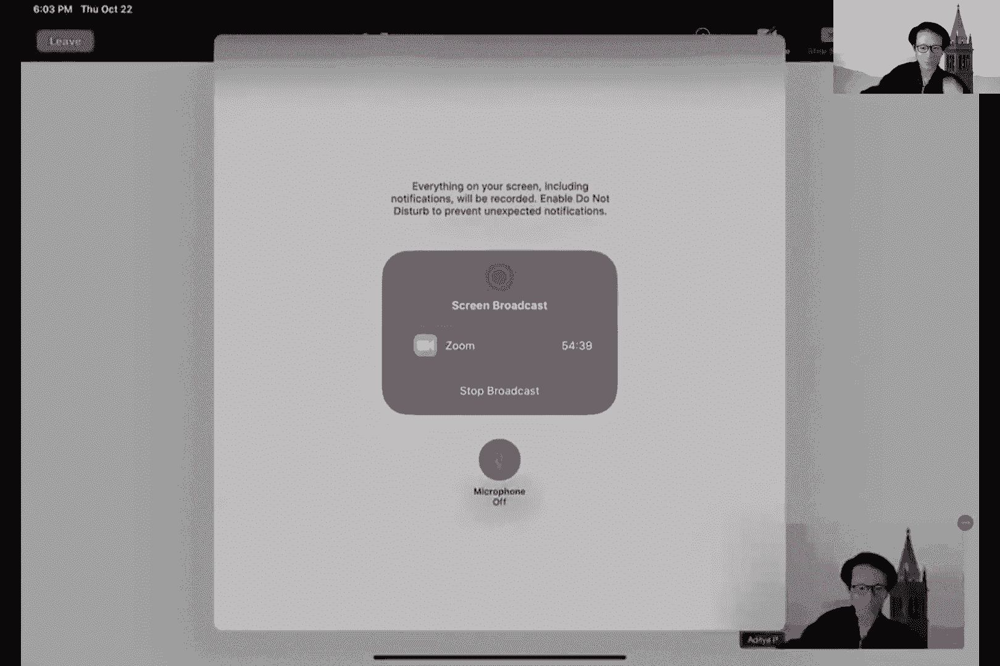
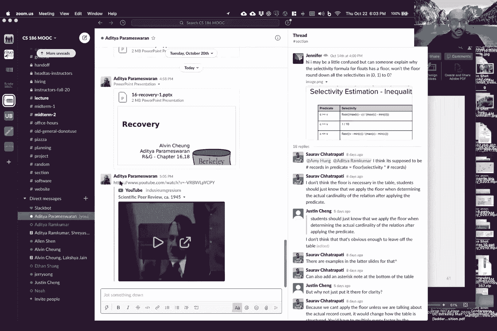
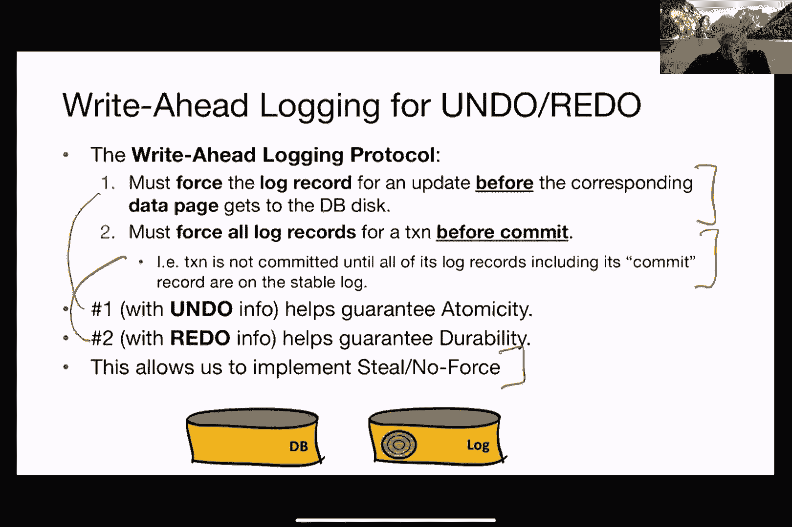

# 数据库恢复机制教程（P17）🔧

在本教程中，我们将学习数据库恢复机制的核心概念。恢复是确保数据库在发生故障（如系统崩溃、硬件错误等）后，仍能保持数据一致性和持久性的关键技术。我们将重点探讨如何保证事务的原子性和持久性，并介绍几种关键的日志恢复策略。

---

## 1. 恢复的动机与目标 🎯

上一节我们介绍了恢复的重要性，本节中我们来看看恢复机制需要达成的具体目标。

数据库可能因多种原因出错，包括操作员错误、配置错误、软件故障或硬件故障。此外，有时也需要回滚事务，例如在违反完整性约束时。恢复机制旨在从这些故障中恢复，并保证以下两个核心属性：

*   **原子性**：事务的所有操作要么全部完成，要么全部不发生。公式表示为：`事务T的效果 = 全部出现 OR 完全不出现`。
*   **持久性**：一旦事务提交，其对数据库的更改必须是永久性的，即使后续发生系统故障。

我们将假设数据库使用**严格的两阶段锁定（Strict 2PL）**进行并发控制，并且更新是**就地更新**的，即数据页在缓冲池中被直接修改后写回磁盘。

---

## 2. 基本操作与问题示例 ⚙️

理解了目标后，我们需要明确恢复过程中涉及的基本操作。以下是四个核心操作：

*   `read(X, t)`：将数据项X的值读入事务的局部变量t。
*   `write(X, t)`：将事务局部变量t的值写入数据项X。
*   `fetch(X)`：将包含数据项X的磁盘页面读入内存缓冲池。
*   `flush(X)`：将包含数据项X的缓冲池页面写回磁盘。

考虑一个简单事务T：`a=8, b=8`，它执行 `a = a*2; b = b*2;`。期望结果是：若T提交，则 `(a=16, b=16)`；若T未提交，则 `(a=8, b=8)`。

以下是操作顺序示例：
1.  `fetch(A)`
2.  `read(A, t)`; `t = t*2`; `write(A, t)`
3.  `fetch(B)`
4.  `read(B, t)`; `t = t*2`; `write(B, t)`
5.  `flush(A)`
6.  `flush(B)`
7.  `commit`

如果在 `flush(A)` 和 `flush(B)` 之间发生崩溃，磁盘状态将为 `(A=16, B=8)`，这违反了原子性。如果在 `flush(B)` 之后、`commit` 之前崩溃，磁盘状态为 `(A=16, B=16)`，但事务并未提交，这同样违反了原子性。这说明了在内存与磁盘之间，以及多个操作之间存在**不连续性**，是恢复需要解决的核心挑战。

---

## 3. 预写日志（WAL）—— 核心解决方案 📝

上一节我们看到直接管理数据页刷盘时机非常棘手，本节中我们来看看引入日志这一强大工具如何解决问题。

核心思想是**预写日志**：在将数据页的更改实际写入磁盘**之前**，先将这些更改描述记录到一个独立的、仅追加的日志文件中。这个日志文件通常存储在与数据文件不同的磁盘上。

日志记录事务的所有重要操作（如开始、更新、提交、中止）。系统崩溃后，通过重播日志，可以：
*   **重做**已提交事务的更改（确保持久性）。
*   **撤销**未提交事务的更改（确保原子性）。

使用WAL还有性能优势：
1.  日志是**顺序写入**，比数据页的随机写入快得多。
2.  日志可以非常**紧凑**，只记录数据项的增量变化（旧值和新值），而非整个页面。

---

## 4. 缓冲区管理策略与日志类型 🔄

预写日志是基础，但具体如何与缓冲区管理策略结合，衍生出了不同的日志恢复方案。以下是两个关键策略决策：

**决策一：Steal / No-Steal（影响原子性）**
*   **Steal策略**：允许缓冲管理器将未提交事务修改过的“脏页”刷回磁盘。
*   **No-Steal策略**：不允许刷出未提交事务的脏页。

**决策二：Force / No-Force（影响持久性）**
*   **Force策略**：要求事务提交前，其所有更新必须已强制刷入磁盘。
*   **No-Force策略**：事务提交时，不强制其更新刷入磁盘。

不同的组合对应不同的日志机制和性能权衡：

| 策略组合 | 所需日志操作 | 性能特点 | 日志类型 |
| :--- | :--- | :--- | :--- |
| **Steal & No-Force** | 既需要Undo，也需要Redo | **最佳**（灵活，内存利用率高） | Undo/Redo日志 |
| **Steal & Force** | 需要Undo，不需要Redo | 较差（提交延迟高） | Undo日志 |
| **No-Steal & No-Force** | 需要Redo，不需要Undo | 较差（内存占用高） | Redo日志 |
| **No-Steal & Force** | 不需要Undo，也不需要Redo | **最差**（性能差，且恢复困难） | （不实用） |

最常用且性能最优的组合是 **Steal & No-Force**，它对应**Undo/Redo日志**。接下来我们分别看看Undo日志和Redo日志的工作原理。

---

## 5. Undo日志（Steal & Force） ↩️

上一节我们了解了策略矩阵，本节我们深入看看Undo日志如何工作。Undo日志用于Steal & Force环境，其核心是记录数据项的**旧值**，以便在事务未提交时进行回滚。

一条更新日志记录格式为：`<T, X, V>`，表示事务T将数据项X的值改为了V（这里是**旧值**）。

**恢复规则：**
1.  **Undo规则**：如果事务T修改了X，那么日志记录 `<T, X, old_value>` 必须在 `flush(X)` **之前**写入磁盘。
2.  **Force规则**：如果事务T提交，那么所有 `flush(X)` 操作必须在 `commit` 日志记录写入磁盘**之前**完成。

**恢复过程（系统崩溃后）：**
1.  从日志末尾开始**向前**扫描。
2.  识别所有未出现 `commit` 记录的事务（即未完成事务）。
3.  对于这些未完成事务的每一个 `<T, X, old_value>` 记录，将磁盘上的X值重新设置为 `old_value`。
4.  已提交的事务无需处理。

**优点**：提交后无需保留脏页在内存中。
**缺点**：提交延迟高，因为必须等待所有数据页刷盘。

---

## 6. Redo日志（No-Steal & No-Force） ↪️

与Undo日志相反，Redo日志用于No-Steal & No-Force环境，其核心是记录数据项的**新值**，以便在事务提交后重做其更改。

一条更新日志记录格式为：`<T, X, V>`，表示事务T将数据项X的值改为了V（这里是**新值**）。

**恢复规则：**
1.  **Redo规则**：如果事务T修改了X，那么日志记录 `<T, X, new_value>` 以及T的 `commit` 记录，必须在任何 `flush(X)` **之前**写入磁盘。

**恢复过程（系统崩溃后）：**
1.  确定所有已提交的事务（日志中有 `commit` 记录）。
2.  从日志**开头**开始扫描。
3.  重做所有已提交事务的更新：对于每个 `<T, X, new_value>` 记录（且T已提交），将磁盘上的X值设置为 `new_value`。
4.  未提交的事务无需处理（因为No-Steal策略保证其脏页未刷盘）。

**优点**：提交速度快，无需等待数据页刷盘。
**缺点**：内存占用高，因为未提交事务的脏页必须一直保留在缓冲池中。

---

## 7. Undo/Redo日志与检查点 🗂️

Undo日志和Redo日志各有局限。理想的**Undo/Redo日志**结合了两者，并采用 **Steal & No-Force** 策略。其日志记录同时包含旧值和新值：`<T, X, old_value, new_value>`。

它遵循两条核心规则，从而同时保证原子性和持久性：
1.  **WAL规则**：在修改磁盘上的数据页之前，其对应的日志记录必须已刷入磁盘。
2.  **提交规则**：在事务提交之前，其所有日志记录（包括提交记录）必须已刷入磁盘。

然而，无论是Undo、Redo还是Undo/Redo日志，恢复时都可能需要扫描大量日志。**检查点** 是一种优化技术，用于限制需要扫描的日志范围。

**简单检查点流程：**
1.  暂停接受新事务。
2.  等待所有当前活跃事务完成。
3.  将所有脏数据页和日志缓冲区强制刷入磁盘。
4.  向日志中写入一条 `CHECKPOINT` 记录并刷盘。
5.  恢复事务处理。

崩溃恢复时，只需找到最后一个 `CHECKPOINT` 记录，然后处理该点之后开始的那些事务即可。`CHECKPOINT` 之前的所有更改都已持久化，无需恢复。但“停止一切”的检查点方式代价高昂，因此实践中常使用**模糊检查点**，允许在创建检查点的过程中系统继续运行。

---

## 总结 📚

本节课中我们一起学习了数据库恢复机制。我们从保证事务**原子性**和**持久性**的目标出发，分析了数据操作的不连续性带来的挑战。引入**预写日志**作为核心解决方案后，我们探讨了缓冲区管理的**Steal/No-Steal**和**Force/No-Force**策略如何与**Undo日志**、**Redo日志**以及功能全面的**Undo/Redo日志**相结合。最后，我们了解了**检查点**技术如何优化恢复过程的性能。理解这些基础概念是掌握现代数据库恢复算法（如ARIES）的关键。