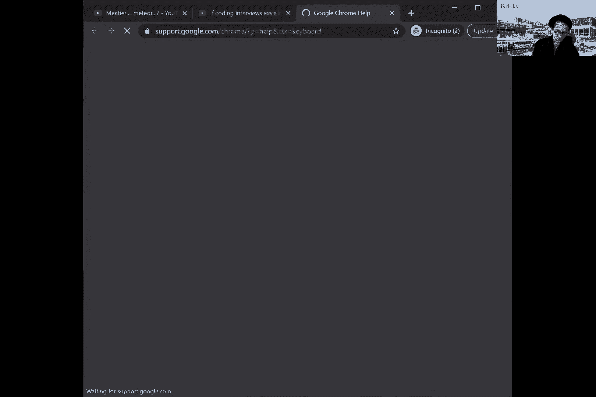
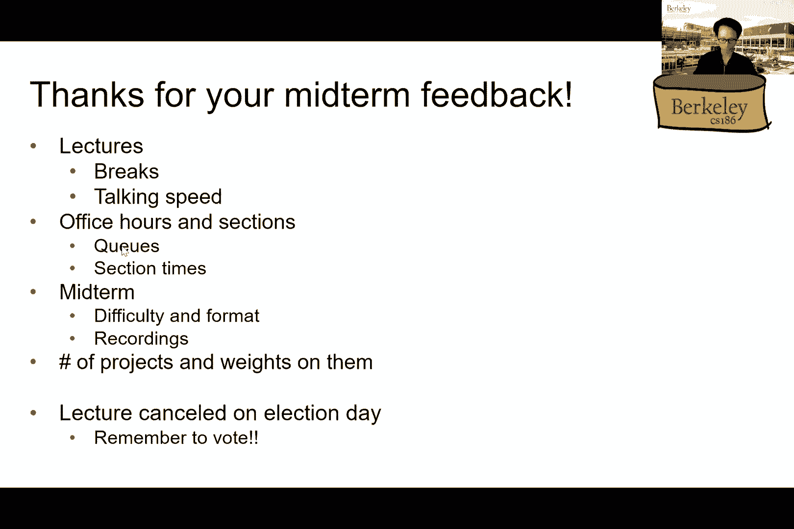

# P18：讲座 18 恢复 II（续） - ___main___ - BV1cL411t7Fz

云端。

好的，我开始了。大家好。我将继续讲周二的讲座，希望你们度过了一个愉快的周末。今天，我们想总结一下恢复的讨论。正如Dettio已经提到的，撤销和重做的不同概念，还有不同类型的块。所以我们还会讨论恢复中的区域算法。

讲座。所以前几张幻灯片只是回顾上次的内容。你可能记得的是，我们在锁中需要不同类型的操作。例如，在这一张幻灯片中，我基本上展示了锁中可能出现的不同类型的记录。例如，读取、写入，以及。

单独页面的获取和刷新。接着我们还会谈到预写锁的概念，对吧？也就是说，在实际执行相应操作之前，我们会先写入锁记录。我是说，显然，这只对写操作有意义，对吧？因为对于读取操作，我的意思是，是否在锁中记录并不重要，甚至可能根本不记录。

写入锁也是可以的，对吧。所以我们只谈论写操作或者那些能实际改变数据库状态的操作。所以预写锁基本上意味着我们会首先向锁写入记录，表明我们将进行更改，随后才真正进行更改。所以这意味着我们，比如说，我们会写一个。

记录表明我们在将页面从内存写出到磁盘之前，正在刷新一个脏的磁盘页面。这样有意义吗？酷。那么接下来我们还会讨论上周提到的不同类型的日志记录。例如，在撤销重做锁的情况下，我们基本上是在存储。

一个特定数据元素的旧值，对吧？比如说，锁中的元组本身。然后我们基本上会回到时间的过去，对吧，当发生崩溃时，然后我们将会从锁的最末端回溯，然后撤销或恢复，对吧？每个涉及未完成事务的操作。所以提醒一下。

对吧？我们只关心在崩溃时未完成的事务。例如，仍在运行的事务，崩溃时可能没有提交，也没有中止。这些就是我们需要能够回滚的未完成事务。

"撤销"在这里的意思是，我们将撤销那些它本来打算做的更改，对吧？因为那个事务没有完成，因此我们需要撤销它到目前为止所做的所有更改。这样说有意义吗？是的。所以这是一个重要的概念，对吧？因为在这些小时里，人们一直在问，像是。

"不完整"的意思是指已被中止的事务吗？答案是否定的。因为如果一个事务已经被中止并且它已经完成了中止操作，对吧？也就是说，它已经撤销了所有它做过的更改。那么我们的工作就完成了。没有什么需要恢复的。我们只需要恢复那些。

如果我们需要做的是那些实际上没有完成该操作的事务。因为它们在崩溃时既没有提交也没有中止。因此，对于这些事务，我们需要撤销它所做的所有更改。所以实际上我们只是在中止它，只不过我们没有明确地将其称为中止。

然后我们还讨论了重做锁，对吧？所以这里唯一的变化是，我们不再存储我们在需要恢复时要恢复到的旧值，而是记录下事务将要进行的修改。我们这样做的原因是，因为与撤销恢复不同，在基于重做的恢复中，我们将完全回放锁。

从一开始。如果一个事务的完成率是未完成的，那没关系。那么对于那些在崩溃时没有完成的事务，我们实际上只是会忽略这些锁中的条目，当我们想做基于重做的日志记录时。这样说有意义吗？所以基本上是说，如果我们想重做所有操作，没问题。

但我们只想重做那些需要重做的，没错？比如说，实际上已提交的事务，对吧？如果一个事务最终被中止，那也没关系，因为锁记录会记录下该事务将会回滚自己。所以当我们遇到锁的那部分时，我们基本上是。

只是撤销那个特定中止事务所做的所有更改。因此，我们不希望重做的唯一事情是那些实际上没有完成的事务的操作。就像在撤销锁的情况下，我们想撤销一个事务的不完整操作一样。明白吗？到目前为止有任何问题吗？

所以希望效果是一样的，对吧？就像你知道的，无论我们使用什么恢复机制，它应该将数据库恢复到完全相同的状态，对吧？所以这不是一个问题。对于这两种情况，我们都在尝试将数据库恢复到相同的状态。所以如果。重做日志以某种方式，基于重做的恢复以某种方式恢复到一个基于状态的、不同的状态，那。

如果是基于撤销日志的恢复机制，那么我们会遇到一个问题。这是不能发生的，对吧？如果真是这样，我们就会遇到麻烦。那么，这两种方案有什么问题呢？

正如你可能还记得的，从讲义的内容来看，在这两种情况下，我们都需要从整个日志中完全恢复，对吧？在基于撤销的恢复机制中，我们总是需要从日志的最末尾开始，然后一直扫描到最前面。而对于基于重做的恢复机制，我们实际上是在做相反的操作。从头开始，我们需要扫描所有的日志。

问题是如何才能避免扫描整个日志，对吧？当然，问题是，你知道，如果日志很长，那么，可能需要一些时间，对吧，才能让数据库完全恢复。然后，当然，答案是肯定的，对吧？这就是我今天还在这里和你们讨论这些问题的原因。

所以我们将使用的算法是ARIES，它是一种避免需要扫描整个日志的算法。实际上，这个算法是由IBM Almaden开发的，对吧？正如我上周四所说，它实际上位于圣荷西的某个地方。你现在甚至可以去参观它。它实际上仍然是一个IBM的地点，是IBM在那里的一个研究实验室。而这位Mohan，就是其中的关键人物。

他实际上最近刚刚退休。所以，如果你在Facebook或Twitter上查看他的动态，他每天都有很多内容发布。所以你可能想去看看。我不知道他是否已经在Jaiji上了。如果他在社交网络团队里非常活跃，我一点也不惊讶。总之。

我们之所以谈论这个问题，是因为我们希望将其作为一个例子，来优化我们之前讨论的恢复方案。但在我们讨论ARIES实际用于恢复的协议之前，我们首先需要谈谈检查点的概念。那么，什么是检查点呢？在数据库的术语中，检查点基本上是一个定期保存数据库整个状态的动作。

那么，在数据库中发生检查点时我们会做什么？我们会停止接受所有新的事务。也就是说，我们暂停所有操作。我们等待当前正在执行的所有事务完成。再次强调，完成的意思是它们决定了是中止还是提交，并且已经完全处理完这部分操作。

对吧？所以如果我们在提交操作，那么我们就确保所有的脏页都已经刷新。如果我们在挂起操作，那么我们就确保该事务所做的所有修改都被撤销。这就是我所说的等待每个操作完成。然后我们将锁刷新到磁盘。我们会把所有的脏页都刷新到磁盘中，以确保提交。

事务。然后我们在锁中写一个记录，表示我们在那个时刻进行了检查点。然后我声明，在那一刻，所有由已提交事务所做的更改基本上已经完成，所有由已中止事务所做的更改已被回滚。所以现在我们处于一个干净的状态，对吧？因此，不再有不完整的事务。

我们不再需要处理任何这些事务。一切都已经决定了，可以这么说。所以到那时，我们可以继续执行新的传入事务。好了，下面是一个图示，展示了在锁的上下文中，进行检查点意味着什么。你可以看到不同的锁条目，然后在某个时刻，会有一个检查点记录。

这意味着，如果我们发生崩溃，假设，就像，假设这是整个锁的结束，然后我们在锁的最后崩溃。那意味着实际上我们不需要处理检查点之前发生的任何事务。因为正如我所说，我们已经将那些已提交事务的所有脏页刷新到磁盘上。

所有已回滚的事务已经被撤销。所以我们不需要处理任何检查点之前发生的事情。我们唯一需要处理的是那些在检查点之后到崩溃发生之间启动的事务，对吧？

同样的故事。如果某个事务在崩溃时还没有完成，那么我们需要撤销它的操作。如果一个事务在检查点之后已提交，那么我们需要确保所有脏页都已经被刷新。为此，你可以使用你喜欢的，任何的重做撤销机制来进行恢复。

这有意义吗？关键是，这是一个简单的机制，你可以用它来摆脱一部分锁，这样你就不需要总是从头开始扫描，或者在进行基于撤销的恢复时重放到开始的地方，对吧？检查点之前的所有内容已经被处理并写入磁盘。而且你知道它们处于持久化状态。因此，我们不需要。

不再需要处理任何这些事务。我们唯一需要关心的是那些在最后一个检查点之后开始的事务。事实上，你也可以在那时直接截断锁，对吧？

我们不需要任何检查点之前的记录。如果你愿意，你也可以删除这些内容，对吧？我们不再需要它了。哦，到目前为止有什么问题吗？所以尼古拉问数据库管理系统（DBMS）是否处理数据损坏的问题。这个问题超出了本课程的范围。你可以想象，文件系统有办法确保事情。

我们需要确保所有数据都处于一致的状态，对吧？举个例子，错误修正码、校验和，所有这些东西都可以帮助我们。但我们基本上假设文件系统会为此负责，以便完成186目的。哦，好的。那么到目前为止一切都很好，对吧？但是，问题是我们必须停止整个世界，对吧？当我们进行检查点操作时，从某种意义上说，我们必须等所有事务完成。

还没有完成，我们也不接受任何新的事务。所以这就不太好了。显然，如果我们有办法在数据库仍然接受新事务时进行检查点操作，那就太好了。所以这就是模糊检查点的概念，来自该领域的论文。这个概念的基本思想是，我们保存所有页面的生命周期。

事务的状态和缓冲池中所有页面的状态都需要在我们进行检查点时保存。为什么？因为与完全检查点机制不同，在模糊检查点中，我们仍然会有正在运行的事务，可能是对吧？因为我们还在接受新的事务。而且由于我们并没有将所有页面刷新到磁盘，因此有可能会有脏页面。

这些事务仍然驻留在缓冲池中。所以，我们需要保存所有这些正在运行的事务的状态，以及所有当前在缓冲池中的页面状态，以防其中一些页面是脏的。为了做到这一点，我们需要新的数据结构来存储这些信息。对吧？到目前为止有道理吗？那么让我们来看看这些数据结构是什么样的。但在此之前。

说到具体的数据结构，我们首先需要弄清楚我们到底在追踪什么，对吧？当我说我们需要存储事务的状态时，我到底是什么意思呢？嗯，首先，我们需要存储每个事务的状态：它们是正在运行、正在提交、正在挂起，还是已经完成了。对吧？这个很简单。我的意思是，你可以有一个内存中的单一表格来实现。

然后我们还需要一个机制来存储哪些页面在缓冲池中是脏的。我的意思是，你可能会认为缓冲池已经在追踪这个了。是的。但是，我们仍然基本上是在利用那个机制。它已经存在吗？然后我们还需要追踪哪些事务实际上导致了这些页面变脏。所以，如果你记得，生命周期。

在缓冲池中，对吧？所以某个事务会将一个新的页面，从磁盘加载到内存中。然后在某个时刻，某个事务会对该页面进行修改，使其变脏。所以我们只想记录导致该页面在进入缓冲池后第一次变脏的操作。你很快就会明白为什么要这样做。

所以如果我们能够跟踪这两样东西，那么在检查点时，我们将做的就是将它们保存到磁盘。就像保存一个锁条目一样，对吧？你也可以保存事务的状态到文件。就是说，把所有内容都写出来。而且你也可以将第二点的信息写入文件。但这不难。然后。

在恢复时，我们要做的是重建事务。事务状态以及缓冲池的状态，基于我们在检查点时保存的信息。然后我们将重建所有正在运行的事务和所有脏页及内存。接着，您知道的，按这种方式重放其余的锁。

我们将看到这意味着什么。好的，现在让我们深入了解这些细节。像，如何实际跟踪这些东西呢？首先，我们需要为每个锁记录存储一个称为锁序列号的东西。因为在上一行，我说过我们需要跟踪哪些事务的操作最先导致了某个页面发生变化。

特定页面成为30的操作。所以我们需要一个机制，能够指向特定事务的操作。为了做到这一点，让我们给每个事务操作一个编号。基本上，就像你的公式列表需要是一个唯一的、递增的数字。你知道的，。

对于一个非常简单的实现，我的意思是，你可以仅仅使用文件中的行号。例如，行号是一个独特且严格递增的数字。所以这就满足了要求。因此，我们将为锁中的每个操作分配一个号码。然后通过这个，我们就能得到一个页面锁序列号，这正是我在上一部分所提到的内容。

在上一张幻灯片中，右边是导致页面从最开始变成30的锁记录。而且，最近更新该页面的锁记录也很重要，事实证明我们需要这两个记录。但对于这两个，我们只是通过锁序列号来引用，以此作为指向锁的方式。所以从图示上看，这就是你会看到的内容。

所以在这里，我们有一个所谓的30页表，它列出了缓冲池中的所有30页，以及一个恢复锁序列号。正如我所说，这个序列号对应于导致该特定页面在加载到内存后成为30的第一个锁序列号。

正如你能想象的那样，这里每个数字，比如，行号一，零。二，一，零，一，零，一，零，必须是实际写入页面的操作。因为如果不是，那就有问题了。你知道的，那些操作应该是导致页面成为30的操作。所以导致页面成为30的操作显然是写操作。

所以基本上，这些东西最好指向锁中的正确记录。然后这里是事务表，基本上跟踪着哪个事务在运行，还有你知道的，每个事务的状态。然后最后，这里的 LSN 讲的是，像你知道的，哪个锁记录号，最后更新。

LSN 代表锁序列号。因此，最后的序列号，即锁，最后的锁序列号。它对应于该事务的最新更新。所以你可以把它看作是基本上跟踪我们在那个事务中的位置的方式。对吧？所以，如果我们可以指向付费点，指向锁记录进行响应，假设，比如说，像。

你知道，事务号 100，我们也可以追溯回去找出，在那个事务中，那个特定的事务实际上进展到了什么阶段。所以，再次强调。我们会看到所有这些事情在需要恢复时是如何发挥作用的。但现在，让我们先确保理解这些是我们需要保留的数据结构。

在内存中为了运行区域。呃，Nick，你有问题吗？是的。我只是好奇，为什么会有这些处于提交或中止状态的事务。因为看起来这些事务应该已经完成了。所以到检查点时，你不关心它了，对吧？是的。所以我在这个点提到这一点。

但我在提到这个，所以是的，这是一个很好的问题。所以为了让大家都理解。这个问题是，为什么我们要跟踪已经提交的事务？对吧？所以如果你看一下项目，你会看到实际上有不同的，提交和中止的阶段。所以当它第一次说提交时，它实际上并没有提交。

一切还没有。所以在这一点上，提交只是意味着它将要提交。它实际上还没有把所有东西刷新到磁盘。所以在项目中，你会看到，你知道的，在刷新操作实际上完成后，我们会说状态是结束或完成，到了那个点。所以这是一个区别。然后你可能会问的另一个问题是，好的，没问题，对吧？

但为什么我们要跟踪已经完成的事务？真正的答案是，你不需要。我们实际上不需要跟踪那些已经完成的事务。因为正如我所说，那些事务已经完成，对吧？然后它们已经完全写入了磁盘，或者它们已经完全回滚了所有的操作。所以。

如果我们不想再做这个了，就不需要做了。这只是为了完整性，同时也是为了符合你在项目中看到的代码要求。这就是我们以这种方式做的原因。哦，好吧。是的。那很好。好的。那么日志就和以前一样，对吧？没有，没什么新东西。所以这是正确的头块。只是现在我决定稍微多一些，嗯。

我不知道，比如说，是否可以系统化或以更漂亮的表格格式呈现。这样你就能看到涉及的不同字段。我想强调的是这个，被绿色高亮显示的前一个LSN，它基本上是指与同一事务对应的前一个日志记录。所以你看到这里，例如104行。

指向101行，因为那是与事务编号100对应的第一个记录。然后我就像，知道吧，把有效负载分离出来作为一个独立的字段。我的意思是，你不必这么做，仅仅是为了说明方便。有时候你会看到有效负载会有所不同，取决于我们拥有的记录类型。所以这里的前两行，它们对应的是。

启动一个事务。显然我们没有新值或旧值需要写入。所以它只会显示启动，而接下来的两行锁记录，基本上是写操作。对于这一点，我们会存储我们写入的旧记录和新记录。你能看到，为什么我们需要追踪两者，对吧？

因为在撤销和重做锁定机制中，我们只存储其中一个。所以现在你的问题可能是，为什么要同时存储两者？你稍等一下就会明白。好吧，总结一下所有内容。现在，我们有了这个。我们有了30页表，这是新的。我们有了事务表，它也是新的。锁本身并不新。

它就是我们所说的提前写入锁。唯一新鲜的地方是一个额外的字段，叫做前一个锁序列号。然后缓冲池也不算新东西。唯一的新东西就是追踪使得页面变为30的第一个锁记录。所以在这个例子中，你可以看到这里页面5第一次被写入。

事务100，在行序号104的位置。所以，这就是为什么那一页的LSN是104。同样的情况也适用于其他页面，不过我没有展示完整的锁记录。所以你在这里没有看到它们。酷，实际上。好吧。那么，检查点过程中会发生什么？如我所说。

我们希望能够将这些内容存储到磁盘，对吧？所以。首先，让我们开始写一个块开始的检查点记录到锁中。然后我们将锁刷新到磁盘，直到这一点。接下来我们继续正常操作。我们会继续处理事务。

接受新事务，可以这么说。然后，随着时间的推移，到某个时刻，我们就会将所有的事务表和类似于30页的表格数据，丢到磁盘上。然后写一个结束的检查点记录到锁中，并将锁刷新到磁盘。所以你可以看到，可能会发生什么，对吧？所以我们可能会处于写入的中间状态。

当一个新事务启动时，我们可能会在写入磁盘时，页面现在变为30，对吧？所以我们需要处理所有这些情况。但是我认为实际上这并不会影响我们进行恢复的过程，因为我们无论如何都会重新做这些操作。正如你稍后会看到的那样。但是。

这正是你使用模糊检查点（fuzzy checkpointing）进行检查点操作的方式。那么现在我们来谈谈我们实际是如何处理事务的。例如，当我们开始一个新事务时会发生什么？当事务更新页面时会发生什么？当它尝试提交、撤销时，发生了什么？当缓冲池管理器想要获取或刷新页面时又会发生什么？

我所说的“发生什么”是指我们之前提到的那些数据结构发生了什么变化。到目前为止有问题吗？哦，好。首先，第一个问题很简单。那么，当一个事务开始时会发生什么？你可以猜到，我们首先会写一条锁记录到锁中，表示我们要开始一个新的事务。

这并不令人惊讶。接着我们想要更新事务表，对吧，因为现在我们有一个新的事务开始。例如，如果事务号为105的事务开始，那么我们就会写入一条新的记录。接着我们会向事务表插入一个新的条目。你可以看到，像这样，事务105正在运行。然后，由于。

它实际上还没有进行任何更新，因此，这里的最后一个LSN字段没有被填写，或者说我只是用破折号表示。然后在30页表中的缓冲池也没有任何变化。所以你看到它们和之前一样。所以如果它实际上写入了磁盘，对吧，或者进行了一次更新，它就没有。

还没有写入吗？所以我们首先会写一条更新记录到锁中。这是符合**预写日志**（right ahead logging）规范的，对吧，这正是我们在这里使用的方式。所以首先写更新记录到锁。然后我们将更新一些内容。不要担心，如果你不理解我说的意思，我们就通过一个例子来。

确保我们理解我在这里做的事情为什么要用颜色标示。所以假设正在运行的事务决定写入一个数字，我将更新一个页面，基本上是第七页。所以我们首先会写一条记录到锁中，表示事务100将要执行的操作。然后它会得到一个新的锁序列号，对吧，基本上就是下一个。

在这种情况下，1，0，2。接着我们将使用以下机制更新所有这些其他表。首先，在与这个新更新对应的锁条目中，我们会把前一个LSN设置为1，0，1，因为那是该事务（trans）进行的倒数第二个操作，对吧？好的。然后我们将设置。

页面的LSN将是我们当前正在写入的这个新的LSN，因为这现在是最新的。锁条目，使得这个特定页面变为脏页。好的。然后我们还将设置该特定事务的事务表中的最后一个LSN为102，因为这是该事务使得。

对不起，这是该特定事务更新页面时采取的最后一个操作。然后在脏页表中，我们将设置恢复LSN为，也就是说，你知道的，这，抱歉，它应该是一个，零，二，应该是一个，零，二，因为这是第一次。更新记录使得这个特定页面变为脏页。所以记住，明白了吗？所以在这种情况下。

我们存储了最后一个使得第30页变脏的LSN，并且我们正在设置。第30页表中使得第30页变脏的第一个LSN。所以确保你运行。那个特定的LSN，可能是101，因为你之前。通过那个页面进行了更新。所以这实际上是正确的。好的，明白了。抱歉。

我忘记把它查出来了。对的。所以101也写入了第七页。因此，在这种情况下。我们实际上不需要更新脏页表，因为第一个锁。记录使得第30页变脏的是101。所以即使1002也写入了它，但没问题。但注意，我们确实需要更新这里的数字，因为那个数字对应于。

最后一个。到目前为止一切顺利。很好。那么现在页面刷新时会发生什么呢？

所以我们首先要刷新锁，包括直到并包括页面LSN号。所以在这种情况下，我们稍后会通过一个实际的例子来执行这个操作。但这就是我们将要做的。然后我们将从第30页表中删除该页面。并且从缓冲池中删除。所以这只是将第30页写入磁盘的操作。

然后我们可以知道哪些页面是脏的，因为你知道。那些页面会有一个非零的页面LSN号。所以举个例子。如果缓冲池管理器想要刷新第七页，对吧？

所以发生的情况是我们首先需要刷新锁，直到包括行号101，因为。那是最后一个触及第七页的锁记录。我们如何知道这个数字。是101呢？嗯，我们只需查看页面，对吧？然后每个页面已经存储了最后一个数字。最后的锁记录使得它自己变脏。因此，当我们尝试刷新页面时。

我们只需要查找那个数字，然后确保所有直到该数字的行都已经。写入磁盘。如果锁序列号确实表示行号，对吧？所以现在你明白了。为什么我们实际上在每个页面中存储了这个页面号。没错，因为当我们试图。刷新数据时，我们需要确保，比如说，你知道，锁记录对应于那些。

更改已经刷新到磁盘了。而且， 这就是前日志记录对吧？所以，在我们进行任何更改之前，我们需要确保锁记录已经被写入，并且也已经刷新到磁盘。然后，后续的步骤就像你知道的那样，执行实际的写入操作，对吧？所以在这种情况下，就像你知道的那样，我们知道。

页面七是30。所以我们将该页面写入磁盘，然后随后从缓冲池中移除它。所以我们从缓冲池中移除，然后我们也把它从脏页表中移除。你可能会问，意思是我们需要将该页面从缓冲池中驱逐出去吗？我的意思是，不一定。

但是如果你决定实际保留该页面在缓冲池中，那么我们最好确保该页面的LSN现在被设置为null或者其他值，对吧？

因为该页面现在已经是干净的，因为我们已经将其写入磁盘。然后为了更简单的说明，我也像你知道的那样，将其从缓冲池中驱逐出去，简化处理。好的。那么页面批次的情况怎么样？现在假设我们想要操作缓冲池管理器从磁盘中获取一个新页面。

所以我们所做的就是，在30页面表中创建一个新条目，并且把相应的页面带入缓冲池。例如，假设我想将页面二带入缓冲池。我们就在30页面表中创建一个新条目，恢复LSN为null，对吧？

因为没有人写入过那个页面。所以，最后的恢复LSN在这种情况下就是null。然后我们将该页面带入缓冲池，页面的LSN也被设置为null。我这里没有显示出来，是为了节省空间。然后其他的部分保持不变，对吧？

因为我们并不是在谈论新的事务。所以现在进入了比较繁琐的部分，对吧？

当一个事务提交或者事务中止时会发生什么？好吧，当事务提交时会发生什么？所以，我们首先需要将提交记录写入锁中。我的意思是，就像在前日志记录中一样。所以那部分并没有改变什么。我们还需要将锁刷新到磁盘。

对于该条目的处理，原因跟我们在这里做前日志记录是一样的。为了提交并决定事务的命运，在与提交记录相对应的锁条目写入磁盘时，我们就认为该事务已经提交了。即使此时，像你知道的那样，所有30页面仍然在内存中，像你知道的那样。

其实没有写出所有东西，这没关系。所以从**前置日志**的角度来看，也从每个角度来看，我们认为事务已经在与提交对应的锁记录写入磁盘的时刻提交了。然后接下来，我们会做的就是像这样，我们会更新。

事务状态变成提交模式，或者说它正在尝试提交。然后我们不必同步执行这一步，对吧？因为这是前置日志。但是在某个时刻，在某个时间点，我们假设需要将这笔事务的30页数据刷新到磁盘上。然后我们会，等所有30页数据都写入磁盘时，我们再写。

一个结束记录到锁中。我们会发现，像你们知道的，我们已经将30页数据写入磁盘了。然后我们会实际去更改事务状态为**完成**，这基本上意味着锁条目已经写入了磁盘，并且这笔事务的所有30页数据也已经写入了磁盘。然后就这样。

我之所以要讲这些，是因为你们应该已经熟悉之前讲座中的**强制写入**部分，关于提交记录的写入以及磁盘簇的内容，如果你们还记得我们关于强制写入的讨论。我现在把它提到这个幻灯片上，是因为现在我们有了。

这个新的事务机制，在这里和这里的这张30页表格。我只是想确保你们明白当事务提交时会发生什么。很酷，对吧？是的。最后，发生什么呢？所以我们来通过一个例子，行吗？假设有一个。

事务100决定提交。所以我们写入提交记录并将其刷新到磁盘。我们更新事务状态为提交，然后开始刷新与该事务对应的30页。当这完成后，我们写入结束条目到日志中。所以你在这里看到的就是这样，对吧？所以你看到一个提交条目，然后是刷新操作，最后我们写入结束。

当写入完成时。所以在那时，你基本上会看到所有的30页数据已经被**驱逐**了。再次强调，你不一定非得这么做，但我这样做是为了简单起见。然后在这种情况下，30页表格就什么都没有了，因为没有任何页面是脏页。最后，我们会更新事务状态为**完成**。就是这样，你看。

最后，事务决定中止时会发生什么呢？嗯，类似于提交对吧？我们首先写一个中止记录到锁中，刷新所有内容到条目中，就像在事务提交时一样，对吧？所以在这一刻，我们认为该事务已经中止。

即使实际上我们还没有将该事务的操作写回。现在我们需要做清理工作，对吧？在我们将回滚记录写入磁盘之后，接下来我们需要撤销该事务所做的所有操作，对吧？我们该怎么做呢？

我们怎么知道呢？嗯，看看事务表中的最后一个LSN。这就是我们的救命稻草，对吧？因为这个数字基本上指向了该事务所做的最后一次更新。所以，基本上，这意味着我们需要撤销的第一件事就是它，对吧？我是说，因为我们是从最后开始撤销，一直到最前面。

所以，如果一个事务做了一堆更改，那没关系。因为我们会从最后开始。然后我们会追溯时间，撤销所有的更改，对吧？然后，借助那个数字，你现在可以去锁中查看它实际写入了什么内容，然后使用有效负载，对吧？来确定需要按顺序写回的数字。

为了撤销操作。好吧。所以，在我们实际上已经撤销了操作之后，我们会想要写入一种叫做补偿记录的内容到锁中。补偿记录，或者CLR，基本上是另一种类型的锁记录，它仅仅表示我们已经撤销了特定的操作。你将看到为什么我们需要将其写入磁盘，当我们讲解时。

实际的恢复算法。但现在，你可以将其理解为一个提示，我可以告诉你，这基本上是一种优化。我们不一定需要这样做。因为在基于撤销的恢复中，我们从来不需要写这些类型的锁记录，对吧？

所以，这基本上是为了优化的目的。然后CLR记录还指向需要撤销的下一个记录，如果有的话。然后我们基本上会按照锁中的前一个LSN来追踪，看看是否还有其他操作需要撤销。然后，在一切完成后，我们会将事务状态更改为回滚，意味着我们已经完全撤销了所有内容。

然后我们将写入结束记录到锁中，并将其标记为完成。因为我们已经完全撤销了该事务的所有操作。举个例子。假设我们有事务100，尝试回滚。我们首先将回滚记录写入锁中，对吧？这就是你在屏幕右侧看到的第104行。然后，从锁记录开始，对吧？我们首先。

我们会看到LSN编号103是需要撤销的第一件事。因为它有相同的条目，对吧？

所以，这基本上来自于事务表，我在这张幻灯片上没有展示。但从事务表中，我们会看到103是需要撤销的第一件事。所以我们会去撤销103，这基本上意味着恢复旧值。在这个例子中，将数字二恢复到页面上。当然，我也在这里对齐了细节，对吧？

你需要弄清楚像是，知道我们到底应该在页面上的哪个位置写入数字 2，对吧？偏移量是多少？而且，像是，我们到底在那里写了什么？所以，但是我只是没给你展示这些细节，它们也会在锁记录中。好的。没问题。所以我们已经撤销了事务编号 103。

然后我们基本上写入补偿，记录到磁盘。抱歉，所以是锁，对吧？

所以这就是你在这里看到的内容，记录编号 105。需要注意的几件事。第一件是我们在写入一种新类型的记录，好的，补偿记录。第二件是，像你知道的，这个 LSN 指向的是什么？

这个记录指向我们需要撤销的下一个操作，在这种情况下是编号 102。再次提醒你，你会理解我们为什么后来要这样做，当我们讨论恢复时。但现在，只要确保你理解这个数字实际上代表了什么。好的。太好了。所以我们已经写出了这个 CLR 记录。然后我们基本上回到锁的第 103 行。

然后弄清楚是否还有其他操作需要撤销。在这种情况下，我们确实有。对吧？因为从之前的 LSN，我们看到锁记录编号 102 也是由我们正在尝试中止的同一事务进行的更新。因此，我们通过撤销操作重复相同的过程，然后在你在第 106 行看到的锁的末尾写入另一个 CLR 记录。

然后在这一点上，我们弄清楚实际上没有更多的事务，没有更多的操作需要撤销，因为锁记录编号 101 只是一个开始记录。所以我们不需要撤销它。我们完成了。所以我们将事务状态改为中止。然后我们像提交的情况一样刷新所有脏页。然后写入结束记录。

你在第 107 行看到的记录，然后将状态改回为完成。我们已经回滚了，事务编号 100。所以你可能会有一个问题，像是，你知道的，为什么我们跳过了锁，对吧？因为你知道的，注意到在这种情况下，我们基本上是在做点对点的模糊处理。我们首先搞清楚第一个。

我们首先弄清楚，第一个需要撤销的操作是第 103 行。然后我们做这个之前 LSN 的回溯，对吧？追踪回去找出下一个需要撤销的操作，然后继续撤销，怎么说呢。所以这可能会导致大量的随机磁盘写入，对吧？因为我们基本上在跳跃。

回溯到之前的时间。所以我们实际上在接下来的几张幻灯片中会看到一个更好的算法来进行这个回滚。到目前为止有什么问题吗？是的。所以目前当我们回滚时。当我们在撤销 102 时，显示 CLR-H71。难道不是之前的 LSN 101，尽管那是开始记录吗？那为什么我们不写 101，而是写？

为什么没有对应于101的CRR记录？就因为我理解它是一个旧值。但是为什么没有而是直接把101丢掉，因为101在102之前。你的意思是这里吗？

不，不，像第五个要点上写的，撤销102并写CLR-H7。是这样吗？对。对，为什么那是个不呢？就和这里一样。好吧，原因是因为那并不是一个需要撤销的操作，对吧？需要撤销的。好，我明白了。对，101行没有什么可撤销的，对吧？所以，是的。好，谢谢。对，Warren。对。

那么，为什么我们要追踪事务的完成状态呢？为什么不能直接把它从表中丢掉？你不能。其实这和Nate之前问的完全一样。我们保留它的唯一原因就是因为那是你的项目代码实际上在做的事。

理论上，你不需要这么做。你可以在那时直接丢掉那个记录。对，完成时。很酷。那么，到目前为止你明白这一部分了吗？我知道这有点无聊，我知道我们像是在一步步回溯，但你可能会想，好吧，为什么我们不跳到更有趣的部分呢？那么，这就是有趣的部分。嗯，我想也是。

Alvin，有一件事可能会有用。如果你回到上一张幻灯片。一个我觉得有用的小窍门就是，稍微放慢节奏，回到之前的那张幻灯片。没关系。就是你看到所有数据结构的那张。好吧，我觉得帮助我理解ARIES的一件事就像是，有一个非常。

让人困惑的是，为什么有这么多变量。为什么会有rec、LSN、page LSN、pre-VLSN、last LSN以及脏页表、事务表。我的想法是，当你看到这些结构时，你会尽力理解它们存在的原因，对吧？

例如，Alvin刚才举了一个例子，说明为什么pre-VLSN很有用，因为它让你可以回到日志中，对吧？你不需要阅读整个日志，你可以使用pre-VLSN回到日志中的某个位置，跳过不相关的日志条目。同样，我不知道，事务的last LSN给了你从哪里开始回溯日志的起点。

如果你想撤销一个事务的影响。正如Alvin将要描述的，rec LSN将告诉你应该从哪里开始恢复过程，他会描述这个。所以，同样地，这些变量中的每一个都在某种程度上帮助优化恢复过程。因此，我认为这是一个帮助理解这个过程的工具。它很难，并不容易。

这确实很繁琐。所以，我会说，花点时间慢慢做。是的，我完全同意这一点。事实上，在我学习这些东西的时候，我做得更好，现在。如果我不再讲下一轮内容，我可能完全会忘记这些事情，这些东西太多了，记不住。

所以这就是为什么我尽量一步一步地引入这个例子。但同样，这些其实都是优化。比如说，最后的LSN，我们就选这个。它基本上是用来确定在日志中什么时候开始查看，以便我们尝试，比如说中止一个事务。所以在这种情况下。

事务100决定中止，所以我们需要等待查看从哪里开始回滚操作。如果你不想使用最后的LSN，你也可以。你可以从日志的末尾一直扫描，找出事务100做的最后一件事。对吧？完全有效，完全没问题。唯一的区别就是成本，对吧？你知道的。

如果你不想承担从备份扫描所有内容直到你到达由事务100执行的操作的成本，那么另一种选择就是显式地跟踪它。这就是这个所做的事情。所以，这只是记录下最后一个操作的位置以及事务所做的操作，这样当我们需要撤销或中止时，能够有效地处理。

我们有一个起点。对吧？所以这对于右锁的前一个LSN也是一样的，对吧？我的意思是，撤销或重做日志，对吧？这就是ADITIA在上一讲中提到的。没有前一个LSN，对吧？那么为什么我们突然要引入这个新东西？嗯。首先，它把我们弄得很困惑，对吧？所以你可以把这个怪罪到Mohan身上，对吧？不。

但是对于更实际的应用，对吧？基本上是因为我们想要构建一个需要撤销的操作的**链表**。对吧？所以如果你有这个前一个LSN，它基本上充当一个指针。它是一个指针，指示每个操作的顺序，像你知道的那样。

那么，最后我需要为这个事务撤销的是什么？依此类推。如果它们不存在，没问题。你总是可以扫描日志来找出，比如说，倒数第二个操作是什么？要撤销的，对吧？同样，对于重做也是如此，好吗？所以它是一个优化，对吧？然后，像你知道的，对于页面LSN。

对吧？就是说，对于页面LSN，它基本上说明了，最后一个接触该页面的LSN是什么？我们为什么需要这个？因为当你将30个页面刷新到磁盘时，我们需要弄清楚，实际上应该刷新到磁盘的锁是哪一部分？

对吧？因为右日志记录，我们需要确保锁已经写入磁盘，然后我们才能将30个页面写入磁盘。所以页面LSN基本上告诉我们回到日志的哪个部分，并确保该部分已经写入磁盘，对吧？你知道的，同样的，你不一定非要这样做，对吧？我的意思是，你总是可以。

为了我们关心的事，刷新整个锁。我的意思是，没问题。如果你的锁是一个TB的模型，我的意思是，祝你好运，对吧？所以那不是正确性的要求，它只是一个优化。这样理解吗？酷。是的，所以确保你理解其中的逻辑。我的意思是，不只是，当然，当然还有这个的一致性。

Mohan，对吧？那么，除此之外，实际上我们追踪这些事情是有实际目的的。好了，如果没有其他问题，那我们来谈谈如何用这个来做恢复。哦，快问一下。你能回到上一页吗？这一页还是下一页，或者是前一页？

我想，两者都有。比如说对于这一页，你提到在接近结尾时，你得刷新脏页。但是在前一页，我不认为有提到。是的，我没有提到。是的，我觉得没有。我在想这是不是故意的。我明白了。是的，我知道这页缺少了。所以其实是因为这页内容太多了。

在这里。很好。好了，现在我们来谈谈重点，对吧？

那我们实际如何做恢复呢？Alvin，你觉得我们现在应该休息一下吗？因为已经到六点了。

这是个好点子。好吧。你想分享视频吗？

是的。让我看看有没有办法获取声音。所以我从条目中选了两个，实际上，是的。我们从那些条目中选了两个。好了。

你们在吗？是的。好，哦。

（女性用外语讲话），（女性用外语讲话），好吧。那么让我们看看这个是否有效。如果没有声音，我也许会请技术人员来播放它。（女性用外语讲话），（女性用外语讲话）。 （女性用外语讲话）。

- Alvin，它在回响。我们都听到吗？ - 好的，停。 - 给我一个链接。 - 好的，我来做。 - 我们还听得到吗？ - 是的，抱歉。好了，让我，哦。

（女性用外语讲话）， - 你可以想象这有多难。实际上只播放一个愚蠢的视频。 - 我觉得你可以只断开所有设备上的连接。 - 是的，我就是这么做的，但不知为何它还是做了很多的黑客操作。让我把它发给技术人员。

你看到了吗？我做到了。 - 是的，我看到了。稍等。（女性用外语讲话）。 - 上。

嘿，Angel，你是不是让恐龙更强壮了？就像我说的，嘿，神啊，怎么了？嘿，Angel，你是不是让恐龙更强壮了？就像我说的。什么？我告诉你要让它们变成陨石。让它们变成陨石。陨石。陨石。陨石。- 其实这来自TikTok。

我不知道你们为什么不直接发给我们，像这样，TikTok。谢谢你，Angel。那是上传到YouTube的TikTok视频。好吧，就是这样。有意思。 （女人说外语）好吧，我分享第二个。给我一秒钟。 （女人说外语）- 很高兴认识你。

我们能直接跳到白板题吗？抱歉，兄弟，我得把这个长问题塞进剩下的15分钟里。该死，看，我根本不想在这里。我只是想让这事变成我在Pomo Doc的高级职位申请的一部分。我离德勤的10号活动还差一个月。我现在只是在装样子。

所以你应该不会指望我和你聊太多。嗯，那如果你表现得好，我们真的给你offer的话，那就是这样的，对吧？你没错。我知道你不在乎，但让我告诉你关于我们团队、当前项目的一些事情，顺便说一下，我在其中每一个项目里都扮演着重要角色，直接进入白板题吧。

既然我们浪费了足够的时间在聊天上，下面是一些其他的计算机科学面试问题。我敢肯定我完全搞砸了这次面试，但我只是希望其他候选人做得更差。终于到你的编码挑战了。我以前做过这个题目，但我不会告诉你。好。

这是我唯一准备的题目。我不想指出这一点，但到目前为止你问的所有问题，完全无法预测我在公司未来的表现。是的，我完全意识到这一点。但嘿，我们不能重新发明规则，我们只需要遵守游戏规则。老实说，我不知道自己在做什么。

所以我开始丢些技术术语出来。希望能让你眯起眼睛。好吧，试试我。哈希表，二分查找，动态规划。哈，好吧，你抓住我了。这里是我的解决方案。干得好。你完全搞砸了编码部分。还能说什么呢？

我们还有一些行为问题，看看你是否能很好地融入团队环境。正如我所想，没有什么比被给一个我不知道答案的编码问题更让人紧张了。我到底在骗谁呢？你是程序员。我可以说不吗？是的，你也不是一个很合适的团队文化人选。

无论那意味着什么。非常感谢。看起来我将有几个新的室友。

这个月末就会结束。祝好运，朋友。我正在等着收到我的正式拒信，通过邮件发来。听起来真糟糕。（背景音乐），（背景音乐）， - Singress。 - 对不起。 - 圣诞老人还有东西要准备。我的意思是，我们需要更多东西。否则，你知道的，我们就会一直讨论本学期余下的内容。那样会很遗憾。那样会很遗憾。

- 是的，杰瑞。确实，这是我们准备讲座时最喜欢的部分。 - 阿尔文，你想做一下公告吗？ - 当然。所以谢谢大家的反馈。我只想，嗯，我们只是想回应一下这些事情。

在你们提交的期中评审中。首先，你们提到希望在讲座中有休息时间，看看，已经有了，对吧？是的。我们也明白，连续一个小时半的讲话确实很长。而且，尤其是听像我这样的单调讲解，简直是大煎熬。

我的意思是，我理解。是的，谢谢你提到这一点。说话速度。是的，那也是个问题。抱歉，你知道的，我说话的速度大概是每分钟60个单词，或者在不好的情况下甚至更多。所以我会尽量放慢速度。还有一件事就是，如果你们能大声提问，那会有所帮助。

这肯定是为了休息，像你知道的，我的讲话对吧？

因为如果我以每小时60英里的速度，或者每分钟60个单词说话，那你知道的。如果你问我问题，我就得停下来。所以其实这就是最好的方式，真的让我停下来。然后也有很多关于办公时间和分组讨论的评论。所以--，没错。是的。关于提问的部分。

另一点我想补充的，不只是阿尔文，大家都可以，就是提问。没有--，我意思是，没有什么问题是错误的。只管提问。帮助让课堂更加有节奏感。你问的问题越多，问的问题越多。聊天室也可以。如果聊天室里有问题，我们认为其他人也会有类似的问题。

我们会提升这些。所以下次提问吧。我认为总体上，我们也会尽量放慢速度。所以我想这是我们俩正在努力的方向。感谢你的反馈。是的。还有什么要补充的吗？好，关于我们的办公时间和分组讨论，嗯，你们也注意到，我们一直在努力进行整合。

分组讨论的时间有更多自由的助教资源来进行办公时间。 但当然，我们注意到关于排队问题的评论，确实排队很长。所以我们仍在解决这个问题。我们已经写出了一些改动方案。你们可能已经在PSFO上看到了。例如，清除排队等待。

在办公时间块之后。它还会在我们整合了章节时间之后尝试加倍安排。所以是的，感谢你们的反馈。阿迪提亚，杰瑞，或者其他助教有要补充的吗？是的，正如我所说的，这对我们来说是一个全新的领域，真的。所以我们还在努力找到更好的方式。

服务你们。所以关于办公时间的问题，我们仍然在摸索最有效的方式，既能从GSI的角度，也能从你们的角度，合理利用时间。如果你们对如何使用阿尔文和我的办公时间有其他建议，请告诉我们。我们曾尝试举办迷你主题复习小组。

但实际上并没有很多学生来参加。所以要么这不是你们想要的，要么我们还能做些什么。也许你们只是想去GSI的章节，不想和我们待在一起。没关系的——去上章节课，参加办公时间，不用和我们待在一起。也没关系。杰瑞提到有个迷失的章节问题。

我认为你应该尝试一下。我觉得他们会花时间来处理这些材料。如果你真的觉得迷茫，我觉得那部分内容可以去看看。是的。所以我们也很高兴通过办公时间进行许多讲座。所以随时告诉我们。那也是我们可以做的另一件事。但显然。

我们可能无法让每一小时的办公时间，每一小时的办公时间，像DTM那样，变成迷你讲座。因为其他人也有具体问题。不过我认为，我们可以定期安排迷你讲座，帮助大家保持进度。再次提醒，邀请你的朋友参加讲座，因为这是我们获得反馈的唯一方式。

比如你们。是的，我的意思是，你们可以观看录播。所以到那个时候我们就无法听到你们的问题了。这样我们很难通过这种方式获得反馈。我们只会过一遍材料，对吧？我们也不希望那样发生。所以如果你们希望我们放慢速度，就来上课吧。

我认为这是一种很好的强迫机制。是的。对的。然后在调查中也有很多关于期中的问题。我猜部分原因是因为那个时候期中刚结束。有些人说它很难，有些人讨论了格式。所以我猜，难度方面，这次的考试可能稍微偏难。

但你们也看到了，分布情况还算正常，我猜。也许平均分并不像我们预期的那么高。但我认为我们正在调整。就像你们一样，我们也是第一次编写考试，完全是基于在线的考试。所以这对我们来说无疑是一个挑战。

还有关于格式的问题。我认为其中一些与考试工具有关，然后需要能够以良好的方式呈现问题。然后也有关于我们是否会使用之前考试的格式的问题。所以我认为一般来说，我不预计考试题目会与之前的格式完全相同。

因为我们这样做基本上意味着我们只能问某些类型的问题。有些类型的问题在纸质考试中比较容易处理。而在评分方面，举个例子，有些问题在在线考试中更容易。

所以我认为有时候我们需要调整格式以适应线上考试。所以这是一个问题。另一个问题是，有人问关于更多的部分评分以及你们解释答案的方式。我认为这也是我们正在考虑的内容，针对第二次期中考试。所以还有一点要记住的是，你们有大约650个，而我们只有20个。

所以我想你们希望期中考试在学期结束前的某个时刻被评分。所以这对我们来说是一个巨大的挑战，我们必须确保能及时将成绩反馈给你们。所以如果我们把整个考试做成更多选择题，像扫描一样。我的意思是，这将是最简单的做法。但是这样对你们来说就不公平了。

因为没有办法给予部分分数。所以这肯定是一个取舍。因为显然我们不想为每个人读600篇作文。这是我们正在努力解决的问题。可能没有完美的解决方案，适用于每个人，但你可以想象，真的很难。如果你们有建议，

我们也欢迎。随时告诉我们，无论是哪种方式。是的，但我们绝对不希望整个考试变成类似扫描答题的模式。我是说，这样更好。如果你们在问我们，关于录音的处理，我认为它们基本上已经准备好了。

可能会在30天后自动过期之类的。所以我们肯定不会追踪它们，至少在这次期中考试期间不会追踪。所以不用担心它们，我们不会把它们发送到任何地方。然后也有关于项目的评论。

还有等待他们的回复以及时间安排。所以如你所见，我们实际上已经延长了项目的截止日期，以帮助你们度过这段时间。然后我们也在考虑如何处理最后两个项目。所以请记住这一点。但正如你们所见，这学期我们根据关怀项目做了调整。

与个人相比。所以希望这能有所帮助。然后像往常一样，如果你有进一步的意见或评论，随时告诉我们。所以我想强调的一点是，我们不希望你们感到压力，对吧？

我的意思是，这是一门很难的课程，对吧？需要覆盖的内容很多，其中一些概念，至少是我们最近讲的那些，并不特别容易。项目也不特别简单。但话说回来，我们确实希望你们能够学到内容，因为我觉得这是一次深入的学习。

……我们采用的是基于数据的系统技术，这种技术是你在其他地方无法接触到的。所以我们希望你们能学到这些，但我们也希望让这个过程尽可能少一些压力，这也是我们一直在努力的方向，至少在给予更多休息日和延长截止日期等方面，我们已经尽力做到及时响应。

只是为了让事情稍微简单一点，我们知道大家都在经历很多事情。如果你有个人方面的困扰，请告诉我们，我们很乐意找出办法与你合作解决。所以我觉得我们对更多的建议持开放态度。不过，还是得说，如果我们依赖你们提供反馈，关于哪些事情变得有压力，而我们……

很高兴能在这方面与大家合作。还有一个我认为Alvin接下来要讲的内容，也是与压力相关的一部分。我是说，我们希望让你们尽可能少受压力，这也是我们取消选举日讲座的原因。我们知道很多同学，这段时间压力很大。当然。

我们也希望你们如果还没投票的话能去投票。我们不能告诉你们该投给谁。但这一周对我们来说也是充满压力的一周，接下来的这一周。我们不希望你们在应对政治混乱时，还要被太多的截止日期和其他事情压得喘不过气来。所以，Alvin……

我会让你继续。那么，这就是我所说的所有内容。所以，我真心的——我认为我们已经逐条阅读了你们的所有评论。非常感谢大家的反馈。你们有没有其他建议？或者，显然，我们不可能逐一回应每一条评论。如果你希望我们特别关注某个问题，请随时告诉我们。

我们也很乐意在课后与大家进一步讨论。如果你更倾向于那种方式的话。所以，我们非常感谢你们给予的详细反馈。我的意思是——真的，很棒。我们真心感谢。是的，你们花时间填写调查问卷。我希望这不仅仅是为了额外的加分。

是的，我们当然希望确保大家的问题都得到解决。也许我们无法解决每个人的担忧。我的意思是，有同样多的人认为考试很难，也有同样多的人觉得考试还行。所以说，我们无法满足每个人的需求。但像休息时间这种事情，我们会尽力考虑。

我们当然希望确保大家能够发表意见。而且显然，我们的改变也是迈出的另一大步。很好。还有关于期中反馈的其他问题吗？如果没有，那我们就尽量完成今天的内容。

……将在剩下的10分钟左右完成恢复讲座的内容。

所以我们实际上已经进入了最有趣的部分，那就是如何进行恢复。我希望我们今天能在课程结束之前完成这部分。抱歉，我需要你学会快速前进和强有力的技巧。我想这里有一个——只需输入一个数字，然后按回车。你就可以跳到那个幻灯片了。是的。

除非我忘了什么是最轻微的答案，反对转到。好的，两项选择。好了，我猜我在所有的游戏练习之后终于按得够快了。好了。好了，那么我们到底如何进行恢复呢？对吧？是的，首先要注意的是，我们只需要从最后一个检查点开始恢复。而且这一点很明显，因为我们做了检查点。

这是因为我们一开始就做了检查点。所以我们不需要——我们不需要回到程序的最开始。然而，问题在于，在一个非模糊检查点的情况下，这本来很容易，正如我所说，因为检查点之前的所有内容可以被丢弃。

然后我们只需要处理检查点之后的事务。但是现在我们有了模糊的检查点，对吧？这意味着我们现在需要处理那些在检查点创建时仍然处于活动状态的脏事务。而且，这也意味着所有已经脏化的页面还没有刷新到磁盘。

所以恢复算法的主要原则是，确保我们首先重做崩溃前的所有操作，以便将数据库恢复到崩溃时的确切状态。崩溃时的状态，对吧？你会注意到，不是提交时的状态。

或者在崩溃发生时的任何内容。然后我们将撤销所有来自不完整事务的更改，当数据库崩溃时。所以这一部分就像之前一样，对吧？

我们只想撤销那些由不完整事务引起的更改。然后我们将会——这是新的——我们现在将记录所有被撤销的更改，以确保它们将来不会被撤销。稍后你会明白这是什么意思。这里有一张图。我们有锁记录，然后时间沿着右侧展开。

然后在某个时刻，我们就崩溃了。假设我们在这个锁的中间做了检查点。我们需要关注两种类型的事务。第一种类型是像下面这样的事务。这个事务是在检查点发生之前开始的，当检查点创建时它仍在运行。事实上，

它仍然在崩溃时运行。所以对于这些类型的事务，我们需要撤销所有的更改，因为该事务没有完成。因此，我们需要撤销它从最初开始时所做的所有更改。直到最开始的地方。所以这些我们需要撤销。

然后这是另一类事务。它在检查点之前的一段时间就开始了，做了一些写操作，在检查点时仍然在运行，后来在崩溃前提交了。所以在这种情况下，这是一个已经提交的事务。因此，对于这种类型的事务，我们需要执行相应的操作。

需要能够重新执行操作。因为对于这种类型的事务，它在检查点时仍然处于运行状态。并且最终决定提交。因此，对于这些事务，我们需要能够重新执行与之对应的操作。然而，问题是我们到底该如何找到这两个位置？

这意味着它第一次写入日志时，记录了我们需要重新执行的事务。而对于需要撤销的事务呢，对吧？

我的意思是，我们需要撤销多少操作？我们需要撤销直到该事务开始的最早时刻。那么，我们该如何找到这两个点呢？

所以这个区域的恢复算法使用三个阶段来进行恢复。第一个阶段叫做分析。它正是我在上一张幻灯片上问的那个问题。我们基本上尝试恢复所有脏页，以及在检查点时处于活动状态的事务状态。然后，之后我们做什么呢？

我们将重新执行所有需要重新执行的操作，因为它们对应于在检查点之后提交的事务。但它们在检查点时仍然处于活动状态。然后，我们会执行一个撤销操作，撤销所有未完成的事务。

所以这个区域的算法分为三个阶段。我们一个一个地来讲解。分析阶段的目的是什么？它基本上是先搞清楚日志中我们需要重新执行操作的第一个位置。我们还需要能够确定在崩溃时，哪些页面是脏页。

接下来，我们需要识别在崩溃时仍在运行的事务。所以第一个点是明确的，因为那些是最终提交的事务。因此，我们需要重新执行所有需要从这些事务中恢复的操作。第二点和第三点，基本上我们在尝试做什么呢？

找出哪些是未完成的事务，以便我们可以撤销它们。我们该怎么做呢？我想尼古拉斯有个问题。哦，抱歉，尼古拉斯。我只是想快速问一下，当你说检查点时，这指的是开始检查点还是结束检查点？

这里指的是开始检查点。好的。是的，没错。那么，在分析阶段我们该做什么？

所以我们首先从我们保存的数据中重建事务表和 30 页表。所以现在你明白了为什么我们将所有这些内容写入磁盘。因为当我们尝试恢复时，我们需要首先重建这两个东西。而这些东西已经保存在文件中。所以这很好。

然后我们需要能够从锁中恢复它们，正如我所说的。接下来我们想要计算出我们需要从哪个第一个锁记录开始恢复。正如你所猜测的那样，实际上，这个记录来自于我们为缓冲池中所有单独页面保存的恢复 LSN。再一次。

为什么我们要这么做呢？因为正如我所说，当我们进行检查点时，检查点的开始部分会包含所有这些事务的状态，以及这 30 页的状态。我们需要弄清楚从哪里开始重新执行阶段。因为这些对应的是在检查点之后最终提交的事务所做的操作。

已经完成了。对于这些事务，我们需要能够重新执行所有对应的操作。因此，分析阶段正是帮助我们做到这一点的方法。怎么做呢？好吧。记住，这 30 页表存储了这个恢复 LSN，它对应于使每个 30 页生效的第一个 LSN。所以如果你查看所有记录并找出最小的 LSN。

从我们拥有的所有 LSN 来看，应该是第一次。这基本上对应于使 30 页表 30 中的任何页面生效的第一个 LSN。所以这为我们提供了一个起点。那正是我们需要重新执行操作的地方。因为这是第一个 LSN。

因为写入 30 页表的操作，且在检查点创建时，这个 30 页表还没有刷新到磁盘。所以我们采取保守做法，从那个 LSN 及其之后的所有操作重新执行。好吗？

所以正如我所说，重新执行阶段的主要原则就是能够重新执行所有操作。所以我们基本上将从我们在分析阶段识别出的第一个 LSN 开始，依次处理锁记录。我们会按顺序读取每个锁记录。

然后我们将有选择地执行需要从锁中重新执行的操作。那么你将如何做呢？我们基本上会遍历锁记录。然后每个锁更新记录将会有一个条目，就像我这里展示的那样，对吧？它会显示哪个事务触及了哪个页面。

然后是那里旧的值，再是写入的新值。那么我们该如何做呢？我们只需将新值写入页面。那么有一个问题。我们只希望能够重新执行需要重新执行的操作。那么我们到底如何确定这一点呢？为什么我们实际上会有操作？

我们不想重新执行这个操作？所以让我们根据具体情况来处理。所以对于每个对应这种格式的锁记录条目，存在一种情况，其中页面本身实际上不在30页表中，尽管它在锁中被引用。那么这怎么可能发生呢？怎么可能出现一个锁条目

我们应该回放或重新执行的页面吗？但不知为何它实际上没有出现在30页表中。顺便说一句，我不是在说有故障的情况，对吧？

所以我们假设我们已经正确实现了这个算法。那么为什么会有这样的情况呢？

好的，这种情况是可能发生的，因为页面本身，嗯，是在检查点完成后被刷新到数据库的，对吧？抱歉，应该是在检查点之前被刷新到数据库的。所以在检查点完成时，它实际上已经从30页表中移除。因此，

当我们实际上向下记录时，它位于30页表中，而当我们进行检查点时，页面不在表中。所以对于那些页面，我们不想回放，因为这些页面在我们进行检查点时实际上已经被刷新。所以我们不需要回放它们。好了，这里还有另一种情况。在这种情况下，页面在30页表中，

但是恢复的LSN实际上大于我们当时试图回放的LSN。这怎么会发生呢？这种情况发生的原因是，页面是在绿色LSN之后更新的，且在检查点之前已经从30页表中移除。但是它实际上又被重新读取并插入到页面表中，且带有一个更新的恢复LSN编号。

这种情况发生在检查点已经完成后。所以在这种情况下，我们也不想重新执行该操作，对吧？因为该操作对应的内容已经被刷新到磁盘了。最后，我们也可能遇到一种情况，即页面的LSN实际上大于我们当前尝试回放的绿色LSN。

这种情况怎么可能发生呢？好吧，这种情况可能是因为页面再次被更新，然后随后被刷新。基本上意味着我们对同一页面进行了多次写操作，而我们还没有看到最新的写入。所以在这种情况下，我们也不需要回放该操作，因为稍后我们会看到另一个锁记录。

带有紫色的页面LSN编号。所以除非它属于以下三类，否则我们基本上会从锁记录中重新执行该操作。好的，我想我们快没时间了。所以让我在下一讲中再花10分钟，完成这个领域的细节，然后我们将继续讲其他主题。

如果你有问题，请留下来，否则我就星期四见了。然后让我停止录音。

