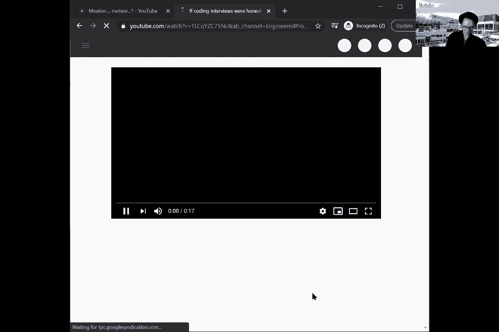
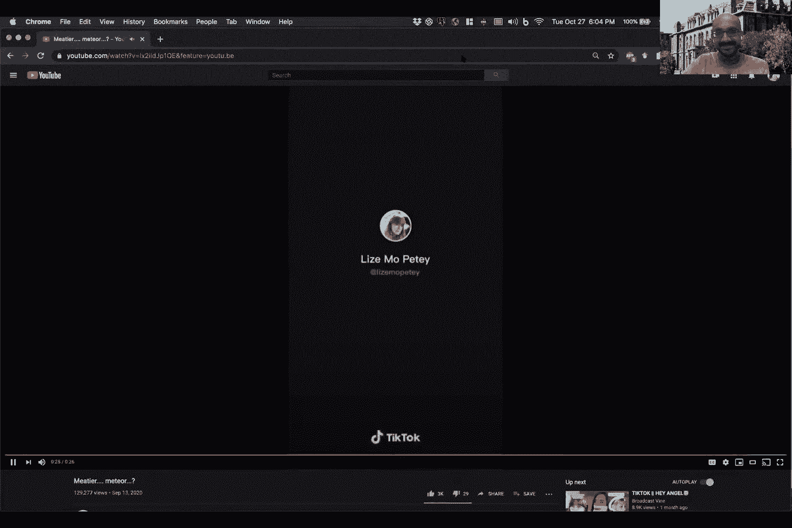
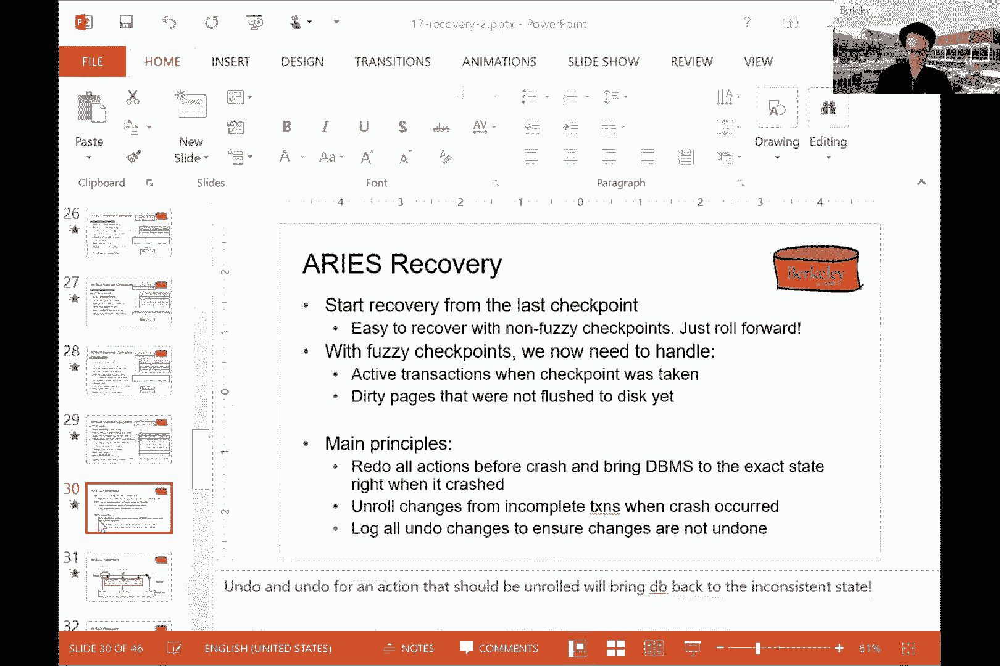
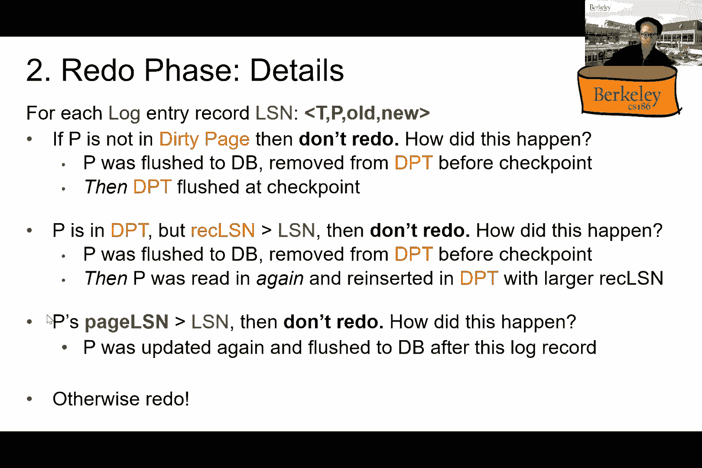

# 课程 P18：恢复 II（续） - 深入理解ARIES算法 🔄

在本节课中，我们将继续深入探讨数据库恢复机制，特别是如何优化恢复过程以避免扫描整个日志。我们将重点介绍ARIES算法，这是一种广泛使用的恢复协议，它通过引入检查点和新的数据结构来提升恢复效率。

---

## 概述 📋

上一节我们介绍了撤销日志和重做日志的基本概念。本节中，我们来看看如何通过ARIES算法来优化恢复过程，避免在崩溃后需要扫描整个庞大的日志文件。我们将学习检查点的概念、模糊检查点的实现，以及ARIES算法中用于跟踪状态的关键数据结构。

---

## 1. 回顾：预写日志与日志记录类型

在深入新内容之前，我们先简要回顾一下关键概念。

*   **预写日志（WAL）**：这是一个核心原则，意味着在实际修改数据库页面之前，必须先**将对应的日志记录写入持久化存储**。这确保了即使系统崩溃，我们也有记录可以用于恢复。
*   **日志记录类型**：
    *   **更新记录**：记录数据元素修改前的值（旧值）和修改后的值（新值）。
    *   **事务状态记录**：如 `BEGIN`、`COMMIT`、`ABORT`。
    *   **检查点记录**：标记数据库的一个一致性状态点。
    *   **补偿日志记录（CLR）**：一种特殊的记录，用于记录撤销操作，我们稍后会详细解释。

恢复的目标始终是：**将数据库恢复到最近一次崩溃前的、一致的状态**。无论是使用撤销还是重做机制，最终结果应该相同。

---

## 2. 检查点：缩小恢复范围 🎯

为了减少恢复时需要处理的日志量，我们引入了**检查点**的概念。

### 2.1 简单检查点（完全检查点）

一个简单的检查点过程如下：
1.  停止接受新事务。
2.  等待所有当前活跃事务完成（提交或中止）。
3.  将所有脏页（修改过的内存页）刷新到磁盘。
4.  在日志中写入一条 `CHECKPOINT` 记录。
5.  恢复接受新事务。

在检查点时刻，数据库处于一个“干净”的状态：所有已提交事务的修改都已持久化，所有未完成事务的修改都已回滚。因此，恢复时，我们只需要处理**最后一个检查点之后**启动的事务。检查点之前的日志可以被安全地截断或删除。

**问题**：简单检查点需要“停止世界”，这在生产环境中是不可接受的。

### 2.2 模糊检查点

为了解决上述问题，ARIES使用了**模糊检查点**。它允许在创建检查点时，数据库继续正常运行（接受新事务，页面可能仍是脏的）。

为了实现模糊检查点，我们需要在检查点时刻保存一些内存中的关键信息到磁盘，以便恢复时重建状态。这引入了两个核心数据结构：

---

## 3. ARIES的关键数据结构 🗂️

为了支持模糊检查点和高效的恢复，ARIES维护了以下内存表：

### 3.1 事务表
跟踪每个活跃事务的状态和信息。
```plaintext
| 事务ID | 状态 (运行中/提交中/中止中) | lastLSN (最后一条日志记录的序列号) |
|--------|-----------------------------|-----------------------------------|
| 100    | 运行中                      | 101                               |
| 101    | 提交中                      | 105                               |
```
*   **lastLSN**：指向该事务产生的**最新一条日志记录**。这让我们能快速找到事务的最近操作。

### 3.2 脏页表
跟踪缓冲池中哪些页面是脏的，以及它们是何时变脏的。
```plaintext
| 页面ID | recLSN (恢复日志序列号) |
|--------|--------------------------|
| 5      | 102                      |
| 7      | 101                      |
```
*   **recLSN**：记录该页面**本次在缓冲池驻留期间，第一次被修改时**对应的日志序列号（LSN）。这是**重做阶段**的起点。

### 3.3 日志记录的新字段
除了事务ID和修改数据，ARIES的日志记录还包含：
*   **prevLSN**：指向**同一事务**产生的上一条日志记录的LSN。这构成了一个按事务组织的日志链表，使得回滚单个事务时无需扫描整个日志。
*   **pageID** 和 **pageLSN**：`pageLSN` 记录在页面头中，表示**最后一次修改该页面的日志记录的LSN**。

---

## 4. 运行时操作与日志记录 📝


现在，我们看看在事务正常执行时，这些数据结构是如何更新的。





以下是关键操作步骤：



1.  **事务开始**：写入 `BEGIN` 日志记录，在事务表中创建新条目。
2.  **页面更新**：
    *   **预写日志**：首先写入包含新旧值的 `UPDATE` 日志记录，并获得一个LSN（例如102）。
    *   **更新内存结构**：
        *   日志记录的 `prevLSN` 设为该事务的 `lastLSN`（例如101）。
        *   修改内存中的页面，并将页面的 `pageLSN` 设为当前LSN（102）。
        *   更新事务表的 `lastLSN` 为当前LSN（102）。
        *   如果该页面是第一次变脏，在脏页表中设置其 `recLSN` 为当前LSN（102）。
3.  **事务提交**：
    *   写入 `COMMIT` 日志记录并强制写日志。
    *   事务状态改为“提交中”。此时事务已认为提交成功。
    *   异步地将所有脏页刷新到磁盘后，写入 `END` 日志记录，并将事务状态改为“完成”。
4.  **事务中止/回滚**：
    *   写入 `ABORT` 日志记录。
    *   从事务表的 `lastLSN` 开始，沿着日志记录的 `prevLSN` 指针依次执行**撤销**操作。
    *   每撤销一个操作，就写入一条**补偿日志记录（CLR）**。CLR描述了“为撤销LSN为X的操作，我们做了什么”。它**也包含一个`undoNextLSN`字段**，指向下一个需要撤销的记录的LSN。
    *   所有操作撤销完毕后，写入 `END` 记录。
5.  **检查点过程**：
    *   写入 `BEGIN_CHECKPOINT` 记录。
    *   继续正常处理事务。
    *   稍后，将当前的**事务表**和**脏页表**的内容写入日志。
    *   写入 `END_CHECKPOINT` 记录。


---


## 5. ARIES恢复算法三阶段 🚀

当崩溃发生时，ARIES通过以下三个阶段进行恢复：

### 5.1 第一阶段：分析
**目标**：确定崩溃时哪些事务是活跃的（需要撤销），以及哪些页面可能是脏的（需要重做）。同时，找到**重做阶段**的起点。

**步骤**：
1.  从最后一个 `BEGIN_CHECKPOINT` 记录找到对应的 `END_CHECKPOINT` 记录，加载其中保存的**事务表**和**脏页表**副本。
2.  从 `BEGIN_CHECKPOINT` 开始向后扫描日志，直到日志末尾：
    *   遇到新事务的 `BEGIN`，将其加入事务表。
    *   遇到事务的 `END`，从事务表中移除该事务。
    *   遇到 `UPDATE` 记录，如果其页面不在脏页表中，则将其加入，并设置其 `recLSN` 为当前记录的LSN。
    *   更新每个事务的 `lastLSN`。
3.  分析阶段结束后，我们得到了：
    *   **崩溃时的活跃事务表**（需要撤销）。
    *   **崩溃时可能为脏的页面表**（需要重做）。
    *   **重做起点**：脏页表中所有 `recLSN` 的最小值。

### 5.2 第二阶段：重做
**目标**：将数据库**重放**到崩溃发生时的状态。我们重复历史，但只重做那些必要的操作。

**步骤**：
从分析阶段找到的**重做起点**开始，正向扫描日志，直到末尾。
对于每一条 `UPDATE` 或 `CLR` 记录：
1.  如果其页面ID**不在**分析后的脏页表中 → **跳过**（该页修改已持久化）。
2.  如果记录的LSN **小于** 脏页表中该页面的 `recLSN` → **跳过**（该修改在页面变脏之前）。
3.  如果记录的LSN **小于等于** 磁盘上该页面的 `pageLSN` → **跳过**（该修改已应用于页面）。
4.  **否则**，重新执行该操作：将记录中的“新值”应用到指定页面，并更新页面的 `pageLSN` 为当前记录的LSN。

**注意**：重做阶段会重做**所有**事务（包括后来中止的）的操作，以确保页面状态与崩溃前完全一致。




### 5.3 第三阶段：撤销
**目标**：回滚所有在崩溃时仍未完成（活跃）的事务，使数据库达到一致状态。

**步骤**：
1.  从分析阶段得到的**活跃事务表**中，找出每个事务的 `lastLSN`。
2.  将这些 `lastLSN` 放入一个“待撤销”队列。
3.  循环处理，直到队列为空：
    *   取出队列中最大的LSN（即最近的操作）。
    *   找到对应的日志记录。
    *   如果它是 `UPDATE` 记录，则执行撤销（将旧值写回页面），并写入一条 `CLR` 记录。
    *   如果它是 `CLR` 记录，则其 `undoNextLSN` 字段指明了下一步该撤销什么。
    *   根据记录的 `prevLSN` 或 `undoNextLSN`，将下一个需要撤销的LSN加入队列。
4.  所有活跃事务回滚完毕后，恢复完成。

---

## 总结 🎓

本节课中，我们一起学习了ARIES恢复算法的核心思想与步骤。作为对传统恢复机制的优化，ARIES通过引入**模糊检查点**、**脏页表**、**事务表**以及**补偿日志记录（CLR）** 等机制，实现了高效且灵活的恢复。

其核心三阶段——**分析**、**重做**、**撤销**——确保了：
1.  恢复时无需扫描全部日志。
2.  重做阶段将数据库恢复到崩溃前的精确状态。
3.  撤销阶段只回滚未完成的事务，并且通过CLR避免了重复撤销。



ARIES算法是现代数据库管理系统实现恢复功能的基石，理解它对于掌握数据库内核原理至关重要。