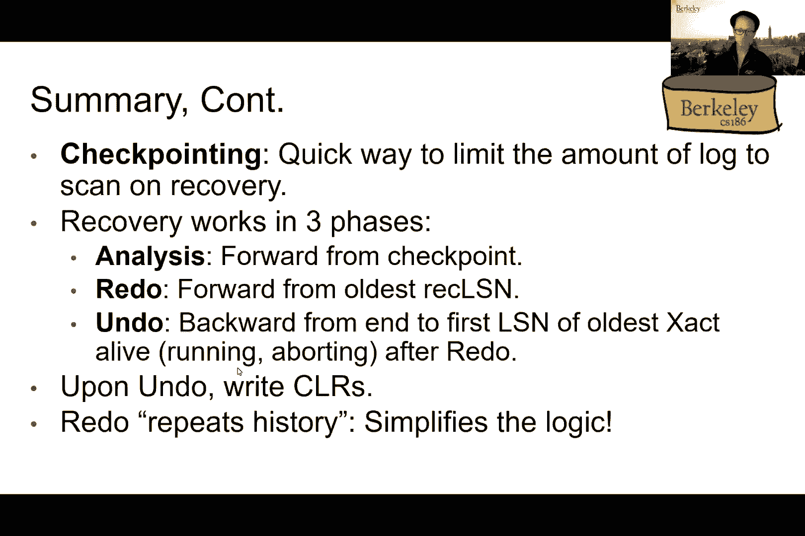
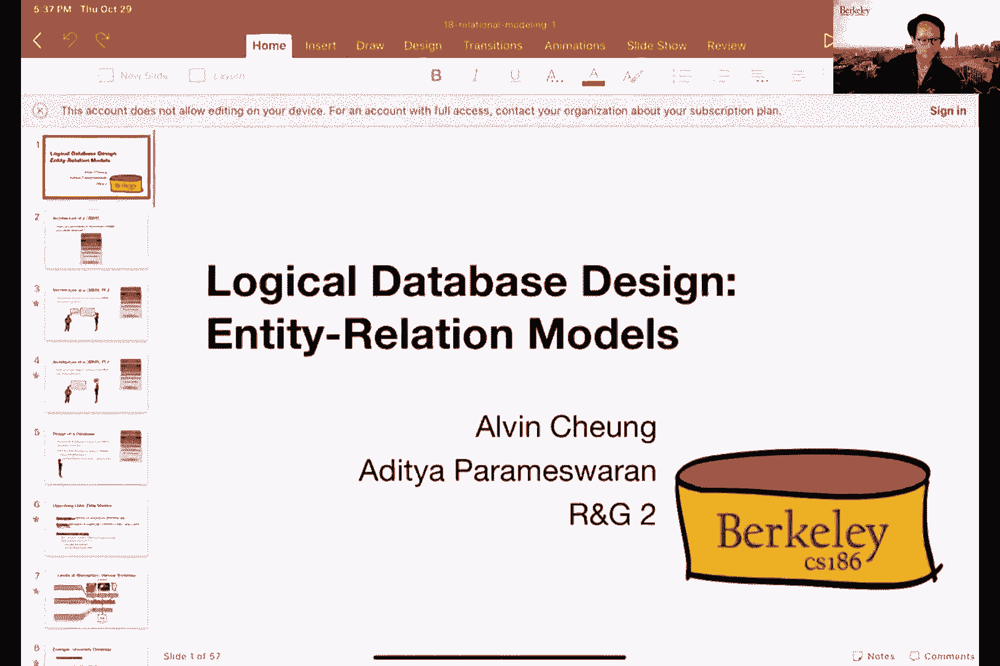
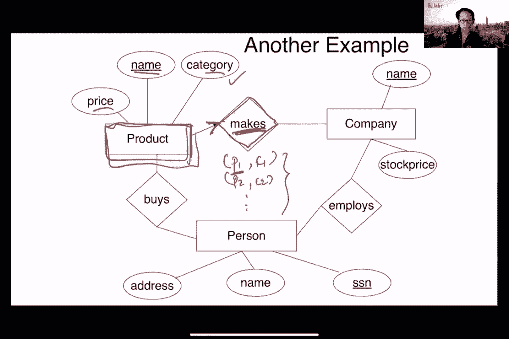
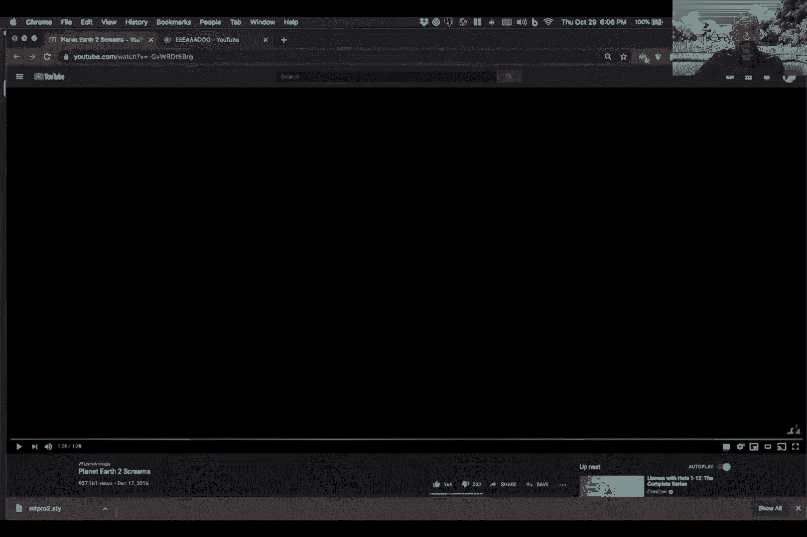
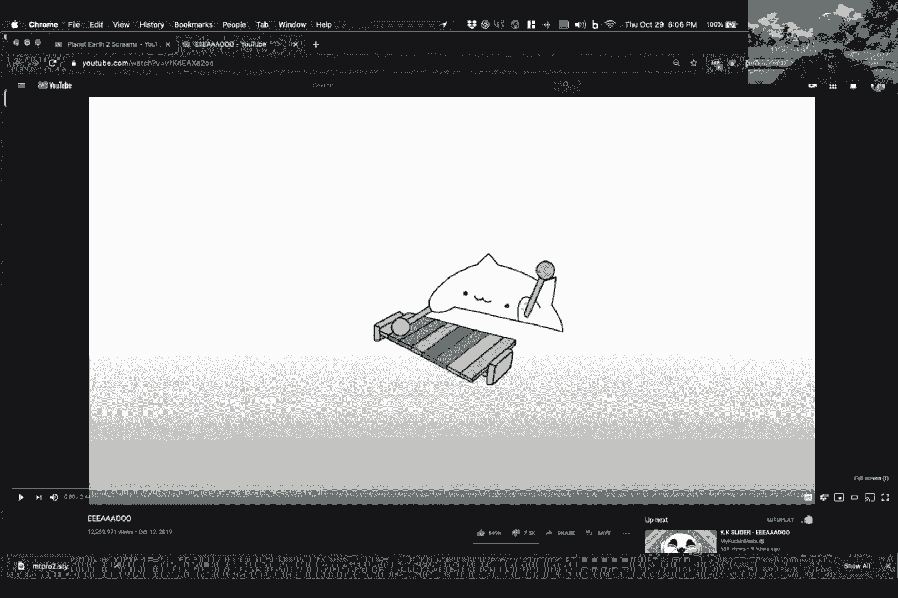
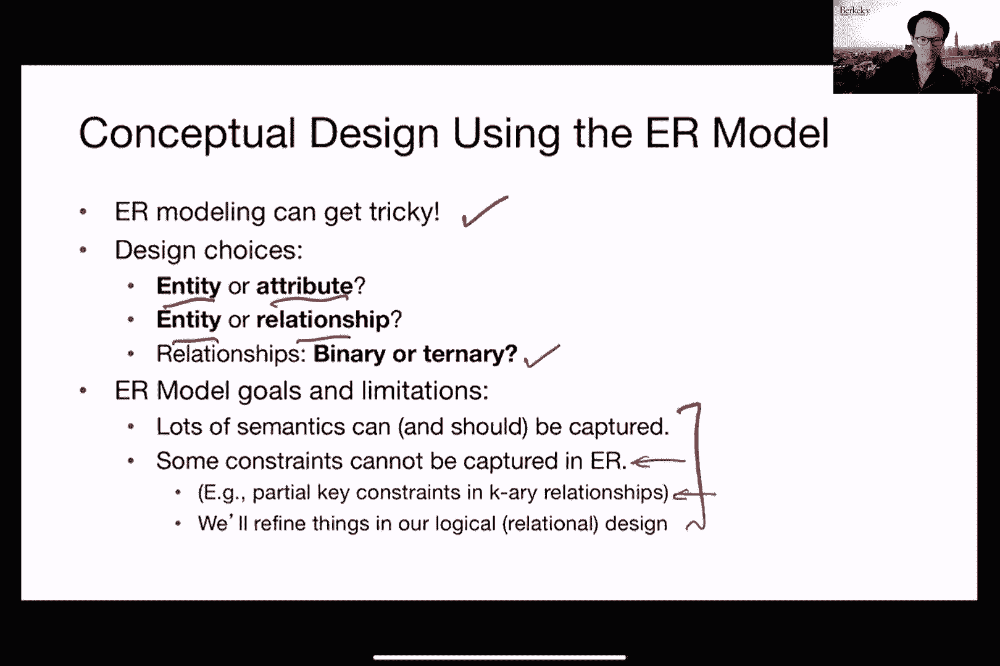

# P19：Lecture 19 DB Design ER Models - ___main___ - BV1cL411t7Fz

好的，所有的权利，大家好，对不起，迟到一分钟，所以今天我向你保证，这将是我们最后一次听到，在班上的这一部分，至少如果你真的讨厌它，那就别担心了，就像你知道这将是你现在最后一次看到它一样。所以白羊座的全部意义，就像我上星期二说的那样，是关于模糊检查点的概念，所以我们不想让整个数据库停止，无法处理新的交易，所以我们想出了这个主意，对不起，我来修麦克风，所以我们想出了一个模糊的检查站的想法。这意味着当我们执行检查点时，我们仍然允许事务通过，但缺点是，然而，在这种情况下，我们现在有其他状态，我们需要跟踪，即活动事务的状态，还有没有写到磁盘上的三十页，所以最初的几张幻灯片基本上是，呃。从周二开始复习，所以我们引入的新数据结构，嗯，从最后开始，呃，从星期二开始，你在屏幕上看到的30页的表格，而且，呃，事务表的概念，它跟踪事务的状态，然后我们现在讨论区域，那么我们如何实际利用这些额外的。

呃，帮助我们恢复的数据结构，所以我们已经覆盖了，你知道的，那种正常的操作，呃，在正常操作期间，我们上次是如何更新这些数据结构的，所以我不想再拿细节来烦你们了，嗯，所以现在我实际上想去好的东西，对呀。所以说，这就是我们要做的恢复，我们发明了所有这些新的数据结构，所以如果你还记得上星期二，我们讨论了白羊座背后的整个观点，就是能够把数据库恢复到相同的状态，在坠机时，然后能够重做所有需要完成的操作。因为这些事务最终决定要么提交，要么中止，在我们通过检查站之后，然后我们需要能够撤销所有其他的操作，呃，那是，呃，在崩溃时由这些不完整的事务执行的，所以这是这里的主要原则，我是呃，突出显示，呃。在屏幕底部，这里有一些我们需要记住的事情，这也是一个新的东西，从另一个，呃，我们前面讨论过的恢复协议，对呀，因为如果我们真的停止了世界检查，指出，我们没有什么要做的，我们做对了，因为就像你知道的。

一切都已经，需要做的一切，在我们通过检查站的时候已经进行了，所以如果我们在以后的某个时候坠毁，那么我们唯一需要担心的事情，在检查站之后发生的事情，但在这种情况下，因为我们正在采取一个模糊的检查点。那么我们可能会做一些我们需要担心的事情，以前实际发生过的，呃，那个检查站被占领了，例如，写入磁盘的东西，但他们还没有进入磁盘，然而当检查站被占领时，这有道理吗，然后在展开不受欢迎的行动方面。这和其他协议也是一样的，对呀，所以在崩溃时没有完成的交易，我们将它们视为需要中止的事务，所以这意味着我们需要撤销所有的操作，所以这就像，你知道吗，呃，一切如常，所以我们掌握的时间表，如果你从，呃。如果你从日志的角度来看，我们会有如下所示的东西，所以我们会在某个时候采取一个检查站，然后我们需要处理两类事务，我用红色突出显示的第一个类，下面是我们需要重做的，对呀，因为它在检查站时是活动的。

它在承诺它在承诺，最终在检查站被占领后，在坠机前，它对没有冲到的磁盘进行了一些破坏，呃，对不起，它在记忆中做了一些中断，大约有三十页，没有一直到达磁盘的，然而，当检查站被占领时，所以对于这些事务。我们需要重做它所拥有的所有操作，它一生中基本上都在做，然后在最后把三十页也冲掉，对呀，所以这是我们需要处理的第一类交易，然后是我们需要处理的第二类事务，是坠机时我们还在运行的。就像我在上一张幻灯片上说的，这些是我们需要撤销的，因为这些是我们需要当作男孩对待的不完整的，所以这里的问题是我们如何计算出，你知道的，这两个圈起来的点是什么，呃，因为它们都发生在检查站被占领之前。我们需要以某种方式发现这两个动作在日志中的位置，因为这些是我们需要开始重做的，也可以解开直到，所以在我们这样做的领域，那就是先通过这里的第一道关卡，被称为分析零件通行证。

所以分析部分的目标就转移到了试图弄清楚，在日志中我们需要首先，um开始重做最终提交的事务的操作，但还没有对磁盘进行所有更改，然而，分析阶段的工作方式基本上是查看脏页表，我们会从检查站找到的，对呀。所以当我们通过检查站的时候，我们还序列化所有脏页和磁盘上的所有事务状态，所以当我们试图进行恢复时，我们要做的第一件事就是查看我们走过的最后一个检查站，然后我们重建所有的脏页，以及内存中的所有事务状态。所以在这一点上，从30页的表格，我们会有一堆恢复贷款，那个，你们可能还记得星期二的讲座，呃，我们指的是第一个把那一页弄脏的，对呀，所以第一页可能是按锁号做的，像一百个，相对于喜欢，你知道吗。第十页是空的，呃被呃，从像锁记录号，九十五岁什么的，在这种情况下，如果我们查找最小数字，所有这些中的最低回收率，那基本上就告诉我们，嗯，我们需要开始重做动作的第一点，再说一遍，这是保守的，对呀，就像。

你知道的，呃，我们可能不需要重做之后发生的每一个动作，呃，这个最小值，呃，恢复，因为其中一些可能已经对应于事务，实际上已经对磁盘进行了更改，但如果我们不得不重做那些动作也没有坏处，对，因为他们已经犯了。所以我们再把它写到磁盘上没关系，这就是分析阶段所要完成的，基本上是找出在日志中的什么点，我们首先需要，所以重做阶段涉及的实际工作非常简单，我们基本上就开始沿着船闸前进，从我们在分析阶段确定的第一个LN。然后我们读取每一条锁记录并重做操作，呃，呃，呃，从右边的锁，所以问题是，你知道的，呃，在重做阶段，我们只想重做需要重做的操作，有一个小细节，就像，我们如何确定这些动作中哪些需要重做，所以我之前说过。你知道这没有坏处，如果我们需要重做一切，但实际上在某些情况下，你不想重做事情，我们在最后一场比赛中也经历了这一点，在上一节课也是如此，例如，我们有一个日志记录，我们想尝试重做。

但事实证明该页不在脏页表中，我们不想重做那个动作，好吧那这到底是怎么发生的呢，所以这可能会发生，因为日志记录中涉及的特定页面实际上被刷新到数据库，并随后在检查点发生之前从脏页表中删除。所以如果是这样的话，那我们绝对不想重做那个动作，对呀，因为该操作最终对应于已经刷新到数据库的内容，所以就像你知道那样做没有意义，嗯然后是的，然后第三个页表是，呃，在检查站，因此，就像你知道的。我们不想那样做，然后第二种情况是，呃，如果页实际上在脏页表中，但后来的恢复实际上比，我们目前正试图再次重做的那个，这怎么可能发生呢因为页面被刷新到数据库，但它实际上是在检查点之前从30页的表格中删除的。我说你说你知道怎么会这样，所以这可能会发生，因为页面本身可能会被另一个事务从另一个趋势中再次读取，然后我们把它插入一个30页的表格中，当检查站被占领时，恢复得更快，这有道理吗。

所以基本上是说就像你知道的，一个事务触及特定页面，弄脏了，然后被刷新到数据库，并从脏页表中完全删除，现在交易是后来发生的，再读一遍同一页，对同一页进行其他更改，然后该页现在留在脏页表中。当检查站被占领时，所以我们最终需要替换第二笔交易，其实不是第一个对吧，因为第一个已经冲了，实际上后来被另一个事务覆盖了，如果页面，如果页面，呃，页面lsn实际上大于，呃，我们现在试图重做的动作。我们也不想重做那个动作，怎么又发生这种事了，对呀，您知道页面lsn对应于最后一个lsn，呃，那个呃做了那个特定的第30页，2。怎么又发生这种事了？所以这可能会发生，因为页面后来再次更新，等我们过了关卡。对呀，所以想象一下，同一个事务多次写入同一个页面，所以现在我们基本上遇到了第一个权利，这样我们就不需要重做了，因为最终我们会看到一个混合的记录，对呀，所以现在重做没有意义，这是第三个案例。

否则我们就重做动作，自从重做法案，并且因为重做记录已经存储了要写入页面的新值，所以重做其实很容易，所以到底会发生什么，所以问题来了，如果系统真的崩溃了会发生什么，重做，所以我们只是你只是重做同样的动作。很好对吧，所以我们重新运行分析阶段，然后我们再重做同样的动作，我是说，因为我们在这种情况下，它的项目效力，你遵守我之前说的规则，作为，所以我们基本上只是重做从第一个动作开始的一切，我们需要重做直到坠机。所以这基本上会让我们在数据库中得到最新的信息，嗯，就国家而言，当它实际上，呃，坠毁，所以现在的问题变成了，我们现在需要从不完整的事务中撤消操作，因为那些我们视为堕胎的，那么在这种情况下我们如何撤消对吧。所以我们基本上从锁的末端开始扫描，然后我们只是说所有积极的行动，在那一点上的事务对吧，我们基本上称他们为失败者，顺便说一句，这个名字不是我们发明的，这个名字实际上是在报纸上使用的。

所以如果你对这个名字有任何问题，呃，你知道，责怪莫汉，对呀，呃，是啊，是啊，所以我们将把那些失败的交易称为，对呀，因此事务表中仍处于活动状态的任何内容，当数据库崩溃时，称他们为失败者。所以我们就中止所有这些，呃，这些失败的交易中的每一个，然后我们在概念上完成，是呀，那正是我们想做的，有一个问题，然而，因为如果你回忆起我们做的方式，呃，在正确的区域撤消，但基本上是在锁里追踪。根据之前的这些指针来计算出你知道哪些，在这里实际撤消问题的操作是，如果我们有很多需要撤销的行为，我们需要做很多反向追踪，然后如你所知，这些向后跟踪中的每一个都可能导致额外的i，o。在日志的那一部分中读取，所以我们最终可能会多次遍历日志的同一部分，因为我们基本上是在一个接一个地追溯多个事务的步骤，所以问题是，就可以，我们实际上试图优化这一点，只需对日志进行一次向后传递。

然后能够识别我们需要撤销的所有事情，所以这并没有错，就像，你知道，一个接一个地做这个对吧，所以仔细检查这些交易中的每一笔，一个个解开，所以这在概念上是正确的，那里没什么问题，在这一点上。我们谈论的只是优化，那么我们如何正确地做到这一点，所以让我们定义一个调用来撤消的东西，是一套，呃，我们需要从这些失败的交易中撤销的贷款，所以我们已经很方便地存储了最后一个动作。交易或失败的交易在崩溃时做得对，例如，右边的第二行基本上是在说交易，104是坠机时正在运行的东西，所以一零四是我们需要撤销的东西，然后对不起，一零一是我们应该撤销的事情，然后就像你知道的。锁定一号零号和四号是你知道的最后一个动作，这个特殊的交易1-0-1，呃，死了，好的，所以这基本上是我们需要撤消的起点，交易编号01，你可以想象，如果我们还有其他交易，我们需要撤销的权利。

然后我们可以把所有这些最后的lns都扔进这组，嗯，呃，LSMS我们需要从所有失败的交易中开始撤消，我们为什么要这么做，因为我声称如果我们跟踪，那么这实际上允许我们在日志中只做一次向后传递。能够撤销我们需要的一切，而不是需要单独追踪其中的每一个，一个接一个，所以让我们看看是怎么做到的，下面是它的伪代码，所以虽然这组SN不是空的，我们总是从集合中选择最近的一个来撤消。这意味着如果我有两个独立的事务，我需要撤消，其中一个说最后一次行动是在L200，另一个说最后一个动作是lsm一百，那我们就先把211拆了，我是说原因很明显，对呀，我们从最后开始。所以两百在时间上比一百大，所以我们想先撤销200个，所以我们总是选择最近的，然后你知道，如果它只是一个普通的块记录，类似于相同形式的，呃，你在屏幕上看到的，然后我们就撤销那个动作，然后就像我说的。

我们将在该模式下在日志中写入补偿记录，在这一点上，基本上说我们已经撤销了那个特定的行动，此外，我们将在下一个lsn中放入这个撤消，成为我们需要撤消的这个特定事务的下一个ln，所以现在你看到了。我们基本上是这样构建的，你知道的，呃，下一组我们需要撤销的事情，所以这是为了这个特殊的交易，因为我们已经从这个事务中撤消了一个特定的操作，然后我们现在基本上是在看。我们需要从这个特定的事务中撤消的下一件事是什么，然后如果这个记录本身就是一个补偿记录，如果不是定期记录，那我们其实不想撤销它，你可能会想为什么我们不想撤销它，就可以，有人试着猜测为什么。我们不想撤销我们以前已经撤销的事情，有什么猜测吗，呃，对不起，尼古拉斯，你在问一个关于，对案例三是什么感到困惑那么你说的案例三是什么意思，CR代表补偿记录，还是我失去了所有人，但它是一个。

这是我们不喜欢撤消的原因，一个CR记录就像，如果我们撤销，那不是，这意味着我们必须撤销更多，因为销售已经撤销了一些事情，如果我们撤销，那并不意味着，然后我们必须撤销CR像太阳的动作，这样做，只是额外的。是啊，是啊，所以你越来越近了，所以这样想吧，所以当我们试图撤销一些正确的事情时，就会写上赔偿记录，这实际上是我们想要撤销的事情，对吗，把这看作是，一些有边框的事务，所以这就是这些赔偿记录存在的唯一原因。所以如果我们试着回滚那个特定的交易，重写这些CR记录，好的，所以如果我们真的撤销CR记录，那我们就解开了撤消的权利，这意味着我们实际上想要，我们实际上希望肮脏的东西在那里。这意味着我们实际上希望边界事务更改是持久的，这不是我们想要的对吧，所以让我再说一遍，所以是的，啊，记录代表了一些已经被撤销的事情，这是我们希望被撤销的事情，因为它对应于来自边境交易的操作，好的。

如果我们撤销它，这样做，甚至说它是一个嘴巴，那么这意味着我们希望边框事务更改保持到磁盘上，这不是我们想要的对吧，我们真的想撤销它，我们是认真的，这不是关于崩溃，这就像，你知道的，呃。注册一些我们真正打算展开的东西，如果我们把这个卷展开，那基本上意味着我们什么都没做，这意味着肮脏的东西会持续下去，这将使数据库状态不一致，这有道理吗，是啊，是啊，这是相当棘手的。所以就把它想象成我在做我在做，你真的想做对吗，如果你想想我们为什么要撤销它，从动词和从一开始，这基本上可以解释，你应该能推理出来，事实上，我们不想撤销这一点，撤消。所以这里的另一个有用的东西只是为了添加到这个元素中，如果你不介意的话，通常在什么情况下你会遇到CR记录对吗，你会遇到SELA记录的情况，就是当你试图撤销过去的事情，如果你决定撤销某件事。

那么这意味着该事务已被中止，嗯，所以如果它尝试了，你试着撤销它在过去，你不需要重新解开它，事实上，这个看到了，这是为什么CLI记录实际上是一个优化的例子，这可以帮助您跳过撤消。如果在同一恢复过程中有多个崩溃，也许阿尔文接下来会讨论这个，是啊，是啊，所以这是另一个很好的说法，所以这正是我们，如果在撤消过程中遇到常见的补偿补偿记录，我们实际上不想撤销它，但是。如果CR向右记录指针，所以下一件要撤销的事情，实际上不知道我们要插入到要撤消列表中，因为那个动作，权利可能仍然是我们需要撤销的东西，它可能是对的，我是说，因为如果它真的是已经被撤销的事情。我们也会尽早看到另一张CL唱片，所以当我们说到那个的时候，然后我们要确保我们也不会撤销那个动作，这样就可以了，好吧，如果下一个撤消现在不是对的，然后我们基本上说，好的，我们已经完全登上了它。

或展开此特定事务所需的所有操作，所以我们完成了，所以我们把结束记录写到锁上，然后我们把它冲掉，所以我们要确保我们完全掌握了，所以基本上这里的说法是，当没有更多的其他事务要撤消时，我们基本上就完成了。这意味着这个要撤消的集合现在是空的，只要不是空的，对呀，意思是像你知道的有人把，一些东西来撤销那个权利，要么，因为之前的SN，嗯，对于第一个案例中的第一个，uh不是空的，所以所以，就像你知道的。我们有CR记录，用一个指针指向我们需要撤消的下一件事，或者在第二种情况下你知道我们也把它放进去撤消，对呀，所以在这两种情况下，那么我们需要继续运行这个循环，所以实际上你也可以用这个算法。在执行正常操作的同时撤消单个事务，然后我们基本上归结为同样的事情，就像我们之前说的那样，在做这个反向追踪方面，这里唯一的优化基本上是能够同时撤消多个事务，呃，用这个来撤销那个来跟踪我们需要撤销的事情。

否则它必须说完全相同的效果，好像我们经历了这些失败的交易中的每一笔，然后回溯他们的步骤来撤消他们中的每一个，一个接一个，所以类似的问题，就在那里，你已经指出了，那么如果系统在撤消阶段崩溃会发生什么。答案是，我们实际上不会再撤消了，我们基本上依赖于这些CR CR记录中的每一个，重做唱片的权利，我们只是重做，呃，像我们一样的事情，当我们浏览，呃，呃，在日志右边，这和我之前提出的论点是一样的。你不想撤消撤消，所以说，呃，别再反悔了，但你知道我们可以，通过重播所有这些不同的动作来重做阶段，所以没有效果对吧，因为这是有效的项目，到目前为止对此有什么问题吗，好的，所以说，如果没有，然后就像。你知道的，这基本上是这个片段的结束，所以我们基本上讨论了恢复经理的所有这些不同概念，然后使用右前方锁，还有钢和力的对决，不对不用力，为了嗯，不同的锁定机制，还有不同的冲洗机制，然后对于区域部分。

我们谈论这个，呃，用于标识日志中每个项的日志序列号的概念，然后呃，我们添加到右手锁的各种字段，以及我们为了进行恢复而引入的不同数据结构，然后我们还讨论了检查点的概念。以及我们如何在一些地区使用挑剔的检查站来帮助我们进行恢复，用这个，呃，三个不同的阶段，在我们转到下一个话题之前，有关这方面的问题，是啊，是啊，我知道对，我是说，这件事真的很棘手，对，因为就像你知道的。这是所有这些不同的东西飞来飞去，所有这些不同的，在所有这些不同的变量下，所有这些不同的数据结构飞来飞去可能会一口吃掉，嗯，所以我的建议是，呃，试着读笔记，以及教科书来研究这些算法中的每一个。然后你们就会，我相信你们练好之后一定会成为专家的。呃，在项目五的工作中工作，所以你知道在这一点上不要担心，呃，但我认为你需要担心的是，也许就像，确保你明白这些不同的恢复概念，就像做撤消的概念。

以及基于重做的恢复概念，以及这些不同协议之间的锁是如何不同的，白羊座是如何，就是，本质上只是一个优化，在我们已经讨论过的基本撤消或重做协议之上，在课堂上，当TF切换到下一个主题时。

顺便说一句，今天有什么事吗？因为班上有40个人，三十，班上三个，六百个中，好像是二十分之一，喜欢的权利，我们只有一半做得这么差，或者像发生了其他事情，呃，期中考试，大家都在为期中考试做准备。也许周一选举的中期选举，星期二，哇哦，好了够了，好的，嗯，祝你好运，每个人，好的，所以嗯酷嗯阿尔文，大约六点左右，你介意打断我吗？这样我们就可以休息一下了，是啊，是啊，好的，所有的权利，所以嗯。所以我们将讨论呃模型或实体关系模型，或实体关系模型，所以为了激励这个，呃，让我们重温我们熟悉的，呃，数据库堆栈，对呀，所以我们已经讨论了所有这些补语，现在所有这些组件，我们甚至研究了事务处理组件。所以我们已经覆盖了很多领域，我们在这门课上讨论过的，所以退后一步，嗯，在使用数据库方面，我们是否知道我们需要知道的一切，对，所以你可能会问嘿，你可以说嘿，让我们了解如何使用SQL查询，我们知道怎么。

对我们的数据提出问题，然后理解我们数据库中的内容，我们也知道如何对我们的数据进行更改，所以我们知道如何插入记录和修改它们等等，到目前为止，我们所描述的一切都是有意义的，如果有人已经正确地描述了模式。已经定义了您的数据已经是，的，数据结构的方式已经预定义，所以你可能会想的一个问题是嘿，对的有多难，你只是说你只是指定属性，指定关系，你做完了，结果这实际上是一个相当难的问题，对呀，这是个很难的问题。这占据了大量的研究，即使有这么多研究，我不知道有没有，嗯，仍然喜欢完美的解决方案，有很多权衡和很多，嗯，各种不同的意见，好的，那么让我们来谈谈如何设计一个数据库，对呀，所以你有一个应用程序。您想设计一个数据库，你是怎么做到的，我们不是在设计数据库系统，这就是我们到目前为止一直在谈论的，我们在讨论设计一个数据库，所以让我们从我们所知道的开始，我们先谈数据模型，我们已经看到了一个数据模型。

所以我们知道一点我们在说什么，那么什么是数据模型，所以数据模型基本上是描述数据的一组概念，这是一个相当抽象的概念，嗯，给定数据模型的模式基本上是一种描述，或使用给定数据模型的特定数据集合的描述符。所以它是特定于给定数据模型的特有的，所以我们熟悉的数据模型是关系数据模型对吧，所以这里的主要概念是关系的概念，嗯你，呃，或者有行和列的表，所以我们处理过的每一个关系都有一个模式。模式定义关系中的列以及列名，然后呃，类型正确，所以这就是你，呃，定义数据库时提供，所以您指定列，指定列名及其类型，所以给定这个关系数据模型，实际上，对这个数据模型有许多不同的观点，不同的人有。因此最终用户或最终用户应用程序查看视图，我们已经讨论过观点的概念，这些只是呃，可以查询的虚拟表，假装他们的桌子，对呀，所以我们已经讨论过观点的概念，我们也呃，谈到了，数据库的架构。

所以这是一个全局逻辑结构，它通常被称为概念模式，对呀，这是您数据库中的关系集，然后又是物理模式，我们已经讨论过了，这些是这些数据的实际存储方式，我使用的文件是什么，使用的索引是什么，正在使用堆文件。比如说，对呀，作为一个例子，鉴于这个大学数据库，我的概念模式可能包含三个表，你的学生桌，你的课程表和注册表，而实际存储的物理架构，呃，包含关系可以存储为无序文件，然后您也可以定义一些索引，例如。您可以在ID右侧的第一列学生上定义一个索引，然后你对这个概念模式有了看法，所以这些是呃，定义虚拟表的查询，那么应用程序是用户可以访问的，因此，这个视图模式可能包括一个名为课程信息的虚拟表。它是通过在注册表上进行组I查询来获得的，这基本上是总结了呃，在每个班注册的学生，作为数据库系统一部分的一个强大的概念，这种数据独立性的概念，通常您希望每个层都有一个模块化。

这样对一个层的更改就不会影响其他层，例如，您不想要的应用程序，受影响的应用程序，呃通过数据的结构，因此，这个概念被称为逻辑数据独立性，所以你想成为，您可以维护视图，即使概念模式改变了，所以如果你说嘿。我要去，我不喜欢那样，我只有一个大亲戚，我要把这个关系分成两个关系，然后呃，连接这两个关系以重建每个视图，我可以很容易地做到这一点，所以我所需要做的就是重新定义视图查询，即使我改变了概念模式。我的数据库将继续像过去一样运行对吧，因此，任何使用这些视图的应用程序都不需要阅读，因此，这个概念被称为逻辑数据独立性，好的，因此，您独立于应用程序或用户被隔离，与逻辑模式或概念模式的更改隔离，同样地。有物理数据独立性，基本上是说你想，嗯，您可以更改数据的实际存储方式，但是关系模式不需要改变，所以上面的一切都不需要改变，因为你决定，比如说，添加索引或以不同的方式存储数据，好的。

所以基本上在概念模式和物理模式之间，在视图模式和概念模式之间，你想要独立，对呀，所以您希望视图继续工作，即使下面的东西已经改变了，您希望概念模式和视图继续工作，即使你是如何存储数据的，呃。您使用的索引更改了什么，好的，这就是逻辑和物理数据独立性的概念，这些都是数据库系统免费提供的强大概念，那么为什么这对数据库系统很重要呢，嗯，这是因为数据库及其相关的应用程序会持续很长一段时间。事情往往会改变，所以你可能有新的硬件，新应用程序，呃，但是呃，当你交换每一层时，另一层，保持不变，继续提供同样的保障，事实上，很多银行，嗯，还在用旧的，真正古老的遗留数据库系统，嗯和所以呃，你，你不想。嗯，你想要那些应用程序，你甚至可以继续使用新的应用程序，即使您是关系模式，并且您的数据库系统没有被更改，所以本质上，这给了你跨这些使用层的模块化，好的，所以退后一步，我们讨论了关系数据模型。

这是一个关系的集合，很容易在数据库中实现，我们已经讨论了如何在数据库中实现它，关系数据模型还提供了逻辑和物理数据独立性的概念，嗯，这样您就可以定义视图，您可以定义您的关系模式。并且可以指定数据在磁盘上的布局方式，比如说，所有这些都可以相互独立地发生，然而，从最终用户的角度来看，这其实很难推理，所以如果你说嘿，我想建立一个数据库系统来存储所有关于学生和班级的信息，入学人数。以及其他可能与大学环境有关的信息，我应该用什么关系，它是，弄清楚如何做到这一点实际上很有挑战性，嗯，它是，它是，一点都不简单，把物理世界中的概念，并将其映射到关系模型，为此，实际上是另一个数据模型。它被称为实体关系模型或实体关系模型，这基本上是定义实体的集合以及这些实体之间的关系，实际上更难直接在数据库中实现，但从最终用户的角度来推理更容易，所以作为一个在想，嘿嘿，我想为某事建立一个数据库。

实体关系模型实际上是开始定义的正确点，呃，什么信息，你想让我们用什么比特和字节，到目前为止还有什么问题吗？所以我们将要讨论的数据库设计，我们要从ER模型开始吗，我们将讨论如何将其转换为关系模型。所以一套关系，基本上，在我们这样做之前，我想退后一步，谈谈什么是典型的工作流，在数据库设计中，所以你通常从所谓的呃开始，工业需求分析，所以你基本上试图确定用户需要什么，数据库需要做什么，它必须做什么。什么比特和字节的信息，一定要抓住，它必须捕捉哪些关系，所以基本上什么，什么是，现实世界的各个方面是什么，数据库系统是否需要捕获，所以这就是，也就是需求分析，相当模糊，它不是，嗯很明确，但这是一个过程。不过，这很重要，如果您想为现实世界开发一个应用程序，然后你把这些需求，需求，然后把它转换成一个er图，所以呃图，我们将看到，是数据的高级可视化描述，所以这个呃，这张ER图。

也是许多对象关系映射背后的基础，你可能是，嗯，伊森问未来的讲座也会比今天更高水平吗，我们坚持住，很快就会有一些技术上的东西，所以别急，嗯好吧，所以喜欢这个区域，东西不够低级，我是说，无论如何，是啊。是啊，这绝对是更高的水平，因为我们谈论的是用户，但是我们很快就会讨论一些技术细节，好的，所有的权利，所以对象关系映射，所以你可能听说过Ruby on Rails，或者Django或者冬眠。所有这些都是允许您指定，看起来像急诊室模型的东西，这就是我们今天要做的，嗯，概念步骤之后的逻辑步骤将er图转换为关系，好的，所以你拿着你的急诊室图，然后把它转换成数据库中的一堆表。ORMS再次可以在这里帮助你，翻译ER图关系的这一步实际上可以部分自动化，我们将自己研究一些例子，试图弄清楚怎么做，但其中一些也可以自动化，好的，然后呢，现在你有关系了，下一个问题是，呃。

你怎么让他们变得更好，好的，在那里，事实证明，有一些机制试图将你所拥有的一系列关系，然后通过添加一致性等需求来改进它或细化模式，要求和正常化，这基本上是一个想法，把关系分解成更小的关系，呃。同时在更大的关系中保留信息，好的，和最小化冗余，所以我们将讨论像这样的概念，然后是，呃，物理设计，那么如何将关系存储在应该使用的索引中呢，如何在磁盘上布局数据，数据库设计中的另一个正交问题，但同样重要。这有点像从上到下，这是一个正交的问题，但这也很重要，就像，我说，嗯，它基本上是安全的，谁被允许访问什么，以及如何允许他们访问它，好的，他们被允许做什么操作，允许他们阅读吗，他们可以编辑吗，等等，好的。所以让我们开始谈论ER模型，所以我们需要知道的关于急诊室模型的第一件事是，实体到实体基本上是真实世界的对象，由一组属性值描述的，实体集只不过是相似实体的集合，实体集由如下所示的矩形表示，例如。

您可以有一个由所有员工组成的实体集，实体集中的所有实体都具有相同的属性集，好的，所以如果你有，呃，此实体集中的三个属性和一个实体，所有其他，呃，具有相同数量的属性，每个实体集都有一个主键，好的。所以现在你开始看到一些这些实体和关系之间的映射，但让我们暂时停留在实体关系模型上，所以每个实体集都有一个主键，呃再次，主键是定义此实体集中每个实体的属性组合，唯一定义实体集中的每个实体。每个属性都有一个域，这是一个实体集雇员的示例，这叫雇员，包含许多单独的实体，呃，它有三个属性，ssn，名称和地段，um，然后呃，SSN下划线，说明呃，这是我们的主钥匙，是啊，是啊，就像我说的。这与我们在关系中使用的主键概念相同，呃，在关系数据模型中，让我们谈谈关系，好的，所以我有一个呃，实体设置在这里，这是另一个实体集，这颗钻石是，呃，呃，所以关系，呃，实际上有一个关系集。

所以让我们谈谈一段感情，然后是关系关系，这是两个或多个实体之间的关联，呃，比如说，一个雇员Murtaza在这个呃实体集，在药剂科工作，它是这个实体集中的一个实体，然后嗯，关系也可以有自己的属性。就像在这种情况下，因为是呃，这个属性，所以关系集是用这个菱形表示的，关系的集合，直觉上，呃，在这个特定的例子中，您可以看到，工作在一个关系集中，包含成对的员工和部门，好的，所以成对的员工部门，嗯。它包含许多这样的对，所以如果你有一个关系集R，呃，关联n个实体集e到e n，我们r中的每个关系都是一组关系，r um中的每一段关系都是一个，一种关系，将实体yan和an，e，two，in，e。two等联系起来，直到e n in n，所以说，在每个组成实体集中都有一个实体在这种关系中联系在一起，原来这些实体集可以参与呃，多次在，嗯在相同和不同的关系集，嗯那么嗯，如果你有这个，给定实体集。

多次参与同一关系集，你可能想给它起名字，所以你可能想说我想定义，向关系报告，呃，其中包括，雇员两次等，对于员工参与这种关系集的两种不同方式中的每一种，呃，给你报告给它起个名字，所以其中一个被命名为。主管，另一个被赋予了名字，下属，而且是的，所以既然是关系的属性，好的，这里很自然，你在这里说的是每个员工和部门对，那个雇员什么时候开始在那个部门工作了？因此，将这个属性与这种关系联系起来是很自然的，呃。集合，好的，所以嗯，让我们谈谈关系的属性，但是嗯，只是为了说清楚，我正在删除实体集的属性，在一些图表中，只是为了让这些图表不那么忙，好的，所以仅仅因为我有一个产品人员和商店，没有任何属性的实体集。并不意味着他们没有属性，我只是把它们扔掉，让它少一点，呃杂乱，所以在这个特殊的情况下，我有三个呃，实体集，产品人员和商店，我有一个叫做购买的关系集，我有与此相关的日期，现在的问题是。

我确实需要有一个与此关系集关联的属性，还是我可以避免，事实证明，你可以通过定义另一个名为购买细节的实体集来避免这种情况，你把这个联系在一起，呃，归因于，因此，您可以跳过将这些属性与关系集关联。您可以简单地将其附加到实体集，所以没有必要给关系添加属性，通常这是矫枉过正，而不是定义新的实体集，我宁愿把它作为购买的一个属性，好的，所以即使没有必要，有它往往方便得多，作为关系集的属性，好的。现在事情变得更有趣了，所以我们定义了基础，实体集，关系集，角色，嗯，关系集接下来可以有属性，我想增加一些语义，不仅仅是我储存的东西，而且数据中存在的约束，所以第一个，让我们举第一个例子。我是说一个雇员可以在很多部门工作，一个部门可以有很多员工，在这种情况下，我真的不需要对这两个边缘做太多的处理，嗯嗯那个，其中员工和部门参与这种关系，嗯集调用工作在，对比之下，比如说。

一个部门最多只有一个经理，嗯，基于对部门的一个关键约束，关于经理关系集中的部门，所以让我们画这个经理，呃关系，所以在这里，我再次设置了员工和部门之间的关系，我有一个箭头从部门到经理。表示此箭头表示每个部门最多有一名经理，好的，这就是这个箭头的意思，你可以等价地说每个部门，因此，这个实体集中的每个部门最多参与一次关系，如果将关系视为一组对，也可以说每个部门最多只有一名员工管理。所有这些都是描述同一事物的等价方式，所有这些等价的方式都由这个箭头定义，所以这个关键约束基本上是定义，呃，一对多或多对一的关系，取决于你盯着它的方向，所以如果你回想一下你的基本集合和关系。很多很多的关系看起来像这样你可以，嗯，左手边的许多东西与右手边的许多东西相连，或者一对多看起来像，或者多对一看起来像这样，所以从这个方向一比多，说左手边的每一个都可以连接到右手边的许多，多对一。

从这个角度说这边的每一个，这边的许多可以连接到另一边的一个，好的，所以从左手边是一对多，从右手边是多对一，然后呃，这是一对一的关系，所以左手边的每一个最多连接到右手边的一个，反之亦然，因此。这个关键约束是定义多对一关系，在那里你可以有许多部门连接到一个员工，对呀，但是每个员工，嗯，所以每个部门最多只有一个员工，所以这里有另一个例子，所以我有一个产品实体集和一个公司实体集。并与一支箭建立关系，上面说每种产品最多只有一家公司生产，好的，或者每个产品都参与其中，使关系最多设置一次，所以我想阿尔文是想打断我，做视频休息一下，所以我会这么做在我做视频之前有任何问题。如果没有指针或定向箭头，它能有多个是吗，这才是重点，点赞，喜欢类别，每个产品可以有多个类别吗，所以这不是一种关系，对呀，所以这是一个属性，因为它是一个属性，每个产品可以有一个类别，好的。

所以这是实体集的属性，所以我们只能有两个实体，如果有箭头，否，所以A产品，所以好吧，也许这些椭圆形和矩形之间有混淆，和钻石或对角线，或者你想叫它什么，所以椭圆形，这里的椭圆形是属性，好的。这些是实体集的属性是实体集，这个实体集中的每个实体都有一个名称，作为一个类别有价格，这是一种关系，所以这种关系基本上包含了许多对产品和公司，所以这是想象它的一种方式，你可以说嘿，这个p，C一，b二。C2以此类推，所以是一堆对，现在这个箭头表示每个圆周率在这个集合中出现一次，酷，嗯，我们来做视频吧，我会分享我的屏幕，是呀，所以哇，我做了，那是吗，所以基本上你需要记住，像这样，不是所有的线条都一样。所以这取决于，呃，有什么东西是联系对的。

到目前为止在这个世界上，我们有实体，我们有属性，我们有关系关系。

对不起，所以每一支箭，就像，你知道，连接两个不同事物的线。

意味着不同的东西，是啊，是啊，缺乏更好的描述，你不能，那么箭头的东西只对关系有意义，好的，所有的权利，所以说，我希望你们看不到我的耶，我对我的桌面有点尴尬，别看它好吗，嗯，让我们从这个开始，我是。我希望你们能看到整个过程，而不是只是我的呃，聊天窗口，或者我会把它最小化，所以说，好的。

我们应该在那一周重播，是啊，是啊，嗯，这是一个很长的，但这是一种乐趣，好的，所有的权利。

所以我希望每个人都喜欢，所以我想在公告方面，我们没有很多，所以基本上我们今晚有一个期中考试，呃，七点开始，然后呢，呃，如你所知，期中考试在星期一。

然后我们也取消星期二的讲座，因为选举日，所以一定要去投票，是呀，我确实有一本漫画，前几周我和我的呃小组一起玩的，所以很有趣，好的，所有的权利，所以嗯，我们在谈论，呃，这个例子，所以希望属性的概念，嗯。实体集和关系集在这一点上是非常清楚的，好的，所以让我们，呃，嗯，重温我们过去讨论过的一个例子，所以嗯，这是关于一段关系，特别是三个关系，嗯，我有一个购买的关系，也就是，呃，在，商店和人。这些是每个实体集，这本质上是捕捉产品时间的子集，商店时间，人，所以这三个实体集的叉积，好的，所以让我们来谈谈这个设置中的箭头，所以我在发票和租金之间有一个箭头，这个原子意味着什么，有人想参与进来吗。试图从我们之前的例子中推断，每次租赁只有一张发票，不完全是这样，从发票的角度来看，这个箭头意味着什么，每张发票在这种关系中只参与一次，好的，或者在这段关系中最多一次，更准确地说，因此。

每张发票最多可以与音像店的一个组合相关联，电影与人物，好的，所以每张发票最多可以有一个电影人和音像店的组合，嗯所以是的，实际上，从这个角度来看，纳撒尼尔，只有一张发票，每张发票在租金中只出现一次。如果你是这个意思，我想你是对的，如此相似，如果我有一个人的箭，这意味着每个人在这个租赁关系集中参与一次，所以每个人最多与语音和电影中的一个视频存储组合相关联，但这有点像一个相当严格的限制，呃意思是。比如说，如果我想代替，说每个人最多只在一家商店购物，而不是说每个人只购物，唯一，作为一家音像店的一部分参与租赁，发票和电影组合，我我不能这么做，我不可能这么做，所以我不能有更多的限制，关键的限制，呃。这个呃R图，好的，这有道理吗，所以如果我想说每个人只在一家商店购物，我希望这至少很清楚，我希望这些箭头的意思是清楚的，又在谈感情，一些er工具实际上要求你只有双向关系，你没有多种关系。

所以让我们重新审视这个问题，我们需要多方式的关系吗，双向关系到二元关系，足够了，如果我有这个Kary关系，我可以把它转换成二进制，事实证明你可以，您可以简单地声明一个名为Buy的新实体集。将旧关系集的属性附加到此新实体，UM是与产品相对应的购买，它对应于一个商店，对应于，呃，一个人，那么购买的产品是什么，购买的商店是什么，购买的买家是什么，既然我们了解了这些箭，这些箭在这里帮助我们。因为它们表示每个购买实体都参与，在这个关系集的乘积中最多一次，在本店最多一次关闭关系集，在这个买家关闭关系集中最多一次，因为每次购买都是在谈论一次购买，既然是一次性购买，它对应于一个产品，一店一人。所以我们看到了这些箭头，但我们也可以添加更多的约束，所以箭头表示最多一次的约束，您还可以至少有一次约束，这就是所谓的参与约束，所以在这里我想说每个员工都在一个部门工作，如果每个员工都在一个部门工作。

我称之为参与约束，这本质上意味着员工的参与，关系集是总的，相对于部分，因此，雇员中的每个实体都参与了一个关系集的工作，这意味着每个员工至少参加一次，嗯，所以我的意思是。那就是在员工和工作之间有一条更黑暗的线，这意味着每个员工至少要参加一次工作，也许是真的多次，也是如此，如果每个部门都有一个员工在里面工作呢，所以我会掩盖部门和工作之间的这种边缘，呃把它弄暗一点，好的。你可以称之为双线或粗线，哪一种都可以，DCR图中就是这样显示的，好吧最后如果每个部门都有一个经理，好的，所以如果每个部门都有经理，我基本上走这条线，然后我把这个弄得更深，对呀，所以每个部门都有一个经理。所以我基本上，呃，把这条线弄深一点，这个和箭头一起意味着它正好是一个，好的，所以箭头最多指示一个，这条暗线表示至少有一条，所以加在一起，这正好意味着一个，好的，回到我们的例子。

所以让我停下来问一下关于这个的任何问题，好的，所以回到这个，将多路关系转换为二进制关系，我们现在可以改进它，并在这里添加更多信息，所以我们的精炼要，基本上是购买之间的每一个边缘，呃。实体集我们的三个关系集中的每一个都会变暗对吧，它会变厚，因为我们知道购买实体集中的每一次购买，不只是最多参与一次关系，它也至少参加一次，基本上它是购买实体集中的每个实体，在与…的乘积相对应的关系中。买方商店关闭，所以这就是为什么我们有所有这些边缘，与之相关联的箭头，所以它们是深色的，你有与之相关的箭头，在实体关系世界中特别有用的概念是弱实体的概念，因此。弱实体是那些只有与其他实体一起考虑才能识别的实体，另一个实体集，所以只有考虑到，哎呀，我的意思是，只考虑其他所有者实体的主键，所以这必须发生的方式是所有者实体集和弱实体集，有时可能有多个所有者实体集。

嗯，但假设现在只有一个，所以自己的身份设置，和周末P集一定要参加一对多的关系，所以它必须有一个所有者和许多弱实体集，这个弱实体集必须完全参与这个关系集，这将通过一个例子变得清晰，所以这里我有呃一个。这是所有者实体集，雇员，然后我有一个叫做依赖的实体集，这是一个关系集，它是帮助定义这个实体集的关系集，所以你通过指示，嗯，这个实体周围的盒子设置为更深或更厚，对于支持关系集也是如此，所以要解释这一点。这意味着这个依赖实体集是一个实体集，所以它需要员工的实体集确实存在，以及员工的实体集支持此依赖项的方式，呃，实体集是通过支持关系，所以这个周末集合中的每个依赖者不仅仅是通过人名来识别的。那是一个受抚养人，但也嗯，呃，雇员的SSN，它是所有者实体集的主键，所以这里，在这个特殊的例子中，每个员工可以有多个受抚养人，每个受抚养人最多与一名雇员关联，那是因为这个箭。

并且每个受抚养人与至少一名雇员相关联，这就是这个所显示的，呃，暗光，好的，我去排队，所以每个受抚养人都需要一个员工存在，因此，这个实体集依赖于支持，呃，实体集，以提供um其属性，它的关键属性。以便识别受抚养人，您将使用p name和ssn的组合来标识依赖项，这有道理吗，对此有什么问题吗，所以让我举一个例子，然后我会再停下来问问题，所以这里，呃，就像我说的。B肯尼迪集合在这种情况下只有一个部分键，名称用虚线下划线，嗯，所以这个，所以这个部分密钥，它是p name下面的破折号，与ssn结合，为您提供周末此实体的完整密钥。现在回到我们正在运行的将多路关系转换为二进制关系的示例，我们定义的这个购买实体集实际上是一个实体集，因为购买实体集没有足够的内容来标识购买，它实际上是由这些其他关系集支持的。

这三个关系集和这三个实体集帮助支持购买，呃，实体集，所以在这种情况下没有部分密钥，并且完全使用支持实体集的主键定义购买实体集，所以再一次，呃，这是一个完整的图表，你有你的购买，呃，实体集。你有它参与的三个关系集，这些都是这个实体集的支持关系，然后是三个，呃，支持该实体集的实体集，那么对购买的关键有什么想法吗，它是一个弱实体集可能是，对不起，这个应该有一条线，我不知道为什么没有行名。类别地址，正如我所说，好的，所以它肯定有名字，因为它需要，它与产品有这种支持关系，它有类别，它有地址，它有一个儿子，还有这个名字，所以这一整套五个属性支持，呃，它是N表示是是购买的关键，所以你，呃。这个实体集的购买依赖于这三个实体集来识别，嗯，它的权利，所以每次购买都是由产品商店和人员组合来识别的，因此，它依赖于其，这里的每一个实体集合，识别它的主键，好的，所以基本上就是这个名字，属性的。

和产品类别，此地址和姓名来自商店和SSN来自个人，所以购买的关键是五个属性，所有的权利，所以这就是，呃，关系的终结，所以我们讨论了关系是如何类似于数学集合的，谈了二元和多元关系。我们讨论了如何将多路关系转换为二进制关系，我们通过这个例子，呃，随着时间的推移，我们讨论了如何对关系的性质提供约束，所以一对一，许多对一，等，我们讨论了用暗线或粗线来限制参与，和箭头的局限性。特别是对于多路，我们还谈到了关系的属性--不是必要的，而是有用的，我们还谈到了肯尼迪的设置和支持关系，现在，让我们排序，呃，推广我们的实体集概念，嗯，因此，您可以在er图中支持子类的概念，例如。如果我有一个产品实体集，我可以把它分成软件产品和教育产品，通过这个三角形，呃，这个三角形被填满了，这是一个呃值，好的，所以这个三角形表示一个子类，三角形表示子类关系，他们指向超类。

所以三角形的顶部指向超类，这些子类形成了一棵树，好的，所以不像在呃，在面向对象方面，您不会有多个继承，好的，所以它形成了一个实体集的树，与给定实体集有多个父级相反，那么为什么要在这种上下文中使用子类呢。所以我们可能想要子类的原因，可能有你想要的属性，不适用于更广泛的实体集的实体集的子集，如此不必要，向根实体集添加一堆冗余属性或属性，不适用于许多实体并不是很有用，空间效率不是很高，所以有。将其与面向对象世界中的面向对象子类进行对比，对象在一个类中，在er子类中，只有子类从超类继承属性属性，每个er实体在它们所属的所有子类中都有组件，好的，所以每个子类，呃，这与一个实体有关。呃有与之相关的属性，例如，你可以总共有五种产品，其中三个是软件产品，其中两个是教育产品，所以你可以把这五个产品放在这个实体集中，这三个产品坐在这个实体集中，对于这三个平台，您有额外的属性平台。

这两个产品坐在这个实体集中，对于这两个，您有一个额外的属性，年龄组注意到C出现在所有三个实体集中，好的，所以说，呃和反对，这里的实体可以出现在多个框中，对于它们出现的框，它们继承该框的属性。这里有另一个例子，所以我有呃两个，呃是呃和子类，所以我有电影是我的父或路由实体集，我有动画电影和谋杀谜团，嗯刀出来，例如谋杀之谜，所以刀可能在这里，因为这是一部电影，也是一部谋杀之谜，对呀。所以它可能在这里和这里找到尼莫，取决于，呃，你对它的定义是，可能在电影实体场景中，也可以在现代神秘实体套装中，以及动画电影实体集，最后复仇者结束游戏，嗯，也许再来一次，取决于你对动画的定义。可能在电影实体集中，以及动画实体集，给定它使用的CGI的数量，好的，所以希望子类化的概念是清楚的，用这个例子，所以后退一点，你有你，现在您有了组装ER图的基本成分，但是你实际上是如何想出一个AR模型的。

考虑到现实世界，所以你的模型可以定义，人工智能模型可能会很棘手，您必须决定是要使用实体还是属性，或实体或关系，你要用什么样的关系，你还想尽可能多地捕捉现实世界的语义，对呀，所以呃，要捕获的约束。嗯和某种程度的参与，和多对一种类型的约束，你想捕捉所有这些，所以某些类型的约束不会，您将无法在ER图中捕获，例如，我前面举的例子，这是一个部分键约束，所以一个人只在某个商店购物。您无法在ER图中捕捉到这一点，但我们将重温这一点，当我们谈论，呃，关系模式设计，好的，所有的权利，所以我不会进入，呃，设计原则，我有喜欢，还剩三四张幻灯片，我将在下节课中讨论这个问题，嗯。对这些东西有什么问题吗？所以爵士问，所有实体是否需要至少在一个子类中，否，我是说，可能存在仅在父类中的实体，而不是在任何子类中，这是完全可以的，是啊，是啊，但你拥有一切对你有利，至少在一个最快的，对。

否则定义子类有什么意义，好的，好的，所以要么这是一个太容易的话题，或者嗯，也可能你只是在期中考试前真的很累，呃，所以我们没有问题是很好的，嗯好吧，所以我们将在周一通过考试工具以这样或那样的方式见到你们。所以祝你好运，呃你的期中考试，嗯，不要为此感到压力，好，但祝你好运，嗯和嗯，星期二不上课，所以我们下周四见，所以从今天起一个星期，祝你好运，各位再见。

乡亲们。
