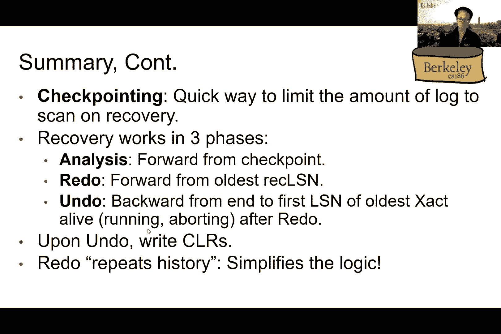

# 课程19：数据库设计之实体关系模型 🗺️

在本节课中，我们将学习数据库设计中的一个重要概念——实体关系模型。这是一种用于描述现实世界中数据及其关系的图形化工具，能帮助我们更直观地设计数据库结构。

---

## 概述：从恢复机制到数据库设计

上一节我们介绍了ARIES恢复协议中的模糊检查点概念。本节中，我们来看看数据库设计的起点——实体关系模型。

---

## 数据库设计工作流

设计一个数据库通常遵循一系列步骤。以下是典型的工作流程：

1.  **需求分析**：确定用户需要什么，数据库需要捕获现实世界中的哪些方面和信息。
2.  **概念设计**：将需求转换为实体关系图。
3.  **逻辑设计**：将ER图转换为关系模型中的一系列表。
4.  **模式细化**：通过规范化等技术改进关系模式，减少冗余。
5.  **物理设计**：决定数据在磁盘上的存储方式，例如使用何种索引。
6.  **安全设计**：定义谁可以访问数据以及可以进行何种操作。

---

## 数据模型与数据独立性

在深入ER模型之前，我们需要理解数据模型的概念。数据模型是描述数据的一组概念。

我们熟悉的关系数据模型，其主要概念是**关系**，即具有行和列的表。一个数据库系统通常包含多个层次：

*   **视图模式**：用户或应用程序看到的虚拟表。
*   **概念模式**：数据库中的全局逻辑结构，即关系集合。
*   **物理模式**：数据的实际存储方式，如文件和索引。

数据库系统提供了强大的**数据独立性**概念：

*   **逻辑数据独立性**：概念模式的改变不会影响视图模式。例如，将一个关系拆分为两个，只需重新定义视图查询，应用程序无需修改。
*   **物理数据独立性**：物理存储方式的改变不会影响概念模式。例如，添加索引不会改变表的结构。

这些特性使得数据库和应用程序能够长期演进，而互不影响。

---

## 实体关系模型基础

实体关系模型比关系模型更接近人类的思维方式，虽然不直接在数据库中实现，但更容易用于初始设计。

### 实体与实体集

*   **实体**：现实世界中的一个可区分的对象。
*   **实体集**：具有相同属性的相似实体的集合，用**矩形**表示。
*   **属性**：描述实体的特性，用**椭圆形**表示。
*   **主键**：能够唯一标识实体集中每个实体的属性（组合），用**下划线**标出。

例如，一个“雇员”实体集可能包含属性：`ssn`（主键）、`name`、`lot`。

### 关系与关系集

*   **关系**：两个或多个实体之间的关联。
*   **关系集**：相似关系的集合，用**菱形**表示。
*   **角色**：当同一实体集多次参与一个关系集时，为每次参与赋予的名称。
*   **关系的属性**：关系本身也可以拥有属性。

例如，“工作”关系集连接“雇员”和“部门”实体集，并可以拥有“开始日期”这个属性。

---

## 约束：丰富ER图的语义

我们可以为关系添加约束，以捕获更多现实世界的规则。

### 映射基数约束

用**箭头**表示“至多一个”的约束，定义了多对一或一对多的关系。

*   从“部门”指向“经理”关系的箭头表示：每个部门至多有一名经理（多对一）。
*   没有箭头则表示“多对多”关系。

### 参与约束

用**加粗线**或**双线**表示“至少一个”的约束，定义了完全参与。

*   在“雇员”和“工作”之间的加粗线表示：每个雇员必须至少在一个部门工作。
*   **箭头 + 加粗线** 组合表示“恰好一个”的约束。

---

## 弱实体集

有些实体不能单独通过自己的属性来唯一标识，必须依赖于另一个“所有者”实体。这称为弱实体集。

*   用**加粗矩形**表示弱实体集。
*   用**加粗菱形**表示其与所有者实体集的**支持关系**。
*   弱实体集通常有一个**部分键**（用虚线下划线标出），它与所有者实体集的主键结合，形成完整的主键。

例如，“家属”是一个弱实体集，它依赖于“雇员”实体集。一个家属由`pname`（部分键）和其所属雇员的`ssn`共同唯一标识。

---

## 将多元关系转换为二元关系

ER图支持多元关系，但有些工具只允许二元关系。我们可以通过创建**弱实体集**来将多元关系转换为多个二元关系。

例如，一个“购买”关系连接“产品”、“商店”、“人员”三个实体。我们可以创建一个“购买记录”弱实体集，然后分别建立它到产品、商店、人员的三个二元关系。“购买记录”的主键由这三个关联实体集的主键组合而成。

---

## 类层次结构

ER模型支持类似面向对象中的继承概念，称为**特化/泛化**。

*   **超类**：更一般的实体集。
*   **子类**：更特殊的实体集，用**三角形**指向超类。
*   子类**继承**超类的所有属性，并可以拥有自己额外的属性。
*   一个实体可以同时属于多个子类。

例如，“产品”是超类，“软件产品”和“教育产品”是其子类。软件产品拥有额外的“平台”属性，教育产品拥有额外的“适龄群体”属性。一个实体可以既是软件产品又是教育产品。

---

## 总结

本节课我们一起学习了数据库设计的核心工具——实体关系模型。我们了解了如何用实体、属性和关系来描述现实世界的数据结构，并通过映射基数约束、参与约束、弱实体集和类层次结构来丰富模型的语义。ER模型作为概念设计的利器，为我们下一步将设计转化为具体的关系模式打下了坚实的基础。