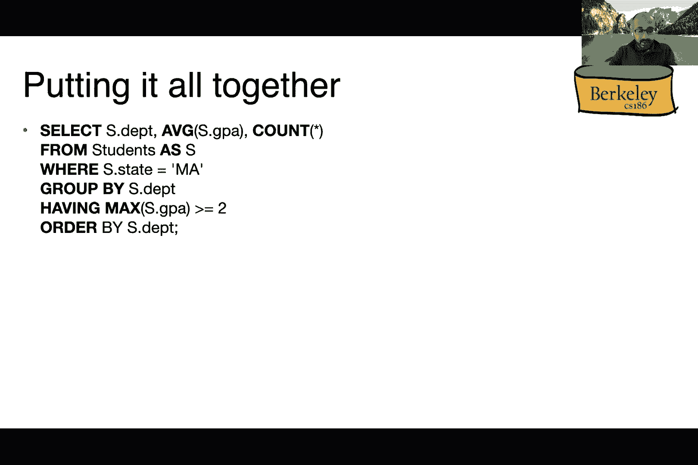

# P2：Lecture 2 SQL I (cont) + SQL II - ___main___ - BV1cL411t7Fz

杰瑞，你能喜欢本地吗，是的，所以它要去，好的，好的，所有的权利，你好，欢迎大家回到86年的第二节课，希望你们周末愉快，所以今天我只想结束我们之前关于关系模型的讨论，也可以使用SQL。我们现在有一点技术上的困难，呃，不知何故，有人禁用了聊天，呃，所以它可能是以前的一节课，所以我想现在，请在广场上发布问题，然后我们会试着看看，好的，所以呃，首先，我有一点激动人心的声明，所以你可能知道。办公时间及部门已于本周开始，所以请查看课程网站，有一个日历，你可以看到不同的时间，呃，我们有，这是基于我们之前对时区的调查，你们现在正在背诵的地方，然后呃，零项目，这就是设置。还有第一个维生素和学期前测验都在这周到期，所以希望你们中的许多人已经准备好了，第一个项目是真正的技术工作也已经发布，我相信你们有两周的时间，所以请务必查看课程日历了解细节，好的重复一下上次的规则。

请随时打开视频，如果你觉得舒服，至少对我们来说，讲师，很高兴看到你们的反馈，在那种事情的面部表情方面，我们也喜欢喜欢，你知道看到你漂亮的脸，所以如果你觉得舒服，请尝试打开你的视频，如果你想问一个问题。请随意举起你的手或在这次的非聊天窗口中键入，但就像你现在知道的那样，我想我只是说ASA只是这个讲座，我们会尽快解决这个技术难题，但除此之外，请自便，以防万一，如果你打开你的视频，只要确保你。你只是在做一些你觉得舒服的事情，如果你在教室里，好的，所以回到技术上，我们上周第一节课所讲的材料，所以我们谈论的第一件事是一堆关系术语，或者定义一个关系是正确的，所以如果你还记得关系有所有这些不同。所有这些不同的性质，我在这节课里就不重复了，还有很多限制，所以说，比如说，模式，它必须为关系中的所有道路固定，诸如此类，我们上次看了一堆例子，有趣的是，这里有一个叫做物理数据独立性的属性，对呀，也就是。

我们并不真正关心实际数据是如何存储在磁盘上的，只要我们公开这个关系接口，把它看作是一种抽象，就像你们在61年学到的一样，那我们都很好，所以我们也开始谈论SQL语言，就像第一节课中的第一节课一样。我们讨论了语言的两个不同片段，有一个定义部分，我们用来定义和修改模式，并将元组插入表中，还有一种操作语言，我们将在这节课中广泛讨论，和任何好的，旧DVD。应该有一种非常有效的方法来评估所有这些不同的查询，对呀，所以这基本上就是不同的实现在效率方面的差异，所以我们试图玩弄这个示例数据库，我试图用它来说明SQL的不同片段，所以在这里我们有水手，我们有船。我们也有预订，谈论哪个水手预订了，哪一天哪艘船，我们上节课讨论的第一件事，定义关系的概念，使用此创建表构造，它是SQL中数据定义语言的一部分，这个方面也叫钥匙，那个，正如你所记得的。

基本上是唯一的标识符，标识表中的每个元组，所以在这种情况下，我们调用，我们有，我们以ID列的身份调用，作为这里的关键，所以我们基本上说所有这些相同的想法都是独特的，有了这个数字，你应该可以查找整行本身。所以这些被称为主键，关系中的每个表只能有一个主键，然后你必须记住的是，就像你知道的那样，有这个，没有要求密钥可以正好由一列组成，所以说，例如，我们实际上可以有一个多列密钥，只要。所有这些列的组合形成一个唯一的标识符，对于关系中的每个元组，那么它实际上符合密钥的定义，然后我们上次也看了一堆例子，所以这里我们使用create table语句来定义更多的表，嗯。所以你可以在这里看到切片一刷新，我们有一张水手桌，我们有书桌，我们还有预订表，嗯，我猜你，那就躺在这里，好的，给你，所以您可以看到我们在，呃，在屏幕上这里，对呀，所以我们有三个表。

注意我们定义的所有这些不同的键，这是第一个说明如何，您实际上可以使用不同属性的组合来定义主键，在这种情况下，这是有道理的，因为基本上这个，这里的表格是指这里的预订表，显示在屏幕底部。我们基本上想确保结合水手ID，空白和它们形成唯一标识符的特定日期，所以我很快就去了，呃，如果我启用了聊天，但我想我们都必须退出并重新登录，所以问题是我们是否想这么做，不管怎样我都很好。我可以继续保持现状，或者在你的部分之后切换，可能这是另一个选择，是啊，是啊，那只是暂时的，如果这成为一个问题，然后我们就可以切换，因为我们也需要，好的，所以回到这个例子，现在我们看到了一个桌子的例子。在定义密钥时，我们有属性的组合，所以这一切都很好，但让我们问一个问题，所以说，我们如何确保，水手实际上对应于这里相应表格中的实际标识符，就在水手桌和船桌上，所以现在，我们唯一的限制是。

就像这三个属性的结合，在预订表中形成唯一标识符，但实际上什么也没说，呃，据说，ID和低ID，你在这里看到的实际上需要与实际表格中的任何真实内容相对应，那么我们如何才能很好地执行这个特定的约束呢。所以你这样做的方式，在续集中，基本上定义了引用另一个表的外键的概念，所以这里我们说你在这里看到的这个ID列，在最佳预订表中是指水手表，呃，我们以前定义过的，而且它也是，呃，指的是呃。键列或我们前面在标量表中定义的列，特别是希德，这基本上是说，呃，我们在储备表中提到的任何稳定的ID，必须使用我们以前有的有效水手标识符，我们以前在为水手创建表语句中定义的，同样，我们也可以定义相同的。呃，Books表的外键约束权，我们想在哪里强制执行，我们在储备表中实际使用的书，指前面定义的实际船只，或在图书表本身的前面插入，所以再一次，这是外键的概念，你注意到我们用这个。

一个名为References的关键字，它基本上引用回我们引用的表，在这种情况下，呃，这些钥匙到底是从哪里来的，这有意义吗，我有个问题，是呀，我想是的，所以说，呃，如果你有，嗯，储备表中没有的东西。如果你有储备表中的ID，那不在A水手的桌子上，那就不允许了，它会给你一个错误，这是正确的，所以如果你试图插入一些实际上不像，你知道吗，尊重这些限制，您立即得到一个错误，好的，明白了，谢谢。所以在这里我们有它的权利，就像现在我们定义了这三个表，呃，你知道储备表的一个主键，然后这两个外键约束，它引用了我们以前定义的两个表，所以我也想知道的是，嗯那个，我们在这个表中定义的外键，实际上不必与。呃，就像我们在这里提到的表格一样，比如我们可以把它改成，或者像你知道的水手身份证，或者类似的东西，那就没问题了，但是当然我们也需要改变相应的定义表，呃，声明就在这里，就像你真的谈论那个特定的专栏。

那只是有点，指定音符边的边的，所以问，有点谢谢，呃，那么这是否意味着当你提到水手时，它引用了水手表的主键，比如它是怎么算出来的，它引用的是哪列，这是正确的，所以它正好指的是A主键，在水手表中前面定义的。所以如果水手表实际上没有钥匙或者它没有定义，它也会产生一个错误，呃，谢谢你的后续问题，呃，如果您引用的表有多个主键怎么办，啊，好的，那是那是伟大的权利，所以这就是为什么，就目前而言，就像你知道的。请记住，每个表只能有一个主键，所以那不会，那不允许你那样做，所以实际上尝试定义多个主键，你也会看到发生了什么，我只是问那个问题，如果有一秒钟，比如你能引用另一个表中的列吗，那好像不是主键，还是怎么主键。是啊，是啊，它必须是主键，因为就像你知道的，否则它不知道你实际上指的是哪一栏，只是因为我们实际上不必叫它同样的名字，好的，如果有多列组成主键，我可以我只能参考像，我不能引用一个专栏，我引用整个主键。

就像没有一样，你可以引用多个东西对吧，例如，在这里你实际上可以说，我逗号别的东西，逗号其他的东西，比如我们就在这里，哦好吧，我明白了我明白了，所以我只需要参考其中一个专栏，那么在数据库中。它是否与数据库中的下列有相同的名称，所以我的理解是，如果你不叫它同样的名字，它基本上会按照顺序，在基表的主键中定义的，所以我明白了，好的，哦耶，你刚才提到的罗曼，等等对不起，你们能不能，听到这个请举手。这些都是很好的问题，我想确保我们按顺序进行，这样就像，你知道，我们没有重叠，你知道，这是一个怎么做的，回来了，对不起，你要分手了，你能重复一下你的问题吗？或者你暂时关掉你的视频，对不起，i。在最后一张表中，对不起，我还是听不清你说什么，你介意把你的问题打在广场上吗？当然好的，很抱歉，嗯，Felix，所以我不得不质疑，就像，限制是这只适用于喜欢，当你试图在储备中插入一些东西时。

这个限制主要是关于值的插入吗，还是像，你以前试图限制它，就像他们进来一样，好的，这是个好问题，所以它实际上不仅适用于，呃，插入这样，例如，当您试图删除某些内容时，嗯，它也会让你很好，我想在这种情况下。删除并不重要，但更新也很重要，所以如果你试图更新储备表，假设我想把这里的这个值更改为喜欢，那是十分什么的，对呀，嗯，所以它实际上不允许你这么做，因为实际上十个并不是，呃出现在水手的录像带上了吗，谢谢。也会是一个问题，任何其他问题，这些都是很好的问题，顺便说一句，让他们继续前进，好的，还有两个问题内特，如果你删除喜欢会发生什么，假设你添加了一个参考储备的水手，然后删除水手的条目，嗯。它只检查数据库条目吗，还是会保持一致性，好的，这是个很好的问题，所以这里的问题是，如果我们说，你知道吗，就在水手桌的第一排，但我们还有这个像水手一样的，抱歉，水手一号的预定权。

所以会发生什么实际上这一切都取决于表本身是如何定义的，所以他们有不同的方法来处理这个问题，所以续集实际上给了你灵活性，就应该发生什么而言，它可以，呃，试着忽略它，然后让你保持这种状态。就像你现在有一些东西，不尊重所有外键限制，它还允许您定义以定义表，这样它就会做所谓的级联删除，所以它基本上会追溯所有其他有外键引用的表，并尝试删除相应的元组，所以你已经可以看到他们为什么要给这个灵活性。因为做这个追踪肯定需要，你知道的，有些人其实很好，就像，你知道的，呃，有东西在晃来晃去，因为他们可能会在事后自己清理文件，所以他们不需要使用这种级联功能，所以这就是为什么续集实际上给了你一个。当您试图定义表时，作为一个选项，好的，我想这是另一个问题，嗯，但我想那个人没有举手，所以刘易斯，或者比利，哦对不起，刘易斯，是啊，去吧，哦耶，没有比利，可以继续，对不起，我忘了我的问题，好的，比利。

嗯好吧，所以我嗯，到目前为止我有点迷路了，我B和一天喜欢，它们又是如何完全匹配的，在预备队表中的比赛，所以在最下面的桌子上，嗯在最下面的桌子上，就像，怎么样，我们怎么知道一个和一个或两个匹配。嗯和9月12日，还是开始表，但这只是这只是表中的两个条目，对呀，那么这是什么样的，如果你问关于主键的问题，我是说如果这是个问题，那么所有这些都表明，这三个属性的结合，右必须在整个表上是唯一的。在这种情况下是对的，因为一零二就像你知道的，九月十二日，就像它实际上是独一无二的，因为你知道我们这里只有两个元组，同样，这是第二行，所以我们在这里定义的是主键，只是说像，你知道的，呃。这三个值的组合必须跨越整个表，就是这样，好的，我只是不明白，就像，我想主要的困惑是我没有看到那天嗯，在前面的两个表中，所以我不知道它是如何映射到桌子的，所以在这种情况下，我们定义主键。

其实和其他桌子没有关系，所有这些都表明，对于这张特定的桌子，我们对储备表感到担忧，这三个值必须在整个表中形成唯一的标识符，它没有说任何关于像其他桌子，或者这就是这张桌子要做的，其他桌子的空气，例如。如果我试着在这里插入另一个元组，它说像这样，对呀，那么基本上就是一个错误，因为我们已经有了表中的第一个元组，所以这就是我要说的，所以它没有说什么，这是指外面的桌子，所以它唯一说的地方，呃，这怎么，呃与。另一个表在这两个外键中，呃，我们添加到定义末尾的子句，这基本上是储备表之间的联系，以及我们定义的前面的表，你注意到在这种情况下，我们不是在谈论，他们是对的，在这两个呃，引用权。我们只是说id列必须来自逾越节餐桌，然后B列必须是一个东西来了必须是一样的，一定是从乡亲们的桌子上传来的，但它没有提到日期，好的，所以我们任意添加的那一天，是啊，是啊，你可以任意添加，只要喜欢。

它没有复制这三件事的任何其他现有组合，对呀，这就像我刚才说的，所以如果你不明白这个概念，回到右上角的基础桌，所以说，例如，在水手的桌子上，我们不能再增加一个与已经定义的相同的水手，对呀。所以我不能添加另一个ID为1、2或3的水手，乡亲们的桌子也是如此，我明白了，这就是我们在这里要说的，对呀，所以就像你不能，你就是不能再加一个，嗯，呃，不能为for键添加具有相同值的另一个元组，呃。实际上引用实际上是后来出现的外键，是啊，是啊，所以这基本上是两个不同的概念，有道理，是的，谢谢。哦，好的，所以让我继续，实际上用材料，如果有更多的问题，随便在广场上发帖什么的，你知道吗，之后就出去玩。我们很乐意回答，好的很好，所以现在让我们开始编写查询，对呀，所以我们一直在定义所有这些表，那么我们如何从这些桌子中检索东西，这是我们在这个类中编写的第一个查询，所以我们想找到所有两岁七岁的水手。

所以你写的方式，这是先说，我想归还一切，所有的属性或所有的列，对了，这就是这里的星星的意思，别问我为什么要这样用星星，那只是个惯例，对呀，我想他们可以用你知道的砰的一声。或者像你知道的哈希或其他任何东西，但他们决定用星星，我们试图从水手表中检索值，所以接下来发生的事情是这样的，呃，从课堂上，就在这里，对呀，所以我们从水手的桌子上说，我们正在创造所谓的。以及所谓的别名或其他，调用此表的另一种方式，作为，所以我们只是缩写一下，我们为什么要插入这个缩写，因为我们想参考它，之后我们想说我们只想找回RO，年龄等于2岁7岁，就这样，重复一遍，在本例中。我们试图从staters表检索，所有的水手都有两个七岁的年龄，对呀，所以我们叫它，我们从这里的from从句开始，如果你想用自然语言的方式阅读，可以这么说，所以我们从水手桌中挑选，我们称之为将来参考。

我们在Where类中提到它，我们想说的地方，He’他的年龄必须等于二十七岁，然后我们返回来自嗯的所有属性，在这里的查询中，所以在，呃所以，如果我们，如果您实际运行此查询并续集，就像你真正看到的。在这种情况下，第三排和第三排被退回到这里，这是我们的第一个查询，所以让我们假设如果我们真的不想所有的东西都回来，我们只想回来，让我们说，就像你知道名字一样，我们怎么做，所以你这样做的方式。就是基本上把恒星，转换为要返回的实际属性或属性，所以在这种情况下，我们就说点的名字，然后有一个或像一个评级或什么的权利，就把第一行，所以你去那里，这是我们的第一个查询，所以我们实际上可以写更多的查询。但让我们先谈谈一般的形式，对呀，这里的一般形式，基本上说我想选择一个列名或属性名的列表，然后我们想说你知道我们在哪一桌，呃，选择to的值，然后我们也可以选择包括任何，呃。

我们希望从表中应用的任何谓词或任何筛选，所以这是一般的形式，所以在这个非常简单的版本中，我们刚刚从上一张幻灯片中学到了，我们只是要产生桌子上的所有元组，我们放在前班的桌子，我们所说的任何谓词。然后我们将输出，和任何已经放在，呃，在选择时钟中，呃，就任何一颗星而言，这意味着像所有的元组，返回的所有属性，或列的子集，如果你真的把名单，在第一个选择子句中，因此，您实际上也可以不仅返回列名。您还可以返回一堆算术表达式，我们以后在课堂上也会看到，所以这里有一个可选的不同，嗯，我们还没有描述，这到底意味着什么，这基本上意味着我们可以，嗯嗯，我们只希望从表中返回唯一的值，所以在这种情况下，例如。假设我们有一张学生桌，然后我们拥有，我们想从计算机科学系返回这个名字和它的平均绩点，注意到在这种情况下因为我们放了东西，我们实际上要删除输出前的所有重复行，这意味着我们将遍历学生表中的所有元组。

我们要去，呃，所以只有那些属于计算机科学系的，然后我们会返回这些学生的所有名字和GPS，但只有在我们删除了任何重复的角色之后，万一有什么，所以在这种情况下也要注意，就像你知道的那样，就像我之前说的对吧。我们把这个当成化名，它基本上允许我们在in the where子句中作为速记来写，它还允许我们在选择子句中作为速记来写，到目前为止还有什么问题吗？是的，再次，是呀，所以当我们说明显的时候。这只适用于名字吗，GPA将适用于整个角色，它适用于你放在这里的任何东西，作为，呃，作为列表达式列表，所以如果我们基本上是说，请只返回所有唯一的学生姓名和GPAS对，所以如果我们有两个同名同姓的人。那么他们中只有一个会回来，你以为你，哦，卡洛斯，嗨，我看到我们在顶端，当我们说，当我们选择，我们已经使用了我们给这个表的别名，但我的问题是，在我们给出别名之前，我们能引用别名吗，比如说，来自学生。

在您引用表之后，但是你如何引用磁带，所以我们指的是引用表，在你真正定义外星人之前，所以在第一行和第一行，选择这个东西作为s点名称，作为GPA，我们表示桌子是对的，那是我们做这件事的化名。但在我们已经使用了外星人之后我们继续给它外星人，所以我的问题是，嗯是的，那打破了什么吗，还是这只是惯例，所以呃，我们将讨论如何评估SQL查询，但就目前而言，就像你知道的，考虑前期成本是首先要评估的事情。所以说，因此续集的第一件事，Lite或数据库将看到，这里实际上有一个从句，我把箭头，所以说，因此，首先要做的是基本上定义为外星人，所以你真的做不到，你得找到它，好的，我明白了，即使在后面的代码中。编译代码时，续集精简从第一次阅读，是呀，这是个很好的问题，这又回到了重点，那个续集实际上是上次提到的一种陈述性语言，所以在这里我们看到了它，所以我们只是在描述我们想要的。

我们实际上并不是在说我们想怎么做，呃，正确检索元组，所以这就是为什么过程的顺序并不重要，但你后来会发现当谈到性能时，这确实很重要，如此如此，但现在基本上意识到这不是命令式语言，所以我们不是从上到下跑。在这种情况下，续集实际上有一个非常时髦的语义，你知道吗，实际上，在其他任何东西得到它之前，先计算from子句，谢谢。极好的问题，是呀，好的，项链嗨，那么发生了什么，如果不为表定义别名。你是说名字还是学分，当你提到这些元素时，好的，也是个好问题，就像你知道的，简单的，简单的答案是，如果您不定义别名，然后你总是可以写出表的全名，例如，在这种情况下，您可以写学生系或学生姓名，学生平均绩点。那很好，然后一些实现实际上会让你走，呃，逃脱惩罚，甚至没有提到，所以在这种情况下，因为只有一张桌子，哪个部门很清楚，我们指的是哪个名字哪个GPA，所以你可以把这些都放在一起，对这个案子来说也没问题。

在这种情况下，但在实际使用多个表的情况下，我们将在今天晚些时候的课堂上看到，嗯，你，然后如果它们都有相同的属性，然后就像，你知道，呃，那个呃，DBMS实际上会抱怨，因为它不知道你指的是哪个餐桌部。在您引用两个表的情况下，两个表实际上都有部门属性，好的，所以呃，卡洛斯，然后杰克，然后让我们继续前进，卡洛斯，哦对不起，对不起，我没有前一个问题的问题，好的，酷杰克，哦，你说这东西进来就像。它是删除了一个重复的角色，就像受骗者一样，你说的重复是什么意思？就像，喜欢的名字和GPA必须完全相同，或者像如果名字，如果喜欢如果喜欢，就像，嗯，让我们说像两个名字，但就像不同的GPAS，就像。我也会删除其中一行吗，还是会像，我想我的问题是，他们两个必须完全相等，或者如果其中一个相等，就像你还是会把它放进去一样，是啊，是啊，所以有时这实际上是实现细节，当你在续集上运行它时，我会检查它。

或者像我的续集什么的，所以问题是这个东西是否真的适用于这两个值，或者就像你知道这里的第一个属性，对呀，呃的点名，是啊，是啊，所以我真的要问，就像，你知道的，呃A或者助教，你们知道我们使用的实现吗。它实际上适用于他们两个还是只适用于他们中的一个，就像现在，如果有两个人叫杰克，然后喜欢喜欢，它仍然应该像一个，如果有两个不同的人有两个不同的GPS就像他们的名字一样，即使他们的名字在说。GPS需要在正确的地方，加了进去，所以我在这里最好的理解是，我又一次，我不能代表我们正在使用的数据库系统回答，它适用于整个属性列表，就像前面提到的阿尔文，所以如果你想说名字和不同的平均绩点。您可以稍后指定，但如果你一开始说明显，它再次应用于整个属性列表，它有可能是特定于实现的，如果你能在广场上发帖，我们可以得到它，谢谢。是啊，是啊，伟大，好的，安东，然后我们真的需要进入下一件事，是啊。

是啊，是啊，是啊，我想知道是否真的没有副本，嗯，在使用明显的性能损失是不是很大啊，好的，这也是一个很棒的问题，所以我的意思是，你觉得怎么样，嗯，我会说是的，是啊，是啊，所以答案是真的，对。因为就像你知道的，如果你放一个明显的，那么它基本上就会正确地运行排序，为了吓坏重复的权利，我是说，从61年开始思考，p，我是说，你怎么会，我们如何检测重复，我的意思是你跑排序，然后基本上检测连续的行。看看它们是不是真的是一回事，所以只要你放下这东西，它基本上会招致一些性能惩罚，不管有没有重复，是啊，是啊，这是个好问题，所以你把这个叫做你知道的，按语言设计权，所以说。它基本上与你打字所需的工作量成正比，对呀，就像你知道的，你要输入的东西就越多，击键越多，所以现在你基本上可以考虑一下，就像你知道的，现在这可能会产生额外的成本，对吧，只是因为你有更多的东西，很酷好的。

所以让我们继续前进，所以除了这个化名的东西，我们也可以点菜，例如，在这个例子中，我们按这三个不同的属性排序，所以我注意到了几件事，首先，我们实际上是按三个不同的属性排序，所以它的工作方式是。我们基本上将通过GPS进行首次订购，然后对于平局，我们将按名字订购，然后是第二个决胜局，我们将按此订购两列，这是什么两件事，你会注意到，我们实际上计算了学生年龄的两倍，在这里的桌子上，然后我们称之为二。所以这说明了，事实上，我们不必总是，呃在这里加一个指桌子的，所以在这种情况下，像2实际上没有限定词，对吧，它没有像s点的东西，但首先，它实际上不是来自S表，所以我们不能真的提到那个权利。所以它不是实际上是不可引用的，所以说，因此，我们甚至不能给，第二点，我想在这里说明这一点，在这张幻灯片上基本上是，我们还可以计算算术表达式作为输出的一部分，然后使用别名并将其定义为，也有名字。

但一般来说，按从句排序基本上是按词汇图形排序，这是你必须时刻注意的事情，因为你可能认为它会按数字顺序排序，否，那不是真的，根据定义，它将按词法图形顺序排序，嗯，所有这些你只想按输出中实际引用的东西排序。对呀，因为如果您实际上不输出该列，但你是按它排序的，然后就像你知道的，你可能会困惑于喜欢，你知道为什么，为什么元组以这样的方式显示，这没有错，只是它不会赚更多，这样做才有意义，正如我所说，就像你知道的。你也可以看到我们也在订购圆周率，嗯好吧，奥斯汀问题，是啊，是啊，所以在第二行，上面说学生的是故意排放的，还是一种，所以实际上屁股是可选的，因此，大多数实现会让您通过不实际使用，就像在这种情况下。我只是想给你看这两个选项，呃，是啊，是啊，所以如果是按词典顺序，那你怎么，你会如何对数字进行排序，所以如果你想排序，数字上最简单的方法是像新闻和实现，实际上支持这一点，嗯，否则，就像，你知道的。

您基本上必须编写另一个查询，基本上按此排序，呃，特殊属性，那就更复杂了，就像你现在知道的那样，就像耶，我们不要去那里，但同样的事情也是对的，如果您想通过自定义订购权订购，那么我们到底该怎么做呢。所以这实际上是必需的，编写更多代码，好的，呃，成龙，呃，呃，只是按条款的顺序确认一下，呃，我们需要比较GPA力吗，呃，如果注册会计师与，比较名称，如果名字是一样的，一个中的呃属性，呃，那是真的吗？

对不起，这是一个二一，呃，我是说，按顺序，当然，呃，我们是否按顺序比较属性，呃，呃，比如说，比较TPA，呃，如果他们是一样的，然后我们比较一下这个名字，是啊，是啊，这是正确的，所以这是对的，哦耶，谢谢。是啊，是啊，这是正确的，好的，A的最后一个问题，呃，是啊，是啊，之前的那个问题是当我，哦，好的，酷，好的，很好，所以它实际上提供了更多的，多一点设施，就像你总是用图形来排序词汇一样，例如。我们实际上可以选择我们想要订购的东西的顺序，所以默认情况下实际上是按升序排序，它可以被，基本上是说我们要下降，也可以做一些搭配，对因为，正如我所说，我们基本上是用这个作为一个，作为决胜局。在这里引用多个列的情况下，所以你可以看到我们现在正在混合和匹配，我们基本上是说平均绩点，我们希望它是递减的，姓名，我们想升序，然后默认为二，他们可以做的另一件事是设定一个限制。

比如返回的行数所以这里我们有相同的查询，但我们只说只返回三行，对呀，这是你看到的一般语法，通常，这只与以下命令一起使用，所以你可能会问为什么对，如果你还记得第一节课我们讲的关系。元组的顺序在默认情况下实际上并不重要，这意味着数据库实际上可以以它想要的任何顺序返回元组，除非你真的下了订单，对呀，如果你强加命令，那么dbms必须按照您现在定义的顺序来做，如果定义顺序。现在说我只想要顶部也是有道理的，前三个右，前三个，根据您定义的任何顺序，所以在这种情况下我们是说我们想要订购所有这些东西，这三个不同属性的所有元组，我们只想返回它的前三个值。所以从这张幻灯片中要记住的是，如果你不点菜的话，你仍然可以把极限，这不是不正确的，只是不喜欢做任何正确的事情，因为你基本上是在说，嗯，只要把桌子上的三个元组还给我，有时它很有用，但就像你知道的，呃。

在这种情况下，大部分实际上并不那么有用，嗯，一次又一次，这基本上反映了呃的陈述方面，语言的，我们只说我们想看的，但我们实际上并没有规定如何真正做到这一点，它用来返回前三个值的实际算法是，呃。实现独立依赖，例如，实现可能会选择首先对所有内容进行排序，然后返回前三件事，或者当元组最初插入表时，它可能已经对所有内容进行了排序，如果是这样的话，它实际上不需要做额外的排序，当您试图运行订单时，好的。我想说的另一个特性是聚合的这一方面，抱歉，打扰一下，所以在这种情况下，我想计算平均值，这个计算机系计算机科学专业所有学生的全科医生，所以你写的方式基本上是添加一个特殊的关键字，叫做AG，或者平均值。所以我们基本上把我们想要平均的列，这就是我们想要的，这就是我们想要的，这就是我们如何得到平均BA，在这种情况下，对于那些学生来说，所以这个例子，对于示例，在这里查询，您只得到最后一行输出，呃。

因为它基本上只是计算，呃，计算，呃，平均权利，然后在SQL中还有其他可用的聚合，例如，一些和计数，然后每个实现都有自己的一组不同的，呃不同，呃，聚集体，现在你注意到我把这个明显的爪子放在括号里了吗。意思是它有点，它实际上是可选的，所以现在，让我们试着测试一下我们的理解力，在弄清楚这两个查询是否相同方面，所以底部其实是一样的，唯一不同的是明显和计数的顺序，所以在这里的第一个查询中，在实际计数之前。我们实际上首先在name列上运行了明显的，所以会发生的是，我们实际上会浏览学生表，然后我们首先计算出唯一的学生名字，然后再实际计算他们，与第二个查询相比，你注意到我们实际上是先数数的吗，嗯，在做不同的。那又有什么用呢，所以这将首先计算学生栏中的名字数量，然后试图从中找到唯一的价值，对呀，所以聪明的读者和这些观众可能知道这实际上没有做任何正确的事情，因为在这种情况下，计数只返回一个数字，对了。

这张桌子上的学生人数只有一个计数，所以如果你试图从中找到独特的价值，你只是什么都没做，因为一开始只有一个值，对呀，是呀，这正是这个，这个查询会做什么，所以它并没有做任何真正有趣的事情。但我只想在这个例子中说明，Select子句的顺序实际上很重要，在这种情况下对吧，让我们确保你明白这一部分，好的，所以我想介绍的最后一个特点是，分组，那么在这种情况下，分组做什么，所以说。我们在这里看到这个，对呀，所以在这种情况下，我们试图通过，呃，系学生，所以我们不仅想让计算机科学的学生，我们也想让其他系的同学回来，我也是，所以理解这个群体的方法是。就是把它看作是对表进行分区的一种方法，所以我们要把学生的桌子，我们将根据学生所拥有的系的价值来划分它，然后我们要从这些学生中组成一个小组，然后在形成群体之后，我们该怎么办，是啊，是啊，可能做对了。

我们基本上要计算平均绩点，从那个小组的所有学生那里，很多，我们正在返回部门的名称，嗯，在这种情况下对吧，所以我们要按纵队分组，我们将根据表中的值对其进行分组，然后我们要，你已经可以想象，你已经可以看到。我们将得到正确的元组数，正好对应于我们要在这里的表中形成的组的数量，所以如果这里的学生表中有五个系，我们将看到五个不同的角色作为输出，如果我们有十个，然后我们看到十个不同的角色被输出。所以你在第一节课中记得的是基数的概念，也就是不同的数量，好的，所以呃，问题，刘易斯，我要回到最后一张幻灯片，所以我仍然有点困惑于与上一张幻灯片不同的东西，是啊，是啊，所以在这种情况下，你想看到正确的。所以这里唯一的区别是我们是否在运行不同的第一个，或者我们先计数，两者都在选择子句中，所以是的，第二个只是返回一个基本上正确的，因为你是，是啊，是啊，因为你在数所有的，你基本上计数的点名只是一直返回一个。

因为它是每行一个，因为他们都是一体的，你回来了，呃这个东西一个，但对于第一个，嗯，伯爵内心明显的东西是这样做的，所以不是这样，第二个实际上没有返回一个，对呀，所以请记住，它实际上计算的是。就在这个表中的行的um，所以在这种情况下，我们计算的是，我们正在计算，呃，名称列右，但在这种情况下，就像你知道的，如果我们有十个，我们在一栏里有十个名字，所以如果我们有十个名字在桌子上。那么计数实际上会返回十，它实际上并不重复，哦好吧，是啊，是啊，所以它基本上会返回行数，然后我们只是把它添加到发现中，就像你知道的那样，只返回那个权利的唯一数字，但是好吧，我的意思是计数只返回一个值。第一个也是第一个是正确的，然后在喜欢的方面，所以第一个第一组都是一路，那么第一个做什么第一个，实际上首先，呃，在表中的所有名字上运行这个东西，对呀，所以它首先试图找到表中所有唯一的名称，然后数一数。

所以它实际上会返回工作室中唯一名字的数量，好的，是啊，是啊，好的，所以第一个就像有意的就像无意的用途，第二个呢，呃，只返回行数，是啊，是啊，那么好，这取决于你所说的预期用途是什么。所以我想说第一个可能是你最想做的，实用权利，第二只，事实上，我们在这里添加了这个东西并没有真正做任何事情，好的，谢谢。但你可能真的想数对所有的名字，不管有没有重复，所以如果你真的想跑的话。想运行第二个查询，但您可能实际上想省略污点条款，因为实际上在这里什么都不做，像计数星有什么区别，哦对不起，是啊，是啊，就像，当你数数的时候，你在里面放什么真的很重要吗，计数或做的是计数星基本相同。如果是这样计数星，实际上在这种情况下是一样的，因为两者是一样的，如果你实际上没有叫做空值的东西，我们还没有讨论过，但出于最实际的目的，你不需要担心那个，所以两个都是一样的，只有当有空值时才重要。

我们会在后面的部分讨论这个问题，呃，接下来是，呃，刘易斯，哦，那只是我，哦，好的，对不起，好的，所以出来，所以在下一张幻灯片中，当你谈论组时，我只是我只是想知道外键怎么了，当您对表进行分区时。所以它实际上与外键无关，对呀，所以你可以按任何东西分组，所以如果，如果按列组是外键或键，那你基本上是说，就像你知道的，他们的每一行都形成了一个群体，对呀，因为键列在整个表中应该是唯一的，是呀，就像。所以你不是在创造一个新的，是啊，是啊，所以在这种情况下，每个组只由一行组成，嗯，所以做得不多，呃做得不多，这可能不是你想做的，好的，明白了，谢谢。谢谢，是啊，是啊，所以呃，使用组的查询。是否只允许在选择中具有聚合值，或按列分组的实际，并且只有分组列或聚合值，我们将在下一张幻灯片中看到为什么完美，谢谢，嗨嗯，我只是想知道你是不是想定义一张桌子的不同行，效率有没有明显的变化，如果你啊。

按使用组，和所有的列或不同的，所以这取决于你对什么进行了分组，所以如果你试图在整个，整个所有的属性，他没有理由要管理一个团体，嗯，或者如果您按所有值分组，在表中的所有属性中，那么这和跑步是一样的。因为实际上没有，如果您实际上允许多行，如，例如，如果您实际上没有定义任何键，然后你可以在表中有多个重复的行，所以把它分组实际上会做一些事情，即使您按所有属性分组，这并不意味着同样的事情。如果你只是运行的东西，所有的属性实际上在这种情况下，好的，谢谢。是啊，是啊，好的，所有的权利，新灿的最后一个问题，我只想知道，呃，如果我们可以按多个属性分组，例如，我们按学生部门分组，呃和呃。学生姓名或学生，嗯，因为想到任何其他事情，只是通过多种事情来分组，是啊，是啊，你可以，您实际上可以按多个分组，您只需对跨这些值的每一个唯一值组成多个组，呃那些呃，那些属性，让我用一个例子来说明这一点。

所以这里我们有一个购买表，与产品价格和数量，所以在这种情况下，我们实际上是按产品分组的，那么这意味着什么呢，对呀，所以这基本上意味着我们要组成小组，根据产品的价值，在这种情况下我们有两种产品。百吉饼和香蕉，对呀，所以你已经可以看到我在这里画了一条线，将两组分开，所以我们这里有一组，我们这里还有一组，因此，如果您有多个列和按类分组，然后我们就组成更多的小组，例如，如果您想按产品和数量组成组。就像你知道的我们会为这两个人组成一个小组，叫这两个，呃排在右边，因为它们的产品和数量价值相同，然后我们组成另一个小组，就这一排香蕉，数量五十，第三组是带数量罐的香蕉，这样就形成了三个实际的组，对呀。如果我们按产品和数量有一组，但现在这很简单，然后就像，让我们假设我们只是按产品增长，为什么我说你只能选择，或者像你知道的聚合，嗯，想想我们如何正确地处理这件事，所以在这种情况下，我想退货和最大数量。

对每个组的每个人都是正确的，所以对于第一组的百吉饼，对呀，我们最大的订货量是多少？其他人20对20好的，所以我们有二十个，然后香蕉呢，对呀，所以我们最多五十个，因此，您得到两行作为这里的输出。对第一组我们有20个，第二组是香蕉，我们有五十个，这就对了太好了，所以现在让我写一些疯狂的查询，所以在这种情况下，我有一个疯狂的查询，实际上返回产品，还有数量，即使查询的其余部分实际上在这里没有变化。很好，我是说我们组成了和以前一样的小组，但现在我们实际上要返回多少数量，所以对于百吉饼来说，我是说他们是一样的，因为他们有二十个，所以我们可以退回二十个，然后是香蕉我们选哪一个，我们不返回最大。我们不回来了，我是说我们不能总共还五十个，对，因为那会打破无花果，这些洗过了吗？因此，这实际上是正确的，然后当你运行它的时候，那你就知道猫出来了，所以这就是你需要小心再见的真正原因。

我们只能返回根据它分组或聚合的东西，这是有原因的，因为这个，好的，我想我们不会再这样了，你也可以尝试，呃，未来权利，正确形成的群体，例如，在前面的例子中，我们有两组，百吉饼和香蕉，如果我只想回来又怎样。嗯，百吉饼对，或者我只想退货那些最大数量至少20件左右的产品，所以你做的方式，就是在课堂上加一半，所以你注意到，在这个例子中，它实际上跟随这个群体，它说的是，我们先分组，然后我们将处理具有内部的谓词。所以在这种情况下，我们基本上只返回部门，里面至少有两个学生，所以我们先分组，然后我们会处理拥有，所以这就是为什么你看到这个存在，我们在这里编写这个查询的方式，同样的规则适用于权利。这样您就可以返回除了计算聚合的东西之外的东西，或者像你知道的那样，所以在这种情况下，请注意，该部门按条款来自该组，平均数是一个集合，所以说，所以这个呃，查询是有效的，和喜欢的原因一样，出于同样的原因。

您只能引用在have谓词中使用的那些，作为您在聚合值中引用的那些，或者类似于列本身的组名称，出于完全相同的原因，因为我们已经形成了小组，我们想过滤掉组的值，我们只能通过组名过滤掉。或者像我们以聚合的方式在组的顶部计算的任何东西，但这实际上是一个可选条款，我们不必总是碰巧，如果你不需要归还任何东西，所以这里有一个一般的形式，我是说，所以到目前为止。我们编写的查询的一般形式有一个from类，有一个选择子句，它有一堆这些可选的，我用括号突出显示了，对呀，所以你可以有一个过滤的东西，你可以做一个分组，你可以有一个，基本上呃，组上的筛选器，你可以点菜。还可以限制返回的行数，好的，所以让我们回答一个问题，然后我们进入下一部分，是啊，是啊，呃十个一个，是啊，是啊，所以我想说清楚，你只能做减半，当你已经有了一个组，就像，你不能有一个没有团体的条款。

我想是对的，一些实现实际上会让您这样做，它基本上假设整个表是一个单独的组，所以在这种情况下，它真的没有多大作用，好的，谢谢耶，好的，最后一个问题，然后我们需要继续前进，呃，我的问题是，呃。这是否适用于每一组或整个表格，这是一个明显的，将适用于每组或整个表格，比如说，如果我想得到每一个，呃，年平均成绩，呃，每个部门，但是呃，2。有两个系的学分相当，但职能不同，都能识别出来，呃。我知道这件事绝对适用于最后，嗯，在一切都计算好之后，所以呃，它实际上将应用于小组，好的，太谢谢你了，如果要首先检索所有不同的列，您可以编写一个子查询，也就是我们现在所说的，所以这个东西是，呃。它仍然适用于每一组，现在它只适用于所有已经形成的群体，好的，哦，我拿到了，谢谢。好的，现在让我们切换到。

你们能听到我说话吗，是呀，好的，所有的权利，很酷嗯所以我。

呃，稍等，事情有点打嗝了。

好的，所以我想我应该准备好了。

所以我加了一个，只要给我一秒钟，因为我好像找不到我的老鼠了。

好的，所以嗯，我想澄清一下我之前说过的话，嗯，当嗯，我们在讨论，选择不同的，这也与前面被问到的问题有关，所以说，通常的方式，我会想，不同的是，它被应用于一个列列表。

当它被应用于列列表时，这并不理想，对不起，有时我的iPad打嗝。

好的，所以当它被应用于列列表时，它将删除与该列列表相对应的元组的副本，因此，您只在列列表的开头应用明显的，单独应用于单个列是没有意义的，所以不允许选择A然后选择不同的B，嗯，因此。只有当您有一个列列表并且您，它基本上应用于与列集合相对应的元组，是那个，柱的组合，就像前面提到的阿尔文，选择计数不同A是可以的，因为另一个明显的是应用于一个列列表，在这种情况下，它只是一列。你基本上扔掉了一堆复制品，然后在那之后进行计数，好的，所以这就是，独特的特殊用途，在这种情况下，好吧，所以让我们呃，让我们试着回顾一下，好的，我我想我们有，我们有一个问题，呃，尼基，你想去吗，是啊。是啊，所以我只是想知道你是否适用于单独的一个专栏，那么如何决定其他列的值呢，比如你怎么决定，我只想知道另一列的第一个值，或者我想你做什么，您是否使用聚合函数，就像，也许我只想要最大的，在我所有的这些中。

这东西是有意义的，是啊，是啊，因此，您可能会有一个分组列，对呀，因此，您可以按列或多列进行A组，然后您可以聚合一个特定的列，使用这个不同的，然后您也可以将其他聚合应用于其他列，所以这只是一个集合。在执行聚合之前，就像把这些值压扁一样，这样您就可以删除重复的，这有道理吗，是啊，是啊，好的，谢谢。好的，所以让我们来谈谈，嗯好吧，我想我们有，呃还有一个问题，刘易斯，是啊，是啊，所以嗯。当你提到这件事的时候，您只能将其用于一列，基本上没有，我说你一开始就用，它应用于整个列集合，另一个不同的是指像一个不同的行，嗯，它是，呃，它基本上应用于一组列，然后它，有点压扁了。在单行中的所有列中具有相同值的元组，是啊，是啊，哦好吧，所以当我们数清楚的时候，呃，一些属性，它不是按不同的属性分组的，它按不同的行分组，然后获取属性，不不不，所以把明显看作修饰语，对。

所以这里计数明显A是可以的，因为它应用于元组的集合，只有一个属性，它是一个，好的，所以所以你把它压扁，然后将计数作为聚合应用于它，好吧，所以这是好的，所以我想我真的应该继续前进，是啊，是啊，这是个特例。但我真的需要继续前进，如果这还不清楚，让我们呃，让我们继续在广场，好的，所有的权利，所以嗯，我想谈谈你会如何解释，好的，你会如何解释，阿尔文描述的一组查询，然后试着从那个点开始延伸，好的，所以嗯。所以这是啊，这是阿尔文描述的查询空间，对呀，所以你有一个选择，你有一个从你有，其中一个团体通过拥有，按和限制订购，这就是我们到目前为止所讨论的功能的全部空间，所以给定这样的查询，1。你是怎样理解它的？

你在概念上是怎么想的，这就是这个查询的求值的概念顺序，所以我们现在不用担心订货期和限量，专注于剩下的，所以只需要从I组中选择，我们将讨论如何思考这一点，所以这有点牵扯，所以尽量，呃，和我在一起，呜呜嗯。好的，所以呃，所以第一件事是你看前面的条款，对呀，所以这里是一张单人桌，你基本上是说对于表中的每个元组，所以这是第一个，对于这些元组中的每一个，那么下一步是在哪里，所以您最终删除了所有不满足的元组。列出的谓词，这也常被称为选择条件，第三步是分组步骤，所以你组成小组，然后对每个组执行所有必要的聚合，我们会谈谈，你说的一秒钟内必要的聚合是什么意思，第四步是扔掉所有不满意的组，谓语，使用Have类。这也是我被描述的东西，最后一步是删除此列中找不到的所有列，表达式列表，然后删除所有重复的行，如果应用了不同的关键字，好的，所以这是五个步骤，那么让我们来谈谈这个必要的聚合业务。

那么哪些集料实际上是必要的，所有必要的聚合都是稍后出现的聚合，在概念评价中，所以如果在have子句中作为谓语的一部分提到聚合，比如说，或者它是选择中的列表达式列表的一部分，然后要计算这些聚合。否则您不需要这些聚合，所以基本上，我觉得你应该好好想想，你要在表中遍历这些元组，你在扔掉一堆元组，不满足某些条件的，嗯，然后对于剩下的元组，你把它们压扁了，你们在组团，你在分割，正如阿尔文所说。对于这些群体中的每一个，你计算一些聚合，对于那些，呃，不符合拥有条款的团体，嗯，你把他们赶走，其余组别，它们成为输出的一部分，好的，所以说，在这个评估的概念顺序中，我想强调的一件事是，就是。它实际上是一种思考如何对SQL查询进行推理的方式，这不是查询的实际计算方式，因为这可能是一种非常低效的方法来评估这个查询，这只是思考查询的一种方式，这是对查询进行推理的一种方式，所以这是概念性的。

这不是数据库实际评估的方式，但你有一个保证是，的，数据库用于执行此查询的任何内容都将等价于，评价的概念顺序，所以这里有一个例子，对呀，所以在这种情况下。

嗯，如何阅读好这个查询，我会从。

我得弄清楚为什么，呃我的我的嗯，iPad突然停止同步，好的，所以嗯，所以再次呜呜。

所有的权利，所以我要，我要放弃这个。

来吧，来吧。

再试一次，如果它不起作用，我要放弃所以嗯，好的，把这些都放在一起，那么我将如何阅读这个查询，我将从from从句开始，就像阿尔文提到的，我有个化名，所以我把学生的桌子叫S。然后我对学生表中的每一个元组都是如此，我要开除所有不是马萨诸塞州的学生，好的，所以我在缩小桌子的尺寸，在概念上，至少，扔掉所有与马萨诸塞州不对应的元组，下一步是分组步骤。这就是我需要考虑的地方我未来可能还需要什么，对呀，那么我将来还需要什么，嗯，第一件事是，当然，我在按部门计算组，所以我当然需要这个部门，我就是这样构造分区的，此外，我将看最大的平均绩点。我要看看平均绩点，我要看着伯爵，好的，这是我需要计算的三个总量，对于这些群体中的每一个，所以我会读的方式，这来自学生表中的所有元组，扔掉与马萨诸塞州不对应的元组，然后按部门对剩余的元组进行分组。

并计算每个部门的平均绩点，的数目的计数，每个部门的元组和每个部门的最高学分，那我就把所有的部门都扔掉，其中最大GPA大于或等于2，嗯，所以这些部门做得很糟糕，所以所有的学生都有非常非常低的GPS。然后在那之后我会，只保留这些聚合体，所以保存的集料是所有的，保留的属性是部门名称，平均绩点和计数，最后我会由部门订购，这就是评价的概念顺序，所以再一次，从所有的元组开始，学生们扔掉那些不是马萨诸塞州的。按部门分组，计算这些总量，呃，扔掉不符合标准的组，然后只保留部门平均绩点和计数，然后由部门订购，好的，这就是端到端的概念评估，让我们继续连接，好的，那么当我想跨多个表格提问时会发生什么。这是一个极其强大的，我们需要熟悉的无处不在的功能，好的，所以让我们开始谈论这个，因此，关节评估的概念顺序非常类似于，呃，为了简单起见，我们前面描述的，我不会担心团队有缺陷，就目前而言。

让我们回到好的老选择从哪里和也，我将在限期内不理会这项命令，让我们专注于，从哪里选择，然后试着很好地理解，将其扩展到omba组，并具有，以及自动驾驶和极限都很简单，所以我们暂时不要担心这个，那么。对于联合来说，这种评估的概念顺序是如何改变的，嗯，你最终要做的就是前爪，您列出了一堆表，而不是一个表，和，您正在执行的操作基本上是在找到的元组组合上进行的，在交叉乘积中，这些订书钉的交叉积，好的。所以你可以想象有一种新的关系，或构造的新表，基于前面子句中所有表的叉积，然后你所做的其他一切都是在这个新的关系上，这就是这个叉积关系，好的，对于表的叉积中所有这些元组的组合也是如此。删除不满足where子句的元组组合，然后投射出不需要的列，然后删除重复的，好的，这就是这种情况下的评估顺序，所以考虑这个多表查询的另一种方式，就像对一个新关系的查询，这是前级所有关系的交叉产物，我是说。

这是一个很好的方式来思考发生了什么，但是这是一个非常糟糕的方法来评估这个查询，因为它会喜欢，的大小二次增长，呃，你以乘法的方式列出的表，所以如果第一个表中有n个元组，第二个表中有2个元组，等等。这将是所有这些的乘法，所以这是一个非常糟糕的方法来评估查询，随后有更好的方法，但从概念的角度来看，我们不需要担心这些，让我们想想办法，我们想要表达它，并对这些查询进行推理，不用担心如何评估。因为这是陈述性原则，对呀，声明查询，你想要的方式，某种程度上，你想让答案看起来，不用担心数据库是如何实现的，好的，所以让我们通过一个例子，所以这是，呃，对于连接，是笛卡尔积，对呀，所以你有，呃。这两个关系，假设水手和预备队，是的关系，这是前爪中列出的两个关系，和，所以基本上你最终要做的就是连接每一对元组，嗯跨越这两个关系，对呀，所以你基本上是这样做的，呃，第一个元组和前三个元组。

保留表中的所有三个元组，第二个元组，将这三个元组都放在结果表中，以此类推，对了，这就是你如何得到叉积的计算，所以让我们说我，我试图执行的实际查询，下面是，所以我选择了S点S ID。水手和预备队的名字和ID，其中s点ID是r点ID，好的，那么我如何执行这个查询，在概念上，至少第一步，当然是来自条款的权利，所以我们已经构造了叉积，所以我们就这样结束了，下一步就是把东西扔掉。这不满足电线类，所以这是我在检查，如果s点ID等于r点ID，这个叉积中的所有元组，不满足这个条件的，我要摆脱，例如，在本例中，我去掉了这个元组，因为s点ID和r点ID不一样，另一方面，我确实保存了这个。呃这一排，因为S点ID和R点ID确实是一样的，所以我去掉了一堆行，接下来使用where子句，我需要评估选择子句，是的，选择定律只是说我想保留S的S的ID，S的名字和R点V ID，所以你，精选损失告诉我。

我只希望结果中有这三个属性，所以我基本上去掉了剩下的属性，所以我只保留这三个属性，我已经这样做了，这就是我如何阅读这个查询，在这种情况下，所以这是最终的结果，所以回到过去看看这个查询。我们讨论了如何阅读这个查询，但我们没有谈论这个查询的含义，这个查询实际上在说一些相当强大的东西，这个查询说的是，找到所有预订了船的水手，然后用s i产生输出，董事会的名字和ID，因此。将这两个表的信息组合起来，然后构造一个新的表，对信息进行编码，说，哪些人服务过，哪些船，请注意，您不能通过查看每个表来构造它，你必须单独建造，呃，您必须使用两个表中的信息，所以我们已经讨论了一点化名。在这里我要扩展一下，所以我们讨论了如何，您可以简单地将关系名称引用为别名，嗯，这个别名是，呃，通常称为范围变量，因为你在一个关系中的元组上取值，因此，您可以使用它们的实际名称来引用这些关系。

所以你可以说缩放点什么，储备点缀着一些东西，你可以用它来消除歧义，当两个关系中有两个属性具有相同的名称权时，所以在这种情况下，我是两个关系之间的公共，所以你确实想，呃，在它前面加上它来自的关系名，嗯。你也可以，呃，有点不是，呃，你也可以像前面描述的阿尔文一样，您还可以显式地对声明新的范围变量或关系变量进行排序，使用作为关键字，事实上，即使省略as关键字也可以，这允许您声明新变量来引用这些关系。这可能会更方便一点，因为它表达起来更短，您还可以重命名属性，所以你可以说，S点ID现在被称为水手ID，He’他的名字叫水手的名字，B称为董事会ID，所以你可以在选择类和前面类中重命名东西，好的。所以这里有一个案例，您真的想重命名，在前一种情况下，重新命名很好，但你并不真的需要它，在这种情况下，您确实需要重命名，所以在本例中，我想将预言家表中的信息组合为两种类型，所以我是我是你。

我用水手两次前爪，我想找到一对水手其中一个比另一个年长，我会使用这个查询来完成，所以我基本上会说水手是X水手是Y，所以我有两个变量对应于我的水手表的每个副本，一次又一次，想象这两个副本是串联在一起的。你在构造一个叉积，所以一个副本中的每个元组都是串联的，与另一个副本中的每个元组，那么你在计算x点h大于y点h的条件，然后为这些元组组合中的每一个产生一个输出，所以这是一个被称为自我加入的案例啊。因为你有亲戚，然后你和自己结合在一起，所以它被称为自联接，你绝对需要能力，您可以引用同一关系的多个副本，所以你可以做更多的事情，嗯，也可以使用算术表达式，在select子句和where子句中。这里我用s点h减去5，就像h 1或2乘以s h等于a h 2，这里我在做一个更复杂的表达式，在涉及算术的where子句中，所以它不是简单的检查，如果两个属性相同，它还做得更多，所以我有。

我也可以在电汇条款中做其他类型的操作，这里有一个例子，我在做字符串比较，如果你熟悉正则表达式，这是真的，很像那样，嗯，所以老派的语法是用来表达，呃，呃，字符串比较的正则表达式类型操作如下所示。它使用了like关键字，所以我在这里找，给我找所有呃名字以b开头的水手名字，然后有一堆其他角色，因此下划线指的是任何字符，或者基本上是一个通配符，百分比符号表示任意重复多次，所以这是老派的表达方式。还有一种现代的表达方式，那就是用波浪号，嗯，因为您可能熟悉正则表达式语法，相当于类似物的波浪形，和一个相当于通配符的点，和一颗相当于重复的星，所以嗯，所以我想注意的一件事是，这个新功能中的一些。标准正则表达式语法，可能不受SQLite和SQLite的支持，是您用于项目的内容，因此，您可能需要熟悉这两种类型的语法，所以在这个特殊的情况下，像B这样的水手名字下划线百分比。

在这个关系中只匹配一个元组，也就是Bob元组，好的，所以我想我们有一个问题，四郎，哦耶，我只是想知道，当你比较字符串时，这也是字符数量太多了，所以在这种情况下，我明确地说，我不在乎，绳子有多长。只要它启动B，对呀，所以嗯，但是是的，我是说，这通常是正则表达式中的真实情况，对呀，你想让整个表情，如果你想，但如果你想匹配前缀，然后你会说，好的，使用任意的通配符集合，对所以嗯，所以它是一个。从那个角度看完全吻合，就像在桌子上，说，有一个人可能叫仆人鲍勃，它也会出现，在这种情况下，当然可以，是啊，是啊，完全正确是的，你拿到了，谢谢你，好的，所以呃，Web子句中的更多内容。所以你可以做布尔连接词，允许您添加多个谓词并将它们组合在一起，所以我在这里寻找预订了红船或绿船的水手，所以我加入了马厩和后备桌，这是我要加入的两张桌子，我不能简单地看储备表的原因。

是因为颜色信息存在于板表中，所以这对我来说是一个可爱的，我需要在这两个表之间做一个连接，来构造我回答这个查询所需的所有信息，所以如果我想找到预订红色桌子的水手，红色的船或绿色的船。我会从联合船只和储备开始，然后我会确保我说的是同一条船在两个，呃，呃，两张桌子，所以再想象一次，你先做一个叉积，您要确保，做完叉积之后，您只保留了您谈论相同保留的元组，保留地也有同一条船，所以说。所以r b id必须等于b点id，否则就没有意义了，真的，呃到，想想其他的元组，这些元组是作为交叉积的一部分构造的，所以嗯，然后你检查颜色是匹配红色还是绿色，好的。回答一个相当复杂的问题的相当直截了当的方法，好的，所以让我看看时间，我们快没时间了，所以我想我就到此为止吧，嗯，不考虑不谈关节，嗯，所以我真的很喜欢用Piazza来回答短信问题。

因为它更容易跟踪线程化的问题，不幸的是，这样做的缺点是要么你没有聊天，或者你把谈话分成聊天和广场，但我只是想把我的意见说出来，谢谢卡森，所以我还在犹豫，我想有一个，所以我同意你。我觉得很高兴能有这样的对话，我们一直在谈论的一件事，嗯，在，助教和讲师，呃小组是我们是否想有一个松弛的通道，就像几率，我有这种线程交互模式，但它可能更有现场感，呃感觉比呃更有吸引力，广场。但我确实觉得我的意思是，至少我在监视广场，在广场上回答问题，我觉得没有我在聊天中看到的那么多能量，上一次，我觉得有很多问题，人们仍然倾向于问现场，而不是用广场，我觉得我们可以再快一点，呃。尤其是因为有些问题被重复了，所以我们一定会记住这一点，记住，我想我们意识到的一件事是，因为我们和其他班级共用一个会议室，我们不能依赖设置，在这些班级中保持不变，所以我们需要确保我们去重置它。

到我们喜欢的课程开始前的设置，所以至少那样，嗯啊，我们可以确保我们有聊天功能，如果我们想要，但我想我们肯定可以有广场和松弛或松弛，结合聊天，使这种线程，呃，回答问题，所以这是一个很好的反馈，会反思一下。并找出再次这样做的最佳方法，这是一项正在进行的工作，所以谢谢你的反馈，嗯嗨，嗯，我不确定我们是不是要在，延伸关节，但如果我们是，如果我们为了，如果，比如说，如果我们有三个表的形式从子句。叉积是如何计算的，就像我们说的，就像它左边乘以中间，然后那张桌子乘以右边，是啊，是啊，想象一下这是元组的串联，第一个表中的每个元组，第二个表中的每个元组，第三个表中的每个元组，对呀，这就是你的叉积。是啊，是啊，所以关于叉积，我不确定这会不会像，我们下节课讲新星的时候，但是如果只有一个空值，就像坐在一排，又不是整行都是空的，就像它不存在一样，那会是一个像，还是会没事，就像交叉产品增长一样，没有价值。

我是认真的，我不从交叉积的观点来看，元组右边是什么并不重要，想象一下每一个元组和每一个其他元组结合在一起，与其他元组结合，如果有三张桌子对，所以基本上每一个元组，与相关的每一个元组结合。与与c有关的每一个元组合并，元组包含什么并不重要，元组可以有一个空值多个空值，没关系，所以嗯，我想这是一个正交的问题吧，它真的不影响，影响横杆的结果好吧，所以这更像是那种责任更多地转移到，我们喜欢什么。就像我们选择的，我们是如何聚集在一起的，对是的，所以我认为处理空值仍然是一个非常重要的挑战，我将在下节课讨论这个问题，所以你们中不知道的人完全没问题，我们下节课再讨论，但是是的，这是一个令人担忧的问题。我们会处理的，想办法处理，呃，聚合和选择中的空值问题，谢谢。我想说的另一件事是VR，我觉得，部分原因是今天的问题比上次多了很多我们有点落后了，嗯，所以我认为这个项目可能有必要，最后期限要改变。

我们将再次同步，然后给你回电，嗯，如果我们发现有必要，呃，因为最后期限被推迟了，是啊，是啊，所以说，当我们进行SQL查询时，出于实际目的，为了提高效率，你建议我们不要使用交叉字符串吗，原因，不。我不会的，所以我想我的想法是弄清楚，您想对SQL查询做什么，看看如何，嗯，所以真的我的意思是，你想要的哲学上的正确，你想问问题，这将产生你想要的洞察力，因此，如果您需要询问涉及多个表联接的查询。所以从某种意义上说，这是数据库系统的工作，找出如何最好地执行，事实上，这将是我们的工作，因为我们要报道，如何在后续讲座中实现数据库系统，所以从一个角度来看，从某种意义上说，这不是你的工作。作为查询数据库的人，你应该试着弄清楚你想问什么，然后让数据库找出如何最好地执行它，也就是说，如果你在航站楼，等待数据库系统响应，你肯定不想等很长时间，因为您构造了一个不需要响应的查询，例如，假设你只对。

我不知道两张桌子上的信息，但是你决定把十张桌子放在一起，然后在所有的结果上做一个选择星号，即使您只对两个表中的信息感兴趣，有一种情况，在某种意义上，意图就在你的脑海中，但您在查询中没有正确表达。所以现在数据库必须做艰苦的工作来连接这十个表，产生这个结果，这需要很长时间，所以嗯，所以如果你很清楚你想要什么，那么在某种意义上，现在数据库的工作是有效地执行它，但是把你想要的翻译成一个简洁的查询。这样就能清楚地表达你想要什么，这仍然是每个使用数据库的人的工作，对吧，所以我们要确保，我们没有不必要地添加多个表并将它们连接起来，即使我们不需要那个结果，所以那是，我就是这么想的，好的，谢谢。好的听着。我想我们结束了，嗯再次，感谢参与这个实验，我们星期四见。

