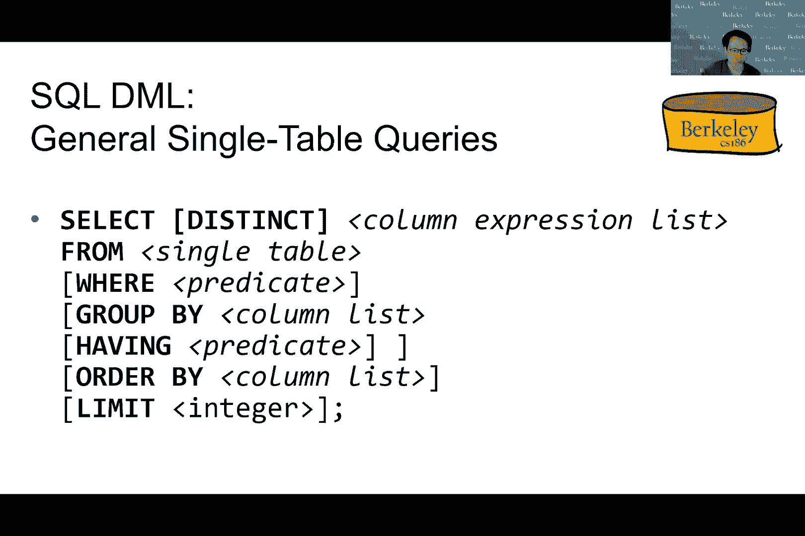
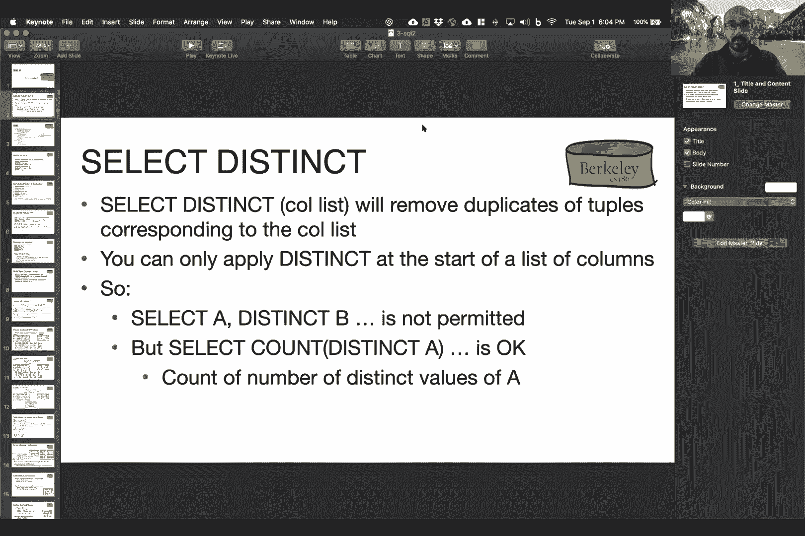
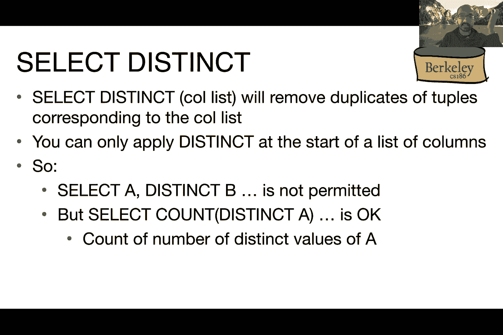
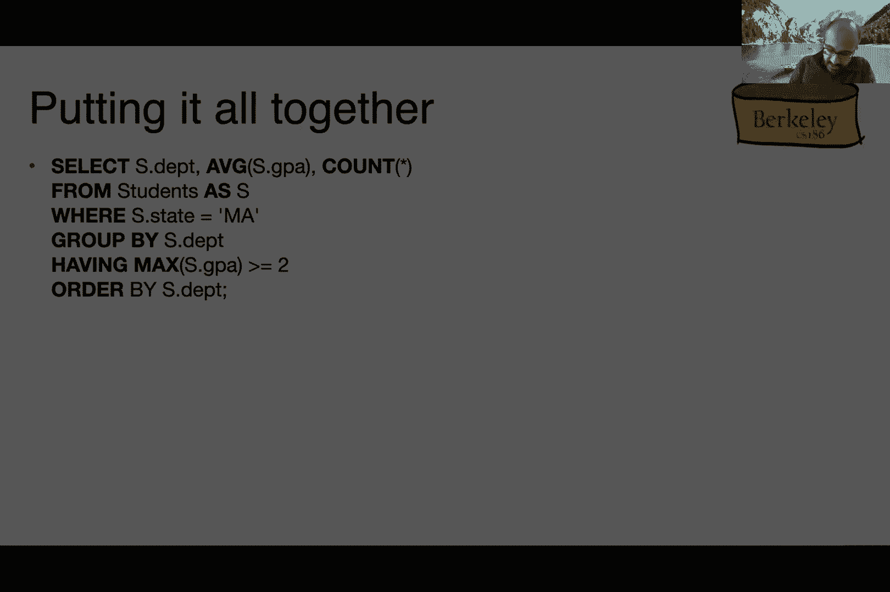
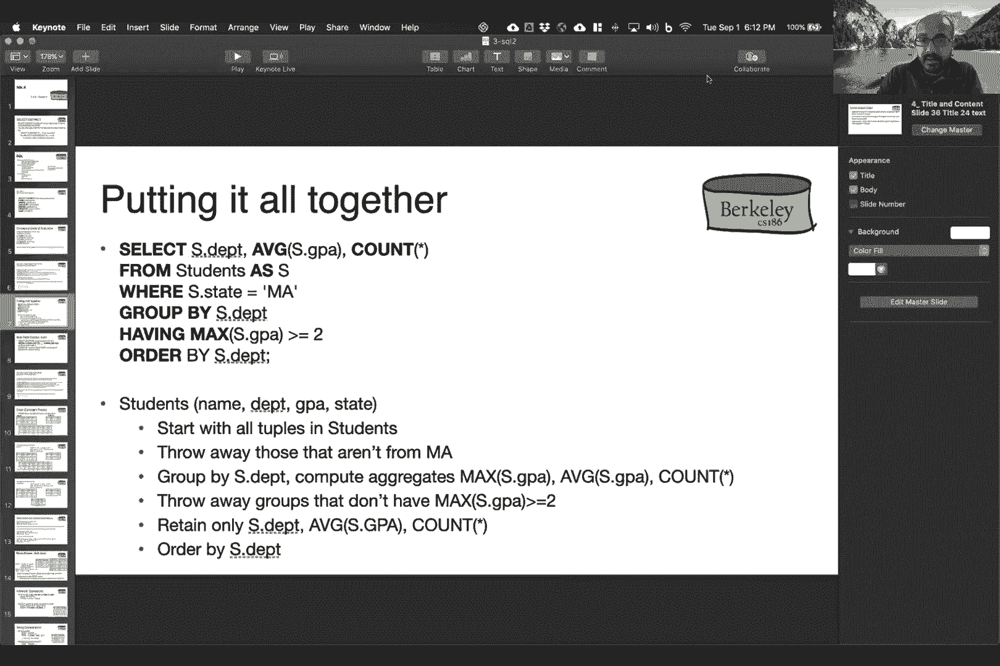
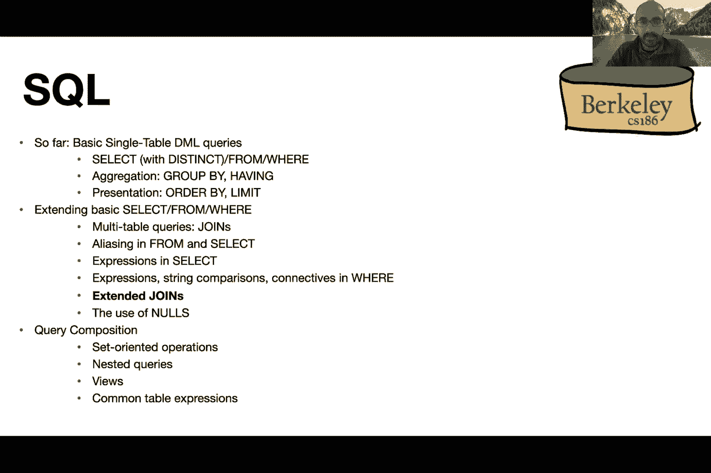

# 课程 P2：SQL I (续) + SQL II 🗃️

在本节课中，我们将继续学习关系模型和SQL语言。我们将深入探讨SQL的数据定义语言（DDL）和数据操作语言（DML），包括如何定义表、键约束，以及如何编写查询来检索和操作数据。课程内容从回顾上节课的概念开始，逐步过渡到更复杂的查询操作，如聚合、分组和连接。

---

## 回顾与声明 📢

上一节我们介绍了关系模型的基本术语和SQL的初步概念。本节中，我们首先进行一些课程相关的声明。

办公时间和助教答疑已于本周开始，请查看课程网站上的日历。零号项目（环境设置）、第一次维生素测验和学前测验都将在本周截止。第一个真正的技术项目也已发布，请务必查看课程日历了解细节。

关于课堂规则，如果你觉得舒适，请随时打开视频。如果你想提问，请举手或在 Piazza 论坛上发帖。

---

## 关系模型与SQL DDL回顾 🔑

我们首先回顾关系模型和SQL的数据定义语言（DDL）。关系具有固定的模式等属性，并且我们拥有物理数据独立性，这意味着我们不关心数据在磁盘上的实际存储方式，只要公开了关系接口这一抽象层即可。

SQL语言包含两个主要部分：用于定义和修改模式的DDL，以及用于操作数据的DML。我们使用示例数据库进行说明，其中包含 `Sailors`（水手）、`Boats`（船只）和 `Reserves`（预订）三个表。

### 定义表与主键

我们使用 `CREATE TABLE` 语句来定义表。主键（Primary Key）是表中唯一标识每个元组的列或列组合。

```sql
CREATE TABLE Sailors (
    sid INTEGER PRIMARY KEY,
    sname VARCHAR(20),
    rating INTEGER,
    age INTEGER
);
```

每个表只能有一个主键。主键可以由多列组成，只要这些列的组合能唯一标识每个元组。

```sql
CREATE TABLE Reserves (
    sid INTEGER,
    bid INTEGER,
    day DATE,
    PRIMARY KEY (sid, bid, day)
);
```

在上面的 `Reserves` 表中，`(sid, bid, day)` 的组合被定义为主键。

### 外键约束

为了确保数据的一致性，例如确保 `Reserves` 表中的 `sid` 确实指向 `Sailors` 表中存在的水手，我们使用外键（Foreign Key）。

```sql
CREATE TABLE Reserves (
    sid INTEGER,
    bid INTEGER,
    day DATE,
    PRIMARY KEY (sid, bid, day),
    FOREIGN KEY (sid) REFERENCES Sailors(sid),
    FOREIGN KEY (bid) REFERENCES Boats(bid)
);
```

`FOREIGN KEY` 约束使用 `REFERENCES` 关键字，它指向被引用表的主键。尝试插入或更新违反外键约束的数据会导致错误。

关于外键的级联操作（如删除时级联删除相关记录）可以在表定义时指定，这为数据一致性管理提供了灵活性。

---

## 编写SQL查询：SELECT基础 🔍

现在，让我们开始编写查询来从表中检索数据。这是SQL数据操作语言（DML）的核心。

### 基本SELECT查询

最基本的查询是选择满足特定条件的所有行。

```sql
SELECT *
FROM Sailors S
WHERE S.age = 27;
```

这个查询返回 `Sailors` 表中所有年龄为27岁的水手的所有信息。`*` 表示返回所有列。`FROM` 子句指定了查询的表，`WHERE` 子句指定了过滤条件。

### 选择特定列

如果我们只想返回特定的列，比如水手的名字和评级，可以这样写：

```sql
SELECT S.sname, S.rating
FROM Sailors S
WHERE S.age = 27;
```

### 使用DISTINCT去除重复

`DISTINCT` 关键字用于去除结果中的重复行。它应用于整个选择列表的列组合。

```sql
SELECT DISTINCT S.sname, S.rating
FROM Sailors S;
```

这个查询返回所有唯一的 `(sname, rating)` 组合。

### 使用ORDER BY排序

我们可以使用 `ORDER BY` 子句对结果进行排序。默认是升序（ASC），也可以指定降序（DESC）。

```sql
SELECT S.sname, S.gpa, S.age*2 AS double_age
FROM Students S
ORDER BY S.gpa DESC, S.sname ASC, double_age;
```

可以按多个列排序，并可以混合升序和降序。注意，`ORDER BY` 可以引用选择列表中定义的别名（如 `double_age`）。

### 使用LIMIT限制返回行数

`LIMIT` 子句用于限制返回的行数，通常与 `ORDER BY` 一起使用以获取“前N个”结果。

```sql
SELECT S.sname, S.gpa
FROM Students S
ORDER BY S.gpa DESC
LIMIT 3;
```

如果不使用 `ORDER BY`，`LIMIT` 只是随机返回指定数量的行，这通常不是想要的行为。

---

## 聚合函数与分组 📊

上一节我们学习了基本的检索和排序。本节中，我们来看看如何使用聚合函数对数据进行汇总，以及如何使用 `GROUP BY` 进行分组计算。

### 聚合函数

SQL提供了诸如 `AVG`（平均值）、`SUM`（求和）、`COUNT`（计数）、`MAX`（最大值）、`MIN`（最小值）等聚合函数。

```sql
SELECT AVG(S.gpa)
FROM Students S
WHERE S.dept = ‘Computer Science’;
```

这个查询计算计算机科学系学生的平均GPA。

### GROUP BY分组

`GROUP BY` 子句用于将表中的行按一列或多列的值分成组，然后对每个组应用聚合函数。

```sql
SELECT S.dept, AVG(S.gpa)
FROM Students S
GROUP BY S.dept;
```

这个查询按系（`dept`）分组，并计算每个系的平均GPA。

### HAVING子句过滤分组

`WHERE` 子句用于过滤行，而 `HAVING` 子句用于过滤分组。`HAVING` 子句中的条件通常涉及聚合值。

```sql
SELECT S.dept, AVG(S.gpa), COUNT(*)
FROM Students S
GROUP BY S.dept
HAVING AVG(S.gpa) > 3.0;
```

这个查询只返回平均GPA大于3.0的系。

**重要规则**：在包含 `GROUP BY` 的查询中，`SELECT` 子句中只能出现分组列或聚合表达式。`HAVING` 子句中只能引用分组列或聚合表达式。

---




## 多表连接（JOIN）🔗





到目前为止，我们的查询都只涉及单个表。然而，现实世界的问题通常需要组合多个表中的信息。这就是连接（JOIN）操作的作用。




### 连接的概念与笛卡尔积

从概念上讲，多表查询首先计算 `FROM` 子句中所有表的笛卡尔积（Cartesian Product），即每个表的每一行都与其它表的每一行进行组合。

```sql
SELECT *
FROM Sailors S, Reserves R;
```

这会产生一个巨大的中间结果，其中包含 `Sailors` 和 `Reserves` 所有可能的行组合。

### 使用WHERE子句进行等值连接

我们几乎从不想要完整的笛卡尔积。通常，我们使用 `WHERE` 子句来指定表之间的连接条件，最常见的是等值连接。

```sql
SELECT S.sid, S.sname, R.bid
FROM Sailors S, Reserves R
WHERE S.sid = R.sid;
```

这个查询找到了所有预订过船只的水手，并返回他们的ID、名字以及预订的船只ID。`WHERE S.sid = R.sid` 确保了只组合相关联的水手和预订记录。






### 使用别名与自连接


当需要将同一个表连接到自己时（自连接），必须使用别名来区分表的两个实例。

```sql
SELECT X.sname, Y.sname
FROM Sailors X, Sailors Y
WHERE X.age > Y.age;
```

这个查询找出所有成对的水手，其中第一个水手比第二个水手年长。

### 连接中的复杂条件

连接条件不限于相等，可以包含算术表达式、字符串比较等。

```sql
-- 算术表达式
SELECT S1.sname, S2.sname
FROM Sailors S1, Sailors S2
WHERE 2 * S1.rating = S2.rating - 1;

-- 字符串匹配 (LIKE 和 正则表达式 ~)
SELECT *
FROM Sailors
WHERE sname LIKE ‘B%’; -- 名字以B开头
SELECT *
FROM Sailors
WHERE sname ~ ‘^B.*’; -- 同上，使用正则表达式
```

### 多表连接与布尔连接词

可以连接两个以上的表，并在 `WHERE` 子句中使用 `AND`、`OR`、`NOT` 等布尔连接词组合多个条件。

```sql
SELECT S.sname
FROM Sailors S, Reserves R, Boats B
WHERE S.sid = R.sid
  AND R.bid = B.bid
  AND (B.color = ‘red’ OR B.color = ‘green’);
```

这个查询找到了所有预订了红色或绿色船只的水手名字。

---

## SQL查询的概念性求值顺序 🧠

理解SQL查询的一种方式是遵循一个概念性的求值顺序。这**不是**数据库实际执行查询的方式（实际方式更高效），但它有助于我们理解和推理查询。

对于一个包含 `SELECT`、`FROM`、`WHERE`、`GROUP BY`、`HAVING`、`ORDER BY`、`LIMIT` 的查询，概念性顺序如下：

1.  **FROM**：计算所有表的笛卡尔积。
2.  **WHERE**：应用 `WHERE` 子句中的条件，过滤掉不满足条件的行。
3.  **GROUP BY**：将剩余的行按分组列的值分成组。
4.  **HAVING**：应用 `HAVING` 子句中的条件，过滤掉不满足条件的分组。
5.  **SELECT**：计算选择列表中的表达式（包括聚合），并只保留指定的列。
6.  **DISTINCT**：如果指定了 `DISTINCT`，则去除重复行。
7.  **ORDER BY**：对结果进行排序。
8.  **LIMIT**：限制返回的行数。

记住，`SELECT` 子句中的别名（如 `double_age`）在 `WHERE` 和 `GROUP BY` 子句中是不可见的，因为它们是在 `SELECT` 阶段才被计算和命名的。但 `ORDER BY` 子句可以引用这些别名。

---

## 总结 🎯

本节课中，我们一起深入学习了SQL的核心操作。

我们首先回顾并巩固了如何使用DDL定义表、主键和外键，以确保数据的完整性和一致性。

接着，我们系统地学习了DML：
*   使用 `SELECT ... FROM ... WHERE` 进行基本的数据检索和过滤。
*   使用 `DISTINCT` 去除重复。
*   使用 `ORDER BY` 和 `LIMIT` 对结果进行排序和限制。
*   使用 `AVG`、`COUNT`、`SUM` 等聚合函数对数据进行汇总。
*   使用 `GROUP BY` 对数据进行分组，并使用 `HAVING` 对分组结果进行过滤。

最后，我们探讨了SQL中最强大的功能之一——多表连接（JOIN）。我们学习了如何通过等值连接、自连接以及包含复杂条件的连接，从多个相关的表中组合信息以回答更复杂的问题。

理解SQL查询的**概念性求值顺序**对于编写和调试复杂查询至关重要。请记住，SQL是一种声明式语言，你只需描述你想要的结果，而由数据库系统来决定最有效的执行方式。



在接下来的课程中，我们将继续探索SQL的更多特性，并开始了解数据库系统是如何在底层实现这些高效操作的。