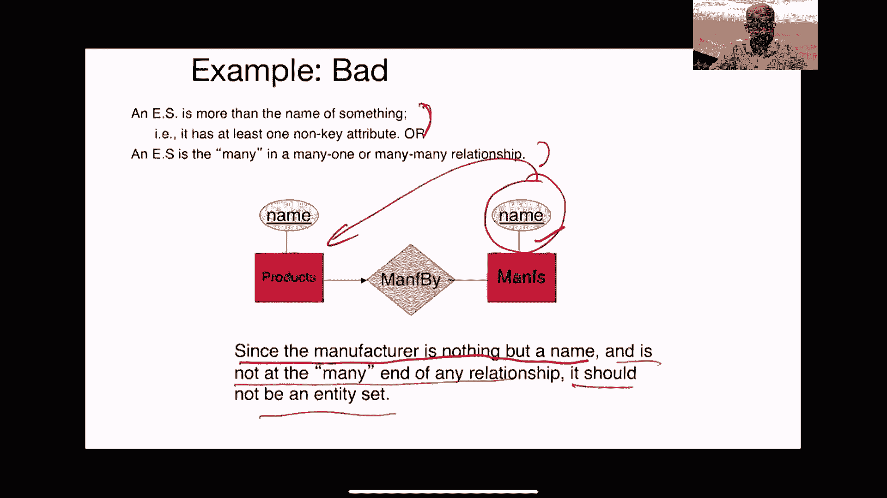
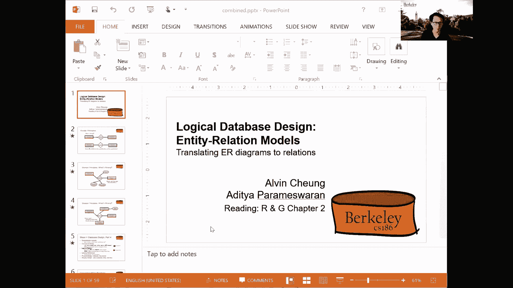
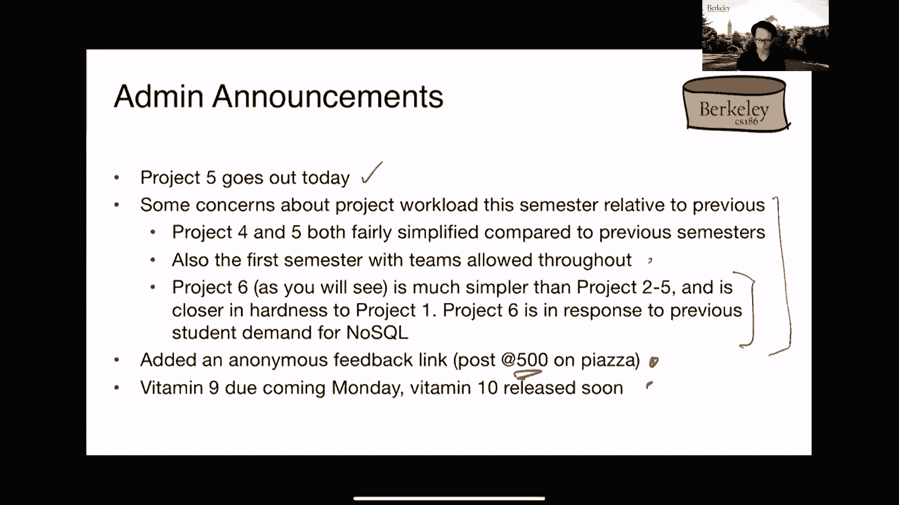
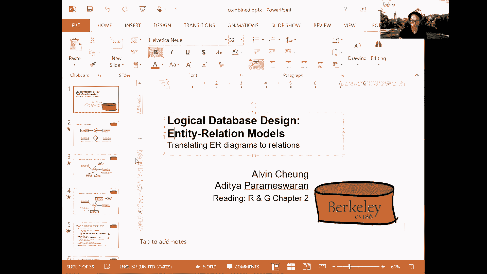
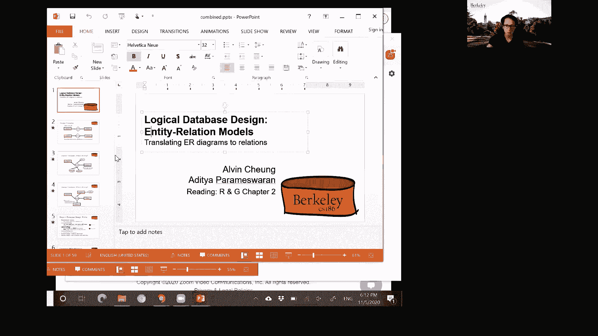
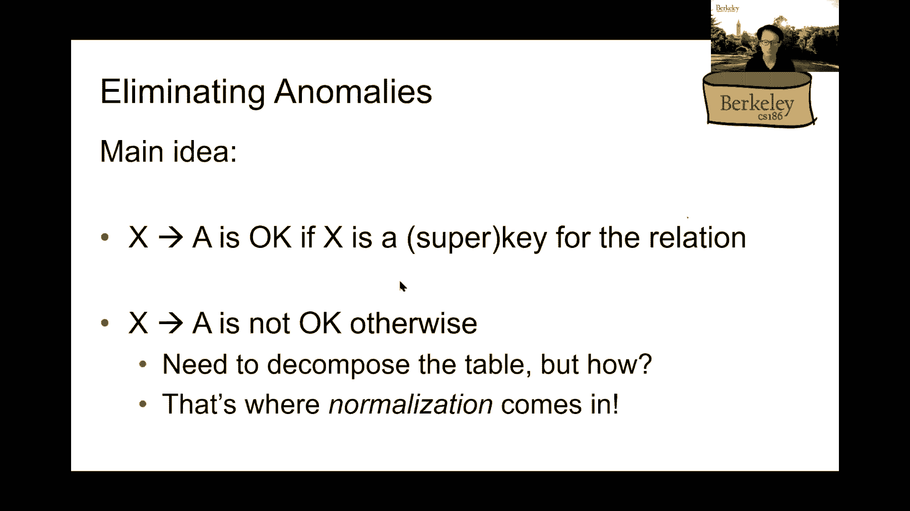
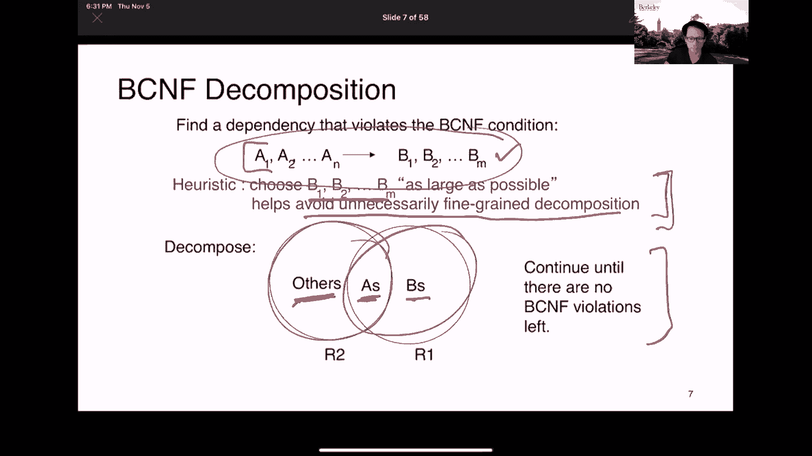

# P20：Lecture 20 DB Design FDs and Normalization - ___main___ - BV1cL411t7Fz

好的，好的，乡亲们，所以欢迎回来参加选举，我想继续选举，继续我们的选举报道，与ER模型的盛宴嗯，他们正在处理余波，嗯，所以让我们继续讨论模型，希望这是对狂热的F5打击的喘息，或者在推特上滚动厄运。所以让我们来谈谈呃好吧，所以呃又来了，这个实体关系模型，是这个呃，机制，它允许您对试图在应用程序中捕获的信息进行编码，嗯，我们还没有讨论过，我们会采用ZR模型，然后转化为关系，但这真的是，呃，目标。所以你想出了一个概念模型，它捕获您想要捕获的所有信息，然后将其转换为关系，然后将其存储在数据库中，好的，所以一个数据库系统，使用ER模型实际上很棘手，许多人认为这是一种艺术，因为在某种意义上。你试图与用户交谈，您试图衡量应用程序的需求，然后即使在您抽象了这些需求之后，弄清楚在你的年度模型中应该使用什么并不简单，所以你经常需要决定嘿，我应该使用实体还是属性，我应该使用实体还是关系。

如果我在利用一段关系，我的怎么样，我的关系看起来怎么样，是二元的，是永恒的，等等，所以总体目标是尽可能多地捕捉应用程序的信息，你应该试着捕捉它，在某些情况下，您可能无法捕捉到它，如果你还记得。我们确实讨论过部分密钥的概念，约束，和卡里关系，我们无法在定义的急诊室模型中捕捉到，但我们将讨论捕捉它的其他方法，嗯，对此的推理，当阿尔文讨论功能依赖时，然后嗯，一旦我们有了一套关系。我们实际上可以改进他们，我们以后再讨论这个问题，好的，所以在设计一个好的报价时，引用好的ER模型，我们该怎么做，所以有一些经验法则，尽管这有点艺术，有一些经验法则，以及如何选择元素，如何挑选实体。你应该如何选择关系，你应该如何选择属性等等，嗯，所以在这里我要谈谈一些一般的经验法则，这可能有助于确定何时应该使用各种元素，以及你应该如何在它们之间做出选择，所以第一个原则是避免冗余。

所以当你用多种方式说同样的话时，就会出现冗余，对，所以冗余浪费空间，所以这很明显，你多次存储相同的东西--你会浪费空间，但更重要的是，从数据库系统的角度，这鼓励了不一致性，因此。您正在记录的同一事实的两个实例可能会变得不一致，如果我们换了一个却忘了换另一个，好的，所以说，你会非常小心，如果有冗余，则更新相同信息的所有副本，还有这个，比多余的，比存储问题，对呀，储存很好。我们就可以，我们可以在磁盘上使用更多的存储空间，这并不像处理这种不一致那样是一个大问题，好的，因此，当删除时，可能会出现不一致，呃，您删除一个副本，但随后删除另一个副本，或者有更新的时候。您更新一个副本，但随后更新另一个副本，以此类推，好的，所以让我们举一些实际的例子，所以如果你有这样的急诊室模型，所以再次记住，这个，这些是实体集，这是一个关系集。

此箭头表示每个产品最多与一个制造商相关联，对呀，每种产品最多由一个制造商制造，嗯，所以这是很好的，因为制造商的地址与制造商相关联，并且精确地存储一次，所以这是一个好设计的例子，另一方面，我在这里储存。例如，制造商名称以及，在前一个案例中，有一些东西，所以你存储每个地址，一旦与每个制造商相关联，制造关系的产品由这个关系集编码，所以它也被精确地储存一次，在这个坏例子中，我像以前一样存储关系集。所以我把产品和制造商联系起来，但我也将制造商名称存储为产品的属性，所以这基本上是用两种不同的方式编码相同的不同的相同的信息，关系集以及属性，这没有必要对吧，所以这是，呃，这会导致更新问题。在空间方面浪费，所以这是一个我们想要避免的设计，因为您以多种方式存储相同的信息，这是另一个糟糕设计的例子，所以这个设计基本上将制造商存储为产品的一个属性，以及作为产品属性的制造商地址，这个问题有点微妙。

这个制造商地址是制造商的财产，所以你基本上要存储制造商地址的副本，对于每一个单一的产品，制造商制造商的权利，所以如果你有制造商的N种产品，制造商，你有N个不同的地址副本被存储，所以再一次。这是一个糟糕的设计，因为你的方式，你在为他们的每种产品重复一次制造商的地址，呃，制造，这在空间方面是浪费的，而且，呃，异常，在这种情况下，如果制造商暂时没有产品，所以他们停止了所有的产品。现在开始了新的产品线，你会把那个地址弄丢的，对吧，所以没有单独的方式存储他们的地址，因为您没有与制造商相关联的实体，你的你的，您的实体以产品为中心，制造商地址是产品的属性。所以更好的设计可能是用这样的东西，其中您的地址与产品分开存储，好的，所以这是第一条原则，所以第二条原则是在实体和属性之间进行辩论，同样，对于如何做到这一点，有很好的经验法则。

所以让我们从一个简单的例子开始，假设我想存储地址，好的，因此，我应该将address存储为，呃，雇员，呃，如果雇员是我的实体集，还是我应该把它作为自己的一个实体存储，事实证明，即使是这个简单的问题。答案是，看情况，这取决于要编码的语义，以及你想如何使用这个，呃，资料地址，对呀，所以如果每个员工有几个地址，您必须将其存储为一个实体，对呀，因为呃，属性实际上是原子的，所以不能有一个面向设置的属性，嗯。因此，您必须将其存储为一个实体，与…的属性相反，比如说，雇员的实体集，我们关心地址的结构，所以如果你不想把地址作为一个整体来对待，但你也想看看城市，你想看看邮政编码，你想查一个路名，街道名称。你又有什么，我们必须把它作为一个实体来存储，好的，或者至少我们必须将其存储为多个属性，这是因为呃，在实体中，我们有原子属性类型，我们不是说，我们没有复杂的类型，所以原子属性类型，呃。

孔肖恩基本上是说我嗯，他们是，他们不能，呃，它们是不能进一步分解的单元类型，所以在关系模型中，每个属性每个列都是原子类型，所以它不能再分解了，好的，所以在实体集和属性之间的辩论中，这里有一个经验法则。我们应该，呃，跟随，所以规则说一个实体集，如果您决定将某物用作实体集，应至少满足下列条件之一，第一个条件是它应该不仅仅是某物的名称，因此它应该至少有一个非键属性，所以你应该存储一些信息。这不仅仅是实体集的关键，其次，它是多对一关系中的多，所以让我们用一些例子来讨论这个问题，好的，但是离线时也要考虑这个规则，试着给自己讲道理，以确保你明白这一点，好的，所以让我们来谈谈几个例子。所以这是我们的规则，所以一个实体集，呃不仅仅是某个东西的名字，或者是多对一或多对多关系中的多，所以这是一个事情很好的情况，好的，事情好的原因，制造商应该是一个实体集，因为它有一个非键属性地址。

连同一个键属性名，产品应该是一个实体集，因为它是由权利制造的多对一关系中的多，所以这是有道理的，这是一个多对一，所以因为这个方向的箭头，你有每个产品最多与一个制造商相关联，但是每个制造商可以有很多产品。所以每个制造商都可以有很多产品，因此，你不能简单地拥有产品，是制造商的属性，所以你不能把产品吸收到制造商实体集中，因此，产品应该是它自己的实体集，因为这个原因，到目前为止对此有什么问题吗，好的。所以让我们呃，转到其他示例，所以这里有另一个事情好的例子，好的，假设我们没有任何制造商地址信息，在这种情况下，这个以制造商为属性的实体集很好，没有必要使制造商成为一个实体集，因为除了制造商的名字之外。我们对他们没有任何要求，这里有一个事情很糟糕的例子，所以在这种情况下我们唯一的信息是制造商的名字，既然制造商只是名字，因为这不是一段关系的终点，它是多对一关系的一端，它不应该是一个实体集。

因为你可以很方便地用这个名字，将其作为产品的属性附加，你你应该完蛋了，好的，所以这种关系是没有必要的，好的，这就是我想传达的--只有两个原则，嗯，就试图最小化它而言，和C在实体集和属性之间选择，好的。所以有很多更多的设计原则，关于如何在元素之间进行选择的理论，为此，我鼓励你去读课本，嗯，但我很乐意在这一点上回答这方面的问题，如果呃，如果没有，我只想说大多数真实世界的图表其实都很复杂，和，我知道。加布提到，他花了星期五下午的时间试图弄清楚如何设计模式，对于智能建筑，在大多数现实世界中，应用程序的ER图非常复杂，所以你可能会想嘿，我们为什么要谈论这些玩具例子，在现实世界中，这些会有什么关系。事实证明确实如此，我是说在现实世界中你必须经常考虑这些设计决策，所以对于一对一的关系，箭头会是什么样子，所以如果是一对一的关系，所以如果你有，嗯，一对一关系的好例子是什么，好的。

让我们不要让我试着在飞行中想出一个例子，但是一对一的关系会是这样的，对呀，所以这边的每个项目最多与右手边的一个项目相关联，这边的每个项目最多与左手边的一个项目相关联，所以你在两个方向上都有箭头，嗯。查理问，将制造商作为一个实体集是否有用，如果将来可以从她的名字扩展，嗯是的，所以如果你相信你将来可能会添加额外的属性，可能有很好的理由将其保留为实体集，所以坐在我们身上，我们是不是应该把它们合并在一起。所以在你有，嗯，所以在这里没有额外的非键属性的情况下，可能会有，呃，把它们合并在一起的好处，就像你问的术语，嗯，所以记住这里有两条规则，对呀，所以要么，如果只是某物的名字，没有非键属性。或者是多对一关系中的多，然后嗯，它应该是一个实体集，所以如果它有非键属性，所以你可能还想拥有它，呃，作为实体集，好的，我觉得，在这一点上，也许我们应该换到艾尔，没有其他问题了。

否则我很乐意在聊天中回答更多的问题。

所以他们的下一部分，我所听到的，你们能听到吗，好的，是啊，是啊，所以在讲座的下一部分，嗯，我们现在基本上想谈谈，我们如何将我们所学到的所有急诊室图映射到关系中。

接下来我想谈谈，我们如何表达更复杂的约束，超越了Aditya所说的可以用ER图表达的东西，所以说，呃，我想说的第一件事是把事情转化为关系，但在此之前，让我提醒你。就像Aditi已经对这些设计原则所做的那样，其中许多事情都是主观的，对就像，例如，呃，你认为这个案子有什么问题，就像用常识对吧，这不像是一个诡计问题，这里就像常识一样，什么，你认为这个案子有什么问题。呃，无属性，嗯，也许吧但另一件事是对的我认为你应该注意这里的箭头，好吧，如果我试图模拟，是啊，是啊，所以我们应该能够买到能够买到多种产品，对呀，所以在这个例子中这张图表明每个产品只能属于一个人。意思是每个人都可以喜欢每个产品都可以由一个人购买，这太奇怪了，对呀，这不是现实世界的运作方式，我是说就我所知，然后我想一些可能更适合这周的东西，所以你认为是错的，用这个案子，也许你认为这个案子没有错。

好的，这个案子有什么问题吗，是啊，是啊，希望，对呀，我是说，只有一个总统，这也包括我们的国家，对呀，就像，你知道的，这里的教训是什么，就像，基本上只是用你的常识，好的，所以不要试图做不应该起作用的事情。对呀，好的，这里还有一个，这里有什么问题吗，所以我基本上是在添加我可以添加的所有属性，这种关系，称为购买，你可以知道是什么阻止了，我是说这不像是错的，错了，从某种意义上说，就像有不好的事情要发生一样。但这基本上只是一些不太有意义的事情，对呀，那么你为什么要把所有的属性都粘在一个关系上呢，对呀，例如，就像这些属性中的一些，比如地址和名字，我是说你也许可以把它重构成一个单独的实体，对呀，叫做人，一个人。所以你又知道了，像这样基本上只是常识，对呀，所以只要确保你的管道，你选择了正确类型的实体，然后这里还有一个，嗯，你认为这里有什么不对，是啊，是啊，所以多亏了有一个单独的和属性称为dates，对呀。

我是认真的对，这里的教训是什么，只是不要让世界变得比什么更复杂，它已经是对的了，这些都是常识，对，这不像，这里没有硬性规定，对所以作为一个，如果你写这样的东西，如果你在外面设计这样的东西。在你找到工作之后，例如，我是说，你不会被炒鱿鱼吧，也许不是马上，呃，但就像，你知道的，它基本上只是增加了，比如我们不需要处理的不同事情，对呀，那么为什么要把事情弄得更复杂呢。所以这些基本上是这里的一些课程，所以我们想要，但现在谈论像，我们如何将所有这些不同的ER图转化为，我们都知道和热爱的，嗯，我们已经讨论过这个概念设计，我最后用了一堆例子来说明什么是好的，什么是坏的。然后现在我们想谈谈这个翻译过程，所以首先，实际上，将ER图转化为关系并不难，只是，它需要注意不同的情况，我们可能需要处理不同的情况，所以首先这个是最简单的，所以我有一个具有不同数量属性的单一实体。

其中一个已经作为键突出显示或下划线，所以这很容易，我们只是把它翻译成一个单一的关系，所以在这种情况下，我有产品关系，产品ID是主键，然后所有其他属性都是表中的属性，足够简单，我希望如此。对了，这个呢。所以在这种情况下，我有一个端到端的关系，所以我们希望能够把这转化为关系，我声称其中一半你已经知道怎么做了，根据前面左边和右边两个实体的幻灯片，所以我们只是把它们翻译成单独的表格，所以我们有订单表，就像。你知道主键，产品ID和客户ID的组合，然后我们有航运公司的表，主键在它的名字中，那装运呢？所以这两个实体之间的运输联系订单和运输公司在这里，所以在这种情况下，运输是关键，因为钥匙的组合。连接的两个实体的主键，这就变成了超级键，或者像我们这里作为学生主键的键的超集，然后这里有一堆例子，所以你可以看到我们是如何将两种不同类型的实体连接在一起的，这有道理吗，对呀。

所以我们试图连接到不同的实体，就像你知道的，装运的主键，应该只是单个实体的主键的组合，因此，如果您已经适当地定义了您的实体，因为它们中的每一个都有一个主键属性，这只是一切的串联在一起，然后现在，当然啦。如果他们碰巧同名，所以说，例如，就像你知道的，呃，也许你加入，也许有一个单独的实体叫做人，或者像人一样的东西，它也有一个名称作为主键，只要确保你重命名它们，适当地重命名属性，这样就没有名字冲突了。有时人们称之为超级钥匙，在这种情况下装运，我们只是将来自不同实体的密钥组合在一起，所以现在情况稍微复杂一点，那么这些约束呢，对呀，这是我讲过的一个例子，每个部门最多有一名经理，我们如何将其转化为关系。所以这里有一个方法，所以员工们我不打算谈论这个，我想你们已经知道怎么做了，那是单独的桌子，经理呢，在本例中，关系经理，对不起，嗯，关系经理对吧，所以请注意，就像以前一样。

我们可以将其建模为以部门ID作为主键，还有员工桌子上的外键上面有SSN号码，对呀，所以这再次将两个实体连接在一起，所以在这种情况下，我们只有主保留部门ID，但不像部门ID和SSN的组合。因为这最多一段关系，我们知道每个部门，每个部门都由一个人管理，所以呃，我们基本上知道本案中的部门，已经可以作为管理者的主键，这就足够了，我们不需要用外键联系我，从社会，从员工表中。那是做这件事的一种方法，这里有另一种方法来做同样的翻译，因为我们知道每个部门都必须有一个独特的经理，我们实际上可以将部门表和经理表合并成一个关系，所以你看这里，所以我把它叫做，你知道的。由于缺乏更好的描述，该部门管理，因此，这种关系具有部门实体的所有属性，就像我们所拥有的，我们在右手边看到的，所以部门ID，部门名称和预算，然后它还有一个外键，引用员工的关系，就好像这是一张单独的经理桌。

这有道理吗，和，当然啦，因为我们把这两件事合并在一起了，我们还需要从经理的关系中吸取属性，对呀，所以在这种情况下，自从，那么你应该用哪种方式呢，这要看情况而定，就像，你知道，呃，右手边显然是合并多个。呃，倍数，呃，把ER图的各个部分放在一起，所以有时这在储存方面更有利，例如，然后有时也更好，在左手边做可能更好，所以这取决于你的情况，但是它们中的任何一个都是转换图表的有效方法。所以顾问问一个经理可以管理多个部门，嗯是的，对，因为在这种情况下，关系说，呃，每个部门必须有一个独特的经理，那么为什么我们在经理关系中保留主键和经理呢，非主键，你是说像罪恶一样，或者你是说像ID。所以我们需要在左手边这里是经理桌右边，ssn来自员工的实体，所以我们需要保留它，然后是从部门的桌子上传来的，所以我们也要把它，好然后，因为它基本上只是经理的属性，为了经理的关系，好的，这里还有一个。

这里还有一个，所以现在我们想说每个部门都有一个经理，对呀，所以说，这基本上是我们已经讨论过的一种参与约束，这与经过的图表完全相同，我们如何将其映射到一个关系，所以在这种情况下，因为我们已经知道了。你知道的，每个部门只有一个经理，嗯，我们可以再一次把所有的东西合并成一个单一的关系，叫做部门经理经理，对呀，所以就像这里的名字一样，所以和我们以前唯一的不同，是的，基本上说我们必须有一个非现在的数字。或者现在没有这个部门经理关系中的社会保障号码，因为我们要求它实际上是一个有效的社会安全号码，这意味着它必须是一个有效的员工，换句话说，我们基本上要求全面参与，从这里的员工桌子上。你不能让一个部门在没有人管理的情况下闲逛，所以说，在这张幻灯片上你可能会注意到的另一件事是，呃，我用红色突出显示的其他东西，呼吁删除，无行动，那是什么意思，所以我们这里有一点问题。

所以如果你试图删除管理部门的员工，在这种情况下应该发生什么，通过声明这个关系为，呃，待删除无操作，这是一个外键，引用员工，我们基本上是在要求数据库实际上提出一个错误，并在员工的表上向后行删除操作。为了保持这种约束，因为如果我们解雇了一个员工，然后那个员工原来是管理部门的，然后如果我们不对这种关系做任何事情，这里的部门经理，那我们就有问题了对吧，我们现在有一个不存在的员工。那么在这种情况下应该发生什么，所以通过在删除无行动条款上添加这个，我们基本上是在询问数据库，以防止员工表上的删除发生，所以数据库现在会抱怨你不能删除员工，因为每个员工都被用作外键，呃，部门经理表。那么在这种情况下，你怎么能真正解雇一名员工呢，或者你得先删除部门，这在现实中是有道理的，对呀，所以你首先需要去掉那个人管理的部门，在你被允许解雇管理该部门的员工之前，所以这就是这个特定从句的意思，5。

如果你想解雇某个员工，另找人顶替他，那该怎么办，嗯好吧，您可以随时更新，呃，这个桌子，对呀，部门经理那很好，您可以更新它以将其设置为另一个，呃，社会保障号码权，意思是另一个员工没事，唯一的问题是。如果你想喜欢，我想移除，我想呃，取消雇员权利，那个，我想什么，呃，这就是开火的意思，所以你先更新经理，然后解雇那个员工，你就是这样做的，是啊，是啊，然后我们会看到不同的方法来建模这些约束。所以在这种情况下，我有点用这个，现在不是作为一种建模的方式，你很清楚一种关系，对呀，所以呃，但是如果你有更复杂的约束呢，超越什么，你知道一个，对呀，也许你想说正好两个，当你想说不到五岁或什么的时候。也许一个部门可以由三个以上的经理来共同管理，比如说，对呀，你不能只是用“不现在”来实现这一点，呃，我们实际上需要一种叫做检查约束的东西，我们稍后会学到，好的，所以最后一件事是对的，所以我们也讨论子类。

嗯，这里有一个潜在的层次结构示例，对呀，所以我们有软件产品和教育产品作为产品实体的子类，我们如何将整个图很好地映射到关系中，所以我可以把产品建模成自己的桌子，所以因为这已经是一个实体。然后我可以将另外两个子类建模为它自己的单独表，例如，在这种情况下，请注意那个小发明，它是一个软件产品，然后就像你知道的，又是小发明，对然后玩具基本上是两种不同的教育产品，注意。我在这里使用name作为主键，所有这些关系的权利，所以，如果我想说，看看小发明的价格，然后我可以从一个软件产品开始，因为Gizmo是一个软件产品，然后在产品目录中查找价格，以它的名字加入。这种特殊的方法被称为，呃，每桌一堂课对吧，因为我们基本上对这里的每一个关系都有一个实体，对呀，这实际上不是唯一的方法，呃，模型与子类和关系相互关系，例如，您可以想象将多个表合并在一起，你可以像这样合并。

你知道，父母和孩子的桌子在一起，例如，那是可能的，呃，所以有很多不同的方法来做这件事，我只是告诉你一个特别的方法，最后，呃，对弱小的实体来说是正确的，那个，就像你记得的那样。基本上是一个不能仅通过其属性唯一标识的实体，它缺少主键，所以在这种情况下，我谈到的例子是这种依赖，快速实体权利，每个受抚养人都必须与一名员工联系在一起，那么我们如何将其映射到一个表。所以和你可能期望的差不多，所以它得到了自己的一切，它自己的属性，所以呃，依赖名称和h，然后还有成本权，因为我们基本上可以再次合并政策的关系，和弱小的实体一起，我们唯一需要注意的是什么，基本上应该是主键。在这种情况下，所以社会保障号码是肯定的，因为那是真正的，他们就在那里，这就是所有权，那就是自己实体的来源，对呀，这就是所有者实体，主键来自社会保障号码，然后是那个人的名字。

基本上是人的名字受抚养人的名字，这是个部分钥匙，对呀，然后，与员工的主键相结合，这将能够唯一地识别依赖关系，呃，在这种情况下对吧，这就是一个弱小的实体是对的，正如你所记得的，因此。当我们试图将其建模为一种关系时，那么主键基本上是弱实体的分键，以及构成所有者实体主键的任何其他属性，然后你看在这种情况下我们称之为我们这里有一个单独的东西，调用删除级联，那是什么意思。所以这基本上意味着如果我们移除被引用的元组，然后我们还需要删除引用它的元组，在这种情况下，这意味着如果我们试图解雇员工，雇员桌子上的雇员，那么我们希望与该员工相关的所有依赖关系也被删除。所以这不像另一个，在另一种情况下，我们说像，你知道在删除没有行动，它就会，基本上呃，禁止我们在这种情况下解雇员工，如果我们说删除级联，这基本上意味着数据库也会自动为我们删除，所有联系在一起的员工。

所以所有的依赖，链接到特定员工的所有依赖项，没有喜欢的好方法，你知道的，我不是说你什么时候必须这样或那样做，我是说，基本上这是你的选择，当您设计模式时，呃，无论您希望它是在删除级联还是在删除时。没有完全由你决定的行动，但在这两种情况下我们都能保持我们想要的关系，在管理中，在这种情况下我们要确保每个部门都有一个经理，在本例中，我们希望保持这样一个事实，即每个依赖项都必须链接到，至，呃。对单个员工，到目前为止对此有什么问题吗，所以作为一个回顾，对呀，所以正如你所看到的，这都是相当主观的，对呀，所以从常识到喜欢，你知道，甚至选择如何构建关系，做这件事的方法不止一种，所以一定要注意。然后我们想基本上有一种方法来分析这些不同的选择，虽然有时它只是归结为像启发式，以及这是否对任何应用程序都有意义，它实际上是利用这些实体和关系来进行良好的数据库设计，我们基本上想确保这些，呃。

所有这些所有这些约束都可以被捕获，所以这是我们希望能够保存的一件事，当然，呃，但对于更复杂的约束类型，超出了我们所说的--刚刚好，到目前为止，就这些参与而言是正确的，最多一个限制。我们还没有一种方法来表达它们，为此，我们需要一种叫做功能依赖的东西，这就是我接下来要讲的，在我这么做之前，对我们所讨论的还有什么问题吗？就ER图或将事物转化为关系而言，所以阿尔文，我能，呃。跳进去一秒钟，所以你能用删除级联回到上一张幻灯片吗，所以顺便说一句，那个部分或删除级联，或删除，没有阿尔文提到的行动这是一个需要做出的决定，在你决定，嗯，在您决定将ER图转换为关系模型之后，为。当这些键被侵犯时，所以当某物被删除时，您引用的表，你怎么处理外键，所以这是您可以添加到模式中的东西，呃，口述，当有删除时会发生什么，类似地，您可以添加语义来说明更新时会发生什么，例如，如果SSN被更改。

这如何影响其他元组和引用该意义的其他关系，所以你可以类似地说级联，嗯，如果是的话，呃，它基本上对引用表进行相同的更改，呃，你可以说set null，您基本上可以将该值更改为NULL。或者你可以什么都不做，对呀，所以这里有各种各样的选择，所以基本上是外键，废话，废话，废话，关于删除级联，关于删除哨兵，on delete，任何内容和更新，现在更新设置上的级联，以此类推，这就是它的语法。这基本上是向数据库系统指示，您应该如何强制执行这些约束，是啊，是啊，然后这些东西你不能从急诊室的图表中读出来，对呀，所以你注意到我们没有谈论这个，当我们在谈论，我是对的，所以这些基本上是额外的事情。你可以一次决定，你决定翻译，那个变成那个，将ER图转换为关系，任何其他问题，伟大，所以现在我们要讨论的是所谓的模式细化，或者像你知道的，能够表达元组之间更复杂的关系，或者在我们拥有的模式中。

也像你知道如何，如何，如何总体上设计好的模式，就像我们已经说过的对，这基本上是一个非常主观的过程，嗯，没有一个好的方法喜欢，你知道的，呃一个不，没有一种神奇的方法来说明什么是好的模式，虽然我在这里做了。已经暗示了一堆不同的属性，我们希望拥有，所以你得到的最常见的东西，当人们在街上谈论这些模式设计时就像你知道，人们抱怨像，为什么你有这么多数据库表，或者喜欢像这样的东西，你又知道了，猫对。所以当你试图更新一些东西时，这真的很糟糕，这里有什么问题，所以他们中的一些人，你已经说过了吗，这里有一个我们设计对的模式示例，假设我们把它们从ER图转换成，这就是我们所拥有的，所以我们有人们的名字。社会保障号码，电话号码，他们住在哪里，我们希望能够，呃说一些像，你知道，呃，一个人可以有多部手机，但他们只能住在一个城市，依此类推，等等，这个模式有什么问题，比如说，其中一个是前面提到的，有冗余对吧。

因为我们多次存储相同的信息，所以请注意，就像你知道的，城市，适合碎片的城市在这里基本上是重复的，还有一些事情，比如你知道的，更新异常，例如，比如说，如果我们想更改某个特定人的地址或其他什么怎么办。我们需要基本上确保我们改变了所有的权利，正如我所说的，就像你知道的，磁盘存储可能不是，呃，这些天的担忧，因为我们可以很容易地买到存储，但基本上你需要处理的是这些棘手的情况，所以我们要确保更新所有行。因为如果我们更新其中一个而不是另一个，那就不好了，当我们试图删除时也是如此，我们要确保所有的电话号码都是领先的，例如，对呀，所以我们基本上要用这些作为指导，就什么构成一个好的模式设计而言。因为他们可以避免的事情阻止我们处理这些类型的问题，但又一次，就像我说的对，这是非常主观的，我是说你可能不会，你可能不会买这个，你可能会说我真的不太关心异常，我可以在申请中处理，你肯定能做到。

但你知道我们基本上只是把它作为一个单一的指导方针，这样我们就可以在这里讨论一些更定量的东西，所以解决这个问题的一种方法被称为分解，所以如果我把原来的关系分解成这里的两个新关系，显示在屏幕底部。那么我声称异常点已经顺便过去了，当我说分手的时候，我是说完全去掉鞋面，呃，这里的原始关系对吧，然后将数据存储到两个单独的表中，然后这是特殊的方式，我要把它们储存起来，那么为什么这些异常消失了，但首先。我们不再存储重复的数据，所以伯克利只出现了一次，例如，对弗雷德来说是对的，然后弗雷德不喜欢的名字，你知道，多次展示，然后我声称现在把某人转移到一个新的地址很容易，因为我们知道有一个地方需要更新。在左手边的桌子上，我们根本不需要碰右手边的桌子，同样，如果我们想删除某人的电话号码，然后我们先弄清楚那个人的社会安全号码是多少，然后我们去掉右手边对应的电话号码，所以我只是施了一些魔法。

以某种方式告诉你你应该闯入这个，你知道两张不同的桌子，然后就像你知道的，那么呃，一个是好的，不幸的是，我不能去打破所有这些关系，为了你们每一个人，就像你知道的前进，所以让我们试着系统地做这个。一定有办法，在谈论如何系统地做到这一点之前，我们首先要讨论的是所谓的函数依赖关系，为什么，因为了解这些功能依赖关系将帮助我们规范化，关系模式，我们如此正常化只是一个花哨的术语来告诉你，什么时候分手。什么时候不拆散他们，好的，那么什么是功能依赖关系，这里有一个定义，所以说，呃，功能依赖关系如下，所以如果两个元组中的两个在一组属性上一致，从1到n，那么他们还必须就属性B 1达成一致，直到某个数字。BM同意，在这种情况下意味着平等，在名义上，我们用这个箭头符号，或者呃，决定你可以，我就是这么看的，它基本上说，从1到n的属性集，确定要成为的属性b的值，所以你不喜欢这里的正式定义。

就像一个图形化的定义，所以我们说这个函数依赖关系是1到m，确定b 1为n保持，如果对于同一关系中的两个不同元组t和t素数，呃，他们必须，呃，如果他们在左手边意见一致，就属性而言，它们的值是相同的。从1到m，那么对于属性b 1到bn，它们必须具有相同的值，所以这里有两个元组，你知道T和T素数，同样的关系是，然后就像你知道的，如果我在这里说的是，如果这两个元组在1到m的值上一致。这意味着他们有相同的一个到M，那你就知道，对于这两个元组，bone为n的值也必须相同，这就是函数依赖的意思，读这个箭头的方法是说喜欢决定对，所以1对a m决定了b对bn的值，这里有一个具体的例子。所以现在我又回到了员工的世界，所以我们可以说函数依赖成立或不成立，所以让我们来看看这三个，功能依赖看看为什么第三个不成立，例如，所以第二个是成立的，因为呃，你知道通过看位置，我可以确定电话属性的值。

就在这里的这个关系中，所以你知道，呃，这两个销售代表的电话号码相同，就像，你知道吗，呃，办事员和律师，只有一个元组是对的，所以它不能满足我们的要求。回到前面的示例，呃，这个将是元组T。然后第二个将是元组T，主要权利，所以我们说如果两个元组在位置值上一致，那么phone属性也必须具有相同的值，在这种情况下，它是这样做的，因此，此功能依赖保持，但不是为了这个其他功能依赖项。它声称手机决定位置，原因是因为我们可以找到两个一致的属性，电话属性电话值1，两个，三个，四，但他们最终有了不同的位置，因此，此功能依赖关系不成立，这有道理吗，很容易检查对吧。但你只需要遍历关系中的所有元组，正如你已经说过的对，所以这种关系只是保持，仅适用于特定关系，对呀，我是说没有一般的东西说，就像它必须抓住所有可能的关系，基本上只谈论我们的关系，呃，在这种情况下。

如果添加新属性，对不起，如果你新加一行写着电话是一二三四，然后就像，你知道，呃，对不起，是啊，是啊，例如，如果你更新，就像你玛丽的记录说的，换律师，律师收款，然后突然间，这个功能依赖就适用于这种关系。所以这保持不变还是不保持不变，呃，财产只与我们拥有的特定关系有关，在那种情况下，你可以很容易地改变事情，让事情保持或不保持，一般来说，电话或职位没有什么基本的要求你必须满足，这里有另一个例子，对呀。所以你可以在家经历这个，我们没有时间把这里的一切都过一遍，所以你基本上可以检查，所有这些不同的功能依赖关系都适用于这种特殊的关系，就像我说的，对于启示的特定实例，功能依赖关系要么成立，要么不成立。就像你知道的，如果我们对于这种关系的每一个例子，那么函数依赖关系为真，那么我基本上说这个关系r满足给定的函数依赖，而不是你说的护照你听到人们说，你知道当我们说一个特定的关系满足一个依赖函数。

然后我们基本上陈述了对特定关系的约束，所以这是在说更强烈的东西，对呀，所以这就是为什么我强调了这一点，就像每个实例一样，所以现在我们谈论的是一种普遍有效的东西。所以如果我能向你展示一个特定的每一个可能的例子，关系总是满足函数依赖，那么函数依赖关系，则该关系r满足函数依赖，我在这里用了一个不同的术语，不是坚持不正确，所以在这种情况下。如果每个Arc实例总是满足函数依赖关系，那就另当别论了，这方面的一个例子是，例如一个主键，我们已经说过了，对吧，所以如果您将某物定义为主键，你基本上是说那个属性，或者一组属性保证是唯一的。不管您在该关系中实际存储了什么数据，对，因为如果你试图用同样的东西存储，使用相同的主键，然后就像你知道的那样，数据库会拒绝它，所以你不能得到，在特定的唯一性属性不希望这样的情况下，因此。

这是一个函数依赖的实例，它被所有关系所满足，适合于特定的模式，所以就像我说的对，为什么要为这些函数依赖关系而烦恼呢，因为作为预览，我们基本上要利用这些依赖关系来帮助我们找出。我们是否要将表分解成更小的表，如果是这样，有多对，所以这将是即将到来的，呃，几分钟内，但在此之前，让我们讨论一下这些函数依赖关系，所以我们了解了这种关系，结果发现，这些函数依赖有不同的性质。所以我想有些人已经在聊天中说了对吧，例如，如果我们知道这个函数的上半部分，右边幻灯片上的，所以这三个漏斗，函数依赖关系为真，然后我们也知道，屏幕底部的功能依赖也是正确的，和颜色结合类别决定价格。所以在这种情况下，某种传递的东西是对的，它基本上是说，如果我们知道名字，我们也知道类别，那么我们就已经知道价格权的价值了，所以你可以试着推理为什么，这个就是这样，对于这个特殊的例子，但总的来说。

我们在这里想说的是，我们可以使用某些属性来帮助我们识别不同的功能依赖关系，基于我们已经提供的基本集，这就是我接下来要说的，所以这种推论是已知的，呃，这种推理过程，是基于阿姆斯特朗公理，所以它们是这样的。他们走下面的路，所以假设我们有三组属性，嗯，然后，例如，我可以，所以我们只是我可以增加权利，例如，呃，功能依赖，所以如果我们知道x决定y，那么如果我们给它添加另一个属性，在这种情况下Z，那它就不。它从一开始就没有改变功能依赖的含义，事实上，我们刚刚发现了依赖的一个新功能，如果你能纠正x z，呃也决定y z是对的，顺便说一句，这里也有身份，对呀，例如，x确定x是对的，一种琐碎的功能依赖。然后传递性是我谈到的例子，你知道在上一张幻灯片上，然后还有反射性，你可以在屏幕上看到，所以事实证明，这实际上是一个非常健全和完整的推理过程，查找您能发现的所有其他DS，给定基集，声音。

这意味着您通过应用这些规则发现的任何东西都保证是正确的，这意味着这些新的功能依赖关系也将保持不变，和完整的意思是，呃，所有其他的，您不会错过使用其他方法可能发现的任何其他功能依赖项，很有趣，对呀。它基本上意味着使用这三个规则，您基本上可以发现您能找到的所有功能依赖项，假设有人已经向我们提供了一堆基本情况，所以实际上有一堆不同的规则可以从这三个公理中得到，我在幻灯片顶部提到的，例如，工会，呃。构图，而且，呃，其他事情对，所以看看你能不能证明为什么在这些不同的情况下，我认为它们都源于，呃，我在开头提到的前三个属性，在幻灯片的顶部，这里，那么什么是F星，所以你可以在下一张幻灯片上看到，呃，呃。就在之后，到目前为止对此有什么问题吗，还是我们现在就休息一下，我想四郎有一个问题，哦耶，嗯我是，我在看上一张幻灯片，然后呃，我在想如果你去掉第二行，上面说类别取决于部门，如果我们，如果我们去掉那条线。

1。我们还能得出这样的结论吗，是啊，是啊，好的好的，好的，好耶，然后当我基本上应用传递性时，呃公理，对呀，对呀，对呀，谢谢。是啊，是啊，我们休息之前还有什么问题吗？我们应该做公告吗，你有幻灯片吗。阿尔文，或者我能我能做到，我可以为我自己做，病人，顺便说一句，你们必须保持一些编织，我是说，就像你知道的，我想我看到了一堆，呃，关注广场上的帖子，就可以了，我也是，但如果你不这样做，如果你想保守秘密。或者像你知道的，你不想让别人之前看到它，然后就像你知道的，一定要填好表格，嗯，否则，我们结束了结束只是玩，就像，你知道的，计票视频，那并不好玩，我想让我只是我不需要动画，嗯，所以第五项目今天出来了，嗯。所以要小心，嗯，所以有，我想也许在反馈表中，相对于上学期，本学期的项目工作量有些问题，当然，这学期有一个额外的项目，对呀，所以有第六个项目，嗯，但是我们非常清楚还有一个额外的项目，正因为如此。

我们大大简化了项目四和项目五，所以他们更容易相处，您必须运行的测试较少，这就像我们大大减少了这两个方面的工作量，这也是第一个学期允许团队，所以我们是我知道有人对这个额外的项目提出了担忧。但我的意思是我们意识到还有一个额外的项目，我们在整个过程中都减少了工作量，我想提到的另一件事是第六项目，哪个是加法项目，实际上比项目2到5简单得多更接近于，项目一，所以这是一个非常简单的项目。相对于之前的几个项目，你可能有点挣扎，嗯，它更类似于SQL项目，我还想提一下这不是我们想添加的东西，只是为了让你的生活变得艰难，这实际上是前几个学期积极要求的学生，所以这是他们在课程评估表上要求的。所以我们加了这个，希望这不是很多工作，这只是一点点乐趣，和接触一套非常不同的工具，所以那是嗯，对此的反馈，以及其他事情都是受欢迎的，所以看看广场上的五百号帖子，记起来很方便，嗯，呃。

这就是我提供反馈的方式，这不是一个繁重的形式，与中期调查不同，只需在自由文本字段中单击要讨论的主题，想说什么就说什么，好的，嗯，呃，维生素九是，呃，到期，呃，下周一，维生素10将发布，呃，很快。我想这个周末，所以我想，这就是我想说的关于，呃，通知，所以让艾尔文把它拿走吧，是啊，是啊，所以我想添加回，就像，你知道，这也是项目讨论，好吧，就像你知道的，我们有一个项目性爱，因为呃。我们想覆盖NoSQL，然后从以前的学期，人们基本上说他们谈论的，我们在课堂上讨论过，但他们从来没有真正练习过，所以这就是为什么我们想增加六个项目，这样你们就可以在没有续集的情况下玩了。所以它将作为一个TSS，类似于项目一，就像，你知道，呃，所以这并不难，你只要玩，基本上玩NoSQL数据库，那个，嗯，我们认为这将是有用的，呃，让这堂课总结经验，然后就像一个城市已经说过的，就像你知道的。

我们早些时候削减了其他项目。对呀，然后我们允许你们和合作伙伴一起工作，呃，这样工作就更容易管理了，基本上。

关于那个有很多问题，所以五号和六号很快就会被释放对吧，所以事实上我想五个已经被释放了对吧。

我想今天已经发布了，我不知道它是否已经发行了，我明白了，好的，是啊，是啊，所以嗯，你们应该能看到这是怎么回事，然后决定你们想去哪里，呃，当你们想开始的时候，但只要确保，拜托了，不要拖到最后一分钟。我是说，呃，是啊，是啊，好的，所以让我们继续讨论，所以早些时候我只是在说，呃，休息前的阿姆斯特朗公理，然后我向你们展示了如何导出其他属性，呃，为了推断新的功能依赖关系，所以基本上这些是，那些是。这些是您可以用来定义的一些规则，所以人们问我，这里的f+是什么意思，对呀，所以它代表一种叫做结束的东西，什么是封闭，所以给定一组属性，闭包是称为b的其他属性的集合，在这里用这个加号标记，呃。使得属性集a到n，在函数依赖集中确定B，我有的例子，呃，你知道吗，呃，这里有三个不同的功能依赖，我想能够计算闭包，所以在这种情况下，哎呀，关闭将如下所示，所以名称决定颜色。

所以名称的闭包就是名称本身和颜色名称，命名类别的闭包也是名称和类别本身，还有颜色，因为这是由姓名和部门决定的，因为这是由类别和价格决定的，因为这是由颜色和类别决定的。正如我们已经谈到的使用阿姆斯特朗公理，你可以的传递性，我们可以确定名称和类别决定价格权利，所以这也是封闭的一部分，最后颜色的闭合就是它本身，因为我们不能用它来确定其他任何事情。那么我们可以用什么算法来很好地计算闭包呢，所以我们基本上给出了一组属性，我们只是不停地重复，直到我们找到由它决定的所有属性，所以在本例中直到x是输出集，直到它不变。然后我们基本上一直试图找到一个我们可以应用的功能依赖关系，基于我们已经拥有的，所以基本上就像这里，比如说，我们要计算名称和类别的闭包，我们基本上尝试迭代我们拥有的功能依赖项，然后浏览这里的示例。

你意识到一个接一个地运行它们最终会计算，由它决定的属性集，因此命名类别，呃决定正确，呃，一种颜色，目标价，这一条来自阿姆斯特朗公理，所以我们现在也可以用它来生成新的功能依赖关系，为什么要关心这些闭包。你一秒钟就看到了，呃，在那之前喜欢，你知道的，我们还需要谈谈钥匙的概念，所以你们已经了解了什么是关系中的主键，所以这个概念现在已经很熟悉了，什么是超级钥匙，超级密钥是一组属性。这样对于任何其他属性B我们都有，呃，B属性由A属性集决定，所以这是在给定的关系中谈论的，对呀，所以呃，一组属性是一个超级密钥，如果对于该关系中的任何其他属性，它们由n个a属性的集合决定，那叫超级钥匙。从这个意义上说，一个键只是最小的超级键，它只是意味着它是一把超级钥匙，没有其他子集，是一把超级钥匙本身是最小的，因此，在本例中，最小表示属性数，对呀，所以嗯，三码的超级钥匙。

由三个属性组成比大小为2的超级密钥大，例如，想是的，尼古拉斯在问，这是在一个单一的关系或整个系统的背景下，这是在单一关系的背景下，那么我们如何计算这些超级键，我们实际上可以使用闭包来做到这一点。所以对于所有的集合，呃，对于所有集合x，我们首先计算闭包是它自己的闭包，然后，如果这个闭包是表中的所有属性，那么x本身就是一个超级键，因为它满足上一张幻灯片上的定义，嗯，然后我们基本上只是尝试一下。我们试图减少，我们试图从x中去掉属性，看看如果这些简化的属性，它仍然决定表中的所有属性，所以我们还有一把超级钥匙，这可能是也可能不是最小的一个，但至少它是一把超级钥匙，如果没有。我们知道这不是一把超级钥匙，这肯定也不是关键，所以我在这里有四个属性的关系，然后我在这里有两个功能依赖，关键是什么，好吧，首先，让我们计算一下，呃，关闭，所以我在这里挑了两个，所以名称和类别。

我们知道这个，这两个属性的闭包决定了其他一切，对呀，关系中的所有属性，他们四个都是这样，因此名称和类别是一个超级键，原来这也是一把钥匙，因为你将无法找到一个更小的超级钥匙，仍然是一个超级钥匙。所以萨拉问的是Lly中的钥匙相当于候选钥匙，所以关键，你的意思是像在这张特殊的幻灯片上，或者你是说在以前的幻灯片上，在上一张幻灯片上，所以在上一张幻灯片上，你是说这个吗，好的，你说的候选钥匙是什么意思。所以如果是什么，你为什么不直接问你的问题，就像沃伦，是啊，是啊，就像，呃，在说明和讨论中，他们提到了Cankey而不是Just Key，所以我只是想知道，对不起，他们提到了他们匹配的东西。他们提到候选钥匙，所以我想说这是一个概念，所以我的意思是，如果它符合关键定义，那么它是一个候选密钥，对呀，因为不可能有多把钥匙对吧，不一定要有一个独特的，这就是为什么，所以通常你会定义一个，呃。

一组属性作为关系的关键，但是有许多可能的属性集决定了所有，其他属性集，并且是最小的，这些集合中的每一个都称为候选键，他们是钥匙的候选人，是啊，是啊，事实上，你会在这里看到一个，所以我有三个功能依赖项。在这种情况下，关系是a只由属性a b和c组成，好的，什么是，关键是什么，这里的钥匙是什么，看一下，A是A是A键，让我们计算一个闭包，a决定b所以b决定c所以，A的关闭将是，和c对，所以自从一个。b和c是我们在这个关系中的所有属性，所以A本身就是一把钥匙，是候选密钥，B怎么样？对，同样的故事B也是同样的闭包B对，因此B也是候选键，这里的教训是什么，嗯，这些钥匙不一定是唯一的对吧。这就是为什么在音符里我们叫它们加拿大键，最终我们需要从他们中选择一个，但是之前，那都是加拿大的钥匙对吧，然后为了完整性，哎呀，为了完整性，对吧，你知道的，看到封闭也是一回事，然后你可以算出这里的例子。

就像这些是什么，钥匙是什么，对呀，你知道的，基本上在这里说明了同样相似的概念，我们为什么要谈论这些钥匙，围栏之类的，主要的想法是我们希望能够消除时间，我在休息前设置的异常类型对吧。我们想知道我们什么时候想打破一个关系，然后什么时候，然后就像你知道，什么属性应该与哪个关系，当我们试图分解，所以这里的主要思想是如果x是一个超级键，因为它决定了关系中的所有其他属性，那就没事了，好的。从某种意义上说，它不会有异常，我们之前说过的，如果没有，那么我们就有一个问题，我们需要把一个关系分解成更多的子关系，为此，现在将讨论正常化，这是我们需要学习的最后一块拼图，为嗯学习，用于模式设计。当我们切换的时候，对此有什么问题吗？这里的a指的是呃属性，关系中的其他属性。

很酷好吧，嗯，顺便说一句，我想有些人在问他们，我想也许她发现我是个钢琴家，然后他们让我玩，我们走着瞧，我是说，有没有办法让我在这间办公室里弄到一架钢琴，我是说那我就试试，但就像你知道的，没有保证。我们走着瞧，好的，所以我想知道YouTube上是否有这样的视频，或者我们已经有的东西，它在我的滴答频道上，哦好吧，不错嘛，不错嘛，是啊，是啊，在我去听讲座内容之前，我只是想分享一个轶事。

这有点有趣，嗯这样啊。

所以名称规范化，你可能你可能想知道，这个名字从何而来，在这方面这归功于泰德·科德，如果你还记得是关系模型的发明者，所以他想出了这个，他也是图灵奖数据库系统奖获得者之一，数据库系统获奖期间的三个奖项之一。四名数据库系统获奖者，嗯和嗯，所以上帝被问到嘿，为什么你想出这个术语正常化，um和关系的正常形式，所以嗯所以面试官问，正常化从何而来上帝说，在我看来，我们引入数据库设计的一些纪律是必不可少的。我称之为正常化，因为当时尼克松总统说了很多关于与中国关系正常化的事情，我想如果他能使关系正常化，我也可以，这就是正常化一词的起源。

所有的权利，所以让我们来谈谈，呃，在那个音符上正常化，阿尔文给了我们很多工具来做正常化，好的，所以基本上是正常化，允许我们取一个模式，然后把它铸造成所谓的正常形式，所以这些都是具有最小冗余的好模式。并消除阿尔伯特提到的这些更新和删除异常，所以有几个模式，作为几个正常形式，呃，呃，多年来定义的，嗯，所以第一个范式是漂亮的，呃，标准，它基本上是说所有的属性都是原子的，这是呃，呃，由呃提供。泰德·上帝本人在原作中，呃，有点关系，呃，数据模型纸排序，已经定义了其他正常形式，所以我鼓励你们去看看教科书上的这些正常形式，如果你有兴趣，我们将要讨论的正常形式是所谓的语音代码，正常形式或BCNF。这是最受欢迎的呃，一种被使用并有充分理由流行的规范化方法，我们谈论这个，好的，所以男孩代码正常形式，那么如何将其应用于模式设计或模式规范化，嗯，规则，基本上说一个关系是BCNF或邮政编码的正常形式。

当且仅当存在非平凡的函数依赖关系时，a到a n暗示或决定b，那么1到n是r的超级键，好的，所以让我们把这个分解一下，所以什么不是微不足道的意思，非平凡意味着RHS不是，呃是，所以如果RSS是LF的子集。lhs，左手边的右手边子集，这是一种琐碎的函数依赖关系，你说的不是这个，我们讨论一个非平凡的函数依赖关系，编码新信息的东西，所以这个规则基本上是说，当r的一组属性决定另一个属性时。那么它应该确定r的所有属性，所以如果有这种非琐碎的函数依赖，那么左手边一定是我们的超级钥匙，它应该确定R的所有属性，那么为什么这有意义呢，为此，让我们看一个简单的例子，假设你有r，abc和a b作为键。并具有函数依赖性，a意味着c，好的，所以在这种情况下，C被重复多次，A很抱歉，C正在为多个重复，A与OK相关联的不同B，例如，让我们说呃，A是呃，呃，ssn，嗯和嗯，c是a，b代表数字。

所以一个人可以有多个电话号码，对于这四个数字中的每一个，你都要重复存储他们的名字，好的，所以这里有冗余，这有意义吗，所以在这个特殊的情况下，这个函数依赖项A意味着C，是BCNF的此函数的冲突。因为它是一个非琐碎的函数依赖关系，左手边不是我们右手边的超级钥匙，因为它不确定b，它并不意味着B，正因为如此，左手边不是R的超级键，因此这种关系不在BCNF中，因此需要分解，如果要将其转换为BCNF。则需要进行规范化，所以通过另一个例子，所以如果你有这个，与姓名和电话号码的关系，假设您有一个隐含名称的依赖项，嗯，左手边是一把超级钥匙吗，在这种情况下，没有左手就不是超级钥匙，因为sn，它在BCNF吗。它不在BCNF，因为有一个函数依赖关系，呃，其中左手边不是超级钥匙，所以这样做，来处理这个问题，我们会把它分解，好的，所以你把它分解成两个关系，阿尔文举了一个例子，或者暗示这就是我们最终要做的。

我们把它分解成两个关系，这样它就消除了冗余，所以现在我已经把它分解成这两个关系，问题是，它现在在CNF吗，我们以后再讨论如何分解，但它现在在BCNF吗，至少基于这个功能依赖关系，它在BCNF。这种关系是DCNF，因为左手边是一把超级钥匙，对呀，所以这是NBCNF，所以嗯，给定一个模式，如下所示，因此，首先查找违反BCNF条件的函数依赖项，然后呃，我们将讨论我们应用的启发式。也就是选择B作为M的右手边，尽可能大，这有助于避免不必要的分解，我们以后再谈这个，嗯，但你首先发现一个分解，查找违反此条件的依赖项，然后用它来分解，分解规则基本上说，或者你与A和B建立了一个关系。与A和其他一切建立另一种关系，所以你把这个依赖关系，这个函数依赖项是否违反了BCNF条件，获取该函数依赖关系中提到的所有属性，把它分解成一个单独的关系，把函数依赖的左手边和其他一切，把它作为另一个关系。

这就是你分解的方式，好的，你继续这样做，直到没有其他违反BCNF的行为，现在这里有一个小皱纹，那就是我们会试着，呃，这样做的方式是，呃，右手边尽量大，所以你想尽可能多地包括右手边的内容。我们会看到原因的，呃，在我们下节课的后面，到目前为止对此有什么问题吗，好的，在我们走之前好好看看，所以说，嗯，我只想再次强调，就像，你知道的，我们打开这个匿名匿名表格，您可以在，呃，在课程网站上的反馈。所以它基本上会留在，不像期中，呃，我想错过学期调查，所以非常欢迎你们随时来给我们反馈，而且是完全匿名的，所以如果你喜欢什么，你不喜欢的东西，只要让我们知道，我们唯一要求的是，请尽量有建设性。因为如果你说一切都很糟糕，我是说我们帮不上什么忙，除非你告诉我们，你知道为什么事情很糟糕吗，例如，但是是的，但它基本上就在那里，你可以直接用它，随时都可以，所以我要在这里停止录制。

