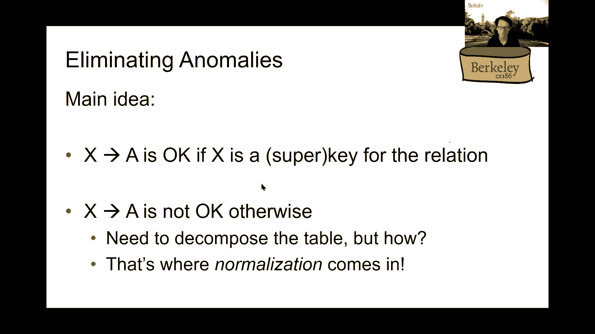

# 课程20：数据库设计 - 函数依赖与规范化 🗃️

在本节课中，我们将学习如何将概念性的实体关系（ER）模型转化为具体的关系模式，并探讨如何通过函数依赖和规范化理论来优化数据库设计，以消除冗余和更新异常。

---

## 从ER模型到关系模式

上一节我们介绍了ER模型的设计原则。本节中，我们来看看如何将设计好的ER图转化为实际的关系模式。


将ER图转化为关系模式需要处理不同的情况。以下是一些核心的转换规则：

### 1. 实体集的转换
一个具有属性的实体集可以直接转换为一个关系。实体的主键成为关系的主键。
```sql
CREATE TABLE Product (
    product_id INT PRIMARY KEY,
    name VARCHAR(255),
    price DECIMAL
);
```

### 2. 关系集的转换
对于连接两个实体集的关系，通常创建一个新的关系表。该表的主键是所连接实体主键的组合。
```sql
CREATE TABLE Ships (
    order_id INT,
    shipper_name VARCHAR(255),
    PRIMARY KEY (order_id, shipper_name),
    FOREIGN KEY (order_id) REFERENCES Orders(order_id),
    FOREIGN KEY (shipper_name) REFERENCES Shippers(name)
);
```

### 3. 处理约束：一对一与一对多
对于“每个部门至多有一个经理”这类一对多关系，有两种建模方法：
*   方法一：创建独立的`Manages`关系表，使用`dept_id`作为主键。
*   方法二：将部门信息与经理信息合并到一张表中，并包含一个指向员工的外键。

选择哪种方法取决于具体的应用场景和查询需求。

### 4. 处理子类（继承）
对于具有继承层次的实体（如`Product`是`SoftwareProduct`和`EducationalProduct`的父类），一种常见的方法是采用“每个实体一张表”的策略。
```sql
CREATE TABLE Product (name VARCHAR(255) PRIMARY KEY, price DECIMAL);
CREATE TABLE SoftwareProduct (name VARCHAR(255) PRIMARY KEY, platform VARCHAR(255), FOREIGN KEY (name) REFERENCES Product(name));
CREATE TABLE EducationalProduct (name VARCHAR(255) PRIMARY KEY, subject VARCHAR(255), FOREIGN KEY (name) REFERENCES Product(name));
```

### 5. 处理弱实体
弱实体（如`Dependent`依赖于`Employee`）必须与所有者实体的主键结合才能唯一标识。在转换时，弱实体关系的主键是所有者实体主键与弱实体部分键的组合。
```sql
CREATE TABLE Dependents (
    essn INT,
    dependent_name VARCHAR(255),
    PRIMARY KEY (essn, dependent_name),
    FOREIGN KEY (essn) REFERENCES Employees(ssn) ON DELETE CASCADE
);
```
注意外键约束中的`ON DELETE CASCADE`，它确保了当员工被删除时，其所有家属信息也会被自动删除。

---

## 模式细化与函数依赖

将ER图转化为初始关系模式后，我们可能发现设计存在冗余或异常。本节中，我们引入函数依赖的概念，作为分析和改进模式设计的工具。

### 什么是函数依赖？
函数依赖描述了关系中属性之间的约束关系。如果知道一组属性`A`的值，就能唯一确定另一组属性`B`的值，则称`B`函数依赖于`A`，记作 **A → B**。

**公式定义**：对于关系R中的任意两个元组t1和t2，如果 `t1[A] = t2[A]`，则必有 `t1[B] = t2[B]`。

### 函数依赖的推理：阿姆斯特朗公理
给定一组已知的函数依赖，我们可以推导出其他隐含的依赖。阿姆斯特朗公理是推理的基础：
1.  **自反律**：若Y ⊆ X，则 **X → Y**。
2.  **增广律**：若 **X → Y**，则 **XZ → YZ**。
3.  **传递律**：若 **X → Y** 且 **Y → Z**，则 **X → Z**。

### 属性的闭包与超键
*   **属性集闭包**：在给定函数依赖集F下，属性集X的闭包 `X+` 是所有能由X推导出的属性集合。
*   **超键**：如果属性集K的闭包包含了关系的所有属性，则K是一个超键。
*   **候选键**：最小的超键（即其任何真子集都不是超键）。

---

## 规范化：BCNF范式

为了系统地消除冗余和异常，我们使用规范化理论。本节重点介绍最常用的Boyce-Codd范式（BCNF）。


### BCNF的定义
一个关系模式R属于BCNF，当且仅当对于其每一个**非平凡**的函数依赖 **X → Y**，**X都是R的一个超键**。
*   “非平凡”指Y不是X的子集。

### BCNF分解算法
如果一个模式不属于BCNF，我们可以通过以下步骤将其分解：
1.  找出一个违反BCNF的非平凡函数依赖 **X → Y**（即X不是超键）。
2.  将原关系R分解为两个关系：
    *   R1 = X ∪ Y
    *   R2 = R - Y
3.  检查R1和R2是否满足BCNF，若不满足，则递归分解。

**关键启发式**：在分解时，尽量让函数依赖的右边（Y）包含尽可能多的属性，这有助于减少不必要的分解步骤。

### BCNF分解示例
假设有关系 `StuInfo(SID, name, phone, city)`，存在函数依赖 `SID → city`，但`SID`不是超键（因为它不决定`phone`）。
1.  它违反了BCNF。
2.  将其分解为：
    *   R1(SID, city)
    *   R2(SID, name, phone)
3.  检查R1和R2，现在它们都满足BCNF条件。




---


## 总结

本节课中我们一起学习了数据库设计的关键步骤。
1.  我们首先回顾了如何将ER模型转化为关系模式，并处理了实体、关系、约束、子类和弱实体等不同情况。
2.  接着，我们引入了**函数依赖**的概念，用于描述数据间的内在约束，并学习了通过阿姆斯特朗公理进行推理，以及如何计算属性闭包和超键。
3.  最后，我们探讨了**规范化**的核心目标——消除冗余和异常，并详细讲解了**BCNF范式**的定义及其分解算法。一个好的BCNF设计能确保数据一致性，并简化更新操作。


通过结合ER建模的直观性与规范化理论的严谨性，我们可以设计出既符合业务需求又高效稳健的数据库模式。