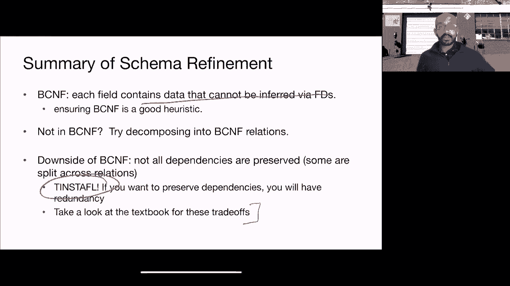
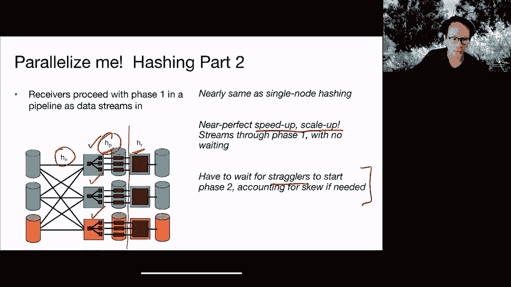

# P21：Lecture 21 Parallel Query Processing - ___main___ - BV1cL411t7Fz

可以走了，好的，所有的权利，欢迎回来乡亲们，我们正在完成关于数据库设计的讨论，之后我们将继续讨论其他话题，好的，所以这里我们谈论的是BCNF，这是一种正常化的形式，所以如果你还记得。规范化基本上用于获取模式，然后把它铸造成一种在某种意义上更好的形式，所以通常这涉及到试图尽可能地消除冗余，从而消除这些更新和删除异常，所以我们说我们将专注于语音代码的正常形式，也就是BCNF，嗯。这是迄今为止关系和模式规范化的最流行的方法，所以男孩代码正常形式规则，基本上说一个给定的关系是语音代码的正常形式，当且仅当对于每个非平凡的函数依赖，嗯a到a n意味着b或决定b。从1到n需要是关系的超级键，所以如果这个对每一个非琐碎的功能依赖都成立，则r在BCNF中，那么什么是一个非琐碎的函数，非平凡函数依赖，因此，一个非平凡的函数依赖是一个，其中右手边不是左手边的子集，好的。

所以这是一个功能依赖，实际上很有趣，对呀，这不是一个微不足道的功能依赖，所以这条规则基本上是说，每当我们中的一组属性确定另一个属性时，然后它需要确定所有的属性，好的，所以规则是这么说的。那么为什么这个规则有意义呢，所以想象一下，如果你有一个以b为键的关系abc和一个函数依赖项，它是一个，所以这是一个非琐碎的函数依赖关系，对呀，呃，这是一个有趣的函数依赖关系，因为右手边不是左手边的子集。左手边也不是超级钥匙，对呀，它并不决定所有的属性，所以这是一个非平凡的函数依赖关系，所以这个关系r不在BCNN中，然后嗯，我们不希望这个关系R是这样的原因，我们想要分解它是因为C被重复了多次，呃。B还可以，所以A是A是确定的，c由，但是对于给定的A与之相关联的每一个B，c的值正在重复，好的，所以有很多冗余，所以我们看到了这个例子，假设这是一个依赖项，ssn暗示或确定名称，嗯，在这种情况下。

左手边不是，呃，超级钥匙，因为它不确定电话号码，嗯，所以它并不决定所有的属性，因此这不在BCNF中，因为他们有你有这个违反的函数依赖，所以你可以把它分解成两个关系，现在在BCNF，好的，因此。唯一相关的功能依赖关系是S，并暗示名称，左边的SSN是这个关系的超级键，好的，所以现在它在BCNF，因此BCNF分解算法如下所示，我们要谈谈直觉，在我们描述了一些示例之后，我们将讨论形式化算法。因此方法如下，我们首先找到一个违反BCNF的函数依赖项，好的，然后我们将以这样的方式使用这个函数依赖项，所以我可以引用的b1到bm是尽可能大的，所以我们将扩展这个，这样它就涉及了由一个通过一个，n。好的，这就是我们将要处理的函数依赖关系，我们将使用这样一个功能依赖的原因将变得显而易见，呃，后来，在高级别，如果你现在想要一个理由作为挑逗，它基本上有助于避免不必要的细粒分解，好的。

所以一旦你有了这个违反的函数依赖关系，右手边尽可能大的地方，然后你把它分解成两个关系，第一和第二，其中r一包含a和b，就是这样，R2包含A和原始关系中存在的其他一切，好的，所以蜜蜂不在R2中，所以。r 1和r 2在a上重叠，所以AS在这两个关系中都存在，这有助于将r 1和r 2的元组关联在一起，好的，这样你就可以，呃，重建原来的关系，所以让我们举一个例子，所以假设我有一个呃亲戚的名字ssn年龄。呃我的颜色和电话号码，我有一个函数依赖项，它是sn意味着名字、年龄和眼睛的颜色，现在的问题是这是在BCNF，所以有什么想法这是不是NBC它，对呀，它不在BCNF中，因为即使上升确实意味着名字。年龄与眼睛颜色，这并不意味着电话号码，所以左手边不是超级钥匙，嗯，所以我们可以把它分解成两个关系，一个与人相对应，一个是SSN名字、年龄和眼睛颜色，第二个对应SSN和电话号码，这两个重叠。

所以你可以在我们的维恩图中再想象一次，SSN在这里，电话号码在这里，然后命名，和眼睛的颜色都在这里，所以你有SSN在两种关系中都存在，这样您就可以很容易地将两个关系之间的元组关联起来。让我们举一个稍微复杂一点的例子，所以在本例中，我有两个功能依赖项，函数依赖关系1和函数依赖关系2，也就是，呃，SSN姓名年龄，眼睛颜色，sn表示姓名、年龄和眼睛颜色，和函数依赖关系二。这是年龄暗示或年龄决定选秀到有价值，这基本上是说这个人有资格参加选秀，对呀，呃，在军队里，好的，所以现在有了这两个函数依赖项，这个是不是BCF，所以再一次，这不在BCNF中，原因与上一个相同，嗯，这里。ssn，让我们以第一个函数依赖项为例，ssn意味着名称，年龄，和我的颜色，好的，那么什么是SSN的闭包呢，记住关闭，这是阿尔文提出的一个概念，呃，在上一堂课里，那么决定的属性集是什么，正如尼古拉斯所说。

它的名字H眼睛的颜色和草稿值得权利，所以不仅仅是名字、眼睛的颜色和SSN，所以sn加基本上就是，所以我将直观地用于我的，所以首先请注意，这并不是所有的属性，对呀，所以它错过了电话号码。所以SSN不是超级密钥，因为SSN不是超级密钥，这是一个违反函数的依赖关系，好的，因此，为了使用这个违反的函数依赖关系进行分解，我要把右手边展开，还包括所有其他相关属性，所以我的右手边是SSN。和草稿值得，我从第二个函数依赖关系中得到了一个传递属性，对呀，记住阿姆斯特朗的公理，呃，阿尔文介绍，好的，所以现在我将使用这个函数依赖来进行分解，我将从中得到什么两种关系，所以要记住，这些是我的is。这些是我从上一张幻灯片中得到的be，那么为什么ssn加包括sn，所以ssn加是sn右的闭包，所以基本上是由n决定的所有属性，所以sn，这决定了自己，我们怎么，我如何使用这个函数依赖项来分解。

使用UM BCNF规则，嗯，我走左手边，它是一个，所以再次记住，我有我的维恩图，哎呀，我想要这个，好的，我的维恩图，其他一切，其他，好的，所以呃，其他井里有什么，唯一剩下的就是电话号码了。这里的a是作为n的单个属性，B是这里的一切，好的，所以我要把它分解为两个关系，一个对应SSN然后是电话号码，一个对应S和姓名，所以现在我有了这两个关系，我们完成了吗，这两个关系现在在嗯BCNF吗。还是需要进一步分解，纳撒尼尔说它在BCNF，任何人都有不同的意见，沃伦说英尺二怎么样，对了，英尺二，这意味着草案仍然是一个函数依赖项，这个特定的函数依赖性实际上导致了第二个关系的冲突。用我们看到的规则看左手边，看看左手边是不是这个关系的超级键，给定这个关系，即后面的代理出现的地方，嗯，左手边的年龄不是一个超级键，对吧，它只决定草案本身的价值，这是它唯一决定的事情。

所以我们必须使用第二个函数依赖项进行分解，以便使用第二个函数依赖项分解，我将再次遵循同样的程序，我要去找，呃，我将展开这个函数依赖关系的右手边，尽可能的，在这种情况下。我不能把它扩大到比草稿本身更有价值的程度，对吗，所以我唯一的年龄决定了我是否值得征兵，就是这样，所以我要做的是把这个关系，这是不在BCNF中的关系，并将其分解成两个关系，好的，所以第一个关系是年龄。然后抽到有价值的，第二个关系是年龄，其他一切都对，所以那是SSN，和眼睛的颜色，好的，所以这已经被这两个关系所取代，所以我有关系，左二，然后R三，所以这是我留下的三个关系，在这一点上。没有其他功能依赖关系，我需要检查这三个关系，嗯，所以这三个关系现在在BCNF中，好的，您可以返回并检查函数是否依赖于1，或者函数依赖关系二仍然可能违反这三个关系，但我可以告诉你事实并非如此。

这就是你的结局，你，最后有这三个关系，通过简单地遵循这个过程来查找违反的函数依赖项，尽可能地扩展右手边，用它来分割关系，嗯，进入两个关系，并继续这样做，呃，我们为什么要移除。删除DF并创建公正年龄和DF的新关系，是呀，所以基本上我们去掉了草稿，因为征兵制意味着，呃，或由h确定，是的，因为选秀资格是由年龄决定的，嗯，我不希望每个年龄值都重复这种情况，对，否则就是冗余。所以我把年龄和征兵价值拿出来，把它放在一个单独的关系中，这就是我在第二步中所做的，我知道这是一个抽象的例子，但为了年龄而有一个完全不同的关系感觉有点傻。和选秀价值如果你能通过一个简单的年龄函数来确定选秀价值，所以现在在这个特殊的情况下，是呀，也许不值得征兵，嗯是年龄的函数，而不是年龄决定征兵价值的一对价值观，在这种情况下你可能根本不想实现草案价值。

但至少在我们的例子中，草案价值是这种关系的一个属性，在这种情况下，把年龄和征兵分开当然是有意义的，因为否则每一个年龄值的草稿都会重复，所以想象一下，如果你有一百万个人，嗯。他们中的许多人现在都有相同的年龄，该属性将被重复为每一个唯一的，h，好的，关于这个还有什么问题吗，我在聊天中看到一些其他问题，但我想其他人会处理他们，好的，所以回顾一下FD 1和2暗示了这一点。那是第一步，所以这是一个违规的函数依赖，我们使用，我们就这样分开了，我们得到了这两个关系，我们得到了这三个关系，好吧，现在作为家庭作业，只是为了说服自己，嗯，你明白这一点。我可能建议你尝试从第二个功能依赖开始，它是原始关系的违反函数依赖项，然后看看你最终是否会得到同样的结果，好的，所以在这个特殊的情况下，你会得到同样的结果，在其他情况下，你可能不会，所以这就是呃。

那是你在家试试的东西，好吧那么嗯，我再跳过这个例子，我让你回家试试，然后我会进入决赛，嗯其实，我将讨论两个属性关系，但在我到达，呃算法，好的，假设我有一个只包含两个属性的关系r，a和b。现在我的主张是R在BCNF中，好的，所以我们有几个案例要考虑，如果您没有任何功能依赖项，所以A不意味着B，B也不意味着A，那我们就做对了，呃，对呀，因为没有违反函数依赖关系，现在让我们考虑另外三个案例。要么a意味着b，但b并不意味着a，b意味着a，但a并不意味着b，或a意味着b，和b意味着a，所以，让我们试着证明，在所有这些情况下，最终都是在BCNF，所以假设a暗示b为真，但是B暗示A不是真的。现在a意味着b，这是这里唯一不违反pcnf的有效函数依赖项，然后嗯，它不违反BCS的原因，是因为左手边现在是一个超级键，因为a意味着b和呃，a和b共同构成了这个关系的所有属性，对呀。

所以这不是一个违反函数的依赖关系，所以在这种情况下，你没有违反BCNF，因此rnbcnf这种情况是对称的，所以b暗示a为真，A暗示B又不是真的，它是对称的，你现在没有违反PCF，如果a暗示b为真。而b意味着a为真，A和B都是键，嗯，我们的候选人钥匙，它们都暗示了关系的所有属性，因此，这两个函数中的任何一个都不依赖于b、c、f，所以这里有趣的是，如果你有一个两个属性的关系。基本上这种关系是在BCNF中，所以现在这也给了我们一个终止程序，如果你最终得到一个只有两个属性的关系，你知道那是在BCNF，你不需要再往前走了，好的，所以让我们嗯，让我们来谈谈整体算法。所以你有一个输入关系r，您有一组功能依赖关系s over r um，您检查r是否在BCNF中，如果不在，那么你就知道有一个违反的函数依赖f um，A意味着B，其中A和B是属性集，计算左手边的闭包。

这是一个加分项，然后你创建一个关系，它基本上是一个闭包中的所有这些属性，所以A加和R2是并集R减去A加，所以你扔掉r中所有的加号，但是加回一个，你再加上一个，这样你就可以在维恩图中有这个重叠，对呀。所以你把a加回去，这就是你剩下的r 2，然后你计算，呃，分别在r 1和r 2上的函数依赖关系，使用原始关系r和原始函数依赖集s，然后你重复R1和R2的过程，你检查R 1和R 2是否在BCNF中。当所有关系都在BCNF中或，呃，两个属性关系，在这种情况下，你知道他们是，所以这是整个算法，嗯现在，嗯，你可能会想的一个问题是，这种分解是唯一的，对呀，你有没有在一个场景中结束，其中。应用这些相互冲突的功能依赖关系的顺序可能导致不同的结果，事实证明这是真的，我是说你最终可能会有多个，您最终可能会得到不同的解决方案，取决于您选择首先应用的函数依赖项，所以考虑这个例子，好的，所以你有r。

它有n个网络ID和电话，呃，您有一个函数依赖项，即sn意味着net id，另一个函数依赖，即网络ID意味着呃，ssn，所以这两个关系的左手边都是一个超级键，不是超级钥匙吧，所以说。因为还有另一个属性电话，不是由SSN或内阁ID决定的，所以这两个都不是侵犯对不起，这两者都违反了函数依赖关系，所以用这个，你们能告诉我，你可以得到两种不同的BC NFT分解，对于这个关系。假设我从函数依赖开始，一右，这是一个违反函数的依赖关系，我由此产生的关系会是什么样子，SSN和网络ID、SSN和电话完全正确，所以如果你使用依赖函数一，您得到ssn和net id。如果使用函数依赖关系二，正如尼古拉斯所说，呃，您将有网络ID和SSN，作为第一个关系和网络ID，电话号码是第二个关系，好的，所以这当然不是唯一的，所以对于BCNF有两种不同的解决方案。

现在我知道我不需要再往前走了，因为这都是两个属性关系，没错。所以，我不需要再分解了，我受够了，我知道两个属性关系是nbcnf。好的，那么BCNF给了我们什么？BCNF的作用是消除某些类型的冗余。所以，它基本上消除了冗余类型，哪里啊，本质上是由功能依赖关系所暗示的。所以，如果您有，嗯，a意味着b，这意味着如果您将A和B放在一起，并与关系中的其他属性一起使用，那么对其他每个属性都会重复B的值。因此，BCNF去除了这些类型的冗余。所以，对于冗余的类型，BCNF并没有完全消除，比如说，那些被称为多值冗余的，我鼓励您查看教科书。还有其他类型的冗余BCNF无法处理，事实上，其他类型的依赖关系也存在。您需要对这些随机状态进行推理，这就是所谓的多值依赖关系。再说一遍，查看教科书，如果您有兴趣。所以，BCNF还有一个不错的属性，那就是避免任何信息丢失，没错。所以，呃，基本上是无损分解，您可以重建最初的关系。

所以，让我们假设，我将关系r分解为，第一和第二，分别包含a b和b c，我将如何用r 1和r 2重构？有任何想法吗？我会做一个自然连接。对，我会在B上做自然连接，这正是这两个关系重叠的地方。这样我就可以对共同的属性进行连接。好的，所以这就是为什么我在这两个关系中都有这些共同的属性，这样我就可以做自然连接，然后重构原始关系。好的，这一论点的证明可以在教科书中找到。但总体来说，我想让你记住的事实是，这是一个无损分解算法。好的，现在有一个问题，我们能作弊吗？我们看到了两个属性关系r nbcnf。那么，为什么不将任何关系r分解为两个属性关系，同时确保它们之间有一些重叠，这样我们就可以进行连接，然后就解决问题了？为什么我们要费力去找BCNF的违规行为，为什么我们要做这种功能依赖的废话，为什么我们不能像分解成两个属性关系那样就行了。

事实证明，这种方法会导致信息丢失。所以，如果你不小心通过识别违反的功能依赖关系并使用它们进行分解，您最终会出现信息丢失的情况。让我们举个例子，假设我使用关系r，它具有属性a b和c，然后我随意将它分解为两个关系，b和b c。好的，所以我取了关系R，将关系r 1和r 2分解为2 1有a b，另一个有b c。那么我如何进行分解呢？基本上，我，这本质上是一个投影操作。所以，我有这个关系r，我有这个包含a和b的关系r 1，这个关系r 2包含b和c。如果我在r 1和r 2之间做一个自然连接，我基本上会得到R的超集，最终会得到一些在原始关系中不存在的假元组。所以，总的来说，如果我只是说嘿，让我将这组属性分解，然后把它分成两个不太有用的属性关系，实际上您必须遵循BCNF概述的严格程序，嗯，要正确地做到这一点，这样您就不会得到假的元组，并保持无损。好的。

所以这必须是一个无损的过程。总结一下，呃，总的来说，BCNF，呃，基本上确保每个字段包含的数据不能通过功能依赖关系推断出来，嗯，因此没有冗余。或者至少没有来自功能依赖的某些类型的冗余，所以将模式输入BCNF实际上是一个很好的启发式方法，确保您的架构是良好的。因此，如果您不在BCNF，您基本上需要尝试将其分解为BCNF关系。现在，BCNF的一个缺点是，并不是所有依赖关系都能被保留。好的，所以有些依赖关系，一些功能依赖实际上可能会在关系中拆分，为什么这是一个问题？这是个问题，因为执行这些功能依赖关系变得很有挑战性，对吧？因此，实际上很难强制执行这些功能依赖关系，如果函数依赖关系中引用的属性在关系中拆分的话。因此，很难执行。现在，这是阿尔文最喜欢的原则的另一种情况，瘦员工，嗯。所以，基本上你知道，这里没有免费的午餐，没错，因此。

如果您想保留依赖项，那么最终您会遇到冗余；如果您不想裁员，就无法保留所有依赖项。所以，如果您想理解这些权衡，我鼓励您参考教科书。好的，看起来有一些，呃，关于这个问题的问题，所以尼古拉斯问。我认为只有在您有大量元组样本时，运行BCNF分解才有意义，没错，否则，您最终会得到一堆不太有用的推断函数依赖项。因此，功能依赖关系是正确的，从某种意义上讲，这已经为您的应用程序解决了问题。嗯。您基本上是在运行BCNF之前，呃，添加数据。所以您基本上是在提前运行它，预计您最终可能会有一个相当大的关系，您可能必须处理应用程序级别的冗余，前提是您不小心，没错。所以，您基本上是在提前处理。您计划在哪里将其分解为良好的关系，并且用于应用程序，BC和F如何影响性能？好问题，对吧？所以，呃，就像阿尔文提到的，加入是不免费的，没错。所以，BCNF和分解的一个缺点是，您基本上必须做这些自然连接。

因此，当您试图为查询提供服务时，这会增加性能成本。所以，不做正常化可能有其他很好的理由，即如果您总是查询关系的所有属性，您可能更愿意将所有这些属性放在一起，即使现在以裁员为代价。如果你有冗余，那么您必须以某种方式处理应用程序中的冗余，确保所有副本的相同属性值相互同步。所以，这是您必须支付的代价，如果您想要在不关节化的情况下获得性能好处。所以，这是空间和性能的权衡，没错。这是一个很好的思考方式。所以，我称之为杰瑞的观点，但同时不仅仅是空间，没错，这也是必须处理冗余的开销，事实上，如果您不小心，可能会出现异常现象悄然而至。如果没有其他问题，好的，您看，嗯，让我进入下一个话题。

然后呢，它是平行的，呃，查询处理。

阿尔文，我应该，呃，我们应该，我们现在该休息一下吗？还是我们应该在十五分钟内完成？不管怎样，我是说，你们觉得，十五分钟，好的，所有的权利，并行查询处理。那么，嗯，让我给你一点，让我从。应该完全改变话题，没错，所以我们要从数据库设计回到数据库内部，对吧？我们是在上一节课上讲到的，如果您试图规划如何为应用程序构建数据库，您会怎么做？现在我们回到数据库系统开发人员，思考如何进行查询处理和优化，尤其是当您拥有大量比过去考虑的更多的资源时。所以，让我们从一点历史开始，没错。二十世纪70年代，传统的查询处理概念涉及，嗯，基本上是一台机器。对。我们20世纪70年代引入了元组集合上的声明性查询概念，是的，它成功地引入了物理数据独立性、逻辑数据独立性，以及数据库系统能够透明地优化查询的事实，从而支持高效的最终用户访问权限。

因此，最终用户提供SQL，系统为您优化，但这一切都集中在一台机器上。现在在20世纪80年代，人们意识到通过利用并行性可以加速这些过程，因此在20世纪80年代，出现了并行关系数据库系统。这个想法基本上是通过并行处理SQL查询来加速执行，使查询运行得更快。这些并行关系数据库系统通常采用多台商品机器，往往是几十台，并利用它们来处理SQL查询的任务。即使从商业角度来看，也有一些初创公司和企业成功地实现了并行数据库系统。到了2000年，平行化的概念在像MapReduce和Spark这样的系统中重新焕发活力，这也标志着大数据时代的到来，许多人认为这个大数据时代一直持续到今天。所以，计算资源从少量商品机器的配置，转变为可能成千上万台机器，甚至更远的地方。

并且能够支持并行查询处理。那么，为什么并行性是个好主意呢？让我们从扫描一个关系开始，假设它有100TB的数据。如果你假设磁盘的读取速度是每秒半千兆字节，那么扫描100TB大约需要两天时间，甚至可能稍长一点。所以，Gab提供了更多的上下文来支持这一点，嗯，在幻灯片中，所以我鼓励你查看他的背景。好的，如果你尝试用传统的磁盘扫描，这大约需要两天的时间，这就像用一根吸管喝水一样，需要很长时间。但如果你有多台机器，就像同时用很多根吸管喝水一样。基本上，它允许你并行地处理任务，假设你有100台机器，且每台机器的读取速率相同，每秒半千兆字节。那么，扫描的时间将缩短到3到4分钟，显著提升了处理速度，从两天缩短到3到4分钟。

这里的关键是并行化将一个大问题分解为许多小问题，并使这些小问题尽可能独立，这样它们就能独立运行，不需要相互协调。任何不必要的协调都会影响效率，所以你希望这些任务尽量独立，每个任务按照自己的节奏前进。幸运的是，大多数关系运算符实现可以独立并行运行，这样就减少了协调的需求，因此平行化处理得以顺利进行。在并行查询处理中，我们关心的一个主要指标是吞吐量，即每秒处理的事务数。以前我们可能把它定义为每秒查询数，但现在你可以理解为每秒的事务数。加速是我们关注的另一个重要指标，它衡量随着硬件资源增加，处理速度提升的程度。

所以，加速的概念是，如果你增加硬件资源，假设增加机器数量，而工作负载保持不变，那么吞吐量将如何变化？这里，你希望随着硬件的增加，吞吐量也线性增长。通常情况下，尽管你可能无法达到理想的情况。另一个重要指标是扩展性，这描述了在增加硬件和工作负载的同时，系统的表现如何。如果你增加数据量，你希望吞吐量保持不变，因为你同时增加了数据大小和计算任务。在理想情况下，平行处理应该是线性的，但实际情况是，随着系统扩展，可能会出现性能下降。所以，在任何数据处理系统中，我们关心的两个关键指标是加速和扩展性。为了实现并行性，关系数据库有两种主要的并行性类型：管道并行性和分区并行性。管道并行性根据操作符的数量对操作过程进行扩展。

此外，在迭代器模型中，流水线操作是非常自然的。因此，你有这些单独的操作符来处理数据元组，且可以并行执行这些任务。另一个优势是，所有的并行化处理可以在后台进行，用户无需意识到并行化的存在。你可以随时更改任务的并行策略和硬件配置，而用户看不到这些变化。至于并行性，它不必是关系运算符，也可以是任何数据流操作符。在每个操作符上顺序执行时，你可以将多个操作符并行化执行。就像把水倒进吸管一样，多个吸管同时工作可以加速处理。

这就是分区并行性，基本上是将任务扩展到数据量上，管道并行性则是基于管道的深度进行扩展。你可以将管道并行性与分区并行性结合使用，稍后我们将在关系查询处理的上下文中深入讨论这两种类型的并行性。管道并行性和分区并行性在数据流处理的背景下尤其重要，尤其是在数据库领域。首先，你需要处理大量的数据，并且需要可并行化的运算符。在数据流范式中，你基本上是在尝试对数据集应用批处理操作。你有算法和操作符的物理实现，通常采取的是分而治之的策略，随后我们会探讨这些算法的一些实例。

这些优化不改变用户实际想做的事情。SQL查询不需要做任何修改，这是数据物理独立性的体现。因此，SQL查询的处理方法和硬件可以改变，但对用户而言是透明的。我们将讨论的一些概念，源自80年代的并行数据库系统，它们中的许多理念和技术在2000年的大数据系统背景下被重新审视。我们之所以转向并行数据库系统，并不是随便选择的。到目前为止，你们已经掌握了单节点数据库的知识，所以我们决定继续深入并行数据库的讨论，帮助大家理解更复杂的查询处理系统。

如何运行查询运算符，即使是现在，当您知道如何正确地设计模式时，这样它们就可以方便地有效地完成这些查询操作，所以在这一点上你应该会觉得出去很舒服，就像你在编写运行在单个节点数据库上的应用程序一样。我想现在你们都应该是专家了，所以我们现在转向并行处理的原因，是因为那基本上是下一个前沿，对呀，所以我们基本上覆盖了单个节点的所有内容，所以我们现在需要覆盖的剩下的东西基本上是发生的事情，当我们试图运行。呃，跨多台机器的数据库，以及当我们试图在多台机器上运行事务时，事务处理会发生什么，所以信不信由你，这基本上是我们本学期剩下的两个主题，除了说没有续集，这本身就像是一个话题。但我只想向你们解释为什么我们要组织课程结构，呃，这边，这不是偶然的，基本上也是因为我们想折磨你，否，我开玩笑的，是的，是的，所以当我们平行讨论时，你们基本上会看到，呃，这在本主题中。

在下一个交易主题中，同样的内容会再次出现，对呀，基本上很好，你怎么，我们怎么数，iOS右，当我们试图并行运行事务时，我们最喜欢的区域会发生什么，对呀，和所有其他像你知道的，当我们试图运行，是的，是的。我知道，对呀，会很头疼的，但就像，你知道，嗯，这基本上就是我们所看到的，当我们试图，当我们试图并行运行事务时，好的，回到你的，太厉害了，有什么问题吗？我认为这是有价值的背景，谢谢，我会的，好的。否则我会分享屏幕，让我们看看，先暂停录音，是的，是的，让我们暂停录音，好的，还有什么问题吗，呃，好的，所有的权利，嗯，所以在如何使用并行查询处理技术方面，嗯在历史上，在许多场景中。已经探索了这些并行查询处理技术，这是人们研究并行化的三个主要架构，一种方法是使用共享内存和共享磁盘，它基本上被称为共享内存，嗯，所以这基本上类似于现代计算机，对，所以如果你用的是笔记本电脑。

你的笔记本电脑可能有多个内核，有点像这样，但在过去这更像是一种奢侈，共享RAM和磁盘的多处理器，所以这是一个在过去被检查过的环境，另一个设置是，基本上每个处理器都有自己的RAM，但是磁盘是共享的。这通常是某种网络磁盘或网络文件系统，它在所有这些类型的，呃，流程，最后，你基本上有了什么都不共享的机器，所以你在这里有一个互连，呃，这些机器可以交换消息，但基本上每台机器都有自己的内存和磁盘。所以这就是本质上所说的集群权利，所以你有这三种类型的架构，嗯，可以在技术上用于支持查询处理期间的并行化，在我们的焦点中上课，我们将专注于无共享架构，我们关注无共享架构的原因是，一开始它是最常见的建筑。所以它不仅在数据库社区中使用，在数据库社区中成为胜利者，尽管关于应该使用哪种架构有很多争论，但它也是其他数据处理应用中使用的东西，所以网络搜索，大数据机器学习系统，这一切都是围绕着这个共同的东西建立的。

嗯，每台机器都有自己的内存和磁盘，你可以做的另一件好事是分享什么都没有的故事，您不需要依赖自定义硬件，基本上每台机器都可以在商品硬件上，所以你只需要弄清楚如何将这些机器连接在一起，然后你呃。基本上有您的并行设置，另一件事是你基本上嗯，用数据权放大，因此，如果您需要处理越来越大的数据集，你只是不断地把越来越多的机器，网络上的商品机，对呀，这就是你所需要做的，您不需要依赖一些自定义硬件。您不需要确保自定义的硬件，假设它是共享内存或共享磁盘，所以你不需要担心这个，你基本上只是不断地增加更多的机器，这就是你所需要做的，它不依赖硬件来解决并行化的问题，基本上你只需要添加更多的机器，呃。如果您需要更多的并行化，所以既然它也不依赖硬件来解决问题，这是一个很好的起点，让我们理解并行化背后的原理，这也将概括到场景，其中具有具有某些更改的共享内存或共享磁盘，当然啦，所以就呃而言。

在关系数据库上下文中，有各种各样的平行，嗯都在里面，呃，跨查询和在单个查询中，好的，所以让我们从讨论跨查询的并行性开始，所以这是内部查询，内部手段跨内部手段的平行性，我们会谈谈差异，呃，内部和内部。因此，查询间的并行性基本上是跨查询的并行性，您希望同时支持多个查询，每个查询都在单独的处理器上运行，在Interquery场景中，您不需要输入，您有一个用于查询的线程，所以这里不需要平行，但您确实需要。因为您同时运行多个查询，跨越不同进程的UM，你确实需要协调他们的访问权，所以你需要确保一些，有某种形式的并发控制，意识到确保这些查询彼此隔离，嗯，当然啦，如果其中许多只读，我们很容易得到好的性能。如果有一些权利和阅读，然后你需要协调他们的访问，随后我们将讨论某种并行感知并发控制方法，所以这是inter查询，所以跨查询，现在也是查询内并行，因此，如果它是内部查询，也是在单个查询中。

有各种平行的味道，因此存在操作符间的并行性，所以运算符之间的并行性，呃，其中一个例子是管道并行性，在关系数据库上下文中，您有不同的运算符，这些运算符基本上是在查询计划中串在一起的。相同的元组将在管道中由不同的运算符处理，对呀，所以这是运算符之间的不同运算符，以操作符间的方式存在并行性，这里的另一个平行概念，这也是内部运算符来自于采取一个逻辑计划，并将其转化为物理计划。假设你在这里有一个浓密的联合方法，我们没有那么关注，但让我们忍耐一下，我们将讨论一个例子，说明为什么并行性在这里可能会有所帮助，所以假设我有这个，这个合乎逻辑的计划，我把它转化为这个物理计划。我基本上把这个子树，然后实现结果，获取此子树，然后实现结果，然后在这个场景中做了一个连接，我可以有这个子树，物化和这个子树，以及在数据权的不同子集上同时发生的物化，这就是所谓的浓密并行性或树并行性。

其中不同的子树相互并行运行，所以管道并行度基本上是一样的，以不同或不同的方式处理元组集，呃序列，呃，穿过管道，所以说，比如说，一个运算符可以对元组三进行操作，元组四，而第一个运算符仍在元组一，对呀。所以这是管道级别的并行性，灌木树的并行性基本上是在可能的情况下运作的，完全不同的数据子集，不同的子树对不同的数据子集进行操作，不同的是，这些是计划的不同组成部分，在不同的数据子集上并行进行，因此。这是两种类型的内部运算符查询内并行性，您还可以具有运算符内并行性，同样，我们仍然处于内部查询设置中，所以这是运算符内的并行性，它在单个运算符内，所以我们这样做的方式。如果你回忆起几张幻灯片之前是使用分区并行性，所以你可以有不同的r和s片段，由不同的，而是由不同的操作员扫描然后由不同的操作员加入，都是平行的，好的，因此，相同的操作在不同的数据分区上并行发生。

有各种平行的味道，由关系数据库系统利用，第一个是跨查询，第二个在查询中，在查询中，在运算符中有两种风格，跨运营商，或在一个运营商内部和跨运营商，您有管道并行性和浓密并行性，在操作员内部，您有分区的概念。然后在不同的分区上应用相同的操作，到目前为止还有什么问题吗？让我们来谈谈运算符内的并行性，好的，所以其他运营商，其他类型的并行性要么是简单的，或者我们之前讲过的，就像，比如说。管道并行性基本上只是采用迭代器模型，然后呃，使每个操作符运行，比如说，相互平行，对呀，分区并行性是更棘手的，因为我们必须重新审视运算符的实现，所以让我们来谈谈，呃，分区并行性或运算符内并行性。所以为了支持这个，呃，算子内并行性，我们需要获取数据，然后在机器上进行分区，因此，在机器之间对表进行分区有点像索引，对呀，所以这有点像索引，但在某些情况下，它可能看起来不像索引。

但它基本上给了你索引的同样好处，因此，有三种不同的数据分区的主要方法，这在文献中得到了很好的重视，并被用于系统中，嗯，第一个是基于范围的分区，第二个是基于哈希的分区，第三个是循环赛分区，因此。基于范围的分区将使用您的关系，例如，你可能有，呃，键所在的所有元组，第一个字母是通过，e，呃，到这台机器上，从F到第一个字母的，j来到这台机器前，等等，好的，所以这是一个基于范围的关系分区，呃，到机器。哈希面分区又是什么，你可能期望的，你拿着你的钥匙，然后对其应用哈希函数，基于这个哈希函数，它会被分配到各种机器上，所以这里嗯，我不知道阿尔文可能会被分配到这台机器上。而与Aditya相对应的值可能会分配给这台机器，所以基本上在键上应用哈希函数，然后将其分配给适当的机器，然后你有循环赛，所以循环方法基本上是说当元组进来时，您将其按顺序分配给每台机器，因此。

您将把第一个元组分配给第一台机器，第二台机器的第二个元组，第三台放到第三台机器上，等等，直到你击中所有的机器，然后你回到第一台机器，然后继续这样分配，所以如果你想一下这三者之间的权衡，呃接近最高级别。基于距离的方法，它给你的是一种访问的局部性，对呀，所以所有的，可以在一台机器上找到与给定范围相对应的所有元组，所以它给了你很多地方，从那个角度来看，基于哈希的方法给出了x的一些局部性，但不太对，所以嗯。阿尔文的所有记录都可以在一台机器里找到，我的记录可能在同一台机器中找不到，尽管我们都从一个，我们可能在不同的机器上，因此，使用基于点密钥的访问更容易，呃，基于哈希的，但是如果您想进行基于范围的访问。就更难了，RIN方法给我们的访问位置最少，因为没有保证，哪个元组可能在哪台机器上结束，当元组进入各种机器时，您基本上是在分配元组，所以这是我们可能要担心的第一个方面，第二个方面是负载的平衡，对呀，嗯。

所以基于距离的方法在负载方面给了我们最少的平衡，因为让我们说，比如说，出于某种原因，阿尔文是一个非常受欢迎的名字，好的，嗯，每个人都决定给他们的孩子取名阿尔文，因为他们上了数据库课。阿尔文是个很棒的老师，现在，你有很多记录，去那台机器，嗯，但也许其他一些，呃，其他机器，让我们说，从t到z没有得到那么多正确的记录，因此，没有那么多的平衡对应于基于范围的分区。基于哈希的比基于范围的好一点，但不如基于循环赛的方法，因为基于循环赛的方法给了我们完美的平衡，因为每台机器本质上都有相同数量的记录，对此有什么问题吗，记住这三种架构是很好的，当你考虑各种类型的访问时。你可能想要访问你的数据，以及使用某种类型的分区，哪些类型的访问可能更好，好的，所以在我继续进行各种类型的访问之前，我确实想提一下，没有什么特别的分享，与其他计划比较，因为分享。

没有什么高度依赖网络流量来在机器之间交换数据，所以如果操作本地化到某些节点会更好，最小化此网络流量权，所以选择一个好的分区方法真的很好，那是根据工作量量身定做的，这样你就不会在网络上进行大量的数据传输。你可能想知道的一个问题是，如果我想改进特定机器中的访问，好吧，为此，您当然可以为那台机器建立索引，因此，每个分区仍然可以使用传统的索引，就像每个节点或每台机器上的B加树，这是完全有效的，好的。所以假设我想按钥匙向上看，好的，所以假设我想抬头看，嗯，我不知道，呃，四郎，哪种方案效果最好，将安排基于，工作最好，基于哈希或围绕哈希，基于Robin的方法，尼古拉斯是范围或散列的权利，因此。范围或基于哈希的方法都可以很好地工作，因为我们知道我们只需要去一台机器上检索所有的，呃，她做的数据，对呀，所以按键查找很容易找到范围或基于哈希的回合，基于下降的方法，你不知道哪个机器阴影数据会在哪里。

所以你基本上要看看所有的机器，这就是我将要描述的，因此，如果您的数据作为键的函数进行分区，您只需将查找路由到相关节点，这既适用于基于哈希的分区，也适用于基于范围的分区，相反，我们有基于循环的分区。或者分区发生在不同的属性上，假设它是根据年龄而不是名字划分的，然后我们必须使用广播查找，所以你基本上查看所有的节点来检查，如果他们有这个特殊的记录，插入右边怎么样，所以再一次，插入很简单，呃。如果你能找到一个相关的节点，假设使用哈希或基于范围的分区，您可以将其路由到该节点，否则，在基数计划中的全面下降，您可以路由和插入到任何节点，对呀，所以说，比如说，具有，嗯，到目前为止最少的数据量。您可能希望将插入路由到该节点，只是为了平衡事情，如果您想插入并确保，假设一个主键作为唯一键插入，事情变得有点棘手，因为例如，您的数据在键的函数上进行分区，呃，您可以路由到相关节点并拒绝插入。

如果它已经存在，如果那个密钥已经存在，因此，这适用于基于哈希和范围的分区，否则，如果是在循环赛设置中，或者是对不同属性的分区，你基本上要做广播查找，所以你必须查看所有的节点，嗯收集他们的回应。如果它在任何节点上都不存在，然后你可以把它插入其他地方，如果它存在于某个地方，有些节点有，呃用这把钥匙，那你就得拒绝，这就是查找和插入，扫描怎么样，对呀，所以这个想法是类似的，假设你想并行扫描。然后连接输出以合并来自这些机器的输出，你基本上可以申请，呃，选择谓词，当您进行这些扫描以跳过一些没有元组的节点时，满足谓词权的，这只起作用，如果您正在应用某种范围的基于哈希的分区。关于此谓词中涉及的属性，如果相反，您正在使用基于循环的分区，或者你不是在做分区，在谓词中涉及的任何属性上，那你就倒霉了，你基本上必须查看所有你没有从中受益的网站，好吧，那么散列呢，好的，我要介绍哈希。

然后阿尔文将用它来推广到各种运算符实现，好吧，所以他会谈论，呃，排序和排序，合并和连接算法，所有这些所以请记住我们有一个散列方法涉及多个阶段，嗯，所以在这种情况下，哈希方法实际上非常简单。你基本上有一个首字母，呃，在不同的哈希函数上哈希的洗牌阶段，其后，每台机器独立于其他机器运行，好的，第一阶段的前期基本上是将数据流到网络上，以及基于某种哈希函数的数据洗牌，`h n`，确保。所有对应于给定哈希值的元组到达给定节点，一次每一个的所有元组，呃，每个哈希值都到达一个特定的节点，那么这些节点中的每一个都可以相互并行地进行，这个的好处是，当你读这个数据的时候。当您在这些节点上读取这些元组时，他们可以开始把这些元组流出来，这样他们就可以把这些元组流到网络上，尽你所能，嗯，你基本上只是嗯，应用哈希函数`h n`来确定，呃，把它送到哪台机器上，所以接收器。

这些机器得到这些元组，然后可以进行哈希的下一阶段，就像在单节点哈希设置中一样，好的，所以当你得到这些元组时，他们可以申请，呃，他们的本地哈希函数`h p`和`h r`和以前一样，在网络上洗牌数据的过程。这样您就可以应用单节点方法，这是相当快的，并且具有近乎完美的速度和规模，因为你基本上是用分区`HP`流式地完成所有这些过程，这是传统单节点哈希过程的第一步，与在网络中洗牌数据的边缘和过程一起发生。所以你真的不需要等待来应用`HP`，但是，您确实需要等待，直到您决定进行重新分区，所以你必须等到第二阶段开始，嗯，你需要考虑到歪斜，潜在的，呃，是什么导致了散兵游勇，所以基本上可能会有病例。那里有一些机器还没有接收完所有的数据，还没有准备好进入下一阶段，所以你要等那些，呃，然后才能开始下一阶段，所以哈希实际上是非常可并行的，你基本上把数据洗牌到机器上，然后每台机器自己进行。

那我们为什么要等，我们只是想确保，从第二阶段开始，这些机器上的过程是同步发生的，在某些情况下，您可能会意识到您向给定的计算机发送了太多数据，你可能也需要用某种方式来处理这个问题。你也想知道你什么时候完成了某个阶段，并进入下一阶段，嗯，所以这是你可能想等的两个原因，也是，因为，嗯，如果你还没有收到所有的工具，应该放进给定的桶里，然后你已经开始了第二阶段，就像你知道吗，什么。剩下的迟到的工具会发生什么对吧，那实际上应该是，呃，也在同一个桶里，我们需要等待所有的桶都完成，在能够开始第二阶段之前，所以这就是为什么有这个等待的点，关于这东西还有什么问题吗，所以我要在这里停止录制。然后如果你有问题，只是嗯，呃，就在这里过夜，然后我们就可以，我们可以解决他们，否则谢谢大家。

