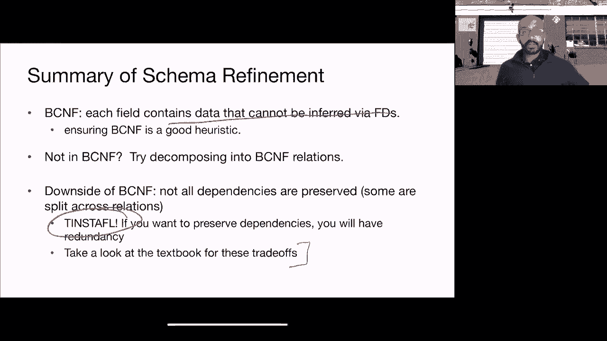

# 课程21：并行查询处理 🚀

在本节课中，我们将学习数据库设计中的BCNF范式，并探讨并行查询处理的基本概念。我们将从BCNF的定义和分解算法开始，然后转向如何利用并行性来加速数据库操作。

---

## BCNF范式分解 🧩

上一节我们介绍了规范化用于消除冗余和更新异常。本节中我们来看看Boyce-Codd范式。

BCNF规则指出：一个关系R在BCNF中，当且仅当对于每个**非平凡的函数依赖** `A1, A2, ..., An -> B`，左侧属性集 `{A1, A2, ..., An}` 必须是关系R的**超键**。

一个非平凡的函数依赖是指右侧属性B不在左侧属性集中。

### 为什么需要BCNF？

假设有一个关系R(A, B, C)，其中键是B，但存在函数依赖 `A -> C`。由于A不是超键（它不能决定所有属性），这违反了BCNF。这会导致冗余：对于每个与A关联的B值，C的值都会被重复。

例如，函数依赖 `SSN -> Name`，但SSN不是超键（因为它不能决定PhoneNumber），这违反了BCNF。我们可以将其分解为两个关系：`(SSN, Name)` 和 `(SSN, PhoneNumber)`，两者现在都在BCNF中。

### BCNF分解算法

以下是BCNF分解的步骤：

1.  找到一个违反BCNF的函数依赖 `A -> B`。
2.  计算左侧A的闭包 `A+`（即由A决定的所有属性）。
3.  将原关系R分解为两个关系：
    *   R1 = `A+`（包含A和所有由A决定的属性）
    *   R2 = `(R - A+) ∪ A`（包含A和原关系中其他所有属性）
4.  分别在R1和R2上计算函数依赖，并递归地对它们应用此算法，直到所有关系都在BCNF中。

**关键点**：分解时，我们使用函数依赖的闭包（尽可能扩展右侧），这有助于避免不必要的细粒度分解。两个结果关系通过公共属性A重叠，这使得可以通过自然连接无损地重建原始关系。

### 一个复杂例子

考虑关系：`Info(SSN, Name, Age, EyeColor, Phone, DraftEligible)`，具有两个函数依赖：
1.  `SSN -> Name, Age, EyeColor`
2.  `Age -> DraftEligible`

首先，`SSN` 的闭包是 `{SSN, Name, Age, EyeColor, DraftEligible}`，不包括 `Phone`，因此 `SSN` 不是超键，违反了BCNF。

*   **第一步分解**：使用 `SSN -> SSN+`。得到：
    *   R1(SSN, Name, Age, EyeColor, DraftEligible)
    *   R2(SSN, Phone)
*   **第二步分解**：检查R1。`Age -> DraftEligible` 中，`Age` 不是R1的超键（它不能决定SSN等）。因此需要进一步分解R1：
    *   R11(Age, DraftEligible)
    *   R12(SSN, Name, Age, EyeColor)

最终得到三个BCNF关系：R11, R12, R2。

### 两个属性的关系

一个只包含两个属性A和B的关系R(A, B)总是在BCNF中。无论是否存在函数依赖 `A->B` 或 `B->A`，或者两者都存在，都不会违反BCNF规则，因为单属性本身或两者都构成（候选）键。

### 算法总结与性质

BCNF分解算法能消除由函数依赖引起的冗余，并且分解是**无损的**，可以通过自然连接重建原关系。

然而，BCNF分解可能不是唯一的，选择不同的违反函数依赖进行分解，可能得到不同的最终结果。此外，BCNF可能无法保留所有函数依赖，使得某些依赖在分解后难以强制执行。

在性能上，BCNF减少了冗余，但查询时可能需要连接操作，这会增加开销。这是一种在空间（存储冗余）和性能（连接成本）之间的权衡。

---

## 并行查询处理 ⚡

上一节我们讨论了如何优化单个数据库模式。本节中我们来看看如何利用多台机器并行处理查询以提升性能。

### 为什么需要并行处理？

随着数据量增长，单机处理可能变得非常缓慢。例如，扫描100TB数据，假设磁盘读取速度为500MB/s，大约需要两天。如果使用100台机器并行扫描，时间可缩短至3-4分钟。

并行化的核心思想是将大任务分解为许多独立或尽可能独立的小任务，同时执行。

### 并行性类型

在并行数据库系统中，主要关注两种并行性：

1.  **流水线并行性**：查询计划中的不同运算符同时处理数据流中的不同元组。例如，一个运算符在处理元组1时，下一个运算符可以同时处理已完成的元组2。
2.  **分区并行性**：将数据划分为多个分区，相同的运算符实例在不同分区上并行执行。

此外，还有：
*   **查询间并行性**：同时执行多个不同的查询。
*   **查询内并行性**：
    *   **运算符间并行性**：包括流水线并行性和**丛生并行性**（查询计划的不同子树并行执行）。
    *   **运算符内并行性**：即分区并行性，是提升单个运算符（如扫描、连接）速度的关键。

### 数据分区方法

为了实现分区并行性（运算符内并行），需要在多台机器间对数据进行分区。主要方法有三种：

以下是三种分区策略的对比：

*   **基于范围的分区**
    *   **描述**：根据键值的范围分配数据（如A-E到机器1，F-J到机器2）。
    *   **访问局部性**：优秀。支持高效的范围查询。
    *   **负载均衡**：可能较差。数据分布可能不均匀。
*   **基于哈希的分区**
    *   **描述**：对键应用哈希函数，根据哈希值分配数据。
    *   **访问局部性**：良好。支持高效的等值查询。
    *   **负载均衡**：通常较好。
*   **轮询分区**
    *   **描述**：按顺序将元组循环分配给所有机器。
    *   **访问局部性**：差。元组随机分布。
    *   **负载均衡**：优秀。数据均匀分布。

在无共享架构中，网络通信是主要开销。因此，选择与查询工作负载匹配的分区方式至关重要，可以最小化机器间的数据传输。

### 并行连接操作示例：哈希连接

并行哈希连接可以高效地进行。其步骤类似于单机版本，但增加了数据重分布（洗牌）阶段：

1.  **重分区阶段**：使用哈希函数 `h_n` 将关系R和S的元组重新分布到多台机器上。确保具有相同哈希值的元组到达同一台机器。
2.  **本地连接阶段**：每台机器在接收到属于它的R和S的分区后，独立地使用单机哈希连接算法（构建本地哈希表，然后探测）完成连接。

这种方法提供了近乎线性的加速比和扩展性。需要注意的挑战包括处理数据倾斜（某些机器接收过多数据）以及同步各机器阶段进度。

---

## 总结 📚

本节课中我们一起学习了：
1.  **BCNF范式**：一种通过分解关系来消除函数依赖冗余的规范化形式。我们掌握了其定义、分解算法以及该方法的优缺点（如无损分解但可能不保留所有依赖）。
2.  **并行查询处理**：介绍了利用多台机器加速查询的基本原理。我们了解了流水线并行性和分区并行性，探讨了基于范围、哈希和轮询的数据分区策略及其权衡，并以并行哈希连接为例说明了运算符内并行的实现方式。

理解这些概念有助于设计更高效的数据库模式，并利用现代硬件并行能力构建可扩展的高性能数据库系统。