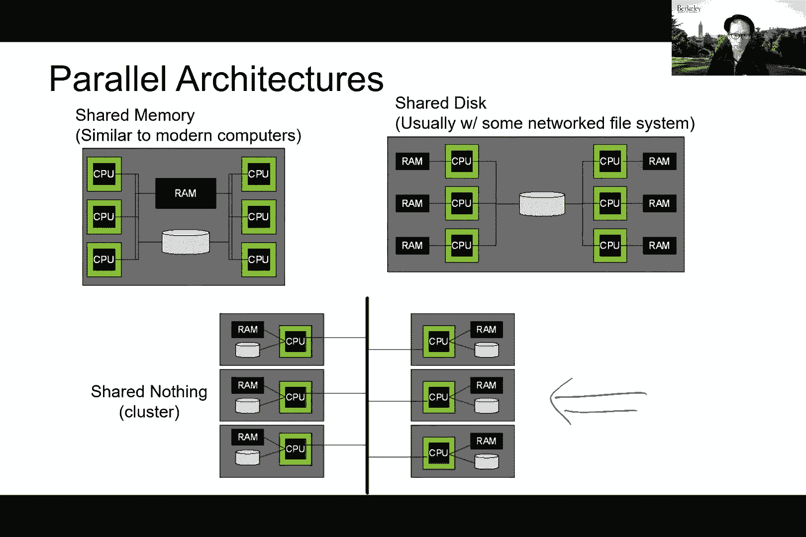
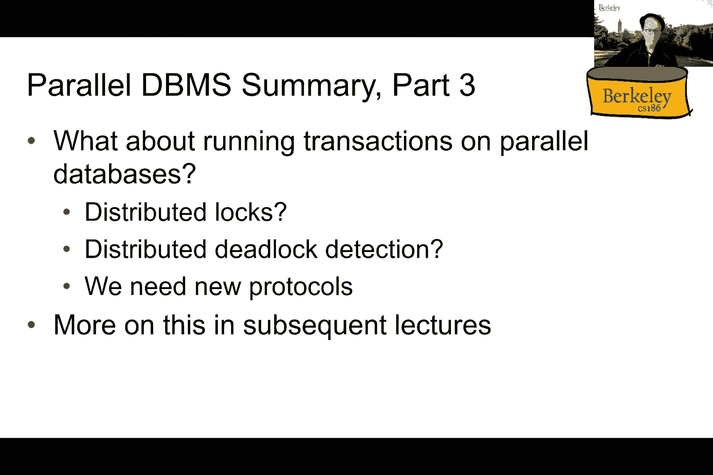
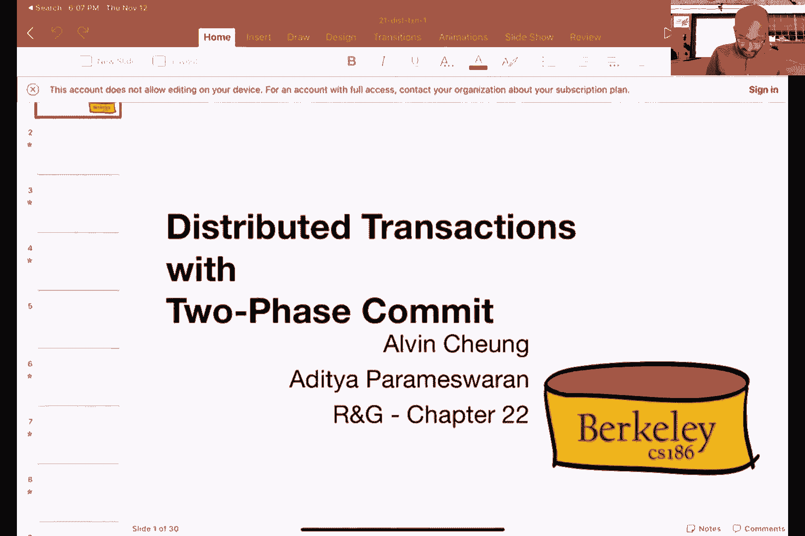
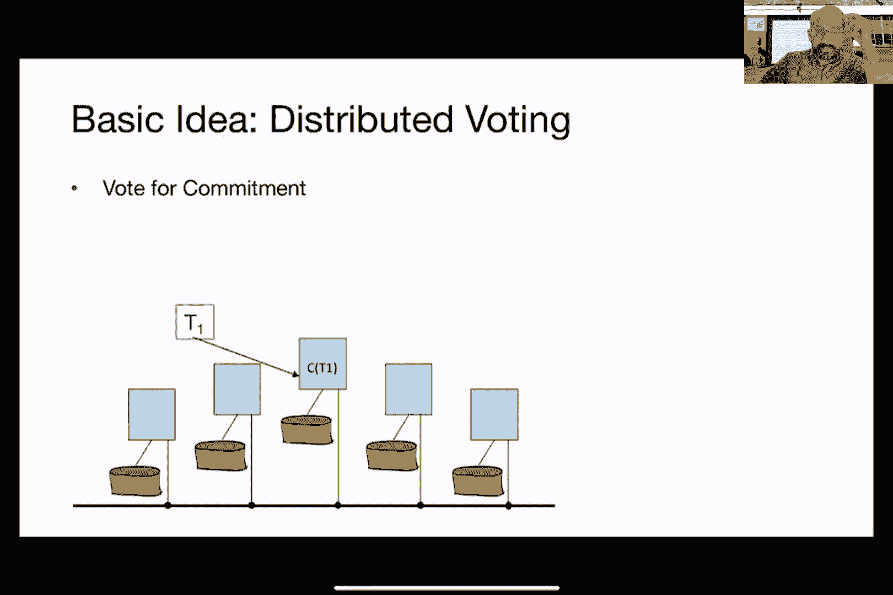

# P22：Lecture 22 Data Replication and Distributed Transactions I - ___main___ - BV1cL411t7Fz

 Because we would like to actually move on next to the next topic of like what happens when we try to run transactions on parallel databases。 which is going to be another fun topic to discuss。

 But before that， right， so just do a little bit of review。 So the whole reason why we started talking about parallelism， right。 was because we've got tons of different machines now。 And like， you know。 how can we actually leverage them such that we don't。

 we can actually gain performance right by doing so。 So basically that's what we were trying to。 that's what we were trying to discuss starting last lecture。 And by the way。 if you guys don't mind turning on videos， that would be great。 I think right now we're seeing like Warren and Jack， I mean， thanks for the busy and gate。

 And that I feel like I'm just talking to like a wall of very nice looking， some pro topic。 Great。 Yeah， so， right， so and then also as I was saying last time， right， we have pretty much by now。 And then we have a couple of different methods that we've already done。 And then we have a couple of different methods that we've already done。

 And then we have a couple of different methods that we've done。 And then we have a couple of different methods that we've done。 And then we have a couple of different methods that we've done。 And then we have already now master of single node career processing。

 So that's why now we're transitioning to the next module in the class。 which is talking about what happens when we have multiple machines。 So last time， I did， yeah。 also talked about this picture with different types of architectures that you encounter when we talk about parallel career processing。 So this aspect of shared memory， where we have a bunch of CPUs or a bunch of course they're just sharing a common piece of RAM。

 right， which is main memory in this case。 That's shared memory。 There's also shared disk where each individual machine have their own RAM。 But then they're basically sharing a same disk across all the other machines。 And there's also this aspect of share nothing architecture where nobody shares anything。

 So we now need to communicate across the network and also reach data that can be stored on another machine or data that has already been loaded on another machine's main memory。 So these are the three types of architectures that you see when people talk about parallel data processing。

 And then for this class， we're going to focus on the shared nothing architecture。

 And then at this year also talk about in the last lecture about like how do we do data petitioning in that world right。 So now we have a bunch of disks， we have， we still have the whole relation to worry about right except that now the accept that now the relation might not fit onto one single machine。

 So how do we actually want to petition data across all the different machines that we have。 So we also talked about three different potential schemes of doing that。 So in range petitioning。 we basically just set aside an arbitrary range that each of the machines should be holding in terms of records。 So for instance， in this case， the example last time we're students。

 So we can imagine we need to petition students records across multiple machines。 So we can do range petitioning by just assigning a range of let's say last names。 starting letters right on to individual disks。 So the second scheme here called hash petitioning is basically relying on a separate hash function to do this petitioning for us。 So basically we're going to feed each of the records across using a hash function and then whatever that hash function decides to put the record on。

 who subsequently send that record to that particular machine。 So that is the second scheme。 And the third scheme is called round Robin， and that basically means we're just going to rotate among all the different disks that we have and then send the two ball the new record where they arrive。

 So the point that I did here was making last time was basically these two different aspects when it talks about locality of accessing the records。 and also balancing balancing the load across all the different machines。 So。 can someone remind us like you know why for instance round Robin is like the most in terms of balancing the load across all the different machines。 Most in this case means it's kind of like the most fair right like every machine is going to get hopefully an equal amount roughly equal amount of of tools。

 And so that's why I'm not saying that because they're not being sorted by a specific key right so for instance we're not assigning a particular range so we don't have to worry about like you know what if。 like you know， like I think what if I did see a very popular name right so then that case then whatever machine that。

 I might end up like having most of the tuples right so but in this case since we're doing round Robin。 that's why we are doing that in that case load will be balanced because we don't really care what is the content of the individual to pull on the set。

 Does that make sense。 Now the other hand like you know why is like round Robin for instance the least right in terms of locality of access。 meaning that it's most difficult to get to an individual to pull。 So it's basically a to add sort right so like you know the same reason why it makes load to be balanced。 It's also the reason why it's making it hard for us to predict right you know which machine is actually holding on to specific record。

 So in this case we are assuming that there's no global index anywhere right so we can look up a particular record。 So the only way that we can do it is to basically query each of the machine asking you know do you have the record with a bit of name on it。

 Versus if we have the hash petitioning scheme or the range petitioning scheme。 we already know a priority which machine a particular record is going to reside right because you know just consult the range。 or just run the hash function and that will tell you which machine currently has that record。 If that record actually exists。 Okay。 Any questions about this so far。

 By the way this is not an exhaustive list of ways that you can petition data across multiple machines right so this is just basically given you a sample of what you can do。 So there are other schemes as well so for instance why don't we just make copies of data if you can afford it。

 Right， so you don't have to petition it this way I mean we can if we have enough。 And also memory we can just copy the data such that everybody is getting like you know the entire copy of the whole relation on its own。 Right if that's the case and it definitely makes a career processing much easier because everybody already has the entire relation。 But obviously that means we need to pay more in terms of this story and also memory as well right。

 So that's one of the photos。 So after petitioning we started talking about different ways of running our now familiar set of operations that we want to run on the tools。 For instance hashing。 So what I did here went through last time was this two phase scheme right where we want to be able to do parallel hashing。

 The idea is to first what we call shuffle the data across the different machines using a particular hash function。 What that means is we're basically going to just like you know decide on which machine to actually hold on to a particular piece of data。

 And then we're just going to stand it over to that to that machine， we're using a hash function。 And then after that we are just going to like you know build an internal hash table。 And then you know you can now use our favorite algorithm if you like right to build up that hash table。 So it fits all in memory then we just like you know build it entirely using a hash function and then we're done。

 And then like you know if in a case where a single bucket does not actually takes up more space than needed。 Then we just do the two phase on the multi phase positioning that we already talked about earlier before mid term one right in terms of this out of core algorithms for doing in memory。

 So do people remember why we need like separate hash functions for doing this so to see like you know we now have different hash functions here right as opposed to the initial hash function here H of N。 Do people remember why we need that why not just use the same hash function all the way to。

 So part of that was also the reason why we talked about our course right。 Yeah exactly so because if we just use the same hash function let's say H and right。 Then everything will be everything that gets ended up on the same the blue disc right we'll just be hash the same bucket。 So that's not good right I mean it's not really distributing it into different buckets so like you know in that's in the sense of career processing we're actually not helping that much。

 So we actually want to separate the two goals if they do have different values right into different buckets such that we can run。 Let's say like a join later on right easily。 So for that reason and the same reason why we have different hash functions or our core algorithms we want to make sure that we actually pick a different hash function as the one that we used in the first step。

 Of course this is still subject to the same problem which is what happens if all the two goals actually are exactly the same。 Right so remember the let's say like I think the example that we use for our core algorithms was the case of gender。 So in that case then like you know we basically need a separate mechanism to check whether like it is the case that everything is just the same。 The same deal there。 Okay so now that we understand how to do hashing the next part in the lecture I want to basically go through how to use these different opera。

 how to use these different basic operations to implement the relational operators that we all know about。 And namely like you know the things that are listed here on this line。 Okay so first one join。 Right so how do we do parallel join。 So scenario here is just the same as when we were talking about our core algorithms。 We have two relations RNS and we want to join them across some value right some some some attributes。

 So here's one way of doing this hash join across multiple machines。 So at first shuffle one of the relations let's say are across the different machines that we have。 And then we're going to build a hash table after each of these machines receive its own petition。 So that's what is happening here on the right hand side right so I use H of N to shuffle to both of our across multiple machines in this case we have three。

 And then we're going to use like you know our our hash table building mechanism to basically build up the hash table that corresponds to the tools that we have received。 We wait for the hash table to finish building。 And then we subsequently use the same mechanism to shuffle the two posts from the other relation across the network。

 So here we use the same hash function right H of N to shuffle all the as to both across the network。 So to post as opposed to join we'll basically ended up on the same machine。 Right。 So。 and what happens when we receive as to post on like you know after we have wrapped after we have built up the hash table for our。 Well we just check the hash table that we have already built up and see if any of the two posts would actually match with two posts on our。

 And if so we're just right the output to the disk。 And if not we're just basically don't generate any output。 Okay。 Because that's it。 So in this case most of the steps actually parallel except for the first step where we need to build up the hash table。 For instance right writing to the disk that you're seeing here on the far right that just wrote the error on this part is completely parallel。

 So each of the disk basically just do its own thing as it receives to both of us。 Right。 Just probes the hash table that is already a memory。 And then if there's anything match。 then like you know just dumb into the depth right all that stuff is completely can be done completely in parallel so we don't need to do anything there。 In terms of coordination across the different machines。 Right。

 But then notice that we do have to wait for the hash table to first build up on our。 So that is the step that takes time that may take time right and then in case there are。 Straplers that we need to wait for the last hash table to be built before we can do the streaming of。 So there's a variation on this scheme that does not actually require waiting for the hash table to be built that we'll talk about actually later on in a few slides。

 But then I can already tell you I have time that says nothing is free right again no such thing as free lunch。 So therefore like you know that that particular algorithm is actually going to use up more space and memory in order to do that。 But before then like you know any questions about this particular scheme。 Before we move on。 So this is basically like the simplest way you can imagine running a parallel has joint right so which is shuffle one of the one of the relations across the different machines with petition it basically。

 We let each of these machines。 You know construct their hash tables and memory。 And then we're just like you know send the other two polls from the other from the from the relation to be joined across these different machines and then let it do a business so to speak。

 Completely independently。 Make sense。 So now we ask the usual question right so what if there's actually not sufficient memory to build up this hash table for our that you see here like you're on the right hand side right。 What if the whole hash table does not fit in memory so what do we do。

 What do you think we should do。 Recursive。 Well you actually already learned this particular algorithm known as the greatest hash join right remember that。 Or you will remember that when we talk about mid term to us opposed。 So there there is this algorithm that allows us to actually do this like you know。 Mac to this hashtag right up on this hash table or do has joint right without forcing that the whole hash table with fit and memory。

 So we're just doing the same thing here。 So first step right in this case we just use grace has joint to try to fill up the hash table across multiple steps。 The last one is to basically just write out the buckets as we have them onto the disc as you may remember。

 Except that in this case we need to do it multiple times。 Basically we want to do do the same thing but for both of the relations。 And as we know that the entire hash table that corresponds to our does not fit in memory。 So and in the case that if asked also doesn't fit right then we basically need to do this using multiple passes by first writing out individual buckets to the disc。

 And then like after that right we can then retrieve the buckets that corresponds to our and the matching bucket from us and then do the memory has joint just like how we were doing the grace has joint algorithm。 So hopefully this is just review for most of you right the only thing here is really just this initial shuffling step or petitioning step using this new hash function here that we are calling it a band。

 But effectively it's just a way of petitioning the two posts across all the machines that we have。 So here's like the grace joint has joint parallel version in text form right so the first pass we do petitioning by shuffling the two posts across the machines that we have。

 And then after that we kind of just run local grace has joint on the individual note。 Namely we write out the individual buckets to the disc as they fill in。 And then after that we go across multiple passes right as needed as you remember what a grace has joint。 And then after that we just like you know read in the bucket for from the corresponding relationship we joined。

 and then we perform the joint locally。 Again， this is nearly perfect speed up right because you know once again we both of the steps actually can be run and complete independence of independently from each other。 except the first step in terms of shuffling the to goals across the network right。

 The subsequent steps is basically just like you know your favorite grace has joint algorithm。 So you can just run each of the machines and let them run in parallel。 And again。 there's also a variant of this that does not require waiting。 It's called the extra and we don't actually have time to cover that in this class so I invite you to check out this particular keyword or the paper corresponding to if you're interested。

 But that's basically I've already introduced two different ways that we can run parallel joint right。 namely this so called naive joint by just shuffling all the data for corresponding to the two different relations。 Or in the case where it doesn't fit everything doesn't fit a memory then we just do this parallel grace has joint。 Actually， we'll be talking about cement symmetric hash joint later on it's just at this particular variant of the parallel grace hash joint that we won't have time to cover in this class。

 So far so good。 Okay。 Right， so now let's talk about sorting right which is yet another one of these relational operators that we have been dealing with。 Now I want to be able to run this across model machines。 How do we do that。 So we're fairly straightforward so we basically just do something very similar so we shuffle the shuttle to post across all the machines that we have。 And then we just like you know， figure out what range of records that each of the machines should have。

 And then you can run your favorite sort algorithm after that。 Right。 So for instance。 in this case like you know I have randomly petitioned the range of to close by one of the attributes。 and it turns out to the numeric numeric。 So I just arbitrarily assigned three different ranges。 or the three machines that I have。 So the first， the blue machine would get everything between negative infinity to 10。

 And then the second machine the green machine here will get like everything between 11 to 100。 And then everything else will go on to the orange machine。 So we first do this petitioning or shuffling step by just using this range based petitioning。 And then after that， like you know how we want to proceed in terms of running the local sort。

 It's up to us。 And run any of your favorite sorting algorithm once everything has been located to a bigger machine。 Right。 Yeah， so that's why I'm calling like you know the other n minus one passes right because it might depend on what。 what， what sort of algorithm we ended up using so that might end up being multi passes as well。 Yeah， but that's it。 So that gives us the correct result right because like each of the brain。

 each range of two goals we sort it on the corresponding machines right。 But a problem， however。 is my， is performance。 So this is the same thing that we talked about when we were talking about how to distribute the tools across different machines。 So how can we avoid data skew， because for instance。 maybe all the tools were like you know having most of them were having values between like 11 to 100 for instance。

 So in that case the green machine will get most of the tools and therefore get most of the work to be done。 So if we don't want that to happen。 How can we do something to this scheme right such that we avoid having data skills。 Anyone has any idea。 And you're not allowed to pick in subsequent lectures life slice。 Okay。 how is that histogram。 What is our。 You can do round robin but like you know the problem around Robin is the second and the subsequent and everything and other steps are no longer independent right because if we do round robin。

 Then the blue machine will get like it can potentially get to go from all the possible values right。 And so is it the case for the other two machines。 So if that's the case if we have these parts partial sorted things right on each of the different machines。

 we need a way to merge them。 Yeah， so what if we use merge sort instead so that's kind of like what we'll be getting at。 Right， but first let's like make sure that we understand the problem if we just like you do round robin and then try sorting out sort things out that way right if we do that。

 Then we need another round of mergers right a potentially multiple rounds of mergers in order to get the full sort of result。 So one thing at a time right so let's try to go through like for example let's use histogram right as Charlie was mentioning。

 So what does that mean right so if we somehow have a this histogram of all the tools right and their corresponding camps or frequencies like the ones and that like the one that I'm showing here on the right hand side。 We can now divide up the x ranges or the domain right in this case， not evenly across the machines。

 We can divide them up based on the total number of tools that we're going to get right for each of these ranges。 and then assign them accordingly to the different machines such that each machine will end up having the same amount of things to sort。 Well how to choose， or should be fairly easy right because we already know if we know the frequency of each of the each of the two。 each of the two， each of the two values， then you know we just look at the distribution。

 and then we just make sure that like all the machines have the same number of two。 values to begin with。 This is easy to do if the number of tuples is small right name like for example we only have 10 tuples and it's easy to complete this histogram here。

 But it's not the case when the data is not that small right。 and that is actually typically the case right because the reason why we have parallel machines is because we have a lot of tuples that we need to process。 If we only have 10 tuples and I'm not just running on your local laptop right I mean that doesn't require any parallelism。 Or like you even if we run in parallel it's not going to be things up that much right。

 It's only the case if we have like you know a million and there'd be like a billion tuples。 and if that's the case， then constructing this like you know histogram right it's not going to be easy。 unless we have somehow been keeping track of the histogram on it like itself as data has。 originally ingested into the system。 So one idea that you might have right instead of actually constructing this whole histogram maybe we can just sample it。

 Right so let's say we just like you know sample like randomly picked right basically from the input relation a few of the tuples or as many of the tuples that you would like and then construct the histogram based on the samples。 And then you know basically making this hypothesis that the sample histogram is going to reflect on what the overall histogram is going to look like。

 So if you believe in that hypothesis that we can use the histogram that is constructed from the samples and then use that to petition the tuples across the different machines and then go on with my business that way。 Now of course we have basically just when you're kicking the can down the road here right because in this case you might ask okay how can we do a sampling such that things are fair and things are even right because if we somehow has a bias in how we do the sampling。

 then we might just end up creating a histogram that doesn't reflect all the tuples and therefore like you know the histogram that we created will be a skew。 So this turns out to be a way way more tricky a problem than we can actually talk about in this class。

 There's actually a lot of different statistical techniques that you can learn let's say in the statistics class they can take for doing different types of sampling to make sure that is actually unbiased。 And like you know happy to talk to you guys about that if you're interested about it offline。

 But the general idea here is if we do have an unbiased， if we do have an unbiased sample。 then we can basically construct histogram based on that unbiased。 sample and then use that to petition the tuples across different machines。 and therefore do sort it that way。 Does that make sense。 Okay。 Yeah。

 so let's say like you know we did do you know based on either like creating a histogram on all the tuples or do the sampling based technique。 Now let's talk about like you know what can we do after we have received the tuples on each of them individual machines。

 One way we can do that right is to basically use our favorite sort merge join let's say we want to do a joint right。 So we know how to do sorting now。 So let's now talk about how we can use sorting to carry out joint which as we learned in the sort merge case。

 that is indeed possible。 So it's actually turns out to be similar to what we talked about earlier。 except that again now we have this extra process of doing this petitioning。 and then sorting things out right。 Except that now we need to sort both of the relations just like when we were talking about sort merge join the beginning。 Right。 So remember the idea and sort merge joint is to basically have both of the both sets of tuples sorted such that we just we've been like you know the tuples one at a time from the two from the two relations that we need to join them on。

 And then we've performed the joint that way。 Right。 I hope you remember what a sort merge join is right。 Or I'm sure you will buy the final comes。 All right so yeah so like you know in this case we want to run things in parallel。 So if we can basically just petition the two folks across the different machines that we have。

 then the rest of the process is just the same thing as what we talked about earlier。 So again the sort， the sort merge the sorting might actually take multiple faces right because of the fact that like you know。 if we might need multiple rounds of sorting and also get everything sorted because all the tuples might not fit everything。 We might not be able to fit all the tuples in memory at once。

 So we might go through multiple rounds。 The only thing that we're doing here is like you know we just need to process our and as individually at first。 and then do the merging part after that。 And again。 the merging part can be run completely independently across all the different machines。 So we kind of get perfect parallelism that way to accept that again first we have to first petition the tuples across the machines。

 So that is again the blocking。 Does that make sense so now we have learned three different ways right to do parallel joint the naive way the grace has joined way and then also in this case the sort merge way right so except for the first one the second and the third one。

 is that we have already learned about earlier when we were talking about our core algorithms。 The only difference here is like you know how do we decide on petitioning in the very beginning where we need to。 when we need to petition or shuffle the tuples across the， machines。 So actually see even more joint outcomes later on right because as I said earlier joints is one of these problems and they are processing that just keeps coming back over and over again。

 So it's one of these like you know core problems and data career processing that everyone is still working on even today。 So you still hear people talking about new joint outcomes precisely because of this reason。 And basically that also means that like you know no one size at all right so it's not like someone one single magic joint out that works all the way。 And it's always going to be the best。 That's why we're talking about all these different options here。

 Okay so let's leave join for a few minutes we'll get back to that actually。 In a few slides still so you still hear more more like you know different joint outcomes。 But for now let's also talk about how we want to run aggregates in parallel。 Aggregates I mean things like you know computing counts and sums and all the good stuff that we already learned。

 Right。 So the approach here is going to do this in a hierarchical manner。 So we're going to do this in a hierarchy for each of the aggregate function we basically decompose the operation into a local。 it's a local aggregate， and a global， solution。 What do I mean。 For instance if we want to compute some across like a million tuples that's same。

 I can decompose the sum by first shuffling or partitioning the tuples across different machines and compute the local sum。 And subsequently I'm going to compute the global sum by asking each of the individual machines to send us。 you know the sum that they have got so far。 So this sounds intuitive right so we have a bunch of different machines we just asked each individual machines to compute the local sums after we decided on how to partition the data across them。 And then after they have completed the local sums we just add the local sums together and then we get the global one。

 Okay。 Counting is pretty much the same thing right so we asked each of the individual machines to count their set of tuples that's the lowercase here lowercase s。 And then we're just going to add up all the local counts afterwards and then that's the global count number that we want。

 So you can basically see a pattern here right so that's exactly what I meant by decomposing the operation into global and a local version。 So for average right so we're just going to compute the sum and also compute the count and then the global average is going just going to be the global sum divided by the global count。

 So on so far if you can figure out how we want to run。 let's say maximum or minimum in a similar fashion right。 So this is just a pictorial illustration of how we want to do some for example。 So that's how we can do some in a parallel way so again right module the part that we need to partition the data across the different machines。

 The rest of it is basically a completely independent right each of the machines can just run the aggregates locally independently。 And then we just collect the number after that and then compute the global version。 What about group by。 So grouping and grouping and aggregation all kind of like you know comes hand in hand right as we learn in pre-processing。 So how do you want to compute group by of a large number of tuples。

 One version is like similar in vain right so we do local aggregation。 So you know we keep track of the group key that is being computed and then we keep local aggregates in the hash table based on the partition of data that we have。 And then similarly after each of the local group by having computed on each of the individual machines。 then we just do a shuffling step where we forward the local aggregated results to a single machine that is supposed to be。

 So for instance maybe the blue machine in this case is responsible for all the groups like you know from negative infinity to 10。 And then the green machine is responsible for all the groups from 11 to like 100 or something right。 So and then and so on and so forth for the orange one。 So in that case we just asked the local machine to first compute the local group by regardless of what they're supposed to be computing ultimately。

 And then just shuffle the partially computed result across the machines based on the range that they're supposed to compute。 So therefore the blue machine at the top will get all the groups corresponding to like negative infinity to 10 from the green machine and the orange machine after the first step。

 And then it would just compute the final aggregate for that for that particular group after receiving the local accounts。 Any question about this so far。 Oh， right， so that's like you know I leave it as a challenge right to figure out like you know what happens if we have so large number of groups such that it doesn't fit in memory on the individual machine。

 You can do something similar to grace hash space hash join right and now and actually trying to figure that out。 And not to solve that particular problem and you should be able to do that exercise。 but I will tell you how time that that is relatively rare in practice。 Because it's usually the case that we have millions of two posts。

 but it's unlikely the case that we have millions of groups。 Right。 because we're unless you're grouping on like a unique identifier like student ID right。 but if you're grouping on student ID then I think the first question that you want to answer that case is why you writing that query。 I mean why are you grouping by something that you know that's not form any group right besides a single tool。

 Okay， so that you know but then other than that right if you really get into that that regime right of having so many different groups that they don't fit into a single machine then like you know we can。 you can think about how you want to use something similar to the grace john has drawn out with them for solving that problem。

 So what we have learned so far right it's basically how to run these most many of these different relational operators in parallel。 and the focus has been on joins because that is the one that we know like you know a different number of algorithms exist。

 So that's， that's now try to round up the picture by talking about like you know different types of joint algorithms。 besides the one that they're talking about so far。 which is one the naive version to the grace hash john version。 and then three the smart merge version right。 Okay。

 so now that we also learn about sorting and all the other different ways so now let's see if there are other ways that we can also run the parallel joins as well。 So the first one is what sometimes you will call one side of shuffle。 So that is a special case where if we know that one of the relations is already petitioned。 Then we don't have to petition that relation again。 Right。

 So let's say if we already know that our is range petition across the three different machines。 So we need to shuffle right the other relation that needs to be petition。 If it is not already also petition。 And then we can just run those join locally right。 so you might say well this is kind of like a cheating case right why will you have such a situation happening。

 But remember I mean these are queer operators， these queer operators run in a tree right。 So。 you know it might be the case that we have already done， like sorting on it。 So therefore like one of the relation might have already been sorted。 So if that's the case then why not just piggyback on that。

 And then like you know only need to shuffle one of the other。 the other relation and also run the joint， as opposed to needing needing to shuffle both。 Okay。 So sometimes you do get a situation like that and then if that's the case then you can just do we can just do it one side of shuffle。 which is what this slide is talking about。 Another case that you might encounter is like you're in a case where one of the relation is really small compared to the other one。

 So let's say if like you are so small such that it can actually just fit in the main memory of an individual machine。 What can we do in that case。 Well if we what we can do in that case is we can simply just like you'll send the entire relation of our to the different machines。

 So forget about sorting forget about like running hash functions to try to figure out how to petition things。 We just sent the entire copy of our to all the machines and then ask them to run their favorite local joint algorithm out。 Why is this beneficial because we saved the time right so actually figure out what how to do petitioning whether we want to construct histogram and all that stuff basically goes away。 We simply just replicate the entire relation across the multiple different machines that we have。

 So this actually happened more frequent than you think。 Big just because like you know there's no guarantee that when we join something there's no guarantee that the two relations are equal size right or even off relatively equal size。 I mean one can be really small compared to the other one。 And if we actually run into that case。 And if it is actually also the case that it will fit into the main memory of these of the individual machines。

 Why not just do this broadcast join mechanism as opposed to figuring out how to shuffle data。 And then finally let's also talk about like you know I've been telling you guys about there's some joint there are joints where we basically need to wait right for one of the steps to complete。

 And that is usually like one of the first steps right either that means the petitioning case or the sort merge join case is basically the sort right to be completed before we can actually do the merge。 And then in the case of the hash building when we were talking about grace has joined we have to wait for the hash table to be first built on one of the relations before we can shuffle the other one。

 So I call them pipeline breakers in this case because those are exactly the places where we need to wait。 We cannot proceed with the rest of the joint until that pass until that pass is done。 Whether that means starting or that that means a compute of creating the hash table and memory。 Is there a joint scheme that actually pipelines entirely。

 we need that we don't have to wait for the first pass to actually finish before we can carry out join。 As I have alluded to earlier there's something called symmetric pipeline hash join which basically prevents us from needing to wait。 The way that it works is we basically going to construct two hash tables in each of the individual machines。 One hash table for our and one other hash table for us which is the relation that we want to join on。

 Why， because now when a tool from our shows up， we're basically going to build a hash table just like what we would have been doing。 Okay， but then when， and then when a tool from s actually shows up。 we're actually going to just probe the hash table that we have constructed for our just like when we were doing has joined。 The only difference is we also need to compute a hash table for us。 Why。

 because next time we receive a tool from our， we are going to not only construct， you know。 put that particular tool into the hash table for our。 but we are also going to probe the hash table for us to figure out if there's any match。 So here's the animation that correspond to that。 So when a hash went， sorry。

 when a tool from our shows up， we're going to put that to go into the our hash table hash table。 and then check whether there's any match in the as hash table。 And if so。 I'll put the join to goals as desired。 And then similarly， when a tool from s shows up。 we're just going to do the same thing in reverse。 So notice there's some trade off here right so instead of creating one single hash table for our。

 Now we are going to create two different hash tables one for our and one for us。 both of them are supposed to reside in memory。 The first question that you might ask is why does this even work work in a sense of computing the right results。 And you can see why this actually works because all the output to post that needs to be that needs to be generated is only generated exactly once。 which is when it's corresponding part of rights right。 So if lowercase。

 so if to a supposed to join to be， then depends on whether a shows up first or B shows up first。 The second to go that shows up is going to basically join with the other one because the other one is already put into his corresponding hash table。 Does that make sense。 Right， so if it hasn't shown up yet it's just because like you know the part that is supposed to join with just hasn't hasn't been streamed into memory。 So that's the only reason why this algorithm is come entirely streaming meaning that like we're not waiting for any phase to be completed across different machines。

 You know， we can always just pull all these different different tools from RNS。 bring out how to petition it across different machines and then like you know go on separately completely independently from each other。 So this particular scheme is useful for what is known as stream career processing engines， namely。 we're not talking about a finite sized relation。 So let's say I want to join like you know to post I'm seeing from Twitter or something。

 So we're basically getting new to post every second as we speak。 So we're really talking about an unbounded relation here。 So if that's the case。 we can afford to run any of the algorithms from before where we're basically waiting for like you know the entire hash table to be constructed for our。 for example， because in the case of like an infinite relation。

 That the hash table is never going to be completely built right。 So the only hope that we have this is basically run these so called streaming based algorithm where we don't need to wait for a particular phase of the algorithm to finish before we can go on with the rest of the job。

 And this is one example of this。 So again you can see the。 the trade out here right we are basically spending extra memory to construct two hash tables in memory。 not just one。 So now we have even a higher chance that like you're the hash table will not fit in memory。 So therefore we need to， like you know， write out the individual buckets just like how we're doing the grace algorithm and then like you bring back the corresponding bucket when the to go after that。

 arrives， and all the other nice things that we might need to worry about。 Again。 no such thing as free life right there's always going to be a trade off here。 The upside here is we don't need to worry about like you know。 we don't need to wait for a face to finish so all the individual machines can process can make process can make progress completely independently from each other。

 The downside is that we need more memory here。 So yeah so that's all we want to say for parallel pre processing。 So across these two lectures we're talking we talked about topics like you know how to petition the two posts across mother machines。 we talked about different architectures that you might have for running， the low pre processing。 And in this class we focus exclusively on the share nothing approach because it's cheap is scarce well。

 we basically just adding commodity hardware。 In that case right。 And then we talk about different types of parallelism across operators across different queries so on so forth。 And then we talk about how to implement our relational operators in parallel using the basic moving blocks that were discussed last time or hashing。 and then for this time or sorting sorting。 And then you can imagine how we want to do a parallel pre processing by constructing a similar pre processing plan。

 just like how we talked about earlier。 So like you know how you might want to think about doing career optimization that way。 So it's basically I can already tell you that it's a similar process so we basically do a cost based estimation to figure out what is the cost for each of the different career plans that we have and then we just choose the best one。

 just like how we were talking about earlier， or career optimization。 So here comes another fun part right， what about transactions。 which is also what we talked about in this class right now that we know how to run the queries in parallel across different machines。 how about running transactions in parallel across different databases。

 So we need distributed blocks somehow right we were talking about to be out。 So like you know does that mean we started to get lots across the model machines before we can run a transaction。 How do we do a bad luck。 Now when we have multiple machines involved。 And I can already tell you that we need new protocols because what we learned earlier in terms of two PL and all the different ways of doing transactions is not going to be directly applicable in a case where we have parallel machines。

 And in fact that is what we'll be talking about right after the break。 But before we take a break。 Are there any questions about this part of the lecture。 If not maybe we can just switch over to the break at it here。

 I'll share screen。 Yeah。 Okay， so if you are this is for those who missed the video。 If you'd like to see the video， please come to class。 We miss you。 There's just like 40 students in class and we have to。 we just have five people whose faces we can see。 So please come to class。 We miss you。

 We'd love to see you。 Okay， anyway。 And of course you're missing out on all the videos。 So。 so that's。 So， Tegan asks whether it is 1115。 You may be right。 I think I haven't updated this slide。 So， can it defeat the purpose of this admin announcement but there is an exam prep session coming that's either on 1113 or 1115。 because I think I brought 1113 originally and then I was corrected later so Gabe has the updated info。

 Okay， so 1115 it is。 And so the other thing that I wanted to announce was the fact that we've started doing verbal exams for those who had issues with the recordings from mid to。 And again， this is just for fairness sake， right， so you want to make sure that no one is sort of those who took the exam and had no issues。

 They are not at the disadvantage。 Those who had issues with the recording。 There were no recordings at all。 For example， they are not at the disadvantage either。 I mean。 they just come in。 We are not， we're not like， we're not giving them a hard time。 Right。 you just are asked to explain a few answers and basically that's it。 So。

 they're not meant to be stressful。 It's just a simple check so that we can be sure that you did the exam diligently and that's about it。 And I think Alvin conducted some verbal exams today。 There are still others that are scheduled。 So。 anything to add to that， Alvin？ No， yeah。 Okay。 Okay。 So the midterms are graded。 There'll be out soon again。 We are waiting for these verbal exams to get done before we can release the midterm grades。

 And please get started on project five。 I know some of you are still dealing with the project for。 but hopefully you are done with that or close to done with that and you're。 you're starting to work on project five。 So， and it that any issues。 Sort of let us know and make use of office hours。 I'm lonely in my office are so you should show up。

 Okay。 All right。 Any other announcements， Alvin， no， right。 Okay。 let me move on to distributed transactions。

 Okay， so I'm in alluded to this already right so we talked about sort of taking sort of traditional relational data processing operators and and sort of figuring out how to do it in parallel。 Now， that's just very processing。 What happens from the transaction perspective。

 If you have data that spread across many machines， how do you deal with transactions？

 How do you guarantee acid in that context is a challenge。 And that's。 that's what we're going to be dealing with。 So first， a note on sort of terminology。 So。 notice that the previous lecture talked about parallel query processing this lecture or this set of slides are talking about distributed query processing what's really the difference。 And so， I mean， at least from a parallel database standpoint， we talked about three。

 three sort of mechanisms shared memory shared disk and shared nothing distributed。 So。 we're saying a distributed databases basically nothing but share nothing parallel databases。 But in many cases， this is also has a slower network。 Okay。 so the distinction between parallel and distributed is not substantial。

 It's just that distributed is usually has a slower network。 And so this distributed could really mean geographically distributed right could be across multiple continents even。 Okay。 And that does has that does have repercussions for the kinds of ways we'll need to handle transactions。 Right。 So if things are spread across two ends of a continent right West Coast East Coast or USA and China。

 right。 I mean， network delays could be a huge factor。 So it's important to sort of think about the worst case scenario of stuff being truly distributed。 So what's special about distributed computing。 So inherited from shed nothing parallel computation that we already know you have parallel computation。 as well as no reliance on shared memory or this we basically have these commodity machines， which。

 have their own memory and disk and they communicate via shared a network， right。 So the network is what is shared across all of these machines and these machines come communicate via that network。 And so the networks， especially in a distributed setting stuff where stuff is really far away from each other these networks could be really unreliable。 So you could have delays。 So packets take a long time to get transmitted。

 And then there's a lot of different ways to get into the network。 So you could have a lot of different ways to get into the network。 And then you could have a lot of different ways to get into the network。 And then you could have different ways to get into the network。

 And then you could have different ways to get into the network。 And then you could have different ways to get into the network。 And then you could have different ways to get into the network。 And then you could have different ways to get into the network。

 And then you could have different ways to get into the network。 And then you could have different ways to get into the network。 And then you could have different ways to get into the network。 And then you could have different ways to get into the network。

 And then you could have different ways to get into the network。 And then you could have different ways to get into the network。 And then you could have different ways to get into the network。 And then you could have different ways to get into the network。

 And then you could have different ways to get into the network。 And then you could have different ways to get into the network。 And then you could have different ways to get into the network。 And then you could have different ways to get into the network。

 And then you could have different ways to get into the network。 And then you could have different ways to get into the network。 And then you could have different ways to get into the network。 And then you could have different ways to get into the network。

 And then you could have different ways to get into the network。 And then you could have different ways to get into the network。 And then you could have different ways to get into the network。 And then you could have different ways to get into the network。

 And then you could have different ways to get into the network。 And then you could have different ways to get into the network。 And then you could have different ways to get into the network。 And then you could have different ways to get into the network。

 And then you could have different ways to get into the network。 And then you could have different ways to get into the network。 And then you could have different ways to get into the network。 And then you could have different ways to get into the network。

 And then you could have different ways to get into the network。 And then you could have different ways to get into the network。 And then you could have different ways to get into the network。 And then you could have different ways to get into the network。

 And then you could have different ways to get into the network。 And then you could have different ways to get into the network。 And then you could have different ways to get into the network。 And then you could have different ways to get into the network。

 And then you could have different ways to get into the network。 And then you could have different ways to get into the network。 And then you could have different ways to get into the network。 And then you could have different ways to get into the network。

 And then you could have different ways to get into the network。 And then you could have different ways to get into the network。 And then you could have different ways to get into the network。 And then you could have different ways to get into the network。

 And then you could have different ways to get into the network。 And then you could have different ways to get into the network。 And then you could have different ways to get into the network。 So we're going to be focusing on transactional concurrency control and recovery as algorithm alluded to the last set of slides and many of。

 And so you'll end up figuring out many of the lessons of distribution。 Sorry。 you do already know many of the lessons of distributed processing。 You'll now know the lessons of distributed transaction process。 Okay。 let's start with distributed locking。 Okay。 So， as before we are talking about shared nothing distributed database system。

 And for today we're going to be assuming partitioning but no replication so I've been alluded to this where he said that in order to make sort of queries run faster you could potentially make multiple copies of your data。 That's not something we're going to be worrying about so we're only going to be worrying about partitioning again something that Alvin and I spoke about in the battle computing part。

 So each transaction you can imagine arrives at some node and this node may be designated as the coordinator for that transaction is responsible for coordinating the transaction and then communicating back to。 let's say the application server saying， Hey， this transaction committed this transaction about it was heavy。

 Okay， so this coordinator can be designated so there could be a centralized coordinator for all transactions or could be assigned on the fly based on some scheme like around around。 drop it for example。 Okay。 So one question is where is if you want to do distributed concurrency control where does a lock table recite。

 And so usually the locks are partitioned along with the data so you keep the locks along with the data。 And so basically each node ends up managing its own lock table and contains entries for all of its pertinent objects so basically stuff like pages and tuples would have their lock table entries associated with that node。

 Now， what happens with sort of course trained objects right so in those cases so let's say tables relations or entire databases。 So usually you end up assigning a home node for those objects。 And。 and those home nodes would contain the course train locks。 So the object being locked so it's either table or a database。

 This may exist across nodes but there is a home node for them。 So for example。 individual tuples of boats reserves and sailors and individual pages that are could reside in different。 different nodes， and could have lock table entries for each state。 Two or each page in those nodes。 but where do we have the course trained。 Lock table entries for the relations themselves。

 And so there are a couple of options。 So one is these course screen locks can be partitioned across the nodes。 So for example， this node was designated as holding the lock table entry for the sailors relation。 This one is holding the entry for boats and this one is holding the entry for itself。 So this could be half this this partitioning could happen。

 by a hash partitioning around Robin partitioning so basically this course screen locks are assigned to the other option is it's centralized。 So you have master node that that handles all of these course screen locks。 Okay。 so and there's no sort of one scheme that that is a winner here I mean there are pros and cons for both。 Okay， so let's ignore these global course clean locks for a second。 And let's talk about the rest。

 So each node does its own locking。 It locks sort of the elements that you may be referring to in a transaction。 So the tuples， the pages。 And this is nice。 Right。 It's kind of clean and efficient and generalizes that single node setting。 So each single node can simply worry about itself and not worry about others because it's each single node has a set of tuples has a set of pages as it's responsible for。

 and it has all of the lock table entries for all of those objects。 However。 there are global issues that remain right so issues that deal with dead locks so how do you detect dead locks。 especially when there are multiple nodes that are participating in a transaction。 How do you deal with committing and a body again if there are multiple nodes that are participating in that transaction。

 Right。 So those are what we're going to be focusing on。 Any questions so far。 Okay。 so let's start with distributed deadlock detection。 Okay。 so we talked about deadlock detection in a single node case which is basically just constructing this weights for graph。 And so that sort of approach， you may think let's try to apply that to this distributed setting and see what happens。

 So you could imagine that every node maintains a weight for graph based on the transactions that are performing changes。 whatever holding onto locks at the corresponding node。 Right， so for example。 this node may have these three transaction T one T three and T two。 and you have a wait for relationship between them。

 So T two is waiting for T three T one is waiting for the two in this case。 So this is a scenario where zooming in might actually help。 Okay。 No two here T one is waiting for T three。 And T two is not waiting for anything in node three T three is waiting for T two and so on。 Okay， so you have basically these weights for graphs at each of these nodes。 Now。

 one challenge here obviously is that you may not detect a cycle。 If you are at a single node without sort of looking at the weights for graphs at other nodes。 Right。 So， so here basically each machine doesn't have a cycle， but there is a global cycle。 And to see this， if you start from this particular graph。

 and then add in the edges from the other graphs。 So I added in the other edges and you have a cycle。 right。 So you have at least one cycle here。 There are other local cycles as well。 So。 so there are multiple cycles in this graph in the global graph。 but at any individual node or any individual machine， there are no cycles。 Right。

 So how do you deal with this。 So it doesn't seem like each individual node would be able to realize that there is a deadlock and then deal with the deadlock by possibly aborting some transaction。 So it doesn't look like each node will be able to do that with just the information that it has locally。

 So the solution is pretty simple。 Actually， it's basically you periodically send your weights for graph to a designated coordinator。 That designated coordinator gets all of these weights for graphs and sees if there is a deadlock。 If there's a deadlock， it may say， Hey， you， this particular transaction needs to abort。 And then it will communicate that with all of its machines and then all the machines will realize that。

 Hey， maybe that transaction is so bad。 Okay， so there is a designated coordinator that that sort of is dealt dealing with this deadlock detection。 because it has complete information this information that's sent by all of these nodes。 So one question， some of you may be thinking is， Hey。 what if in the time that the information that is sent to this coordinator in that time。

 maybe some transaction decided to commit at some node and therefore the graph has changed at some node。 That might certainly happen in those cases， you may end up aggressively aborting some transaction you didn't need to。 And that's probably okay that's not that's not a bad scenario。 And if there are new deadlocks that come up。 So if there are new deadlocks that happen in the interim between the time that a node shipped their weights for a graph to this coordinator。

 And if there are new deadlocks that happen because of that gap， they will be detected later。 So let's not worry about that。 I mean， again， we'll handle that later。 So overall。 even though this may be a little aggressive， this may be a little stale。 It overall does an okay job。 So that's deadlock detection。 So。

 we have a protocol which is called two phase commit， but let's work up to that。 Okay。 So。 as I mentioned before， each transaction has a coordinator node。 Okay。 so let's say that my strongman approach is that this coordinator is going to make the decision as to whether this transaction is going to commit or it's going to。 be a good scenario。 And then once the transaction。

 once this coordinator has made this made this determination， it'll let all the other nodes know。 Right。 So it's basically going to inform all the other nodes that hate this transaction is going to commit or abort。 Any thoughts on why this scheme may be problematic。 Coordinator goes down that's certainly a challenge。

 But let's assume for now that the coordinator doesn't crash， but that is a challenge。 What if two nodes come to different conclusions exactly right so as Nicholas says。 there could be a node that wants to commit and another node that wants to abort。 What's a scenario where one node might want to commit while another one step board。

 One node crashes that's yet another challenge it's not related to the abort thing but it's also another issue so there could be a transaction that touches data at a node that is not crashed right so that's you're done for you can't make that change for example。

 A local deadlock is probably a good reason to try to abort a transaction at a specific node so that might be a good reason while a node wants to abort a transaction。 But are there other reasons。 Yeah， like Nicholas you could have a scenario where there is a local in the local wait for graph at a node you determine a cycle and then decide that you want to abort。

 A transaction。 Maybe the user just wants to abort the user is not really involved in this right you have these machines the user is the one who requested a transaction。 So at least this is a case where the user said， I want this transaction to commit right latency as taken says yes that could be an issue you could have a node that is really delayed。

 It wants to abort but it's not able to tell the coordinate。 Anyway。 so another issue that I so all great points another issue that I wanted to bring up before I sort of summarize is possibly a node that says。 I want to abort because the insert insertion that you're making to me is going to violate some consistency。 So it's going to violate violate some integrity constraint like primary key constraint so that node has that local information it can make that determination and it can say I don't want this transaction to proceed。

 But if the coordinator is making a decision unilaterally that's kind of a dictatorship you don't want that right I mean you want the nodes to be able to communicate their displeasure at this transaction commitment。 So， I sort of saying no right。 So the problem with this strongman scheme is that it doesn't take into account the input from all of the notes that may be participating in this transaction。

 Okay， so among other things like I said， one of the nodes may want to abort even the coordinator wants to commit some notes may actually be down。 So any notes transactions touching the data shouldn't proceed。 Okay。 so let's summarize all of this and talk about what in general could go wrong。 So the first type of thing that could go wrong is basically failures and delays that come from notes。

 Right， so for example， if we haven't heard from a node we don't know if the node is alive or dead。 And the decision may hinge on this node， right， so imagine that there's a potential foreign key evaluation that could happen at that node。 We do need to hear from them before we decide whether we want to commit this transaction or not。 And unfortunately we might not even know that a node is alive or dead。 And then。

 if the node was dead。 How does the node actually recover in a world where multiple transactions may have committed after that right so there's a challenge in sort of supporting recovery when a node has failed。 and then has to recover。 Okay， so I'll then we'll talk about recovery schemes in this protocol data。

 So that's what could go wrong in terms of failures and delays for nodes。 What could go wrong in terms of failures and delays for messages。 So the first thing is that you can have non deterministic reordering on a per channel basis and interleaving across channels。 Okay， so， and the other issue is that you could have some very。

 very delayed messages and the challenge there is how long should we wait for a delayed message。 This is a message simply delayed or is the node down it's hard to sort of decouple the two。 So in terms of the non deterministic reordering per channel。 deleting across channels and lost messages here's an animation that illustrates all of the three。

 So here I have four messages green red yellow and purple。 And so as you can see。 The red and the yellow are going to get reordered。 The green one is going to get interleave between the two and the purple one is going to get dropped。 Okay， so and that could certainly happen。 This is this is a scenario that could certainly happen。

 So given all of this it's it's tricky to figure out how all of these nodes are going to decide to agree to commit or abort。 Okay， so I think I will stop at this point since we're at six 29。 And then I will talk about this distributed voting protocol and two phase commit in the next lecture。 Any questions about this so far。 If your questions please stay otherwise I think we're going to stop reporting here and have a great weekend everyone。

 Bye folks。 Bye。 [BLANK_AUDIO]。

