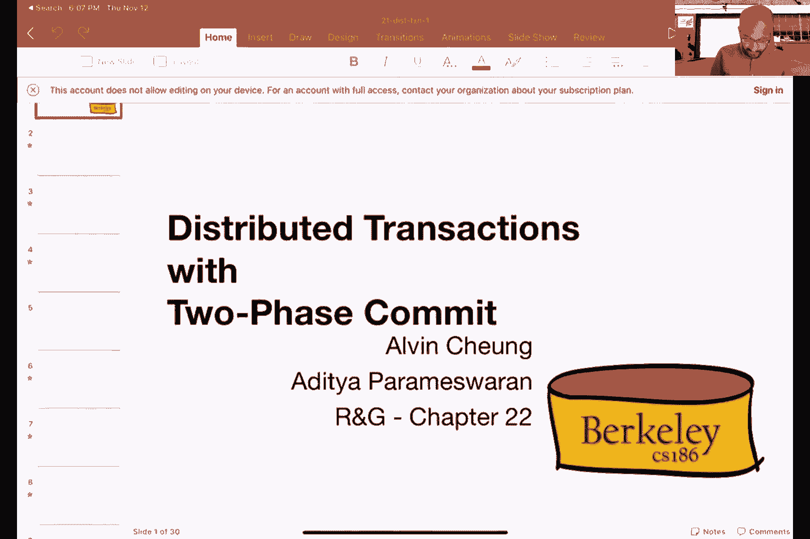
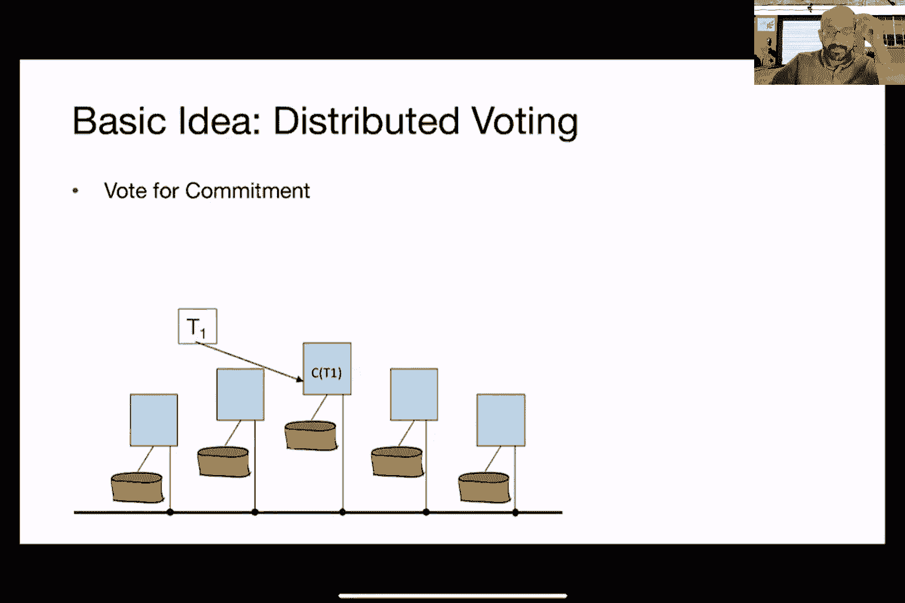

# 课程22：数据复制和分布式事务 I 🧩

在本节课中，我们将要学习在并行数据库上运行事务时会发生什么。这是一个非常有趣的话题，我们将探讨如何利用多台机器来提升性能，并深入理解分布式环境下的数据处理挑战。

---

## 复习：并行处理与数据分区

上一节我们介绍了并行处理的基本动机，即有效利用多台机器以避免资源浪费并提升性能。现在，我们来回顾一下并行计算中常见的架构和数据分区方法。

在并行计算中，主要有三种架构：
*   **共享内存架构**：多个CPU或核心共享同一块RAM（主内存）。
*   **共享磁盘架构**：每台机器有自己的RAM，但共享同一块磁盘。
*   **共享无架构**：机器之间不共享内存或磁盘，所有通信和数据访问都通过网络进行。

本节课我们将重点讨论**共享无架构**。

为了在多台机器间分配数据，我们讨论了三种主要的分区方案：
*   **范围分区**：根据记录的某个属性（如姓氏首字母）设定范围，将不同范围的记录分配到不同机器。
*   **哈希分区**：使用一个哈希函数处理每条记录，根据哈希结果决定记录存放的机器。
*   **轮询分区**：在所有可用磁盘间轮流分配新到达的记录。

选择分区方案时，主要考虑两个因素：**访问局部性**和**负载均衡**。轮询分区在负载均衡方面最有效，因为它能最公平地分配数据；但在访问局部性方面最差，因为很难预测特定记录在哪台机器上。相反，范围分区和哈希分区能提供更好的访问局部性。

---

## 并行关系操作符

在了解了数据如何分布后，本节我们来看看如何在多台机器上并行执行我们熟悉的关系操作，例如连接、排序和聚合。

### 并行连接操作

连接是数据库中最核心且复杂的操作之一。在并行环境中，我们有几种方法来实现它。

**1. 朴素的并行哈希连接**
这种方法的思想很简单：将其中一个关系（如R）通过网络“洗牌”分配到所有机器上，每台机器为其收到的部分数据构建一个内存哈希表。然后，将另一个关系（S）也使用相同的哈希函数进行洗牌。当S的数据到达各台机器时，只需在本地已构建好的哈希表中进行查找匹配，并输出结果。这个过程大部分步骤可以并行执行，但需要等待哈希表构建完成才能开始处理S的数据。

**2. 并行Grace哈希连接**
当数据量太大，无法在内存中构建完整的哈希表时，我们可以使用Grace哈希连接的并行版本。其步骤与单机版类似：
*   首先，使用一个哈希函数将两个关系R和S的数据洗牌分配到所有机器上。
*   然后，在每个节点上，对本地数据进行多趟处理，将哈希桶写入磁盘，直到每个桶小到可以放入内存。
*   最后，从两个关系中读取对应的桶，在内存中执行连接操作。
这个方案也实现了近乎完美的并行加速。

**3. 其他连接变体**
*   **单边洗牌连接**：如果一个关系已经按照连接键分区好了，那么我们只需要对另一个关系进行洗牌即可。
*   **广播连接**：如果一个关系非常小，可以完全放入单台机器的内存，那么可以将其复制（广播）到所有机器上，然后在每台机器上执行本地连接，避免了数据洗牌的开销。
*   **对称流水线哈希连接**：这是一种流式处理算法，适用于无限数据流。它在每台机器上为两个关系各维护一个哈希表。当任一关系的数据到达时，既将其存入自己的哈希表，也用它去探测另一个关系的哈希表以产生连接结果。这种方法无需等待任何阶段完成，完全流水线化，但需要更多内存。

### 并行排序操作

并行排序的基本思路是：先根据某个属性范围将数据洗牌分配到各台机器，然后每台机器在本地对自己负责的数据范围进行排序。
*   **挑战：数据倾斜**：如果数据分布不均匀，可能导致某些机器负载过重。为了解决这个问题，可以尝试先对数据采样，构建一个直方图来了解数据分布，然后根据直方图进行范围划分，以确保各机器负载均衡。
*   **排序合并连接**：一旦两个关系都排序完毕，就可以并行执行排序合并连接。每台机器独立处理本地已排序的数据流，进行合并操作。

### 并行聚合操作

对于求和、计数、平均值等聚合操作，可以采用分层方法：
1.  **局部聚合**：将数据分区后，每台机器先计算自己那部分数据的局部聚合结果（如局部和、局部计数）。
2.  **全局聚合**：协调者收集所有机器的局部结果，进行合并计算，得到最终的全局聚合结果（如全局和、全局平均值）。

对于分组聚合，过程类似：先在各机器上进行本地分组聚合，然后根据分组键将中间结果洗牌到负责该键最终聚合的机器上，进行最终计算。

---

## 迈向分布式事务

到目前为止，我们学习了如何并行执行查询。然而，在分布式数据库中，我们还需要处理**事务**。如何保证分布在多台机器上的事务仍然满足ACID属性，是一个巨大的挑战。

分布式环境引入了新的复杂性：
*   **网络问题**：延迟、消息丢失、乱序、网络分区。
*   **节点故障**：参与事务的机器可能崩溃。
*   **协调困难**：需要所有参与节点对事务的提交或中止达成一致。

### 分布式锁与死锁检测

在共享无架构中，锁通常与数据存放在一起，即每个节点管理自己数据上的锁。对于跨节点的“粗粒度”锁（如表锁），可以指定一个主节点来管理，或者在不同节点间分区管理。

**分布式死锁检测**比单机更复杂，因为等待图可能分布在多个节点上。一个常见的解决方案是：每个节点定期将自己的局部等待图发送给一个指定的**协调者**。协调者汇总所有局部图，构建全局等待图，并检测其中是否存在环（即死锁）。如果检测到死锁，协调者将决定中止哪个事务，并通知所有相关节点。

### 提交协议面临的挑战

每个事务通常有一个**协调节点**负责最终决定事务提交或中止。一个简单的“强人”策略是让协调者独自做决定，但这忽略了其他参与节点的意见。例如，某个节点可能因为违反完整性约束（如主键冲突）而希望中止事务。

因此，我们需要一个协议，让所有参与节点都能对事务结果进行“投票”，并最终达成一致。这就是著名的**两阶段提交协议**的基础思想。此外，我们还需要处理节点故障和消息延迟带来的不确定性，例如区分一个节点是崩溃了还是仅仅响应很慢。

---

## 总结

本节课中，我们一起学习了并行数据库的核心操作。我们回顾了数据分区策略，并深入探讨了如何在多台机器上并行执行连接、排序和聚合等关系操作。最后，我们将视角转向更复杂的分布式事务领域，初步了解了在分布式环境下管理锁、检测死锁以及达成事务提交共识所面临的基本挑战。在下一讲中，我们将深入探讨解决这些挑战的关键协议——两阶段提交。