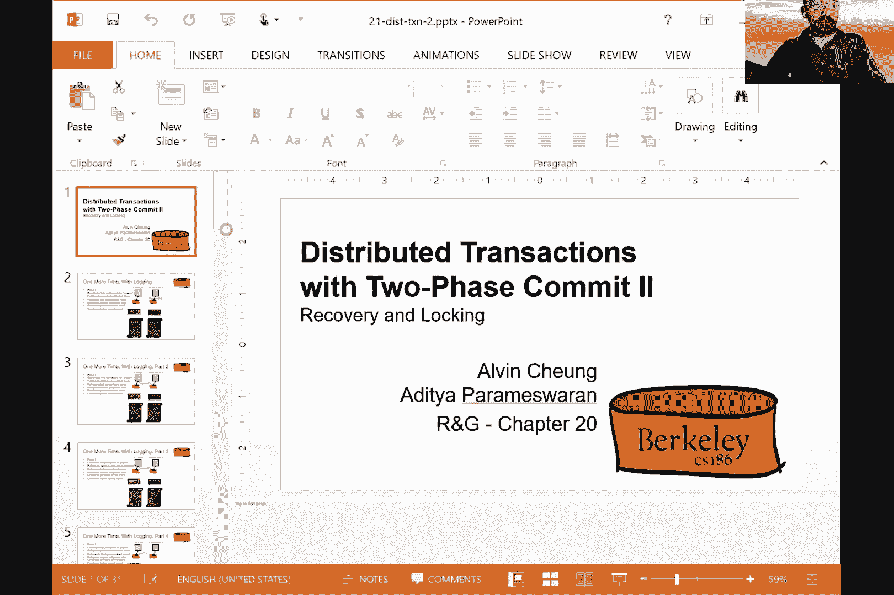
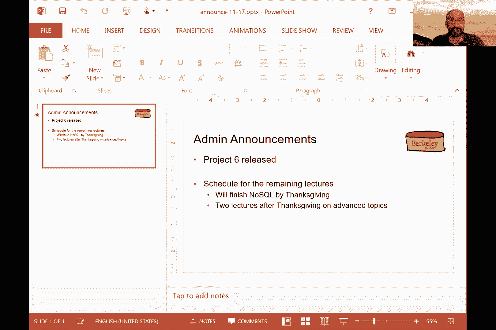
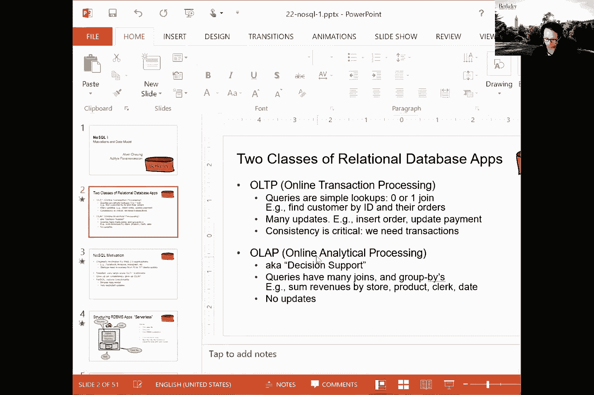

# 课程 P23：分布式事务与两阶段提交协议 🧩

在本节课中，我们将学习分布式事务的核心概念，特别是**两阶段提交协议**。我们将探讨在分布式系统中如何协调多个节点以达成事务提交或中止的一致决定，并了解该协议如何与日志记录和恢复机制协同工作。

---

## 分布式提交的挑战

上一节我们介绍了分布式事务的基本概念。本节中我们来看看在多个节点间协调提交时面临的具体挑战。




在分布式系统中，一个事务可能涉及多个节点上的数据操作。协调器单方面决定提交事务是不可靠的，原因如下：
*   **节点故障**：某个节点可能已经崩溃，无法响应。
*   **节点意愿**：即使协调器想提交，某个节点可能因本地约束（如外键冲突）而希望中止事务。
*   **消息问题**：消息可能丢失、延迟或乱序到达。

因此，我们需要一个**分布式投票协议**，确保所有参与节点都同意提交，事务才能最终提交。

---

## 两阶段提交协议介绍

为了解决上述挑战，我们引入了**两阶段提交协议**。该协议分为两个阶段，类似于婚礼仪式。

### 第一阶段：准备阶段
协调器询问所有参与者：“你是否准备好提交此事务？”

以下是该阶段的步骤：
1.  协调器向所有参与者发送 `PREPARE` 消息。
2.  每个参与者在本地评估事务。如果可以提交，则将 `PREPARE` 记录**持久化到日志**，然后向协调器回复 `YES`；否则回复 `NO`。
3.  协调器收集所有投票。

### 第二阶段：提交/中止阶段
协调器根据投票结果宣布最终决定。

以下是该阶段的步骤：
1.  如果**所有参与者都回复 `YES`**，协调器则决定提交。它将 `COMMIT` 记录写入自己的日志并持久化，然后向所有参与者发送 `COMMIT` 消息。
2.  如果**有任何参与者回复 `NO`**，或超时未回复，协调器则决定中止。它将 `ABORT` 记录写入日志，然后向所有参与者发送 `ABORT` 消息。
3.  参与者收到决定后，执行相应操作（提交或中止），将结果（`COMMIT`/`ABORT`）记录到自己的日志并持久化，最后向协调器发送 `ACK` 确认。
4.  协调器收到所有参与者的 `ACK` 后，写入 `END` 记录，事务完成。

**核心流程公式化表示**：
```
协调器 -> 参与者: PREPARE
参与者 -> 协调器: YES/NO (投票)
if 所有投票 == YES:
    协调器 -> 参与者: COMMIT
    参与者 -> 协调器: ACK
else:
    协调器 -> 参与者: ABORT
    参与者 -> 协调器: ACK
```

---

## 与日志恢复的协同工作

两阶段提交协议必须与日志恢复机制（如 ARIES）结合，才能处理节点故障。关键点在于，在发送投票或确认之前，必须先将关键记录（`PREPARE`, `COMMIT`, `ABORT`）**刷新到磁盘**，确保故障后能正确恢复。

### 恢复场景处理
每个节点（协调器或参与者）恢复时，会检查自己的日志：

以下是节点恢复时可能遇到的情况及处理逻辑：
*   **协调器日志有 `COMMIT` 记录**：重新执行第二阶段，向参与者发送 `COMMIT` 消息。
*   **协调器日志有 `PREPARE` 记录，但无决定**：单方面决定 `ABORT`。
*   **参与者日志有 `PREPARE` 记录，但无 `COMMIT`/`ABORT`**：向协调器**查询**事务状态，并根据协调器的回复执行相应操作。
*   **参与者日志无 `PREPARE` 记录**：忽略此事务（视为从未发生）。

这种查询机制确保了即使协调器崩溃后恢复，整个系统也能达成一致状态。

---

## 与两阶段锁定的交互


在实际系统中，两阶段提交协议常与**两阶段锁定**协议一起使用，以确保可串行化。


为了安全地释放锁，我们需要确保节点在提交前已收到所有必要的消息。这通常通过**为消息分配密集有序的ID**来实现。节点维护一个接收消息的缓冲区，如果发现ID序列中有空缺，则知道有消息尚未到达，从而不能提交或释放锁。




**核心交互原则**：
> 在确认收到所有必要消息之前，参与者不能提交事务或释放锁。这防止了级联中止，并保证了严格的两阶段锁定语义。

---


## 协议的限制与优化


基本的两阶段提交协议存在一个著名问题：**协调器单点故障**。如果协调器在发送决定后、记录`END`前永久崩溃，部分参与者可能永远处于不确定状态，持有锁而阻塞其他事务。




虽然存在如**三阶段提交**等协议尝试解决此问题，但更可靠的解决方案是使用基于**法定人数**的共识算法（如 **Paxos**、Raft）。这些算法允许多个节点共同扮演协调器的角色，即使少数节点故障，系统仍能进展。

此外，协议还有许多优化空间，例如：
*   协调器可以不等待所有 `ACK` 就通知应用服务器（冒一定风险）。
*   减少必须同步刷新的日志记录数量。

---

## 本章总结

在本节课中，我们一起学习了：
1.  **分布式提交的挑战**：节点故障、消息延迟、本地约束等使得单点决策不可靠。
2.  **两阶段提交协议**：通过“准备”和“提交”两个阶段，让所有参与者投票达成一致。
3.  **故障恢复**：协议与日志系统（如ARIES）紧密结合，通过持久化日志和状态查询来处理各种崩溃场景。
4.  **并发控制**：协议需与两阶段锁定等并发控制机制协作，通过消息有序化来安全管理锁的获取与释放。
5.  **协议局限**：认识到基本2PC存在协调器单点故障问题，并了解了更高级的共识算法是解决之道。


通过两阶段提交协议，我们实现了在分布式数据库环境中运行事务的能力，这是构建可靠、可扩展数据系统的关键基石。