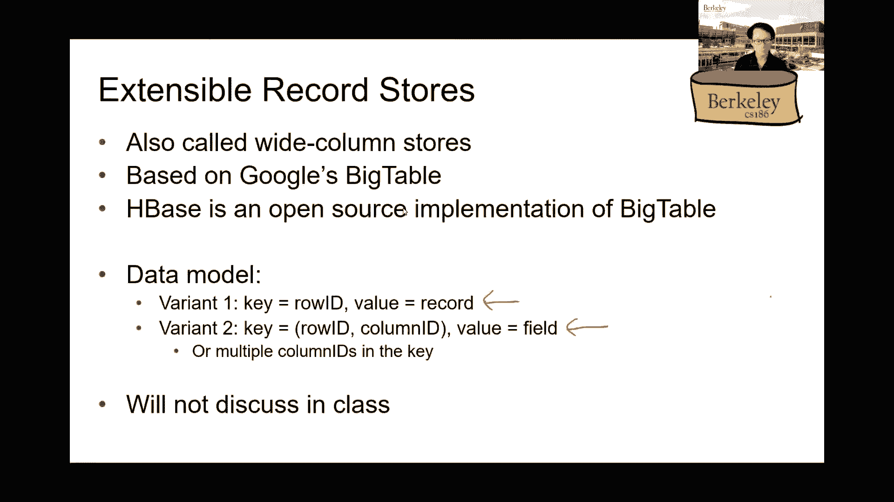

# 课程 P24：第24讲 NoSQL I - 动机与数据模型 🗄️

在本节课中，我们将要学习 NoSQL 数据库的诞生动机及其核心数据模型。我们将探讨为什么传统的关系型数据库在扩展时面临挑战，以及 NoSQL 如何通过简化数据模型和功能来应对这些挑战。课程将从回顾关系型数据库的扩展策略开始，逐步过渡到 NoSQL 的基本概念和不同类型的数据存储模型。

## 回顾：关系型数据库的扩展挑战

上一节我们介绍了关系型数据库的两种主要扩展策略：分区和复制。本节中我们来看看这些策略在保证一致性方面面临的困难。

关系型数据库系统通常服务于两类应用：在线事务处理（OLTP）和在线分析处理（OLAP）。NoSQL 的出现，主要是为了应对需要大规模扩展的 OLTP 工作负载。

扩展关系型数据库服务器的主要挑战在于保持数据的一致性。这涉及到我们之前学过的两阶段锁（2PL）和两阶段提交（2PC）等复杂协议。

### 扩展策略及其权衡

以下是两种主要的扩展策略及其优缺点：

*   **分区（分片）**
    *   **做法**：将数据分割到多个数据库服务器上。
    *   **优点**：可以存储海量数据，在理想情况下查询只需访问单台机器，能提高吞吐量。
    *   **缺点**：跨分区的操作（如连接）非常复杂且昂贵，需要类似 2PC 的协议来保证一致性。若某台机器故障，其上的数据将暂时不可用。

*   **复制**
    *   **做法**：将完整的数据集复制到多台服务器上。
    *   **优点**：易于分摊只读查询负载，提高吞吐量；容错性好，一台服务器宕机不影响服务。
    *   **缺点**：写入操作变得昂贵，因为需要更新所有副本。同时，要保证所有副本的强一致性也非常困难。

这两种策略在关系型模型下都难以轻松实现扩展，这正是 NoSQL 试图解决的问题。

## NoSQL 的核心理念

上一节我们看到了关系型数据库扩展的复杂性，本节中我们来看看 NoSQL 是如何通过“做减法”来应对的。

NoSQL 的基本思路是：通过简化数据模型和减少数据库系统提供的功能（如强一致性、复杂查询），来换取系统易于扩展到大规模工作负载的能力。

这意味着，如果应用程序需要执行类似连接的操作，或者必须读取最新的数据，那么这些功能需要由应用程序开发者自己来实现。数据库系统不再原生提供这些保障。

### BASE 原则 vs. ACID 特性

NoSQL 的理念通常用 **BASE** 原则来概括，这与关系型数据库的 **ACID** 特性形成对比。

*   **基本可用性（Basic Availability）**：系统保证基本可用，但并非时刻可用。如果一台服务器宕机，应用程序需要自行处理如何从其他副本获取数据。
*   **软状态（Soft State）**：数据库的状态可能在没有输入的情况下也会改变（例如，由于更新在副本间的传播延迟）。
*   **最终一致性（Eventual Consistency）**：系统不保证强一致性或可串行化，但保证数据最终（在一段未定义的时间后）会达到一致状态。

这种模型适用于许多现代应用场景（如社交网络）。例如，用户发布一条状态后，其好友是否立即看到或稍后看到，通常是可以接受的。这与银行转账等需要强一致性的场景截然不同。

## NoSQL 的数据模型

理解了 NoSQL 的动机和理念后，本节中我们来看看它具体如何组织数据。NoSQL 提供了多种数据模型，我们将重点介绍前两种。

### 1. 键值存储

键值存储是最简单的 NoSQL 数据模型。它将所有数据视为一系列键值对。

*   **键**：可以是任何数据类型（如字符串、整数），但必须在整个数据集中唯一。类似于关系型数据库中的主键。
*   **值**：可以是任何东西——一个数字、一个字符串、一个列表、一张图片，甚至是一段二进制数据。没有固定的模式（Schema）约束。
*   **操作**：通常只支持两个基本操作：
    *   `GET(key)`：根据键检索对应的值。
    *   `PUT(key, value)`：插入或更新一个键值对。

系统不支持连接、分组、聚合等复杂查询。从本质上讲，它可以看作一个分布式的巨型哈希映射。

**示例**：存储航班信息。
在关系型数据库中，我们可能设计 `Flights(id, date, carrier, from, to)` 和 `Carriers(id, name)` 两个表。在键值存储中，则有多种设计方式：
*   键设为航班ID，值为包含所有航班信息的JSON对象。
*   键设为“出发地-目的地”对（如“SFO-NYC”），值为该航线上所有航班的列表。

选择哪种方式，完全取决于应用程序最常进行的查询类型。这种灵活性是把双刃剑：它简化了数据库实现，但将数据建模和复杂查询的负担转移给了应用开发者。

### 2. 宽列存储 / 可扩展记录存储

宽列存储是键值存储的一个演进，它重新引入了一些类似关系型数据库的结构。

*   **核心思想**：数据模型仍然是基于键的，但键的结构更复杂。通常，键由行键（Row Key）和列族/列限定符（Column Family/Qualifier）组合而成。
*   **特点**：在同一张“表”中，所有记录共享一个基本的模式框架（即列族的定义），但不同的行可以拥有不同的列（稀疏性）。这使得它比纯键值存储更有规律，又比严格的关系型表更灵活。
*   **起源**：该模型源自 Google 的 Bigtable 论文，并有如 Apache HBase 等开源实现。

这种模型可以看作是键值存储和关系型表格之间的一个折中方案。

---
**本节课总结**

在本节课中，我们一起学习了 NoSQL 数据库的起源和基本概念。我们首先回顾了关系型数据库在扩展性上面临的挑战，特别是分区和复制策略在保证一致性方面的复杂性。接着，我们探讨了 NoSQL 的核心理念，即通过放弃关系型数据库的 ACID 强保证，转而采用 BASE 原则，以换取系统的简单性和可扩展性。最后，我们介绍了 NoSQL 的两种基础数据模型：极度灵活的**键值存储**和具有一定结构性的**宽列存储**。理解这些基本模型是深入学习具体 NoSQL 系统（如 Redis、Cassandra、MongoDB 等）的重要基础。在接下来的课程中，我们将深入探讨另一种流行的 NoSQL 模型——文档存储。