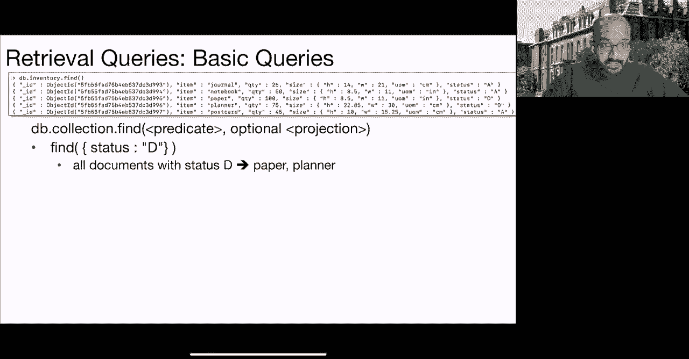
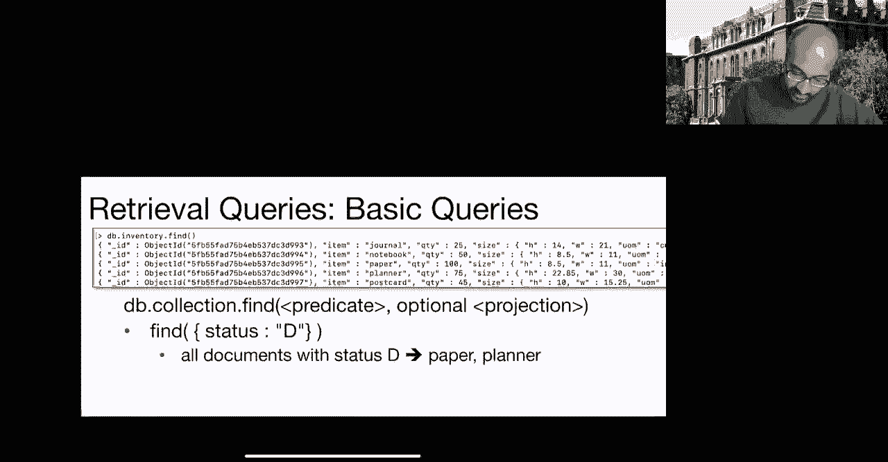
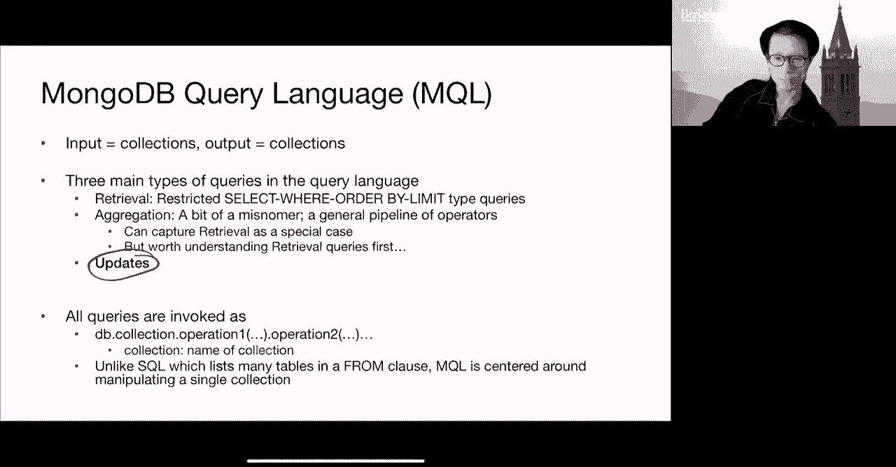

# 课程 P25：NoSQL II - MongoDB 查询语言 🗄️

在本节课中，我们将学习 MongoDB 的核心查询语言（MQL）。我们将从数据模型回顾开始，然后深入探讨检索查询和聚合管道，理解其语法、设计决策以及与关系型数据库（如 SQL）的对比。

## 数据模型回顾 📝

上一节我们介绍了 NoSQL 数据库的背景，本节中我们来看看 MongoDB 的具体数据模型。MongoDB 的数据模型基于文档，其结构与 JSON 类似。

*   **数据库**：在 MongoDB 中，一个数据库包含多个集合。
*   **集合**：相当于关系型数据库中的“表”。
*   **文档**：相当于关系型数据库中的“行”或“记录”。文档是字段-值对的集合。
*   **字段**：相当于关系型数据库中的“列”或“属性”。

文档中的值可以是以下几种类型：
*   **原子值**：例如字符串、整数、布尔值。
*   **嵌套文档**：一个文档可以包含另一个文档。
*   **数组**：可以是原子值数组或文档数组。

每个文档都有一个特殊的主键字段 `_id`，它在默认情况下会被索引。如果插入文档时未提供，MongoDB 会自动生成。

## 查询语言基础 🔍

MongoDB 查询语言（MQL）主要围绕单个集合进行操作。与 SQL 可以同时操作多张表不同，MQL 的查询通常从一个集合开始，然后通过一系列操作对其进行转换。





MQL 有两个核心语法特征：
1.  **点表示法**：用于访问嵌套文档或数组中的字段。例如，`inventory.qty` 表示访问 `inventory` 字段（可能是一个嵌套文档或文档数组）中的 `qty` 字段。当使用点表示法时，表达式需要用引号括起来。
    ```javascript
    // 示例：查询嵌套字段
    db.collection.find({ "size.uom": "cm" })
    ```
2.  **美元符号**：`$` 后跟的字符串是特殊操作符关键字，例如 `$gt` (大于)、`$lte` (小于等于)。它们用于构建查询条件。
    ```javascript
    // 示例：使用操作符
    db.collection.find({ qty: { $gte: 50 } })
    ```

## 检索查询 📥

检索查询用于从集合中查找并返回文档，类似于 SQL 中的 `SELECT ... WHERE ...` 语句。

一个基本的检索查询模板如下：
```javascript
db.collection.find(<谓词>, <投影>)
```
*   **谓词**：指定文档必须满足的条件，相当于 SQL 的 `WHERE` 子句。它本身是一个文档。
*   **投影**：指定返回结果中应包含或排除哪些字段，相当于 SQL 的 `SELECT` 子句。它也是一个文档。

以下是检索查询的一些示例：

**基本查询：**
```javascript
// 返回所有文档
db.inventory.find({})
// 返回 status 字段为 "D" 的文档
db.inventory.find({ status: "D" })
```

**使用操作符：**
```javascript
// 返回 qty 大于等于 50 的文档
db.inventory.find({ qty: { $gte: 50 } })
// 返回 status 为 "D" 且 qty 大于等于 50 的文档（AND）
db.inventory.find({ status: "D", qty: { $gte: 50 } })
// 返回 status 为 "D" 或 qty 小于 30 的文档（OR）
db.inventory.find({ $or: [ { status: "D" }, { qty: { $lt: 30 } } ] })
```

**查询嵌套文档和数组：**
```javascript
// 精确匹配嵌套文档
db.inventory.find({ size: { h: 14, w: 21, uom: "cm" } })
// 使用点表示法查询嵌套字段
db.inventory.find({ "size.uom": "cm", "size.h": { $gt: 14 } })
// 查询数组是否包含特定元素
db.inventory.find({ tags: "red" })
// 使用 $elemMatch 查询数组中的元素满足多个条件
db.inventory.find({ dim_cm: { $elemMatch: { $gt: 15, $lt: 20 } } })
```

**投影：**
```javascript
// 只返回 item 和 _id 字段
db.inventory.find({}, { item: 1 })
// 返回 item 字段，并明确排除 _id 字段
db.inventory.find({}, { item: 1, _id: 0 })
// 返回 item 和 status 字段，排除 _id
db.inventory.find({}, { item: 1, status: 1, _id: 0 })
```
**注意**：在投影文档中，通常不能混合使用 `1`（包含）和 `0`（排除），但 `_id` 字段是一个例外。

**排序和限制：**
```javascript
// 返回最多5个文档
db.inventory.find().limit(5)
// 按 qty 降序，然后按 item 升序排序
db.inventory.find().sort({ qty: -1, item: 1 })
```

## 聚合管道 🛠️

聚合管道提供了一种更强大、更灵活的数据处理方式，它由多个按顺序执行的“阶段”组成。每个阶段对输入文档进行处理，并将结果传递给下一个阶段。

聚合管道的基本语法如下：
```javascript
db.collection.aggregate([
    { <阶段1> },
    { <阶段2> },
    ...
])
```

以下是聚合管道中常用的阶段：

**$match**：过滤文档，只将符合条件的文档传递到下一阶段。相当于 `find()` 中的谓词。
```javascript
{ $match: { status: "A" } }
```

**$project**：重塑文档结构，可以包含、排除字段，重命名字段，创建计算字段或嵌套文档。功能比检索查询中的投影更强大。
```javascript
{ $project: { item: 1, total: { $multiply: ["$price", "$qty"] } } }
```

**$group**：按指定表达式对文档进行分组，并对每个组进行聚合计算（如求和、求平均）。
```javascript
{
  $group: {
    _id: "$state", // 按 state 字段分组
    totalPop: { $sum: "$pop" } // 计算每州总人口
  }
}
```

**$sort**：对文档进行排序。
```javascript
{ $sort: { totalPop: -1 } } // 按总人口降序排序
```

**$unwind**：将数组字段拆分为多个文档，每个文档包含数组中的一个元素。
```javascript
{ $unwind: "$tags" } // 为 tags 数组中的每个元素生成一个文档
```

**$lookup**：执行左外连接，从另一个集合中查询匹配的文档。
```javascript
{
  $lookup: {
    from: "otherCollection",
    localField: "localField",
    foreignField: "foreignField",
    as: "outputArray"
  }
}
```

**聚合管道示例：**
假设我们有一个 `zipcodes` 集合，包含 `city`, `state`, `pop`（人口）等字段。

1.  **找出总人口超过1500万的州，并按人口降序排列：**
    ```javascript
    db.zipcodes.aggregate([
      {
        $group: {
          _id: "$state",
          totalPop: { $sum: "$pop" }
        }
      },
      {
        $match: { totalPop: { $gte: 15000000 } }
      },
      {
        $sort: { totalPop: -1 }
      }
    ])
    ```
    对应的 SQL 大致为：
    ```sql
    SELECT state AS _id, SUM(pop) AS totalPop
    FROM zipcodes
    GROUP BY state
    HAVING SUM(pop) >= 15000000
    ORDER BY totalPop DESC;
    ```

2.  **计算每个州最大城市的人口：**
    ```javascript
    db.zipcodes.aggregate([
      {
        $group: {
          _id: { state: "$state", city: "$city" },
          cityPop: { $sum: "$pop" }
        }
      },
      {
        $sort: { "_id.state": 1, cityPop: -1 }
      },
      {
        $group: {
          _id: "$_id.state",
          biggestCity: { $first: "$_id.city" },
          biggestPop: { $first: "$cityPop" }
        }
      },
      {
        $sort: { biggestPop: -1 }
      }
    ])
    ```

## 经验法则与总结 📚

本节课中我们一起学习了 MongoDB 查询语言的核心概念。以下是使用 MQL 时的一些经验法则：

*   **`$project`**：当你需要构造或解构嵌套文档、重命名字段、创建计算字段时非常有用。
*   **`$group`**：除了用于标准聚合（如求和），还可以利用 `$push` 或 `$addToSet` 来为每组创建数组。
*   **`$unwind`**：是处理数组、将其“展开”为独立文档的关键操作，这在关系模型中不常见。
*   **`$lookup`**：是实现集合间连接的主要方式。请注意，连接结果通常是一个数组，后续可能需要使用 `$project` 进行清理。



MongoDB 的文档模型和 MQL 提供了高度的灵活性，特别适合处理非结构化或半结构化数据。其设计选择（如围绕单个集合操作、使用文档表示查询参数）与关系型数据库形成了鲜明对比，理解这些差异对于有效使用 MongoDB 至关重要。