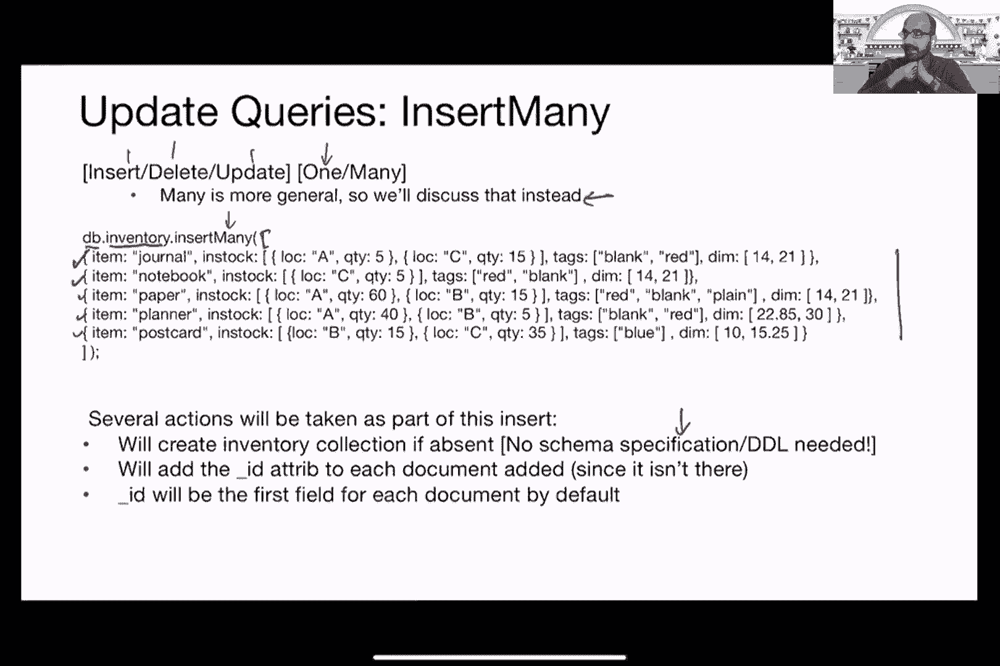
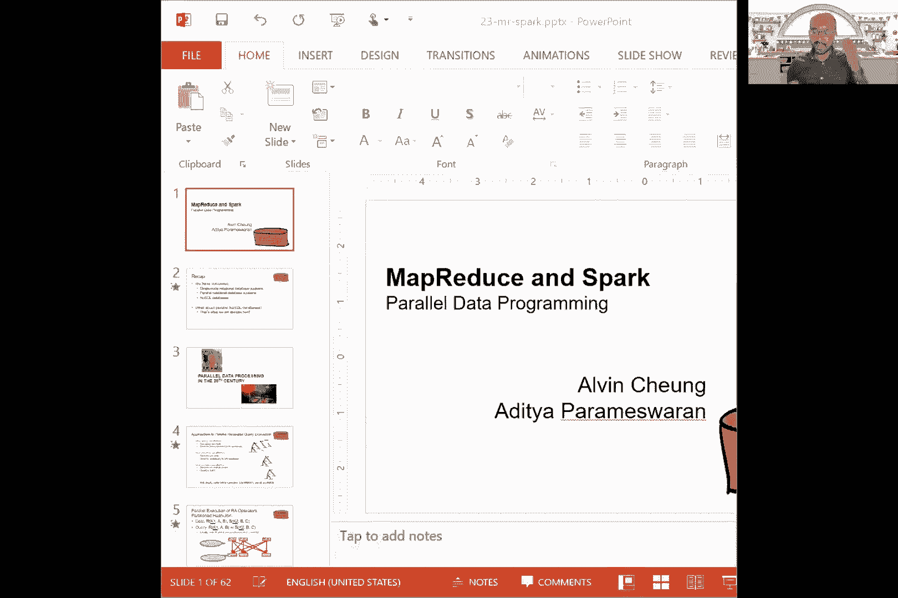
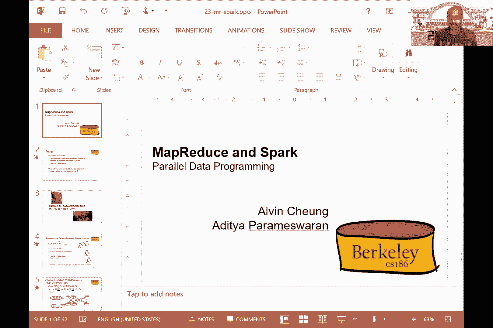
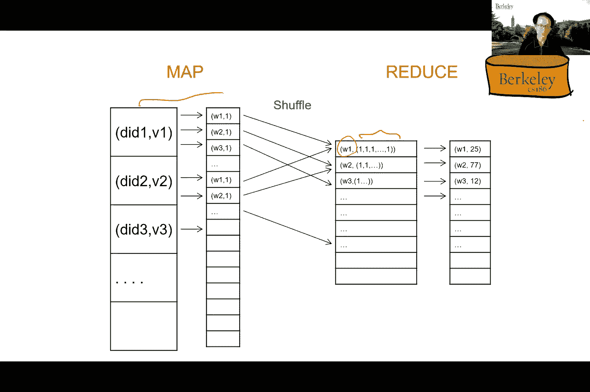
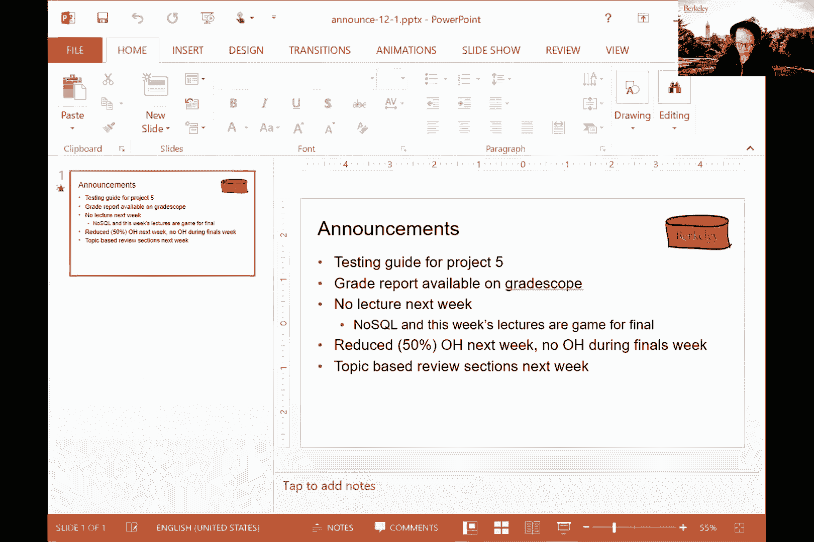
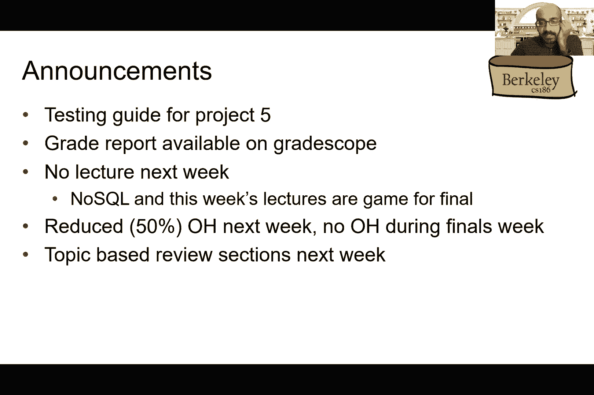
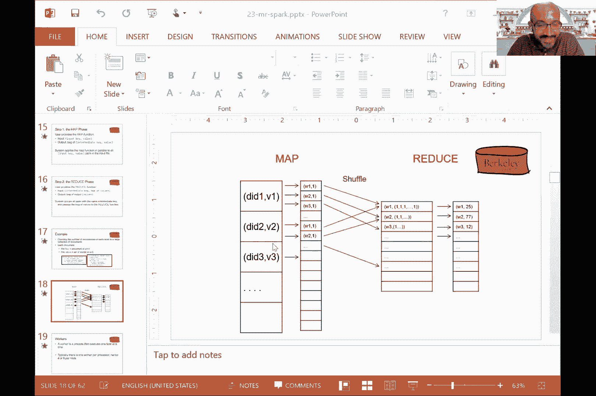
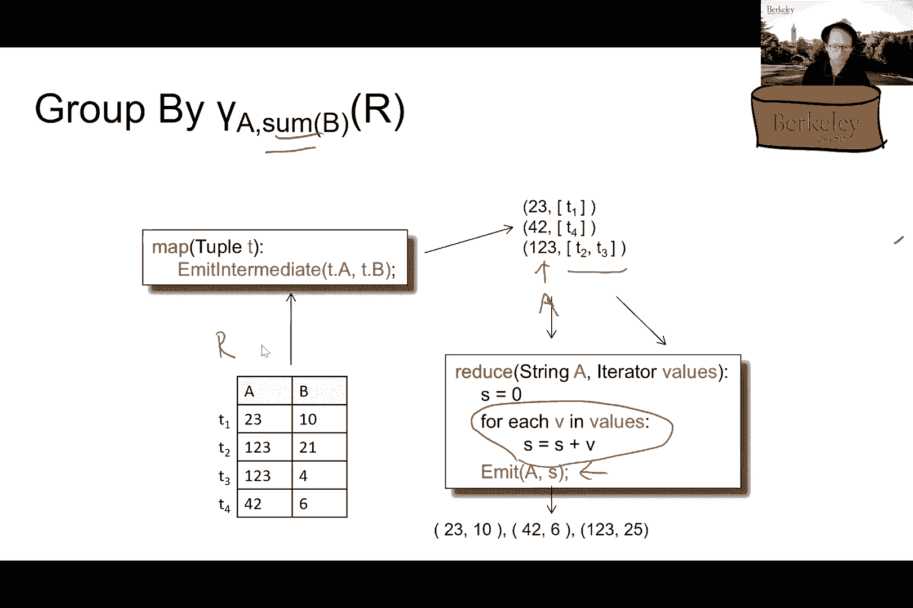

# P26：Lecture 26 MapReduce and Spark - ___main___ - BV1cL411t7Fz

我也是，好的，我们走吧，所有的权利，嗯，所以希望你们都有一个愉快的感恩节假期，嗯，如果你在旅行，嗯，如果你旅行不好，你真好，希望你玩得很放松，嗯，在我们开始MongoDB之前有什么问题吗，好的。所以我在Mongo DB上没有太多的内容要覆盖，我想在上一节课之前我所讲的基本上都是你可能使用的，最后一天的讲座也是如此，否，我们有星期四，呃也是，所以嗯，但我们不会有讲座，呃下周，好的。所以我没有涵盖的，嗯，最后一节课是更新，所以让我们来谈谈更新，好的，所以嗯，更新MongoDB数据库的方法是使用，呃，基本上是插入、删除或更新，um或命令，而你，嗯，有一个后缀，要么说一个或多个，一个。基本上说你插入一个，很多意味着你在插入很多文档，这么多基本上更一般，所以我们只是谈论这个，而是，所以你基本上有任何插入的组合，删去，更新一个或多个，我们就用插入许多，删除多次更新多次，好的。

所以让我们来谈谈，先插入许多，所以插入许多会再次看起来像这样，DB点集合名称点，插入许多，然后你基本上有一个数组，它列出了一堆文档，嗯，所以你有一个文档来记录三个文档，四份文件，五个。所以基本上有五份文件被插入到这个库存集合中，好的，足够简单，嗯，所以有几个操作是作为这个插入的一部分采取的，第一个是如果集合不存在，它就会被创造出来，好的，所以没有单独的创建表，如果调用此更新语句。则只创建type语句，好的，所以不需要任何模式规范，嗯，没有数据定义，这是发生的一部分，这一切都是在您将数据插入集合时发生的，您将添加一个ID属性，主键属性，每个文档的下划线ID属性，如果它不在那里。在这个特殊的情况下，它不在那里，所以你会被自动添加，默认情况下，ID将是每个文档的第一个字段，好的，所以呃，这只是我们目前所知道的，这样就插入了许多，让我们来谈谈更新很多，所以更新，很多都是相似的，嗯。

这是呃，您同时更新一个集合中的许多不同文档，嗯，但类似于SQL中相应的更新语句，你提供了一个条件，你提供了你想改变的东西，好的，所以让我们看一个例子，所以这里，我又一次更新我的库存，看起来是这样的。所以再一次DB库存罚款，所以这是一个检索查询，嗯，没有谓词，我已经投射出了这个特殊情况下的ID，这是库存中的一堆文件，我所做的是，我有个条件，这是我的条件，这就是我想改变的，所以我的情况是，暗淡的点零。嗯，所以如果你记得昏暗是，呃，在这种情况下，它是一个数组，暗淡点0将引用数组中的第一个元素，我正在检查，如果暗点零小于十五，好的，这是一个简单的条件，它是一个谓词，如果满足条件，然后我要遵循这个条件。嗯还是零钱，呃，此命令第二部分中的语句，所以链式语句基本上是说把暗淡点0设置为15，所以如果暗淡点数据为零，这个维度数组的第一个元素小于15，设置为十五，然后呃，设置状态，呃，这是另一个无效的字段。

好的，所以如果任何宽度小于十五，设置为十五，然后将状态设置为无效宽度，所以在这个特殊的例子中，这个维度是14，一共十四个人，一共十四个人，呃，已经十点了，所以所有这些文档都将得到更新。所以你最终会得到的是第一个文档被更新为15个，呃，第二个十五，第三个十五，和四个，呃，第五个十五也是，您得到了这个新属性，添加的新字段，无效的，嗯，所有这些相应的文件，好的，所以这是一个设置，呃在嗯。如果你有一个数字，um数据，您也可以通过以下方式更改数字数据，嗯，但在我们开始之前，让我们看看总体情况，以及它在SQL中的样子，所以在SQL中，你对更新很熟悉，你想设置什么，其中条件成立。所以这就是这里发生的事情，你有零钱吗？你有条件，它基本上是一个谓词，所有的权利，所以回到数字数据和你可能想要改变的东西，而不是简单地做一套，您可能希望以某种预定义的方式更改它，这里有一个例子，所以那是。

呃，增量，嗯，这将使暗点0增加5，好的，所以如果任何宽度小于十五，你在增加5，并将状态设置为无效宽度，所以在这个特殊的情况下，你要设置所有14到90的，所有十到十五岁的，好的。这正是在这个例子中发生的事情，好的，相当直截了当，所以续集之间的直接类比，更新序列和呃，Mongo更新语句，好的，这就是Mongo查询语言，在我继续谈论一些建筑问题之前，我有什么问题吗。有没有查询优化的概念，对于MongoDB的聚合管道模型，它是否高度依赖于用户对聚合运算符的选择，大问题，我要把它盖起来，呃，现在，所有的权利，所以让我们谈谈架构问题，我们还将讨论查询优化，好的。所以Mongo DB是一个NoSQL数据库，它也分布在，那么收藏品是，我们一直在谈论的这些收藏，其中每一个都包含一个文档，JSON文档，这些都是分区的，或者你也看到了切分这个词，嗯。

它们是基于特定字段的分区，好的，这是MongoDB使用基于范围的分区，这个分区是由系统自动完成的，用户不必干预，每个分区最终存储，呃，基于此字段的文档，所以这个分区，这些分区中的每一个也被复制。记住分区和复制，作为使用的两种策略，嗯嗯，用于NoSQL数据库，嗯，这两者都是绝对有效的，对于Mongo DB也是如此，因此复制有助于处理故障，所以每个分区，因此分区中包含的每个数据都是。有许多不同的数据副本，现在，复制，嗯是异步完成的，所以通常当你有交易时，它更新主副本，然后异步更新特定分区的其他副本，他们懒洋洋地更新，好的，所以你不用等那些更新，在返回事务成功之前。所以这意味着你最终有了一致性，如果你还记得阿尔文之前介绍的一个术语，你最终有一致性，以及发生的失败，呃，如果你失败了，发生在这个主分区上的，没有异步传播到这些副本，是分区，如果那台机器坏了。

存储在那里的磁盘丢失了，基本上是一场大火烧毁了隔板，嗯，这一切都失去了，好的，所以主分区中发生的任何事情都丢失了，所以在Mongo DB中有一些查询优化，我们将在下一张幻灯片中讨论这个问题，好的，嗯。在交易方面，MongoDB默认情况下支持对集合中文档的原子权限，现在支持多文档事务，如果他们开始支持它，我想几年前，两三年前，但他们仍然气馁，所以他们不建议你使用它，因此。他们更喜欢您对集合中的单个文档使用原子权限，好的，所以有一些奇怪的限制，我不完全理解，那个蒙戈DB有一个，一个，这样的约束是聚合的中间结果，很多不能太大，好的，所以嗯，如果它去了。他们的限制是100兆字节，因此，如果在聚合管道的任何阶段in之后的中间结果很大，那它最后就会把那些，呃，那些中间结果到磁盘，所以他们这样做的事实，根据我对MongoDB内部的最佳理解。

他们实际上不做任何跨运营商的流水线，他们确实做了一些查询优化，我们会讨论下一个，但他们不做任何跨运营商的流水线，因此每个运算符都是单独评估的，结果实现了，然后您转到下一个运算符。该运算符说有一些查询优化，接下来我会讨论这个，好的，那么他们在查询优化方面做了什么，就我所知，这在很大程度上是启发式的，所以他们要做的第一件事是如果有索引，呃，可以用于任何嗯，谓语，因此。如果在匹配中编码了任何选择条件，那么如果它在管道的早期，它将被应用，用户基本上可以明确地说我想要这个特定字段的索引，然后呃，任何可以利用特定指数的匹配都会试图，如果它发生在管道的早期，我们会试着使用它。如果有两个匹配，然后这些匹配将被合并，如果可能的话，好的，所以想象一下，如果有一个来自一个匹配的谓词和另一个来自另一个匹配的谓词，把这两者合并起来可能是有意义的，并将这两个谓词同时应用于所有这些文档。

因为您无论如何都要一次一个地浏览这些文档并解析它们，所以您不妨同时应用这些谓词，所以合并有好处，呃，这些彼此的匹配，这本质上就像选择融合，在关系上下文中记住，如果有两个选择运算符紧挨着，您可以合并它们。然后组合它们的谓词，mongodb使用的另一个启发式是尝试移动match运算符，尽可能早地在管道中，这在关系上下文中基本上是选择向下推，所以请记住，在查询计划中，您希望，呃，选择运算符尽可能靠近数据。因为您希望中间结果大小较小，所以您希望中间结果大小较小，您希望将这些选择谓词下推到尽可能靠近数据的地方，MongoDB试图做同样的事情，然而，有某些运算符，呃，它实际上无法弄清楚如何推动，嗯，比如说。并不总是被推，呃，如果你有，所以所以想象一下，如果你有一些操作员，然后向上看，然后匹配，在查找之前不会推送此匹配，最后没有基于成本的优化，好的，所以这都是启发式的，他们试图这样。

你可以查阅手册来理解这一点，但他们有这些启发式，如果有排序和匹配，然后他们会试着重新排序，如果有匹配和匹配，他们会试着把它合并，如果有匹配项和其他谓词，就像一个项目，或者呃，或者放松。他们会试着把它向前推进，但仅此而已，对吧，这不是很有原则，没有任何成本基础，呃，这只是他们试图应用的一堆经验法则，是呀，和尼古拉斯，撒迪厄斯，i i，这是我从那里能找到的全部，他们的手册。而不真正试图挖掘他们的代码库，试图理解发生了什么，阿尔文也是对的第一个信息，没有太多的查询优化，他们试图做的只是做一些简单的启发式，试图通过移动东西来优化本地，如果可以的话，如果事情变得困难。他们会举手说我们做不到，对这些东西有什么问题吗，所以这些是你在项目中可能遇到的一些问题，所以呃，比如说，我鼓励，即使在你写作的时候，如果你还没有完成你的项目，1。设法使比赛尽早进行。

因为有时你不知道如何重新排序比赛，这样中间的呃，集合大小尽可能小，Mongo DB的理想用例是什么，所以我们花了一些时间讨论为什么NoSQL很有价值，但是嗯，就像NoSQL有价值的场景是什么时候，嗯。你有，比如说，对非常灵活的模式的需求，所以你的数据模型是不断发展的，嗯，所以你不能真正承诺到一个模式，也有可能，呃，你可能可以接受一些宽松的一致性保证，所以从性能的角度来看这两个都是很好的理由，呃。从呃，数据模型观点，为什么你可能想选择MongoDB，而且很容易开始，我是说这是你以后要担心的事情，但是看看把东西插入数据库有多容易，对呀，您不需要声明模式，您需要声明类型，否。什么都没有外键什么都没有，你就把它倒进去，嗯，然后你就走了，嗯，企业中有用例吗，MongodDP在企业中很受欢迎，它是，呃，就像我之前说的，它的价值是几十亿美元，有很多公司在使用它，嗯和嗯，是啊，是啊。

所以它不是，又不是说，没有用例，它很受欢迎，如何在MongoDB中声明其他索引，嗯，我们可以查一下这个告诉你，我不记得语法了，呃，从我的头顶上，嗯，所以在在，SQL是一个创建索引语句，允许您指定索引。嗯再次，我们可以给你确切的语法，如果你对这两个都很好奇，好的，所以说，有没有一个具体的例子来说明MongoDB什么时候会比SQL更好，在表现方面，嗯，就像我提到的，一致性不是重点，如果你有数据，嗯。那是，呃按续集，i，我想你的意思是，嗯，特别是如果你同意失去一致性保证，MongoDB给了你这个权利，所以呃，数据，即使它是复制的，只是异步保持同步，因此，当您提交事务时。你不需要做昂贵的两台电脑的过程，除非您正在进行多文档事务，所以你基本上最终会得到一个更便宜的，通过做更便宜的事情，你可以得到更多的响应，你可以服务更多的交易等等，还有什么，有没有呃。

放弃酸性属性以换取更高性能的关系数据库，有嗯，所以即使在非常传统的情况下，呃，很久以前开发的关系数据库，有一致性水平的概念，嗯，它允许你权衡，它允许您作为事务指定，你对什么程度的一致性感到满意。所以你可以说，我是，可以读取未提交的数据，我可以阅读肮脏的数据，我看书没问题，嗯，呃，数据是，呃承诺，但可能会有另一个事务，那就是交错的，嗯，因此您可以指定这些约束，嗯，关系数据库将提供这种宽松的保证。对呀，所以它不需要是可序列化的，嗯，所以不需要总是这样，所以关系数据库确实提供了这些宽松的一致性保证，越来越多的现代关系系统也试图提供这种类型的保证，NoSQL系统以，就像，最终一致性，对呀。所以它是一个关系数据库，但它有更宽松的一致性，担保，还有一种全新的关系数据库，叫做内存数据库，所以这个想法就像你知道你只把东西存储在记忆中，所以基本上这意味着，如果你知道你关掉机器，那么一切都应该失去。

因此，在此基础上提供资产担保，他们基本上需要定期将记录写入锁，所以让我们假设如果你插入一个记录，然后就像你知道的，它们还将写入正在插入日志的记录，就像你知道的那样，以防主存内容因任何原因被擦除。仍然有一种方法可以从法律中重现这一点，所以Hyper是这样一个内存数据库的例子，如果你听说过这家公司，它现在是画面的一部分，所以，嗯，也许我们可以切换到阿尔文，但与此同时，我可以给你，然后嗯。我可以给你一个轶事或，让我们称之为隐喻的类比，如果你愿意，我的顾问创造的NoSQL数据库，嗯和嗯，所以有这个，呃叫拉里的人，嗯在，我想80年代的嗯，所以他想。

他嗯，他想飞，好的，所以他的整个目标是。

我想飞，但是这些航空公司对我的机票收费太高了，对呀，我不想处理，得付给他们几百美元啊，买一张票从一个地方到另一个地方，b，我只想飞，所以他所做的就是拿着他的草坪椅，然后他在上面绑了一些气球。然后一个他能飞对了，他就像，飞向空中，然后他就走了，他只是绑了足够多的气球，他准备走了，最后他意识到，好的，废话，我现在在一百英尺的空中，我到底怎么下来，猜猜那里是什么样子，我可能会碰撞的东西。有像电缆和电线杆，我必须处理，嗯，所以最终实际上，我想他摔断了几根骨头后设法安全地下来了，但他吸取了正确的教训，所以发射有拉里，从中吸取了教训，你不能就这么一走了之，然后期待你能回到。这里有一个NoSQL数据库的模拟，对呀，所以NoSQL的很多开发都是嘿，我只想继续我的数据库，我不需要担心飞行，航空法规和所有这些严格的要求，为什么谁需要这一切，我先走了，我只想把我的数据塞进商店里。

然后就像，我们几个小时后就出发吧，你在空中，你就像，哦废话，我需要关节，哦废话，我需要交易权，然后你必须回去反向工程，所有这些和MongoDB的开发都是，查询语言笨拙是这种权利的结果。这是因为一旦他们意识到他们需要它，东西就被临时添加了，所以他们开始用一些，一些他们认为足够的查询语言，他们添加了更多的东西，就像以一种相当特殊的有机方式发生一样，而不是让它从头开始更有原则。这就是关系数据库，嗯，所以无论如何，我把那个轶事留给你，再次为了本课的目的，我们不是想用一种方式说教你们，或者另一个我是说，希望到这节课结束时，你们应该有足够的知识，弄清楚什么时候适合什么应用程序。所以基本上这就是我们试图做的，呃给你看看，也被喂食，NoSQL的家伙们，很多，他们想出了，在关系数据库中也采用了许多好的想法，在某种程度上，我想说，在这一点上，他们正在共同发展关系数据库。

和NoSQL系统正在共同发展，它们出现了很多好的功能，每一个都带来了，所以在这一点上，很难分辨什么是数据库，什么是NoSQL系统，嗯和所以呃，所以是的，教训基本上是对的，嗯，犯了错误，经验教训，是啊。是啊，我也想回到这个问题，就像呃，内部右，所以说，这实际上是一个原因，他们决定不使用很多东西和内部材料，因为你还记得，NoSQL出现的原因之一是因为人们对，就像关系数据库有太多的包袱，对呀，优化太多了。继续优化器太难理解了，就像所有挑战者的东西，所有基于成本的东西太难理解了，如果没有这些权利，我们真的能做到吗，所以在某种意义上，它基本上是把控制权交还给开发人员或程序员，让他们说。就像你知道你看到了什么，与续集相反，就像你知道的，你要知道，你必须正确地拿186才能弄清楚，就像你知道我的查询发生了什么，为什么在续集上这么慢，在续集侧滑动，对呀，所以基本上没有续集，你可以想到。

就像你知道的基本上是给人们他们想要的控制权，嗯，如果你知道如何处理它，那就太好了，因为现在你有了很大的灵活性，就您实际希望如何执行查询而言，然后你写的东西是有效的，你得到了什么。你知道没有疯狂的优化器和不可预测的事情发生，然后你知道就是这样，所以我想这是另一个原因，为什么，就像你知道NoSQL内部没有太多事情发生一样，因为这基本上是出于意图，在一定程度上，好的。所以如果没有问题了，然后我想进入下一个话题，所以这其实是很自然的，呃，继承，根据我们刚才所说的回顾，我是说，在这学期的大部分时间里，我们一直在处理单节点关系存储系统，数据库系统。最后我们继续讨论并行关系数据库系统，然后我们刚才绕了个弯来谈谈NoSQL数据库，就像呃，你知道你可以称之为反应，或者像你知道任何反对的权利，就像在关系系统中，所以现在的问题显然是，就像，你知道吗。

为节点续集并行运行事物，就像我做的那样，我提到过，我是说有一种方法可以让你运行Redis，或者像你知道的那样，没有跨多个节点的单个存储，所以这实际上已经是一种可能性，但为了这次讲座的目的。我想专注于人们的所作所为，在并行运行NoSQL数据库的上下文中，并使编程变得容易，然后我们可以对比一下，你知道关系系统会发生什么，对呀，我们已经学会了，为了讨论我想来，你知道，做一点回顾。就像你知道在过去的几十年里发生了什么，所以就在我们谈论的时候发生的第一件事是，呃，你知道的，人们意识到他们想要扩展关系数据库所以在上个世纪，就像，我想我想大概就像，三十年前。人们开始谈论并行关系查询评估，所以我们之前已经看过这张幻灯片了，因此，关系查询处理有三种不同的并行模式，所以你在第一个之前就已经向你们提到过了吗，呃，我们可以在每台机器上运行一个查询。

这样就实现了并行性，因为我们可以运行多台机器，然后它们中的每一个都可以完全独立地服务于不同数量的查询，这就是所谓的查询并行性，另一个是说，好的，我们可以在每个节点运算符上运行单个运算符。就像查询树运算符，然后我们可以在同一个查询树上运行多个运算符，跨多台机器，每台机器都可以，你知道一些操作员，然后同时运行它们，这是实现并行性的另一种方式，所以这里我们不再并发地运行多个查询了。所以这只是运行一个查询，但我们只是把操作员分成不同的机器，最后，就像你知道的，为了这节课的目的，我们专门讨论了运算符内并行性，就是在多台机器上运行同一个运算符的想法，所以这是最灵活的，也是最可伸缩的。因为我们可以决定我们想为每个操作员奉献多少台机器，然后我们也可以决定喜欢，你知道的，呃，我们要为一台机器运行多少操作符，所以抓住了两部作品的精华，呃，可以这么说。

所以这就是为什么我们在这门课上一直在谈论，关于最后一种查询查询Opera查询运算符的并行性，所以这是另一个循环的回顾，所以我们在平行关系的情况下讨论过，如何正确执行关节，其中之一是哈希节点的概念。我们已经在单节点系统案例中讨论过了，但对于并行查询，操作为并行哈希联合大小写对吗，这个想法基本上是通过这个，呃，洗牌步骤或分区步骤，所以我们已经讨论了在多台机器上划分数据的不同方法，每一个都显示为红色。在这张幻灯片上显示为红色，嗯，有效地，所有这些不同的算法，呃，只是在他们如何在所有这些不同的机器上洗牌不同的分区方面有所不同，然后有一次就像你知道的，机器接收自己的分区，然后如何局部计算关节。所以我们已经讨论了发生的事情，如果呃，呃，本地机器上没有没有足够的主存，然后我们就像你知道的那样，核心算法之外，对呀，我们谈论流方差，我们没有收到整个请愿书，或者同时我们接收东西。

因为它们是在飞行中进来的，我们如何实际执行联接和所有其他好的东西，但在某种程度上，整件事只是在谈论，我们希望如何对数据进行分区，然后我们实际上要如何洗牌，在网络上洗牌数据，一旦在另一台机器上接收到。我们实际上想如何进行实际操作，所以基本上是三步对，如此生动，希望这只是一个回顾，对呀，所以这里的想法基本上是用某种方法来做条件反射，对呀，所以在这种情况下，我只是一个请愿，呃，按um分区。根据每台机器上的元组数，所以这里的每台机器都得到相同数量的元组，然后一些洗牌步骤发生了，所以在这种情况下看，我们在这里的一个属性上洗牌，因为我们在做关节，然后我们在每台不同的机器上进行局部连接。你可以这样选择你喜欢的联合算法，我们马上就会看到，为什么我稍后要重述这个特殊的算法，然后我们也通过这个广播联合机制，对呀，也就是，我们假设其中一份请愿书，在本例中，are已在其中一个属性上进行分区。

穿过一堆机器，然后为了要连接的关系，而不是把它分区，我们只是要发送，就像你知道的，在所有不同的机器上，整个关系的精确副本，然后之后就像你知道的，这就像现在变成了这里的本地绘图操作，好的。有人记得我们为什么要做这种特殊类型的连接吗，与从上一张幻灯片执行分区哈希联接相反，这对什么时候好，是啊，是啊，如果s能完全容纳在内存中，我们就像你知道的那样发送整个复制品，把S的整个副本给每个人。然后如果s在最小情况下很小，就像，比如说一个元组，那很好，对吧，在运行这些分区或洗牌时节省了很多麻烦，呃，只是广播整个关系，那就太好了，所以这就是我们在本世纪末被困住的，在关系系统上做这种并行查询处理。然后就像你知道的那样，谷歌和亚马逊，对呀，所以我们已经同时谈到了，这是怎么回事，就像你知道的在NoSQL前面，所以这些就像你知道的人们试图做的那样，你知道你的创业。

然后当你创作Facebook之类的东西时，所以他们基本上是试图从少量数据中缩放，但对谷歌和亚马逊来说，他们已经有了大量的数据，所以他们对，就像你知道的扔掉一切，然后从一路回来，就像你知道一个节点，呃。然后试图向右扩展，所以最终发生的是，他们开始建立自己的数据模型和查询处理系统，你们已经听说过从61开始的地图缩减，所以在这节课上，我只想说一点，也是关于内部的，关于MapReduce中发生的事情。但作为一种动力，在，呃，相关案例，就像，您将基本上了解运行这些并行预处理处理器的不同方法，跨越不同的关系系统，事实证明这很难，对呀，因为涉及多个步骤，我们需要弄清楚如何进行分区，和所有其他好东西，对呀。如果我们想，如果我们在一台机器上耗尽内存，所有这些东西都是MapReduce，在某种意义上是对特定编程模型的反应，所以他们想有一种更灵活的方式来编写这些类型的数据处理管道，嗯，但没有需要知道的包袱。

就像内部一样，真正发生的事情，他们又想，把灵活性还给程序员，让他们控制事情的实际方式，所以在我们真正谈论map reduce数据模型之前，让我们首先谈谈它们实际上是如何存储数据的，所以映射，呃。最初存储在分布式文件系统或DFS中的数据，所以这不是一个关系，嗯，呃，存储系统，所以我们不是在谈论臀部文件，对呀，我们说的是非常大的文件，就像你知道的，这是谷歌秤，所以我们说的是，你知道，太字节。或者像PB字节的数据，所以在谷歌，发生的事情是，他们设计了这个dfs，um来存储这些太字节和拍字节，他们只是拿文件，这些是平面文件，这些不是关系，他们没有储存足球，随便啦，他们只是把这些平面文件。然后把它们分成他们所说的大块，就像一些固定的尺寸，对呀，比如说64兆字节或者128兆字节，他们为什么要把这些东西分成大块，因为现在这些块可以在不同的机器上复制，以获得思想容忍度，所以再一次。

这些块的内容基本上是你能想象到的任何文件，所以在谷歌的案子里，就像最初它基本上是网络的内容，所以我们在这里谈论的是网页，所以我们不是在谈论关系，好吧，这些东西这些家伙没有专栏，他们没有喜欢，你知道吗。呃，这根本不是个人形式或任何东西，我们只是在谈论平面文件，至少有两种不同的实现，所以谷歌文件系统或GFS是谷歌内部的，然后有一个开源版本，叫做Hadoop，然后就像你知道的。它基本上被称为hdfs或hadoop文件系统，它是开源的，所以现在我们明白了这个基本的，数据如何存储在，呃，dfs，现在让我们来谈谈如何编写程序或处理数据，在这些分布式文件系统之上。这就是mapreduce发挥作用的地方，所以这一切实际上都源于谷歌在2004年发表的一篇论文，然后你知道，就像文件系统一样，还有一个免费的开源变体，叫做Hadoop，现在你仍然可以下载和玩。

所以简而言之，mapreduce基本上只是一个高级编程模型，呃，用户可以轻松地编写这些并行处理管道，而无需编写或需要知道，SQL，所以我从杰夫·迪恩那里偷了一张幻灯片。他是MapReduce的发明者之一，那么映射的问题是什么呢，就像你们问的那样，就像，没有续集的用例是什么，那么地图缩减应该有利于什么用例呢，和杰夫先生本人，他基本上是说，就像你知道的一些。它需要是一部作品，一项需要读取大量数据的工作，可以用地图舞台来表达，你基本上想从这些记录中提取一些东西，我很松散地使用这里的架子，对呀，所以你知道他们可能不是，虽然是对的，你不能在这里谈论元组。所以它只是在谈论，假设一个网页，你想提取你关心的东西，也许每个html页面的标题，例如，对呀，所以在这种情况下不要认为是关系，所以我们希望能够从地图过程或地图工作中提取一些东西，然后在那之后。

我们想洗牌并分类我们从这些中提取的所有不同的东西，呃从这些记录或页面，或者存储在文件系统中这些块中的任何东西，然后我们可以用一种叫做还原阶段的东西来表达它们，意思是我们要总结所有的记录。我们从地图阶段提取的，然后就像你知道的，基本上写它们，把结果写出来，所以你已经可以看到这并不像你知道的那样对吧，所以你知道，如果你有少量的数据，那它就已经对了，就像你知道的，不符合第一个标准。所以这不是完全通用的东西，好吧，就像你知道的，他们设计了这个系统，尤其是他们需要在谷歌运行的工作，例如，他们想，呃，计算页面排名右，这样我们就可以，这样当有人发出查询时，他们就可以对网页进行排名，例如。所以这显然需要读取大量的数据，就像你知道的，基本上是深入到这些Mastage中，减少我们以后可以讨论的阶段，所以这有意义吗，所以再一次，这里的想法基本上是说，就像你知道的。

所有作业必须使用map和reduce表示，我们马上就会知道这意味着什么，所以这就是我在这里所说的像你知道的，范式保持不变，然后人们只是为map和reduce改变不同的实现，然后这将足以解决不同的问题。我们可以以后再讨论，就像你知道的，什么类型的具体问题对这些实验室有好处，减少的工作和你知道的，假设对于关系SQL，好的，那么内存使用中的数据模型是什么，就像我说的对，有文件。这些直接构建在分布式文件系统之上，所以他们在谈论，我们在这里讨论文件，所以他们特别假设文件被组织成键值对的背面，所以这是同时发生的，作为NoSQL运动，对呀，所以这就是为什么你知道，还有一个关键值，呃。暗示，就像你在MapReduce中知道的那样，所以一切都被组织起来，并在mapreduce中映射reduce作为键值对，这些文件就是这样组织的，但又是对的，钥匙可以是什么没有限制。

什么价值观必须是正确的，我是说，只要有办法，唯一地标识存储在值中的一段数据，这很好，然后是一个地图缩小程序，就像我说的对，包括，呃，在输入中的输入，这里只是这些键值对的背面，然后它还输出另一组键值对。虽然这里的输出，这里的输出键是可选的，意思是我们可以，我们也可以输出计算的最终值，所以让我们假设某种集合体，例如，对呀，那很好，所以这里的输出键是可选的，让我们看看这些程序实际上是如何执行的。所以第一步是，呃，用户，或者程序员编写map函数，并实现了map函数，它实际上接受输入键和值对，然后它应该输出另一个键值对，我是说，如果您只是传递输入，那么它基本上就没有做任何有趣的事情。所以这里的想法就像在地图函数中一样，程序员将编写一些东西，将输入键值对转换为，呃，另一个键值对，以及区分输出键值对和输入键值对，我们只是调用中间键和相应的值，然后发生了什么。

给定这个映射函数是映射还原系统还是做它，例如，如果运行开源版本，它只是并行调用map函数，跨越输入文件中的所有对，所以如果我们讨论的是跨多个节点存储输入数据，在TB或PB数据的情况下，那么很明显。我们有多个输入文件的块要处理，所以在这种情况下，系统，MapReduce系统基本上只接受数学函数，然后在并行保存不同数据块的所有节点上运行，所以这很容易对吧，因为在这一点上，我们就像这些映射函数一样。你知道基本上只接受一个键值对，然后输出另一个键值对，没有任何关系，就像你知道这些映射器的不同运行实例，所以就像屏幕上的平行线，对呀，所以如果我们有一百个威胁，然后我们就可以产生一百个不同的事情。然后就像你知道的，他们中的每一个人都可以处理，呃，来自文件块的每个单独键值输入对，所以很容易平行，从这个意义上说，浏览地图，那么还原阶段呢，所以再一次对，程序员需要同时提供映射器函数，然后。

然后也减少一个函数，所以reduce函数接受地图的输出，这是一个中间键，但在这种情况下，而不是一个单一的值，实际上将提供一袋值，这些值对应于相同的中间键，所以一定是在地图阶段和，和还原阶段开始时。因为就像我在上一张幻灯片上说的，地图舞台，输出为单个键值对，对，我刚才写在这里对，所以它产生一个键和一个值，但是减少输入，它将是一个值的背面，所以你可以想象系统内部发生了什么。给定与这个特定中间键相对应的这堆值，用户被要求提供一个简化的函数，以某种方式将这些输入的值转换为另一组值，它可以是一个单一的数字，可以是另一袋东西，这取决于还原函数，弄清楚到底该做什么，实际完成什么。在它的身体里，然后呢，就像我说的对，在地图和缩小阶段之间的中间发生了什么，这个系统会把所有的对组合在一起，用同样的把握，相同的中间键值，然后把整袋东西递给，用相同的值将键还原到减速器。

或者运行reduce函数的线程，到目前为止对这部分有什么问题吗，所以再一次，一切都必须由映射和约简组成，映射阶段的一切都可以并行运行，因为就像你知道的，这里的数据模型是跨不同机器复制的文件块。这样我们就可以让一个线程处理每一块，它们可以完全独立地运行，这就是我们如何获得并行性，你也可以想象我们如何从约简函数中获得并行性，右或还原函数，如果我们有多个中间键，以及对应于这些中间键的多个值。然后我们也并行运行这些减速器，对呀，每个减速器彼此无关，他们都得到了一个新的不同的中间键和相应的一袋东西来处理，所以我们可以运行所有的，呃，同时，并以这种方式实现并行，所以让我们通过一个具体的例子。所以这也就像一个，呃，这也是他们在最初的MapReduce论文中使用的例子，在本文之后，基本上所有其他作为增量改进提出的系统，或者是做同样事情的新系统，都把这作为一个激励的例子。

然后他们会表现出你知道他们有多好，就像最初的MapReduce或Hadoop纸，或者类似的东西，所以这个例子，这里是，计算大量文档集合中每个单词的出现次数，所以你可以想象为什么谷歌有兴趣做正确的事情。因为这些大量文件集合对应于网页，他们基本上只是想在所有这些不同的网页上进行字数计算，所以在每个文档中，我们假设有一个与文档ID相对应的键，例如URL，然后值基本上只是包含在文档中的一袋单词。所以我们假设，就像你知道的，已经有一些解析器来转换，呃，html文本从网页变成一整袋单词，这是我们的第一个地图程序，这是映射器函数的主体，所以它吸收了一把钥匙，也就是文档，这里是IB，然后值基本上就像。你知道这个，呃，一套作品权，所以我支持，所以这里的目标基本上是生成一个中间键值对，所以对于映射器函数，我们只是要在这里发出这个词，叫做w，因为我们正在进入每一个字，在我们提供的单词字符串中，作为值。

然后我们要发射一号，为什么我们在这里发射一号，有人能猜一猜，是啊，是啊，我们在努力数数，所以基本上就是，所以说，它是，我们基本上只是说我们见过一次W这个词，对呀，所以这就是为什么有这个W，呃。这里只有一个号码，对所以如果，如果同一单词在同一文档中多次出现，那很好，我们会发射多个这样的，就像，你知道吗，像这样的词，让我们说苹果对，然后就像，你知道的，一号右边，与之相对应，这是简化的程序。所以再一次，减速器权利的目标基本上是在价值的后面，这就是为什么您在这里看到迭代器，与单个字符串相反，呃，这是一袋具有相同密钥的值，然后我们实际上要在这个函数的主体中做求和，我们将把计数初始化为零。然后我们要数一下我们在，在我们提供的收藏中，所以如果我们得到十个，那我们就凑成十个，然后我们就，你知道，呃，作为最终输出发出，这里的最后一个数字，对呀，这有道理吗，原来如此。

这是我们的第一个地图缩减程序，然后我认为Gabe在这里指出了一个很好的观点，对呀，所以这实际上不是在做增量，所以不是说，我们在系统的某个地方有这些数字的计数，然后我们以某种方式递增，我们不会那么做的。事实上，就像你知道我们在地图阶段所做的一切，就是发出这些，就像你知道的1的单值，然后所有这些总结实际上都发生在归约函数内部，对，所以没有内部计数，为我们汇总这些数字的地方，对呀。我是说实际上都是在还原过程中完成的，所以这里有一个卡通化的例子来说明发生了什么，这里，就像你知道的，我们有文档ID和相应的，嗯工作的权利，这里的每一个值，所以在比赛阶段，我们要做的是把这些文件。然后我们根据单词把它们分开，对呀，所以在这里，我们有第一个文件，比如，你知道吗，让我们说三个不同的词，所以我们生成，或者我们作为中间体混合，三个不同的键值对，每一个都有相应的单词，然后右边的线。

还是和他们在一起的一号，然后对所有其他文档也是如此，所以你已经可以看到，就像你知道的，这整件事，这整个地图阶段的权利可以完全并发执行，因为每一份文件都可以通过，比方说一台机器对吧。然后我们可以用这种方式并行运行所有东西，然后现在内部发生了什么，右边是，呃，有一个洗牌阶段，正如我所说的，试图将这些关键中间键值对组合在一起，呃是钥匙是一样的，例如，在这种情况下，我们看到我们有，呃。你知道两种不同的，呃，两个不同的中间键值对，其中键是w一，所以我们说苹果什么的吧，所以我们基本上把它们放在一起，然后我们基本上得到了一个巨大的列表，然后所有这些基本上都将被传递到减速器函数，我们提供的。然后在减速器函数中，我们把它们加起来，所以我们最终得到了这些数字，这实际上是如何在内部执行的，这有意义吗，所以红色的部分是对的，地图和缩小，我是说，这些是程序员提供的功能，它是向上的。

然后就取决于程序员了，弄清楚他们真正想要实现的目标，在这些映射器和减速器的体内，系统提供的基本上是介于两者之间的洗牌步骤，在那里它聚集在一起，呃，相同的中间键。然后它们相应的值应该被组合成一个巨大的集合，随后传递给减速器，功能，到目前为止对此有什么问题吗，也许现在是休息的好时机，我做了吗，还是你想要。

呃，我能做到。

所以克里斯想让我们，让你知道我们已经发布了项目五的测试指南，所以只要刷新页面，你就应该能看到它们，然后我们还在Piazza上发布了一个链接，关于如何访问你的伟大报告，到目前为止。我们对你的作业的所有分数，所以呃，请确保你试着检查你检查了这些分数，以防我们出错和总结数字，或者像你知道的，只是错误地记录了它们，所以请尽快告诉我们，然后正如数据所说，这将是本周的最后一堂课。这将是这门课的最后一堂课，呃，下周我们不举行讲座，嗯，但就像你知道的，我只想确保我们所涵盖的一切都是正确的，包括今天和星期四的，讲座仍在期末考试的范围内，当然没有续集的东西，对，因为就像你知道的。你们现在正在做第六项目，只是为了补充，再补充一点，就像我们在几节课前提到的，嗯嗯，至少我们现在正在讨论的东西，嗯是，呃，我们不会给你很长的答案，好的，所以这会更多，嗯，也许更短的答案问题，可能是选择题。

而不是很长的问题，因为我们意识到你没有太多的机会接触这些内容，也就是说，嗯，NoSQL的东西和Mongo的东西，因为我们是，因为你参与该内容的时间更长，这是较长形式问题的公平游戏，然后在办公时间方面。下周我们将减少办公时间，嗯，我想我和Abt仍然计划像往常一样保持正常的办公时间，嗯，所以这周一切都一样，我们下周要讨论的是，呃，减少办公时间，期末考试周也没有办公时间，因为这个班星期一有期末考试。所以嗯，我不知道，如果你们中的一个想在期末考试后和我们聊天，你们不只是不，只是不想再看到它了，就像你知道的，所以我们不在办公时间办公，然后呢，但如果你想喜欢，你知道的，说我们中的任何一个就像，你知道的。呃，电子邮件，然后我们很乐意预约，呃，但不是减少的办公时间，我们下周将举行主题阶段回顾会议，帮你们准备决赛，所以我们就是这样，这就是我们正在做的，呃或者那个星期，所以我再宣布一件事，就是呃。

你应该已经收到通知了，那个嗯，你可以做课程评估，呃，我强烈建议你们去填写这门课的课程评估，因为这是第一次，阿尔文和我正在教它，我们将非常感谢您的反馈，关于我们应该做的事情，将来学期不该做的事，所以嗯。我们很感激你们中的一些人已经做了，嗯完成了课程评估，所以如果你没有，呃，请去做吧，我们真的很感激，对今天的行政公告有什么问题吗？但有一次，好的，所以我们要回到，呃，讲座材料，顺便说一句。我希望你们喜欢最后的项目，呃，你知道，希望，就像我们说的，我是说，如果项目六不进行，这不像是打算做大量的工作，对呀，所以呃，我们基本上把它设计成，呃，与项目一相似，所以嗯，希望。一些不太疯狂的东西来结束这个学期，也让你们有机会真正玩一个真正的NoSQL数据库，其实，呃，在那张纸条上，呃，如果你在做项目六，与项目五相反，你能举起你的手吗，你可以在变焦上做到这一点。

你可以做缩放举手，不要太多，所以说，嗯，是啊，是啊，我们希望你最终能做到。

我猜，嗯，如果我们能做些什么，让我们知道，嗯，尼古拉斯，是呀，我们很感激有很多项目，嗯，无论是我们班还是其他班，所以我相信你们都在全面处理很多项目，是啊，是啊，所以这也是我们设计的另一个原因，呃。六号工程不像五号工程那么重，希望这能给你们一些时间专注于其他课程，如果你需要，好的，所以如果没有更多的评论，让我以，就像，你知道MapReduce或Hadoop的一些内部内容，如果您使用开源版本。这是休息前播放的一张照片，对呀，所以这就是呃，典型的例子，在这种情况下，做工作计数将被执行，嗯，跨越不同的成员和生产者，所以在内部发生的是，呃，有一种东西叫工人。这是一个在MapReduce中一次执行任务的进程，或者做正确的事，然后这个数字取决于有多少机器，每台机器上有多少个内核，嗯，但作为一个粗略的估计，你可以想出每个CPU 4到8个，因此。

如果您在一台机器上有多个内核，然后基本上有多个工人，例如，就像你知道的，呃，这里的红色基本上环绕了所谓的地图，可以分配给的任务，假设一个工作线程，然后就像你知道的，其他文件也是如此，诸如此类。然后你知道，同样，减少或减少任务也可以是，嗯，也可以是呃，为单个工人分组，对呀，这就是MapReduce内部的工作方式，所以一些有趣的，呃，细节右，容错性，所以我们理解并行性，好的，就像我说的。就像你知道的，这些工人中的每一个基本上都可以同时工作，呃，他们是不是，他们是否在同一台机器上，或者它们在多台机器上打开，没关系，因为这些文档中的每一个都是完全独立的，那太好了，然后同样的减少任务，对呀。因为每个减速器基本上只总结一个特定的词，或者一个特定的单词列表，因此，它们可以同时运行，没有任何问题，所以在这种情况下不需要协调，现在，容错性呢，就像你知道的，让我们做。

让我们在信封计算中做一些简单的备份，对呀，所以一个工作每年可能失败一次，那么如果我们有，呃，你知道一万个服务器，这显然与今天的谷歌相去甚远，发生了什么对吧，但在2000年，也许这就是他们拥有的机器数量。我们基本上会在每个小时内都有一些失败，只是简单的数学对吧，那么map reduce实际上是如何处理容错性的呢，所以他们实际上是通过写所有的中间体来做到这一点的，到磁盘的所有中间键值对，映射器生成输出时。他们实际上把输出写到磁盘上，然后减速器实际上读取了文件，你知道吗，然后如果，如果任何服务器出现故障，然后你知道主人或者协调员，基本上就是，呃，我们开始一个新的减速器任务或地图，或者新的减速器，呃。新服务器上的辅助线程，然后要求新的辅助线程读取，呃，一些中间文件，最初的减少威胁应该做的，但这里的关键思想是基本上让映射者写出中间，呃，中间到磁盘，对呀，这是这里的关键，因为如果不这么做。

那么我们所能做的，如果，一些映射器或一些减速器最终失败了，从一开始就重新运行整个工作，对呀，这将是一个灾难性的权利，给定我们需要处理的数据量，我是说，回想一下，即使在文档计数示例中，我们真的数不清。我们真的不能总结出有多少像你知道的苹果，或者有多少像你的数据库一样正常工作，它在那里，除非我们看过所有的文件，并使映射器阶段正在处理的所有文档，对呀，这是原始系统决定使用的实现，所以有一个主节点。所以这个节点基本上是协调器，所以它是产生所有工人威胁的原因，然后也接受工作，或者通过那个，我是说，当你有地图的时候，减少工作岗位，对呀，用户提交给它的，然后主机基本上将输入文件分区到这些拆分中，右或块。就像我之前说的，呃，基于钥匙的某种概念，所以让我们假设文档ID，例如，把它们分散在我们拥有的不同机器上，然后它开始将工人分配到这些不同的地方，我之前跟你提过的，那么为什么这些工作线程会去做它们的事情。

然后他们基本上会写出输出，到他们有权的本地磁盘，所以现在我们有一堆他们所说的区域，我只是用这个术语来描述中间输出，这些是中间键和相应的值，然后主人现在分配新工人开始做这些重复的工作，一旦地图绘制完成。嗯，然后就像你知道的，减少的工人基本上会读出这些不同的区域，基于，就像你知道中间洗牌的输出，然后就像你知道的，完成整个工作，呃在最后，所以除了容错性，对呀。那么mapreduce还有哪些其他有趣的属性呢？例如，呃，可能会有一些事情，可能会有工人威胁，但让它落后于呃，取得进展，那么为什么会这样呢，例如，可能是磁盘坏了，对呀，也许有一些不好的，呃，堆垛机。对呀，所以我们讨论了这个，当我们谈论硬件讲座的时候，所以呃，也许在SSA SSD的案子里，有一些坏细胞，所以它需要，几个星期的权利，以便从，呃，不同的细胞，或者是不同的机器，对呀，因为这些块是复制的。

所以在这种情况下我们需要处理这些散落的工人威胁，对呀，那么Map Reduce实际上是如何处理它们的呢，所以实际上，杀了他们，所以它会先发制人地执行这些，呃，他们所说的处决，嗯，以防还有一堆任务要做。然后就像你知道的，他们中的一个一完成，然后它就会杀死所有其他的威胁，所有其他工人作为榜样，假设我们有三个工人在这里做自己的事情，然后这里的第三个工作基本上是散兵游勇对吧。所以基本上要花很长时间才能完成它想做的事情，当我们有一个散兵游勇，那么评论会做的基本上是重新分配相同的任务，穿红衣服的是一号工人和二号工人，因为他们已经无所事事了，然后如果他们中的任何一个提前完成。就像你知道的，在这种情况下，就像，你知道第二个，你知道我们只是杀死了原来的工人，也喜欢，你知道的，我是说这有点像现实生活，所以你知道，假设你有三个项目合作伙伴，或者其他两个和你一起工作的项目伙伴。

然后他们中的一个结果很慢，完成了一些正确的事情，项目的一部分什么的，你擅长什么？然后另外两个，然后像你自己和你的另一个伙伴已经完成了你的任务，嗯，你就是喜欢，你知道吗，开始努力吧，呃也是，对呀。然后谁先完成，我的意思是，这是伟大的权利，我不是建议你们自相残杀，好的，所以谁先赢谁就对了，然后我们就这样做了，你知道的，为什么一半的人无所事事对吧，同样的事情发生在这种情况下呃成员和减少，所以再一次。这只会发生对的，因为就像你知道的那样，事情是可以独立运行的，并且可以相互并发，对呀，完全独立，所以在项目的情况下，我是说，如果你的部分是交织在一起的，就像你知道的，不像完美的分割，那你可能就不能像。你知道的，这种平行，对呀，我是说生活中的另一个事实，但是如果你真的能够在不同的项目伙伴之间划分你的工作，像这样然后完全独立，然后你就可以像你知道的那样，容忍这些散兵游勇，就像你知道的，开始完全新鲜。

对呀，所以说，所有的权利，所以让我们在剩下的八分钟里谈谈更有趣的事情，所以我们用了这种像文件计数词，数东西，对呀，然后就有点无聊了，所以你知道我们中有多少人真的想数，呃，在文档中工作。所以让我们谈谈离我们小屋最近的东西，对呀，就像，你知道的，让我们尝试在map reduce中重新实现我们最喜欢的关系运算符，为了说明，我只是要用像，你知道作为例子对吧，你知道吗，选择分组并加入。我是说你可以想象用这种方式实现其他东西，一旦我们现在这样做了，我们基本上会有我们的，呃，现在实现并复制关系数据存储，所以我想这也很好，对呀，作为比较基准，所以动作实际上是一个相当简单的。所以我们提供了一个输入元组，然后我们要实现选择，基于选择谓词是正确的，所以在这里我假设像你一样，我们希望根据A属性的值进行选择，让我们说的权利，因为这就是我们在这里所说的关系代数，作为中间。

我将在这里发出该属性a的值，以及您在这里看到的整个元组，作为T，所以接下来，减速器会收集所有的元组，值相同的，然后将它们作为最后的SD发出，抱歉作为最终输出，比如说，如果我们输入，你知道。如果我们把喜欢，你知道这里的关系，对这个，我们在这里与不同工具的关系，然后我们将发出一个右的单个值作为中间值，这是一二三，这是我们关心的，然后右边的两个元组T2和T3。所以这里的这个基本上是洗牌步骤的输出，对呀，所以我们已经发出了中间键值对，然后洗牌器和mapreduce会收集所有的元组，具有相同键值的，键的值相同，在这种情况下，一二三，所以我们得到了这个，呃。我们得到这个通往减速器的通行证，然后我们基本上在这里得到最终的答案，第二和第三，所以观众中细心的读者可能会问，就像你知道的，为什么我们真的需要减少它，在这种情况下，在本例中。

映射器已经完成了执行此选择的工作，是啊，是啊，完全正确，所以真的不需要减速器，在这种情况下，我是说我们可以放弃，就像你知道的，中间属性，对不起，我们可以作为答案，对呀，中间体，就这样吧，呃。但在迪恩先生的原始设计中，我是说，他基本上说，所有的工作都必须由一张地图组成，并减少，因此，我们基本上必须插入这种零减速器，在这种情况下，为了让整个程序编译。但是像Hadoop这样的新版本基本上放松了这一要求，所以我们只能做地图或缩小，所以没关系，到目前为止对这个例子有什么问题吗，供挑选，所以你可以看到，你知道的。我们基本上需要为每个选择后操作实现不同的映射器，对呀，所以如果谓词改变，然后我们需要生成一个不同的地图操作，好的，但这并不太难，我是说，因为我们可以从这里的谓词翻译过来，到这里的地图正文中。

所以现在让我们试着和一群人一起去，所以我们试图按一个，写入属性，属性a，然后我们试图计算另一个属性的和，那么我们要做什么映射器函数，所以我们再一次取一个元组，然后我们将作为中间排放，A属性的值。和单个元组中的B属性，为什么因为我们在减速器函数中，我们基本上是免费的，对呀，可以这么说吧，因为洗牌的步骤，所有的元组都对了，具有相同a的所有相应的b值，因为在这种情况下，我们试图做。我们试图执行求和操作，所以这就是为什么我们在这里使用这个单循环，做求和，最后我们在这里输出输出，如此具体，假设我们在输入输入关系r，具有A和B两个属性，又是四个元组，所以在第一次呃，映射器舞台右。洗牌之后，我们基本上会以嗯，呃，已经是半分组了，我们已经根据这里的A属性的值进行分组，那是关键，这里的值基本上是所有的元组，对于特定的属性值权利，所以t 2和t 3对a的值相同，所以它们被组合在一起。

然后T4和T1也是如此，对呀，然后我们把它传递到reduce函数中，所以关键基本上只是个人，就像，你知道吗，A属性的值，然后这里的迭代器，这里的值集合正好对应于所有元组，所以如果你通过这里的逻辑。然后我们基本上通过，当我们决定，所以说，你已经可以看到，这部分已经由MapReduce系统自己完成了，我是说你可以把记忆评论想象成，基本上只是一个巨大的群体，它基本上是通过分组。基于我们作为中间键发出的任何东西，然后它还没有做任何归约函数，只是收集所有的元组，然后作为迭代器向前传递，直接到reduce函数，所以简而言之，这几乎就是MapReduce所做的，你知道的就是这样做。一群一群的对吧，然后就这样了，事实上，有一种著名的论点，或者像你知道的，呃，在微石破碎机之间来回，就像你知道的，呃的发明者之一，伯克利的帖子，就像你知道的，杰夫。

迪恩和MapReduce的其他发明者与之争论，就像你的MapReduce就像你知道一些旧的东西，但后来被重复为一个新的花哨系统，我觉得这更像是哲学上的争论，因为就像你知道的，在某种程度上。Map Duis试图解决一个不同的问题，而不是像你知道的那样，关系数据存储，商店正在努力这样做，是呀，我是说我们确实可以像你知道的那样，表示所有这些关系运算符，就像我们现在正在经历的那样，右如映射。当然可以，反之亦然，对，因为就像你知道的，正如我所说，你知道，这些映射，呃，函数大多只是群偏见，对呀，嗯，所以从技术的角度来看，我真的看不出两者之间有什么区别，更多的是像，你知道的，嗯，也许从哲学上讲。人们只是不想使用SQL来编写任务，所以他们更喜欢编写自己的命令式程序，你知道的，或者他们自己的Python脚本或者这些mapreduce函数中的一些东西，所以在某种程度上，这就是为什么我一开始就说。

为什么要发明地图缩小，基本上是把这种灵活性还给程序员，所以它们不仅仅局限于做关系代数运算，好的，所以让我停在这里，然后是星期四，我们就把这个，呃，记忆这么快，然后也讨论火花，因为他们，呃。在NoSQL世界中编写并行数据处理程序的后续发展，如果你有任何问题，请留下来过夜，如果你没有任何问题，我想我们可以停止录音，那我们星期四见。

